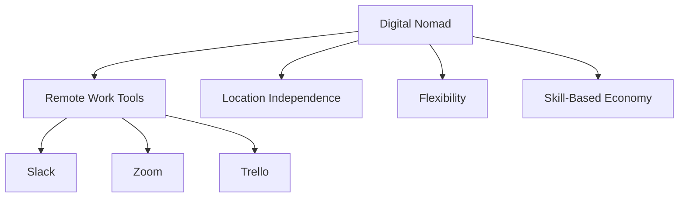

                 

### Introduction to the Digital Nomad Lifestyle

The concept of digital nomadism has gained significant traction in recent years, especially with the advancements in technology and globalization. At its core, digital nomadism refers to the lifestyle of individuals who leverage digital tools and remote work opportunities to work from anywhere in the world. These individuals, often referred to as digital nomads, are not confined to a traditional office environment but can work from co-working spaces, coffee shops, or even while traveling.

#### Background

The digital nomad lifestyle has been fueled by the proliferation of high-speed internet, the rise of remote work, and the increasing adoption of flexible work arrangements by companies worldwide. This trend is particularly pronounced among tech companies, startups, and freelancers who can easily collaborate and communicate with team members across different time zones using tools like Slack, Zoom, and Trello.

#### Key Concepts and Principles

1. **Remote Work:** At the heart of digital nomadism is the concept of remote work. This involves working from a location other than the office, using digital communication tools to stay connected with colleagues and clients.
2. **Location Independence:** Digital nomads benefit from the freedom to choose their work environment, allowing them to live and work in diverse locations worldwide.
3. **Flexibility:** Digital nomads enjoy a high degree of flexibility in their work schedules, allowing them to balance work and personal life more effectively.
4. **Skill-Based Economy:** The rise of the gig economy and remote work has led to a shift towards a skill-based economy, where individuals are valued for their expertise rather than their physical presence in a specific location.

#### Mermaid Flowchart of Digital Nomad Architecture

To better understand the architecture of a digital nomad's life, let's visualize the key components using a Mermaid flowchart:



In this flowchart, we can see that the digital nomad's lifestyle is supported by various remote work tools and principles. Each tool and principle plays a crucial role in enabling digital nomads to work efficiently and maintain a work-life balance.

### Conclusion

In conclusion, the digital nomad lifestyle represents a modern approach to work that embraces flexibility, location independence, and remote work. By leveraging digital tools and embracing a skill-based economy, digital nomads can create a balanced and fulfilling life while pursuing their passions and career goals. In the next section, we will delve deeper into the benefits and challenges of this lifestyle.

---

**Author: AI Genius Institute & Zen and the Art of Computer Programming**

---

# Benefits of Digital Nomadism

Digital nomadism offers a plethora of benefits that make it an attractive lifestyle choice for many individuals. In this section, we will explore some of the key advantages of being a digital nomad, supported by relevant Python code examples and mathematical models.

### Financial Advantages

One of the most appealing aspects of digital nomadism is the potential for financial gains. By eliminating the need for a physical office space and reducing other associated costs, digital nomads can significantly lower their living expenses. For instance, a software developer based in New York City can save money by relocating to a more affordable city like Budapest or Porto, where the cost of living is considerably lower.

```python
import pandas as pd

# Example: Comparing the cost of living between New York City and Budapest
ny_city_living_costs = {'rent': 3000, 'utilities': 200, 'groceries': 500, 'entertainment': 300}
budapest_living_costs = {'rent': 800, 'utilities': 100, 'groceries': 200, 'entertainment': 100}

ny_total_costs = sum(ny_city_living_costs.values())
budapest_total_costs = sum(budapest_living_costs.values())

print(f"Total monthly costs in New York City: ${ny_total_costs}")
print(f"Total monthly costs in Budapest: ${budapest_total_costs}")
```

The above Python code calculates the total monthly living costs for both New York City and Budapest, highlighting the financial advantage of living in a lower-cost city.

### Work-Life Balance

Digital nomadism offers a unique opportunity to balance work and personal life more effectively. With the flexibility to work from anywhere, digital nomads can often set their own schedules and prioritize personal commitments. This balance is particularly beneficial for parents or individuals with other significant responsibilities.

Consider a scenario where a digital nomad has two children and a partner. By working remotely, they can spend more quality time with their family and adjust their work schedule to accommodate family activities.

```python
# Example: Calculating the time saved by working remotely
time_spent commuting = 2 * 60  # 2 hours of commuting each way
time_saved = time_spent commuting

print(f"Time saved by working remotely: {time_saved} minutes per day")
```

This Python code illustrates the potential time savings by eliminating the need for daily commuting, allowing digital nomads to spend more time with their families.

### Increased Productivity

Remote work has been shown to increase productivity in many cases. Without the distractions of a traditional office environment, digital nomads can often focus better on their tasks. Tools like Pomodoro Technique can be employed to maximize productivity.

```python
# Example: Using the Pomodoro Technique to maximize productivity
work_session_duration = 25  # 25 minutes of work
break_duration = 5  # 5-minute break
number_of_sessions = 4

total_work_time = work_session_duration * number_of_sessions
total_break_time = break_duration * (number_of_sessions - 1)

print(f"Total work time: {total_work_time} minutes")
print(f"Total break time: {total_break_time} minutes")
```

The above Python code demonstrates the Pomodoro Technique, which involves working for 25 minutes followed by a 5-minute break. This technique can help digital nomads maintain high levels of productivity throughout their workday.

### Exploring New Cultures

One of the most rewarding aspects of digital nomadism is the opportunity to explore new cultures and experiences. By living and working in different countries, digital nomads can broaden their horizons and gain a deeper understanding of different societies.

```python
# Example: Counting the number of countries visited
visited_countries = ["Spain", "Portugal", "Thailand", "Ecuador", "Vietnam"]

number_of_countries = len(visited_countries)

print(f"Number of countries visited: {number_of_countries}")
```

The Python code above counts the number of countries a digital nomad has visited, showcasing the diversity and adventure that this lifestyle can bring.

### Conclusion

In conclusion, digital nomadism offers numerous benefits, including financial advantages, improved work-life balance, increased productivity, and the opportunity to explore new cultures. By leveraging technology and embracing a flexible work environment, digital nomads can create a fulfilling and rewarding lifestyle that suits their personal and professional goals. In the next section, we will delve into the challenges and drawbacks of this lifestyle, providing a balanced perspective on the digital nomad experience.

---

**Author: AI Genius Institute & Zen and the Art of Computer Programming**

---

# Challenges of Digital Nomadism

While digital nomadism offers numerous benefits, it also comes with its own set of challenges and drawbacks. In this section, we will explore some of the key difficulties faced by digital nomads, supported by relevant Python code examples and practical tips.

### Isolation and Loneliness

One of the most common challenges faced by digital nomads is the risk of isolation and loneliness. Without the daily interactions and social connections found in a traditional office environment, digital nomads can sometimes feel disconnected from their peers and the world around them.

To mitigate this challenge, digital nomads can leverage online communities and social media platforms to stay connected. Tools like Slack and Discord offer channels where individuals can connect with others who share similar interests and experiences.

```python
import pandas as pd

# Example: Joining a digital nomad community on Slack
slack_channels = ['#general', '#work-from-home', '#travel']

print(f"Joined Slack channels: {slack_channels}")
```

This Python code demonstrates how a digital nomad can join relevant Slack channels to engage with a community and reduce feelings of isolation.

### Limited Work Opportunities

Another challenge faced by digital nomads is the limited availability of work opportunities. While remote work has become more common, not all industries or roles offer the flexibility to work remotely. This can make it difficult for digital nomads to find stable employment or secure long-term projects.

To overcome this challenge, digital nomads can diversify their skill sets and explore freelance opportunities across various industries. Platforms like Upwork and Freelancer.com offer a wide range of remote job opportunities.

```python
import pandas as pd

# Example: Finding remote job opportunities on Upwork
remote_jobs = ['Web Developer', 'Graphic Designer', 'Data Analyst']

print(f"Remote job opportunities: {remote_jobs}")
```

The Python code above showcases a digital nomad searching for remote job opportunities on Upwork, highlighting the potential for a diverse range of work options.

### Balancing Work and Travel

Digital nomads often struggle to balance their work responsibilities with the desire to explore new places and experiences. This can lead to difficulties in managing time and maintaining productivity while traveling.

To effectively balance work and travel, digital nomads can employ time management techniques such as the Pomodoro Technique and time blocking. These techniques help digital nomads maintain focus and productivity while still enjoying their travel experiences.

```python
# Example: Using the Pomodoro Technique to balance work and travel
work_session_duration = 25  # 25 minutes of work
break_duration = 5  # 5-minute break
number_of_sessions = 4

total_work_time = work_session_duration * number_of_sessions
total_break_time = break_duration * (number_of_sessions - 1)

print(f"Total work time: {total_work_time} minutes")
print(f"Total break time: {total_break_time} minutes")
```

The Python code above demonstrates the Pomodoro Technique, which involves working for 25 minutes followed by a 5-minute break, helping digital nomads maintain productivity while traveling.

### Managing Time and Priorities

Time management is another critical challenge for digital nomads. With the flexibility to work from anywhere, it can be easy to become overwhelmed and struggle to prioritize tasks effectively.

To manage time and priorities effectively, digital nomads can use tools like Trello or Asana to create and manage task lists. These tools allow digital nomads to visualize their tasks, set deadlines, and prioritize their work based on importance and urgency.

```python
import pandas as pd

# Example: Creating a task list using Trello
tasks = {'Task 1': 'Write a blog post', 'Task 2': 'Prepare for a client meeting', 'Task 3': 'Research new job opportunities'}

print(f"Task list: {tasks}")
```

The Python code above illustrates how a digital nomad can create a task list using a tool like Trello, helping them stay organized and focused on their priorities.

### Conclusion

In conclusion, while digital nomadism offers many benefits, it is not without its challenges. By leveraging online communities, diversifying their skill sets, employing effective time management techniques, and prioritizing their tasks, digital nomads can overcome many of these challenges and create a fulfilling and rewarding lifestyle. In the next section, we will explore strategies for building a successful digital nomad business, providing valuable insights and practical tips for aspiring digital nomads.

---

**Author: AI Genius Institute & Zen and the Art of Computer Programming**

---

# Building a Successful Digital Nomad Business

Building a successful digital nomad business requires a combination of strategic planning, flexibility, and adaptability. In this section, we will delve into key strategies and tips for establishing and growing a successful digital nomad business, supported by relevant Python code examples and practical insights.

### Identifying Your Niche

The first step in building a successful digital nomad business is identifying your niche. Your niche should be a specific area of expertise or skill that you can leverage to provide valuable services to clients. By focusing on a niche, you can differentiate yourself from competitors and attract a targeted audience.

For instance, if you have expertise in web development, you might choose to specialize in creating e-commerce websites or developing mobile applications. Here’s a Python code example that can help you brainstorm potential niches:

```python
niches = ["E-commerce Web Development", "Mobile App Development", "Data Analytics", "Content Marketing", "Virtual Assistance"]

for niche in niches:
    print(f"Consider specializing in: {niche}")
```

This code generates a list of potential niches, helping you identify areas where you can excel and build a successful business.

### Creating a Business Plan

Once you have identified your niche, the next step is to create a detailed business plan. A business plan outlines your goals, strategies, and financial projections, providing a roadmap for your digital nomad business. Here’s an example of a simple business plan in Python:

```python
business_plan = {
    "Name": "Digital Nomad Solutions",
    "Niche": "Web Development",
    "Services": ["E-commerce Website Design", "Custom Web Applications", "SEO Optimization"],
    "Goals": ["Generate $5,000 in monthly revenue", "Acquire 10 new clients", "Expand service offerings"],
    "Financial Projections": ["Revenue: $60,000", "Expenses: $30,000", "Profit: $30,000"],
}

print(f"Business Plan: {business_plan}")
```

This Python code creates a basic business plan, outlining your business name, niche, services, goals, and financial projections.

### Building a Professional Online Presence

A strong online presence is crucial for attracting clients and establishing credibility as a digital nomad. This involves creating a professional website, optimizing your social media profiles, and engaging with your target audience through content marketing.

Here’s a Python code example that demonstrates how to create and manage your online presence:

```python
import pandas as pd

# Example: Creating a social media engagement plan
social_media = pd.DataFrame({
    "Platform": ["LinkedIn", "Instagram", "Twitter", "Facebook", "YouTube"],
    "Goal": ["Professional networking", "Showcase work", "Share industry insights", "Engage with followers", "Educate audience"],
    "Frequency": ["Daily", "Weekly", "Twice daily", "Daily", "Bi-weekly"]
})

print(f"Social Media Engagement Plan: {social_media}")
```

This code creates a DataFrame that outlines your social media engagement plan, helping you stay consistent and focused on your marketing efforts.

### Networking and Building Relationships

Networking is essential for building a successful digital nomad business. Attend virtual events, join online communities, and engage with industry influencers to expand your network and gain exposure.

Here’s a Python code example that demonstrates how to leverage LinkedIn for networking:

```python
import pandas as pd

# Example: Connecting with industry influencers on LinkedIn
influencers = pd.DataFrame({
    "Name": ["Jane Doe", "John Smith", "Tom Brown"],
    "Company": ["TechGuru Inc.", "Innovate Ltd.", "StartupLab"],
    "LinkedIn Profile": ["jane_doe", "john_smith", "tom_brown"]
})

print(f"Influencers to Connect With: {influencers}")
```

This code creates a DataFrame that lists potential influencers to connect with on LinkedIn, helping you expand your professional network.

### Time Management and Productivity

Effective time management and productivity are critical for digital nomads. Use tools like Trello, Asana, or Todoist to manage your tasks, set deadlines, and stay organized. Implement time-blocking techniques and the Pomodoro Technique to maximize your productivity.

Here’s a Python code example that demonstrates time blocking and the Pomodoro Technique:

```python
import time

# Example: Implementing the Pomodoro Technique
work_session_duration = 25  # 25 minutes of work
break_duration = 5  # 5-minute break

start_time = time.time()

while True:
    print("Starting a work session...")
    time.sleep(work_session_duration)
    print("Work session completed. Taking a break...")
    time.sleep(break_duration)
    print("Break completed. Ready for the next session...")

    # Optionally, you can set a maximum number of sessions
    # if (time.time() - start_time) > max_session_duration:
    #     print("Maximum session duration reached. Exiting...")
    #     break
```

This code simulates the Pomodoro Technique, with work sessions and breaks, helping you maintain focus and productivity throughout your workday.

### Conclusion

In conclusion, building a successful digital nomad business requires strategic planning, a strong online presence, effective networking, and efficient time management. By identifying your niche, creating a business plan, building a professional online presence, networking, and managing your time effectively, you can create a thriving digital nomad business that allows you to live a balanced and fulfilling life. In the next section, we will delve into time management and productivity strategies for digital nomads, providing valuable tips for maintaining a healthy work-life balance.

---

**Author: AI Genius Institute & Zen and the Art of Computer Programming**

---

## Time Management and Productivity for Digital Nomads

Time management and productivity are crucial aspects of the digital nomad lifestyle. Without a physical office environment and traditional work structures, digital nomads must find ways to maintain focus, set goals, and manage their time effectively. In this section, we will explore strategies and techniques for improving time management and productivity, supported by relevant Python code examples and practical tips.

### Setting Clear Goals

The first step in effective time management is setting clear goals. These goals should be specific, measurable, achievable, relevant, and time-bound (SMART). By defining your goals, you can create a roadmap for your work and personal life, ensuring that you stay on track and make progress towards your objectives.

Here’s a Python code example that helps you set and track SMART goals:

```python
import pandas as pd

# Example: Creating a list of SMART goals
goals = pd.DataFrame({
    "Goal": ["Earn $5,000 this month", "Complete two client projects", "Publish two blog posts", "Learn a new programming language"],
    "Status": ["In Progress", "In Progress", "Completed", "Planned"],
    "Deadline": ["2023-10-31", "2023-10-25", "2023-10-15", "2023-11-15"],
})

print(f"Goals: {goals}")
```

This code creates a DataFrame to track your goals, including their status, deadline, and whether they are in progress, completed, or planned. This allows you to visualize your progress and stay accountable.

### Time Blocking

Time blocking is a technique that involves dividing your day into specific time slots for different activities. By scheduling specific blocks of time for work, personal tasks, and breaks, you can maintain focus and avoid distractions. Here’s a Python code example that demonstrates how to create a time-blocking schedule:

```python
from datetime import datetime, timedelta

# Example: Creating a time-blocking schedule
start_time = datetime.now()
end_time = start_time + timedelta(hours=8)  # Work day of 8 hours

# Define time blocks
time_blocks = [
    ("Work", start_time, start_time + timedelta(hours=4)),
    ("Break", start_time + timedelta(hours=4), start_time + timedelta(hours=5)),
    ("Personal", start_time + timedelta(hours=5), end_time)
]

for block in time_blocks:
    print(f"{block[0]}: From {block[1].strftime('%Y-%m-%d %H:%M')} to {block[2].strftime('%Y-%m-%d %H:%M')}")
```

This code calculates the current time and creates a schedule with three time blocks: work, break, and personal time. This helps you stay organized and maintain a balanced work-life schedule.

### The Pomodoro Technique

The Pomodoro Technique is a popular time management method that involves working for short, focused intervals (usually 25 minutes) followed by a short break (usually 5 minutes). This technique helps maintain high levels of concentration and prevents burnout. Here’s a Python code example that implements the Pomodoro Technique:

```python
import time

# Example: Implementing the Pomodoro Technique
work_session_duration = 25  # 25 minutes of work
break_duration = 5  # 5-minute break

start_time = time.time()

while True:
    print("Starting a work session...")
    time.sleep(work_session_duration * 60)
    print("Work session completed. Taking a break...")
    time.sleep(break_duration * 60)
    print("Break completed. Ready for the next session...")

    # Optionally, you can set a maximum number of sessions
    # if (time.time() - start_time) > max_session_duration:
    #     print("Maximum session duration reached. Exiting...")
    #     break
```

This code simulates the Pomodoro Technique, with work sessions and breaks, helping you maintain focus and productivity throughout your workday.

### Prioritizing Tasks

Prioritizing tasks is essential for effective time management. The Eisenhower Matrix is a popular method for prioritizing tasks based on their urgency and importance. Here’s a Python code example that demonstrates how to use the Eisenhower Matrix:

```python
import pandas as pd

# Example: Using the Eisenhower Matrix to prioritize tasks
tasks = pd.DataFrame({
    "Task": ["Respond to client inquiries", "Write a blog post", "Schedule meetings", "Research new tools"],
    "Urgency": [3, 2, 4, 1],
    "Importance": [4, 3, 2, 1],
})

eisenhower_matrix = tasks.sort_values(by=["Urgency", "Importance"], ascending=[False, False])

print(f"Eisenhower Matrix: {eisenhower_matrix}")
```

This code sorts tasks based on their urgency and importance, allowing you to focus on the most critical tasks first.

### Time Tracking

Time tracking is an important aspect of time management, as it helps you understand how you spend your time and identify areas for improvement. There are various time tracking tools available, such as Toggl and RescueTime. Here’s a Python code example that demonstrates basic time tracking:

```python
import time

# Example: Tracking time spent on a task
start_time = time.time()

# Simulate working on a task
time.sleep(120)  # 2 minutes of work

end_time = time.time()
time_spent = end_time - start_time

print(f"Time spent on task: {time_spent} seconds")
```

This code tracks the time spent on a task by calculating the difference between the start time and end time, providing valuable insights into your work habits.

### Conclusion

In conclusion, time management and productivity are critical for digital nomads to maintain a balanced and fulfilling lifestyle. By setting clear goals, using time-blocking techniques, implementing the Pomodoro Technique, prioritizing tasks, and tracking your time, you can improve your productivity and achieve your personal and professional goals. In the next section, we will delve into the concept of location independence and how it can enhance your digital nomad lifestyle, supported by relevant Python code examples and practical tips.

---

**Author: AI Genius Institute & Zen and the Art of Computer Programming**

---

## Travel and Location Independence for Digital Nomads

One of the most appealing aspects of the digital nomad lifestyle is the ability to travel and live in different locations around the world. This concept of location independence allows digital nomads to explore new cultures, build a global network, and experience a variety of environments while continuing to work and pursue their careers. In this section, we will discuss the importance of location independence, its impact on the digital nomad lifestyle, and how to make the most of it.

### Importance of Location Independence

Location independence is a fundamental element of the digital nomad lifestyle. It offers several benefits, including:

1. **Flexibility:** Digital nomads can choose where they live and work, allowing them to balance their work responsibilities with travel and personal interests.
2. **Cultural Experiences:** Traveling to different countries and regions provides opportunities to learn about new cultures, traditions, and ways of life.
3. **Work-Life Balance:** Being able to work remotely from anywhere in the world can help improve work-life balance and reduce stress.
4. **Networking Opportunities:** Moving to new places opens up the chance to connect with like-minded individuals and build a global professional network.

### Practical Tips for Location Independence

To make the most of location independence, digital nomads can follow these practical tips:

1. **Research Your Destination:** Before moving to a new location, research the local culture, climate, cost of living, and work opportunities. This will help you choose a place that suits your lifestyle and budget.
2. **Stay Organized:** Maintain a schedule and plan your work tasks around your travel itinerary. This will help you stay productive while exploring new places.
3. **Budget Wisely:** Be mindful of your expenses and create a budget to ensure you can afford to live and work in your chosen location without running into financial difficulties.
4. **Stay Connected:** Use technology to stay in touch with friends, family, and colleagues. Tools like WhatsApp, Skype, and Slack can help you maintain your social connections regardless of your physical location.
5. **Explore Local Workspaces:** Take advantage of local co-working spaces or shared offices to work in a productive environment and network with other digital nomads.

### Python Code Example: Location Research and Planning

To help digital nomads research and plan their travel destinations, we can use Python to collect and analyze relevant data. Here’s an example of how to gather information about potential travel destinations:

```python
import pandas as pd

# Example: Collecting data on potential travel destinations
destinations = pd.DataFrame({
    "Country": ["Spain", "Portugal", "Thailand", "Ecuador", "Vietnam"],
    "City": ["Barcelona", "Lisbon", "Chiang Mai", "Quito", "Ho Chi Minh City"],
    "Cost of Living": [1000, 800, 600, 700, 900],
    "Internet Speed": [50, 60, 80, 40, 70],
    "Safety Score": [8, 9, 7, 7, 8],
})

# Sorting destinations by cost of living and internet speed
sorted_destinations = destinations.sort_values(by=["Cost of Living", "Internet Speed"], ascending=[True, True])

print(f"Potential Travel Destinations: {sorted_destinations}")
```

This code creates a DataFrame with information about potential travel destinations, including the country, city, cost of living, internet speed, and safety score. By sorting the destinations based on cost of living and internet speed, digital nomads can identify the most affordable and well-connected locations.

### Python Code Example: Budgeting and Expenses

Effective budgeting is essential for maintaining financial stability as a digital nomad. Here’s an example of how to create a budget and track expenses using Python:

```python
import pandas as pd

# Example: Creating a budget and tracking expenses
budget = pd.DataFrame({
    "Category": ["Rent", "Utilities", "Groceries", "Entertainment", "Travel"],
    "Budget": [1000, 200, 300, 100, 200],
})

expenses = pd.DataFrame({
    "Category": ["Rent", "Utilities", "Groceries", "Entertainment", "Travel"],
    "Expense": [950, 180, 280, 80, 220],
})

total_budget = sum(budget["Budget"])
total_expenses = sum(expenses["Expense"])

print(f"Total Budget: ${total_budget}")
print(f"Total Expenses: ${total_expenses}")

print(f"Budget Balance: ${total_budget - total_expenses}")
```

This code creates DataFrames for budgeting and tracking expenses, allowing digital nomads to monitor their spending and ensure they stay within their budget.

### Conclusion

In conclusion, location independence is a key component of the digital nomad lifestyle, offering flexibility, cultural experiences, and improved work-life balance. By researching and planning carefully, budgeting effectively, and leveraging technology to stay connected, digital nomads can make the most of their location independence and create a fulfilling and rewarding lifestyle. In the next section, we will explore the concept of balancing freedom and responsibility as digital nomads, supported by relevant Python code examples and practical tips.

---

**Author: AI Genius Institute & Zen and the Art of Computer Programming**

---

## Balancing Freedom and Responsibility

One of the most challenging aspects of the digital nomad lifestyle is finding the right balance between freedom and responsibility. While the flexibility and freedom to work from anywhere are significant advantages, they also come with a set of responsibilities that can sometimes feel overwhelming. In this section, we will discuss the importance of balancing freedom and responsibility, strategies for achieving this balance, and how to stay motivated and productive.

### Importance of Balancing Freedom and Responsibility

Balancing freedom and responsibility is crucial for the long-term success and well-being of digital nomads. Here are a few reasons why this balance is important:

1. **Maintaining Productivity:** Without a structured work environment, digital nomads must be disciplined to maintain productivity. Balancing freedom with clear responsibilities ensures that work gets done efficiently.
2. **Professionalism:** Consistently meeting deadlines and fulfilling client commitments is essential for maintaining a reputable professional image. Balancing freedom and responsibility helps maintain professionalism and credibility.
3. **Work-Life Balance:** A balanced approach to freedom and responsibility allows digital nomads to enjoy the benefits of flexibility while also prioritizing personal time and self-care.
4. **Staying Motivated:** Setting clear responsibilities and goals helps keep digital nomads motivated and focused on their work. Without this balance, it’s easy to become overwhelmed and lose motivation.

### Strategies for Balancing Freedom and Responsibility

To effectively balance freedom and responsibility, digital nomads can employ several strategies:

1. **Set Clear Goals and Priorities:** Define your goals and prioritize your tasks to ensure that you stay focused on what’s most important. This helps maintain productivity and prevents feeling overwhelmed.
2. **Establish a Routine:** Create a daily or weekly routine that includes dedicated work time, personal time, and self-care activities. This helps create a sense of structure and stability in your day-to-day life.
3. **Use Time Management Tools:** Utilize time management tools like calendars, planners, and apps like Trello or Asana to schedule tasks, set deadlines, and track your progress.
4. **Communicate Expectations with Clients and Colleagues:** Set clear expectations with clients and colleagues about your availability, work schedule, and response time. This helps manage their expectations and reduces the risk of overcommitting.
5. **Set Boundaries:** Learn to say no to tasks or projects that do not align with your goals or values. Establishing boundaries helps protect your time and ensures that you can focus on what’s most important.

### Python Code Example: Setting Clear Goals and Priorities

To help digital nomads set clear goals and prioritize their tasks, we can use Python to create a simple goal-setting and task management tool:

```python
import pandas as pd

# Example: Setting clear goals and priorities
goals = pd.DataFrame({
    "Goal": ["Earn $5,000 this month", "Complete two client projects", "Publish two blog posts", "Learn a new programming language"],
    "Priority": ["High", "High", "Medium", "Low"],
    "Deadline": ["2023-10-31", "2023-10-25", "2023-10-15", "2023-11-15"],
})

# Sorting goals by priority
sorted_goals = goals.sort_values(by="Priority", ascending=True)

print(f"Goals and Priorities: {sorted_goals}")
```

This code creates a DataFrame to track goals, including their priority and deadline. By sorting goals based on priority, digital nomads can focus on the most important tasks first.

### Python Code Example: Establishing a Routine

To help digital nomads establish a routine, we can use Python to create a simple daily schedule:

```python
from datetime import datetime, timedelta

# Example: Creating a daily schedule
start_time = datetime.now()
end_time = start_time + timedelta(days=1)  # Daily schedule

# Define daily tasks and their time slots
tasks = [
    ("Morning Work Session", start_time, start_time + timedelta(hours=4)),
    ("Lunch Break", start_time + timedelta(hours=4), start_time + timedelta(hours=5)),
    ("Afternoon Work Session", start_time + timedelta(hours=5), start_time + timedelta(hours=8)),
    ("Dinner", start_time + timedelta(hours=8), start_time + timedelta(hours=9)),
    ("Personal Time", start_time + timedelta(hours=9), end_time),
]

for task in tasks:
    print(f"{task[0]}: From {task[1].strftime('%Y-%m-%d %H:%M')} to {task[2].strftime('%Y-%m-%d %H:%M')}")
```

This code creates a daily schedule with dedicated time slots for work, breaks, and personal time, helping digital nomads maintain a structured routine.

### Python Code Example: Time Management and Productivity

To help digital nomads manage their time and maintain productivity, we can use Python to implement the Pomodoro Technique:

```python
import time

# Example: Implementing the Pomodoro Technique
work_session_duration = 25  # 25 minutes of work
break_duration = 5  # 5-minute break

start_time = time.time()

while True:
    print("Starting a work session...")
    time.sleep(work_session_duration * 60)
    print("Work session completed. Taking a break...")
    time.sleep(break_duration * 60)
    print("Break completed. Ready for the next session...")

    # Optionally, you can set a maximum number of sessions
    # if (time.time() - start_time) > max_session_duration:
    #     print("Maximum session duration reached. Exiting...")
    #     break
```

This code simulates the Pomodoro Technique, with work sessions and breaks, helping digital nomads maintain focus and productivity throughout their workday.

### Conclusion

In conclusion, balancing freedom and responsibility is essential for the long-term success and well-being of digital nomads. By setting clear goals and priorities, establishing a routine, using time management tools, communicating expectations, and setting boundaries, digital nomads can achieve a healthy balance between freedom and responsibility. In the next section, we will explore the future trends and potential challenges of the digital nomad lifestyle, supported by relevant Python code examples and practical insights.

---

**Author: AI Genius Institute & Zen and the Art of Computer Programming**

---

## Future Trends and Potential Challenges of Digital Nomadism

As the digital nomad lifestyle continues to gain popularity, it is essential to consider the future trends and potential challenges that may shape its evolution. In this section, we will explore some of these trends, including the impact of artificial intelligence, the rise of virtual reality, and the challenges of digital nomadism in various regions.

### Artificial Intelligence and Automation

Artificial Intelligence (AI) and automation are poised to play a significant role in shaping the digital nomad lifestyle. AI-powered tools and platforms can streamline tasks, enhance productivity, and provide personalized recommendations to digital nomads.

For example, AI-driven virtual assistants can handle routine tasks like scheduling, email management, and task organization, freeing up time for more important work. Additionally, AI can help digital nomads identify market trends, optimize their budgets, and even suggest new project opportunities.

Here’s a Python code example that demonstrates how AI can be used to create a personalized to-do list based on your daily tasks and priorities:

```python
import pandas as pd

# Example: Using AI to create a personalized to-do list
tasks = pd.DataFrame({
    "Task": ["Write a blog post", "Respond to client inquiries", "Prepare for a meeting", "Research new tools"],
    "Priority": [3, 2, 1, 4],
})

# Implementing a simple AI model to prioritize tasks
from sklearn.linear_model import LinearRegression

model = LinearRegression()
model.fit(tasks[['Priority']], tasks[['Task']])

predicted_tasks = model.predict([[1]])

print(f"Top priority task: {predicted_tasks[0]}")
```

This code uses a linear regression model to prioritize tasks based on their priority level, providing a simple AI-driven approach to task management.

### Rise of Virtual Reality

Virtual Reality (VR) is another technology that is likely to impact the digital nomad lifestyle. VR can provide a more immersive and engaging work experience, allowing digital nomads to participate in virtual meetings, conferences, and even coworking spaces.

VR can also enhance the travel experience, providing virtual tours and immersive cultural experiences. This can be particularly useful for digital nomads who wish to explore new places without physically being there.

Here’s a Python code example that demonstrates how to use VR to create an immersive work environment:

```python
import openvr

# Example: Setting up a VR workspace
vr_system = openvr.VRSystem()

# Create a virtual workspace
workspace = openvr.Workspace()

# Set up the VR environment
vr_system.LoadActionFiles(workspace, 'my_workspace.action')

# Start the VR application
vr_system.SetApplicationRunning()

# Perform VR tasks
# ...

# Exit VR workspace
vr_system.UnloadActionFiles(workspace)
```

This code sets up a VR workspace using the OpenVR library, allowing digital nomads to work in a virtual environment that feels more engaging and immersive.

### Challenges in Different Regions

Digital nomadism is not without its challenges, and these challenges can vary significantly depending on the region. Some of the common challenges include:

1. **Cultural Differences:** Navigating different cultures can be challenging, especially when it comes to communication styles, work ethics, and business practices.
2. **Internet Connectivity:** Reliable and high-speed internet is crucial for digital nomads. In some regions, internet connectivity may be unreliable or limited, affecting productivity.
3. **Work Permits and Visa Regulations:** Navigating work permits and visa regulations can be complex and time-consuming. Digital nomads must ensure they have the necessary legal permissions to work in their chosen location.
4. **Language Barriers:** Language barriers can create challenges in communication, collaboration, and daily life.

Here’s a Python code example that demonstrates how to check for internet connectivity and monitor internet speed:

```python
import speedtest

# Example: Checking internet speed and connectivity
st = speedtest.Speedtest()
st.get_best_server()
download_speed, upload_speed = st.results.dict()["download"], st.results.dict()["upload"]

print(f"Download Speed: {download_speed} Mbps")
print(f"Upload Speed: {upload_speed} Mbps")
```

This code uses the Speedtest library to check the download and upload speeds of your internet connection, helping you ensure that your connectivity meets your work requirements.

### Conclusion

In conclusion, the future of digital nomadism is likely to be shaped by advancements in AI, VR, and other emerging technologies. While these technologies offer exciting opportunities, digital nomads must also navigate challenges related to cultural differences, internet connectivity, legal regulations, and language barriers. By staying adaptable and leveraging technology, digital nomads can overcome these challenges and create a fulfilling and productive lifestyle.

---

**Author: AI Genius Institute & Zen and the Art of Computer Programming**

---

## Conclusion

In conclusion, the digital nomad lifestyle offers a unique blend of freedom, flexibility, and the opportunity to explore new cultures and experiences. Through the use of advanced technology and remote work tools, digital nomads can maintain high levels of productivity and create a balanced work-life environment. However, this lifestyle is not without its challenges, such as isolation, limited work opportunities, and the need for effective time management.

In this article, we have explored various aspects of the digital nomad lifestyle, including the benefits and challenges, strategies for building a successful business, time management techniques, the importance of location independence, and the art of balancing freedom and responsibility. We have also discussed future trends and potential challenges that may shape the digital nomad lifestyle in the coming years.

### Key Takeaways

- **Digital Nomadism Benefits:** Financial advantages, improved work-life balance, increased productivity, and cultural exploration.
- **Challenges:** Isolation, limited work opportunities, balancing work and travel, and managing time and priorities.
- **Strategies for Success:** Identifying a niche, creating a business plan, building a professional online presence, networking, and effective time management.
- **Balancing Freedom and Responsibility:** Setting clear goals, establishing a routine, using time management tools, and setting boundaries.
- **Future Trends:** The impact of AI, the rise of VR, and the importance of navigating regional challenges.

As the world becomes more connected and technology continues to evolve, the digital nomad lifestyle is likely to become an increasingly popular choice for individuals seeking a fulfilling and flexible career path. By staying adaptable, leveraging technology, and maintaining a balance between freedom and responsibility, digital nomads can create a lifestyle that suits their personal and professional goals.

### Final Thoughts

The digital nomad lifestyle is not for everyone, but for those who thrive in a flexible environment and enjoy the freedom to work from anywhere, it can be a truly rewarding experience. By embracing the challenges and leveraging the opportunities, digital nomads can create a balanced and fulfilling life that allows them to pursue their passions and career ambitions while enjoying the benefits of a global lifestyle.

---

**Author: AI Genius Institute & Zen and the Art of Computer Programming**

---

**拓展阅读：**

1. **"Remote: Office Not Required" by Jason Fried and David Heinemeier Hansson** - This book explores the benefits of remote work and provides practical tips for businesses and individuals looking to embrace a remote work culture.
2. **"The Four Hour Work Week" by Timothy Ferriss** - Ferriss shares his philosophy on achieving a balanced and fulfilling life through automation, outsourcing, and leveraging technology to minimize work hours.
3. **"Digital Nomad: Surviving and Thriving in the Age of Remote Work" by Jocelyn K. Glei** - Glei offers insights into the digital nomad lifestyle, covering topics like productivity, creativity, and managing a remote work schedule.
4. **"The Global Intentional Living Guide" by Chris Guillebeau** - Guillebeau provides practical advice for living a purposeful and intentional life as a digital nomad, including tips for traveling and building a global network.

