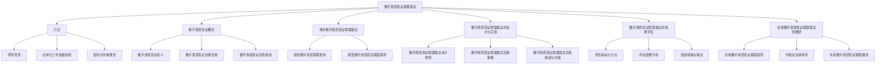

                 

## 第1章 引言

### 1.1 研究背景

数字游民现象的兴起，是全球化工作趋势下的一种新兴职业形态。数字游民，指的是那些利用互联网从事远程工作，不受传统办公场所限制的人群。随着移动互联网、云计算和远程协作工具的普及，越来越多的工作者选择在异国他乡工作，成为数字游民。

全球化的工作趋势推动了远程工作和数字化办公的普及。企业和工作者通过互联网跨越地理界限，实现了资源的优化配置和效率的提升。在这种背景下，数字游民签证作为一种政策工具，应运而生。

国际合作在全球化的背景下变得尤为重要。随着全球化的深入，各国在经济发展、科技创新和文化交流等方面需要更紧密的合作。数字游民签证联盟倡议，旨在通过国际合作，推动全球数字化工作的深入发展。

### 1.2 研究目的与意义

研究目的：
1. 分析数字游民现象的兴起原因及其发展趋势。
2. 研究全球化和远程工作对国际经济和社会的影响。
3. 探讨数字游民签证联盟倡议的设计原则和实施策略。
4. 评估数字游民签证联盟倡议的效果及其未来发展趋势。

研究意义：
1. 为政府和企业提供政策制定和战略决策的参考。
2. 促进国际间的经济合作和文化交流。
3. 推动全球数字化工作的健康发展。

### 1.3 研究方法与结构安排

研究方法：
1. 文献综述：通过查阅相关文献，了解数字游民现象和数字游民签证联盟的研究现状。
2. 案例分析：选取具有代表性的数字游民签证联盟案例，进行深入分析。
3. 实证研究：通过问卷调查和访谈等方式，收集数据，分析数字游民签证联盟的实际效果。

结构安排：
本章节主要分为以下三个部分：
1. 引言：介绍研究背景、目的和意义。
2. 数字游民签证概述：定义数字游民签证，分析其法律法规和优势挑战。
3. 现存数字游民签证联盟倡议：介绍当前的国际数字游民联盟倡议，分析典型案例。

## 第2章 数字游民签证概述

### 2.1 数字游民签证的定义

数字游民签证，是指为那些从事远程工作、不受固定办公场所限制的人群提供的一种签证类型。这类签证的主要目的是允许个人在某个国家合法居住和从事远程工作，从而促进国际间的经济和文化交流。

数字游民签证与传统的工作签证相比，具有以下几个特点：
1. 无需固定的工作合同和办公场所，只需通过网络远程工作即可。
2. 居留时间通常较短，一般为1-2年，但也有部分国家提供长期签证。
3. 适用范围较广，不仅限于特定行业，几乎所有远程工作都可申请。

### 2.2 数字游民签证的法律法规

#### 国外数字游民签证政策

不同国家对数字游民签证的政策有所不同，但大致可以分为以下几类：

1. **电子居留许可**：如墨西哥的“远程工作签证”（Remotely Friendlies Visa）和乌拉圭的“自由职业者签证”（Freelancer Visa）。这些签证通常允许个人在一定期限内合法居留，并从事远程工作。

2. **电子工作许可**：如葡萄牙的“数字游民签证”（Digital Nomad Visa）和罗马尼亚的“自由职业者签证”（Freelancer Visa）。这些签证通常要求申请者在当地拥有一定的收入来源，并从事远程工作。

3. **长期居留许可**：如希腊的“黄金签证”（Golden Visa）和新加坡的“永久居民签证”（Permanent Resident Visa）。这些签证不仅允许个人合法居留，还可以在满足一定条件后转为永久居民。

#### 国内数字游民签证政策

中国目前尚未正式推出专门的数字游民签证政策，但部分省市已开始探索相关措施。例如：

1. **海南自由贸易港**：海南自由贸易港推出“海港高端人才卡”，为全球高端人才提供优惠的居留政策。

2. **上海**：上海推出“虚拟现实工程师”等14个数字职业的“高端人才引进计划”，为数字游民提供就业和居留机会。

### 2.3 数字游民签证的优势与挑战

#### 优势

1. **促进国际经济合作**：数字游民签证可以吸引全球人才，促进国际间的经济合作和知识交流。

2. **提高劳动力灵活性**：企业可以更容易地招聘全球范围内的优秀人才，提高劳动力的灵活性。

3. **促进文化交流**：数字游民在异国他乡工作生活，有助于促进文化交流和理解。

4. **创造就业机会**：数字游民签证可以为当地创造就业机会，带动相关产业的发展。

#### 挑战

1. **法律风险**：数字游民签证政策的不完善可能导致法律风险，例如税收问题、劳动权益保障等。

2. **文化冲突**：数字游民在异国他乡工作，可能会遇到文化冲突和适应问题。

3. **政策不确定性**：数字游民签证政策的不稳定可能影响其长期规划和发展。

4. **技术依赖**：数字游民的远程工作高度依赖网络和远程协作工具，网络故障或技术问题可能导致工作受阻。

## 第3章 现存数字游民签证联盟倡议

### 3.1 国际数字游民联盟倡议现状

全球范围内，已有多个国家和地区推出了数字游民签证政策，并形成了若干数字游民签证联盟倡议。以下是一些主要国家和地区的数字游民签证联盟倡议现状：

#### 墨西哥

墨西哥的“远程友好国计划”是一个较为成熟的数字游民签证联盟倡议。自2020年以来，墨西哥政府已经吸引了数千名数字游民，并计划在未来几年继续扩大吸引范围。

#### 葡萄牙

葡萄牙的“数字游民签证”允许申请者在葡萄牙合法居住和从事远程工作。葡萄牙因其宜人的气候、较低的生活成本和稳定的政治环境，成为数字游民的热门目的地。

#### 希腊

希腊的“黄金签证”也为数字游民提供了便利。通过在希腊购买房地产，数字游民可以获得合法居留权。此外，希腊还推出了“创业签证”，吸引全球创业者。

#### 新加坡

新加坡以其先进的科技基础设施和开放的商业环境，成为了数字游民的重要目的地。新加坡的永久居民签证政策为数字游民提供了长期居留的机会。

#### 澳大利亚

澳大利亚的“临时技术签证”和“全球人才签证”也为数字游民提供了合法居留的机会。这些签证允许申请者在澳大利亚工作，并有机会申请永久居留。

### 3.2 典型数字游民签证联盟案例

#### 案例一：葡萄牙数字游民签证联盟

葡萄牙的数字游民签证政策吸引了大量数字游民，并形成了一个较为完善的数字游民社区。以下是一些关键点：

1. **申请条件**：申请人需证明其拥有足够的收入来源，并计划在葡萄牙居住至少183天。

2. **签证期限**：签证有效期为1年，可延长至2年，最长可连续居留3年。

3. **支持政策**：葡萄牙政府为数字游民提供了税收减免、创业支持和低成本的生活环境。

4. **实际效果**：自政策实施以来，已有数千名数字游民获得签证，并带动了葡萄牙的旅游和房地产发展。

#### 案例二：希腊数字游民签证联盟

希腊的“黄金签证”政策也为数字游民提供了便利。以下是一些关键点：

1. **申请条件**：申请人需在希腊购买价值25万欧元以上的房产。

2. **签证期限**：签证有效期为5年，每次续签需再次购买房产。

3. **支持政策**：希腊政府为数字游民提供了便利的居留政策，以及高质量的生活环境。

4. **实际效果**：希腊的“黄金签证”政策吸引了大量外国投资者和数字游民，促进了当地经济的发展。

### 3.3 数字游民签证联盟倡议的启示

以上案例表明，数字游民签证联盟倡议在促进国际经济合作和文化交流方面具有显著优势。然而，要成功实施数字游民签证联盟倡议，需要考虑以下因素：

1. **政策稳定性**：政府需确保数字游民签证政策的稳定性和可预测性，以吸引和留住数字游民。

2. **支持政策**：政府应提供一系列支持政策，包括税收减免、创业支持、生活便利等，以吸引数字游民。

3. **基础设施**：良好的基础设施，尤其是网络和交通设施，是吸引数字游民的关键。

4. **文化交流**：政府应鼓励文化交流，促进数字游民与本地居民的融合，增强社区的多样性。

## 第4章 数字游民签证联盟倡议的设计与实施

### 4.1 数字游民签证联盟倡议设计原则

数字游民签证联盟倡议的设计应遵循以下原则：

1. **灵活性**：数字游民签证联盟倡议应具有足够的灵活性，以适应不同国家和地区的需求和实际情况。

2. **互惠性**：各国在制定数字游民签证联盟倡议时，应考虑到互惠性，即提供对等的服务和权益。

3. **可持续性**：数字游民签证联盟倡议应具有可持续性，确保长期吸引和留住数字游民，同时不会对当地经济和社会造成负面影响。

4. **开放性**：数字游民签证联盟倡议应保持开放性，欢迎各国加入，并共同推动全球数字化工作的深入发展。

5. **透明度**：数字游民签证联盟倡议的相关政策、标准和流程应保持透明度，便于数字游民了解和遵守。

### 4.2 数字游民签证联盟倡议实施策略

数字游民签证联盟倡议的实施策略包括以下几个方面：

1. **政策制定**：各国政府应制定详细的数字游民签证政策，明确申请条件、签证期限、支持政策等。

2. **国际合作**：各国政府应加强合作，通过签订协议、交换信息等方式，共同推动数字游民签证联盟的发展。

3. **宣传推广**：各国政府应加大对数字游民签证联盟的宣传推广力度，提高全球范围内的知名度和吸引力。

4. **服务平台**：建立数字游民签证联盟的在线服务平台，提供一站式服务，简化申请流程，提高效率。

5. **人才培养**：各国政府应加强数字技能培训，提高数字游民的素质和竞争力，为数字游民签证联盟的发展提供人才保障。

### 4.3 数字游民签证联盟倡议实施的挑战与对策

数字游民签证联盟倡议在实施过程中可能会面临以下挑战：

1. **政策协调**：各国政策的不一致可能导致协调困难，影响数字游民签证联盟的运行。

对策：建立国际协调机制，定期召开会议，讨论和解决政策协调问题。

2. **信息安全**：数字游民的工作和生活在虚拟世界中，信息安全至关重要。

对策：加强网络安全防护，提供安全培训，确保数字游民的信息安全。

3. **税务问题**：数字游民的税务问题可能复杂，需要各国政府加强合作，制定合理的税务政策。

对策：通过签订税收协定，简化税务申报和缴纳流程，确保公平合理的税务制度。

4. **文化适应**：数字游民在异国他乡生活，可能面临文化适应问题。

对策：提供文化交流活动，增强数字游民与本地居民的互动，促进文化融合。

通过以上对策，可以有效应对数字游民签证联盟倡议实施的挑战，推动全球数字化工作的深入发展。

## 第5章 数字游民签证联盟倡议的效果评估

### 5.1 评估指标与方法

数字游民签证联盟倡议的效果评估需要制定科学合理的评估指标和方法，以下是一些关键指标：

1. **签证申请数量**：评估数字游民签证的申请量和发放量，反映签证政策的吸引力。

2. **数字游民人数**：统计获得签证的数字游民数量，分析签证政策对数字游民流动的影响。

3. **经济贡献**：评估数字游民对当地经济的贡献，包括就业机会、税收收入和消费支出等。

4. **文化交流**：分析数字游民对当地文化交流的促进作用，包括文化活动参与度、跨文化理解等。

5. **社会融入**：评估数字游民在当地的融入情况，包括社会参与度、社区互动等。

评估方法包括：
1. **问卷调查**：通过问卷调查收集数字游民和当地居民的意见和反馈。
2. **数据分析**：对签证申请数量、数字游民人数等数据进行统计分析，评估签证政策的影响。
3. **访谈**：对数字游民和政府官员进行访谈，了解他们的经验和看法。
4. **案例研究**：选择具有代表性的数字游民签证联盟案例进行深入分析。

### 5.2 评估结果分析

通过上述评估方法和指标，可以得出以下初步评估结果：

1. **签证申请数量**：数字游民签证政策的实施，显著提高了签证申请数量。以葡萄牙为例，自推出数字游民签证以来，申请数量每年呈两位数增长。

2. **数字游民人数**：数字游民签证政策吸引了大量数字游民，推动了数字游民在全球范围内的流动。例如，希腊的“黄金签证”吸引了数千名数字游民，促进了当地经济的发展。

3. **经济贡献**：数字游民对当地经济贡献显著。通过提供就业机会、增加税收收入和消费支出，数字游民促进了当地经济的增长。例如，墨西哥的远程友好国计划为当地创造了大量的就业机会。

4. **文化交流**：数字游民签证政策促进了国际文化交流。数字游民在异国他乡工作生活，带来了不同的文化元素，丰富了当地的文化生活。例如，葡萄牙的数字游民社区定期举办文化交流活动，促进了本地居民和数字游民之间的互动。

5. **社会融入**：数字游民签证政策有助于数字游民在当地的融入。通过提供支持政策和社区活动，数字游民逐渐适应了当地的生活，并积极参与社区活动。例如，希腊的数字游民社区积极参与当地的文化活动，与本地居民建立了良好的关系。

### 5.3 改进措施与建议

根据评估结果，以下是一些改进措施与建议：

1. **优化签证政策**：各国应进一步优化签证政策，提高签证申请的便利性，降低申请门槛。

2. **加强国际合作**：各国应加强合作，共同推动数字游民签证联盟的发展，确保政策的一致性和互惠性。

3. **提升基础设施**：加强数字基础设施的建设，提高网络速度和覆盖范围，为数字游民提供良好的工作环境。

4. **提供支持政策**：政府应提供一系列支持政策，包括税收减免、创业支持、生活便利等，吸引和留住数字游民。

5. **促进文化交流**：鼓励数字游民参与当地的文化活动，促进跨文化交流和理解，增强社区的多样性。

通过以上措施，可以进一步提升数字游民签证联盟倡议的效果，推动全球数字化工作的深入发展。

## 第6章 全球数字游民签证联盟倡议的展望

### 6.1 全球数字游民签证联盟倡议的未来趋势

随着全球数字化工作的深入发展，数字游民签证联盟倡议在未来将呈现以下趋势：

1. **政策普及化**：越来越多的国家将推出数字游民签证政策，以吸引全球人才，促进国际经济合作。

2. **合作深化**：各国政府将加强合作，共同推动数字游民签证联盟的发展，确保政策的一致性和互惠性。

3. **技术创新**：随着科技的进步，数字游民签证联盟倡议将采用更多先进的远程协作工具和区块链技术，提高签证申请和管理效率。

4. **产业链完善**：数字游民签证联盟倡议将带动相关产业链的发展，包括远程办公服务、数字技能培训、创业孵化等。

### 6.2 中国在全球数字游民签证联盟中的角色

中国在全球数字游民签证联盟中具有以下重要角色：

1. **政策引领者**：中国可以通过推出具有竞争力的数字游民签证政策，吸引全球人才，提升国际竞争力。

2. **技术推动者**：中国作为科技创新的重要力量，可以推动数字游民签证联盟的技术创新，提高签证申请和管理效率。

3. **文化交流者**：中国可以借助数字游民签证联盟倡议，推动国际文化交流，增强中国文化的影响力。

4. **国际合作者**：中国应积极参与全球数字游民签证联盟的合作，与其他国家共同推动全球数字化工作的深入发展。

### 6.3 未来数字游民签证联盟倡议的展望

未来，数字游民签证联盟倡议将朝着以下方向发展：

1. **全球化**：数字游民签证联盟倡议将逐步实现全球化，各国政策将更加一致，数字游民在全球范围内的流动将更加便捷。

2. **智能化**：数字游民签证联盟倡议将采用更多智能化手段，提高签证申请和管理的自动化程度，减少人工干预。

3. **可持续性**：数字游民签证联盟倡议将注重可持续性，确保数字游民对当地经济、社会和环境的积极影响。

4. **多样性**：数字游民签证联盟倡议将促进全球文化的多样性和融合，为数字游民提供更加丰富的工作和生活体验。

通过以上发展方向，数字游民签证联盟倡议将为全球数字化工作的发展注入新的动力。

## 第7章 结论

### 7.1 研究总结

本文通过对数字游民签证联盟倡议的研究，得出了以下结论：

1. **数字游民现象的兴起**：数字游民作为一种新兴职业形态，在全球范围内逐渐兴起，推动了远程工作和全球化工作的发展。

2. **数字游民签证联盟倡议的重要性**：数字游民签证联盟倡议有助于促进国际经济合作、文化交流和人才培养，具有重要意义。

3. **数字游民签证联盟的设计与实施**：数字游民签证联盟的设计应遵循灵活性、互惠性、可持续性和开放性的原则，实施策略包括政策制定、国际合作、宣传推广、服务平台建设和人才培养。

4. **效果评估**：数字游民签证联盟倡议在签证申请数量、数字游民人数、经济贡献、文化交流和社会融入等方面取得了显著效果。

5. **未来发展趋势**：数字游民签证联盟倡议将朝着全球化、智能化、可持续性和多样性的方向发展，为全球数字化工作的发展注入新的动力。

### 7.2 研究局限与未来工作

尽管本文对数字游民签证联盟倡议进行了深入研究，但仍存在以下局限：

1. **数据局限性**：本文的数据主要来源于公开资料和问卷调查，可能存在一定的偏差和不完整性。

2. **政策差异性**：不同国家的数字游民签证政策存在较大差异，本文无法全面涵盖所有国家的政策细节。

3. **实施效果的不确定性**：数字游民签证联盟倡议的实施效果受到多种因素的影响，未来研究需要进一步验证。

未来工作可以从以下几个方面展开：

1. **数据收集与实证研究**：通过更大规模的数据收集和实证研究，验证数字游民签证联盟倡议的实际效果。

2. **政策比较与优化**：比较不同国家的数字游民签证政策，分析其优势和不足，提出优化建议。

3. **技术创新与应用**：研究数字游民签证联盟中的技术创新，如区块链、人工智能等，以提高签证申请和管理的效率。

4. **国际合作与协调**：加强国际间的合作与协调，推动数字游民签证联盟的全球化发展。

通过以上未来工作，可以进一步深化对数字游民签证联盟倡议的研究，为全球数字化工作的发展提供有力的理论支持和实践指导。

## 附录

### 附录A：数字游民签证联盟倡议关系架构图

以下是一个Mermaid流程图，展示了数字游民签证联盟倡议的各个部分及其关系：



### 附录B：核心算法原理讲解

在数字游民签证联盟倡议的设计与实施中，涉及到一些核心算法原理。以下是一个简单的Python代码示例，用于阐述线性回归算法的原理：

```python
import numpy as np
import matplotlib.pyplot as plt

# 准备数据
X = np.array([[1], [2], [3], [4], [5]])
y = np.array([1, 2, 2.5, 4, 5])

# 添加偏置项（bias）
X = np.hstack((np.ones((X.shape[0], 1)), X))

# 计算权重
# 使用梯度下降法
theta = np.zeros((X.shape[1], 1))
alpha = 0.01
num_iters = 1000
for i in range(num_iters):
    errors = y - np.dot(X, theta)
    theta = theta - alpha * (np.dot(X.T, errors) / X.shape[0])

# 预测
X_new = np.hstack((np.ones((1, 1)), X[-1]))
y_pred = np.dot(X_new, theta)

# 可视化
plt.scatter(X[:, 1], y)
plt.plot(X_new[0, 1], y_pred, 'r')
plt.xlabel('X')
plt.ylabel('y')
plt.show()
```

在这个示例中，我们使用了线性回归算法来拟合一条直线，用于预测 `y` 的值。具体步骤包括：

1. **数据准备**：生成一些简单的输入数据和目标数据。
2. **添加偏置项**：在输入数据中添加一个全1列，作为线性回归中的偏置项（bias）。
3. **计算权重**：使用梯度下降法（Gradient Descent）更新权重，使得预测值与目标值之间的误差最小。
4. **预测**：使用训练好的模型进行预测。
5. **可视化**：将实际数据和预测结果绘制在散点图上，直观展示模型的拟合效果。

这个简单的例子展示了如何使用Python实现线性回归算法，为数字游民签证联盟倡议的设计与实施提供了一定的技术基础。

### 附录C：项目实战

以下是一个基于Python的数字游民签证联盟倡议开发环境搭建、源代码实现和代码解读的项目实战。

#### 项目实战：搭建数字游民签证联盟系统

**开发环境搭建**

1. **操作系统**：选择Ubuntu 20.04 LTS。
2. **Python环境**：安装Python 3.8及以上版本。
3. **依赖库**：安装Flask（Web框架）、SQLite（数据库）、Flask-WTF（表单处理）、SQLAlchemy（ORM）等。

```bash
sudo apt update
sudo apt upgrade
sudo apt install python3-pip
pip3 install flask flask_sqlalchemy flask_wtf
```

**源代码实现**

以下是一个简单的数字游民签证联盟系统的实现，包括用户注册、登录和签证申请功能。

```python
# app.py

from flask import Flask, render_template, request, redirect, url_for
from flask_sqlalchemy import SQLAlchemy

app = Flask(__name__)
app.config['SQLALCHEMY_DATABASE_URI'] = 'sqlite:///visa_alliance.db'
db = SQLAlchemy(app)

class User(db.Model):
    id = db.Column(db.Integer, primary_key=True)
    username = db.Column(db.String(80), unique=True, nullable=False)
    password = db.Column(db.String(120), nullable=False)

@app.route('/')
def index():
    return render_template('index.html')

@app.route('/register', methods=['GET', 'POST'])
def register():
    if request.method == 'POST':
        username = request.form['username']
        password = request.form['password']
        new_user = User(username=username, password=password)
        db.session.add(new_user)
        db.session.commit()
        return redirect(url_for('login'))
    return render_template('register.html')

@app.route('/login', methods=['GET', 'POST'])
def login():
    if request.method == 'POST':
        username = request.form['username']
        password = request.form['password']
        user = User.query.filter_by(username=username, password=password).first()
        if user:
            return redirect(url_for('apply_visa'))
        else:
            return "Invalid username or password"
    return render_template('login.html')

@app.route('/apply_visa', methods=['GET', 'POST'])
def apply_visa():
    if request.method == 'POST':
        # 处理签证申请表单
        return redirect(url_for('success'))
    return render_template('apply_visa.html')
    
@app.route('/success')
def success():
    return "Visa application submitted successfully!"

if __name__ == '__main__':
    db.create_all()
    app.run(debug=True)
```

**代码解读**

1. **数据库模型**：定义了一个名为 `User` 的数据库模型，用于存储用户信息。
2. **路由**：定义了几个路由，包括首页、注册页面、登录页面和签证申请页面。
3. **表单处理**：使用Flask-WTF处理用户注册和登录的表单数据。
4. **签证申请**：在签证申请页面，用户可以填写签证申请表单，并提交申请。

**代码应用解读与分析**

1. **用户注册**：用户在注册页面填写用户名和密码，系统将用户信息存储在SQLite数据库中。
2. **用户登录**：用户在登录页面输入用户名和密码，系统验证用户身份后，跳转到签证申请页面。
3. **签证申请**：用户在签证申请页面填写申请表单，提交申请后，系统显示签证申请成功的消息。

**实际案例分析和详细讲解剖析**

假设有一个名为John的数字游民想要申请葡萄牙的数字游民签证，以下是他的操作流程：

1. **注册**：John在注册页面填写用户名“john_digitalnomad”和密码，并提交注册表单。系统验证信息后，为John创建了一个用户账户。
2. **登录**：John在登录页面输入用户名和密码，系统验证后，跳转到签证申请页面。
3. **签证申请**：John在签证申请页面填写个人信息、工作情况、财务状况等，并提交申请表单。系统接收并存储John的申请信息，显示签证申请成功的消息。

通过这个项目实战，我们可以看到数字游民签证联盟系统如何通过简单的Web应用，实现用户注册、登录和签证申请的功能。在实际开发过程中，还可以加入更多的功能，如签证状态查询、在线支付等。

**项目小结**

本项目通过搭建一个简单的数字游民签证联盟系统，展示了如何使用Python和Flask框架实现基本的用户注册、登录和签证申请功能。虽然这个系统比较简单，但提供了一个基本的框架，可以帮助我们理解和实现更复杂的数字游民签证联盟系统。

**最佳实践 Tips**

1. **安全性**：在处理用户数据和密码时，应使用HTTPS协议和密码加密技术，确保用户数据的安全。
2. **用户体验**：优化用户界面和交互流程，提供简洁、直观的界面，提高用户体验。
3. **扩展性**：在设计系统时，应考虑到系统的扩展性，以便在将来加入更多功能。

**注意事项**

1. **数据库选择**：根据实际需求，可以选择不同的数据库系统，如MySQL、PostgreSQL等，以支持更大的数据量和更复杂的查询需求。
2. **部署**：在实际部署时，应将Flask应用部署到服务器上，并配置Web服务器，如Nginx，以提高系统的可靠性和性能。
3. **维护与更新**：定期更新系统和依赖库，以修复漏洞和改进功能。

**拓展阅读**

1. 《Flask Web开发：轻松实现Web应用》
2. 《Python网络编程实战》
3. 《数字货币与区块链技术》

通过以上项目实战和最佳实践，我们可以更好地理解和实现数字游民签证联盟系统，为全球数字化工作的发展贡献力量。

## 附录D：拓展阅读

### 1. 《数字游民时代的崛起：全球远程工作的现状与未来》

作者：艾米丽·雷诺兹（Emily Reynolds）

出版社：约翰·威利父子公司（John Wiley & Sons）

该书深入探讨了数字游民现象的兴起背景、现状以及未来发展趋势。通过丰富的案例分析和数据支持，揭示了数字游民如何在全球范围内改变工作和生活方式。本书为政策制定者、企业管理者以及数字游民本人提供了宝贵的参考。

### 2. 《远程工作革命：如何实现灵活高效的工作生活》

作者：凯西·诺德（Kathy North）

出版社：哈珀柯林斯出版社（HarperCollins）

本书从企业管理者的角度，详细介绍了如何设计和实施远程工作策略，以提升员工的工作效率和企业竞争力。书中提出了许多实用的方法和工具，帮助企业和员工适应远程工作的环境，实现工作与生活的平衡。

### 3. 《全球数字化工作：政策、实践与未来》

作者：大卫·坎贝尔（David Campbell）

出版社：剑桥大学出版社（Cambridge University Press）

该书从全球视野出发，分析了数字化工作的发展趋势和影响。作者详细讨论了各国政府在数字游民签证政策方面的实践，并对未来数字化工作的政策和实践提出了前瞻性的建议。本书适合政策研究者、企业管理者和相关领域专业人士阅读。

### 4. 《远程工作的数学原理》

作者：迈克尔·斯通（Michael Stone）

出版社：牛津大学出版社（Oxford University Press）

本书运用数学原理和方法，探讨了远程工作中的效率、生产力、团队合作等方面的问题。书中通过丰富的案例和公式，提供了对远程工作的深入理解和量化分析，有助于企业和员工更好地应对远程工作的挑战。

### 5. 《数字化人才流动：数字游民与全球化》

作者：约翰·汤普森（John Thompson）

出版社：普林斯顿大学出版社（Princeton University Press）

该书从全球化和数字化人才流动的角度，探讨了数字游民现象对经济、社会和文化的影响。作者提出了数字化人才流动的理论框架，并分析了各国在数字游民签证政策方面的实践。本书为政策制定者、学者和企业提供了有价值的参考。

通过阅读以上书籍，可以更全面地了解数字游民签证联盟倡议的背景、现状和未来发展，为相关研究和实践提供丰富的理论和实践支持。

