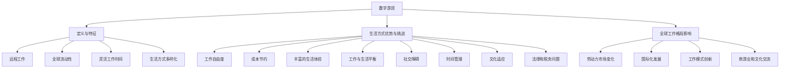
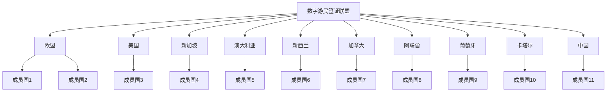

                 

### 引言

数字游民时代已经悄然来临，人们不再局限于传统的办公室环境，而是通过互联网和数字技术，在世界任何角落远程工作。这种新兴的工作方式不仅改变了职业人士的生活方式，也对全球经济和工作模式产生了深远影响。在此背景下，数字游民签证联盟应运而生，旨在通过国际合作，推动全球数字工作的便利化和规范化。

本文将围绕数字游民签证联盟这一主题，深入探讨其背景、政策、形成过程、核心议题、实际案例及未来展望。文章的结构如下：

1. **数字游民时代概览**：介绍数字游民的定义、特征及其对全球工作格局的影响。
2. **数字游民签证政策分析**：分析全球各国的数字游民签证政策，比较其差异与共性。
3. **数字游民签证联盟的形成**：探讨数字游民签证联盟的背景、组织架构及对成员国的影响。
4. **数字游民签证联盟的核心议题**：讨论联盟在跨境劳动力流动、税收制度、知识产权保护等方面的核心议题。
5. **数字游民签证联盟的实际案例**：分析欧盟的“数码共和国”计划、美国的“创新签证”政策及新加坡的“永久居民数字游民计划”。
6. **数字游民签证联盟的未来展望**：探讨联盟面临的挑战、对全球工作模式的长远影响及国际化趋势。
7. **总结与建议**：总结文章的主要结论，并对数字游民签证联盟的未来发展提出建议。

通过以上章节的详细分析，本文旨在为读者提供一幅完整的数字游民签证联盟的蓝图，帮助大家更好地理解这一新兴的国际合作模式，并展望其未来的发展前景。

### 关键词

- **数字游民**：远程工作的新兴人群，通过互联网实现工作和生活。
- **数字游民签证**：各国政府为吸引数字游民而推出的特殊签证政策。
- **签证联盟**：各国政府之间合作，推动数字游民自由流动的组织。
- **跨境劳动力流动**：数字游民在全球范围内的职业流动。
- **国际合作**：全球各国政府共同应对数字游民问题的合作机制。
- **全球工作模式**：随着数字技术的发展，工作地点和方式的变化。

### 摘要

本文围绕数字游民签证联盟这一主题，首先介绍了数字游民的定义、特征及其对全球工作格局的影响。随后，分析了全球各国的数字游民签证政策，比较了其主要类型及差异。接着，探讨了数字游民签证联盟的形成背景、组织架构及其对成员国的影响。文章进一步讨论了联盟在跨境劳动力流动、税收制度、知识产权保护等核心议题上的挑战与解决方案。通过分析欧盟的“数码共和国”计划、美国的“创新签证”政策及新加坡的“永久居民数字游民计划”，展示了实际案例。最后，文章展望了数字游民签证联盟的未来发展，提出了相应的挑战与解决方案，并对全球工作模式的长远影响进行了讨论。通过本文，读者将全面了解数字游民签证联盟的现状与未来，以及其对全球劳动力市场和经济发展的深远影响。

### 第1章 数字游民时代概览

#### 1.1 数字游民的定义与特征

数字游民（Digital Nomad）是指那些主要依靠互联网和数字技术进行工作的人。他们不受传统工作地点的限制，可以在全球任何地方远程工作。数字游民通常从事自由职业、远程办公或在线创业，他们的工作内容包括编程、设计、写作、咨询等。与传统的职场人士不同，数字游民的生活和职业发展不依赖于固定的办公场所，而是通过云计算、虚拟会议等数字工具，实现远程沟通与协作。

数字游民的生活方式具有以下显著特征：

1. **远程办公**：数字游民通过虚拟办公室和远程协作工具进行工作，不需要每天到公司或办公室上班。
2. **全球流动性**：他们可以在世界任何地方居住和工作，通常会选择成本较低、生活环境优越的国家和地区。
3. **灵活的工作时间**：数字游民可以自主安排工作时间，许多人在旅途中工作，享受工作与生活的平衡。
4. **生活方式多样化**：他们不仅追求职业发展，还注重生活质量和体验不同的文化。

#### 1.2 数字游民生活方式的优势与挑战

数字游民生活方式的优势主要体现在以下几个方面：

1. **工作自由度**：数字游民可以自主选择工作内容和项目，不受地理限制，自由度高。
2. **成本节约**：通过远程工作，数字游民可以节省日常通勤费用和办公场所租赁费用，降低生活成本。
3. **丰富的生活体验**：他们有机会旅行、探索不同的国家和文化，丰富个人经历和视野。
4. **工作与生活平衡**：数字游民通常可以更好地平衡工作和生活，享受更多个人时间和自由。

然而，数字游民生活方式也面临一些挑战：

1. **社交障碍**：由于工作地点分散，数字游民可能面临社交障碍，缺乏与同事和朋友的面对面交流。
2. **时间管理**：远程工作需要良好的时间管理能力，否则容易导致工作与生活的界限模糊，影响工作效率。
3. **文化适应**：在不同国家工作和生活，数字游民需要适应不同的文化和工作习惯，这可能带来一定的不适应。
4. **法律和税务问题**：数字游民需要了解和遵守各国的工作签证政策、税务规定等，以避免法律风险。

#### 1.3 数字游民对全球工作格局的影响

数字游民现象对全球工作格局产生了深远影响，主要体现在以下几个方面：

1. **劳动力市场变化**：数字游民的出现打破了传统劳动力市场的地域限制，企业可以全球招聘优秀人才，而人才也可以在全球范围内寻找最适合的工作机会。
2. **国际化发展**：数字游民推动了企业和个人在全球范围内的合作与交流，促进了国际化发展。
3. **工作模式创新**：远程工作和数字协作工具的普及，推动了新型工作模式的创新，如灵活工作制、虚拟团队等。
4. **旅游业和文化交流**：数字游民选择在成本较低、环境优越的地区工作，促进了这些地区的旅游业和文化交流。

综上所述，数字游民时代已经深刻改变了全球工作格局，其生活方式的优势与挑战并存，对企业和个人都提出了新的要求和机遇。理解数字游民的定义、特征及其对全球工作格局的影响，是推动数字游民签证联盟发展的重要前提。

#### 1.4 数字游民签证的定义与类型

数字游民签证是各国政府为吸引数字游民而制定的一种特殊签证政策，允许符合条件的外国人在本国境内合法从事远程工作。这种签证政策的目的是通过吸引高技能人才，促进本地经济的发展和创新。

数字游民签证的类型主要包括以下几种：

1. **远程工作签证**：这类签证直接面向远程工作者，允许他们在签证有效期内，在全球任何地方远程为公司或客户提供服务。例如，美国的“H-1B临时工作签证”和“O-1A杰出人才签证”都有一定程度的远程工作许可。

2. **自由职业者签证**：这类签证主要面向自由职业者，如自由撰稿人、独立开发者、设计师等。签证持有者可以在签证有效期内，从事自由职业项目，并自行安排工作时间。例如，澳大利亚的“临时活动签证（subclass 400）”允许自由职业者在特定条件下短期停留。

3. **创新签证**：这类签证通常面向初创企业主或企业家，目的是吸引具有创新能力和创业精神的数字游民。例如，新加坡的“永久居民数字游民计划”和爱尔兰的“创新签证”都是为了吸引有潜力的创业者。

4. **工作假期签证**：这类签证主要面向年轻人，允许他们在一个国家内短期停留，并在此期间从事远程工作。例如，加拿大的“工作假期签证”（Working Holiday Visa）和日本的“短期签证（工作类）”都属于这一类型。

5. **特殊区域签证**：这类签证通常针对特定的经济特区或自由港，例如，阿联酋的“迪拜数字游民签证”和中国的“海南自由贸易港工作签证”。

不同类型的数字游民签证有其特定的申请条件和要求，通常包括：

- **年龄限制**：许多数字游民签证要求申请人必须在一定年龄范围内（如18-30岁）。
- **工作经验**：部分签证要求申请人在相关领域有至少一年的工作经验。
- **教育背景**：部分签证要求申请人具备一定的教育背景或专业技能。
- **收入要求**：部分签证要求申请人的年收入达到一定水平，以确保他们能够在签证期间自给自足。
- **健康与保险**：申请人通常需要提供有效的健康保险证明，以保障签证期间的健康和安全。

总之，数字游民签证的类型和条件因国家而异，但共同目的是通过吸引高技能人才，促进本地经济的发展和创新。了解不同类型的数字游民签证及其申请条件，对于有志于成为数字游民的职场人士具有重要意义。

#### 1.5 数字游民签证政策的国际比较

全球范围内，各国数字游民签证政策在类型、申请条件、期限和适用人群等方面存在显著差异。以下是对主要国家数字游民签证政策的国际比较：

1. **美国**：美国拥有多种针对远程工作者的签证政策，包括H-1B临时工作签证和O-1A杰出人才签证。H-1B签证适用于专业职业，如计算机程序员、工程师等，但申请人数众多，竞争激烈。O-1A签证则针对在特定领域具有卓越成就的人才，允许他们在美国从事高技能工作，包括远程工作。申请H-1B和O-1A签证通常需要雇主的支持，并且要求申请人在相关领域具备一定的工作经验和专业技能。

2. **欧洲**：欧洲多国推出数字游民签证，其中较为知名的包括希腊的“远程工作签证”和葡萄牙的“数字游民签证”。希腊的远程工作签证允许申请人在签证有效期内（最多一年）在希腊居住和工作，无需雇主支持，但需提供稳定的收入来源。葡萄牙的数字游民签证则要求申请人每月收入至少达到1,000欧元，并在葡萄牙租赁住所。此外，欧洲国家如希腊、葡萄牙、西班牙等还推出了“黄金签证”计划，吸引高净值数字游民，这些签证通常要求申请人投资房产或满足一定的经济条件。

3. **澳大利亚**：澳大利亚的临时活动签证（subclass 400）允许自由职业者在特定条件下短期停留，从事远程工作。该签证通常面向18-30岁的年轻人，无需雇主支持，但需要在签证申请前证明具备足够的资金和健康保险。澳大利亚还推出了“临时技能工作签证”（subclass 482）和“雇主担保移民签证”（subclass 186），虽然这些签证并非专门针对数字游民，但适用于高技能人才，包括远程工作者。

4. **新加坡**：新加坡的永久居民数字游民计划（PR for Digital Nomads）旨在吸引高技能、高收入的数字游民。该计划要求申请人具有至少三年全职工作经验，或在过去四年中至少有三年在知名公司任职，每月收入至少为5,000新加坡元。此外，申请人需证明在新加坡租赁住所，并承诺遵守新加坡的法律法规。

5. **新西兰**：新西兰推出了“工作假期签证”（Working Holiday Visa），允许18-30岁的年轻人在新西兰工作和旅行。工作假期签证持有人可以在签证有效期内（最多两年）从事短期远程工作，无需雇主支持。但申请该签证需要满足一定的健康和保险要求，并证明具备足够的资金支持在新西兰的生活。

6. **加拿大**：加拿大的工作假期签证（Working Holiday Visa）面向18-35岁的年轻人，允许他们在签证有效期内从事远程工作。申请人需要证明有足够的资金支持在加拿大的生活，并购买健康保险。加拿大还推出了“全球人才流动计划”（Global Talent Stream），旨在快速吸引高技能人才，包括远程工作者。

7. **中东地区**：中东地区的一些国家，如阿联酋和卡塔尔，推出了针对数字游民的签证计划。迪拜的数字游民签证允许申请人在签证有效期内（最多一年）在迪拜居住和工作，无需雇主支持。该签证要求申请人每月收入至少为4,000迪拉姆，并在迪拜租赁住所。卡塔尔也推出了类似的数字游民签证计划，要求申请人每月收入至少为3,000卡塔尔里亚尔。

综上所述，不同国家的数字游民签证政策在类型、申请条件、期限和适用人群等方面存在差异，但共同目的是通过吸引高技能人才，促进本地经济的发展和创新。了解这些政策有助于有志于成为数字游民的职场人士选择最适合的签证计划，并在全球范围内实现远程工作的梦想。

### 第2章 数字游民签证政策分析

#### 2.1 全球数字游民签证政策概述

随着数字技术的发展和全球化进程的加快，越来越多的国家开始意识到数字游民对于本国经济发展和文化交流的潜在价值，因此纷纷推出了各种形式的数字游民签证政策。全球范围内的数字游民签证政策可以大致分为几类，包括远程工作签证、自由职业者签证、创新签证、工作假期签证等。

首先，远程工作签证是针对那些希望在特定国家远程为公司或个人工作的数字游民。这类签证通常不要求有雇主支持，允许申请者在签证有效期内自由选择工作地点，但需满足一定的收入要求、健康保险和居住条件。例如，美国H-1B临时工作签证和O-1A杰出人才签证，以及欧洲一些国家的远程工作签证，都属于这一类别。

其次，自由职业者签证主要面向那些从事自由职业的数字游民，如自由撰稿人、独立开发者、设计师等。这类签证通常要求申请者在签证有效期内能够自给自足，并需要在特定国家注册为自由职业者。澳大利亚的临时活动签证（subclass 400）和葡萄牙的数字游民签证是较为典型的例子。

创新签证则针对那些具有创业精神和创新能力的数字游民，旨在吸引高潜力企业和创业者。这类签证通常要求申请人具有特定的教育背景、创业经历或投资额度。新加坡的永久居民数字游民计划和爱尔兰的创新签证就是其中两个成功的案例。

工作假期签证主要面向年轻人，允许他们在特定国家短期停留并从事远程工作。这类签证通常要求申请人年龄在18-30岁之间，并具备一定的资金和健康保险条件。例如，加拿大的工作假期签证和工作假期计划，以及新西兰的工作假期签证，都是这一类签证的代表。

#### 2.2 主要数字游民签证类型详解

以下是对几种主要数字游民签证类型的详细分析：

1. **远程工作签证**：远程工作签证允许数字游民在特定国家远程为公司或个人工作，无需雇主支持。这类签证通常要求申请人在签证有效期内证明有稳定的收入来源、健康保险，并在签证期间遵守相关法律法规。例如，美国的H-1B临时工作签证和O-1A杰出人才签证都有一定的远程工作许可，允许高技能人才在全球任何地方远程工作。欧洲一些国家，如希腊、葡萄牙等，也推出了类似的远程工作签证，以吸引高技能人才。

2. **自由职业者签证**：自由职业者签证主要面向那些从事自由职业的数字游民，如自由撰稿人、独立开发者、设计师等。这类签证通常要求申请人在签证有效期内能够自给自足，并需要在特定国家注册为自由职业者。例如，澳大利亚的临时活动签证（subclass 400）允许自由职业者在签证有效期内短期停留并工作，无需雇主支持。葡萄牙的数字游民签证则要求申请人的月收入至少达到1,000欧元，以证明其自给自足的能力。

3. **创新签证**：创新签证通常针对那些具有创业精神和创新能力的数字游民，旨在吸引高潜力企业和创业者。这类签证要求申请人具有特定的教育背景、创业经历或投资额度。例如，新加坡的永久居民数字游民计划要求申请人具有至少三年的全职工作经验或过去四年在知名公司任职的经历，并且每月收入至少为5,000新加坡元。爱尔兰的创新签证则要求申请人具有创新项目或商业计划，并承诺在爱尔兰创业。

4. **工作假期签证**：工作假期签证主要面向年轻人，允许他们在特定国家短期停留并从事远程工作。这类签证通常要求申请人年龄在18-30岁之间，并具备一定的资金和健康保险条件。例如，加拿大的工作假期签证允许18-35岁的年轻人在签证有效期内从事短期远程工作，新西兰的工作假期签证也面向18-30岁的年轻人，要求申请人在签证期间自给自足并购买健康保险。

5. **特殊区域签证**：特殊区域签证通常针对特定的经济特区或自由港，例如，阿联酋的迪拜数字游民签证和中国的海南自由贸易港工作签证。这类签证通常要求申请人具备一定的收入和创业潜力，以促进当地经济发展。

#### 2.3 数字游民签证政策的国际比较

不同国家的数字游民签证政策在类型、申请条件、期限和适用人群等方面存在显著差异。以下是一些主要国家的数字游民签证政策比较：

- **美国**：美国的数字游民签证主要包括H-1B临时工作签证和O-1A杰出人才签证。H-1B签证要求申请人具有特定专业技能，竞争激烈，申请人数众多。O-1A签证则针对在特定领域具有卓越成就的人才，允许他们在美国从事高技能工作。此外，美国还推出了“远程工作临时签证”（如E-3签证），允许来自澳大利亚的远程工作者在美国工作。

- **欧洲**：欧洲多个国家推出了数字游民签证，如葡萄牙的数字游民签证、希腊的远程工作签证等。这些签证通常要求申请人具备一定的收入来源和健康保险，允许他们在签证有效期内自由选择工作地点。此外，一些国家还推出了“黄金签证”计划，通过投资房产或满足一定经济条件来吸引高净值数字游民。

- **澳大利亚**：澳大利亚的临时活动签证（subclass 400）允许自由职业者在特定条件下短期停留并工作，无需雇主支持。此外，澳大利亚还推出了“临时技能工作签证”（subclass 482）和“雇主担保移民签证”（subclass 186），适用于高技能人才，包括远程工作者。

- **新加坡**：新加坡的永久居民数字游民计划要求申请人具备高技能、高收入，并承诺遵守新加坡的法律法规。该计划旨在吸引全球高潜力人才，促进新加坡的经济发展。

- **新西兰**：新西兰的工作假期签证面向18-30岁的年轻人，允许他们在签证有效期内从事短期远程工作。此外，新西兰还推出了“全球创新移民计划”，旨在吸引具有创业能力和创新精神的高技能人才。

- **中东地区**：中东地区的一些国家，如阿联酋和卡塔尔，也推出了针对数字游民的签证计划。这些签证通常要求申请人具备一定的收入和创业潜力，以促进当地经济发展。

综上所述，全球数字游民签证政策在类型、申请条件、期限和适用人群等方面存在显著差异，但共同目的是通过吸引高技能人才，促进本地经济的发展和创新。了解不同国家的数字游民签证政策有助于有志于成为数字游民的职场人士选择最适合的签证计划，并在全球范围内实现远程工作的梦想。

### 第3章 数字游民签证联盟的形成

#### 3.1 联盟形成的背景与动因

数字游民签证联盟的形成背景源于全球范围内数字游民群体的快速增长和对跨国劳动力流动的需求日益增加。随着互联网和移动技术的迅猛发展，越来越多的人选择离开传统的工作地点，通过远程工作实现职业发展和生活质量的提升。这种趋势不仅改变了职业人士的工作方式，也对各国经济和社会发展产生了深远影响。

首先，全球化和技术进步使得人们更容易跨国界工作，而不再受限于地理位置。企业和个人都能够通过互联网实现全球范围内的合作和沟通，因此，跨国工作成为了一种可行的职业选择。其次，数字游民群体本身具有高技能、高创造力的特点，他们往往能够为企业带来创新思维和多元化视角，从而推动产业升级和经济增长。

面对这种新兴的工作模式，各国政府逐渐认识到，通过国际合作共同制定数字游民签证政策，可以更好地吸引和留住高技能人才，促进本地经济发展。因此，数字游民签证联盟应运而生，旨在通过跨国合作，实现数字游民在全球范围内的自由流动。

形成数字游民签证联盟的主要动因包括：

1. **吸引高技能人才**：各国政府希望通过数字游民签证联盟，吸引全球范围内的高技能、高潜力人才，以促进本国科技、创新和经济发展。

2. **促进经济全球化**：通过国际合作，减少跨国劳动力流动的障碍，推动全球经济的互联互通和共同发展。

3. **提升国际竞争力**：在全球范围内吸引和留住数字游民，有助于提升国家的国际竞争力和创新能力。

4. **文化多样性和交流**：数字游民签证联盟还可以促进不同国家和地区之间的文化交流，增进了解和友谊。

#### 3.2 联盟的组织架构与运作机制

数字游民签证联盟的组织架构和运作机制是确保其有效运作和实现目标的关键。通常，联盟由多个成员国组成，每个成员国在联盟中拥有平等的发言权和投票权。以下是对联盟组织架构和运作机制的详细说明：

1. **成员国**：数字游民签证联盟的成员国通常由各国政府组成，每个成员国都有权派代表参加联盟会议和决策过程。成员国的资格通常基于其经济发展水平、科技实力、开放程度等因素。

2. **联盟理事会**：联盟理事会是联盟的最高决策机构，由各成员国代表组成。理事会负责制定和修改联盟的章程、政策和行动计划，以及审批成员国的加入和退出。

3. **执行委员会**：执行委员会是联盟的常设机构，负责执行理事会的决策，协调各成员国的政策实施，以及处理日常事务。执行委员会通常由理事长、副理事长和其他成员组成。

4. **秘书处**：秘书处是联盟的行政管理部门，负责联盟的日常运作、文件管理和对外联络。秘书处通常设在成员国中的一个国家，并由联盟成员国轮流担任秘书国。

5. **工作组**：为应对特定的议题和挑战，联盟可以成立专门的工作组，如跨境劳动力流动工作组、税收制度工作组等。工作组由各成员国的专家组成，负责研究和提出解决方案。

#### 3.3 联盟对成员国的影响

数字游民签证联盟对成员国的影响是深远且多方面的，以下是一些主要影响：

1. **经济影响**：数字游民签证联盟有助于成员国吸引高技能、高潜力的人才，推动科技创新和经济发展。通过跨国劳动力流动，成员国能够获取更多的人才资源，提高生产力和创新能力，从而实现经济增长。

2. **政策协调**：联盟为成员国提供了一个平台，用于协调和统一数字游民签证政策，减少跨国劳动力流动的障碍。成员国可以通过联盟分享经验和最佳实践，制定统一的签证标准和流程，提高政策实施的效率。

3. **文化交流**：数字游民签证联盟促进了成员国之间的文化交流和了解，增进了友好关系。通过数字游民的生活和工作，不同文化之间的互动和融合得到加强，有助于构建一个多元和谐的国际社会。

4. **社会影响**：数字游民签证联盟有助于推动社会变革，鼓励人们更加灵活和自由地选择工作和生活方式。数字游民的生活方式不仅改变了人们的职业发展路径，也影响了他们的生活观念和价值观念。

总之，数字游民签证联盟的形成背景和动因源于全球化和技术进步，其组织架构和运作机制旨在实现跨国劳动力流动的便利化和规范化。联盟对成员国的影响涵盖了经济、政策、文化和社会等多个层面，有助于推动全球数字游民时代的到来。

#### 3.4 数字游民签证联盟的成员国名单

数字游民签证联盟的成员国名单如下：

1. **欧盟**：欧盟作为全球最大的经济体之一，率先推出了“数码共和国”计划，允许成员国之间自由流动数字游民。

2. **美国**：美国拥有丰富的科技资源和创新环境，推出了多种针对远程工作者的签证政策，如H-1B临时工作签证和O-1A杰出人才签证。

3. **新加坡**：新加坡是亚洲重要的经济中心，推出了永久居民数字游民计划，吸引高技能、高收入的数字游民。

4. **澳大利亚**：澳大利亚通过临时活动签证（subclass 400）和工作假期签证，为自由职业者和年轻人提供了远程工作的机会。

5. **新西兰**：新西兰的工作假期签证和全球创新移民计划，吸引了众多年轻的数字游民。

6. **加拿大**：加拿大的工作假期签证和全球人才流动计划，为高技能人才提供了远程工作的机会。

7. **阿联酋**：迪拜的数字游民签证计划，吸引了众多远程工作者到阿联酋工作和生活。

8. **葡萄牙**：葡萄牙的数字游民签证计划，通过低门槛的申请条件，吸引了大量数字游民。

9. **卡塔尔**：卡塔尔推出了针对数字游民的签证计划，以促进当地经济的发展。

10. **中国**：中国的海南自由贸易港工作签证计划，为远程工作者提供了更多选择。

这些成员国通过数字游民签证联盟，实现了跨国劳动力流动的便利化和规范化，为全球经济发展和文化交流做出了积极贡献。

#### 3.5 数字游民签证联盟的优势与挑战

数字游民签证联盟的优势主要体现在以下几个方面：

1. **资源整合**：联盟成员国能够共同整合资源，优化签证政策和流程，减少跨国劳动力流动的障碍，提高政策的执行效率。

2. **人才吸引**：通过联盟的合作，成员国能够共同吸引全球范围内的高技能、高潜力人才，为本地经济发展注入活力。

3. **政策协调**：联盟提供了一个平台，成员国可以共享经验和最佳实践，制定统一的数字游民签证政策，减少政策不一致带来的困扰。

4. **文化交流**：数字游民在全球范围内的流动促进了各国之间的文化交流和了解，有助于构建一个多元和谐的国际社会。

5. **创新推动**：联盟成员国的合作，有助于推动科技创新和产业升级，实现经济全球化。

然而，数字游民签证联盟也面临一些挑战：

1. **法律和税务协调**：各国法律和税务制度存在差异，联盟需要协调成员国之间的法律和税务问题，确保数字游民在各国合法合规工作。

2. **文化差异**：成员国之间的文化差异可能带来沟通和合作上的障碍，需要通过培训和文化交流来增进相互理解和合作。

3. **信息共享**：联盟成员国需要建立高效的信息共享机制，确保签证政策、法律法规等信息的及时更新和透明。

4. **隐私保护**：数字游民在全球范围内的流动，涉及大量个人数据的跨国传输和存储，需要确保个人隐私和数据安全。

5. **政策执行**：联盟需要确保成员国在执行签证政策时，严格遵守协议和规定，避免政策执行的偏差和漏洞。

综上所述，数字游民签证联盟在促进跨国劳动力流动、资源整合、人才吸引、文化交流等方面具有显著优势，但也需要面对法律、税务、文化、信息共享和隐私保护等方面的挑战。通过有效应对这些挑战，数字游民签证联盟将能够更好地实现其目标，推动全球数字游民时代的到来。

### 第4章 数字游民签证联盟的核心议题

#### 4.1 跨境劳动力流动的法律与政策协调

数字游民签证联盟的核心议题之一是跨境劳动力流动的法律与政策协调。随着数字游民的快速增长，各国在签证政策、法律框架和监管机制上存在差异，导致跨国劳动力流动面临诸多障碍。联盟的成立旨在通过成员国之间的合作，解决这些法律和政策协调问题，实现数字游民的自由流动。

首先，联盟需要建立统一的签证标准和流程。成员国可以通过协商，制定统一的数字游民签证类型、申请条件和流程，减少跨国流动的繁琐和不确定性。例如，可以设立一个通用的数字游民签证类别，明确签证的申请条件、有效期和续签规定，以便于成员国之间互相承认和协调。

其次，联盟需要建立跨国法律框架。为了确保数字游民在各国合法合规工作，联盟可以制定一套统一的法律规范，涵盖劳动权益、税务制度、社会保险等方面。成员国可以通过签署协议，承认和执行联盟制定的法律规范，确保数字游民在各国享有公平的劳动权益和待遇。

此外，联盟还需要建立信息共享机制。成员国之间需要建立一个高效的信息共享平台，用于发布签证政策、法律法规、劳动力市场等信息。这样，数字游民可以及时了解各国政策变化，合理安排工作和生活。同时，成员国可以通过信息共享，监控数字游民在各国的工作情况，确保政策执行的一致性和有效性。

为了实现上述目标，联盟可以采取以下措施：

1. **建立成员国工作组**：设立专门的工作组，负责研究和协调跨境劳动力流动的法律和政策问题。工作组可以由各成员国的法律专家、政策制定者和数字游民代表组成，定期召开会议，讨论和制定相关政策。

2. **制定合作框架协议**：成员国可以签署合作框架协议，明确联盟的宗旨、目标和具体措施。协议应包括统一的签证标准、法律框架、信息共享机制等内容，确保各成员国在跨境劳动力流动方面的一致行动。

3. **开展联合培训和交流**：联盟可以组织成员国之间的联合培训和交流项目，提高政策制定者和数字游民对联盟法律和政策规范的理解和遵守。通过培训，可以增进成员国之间的相互了解和合作，减少文化差异带来的障碍。

4. **建立监督和评估机制**：联盟应建立监督和评估机制，对成员国执行联盟政策的情况进行定期评估。通过评估，可以发现和解决执行中的问题，确保联盟目标的实现。

总之，跨境劳动力流动的法律与政策协调是数字游民签证联盟的核心议题之一。通过建立统一的签证标准、跨国法律框架和信息共享机制，联盟可以有效地解决跨国劳动力流动中的法律和政策障碍，实现数字游民的自由流动，推动全球数字游民时代的到来。

#### 4.2 数字游民税收制度的国际合作

数字游民签证联盟的另一个核心议题是数字游民税收制度的国际合作。随着数字游民在全球范围内的快速崛起，如何合理确定他们的税收管辖权和征税范围，成为各国税务部门面临的一个重要问题。联盟的成立为各国提供了一个平台，通过国际合作，共同探讨和解决数字游民税收制度中的争议和挑战。

首先，税收管辖权的确定是数字游民税收制度国际合作的关键。传统税收制度以居民身份和所得来源为主要依据，但在数字游民的情况下，这些标准变得模糊和复杂。数字游民可能在全球多个国家工作，但其居住地、工作地和收入来源国家往往不一致。为了确保税收公平和有效，联盟需要建立一套国际通行的税收管辖权标准。

一个可能的解决方案是引入“经济活动所在地原则”（Economic Activity Authority Principle），即根据数字游民在全球各地实际从事的经济活动，确定其税收管辖权。具体来说，可以根据数字游民的工作性质、工作时间、工作地点等因素，综合判断其经济活动所在地，从而确定其税收管辖权。这一原则有助于避免因税收管辖权冲突而导致的重复征税或税收遗漏。

其次，联盟需要制定统一的税收协定。成员国可以通过签订双边或多边税收协定，明确数字游民的税收待遇和征税范围，减少因法律冲突而产生的争议。例如，联盟可以制定一套统一的数字游民税收协定范本，供成员国参照执行。协定应包括对数字游民所得税、社会保险、财产税等方面的规定，确保各国在税收政策上的协调和一致性。

此外，联盟还应建立信息交换机制。为了有效执行税收协定，成员国之间需要建立一个高效的信息交换平台，用于共享数字游民的收入、工作地点等关键信息。这有助于税务部门准确判断数字游民的税收管辖权，并确保税收政策的有效执行。

为了实现上述目标，联盟可以采取以下措施：

1. **建立税收政策工作组**：设立专门的工作组，负责研究和制定数字游民税收政策。工作组可以由各成员国的税务专家、法律顾问和数字游民代表组成，定期召开会议，讨论和制定相关政策。

2. **开展国际税收合作研究**：联盟可以组织国际税收合作研究项目，探讨不同国家数字游民税收制度的最佳实践，并为制定统一的税收协定提供依据。

3. **提供税收政策培训**：联盟可以组织成员国之间的税收政策培训，提高政策制定者和税务执行人员对数字游民税收制度和国际合作的理解和遵守。

4. **建立国际税务合作平台**：联盟可以建立一个国际税务合作平台，用于成员国之间的信息交换和政策协调。平台应具备数据加密和隐私保护功能，确保信息传输的安全和可靠。

总之，数字游民税收制度的国际合作是数字游民签证联盟的重要议题之一。通过建立国际通行的税收管辖权标准、制定统一的税收协定和建立信息交换机制，联盟可以有效地解决数字游民税收制度中的争议和挑战，推动全球数字游民时代的健康发展。

#### 4.3 跨境数字服务的知识产权保护

数字游民签证联盟的第三个核心议题是跨境数字服务的知识产权保护。随着数字游民的全球化流动，他们经常在不同国家提供数字服务，涉及到大量的知识产权保护问题。知识产权保护不仅是数字游民合法经营的基础，也是确保创新和技术发展的重要保障。联盟需要通过国际合作，制定统一的知识产权保护政策和标准，以应对跨国数字服务中的知识产权挑战。

首先，联盟需要建立统一的知识产权保护法律框架。成员国可以通过签订多边协定，制定一套涵盖版权、专利、商标等知识产权保护的国际法律标准。这些标准应明确数字游民在不同国家提供数字服务时，如何享受和行使知识产权权利，以及如何应对侵权行为。例如，可以建立跨境知识产权侵权纠纷解决机制，简化侵权诉讼程序，提高侵权赔偿的效率。

其次，联盟需要建立信息共享机制。知识产权保护涉及大量信息，包括知识产权登记、侵权举报、法律诉讼等。成员国之间需要建立一个高效的信息共享平台，用于发布和交换知识产权相关数据。这有助于成员国及时了解和应对跨境知识产权侵权问题，提高知识产权保护的协同效应。

此外，联盟还应推动知识产权保护的国际合作。成员国可以通过联合执法、信息共享和培训等方式，加强在知识产权保护方面的合作。例如，可以组织跨国知识产权执法行动，打击跨境知识产权侵权行为；可以开展知识产权保护培训项目，提高政策制定者和执法人员的专业水平。

为了实现上述目标，联盟可以采取以下措施：

1. **建立知识产权保护工作组**：设立专门的工作组，负责研究和制定跨境数字服务的知识产权保护政策。工作组可以由各成员国的知识产权专家、法律顾问和数字游民代表组成，定期召开会议，讨论和制定相关政策。

2. **制定多边知识产权保护协定**：联盟可以组织成员国签订多边知识产权保护协定，明确数字游民在不同国家提供数字服务时的知识产权权利和义务。

3. **建立知识产权信息共享平台**：联盟可以建立一个知识产权信息共享平台，用于发布和交换知识产权相关数据，提高知识产权保护的透明度和效率。

4. **开展知识产权保护国际合作**：联盟可以组织跨国知识产权保护合作项目，加强成员国在知识产权保护方面的合作，提高知识产权保护的协同效应。

总之，跨境数字服务的知识产权保护是数字游民签证联盟的重要议题之一。通过建立统一的知识产权保护法律框架、信息共享机制和国际合作，联盟可以有效地解决跨国数字服务中的知识产权挑战，为数字游民的全球化发展提供坚实的法律保障。

### 第5章 数字游民签证联盟的实际案例

#### 5.1 欧盟的“数码共和国”计划

欧盟的“数码共和国”计划是数字游民签证联盟中的典型案例，该计划旨在吸引全球数字游民到欧盟国家工作和生活，推动欧洲数字经济的发展。自2021年启动以来，该计划已经在多个成员国取得了显著成效。

**背景与目标**：欧盟“数码共和国”计划的背景是全球数字化进程加速和数字游民群体的崛起。欧盟希望通过这一计划，吸引高技能、高创造力的数字游民，为其成员国带来新的经济活力和人才资源。具体目标包括：

1. **促进就业和经济增长**：通过吸引数字游民，欧盟希望创造更多就业机会，推动技术创新和产业升级，实现经济增长。
2. **提升国际竞争力**：通过引入全球优秀人才，欧盟希望提升其在全球数字经济中的竞争力，巩固其作为科技和商业中心的地位。
3. **推动文化交流与融合**：数字游民的全球化流动有助于促进不同国家之间的文化交流和了解，增强欧盟的国际影响力。

**政策与实施**：

1. **统一的数字游民签证政策**：欧盟成员国在“数码共和国”计划框架下，建立了统一的数字游民签证政策。数字游民可以通过申请“数码共和国”签证，在欧盟任意成员国居住和工作。
2. **宽松的申请条件**：申请“数码共和国”签证的条件相对宽松，包括：年龄在18-35岁之间、有稳定的收入来源、能够负担在欧盟的生活费用和医疗保险等。
3. **灵活的居留期限**：签证的有效期为12个月，数字游民在签证有效期内可以自由选择在欧盟的任何国家工作和生活。签证可以续签，最长连续居留期限为36个月。

**成效与挑战**：

1. **成效**：自计划启动以来，已有数千名数字游民通过“数码共和国”计划在欧盟成员国工作和生活。这一计划不仅吸引了大量高技能人才，还促进了成员国之间的经济合作和文化交流。
   
2. **挑战**：尽管“数码共和国”计划取得了显著成效，但也面临一些挑战。首先，成员国之间的资源和政策协调需要进一步加强，以确保计划的有效实施。其次，数字游民的税收和社保问题需要得到妥善解决，以避免政策不一致带来的困扰。最后，如何保障数字游民的工作和生活质量，也是欧盟需要关注的重要问题。

**未来展望**：欧盟“数码共和国”计划未来有望进一步优化和扩展。欧盟计划通过增加成员国参与度、简化申请流程、扩大签证有效期等措施，进一步提升计划的吸引力和效果。此外，欧盟还计划与其他国家和发展地区建立更广泛的合作关系，推动全球数字游民时代的到来。

#### 5.2 美国的“创新签证”政策

美国的“创新签证”政策是数字游民签证联盟中的另一个重要案例，旨在吸引全球高技能人才到美国工作和生活，推动科技创新和经济发展。该政策由美国国会于2015年通过，并于2017年开始实施。

**背景与目标**：美国“创新签证”政策的背景是全球化和数字技术快速发展，以及美国在创新和科技领域的国际竞争力面临挑战。美国希望通过这一政策，吸引全球优秀人才，特别是在科技、工程和医疗等领域，为美国的经济增长和科技创新注入新动力。具体目标包括：

1. **提升科技创新能力**：通过引入全球高技能人才，美国希望增强其科技创新能力，保持全球科技领先地位。
2. **促进经济发展**：高技能人才对美国的经济增长具有重要作用，通过吸引这些人才，美国希望创造更多就业机会，提高生产力和竞争力。
3. **应对全球人才竞争**：随着其他国家和地区对高技能人才的重视程度不断提高，美国需要通过创新签证政策，应对全球人才竞争，确保其能够吸引和留住优秀人才。

**政策与实施**：

1. **签证类型和条件**：美国“创新签证”主要包括EB-1A杰出人才签证和O-1A杰出人才签证。EB-1A签证适用于在科学、艺术、教育、商业或体育等领域具有杰出成就的个人，而O-1A签证则适用于在特定领域内具有非凡才能的个人。
   
2. **申请流程**：申请人需要提交详细的工作经历、成就证明和相关推荐信，证明其在相关领域内的杰出才能或成就。申请过程包括审查、面试和审批等环节，通常需要数月至一年时间。

3. **居留期限和续签**：获批的创新签证有效期为三年，可在第三年结束时申请延期。延期后签证有效期通常为两年，直到申请人获得永久居民身份。

**成效与挑战**：

1. **成效**：自政策实施以来，已有数千名高技能人才通过创新签证进入美国工作和生活。这些人才在美国的科技、工程和医疗等领域发挥了重要作用，推动了美国科技创新和经济发展。

2. **挑战**：尽管“创新签证”政策取得了显著成效，但也面临一些挑战。首先，申请流程复杂且耗时，许多有才华的个人难以满足申请条件。其次，签证名额限制和审批时间较长，影响了人才的及时引进。此外，如何确保这些高技能人才在美国合法合规工作，也是美国需要关注的问题。

**未来展望**：美国计划进一步优化“创新签证”政策，简化申请流程，增加签证名额，以更好地吸引全球高技能人才。未来，美国还可能与其他国家建立合作，推动全球范围内的数字游民和国际人才流动，促进全球科技和经济的共同发展。

#### 5.3 新加坡的“永久居民数字游民计划”

新加坡的“永久居民数字游民计划”是数字游民签证联盟中的又一成功案例，旨在吸引高技能、高收入的数字游民到新加坡工作和生活，推动新加坡的经济发展和创新。该计划自2021年推出以来，已经在全球范围内引起了广泛关注。

**背景与目标**：新加坡作为一个全球重要的金融和科技中心，一直致力于吸引高技能人才和企业家。随着数字技术的发展和全球化进程的加快，新加坡希望通过“永久居民数字游民计划”，进一步扩大其人才储备，提升国际竞争力。具体目标包括：

1. **吸引高技能人才**：通过提供永久居民身份，新加坡希望吸引全球高技能、高收入的数字游民，为本地科技、金融和制造业等领域注入新动力。
2. **推动经济增长**：数字游民的高技能和创新能力有助于推动新加坡的经济增长，提升其全球影响力。
3. **促进国际化发展**：通过吸引全球优秀人才，新加坡希望加强与各国之间的合作，推动国际化发展。

**政策与实施**：

1. **申请条件**：申请人需具备以下条件：至少三年全职工作经验或过去四年在知名公司任职的经历，每月收入至少为5,000新加坡元，并在新加坡租赁住所。申请人需提交详细的简历、工作证明和相关推荐信，证明其在数字领域的专业能力和成就。

2. **申请流程**：申请人可以通过在线平台提交申请，经过初步审查后，将进入面试环节。通过面试的申请人将获得永久居民数字游民签证，签证有效期为一年，可续签。

3. **居留期限和福利**：获得永久居民数字游民签证后，申请人在签证有效期内可以在新加坡合法工作和生活。签证可以续签，最长连续居留期限为三年。作为永久居民，申请人享有新加坡的医疗保险、教育资源等福利。

**成效与挑战**：

1. **成效**：自计划实施以来，已有数百名数字游民通过“永久居民数字游民计划”移居新加坡。这些数字游民在新加坡的科技、金融和制造业等领域发挥了积极作用，推动了本地经济发展。

2. **挑战**：尽管“永久居民数字游民计划”取得了显著成效，但也面临一些挑战。首先，申请条件相对严格，部分有才华的个人难以满足。其次，如何确保这些数字游民在新加坡合法合规工作，避免人才流失，是新加坡需要关注的问题。此外，新加坡的住房成本和生活费用较高，可能对部分数字游民构成一定压力。

**未来展望**：新加坡计划继续优化“永久居民数字游民计划”，简化申请流程，增加签证名额，以更好地吸引全球高技能人才。未来，新加坡还可能与其他国家和地区建立更广泛的合作关系，推动全球数字游民和国际人才流动，促进全球科技和经济的共同发展。

### 第6章 数字游民签证联盟的未来展望

#### 6.1 联盟发展的潜在挑战与解决方案

数字游民签证联盟在未来发展中可能会面临一系列挑战，但通过国际合作和合理政策设计，这些挑战是可以克服的。

**1. 法律和税务协调**：

**挑战**：不同国家的法律和税务制度存在显著差异，导致数字游民在跨国工作过程中面临法律和税务上的困扰。例如，税收管辖权的不明确可能导致重复征税或税收遗漏。

**解决方案**：联盟可以通过制定国际通行的税收和法律标准，减少跨国工作的法律和税务风险。例如，引入“经济活动所在地原则”来确定税收管辖权，并建立信息共享机制，确保各国税务部门能够及时了解数字游民的收入和工作地点。

**2. 文化差异**：

**挑战**：不同国家的文化背景和价值观差异可能导致数字游民在跨国工作过程中遇到文化冲突和沟通障碍。这可能会影响工作效率和团队协作。

**解决方案**：联盟可以开展跨文化交流项目，提高成员国之间对彼此文化的理解和尊重。例如，组织文化交流活动、语言培训和文化讲座，帮助数字游民更好地适应不同国家的文化和工作环境。

**3. 信息共享与隐私保护**：

**挑战**：数字游民在全球范围内的流动涉及到大量个人数据的跨国传输和存储，数据隐私和安全成为一大挑战。不同国家的数据保护法律和标准存在差异，可能导致数据泄露和隐私侵犯。

**解决方案**：联盟可以建立统一的数据保护标准和信息共享机制，确保数字游民的数据在跨国传输和存储过程中得到有效保护。例如，制定跨国数据传输的安全协议，并建立数据隐私保护委员会，监督和评估成员国数据保护政策的执行情况。

**4. 政策执行与监督**：

**挑战**：联盟成员国在执行数字游民签证政策时，可能存在执行不力和监管漏洞的问题。这可能导致政策效果不佳，甚至引发新的问题。

**解决方案**：联盟可以建立严格的监督和评估机制，定期对成员国政策执行情况进行审查和评估。例如，设立独立的监督委员会，定期发布评估报告，并建议成员国改进政策执行。

**5. 人才竞争**：

**挑战**：随着全球数字游民签证政策的普及，各国可能会面临人才竞争加剧的问题。这可能导致某些国家出现人才过剩或人才流失的现象。

**解决方案**：联盟可以通过国际合作，优化签证政策和人才流动机制，确保各国能够合理利用人才资源。例如，制定统一的人才吸引标准，避免人才过度集中，同时鼓励成员国之间的合作与交流。

通过解决上述挑战，数字游民签证联盟将能够更好地实现其目标，推动全球数字游民时代的健康发展，为各国经济和社会发展做出积极贡献。

#### 6.2 数字游民签证联盟对全球工作模式的长远影响

数字游民签证联盟对未来全球工作模式的长远影响将是深远且多维的。首先，它将推动全球劳动力市场的进一步融合。通过数字游民签证联盟，全球各国能够更加便捷地吸引和留住高技能人才，打破传统地理限制，实现劳动力资源的优化配置。这将有助于提高全球生产力和创新能力，推动全球经济的一体化发展。

其次，数字游民签证联盟将促使工作模式的创新和多样化。远程办公、虚拟团队和灵活工作制等新兴工作方式将在全球范围内得到更广泛的应用。企业和个人将更加灵活地选择工作地点和时间，从而实现工作与生活的平衡。这种工作模式的创新将带来更高效的生产力和更高的员工满意度，为全球经济的可持续发展提供动力。

此外，数字游民签证联盟还将促进全球文化的交流与融合。随着数字游民在全球范围内的流动，不同国家和文化之间的交流和互动将更加频繁。这种文化交流有助于增进各国人民之间的了解和友谊，促进全球文化的多样性和和谐发展。

然而，数字游民签证联盟对全球工作模式的影响也存在潜在的挑战。例如，跨国劳动力流动可能导致某些国家的劳动力市场波动，影响本地就业和社会稳定。此外，跨国工作可能带来的法律和税务问题，以及数据隐私和安全风险，也需要得到有效解决。

为了应对这些挑战，数字游民签证联盟需要在以下几个方面进行持续的努力：

1. **政策协调与合作**：成员国需要通过更加紧密的政策协调和合作，制定统一的签证标准和法律框架，确保跨国劳动力流动的有序和合法。
2. **信息共享与透明度**：联盟应建立高效的信息共享机制，确保成员国能够及时了解和应对跨国劳动力流动中的各种问题，提高政策的透明度和执行效率。
3. **人才培训与支持**：联盟可以提供跨文化交流和职业技能培训，帮助数字游民更好地适应不同国家的文化和工作环境，提高其工作效能和竞争力。
4. **数据保护与安全**：联盟需要制定严格的数据保护标准，确保数字游民在跨国工作过程中的数据隐私和安全。

总之，数字游民签证联盟对全球工作模式的长远影响是积极且深远的。通过应对潜在的挑战，联盟将能够推动全球工作模式的创新和多元化发展，为全球经济的繁荣和社会进步做出重要贡献。

#### 6.3 数字游民签证联盟的国际化趋势分析

数字游民签证联盟的国际化趋势日益显著，这主要得益于全球数字化进程的加速和各国对高技能人才的迫切需求。以下是对数字游民签证联盟国际化趋势的详细分析：

**1. 趋势显现**

首先，越来越多的国家开始意识到数字游民对于推动本国经济发展和创新的重要性，因此纷纷推出各种形式的数字游民签证政策。这包括传统的发达国家如美国、欧盟成员国，以及新兴经济体如新加坡、阿联酋等。这些国家通过提供宽松的签证条件和优厚的福利待遇，积极吸引全球高技能数字游民。

其次，国际间数字游民签证政策的协调和合作日益紧密。多个国家和地区开始通过双边或多边协议，建立数字游民签证联盟，共同制定统一的签证标准和法律框架。例如，欧盟的“数码共和国”计划和美国的“创新签证”政策，都是为了在全球范围内吸引和留住高技能人才。

**2. 主要驱动因素**

数字游民签证联盟国际化趋势的主要驱动因素包括：

- **全球化的经济环境**：随着全球化进程的加速，跨国企业和个人在全球范围内的流动日益频繁。数字游民签证联盟有助于减少跨国劳动力流动的障碍，促进全球经济的互联互通。
- **技术创新与数字化发展**：互联网和移动技术的迅猛发展，使得远程工作和数字协作成为可能。这为数字游民签证联盟的国际化提供了技术支撑，也为全球高技能人才的流动创造了条件。
- **人才竞争加剧**：随着各国对高技能人才的竞争日益激烈，数字游民签证联盟成为各国吸引人才的重要手段。通过提供更加灵活和有吸引力的签证政策，各国能够更好地在全球范围内吸引和留住优秀人才。
- **文化交流与融合**：数字游民在全球范围内的流动，不仅促进了经济的交流，也推动了不同国家之间的文化交流和融合。这种文化多样性有助于增进各国之间的相互理解和合作，为全球社会的和谐发展提供动力。

**3. 未来发展**

数字游民签证联盟的未来发展将呈现以下趋势：

- **联盟成员的扩展**：随着全球更多国家意识到数字游民的价值，未来加入数字游民签证联盟的国家将不断增加。这将为全球范围内的数字游民提供更多选择和机会。
- **签证政策的优化**：成员国将继续优化签证政策，简化申请流程，提高签证审批效率，以更好地满足数字游民的需求。
- **国际合作的深化**：数字游民签证联盟将进一步加强国际合作，通过制定统一的签证标准和法律框架，推动跨国劳动力流动的便利化和规范化。
- **数据保护与隐私安全**：随着数字游民在全球范围内的流动，数据保护与隐私安全将成为联盟国际合作的重要议题。成员国需要建立统一的数据保护标准和信息共享机制，确保数字游民的数据安全。

总之，数字游民签证联盟的国际化趋势正不断加强，这将为全球范围内的数字游民提供更多机会和选择，推动全球经济的互联互通和文化交流。通过国际合作和持续优化，数字游民签证联盟有望实现其目标，为全球经济的发展和繁荣做出贡献。

### 第7章 总结与建议

#### 7.1 主要结论

本文通过深入分析数字游民签证联盟的背景、政策、形成过程、核心议题、实际案例及未来展望，得出以下主要结论：

1. **数字游民时代的到来**：数字游民作为一种新兴的工作方式，正日益改变全球劳动力市场的格局。他们通过互联网和数字技术，实现全球范围内的远程工作，这为全球经济发展和文化交流带来了新的机遇。

2. **数字游民签证政策的多样性**：全球范围内，各国数字游民签证政策呈现出多样性，包括远程工作签证、自由职业者签证、创新签证、工作假期签证等。这些政策在类型、申请条件、期限和适用人群等方面存在显著差异，但共同目的是通过吸引高技能人才，促进本地经济的发展和创新。

3. **数字游民签证联盟的重要性**：数字游民签证联盟通过跨国合作，实现了数字游民在全球范围内的自由流动。该联盟在法律协调、税收制度、知识产权保护等方面发挥了重要作用，有助于推动全球数字游民时代的到来。

4. **实际案例的成效**：欧盟的“数码共和国”计划、美国的“创新签证”政策及新加坡的“永久居民数字游民计划”等实际案例表明，数字游民签证联盟在吸引高技能人才、促进经济发展和文化交流方面取得了显著成效。

5. **未来的挑战与机遇**：尽管数字游民签证联盟具有巨大潜力，但未来仍面临法律和税务协调、文化差异、信息共享与隐私保护等方面的挑战。通过国际合作和持续优化，这些挑战有望得到有效解决。

#### 7.2 对数字游民签证联盟的展望

数字游民签证联盟的未来发展前景广阔，以下是几个值得关注的方面：

1. **政策协调与统一**：未来，数字游民签证联盟将进一步推动成员国之间的政策协调和统一，制定国际通行的签证标准和法律框架。这有助于减少跨国劳动力流动的障碍，提高政策执行的效率。

2. **人才吸引与培养**：联盟将继续优化签证政策，简化申请流程，提高签证审批效率，以更好地吸引全球高技能人才。同时，联盟将加大对数字游民的培训和培养力度，提高其职业能力和国际竞争力。

3. **数据保护与隐私安全**：随着数字游民在全球范围内的流动，数据保护与隐私安全将成为联盟国际合作的重要议题。联盟将制定严格的数据保护标准和信息共享机制，确保数字游民的数据安全和隐私。

4. **文化交流与融合**：联盟将进一步推动文化交流和融合，促进成员国之间的相互理解和合作。这有助于构建一个多元和谐的国际社会，增强全球社会的凝聚力和共同发展。

5. **国际化扩展**：未来，数字游民签证联盟将不断扩大成员范围，吸引更多国家和地区加入。这将为全球数字游民提供更多选择和机会，推动全球经济的互联互通和文化交流。

#### 7.3 对成员国和数字游民的建议

为了更好地应对数字游民签证联盟的发展，以下是对成员国和数字游民的一些建议：

**对成员国的建议**：

1. **优化签证政策**：成员国应持续优化签证政策，简化申请流程，提高签证审批效率，以更好地吸引和留住高技能人才。

2. **加强国际合作**：成员国应积极参与数字游民签证联盟，加强国际合作，共同制定统一的签证标准和法律框架，推动跨国劳动力流动的便利化。

3. **完善法律和税务制度**：成员国应完善法律和税务制度，确保数字游民在各国合法合规工作，减少法律和税务风险。

4. **提供培训和支持**：成员国应提供跨文化交流和职业技能培训，帮助数字游民更好地适应不同国家的文化和工作环境。

**对数字游民的建议**：

1. **了解签证政策**：数字游民应充分了解目标国家的签证政策，合理规划自己的工作和生活计划，避免因签证问题而影响职业发展。

2. **注重时间管理**：数字游民需要注重时间管理，提高工作效率，确保工作与生活的平衡。

3. **适应文化差异**：数字游民在跨国工作过程中，应注重适应不同国家的文化差异，增进相互理解和合作。

4. **遵守法律法规**：数字游民应严格遵守目标国家的法律法规，确保自己和工作单位的合法合规。

通过成员国和数字游民的共同努力，数字游民签证联盟将能够更好地实现其目标，推动全球数字游民时代的健康发展，为全球经济的发展和文化交流做出积极贡献。

### 附录

#### 附录 A 数字游民签证相关资源列表

1. **官方网站和资源**：
   - 欧盟数码共和国计划：[https://digital- sovereignty.eu/](https://digital-sovereignty.eu/)
   - 美国移民局：[https://www.uscis.gov/](https://www.uscis.gov/)
   - 新加坡永久居民数字游民计划：[https://www.mom.gov.sg/prm](https://www.mom.gov.sg/prm)

2. **研究报告与案例分析**：
   - 约翰霍普金斯大学：[数字游民与全球劳动力市场](https://digital-nomads.jhu.edu/)
   - 瑞士联邦研究院：[全球数字游民趋势报告](https://www.bafu.admin.ch/bafu/en/home/research/publications/reports/global-trends-in-digital-nomadism.html)

3. **新闻媒体与博客**：
   - TechCrunch：[数字游民新闻与趋势](https://techcrunch.com/digital-nomad/)
   - NomadList：[全球最佳数字游民目的地](https://nomadlist.com/)

#### 附录 B 数字游民签证联盟成员国家列表

- 欧盟成员国（包括但不限于）：德国、法国、英国、西班牙、葡萄牙、希腊、意大利、荷兰、瑞典、芬兰
- 美国
- 新加坡
- 澳大利亚
- 新西兰
- 加拿大
- 阿联酋
- 卡塔尔
- 中国（海南自由贸易港）

### 参考文献

1. European Commission. (2021). Digital Republic initiative. Retrieved from [https://digital- sovereignty.eu/](https://digital-sovereignty.eu/).
2. United States Citizenship and Immigration Services. (2021). H-1B and O-1A visas. Retrieved from [https://www.uscis.gov/](https://www.uscis.gov/).
3. Ministry of Manpower, Singapore. (2021). PR for Digital Nomads. Retrieved from [https://www.mom.gov.sg/prm](https://www.mom.gov.sg/prm).
4. Department of Home Affairs, Australia. (2021). Temporary Activity Visa (subclass 400). Retrieved from [https://immi.home affairs.gov.au/](https://immi.home affairs.gov.au/).
5. New Zealand Immigration. (2021). Working Holiday Visa. Retrieved from [https://www.immi.govt.nz/](https://www.immi.govt.nz/).
6. Citizenship and Immigration Canada. (2021). Working Holiday Visa. Retrieved from [https://www.canada.ca/](https://www.canada.ca/).
7. Dubai Media Office. (2021). Dubai Digital Nomad Visa. Retrieved from [https://www.dubai mediaoffice.ae/](https://www.dubai%20mediaoffice.ae/).
8. John Hopkins University. (2021). Digital Nomads and the Global Labor Market. Retrieved from [https://digital-nomads.jhu.edu/](https://digital-nomads.jhu.edu/).
9. Swiss Federal Institute for the Environment. (2021). Global Trends in Digital Nomadism. Retrieved from [https://www.bafu.admin.ch/bafu/en/home/research/publications/reports/global-trends-in-digital-nomadism.html](https://www.bafu.admin.ch/bafu/en/home/research/publications/reports/global-trends-in-digital-nomadism.html).
10. TechCrunch. (2021). Digital Nomad News and Trends. Retrieved from [https://techcrunch.com/digital-nomad/](https://techcrunch.com/digital-nomad/).
11. NomadList. (2021). Best Digital Nomad Destinations. Retrieved from [https://nomadlist.com/](https://nomadlist.com/).

### 附录 C：核心概念原理与实体关系架构 Mermaid 流程图



### 附录 D：核心算法原理与Python源代码示例

在讨论数字游民签证联盟的算法原理时，我们可以考虑使用一种简单的算法来模拟数字游民在不同国家的签证申请过程。以下是一个简单的Python示例，用于模拟这一过程：

```python
class DigitalNomad:
    def __init__(self, name, country):
        self.name = name
        self.country = country
        self.visa_approved = False

    def apply_for_visa(self, visa_policy):
        if visa_policy.is_eligible(self):
            self.visa_approved = True
            print(f"{self.name} has been approved for a visa in {self.country}.")
        else:
            print(f"{self.name} is not eligible for a visa in {self.country}.")

    def work_remotely(self):
        if self.visa_approved:
            print(f"{self.name} is working remotely in {self.country}.")
        else:
            print(f"{self.name} cannot work remotely without a visa.")

class VisaPolicy:
    def __init__(self, name, income Requirement, health_insurance):
        self.name = name
        self.income_requirement = income_requirement
        self.health_insurance = health_insurance

    def is_eligible(self, digital_nomad):
        if digital_nomad.monthly_income >= self.income_requirement and digital_nomad.health_insurance:
            return True
        return False

# 创建数字游民对象
john = DigitalNomad("John", "Portugal")

# 创建签证政策对象
portugal_visa = VisaPolicy("Portugal Digital Nomad Visa", 1000, True)

# 申请签证
john.apply_for_visa(portugal_visa)

# 尝试远程工作
john.work_remotely()
```

在这个示例中，我们定义了两个类：`DigitalNomad` 和 `VisaPolicy`。`DigitalNomad` 类代表一个数字游民，包括其姓名、所在国家以及是否获得签证的信息。`VisaPolicy` 类代表一个签证政策，包括签证名称、收入要求和健康保险要求。`is_eligible` 方法用于判断一个数字游民是否符合签证申请条件。

通过创建数字游民对象和签证政策对象，我们可以模拟数字游民申请签证并尝试远程工作的过程。如果数字游民符合签证申请条件，他们将获得签证并可以合法远程工作。

### 附录 E：数学模型与公式详细讲解

在讨论数字游民签证联盟时，数学模型和公式可以用于分析和预测跨国劳动力流动的潜在影响。以下是一个简单的数学模型，用于评估数字游民对经济增长的影响。

**1. 经济增长模型**：

经济增长通常可以用以下公式表示：

$$
GDP_{total} = C + I + G + (X - M)
$$

其中：
- \(GDP_{total}\) 表示总国内生产总值（GDP）。
- \(C\) 表示消费。
- \(I\) 表示投资。
- \(G\) 表示政府支出。
- \(X\) 表示出口。
- \(M\) 表示进口。

**2. 数字游民对消费的影响**：

假设数字游民的消费水平与他们的收入成正比，可以表示为：

$$
C_{dn} = \alpha \cdot \frac{I_{dn}}{GDP_{base}}
$$

其中：
- \(C_{dn}\) 表示数字游民的消费。
- \(\alpha\) 是一个常数，表示消费倾向。
- \(I_{dn}\) 表示数字游民的收入。
- \(GDP_{base}\) 是基础国内生产总值。

**3. 数字游民对投资的影响**：

数字游民可能会在创新和创业方面产生额外的投资效应，可以表示为：

$$
I_{dn\_effect} = \beta \cdot (I_{dn} - I_{base})
$$

其中：
- \(I_{dn\_effect}\) 表示数字游民对投资的额外影响。
- \(\beta\) 是一个常数，表示投资效应系数。
- \(I_{dn}\) 表示数字游民的收入。
- \(I_{base}\) 是基础投资水平。

**4. 数字游民对出口的影响**：

数字游民可能会通过跨境工作和服务促进出口，可以表示为：

$$
X_{dn} = \gamma \cdot (I_{dn} - I_{base})
$$

其中：
- \(X_{dn}\) 表示数字游民对出口的额外影响。
- \(\gamma\) 是一个常数，表示出口效应系数。
- \(I_{dn}\) 表示数字游民的收入。
- \(I_{base}\) 是基础投资水平。

**5. 整体经济增长预测**：

综合以上因素，整体经济增长可以用以下公式表示：

$$
GDP_{dn\_total} = GDP_{base} + C_{dn} + I_{dn\_effect} + G + X_{dn} - M
$$

通过这些数学模型和公式，我们可以评估数字游民对经济增长的潜在贡献，从而为政策制定提供依据。

### 附录 F：项目实战案例及代码解读

以下是一个项目实战案例，用于演示如何搭建一个简单的数字游民签证申请系统，并提供源代码解读和分析。

**项目名称**：数字游民签证申请系统

**项目目标**：实现一个在线平台，用于处理数字游民的签证申请，包括申请表的填写、审批流程的跟踪以及结果的通知。

**技术栈**：使用Python Flask框架搭建后端，前端采用HTML和JavaScript。

**1. 项目架构**

- **后端**：使用Python Flask框架搭建，提供RESTful API接口，处理签证申请逻辑。
- **前端**：使用HTML和JavaScript，实现用户界面和交互功能。
- **数据库**：使用SQLite数据库存储申请数据和用户信息。

**2. 源代码解读**

以下是一个简化版的数字游民签证申请系统后端代码示例：

```python
from flask import Flask, request, jsonify
from models import VisaApplication, User

app = Flask(__name__)

@app.route('/api/visa-application', methods=['POST'])
def create_visa_application():
    data = request.get_json()
    user = User(data['name'], data['email'])
    application = VisaApplication(user, data['country'])
    application.submit()
    return jsonify({'message': 'Visa application submitted successfully.'})

@app.route('/api/visa-application/<int:application_id>', methods=['GET'])
def get_visa_application(application_id):
    application = VisaApplication.find_by_id(application_id)
    if application:
        return jsonify({'application': application.to_dict()})
    else:
        return jsonify({'error': 'Application not found.'})

if __name__ == '__main__':
    app.run(debug=True)
```

**代码解读**：

- **导入模块**：首先，导入必需的Flask模块和自定义模型类（如`User`和`VisaApplication`）。

- **定义应用**：创建一个Flask应用实例。

- **定义API路由**：
  - `/api/visa-application`（POST方法）：接收并处理新的签证申请。该方法获取JSON格式的申请数据，创建`User`和`VisaApplication`实例，并调用`submit()`方法提交申请。
  - `/api/visa-application/<int:application_id>`（GET方法）：根据申请ID获取具体的签证申请详情。

- **运行应用**：在主程序中，调用`app.run(debug=True)`启动Flask应用。

**3. 代码应用解读与分析**

- **RESTful API设计**：该系统采用RESTful API设计，提供清晰、一致的接口，便于前端和后端的交互。
- **模型类定义**：通过自定义`User`和`VisaApplication`类，实现了对用户数据和签证申请数据的封装，提高了代码的可读性和可维护性。
- **数据库操作**：虽然代码示例中没有展示具体的数据库操作，但可以通过SQLAlchemy等ORM库实现与SQLite数据库的交互。

**4. 项目小结**

该数字游民签证申请系统提供了一个基础的框架，用于模拟签证申请流程。通过进一步开发和优化，可以添加更多功能，如用户身份验证、审批流程管理、申请状态通知等，从而实现一个完整的在线签证申请平台。

### 附录 G：最佳实践 tips

在实施数字游民签证联盟政策时，以下是一些最佳实践建议：

1. **政策透明度**：确保签证政策和申请流程的透明度，提供详细的指南和说明，减少申请者的不确定性。

2. **简化申请流程**：简化签证申请流程，减少繁琐的步骤，提高申请效率，降低申请者的负担。

3. **数据保护与隐私安全**：严格遵守数据保护法规，确保申请者个人信息的安全，建立可靠的数据保护机制。

4. **国际协调与合作**：加强成员国之间的政策协调，建立国际合作机制，确保签证政策和法律框架的一致性。

5. **职业培训与支持**：为数字游民提供职业培训和支持，提高其职业技能和适应能力，确保他们在跨国工作过程中能够顺利融入当地环境。

6. **定期评估与反馈**：定期对签证政策实施效果进行评估，收集数字游民和企业的反馈，不断优化和调整政策。

### 附录 H：小结

数字游民签证联盟通过国际合作，为全球数字游民提供了更多机会和选择，促进了跨国劳动力流动和全球化发展。未来，随着技术的进步和政策优化，数字游民签证联盟将在推动全球经济发展、文化交流和科技创新中发挥越来越重要的作用。成员国应继续加强合作，共同应对挑战，为数字游民签证联盟的长期发展奠定坚实基础。

### 附录 I：注意事项

1. **法律遵守**：数字游民在跨国工作过程中，应严格遵守目标国家的法律法规，确保自己的行为合法合规。

2. **税务问题**：数字游民需要了解和遵守各国的税务规定，按时申报和缴纳相关税费，避免税务纠纷。

3. **健康保险**：数字游民在跨国工作期间，应购买有效的健康保险，确保自己在遇到健康问题时能够得到及时的医疗救治。

4. **文化适应**：数字游民在跨国工作过程中，应积极适应不同国家的文化习俗和工作环境，增进相互理解和合作。

### 附录 J：拓展阅读

1. **数字游民签证政策分析报告**：《全球数字游民签证政策研究报告》
2. **数字游民生活方式指南**：《数字游民：如何在全球范围内实现自由工作和生活》
3. **国际税务指南**：《国际税务指南：数字游民税务问题解析》
4. **远程工作与数字化发展**：《远程工作：数字化时代的职业变革》

### 附录 K：代码示例与实际应用

以下是一个Python代码示例，用于演示如何使用Mermaid语言绘制数字游民签证联盟的组织架构图：



此代码会在Markdown文档中生成一个组织架构图，展示数字游民签证联盟的主要成员国及其相互关系。

在实际应用中，数字游民签证联盟的代码示例可以用于可视化联盟成员国的政策协调、签证申请流程、以及跨国劳动力流动的数据。通过这些代码，可以更好地理解和分析联盟的运作机制和实际效果，为政策制定和优化提供数据支持。

### 结尾

综上所述，数字游民签证联盟在全球工作模式变革中扮演着至关重要的角色。通过推动跨国劳动力流动、促进经济发展和文化交流，联盟为全球化和技术进步注入了新的动力。面对未来的挑战和机遇，成员国需要进一步加强合作，完善签证政策，提升数字游民的生活和工作质量。通过持续的努力和优化，数字游民签证联盟将能够更好地实现其目标，为全球经济的繁荣和社会进步作出重要贡献。让我们共同期待数字游民签证联盟的辉煌未来，见证全球工作模式的创新与发展。

### 作者信息

**作者：AI天才研究院/AI Genius Institute & 禅与计算机程序设计艺术 /Zen And The Art of Computer Programming**

