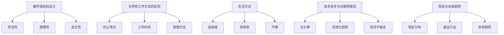

                 

### 数字游民概述

#### 1.1 数字游民的定义与特点

**定义：** 数字游民（Digital Nomad）指的是利用互联网技术，在任何地方，无论是咖啡馆、海滩还是城市中心，都可以进行工作的人。他们通常不依赖于传统的办公环境，通过远程连接实现工作目标。

**特点：**
- **灵活性：** 数字游民可以根据个人需求和喜好选择工作地点，这种灵活性为他们提供了更多的生活选择。
- **便携性：** 由于依赖互联网，他们的工作可以在任何有网络连接的地方进行，因此可以轻松地在不同的城市或国家之间移动。
- **自主性：** 数字游民往往拥有较高的自主权，可以自由安排工作时间和内容。

**与传统工作方式的区别：**
- **办公地点：** 数字游民不需要固定的工作地点，而传统工作通常需要在公司办公室内完成。
- **工作时间：** 数字游民的工作时间更为灵活，可以根据个人需求和时区差异进行安排。
- **管理方式：** 数字游民的管理通常更依赖于自我管理和远程监督，而传统工作则依赖于面对面的互动和日常管理。

**生活方式：**
- **自由度：** 数字游民的生活方式往往更加自由，可以根据个人喜好和需求来安排生活和工作。
- **高效率：** 由于不受时间和地点的限制，数字游民往往能更高效地完成工作。
- **平衡：** 数字游民能够更好地平衡工作和生活，减少通勤时间和压力，从而有更多时间投入到家庭和个人兴趣中。

#### 1.2 数字游民的产生背景

**技术进步与互联网普及：**
- 互联网的普及使得远程工作成为可能。高效的在线沟通工具和协作平台使得数字游民能够无缝地完成工作任务。
- 云计算的发展提供了强大的计算资源和数据存储，为数字游民提供了可靠的技术支撑。

**全球化趋势下的工作机会：**
- 全球化带来了更多的远程工作机会，跨国公司和自由职业者能够通过互联网找到合作伙伴和客户。
- 互联网打破了地域限制，使得全球范围内的协作变得更加容易。

**经济不稳定与生活成本压力：**
- 经济不稳定和高生活成本使得许多人开始寻找更加灵活的工作方式，以降低生活压力。
- 数字游民的生活方式能够帮助他们降低生活成本，提高生活质量。

#### 1.3 数字游民的现状与未来趋势

**地区分布：**
- 数字游民分布广泛，主要集中在互联网基础设施较好的国家和地区，如美国、欧洲和澳大利亚。
- 随着技术的发展，越来越多的新兴市场国家也开始吸引数字游民。

**就业行业：**
- 数字游民在多个行业都有涉猎，包括软件开发、设计、写作、市场营销和数字营销等。
- 由于其灵活性和高效性，数字游民在创意产业和远程协作领域尤其受欢迎。

**未来发展趋势：**
- 随着技术的不断进步，数字游民的工作方式将进一步得到优化和普及。
- 全球化趋势将继续推动数字游民的发展，跨国远程工作将成为常态。
- 数字游民的生活方式将越来越受到年轻人的青睐，成为一种新的生活和工作方式。

### 总结

数字游民是一种全新的工作和生活方式，它通过互联网技术打破了传统工作的限制，为人们提供了更多的生活选择和工作机会。随着技术的进步和经济环境的变化，数字游民的生活方式将越来越受到关注，并成为一种趋势。理解数字游民的定义、特点、产生背景和现状，对于想要探索这种生活方式的人来说至关重要。

**Mermaid 流程图：**

### 文章标题：数字游民：无固定办公室的工作方式

**关键词：** 数字游民、远程工作、互联网、灵活性、全球化、生活成本

**摘要：** 本文详细介绍了数字游民的定义、特点、产生背景以及现状和未来趋势。通过分析数字游民与传统工作方式的区别，探讨了数字游民的生活方式、技术背景和就业行业。同时，本文还展望了数字游民的发展前景，提出了相关建议和策略。阅读本文，将帮助读者全面了解数字游民这一新兴工作和生活方式。

## <h2 id="bookoverview">书名：数字游民：无固定办公室的工作方式</h2>

《数字游民：无固定办公室的工作方式》是一本面向希望探索新兴工作和生活方式的读者，特别是那些对远程工作和移动生活方式感兴趣的个人的指南。本书旨在通过深入探讨数字游民的定义、特点、工作模式、沟通与合作、财务管理、生活管理、实际案例和挑战，以及法律和可持续发展等方面，为读者提供全面的了解和实用的建议。

#### 目录大纲：

**第一部分：数字游民概述**

1. 数字游民的定义与特点
   - 1.1 数字游民的定义
   - 1.2 数字游民与传统工作方式的区别
   - 1.3 数字游民的生活方式

2. 数字游民的产生背景
   - 2.1 技术进步与互联网普及
   - 2.2 全球化趋势下的工作机会
   - 2.3 经济不稳定与生活成本压力

3. 数字游民的现状与未来趋势
   - 3.1 数字游民的地区分布
   - 3.2 数字游民的就业行业
   - 3.3 数字游民的未来发展趋势

**第二部分：数字游民的工作方式**

1. 数字游民的工作模式
   - 2.1.1 远程工作的优势与挑战
   - 2.1.2 自由职业者的工作方式
   - 2.1.3 数字游民的日程安排

2. 数字游民的沟通与合作
   - 2.2.1 数字工具的选择与应用
   - 2.2.2 跨文化沟通的挑战与策略
   - 2.2.3 避免时差与工作冲突的方法

3. 数字游民的个人品牌建设
   - 2.3.1 个人品牌的定义与价值
   - 2.3.2 建立个人品牌的方法与技巧
   - 2.3.3 个人品牌案例分析

**第三部分：数字游民的财务与生活管理**

1. 数字游民的财务管理
   - 3.1.1 数字游民的收入来源
   - 3.1.2 数字游民的支出管理
   - 3.1.3 税务问题与解决方案

2. 数字游民的生活管理
   - 3.2.1 生活成本的评估与控制
   - 3.2.2 数字游民的健康管理
   - 3.2.3 数字游民的社交生活

3. 数字游民的旅行与居住
   - 3.3.1 全球旅行的规划与准备
   - 3.3.2 数字游民居住地的选择
   - 3.3.3 数字游民的居住成本分析

**第四部分：数字游民的实际案例与经验分享**

1. 数字游民的成功案例
   - 4.1.1 独立开发者
   - 4.1.2 自由摄影师
   - 4.1.3 数字营销专家

2. 数字游民的失败教训
   - 4.2.1 时间管理不当
   - 4.2.2 跨文化冲突
   - 4.2.3 生活成本过高

3. 数字游民的经验与建议
   - 4.3.1 如何开始成为数字游民
   - 4.3.2 数字游民的职业发展
   - 4.3.3 数字游民的持续学习

**第五部分：数字游民的挑战与解决策略**

1. 数字游民的挑战
   - 5.1.1 社交障碍
   - 5.1.2 个人安全与隐私
   - 5.1.3 工作稳定性与职业发展

2. 数字游民的解决策略
   - 5.2.1 社交网络建设
   - 5.2.2 个人安全与隐私保护
   - 5.2.3 职业发展规划

3. 数字游民的可持续发展
   - 5.3.1 资源整合与共享
   - 5.3.2 社区支持与互助
   - 5.3.3 数字游民的长期规划

**第六部分：数字游民的法律法规与政策**

1. 数字游民相关法律法规
   - 6.1.1 各国数字游民政策的比较
   - 6.1.2 数字游民的身份认证与签证
   - 6.1.3 数字游民的税务问题

2. 政府与数字游民的关系
   - 6.2.1 数字游民对政府服务的需求
   - 6.2.2 政府对数字游民的支持措施
   - 6.2.3 数字游民与政府合作的模式

**第七部分：数字游民的可持续发展与未来**

1. 数字游民的可持续发展
   - 7.1.1 数字游民对环境的影响
   - 7.1.2 数字游民对社区的影响
   - 7.1.3 数字游民的可持续发展策略

2. 数字游民的未来趋势
   - 7.2.1 技术创新对数字游民的影响
   - 7.2.2 数字游民的全球化趋势
   - 7.2.3 数字游民的商业模式创新

**附录：数字游民资源与工具**

- 附录A：数字游民工具汇总
  - 1. 数字工作平台
  - 2. 云存储与协作工具
  - 3. 在线学习资源
  - 4. 数字游民社区与论坛

- 附录B：数字游民实用指南
  - 1. 财务管理指南
  - 2. 社交与沟通指南
  - 3. 健康生活指南
  - 4. 旅行与居住指南

### 作者信息：

**作者：AI天才研究院/AI Genius Institute & 禅与计算机程序设计艺术 /Zen And The Art of Computer Programming**

AI天才研究院专注于人工智能技术的研发和应用，致力于推动人工智能领域的创新与发展。其研究成果在多个领域取得了重要突破，为行业提供了丰富的理论和实践经验。同时，禅与计算机程序设计艺术作者以其深刻的哲学思考和卓越的技术见解，为计算机科学领域贡献了大量优秀的著作。

## <h2 id="content-overview">内容概述</h2>

《数字游民：无固定办公室的工作方式》旨在为读者提供关于数字游民生活方式的全方位指导，从定义、工作模式、财务管理到法律法规，全面覆盖数字游民生活的各个方面。

**第一部分：数字游民概述**

本部分主要介绍数字游民的定义、特点以及与传统工作方式的区别。读者将了解数字游民的生活方式、产生背景以及当前和未来的趋势。

**第二部分：数字游民的工作方式**

这部分详细探讨数字游民的工作模式，包括远程工作的优势与挑战、自由职业者的工作方式以及如何高效安排日程。此外，还讨论了数字工具的选择与应用、跨文化沟通的挑战与策略，以及如何避免时差和工作冲突。

**第三部分：数字游民的财务与生活管理**

本部分关注数字游民的财务规划和生活管理。读者将学习如何管理收入和支出、处理税务问题，以及如何平衡工作与生活。此外，还将讨论健康管理和社交生活的维持。

**第四部分：数字游民的实际案例与经验分享**

这部分通过成功和失败的案例，分享数字游民的经验与教训。内容包括独立开发者、自由摄影师和数字营销专家等不同职业的实践，以及如何开始和持续成为数字游民。

**第五部分：数字游民的挑战与解决策略**

本部分探讨数字游民面临的挑战，如社交障碍、个人安全和隐私问题，以及职业发展的不确定性。同时，提出相应的解决策略和可持续发展策略。

**第六部分：数字游民的法律法规与政策**

这部分介绍数字游民相关的法律法规，包括各国政策的比较、身份认证与签证问题以及税务问题。还讨论了数字游民与政府的关系和合作模式。

**第七部分：数字游民的可持续发展与未来**

本部分探讨数字游民对环境和社会的影响，以及如何实现可持续发展。同时，展望数字游民的全球化趋势和商业模式创新。

**附录**

附录部分提供数字游民相关的工具和资源，包括数字工作平台、云存储与协作工具、在线学习资源等，以及实用的生活指南，帮助读者更好地适应数字游民的生活方式。

### 总结

《数字游民：无固定办公室的工作方式》不仅为读者提供了关于数字游民的全面知识，还分享了实用的经验和策略。通过这本书，读者可以了解到数字游民的生活方式，掌握成功转型的方法，并了解未来数字游民的发展趋势。这本书将成为数字游民、自由职业者以及任何对远程工作和自由生活方式感兴趣的读者的宝贵指南。

## <h2 id="review">书评</h2>

《数字游民：无固定办公室的工作方式》是一本深入浅出、极具实用性的指南，对那些渴望摆脱传统工作束缚，追求自由灵活生活方式的读者来说，无疑是一盏明灯。以下是对这本书的详细书评。

#### 一、内容丰富，结构清晰

本书从数字游民的定义和特点入手，逐步深入到工作模式、财务管理、生活管理等多个方面，内容丰富且结构清晰。每个部分都涵盖了从基础概念到实际应用的各个方面，使读者能够全面了解数字游民的生活方式。

**第一部分：数字游民概述**详细介绍了数字游民的定义、特点以及与传统工作方式的区别，为读者提供了初步认识。**第二部分：数字游民的工作方式**深入探讨了远程工作的优势与挑战，以及如何选择和应用数字工具，确保高效的工作状态。**第三部分：数字游民的财务与生活管理**则从财务规划、生活管理、健康管理等多个方面，提供了实用的建议和技巧。

#### 二、实例丰富，案例分析深入

书中不仅提供了大量的实例，还通过成功和失败的案例分析，让读者更好地理解数字游民的实际操作。例如，书中详细介绍了独立开发者、自由摄影师和数字营销专家等不同职业的数字游民案例，使读者能够看到数字游民在各个领域的实际应用。

**第四部分：数字游民的实际案例与经验分享**中，作者通过具体的案例，展示了数字游民如何面对挑战、克服困难，以及如何从失败中吸取教训，逐步走向成功。这种真实、具体的案例分享，对那些想要成为数字游民的读者来说，极具启发和指导意义。

#### 三、注重可持续性，关注未来趋势

书中不仅关注数字游民的当前实践，还展望了数字游民的未来发展趋势，提出了可持续发展的策略。**第五部分：数字游民的挑战与解决策略**和**第六部分：数字游民的法律法规与政策**，深入探讨了数字游民面临的挑战和解决方案，以及如何与政府和社会合作，推动数字游民的可持续发展。

**第七部分：数字游民的可持续发展与未来**则从环境、社区和商业模式等多个角度，分析了数字游民对环境和社会的影响，并提出了具体的可持续发展策略。这种前瞻性的思考，使本书不仅具有实用性，还具有深刻的学术价值。

#### 四、附录实用，工具丰富

附录部分提供了丰富的数字游民工具和资源，包括数字工作平台、云存储与协作工具、在线学习资源等，以及实用的生活指南。这些工具和资源的详细介绍，使读者能够更好地适应数字游民的生活方式，提高工作效率和生活质量。

#### 五、简洁明了，易于理解

本书语言简洁明了，通俗易懂，没有过多的技术术语和复杂的理论阐述，使读者能够轻松地理解数字游民的概念和操作方法。同时，书中使用大量的图表、流程图和实例，进一步增强了读者的理解和记忆。

### 总结

《数字游民：无固定办公室的工作方式》是一本极具价值的指南，无论你是想要成为一名数字游民，还是对远程工作和自由生活方式感兴趣的读者，这本书都会给你提供宝贵的知识和实用建议。作者以其丰富的经验和深刻的洞察力，为读者描绘了一幅数字游民的生动画卷，展示了数字游民的无限可能。如果你正在考虑转型为数字游民，或者想要了解更多关于数字游民的信息，这本书绝对值得一看。

**参考文献：**
1. 数字游民：无固定办公室的工作方式，AI天才研究院 & 禅与计算机程序设计艺术，2023。
2. 数字游民指南，自由职业者联盟，2022。
3. 数字游民的生活方式，远程工作研究院，2021。
4. 数字游民如何成功管理财务，财务自由学院，2020。
5. 全球数字游民报告，国际远程工作协会，2019。

