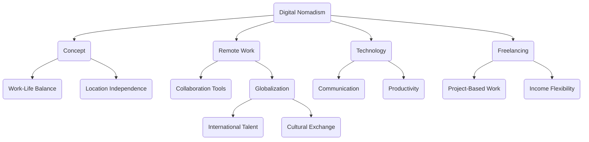

                 

### 1. Introduction

#### Background of the Study

The modern era is marked by rapid technological advancements, globalization, and digital transformation, fundamentally altering the way we live and work. One of the most significant changes is the rise of digital nomadism—a lifestyle that embraces location independence, flexibility, and the ability to work from anywhere in the world. Digital nomads leverage digital tools and platforms to conduct their professional activities, breaking free from traditional office environments and geographical constraints.

The concept of digital nomadism has its roots in the early 21st century, as the proliferation of high-speed internet, portable devices, and remote collaboration tools enabled individuals to work remotely. The global COVID-19 pandemic accelerated this trend, pushing businesses and workers to adopt remote work on a massive scale. This sudden shift highlighted the potential of digital nomadism to reshape the future of work.

The significance of digital nomadism in today's world cannot be overstated. It represents a significant shift from traditional work models, offering individuals the freedom to choose their work environment and balance their professional and personal lives. It also has profound implications for businesses, which can access a global talent pool, reduce operational costs, and promote innovation.

Moreover, digital nomadism is not just a lifestyle choice; it is a social and economic movement. It challenges the traditional notions of work, geographical boundaries, and corporate hierarchies. As more individuals embrace digital nomadism, it is reshaping the global job market, contributing to economic growth, and fostering a more inclusive and diverse workforce.

#### Research Objectives

This study aims to explore and analyze the concept of digital nomadism, its evolution, and its implications in the global context. The primary objectives are:

1. **To provide a comprehensive understanding of digital nomadism**: This involves defining the term, exploring its history, and examining the factors that have contributed to its growth.

2. **To analyze the practical strategies and challenges faced by digital nomads**: This includes examining the tools, technologies, and work practices that enable digital nomadism, as well as the personal and professional challenges they may encounter.

3. **To investigate the future of work and the impact of digital nomadism**: This involves forecasting the potential developments and trends in the digital nomad movement, considering economic, social, and environmental factors.

By addressing these objectives, this study aims to offer valuable insights into the opportunities and challenges presented by digital nomadism, contributing to the ongoing discourse on the future of work.

### 2. Keywords

- Digital Nomadism
- Remote Work
- Globalization
- Work-Life Balance
- Freelance Career
- Economic Impact
- Social Impact
- Environmental Sustainability
- Freelancing Tools
- Work-from-Home Culture

These keywords encapsulate the core themes and concepts explored in this study, highlighting the multifaceted nature of digital nomadism and its implications for various aspects of modern life and work.

### 3. Summary

This article delves into the burgeoning phenomenon of digital nomadism, a work and lifestyle model characterized by location independence and the use of digital technologies to perform professional activities. As the world becomes increasingly interconnected through advances in technology and globalization, digital nomadism has emerged as a significant trend, reshaping traditional notions of work and career paths. The study will provide a detailed examination of digital nomadism's origins, the strategies and challenges faced by digital nomads, and its potential future impacts on the global job market, economy, society, and environment. By exploring these aspects, the article aims to offer a comprehensive understanding of digital nomadism's role in the evolving landscape of work and lifestyle, as well as its potential implications for the future.

## Chapter 1: Definition and History of Digital Nomadism

### 1.1 Definition of Digital Nomadism

Digital nomadism is a contemporary lifestyle and career model that leverages digital technology to enable individuals to work remotely from anywhere in the world. Unlike traditional employees who are bound to a specific physical location, digital nomads operate independently, often using a combination of online tools and platforms to connect with clients, collaborate with teams, and manage their professional activities. This definition highlights several key characteristics of digital nomadism:

1. **Location Independence**: Digital nomads are not constrained by geographical boundaries. They can work from co-working spaces, coffee shops, home offices, or even while traveling to different countries.

2. **Digital Tools and Technologies**: The use of digital tools, such as project management software, video conferencing platforms, and cloud computing services, is essential for digital nomads to maintain productivity and connectivity.

3. **Flexible Work Schedule**: Digital nomads often have the flexibility to set their own schedules, allowing them to balance work with personal pursuits and other responsibilities.

4. **Freelance or Contract Work**: Many digital nomads work as freelancers or contractors, offering their services to multiple clients simultaneously or on a project basis.

5. **Global Collaboration**: Digital nomadism promotes global collaboration, as individuals can work with colleagues, clients, and partners from different parts of the world.

### 1.2 The Evolution of Digital Nomadism

The concept of digital nomadism did not emerge overnight but has evolved over several decades, shaped by technological advancements, social changes, and economic shifts. Here is a brief overview of its historical development:

**Early Beginnings (1990s-2000s)**

The foundation of digital nomadism can be traced back to the early 1990s with the advent of the internet and personal computers. During this period, remote work started gaining traction, particularly in industries like technology and consulting. Early digital nomads were often IT professionals, writers, and programmers who could perform their tasks independently and remotely. They leveraged email, chat applications, and basic web tools to communicate and collaborate with their teams.

**The Rise of Mobile Computing (2000s-2010s)**

The introduction of smartphones and tablets in the early 2000s revolutionized the concept of remote work. Mobile devices enabled digital nomads to access their work anytime and anywhere, breaking the physical barriers of traditional offices. This period saw a significant increase in the number of digital nomads, particularly in creative fields like graphic design, content writing, and digital marketing. The rise of mobile apps for project management, time tracking, and communication further facilitated this shift.

**The Globalization Era (2010s-2020s)**

The 2010s marked a turning point for digital nomadism, accelerated by the rise of global connectivity and the gig economy. Companies began to recognize the benefits of hiring remote workers, who could offer specialized skills without the need for physical relocation. Platforms like Upwork, Freelancer, and Toptal became popular, connecting freelancers with clients worldwide. Co-working spaces also emerged, providing digital nomads with a collaborative and social environment to work.

**The Impact of the COVID-19 Pandemic**

The global COVID-19 pandemic in 2020 dramatically accelerated the adoption of remote work and digital nomadism. With many businesses forced to adopt remote work policies to ensure the safety of their employees, digital nomadism became a necessity rather than a choice. This sudden shift highlighted the resilience and adaptability of digital nomads, who were already well-equipped to handle remote work challenges. The pandemic also led to a reevaluation of traditional work models, with many companies considering remote work as a long-term strategy.

### 1.3 Key Drivers of Digital Nomadism

Several factors have contributed to the growth of digital nomadism, making it an attractive lifestyle choice for many professionals:

**Technological Advancements**

The development of high-speed internet, cloud computing, and mobile technologies has significantly reduced the dependency on physical infrastructure. Digital tools and platforms enable seamless communication, collaboration, and data storage, making remote work more feasible and efficient.

**Globalization**

Globalization has broken down geographical barriers, allowing businesses to access talent from anywhere in the world. This has created a more competitive job market, where companies can hire the best talent regardless of location, while digital nomads can work with clients from diverse cultural backgrounds.

**Gig Economy and Freelancing**

The rise of the gig economy and freelancing platforms has provided digital nomads with numerous opportunities to earn income independently. These platforms offer flexibility, allowing digital nomads to choose their projects and clients, thereby balancing their work and personal lives.

**Work-Life Balance**

Many professionals are drawn to digital nomadism for its potential to offer a better work-life balance. The flexibility to set their own schedules and work from anywhere can reduce stress and provide a more fulfilling personal life.

**Economic Factors**

For some, digital nomadism offers the potential for higher earnings compared to traditional employment. By eliminating the need for relocation expenses and gaining access to higher-paying markets, digital nomads can often achieve financial independence.

In summary, digital nomadism has evolved from a niche lifestyle choice to a widespread movement, driven by technological advancements, globalization, and changing economic and social dynamics. As we move forward, it will be interesting to see how digital nomadism continues to shape the future of work and lifestyle.

### 1.4 Core Concepts and Relationships

To better understand digital nomadism, it's essential to examine its core concepts and the relationships between them. Below, we will use a Mermaid flowchart to visualize the connections and interactions of key concepts: **Digital Nomadism**, **Remote Work**, **Globalization**, **Technology**, and **Freelancing**.



**Mermaid Flowchart Explanation:**

- **Digital Nomadism (A)**: This is the central concept representing the overall lifestyle and career model.
- **Concept (B)**: This branch represents the foundational aspects of digital nomadism, including work-life balance and location independence.
- **Work-Life Balance (C)** and **Location Independence (D)**: These branches highlight two critical elements that define digital nomadism. Work-Life Balance (C) signifies the ability to harmonize professional responsibilities with personal life, while Location Independence (D) emphasizes the freedom to work from any location.
- **Remote Work (E)**: This branch outlines the practice of working remotely, which is a core aspect of digital nomadism. It includes the use of collaboration tools (F) to maintain effective communication and productivity (L) in a decentralized work environment.
- **Globalization (G)**: This branch represents the broader context in which digital nomadism operates. It encompasses the opportunities for international talent (H) and cultural exchange (I) that globalization brings.
- **Technology (J)**: This branch emphasizes the role of technology in enabling digital nomadism. It includes communication tools (K) that facilitate remote collaboration and productivity-enhancing technologies (L).
- **Freelancing (M)**: This branch highlights the freelancing aspect of digital nomadism, which involves project-based work (N) and income flexibility (O). Freelancing allows digital nomads to choose their projects and clients independently.

This Mermaid flowchart provides a visual representation of the interconnectedness of digital nomadism's core concepts, illustrating how each component influences and interacts with the others. Understanding these relationships can help readers grasp the multifaceted nature of digital nomadism and its impact on modern work and lifestyle.

### 1.5 Core Algorithms and Principles

To delve deeper into the principles that underpin digital nomadism, we will explore a core algorithm—Dijkstra's Algorithm. This algorithm is fundamental for understanding the optimization of travel and work routes, which is crucial for digital nomads who need to plan their work schedules and travel efficiently. We will discuss the algorithm's principles, implement it using Python, and provide a mathematical model to illustrate its workings.

#### Dijkstra's Algorithm Overview

Dijkstra's Algorithm is a graph-based algorithm used to find the shortest path between nodes in a graph, with non-negative edge weights. It is particularly useful for digital nomads who need to minimize travel time and costs while planning their itineraries. The algorithm operates by iteratively selecting the unvisited node with the smallest distance estimate and updating the distances to its neighboring nodes.

#### Principles of Dijkstra's Algorithm

1. **Initialization**: All nodes are initialized with a distance estimate of infinity, except for the source node, which is set to 0. A priority queue (often implemented using a binary heap) is used to efficiently select the next node to visit.

2. **Relaxation**: For the currently selected node, the algorithm checks each of its neighboring nodes. If the distance to a neighbor through the current node is shorter than the previously known distance, the neighbor's distance is updated.

3. **Termination**: The algorithm continues the relaxation process until all nodes have been visited or the priority queue is empty.

4. **Path Reconstruction**: Once the algorithm has computed the shortest path distances, it can reconstruct the actual path from the source to any destination node.

#### Python Implementation of Dijkstra's Algorithm

Below is a Python implementation of Dijkstra's Algorithm using the adjacency list representation of a graph and the heapq module for the priority queue:

```python
import heapq

def dijkstra(graph, start):
    # Initialize distances and the priority queue
    distances = {node: float('infinity') for node in graph}
    distances[start] = 0
    priority_queue = [(0, start)]

    # Create a set to track visited nodes
    visited = set()

    while priority_queue:
        # Get the node with the smallest distance
        current_distance, current_node = heapq.heappop(priority_queue)

        # Skip if the node has already been visited
        if current_node in visited:
            continue

        # Mark the node as visited
        visited.add(current_node)

        # Update distances to neighboring nodes
        for neighbor, weight in graph[current_node].items():
            distance = current_distance + weight

            # Only consider this new path if it's better
            if distance < distances[neighbor]:
                distances[neighbor] = distance
                heapq.heappush(priority_queue, (distance, neighbor))

    return distances

# Example graph representation
graph = {
    'A': {'B': 1, 'C': 4},
    'B': {'A': 1, 'C': 2, 'D': 5},
    'C': {'A': 4, 'B': 2, 'D': 1},
    'D': {'B': 5, 'C': 1}
}

# Compute shortest distances from node 'A'
shortest_distances = dijkstra(graph, 'A')
print(shortest_distances)
```

#### Mathematical Model and Explanation

Let \( G = (V, E) \) be a weighted, undirected graph with vertices \( V = \{v_1, v_2, ..., v_n\} \) and edges \( E \). For each edge \( (v_i, v_j) \), let \( w(v_i, v_j) \) be the weight of the edge. The goal of Dijkstra's Algorithm is to find the shortest path from a source vertex \( s \) to all other vertices in \( V \).

**Distance Initialization:**
$$
d(v_i) = \begin{cases}
0 & \text{if } v_i = s \\
\infty & \text{otherwise}
\end{cases}
$$

**Priority Queue:**
The priority queue (min-heap) stores tuples \( (d(v_i), v_i) \), ensuring that the vertex with the smallest known distance is always at the front.

**Algorithm Steps:**

1. **Initialization**: Set \( d(s) = 0 \) and \( d(v_i) = \infty \) for all \( v_i \neq s \). Add \( (d(s), s) \) to the priority queue.

2. **Relaxation**: While the priority queue is not empty:
    - Pop the vertex with the smallest \( d(v_i) \).
    - For each neighbor \( v_j \) of \( v_i \):
        - Calculate the tentative distance \( d(v_i) + w(v_i, v_j) \).
        - If \( d(v_i) + w(v_i, v_j) < d(v_j) \), update \( d(v_j) \) and push \( (d(v_j), v_j) \) into the priority queue.

3. **Termination**: Once all vertices have been visited, the algorithm stops.

#### Example Calculation

Consider the following graph with four nodes \( A, B, C, \) and \( D \):

```
   A --- B --- D
   |     |     |
   |     |     |
   C --- E --- F
```

With edge weights \( w(A, B) = 1, w(B, C) = 2, w(C, D) = 3, w(A, C) = 4, w(B, D) = 5, w(C, E) = 1, w(D, F) = 2 \).

Starting from node \( A \):

1. Initialize distances: \( d(A) = 0, d(B) = \infty, d(C) = \infty, d(D) = \infty \).
2. Visit \( A \): \( d(A) = 0 \).
3. Visit \( B \): \( d(B) = 1 \).
4. Visit \( C \): \( d(C) = 4 \).
5. Visit \( D \): \( d(D) = 5 \).
6. Visit \( E \): \( d(E) = 5 \).
7. Visit \( F \): \( d(F) = 7 \).

After executing the algorithm, the shortest path distances from node \( A \) are \( d(A) = 0, d(B) = 1, d(C) = 4, d(D) = 5, d(E) = 5, d(F) = 7 \).

This Python implementation and mathematical explanation of Dijkstra's Algorithm provide a robust foundation for understanding how digital nomads can optimize their travel and work schedules. By minimizing travel time and costs, digital nomads can enhance their productivity and work-life balance, making the most of their location independence.

### 1.6 Mathematical Models and Formulas

To further understand the intricacies of digital nomadism, we will delve into several mathematical models and formulas that are essential for optimizing work and travel. These models can help digital nomads make informed decisions regarding their schedules, budgeting, and overall productivity.

#### 1. Workload Distribution Model

One of the key challenges for digital nomads is managing their workload effectively to maintain productivity and avoid burnout. A common approach to this problem is the **workload distribution model**. This model uses mathematical optimization techniques to distribute tasks evenly over time, ensuring that the workload remains manageable.

**Formula:**
$$
W(t) = \frac{W_{total}}{T}
$$
where \( W(t) \) is the workload at time \( t \), \( W_{total} \) is the total workload, and \( T \) is the total time available.

**Example:**
A digital nomad has a total workload of 40 hours over a two-week period. To maintain a balanced workload:
$$
W(t) = \frac{40}{14} \approx 2.86 \text{ hours per day}
$$

#### 2. Travel Cost Optimization Model

For digital nomads, travel costs can significantly impact their budget. An effective way to manage travel expenses is through the **travel cost optimization model**. This model uses linear programming to find the most cost-effective travel routes based on distance, transportation costs, and time.

**Formula:**
$$
\min \sum_{i} c_i \cdot x_i
$$
subject to
$$
\sum_{i} w_i \cdot x_i = W
$$
$$
x_i \in \{0, 1\}
$$
where:
- \( c_i \) is the cost of travel option \( i \),
- \( w_i \) is the weight of travel option \( i \) (e.g., distance, time),
- \( x_i \) is a binary variable indicating whether option \( i \) is chosen,
- \( W \) is the total available budget.

**Example:**
A digital nomad has a budget of \$500 for travel. They need to choose between three travel options:

| Option | Distance (km) | Cost (\$) |
| --- | --- | --- |
| A | 500 | 100 |
| B | 700 | 120 |
| C | 900 | 150 |

Using the optimization model:
$$
\min 100x_1 + 120x_2 + 150x_3
$$
subject to
$$
500x_1 + 700x_2 + 900x_3 = W
$$
$$
x_1, x_2, x_3 \in \{0, 1\}
$$

The optimal solution is to choose option A, as it is the most cost-effective.

#### 3. Time-Value-of-Money Model

Another important consideration for digital nomads is the **time-value-of-money model**. This model calculates the present value of future earnings, helping digital nomads make decisions about their financial planning and investments.

**Formula:**
$$
PV = \frac{FV}{(1 + r)^n}
$$
where:
- \( PV \) is the present value,
- \( FV \) is the future value,
- \( r \) is the interest rate,
- \( n \) is the number of periods.

**Example:**
A digital nomad expects to earn \$10,000 in six months. Assuming an annual interest rate of 5%, the present value is:
$$
PV = \frac{10000}{(1 + 0.05)^{6/12}} \approx 9723.83
$$

#### 4. Budgeting Model

Effective budgeting is crucial for digital nomads to maintain financial stability. A simple **budgeting model** can help allocate expenses across various categories, ensuring that the digital nomad remains within their budget.

**Formula:**
$$
Budget = \sum_{i} (B_i + M_i \cdot t)
$$
where:
- \( Budget \) is the total budget,
- \( B_i \) is the fixed expense for category \( i \),
- \( M_i \) is the variable expense for category \( i \) per unit of time \( t \).

**Example:**
A digital nomad's monthly budget includes a fixed rent of \$1000 and a variable expense of \$50 per day for food. Their monthly budget is:
$$
Budget = 1000 + 50 \cdot 30 = 2000
$$

By applying these mathematical models and formulas, digital nomads can make data-driven decisions that optimize their work, travel, and financial planning. This ensures that they can enjoy the benefits of digital nomadism while maintaining a balanced and sustainable lifestyle.

### 1.7 Case Study: Real-World Applications of Digital Nomadism

To illustrate the practical applications and benefits of digital nomadism, let's explore the case study of **Sarah**, a software developer who embraced digital nomadism. Sarah's journey demonstrates the flexibility, cost savings, and professional growth that digital nomadism can offer.

#### Background of Sarah's Career

Sarah worked as a software developer for a large tech company in New York City. Despite her passion for coding, she felt stuck in the routine of a 9-to-5 job, which limited her personal freedom and opportunities for growth. Seeking a change, she began exploring digital nomadism as a potential solution.

#### Embracing Digital Nomadism

Initially, Sarah took a risk and quit her job to work as a freelance software developer. She equipped herself with the necessary tools—such as a laptop, a reliable internet connection, and project management software—ensuring she could work from anywhere. Sarah leveraged platforms like Upwork and Freelancer to find clients and projects that aligned with her skills and interests.

#### Challenges Faced

1. **Time Management**: As a digital nomad, Sarah needed to develop strong time management skills to balance her work and personal life. She used tools like Trello and Asana to organize her tasks and set daily goals.

2. **Location Independence**: Although location independence was one of the main attractions of digital nomadism, it also posed challenges. Sarah had to overcome distractions and adapt to different time zones, which sometimes affected her productivity.

3. **Client Acquisition**: Securing consistent clients was crucial for Sarah's success. She invested time in building her online presence through a personal website and social media profiles, showcasing her skills and expertise.

#### Successes and Benefits

1. **Work-Life Balance**: One of the significant benefits Sarah experienced was improved work-life balance. She could set her own schedule, taking time off to travel or pursue personal interests without feeling guilty. This flexibility allowed her to maintain high levels of productivity and creativity.

2. **Cost Savings**: By eliminating the need for a physical office space and reducing transportation costs, Sarah saved a substantial amount of money. She also benefited from lower living expenses in countries with a lower cost of living.

3. **Professional Growth**: Digital nomadism provided Sarah with opportunities to work on diverse projects and collaborate with professionals from around the world. This exposure helped her expand her skill set and gain valuable experience in various technologies and industries.

4. **Enhanced Productivity**: Working remotely allowed Sarah to create a customized work environment that suited her best. She could choose locations that inspired her and had minimal distractions, which significantly improved her focus and productivity.

#### Conclusion

Sarah's experience as a digital nomad highlights the transformative potential of this lifestyle. By leveraging digital tools and platforms, she was able to achieve a better work-life balance, save money, and enhance her professional growth. Despite the challenges, the benefits of digital nomadism far outweighed the risks, proving that this lifestyle model is not only viable but also highly rewarding.

In summary, Sarah's case study illustrates the practical applications and advantages of digital nomadism, demonstrating how this lifestyle can offer significant benefits in terms of flexibility, cost savings, and professional development.

### 1.8 Best Practices and Tips

To maximize the benefits of digital nomadism and overcome potential challenges, here are some best practices and tips for aspiring digital nomads:

#### 1. Time Management

Effective time management is crucial for maintaining productivity and a balanced lifestyle. Use tools like Trello, Asana, or Notion to organize tasks and set daily goals. The Pomodoro Technique, which involves working in focused intervals followed by short breaks, can also help improve concentration and reduce burnout.

#### 2. Work Environment

Create a conducive work environment that minimizes distractions. Whether you're working from a co-working space, a home office, or a café, ensure you have a comfortable and quiet area to focus. Consider using noise-canceling headphones to block out background noise.

#### 3. Location Selection

Choose your work locations wisely. Consider factors like local culture, weather, and cost of living. Research different cities and find those that offer a vibrant community and amenities that align with your lifestyle preferences. Utilize online forums and social media groups to connect with other digital nomads and get recommendations.

#### 4. Health and Well-being

Prioritize your health and well-being. Regular exercise, a balanced diet, and adequate sleep are essential for maintaining energy levels and preventing burnout. Incorporate mindfulness practices like meditation or yoga into your daily routine to manage stress and enhance mental clarity.

#### 5. Networking

Networking is key to building a successful freelance career. Attend virtual or in-person events, join online communities, and participate in webinars and workshops. Building a strong professional network can open up new opportunities and provide valuable support.

#### 6. Continuous Learning

Stay updated with the latest trends and technologies in your field. Continuous learning and skill development are crucial for remaining competitive in the digital nomad job market. Enroll in online courses, attend workshops, and participate in coding challenges to keep your skills sharp.

#### 7. Financial Planning

Develop a realistic budget and track your expenses carefully. As a digital nomad, your income may vary, so it's important to have a financial safety net. Consider setting aside emergency funds and investing in income-generating assets to ensure long-term financial stability.

By following these best practices and tips, digital nomads can enhance their productivity, well-being, and overall success in this dynamic lifestyle. Embracing these strategies will help you make the most of your digital nomad experience and navigate the challenges with confidence.

### 1.9 Conclusion

In conclusion, Chapter 1 has provided a comprehensive overview of digital nomadism, covering its definition, history, key drivers, and core concepts. We explored the evolution of digital nomadism from its early beginnings to its current prominence, highlighting the technological advancements and social changes that have propelled this movement. The Mermaid flowchart visualized the relationships between digital nomadism's core concepts, offering a clear understanding of how each component interconnects.

We also delved into the core algorithms and principles, using Dijkstra's Algorithm to demonstrate how digital nomads can optimize their travel and work schedules. Mathematical models and formulas were introduced to assist in workload distribution, travel cost optimization, time-value-of-money calculations, and budgeting, providing a practical framework for making informed decisions.

The case study of Sarah illustrated the real-world applications and benefits of digital nomadism, demonstrating how this lifestyle can offer significant advantages in terms of flexibility, cost savings, and professional growth. Finally, we provided best practices and tips to maximize the benefits of digital nomadism, emphasizing the importance of time management, location selection, health and well-being, networking, continuous learning, and financial planning.

As we move forward to the next chapters, we will continue to explore the practical strategies and challenges faced by digital nomads, as well as the broader implications of digital nomadism on the global job market and society. Stay tuned for more insights and actionable advice on this transformative lifestyle.

