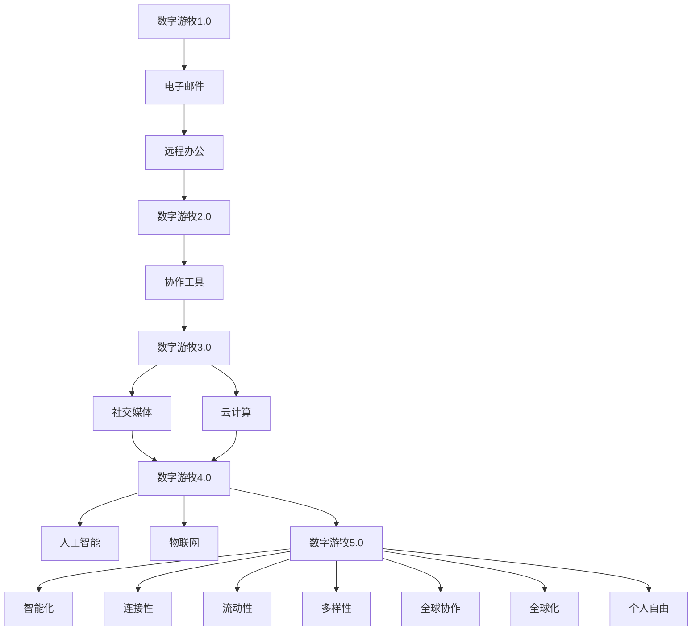

                 

### 数字游牧5.0：全球公民的生活方式

> 关键词：数字游牧、全球公民、远程工作、生活方式、技术进步

> 摘要：
本文将深入探讨数字游牧5.0时代的到来，以及这一新阶段对全球公民生活方式的深远影响。通过回顾数字游牧的发展历程，分析核心概念与联系，介绍远程工作的核心技能与工具，探讨全球公民的理念与实践，以及数字游牧者如何维护心理健康和个人成长，本文旨在为读者呈现一幅数字游牧5.0时代的全景图，并提供实用的建议和展望。

## 目录

1. **数字游牧5.0：全球公民的生活方式**
2. **关键词**
3. **摘要**
4. **第一部分：数字游牧概述**
   - **第1章：数字游牧的历史与演变**
     - **1.1 数字游牧1.0到4.0的发展历程**
     - **1.2 数字游牧5.0的特点与变革**
5. **第二部分：数字游牧的技能与工具**
   - **第3章：远程工作技能提升**
     - **3.1 高效沟通与协作工具**
     - **3.2 时间管理与工作流程优化**
   - **第4章：数字游牧者必备技术技能**
     - **4.1 编程与软件开发**
     - **4.2 数字营销与社交媒体运营**
   - **第5章：数字游牧生活工具**
     - **5.1 网络连接与云计算**
     - **5.2 数字货币与跨境支付**
6. **第三部分：全球公民的概念与操作**
   - **第6章：全球公民的理念**
     - **6.1 全球化的影响与趋势**
     - **6.2 全球公民的权益与责任**
   - **第7章：如何在数字游牧中成为全球公民**
     - **7.1 跨境旅行与居住**
     - **7.2 跨国教育与职业发展**
7. **第四部分：数字游牧生活与心理健康**
   - **第8章：数字游牧者的心理健康**
     - **8.1 应对孤独与焦虑**
     - **8.2 心理健康维护与自我提升**
   - **第9章：平衡数字游牧生活与工作**
     - **9.1 工作与休闲的平衡**
     - **9.2 持续学习的动力与方法**
8. **第五部分：数字游牧与个人成长**
   - **第10章：数字游牧中的自我认知**
     - **10.1 个人品牌建设**
     - **10.2 个人价值的提升**
   - **第11章：数字游牧者的社交网络**
     - **11.1 社交媒体的使用与影响**
     - **11.2 建立跨国社交圈**
9. **第六部分：数字游牧的未来趋势**
   - **第12章：数字游牧的未来发展方向**
     - **12.1 新兴技术与数字游牧**
     - **12.2 数字游牧与全球治理**
   - **第13章：数字游牧的社会影响与责任**
     - **13.1 对环境的影响**
     - **13.2 对社会发展的影响**
10. **附录**
    - **资源列表**
    - **最佳实践 tips**
    - **小结**
    - **注意事项**
    - **拓展阅读**

## 引言

### 数字游牧：概念与历史

数字游牧，这个词汇在近年变得越来越流行，它指的是利用互联网和远程工作技术，在全球范围内自由工作、生活和学习的一种生活方式。数字游牧者通常不受地理限制，通过互联网进行沟通、协作和交付工作，这种模式使得人们可以更灵活地安排自己的生活和工作。

数字游牧的历史可以追溯到互联网的早期阶段。最初，数字游牧1.0时代主要依赖于电子邮件和简单的远程办公工具。随着互联网的普及，数字游牧2.0时代到来，人们开始使用更加先进的协作工具，如即时通讯软件和远程会议系统。数字游牧3.0时代见证了社交媒体和云计算的兴起，使得全球协作和知识共享变得更加容易。而数字游牧4.0时代，随着人工智能、物联网等新技术的应用，数字游牧变得更加智能和高效。

### 全球公民：理念与实践

全球公民，是指那些认同并积极参与全球社会、经济和文化活动的人。他们通常具有跨国界的视野和思维方式，关注全球问题，并积极参与解决。全球公民的理念强调个人责任与全球利益的平衡，倡导多样性、包容性和可持续发展。

数字游牧5.0时代的到来，使得全球公民的理念更加深入人心。数字游牧者不仅可以在全球范围内自由流动，还可以通过网络连接参与到全球范围内的各种项目和活动中。这种流动性和参与性，为全球公民提供了更多的机会和平台，同时也提出了新的挑战。

### 本文结构

本文将分为六个主要部分，首先回顾数字游牧的发展历程，然后探讨数字游牧的核心技能与工具，接着介绍全球公民的理念与实践，随后关注数字游牧者的心理健康和个人成长，最后展望数字游牧的未来趋势，并讨论其对社会的影响与责任。通过这些部分的深入探讨，本文旨在为读者提供一幅全面、深入的数字游牧5.0时代的全景图。

## 第一部分：数字游牧概述

### 第1章：数字游牧的历史与演变

#### 1.1 数字游牧1.0到4.0的发展历程

数字游牧1.0时代，始于互联网的兴起。在这个时代，电子邮件成为了主要的沟通工具，人们开始尝试通过远程办公的方式工作。尽管技术水平有限，但这一时代的出现为后续的发展奠定了基础。

随着互联网的普及，数字游牧2.0时代到来。这个时代的特点是远程工作的普及和协作工具的出现。即时通讯软件、远程会议系统和云存储等工具的广泛应用，使得人们可以更加便捷地进行全球协作。这一阶段的数字游牧者，开始享受到远程工作带来的灵活性和自由度。

数字游牧3.0时代，社交媒体和云计算的兴起，进一步改变了数字游牧的格局。社交媒体平台使得人们可以轻松建立全球性的社交网络，而云计算技术则提供了强大的数据处理能力和存储能力。这一时代的数字游牧者，不仅可以自由流动，还可以在全球范围内共享知识和资源。

数字游牧4.0时代，随着人工智能和物联网的发展，数字游牧进入了新的阶段。人工智能技术使得远程工作的智能化程度大幅提升，而物联网技术则使得数字游牧者可以随时随地接入全球网络，实现更加高效的工作和生活。这一时代的数字游牧者，拥有更多的工具和资源，可以更加自由地探索全球。

#### 1.2 数字游牧5.0的特点与变革

数字游牧5.0时代，标志着数字游牧进入了一个全新的阶段。这一阶段的特点主要体现在以下几个方面：

1. **更高的智能化**：人工智能技术的进一步发展，使得数字游牧者的工作方式更加智能化。自动化工具和智能系统的应用，使得工作流程更加高效，减少了人工干预的需求。

2. **更广泛的连接性**：物联网技术的普及，使得数字游牧者可以随时随地接入全球网络。智能家居、智能交通、智能医疗等领域的应用，使得数字游牧者的生活更加便利和舒适。

3. **更自由的流动性**：数字游牧5.0时代，人们可以更加自由地选择工作和生活的地点。跨国旅行和居住变得更加容易，数字游牧者可以在全球范围内自由流动，寻找最适合自己的工作和生活环境。

4. **更丰富的多样性**：数字游牧5.0时代，人们可以更加多样化地选择工作和生活方式。无论是远程办公、自由职业，还是跨国创业，数字游牧者都可以根据自己的需求和兴趣，选择最适合的方式。

5. **更强大的全球合作**：数字游牧5.0时代，全球合作变得更加紧密和高效。通过互联网和智能工具，人们可以跨越地域和国界，实现全球范围内的协作和创新。

#### 核心概念与联系

在数字游牧5.0时代，几个核心概念紧密相连，构成了这一新阶段的基石。以下是这些核心概念及其相互关系：

1. **远程工作**：远程工作是数字游牧的基础，它使得人们可以在任何地点进行工作。随着远程工作工具和技术的不断进步，远程工作的效率和灵活性得到了显著提升。

2. **全球协作**：全球协作是数字游牧5.0时代的核心，通过互联网和智能工具，全球协作变得更加便捷和高效。全球协作不仅限于工作，还包括学习、娱乐和社交等多个方面。

3. **智能技术**：智能技术是数字游牧5.0时代的重要推动力，人工智能、物联网、区块链等技术的应用，使得数字游牧者的工作和生活更加智能化。

4. **全球化**：全球化是数字游牧5.0时代的大背景，全球化进程使得人们可以更加自由地流动和合作。全球化不仅带来了机遇，也提出了新的挑战。

5. **个人自由**：个人自由是数字游牧5.0时代的核心价值观，数字游牧者可以自由选择工作和生活的方式，追求自己的梦想和目标。

#### Mermaid流程图

为了更直观地展示数字游牧5.0时代的关键概念及其关系，我们可以使用Mermaid流程图进行说明：



#### 核心算法原理讲解

在数字游牧5.0时代，核心算法的应用使得工作和生活更加智能化和高效。以下将简要介绍几种关键算法及其原理：

1. **机器学习算法**：
   - **原理**：机器学习算法通过训练模型来识别数据中的模式，从而进行预测和分类。
   - **应用**：在远程工作中，机器学习算法可以用于自动化任务，如邮件分类、日程安排等。

   ```python
   from sklearn.linear_model import LogisticRegression

   # 示例：使用逻辑回归进行邮件分类
   model = LogisticRegression()
   model.fit(X_train, y_train)
   predictions = model.predict(X_test)
   ```

2. **深度学习算法**：
   - **原理**：深度学习算法通过多层神经网络来学习数据中的复杂模式。
   - **应用**：在远程工作中，深度学习算法可以用于图像识别、自然语言处理等。

   ```python
   import tensorflow as tf

   # 示例：使用卷积神经网络进行图像识别
   model = tf.keras.Sequential([
       tf.keras.layers.Conv2D(32, (3, 3), activation='relu', input_shape=(28, 28, 1)),
       tf.keras.layers.MaxPooling2D(2, 2),
       tf.keras.layers.Flatten(),
       tf.keras.layers.Dense(128, activation='relu'),
       tf.keras.layers.Dense(10, activation='softmax')
   ])

   model.compile(optimizer='adam',
                 loss='categorical_crossentropy',
                 metrics=['accuracy'])

   model.fit(X_train, y_train, epochs=5)
   ```

3. **物联网数据处理算法**：
   - **原理**：物联网数据处理算法通过分析海量数据，提取有用的信息。
   - **应用**：在数字游牧者的生活中，物联网数据处理算法可以用于智能家居系统、健康监测等。

   ```python
   import pandas as pd

   # 示例：使用数据预处理算法处理物联网数据
   data = pd.read_csv('IoT_data.csv')
   data['temp_mean'] = data['temp_day1'] + data['temp_day2'] + data['temp_day3'] / 3
   data = data[data['temp_mean'] > 25]
   ```

通过上述算法的应用，数字游牧5.0时代的智能化和高效化得以实现，为数字游牧者提供了强大的支持。

#### 项目实战

为了更好地理解数字游牧5.0时代的技术应用，下面将介绍一个简单的项目实战：使用Python搭建一个远程工作自动化系统。

**项目目标**：使用Python和相关的库，搭建一个能够自动化处理邮件、日程安排和任务提醒的远程工作自动化系统。

**技术栈**：Python、Scrapy（网页爬虫）、schedule（定时任务）、SMTP（邮件发送）等。

**环境搭建**：
1. 安装Python环境。
2. 安装相关库：`pip install scrapy schedule`
3. 创建一个名为`remote_work_automation`的虚拟环境，并安装相关依赖。

```bash
python -m venv remote_work_automation
source remote_work_automation/bin/activate
pip install scrapy schedule
```

**源代码实现**：

```python
import scrapy
import schedule
import time
from email.mime.text import MIMEText
from email.mime.multipart import MIMEMultipart
import smtplib

def fetch_weather():
    # 使用Scrapy爬取天气信息
    weather_site = "http://www.weather.com.cn/weather1d/101010100.shtml"
    response = scrapy.Request(weather_site).download()
    # 解析网页内容，提取天气信息
    # ...

def send_email(to_email, subject, body):
    # 发送邮件
    server = smtplib.SMTP('smtp.gmail.com', 587)
    server.starttls()
    server.login("your_email@gmail.com", "your_password")
    msg = MIMEMultipart()
    msg['From'] = "your_email@gmail.com"
    msg['To'] = to_email
    msg['Subject'] = subject
    msg.attach(MIMEText(body, 'plain'))
    server.sendmail("your_email@gmail.com", to_email, msg.as_string())
    server.quit()

def schedule_jobs():
    # 定时执行任务
    schedule.every().day.at("10:00").do(fetch_weather)
    schedule.every().day.at("14:00").do(send_email, "recipient@example.com", "Daily Weather Update", "Please find the attached weather report.")

while True:
    schedule.run_pending()
    time.sleep(1)
```

**代码解读**：
- `fetch_weather()`：定义了一个函数，用于爬取天气信息。
- `send_email()`：定义了一个函数，用于发送邮件。
- `schedule_jobs()`：定义了一个定时任务调度器，用于定期执行邮件发送和天气信息抓取任务。
- 主循环中，使用`schedule.run_pending()`执行调度任务，`time.sleep(1)`保证程序持续运行。

**实际案例分析与详细讲解剖析**：

假设一个数字游牧者需要每天早上10点获取天气预报，并在下午2点将天气预报通过邮件发送给指定的收件人。通过上述项目，我们可以实现这一需求。

1. **数据抓取**：
   - 通过Scrapy爬取天气网站，获取最新的天气信息。
   - 解析网页内容，提取关键数据，如温度、天气状况等。

2. **邮件发送**：
   - 使用SMTP协议，通过Gmail账户发送天气预报邮件。
   - 设置邮件的主题和正文，确保邮件内容清晰易懂。

3. **定时任务**：
   - 使用`schedule`库，设置定时任务，每天早上10点和下午2点执行特定的操作。
   - 确保邮件发送和天气信息抓取按时完成。

通过这个简单的项目，我们可以看到数字游牧5.0时代的技术如何应用到实际生活中，为数字游牧者提供便捷和高效的工作方式。

#### 项目小结

本项目通过Python和相关的技术，搭建了一个远程工作自动化系统。项目实现了以下功能：
1. **天气信息抓取**：通过Scrapy爬取天气网站，获取最新的天气信息。
2. **邮件发送**：通过SMTP协议，将天气信息通过邮件发送给指定收件人。
3. **定时任务**：使用`schedule`库设置定时任务，确保天气信息每天定期抓取和发送。

通过本项目，我们可以看到数字游牧5.0时代的技术如何为数字游牧者提供便捷和高效的工作方式。未来，我们可以进一步扩展项目功能，如添加更多自动化任务、整合更多第三方服务等，以进一步提升工作效率。

### 最佳实践 tips

1. **使用可靠的VPN**：在数字游牧过程中，为了确保数据安全和隐私，建议使用可靠的VPN服务。
2. **保持良好的时间管理**：数字游牧者通常需要处理多个任务和项目，良好的时间管理是成功的关键。
3. **定期备份数据**：避免数据丢失，定期备份重要数据和文件。
4. **保持健康的生活习惯**：数字游牧者往往需要长时间坐在电脑前，保持良好的生活习惯，如定时休息、适量运动等，对于维护身体健康至关重要。
5. **建立可靠的社交网络**：数字游牧过程中，建立可靠的社交网络可以帮助解决工作中的难题，也可以为个人成长提供支持。

### 小结

数字游牧5.0时代带来了前所未有的机遇和挑战。在这一阶段，数字游牧者不仅可以在全球范围内自由流动，还可以利用智能技术和先进工具实现高效工作和生活。本文通过回顾数字游牧的历史，分析了数字游牧5.0时代的核心概念和联系，介绍了远程工作的核心技能与工具，并探讨了全球公民的理念与实践。通过项目实战，展示了数字游牧5.0时代技术的应用，为读者提供了实用的建议和展望。

### 注意事项

1. **网络安全**：在数字游牧过程中，网络安全至关重要。确保使用安全的网络连接和加密工具，以防止数据泄露和黑客攻击。
2. **文化适应**：在全球范围内流动时，文化适应是一个重要挑战。尊重当地文化和习俗，避免不必要的冲突。
3. **法律法规**：了解不同国家的法律法规，确保在数字游牧过程中遵守当地法律，避免法律风险。

### 拓展阅读

1. **《全球公民：新时代的生活方式》**：作者详细探讨了全球公民的理念和实践，为数字游牧者提供了深刻的洞察。
2. **《数字游牧：未来工作的新形态》**：这本书详细介绍了数字游牧的发展历程和未来趋势，为数字游牧者提供了实用的指导。
3. **《人工智能与远程工作》**：探讨人工智能技术在远程工作中的应用，为数字游牧者提供了技术支持。

### 附录

**资源列表**：

1. **VPN服务推荐**：
   - ExpressVPN
   - NordVPN
   - Surfshark

2. **远程工作工具**：
   - Slack
   - Trello
   - Asana

3. **在线学习平台**：
   - Coursera
   - Udemy
   - edX

4. **健康生活建议**：
   - Headspace
   - MyFitnessPal
   - Calm

**最佳实践 tips**：

- 保持良好的时间管理，使用工具如Trello或Asana规划每日任务。
- 定期备份重要数据和文件，确保数据安全。
- 建立和维护良好的社交网络，获取支持与资源。

**小结**：

数字游牧5.0时代为全球公民提供了广阔的机遇和丰富的选择。通过本文，我们深入探讨了数字游牧的发展历程、核心概念、技能工具、全球公民理念以及心理健康和个人成长。希望通过本文，读者能够更好地理解数字游牧5.0时代，把握机遇，实现个人价值。

### 结语

数字游牧5.0时代，我们正站在一个新的起点。随着技术的不断进步和全球化的深化，数字游牧者迎来了前所未有的机遇和挑战。本文通过详细的分析和实例，探讨了数字游牧5.0时代的核心概念、技能工具、全球公民理念以及心理健康和个人成长。希望本文能为数字游牧者提供有价值的指导和启示，帮助他们在这一新时代中找到属于自己的位置。

随着科技的进步，数字游牧5.0时代将继续发展，带来更多创新和变革。让我们保持开放的心态，积极拥抱变化，共同探索数字游牧的未来，实现个人价值和全球公民的梦想。未来，数字游牧者将成为全球社会的中坚力量，推动世界向着更加开放、互联和繁荣的方向发展。

**作者：AI天才研究院/AI Genius Institute & 禅与计算机程序设计艺术 /Zen And The Art of Computer Programming**

