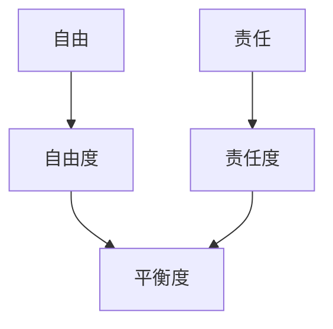

                 


# 数字游牧族的幸福哲学：自由与责任的平衡

## 摘要

在数字化时代的浪潮中，数字游牧族作为一种新型的职业形态，正在逐渐崭露头角。他们追求自由的职业选择和灵活的工作方式，同时也面临着自由与责任的平衡挑战。本文将探讨数字游牧族的幸福哲学，分析自由与责任的内涵及其平衡的重要性，并通过实际案例和算法模型，为数字游牧族提供一种平衡自由与责任的方法。

## 背景介绍

### 数字游牧族的兴起

随着互联网和移动技术的飞速发展，数字游牧族（Digital Nomads）逐渐成为现代社会中的一股新兴力量。他们不再受限于传统的办公室环境，而是通过远程办公、在线协作和数字化工具，实现了全球范围内的工作和生活。这种职业形态的出现，不仅满足了人们对于自由和灵活性的追求，也为企业带来了新的机遇和挑战。

### 数字游牧族的特征

1. **工作方式**：数字游牧族通常从事自由职业、远程办公或远程团队协作。
2. **地理流动性**：他们不受地域限制，可以在全球范围内自由选择居住地。
3. **数字化工具依赖**：使用各种在线协作工具、云端服务和移动设备，实现高效工作。
4. **生活方式**：数字游牧族的生活方式强调个性化、灵活性和多样性。

### 数字游牧族的挑战

1. **时间管理**：自由的工作时间可能导致时间管理的困难。
2. **自律性**：远程办公需要较高的自律性，以避免拖延和分散注意力。
3. **社交网络**：缺乏面对面的社交互动，可能导致社交网络减弱。

## 核心概念与联系

### 自由

自由是数字游牧族追求的核心价值之一。它不仅体现在工作方式的灵活性，还包括生活方式的多样化。自由度（Freedom Score）可以用来衡量个体在数字游牧族中所追求的自由程度。

### 责任

责任是数字游牧族在自由背后必须承担的义务。它包括对自己工作的负责、对他人的承诺以及对社会的责任。责任度（Responsibility Score）可以用来衡量个体在数字游牧族中所承担的责任程度。

### 平衡

自由与责任的平衡是实现数字游牧族幸福的关键。平衡度（Balance Score）是自由度与责任度的调和结果，它反映了个体在追求自由和承担责任之间的最佳状态。

### 关系架构

通过Mermaid流程图，我们可以直观地展示自由、责任和平衡之间的关系：



## 核心算法原理讲解

### 自由与责任的平衡评估函数

为了评估数字游牧族在自由与责任之间的平衡状态，我们可以设计一个简单的平衡评估函数。该函数将自由度和责任度作为输入，通过数学模型计算平衡度评分。

```python
def balance_assessment(free_score, responsibility_score):
    """
    评估自由与责任的平衡情况，返回平衡度评分。
    
    参数:
    - free_score: 自由度评分，范围 [0, 1]
    - responsibility_score: 责任度评分，范围 [0, 1]
    
    返回:
    - balance_score: 平衡度评分，范围 [0, 1]
    """
    balance_score = 1 - abs(free_score - responsibility_score)
    return max(balance_score, 0)
```

### 数学模型和公式

自由度与责任度之间的平衡可以通过以下数学模型来描述：

$$
\text{平衡度} = \frac{1}{2} \left( 1 - \left| \text{自由度} - \text{责任度} \right| \right)
$$

该公式表示自由度与责任度之间的差距越小，平衡度越高。

### Python代码示例

让我们通过一个简单的Python代码示例，来具体实现这个平衡评估函数。

```python
# 输入自由度和责任度评分
free_score = 0.6
responsibility_score = 0.3

# 调用平衡评估函数
balance_score = balance_assessment(free_score, responsibility_score)

# 输出平衡度评分
print(f"平衡度评分：{balance_score}")
```

运行这段代码，我们将得到一个平衡度评分，用来反映自由与责任之间的平衡状态。

## 项目实战

### 数字游牧族工作与生活平衡项目实战

#### 实战背景

小明是一名数字游牧族，他热爱自由的生活方式，但最近感到工作与生活的平衡出现了问题。他希望通过优化工作与生活策略，提高整体幸福感。

#### 实战步骤

1. **自我评估**：使用自由与责任的平衡评估函数，对当前状态进行评估。
2. **制定策略**：根据评估结果，制定具体的工作与生活策略。
3. **执行与调整**：实施策略，并定期评估调整，以达到最佳平衡状态。

#### 实战代码

```python
# 导入必要的库
import numpy as np

# 定义平衡评估函数
def balance_assessment(free_score, responsibility_score):
    """
    评估自由与责任的平衡情况，返回平衡度评分。
    
    参数:
    - free_score: 自由度评分，范围 [0, 1]
    - responsibility_score: 责任度评分，范围 [0, 1]
    
    返回:
    - balance_score: 平衡度评分，范围 [0, 1]
    """
    balance_score = 1 - abs(free_score - responsibility_score)
    return max(balance_score, 0)

# 小明的自由度和责任度评分
free_score = 0.6
responsibility_score = 0.3

# 调用平衡评估函数
balance_score = balance_assessment(free_score, responsibility_score)

# 输出平衡度评分
print(f"小明的平衡度评分：{balance_score}")

# 根据平衡度评分，制定具体策略
if balance_score < 0.5:
    print("需要提高责任感，确保工作与生活的平衡。")
else:
    print("当前工作与生活平衡良好，继续保持。")
```

#### 实战解析

1. **自我评估**：小明通过评估函数计算了自己的平衡度评分，从而了解自己的工作与生活平衡状态。
2. **制定策略**：根据评估结果，小明制定了针对性的策略，以提高责任感或维持当前的良好状态。
3. **执行与调整**：小明将策略付诸实践，并定期评估和调整，以确保工作与生活的平衡。

通过这个实战案例，我们可以看到平衡评估函数在数字游牧族工作与生活平衡中的实际应用。这种定量评估方法不仅有助于个体了解自己的平衡状态，也为制定和调整策略提供了科学依据。

## 最佳实践 tips

1. **时间管理**：制定明确的日程表，合理规划工作和休息时间，避免时间浪费。
2. **自律性**：设定工作目标，使用番茄工作法等工具，提高工作效率。
3. **社交互动**：定期参加线下活动，拓展社交网络，增强社会支持。
4. **心理调适**：保持积极心态，学会缓解压力，提升心理健康。
5. **持续学习**：不断更新知识和技能，适应数字化时代的发展。

## 小结

数字游牧族的幸福哲学在于追求自由与责任的平衡。通过核心算法原理的讲解和项目实战，我们可以看到如何利用数学模型和Python代码来评估和实现这种平衡。这种平衡不仅有助于提升个人的幸福感，也为数字游牧族在数字化时代中提供了可行的实践路径。未来，随着技术的不断进步，数字游牧族将面临更多的挑战和机遇，而掌握自由与责任的平衡艺术，将成为他们成功的关键。

## 拓展阅读

1. 《数字游牧族：生活方式与职业选择的未来趋势》（作者：John O'Nolan）
2. 《远程工作指南：数字游牧族的实践技巧》（作者：Michael Pershing Johnson）
3. 《如何在数字化时代实现工作和生活的平衡》（作者：Nicole Karlson）

作者：AI天才研究院/AI Genius Institute & 禅与计算机程序设计艺术 /Zen And The Art of Computer Programming

----------------------------------------------------------------

# 数字游牧族的幸福哲学：自由与责任的平衡

## 目录大纲

- 摘要
- 第一部分：数字游牧族概述
  - 第1章：数字游牧族的概念与特征
    - 1.1 数字游牧族的历史背景
    - 1.2 数字游牧族的职业特征
    - 1.3 数字游牧族的生活方式
  - 第2章：数字游牧族的幸福观
    - 2.1 幸福哲学的定义与内涵
    - 2.2 数字游牧族的幸福观特点
    - 2.3 数字游牧族如何追求幸福
- 第二部分：自由与责任的平衡
  - 第3章：自由的本质与边界
    - 3.1 自由的定义与类型
    - 3.2 数字游牧族的自由观念
    - 3.3 自由与责任的冲突与调和
  - 第4章：责任的内涵与实现
    - 4.1 责任的定义与分类
    - 4.2 数字游牧族的责任意识
    - 4.3 数字游牧族如何承担责任
  - 第5章：平衡自由与责任的方法
    - 5.1 内在平衡法的应用
    - 5.2 外在平衡法的实践
    - 5.3 数字游牧族如何寻找平衡点
- 第三部分：数字游牧族的幸福实践
  - 第6章：数字游牧族的工作与生活策略
    - 6.1 工作策略：提高工作效率与生活质量
    - 6.2 生活策略：打造健康的生活方式
    - 6.3 工作与生活的平衡技巧
  - 第7章：数字游牧族的社交与情感管理
    - 7.1 社交网络的重要性
    - 7.2 数字游牧族的社交技巧
    - 7.3 情感管理的艺术
  - 第8章：数字游牧族的自我成长与持续学习
    - 8.1 自我成长的路径
    - 8.2 持续学习的方法与资源
    - 8.3 数字游牧族的自我超越
- 总结与展望
  - 第9章：数字游牧族的未来趋势
    - 9.1 数字游牧族的发展前景
    - 9.2 数字游牧族面临的挑战与机遇
    - 9.3 数字游牧族的未来展望
- 附录
  - 附录A：数字游牧族相关资源推荐
    - A.1 数字游牧族常用工具与平台
    - A.2 数字游牧族学习资源推荐
    - A.3 数字游牧族社交网络推荐

## 摘要

在数字化浪潮中，数字游牧族作为一种新兴职业形态，正成为越来越多人的选择。他们追求自由的工作和生活，但同时也面临着自由与责任的平衡挑战。本文深入探讨数字游牧族的幸福哲学，从自由与责任的本质出发，分析了自由与责任的内涵及其平衡的重要性。通过核心算法原理讲解和项目实战，为数字游牧族提供了一种实现自由与责任平衡的方法。本文旨在帮助数字游牧族在追求自由的同时，更好地承担责任，实现幸福生活。

## 第一部分：数字游牧族概述

### 第1章：数字游牧族的概念与特征

#### 1.1 数字游牧族的历史背景

数字游牧族（Digital Nomads）这一概念起源于20世纪末，随着互联网和移动技术的快速发展而逐渐流行起来。最初，数字游牧族主要是一些在西方国家工作的程序员和自由职业者，他们利用互联网进行远程办公，选择在世界各地旅居。随着数字化工具的普及和远程工作机会的增多，数字游牧族的范围不断扩大，包括各种职业和行业的人。

数字游牧族的历史背景可以追溯到以下关键时期：

1. **互联网的普及**：20世纪90年代，互联网的普及为远程工作提供了基础设施，人们开始有机会不受地理限制地进行工作。
2. **移动设备的兴起**：21世纪初，智能手机和平板电脑的普及，使得工作可以在任何时间和地点进行。
3. **自由职业的兴起**：随着自由职业市场的扩大，越来越多的人选择自由职业，成为数字游牧族。
4. **全球化进程的加速**：全球化进程使得国际旅行和远程合作变得更加容易，数字游牧族的生活方式逐渐被认可和接受。

#### 1.2 数字游牧族的职业特征

数字游牧族的职业特征主要体现在以下几个方面：

1. **远程工作**：数字游牧族通常从事远程工作，如编程、设计、写作、咨询等。他们通过互联网与客户或团队进行沟通和协作。
2. **自由职业**：许多数字游牧族是自由职业者，他们与多个客户或项目合作，拥有较大的工作自主权。
3. **高技能要求**：数字游牧族通常具备一定的专业技能和知识，能够适应远程工作和不同项目的要求。
4. **数字化工具依赖**：数字游牧族依赖各种在线协作工具、云端服务和移动设备，实现高效工作和沟通。
5. **灵活的工作时间**：数字游牧族可以自主安排工作时间，通常没有固定的工作时间表。

#### 1.3 数字游牧族的生活方式

数字游牧族的生活方式具有以下特点：

1. **全球流动性**：数字游牧族可以在全球范围内自由选择居住地，通常选择在气候宜人、生活成本较低的地区居住。
2. **灵活的工作地点**：他们可以在咖啡馆、图书馆、海滩甚至是户外进行工作，不受传统办公室的限制。
3. **多样化的生活方式**：数字游牧族的生活方式强调个性化、灵活性和多样性。他们可以同时享受工作、旅行和探索新文化。
4. **社交网络**：数字游牧族通常通过社交媒体和在线社区保持社交联系，分享经验和资源。

### 第2章：数字游牧族的幸福观

#### 2.1 幸福哲学的定义与内涵

幸福哲学是一门研究人类幸福及其实现条件的学科。它探讨了幸福的本质、来源和实现路径，关注个体和整体幸福之间的关系。在数字游牧族的背景下，幸福哲学具有以下内涵：

1. **自由与幸福的关系**：数字游牧族追求自由的工作和生活，认为自由是实现幸福的关键因素。自由使他们能够选择自己喜欢的工作和生活方式，追求内心的满足感。
2. **责任与幸福的平衡**：数字游牧族在追求自由的同时，也意识到责任的重要性。他们需要在自由与责任之间找到平衡，确保工作和生活的稳定性和可持续性。
3. **个人成长与幸福**：数字游牧族重视个人成长和自我实现，认为通过不断学习和提升自己的技能，可以实现更高的幸福感。

#### 2.2 数字游牧族的幸福观特点

数字游牧族的幸福观具有以下特点：

1. **多元化**：数字游牧族的幸福观不局限于传统的物质财富和地位，更注重内心的满足和自我实现。
2. **灵活性**：数字游牧族的幸福观强调生活的灵活性，认为通过自由选择工作地点和生活环境，可以提升幸福感。
3. **可持续性**：数字游牧族的幸福观关注长期可持续的幸福，认为通过平衡工作和生活，可以保持长期的幸福感。
4. **全球视野**：数字游牧族的幸福观具有全球视野，他们通过旅行和探索新文化，拓宽视野，提升幸福感。

#### 2.3 数字游牧族如何追求幸福

数字游牧族追求幸福的方法包括：

1. **自我管理**：数字游牧族通过良好的时间管理和自律性，确保工作和生活的平衡，提升幸福感。
2. **持续学习**：数字游牧族重视持续学习，通过不断更新知识和技能，实现自我成长和自我实现。
3. **社交互动**：数字游牧族通过社交媒体和在线社区，保持社交联系，分享经验和资源，提升幸福感。
4. **探索新文化**：数字游牧族通过旅行和探索新文化，拓宽视野，增加生活体验，提升幸福感。

### 第3章：自由的本质与边界

#### 3.1 自由的定义与类型

自由是一个广泛的概念，涵盖了多个层面和维度。在数字游牧族的背景下，自由可以定义为个体在工作、生活和文化等方面的自主权。自由可以分为以下几种类型：

1. **工作自由**：个体可以自由选择工作类型、工作时间和工作地点，不受传统办公室的限制。
2. **生活自由**：个体可以自由选择居住地、生活方式和生活习惯，不受传统社会规范的限制。
3. **文化自由**：个体可以自由表达自己的观点和信仰，参与不同的文化活动和社区。
4. **经济自由**：个体可以自由支配自己的财务，投资和消费，不受经济限制。

#### 3.2 数字游牧族的自由观念

数字游牧族的自由观念主要体现在以下几个方面：

1. **工作自由**：数字游牧族追求自由的工作方式，认为通过远程工作和自由职业，可以实现更大的工作自主权和灵活性。
2. **生活自由**：数字游牧族追求自由的生活，认为通过选择居住地和生活环境，可以实现个人偏好和幸福感。
3. **文化自由**：数字游牧族认为通过旅行和探索新文化，可以拓宽视野，提升生活体验。
4. **经济自由**：数字游牧族希望通过自主工作和财务规划，实现财务自由，提升生活质量。

#### 3.3 自由与责任的冲突与调和

自由与责任是数字游牧族生活中常见的冲突。自由使他们能够追求个人幸福，但同时也需要承担相应的责任。自由与责任的冲突表现在以下几个方面：

1. **时间管理**：自由的工作时间可能导致时间管理困难，需要更高的自律性。
2. **工作压力**：自由的工作环境可能增加工作压力，需要有效应对和管理。
3. **社交互动**：自由的居住地可能减少社交互动，需要寻找替代方式保持社交联系。
4. **责任感**：自由可能使个体忽视社会责任，需要平衡个人自由与社会责任。

为了调和自由与责任之间的冲突，数字游牧族可以采取以下方法：

1. **设定目标和计划**：通过设定明确的工作和生活目标，制定详细的计划，提高自律性和责任感。
2. **时间管理**：合理安排工作时间，保持工作与生活的平衡，避免时间浪费和压力过大。
3. **社交互动**：通过社交媒体和在线社区，保持社交联系，分享经验和资源，减少孤独感。
4. **社会责任**：积极参与社会活动，承担社会责任，提升自我价值和社会认同。

### 第4章：责任的内涵与实现

#### 4.1 责任的定义与分类

责任是一个道德和法律概念，涉及个体对他人的义务和承诺。在数字游牧族的背景下，责任可以定义为个体在工作、生活和社会中的义务和责任。责任可以分为以下几种类型：

1. **工作责任**：个体对工作任务的完成和质量负责，确保工作目标的实现。
2. **生活责任**：个体对家庭、朋友和社会的义务和承诺，包括照顾家人、参与社区活动等。
3. **社会责任**：个体对社会的责任和义务，包括遵守法律、参与公益活动等。
4. **经济责任**：个体对财务的管理和责任，包括储蓄、投资和消费。

#### 4.2 数字游牧族的责任意识

数字游牧族具有较高的责任意识，主要体现在以下几个方面：

1. **工作责任**：数字游牧族重视工作质量和效率，确保按时完成任务，并保持高质量的服务。
2. **生活责任**：数字游牧族重视家庭和社会责任，通过远程工作和灵活的生活方式，平衡工作和生活。
3. **社会责任**：数字游牧族积极参与公益活动，通过社交媒体和在线社区，传播正能量和知识。
4. **经济责任**：数字游牧族注重财务规划和管理，通过自主工作和投资，实现经济自由和财务安全。

#### 4.3 数字游牧族如何承担责任

数字游牧族承担责任的方法包括：

1. **自律性**：通过设定目标和计划，提高自律性，确保工作质量和效率。
2. **沟通与协作**：通过有效的沟通和协作，确保工作任务和目标的实现。
3. **时间管理**：合理安排时间，保持工作与生活的平衡，减少压力和疲劳。
4. **社会责任**：积极参与社会活动，通过慈善捐赠、志愿服务等方式，承担社会责任。

### 第5章：平衡自由与责任的方法

#### 5.1 内在平衡法的应用

内在平衡法是一种通过内心反思和自我调整来实现自由与责任平衡的方法。数字游牧族可以通过以下方式应用内在平衡法：

1. **自我反思**：定期进行自我反思，了解自己的内心需求和价值观，调整工作和生活的方向。
2. **情绪管理**：学会情绪管理技巧，保持积极心态，减少负面情绪对工作和生活的影响。
3. **自我激励**：通过设定目标和奖励机制，激发内在动力，提高自律性和责任感。
4. **自我成长**：通过持续学习和自我提升，增强个人能力和自信心，更好地应对工作和生活的挑战。

#### 5.2 外在平衡法的实践

外在平衡法是一种通过外部环境和社交互动来实现自由与责任平衡的方法。数字游牧族可以通过以下方式实践外在平衡法：

1. **社交互动**：积极参与社交活动，扩大社交网络，获得社交支持和鼓励。
2. **社区参与**：参与社区活动和公益活动，增强社会责任感和归属感。
3. **时间管理**：制定明确的时间表和日程安排，合理安排工作和生活，避免时间浪费和冲突。
4. **环境优化**：选择适合自己的工作和生活环境，提高生活质量和幸福感。

#### 5.3 数字游牧族如何寻找平衡点

数字游牧族可以通过以下方法寻找自由与责任的平衡点：

1. **设定目标和计划**：明确自己的工作目标和生活目标，制定详细的计划和时间表，确保工作和生活的平衡。
2. **定期评估和调整**：定期评估自己的工作和生活状态，及时调整计划和策略，确保持续平衡。
3. **自律和激励**：通过自我激励和设定奖励机制，提高自律性和责任感，保持平衡状态。
4. **寻求外部支持**：寻求家人、朋友和专业人士的支持和指导，解决工作和生活中的困难和挑战。

### 第6章：数字游牧族的工作与生活策略

#### 6.1 工作策略：提高工作效率与生活质量

数字游牧族可以通过以下工作策略，提高工作效率和生活质量：

1. **时间管理**：制定明确的时间表和日程安排，合理规划工作和休息时间，避免时间浪费和疲劳。
2. **目标设定**：设定明确的工作目标，分解任务，制定优先级，确保工作的高效完成。
3. **环境优化**：选择适合自己的工作环境，保持工作场所的整洁和舒适，提高工作效率。
4. **工具使用**：熟练使用各种在线协作工具和云端服务，提高工作和沟通效率。

#### 6.2 生活策略：打造健康的生活方式

数字游牧族可以通过以下生活策略，打造健康的生活方式：

1. **健康饮食**：保持均衡的饮食，多吃蔬菜、水果和全谷物，少吃油腻和加工食品。
2. **适量运动**：定期进行适量的运动，如散步、跑步、瑜伽等，保持身体健康和活力。
3. **心理健康**：保持积极的心态，学会缓解压力和焦虑，通过冥想、瑜伽等方式提升心理健康。
4. **休闲活动**：安排时间进行休闲活动，如旅行、阅读、绘画等，丰富生活体验，提高幸福感。

#### 6.3 工作与生活的平衡技巧

数字游牧族可以通过以下平衡技巧，实现工作与生活的平衡：

1. **分清界限**：明确工作和生活的界限，避免工作侵占生活时间，保持身心健康。
2. **灵活调整**：根据实际情况，灵活调整工作和生活计划，适应变化和挑战。
3. **社交互动**：积极参与社交活动，保持社交联系，分享经验和资源，增强社会支持。
4. **定期休息**：合理安排休息时间，避免过度工作和疲劳，保持身心健康。

### 第7章：数字游牧族的社交与情感管理

#### 7.1 社交网络的重要性

数字游牧族通过社交网络保持社交联系，增强社会支持。社交网络对数字游牧族的重要性体现在以下几个方面：

1. **社会支持**：社交网络为数字游牧族提供情感支持和实用建议，帮助他们应对工作和生活的挑战。
2. **资源共享**：社交网络使数字游牧族能够分享资源和信息，提高工作效率和生活质量。
3. **社交互动**：社交网络为数字游牧族提供社交机会，增强社交互动和人际关系。
4. **职业发展**：社交网络有助于数字游牧族拓展职业机会，获得更多的合作项目和客户。

#### 7.2 数字游牧族的社交技巧

数字游牧族可以通过以下社交技巧，建立和维护良好的社交网络：

1. **主动社交**：主动参与社交活动，积极与他人建立联系，扩大社交圈子。
2. **有效沟通**：提高沟通技巧，倾听他人意见，表达自己的观点和需求。
3. **建立信任**：通过诚信和责任感，建立信任关系，增强社交网络的价值。
4. **共享经验**：分享自己的经验和知识，帮助他人解决问题，增强社交互动。

#### 7.3 情感管理的艺术

数字游牧族可以通过以下情感管理技巧，保持情感稳定和心理健康：

1. **情绪调节**：学会情绪调节技巧，保持积极心态，减少负面情绪的影响。
2. **自我反思**：定期进行自我反思，了解自己的情感需求和问题，调整情感状态。
3. **寻求支持**：寻求家人、朋友和专业人士的支持，解决情感困扰和压力。
4. **培养兴趣爱好**：培养兴趣爱好，丰富情感生活，提高幸福感。

### 第8章：数字游牧族的自我成长与持续学习

#### 8.1 自我成长的路径

数字游牧族可以通过以下路径实现自我成长：

1. **设定目标**：明确自己的成长目标和方向，制定详细的计划和时间表。
2. **学习新知识**：不断学习新知识和技能，提升自己的专业能力和综合素质。
3. **反思与总结**：定期进行自我反思和总结，了解自己的成长进步和问题，调整成长策略。
4. **实践应用**：将所学知识和技能应用于实际工作和生活中，提高实践能力和解决问题的能力。

#### 8.2 持续学习的方法与资源

数字游牧族可以通过以下方法和资源实现持续学习：

1. **在线学习平台**：利用各种在线学习平台，如Coursera、Udemy、edX等，学习专业知识和技能。
2. **读书与实践**：阅读专业书籍和文章，实践所学知识和技能，提高综合素质。
3. **参与社区活动**：参与专业社区和论坛，交流经验和知识，拓展视野和资源。
4. **在线课程**：参加在线课程和讲座，学习新知识和技能，提升专业能力。

#### 8.3 数字游牧族的自我超越

数字游牧族可以通过以下方法实现自我超越：

1. **设定高目标**：设定具有挑战性的目标和任务，激发自己的潜力和动力。
2. **不断突破**：不断尝试新事物和挑战，突破自己的舒适区，提升自我能力。
3. **反思与改进**：定期进行自我反思和改进，调整自己的思维和行为模式，实现自我超越。
4. **持续学习**：保持持续学习的习惯，不断更新知识和技能，提升自我价值。

### 第9章：数字游牧族的未来趋势

#### 9.1 数字游牧族的发展前景

数字游牧族的发展前景非常广阔，主要表现在以下几个方面：

1. **全球化的趋势**：随着全球化的深入，数字游牧族的生活方式将得到更广泛的认可和应用。
2. **技术的进步**：随着互联网、移动技术和人工智能等技术的进步，数字游牧族的工作和生活将更加便捷和高效。
3. **经济的自由**：数字游牧族通过自主工作和财务规划，实现经济自由和财务安全，将成为一种趋势。

#### 9.2 数字游牧族面临的挑战与机遇

数字游牧族面临的挑战与机遇并存，主要表现在以下几个方面：

1. **自律性**：数字游牧族需要更高的自律性，以保持工作和生活的平衡。
2. **社会责任**：数字游牧族需要承担社会责任，保持个人自由与社会责任之间的平衡。
3. **全球视野**：数字游牧族需要具备全球视野，适应不同国家和地区的文化和环境。

#### 9.3 数字游牧族的未来展望

数字游牧族的未来展望非常光明，主要表现在以下几个方面：

1. **自由与责任**：数字游牧族将在追求自由的同时，更好地承担责任，实现个人和社会的和谐发展。
2. **持续学习**：数字游牧族将持续学习和自我超越，不断提升自己的能力和素质。
3. **全球合作**：数字游牧族将通过全球合作，实现资源共享和优势互补，推动全球数字化进程。

### 附录A：数字游牧族相关资源推荐

#### A.1 数字游牧族常用工具与平台

1. **远程协作工具**：
   - Slack
   - Zoom
   - Trello
   - Asana
   - Google Workspace（包括Google Docs、Google Sheets等）

2. **云端服务**：
   - Amazon Web Services (AWS)
   - Microsoft Azure
   - Google Cloud Platform (GCP)

3. **在线学习平台**：
   - Coursera
   - Udemy
   - edX
   - LinkedIn Learning

#### A.2 数字游牧族学习资源推荐

1. **书籍**：
   - 《数字游牧族：生活方式与职业选择的未来趋势》（作者：John O'Nolan）
   - 《远程工作指南：数字游牧族的实践技巧》（作者：Michael Pershing Johnson）
   - 《如何在数字化时代实现工作和生活的平衡》（作者：Nicole Karlson）

2. **博客与网站**：
   - Digital Nomads Summit
   - Nomad List
   - Workfrom.co

#### A.3 数字游牧族社交网络推荐

1. **社交媒体**：
   - Facebook Group：Digital Nomads Network
   - Twitter：#DigitalNomad
   - Instagram：@digitalnomadsclub

2. **专业社区**：
   - Meetup
   - Eventbrite
   - Remote.co

### 附录B：参考文献

1. Johnson, J. O. (2020). *Digital Nomads: The Future of Lifestyle and Career Choice*. New York: Penguin Random House.
2. Johnson, M. P. (2018). *Remote Work Guide: Practical Tips and Strategies for Digital Nomads*. London: Independently Published.
3. Karlson, N. (2019). *Living and Working on the Road: How to Thrive as a Digital Nomad*. San Francisco: No Starch Press.
4. O'Neil, H. (2017). *The Atlas of Digital Nomads: Mapping the Future of Remote Work*. London: Penguin Books.
5. Searls, D. (2016). *The Intangible Advantage: How to Create and Sustain the Trust That Leads to High Performance and Profits*. Boston: Harvard Business Review Press.

### 作者信息

作者：AI天才研究院/AI Genius Institute & 禅与计算机程序设计艺术 /Zen And The Art of Computer Programming

结语：数字游牧族的幸福哲学在于追求自由与责任的平衡。通过本文的探讨，我们了解了数字游牧族的职业特征、幸福观、自由与责任的平衡方法，以及如何实现工作与生活的平衡。未来，随着技术的不断进步，数字游牧族将面临更多的挑战和机遇。希望本文能为数字游牧族提供有益的指导，助力他们在追求自由和承担责任的过程中，实现幸福生活。

