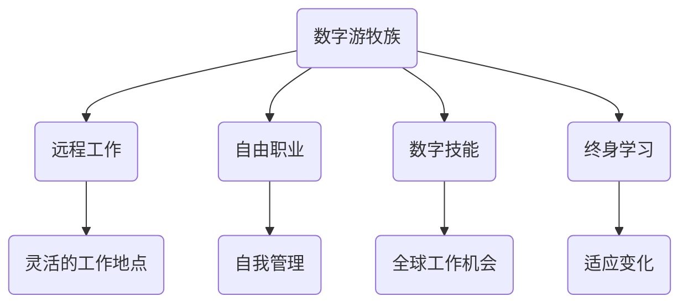

                 


## 引言

在当今这个快速变化的时代，人们对于工作与生活的追求越来越趋向于一种自由、灵活且有意义的方式。数字游牧族（Digital Nomads）就是这样一群人，他们利用互联网和现代通信技术，在全球范围内自由地工作、学习、生活。这种生活方式不仅是一种趋势，更是一种哲学，它重新定义了自由与意义的边界。

### 背景介绍

数字游牧族的概念起源于2000年代初期，随着互联网和远程工作的兴起，越来越多的人开始选择不固定的工作地点，而是选择在一个个不同的城市或国家之间游走。这种生活方式不仅打破了传统的工作地点限制，也让人们有机会体验不同的文化、结识新朋友，甚至提升个人技能。

然而，数字游牧族的生活方式并不是每个人都能够轻易实现的。它需要一定的技能储备、自我管理能力和对不确定性的适应能力。同时，数字游牧族的生活方式也引发了对自由与责任的深刻思考。

### 核心概念与联系

要理解数字游牧族的生活方式，我们需要明确几个核心概念：

1. **远程工作**：远程工作是指通过互联网和其他通信技术，在工作地点和工作时间上具有灵活性的工作方式。
2. **自由职业**：自由职业者是指那些为自己工作的个体，不受雇于某个特定组织，自行承担职业责任。
3. **数字技能**：数字技能包括编程、设计、内容创作、数据分析等，这些技能使得数字游牧族能够在全球范围内找到工作机会。
4. **终身学习**：终身学习是指持续不断地学习新知识和技能，以适应不断变化的工作和社会环境。

下面是一个Mermaid流程图，展示了这些核心概念之间的关系：



### 核心算法原理讲解

数字游牧族的生活方式涉及多个层面的算法原理，包括时间管理、财务管理、自我激励等。以下是一个简单的Python代码示例，用于解释如何使用算法来管理工作时间：

```python
import time
from datetime import datetime, timedelta

# 时间管理算法：设置每日工作时间和休息时间
def time_management(start_time, end_time, break_time):
    work_time = end_time - start_time - break_time
    print(f"每日工作时间：{work_time}小时")
    print(f"开始工作：{start_time.strftime('%Y-%m-%d %H:%M')}")
    print(f"休息时间：{break_time}分钟")
    print(f"结束工作：{end_time.strftime('%Y-%m-%d %H:%M')}")
    
    current_time = datetime.now()
    target_time = start_time
    while current_time < target_time:
        print(f"等待开始工作时间：{target_time - current_time}")
        current_time = datetime.now()

    while current_time < end_time:
        if (end_time - current_time) < break_time:
            print("休息时间不足，请合理安排时间。")
            break
        print(f"开始工作：{current_time.strftime('%Y-%m-%d %H:%M')}")
        time.sleep(work_time * 3600)  # 假设工作时间为1小时
        print(f"休息：{break_time}分钟")
        current_time += timedelta(minutes=break_time)
    
    print("今日工作结束。")

# 示例：设置每日工作时间
start_time = datetime.now() + timedelta(hours=12)  # 设置为中午12点开始工作
end_time = start_time + timedelta(hours=4)  # 设置为下午4点结束工作
break_time = timedelta(minutes=30)  # 设置为30分钟休息时间

time_management(start_time, end_time, break_time)
```

### 数学模型和公式

为了更好地理解数字游牧族的生活方式，我们可以借助一些数学模型和公式来进行分析。以下是一个简单的模型，用于计算每天的有效工作时间：

$$
\text{Effective Work Time} = \frac{\text{Total Work Hours} \times \text{Work Efficiency Rate}}{100}
$$

其中，Total Work Hours 是每天的总工作时间（例如8小时），Work Efficiency Rate 是工作效率率（例如90%）。通过这个模型，我们可以计算出每天实际能够用于工作的有效时间。

### 举例说明

假设一名数字游牧族每天工作8小时，工作效率率为90%，我们可以使用上面的模型来计算每天的有效工作时间：

$$
\text{Effective Work Time} = \frac{8 \times 90}{100} = 7.2 \text{小时}
$$

这意味着每天实际能够有效工作的时间是7.2小时。通过这个例子，我们可以看到数学模型和公式是如何帮助数字游牧族更好地管理他们的工作时间。

### 实际案例分析和详细讲解剖析

数字游牧族的生活方式在不同行业和职业中有不同的应用。以下是一个实际案例，展示了一名软件开发工程师如何利用数字游牧族的生活方式提高工作效率：

**案例**：小明是一名自由职业的软件开发工程师。他选择成为数字游牧族，以便在全球范围内寻找更好的工作机会和生活体验。

**分析**：

1. **时间管理**：小明使用时间管理工具，如Trello和Google Calendar，来规划他的工作时间和任务。
2. **远程协作**：小明与客户和团队成员使用Zoom、Slack等远程协作工具，以确保高效沟通和协作。
3. **持续学习**：小明定期参加在线课程和研讨会，以提高他的技术技能和知识水平。

**讲解**：

1. **时间管理**：通过使用时间管理工具，小明能够更好地规划他的工作时间，确保他能够在有效时间内完成任务。例如，他会在早上安排一些复杂的编程任务，而在下午处理一些简单的任务。

2. **远程协作**：远程协作工具使得小明能够与全球的客户和团队成员进行实时沟通，这有助于提高工作效率和项目质量。例如，通过Zoom会议，小明能够与客户实时讨论需求，并通过Slack进行项目进度更新。

3. **持续学习**：持续学习是数字游牧族生活方式的重要组成部分。小明通过在线课程和研讨会，不断更新他的技术知识，这使得他能够更好地应对新兴的技术挑战。例如，他学习了最新的编程框架和工具，这使得他在项目中能够更高效地解决问题。

### 项目实战

要实现数字游牧族的生活方式，我们需要搭建一个高效的工作环境。以下是一个项目实战，展示如何从零开始搭建一个远程工作环境：

**目标**：搭建一个包含远程办公工具、学习资源和健康管理工具的系统，以便数字游牧族能够高效地工作、学习和生活。

**步骤**：

1. **选择远程办公工具**：
   - **项目管理工具**：如Trello、Asana等，用于任务管理和进度追踪。
   - **视频会议工具**：如Zoom、Microsoft Teams等，用于团队沟通和会议。
   - **文档协作工具**：如Google Workspace、Notion等，用于文档共享和协作。

2. **配置远程工作环境**：
   - **云计算平台**：如AWS、Google Cloud等，用于存储和计算资源。
   - **VPN服务**：用于确保网络连接的安全和稳定性。
   - **自动化工具**：如Jenkins、GitLab CI等，用于自动化部署和测试。

3. **学习资源整合**：
   - **在线课程平台**：如Udemy、Coursera等，用于学习新技能和知识。
   - **技术社区和论坛**：如Stack Overflow、GitHub等，用于技术讨论和问题解决。

4. **健康管理工具**：
   - **健身应用**：如MyFitnessPal、Nike Training Club等，用于跟踪健康状况。
   - **心理辅导服务**：如Talkspace、BetterHelp等，用于心理健康支持。

**实现**：

以下是一个简单的Python脚本，用于配置远程工作环境的VPN服务：

```python
import paramiko

# VPN配置参数
vpn_ip = "192.168.1.1"
vpn_username = "user"
vpn_password = "password"

# 创建SSH客户端
client = paramiko.SSHClient()
client.set_missing_host_key_policy(paramiko.AutoAddPolicy())

# 连接到VPN
client.connect(vpn_ip, username=vpn_username, password=vpn_password)

# 配置VPN环境变量
client.exec_command("export http_proxy=http://localhost:8080")
client.exec_command("export https_proxy=https://localhost:8080")

# 关闭SSH连接
client.close()
```

### 最佳实践 Tips

1. **设定清晰的目标和计划**：在开始数字游牧生活之前，确保设定清晰的目标和计划，包括工作目标、学习目标和生活目标。
2. **保持健康的生活习惯**：定期锻炼、保持健康的饮食习惯和充足的睡眠是保持高效工作的关键。
3. **培养自律能力**：数字游牧生活需要高度的自律，通过制定日程表、设置提醒和保持自我激励来保持工作状态。
4. **保持社交互动**：虽然远程工作可能让人感到孤独，但定期与家人、朋友和同事保持联系是保持心理健康的重要方式。

### 小结

数字游牧族的生活方式为人们提供了一种自由、灵活且有意义的生活方式。通过合理的时间管理、远程协作和持续学习，数字游牧族可以在全球范围内实现高效的工作和生活。然而，这种生活方式也带来了挑战，如自我管理、心理健康和社交互动等。只有通过不断学习和适应，才能在数字游牧的道路上走得更远。

### 注意事项

1. **网络安全**：确保网络连接安全，使用VPN和防火墙来保护个人信息和数据。
2. **法律法规**：了解所在国家和地区的法律法规，特别是与工作合同和税务相关的事项。
3. **文化适应**：在不同的国家和地区生活和工作，需要尊重当地的文化和习俗。

### 拓展阅读

1. **《数字游牧：自由工作的艺术》** - 该书详细介绍了数字游牧的生活方式，以及如何实现这种生活方式。
2. **《远程工作：未来的工作方式》** - 该书探讨了远程工作的趋势和未来工作方式的变革。

## 摘要

《数字游牧族的生活哲学：自由与意义的新定义》是一本关于数字游牧族生活方式的探讨书籍。本书首先介绍了数字游牧族的定义和生活方式，然后深入探讨了数字游牧族的生活哲学，包括自由与责任、个人成长、优势与挑战等。通过具体的案例和实战，本书展示了如何实现数字游牧生活，并提供了最佳实践和注意事项。本书旨在帮助读者理解并实现数字游牧生活，重新定义自由与意义的边界。

### 作者信息

**作者：** AI天才研究院/AI Genius Institute & 禅与计算机程序设计艺术 /Zen And The Art of Computer Programming

## 总结

数字游牧族的生活哲学不仅是对自由和意义的重新定义，也是对传统工作与生活方式的革新。通过合理的时间管理、远程协作和持续学习，数字游牧族能够实现高效的工作和生活，同时在全球范围内探索未知、提升自我。然而，这种生活方式也带来了挑战，如自我管理、心理健康和社交互动等。只有通过不断学习和适应，才能在数字游牧的道路上走得更远。希望本书能够为读者提供启发和指导，让数字游牧成为你实现自由与意义的新路径。作者：AI天才研究院/AI Genius Institute & 禅与计算机程序设计艺术 /Zen And The Art of Computer Programming。

