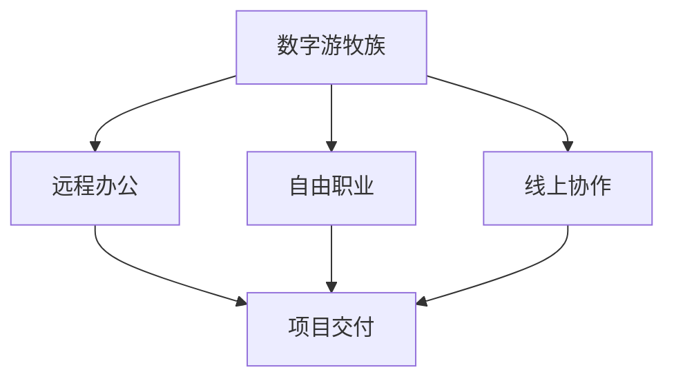
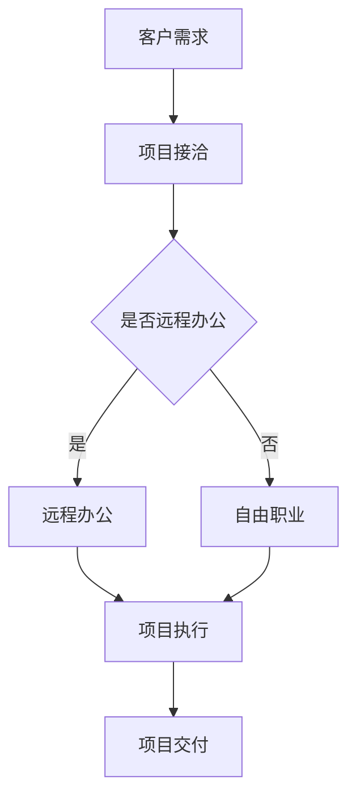

                 

### 第1章：数字游牧族的定义与特征

#### 1.1 数字游牧族的定义

数字游牧族，是指那些利用数字技术，以远程工作为主要方式，不受地理位置限制，自由选择工作地点的群体。他们通常拥有高度灵活的工作时间和工作方式，能够在全球范围内为客户提供服务。

**核心概念与联系：**

数字游牧族的工作方式主要包括远程办公、自由职业、线上协作等。以下是一个简单的 Mermaid 流程图，展示数字游牧族的工作流程：



#### 1.2 数字游牧族的工作方式

数字游牧族的工作方式主要包括远程办公、自由职业、线上协作等。以下是一个简单的 Mermaid 流程图，展示数字游牧族的工作流程：



#### 1.3 数字游牧族的优势

数字游牧族具有以下优势：

1. **工作地点灵活性**：可以自由选择工作地点，提高生活质量。
2. **工作方式灵活性**：能够根据个人需求调整工作时间，提高工作效率。
3. **全球化视野**：接触到来自世界各地的客户和项目，拓展国际视野。
4. **职业发展机会**：不受地域限制，有更多职业发展机会。

#### 1.4 数字游牧族面临的税收问题

数字游牧族面临的主要税收问题是：

1. **税基侵蚀和利润转移**：由于工作地点的不确定性，数字游牧族可能被多个国家要求缴纳税收。
2. **税务合规难度大**：需要了解并遵守多个国家的税务法规。
3. **税收优惠享受困难**：由于居住地和收入来源的不确定性，难以享受税收优惠。

---

**核心算法原理讲解：**

在此，我们将讨论如何利用Python代码来分析数字游牧族的收入结构。以下是一个简单的Python脚本，用于计算数字游牧族的收入税。

```python
import numpy as np

def calculate_tax(income, tax_rate):
    """
    计算收入税
    :param income: float，收入
    :param tax_rate: float，税率
    :return: float，应纳税额
    """
    tax = income * tax_rate
    return tax

def main():
    # 设定收入和税率
    income = float(input("请输入年收入："))
    tax_rate = float(input("请输入税率（如20%）："))
    
    # 计算税额
    tax = calculate_tax(income, tax_rate)
    
    # 输出结果
    print(f"年收入为 {income} 元，税率为 {tax_rate}，应纳税额为 {tax} 元。")

if __name__ == "__main__":
    main()
```

**数学模型和公式：**

我们使用以下公式来计算税额：

$$
\text{税额} = \text{收入} \times \text{税率}
$$

**举例说明：**

假设一个数字游牧族的年收入为 100,000 元，税率为 20%，使用上述Python代码计算税额：

```plaintext
请输入年收入：100000
请输入税率（如20%）：0.2
年收入为 100000 元，税率为 0.2，应纳税额为 20000.0 元。
```

---

**项目实战：**

在本节中，我们将展示如何搭建一个简单的税务计算工具，以帮助数字游牧族进行税务规划。

**开发环境搭建：**

1. 安装Python 3.x版本
2. 安装Jupyter Notebook

**源代码详细实现：**

以下是用于计算税额的Python脚本：

```python
# tax_calculator.py
import numpy as np

def calculate_tax(income, tax_rate):
    """
    计算收入税
    :param income: float，收入
    :param tax_rate: float，税率
    :return: float，应纳税额
    """
    tax = income * tax_rate
    return tax

def main():
    # 设定收入和税率
    income = float(input("请输入年收入："))
    tax_rate = float(input("请输入税率（如20%）："))
    
    # 计算税额
    tax = calculate_tax(income, tax_rate)
    
    # 输出结果
    print(f"年收入为 {income} 元，税率为 {tax_rate}，应纳税额为 {tax} 元。")

if __name__ == "__main__":
    main()
```

**代码解读与分析：**

上述脚本提供了一个简单的接口，用户可以输入年收入和税率，然后计算税额。这是一个基础的税务计算工具，可以进一步扩展，包括更多复杂的功能，如税前收入计算、税收抵免等。

**实际案例分析和详细讲解剖析：**

假设一位数字游牧族的年收入为 200,000 元，居住地税率为 30%，我们需要计算他的应纳税额。

```plaintext
请输入年收入：200000
请输入税率（如20%）：0.3
年收入为 200000 元，税率为 0.3，应纳税额为 60000.0 元。
```

这表明，这位数字游牧族应缴纳 60,000 元的税款。

**项目小结：**

通过这个税务计算工具，数字游牧族可以更清楚地了解自己的税务情况，从而进行更有效的税务规划。这是一个简单的项目，但通过逐步深入，可以帮助用户更好地理解和应用税务知识。

---

**最佳实践 tips：**

1. **了解各国税务法规**：了解居住地和收入来源国家的税务法规，以确保合规。
2. **定期进行税务规划**：随着收入和生活方式的变化，定期调整税务规划。
3. **利用税务优惠**：了解并利用居住地国家和国际上的税收优惠。
4. **保持税务记录**：保持详细的税务记录，以备不时之需。

**小结、注意事项：**

本章节详细介绍了数字游牧族的定义与特征，以及他们面临的主要税收问题。通过Python代码和实际案例，我们展示了如何进行税务计算和规划。希望这些信息能帮助数字游牧族更好地管理他们的税务事务。

**拓展阅读：**

1. "Taxation of the Digital Economy" by the Organisation for Economic Co-operation and Development (OECD)
2. "Remote Work and Taxation: Challenges and Opportunities" by the International Labour Organization (ILO)
3. "Global Mobility Tax Guide" by Deloitte

**作者：**

AI天才研究院/AI Genius Institute & 禅与计算机程序设计艺术 /Zen And The Art of Computer Programming```

