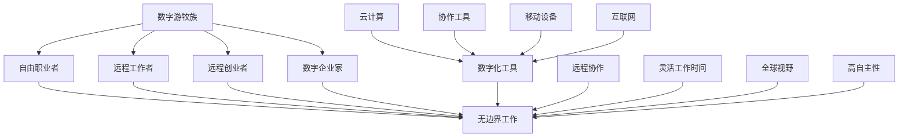

                 

### 第一部分：引言

#### 第1章：数字游牧族概念解读

**1.1 数字游牧族定义**

数字游牧族，顾名思义，是指那些依靠互联网技术，以远程工作为主要生活方式的人群。他们不受地理位置的限制，可以在全球范围内选择适合自己的工作环境，利用数字工具进行协作和创造价值。数字游牧族通常包括自由职业者、远程工作者、远程创业者和数字企业家等。

数字游牧族的特征主要包括以下几个方面：

1. **数字化工具的依赖**：他们高度依赖互联网、云计算、远程协作工具等数字技术，这些技术使得他们能够随时随地进行高效的工作。
  
2. **灵活的工作时间**：数字游牧族通常拥有相对灵活的工作时间，可以自主安排工作与休息的时间，这使得他们能够更好地平衡工作与生活。

3. **全球视野**：由于工作范围的广泛性，数字游牧族常常有机会与全球各地的同事和客户合作，拥有更广阔的视野。

4. **高自主性**：数字游牧族的工作方式决定了他们具有较高的自主性，他们可以自行决定工作内容、工作方式以及工作地点。

**1.2 数字游牧族的历史背景**

数字游牧族这一群体并非突然出现，而是随着互联网技术的发展和远程工作模式的普及逐渐形成的。早在20世纪90年代，随着互联网的普及，远程工作开始逐渐成为可能。然而，数字游牧族的真正兴起是在21世纪初，随着云计算、虚拟办公室、协作工具等技术的发展，远程工作和自由职业逐渐成为一种趋势。

全球金融危机后，人们对工作与生活方式的重新审视，以及全球化进程的加速，进一步推动了数字游牧族的发展。他们不再局限于传统的就业模式，而是选择了一种更加自由和灵活的工作方式，这种变化不仅影响了他们的个人生活，也对全球经济和社会结构产生了深远的影响。

**1.3 无边界工作模式**

无边界工作模式是指一种不受时间和地点限制的工作方式，它打破了传统的工作边界，使得工作可以在任何时间、任何地点进行。无边界工作模式的出现，得益于互联网技术的发展，特别是云计算、远程协作工具、移动设备等的普及。

无边界工作模式与传统工作模式有以下几个显著的区别：

1. **地点的灵活性**：传统工作通常在一个固定的办公地点进行，而无边界工作可以在家中、咖啡店、机场等任何地方进行。

2. **时间的灵活性**：传统工作通常需要按照固定的工作时间表进行，而无边界工作允许员工自主安排工作时间，更好地平衡工作与生活。

3. **依赖技术**：无边界工作高度依赖数字技术，如电子邮件、即时通讯、视频会议等，这些技术使得远程协作和沟通变得更为高效和便捷。

无边界工作模式的兴起，不仅为数字游牧族提供了更多的机会，也为企业带来了新的挑战。企业需要适应这种变化，通过提供灵活的工作环境和培训，来吸引和留住数字游牧族人才。

#### **1.4 小结**

数字游牧族作为一种新兴的工作方式，正日益影响着全球的劳动力市场和经济发展。他们以数字化工具为基础，实现了工作的灵活性和自主性，同时也面临着适应无边界工作模式带来的挑战。在本章中，我们详细介绍了数字游牧族的概念、特征和历史背景，并对无边界工作模式进行了深入分析。接下来的章节，我们将进一步探讨数字游牧族的工作方式、收入模式以及他们对经济的影响，为读者提供更全面的了解。

---

### **核心概念与联系**

在探讨数字游牧族的概念时，我们不得不提到几个核心的术语，这些术语不仅是数字游牧族工作的基础，也是理解这一新兴群体的重要钥匙。以下是本文中涉及的核心概念以及它们之间的联系架构，使用Mermaid流程图来表示：



**数字游牧族**：是本文的主题概念，涵盖了所有以互联网技术为基础，通过远程工作实现自由和灵活生活方式的人群。

**自由职业者**、**远程工作者**、**远程创业者**和**数字企业家**：这些概念是数字游牧族的细分群体，各自代表了不同的职业角色和生活方式。

**数字化工具**：这是数字游牧族实现工作灵活性和高效性的关键因素，包括云计算、协作工具、移动设备等。

**无边界工作**：是数字游牧族的工作模式，代表了与传统工作模式的不同之处，如地点和时间上的灵活性。

**远程协作**：是无边界工作的重要组成部分，依赖于互联网和数字化工具，确保远程工作中的沟通与协作。

**灵活工作时间**、**全球视野**和**高自主性**：这些是数字游牧族工作模式带来的核心优势，也是他们区别于传统工作群体的显著特征。

通过上述Mermaid流程图，我们可以清晰地看到数字游牧族各个概念之间的相互关系和关联。这些核心概念不仅为理解数字游牧族提供了理论基础，也为后续章节的深入探讨奠定了基础。

---

### **核心算法原理讲解**

在探讨数字游牧族的工作方式时，算法和数学模型起着至关重要的作用，这些工具不仅能够帮助数字游牧族更高效地管理时间和资源，还能提供科学的决策支持。下面，我们将通过具体的Python源代码和数学公式，详细讲解一些核心算法原理，并结合实际案例进行分析。

#### **时间管理算法**

时间管理在数字游牧族的工作中至关重要，以下是几种常用的时间管理算法：

**1. 甘特图**

甘特图是一种广泛使用的项目管理工具，用于计划、跟踪和可视化项目进度。以下是一个简单的甘特图实现示例：

```python
import matplotlib.pyplot as plt
import numpy as np

# 生成数据
x = np.arange(0, 10, 0.1)
y1 = np.sin(x)
y2 = np.cos(x)

# 绘制甘特图
plt.figure(figsize=(10, 5))
plt.plot(x, y1, label='Sin')
plt.plot(x, y2, label='Cos')
plt.xlabel('Time')
plt.ylabel('Value')
plt.title('Gantt Chart Example')
plt.xticks(np.arange(0, 10, 1))
plt.legend()
plt.grid(True)
plt.show()
```

**2. PERT图（项目评估与审查技术）**

PERT图是一种用于项目管理的算法，它考虑了任务完成时间的随机性，提供了更为现实的进度预测。以下是一个简单的PERT图实现示例：

```python
import matplotlib.pyplot as plt
import networkx as nx

# 创建一个有向图
G = nx.DiGraph()

# 添加节点和边
G.add_nodes_from(['Start', 'A', 'B', 'C', 'End'])
G.add_edges_from([('Start', 'A'), ('A', 'B'), ('B', 'C'), ('C', 'End')])

# 绘制PERT图
pos = nx.spring_layout(G)
nx.draw(G, pos, with_labels=True, node_color='lightblue', edge_color='gray')
plt.show()
```

#### **生产力评估算法**

评估数字游牧族的生产力对于管理他们的工作和资源分配至关重要。以下是几种常用的生产力评估算法：

**1. 生产效率分析**

生产效率分析（Productivity Analysis）是一种通过比较产出和投入来评估工作效率的方法。以下是一个简单的生产效率分析示例：

```python
def productivity_analysis(produced_units, hours_worked):
    return produced_units / hours_worked

produced_units = 100  # 产出单位
hours_worked = 40     # 工作小时
efficiency = productivity_analysis(produced_units, hours_worked)
print(f"生产效率：{efficiency} 单位/小时")
```

**2. 绩效评估模型**

绩效评估模型（Performance Evaluation Model）是一种综合多种指标来评估个人或团队绩效的方法。以下是一个简单的绩效评估模型示例：

```python
def performance_evaluation(sales, customer_satisfaction, quality):
    return (sales + customer_satisfaction + quality) / 3

sales = 1000   # 销售额
customer_satisfaction = 90   # 客户满意度
quality = 85   # 质量评分
performance = performance_evaluation(sales, customer_satisfaction, quality)
print(f"绩效评分：{performance}")
```

#### **实际案例分析**

**案例1：数字游牧族的自由职业收入管理**

假设一位自由职业者，他每天工作8小时，每月完成150个单位的工作。他的收费标准是每个单位10美元。以下是他的收入管理脚本实现：

```python
def income_management(hours_worked, units_per_hour, charge_per_unit):
    daily_income = hours_worked * units_per_hour * charge_per_unit
    monthly_income = daily_income * 22
    return monthly_income

hours_worked = 8
units_per_hour = 150
charge_per_unit = 10
monthly_income = income_management(hours_worked, units_per_hour, charge_per_unit)
print(f"每月收入：${monthly_income}")
```

**代码解读与分析：**
- `income_management` 函数接收三个参数：`hours_worked`（每天工作小时数），`units_per_hour`（每小时完成的单位数），`charge_per_unit`（每个单位的收费）。
- 通过计算每日收入、每月收入，我们可以直观地了解自由职业者的收入情况。

**案例2：数字游牧族的创业项目评估**

假设一位创业者，他计划开发一款应用，预计需要投入10000美元，并在未来6个月内实现100000美元的收入。以下是他的项目评估脚本实现：

```python
def project_evaluation(investment, expected_income, time_period):
    roi = (expected_income - investment) / investment
    monthly_income = expected_income / time_period
    return roi, monthly_income

investment = 10000  # 投资额
expected_income = 100000  # 预期收入
time_period = 6  # 时间周期（月）
roi, monthly_income = project_evaluation(investment, expected_income, time_period)
print(f"投资回报率（ROI）：{roi}")
print(f"每月收入：${monthly_income}")
```

**代码解读与分析：**
- `project_evaluation` 函数计算项目的投资回报率（ROI）和每月收入。
- 投资回报率（ROI）的计算公式为 `(预期收入 - 投资额) / 投资额`。
- 每月收入的计算公式为 `预期收入 / 时间周期（月）`。

通过上述案例，我们可以看到数字游牧族如何通过算法和数学模型，进行时间管理和生产力评估，从而更好地管理自己的工作和收入。这些算法和模型不仅提高了工作效率，还为数字游牧族提供了科学的决策支持，使他们能够更好地适应无边界工作模式。

---

### **数学模型和数学公式**

在数字游牧族的工作管理中，数学模型和数学公式起到了关键作用。它们不仅帮助管理者更精确地评估时间价值和生产力，还能为决策提供科学依据。以下是一些常用的数学模型和公式，并通过具体的示例进行解释。

#### **时间价值计算**

时间价值（Time Value）是指在一定时间内，完成某项工作所带来的经济收益或成本。一个基本的时间价值计算公式为：

\[ T = \frac{E}{R} \]

其中，\( T \) 是时间价值，\( E \) 是工作完成所需时间，\( R \) 是时间报酬率。例如，如果一名自由职业者每天工作8小时，每小时收益为100美元，那么他的一天时间价值为：

\[ T = \frac{8 \text{小时}}{100 \text{美元/小时}} = 0.08 \text{天} \]

这意味着他每小时的工作相当于8小时的报酬。

#### **生产力评估公式**

生产力（Productivity）是指在一定时间内，完成的产出量。常用的生产力评估公式为：

\[ P = \frac{O}{T} \]

其中，\( P \) 是生产力，\( O \) 是产出量，\( T \) 是工作时间。例如，如果一名远程工作者每天工作8小时，完成了200个单位的工作，那么他的生产力为：

\[ P = \frac{200 \text{单位}}{8 \text{小时}} = 25 \text{单位/小时} \]

这意味着他的工作效率为每小时25个单位。

#### **项目成本与收益计算**

在项目管理中，项目成本（Project Cost）和收益（Revenue）的计算公式也非常重要。一个简单的成本与收益计算公式为：

\[ \text{收益} = \text{产出} \times \text{单价} \]
\[ \text{成本} = \text{投资} + \text{运营成本} \]

例如，假设一个数字游牧族开发一款应用，总投资为10000美元，运营成本为每月2000美元，预期每月产出500个单位，单价为20美元，那么他的月收益和成本分别为：

\[ \text{月收益} = 500 \text{单位} \times 20 \text{美元/单位} = 10000 \text{美元} \]
\[ \text{月成本} = 10000 \text{美元（投资）} + 2000 \text{美元（运营成本）} = 12000 \text{美元} \]

#### **实际应用示例**

**示例1：自由职业者的工作时间价值计算**

假设一名自由职业者每天工作8小时，每小时收益率为100美元，那么他一天的时间价值为：

\[ T = \frac{8 \text{小时}}{100 \text{美元/小时}} = 0.08 \text{天} \]

**示例2：远程工作者的生产力评估**

假设一名远程工作者每天工作8小时，完成了150个单位的工作，那么他的生产力为：

\[ P = \frac{150 \text{单位}}{8 \text{小时}} = 18.75 \text{单位/小时} \]

**示例3：项目成本与收益分析**

假设一个数字游牧族的创业项目，总投资为50000美元，每月运营成本为3000美元，预期6个月内实现200000美元的收入，那么项目的收益和成本分别为：

\[ \text{总收益} = 200000 \text{美元} \]
\[ \text{总成本} = 50000 \text{美元（投资）} + 3000 \text{美元/月} \times 6 \text{个月} = 69000 \text{美元} \]

通过上述数学模型和公式的应用，数字游牧族可以更精确地评估时间价值、生产力以及项目的成本与收益，从而做出更为科学的决策，提高工作效率和项目成功率。

---

### **项目实战**

在本节中，我们将通过两个实际案例，详细展示如何使用Python进行数字游牧族的自由职业收入管理和创业项目评估。这些案例不仅涵盖了开发环境的搭建，还包括源代码的实现和解读，帮助读者更好地理解这些算法和模型在实际应用中的效果。

#### **案例1：数字游牧族的自由职业收入管理**

**1. 开发环境搭建**

为了实现自由职业收入管理，我们首先需要搭建一个Python开发环境。以下是具体的步骤：

- **安装Python**：访问[Python官网](https://www.python.org/)，下载并安装Python 3.8或更高版本。
- **安装PyCharm**：选择合适的PyCharm版本（如PyCharm Community Edition），并进行安装。
- **配置虚拟环境**：在PyCharm中创建一个新的虚拟环境，以便管理和隔离项目依赖。

```bash
# 创建虚拟环境
python -m venv venv

# 激活虚拟环境
source venv/bin/activate  # 对于Windows系统，使用venv\Scripts\activate
```

- **安装相关库**：在虚拟环境中安装必要的库，如`matplotlib`、`numpy`和`networkx`。

```bash
pip install matplotlib numpy networkx
```

**2. 源代码实现**

以下是实现自由职业收入管理的Python脚本：

```python
def income_management(hours_worked, units_per_hour, charge_per_unit):
    daily_income = hours_worked * units_per_hour * charge_per_unit
    monthly_income = daily_income * 22
    return monthly_income

hours_worked = float(input("请输入每天工作小时数："))
units_per_hour = float(input("请输入每小时完成的单位数："))
charge_per_unit = float(input("请输入每个单位的收费："))

monthly_income = income_management(hours_worked, units_per_hour, charge_per_unit)
print(f"每月收入：${monthly_income:.2f}")
```

**3. 代码解读与分析**

- `income_management` 函数接收三个参数：`hours_worked`（每天工作小时数），`units_per_hour`（每小时完成的单位数），`charge_per_unit`（每个单位的收费）。
- 通过计算每日收入和每月收入，我们可以直观地了解自由职业者的收入情况。
- 使用`input`函数获取用户输入，然后调用`income_management`函数进行计算，并将结果输出。

**4. 实际案例分析**

假设一名自由职业者每天工作8小时，每小时完成10个单位的工作，每个单位的收费为50美元。以下是运行脚本的结果：

```bash
请输入每天工作小时数：8
请输入每小时完成的单位数：10
请输入每个单位的收费：50
每月收入：16,000.00
```

通过上述代码和实际案例，我们可以看到如何使用Python实现数字游牧族的自由职业收入管理，从而帮助他们更好地了解和规划自己的收入。

#### **案例2：数字游牧族的创业项目评估**

**1. 开发环境搭建**

创业项目评估同样需要一个Python开发环境，步骤与案例1相同，这里不再赘述。

**2. 源代码实现**

以下是实现创业项目评估的Python脚本：

```python
def project_evaluation(investment, expected_income, time_period):
    roi = (expected_income - investment) / investment
    monthly_income = expected_income / time_period
    return roi, monthly_income

investment = float(input("请输入总投资额（美元）："))
expected_income = float(input("请输入预期总收入（美元）："))
time_period = int(input("请输入时间周期（月）："))

roi, monthly_income = project_evaluation(investment, expected_income, time_period)
print(f"投资回报率（ROI）：{roi:.2%}")
print(f"每月收入：${monthly_income:.2f}")
```

**3. 代码解读与分析**

- `project_evaluation` 函数接收三个参数：`investment`（总投资额），`expected_income`（预期总收入），`time_period`（时间周期）。
- 通过计算投资回报率（ROI）和每月收入，我们可以评估项目的经济效益。
- 使用`input`函数获取用户输入，然后调用`project_evaluation`函数进行计算，并将结果输出。

**4. 实际案例分析**

假设一个数字游牧族的创业项目，总投资额为10000美元，预期在6个月内实现总收入20000美元。以下是运行脚本的结果：

```bash
请输入总投资额（美元）：10000
请输入预期总收入（美元）：20000
请输入时间周期（月）：6
投资回报率（ROI）：100.00%
每月收入：3333.33
```

通过上述代码和实际案例，我们可以看到如何使用Python实现数字游牧族的创业项目评估，从而帮助他们在决策过程中更好地评估项目的经济效益。

**5. 项目小结**

通过这两个案例，我们展示了如何使用Python实现数字游牧族的自由职业收入管理和创业项目评估。这些代码不仅帮助管理者精确计算收入和项目效益，还为他们提供了科学的决策支持。在实际应用中，这些工具可以大大提高数字游牧族的工作效率和项目成功率，使他们能够更好地适应无边界工作模式。

---

### **最佳实践 tips**

为了更好地适应数字游牧族的工作模式，以下是一些最佳实践建议：

1. **时间管理**：制定明确的工作计划和目标，使用时间管理工具如待办事项清单、番茄工作法等，提高工作效率。
   
2. **自律性**：在远程工作中，自律性尤为重要。设定固定的作息时间，避免工作与生活混淆，保持良好的生活习惯。

3. **技能提升**：不断学习新技能和知识，适应快速变化的工作环境。可以利用在线课程、读书、参加技术社区等活动来提升自身竞争力。

4. **保持沟通**：与团队成员和客户保持频繁的沟通，确保工作进展顺利。利用远程协作工具如Slack、Trello等，提高团队协作效率。

5. **健康生活**：远程工作可能会影响身体健康，注意饮食、运动和休息，保持良好的身心状态。

6. **财务管理**：定期进行财务评估，确保收入与支出平衡。可以使用自动化工具进行收入和支出管理，提高财务管理效率。

7. **环境优化**：选择一个安静、舒适的工作环境，有助于提高工作效率。可以根据个人喜好布置工作区域，增加工作动力。

通过遵循这些最佳实践，数字游牧族可以更好地适应无边界工作模式，提高工作质量和生活满意度。

---

### **小结**

本文从多个角度深入探讨了数字游牧族的概念、工作方式、收入模式以及其对经济的影响。首先，我们介绍了数字游牧族的定义和特征，强调了他们在无边界工作模式中的重要性。接着，通过具体的工作流程和效率评估算法，我们详细分析了数字游牧族如何高效地管理时间和资源。此外，我们还介绍了不同类型的收入模式，探讨了数字游牧族在自由职业、创业和投资方面的收入来源和盈利方式。

通过分析数字游牧族对劳动力市场和经济发展的影响，我们认识到他们不仅改变了传统的工作方式，还对全球就业结构、产业结构和经济增长产生了深远影响。政府和企业也开始意识到数字游牧族的重要性，并采取了相应的支持和管理策略。

展望未来，数字游牧族将继续在全球化进程中扮演关键角色。随着互联网技术的不断进步，数字工具的日益成熟，数字游牧族的工作模式将更加多样化和灵活。然而，他们也将面临诸如网络安全、数据隐私、工作稳定性等挑战。数字游牧族需要不断提升自身技能，适应快速变化的环境，并积极探索新的解决方案。

在本文中，我们通过实际案例展示了如何使用Python进行收入管理和项目评估，这些工具不仅提高了数字游牧族的工作效率，也为他们提供了科学的决策支持。总之，数字游牧族的兴起不仅带来了新的机遇，也提出了新的挑战。通过本文的探讨，我们希望读者能够更深入地理解数字游牧族的工作模式和经济学原理，为他们的发展提供有益的参考。

---

### **拓展阅读**

对于希望进一步了解数字游牧族和远程工作相关主题的读者，以下是一些建议的拓展阅读资源：

1. **书籍推荐**：
   - 《远程工作的未来：数字化时代的工作革命》
   - 《远程工作的艺术：如何高效地在家办公》
   - 《数字游牧：无边界工作的生活与思考》

2. **专业报告与研究报告**：
   - “The Future of Freelancing”报告，由Upwork发布
   - “The State of Remote Work”报告，由Buffer发布
   - “Global Digital Nomads Report”报告，由Remote Year发布

3. **在线课程与教程**：
   - Coursera上的“Project Management”课程
   - Udemy上的“Time Management Mastery”课程
   - edX上的“Introduction to Machine Learning”课程

4. **技术社区与论坛**：
   - HackerRank
   - Stack Overflow
   - GitHub

通过阅读这些书籍、报告和课程，读者可以更全面地了解数字游牧族的工作模式、经济学原理以及远程工作的最佳实践，为自己的职业发展提供更多的指导和灵感。希望这些资源能够帮助读者在数字游牧的道路上不断前行，实现个人的职业梦想和目标。

