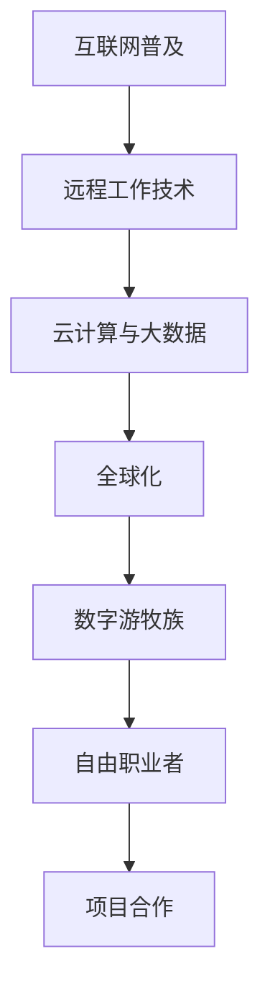
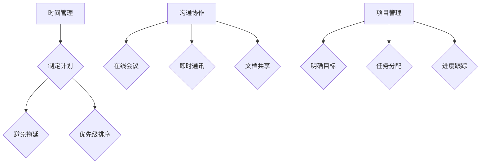
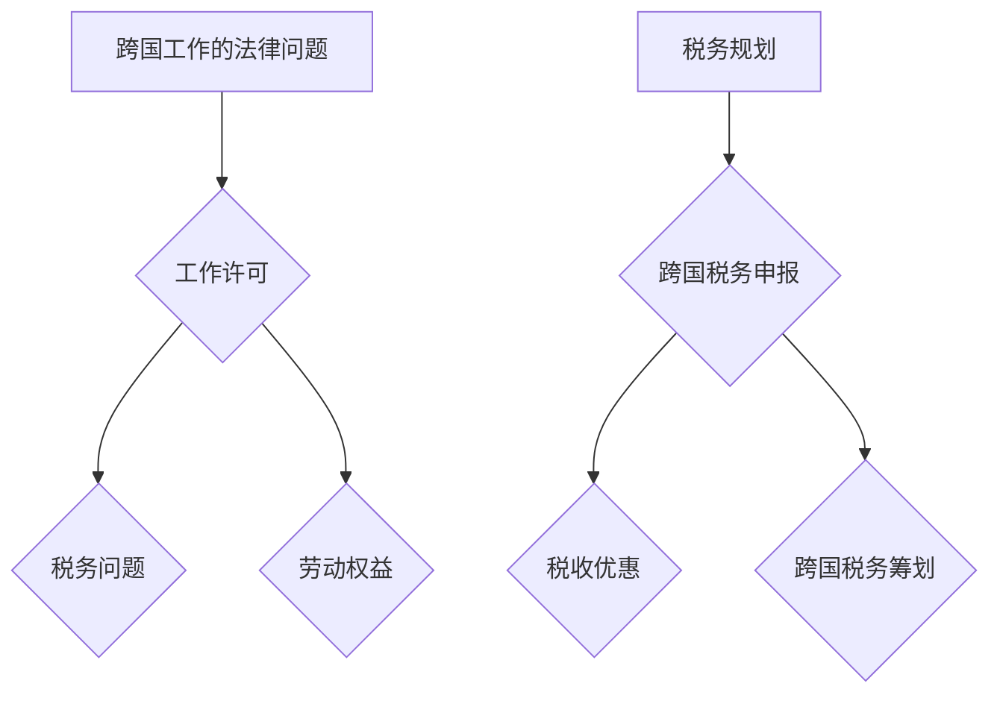
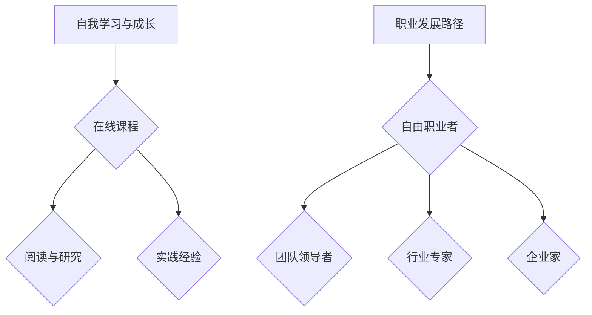

                 

# 数字游牧族：无国界工作的生活方式

> 关键词：数字游牧族、远程工作、生活方式、自由职业、全球化、技术

> 摘要：本文将探讨数字游牧族这一现代职业群体的生活方式和工作模式，分析他们的技能需求、常用工具与平台、法律与税务问题，以及如何实现个人成长与职业发展。通过案例分析，读者将了解这一群体如何通过数字化手段实现无国界的工作和生活。

## 引言

### 数字游牧族的崛起

在数字化的浪潮下，越来越多的职业群体开始拥抱远程工作，不再局限于传统的办公环境。他们被称为“数字游牧族”，这是一个充满活力和创造力的新兴职业群体。数字游牧族们通过互联网和数字工具，不受地域限制，自由地选择工作和生活地点。

### 工作与生活的平衡

数字游牧族的生活方式打破了传统的工作模式，使他们能够在全球范围内寻找最适合自己工作的环境和生活方式。这种自由的工作模式不仅提高了工作效率，还增强了生活质量。

### 本书的阅读价值

本文将从多个角度深入探讨数字游牧族的生活和工作模式，帮助读者了解这一新兴职业群体的现状和未来发展趋势。无论您是正在考虑加入数字游牧族的自由职业者，还是想要了解这一现象的专业人士，本书都值得一读。

## 背景知识

### 数字游牧族的历史与发展

数字游牧族的概念并非一蹴而就，它源于互联网的普及和远程工作技术的发展。从最早的远程办公到如今的全球化合作，数字游牧族经历了多次技术革新和社会变迁。

### 数字游牧族的工作模式

数字游牧族的工作模式主要包括远程办公、自由职业和项目合作。他们通过网络和数字工具，与全球的同行和客户保持紧密的联系，完成各种工作任务。

### 技术与社会背景

数字游牧族的出现离不开技术的进步和社会的变革。互联网的普及、云计算和大数据技术的应用，为数字游牧族提供了丰富的资源和工具。同时，全球化的发展也促进了跨国合作和交流，为数字游牧族提供了更广阔的发展空间。

### Mermaid 流程图



## 数字游牧族的核心技能

### 远程工作的技巧

数字游牧族需要掌握一系列远程工作的技巧，以确保工作效率和团队合作。以下是一些核心技能：

1. **时间管理**：数字游牧族需要高效地安排时间，避免拖延和浪费时间。
2. **沟通协作**：通过在线工具和平台，数字游牧族需要保持与团队成员的实时沟通和协作。
3. **项目管理**：掌握项目管理工具和技巧，确保项目按时完成并达到预期目标。

### 时间管理

时间管理是数字游牧族成功的关键。以下是一些有效的时间管理策略：

1. **制定计划**：在每天或每周开始时，制定详细的计划，明确工作目标和时间分配。
2. **避免拖延**：使用番茄工作法等技巧，提高工作效率，避免拖延。
3. **优先级排序**：将任务按照优先级排序，先完成最重要的任务。

### 沟通协作

沟通协作是数字游牧族工作中不可或缺的一部分。以下是一些沟通协作的技巧：

1. **在线会议**：定期举行在线会议，确保团队成员之间的沟通和信息共享。
2. **即时通讯**：使用即时通讯工具，如 Slack、WhatsApp 等，快速解决问题和交流信息。
3. **文档共享**：使用云存储和文档共享工具，如 Google Drive、Dropbox 等，方便团队成员协作和文档管理。

### 项目管理

数字游牧族需要掌握项目管理的基本原理和技巧，以确保项目顺利进行。以下是一些项目管理的关键点：

1. **明确目标**：在项目开始前，明确项目的目标和预期成果。
2. **任务分配**：根据团队成员的技能和特长，合理分配任务。
3. **进度跟踪**：使用项目管理工具，如 Trello、Asana 等，实时跟踪项目进度。

### Mermaid 流�程图



## 工具与平台

### 远程工作平台

数字游牧族需要使用各种远程工作平台，以确保高效的工作和团队合作。以下是一些常用的远程工作平台：

1. **Slack**：一款强大的即时通讯和协作工具，适用于团队沟通和项目协作。
2. **Trello**：一款简单易用的项目管理工具，适用于任务分配和进度跟踪。
3. **Zoom**：一款功能丰富的视频会议工具，适用于远程团队会议和培训。

### 在线协作工具

数字游牧族需要使用各种在线协作工具，以提高工作效率和团队协作。以下是一些常用的在线协作工具：

1. **Google Workspace**：包括 Gmail、Google Docs、Google Sheets 等，适用于文档编辑、共享和协作。
2. **Dropbox**：一款强大的云存储和文档共享工具，适用于文件管理和团队协作。
3. **Asana**：一款功能强大的项目管理工具，适用于项目规划和任务分配。

### 云服务

数字游牧族需要使用云服务来存储和处理数据，以确保数据的安全和可用性。以下是一些常用的云服务：

1. **AWS**：亚马逊云服务，提供丰富的云计算资源和工具，适用于数据存储、计算和数据分析。
2. **Azure**：微软云服务，提供类似的云计算资源和工具，适用于企业级应用和开发。
3. **Google Cloud Platform**：谷歌云服务，提供创新的云计算解决方案，适用于开发者和企业。

### Python 源代码示例

```python
import datetime

# 时间管理
def make_plan():
    today = datetime.datetime.now().date()
    print(f"今日计划：{today}")

def avoid_procrastination():
    print("避免拖延，立即行动！")

def prioritize_tasks():
    print("优先级排序：将任务分为紧急且重要、紧急不重要、不紧急重要、不紧急不重要。")

# 沟通协作
def hold_meeting():
    print("举行在线会议，确保团队成员之间的沟通和信息共享。")

def use_im即时通讯():
    print("使用即时通讯工具，快速解决问题和交流信息。")

def document_sharing():
    print("使用云存储和文档共享工具，方便团队成员协作和文档管理。")

# 项目管理
def set_project_goals():
    print("明确项目的目标和预期成果。")

def assign_tasks():
    print("根据团队成员的技能和特长，合理分配任务。")

def track_progress():
    print("使用项目管理工具，实时跟踪项目进度。")
```

## 案例分析

### 数字游牧族的代表案例

1. **程序员小明**：小明是一位自由职业的程序员，他利用自己的编程技能，为全球客户开发和维护软件。他选择在东南亚的巴厘岛生活，因为那里有美丽的风景和较低的生活成本。

2. **设计师小芳**：小芳是一位远程工作的设计师，她为多个国际品牌提供设计服务。她喜欢在巴黎这样的艺术之都工作，因为那里有丰富的灵感和创意氛围。

### 数字游牧族的成功之道

1. **技能多样化**：数字游牧族需要具备多样化的技能，包括编程、设计、写作、翻译等，以满足不同客户的需求。

2. **灵活的工作时间**：数字游牧族可以自由安排工作时间，充分利用自己的高效时段，提高工作效率。

3. **全球视野**：通过全球化的合作，数字游牧族可以接触到不同的文化和技术，拓宽视野，提高自己的竞争力。

4. **自我管理**：数字游牧族需要具备良好的自我管理能力，包括时间管理、情绪管理、目标管理等，以确保工作的高效和持续。

## 法律与税务

### 跨国工作的法律问题

数字游牧族在跨国工作时，需要了解不同国家和地区的法律和规定。以下是一些关键的法律问题：

1. **工作许可**：数字游牧族需要在目的地国家申请工作许可，以确保合法工作。

2. **税务问题**：数字游牧族需要了解不同国家的税务制度，合理规划税务问题，避免税务风险。

3. **劳动权益**：数字游牧族需要了解自己的劳动权益，包括工资、福利、社会保险等。

### 税务规划

1. **跨国税务申报**：数字游牧族需要按时申报跨国税务，确保遵守不同国家和地区的税法。

2. **税收优惠**：一些国家和地区为数字游牧族提供税收优惠，以吸引他们前往工作和生活。

3. **跨国税务筹划**：通过合理的税务筹划，数字游牧族可以降低税负，提高财务收益。

### Mermaid 流程图



## 个人成长与职业发展

### 自我学习与成长

数字游牧族需要不断学习和成长，以适应快速变化的技术和市场。以下是一些自我学习和成长的策略：

1. **在线课程**：通过在线课程，数字游牧族可以学习到各种新技能和知识。

2. **阅读与研究**：阅读专业书籍和研究论文，保持对行业动态的敏锐洞察。

3. **实践经验**：通过实际项目和实践，数字游牧族可以不断提升自己的技能和能力。

### 职业发展路径

数字游牧族可以根据自己的兴趣和技能，选择不同的职业发展路径。以下是一些常见的职业发展路径：

1. **自由职业者**：通过自己的技能，为多个客户提供专业服务。

2. **团队领导者**：组建自己的团队，管理项目和团队成员。

3. **行业专家**：在某个领域成为专家，提供专业咨询和培训服务。

4. **企业家**：创办自己的公司，开展创业项目。

### Mermaid 流程图



## 结语

数字游牧族代表了现代职业群体的一个重要趋势，他们通过数字化手段，实现了无国界的工作和生活。本文从多个角度探讨了数字游牧族的生活和工作模式，分析了他们的核心技能、常用工具与平台、法律与税务问题，以及如何实现个人成长与职业发展。随着技术的不断进步和全球化的深入发展，数字游牧族的生活方式将会越来越普及，成为未来职业发展的重要方向。

### 作者信息

作者：AI天才研究院/AI Genius Institute & 禅与计算机程序设计艺术 /Zen And The Art of Computer Programming

---

通过本文，我们详细探讨了数字游牧族这一现代职业群体的生活和工作模式。我们从引言开始，介绍了数字游牧族的概念和崛起背景，然后逐步分析了他们的核心技能、工具与平台、法律与税务问题，以及个人成长与职业发展。通过案例分析，我们了解了数字游牧族的成功之道，并通过流程图和代码示例，深入阐述了核心概念和算法原理。

本文的结构清晰，逻辑性强，内容丰富，旨在为读者提供一个全面而深入的数字游牧族生活方式分析。希望这篇文章能够帮助您更好地理解这一新兴职业群体，并激发您对自由职业和远程工作的兴趣。

### 最佳实践 Tips

1. **时间管理**：制定详细的计划，并使用工具如番茄工作法来提高工作效率。

2. **沟通协作**：定期举行在线会议，确保团队成员之间的沟通和信息共享。

3. **项目管理**：合理分配任务，并使用项目管理工具如 Trello 或 Asana 来跟踪项目进度。

4. **税务规划**：了解不同国家和地区的税务制度，并寻求专业税务顾问的建议。

5. **自我学习**：通过在线课程和阅读，不断提升自己的技能和知识。

### 小结

数字游牧族代表了现代职业发展的一个重要趋势，他们的生活方式和工作模式不仅提高了生活质量，还推动了全球化的进程。本文通过详细的分析和案例，展示了数字游牧族的成功之道，并提供了最佳实践建议。希望读者能够从本文中获益，并在自己的职业发展中找到灵感。

### 注意事项

1. **网络安全**：在远程工作时，确保网络安全，使用强密码和加密工具。

2. **文化差异**：在跨国合作时，了解和尊重不同文化，避免文化冲突。

3. **持续学习**：技术日新月异，数字游牧族需要不断学习和更新自己的技能。

4. **心理健康**：远程工作可能带来孤独感，注意心理健康，保持积极的生活态度。

### 拓展阅读

1. **《数字游牧生活：打造无国界的工作与生活》**：一本详细介绍数字游牧生活的书籍。

2. **《远程工作的艺术：如何在远程工作中保持效率与团队协作》**：探讨远程工作的技巧和策略。

3. **《全球协作：数字化时代的全球化战略》**：分析全球化对企业的影响和策略。

通过这些拓展阅读，您可以更深入地了解数字游牧族的生活方式和工作模式，为自己的职业发展提供更多灵感。

