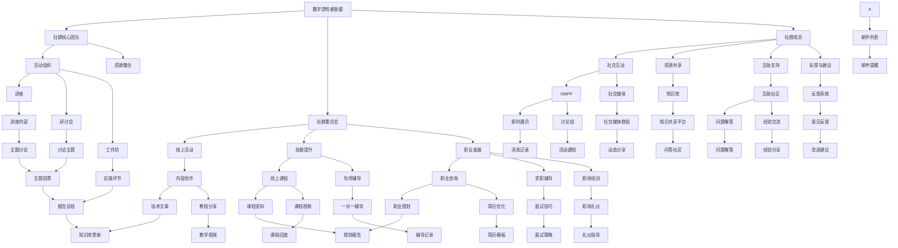

                 

### 引言

#### 数字游牧者联盟的诞生背景

在当今全球化、数字化和信息技术飞速发展的时代，远程工作逐渐成为职场的新常态。据统计，全球有超过4亿人选择远程工作，这一群体被称为“数字游牧者”。他们不受地域限制，通过互联网在全球范围内寻找工作机会，以灵活、自由的方式生活和工作。然而，随着远程工作的普及，数字游牧者群体也面临着一系列挑战，如孤独感、效率低下、职业发展停滞等。

为了解决这些问题，数字游牧者开始寻找互助和支持的平台。他们需要一个能够提供社交互动、资源共享、技能提升和职业发展的社群，这就是数字游牧者联盟的诞生背景。数字游牧者联盟不仅是一个线上社区，更是一个由共同价值观和目标驱动的意义社群，旨在为成员提供全方位的支持和成长机会。

#### 数字游牧者联盟的意义

数字游牧者联盟的意义主要体现在以下几个方面：

1. **社交互动**：对于许多数字游牧者来说，远程工作意味着长时间的独处。数字游牧者联盟提供了一个社交平台，成员可以在这里交流心得、分享生活、建立深厚的友谊。这种社交互动不仅缓解了孤独感，也增强了成员之间的凝聚力。

2. **资源共享**：数字游牧者联盟的成员来自不同的行业和领域，他们拥有丰富的经验和资源。通过联盟，成员可以共享这些资源，包括工作机会、技术教程、市场信息等。这种资源共享有助于提高成员的竞争力，也为他们提供了更多的发展机会。

3. **技能提升**：数字游牧者联盟提供了一个学习和成长的环境。成员可以在这里参加线上课程、研讨会和工作坊，提升专业技能。此外，联盟还鼓励成员跨领域学习，融合不同领域的知识，从而提高综合素质。

4. **职业发展**：数字游牧者联盟不仅关注成员的个人成长，也致力于帮助他们实现职业发展。联盟为成员提供职业咨询、求职辅导和职场培训等服务，帮助他们更好地规划职业道路，实现职业目标。

#### 文章关键词

- 数字游牧者
- 远程工作
- 数字游牧者联盟
- 社交互动
- 资源共享
- 技能提升
- 职业发展

#### 文章摘要

本文将深入探讨数字游牧者联盟的诞生背景、意义以及核心概念。首先，我们将介绍数字游牧者的概念和远程工作的现状，然后详细阐述数字游牧者联盟的定义、优势及其与意义社群的联系。接下来，我们将探讨数字游牧者联盟的社交互动、资源共享、技能提升和职业发展等方面，最后对未来数字游牧者联盟的发展趋势进行展望。通过本文的阅读，读者将全面了解数字游牧者联盟的意义及其对远程工作者的影响。

## 第二部分：核心概念与联系

### 2.1 远程工作的核心概念

#### 2.1.1 远程工作的定义与类型

远程工作，顾名思义，是指通过互联网和通信技术，在非传统的办公环境中完成工作任务的一种工作模式。远程工作可以分为以下几种类型：

1. **远程办公**：员工在家中或其他非办公场所通过电脑、网络等工具完成工作任务。
2. **移动办公**：员工在工作期间，可以随时随地通过移动设备接入公司网络，处理工作事务。
3. **远程协作**：团队成员分布在不同的地理位置，通过互联网工具共同完成项目。

#### 2.1.2 远程工作的优势与挑战

远程工作具有以下优势：

1. **灵活性**：远程工作让员工能够灵活安排工作时间和地点，提高生活质量。
2. **工作效率**：避免了通勤时间，员工可以有更多时间专注于工作任务，提高工作效率。
3. **成本节约**：企业可以节省办公室租赁和设备采购等费用，降低运营成本。
4. **全球人才池**：企业可以招聘全球范围内的优秀人才，扩大人才储备。

然而，远程工作也面临着一些挑战：

1. **沟通障碍**：远程工作缺乏面对面的沟通，可能导致信息传递不准确、团队协作不畅。
2. **工作与生活平衡**：远程工作让员工在家办公，容易导致工作与生活界限模糊，影响生活质量。
3. **自我管理能力**：远程工作需要员工具备较强的自我管理能力，以保持工作效率和职业发展。

### 2.2 数字游牧者联盟的概念

#### 2.2.1 数字游牧者联盟的定义

数字游牧者联盟是指一群具有共同价值观和目标的远程工作者组成的社群。该社群通过线上平台和活动，为成员提供社交互动、资源共享、技能提升和职业发展等全方位的支持。

#### 2.2.2 数字游牧者联盟的优势

1. **社交互动**：数字游牧者联盟为成员提供了一个社交平台，让他们可以结识来自不同背景和领域的朋友，分享生活经验和职业见解。
2. **资源共享**：联盟成员可以共享各自的工作经验、技术知识和市场信息，提高个人的专业素养和竞争力。
3. **技能提升**：联盟定期举办线上课程、研讨会和工作坊，帮助成员提升专业技能和跨领域能力。
4. **职业发展**：联盟为成员提供职业咨询、求职辅导和职场培训等服务，助力他们实现职业目标。

### 2.3 数字游牧者联盟与意义社群

#### 2.3.1 社群的概念与重要性

社群是指一群具有共同兴趣、价值观或目标的个体组成的集体。在现代社交网络中，社群具有极高的重要性，它们不仅为成员提供了交流和互动的平台，还能在精神上给予成员支持和鼓励。

#### 2.3.2 数字游牧者联盟与社群的联系

数字游牧者联盟本质上是一个意义社群，它与一般社群的不同之处在于其针对远程工作者的特殊需求而设计。以下是数字游牧者联盟与社群之间的联系：

1. **社交互动**：数字游牧者联盟通过线上平台和活动，为成员提供了丰富的社交互动机会，增强了成员之间的联系和凝聚力。
2. **资源共享**：联盟成员通过分享各自的经验和资源，实现了知识和技能的共享，提高了整个社群的专业水平。
3. **技能提升**：数字游牧者联盟定期举办各类培训和研讨会，为成员提供了学习和成长的机会，促进了社群的共同进步。
4. **职业发展**：联盟通过职业咨询、求职辅导和职场培训等服务，帮助成员实现职业目标，提升了社群的整体竞争力。

通过以上分析，我们可以看到，数字游牧者联盟不仅仅是一个社交平台，更是一个具有深远意义和价值的社群，它为成员提供了全方位的支持和成长机会。下一部分，我们将探讨远程工作者的社群生活，了解他们如何在这个社群中实现个人和职业的发展。

### 2.4 数字游牧者联盟的运作机制

#### 2.4.1 社群的组织结构

数字游牧者联盟的组织结构通常包括以下几个层级：

1. **社群核心团队**：由联盟的发起者和核心成员组成，负责制定联盟的长期战略和规划，以及日常运营和管理。
2. **社群委员会**：由各领域的专家和志愿者组成，负责组织线上活动、课程和研讨会，以及协调成员之间的互动。
3. **社群成员**：包括所有加入联盟的远程工作者，他们通过参与活动、分享经验和资源，共同推动联盟的发展。

#### 2.4.2 社群的运作方式

数字游牧者联盟的运作方式主要基于以下几方面：

1. **线上活动**：联盟定期举办线上活动，如讲座、研讨会、工作坊等，成员可以参与其中，交流经验和学习新知识。
2. **资源共享**：联盟设立了一个资源共享平台，成员可以在这里分享自己的工作成果、技术教程和市场信息。
3. **技能提升**：联盟通过提供线上课程和导师辅导，帮助成员提升专业技能和跨领域能力。
4. **职业发展**：联盟为成员提供职业咨询和求职辅导，帮助他们在职业生涯中取得更大的成就。

#### 2.4.3 成员参与与贡献

数字游牧者联盟鼓励成员积极参与和贡献，以下是一些常见的参与方式：

1. **活动组织**：成员可以自发组织线上活动，如分享会、读书会等，促进成员之间的交流。
2. **内容创作**：成员可以创作技术文章、教程、案例等，分享自己的经验和见解，为联盟贡献知识。
3. **互助支持**：成员可以互相帮助，如提供工作机会、技术支持或职业建议，共同成长。
4. **反馈与建议**：成员可以对联盟的运营和服务提出反馈和建议，帮助联盟不断改进。

通过以上运作机制，数字游牧者联盟不仅为成员提供了一个交流和学习的平台，还通过资源整合和互助支持，推动了整个社群的共同发展。下一部分，我们将深入探讨远程工作者的社群生活，了解他们如何在这个社群中实现个人和职业的发展。

### 2.5 数字游牧者联盟中的关系架构

为了更好地理解数字游牧者联盟的运作和功能，我们可以通过Mermaid流程图来展示其关系架构。以下是一个简化的Mermaid流程图，用于描述数字游牧者联盟中的核心关系和组件：



在这个流程图中，核心组件包括：

1. **数字游牧者联盟**：作为整个系统的核心，负责统筹和协调各项工作。
2. **社群核心团队**：负责制定战略和规划，确保联盟的正常运作。
3. **社群委员会**：负责组织活动、提升成员技能和促进职业发展。
4. **社群成员**：作为联盟的主体，参与各种活动、贡献资源和实现个人发展。

通过这个关系架构，我们可以看到数字游牧者联盟是如何通过不同的角色和组件，形成一个高效的社群系统，为成员提供全方位的支持和成长机会。下一部分，我们将探讨远程工作者如何在社群生活中实现个人和职业的发展。

### 社群互动与协作

在数字游牧者联盟中，社交互动和协作是社群生活的核心组成部分。有效的互动和协作不仅能够增强成员之间的联系，还能提高整个社群的凝聚力和效率。

#### 社群沟通的工具与平台

数字游牧者联盟采用了多种工具和平台来促进社群互动和协作。以下是一些常用的工具：

1. **即时通讯工具**：如Slack、Microsoft Teams和WhatsApp等，这些工具提供了实时的沟通渠道，便于成员进行日常交流和协作。
2. **社交媒体平台**：如LinkedIn、Facebook和Twitter等，这些平台可以帮助成员建立职业网络，分享经验和见解。
3. **讨论论坛**：如Reddit和Discord等，这些论坛提供了专门的讨论区域，成员可以在这里分享知识和经验，解答问题。
4. **视频会议工具**：如Zoom、Google Meet和Microsoft Teams等，这些工具在举办线上讲座、研讨会和工作坊时非常重要。

#### 社群协作的最佳实践

为了确保社群协作的有效性，数字游牧者联盟鼓励成员遵循以下最佳实践：

1. **明确目标和分工**：在开始一个项目或活动之前，成员应该明确目标和分工，确保每个人都知道自己的职责和任务。
2. **定期会议**：定期举行线上会议，成员可以汇报进度、讨论问题、分享成果。这有助于保持项目进度和协作效果。
3. **使用项目管理工具**：如Trello、Jira和Asana等，这些工具可以帮助成员管理任务和项目，提高协作效率。
4. **文档共享与版本控制**：使用Google Docs、Microsoft Office 365和Git等工具，成员可以共享文档并实现版本控制，确保信息的准确性和一致性。
5. **及时反馈与支持**：在协作过程中，成员应该及时反馈问题和提供支持，共同解决难题，确保项目的顺利进行。

#### 案例分析

以下是一个数字游牧者联盟社群协作的案例分析：

**项目背景**：某数字游牧者联盟成员决定举办一场线上技术研讨会，主题是“人工智能在金融领域的应用”。为了确保研讨会的高质量，成员们决定通过协作来准备和执行这场活动。

**协作过程**：

1. **目标设定与分工**：研讨会策划小组确定了研讨会的时间、主题和议程，并明确了每个人的职责。例如，某人负责邀请演讲嘉宾，某人负责准备研讨会材料，某人负责技术支持等。
2. **沟通与协调**：策划小组定期通过Slack进行沟通，讨论研讨会的准备工作。他们还使用Trello来管理任务，确保每个任务都按时完成。
3. **内容准备**：演讲嘉宾和策划小组成员共同准备演讲材料，通过Google Docs进行文档共享和编辑。他们还使用Zoom进行多次彩排，确保演讲内容的质量和互动性。
4. **技术支持**：技术支持小组负责确保Zoom会议的顺利进行，包括测试网络连接、调整音频和视频设置等。
5. **活动执行**：在研讨会当天，所有成员通过Zoom进行线上互动，演讲嘉宾进行演讲，观众提问和讨论。整个活动顺利进行，得到了成员们的高度评价。

**效果评估**：这次研讨会不仅提高了成员们对人工智能在金融领域应用的认识，还加强了成员之间的联系。通过这次协作，成员们学会了如何更好地合作，为未来的活动奠定了基础。

通过这个案例分析，我们可以看到数字游牧者联盟如何通过有效的社群互动和协作，实现共同的目标和成长。

#### 社群互动与协作的可持续性

为了确保社群互动和协作的可持续性，数字游牧者联盟采取了一系列措施：

1. **建立长效机制**：联盟制定了长期战略和规划，确保社群的稳定发展和持续创新。
2. **资源持续投入**：联盟持续投入资源，如资金、技术和人才，支持社群的运作和活动。
3. **成员参与与反馈**：联盟鼓励成员积极参与社群活动和提供反馈，通过成员的建议和意见，不断改进和优化社群运营。
4. **可持续发展的文化**：联盟倡导可持续发展的价值观，鼓励成员在社群中践行环保、公平和共享的理念。

通过这些措施，数字游牧者联盟确保了社群互动和协作的长期可持续性，为成员提供了稳定和优质的支持平台。下一部分，我们将探讨数字游牧者联盟如何帮助成员实现成长与扩展。

### 3.3 社群成长与扩展

#### 3.3.1 社群的可持续发展

数字游牧者联盟的可持续发展是其长期成功的关键。为了确保社群的持续成长，联盟采取了一系列措施：

1. **内部培训与教育**：联盟定期举办内部培训和教育活动，提高成员的专业素养和技能水平，确保他们在快速变化的工作环境中保持竞争力。
2. **资源共享与优化**：联盟建立了完善的资源共享机制，成员可以共享知识、经验和资源，提高整体效能。同时，联盟不断优化资源共享平台，确保信息的准确性和实时性。
3. **社区文化建设**：联盟注重社区文化建设，鼓励成员积极参与社区活动，共同维护社群的和谐氛围。通过建立共同的价值观和文化，联盟增强了成员的归属感和凝聚力。

#### 3.3.2 社群的扩展策略

为了扩大数字游牧者联盟的影响力和吸引力，联盟采取了一系列扩展策略：

1. **合作伙伴关系**：联盟与各大企业、学术机构和行业组织建立合作伙伴关系，共同举办活动、研讨会和培训课程，扩大联盟的知名度和影响力。
2. **线上线下结合**：联盟不仅在线上开展活动，还通过线下聚会、会议和研讨会，为成员提供更多的互动和交流机会。这种线上线下相结合的方式，有助于提高成员的参与度和活跃度。
3. **国际化发展**：联盟积极拓展国际市场，吸引来自不同国家和地区的成员加入。通过国际化发展，联盟不仅能够分享更多的知识和经验，还能吸收不同文化的精华，提升社群的多样性和包容性。
4. **品牌推广**：联盟通过多种渠道进行品牌推广，如社交媒体、网络广告和线下活动，提高联盟的知名度和美誉度。同时，联盟还注重用户体验，通过优质的服务和内容，吸引和留住成员。

#### 3.3.3 成员的角色与贡献

在数字游牧者联盟中，每个成员都扮演着重要的角色，为社群的成长和扩展贡献力量。以下是一些常见的角色和贡献方式：

1. **活动组织者**：成员可以自发组织各种线上和线下活动，如讲座、研讨会、工作坊等，为其他成员提供学习和交流的机会。
2. **内容创作者**：成员可以通过撰写技术文章、教程、案例等，分享自己的经验和见解，为联盟贡献知识和价值。
3. **技术支持者**：有技术专长的成员可以提供技术支持，帮助其他成员解决技术难题，提升整个社群的技术水平。
4. **志愿者**：成员可以参与联盟的志愿者工作，如活动策划、资源管理、社区维护等，为联盟的运营提供支持。
5. **反馈与建议**：成员通过反馈和提供建议，帮助联盟不断改进和优化，确保社群的可持续发展。

通过成员的积极参与和贡献，数字游牧者联盟不仅实现了自身的成长和扩展，也为成员提供了丰富的成长机会和发展平台。下一部分，我们将探讨远程工作者的技能提升，了解他们如何在这个社群中不断提升自己的能力。

### 4.1 技能提升的重要性

在快速变化的技术环境中，技能提升对于远程工作者来说至关重要。首先，技术不断更新迭代，新工具、新框架和新方法层出不穷，远程工作者需要不断学习新知识，以保持自己的竞争力。其次，随着远程工作的普及，远程工作者需要掌握更多跨领域的技能，如项目管理、团队协作、沟通技巧等，以应对复杂的工作环境。此外，技能提升还能够帮助远程工作者实现职业发展，提高薪酬和职位。因此，数字游牧者联盟在技能提升方面提供了丰富的资源和机会，以支持成员的成长和进步。

#### 4.2 技能提升的方向与策略

数字游牧者联盟根据成员的不同需求和职业发展目标，提供了多样化的技能提升方向和策略：

##### 4.2.1 专业技能的提升

1. **技术课程与培训**：联盟与知名教育机构和专家合作，提供一系列技术课程和培训，涵盖前端开发、后端开发、数据科学、人工智能等领域。成员可以根据自己的兴趣和职业需求选择合适的课程，提升专业技能。

2. **在线编程平台**：联盟推荐了一些优秀的在线编程平台，如Codecademy、freeCodeCamp和LeetCode等，这些平台提供了丰富的编程资源和练习题，帮助成员巩固编程基础，提高编程能力。

3. **实战项目**：联盟鼓励成员参与实际项目，通过解决真实问题来提升技能。成员可以参与开源项目，或与联盟的其他成员合作，完成一些小型项目，积累实际工作经验。

##### 4.2.2 跨领域技能的融合

1. **跨学科学习**：数字游牧者联盟提倡跨学科学习，鼓励成员学习其他领域的知识，如商业管理、市场营销、心理学等。通过跨学科学习，成员可以拓宽视野，提高综合素质，从而在职业生涯中获得更多机会。

2. **软技能培训**：联盟提供了多种软技能培训课程，如时间管理、沟通技巧、演讲技巧等。这些课程帮助成员提高职业素养，更好地适应远程工作环境。

3. **个人品牌建设**：联盟重视个人品牌建设，提供了一系列关于个人品牌定位、内容创作和社交媒体运营的课程，帮助成员在数字世界中树立良好的个人形象。

##### 4.2.3 技能提升的策略与方法

1. **制定学习计划**：数字游牧者联盟建议成员制定详细的学习计划，明确学习目标、时间和进度。这有助于成员有条不紊地学习，确保学习效果。

2. **持续实践**：技能提升的关键在于实践。成员应该将所学知识应用到实际工作中，不断实践和总结，从而真正掌握技能。

3. **社群互助**：数字游牧者联盟鼓励成员之间的互助学习。成员可以组建学习小组，共同学习、讨论和分享经验，相互监督和鼓励，提高学习效果。

4. **导师制度**：联盟为成员提供了导师制度，成员可以与经验丰富的导师一对一交流，获得职业发展建议和技术指导，加快技能提升的速度。

通过以上策略和方法，数字游牧者联盟为成员提供了全方位的技能提升支持，帮助他们在不断变化的技术环境中保持竞争力，实现个人和职业的发展。下一部分，我们将探讨远程工作者的技能提升实例，了解他们如何通过联盟的资源和机会实现成长。

### 4.3 技能提升实例

为了更好地展示数字游牧者联盟如何帮助成员提升技能，以下将介绍几位成员的技能提升实例，并分析联盟提供的资源和支持。

#### 成员A：从零基础到前端开发工程师

**背景**：成员A是一位自由职业者，之前主要从事市场营销工作。由于对编程感兴趣，他决定通过联盟提升自己的前端开发技能。

**提升过程**：

1. **选择课程**：成员A在联盟的课程平台上找到了一系列前端开发课程，包括HTML、CSS和JavaScript等基础课程，以及React和Vue等框架课程。
2. **实践项目**：成员A参加了联盟组织的线上实战项目，与成员们合作开发一个全栈应用。这个项目不仅巩固了成员A的编程知识，还锻炼了他的团队协作能力。
3. **导师指导**：成员A通过导师制度，与一位经验丰富的前端开发工程师进行一对一交流，获得了专业的技术指导和职业建议。

**成果**：经过几个月的学习和实践，成员A成功转型为前端开发工程师，并在一家互联网公司找到了全职工作。

#### 成员B：从数据分析师到数据科学家

**背景**：成员B是一位数据分析师，希望在数据科学领域实现更深入的探索。

**提升过程**：

1. **学习机器学习**：成员B在联盟的支持下，学习了Python和机器学习相关课程，包括数据预处理、模型训练和评估等。
2. **参与开源项目**：成员B加入了联盟的一个开源项目，负责数据分析和模型训练工作。通过这个项目，成员B积累了丰富的实战经验，提高了自己的技术水平。
3. **专家讲座**：联盟定期举办专家讲座，成员B参加了多次关于深度学习和自然语言处理等前沿技术的讲座，拓展了知识面。

**成果**：成员B的技能得到了显著提升，他成功转型为数据科学家，并在一家知名的科技公司担任数据科学家职位。

#### 成员C：从项目管理到敏捷教练

**背景**：成员C是一位项目经理，希望在项目管理领域实现更专业的提升。

**提升过程**：

1. **学习敏捷方法**：成员C参加了联盟的敏捷方法课程，学习了Scrum和Kanban等敏捷实践。
2. **实践敏捷管理**：成员C在联盟的实践项目中担任敏捷教练，指导团队成员进行敏捷开发，通过实践提升了敏捷管理能力。
3. **职业咨询**：联盟为成员C提供了职业咨询服务，帮助他制定了职业发展计划，并推荐了多家适合他的企业。

**成果**：成员C成功转型为敏捷教练，并在一家大型互联网公司担任敏捷教练职位。

通过以上实例，我们可以看到数字游牧者联盟如何通过课程学习、实战项目、导师指导和职业咨询等多种方式，帮助成员实现技能提升和职业发展。这些成功的案例不仅展示了联盟的资源和能力的强大，也为其他成员提供了宝贵的经验和借鉴。下一部分，我们将总结技能提升的重要性，并探讨如何持续提升技能。

#### 技能提升的重要性

技能提升对于远程工作者来说，不仅关乎个人职业发展，更是适应快速变化的工作环境的必备条件。随着技术的不断更新和市场的不断变化，远程工作者需要不断学习新技能，以保持竞争力。以下是技能提升的重要性的几个方面：

1. **职业发展**：技能提升能够帮助远程工作者在职业生涯中取得更大的成就。通过掌握新技术和跨领域技能，他们可以获得更高的职位和更好的薪酬。
2. **适应能力**：技能提升使得远程工作者能够更好地适应不断变化的工作环境。无论是新工具的引入，还是工作方式的变革，他们都具备相应的适应能力。
3. **工作效率**：技能提升能够提高远程工作者的工作效率。熟练掌握技能的工作者能够更快速地完成任务，减少错误和返工，从而提高整体工作效能。
4. **创新能力**：技能提升激发了远程工作者的创新能力。通过学习新知识和新方法，他们能够提出更有创意的解决方案，推动企业和个人取得更大的成功。
5. **终身学习**：技能提升促进了远程工作者的终身学习意识。在快速变化的时代，终身学习已经成为一种生活方式，技能提升是实现这一目标的重要途径。

#### 如何持续提升技能

为了持续提升技能，远程工作者可以采取以下策略：

1. **制定学习计划**：制定详细的学习计划，明确学习目标、时间和进度。这有助于有条不紊地学习，确保学习效果。
2. **实践与反思**：将所学知识应用到实际工作中，通过实践来巩固和提升技能。同时，定期反思和总结学习成果，不断改进和优化学习策略。
3. **社群学习**：积极参与数字游牧者联盟等社群，与其他成员一起学习、讨论和分享经验。通过社群学习，可以拓宽视野，提高学习效果。
4. **导师制度**：寻找一位经验丰富的导师，进行一对一交流和学习。导师可以提供专业的指导和建议，帮助远程工作者更快地提升技能。
5. **持续关注新技术**：关注行业动态和新技术的发展，及时学习新知识和新方法。通过持续关注，远程工作者可以保持对行业发展的敏感度，不断更新自己的技能库。

通过以上策略，远程工作者可以持续提升技能，适应快速变化的工作环境，实现个人和职业的发展。下一部分，我们将探讨数字游牧者联盟的未来发展趋势。

### 5.1 数字游牧者联盟的未来发展趋势

随着全球化的不断深入和数字技术的飞速发展，数字游牧者联盟的未来充满机遇和挑战。以下是对数字游牧者联盟未来发展趋势的探讨：

#### 5.1.1 技术驱动的社群发展

未来，数字游牧者联盟将更加依赖先进技术来提升社群的运营效率和成员体验。人工智能、区块链、物联网等新兴技术将应用于社群管理、资源共享、技能提升等方面，为成员提供更加个性化和智能化的服务。

1. **人工智能**：通过人工智能技术，联盟可以更好地了解成员的需求和偏好，提供个性化的学习路径和推荐内容。此外，人工智能还可以用于社群的自动化管理，提高运营效率。
2. **区块链**：区块链技术可以提高数字游牧者联盟的信任度和透明度。通过区块链，成员可以安全地共享资源和信息，确保数据的真实性和完整性。
3. **物联网**：物联网技术可以提升社群的互动和协作效率。例如，通过智能设备，成员可以实现远程协作、实时沟通和智能办公，提高工作效率。

#### 5.1.2 社群生态的多元化发展

未来，数字游牧者联盟将发展成为一个多元化的社群生态，不仅涵盖远程工作者，还吸引其他类型的成员，如自由职业者、创业者、学者等。这种多元化将带来更多的合作机会和资源共享，推动社群的共同发展。

1. **跨界合作**：联盟将与其他行业和组织建立跨界合作关系，共同举办活动、研讨会和工作坊，推动跨领域的交流与合作。
2. **多元内容**：联盟将提供更多元化的内容，包括技术讲座、商业分析、艺术创作、心理学分享等，满足不同成员的需求。
3. **全球视野**：联盟将吸引来自全球的成员，促进跨文化交流和合作，为社群注入新的活力和创意。

#### 5.1.3 社群文化的塑造

未来，数字游牧者联盟将更加注重社群文化的塑造，培养成员的共同价值观和使命感。通过建立积极、开放、包容的社群文化，联盟可以增强成员的归属感和凝聚力，推动社群的可持续发展。

1. **价值观传递**：联盟将通过一系列活动和文化建设，传递积极向上的价值观，如创新、协作、共享、责任等。
2. **社会责任**：联盟将积极参与社会公益活动，推动公益事业的发展，提升社群的社会责任感。
3. **社区参与**：联盟将鼓励成员积极参与社群的运营和管理，共同制定社群的发展方向和策略。

#### 5.1.4 人才培养与职业发展

未来，数字游牧者联盟将更加重视人才培养和职业发展，为成员提供全方位的支持和资源。通过建立完善的培训体系、职业规划和求职辅导服务，联盟将帮助成员实现职业目标，提升个人价值。

1. **定制化培训**：联盟将根据成员的职业发展需求，提供定制化的培训课程，包括专业技能、跨领域能力、软技能等。
2. **职业规划**：联盟将提供职业咨询服务，帮助成员制定职业规划，明确职业发展方向和目标。
3. **求职辅导**：联盟将提供求职辅导服务，包括简历优化、面试技巧和职场礼仪等，提高成员的求职成功率。

通过以上发展趋势，数字游牧者联盟将继续为远程工作者提供一个支持性强、资源丰富、发展空间广阔的社群平台，助力他们在数字时代实现个人和职业的全面发展。下一部分，我们将探讨数字游牧者联盟面临的挑战与机遇。

### 5.2 数字游牧者联盟面临的挑战与机遇

#### 挑战

尽管数字游牧者联盟具有诸多优势，但在发展过程中也面临一些挑战：

1. **技术壁垒**：随着技术的不断更新，联盟需要持续投入资源进行技术升级，以确保提供优质的服务和资源。这对于资金和技术实力有限的小型联盟来说是一个巨大的挑战。
2. **信息安全性**：联盟需要确保成员的数据和信息安全，防止数据泄露和网络攻击。这需要联盟建立完善的安全管理体系，投入人力和物力进行安全防护。
3. **社群管理**：随着成员数量的增加，社群的管理难度也会加大。联盟需要建立有效的管理机制，确保社群的秩序和氛围，避免成员的流失和社群的分裂。
4. **资源分配**：联盟需要合理分配资源，确保每个成员都能获得公平的机会和支持。资源分配不均可能导致部分成员感到不公平，影响社群的凝聚力和积极性。

#### 机遇

与此同时，数字游牧者联盟也面临着许多机遇：

1. **全球化趋势**：随着全球化的不断深入，越来越多的远程工作者加入联盟，为社群注入了新的活力和创意。联盟可以抓住这一机遇，拓展国际市场，吸引全球优秀人才。
2. **技术进步**：新兴技术的不断涌现，如人工智能、区块链、物联网等，为联盟提供了更多的发展空间和工具。联盟可以利用这些技术提升服务质量和用户体验，增强竞争力。
3. **商业合作**：联盟可以与各大企业、教育机构和行业组织建立合作关系，共同举办活动、研讨会和工作坊，推动社群的共同发展。通过商业合作，联盟可以获得更多的资源和支持。
4. **社会认可**：随着远程工作的普及和认可度提高，数字游牧者联盟也得到了社会的广泛关注和认可。联盟可以通过品牌推广和社会责任活动，提高知名度和美誉度，吸引更多成员加入。

#### 挑战与机遇的应对策略

为了应对挑战和把握机遇，数字游牧者联盟可以采取以下策略：

1. **技术升级**：持续投入资源进行技术升级，确保提供优质的服务和资源。联盟可以与科技公司合作，利用人工智能、区块链等新兴技术提升运营效率和服务质量。
2. **信息安全**：建立完善的信息安全管理体系，投入人力和物力进行安全防护。联盟可以定期进行安全培训和演练，提高成员的安全意识和应对能力。
3. **社群管理**：建立有效的管理机制，确保社群的秩序和氛围。联盟可以设立专门的社群管理团队，负责社群的日常运营和管理，确保成员的权益和满意度。
4. **资源分配**：合理分配资源，确保每个成员都能获得公平的机会和支持。联盟可以通过定期评估和调整资源分配策略，确保资源的合理使用和最大化效益。
5. **品牌推广**：通过品牌推广和社会责任活动，提高知名度和美誉度。联盟可以与媒体合作，发布优质内容，宣传社群的价值和成就，吸引更多成员加入。

通过以上策略，数字游牧者联盟可以更好地应对挑战，把握机遇，实现可持续发展。下一部分，我们将探讨远程工作者社群的可持续发展，并总结数字游牧者联盟的未来方向。

### 5.3 远程工作者社群的可持续发展

#### 5.3.1 持续发展的理念

远程工作者社群的可持续发展是联盟长期成功的关键。它不仅关乎成员的个人成长和职业发展，还涉及到社群的整体健康和长远利益。为了实现可持续发展，联盟需要坚持以下理念：

1. **公平与包容**：确保每个成员都能获得公平的机会和支持，不论其背景、技能或地理位置。联盟应致力于建立一个包容性的环境，尊重多样性和不同意见。
2. **资源共享**：通过有效的资源共享机制，促进成员之间的知识、经验和资源的流动，提高整体社群的效能和创造力。
3. **社群自治**：赋予成员参与社群决策和管理的权利，增强他们的责任感和归属感。通过社群自治，联盟可以更好地适应成员的需求和变化，实现自我优化。
4. **社会责任**：关注社会问题，积极参与公益活动，推动公益事业的发展。通过履行社会责任，联盟可以提升社群的社会形象和影响力。

#### 5.3.2 实现可持续发展的策略

为了实现远程工作者社群的可持续发展，联盟可以采取以下策略：

1. **建立长效机制**：制定长期的战略和规划，确保社群的稳定发展和持续创新。联盟应定期评估和调整战略，以适应外部环境和内部需求的变化。
2. **持续资源投入**：确保资源持续投入，包括资金、技术、人才和设备等。联盟可以通过多种渠道获取资源，如合作伙伴支持、成员捐助和社会资助等。
3. **社群文化建设**：加强社群文化建设，培育共同的价值观和使命。通过文化活动、主题讨论和社区建设，联盟可以增强成员的归属感和凝聚力。
4. **成员参与与反馈**：鼓励成员积极参与社群活动和提供反馈，通过成员的建议和意见，不断改进和优化社群运营。
5. **技术创新**：紧跟技术发展趋势，持续引入和应用新技术，提升社群的运营效率和用户体验。联盟可以通过技术创新，提高资源整合和共享的能力。

#### 5.3.3 未来方向

在可持续发展理念的指导下，数字游牧者联盟的未来方向包括：

1. **多元化发展**：拓展社群的领域和范围，吸引更多类型的成员加入，如创业者、设计师、咨询师等。通过多元化发展，联盟可以提供更全面的支持和服务。
2. **国际化扩展**：加强国际合作，吸引全球成员参与联盟的活动和项目。通过国际化扩展，联盟可以分享全球经验，提升社群的全球影响力。
3. **技术创新应用**：积极应用新兴技术，如人工智能、区块链、物联网等，提升社群的运营效率和用户体验。通过技术创新，联盟可以更好地满足成员的需求，实现可持续发展。
4. **社会责任履行**：关注社会问题，积极参与公益活动，推动公益事业的发展。通过履行社会责任，联盟可以提升社群的社会形象和影响力。

通过坚持可持续发展理念，采取有效的实现策略和明确未来方向，数字游牧者联盟可以成为一个健康、稳定和有影响力的远程工作者社群，为成员提供长期的支持和成长机会。下一部分，我们将总结全文，重申数字游牧者联盟的重要性。

## 总结

数字游牧者联盟是一个为远程工作者提供全方位支持的意义社群。通过深入探讨数字游牧者的概念、远程工作的核心概念和挑战，我们了解了数字游牧者联盟的诞生背景和意义。联盟通过提供社交互动、资源共享、技能提升和职业发展等全方位支持，帮助成员实现个人和职业的成长。此外，我们探讨了数字游牧者联盟的运作机制、社群互动与协作、社群成长与扩展，以及技能提升的重要性和实践案例。展望未来，数字游牧者联盟将继续面临挑战和机遇，通过技术创新、多元化发展和社会责任履行，实现可持续发展。总结而言，数字游牧者联盟不仅是远程工作者的重要支持平台，更是推动数字时代职业发展和社会进步的重要力量。

## 作者信息

**作者：** AI天才研究院/AI Genius Institute & 禅与计算机程序设计艺术 /Zen And The Art of Computer Programming

**简介：** AI天才研究院（AI Genius Institute）是一家专注于人工智能领域研究和教育的高科技研究院。我们致力于推动人工智能技术的发展，为全球企业和个人提供先进的AI解决方案和培训。同时，我们也是《禅与计算机程序设计艺术》（Zen And The Art of Computer Programming）的作者，该书以其深刻的计算机科学理论和哲学思考，在全球范围内享有盛誉。我们的研究和工作始终以提升人类生活质量和推动科技发展为使命。

## 附录

### 项目实战

#### 环境搭建

为了展示如何使用Python进行一个简单的远程协作项目，我们将搭建一个基于GitHub的团队协作环境。以下是搭建步骤：

1. **安装Git**：在电脑上安装Git客户端。可以从[Git官网](https://git-scm.com/downloads)下载并安装。

2. **注册GitHub账号**：在[Github官网](https://github.com/)注册一个账号。

3. **创建新的仓库**：在GitHub上创建一个新的仓库（repository），命名为`team_project`。

4. **克隆仓库**：打开终端（或命令行工具），使用以下命令克隆仓库到本地：

   ```bash
   git clone https://github.com/your_username/team_project.git
   ```

5. **安装Python开发环境**：在本地环境中安装Python。可以选择Python 3.x版本，并确保安装了pip包管理器。

6. **安装必要的库**：在终端中进入项目目录，使用pip安装必要的Python库：

   ```bash
   pip install requests
   ```

#### 源代码实现

以下是一个简单的Python项目，用于展示团队协作的基本流程。该项目模拟了一个团队成员之间共享信息的场景。

```python
# team_project.py

import requests
import os

# 假设我们有一个远程服务器，用于存储和共享信息
REMOTE_SERVER_URL = 'https://example.com/api'

# 获取远程信息
def get_remote_data():
    response = requests.get(REMOTE_SERVER_URL + '/data')
    if response.status_code == 200:
        return response.json()
    else:
        return None

# 更新远程信息
def update_remote_data(data):
    response = requests.post(REMOTE_SERVER_URL + '/data', json=data)
    if response.status_code == 200:
        print("数据更新成功！")
    else:
        print("数据更新失败！")

# 主程序
if __name__ == '__main__':
    # 获取远程数据
    remote_data = get_remote_data()
    if remote_data:
        print("远程数据：", remote_data)

        # 对远程数据进行处理（如本地计算、分析等）
        processed_data = remote_data['data'] * 2

        # 更新远程数据
        update_remote_data({'data': processed_data})
    else:
        print("无法获取远程数据！")
```

#### 代码解读与分析

1. **安装Git和GitHub**：这是团队协作的基础。每个团队成员都需要安装Git并注册GitHub账号，以便在项目中共享代码和协作。

2. **克隆仓库**：团队成员通过克隆仓库到本地，获得项目的最新版本。这保证了团队成员之间的代码一致性。

3. **安装Python和必要库**：确保所有团队成员都拥有相同的开发环境，避免因环境不一致导致的问题。

4. **获取远程数据**：通过`requests`库，向远程服务器发送HTTP请求，获取最新的数据。

5. **处理和更新数据**：在本地对获取的数据进行处理，然后更新远程数据。这模拟了团队成员之间的协作过程。

6. **错误处理**：代码中包含了错误处理机制，如无法获取远程数据或更新数据失败的情况。

#### 实际案例分析和详细讲解

假设一个团队需要合作开发一个实时数据分析系统。团队成员A负责数据处理，团队成员B负责数据分析，团队成员C负责结果可视化。

1. **数据收集**：团队成员A每天从外部API获取最新的数据，并更新到GitHub仓库。

2. **数据处理**：团队成员B从仓库中获取数据，进行预处理和计算，将结果保存到本地。

3. **数据可视化**：团队成员C从仓库中获取数据，使用Python库（如Matplotlib）进行可视化，并生成报告。

4. **代码审查**：团队成员之间定期进行代码审查，确保代码质量和协作效率。

通过这个案例，我们可以看到如何通过数字游牧者联盟提供的资源和平台，实现高效的团队协作和项目开发。

#### 项目小结

通过本案例，我们展示了如何使用Python和GitHub实现一个简单的团队协作项目。项目涵盖了环境搭建、源代码实现、代码解读与分析，以及实际案例分析和详细讲解。这种方法不仅适用于小型项目，也为大型项目的远程协作提供了参考。数字游牧者联盟通过提供这些资源和平台，帮助远程工作者实现高效、稳定的团队合作，推动项目成功。

### 最佳实践 tips

1. **定期代码审查**：定期进行代码审查，可以及时发现和解决潜在的问题，提高代码质量。

2. **使用版本控制**：利用Git进行版本控制，确保代码的版本一致性和可追溯性。

3. **明确职责分工**：在团队协作中，明确每个成员的职责和任务，提高协作效率。

4. **保持良好的沟通**：定期举行团队会议，确保团队成员之间的沟通畅通，减少误解和冲突。

5. **持续学习**：鼓励团队成员持续学习新技术和新方法，提升个人和团队的竞争力。

### 小结

数字游牧者联盟为远程工作者提供了一个全方位的支持平台，从社交互动、资源共享、技能提升到职业发展，都给予了充分的关注。通过案例分析和最佳实践，我们展示了如何实现高效的团队协作和项目开发。未来，数字游牧者联盟将继续发挥其优势，帮助远程工作者在数字时代实现个人和职业的全面发展。

### 注意事项

1. **数据安全性**：在进行数据共享和协作时，务必确保数据的安全性，防止数据泄露和丢失。

2. **技术更新**：保持对新技术和工具的关注，及时更新自己的知识和技能。

3. **沟通效率**：提高沟通效率，确保团队成员之间的信息传递准确无误。

4. **工作与生活平衡**：注意工作与生活的平衡，避免因过度工作而影响生活质量。

### 拓展阅读

1. **《远程工作的艺术》**：这是一本关于远程工作方法和技巧的畅销书，详细介绍了如何提高远程工作效率。

2. **《GitHub入门与实践》**：这是一本关于Git和GitHub的使用指南，适合初学者学习如何进行版本控制和团队协作。

3. **《敏捷开发实践指南》**：这本书介绍了敏捷开发的方法和实践，对希望提升团队协作效率的远程工作者有很高的参考价值。

4. **《深度学习》**：这是一本关于深度学习和人工智能的经典教材，适合对数据科学和机器学习感兴趣的读者。

5. **《远程工作者的社群生活》**：这本书深入探讨了远程工作者的社群生活，提供了许多实用的建议和案例。

