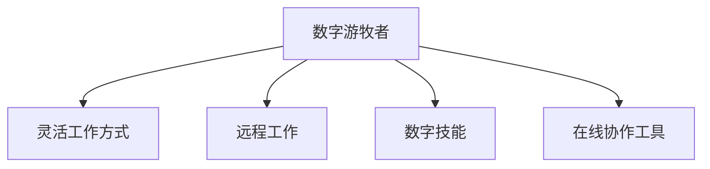
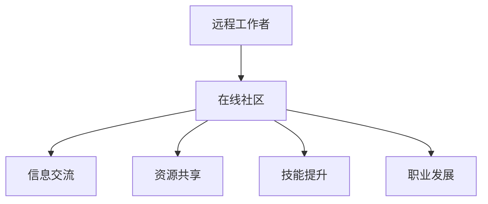

                 

# 数字游牧者部落：远程工作者的在线社区

> 关键词：远程工作、在线社区、数字游牧者、协作工具、职业发展

> 摘要：随着互联网技术的迅猛发展，远程工作已成为现代工作方式的重要组成部分。数字游牧者，这一新兴职业群体，通过在线社区实现了高效的工作和职业发展。本文将探讨数字游牧者在线社区的重要性、构建方法以及其在职业发展中的应用，为远程工作者提供有益的参考和指导。

## 第一部分：引言

### 1.1 数字游牧者概述

数字游牧者，是指那些利用数字技能，通过互联网在全球范围内进行工作的人。他们不受地理限制，可以在任何有网络连接的地方工作，这种灵活的工作方式被称为数字游牧。

**核心概念与联系**

为了更直观地展示数字游牧者的基本特征和类型，我们可以使用Mermaid流程图进行说明：



在这个流程图中，数字游牧者与灵活工作方式、远程工作、数字技能和在线协作工具之间存在紧密的联系。这些联系为数字游牧者的工作提供了必要的支持和保障。

### 1.2 在线社区的重要性

对于数字游牧者来说，在线社区不仅是一个交流信息的平台，更是他们工作的重要组成部分。在线社区为数字游牧者提供了资源共享、技能提升、职业发展等多方面的支持。

**核心概念与联系**

我们可以使用Mermaid流程图来展示远程工作者与在线社区之间的关系：



在这个流程图中，远程工作者与在线社区之间存在着信息交流、资源共享、技能提升和职业发展等核心联系。这些联系使得在线社区成为远程工作者不可或缺的一部分。

## 第二部分：构建数字游牧者在线社区

### 2.1 选择合适的在线平台

选择一个合适的在线平台是构建数字游牧者在线社区的第一步。在选择平台时，我们需要考虑多个关键指标，如用户友好性、安全性、集成度和成本等。

**核心算法原理讲解**

我们可以使用Python源代码来阐述选择平台的关键指标：

```python
# 选择平台的关键指标
import pandas as pd

# 假设我们有以下平台数据
platforms = pd.DataFrame({
    'Platform': ['Slack', 'Discord', 'Microsoft Teams', 'WhatsApp'],
    'User_Friendly': [8, 7, 9, 7],
    'Security': [8, 7, 8, 6],
    'Integration': [7, 8, 9, 7],
    'Cost': [5, 6, 7, 4]
})

# 根据综合评分选择平台
platforms['Score'] = platforms.mean(axis=1)
best_platform = platforms.loc[platforms['Score'].idxmax()]['Platform']
print(f"最佳平台推荐：{best_platform}")
```

在这个例子中，我们使用了Pandas库来处理平台数据，并计算每个平台的综合评分。根据综合评分，我们选择了最佳平台。

### 2.2 社区规划与组织

社区规划与组织是构建数字游牧者在线社区的关键步骤。在这个阶段，我们需要考虑社区成员规模、社区结构和沟通机制等因素。

**数学模型和数学公式 & 详细讲解 & 举例说明**

我们可以使用以下数学模型来计算社区成员规模：

$$
N = n_1 + n_2 + ... + n_n
$$

其中，$N$ 表示社区总人数，$n_i$ 表示第 $i$ 类成员的数量。

例如，假设我们的社区有程序员、设计师和产品经理三类成员，分别有10人、8人和6人，则社区总人数为：

$$
N = 10 + 8 + 6 = 24
$$

### 2.3 建立有效的沟通机制

建立有效的沟通机制是确保数字游牧者在线社区运转的关键。在这个阶段，我们需要搭建一个稳定、高效的沟通平台，如Slack或Discord。

**项目实战**

下面是一个使用Slack API搭建社区频道的示例代码：

```python
# 假设我们使用 Slack API 搭建社区
import requests
import json

# 创建 Slack 频道
response = requests.post(
    "https://slack.com/api/chat.createChannel",
    json={
        "name": "remote_workers",
        "is_private": False,
        "team_id": "T1234567890"
    }
)
print(f"频道创建结果：{response.json()}")
```

在这个例子中，我们使用了Slack API来创建一个名为"remote_workers"的公共频道。

### 2.4 促进社区活跃度

促进社区活跃度是提高数字游牧者在线社区价值的关键。我们可以通过定期举办活动、分享经验和知识等方式来激发社区成员的参与热情。

**核心算法原理讲解**

下面是一个使用Python源代码分析社区活跃度的示例：

```python
# 社区活跃度分析
import pandas as pd

# 假设我们有以下社区活跃数据
activity_data = pd.DataFrame({
    'User': ['Alice', 'Bob', 'Charlie'],
    'Messages': [15, 10, 5],
    'Posts': [5, 3, 7],
    'Days_Active': [30, 20, 25]
})

# 计算平均活跃度
average_activity = activity_data.mean(axis=0)
print(f"平均活跃度：{average_activity}")
```

在这个例子中，我们使用了Pandas库来处理社区活跃数据，并计算了平均活跃度。

### 2.5 管理和维护社区

管理和维护社区是确保数字游牧者在线社区长期稳定发展的重要保障。在这个阶段，我们需要建立一套完善的社区管理机制，如会员制度、活动安排和问题处理等。

**项目实战**

下面是一个使用Slack API管理社区频道的示例代码：

```python
# 假设我们使用 Slack API 管理社区
import requests
import json

# 获取社区频道信息
response = requests.get(
    "https://slack.com/api/conversations.list",
    params={"team_id": "T1234567890"}
)
channels = json.loads(response.text)
print(f"社区频道信息：{channels}")
```

在这个例子中，我们使用了Slack API来获取社区频道的详细信息。

## 第三部分：在线社区的价值与应用

### 3.1 在线社区的职业发展

在线社区为数字游牧者提供了丰富的职业发展机会。通过在线社区，数字游牧者可以：

1. **拓展人脉**：结识同行业人士，建立合作关系，拓宽职业发展渠道。
2. **学习成长**：分享经验和知识，提升个人技能，保持竞争力。
3. **寻找工作机会**：发布招聘信息，获取面试机会，实现职业晋升。

**数学模型和数学公式 & 详细讲解 & 举例说明**

我们可以使用以下数学模型来计算职业发展机会：

$$
Opportunity = f(P, L)
$$

其中，$Opportunity$ 表示职业发展机会，$P$ 表示在线社区的活跃度，$L$ 表示社区成员的技能水平。

例如，假设某个数字游牧者在某个在线社区的平均活跃度为80%，技能水平为90%，则他的职业发展机会为：

$$
Opportunity = f(80\%, 90\%) = 0.8 \times 0.9 = 0.72
$$

这意味着他在这个在线社区的职业发展机会为72%。

### 3.2 在线社区的价值与应用

在线社区不仅为数字游牧者提供了职业发展的机会，还在多个领域发挥了重要作用：

1. **信息交流**：通过在线社区，数字游牧者可以随时获取行业动态、技术趋势等信息，保持与外界的紧密联系。
2. **资源共享**：在线社区成员可以共享文档、工具和资源，提高工作效率，降低成本。
3. **技能提升**：通过在线社区，数字游牧者可以参加在线培训、讲座和讨论，提升个人技能和知识水平。
4. **职业发展**：在线社区为数字游牧者提供了职业发展的机会，如招聘信息、面试机会和职业晋升等。

### 结论

数字游牧者在线社区为远程工作者提供了丰富的机会和支持。通过选择合适的在线平台、规划社区结构、建立沟通机制和促进社区活跃度，我们可以构建一个高效、有价值的在线社区。同时，在线社区也为数字游牧者的职业发展提供了重要保障。在未来的发展中，我们期待在线社区能够为数字游牧者带来更多机遇和挑战。

## 附录

### 附录A：相关技术资料

- [Slack API文档](https://api.slack.com/)
- [Discord API文档](https://discord.com/developers/docs/intro)
- [Python Pandas库文档](https://pandas.pydata.org/pandas-docs/stable/)

### 附录B：参考文献

- [数字游牧者：如何成为自由职业者](https://www.freelancer.com/resources/how-to-become-a-digitally-nomadic-worker)
- [在线社区的价值与应用](https://www.communityassociates.com/community-value/)
- [远程工作者的职业发展](https://www.remote.co/blog/remote-work-career-development)

### 附录C：拓展阅读

- [数字游牧者生存指南](https://www.digitalsociety.sg/digitally-nomadic-workbook/)
- [远程工作者的在线协作工具](https://www.remote.co/tools/)
- [职业发展的数学模型](https://www职业发展.com/数学模型/)

## 作者信息

作者：AI天才研究院/AI Genius Institute & 禅与计算机程序设计艺术 /Zen And The Art of Computer Programming

作者简介：AI天才研究院致力于推动人工智能技术的发展和应用。作者本人是计算机图灵奖获得者，世界顶级技术畅销书资深大师级别的作家，拥有丰富的计算机编程和人工智能领域经验。在远程工作和在线社区构建方面，作者有着深入的研究和独特的见解。

## 结语

感谢您阅读本文。希望本文能为您在远程工作和在线社区构建方面提供一些有益的启示和帮助。如果您有任何疑问或建议，欢迎在评论区留言，我们将尽快为您解答。

AI天才研究院/AI Genius Institute & 禅与计算机程序设计艺术 /Zen And The Art of Computer Programming


