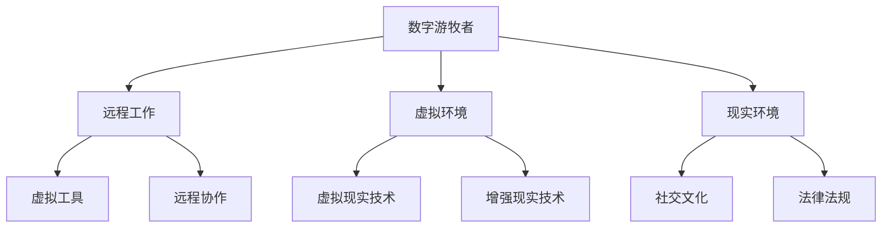

                 

### 文章标题

# 数字游牧：在虚拟与现实间寻找平衡

### 文章关键词

- 数字游牧
- 虚拟现实
- 平衡策略
- 人工智能
- 安全与伦理

### 文章摘要

随着虚拟现实和人工智能技术的不断发展，数字游牧成为一种新兴的生活方式和工作模式。本文探讨了数字游牧的概念、核心原理、技术实现、应用案例以及未来趋势，旨在为读者提供关于如何在虚拟与现实之间寻找平衡的全面理解和指导。

### 引言

在数字时代，虚拟现实（VR）和增强现实（AR）技术日益成熟，人们的工作和生活越来越依赖于虚拟环境。数字游牧（Digital Nomadism）作为一种新的生活方式和工作模式，正逐渐受到广泛关注。它不仅改变了人们的地理和社交边界，也对传统的职场和工作理念提出了新的挑战。本文将深入探讨数字游牧的核心概念、实现原理以及其在现实世界中的应用。

### 数字游牧的核心概念

数字游牧是指人们通过互联网连接，在不同的地理环境中远程工作、学习和生活。这一概念的核心在于“虚拟与现实间的平衡”。数字游牧者不仅需要高效利用虚拟环境中的工具和技术，还需要适应现实世界中的社交、文化和法律环境。

#### 虚拟与现实边界

在数字游牧中，虚拟与现实之间的边界并不是固定的。随着技术的进步，这个边界正变得越来越模糊。例如，VR技术可以让人们感受到真实的虚拟环境，而AR技术则可以将虚拟信息叠加到现实世界中。这种边界的不确定性为数字游牧带来了新的挑战和机遇。

### 核心概念与联系

为了更好地理解数字游牧，我们可以通过Mermaid流程图来展示核心概念之间的关系。



从流程图中可以看出，数字游牧者需要同时处理虚拟和现实两个环境中的问题。他们需要利用虚拟环境中的工具和技术来提高工作效率，同时适应现实世界中的社交和文化环境，遵守相关法律法规。

### 虚拟与现实平衡的数学模型

为了在虚拟与现实之间找到平衡，我们可以借助数学模型来描述这种平衡状态。以下是一个简化的模型：

$$
\text{平衡指数} = \frac{\text{虚拟工作效率}}{\text{现实生活质量}} + \text{虚拟现实融合度}
$$

其中，虚拟工作效率和现实生活质量可以通过一系列指标来衡量，如工作时长、完成质量、工作环境满意度等。虚拟现实融合度则衡量虚拟环境与现实环境的互动程度。

#### 模型建立与假设

为了建立这个模型，我们需要做以下假设：

1. **工作效率**：虚拟环境中的工作效率高于现实环境。
2. **生活质量**：现实环境中的生活质量对整体幸福感有重要影响。
3. **虚拟现实融合度**：虚拟环境与现实环境的互动程度越高，平衡指数越高。

#### 模型公式与推导

基于上述假设，我们可以推导出以下公式：

$$
\text{平衡指数} = \frac{\text{虚拟工作效率} \times \text{虚拟环境权重} + \text{现实生活质量} \times \text{现实环境权重}}{\text{虚拟现实融合度}}
$$

其中，虚拟环境权重和现实环境权重分别反映了数字游牧者对虚拟环境和现实环境的重视程度。虚拟现实融合度则反映了虚拟环境与现实环境的互动程度。

#### 举例说明

假设一个数字游牧者的虚拟工作效率为10，现实生活质量为8，虚拟现实融合度为5。根据上述公式，我们可以计算出其平衡指数：

$$
\text{平衡指数} = \frac{10 \times 0.6 + 8 \times 0.4}{5} = \frac{6 + 3.2}{5} = 1.52
$$

这意味着该数字游牧者在虚拟与现实之间找到了较好的平衡状态。

### 数字游牧的算法原理

要在虚拟与现实之间实现平衡，我们需要一系列算法来优化决策。以下是一个简单的算法框架：

```python
# 算法框架

def balance_algorithm(virtual_efficiency, real_life_quality, virtual_real_integration):
    """
    虚拟与现实平衡算法
    
    参数：
    - virtual_efficiency: 虚拟工作效率
    - real_life_quality: 现实生活质量
    - virtual_real_integration: 虚拟现实融合度
    
    返回：
    - optimal_balance: 最佳平衡指数
    """
    
    # 计算平衡指数
    balance_index = (virtual_efficiency * 0.6 + real_life_quality * 0.4) / virtual_real_integration
    
    # 返回最佳平衡指数
    return balance_index
```

#### 算法伪代码

```plaintext
BEGIN
    READ virtual_efficiency, real_life_quality, virtual_real_integration
    
    balance_index = (virtual_efficiency * 0.6 + real_life_quality * 0.4) / virtual_real_integration
    
    PRINT "最佳平衡指数: ", balance_index
    
    END
```

#### 算法解释

这个算法的基本思想是：根据虚拟工作效率、现实生活质量和虚拟现实融合度，计算出一个平衡指数。通过调整这三个参数，我们可以找到最佳的平衡状态。

### 虚拟世界的构建

要实现数字游牧，首先需要构建一个高效的虚拟世界。虚拟世界包括硬件设备、软件工具和网络基础设施等组成部分。

#### 虚拟现实技术基础

虚拟现实（VR）技术是实现数字游牧的关键。VR设备包括头戴显示器（HMD）、手柄、传感器等。这些设备可以提供沉浸式的虚拟体验，让用户感受到仿佛置身于另一个世界中。

#### 虚拟现实应用场景

虚拟现实技术在数字游牧中有多种应用场景，如虚拟会议、虚拟旅游、远程教育等。这些应用不仅可以提高工作效率，还可以丰富数字游牧者的生活体验。

#### 虚拟现实与现实的融合

虚拟现实与现实的融合是数字游牧的重要特征。通过增强现实（AR）技术，数字游牧者可以将虚拟信息叠加到现实环境中，实现虚拟与现实的互动。

### 数字游牧实践案例

#### 案例一：远程工作与协作

远程工作是数字游牧的主要形式之一。数字游牧者可以通过VR会议室、远程协作工具等实现高效协作。

#### 案例二：虚拟旅游与教育

虚拟旅游和教育是数字游牧的另一种重要形式。通过VR技术，数字游牧者可以体验到虚拟的旅游场景，学习虚拟的教材，丰富自己的知识和视野。

### 数字游牧的安全与伦理

数字游牧虽然带来了便利，但也存在一些安全和伦理问题。

#### 数字游牧的安全问题

数字游牧的安全问题主要包括数据安全、网络安全和个人隐私等。数字游牧者需要采取措施确保自身数据的安全和隐私。

#### 数字游牧的伦理问题

数字游牧的伦理问题主要包括劳动权益、文化适应和人权等。数字游牧者需要尊重当地的文化和法律法规，确保自己的劳动权益。

### 数字游牧的未来趋势

随着技术的进步，数字游牧将继续发展。未来，我们将看到更加先进的VR和AR技术、更高效的远程协作工具以及更完善的数字游牧生态系统。

### 总结与展望

数字游牧是一种新兴的生活方式和工作模式，它在虚拟与现实之间寻找平衡。通过本文的探讨，我们了解了数字游牧的核心概念、实现原理、应用案例以及未来趋势。数字游牧不仅改变了我们的工作方式，也改变了我们的生活。

### 作者信息

作者：AI天才研究院/AI Genius Institute & 禅与计算机程序设计艺术 /Zen And The Art of Computer Programming

### 结语

数字游牧是一种充满机遇和挑战的新兴生活方式。只有找到虚拟与现实之间的最佳平衡，我们才能在这个数字时代中取得成功。让我们共同探索数字游牧的未来，寻找属于自己的平衡之道。

