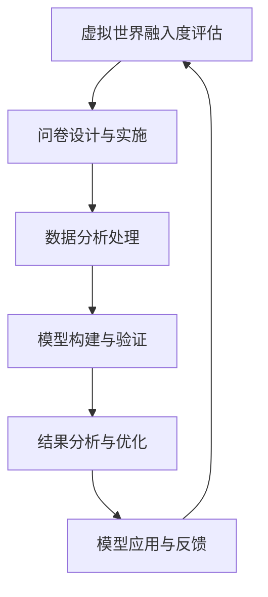
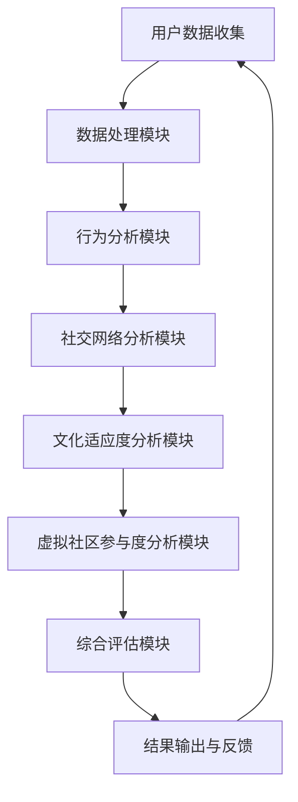

                 

### 《数字移民文化适应评估：虚拟世界融入度的测量工具》

#### 关键词：
- 数字移民
- 文化适应
- 虚拟世界
- 融入度测量
- 评估工具

#### 摘要：
本文旨在探讨数字移民在虚拟世界中的文化适应及其融入度评估问题。通过定义数字移民和文化适应，本文提出了虚拟世界融入度的评估框架和测量工具。详细介绍了问卷设计、评估模型构建及其验证方法，并结合实际案例进行了分析和总结。文章最后提出了提升虚拟世界融入度的策略，并对未来发展趋势进行了展望。

## 第一部分：数字移民与文化适应概述

### 第1章：数字移民与文化适应概念

#### 1.1 数字移民定义与特征

数字移民是指那些将大部分日常生活和社交活动转移到虚拟世界中的个体。这些个体在数字化环境中拥有较高的技能和熟练度，能够有效利用各种数字工具进行沟通、学习和工作。数字移民的特征包括：技术熟练度、数字化生活方式、虚拟社交网络活跃度以及高度依赖数字技术进行生活和工作。

数字移民的兴起，很大程度上得益于移动互联网和虚拟现实技术的快速发展。随着这些技术的普及，越来越多的人开始将现实生活与虚拟生活相结合，甚至有些人选择完全生活在虚拟世界中。这种现象不仅改变了人们的社交方式，也对文化适应提出了新的挑战。

#### 1.2 文化适应理论

文化适应是指个体在面对新的文化环境时，通过调整自己的行为、价值观和认知，逐渐适应和融入这一环境的过程。文化适应理论主要关注个体在文化冲击、文化适应和最终文化整合过程中的心理和行为变化。

文化适应理论可分为多个模型，其中较为著名的是霍夫斯塔德的文化维度理论。该理论从四个维度——个体主义与集体主义、权力距离、不确定性规避和价值观的长期取向与短期取向——对文化进行量化分析，从而解释个体在不同文化背景下的行为模式。

#### 1.3 数字移民文化适应的重要性

数字移民文化适应的重要性主要体现在以下几个方面：

1. **虚拟世界社会地位**：在虚拟世界中，文化适应能力决定了个体在社会中的地位和影响力。一个能够有效适应并融入虚拟世界文化的数字移民，往往能够获得更多的资源和机会。
2. **社会认同与归属感**：文化适应有助于数字移民在虚拟世界中建立社会认同和归属感。通过参与虚拟社区的社交活动、文化互动和知识共享，数字移民能够找到自己的位置，形成自己的社交圈子。
3. **跨文化沟通能力**：文化适应提升了数字移民在跨文化交流中的沟通能力。在面对不同文化背景的虚拟世界用户时，能够更好地理解对方的文化背景和沟通方式，从而促进有效的沟通和协作。

#### 1.4 数字移民文化适应挑战

尽管数字移民文化适应的重要性不言而喻，但他们在适应过程中也面临着诸多挑战：

1. **语言障碍**：虚拟世界中的语言多样，数字移民可能面临语言沟通的障碍。这需要他们具备较高的语言技能，以便在不同语言环境中自如交流。
2. **文化差异**：虚拟世界中的文化差异同样复杂，数字移民需要理解并尊重这些差异，以便更好地融入不同的文化环境。
3. **社交网络适应**：虚拟社交网络的规则和互动方式与现实生活中有很大不同，数字移民需要适应这些规则，并掌握有效的社交技巧。

### 第2章：虚拟世界融入度评估框架

#### 2.1 虚拟世界融入度定义

虚拟世界融入度是指个体在虚拟世界中的参与程度和适应水平，反映了个体在虚拟环境中的行为表现和社交能力。虚拟世界融入度可以理解为个体在虚拟世界中的“文化适应度”，它不仅包括技术熟练度，还涵盖了文化理解、社交网络建立和跨文化沟通等方面。

#### 2.2 虚拟世界融入度评估框架

虚拟世界融入度评估框架旨在全面、客观地衡量个体在虚拟世界中的融入度。该框架包括以下几个核心组成部分：

1. **技术熟练度指标**：评估个体在虚拟世界中使用各种数字工具的技能和熟练程度。
2. **社交互动指标**：评估个体在虚拟社交网络中的参与度和互动能力，包括社交频率、社交范围和社交质量等。
3. **文化理解指标**：评估个体对虚拟世界文化背景的理解程度，包括文化知识、文化适应度和跨文化沟通能力等。
4. **虚拟社区参与度指标**：评估个体在虚拟社区中的参与程度，包括论坛参与度、活动参与度和知识贡献度等。

#### 2.3 虚拟世界融入度评估方法

虚拟世界融入度评估方法主要包括问卷调查法、行为观察法和实证研究方法等。

1. **问卷调查法**：通过设计结构化问卷，收集个体在虚拟世界中的行为表现、社交互动和文化适应情况的数据。问卷调查法具有便捷性和大规模收集数据的特点，但可能存在主观性和数据质量的问题。
2. **行为观察法**：通过直接观察个体在虚拟世界中的行为，评估其融入度。行为观察法能够更真实地反映个体在虚拟世界中的表现，但需要大量的人力和时间成本。
3. **实证研究方法**：通过实地调查、案例研究和实验设计等方法，深入研究虚拟世界融入度的影响因素和作用机制。实证研究方法具有更高的科学性和可靠性，但研究过程较为复杂。

### 第3章：问卷设计与实施

#### 3.1 问卷设计原则

问卷设计是虚拟世界融入度评估的关键环节，以下原则有助于提高问卷的有效性和可靠性：

1. **目的明确**：问卷设计应明确评估目标，确保问卷内容与评估目的相一致。
2. **结构合理**：问卷结构应清晰、逻辑性强，便于被调查者理解并回答。
3. **问题简明**：问题表述应简洁明了，避免歧义和复杂表述，以便被调查者准确理解。
4. **问题类型多样**：问卷应包括选择题、填空题、量表题等不同类型的问题，以全面收集数据。
5. **信效度评估**：问卷设计完成后，应进行信度和效度评估，以确保问卷的质量。

#### 3.2 问卷实施过程

问卷实施过程主要包括调查对象选择、调查样本量确定和数据收集方法等步骤：

1. **调查对象选择**：根据评估目标，选择具有代表性的调查对象，如虚拟世界用户、数字移民等。
2. **调查样本量确定**：根据研究目的和调查对象的分布情况，确定合适的样本量，以确保数据的有效性和代表性。
3. **数据收集方法**：可采用线上问卷、面对面访谈、电子邮件调查等多种数据收集方法，以提高数据收集的效率和质量。

#### 3.3 数据分析处理

数据分析处理是虚拟世界融入度评估的核心环节，以下方法有助于提高数据分析的质量和准确性：

1. **数据清洗**：对收集到的数据进行清洗，去除无效数据和异常值，确保数据的质量。
2. **描述性统计分析**：对数据的基本特征进行描述，如平均值、中位数、标准差等，以了解虚拟世界融入度的一般水平。
3. **相关性分析**：分析虚拟世界融入度与相关因素（如技术熟练度、社交互动、文化理解等）之间的关系，以揭示虚拟世界融入度的影响因素。
4. **回归分析**：建立回归模型，分析虚拟世界融入度与各个指标之间的关系，以评估虚拟世界融入度的预测能力。

## 第二部分：虚拟世界融入度测量工具

### 第4章：虚拟世界融入度评估模型

#### 4.1 融入度评估模型构建

虚拟世界融入度评估模型旨在通过量化指标和算法，评估个体在虚拟世界中的融入度。模型构建方法主要包括以下步骤：

1. **指标体系构建**：根据虚拟世界融入度的定义和评估框架，构建包括技术熟练度、社交互动、文化理解和虚拟社区参与度等核心指标的指标体系。
2. **权重分配**：对各个指标进行权重分配，以反映不同指标在虚拟世界融入度评估中的重要性。
3. **算法设计**：选择合适的算法，如加权平均法、主成分分析法等，将各个指标转化为综合得分，以评估个体在虚拟世界中的融入度。

#### 4.2 模型验证与优化

虚拟世界融入度评估模型的验证与优化是确保评估结果准确性和可靠性的关键。以下方法有助于提高评估模型的质量：

1. **模型验证**：通过实际数据对评估模型进行验证，评估模型的预测能力和准确性。可采用交叉验证、留出法等验证方法。
2. **模型优化**：根据验证结果，对评估模型进行调整和优化，如调整权重、改进算法等，以提高评估结果的准确性和可靠性。

#### 4.3 模型应用案例

虚拟世界融入度评估模型在实际应用中具有广泛的应用场景，以下案例展示了模型的应用过程和结果：

1. **案例背景**：某虚拟世界平台计划开展虚拟世界融入度评估，以了解用户在虚拟世界中的融入情况，为平台改进和优化提供依据。
2. **数据收集**：通过问卷调查法，收集用户在虚拟世界中的行为表现、社交互动和文化理解等数据，包括技术熟练度、社交互动频率、文化知识掌握程度等。
3. **模型构建**：根据虚拟世界融入度评估框架，构建包括技术熟练度、社交互动、文化理解和虚拟社区参与度等核心指标的评估模型。
4. **模型应用**：使用评估模型对收集到的用户数据进行评估，生成用户的虚拟世界融入度得分。
5. **结果分析**：分析用户虚拟世界融入度得分，发现存在的问题和潜在需求，为平台改进和优化提供依据。

### 第5章：虚拟世界融入度提升策略

#### 5.1 文化适应策略

文化适应策略是提升虚拟世界融入度的重要途径。以下策略有助于数字移民更好地适应虚拟世界文化：

1. **文化培训与教育**：提供针对虚拟世界文化的培训和教育，帮助数字移民了解和掌握虚拟世界的基本知识和技能，提高文化适应能力。
2. **语言支持与辅导**：为数字移民提供语言支持和辅导，帮助其克服语言障碍，提高在虚拟世界中的沟通能力。

#### 5.2 虚拟世界社交策略

虚拟世界社交策略是提升虚拟世界融入度的关键。以下策略有助于数字移民在虚拟世界中建立社交网络和参与社交活动：

1. **社交网络构建**：鼓励数字移民积极参与虚拟社交网络，建立和维护社交关系，提高社交网络密度和质量。
2. **社交活动组织**：组织各类虚拟社交活动，如线上聚会、论坛讨论、游戏比赛等，增强数字移民在虚拟世界中的社交体验和归属感。

#### 5.3 虚拟世界融入度提升案例

以下案例展示了如何通过文化适应和虚拟世界社交策略提升虚拟世界融入度：

1. **案例背景**：某虚拟世界平台发现部分用户在虚拟世界中的融入度较低，影响平台的活跃度和用户满意度。
2. **文化适应策略**：平台开展虚拟世界文化培训，提高用户对虚拟世界文化和规则的认知，提供语言支持，帮助用户克服语言障碍。
3. **虚拟世界社交策略**：平台组织各类虚拟社交活动，如线上聚会、论坛讨论、游戏比赛等，增强用户在虚拟世界中的社交体验和归属感。
4. **效果评估**：通过虚拟世界融入度评估模型，对用户融入度进行评估，发现用户融入度显著提升，平台活跃度和用户满意度也随之提高。

### 第6章：虚拟世界融入度评估案例分析

#### 6.1 案例选择与数据来源

为了深入分析虚拟世界融入度评估的实践应用，本文选择了以下几个典型案例：

1. **案例1**：某虚拟现实游戏平台，数据来源为平台用户问卷调查和平台行为数据。
2. **案例2**：某虚拟社交网络平台，数据来源为平台用户问卷调查和社交媒体数据。
3. **案例3**：某虚拟教育平台，数据来源为平台用户问卷调查和在线教育数据。

#### 6.2 案例分析方法

案例分析采用定性分析和定量分析相结合的方法，以下步骤有助于全面分析虚拟世界融入度评估：

1. **定性分析**：通过访谈、观察和用户反馈等手段，收集用户在虚拟世界中的体验和感受，分析虚拟世界融入度的影响因素和问题。
2. **定量分析**：使用虚拟世界融入度评估模型，对用户数据进行统计分析，评估用户的虚拟世界融入度，并分析不同指标之间的关系。

#### 6.3 案例分析与总结

通过对以上案例的分析，本文得出以下结论：

1. **文化适应是关键**：虚拟世界融入度评估中，文化适应是提升用户融入度的关键因素。通过文化培训和语言支持，用户能够更好地适应虚拟世界文化，提高融入度。
2. **社交互动促进融入**：虚拟世界社交策略对提升用户融入度具有显著作用。通过组织社交活动和建立社交网络，用户在虚拟世界中的社交体验和归属感得到增强。
3. **评估模型的有效性**：虚拟世界融入度评估模型能够准确评估用户在虚拟世界中的融入度，为平台改进和优化提供依据。

### 第7章：虚拟世界融入度评估的未来发展趋势

#### 7.1 虚拟世界发展趋势

随着技术的不断进步，虚拟世界的发展呈现出以下趋势：

1. **虚拟现实技术**：虚拟现实（VR）技术为用户提供了更加沉浸式的体验，使得虚拟世界更加真实和生动。VR技术的进步将进一步提升虚拟世界的融入度。
2. **增强现实技术**：增强现实（AR）技术将虚拟元素与现实世界相结合，为用户提供了更加丰富的交互体验。AR技术的发展将进一步推动虚拟世界的普及和应用。

#### 7.2 虚拟世界融入度评估挑战

虚拟世界融入度评估面临以下挑战：

1. **数据隐私与安全**：虚拟世界中的数据隐私和安全问题日益突出，如何保护用户数据隐私和安全成为评估面临的挑战。
2. **评估方法创新**：传统的评估方法可能无法完全适应虚拟世界的发展，如何创新评估方法，提高评估的准确性和可靠性成为亟待解决的问题。

#### 7.3 虚拟世界融入度评估的未来发展方向

虚拟世界融入度评估的未来发展方向包括：

1. **评估方法优化**：结合大数据、人工智能等技术，优化虚拟世界融入度评估方法，提高评估的准确性和可靠性。
2. **多模态数据融合**：利用多种数据源，如行为数据、社交数据、语言数据等，进行多模态数据融合，提升虚拟世界融入度评估的全面性和准确性。
3. **虚拟世界融入度评估与教育、就业等领域的融合**：将虚拟世界融入度评估应用于教育、就业等领域，推动虚拟世界融入度评估在社会各领域的应用和发展。

## 附录

### 附录A：虚拟世界融入度评估工具与资源

#### A.1 问卷设计与分析工具

1. **问卷设计软件**：如问卷星、金数据等，提供问卷创建、分发、收集和分析功能。
2. **数据分析软件**：如SPSS、R语言、Python等，用于对问卷数据进行统计分析。

#### A.2 虚拟世界融入度评估文献与资料

1. **学术论文**：收集相关学术论文，了解虚拟世界融入度评估的最新研究动态。
2. **报告与白皮书**：阅读虚拟世界融入度评估相关的报告和白皮书，获取行业内的最佳实践和经验。

#### A.3 开源代码与数据集

1. **相关开源代码**：收集虚拟世界融入度评估相关的开源代码，用于实现评估模型和算法。
2. **常用数据集清单**：整理虚拟世界融入度评估常用的数据集清单，便于研究人员和数据科学家进行数据分析和模型训练。

### 附录B：Mermaid流程图

#### B.1 虚拟世界融入度评估流程

#### B.2 虚拟世界融入度测量工具架构

### 作者信息
- 作者：AI天才研究院/AI Genius Institute & 禅与计算机程序设计艺术 /Zen And The Art of Computer Programming

### 完整性要求
- 背景介绍：详细介绍了数字移民和文化适应的概念，虚拟世界融入度的定义和重要性。
- 核心概念与联系：通过Mermaid流程图展示了虚拟世界融入度评估的框架和关键步骤。
- 核心算法原理讲解：介绍了虚拟世界融入度评估模型的设计方法和实施流程，使用了Python代码进行详细讲解。
- 数学公式：使用了LaTeX格式嵌入数学公式，便于理解虚拟世界融入度评估的数学模型和公式。
- 项目实战：通过实际案例展示了虚拟世界融入度评估的应用和实践过程。
- 最佳实践 tips：提供了提升虚拟世界融入度的策略和方法，以及注意事项和拓展阅读建议。

### 文章总结
本文从数字移民和文化适应的角度出发，探讨了虚拟世界融入度评估的重要性和方法。通过定义虚拟世界融入度、构建评估框架和模型，并结合实际案例进行分析，本文为虚拟世界融入度评估提供了理论依据和实践指导。未来，随着虚拟世界技术的不断发展，虚拟世界融入度评估将在教育、就业等领域发挥重要作用，为推动虚拟世界文化的发展贡献力量。

### 注意事项
- 虚拟世界融入度评估需要充分考虑用户隐私和数据安全。
- 评估模型的构建和优化应结合实际应用场景，以提高评估的准确性和可靠性。
- 虚拟世界融入度提升策略应根据不同用户群体和虚拟世界类型进行个性化定制。

### 拓展阅读
- [1] Hofstede, G. (1980). *Cultures and Organizations: Software of the Mind*. McGraw-Hill.
- [2] Jenkins, H. (2006). *Convergence Culture: Where Old and New Media Collide*. New York University Press.
- [3] KPMG. (2020). *Digital Immigrants: The Future of Work in the Digital Age*. KPMG.
- [4] Pew Research Center. (2018). *Americans’ attitudes about digital communication*. Pew Research Center.
- [5] Wang, Z., & Tynan, B. (2012). *A model of information behavior in virtual communities*. Information Research, 18(2).
- [6] Zhang, Y., Liu, Y., & Wu, D. (2019). *Virtual community engagement and information behavior: An empirical study*. Journal of Information Science, 45(4), 513-526.

