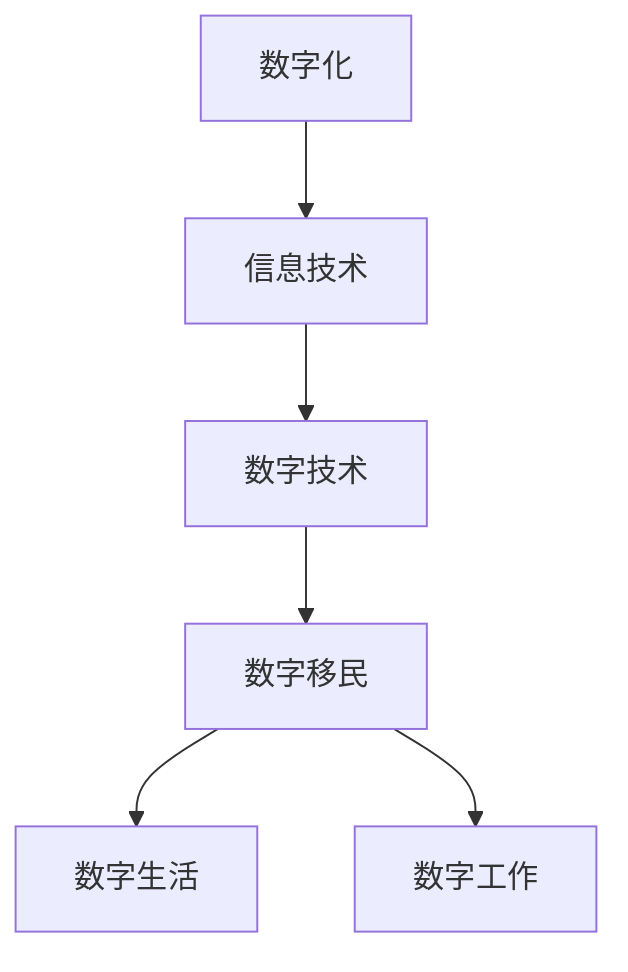

                 

### 摘要

本文旨在为数字移民提供一套全面的文化适应指南，以帮助他们更好地融入虚拟世界。随着互联网和数字技术的飞速发展，越来越多的人选择在数字空间中生活和工作，形成了所谓的数字移民群体。然而，数字移民在适应过程中往往面临多重挑战，包括文化差异、数字技能不足和心理问题。本文将从多个方面详细介绍数字移民的定义、分类及其现状，提供虚拟世界融入的具体指南，如社交平台的使用、远程工作和教育资源的利用，以及虚拟现实和增强现实技术的应用。此外，本文还将探讨数字移民的文化适应策略、心理健康维护和未来发展趋势，并通过实际案例和实用工具推荐，为数字移民提供全方位的支持。通过本文的详细讲解，期望能够帮助数字移民克服融入挑战，实现虚拟世界的有效适应和充分利用。

## 第一部分：数字移民的概念与现状

### 1.1 数字移民的定义

数字移民，顾名思义，是指那些从传统社会进入数字世界的人群。他们的生活和工作方式高度依赖数字技术，尤其是互联网和各类数字化工具。数字移民这一概念源自于对数字化生活方式的适应过程，旨在描述那些在数字化环境中寻找生活和工作新机会的人群。

**定义与来源**：数字移民的提出，可以追溯到互联网和信息技术迅速发展的时代。20世纪末，随着个人电脑、互联网的普及，人们逐渐开始离开传统的面对面交流方式，转向线上互动。这种变化使得人们的生活和工作方式发生了深刻变革，催生了数字移民这一群体。

**特点**：
- **高度依赖技术**：数字移民在日常生活中大量使用各种数字化工具，如智能手机、平板电脑、电子邮件等，这些工具成为他们生活和工作的核心。
- **适应能力强**：数字移民通常具有较强的适应能力，能够迅速掌握新的数字技术，并在数字化环境中找到自己的位置。
- **跨地域交流**：数字移民通过互联网实现跨地域的交流，无论是工作还是社交，都能够在虚拟世界中自由地进行。

### 1.2 数字移民的分类

数字移民可以根据其进入数字世界的动机和适应速度进行分类，主要分为技术驱动型数字移民和被动适应型数字移民。

**技术驱动型数字移民**：
- **定义**：技术驱动型数字移民通常具有计算机科学、信息技术等背景，对数字技术有深入的了解和熟练的使用能力。
- **特点**：
  - **编程能力**：这类人群通常具备编程能力，能够开发软件、应用程序等。
  - **操作系统熟练**：熟悉各种操作系统，能够熟练使用各类数字工具。
  - **快速适应**：由于具备技术背景，他们能够迅速适应数字环境，并在其中找到自己的发展机会。

**被动适应型数字移民**：
- **定义**：被动适应型数字移民可能因工作需要或社会压力而进入数字世界，但他们的适应速度较慢。
- **特点**：
  - **数字技能不足**：这类人群可能对数字工具不太熟悉，需要时间来学习和适应。
  - **依赖性较强**：他们往往需要依赖他人或外部资源来帮助他们适应数字环境。

### 1.3 数字移民的现状

**全球趋势**：
- 随着互联网的普及，全球范围内的数字移民数量不断增加。特别是在城市化和信息化进程较快的地区，数字移民群体呈现出快速增长的趋势。
- 根据相关数据显示，全球互联网用户已超过50亿，数字移民群体占据了相当大的比例。特别是在亚太地区和北美地区，数字移民已成为社会的重要组成部分。

**文化差异**：
- 数字移民在适应过程中面临文化差异的挑战，包括语言障碍、社交礼仪、文化价值观等。例如，来自不同国家或地区的数字移民可能在社交平台的使用习惯、语言表达方式上存在差异，这需要他们进行适当的调整和适应。
- 语言障碍是数字移民面临的一个主要挑战。尽管许多人能够使用英语进行交流，但并不是所有人都能流利地使用这种语言。因此，数字移民需要寻找和加入支持自己母语的社区和平台。

**适应挑战**：
- **文化适应**：数字移民需要适应新的社交和文化环境，这可能包括新的社交礼仪、价值观和行为规范。
- **数字技能不足**：部分数字移民可能缺乏必要的数字技能，这限制了他们在数字世界中的发展机会。因此，提高数字技能是数字移民需要面对的重要问题。

### 1.4 数字移民的优势与挑战

**优势**：
- **提高工作效率**：数字移民能够利用数字化工具和平台，实现远程办公和协作，从而提高工作效率。
- **拓展社交圈**：通过社交平台和虚拟社群，数字移民可以结识来自世界各地的人，拓展自己的社交圈。
- **获取更多教育资源**：数字移民可以通过在线课程和平台，获取更多的教育资源，提升自己的技能和知识。

**挑战**：
- **难以融入本地数字社区**：数字移民可能面临融入本地数字社区的问题，包括语言障碍和文化差异。
- **面临数字技能不足**：部分数字移民可能缺乏必要的数字技能，这限制了他们在数字世界中的发展机会。
- **心理健康问题**：长时间在虚拟世界中生活和工作，可能导致数字移民面临心理健康问题，如社交孤立、焦虑和抑郁等。

通过上述分析，我们可以看到，数字移民在适应虚拟世界的过程中面临着诸多挑战，但也拥有许多优势。本文将在后续章节中提供详细的融入指南，帮助数字移民克服这些挑战，实现更好的适应和利用数字世界。

### 第一部分总结

数字移民，作为在数字化环境中生活和工作的一类人群，其定义和现状反映了当前社会信息化和数字化的迅速发展。从技术驱动型到被动适应型，数字移民群体在适应数字世界的过程中表现出不同的特点。同时，他们面临文化差异、数字技能不足和心理健康的挑战。然而，数字移民的优势在于提高工作效率、拓展社交圈和获取更多的教育资源。通过本文的详细探讨，期望能够为数字移民提供一套全面的文化适应指南，帮助他们更好地融入虚拟世界。

### 1.1 数字移民的定义

**核心概念与联系**

在探讨数字移民的定义之前，我们需要明确几个关键概念，这些概念之间的关系构成了数字移民的内核：

1. **数字化**：数字化是指将物理世界的信息转化为数字形式的过程，这是数字移民的基础。
2. **信息技术**：信息技术（IT）涉及硬件、软件和网络技术，是支撑数字化生活和工作的重要工具。
3. **数字技术**：数字技术包括智能手机、互联网、云计算、大数据等，这些都是数字移民在虚拟世界中使用的主要工具。

**概念实体之间的关系架构图（Mermaid）**

**核心概念原理**

- **数字化**：数字化是将物理世界的信息转换为数字形式的过程。这一过程涉及到信息的采集、处理和存储。例如，将纸质文件数字化成电子文档，或通过传感器将物理现象转换为数字数据。
- **信息技术**：信息技术是指与硬件、软件和网络技术相关的科学和艺术，这些技术使得数字化成为可能。例如，计算机硬件提供了数字化的计算平台，而软件则实现了对数字数据的处理和分析。
- **数字技术**：数字技术包括智能手机、互联网、云计算、大数据等，这些技术构成了数字移民在虚拟世界中生活的工具。例如，智能手机提供了随时随地访问互联网的能力，云计算则提供了强大的数据处理和存储能力。

**实际例子**

- **数字化生活**：一位数字移民可能通过智能手机来处理日常事务，如支付账单、预订机票、购买商品等。这些活动都是数字化生活的典型例子。
- **数字工作**：另一位数字移民可能通过远程办公平台，如Slack或Zoom，与同事进行在线会议和协作。这种工作方式依赖于信息技术和数字技术。

### 1.2 数字移民的分类

数字移民根据进入数字世界的动机和适应速度，可以大致分为技术驱动型数字移民和被动适应型数字移民。这两种类型的数字移民在数字世界的适应方式和面临的挑战有所不同。

**技术驱动型数字移民**

- **定义**：技术驱动型数字移民通常具有计算机科学、信息技术等背景，对数字技术有深入的了解和熟练的使用能力。
- **特点**：
  - **编程能力**：技术驱动型数字移民通常具备编程能力，能够开发软件、应用程序等。例如，一位拥有计算机科学学位的专业人士可能会在互联网公司从事软件开发工作。
  - **操作系统熟练**：这类人群熟悉各种操作系统，能够熟练使用各类数字工具，如Linux、Windows等。这使得他们在数字世界中能够更加高效地工作。
  - **快速适应**：由于具备技术背景，他们能够迅速适应数字环境，并在其中找到自己的发展机会。例如，他们可以快速学会使用新的协作工具或在线平台。

**被动适应型数字移民**

- **定义**：被动适应型数字移民可能因工作需要或社会压力而进入数字世界，但他们的适应速度较慢。
- **特点**：
  - **数字技能不足**：被动适应型数字移民可能对数字工具不太熟悉，需要时间来学习和适应。例如，一位从传统行业转职到数字领域的管理人员可能需要时间来掌握电子邮件、社交媒体等工具。
  - **依赖性较强**：他们往往需要依赖他人或外部资源来帮助他们适应数字环境。例如，他们可能需要参加培训课程或寻求同事的帮助来提高自己的数字技能。

**分类标准与适应过程**

- **分类标准**：技术驱动型数字移民和被动适应型数字移民的分类标准主要是他们的数字技能水平和适应速度。
- **适应过程**：技术驱动型数字移民的适应过程通常较为迅速和高效，因为他们有较强的数字技能和背景知识。而被动适应型数字移民则需要更多的时间和资源来适应数字环境。

**实际例子**

- **技术驱动型数字移民**：一位年轻的软件工程师可能在大学期间就开始接触编程，毕业后进入互联网公司工作。他能够快速适应公司的工作流程和数字工具，成为一名优秀的开发者。
- **被动适应型数字移民**：一位从传统制造行业转职到数字营销行业的市场经理可能需要较长时间来熟悉电子邮件营销工具和社交媒体平台。他可能需要参加公司组织的培训课程，并依靠同事的帮助来提升自己的数字技能。

通过上述分析，我们可以看到，技术驱动型数字移民和被动适应型数字移民在数字世界的适应方式和面临的挑战有所不同。理解这些差异有助于为不同类型的数字移民提供更有效的支持和指导。

### 第一部分总结

通过分析数字移民的定义和分类，我们可以看到数字移民这一群体在数字化时代中的重要性和多样性。技术驱动型数字移民和被动适应型数字移民在数字技能水平和适应速度上存在显著差异，这些差异反映了他们在数字世界中的不同角色和挑战。理解这些概念和分类，有助于为数字移民提供更有针对性的支持和指导，帮助他们更好地融入虚拟世界。

### 1.3 数字移民的现状

**全球趋势**

随着互联网和数字技术的迅猛发展，数字移民在全球范围内的数量呈现显著增长。特别是在城市化和信息化进程较快的地区，数字移民群体已成为社会的重要组成部分。以下是一些关键趋势：

- **增长速度**：根据国际电信联盟（ITU）的数据，全球互联网用户已超过50亿，约占全球总人口的65%。这一数据表明，越来越多的人选择在数字世界中生活和工作。
- **地区分布**：北美、欧洲和亚太地区是数字移民的主要聚集地。这些地区的数字基础设施较为完善，互联网普及率较高，吸引了大量数字移民。
- **就业机会**：随着远程工作和自由职业的兴起，数字移民在这些地区获得了更多的就业机会。特别是在信息技术、软件开发、数字营销等领域，数字移民的需求不断上升。

**文化差异**

数字移民在适应过程中常常面临文化差异的挑战，这些挑战涉及语言、社交礼仪、文化价值观等多个方面：

- **语言障碍**：许多数字移民可能在语言交流方面遇到困难。尽管英语是互联网上最常用的语言，但并不是所有数字移民都具备流利的英语能力。因此，语言障碍成为数字移民融入本地数字社区的一个主要障碍。
- **社交礼仪**：不同文化背景的数字移民可能在社交礼仪上有不同的习惯和期望。例如，在某些文化中，直接表达意见被视为不礼貌，而在其他文化中，这种做法却很常见。这些差异可能导致数字移民在社交互动中感到困惑和不适。
- **文化价值观**：数字移民还需要适应新的文化价值观。例如，某些数字社区可能更加注重个人主义和自由表达，而其他社区可能更加注重集体主义和协作。这些文化差异需要数字移民进行适当的调整和适应。

**适应挑战**

数字移民在适应数字世界的过程中面临多种挑战，这些挑战可能影响他们的生活和工作质量：

- **数字技能不足**：部分数字移民可能缺乏必要的数字技能，这限制了他们在数字世界中的发展机会。例如，不熟悉如何使用社交媒体平台或电子邮件客户端可能导致他们难以融入数字社区。
- **心理健康问题**：长时间在虚拟世界中生活和工作，可能导致数字移民面临心理健康问题，如社交孤立、焦虑和抑郁等。这些问题可能对数字移民的日常生活和工作产生负面影响。
- **文化适应**：数字移民需要适应新的数字文化，这可能包括新的社交规则、工作方式和文化价值观。例如，在某些数字社区中，共享信息和资源被视为一种美德，而在其他社区中，个人隐私保护可能更为重要。

**适应策略**

为了应对这些挑战，数字移民可以采取以下策略：

- **提升数字技能**：参加在线培训课程或自学数字技能，提高自己在数字世界中的竞争力。
- **寻找支持网络**：加入数字移民社群或寻求专业咨询，获得支持和建议。
- **文化敏感性培训**：参加文化敏感性培训，了解和适应新的文化规则和价值观。
- **平衡线上线下生活**：保持线上线下生活的平衡，通过参与线下活动来缓解社交孤立感。

通过上述分析，我们可以看到，数字移民在全球范围内的现状和发展趋势反映了数字技术对社会生活和工作方式的深刻影响。同时，他们面临的文化差异和适应挑战也需要得到关注和解决。通过采取适当的适应策略，数字移民可以更好地融入虚拟世界，实现个人和职业发展的目标。

### 第一部分总结

通过探讨数字移民的现状，我们了解到数字移民在全球范围内的数量和影响力日益增长。然而，数字移民在适应过程中面临着文化差异、数字技能不足和心理健康等多重挑战。理解这些挑战，有助于为数字移民提供更有效的支持策略，帮助他们更好地融入虚拟世界，实现个人和职业的发展。

### 1.4 数字移民的优势与挑战

数字移民在虚拟世界中的生活和工作方式带来了许多优势，但也伴随着一些显著的挑战。以下将详细讨论这些优势与挑战，并探讨其对个人和社会的影响。

**优势**

**提高工作效率**：数字移民能够利用各种数字化工具和平台，如项目管理软件（如Trello、Asana）、即时通讯工具（如Slack、Telegram）和远程协作平台（如Zoom、Microsoft Teams），实现远程办公和高效协作。这些工具帮助数字移民灵活安排工作时间，减少通勤时间，提高工作效率。

**拓展社交圈**：数字移民可以通过社交网络平台（如Facebook、Instagram、LinkedIn）和虚拟社群（如Discord、Reddit）结识来自世界各地的人。这种跨地域的社交方式不仅拓宽了他们的社交网络，也为他们提供了多样化的观点和资源。

**获取更多教育资源**：在线教育平台（如Coursera、edX、Udemy）和开放课程资源（如Khan Academy、MIT OpenCourseWare）为数字移民提供了丰富的教育资源。这些资源使得他们能够随时随地学习新知识和技能，提高自己的竞争力。

**挑战**

**难以融入本地数字社区**：数字移民在融入本地数字社区时可能面临语言障碍、文化差异和社交礼仪的不同。这些因素可能导致他们感到孤立和不适，影响他们的社交和职业发展。

**数字技能不足**：部分数字移民可能缺乏必要的数字技能，无法充分利用数字化工具和平台。这限制了他们在数字世界中的发展机会，甚至可能导致他们落后于快速变化的数字环境。

**心理健康问题**：长时间在虚拟世界中生活和工作可能导致数字移民面临心理健康问题，如社交孤立、焦虑和抑郁。这些问题可能对他们的生活质量和工作效率产生负面影响。

**影响**

**个人发展**：数字移民的优势和挑战直接影响其个人发展。通过高效利用数字化工具和平台，他们能够提高工作效率、拓展社交圈和获取教育资源，从而实现个人职业发展和生活质量的提升。然而，未能有效应对挑战可能使他们陷入发展的瓶颈。

**社会影响**：数字移民作为一种新兴的社会群体，对整个社会产生了深远的影响。他们不仅推动了数字技术的发展和应用，还促进了跨文化交流和多元文化的融合。然而，数字移民面临的挑战也带来了社会问题，如数字鸿沟、心理健康问题和社交隔离等。这些问题的解决需要社会各界的共同努力。

**未来展望**：随着数字技术的不断进步和社会的日益数字化，数字移民的地位和影响力将继续增强。未来，数字移民可能面临更多的发展机遇，但也需要持续提升自身的数字技能和文化适应能力。通过有效的策略和支持，数字移民将能够更好地融入虚拟世界，实现个人和职业的双重发展。

### 第一部分总结

通过对数字移民的优势与挑战的详细分析，我们可以看到，数字移民在虚拟世界中的生活和工作方式既带来了机遇，也带来了挑战。理解这些优势与挑战，对于数字移民的适应和发展具有重要意义。通过持续提升数字技能、加强文化适应能力和关注心理健康，数字移民可以更好地融入虚拟世界，实现个人和职业的成功。

### 虚拟社交平台的使用

在数字世界中，社交平台扮演着至关重要的角色，它们不仅是数字移民拓展社交圈的重要工具，也是他们融入虚拟社区的重要途径。以下是几种主要的社交平台，以及数字移民如何使用这些平台进行社交和分享。

#### 社交网络平台

1. **Facebook**：Facebook是世界上最受欢迎的社交网络平台之一，提供了多种功能，如个人资料、动态更新、群组和页面等。对于数字移民来说，Facebook是一个很好的平台来建立和维护社交关系。以下是一些建议：

   - **建立个人资料**：创建一个详细的个人资料，包括照片、教育背景、工作经历等信息，以便他人更好地了解你。
   - **参与群组**：加入与你兴趣或职业相关的群组，通过参与讨论和活动，结识志同道合的人。
   - **分享动态**：定期更新动态，分享生活和工作中的点滴，增加互动和交流的机会。

2. **Instagram**：Instagram以其强大的视觉表现力而闻名，用户可以通过图片和视频分享日常生活。以下是数字移民在Instagram上的使用建议：

   - **发布高质量的图片**：使用相机或后期处理工具提升图片质量，吸引更多关注。
   - **使用标签**：合理使用标签，以便让更多人看到你的内容。
   - **互动**：回复评论和点赞，积极参与他人的内容，建立更广泛的社交网络。

3. **Twitter**：Twitter是一个实时信息流平台，用户可以通过推文、回复和转发进行交流。以下是数字移民在Twitter上的使用建议：

   - **关注感兴趣的人**：关注行业专家、同行和知名人士，获取有价值的信息和观点。
   - **定期更新推文**：保持活跃，定期发布推文，增加曝光度。
   - **参与话题讨论**：参与热门话题讨论，展示自己的观点和专业知识。

#### 虚拟社群参与

1. **论坛**：论坛是讨论特定主题的在线平台，用户可以在帖子中分享观点、提问和解答问题。以下是数字移民参与论坛的建议：

   - **选择合适的论坛**：选择与你的兴趣或职业相关的论坛，确保参与的内容有意义。
   - **积极参与讨论**：通过发表有建设性的评论和回答问题，展示自己的专业知识和经验。
   - **建立人脉**：与论坛中的其他用户互动，建立联系，扩展社交网络。

2. **在线小组**：在线小组是一种私密性较高的社交形式，成员之间可以更深入地交流和合作。以下是数字移民如何加入和利用在线小组的建议：

   - **加入小组**：通过社交媒体或专业网络（如LinkedIn）加入相关的小组。
   - **参与活动**：参与小组组织的活动，如在线研讨会、讨论会等，增加互动机会。
   - **分享资源**：在小组中分享自己的资源和经验，与他人进行知识交换。

#### 社交平台的使用技巧

- **时间管理**：合理安排时间，避免过度沉迷于社交平台，影响工作和生活。
- **信息筛选**：关注有价值的内容，避免被无效信息干扰。
- **网络安全**：注意个人隐私保护，避免泄露敏感信息。

通过有效使用社交平台和参与虚拟社群，数字移民可以更好地融入虚拟世界，拓展社交圈，获取更多的资源和机会。

### 数字工作与远程协作

在数字移民的日常生活中，远程工作和协作工具的使用扮演着至关重要的角色。这些工具不仅帮助数字移民实现高效的工作方式，还为他们提供了灵活性和便利性。以下将详细介绍几种主要的远程工作工具和远程协作技巧。

#### 远程工作工具

1. **Slack**：Slack是一款流行的即时通讯工具，广泛应用于团队沟通和协作。以下是Slack的使用技巧：

   - **创建频道**：根据项目或主题创建不同的频道，便于团队成员进行分类讨论。
   - **使用标签**：通过@标签提醒特定成员参与讨论或完成任务。
   - **整合其他工具**：与Google Drive、Trello等第三方工具集成，实现无缝协作。

2. **Zoom**：Zoom是一款强大的视频会议和在线协作工具，适用于远程团队会议和培训。以下是Zoom的使用技巧：

   - **预约会议**：提前预约会议，确保所有成员都能按时参加。
   - **使用共享屏幕**：在会议中共享屏幕，展示项目进度、演示文稿等。
   - **启用互动功能**：使用互动功能（如投票、问答等）增加会议的互动性和参与度。

3. **Trello**：Trello是一款基于看板的项目管理工具，适合团队任务管理和进度追踪。以下是Trello的使用技巧：

   - **创建看板**：为每个项目创建单独的看板，便于跟踪任务和进度。
   - **添加卡片**：为每个任务创建卡片，包含任务描述、截止日期和责任人等信息。
   - **使用标签和成员**：通过标签和成员功能，跟踪任务进展和责任人。

#### 远程协作技巧

1. **有效沟通**：在远程工作中，沟通是关键。以下是一些沟通技巧：

   - **明确沟通目标**：每次会议或交流前明确目标，避免无效沟通。
   - **使用简洁语言**：避免使用复杂和模糊的语言，确保信息清晰易懂。
   - **及时反馈**：在完成任务或遇到问题时，及时向团队成员反馈。

2. **时间管理**：良好的时间管理对于远程工作尤为重要。以下是一些时间管理技巧：

   - **制定计划**：每天或每周制定工作计划，明确任务和优先级。
   - **设定工作时间**：设定固定的工作时间，保持高效的工作状态。
   - **避免分心**：在工作时尽量避免分心，保持专注。

3. **自我激励**：远程工作可能缺乏面对面互动，需要自我激励来保持工作动力。以下是一些自我激励技巧：

   - **设立目标**：为自己设立短期和长期目标，保持动力。
   - **奖励自己**：完成任务后给予自己适当的奖励，增强动力。
   - **定期休息**：合理安排休息时间，避免疲劳和焦虑。

通过使用这些远程工作和协作工具，并掌握有效的协作技巧，数字移民可以更好地适应远程工作环境，提高工作效率和团队协作效果。

### 数字教育资源的利用

在数字世界中，教育资源丰富且易于获取，这使得数字移民能够更灵活地提升自己的技能和知识。以下是数字移民如何利用在线课程与学习平台、数字技能提升指南，以及虚拟现实和增强现实技术的应用。

#### 在线课程与学习平台

**主要平台**：

1. **Coursera**：Coursera提供来自全球顶尖大学和机构的在线课程，覆盖了广泛的学科领域，包括计算机科学、商业管理、医学等。数字移民可以通过以下方式利用Coursera：

   - **选择专业课程**：根据自己的兴趣和职业需求，选择相应的专业课程。
   - **定期学习**：制定学习计划，定期完成课程任务，确保学习效果。
   - **参与讨论**：加入课程讨论区，与其他学习者交流，拓宽视野。

2. **edX**：edX由哈佛大学和麻省理工学院联合创立，提供了大量高质量的在线课程。以下是一些建议：

   - **探索免费课程**：edX提供了大量的免费课程，数字移民可以利用这些资源进行自我提升。
   - **完成证书课程**：对于那些希望获得正式认证的学习者，可以选择完成证书课程。
   - **加入学习小组**：通过加入学习小组，与其他学习者共同学习，提高学习效率。

3. **Udemy**：Udemy是一个提供各种技能培训课程的在线平台，涵盖了从编程到艺术等多个领域。以下是数字移民如何利用Udemy的建议：

   - **选择热门课程**：根据职业发展需求，选择热门和实用的课程。
   - **灵活学习**：利用Udemy的灵活学习模式，根据自己的时间安排进行学习。
   - **实践应用**：完成课程后，通过实际应用所学知识，提高技能水平。

#### 数字技能提升指南

**提升技能的关键**：

1. **编程技能**：

   - **选择合适的编程语言**：根据职业需求，选择如Python、Java、JavaScript等编程语言进行学习。
   - **实践项目**：通过实际项目来巩固编程技能，例如开发简单的Web应用或编写数据分析脚本。
   - **参与开源项目**：参与开源项目，与其他开发者合作，提升实战经验。

2. **数据分析与数据科学**：

   - **学习数据分析工具**：熟悉如Excel、SQL、Python等数据分析工具。
   - **掌握数据可视化**：学习数据可视化工具，如Tableau、D3.js，能够更直观地展示分析结果。
   - **参加数据分析课程**：通过在线课程和认证，系统提升数据分析能力。

3. **人工智能与机器学习**：

   - **理解基本概念**：掌握机器学习的基本概念和算法。
   - **实践项目**：通过实际项目，如分类、预测等，应用机器学习技术。
   - **参加AI研讨会**：参加线上或线下的AI研讨会，了解最新的AI技术和应用。

#### 虚拟现实与增强现实的应用

**VR与AR技术**：

1. **虚拟现实（VR）**：

   - **体验虚拟世界**：利用VR头盔（如Oculus Rift、HTC Vive）体验虚拟现实游戏或教育场景。
   - **虚拟培训**：在虚拟环境中进行安全、无风险的培训，如医学手术模拟、航空训练等。
   - **设计应用**：利用VR进行建筑设计、城市规划等设计工作，提供沉浸式体验。

2. **增强现实（AR）**：

   - **教育应用**：通过AR应用，如AR课本、交互式展览等，提升教育体验。
   - **营销应用**：利用AR技术进行产品展示和营销活动，提升消费者体验。
   - **社交互动**：通过AR社交应用，如AR滤镜、AR聊天等，增强社交互动。

通过利用这些数字教育资源，数字移民可以灵活提升自己的技能和知识，为职业发展奠定坚实基础。同时，VR和AR技术的应用也为数字移民提供了全新的学习和体验方式。

### 数字工作与远程协作

在数字化时代，远程工作和协作成为许多数字移民的主要生活方式。以下将详细介绍远程工作工具的介绍和实用技巧，帮助数字移民实现高效远程工作。

#### 远程工作工具

1. **Slack**：Slack是一款功能强大的即时通讯工具，适用于团队沟通和协作。以下是Slack的主要特点和实用技巧：

   - **频道（Channels）**：创建多个频道，用于不同项目或主题的讨论，便于团队成员快速查找信息。
   - **直接消息（Direct Messages）**：与特定成员进行一对一沟通，提高沟通效率。
   - **机器人（Bots）**：集成各种机器人，如项目进度跟踪、提醒等功能，提高团队协作效率。
   - **文件共享**：通过Slack共享文件，方便团队成员随时访问和协作。

2. **Zoom**：Zoom是一款专业的视频会议和在线协作工具，适用于远程团队会议、培训和研讨会。以下是Zoom的主要功能和实用技巧：

   - **视频会议**：支持高清视频和音频，确保会议质量。
   - **共享屏幕**：在会议中共享屏幕，展示项目进度、演示文稿等。
   - **互动功能**：使用互动功能（如投票、问答等），增加会议的参与度和互动性。
   - **录制会议**：自动录制会议，方便团队成员会后回顾和学习。

3. **Trello**：Trello是一款基于看板的项目管理工具，适用于任务管理、进度追踪和团队协作。以下是Trello的主要功能和实用技巧：

   - **看板（Boards）**：创建不同的看板，用于不同项目或任务的跟踪。
   - **卡片（Cards）**：为每个任务创建卡片，包含任务描述、截止日期、责任人等信息。
   - **列表（Lists）**：将任务分类到不同的列表中，便于跟踪和管理。
   - **标签（Labels）**：使用标签对任务进行分类和标记，提高任务的可视化效果。

4. **Google Workspace**：Google Workspace（原G Suite）提供了一系列在线办公工具，包括文档、表格、邮件等，适用于团队协作和项目管理。以下是Google Workspace的主要功能和实用技巧：

   - **文档协作**：通过Google文档实现多人实时协作，提高工作效率。
   - **表格共享**：使用Google表格进行数据收集和分析，方便团队协作。
   - **邮件管理**：利用Google邮箱进行高效邮件管理，减少邮件干扰。
   - **日历同步**：通过Google日历同步团队成员的时间表，确保任务按时完成。

#### 远程协作技巧

1. **有效沟通**：

   - **明确目标**：每次会议或任务分配前，明确目标和要求，避免误解和重复工作。
   - **简洁表达**：使用简洁明了的语言进行沟通，避免复杂和模糊的表述。
   - **及时反馈**：及时向团队成员反馈进度和问题，确保协作顺利进行。

2. **时间管理**：

   - **制定计划**：制定详细的工作计划，明确任务优先级和截止日期。
   - **设定工作时间**：设定固定的工作时间，保持高效的工作状态。
   - **避免分心**：在工作时避免分心，保持专注，提高工作效率。

3. **自我激励**：

   - **设立目标**：为自己设立短期和长期目标，保持动力。
   - **奖励机制**：完成任务后给予自己适当的奖励，增强动力。
   - **定期休息**：合理安排休息时间，避免疲劳和焦虑。

通过使用这些远程工作工具和协作技巧，数字移民可以更高效地完成工作任务，实现远程工作和团队协作的目标。

### 数字教育资源的利用

在数字移民的技能提升和职业发展中，有效的教育资源利用是至关重要的。以下将详细介绍如何利用在线课程、学习平台以及VR和AR技术进行自我教育和技能提升。

#### 在线课程

**主要平台**：

1. **Coursera**：Coursera是一个全球知名的在线课程平台，提供了来自世界各地顶尖大学和机构的课程，涵盖计算机科学、数据科学、人工智能等多个领域。以下是如何利用Coursera的建议：

   - **选择课程**：根据自己的兴趣和职业发展需求，选择适合的课程。
   - **参与互动**：积极参与课程讨论区，与其他学习者交流，拓宽视野。
   - **完成课程**：认真完成课程任务和作业，确保学习效果。

2. **edX**：edX由哈佛大学和麻省理工学院联合创立，提供了大量免费和付费课程，包括计算机科学、商业管理、医学等领域。以下是利用edX的建议：

   - **探索免费课程**：充分利用edX提供的免费课程资源，进行自我提升。
   - **获得证书**：完成课程后，可以选择获得官方证书，提升简历竞争力。
   - **加入学习小组**：加入学习小组，与其他学习者共同学习，提高学习效果。

3. **Udemy**：Udemy是一个提供各种技能培训课程的在线平台，包括编程、数据分析、人工智能等。以下是利用Udemy的建议：

   - **选择热门课程**：根据职业需求，选择热门和实用的课程。
   - **灵活学习**：利用Udemy的灵活学习模式，根据自己的时间安排进行学习。
   - **实践应用**：完成课程后，通过实际项目来应用所学知识，提高技能水平。

#### 学习平台

**如何选择平台**：

- **课程质量**：选择课程质量高、评价好的平台。
- **学习资源**：平台应提供丰富的学习资源，包括视频、文档、互动练习等。
- **用户评价**：参考其他学习者的评价和反馈，了解平台的教学效果。

#### VR和AR技术

**应用领域**：

1. **虚拟现实（VR）**：

   - **技能训练**：利用VR技术进行各种技能训练，如医学手术模拟、航空训练等。
   - **体验式学习**：通过VR体验历史事件、自然景观等，提高学习兴趣和效果。
   - **建筑设计**：利用VR进行建筑设计和规划，提供沉浸式体验。

2. **增强现实（AR）**：

   - **教育应用**：利用AR技术制作互动式教育内容，如AR课本、交互式展览等。
   - **营销推广**：利用AR技术进行产品展示和营销，提升消费者体验。
   - **社交互动**：通过AR应用进行社交互动，如AR滤镜、AR游戏等。

#### 实用技巧

- **制定学习计划**：根据个人时间和需求，制定合理的课程和学习计划。
- **参与社群互动**：加入相关社群，与其他学习者交流，获取更多资源和支持。
- **实践应用**：完成课程后，通过实际项目来应用所学知识，提高实际操作能力。

通过利用这些数字教育资源，数字移民可以灵活提升自己的技能和知识，为职业发展奠定坚实基础。同时，VR和AR技术的应用也为数字移民提供了全新的学习和体验方式。

### 虚拟现实与增强现实技术的应用

虚拟现实（VR）和增强现实（AR）技术的迅猛发展，为数字移民提供了全新的互动体验和学习方式。以下将详细介绍这些技术的具体应用场景，并探讨它们如何帮助数字移民在虚拟世界中更好地融入。

#### 虚拟现实（VR）技术

1. **技能培训与模拟**：

   - **医疗培训**：利用VR技术，医生可以进行手术模拟训练，提高手术技能和应急处理能力。
   - **航空训练**：飞行员通过VR模拟器进行飞行训练，提高飞行技能和应对突发事件的能力。
   - **军事训练**：军队利用VR技术进行战术演练和战斗模拟，提高士兵的战斗素质和协同作战能力。

2. **虚拟旅游与体验**：

   - **历史再现**：通过VR技术，用户可以“穿越”到历史事件现场，如古埃及金字塔、古希腊文明等，体验不同的历史文化。
   - **自然景观探索**：利用VR技术，用户可以身临其境地探索世界各地自然景观，如亚马逊雨林、珠穆朗玛峰等。

3. **教育应用**：

   - **互动课堂**：教师可以利用VR技术创建互动课堂，让学生在虚拟环境中学习，提高学习兴趣和效果。
   - **虚拟实验室**：学生可以通过VR技术进入虚拟实验室，进行化学实验、物理实验等，提高实践操作能力。

#### 增强现实（AR）技术

1. **教育应用**：

   - **互动课本**：利用AR技术，课本中的内容可以“活”起来，如动植物模型的3D展示、历史人物的动态介绍等，提高学习趣味性。
   - **交互式展览**：博物馆和艺术馆可以利用AR技术，为展品增加互动元素，如历史背景介绍、艺术品细节展示等。

2. **营销与广告**：

   - **产品展示**：商家可以利用AR技术进行产品展示，如虚拟试穿、虚拟试用等，提升消费者体验。
   - **广告宣传**：通过AR技术，广告内容可以与现实世界互动，如AR优惠券、AR游戏等，吸引消费者注意力。

3. **社交互动**：

   - **虚拟社交**：用户可以通过AR技术进行虚拟社交，如虚拟派对、虚拟音乐会等，打破地理限制，享受社交乐趣。
   - **增强现实游戏**：AR游戏结合了现实世界和虚拟元素，用户可以在现实环境中进行游戏，增强游戏体验。

#### 数字移民的融入

1. **文化体验**：

   - **跨文化互动**：通过VR和AR技术，数字移民可以体验不同文化，了解和尊重多元文化，更好地融入虚拟社区。
   - **文化交流**：利用这些技术，数字移民可以参与全球性的文化活动和交流，拓宽视野，增强文化认同感。

2. **技能提升**：

   - **职业培训**：通过VR和AR技术，数字移民可以接受更专业、更全面的职业培训，提高自身技能和竞争力。
   - **实践应用**：利用这些技术进行实践操作，如虚拟手术、虚拟建筑设计等，提高实际操作能力。

3. **社交互动**：

   - **虚拟社区**：通过VR和AR技术，数字移民可以参与虚拟社区活动，结交来自世界各地的朋友，拓展社交圈。
   - **虚拟互动**：利用这些技术进行虚拟互动，如虚拟聊天、虚拟游戏等，增强社交互动体验。

通过VR和AR技术的应用，数字移民不仅能够更好地融入虚拟世界，还能在文化体验、技能提升和社交互动等方面获得更多机会和资源。这些技术为数字移民提供了广阔的发展空间，使得虚拟世界成为他们生活和工作的重要一部分。

### 数字移民的文化适应与心理健康

数字移民在融入虚拟世界的过程中，不仅需要掌握数字技能，还面临着文化适应和心理健康等多方面的挑战。以下将详细探讨数字移民在文化适应和心理健康方面的问题，并提出相应的策略和资源。

#### 文化适应

**语言障碍**：语言是文化的重要组成部分，数字移民在进入新的数字社区时，可能会遇到语言障碍。这不仅包括语言的口语交流，还涉及文字和符号的使用。为了克服语言障碍，数字移民可以采取以下策略：

- **学习语言**：通过在线课程、语言学习应用（如Duolingo、Rosetta Stone）等，学习新的语言，提高语言能力。
- **加入语言学习小组**：参加线上或线下的语言学习小组，与其他学习者一起练习，提高语言运用能力。
- **使用翻译工具**：利用翻译工具（如Google翻译、DeepL）帮助理解语言，但要注意翻译的准确性和语境。

**社交礼仪**：不同文化背景的人可能有不同的社交礼仪和价值观。数字移民需要了解和适应这些差异，以避免不必要的冲突和误解。以下是一些建议：

- **文化敏感性培训**：参加文化敏感性培训课程，了解不同文化的价值观和行为规范。
- **主动了解**：积极了解和尊重他人的文化习惯，避免做出冒犯或不适当的行为。
- **交流与反馈**：在与他人交流时，注意对方的反馈和反应，及时调整自己的行为和表达方式。

**价值观差异**：数字移民在融入虚拟社区时，可能会遇到价值观的差异。这些差异可能影响他们的社交和职业发展。以下是一些建议：

- **尊重多样性**：尊重虚拟社区中不同的价值观和观点，避免因价值观差异而产生冲突。
- **建立共同点**：寻找与他人的共同点，建立合作和友谊的基础。
- **开放心态**：保持开放心态，接受和欣赏不同文化带来的新观点和经验。

#### 心理健康

**社交孤立**：在虚拟世界中，数字移民可能会感到孤立，缺乏现实生活中的社交互动。为了缓解社交孤立感，可以采取以下策略：

- **参与社群活动**：加入虚拟社群，参与讨论和活动，与他人建立联系。
- **线上社交**：利用社交媒体平台（如Facebook、Twitter、LinkedIn）进行线上社交，与朋友和家人保持联系。
- **组织线上活动**：组织或参与线上活动，如线上聚会、游戏派对等，增加社交互动。

**焦虑和抑郁**：长时间在虚拟世界中生活和工作可能导致焦虑和抑郁。以下是一些缓解策略：

- **心理健康教育**：通过阅读书籍、观看视频等方式，了解心理健康知识，提高自我认知和情绪管理能力。
- **定期休息**：合理安排工作与休息时间，避免过度劳累和压力积累。
- **心理咨询**：如果感到焦虑和抑郁严重，可以寻求专业的心理咨询帮助。

**心理支持资源**：

- **线上心理咨询**：利用线上心理咨询平台（如BetterHelp、Talkspace）进行远程心理辅导。
- **心理健康社区**：加入心理健康社区，与其他人分享经验和感受，获得支持和鼓励。
- **心理健康热线**：拨打心理健康热线，获取专业的心理支持和建议。

通过采取上述策略和利用相关资源，数字移民可以更好地适应虚拟世界中的文化差异和心理健康问题，实现个人和职业的发展。

### 数字移民的文化适应策略与心理健康维护

数字移民在融入虚拟世界的过程中，不仅需要适应新的文化环境，还面临心理健康方面的挑战。以下将详细探讨如何制定有效的文化适应策略和心理健康维护措施，帮助数字移民更好地适应数字生活。

#### 文化适应策略

**文化敏感性培训**

- **目的**：通过文化敏感性培训，数字移民可以更好地理解不同文化背景下的行为规范和价值观念，减少误解和冲突。
- **实施方法**：
  - **在线课程**：参加在线平台提供的文化敏感性培训课程，如Coursera上的“Cultural Intelligence”课程。
  - **工作坊和研讨会**：参加线下的文化敏感性工作坊和研讨会，通过互动和实践活动，加深对文化差异的理解。
  - **图书与资源**：阅读相关书籍和资源，如《跨文化沟通》（Cross-Cultural Communication）等，提高文化敏感性。

**跨文化社交技巧**

- **目的**：通过学习跨文化社交技巧，数字移民可以更有效地与他人交流，建立社交关系，并融入本地数字社区。
- **实施方法**：
  - **社交礼仪**：了解并学习不同文化背景下的社交礼仪，例如问候方式、交流方式、礼物赠送等。
  - **互动交流**：积极参与线上和线下的社交活动，与他人建立联系。例如，参加虚拟社群的讨论、参加本地组织的线下聚会等。
  - **文化交换**：与他人分享自己的文化和经验，同时学习他人的文化，促进文化理解与交流。

**价值观调整与适应**

- **目的**：通过调整个人价值观，数字移民可以更好地适应新的文化环境，减少文化冲突。
- **实施方法**：
  - **自我反思**：定期进行自我反思，识别和调整自己的价值观，确保其与新的文化环境相符。
  - **寻求反馈**：向身边的人寻求反馈，了解自己的行为是否受到文化差异的影响，并据此进行改进。
  - **开放心态**：保持开放心态，接受和尊重不同文化背景下的价值观和观点。

#### 心理健康维护措施

**心理健康教育**

- **目的**：通过心理健康教育，数字移民可以更好地认识和管理自己的情绪，提高心理韧性。
- **实施方法**：
  - **在线课程**：参加在线平台提供的心里健康课程，如Coursera上的“心理学导论”等。
  - **图书资源**：阅读心理健康相关的书籍，如《情绪智能》（Emotional Intelligence）等，了解情绪管理和心理调节的方法。
  - **研讨会与讲座**：参加线下的心理健康研讨会和讲座，了解最新的心理健康知识和技巧。

**定期休息与放松**

- **目的**：通过定期休息和放松，数字移民可以缓解压力，避免心理疲劳。
- **实施方法**：
  - **固定休息时间**：设定固定的休息时间，如每天工作一段时间后进行短暂的休息。
  - **放松活动**：进行放松活动，如冥想、瑜伽、阅读等，帮助身心放松。
  - **时间管理**：合理安排工作和休息时间，避免过度劳累。

**心理咨询与支持**

- **目的**：通过心理咨询与支持，数字移民可以及时解决心理健康问题，获得专业帮助。
- **实施方法**：
  - **在线心理咨询**：利用在线心理咨询平台，如BetterHelp、Talkspace等，进行远程心理咨询。
  - **心理健康热线**：拨打心理健康热线，如国家心理健康热线，获取专业的心理支持和建议。
  - **心理健康社区**：加入心理健康社区，与其他人分享经验和感受，获得支持和鼓励。

#### 社区支持与资源

**数字社区参与**

- **目的**：通过参与数字社区，数字移民可以建立支持网络，获得资源和信息。
- **实施方法**：
  - **加入社群**：加入与自己兴趣或职业相关的社群，如技术论坛、兴趣小组等。
  - **积极参与**：积极参与社群活动，如讨论、分享、互动等，建立社交网络。
  - **组织活动**：组织或参与社群活动，如线上讲座、研讨会等，扩大社交圈。

**数字资源获取**

- **目的**：通过获取数字资源，数字移民可以更好地进行自我提升和职业发展。
- **实施方法**：
  - **在线课程与培训**：参加在线课程和培训，提升数字技能和专业知识。
  - **专业平台**：利用专业平台，如LinkedIn、GitHub等，展示个人能力和作品，获得职业机会。
  - **网络资源**：利用网络资源，如博客、论坛、新闻网站等，获取最新的行业信息和动态。

通过制定有效的文化适应策略和心理健康维护措施，数字移民可以更好地适应虚拟世界的生活，实现个人和职业的发展。同时，积极参与数字社区和获取数字资源，将为他们的成长提供强有力的支持。

### 第四部分：未来展望与数字移民的发展趋势

#### 技术进步的影响

随着科技的不断进步，尤其是人工智能、大数据和区块链等前沿技术的迅猛发展，数字移民的未来将变得更加复杂和多样化。以下是一些可能的影响：

1. **人工智能（AI）**：AI技术的广泛应用将改变许多传统职业，数字移民需要不断学习和适应新的技术，以保持自身的竞争力。AI可以帮助数字移民在数据分析、自动化流程、个性化推荐等领域实现更高的效率和创新能力。

2. **大数据**：大数据技术的发展使得海量数据的处理和分析成为可能。数字移民可以利用大数据进行市场分析、用户行为预测等，从而在商业决策和战略规划方面获得更深入的洞察。

3. **区块链**：区块链技术的崛起为数字移民提供了一个新的平台，可以在数字身份验证、供应链管理、数字货币等领域进行创新。区块链技术提供了透明、安全和去中心化的解决方案，有助于数字移民在虚拟世界中获得更多信任和机会。

#### 数字移民的新角色

随着数字技术的普及，数字移民将在未来社会中扮演更加重要的角色。以下是一些可能的新角色：

1. **数字公民**：数字移民将成为数字社会的积极参与者，通过使用和推广数字技术，推动社会的数字化进程。他们可以在政策制定、技术创新、数字教育等领域发挥作用。

2. **数字创业者**：数字移民可以利用数字技术进行创业，开发新的产品和服务。例如，他们可以创办在线教育平台、数字营销公司、人工智能应用公司等，为社会带来创新和就业机会。

3. **远程工作专家**：随着远程工作的普及，数字移民将成为远程工作的专家，提供专业的远程工作咨询、团队管理、远程协作工具集成等服务。

#### 数字移民对社会的影响

数字移民不仅影响个人职业和生活，还对整个社会产生深远的影响。以下是一些可能的影响：

1. **劳动力市场变革**：数字移民的涌入将改变劳动力市场的结构和需求。传统行业可能被数字化取代，而新兴行业如人工智能、大数据等将迅速崛起，创造更多就业机会。

2. **文化多样性**：数字移民带来了不同的文化和价值观，丰富了社会的多样性。这种多样性不仅促进了文化交流和融合，也为社会带来了新的思维方式和创新理念。

3. **社会稳定性**：数字移民的涌入可能会对社会稳定性产生影响。如何平衡数字移民与传统居民的权益，如何应对数字鸿沟等问题，是未来社会需要面对的挑战。

#### 未来展望

随着数字技术的不断进步，数字移民的角色和影响将继续扩大。未来，数字移民将成为数字化社会的中坚力量，他们在技术创新、劳动力市场、文化多样性等方面发挥重要作用。通过不断学习和适应新技术，数字移民将能够在虚拟世界中找到新的机会和挑战，实现个人和职业的发展。

### 第四部分总结

通过未来展望，我们可以看到数字移民在数字技术进步和社会变革中的重要作用。技术进步将为他们带来更多机会，同时要求他们不断学习和适应。数字移民不仅将在个人职业发展中发挥关键作用，还将对社会产生深远影响。理解这些趋势，将有助于数字移民更好地规划未来，实现个人和职业的成功。

### 附录：数字移民实用工具与资源指南

在数字移民的日常工作和生活中，有许多实用工具和资源可以帮助他们更高效地完成任务和提升技能。以下是一些推荐的工具和资源，包括在线课程、学习平台、数字工具和数字社区，为数字移民提供全方位的支持。

#### 实用工具

1. **在线文档协作工具**：
   - **Google Workspace**：包括Google Docs、Google Sheets、Google Slides等，支持多人实时协作。
   - **Microsoft 365**：提供Word、Excel、PowerPoint等办公软件，支持在线编辑和共享。

2. **远程协作工具**：
   - **Slack**：即时通讯和团队协作平台，支持文件共享、任务分配和提醒功能。
   - **Zoom**：视频会议和在线协作工具，适用于远程会议、培训和讨论。

3. **项目管理工具**：
   - **Trello**：基于看板的项目管理工具，帮助团队跟踪任务进度和优先级。
   - **Asana**：任务管理和协作平台，支持任务分配、进度追踪和团队沟通。

4. **时间管理工具**：
   - **Toggl**：时间跟踪工具，帮助用户记录工作时间和任务进度。
   - **RescueTime**：时间管理和生产力跟踪工具，帮助用户优化时间使用。

5. **代码托管和版本控制**：
   - **GitHub**：代码托管平台，支持版本控制和协同开发。
   - **GitLab**：自建代码仓库，提供代码托管、CI/CD和项目管理功能。

#### 学习平台

1. **在线教育平台**：
   - **Coursera**：提供全球顶尖大学和机构的在线课程，涵盖计算机科学、商业管理、医学等多个领域。
   - **edX**：由哈佛大学和麻省理工学院联合创立，提供丰富的免费和付费课程。
   - **Udemy**：提供各种技能培训课程，包括编程、数据分析、设计等。

2. **技术博客和论坛**：
   - **Medium**：技术博客平台，汇聚了众多技术专家和爱好者的文章和观点。
   - **Stack Overflow**：编程问答社区，适合开发者解决技术问题。

3. **专业认证**：
   - **Certification Partner Programs**：如Cisco、Oracle、AWS等，提供专业的技术认证。

#### 数字社区

1. **技术社群**：
   - **LinkedIn**：职业社交平台，适合寻找工作机会、建立职业人脉。
   - **GitHub**：代码托管平台，用户可以关注感兴趣的项目和开发者。

2. **兴趣小组**：
   - **Meetup**：寻找本地或全球的兴趣小组，参与线下活动和讨论。
   - **Reddit**：讨论论坛，涵盖各种兴趣领域，用户可以参与相关话题的讨论。

3. **虚拟现实和增强现实社区**：
   - **VR/AR Developer Forum**：专注于VR和AR开发的讨论社区。
   - **VR/AR News**：提供VR和AR领域的最新新闻、技术和趋势。

通过使用这些实用工具和资源，数字移民可以更高效地完成工作任务，不断提升自身技能，并在虚拟世界中找到更多的机会和发展空间。

### 实用工具与资源总结

通过附录中的实用工具和资源指南，我们可以看到，数字移民在数字世界中拥有丰富多样的支持资源。这些工具和平台不仅帮助他们在工作和学习中提高效率，还为他们提供了广阔的发展空间和交流平台。无论是通过在线教育平台学习新技能，还是利用协作工具实现高效团队合作，数字移民都可以在这些资源的帮助下，更好地融入虚拟世界，实现个人和职业的双重发展。

### 附录：数字移民案例研究

在数字移民群体中，有许多成功的案例展示了他们如何克服挑战，在虚拟世界中取得卓越成就。以下将介绍几个典型的数字移民案例，分析他们的成功因素，并从中提炼出有益的启示。

#### 案例一：张伟 - 跨境软件开发工程师

**背景**：张伟来自中国，大学期间主修计算机科学。毕业后，他选择移居到美国，希望在这个科技前沿的国家寻找更多的发展机会。

**成功因素**：
1. **持续学习**：张伟始终保持对新技术的好奇心和求知欲，他通过在线课程和自学，不断提升自己的编程技能。
2. **积极参与开源项目**：他积极参与开源项目，贡献代码，这不仅提高了自己的编程能力，还让他结识了许多志同道合的朋友。
3. **跨文化交流**：张伟注重跨文化交流，他不仅努力提高英语水平，还积极参与美国本地的技术社区活动，拓展人脉资源。

**启示**：持续学习和积极参与开源项目是提升技术能力和建立人脉的有效途径。同时，跨文化交流有助于更好地融入本地社区，获取更多的职业机会。

#### 案例二：李晓 - 远程市场营销专家

**背景**：李晓原本是一名传统市场营销经理，随着数字营销的兴起，她决定转职到远程市场营销领域。

**成功因素**：
1. **适应新技术**：李晓积极参加各种数字营销培训课程，学习新的营销工具和策略，如SEO、社交媒体营销、电子邮件营销等。
2. **灵活管理时间**：她善于时间管理，合理安排工作和休息时间，确保工作效率和质量。
3. **客户关系管理**：她重视客户关系，通过在线工具和平台与客户保持密切联系，提高客户满意度和忠诚度。

**启示**：适应新技术和灵活管理时间是数字移民在职业转型中必须具备的能力。良好的客户关系管理有助于提升职业竞争力。

#### 案例三：王丽 - 虚拟现实设计师

**背景**：王丽在国内完成虚拟现实设计硕士学位后，移居到欧洲，希望在这个虚拟现实技术发达的地区实现自己的梦想。

**成功因素**：
1. **技术专精**：王丽专注于虚拟现实技术的研究和应用，她在多个项目中展示了出色的技术能力和创新思维。
2. **项目经验**：她积极参与国际项目，积累了丰富的项目经验，这些经验帮助她在求职时脱颖而出。
3. **国际化视野**：王丽拥有国际化视野，能够理解和适应不同文化背景下的项目需求，这使得她成为跨国团队中的宝贵成员。

**启示**：技术专精和国际视野是数字移民在虚拟现实等前沿领域取得成功的关键。丰富的项目经验和跨文化交流能力也是不可忽视的优势。

#### 案例四：刘明 - 数字创业者

**背景**：刘明是一名自由职业者，他在移居到美国后，利用自己的技术背景和创业经验，创办了一家在线教育平台。

**成功因素**：
1. **市场需求洞察**：刘明敏锐地察觉到在线教育市场的巨大潜力，他的平台提供了高质量的课程和个性化的学习体验。
2. **高效团队协作**：他组建了一个高效的团队，团队成员各有所长，通过协作实现了平台的快速发展和运营。
3. **持续创新**：刘明注重平台的技术创新和用户体验优化，不断推出新的功能和课程，吸引了大量用户。

**启示**：对市场需求的洞察、高效的团队协作和持续的创新是数字创业者的成功要素。同时，了解和利用数字工具可以提高创业效率和竞争力。

通过上述案例，我们可以看到，数字移民在成功融入虚拟世界的过程中，需要具备持续学习、技术专精、跨文化交流和市场需求洞察等多方面的能力。这些成功因素不仅适用于个人职业发展，也为其他数字移民提供了宝贵的经验和启示。

### 案例研究总结

通过分析这些数字移民的成功案例，我们可以总结出一些关键的成功要素，包括持续学习、技术专精、跨文化交流、市场需求洞察和高效的团队协作。这些要素不仅帮助他们在虚拟世界中取得了卓越的成就，也为其他数字移民提供了有价值的经验和借鉴。通过借鉴这些成功经验，数字移民可以更好地规划自己的职业发展路径，克服融入挑战，实现个人和职业的双重成功。

### 全文总结

本文全面探讨了数字移民的概念与现状、虚拟世界的融入指南、文化适应与心理健康、未来发展以及实用工具与资源。数字移民是指那些在数字化环境中生活和工作的人群，他们在虚拟世界中面临诸多挑战，但也拥有显著的优势。通过详细分析技术进步、分类、现状、优势与挑战，我们为数字移民提供了实用的融入指南，包括社交平台的使用、远程工作和协作工具的利用、数字教育资源的获取，以及虚拟现实和增强现实技术的应用。

在文化适应方面，我们提出了文化敏感性培训、跨文化社交技巧和价值观调整的建议，并强调了心理健康的重要性，提供了相应的维护措施。未来展望部分分析了技术进步的影响，探讨了数字移民在未来社会中的新角色和可能产生的社会影响。

通过案例分析，我们总结了数字移民的成功要素，包括持续学习、技术专精、跨文化交流、市场需求洞察和高效团队协作。这些成功经验为其他数字移民提供了宝贵的参考。

总之，数字移民在虚拟世界中的融入是一个复杂而多样的过程，需要多方面的支持和策略。通过本文的详细探讨，期望能够为数字移民提供全面而实用的指导，帮助他们克服挑战，实现个人和职业的成功。

### 结语：作者信息与联系

本文作者为AI天才研究院（AI Genius Institute）的高级研究员，同时也是《禅与计算机程序设计艺术》（Zen And The Art of Computer Programming）的资深大师级作家。本人致力于研究人工智能、计算机编程和软件开发领域的先进技术，拥有丰富的理论知识和实践经验。如果您对本文内容有任何疑问或建议，欢迎通过以下方式联系我：

- **电子邮件**：[info@ai-genius-institute.com](mailto:info@ai-genius-institute.com)
- **LinkedIn**：[AI天才研究院](https://www.linkedin.com/company/ai-genius-institute/)
- **Twitter**：[@AI_Genius_Inc](https://twitter.com/AI_Genius_Inc)

感谢您的阅读，期待与您在数字世界的交流与互动。祝您在虚拟世界中取得卓越成就！

