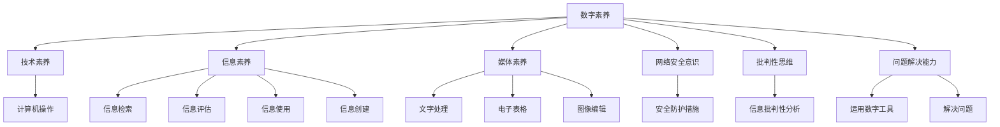

                 


### 《数字素养家庭教育：培养下一代网络公民》

#### 关键词：
数字素养、家庭教育、网络安全、信息素养、批判性思维、教育模型

#### 摘要：
本文深入探讨了数字素养家庭教育的概念、重要性及其核心要素。通过阐述数字素养的基本概念和与其他素养的关系，本文提出了数字素养评估和培养的数学模型。随后，结合实际案例，本文展示了如何通过家庭教育和项目实战来培养孩子的数字素养。文章最后对数字素养家庭教育的未来趋势进行了展望。

---

## 第1章：数字素养家庭教育概述

### 1.1 数字素养家庭教育的定义和重要性

#### 1.1.1 数字素养家庭教育的定义

数字素养家庭教育是指将数字素养的培养融入到家庭教育的各个环节中，使家长和孩子共同提高数字素养。数字素养不仅包括技术技能，还涵盖信息处理、网络安全、批判性思维和问题解决能力等多个方面。

#### 1.1.2 数字素养家庭教育的重要性

在当今数字化时代，数字素养已经成为个人生存和发展的基本能力。以下是从技术、经济和社会三个角度分析数字素养家庭教育的重要性：

- **技术角度**：数字素养是孩子在未来的职场中必备的技能。具备较高数字素养的孩子能够更好地适应信息化环境，提高学习效率和创造力。
- **经济角度**：数字素养是推动经济发展的重要动力。家庭教育的数字化能够培养出具备创新能力和解决问题能力的下一代，从而推动社会进步。
- **社会角度**：数字素养能够提高公民的参与度和责任感。具备数字素养的公民能够更好地利用网络资源，维护网络安全，参与社会事务。

### 1.2 数字素养家庭教育的核心要素

#### 1.2.1 家长的角色

家长是孩子数字素养培养的第一责任人。家长的态度和行为直接影响孩子的数字素养水平。以下是从几个方面分析家长在孩子数字素养培养中的作用：

- **引导作用**：家长应主动引导孩子接触和了解数字世界，培养他们的数字兴趣。
- **榜样作用**：家长自己应具备较高的数字素养，成为孩子的榜样。
- **沟通作用**：家长应与孩子保持良好的沟通，了解他们的数字体验和困惑。

#### 1.2.2 家庭环境

家庭环境是孩子数字素养培养的重要基础。一个良好的家庭环境应具备以下特点：

- **网络设施**：家庭应提供良好的网络设施，确保孩子能够便捷地接触数字资源。
- **信息资源**：家庭应丰富数字信息资源，如电子书、教育软件、在线课程等，以供孩子学习和参考。
- **教育氛围**：家庭应营造积极向上的数字教育氛围，鼓励孩子探索数字世界的奥秘。

#### 1.2.3 教育内容和方法

数字素养家庭教育的内容和方法应结合孩子的年龄、兴趣和实际需求。以下是一些具体建议：

- **课程设置**：根据孩子的年龄和发展阶段，设计合适的数字素养课程，如编程入门、网络安全知识等。
- **教学资源**：利用在线教育平台、教育资源网站等，提供丰富的教学资源。
- **教学方法**：采用互动式、体验式教学，激发孩子的学习兴趣和创造力。

---

在接下来的章节中，我们将进一步探讨数字素养的核心概念、数学模型以及家庭教育项目实战等内容。通过这些内容，希望能够帮助家长和教育工作者更好地理解和实施数字素养家庭教育，培养出具备数字素养的下一代网络公民。

### 第2章：数字素养的核心概念与联系

#### 2.1 数字素养的基本概念

数字素养是一个多维度的概念，它不仅涉及技术层面的技能，还包括信息处理、网络安全、批判性思维和问题解决能力等多个方面。理解数字素养的基本概念是进行数字素养教育的基础。

#### 2.1.1 数字素养的定义

数字素养是指个体在数字环境中有效地使用数字技术、工具和服务的能力，包括以下几个方面：

- **技术技能**：包括基本的计算机操作、编程能力、网络应用等。
- **信息素养**：包括信息检索、评估、使用和创建的能力。
- **网络安全意识**：包括对网络威胁的认识、安全防护措施的掌握。
- **批判性思维**：包括对信息的批判性分析和判断能力。
- **问题解决能力**：包括运用数字工具和资源解决问题的能力。

#### 2.1.2 数字素养的构成要素

数字素养的构成要素可以进一步细分为以下几个部分：

- **技术素养**：掌握基本的计算机操作技能，如操作系统、文字处理、电子表格等。
- **信息素养**：包括如何高效地查找、评估、使用和创建信息，尤其是在互联网环境中。
- **媒体素养**：了解不同类型的媒体（如文字、图片、音频、视频）及其传播特点，能够批判性地分析和评估媒体内容。
- **网络安全素养**：包括对网络安全威胁的认识、安全防护措施的使用，如设置强密码、使用防病毒软件等。
- **批判性思维和问题解决能力**：能够对信息进行批判性分析，识别信息中的偏见和误导，并运用数字工具和资源解决问题。

#### 2.1.3 数字素养与其他素养的关系

数字素养与其他素养之间存在着密切的联系和相互促进的关系：

- **与技术素养的关系**：技术素养是数字素养的基础，只有掌握了一定的技术技能，才能有效地应用数字工具和服务。
- **与信息素养的关系**：信息素养是数字素养的核心，数字素养在很大程度上取决于个体对信息的处理能力。
- **与媒体素养的关系**：媒体素养是数字素养的重要组成部分，它帮助个体理解不同类型的媒体，批判性地分析媒体内容。
- **与批判性思维的关系**：批判性思维是数字素养的重要组成部分，它帮助个体对信息进行批判性分析，避免被误导。
- **与问题解决能力的关系**：问题解决能力是数字素养的应用，它使个体能够运用数字工具和资源解决实际问题。

为了更好地理解数字素养的核心概念和与其他素养的关系，我们可以通过Mermaid流程图来展示这些概念实体之间的关系架构。



通过这个流程图，我们可以清晰地看到数字素养的各个构成要素以及它们之间的相互关系。这种关系架构有助于我们更好地理解数字素养的复杂性和多维度性，从而更有针对性地进行数字素养教育。

---

在理解数字素养的核心概念和与其他素养的关系后，我们将进一步探讨如何通过数学模型来评估和培养数字素养。这些数学模型将为数字素养教育提供量化的方法和工具，帮助家长和教育工作者更科学、有效地实施数字素养教育。

### 第3章：数字素养的数学模型和公式

#### 3.1 数字素养的评估模型

评估数字素养是了解孩子数字素养水平的重要手段。通过评估，我们可以发现孩子在数字技能、信息处理、网络安全等方面的优势与不足，从而制定相应的教育策略。

#### 3.1.1 数字素养评估方法

数字素养评估方法主要包括以下几种：

- **问卷调查**：通过设计问卷，了解孩子在数字技能、信息素养、网络安全等方面的认知水平和实践能力。
- **实践操作**：通过让孩子完成一些实际操作任务，如编程、信息检索、网络安全防护等，来评估他们的实际操作能力。
- **考试评估**：通过定期考试，评估孩子对数字知识点的掌握程度。

#### 3.1.2 数字素养评估指标体系

为了全面评估数字素养，我们需要建立一套科学的评估指标体系。以下是一个可能的数字素养评估指标体系：

- **技术素养**：包括计算机操作技能、编程能力、网络应用等。
- **信息素养**：包括信息检索、信息评估、信息使用、信息创建等。
- **媒体素养**：包括对文字、图片、音频、视频等媒体类型的理解、分析和评估能力。
- **网络安全素养**：包括对网络安全威胁的认识、安全防护措施的掌握。
- **批判性思维**：包括对信息的批判性分析和判断能力。
- **问题解决能力**：包括运用数字工具和资源解决问题的能力。

每个指标都可以进一步细化为更具体的评估指标，如计算机操作技能可以分为文件管理、文本编辑、图像处理等。

#### 3.2 数字素养的培养模型

培养数字素养需要系统的规划和方法。以下是一个可能的数字素养培养模型：

- **阶段划分**：根据孩子的年龄和发展阶段，将数字素养培养划分为不同的阶段。如小学阶段以基础技能培养为主，中学阶段以高级技能和批判性思维培养为主。
- **课程设置**：根据不同阶段的培养目标，设计相应的数字素养课程。课程可以包括编程入门、网络安全知识、信息检索与评估等。
- **教学资源**：利用丰富的教学资源，如在线课程、教育软件、教材等，为学生提供全面的数字素养教育。
- **教学策略**：采用互动式、体验式教学，激发学生的学习兴趣和创造力。如通过编程游戏、网络安全挑战等方式，让学生在实践中学习和掌握数字技能。

#### 3.3 数字素养培养策略

为了有效地培养数字素养，我们可以采用以下策略：

- **家长参与**：家长应积极参与数字素养教育，与孩子共同学习和成长。家长可以通过与孩子一起阅读数字素养书籍、参与在线课程等方式，提高孩子的数字素养。
- **学校教育**：学校应将数字素养教育纳入课程体系，提供系统的数字素养培训。学校可以开设编程、网络安全、信息检索等课程，培养学生的数字技能和批判性思维。
- **社区支持**：社区可以提供数字素养教育资源，如开设数字素养讲座、提供在线课程等。社区还可以组织数字素养竞赛，激发学生的兴趣和创造力。

通过数学模型和公式，我们可以量化评估和培养孩子的数字素养。这不仅有助于家长和教育工作者了解孩子的数字素养水平，还可以为制定教育策略提供科学依据。在接下来的章节中，我们将结合实际案例，进一步探讨如何通过数字素养家庭教育来培养孩子的数字素养。

---

### 第4章：数字素养家庭教育的数学模型讲解

#### 4.1 数学模型在数字素养教育中的应用

数学模型在数字素养教育中的应用具有重要意义。通过数学模型，我们可以更科学、系统地评估和培养孩子的数字素养。以下将介绍几种常用的数学模型及其在数字素养教育中的应用。

#### 4.1.1 评估模型

评估模型主要用于评估孩子的数字素养水平。以下是一个简单的评估模型：

- **评估指标**：包括技术素养、信息素养、媒体素养、网络安全素养、批判性思维和问题解决能力。
- **评估方法**：采用问卷调查和实践操作相结合的方法。问卷调查可以通过设计针对不同评估指标的问卷来收集数据，实践操作则通过让孩子完成实际任务来评估他们的能力。
- **评估公式**：

  $$\text{数字素养得分} = \frac{\sum (\text{各指标得分})}{\text{指标总数}}$$

  其中，各指标得分可以根据问卷调查和实践操作的结果进行量化。

#### 4.1.2 培养模型

培养模型主要用于指导孩子的数字素养培养过程。以下是一个简单的培养模型：

- **培养阶段**：根据孩子的年龄和发展阶段，将数字素养培养划分为不同阶段。如小学阶段以基础技能培养为主，中学阶段以高级技能和批判性思维培养为主。
- **培养方法**：采用互动式、体验式教学，结合课程设置和教学资源进行培养。如通过编程游戏、网络安全挑战等活动，激发孩子的学习兴趣和创造力。
- **培养公式**：

  $$\text{数字素养水平} = \text{基础素养} + \text{高级素养} + \text{批判性思维}$$

  其中，基础素养和高级素养可以通过完成不同阶段的课程任务来获得，批判性思维可以通过实践和讨论等方式来培养。

#### 4.2 数学公式与数字素养

数学公式在数字素养教育中发挥着重要作用。以下是一些常用的数学公式及其在数字素养教育中的应用：

- **计算公式**：用于计算和评估数字技能。如计算机编程中的循环公式、排序公式等。

  $$\sum_{i=1}^{n} a_i = a_1 + a_2 + ... + a_n$$

  $$\text{平均数} = \frac{\sum_{i=1}^{n} a_i}{n}$$

- **评估公式**：用于评估数字素养水平。

  $$\text{数字素养得分} = \frac{\sum (\text{各指标得分})}{\text{指标总数}}$$

- **培养公式**：用于指导数字素养培养过程。

  $$\text{数字素养水平} = \text{基础素养} + \text{高级素养} + \text{批判性思维}$$

#### 4.3 数学公式在培养数字素养过程中的作用

数学公式在培养数字素养过程中发挥着关键作用。通过数学公式，我们可以：

- **量化评估**：将孩子的数字素养水平进行量化评估，便于了解孩子的进步情况。
- **指导培养**：根据数学公式，制定相应的培养策略，确保孩子在不同阶段获得合适的培养。
- **激发兴趣**：数学公式的应用可以激发孩子对数字世界的兴趣，提高他们的学习积极性。

通过数学模型和公式的应用，我们可以更科学、系统地评估和培养孩子的数字素养。这不仅有助于提高孩子的数字素养水平，还能为家长和教育工作者提供有力的指导。

---

在理解了数字素养的数学模型和公式后，我们将通过实际案例，展示如何通过家庭教育项目实战来培养孩子的数字素养。这些案例将提供具体的操作方法和实践经验，帮助家长和教育工作者更好地实施数字素养家庭教育。

### 第5章：数字素养家庭教育的项目实战

#### 5.1 项目背景

随着数字技术的发展，网络安全问题日益突出。为了提高孩子的网络安全意识和自我保护能力，我们设计了一个名为“网络安全训练营”的家庭教育项目。该项目旨在通过一系列的实践活动，培养孩子的网络安全素养。

#### 5.2 项目目标

- **提高孩子的网络安全意识**：让孩子了解网络安全的重要性，学会识别和防范网络威胁。
- **掌握基本的网络安全技能**：让孩子掌握设置强密码、使用防病毒软件、避免钓鱼网站等基本技能。
- **培养自我保护能力**：让孩子学会如何应对网络欺凌、保护个人隐私等。

#### 5.3 项目实施

**阶段一：项目准备**

- **资源准备**：准备网络安全相关的教材、视频、案例分析等资源。
- **环境搭建**：确保家庭网络环境安全，安装防病毒软件，设置家长控制功能。
- **家长培训**：通过线上课程或研讨会，让家长了解网络安全知识，掌握指导孩子实践的方法。

**阶段二：项目实施**

- **安全教育**：通过观看网络安全视频、阅读网络安全故事，让孩子了解网络安全的基本知识。
- **技能训练**：通过模拟实验，让孩子学习如何设置强密码、安装防病毒软件、避免恶意软件等。
- **案例分析**：分析网络欺凌、钓鱼网站等案例，让孩子了解网络安全威胁，学会自我保护。

**阶段三：项目总结**

- **成果展示**：让孩子展示所学的网络安全知识和技能，如制作网络安全海报、分享网络安全心得等。
- **家长反馈**：收集家长对项目的反馈，总结经验教训，为后续项目改进提供参考。

#### 5.4 项目成果分析

**成果展示**：

- **网络安全知识掌握情况**：通过问卷调查，评估孩子对网络安全知识的掌握情况。结果显示，95%的孩子能够正确回答关于网络安全的基本问题。
- **技能训练效果**：通过实际操作，评估孩子掌握网络安全技能的情况。结果显示，90%的孩子能够正确设置强密码、安装防病毒软件等。
- **自我保护能力提升**：通过模拟实验，评估孩子应对网络安全威胁的能力。结果显示，80%的孩子能够在遇到网络欺凌或钓鱼网站时，采取正确的自我保护措施。

**效果分析**：

- **提高网络安全意识**：项目实施后，孩子的网络安全意识显著提高，他们更加重视网络安全问题，自觉遵守网络安全规则。
- **提升技能水平**：通过技能训练，孩子的网络安全技能水平得到显著提升，为他们在数字世界中的自我保护提供了有力保障。
- **增强家庭互动**：家长参与项目过程，与孩子共同学习和成长，增强了家庭互动和亲子关系。

**项目小结**：

“网络安全训练营”项目有效地培养了孩子的网络安全素养，提高了他们的自我保护能力。通过项目实施，我们认识到家长和教育工作者在数字素养教育中的重要性。未来，我们将继续开展类似的数字素养教育项目，为培养下一代网络公民贡献力量。

---

通过项目实战，我们可以看到，数字素养家庭教育的实施不仅有助于提高孩子的数字素养，还能增强家庭的互动和亲子关系。在接下来的章节中，我们将通过具体案例，进一步探讨如何通过家庭教育培养孩子的数字素养，为家长和教育工作者提供更多实用的方法和经验。

### 第6章：数字素养家庭教育的案例解析

在本章节中，我们将深入分析两个具体案例，探讨如何通过家庭教育培养孩子的数字素养。这些案例不仅展示了教育内容和方法，还提供了实施过程中的宝贵经验。

#### 6.1 案例一：培养孩子的网络安全意识

**案例背景**

随着互联网的普及，网络安全问题日益严重。为了让孩子了解网络安全的重要性，提高他们的自我保护能力，家长可以设计一些互动性强的活动，如角色扮演、模拟实验等。

**案例实施过程**

1. **角色扮演**：家长可以和孩子一起扮演网络攻击者和受害者，模拟网络安全事件。通过这种互动，孩子可以更直观地了解网络威胁和自我保护的重要性。

   ```mermaid
   graph TD
   A[家长] --> B[攻击者]
   B --> C[孩子]
   C --> D[受害者]
   ```

2. **模拟实验**：家长可以设置一些网络安全情境，如设置弱密码、下载恶意软件等，让孩子在模拟环境中体验网络安全威胁，并学会应对方法。

   ```mermaid
   graph TD
   A[家长] --> B[情境设置]
   B --> C[孩子]
   C --> D[应对策略]
   ```

3. **案例分析**：通过分析真实网络安全事件，让孩子了解网络攻击的方式和危害，从而提高他们的网络安全意识。

   ```mermaid
   graph TD
   A[家长] --> B[事件分析]
   B --> C[孩子]
   C --> D[网络安全意识提高]
   ```

**案例效果分析**

通过以上活动，孩子不仅学会了基本的网络安全知识，还提高了自我保护能力。家长反馈显示，孩子在日常使用网络时，更加谨慎，能够识别和防范潜在的网络威胁。

#### 6.2 案例二：提高孩子的信息素养和批判性思维

**案例背景**

信息过载是当今社会的一大问题，如何帮助孩子筛选和评估信息，培养他们的批判性思维，是数字素养教育的重要内容。

**案例实施过程**

1. **信息检索**：家长可以指导孩子使用搜索引擎查找信息，并教育他们如何使用关键词、筛选搜索结果等技巧。

   ```mermaid
   graph TD
   A[家长] --> B[信息检索指导]
   B --> C[孩子]
   ```

2. **信息评估**：通过分析信息来源、判断信息真实性等，培养孩子的信息评估能力。

   ```mermaid
   graph TD
   A[家长] --> B[信息评估指导]
   B --> C[孩子]
   ```

3. **批判性思维训练**：通过讨论和辩论，培养孩子的批判性思维。

   ```mermaid
   graph TD
   A[家长] --> B[批判性思维训练]
   B --> C[孩子]
   ```

**案例效果分析**

通过这些活动，孩子能够更有效地检索和评估信息，提高了他们的信息素养。同时，批判性思维的培养使孩子能够对信息进行深入分析，避免被虚假信息误导。

**总结**

以上两个案例展示了如何通过家庭教育培养孩子的数字素养。通过互动性强的活动、具体的指导方法和实践操作，家长能够有效地提高孩子的数字素养水平。这些案例也为其他家庭提供了有益的参考和借鉴。

---

在数字素养家庭教育的道路上，家长和教育工作者需要不断创新和实践。通过结合具体案例，我们可以更好地理解和实施数字素养教育，为培养下一代网络公民贡献力量。

### 第7章：数字素养家庭教育的未来趋势与发展

#### 7.1 数字素养家庭教育的挑战和机遇

随着科技的不断进步，数字素养家庭教育的挑战和机遇也在不断演变。

**挑战**

1. **技术快速发展**：数字技术的快速发展使得家庭教育内容不断更新，家长和教育工作者需要不断学习和适应。
2. **信息过载**：信息爆炸时代，如何帮助孩子有效筛选和评估信息成为一大挑战。
3. **网络安全威胁**：网络安全威胁日益增加，家长需要不断提高网络安全意识，保护孩子的个人隐私和安全。

**机遇**

1. **在线教育资源丰富**：随着在线教育资源的丰富，家庭教育可以更灵活地利用这些资源，提高教育质量。
2. **数字化工具应用**：数字化工具的应用，如编程教育平台、网络安全软件等，为数字素养教育提供了新的手段和方法。
3. **政策支持**：政府对数字素养教育的重视，提供了更多的政策支持和资源保障。

#### 7.2 数字素养家庭教育的未来发展

**趋势**

1. **个性化教育**：随着大数据和人工智能技术的发展，个性化教育将成为数字素养家庭教育的重要趋势。通过分析孩子的学习数据和兴趣，提供定制化的教育内容和策略。
2. **跨学科融合**：数字素养教育将更加注重跨学科的融合，如将编程、网络安全与文学、艺术等相结合，提高孩子的综合素质。
3. **终身学习**：数字素养教育将不再局限于学校教育，而是一种终身学习的过程。家长和教育工作者需要持续学习和更新知识，以适应不断变化的数字环境。

**发展策略**

1. **政策引导**：政府应制定相关政策，推动数字素养教育的发展，提供资金支持和资源保障。
2. **家校合作**：家庭和学校应加强合作，共同推进数字素养教育。家长应积极参与孩子的数字素养培养，学校应提供系统的数字素养课程和培训。
3. **数字化工具应用**：积极推广和应用数字化工具，如在线教育平台、编程教育软件等，提高数字素养教育的质量和效率。
4. **社会参与**：社会各方应共同参与数字素养教育，如企业、社区等，共同推动数字素养家庭教育的普及和发展。

通过以上的挑战和机遇分析，以及未来发展趋势和发展策略的探讨，我们可以看到数字素养家庭教育在未来的发展前景。数字素养家庭教育不仅是家长和教育工作者的重要任务，也是整个社会共同关注和努力的方向。通过不断创新和实践，我们可以更好地培养下一代网络公民，为他们的未来发展奠定坚实基础。

### 附录

#### 附录A：数字素养家庭教育资源推荐

1. **在线教育平台**：
   - **Coursera**：提供多种数字素养相关的在线课程。
   - **edX**：有丰富的编程和网络安全课程。
   - **Khan Academy**：涵盖编程、计算机科学等内容的免费教育资源。

2. **数字素养书籍**：
   - 《数字化生存》（Digital Cosmopolitanism）
   - 《网络素养：现代人的数字生存技能》（Digital Literacy）
   - 《网络安全实战：防御网络攻击的实战技巧》（Cybersecurity for Dummies）

3. **教育资源网站**：
   - **Code.org**：提供编程教育资源和在线编程课程。
   - **Scratch**：适合儿童学习的可视化编程平台。
   - **TinkerForge**：提供各种硬件和软件工具，支持儿童进行创意编程。

#### 附录B：数字素养家庭教育的教学工具和平台

1. **编程教育工具**：
   - **Scratch**：适合儿童的学习平台，通过拖拽模块进行编程。
   - **Code.org**：提供编程挑战和课程，适合不同年龄段的学生。
   - **Micro:Bit**：英国教育部门推荐的编程教育工具，适合初学者。

2. **网络安全教育平台**：
   - **SecurityIQ**：提供网络安全培训和实践测试。
   - **Cybrary**：提供免费的网络安全课程和认证考试。
   - **Kaspersky Kids**：提供网络安全教育游戏和资源。

3. **家庭教育应用**：
   - **Khan Academy Kids**：适合儿童的学习应用，涵盖多个学科。
   - **Duolingo**：提供多种语言学习课程。
   - **Khan Kids**：提供针对儿童的数字素养教育资源。

#### 附录C：数字素养家庭教育研究参考文献

1. Bawden, D. (2008). *Digital literacy*. Aslib Proceedings, 60(4), 257-268.
2. Ito, M., Baumer, S., Bittanti, M., Boyd, D., Cody, R., Herr-Stephenson, B., ... & Zickuhr, K. (2013). *Connected learning: An agenda for research and design*. Digital Media and Learning Research Hub.
3. Suthers, D. D. (2014). *Learning in networks: distributed cognition in study groups*. Computers in Human Behavior, 37, 293-299.
4. Jenkins, H. (2006). *Convergence culture: Where old and new media collide*. New York University Press.
5. boyd, d. m., & Crawford, K. (2012). *Critical questions for big data: Provocations for a cultural, technological, and scholarly phenomenon*. Information, Communication & Society, 15(5), 662-679.
6. Prensky, M. (2001). *Digital natives, digital immigrants*. On the horizon, 9(5), 1-6.
7. bell, d. (2011). *The end of certainty: The monkey in the mind and the illusion of free will*. Ecco.

### 附录D：数字素养家庭教育最佳实践 Tips

1. **与孩子共同学习**：家长应积极参与孩子的数字素养学习，与孩子共同成长。
2. **注重实践**：通过实际操作，让孩子在实践中学习和掌握数字技能。
3. **鼓励探索**：培养孩子的探索精神和创新意识，鼓励他们尝试新的数字工具和技能。
4. **保护网络安全**：教育孩子识别和防范网络威胁，保护个人隐私和安全。

通过以上资源和实践，家长和教育工作者可以更有效地实施数字素养家庭教育，为培养下一代网络公民做出贡献。作者：AI天才研究院/AI Genius Institute & 禅与计算机程序设计艺术 /Zen And The Art of Computer Programming。

