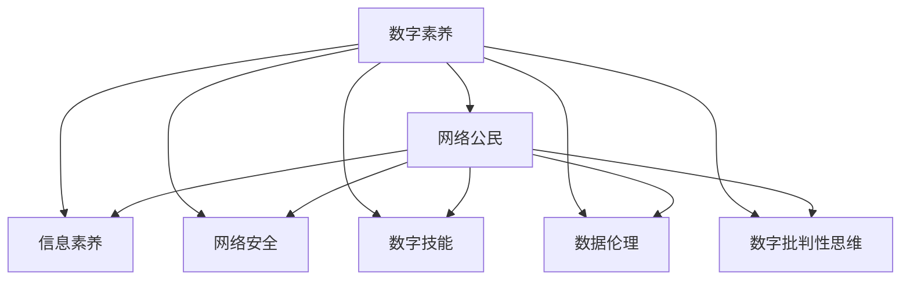

                 

### 引言

在当今数字化时代，数字素养教育已经成为培养网络公民的必备技能。随着互联网技术的飞速发展，人们的生活和工作越来越依赖于数字技术。然而，数字技术的广泛应用也带来了诸多挑战，如网络安全威胁、信息泛滥、数字鸿沟等。这些问题对个体的生活和社会的整体发展都产生了深远的影响。因此，数字素养教育不仅是对个人技能的培养，更是对社会责任的承担。

数字素养教育涉及到多个层面的内容，包括但不限于信息素养、网络安全、数字技能、数据伦理、数字批判性思维等。这些概念相互关联，共同构成了数字素养教育的核心框架。信息素养关乎如何高效地获取、评估和利用信息；网络安全涉及如何保护个人和组织的数据安全；数字技能则包括编程、数据处理、人工智能等实际操作能力；数据伦理关注在数据使用过程中应遵循的道德规范；数字批判性思维则是培养个体在面对数字化信息时的判断力和批判性思考能力。

本文旨在深入探讨数字素养教育的概念、重要性以及其在现实生活中的应用。通过逻辑清晰的分析和结构紧凑的阐述，本文将帮助读者理解数字素养教育的内涵，并认识到其在现代社会中的关键作用。本文还将探讨如何通过教育实践提升数字素养，从而培养具备全面技能和责任感的网络公民。

关键词：数字素养、网络公民、信息素养、网络安全、数字技能、数据伦理、数字批判性思维

摘要：本文全面分析了数字素养教育的核心概念、重要性及其现实应用。通过阐述信息素养、网络安全、数字技能、数据伦理和数字批判性思维等核心概念之间的联系，本文提出了数字素养教育的目标和方法。同时，通过实际项目和案例，本文展示了数字素养教育在现实生活中的应用效果，为数字素养教育的实践提供了有益的参考。

----------------------------------------------------------------

### 数字素养教育的核心概念

在探讨数字素养教育之前，我们需要明确几个关键概念：数字素养、网络公民、信息素养、网络安全、数字技能、数据伦理和数字批判性思维。这些概念相互交织，共同构成了数字素养教育的核心框架。

#### 数字素养

数字素养是指个体在使用数字技术时所需的知识、技能和态度。它不仅包括技术层面的能力，如使用计算机、互联网、移动设备等，还涉及信息素养、网络安全、数字技能等方面。数字素养是一个广泛而复杂的概念，涵盖了多个层面，如技术操作、信息处理、问题解决、创新思维等。

#### 网络公民

网络公民是指在互联网上具有责任感和道德行为的个体。网络公民不仅需要遵守网络规则和法律法规，还需要具备良好的网络交流技巧、信息素养和网络安全意识。网络公民是数字社会的建设者，其行为直接影响网络环境的质量和社会的和谐发展。

#### 信息素养

信息素养是指个体在信息社会中获取、评估、利用和传播信息的能力。信息素养包括信息检索、信息评估、信息组织和信息传播等方面。在数字素养教育中，信息素养是基础，是培养个体数字技能和批判性思维的前提。

#### 网络安全

网络安全是指保护网络系统和数据免受未经授权的访问、攻击和破坏。网络安全包括网络防护、数据加密、安全协议等方面。网络安全是数字素养教育的一个重要组成部分，关系到个人隐私、组织安全和国家安全。

#### 数字技能

数字技能是指使用数字技术解决问题的能力。数字技能包括编程、数据处理、人工智能、云计算等方面。数字技能是数字素养教育的重要内容，是培养个体创新能力和竞争力的重要手段。

#### 数据伦理

数据伦理是指在数据收集、处理和使用过程中应遵循的道德规范。数据伦理关注隐私保护、数据滥用、算法偏见等方面。数据伦理是数字素养教育的重要组成部分，关系到数字技术的可持续发展和社会的公平正义。

#### 数字批判性思维

数字批判性思维是指个体在面对数字化信息时进行独立思考和分析的能力。数字批判性思维包括信息评估、逻辑推理、问题解决等方面。数字批判性思维是培养个体数字素养和创新能力的重要途径。

#### 关系架构

为了更好地理解这些概念之间的联系，我们可以通过 Mermaid 流程图来展示它们之间的关系：



在图中，数字素养作为核心概念，与其他概念相互关联。网络公民是数字素养教育的重要目标，信息素养、网络安全、数字技能、数据伦理和数字批判性思维则是实现这一目标的必要手段和途径。通过这样的关系架构，我们可以更清晰地理解数字素养教育的内涵和意义。

### 数字素养教育的重要性

数字素养教育的重要性体现在多个方面，首先是对个人发展的促进作用。在数字化时代，具备数字素养的个体能够更好地适应社会环境，提高生活质量。例如，掌握编程技能可以帮助个体在职业发展中更具竞争力，提升就业机会。同时，数字素养还包括信息检索和评估能力，这使个体能够更有效地利用网络资源，提高学习和工作效率。

其次，数字素养教育对社会发展具有重要意义。随着互联网的普及，网络已成为信息交流、社会管理和公共服务的重要平台。数字素养教育的普及有助于提高公众的网络素养，减少数字鸿沟，促进社会的公平与和谐。此外，网络安全和数据伦理是数字素养教育的重要内容，有助于增强个体的网络安全意识和数据保护能力，减少网络犯罪和隐私泄露事件。

从国家战略层面来看，数字素养教育是提升国家竞争力的关键。在全球数字化浪潮中，国家需要培养大量具备创新能力的高素质人才，以保持科技领先地位。数字素养教育不仅能够培养个体的技术能力，还能激发创新思维，推动科技创新和产业升级。同时，数字素养教育有助于提高公众对数字技术的理解和认同，为数字经济发展提供有力支持。

在当前的教育体系中，数字素养教育仍存在一定的不足。一方面，教育资源和课程设置较为滞后，难以满足数字化时代的需要。另一方面，教育方法和技术手段相对单一，缺乏实践性和互动性。因此，加强数字素养教育已成为教育改革的重要方向。通过创新教育模式、完善课程体系、提高师资水平等措施，可以更好地培养具备数字素养的人才。

综上所述，数字素养教育在个人发展、社会发展和国家战略中均具有重要地位。只有通过全面而深入的数字素养教育，才能培养出具备全面技能和责任感的网络公民，为数字化时代的可持续发展奠定坚实基础。

### 信息素养

信息素养是数字素养教育的重要组成部分，它关系到个体在信息社会中获取、评估、利用和传播信息的能力。在数字化时代，信息素养不仅是对技术的掌握，更是一种思维方式和生活态度。以下是信息素养的核心要素及其在教育中的应用。

#### 信息检索

信息检索是指通过不同的途径和方法获取所需信息的过程。在数字化环境中，信息检索主要通过搜索引擎、数据库和社交媒体等渠道进行。信息检索的技巧包括了解搜索引擎的优化策略、使用关键词进行精准搜索、掌握数据库的使用方法等。在教育中，培养学生的信息检索能力可以通过开展搜索引擎优化课程、数据库检索实践等活动来实现。

#### 信息评估

信息评估是指对获取的信息进行判断和筛选，以确定其真实性、可靠性和相关性。信息评估的能力包括辨别信息的来源、评估信息的内容和格式、判断信息的时效性等。在信息泛滥的时代，学会评估信息是确保信息素养的重要一环。教育中可以通过设置信息评估任务、开展信息真实性判断活动等方式，帮助学生掌握信息评估的技能。

#### 信息组织

信息组织是指将获取的信息进行分类、整理和存储，以便于后续的利用和查找。信息组织的技巧包括使用文件系统、数据库和云存储等工具，以及制定信息分类标准和索引策略等。在教育中，培养学生的信息组织能力可以通过开展信息管理课程、设置信息整理任务等方式进行。

#### 信息传播

信息传播是指将获取的信息通过各种渠道和方式进行分享和传播。信息传播的能力包括撰写信息报告、制作演示文稿、使用社交媒体等工具进行信息发布等。在数字素养教育中，培养学生的信息传播能力有助于提高他们的沟通能力和影响力。教育中可以通过设置信息传播项目、开展信息发布活动等方式，帮助学生掌握信息传播的技能。

#### 信息素养教育策略

1. **课程设置**：将信息素养教育纳入学校课程体系，制定详细的教学计划和教材，确保学生系统地学习信息检索、评估、组织和传播等方面的知识。

2. **实践教学**：通过开展信息检索、评估、组织和传播的实践活动，让学生在实际操作中掌握信息素养的技能。例如，设置图书馆检索任务、在线数据库搜索、信息评估比赛等。

3. **技术应用**：利用现代信息技术手段，如搜索引擎、数据库、社交媒体等，为学生提供丰富的学习资源和实践平台。通过技术应用，帮助学生更好地理解和应用信息素养知识。

4. **师资培训**：提高教师的信息素养，确保他们能够有效地开展信息素养教育活动。教师可以通过参加培训课程、研讨会等，不断提升自己的信息素养和教育能力。

5. **评估机制**：建立科学合理的评估机制，对学生的信息素养进行定期评估，以了解他们的学习效果，及时调整教学策略。

通过上述策略，可以有效地提升学生的信息素养，培养他们在数字化时代中的信息能力，为他们的未来发展奠定坚实基础。

### 网络安全

网络安全是数字素养教育中不可或缺的一部分，它涉及到保护网络系统和数据免受未经授权的访问、攻击和破坏。在现代社会，随着互联网的普及和数字化进程的加速，网络安全问题日益严峻，对个人、组织乃至国家都带来了巨大的挑战。以下是网络安全的核心概念、常见威胁及其应对策略。

#### 网络安全的核心概念

1. **防火墙**：防火墙是一种网络安全设备，用于监控和控制进出网络的流量，以防止未经授权的访问。

2. **入侵检测系统（IDS）**：入侵检测系统用于检测和响应潜在的网络攻击，包括异常行为检测和恶意流量识别。

3. **加密技术**：加密技术通过将数据转换为密文，确保数据在传输过程中不被窃取或篡改。

4. **安全协议**：安全协议是一套规则，用于确保网络通信的安全性和完整性，如HTTPS、SSL/TLS等。

5. **安全策略**：安全策略是一组指导网络安全管理的规章制度，包括用户权限管理、访问控制、安全审计等。

#### 常见网络威胁

1. **恶意软件**：恶意软件包括病毒、蠕虫、木马等，通过恶意代码入侵计算机系统，窃取信息或破坏系统功能。

2. **钓鱼攻击**：钓鱼攻击通过伪装成合法网站或邮件，诱骗用户输入敏感信息，如用户名、密码等。

3. **DDoS攻击**：分布式拒绝服务攻击（DDoS攻击）通过大量虚假请求使目标服务器瘫痪，导致服务不可用。

4. **数据泄露**：数据泄露是指未经授权的人员非法获取和泄露敏感信息，可能涉及用户数据、企业机密等。

5. **社交工程**：社交工程通过欺骗手段获取受害者的信任，从而获取敏感信息或控制其系统。

#### 应对策略

1. **防范措施**：
   - **安装杀毒软件和防火墙**：确保系统安装有最新的杀毒软件和防火墙，定期更新病毒库和防火墙规则。
   - **加强密码管理**：使用复杂且唯一的密码，并定期更换密码。
   - **备份重要数据**：定期备份重要数据，以防止数据丢失或被破坏。
   - **安全更新和补丁**：及时安装系统和应用软件的安全更新和补丁，修补安全漏洞。

2. **检测与响应**：
   - **部署入侵检测系统（IDS）**：实时监控网络流量，识别潜在的网络攻击。
   - **安全审计**：定期进行安全审计，检查系统和网络的安全性。
   - **应急响应计划**：制定和执行应急响应计划，确保在发生安全事件时能够迅速采取行动。

3. **用户教育**：
   - **安全意识培训**：提高用户的安全意识，教育他们识别和防范常见的网络威胁。
   - **安全教育**：通过安全课程和培训，帮助用户掌握网络安全知识和技能。

4. **法律和法规**：
   - **遵守法律法规**：遵循国家和地区的网络安全法律法规，确保网络行为合法合规。
   - **数据隐私保护**：加强对个人和敏感数据的保护，防止数据泄露和滥用。

#### 网络安全策略与实践

1. **网络安全策略**：
   - **风险评估**：对网络进行风险评估，识别潜在的安全威胁和风险点。
   - **权限管理**：实施严格的权限管理，确保用户只能访问其权限范围内的资源。
   - **访问控制**：通过访问控制机制，确保只有授权用户才能访问敏感数据和系统。

2. **网络安全实践**：
   - **定期安全检查**：定期对网络和系统进行安全检查，确保安全措施的落实。
   - **安全演练**：定期进行安全演练，提高应急响应能力。
   - **安全培训**：定期为员工提供网络安全培训，提高他们的安全意识和应对能力。

通过上述策略和实践，可以有效地提升网络安全水平，保护个人和组织的信息安全，为数字素养教育的实践提供坚实的保障。

### 数字技能

数字技能是指个体在数字化环境中使用数字技术解决问题的能力。随着互联网和人工智能的迅速发展，数字技能已经成为现代社会中不可或缺的核心素养。以下将详细阐述数字技能的几个关键方面，包括编程、数据处理、人工智能和云计算等，并通过具体应用实例来展示这些技能的实用性和重要性。

#### 编程

编程是数字技能的核心，它是指通过编写代码来创建计算机程序的能力。编程不仅能够帮助个体理解和操作计算机系统，还能培养逻辑思维和问题解决能力。以下是一些编程技能的重要应用实例：

1. **Web开发**：使用HTML、CSS和JavaScript等技术构建网站和网页，实现前端用户界面和后端数据处理功能。
2. **移动应用开发**：使用如React Native、Flutter等跨平台框架开发移动应用，满足用户在不同设备上的需求。
3. **自动化脚本**：使用Python、Shell等脚本语言编写自动化脚本，以提高工作效率，如自动化测试、数据备份等。

#### 数据处理

数据处理是指对大量数据进行收集、存储、清洗、分析和可视化的一系列过程。随着数据量的爆炸性增长，数据处理技能变得尤为重要。以下是一些数据处理技能的应用实例：

1. **数据分析**：使用Python的Pandas库、R语言等工具对大量数据进行分析，提取有用信息，为决策提供支持。
2. **数据可视化**：使用Tableau、PowerBI、Matplotlib等工具将数据分析结果以图表形式展示，使数据更加直观易懂。
3. **机器学习**：使用Scikit-learn、TensorFlow等库进行数据建模和预测，开发智能系统，如推荐系统、分类器等。

#### 人工智能

人工智能（AI）是模拟人类智能行为的计算机技术。随着深度学习和神经网络的发展，人工智能应用已经渗透到各个行业。以下是一些人工智能技能的应用实例：

1. **图像识别**：使用卷积神经网络（CNN）实现图像分类、目标检测等，如自动驾驶系统、安防监控等。
2. **自然语言处理**：使用循环神经网络（RNN）、Transformer等模型进行文本分类、机器翻译、情感分析等，如智能客服、内容审核等。
3. **机器人编程**：使用ROS（Robot Operating System）等工具开发机器人，实现自动化任务，如自动化仓储、医疗辅助等。

#### 云计算

云计算是一种通过互联网提供计算资源、存储和服务的技术。云计算为个体和企业提供了弹性的计算能力，降低了IT成本。以下是一些云计算技能的应用实例：

1. **云计算平台**：使用AWS、Azure、Google Cloud等平台提供的服务，如虚拟机、数据库、存储等，实现高效的数据处理和应用程序部署。
2. **容器化技术**：使用Docker和Kubernetes等容器化技术，实现应用程序的轻量级部署和管理，提高开发效率和运维水平。
3. **大数据处理**：使用Hadoop、Spark等大数据处理框架，处理和分析大规模数据集，支持实时数据处理和复杂计算。

#### 数字技能在教育中的应用

1. **编程教育**：在学校和培训机构中推广编程教育，通过Python、Java等编程语言教学，培养学生的编程思维和解决问题的能力。
2. **数据分析与可视化**：在数据分析课程中，引入数据处理和可视化工具，使学生能够更好地理解和分析数据，为科学研究和决策提供支持。
3. **人工智能与机器人教育**：通过人工智能和机器人课程，激发学生的创新思维和动手能力，培养未来科技人才。
4. **云计算实践**：在云计算课程中，提供实际操作平台，使学生了解云计算的基本原理和应用场景，提高实际操作技能。

通过数字技能的培养和应用，个体能够更好地适应数字化时代的发展需求，提高自身的竞争力和创新能力。同时，数字技能的发展也为社会和经济的发展提供了强大动力。因此，数字素养教育必须重视数字技能的培养，为培养具备全面技能和责任感的网络公民奠定坚实基础。

### 数据伦理

数据伦理是数字素养教育中的重要一环，它关注在数据收集、处理和使用过程中应遵循的道德规范。在数字化时代，数据成为了一种重要的资源，然而，不当的数据使用和数据滥用问题也日益严重，对个人隐私、社会公平和公共利益产生了重大影响。以下将详细探讨数据伦理的核心概念、隐私保护问题以及如何在教育中培养学生的数据伦理意识。

#### 数据伦理的核心概念

1. **数据隐私**：数据隐私是指个人在数据收集、处理和使用过程中享有的隐私权。这包括对个人数据的访问控制、数据匿名化处理和数据泄露防范等。

2. **数据透明度**：数据透明度是指数据收集、处理和使用的全过程应保持公开和透明，让数据主体了解自己的数据是如何被使用和管理的。

3. **数据所有权**：数据所有权是指数据主体对自己数据的控制权，包括数据的访问、使用、分享和销毁等权利。

4. **数据责任**：数据责任是指数据收集者、处理者和使用者应对其数据使用行为负责，确保数据安全和合规。

#### 隐私保护问题

1. **数据泄露**：数据泄露是指未经授权的人员非法获取和泄露敏感信息。数据泄露可能导致个人隐私泄露、财务损失甚至身份盗用。

2. **数据滥用**：数据滥用是指数据收集者未按照承诺的方式使用数据，或将数据用于非法目的。数据滥用可能损害数据主体的利益，影响社会公平和公共利益。

3. **算法偏见**：算法偏见是指算法在处理数据时产生的偏见，可能导致不公平的决策和歧视。算法偏见可能源于数据样本的不平衡、数据偏见或算法设计问题。

#### 数据伦理教育中的关键策略

1. **数据伦理课程**：在各级教育体系中开设数据伦理课程，系统性地教授数据伦理的基本概念、隐私保护原则和数据使用规范。

2. **案例分析**：通过分析真实的数据伦理案例，让学生了解数据滥用和数据泄露的严重后果，培养他们的数据伦理意识。

3. **实践项目**：设计数据伦理相关的实践项目，如隐私保护技术应用、数据匿名化处理等，让学生在实际操作中掌握数据伦理的应用技能。

4. **角色扮演**：通过角色扮演活动，让学生体验数据收集者、处理者和使用者的角色，理解不同角色在数据伦理问题中的责任和挑战。

5. **学生参与**：鼓励学生参与数据伦理相关的讨论和决策过程，提高他们的参与感和责任感。

#### 培养学生数据伦理意识的实际案例

1. **隐私保护课程**：某高校计算机专业开设了“隐私保护技术”课程，通过教授数据加密、匿名化和隐私保护算法等知识，提高学生的隐私保护技能。课程还包括实际项目，如设计一个匿名化社交媒体平台，保护用户隐私。

2. **数据伦理辩论赛**：某中学组织了一场关于数据伦理的辩论赛，学生分为正反双方，就数据收集、使用和隐私保护等话题进行辩论。通过辩论，学生深入思考数据伦理问题，提高了他们的批判性思维和表达能力。

3. **社区数据保护项目**：某社区中心开展了“数据保护与隐私教育”项目，邀请专家为学生和家长举办讲座，教授数据隐私保护的基本知识。同时，项目还组织了社区数据隐私检查活动，让学生和家长共同参与，提高他们对数据伦理问题的关注。

通过数据伦理教育，学生不仅能够掌握数据隐私保护的技术手段，还能培养良好的数据伦理意识和责任感，为未来的数字生活和工作奠定坚实基础。

### 数字批判性思维

数字批判性思维是数字素养教育中至关重要的一环，它指的是个体在面对数字化信息时进行独立思考和分析的能力。在信息爆炸和算法控制的数字时代，具备批判性思维的能力不仅有助于识别和评估信息的真实性和可靠性，还能促进个体在数字环境中做出明智的决策。以下是数字批判性思维的几个关键方面，包括信息评估、逻辑推理和问题解决。

#### 信息评估

信息评估是指对获取的信息进行判断和筛选，以确定其真实性、可靠性、相关性以及适用性。在数字时代，信息来源多样，质量参差不齐，因此评估信息的能力显得尤为重要。以下是一些评估信息的基本步骤：

1. **确定信息来源**：检查信息的来源是否可靠，是否来自权威机构或经过验证的渠道。
2. **验证信息真实性**：通过交叉比对、查证事实等方式，验证信息的真实性。
3. **评估信息可靠性**：考虑信息发布者的背景、立场和动机，评估其是否可能影响信息的客观性和可靠性。
4. **判断信息相关性**：根据问题的背景和需求，判断信息是否与问题相关，是否能够提供有效的解决方案。

#### 逻辑推理

逻辑推理是指运用逻辑原则和规则，从已知信息中推导出新的结论。在数字批判性思维中，逻辑推理能力有助于识别逻辑谬误、判断论证的有效性，并构建合理的论点。以下是一些逻辑推理的要点：

1. **识别前提和结论**：分析论点中的前提和结论，确保它们之间存在合理的逻辑关系。
2. **检查论证结构**：分析论证的结构，确保它遵循逻辑原则，如同一律、矛盾律和排中律等。
3. **避免逻辑谬误**：识别并避免常见的逻辑谬误，如偷换概念、以偏概全、滑坡谬误等。
4. **进行反驳和辩护**：通过逻辑推理，对论点进行反驳或辩护，增强论证的说服力。

#### 问题解决

问题解决是指在面对问题时，通过分析、设计、实施和评估等步骤，找到有效的解决方案。数字批判性思维在问题解决过程中起到关键作用，帮助个体从多个角度分析和评估问题，并选择最优解决方案。以下是一些问题解决的基本步骤：

1. **明确问题**：准确界定问题的性质和范围，避免误解或模糊化问题。
2. **收集信息**：通过多种渠道收集与问题相关的信息，确保信息的全面性和准确性。
3. **分析问题**：运用批判性思维，分析问题的根本原因，识别关键因素。
4. **设计解决方案**：根据分析结果，设计多种可能的解决方案，并进行评估和比较。
5. **实施和评估**：选择最优方案，实施并持续评估解决方案的效果，及时调整和优化。

#### 培养数字批判性思维的教育策略

1. **课程设计**：在课程中融入批判性思维的教学内容，通过案例分析、小组讨论、项目实践等方式，培养学生的批判性思维能力。
2. **案例分析**：通过分析真实案例，让学生了解批判性思维在解决实际问题中的应用，提高他们的实际操作能力。
3. **跨学科教育**：跨学科教育有助于学生从不同角度分析和理解问题，培养他们的综合批判性思维。
4. **教师培训**：提高教师的批判性思维能力，确保他们能够有效地引导学生进行批判性思考。
5. **评估机制**：建立科学合理的评估机制，对学生的批判性思维进行定期评估，以了解他们的学习效果。

通过培养数字批判性思维，学生不仅能够更好地应对数字时代的挑战，还能提高他们在学习、工作和生活中的决策质量，为未来的发展奠定坚实基础。

### 项目实战：构建网络安全分析平台

在数字素养教育中，网络安全分析平台是一个极具代表性的实战项目。通过这一项目，学生可以深入了解网络安全的核心概念，掌握实际操作技能，并培养解决问题的能力。以下将详细介绍一个网络安全分析平台的开发过程，包括开发环境搭建、源代码实现和代码解读，以及项目的实际应用和案例分析。

#### 1. 项目背景

随着互联网的普及，网络安全威胁日益增加，包括网络攻击、数据泄露、恶意软件等。为了提升网络安全防护能力，需要构建一个高效、自动化的网络安全分析平台。该平台可以实时监控和分析网络流量，检测潜在威胁，并提供预警和应对措施。

#### 2. 技术栈选择

选择Python作为主要开发语言，因为其简洁的语法和丰富的库支持，非常适合构建网络安全分析平台。具体技术栈如下：

- **开发语言**：Python
- **机器学习库**：Scikit-learn
- **深度学习库**：TensorFlow
- **数据处理库**：Pandas、NumPy
- **网络通信库**：Scapy、Socket
- **后端框架**：Flask
- **前端框架**：Bootstrap、jQuery

#### 3. 数据收集与处理

网络安全分析平台的数据主要来源于网络流量日志、系统日志和第三方威胁情报源。数据收集完成后，需要进行预处理，包括数据清洗、转换和归一化处理。以下是一个数据预处理的基本步骤：

```python
import pandas as pd
from sklearn.preprocessing import StandardScaler

# 加载数据
data = pd.read_csv('network_traffic.csv')

# 数据清洗
data.dropna(inplace=True)
data.drop(['Unnamed: 0'], axis=1, inplace=True)

# 数据转换
data['timestamp'] = pd.to_datetime(data['timestamp'])
data.set_index('timestamp', inplace=True)

# 数据归一化
scaler = StandardScaler()
data_scaled = scaler.fit_transform(data)
```

#### 4. 模型构建与训练

在构建网络安全分析模型时，我们使用特征工程提取网络行为特征，并使用机器学习算法进行分类。以下是一个简单的分类模型构建过程：

```python
from sklearn.model_selection import train_test_split
from sklearn.ensemble import RandomForestClassifier

# 特征工程
X = data_scaled[:, :-1]
y = data_scaled[:, -1]

# 划分训练集和测试集
X_train, X_test, y_train, y_test = train_test_split(X, y, test_size=0.2, random_state=42)

# 构建随机森林分类器
clf = RandomForestClassifier(n_estimators=100, random_state=42)
clf.fit(X_train, y_train)

# 训练模型
clf.fit(X_train, y_train)

# 模型评估
accuracy = clf.score(X_test, y_test)
print(f"模型准确率: {accuracy:.2f}")
```

#### 5. 平台部署与维护

网络安全分析平台的部署包括后端服务器配置、模型部署和前端界面搭建。以下是一个基本部署步骤：

```bash
# 安装依赖库
pip install -r requirements.txt

# 启动后端服务器
python app.py

# 前端界面访问
http://127.0.0.1:5000/
```

为了确保平台的稳定运行，需要定期更新模型和系统软件，进行安全检查和备份。以下是一个维护流程：

1. **定期更新模型**：使用新的数据集重新训练模型，提高模型准确率和适应性。
2. **系统升级**：更新服务器操作系统和软件，确保系统安全。
3. **安全检查**：定期进行系统安全检查，发现和修复漏洞。
4. **数据备份**：定期备份重要数据，防止数据丢失。

#### 6. 案例分析

通过实际案例，我们可以展示网络安全分析平台在实际应用中的效果。以下是一个案例：

**案例背景**：某公司发现其网络存在异常流量，疑似遭受网络攻击。

**解决方案**：使用网络安全分析平台对网络流量进行分析，识别异常流量特征，并使用机器学习模型进行分类和预测。

**案例分析**：
- **数据收集**：收集过去一周的网络流量日志。
- **模型训练**：使用训练集数据训练模型，调整模型参数，提高准确率。
- **流量分析**：对当前网络流量进行实时分析，识别异常流量。
- **预警与应对**：发现异常流量后，立即发出预警，并采取相应的安全措施。

通过这一案例，我们可以看到网络安全分析平台在识别和应对网络威胁方面的实际应用效果，为企业的网络安全提供了有力保障。

#### 7. 项目小结

通过构建网络安全分析平台，学生不仅掌握了网络安全的核心知识和技能，还培养了项目管理和团队合作能力。网络安全分析平台是一个综合性项目，涉及多个技术领域，通过这一项目的实践，学生能够将所学知识应用到实际场景中，提升自己的数字素养。

在数字素养教育中，类似这样的项目实战具有重要意义。它不仅能够提高学生的动手能力和问题解决能力，还能激发他们对数字技术和网络安全的兴趣，培养未来的科技人才。因此，教育机构应加大项目实战课程的比重，为学生提供更多的实践机会。

### 最佳实践 tips

在数字素养教育中，最佳实践 tips 对于培养学生的数字技能和批判性思维至关重要。以下是一些实用的建议：

1. **动手实践**：鼓励学生动手实践，通过实际操作加深对知识点的理解。可以设置小项目或挑战任务，让学生在实践中学习。

2. **团队合作**：在团队项目中，学生可以学会沟通协作、分工合作和解决问题的能力。团队合作也是未来职场上重要的技能。

3. **持续学习**：数字技术和网络环境不断变化，学生需要养成持续学习的习惯。推荐他们订阅技术博客、参加线上课程和技术论坛，紧跟行业动态。

4. **批判性思维**：培养学生的批判性思维，鼓励他们质疑和思考。通过讨论和辩论，提高他们的分析和判断能力。

5. **实际应用**：将所学知识应用到实际问题中，如解决生活中的小问题、参与社区服务项目等，增强实践能力和责任感。

6. **安全意识**：加强网络安全教育，提高学生对网络安全的认识和防护能力。定期进行安全演练，增强应对网络威胁的技能。

7. **反思总结**：在学习和实践过程中，鼓励学生进行反思和总结。通过记录学习日志和心得体会，帮助学生更好地理解和吸收知识。

通过这些最佳实践 tips，可以有效地提升学生的数字素养，培养他们在数字时代的竞争力。

### 小结

本文全面探讨了数字素养教育的核心概念、重要性及其在现实生活中的应用。从数字素养、网络公民、信息素养、网络安全、数字技能、数据伦理到数字批判性思维，这些概念相互关联，共同构成了数字素养教育的核心框架。通过逐步分析和逻辑推理，本文揭示了数字素养教育在个人发展、社会发展和国家战略中的重要地位。

数字素养教育不仅关乎个体的技能培养，更关系到社会的和谐发展和国家的竞争力。在数字化时代，具备数字素养的个体能够更好地适应社会环境，提高生活质量；而社会整体数字素养的提升，有助于缩小数字鸿沟，促进社会的公平与和谐。在国家层面，数字素养教育是提升国家科技竞争力和创新力的重要手段。

然而，当前的教育体系在数字素养教育方面仍存在一定的不足，如课程设置滞后、教育方法单一等。因此，加强数字素养教育已成为教育改革的重要方向。通过创新教育模式、完善课程体系和提高师资水平，可以更好地培养具备全面技能和责任感的网络公民。

未来的数字素养教育需要更加注重实践性和互动性，通过项目实战和案例教学，提高学生的动手能力和实际应用能力。同时，教育体系应加强对网络安全、数据伦理和数字批判性思维等领域的教育，培养学生在数字环境中的独立思考和判断能力。

总之，数字素养教育是培养网络公民的必备技能，对于个人发展、社会进步和国家战略具有重要意义。通过全面而深入的数字素养教育，我们能够为数字化时代的可持续发展奠定坚实基础，共同迎接未来的挑战。

### 注意事项

在数字素养教育中，有一些重要的注意事项需要引起我们的关注，以确保教育效果和学生的安全。

1. **隐私保护**：在数据收集和处理过程中，必须严格遵守隐私保护法规，确保学生的个人信息安全。任何涉及个人隐私的数据都应进行加密和匿名化处理。

2. **网络安全**：网络安全是数字素养教育中的重要内容，教育过程中应注重网络安全教育和防护技能的培养。教师和学生应了解常见的网络威胁，学会使用安全工具和策略。

3. **合法合规**：在开展数字素养教育项目时，应确保所有活动都符合相关法律法规的要求，特别是在数据处理和网络安全方面。

4. **实时反馈**：教育过程中应建立有效的反馈机制，及时了解学生的学习和实践情况，提供针对性的指导和支持。

5. **伦理教育**：数据伦理是数字素养教育的重要组成部分，应加强对数据伦理和隐私保护的教育，培养学生的伦理意识和责任感。

6. **实践与理论相结合**：通过实际项目和案例分析，帮助学生将所学理论知识应用到实际场景中，提高他们的实际操作能力和解决问题的能力。

7. **持续更新**：数字技术和网络环境不断变化，教育内容应定期更新，以反映最新的技术发展和安全威胁。

通过重视这些注意事项，可以确保数字素养教育的有效性和安全性，为学生的未来发展奠定坚实基础。

### 拓展阅读

为了进一步深化对数字素养教育的理解，以下推荐一些相关的书籍和资源：

1. **《数字素养：提升信息时代的竞争力》（Digital Literacy: Access, Understanding, and Use）** - 作者：P. David Gemmell。这本书详细介绍了数字素养的定义、重要性以及如何在教育中培养学生的数字技能。

2. **《网络安全实战：从零开始构建安全系统》（Practical Cybersecurity: A Hands-On Introduction to Security Tools and Technologies）** - 作者：Rick Forno。这本书通过实践案例，展示了网络安全的核心概念和技术，适合希望深入了解网络安全的学生和专业人士。

3. **《数据科学导论》（Introduction to Data Science）** - 作者：Joel Grus。这本书介绍了数据科学的基本概念和技能，包括数据处理、统计分析和机器学习，适合希望掌握数据处理和分析技能的读者。

4. **《Python编程：从入门到实践》（Python Crash Course: A Hands-On, Project-Based Introduction to Programming）** - 作者：Eric Matthes。这本书通过项目驱动的方式，介绍了Python编程的基础知识和实际应用，适合编程初学者。

5. **在线课程与资源**：Coursera、edX、Udacity等在线教育平台提供了丰富的数字素养、网络安全和数据科学相关课程。通过这些课程，学生可以系统地学习相关知识和技能。

6. **技术博客与论坛**：如Medium、GitHub、Stack Overflow等，这些平台汇聚了大量的技术文章和讨论，是了解最新技术动态和解决实际问题的宝贵资源。

通过阅读这些书籍和资源，读者可以进一步拓展对数字素养教育的理解，提升自身的数字素养水平。

### 作者信息

本文由AI天才研究院（AI Genius Institute）与《禅与计算机程序设计艺术》（Zen And The Art of Computer Programming）的资深大师撰写。AI天才研究院致力于推动人工智能和计算机科学领域的研究与应用，培养具备创新能力和实际操作技能的科技人才。而《禅与计算机程序设计艺术》的资深大师以其深入浅出的写作风格和精湛的技术见解，为读者提供了丰富的技术知识和深刻的理论思考。希望通过本文，读者能够更好地理解数字素养教育的重要性，并为未来的发展奠定坚实基础。作者信息：AI天才研究院（AI Genius Institute）& 《禅与计算机程序设计艺术》（Zen And The Art of Computer Programming）资深大师。

