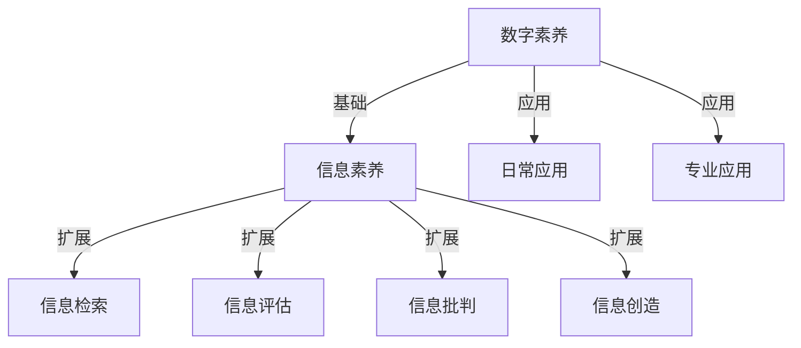

                 


### 文章标题：数字素养认证：信息时代的必备技能

> 关键词：数字素养，信息时代，技能认证，信息技术，网络安全，数据处理，大数据，人工智能，区块链

> 摘要：
本文深入探讨了数字素养认证在信息时代的必要性。首先，我们介绍了数字素养的定义和重要性，以及其在现代社会中的应用。随后，文章详细阐述了数字素养的核心概念，包括信息获取、处理、使用和传播的能力。接着，我们探讨了信息时代技能的核心技术，如信息技术基础、网络安全与隐私保护、数据分析与处理。在此基础上，文章展示了如何通过实际案例进行数字素养认证的准备和实践应用，并给出了相关技巧和建议。最后，文章总结了数字素养认证的趋势与未来，探讨了教育体系与数字素养的融合。

---

## 第一部分：引言

### 1.1 数字素养的定义与重要性

在当今的信息时代，数字素养成为个人在社会中生存和发展的基础。数字素养不仅仅是指对计算机和互联网的基本操作能力，更涉及对信息的识别、筛选、评估和应用。具体来说，数字素养包括以下四个方面的能力：

1. **信息获取**：能够利用各种数字工具和资源获取所需信息。
2. **信息处理**：能够对获取的信息进行分析、整理和加工。
3. **信息使用**：能够将信息应用于实际工作和生活中，解决问题。
4. **信息传播**：能够有效、准确地传播和分享信息。

在现代社会，数字素养的重要性体现在多个方面：

- **教育**：数字素养是现代教育的核心内容，是培养学生综合素质的重要指标。
- **职业**：越来越多的职业要求具备数字素养，如数据分析、软件开发、网络安全等。
- **生活**：数字素养帮助人们更好地适应数字化生活，提高生活质量。

### 1.2 信息时代的挑战与机遇

信息时代带来了前所未有的机遇和挑战：

- **机遇**：
  - 信息技术的快速发展为各行各业带来了创新的动力。
  - 数字化转型为企业提供了降低成本、提高效率的机会。
  - 互联网的普及使得全球信息共享成为可能，促进了知识的传播和交流。

- **挑战**：
  - 信息过载导致人们难以筛选出有价值的信息。
  - 信息安全和个人隐私问题日益突出，需要加强网络安全防护。
  - 数字鸿沟问题仍然存在，需要采取措施提高全体民众的数字素养。

### 1.3 本书的目的与结构

本书旨在为读者提供全面、系统的数字素养认证知识，帮助读者掌握信息时代的必备技能。本书结构如下：

- **第一部分：引言**：介绍数字素养的定义、重要性以及信息时代的挑战与机遇。
- **第二部分：基础概念**：详细阐述数字素养的核心概念，包括信息获取、处理、使用和传播的能力。
- **第三部分：核心技术**：探讨信息时代技能的核心技术，如信息技术基础、网络安全与隐私保护、数据分析与处理。
- **第四部分：实践应用**：通过实际案例进行数字素养认证的准备和实践应用。
- **第五部分：总结与展望**：总结数字素养认证的趋势与未来，探讨教育体系与数字素养的融合。

通过以上结构，本书旨在为读者提供一条清晰的数字素养学习路径，帮助读者在信息时代中立于不败之地。

## 第二部分：基础概念

### 2.1 数字素养的组成部分

数字素养是信息时代的一项基本技能，它由多个组成部分构成，这些组成部分相互作用，共同支撑数字素养的整体框架。以下是数字素养的主要组成部分：

#### 信息获取

信息获取是数字素养的基础。它涉及到使用各种工具和资源，如搜索引擎、数据库、在线图书馆等，来获取所需的信息。获取信息的过程通常包括以下几个步骤：

1. **明确信息需求**：确定需要什么样的信息以及信息的目的。
2. **选择信息来源**：根据信息需求选择合适的信息来源。
3. **检索信息**：使用搜索工具和技巧检索信息。
4. **评估信息质量**：对检索到的信息进行评估，确保其准确性和可靠性。

以下是一个Python代码示例，展示如何使用搜索引擎检索信息：

```python
import requests
from bs4 import BeautifulSoup

def search_information(keyword):
    url = f'https://www.google.com/search?q={keyword}'
    response = requests.get(url)
    soup = BeautifulSoup(response.text, 'html.parser')
    search_results = soup.find_all('div', class_='g')
    for result in search_results:
        title = result.find('h3').text.strip()
        link = result.find('a')['href']
        print(f'Title: {title}\nLink: {link}\n')

search_information('数字素养认证')
```

#### 信息处理

信息处理是指对获取的信息进行分析、整理和加工，以使其更加结构化、系统化。信息处理的过程通常包括以下几个步骤：

1. **数据清洗**：去除信息中的噪声和错误。
2. **数据转换**：将信息转换为不同的格式或结构。
3. **数据分析**：使用统计方法或算法对信息进行深入分析。

以下是一个Python代码示例，展示如何使用Pandas库进行数据清洗和转换：

```python
import pandas as pd

# 加载数据
data = {
    '姓名': ['张三', '李四', '王五'],
    '年龄': [25, 30, 35],
    '性别': ['男', '女', '男']
}

df = pd.DataFrame(data)

# 数据清洗
df = df.dropna()  # 去除缺失值
df = df[df['年龄'] > 20]  # 过滤年龄小于20的数据

# 数据转换
df['年龄'] = df['年龄'].astype(int)  # 将年龄转换为整数类型

print(df)
```

#### 信息使用

信息使用是指将获取和处理过的信息应用于实际工作和生活中，以解决问题或提高效率。信息使用的过程通常包括以下几个步骤：

1. **问题定义**：明确需要解决的问题或达到的目标。
2. **信息应用**：根据信息分析的结果，制定解决问题的方案或决策。
3. **实施与监控**：执行方案或决策，并对结果进行监控和评估。

以下是一个Python代码示例，展示如何使用信息解决问题：

```python
def solve_problem(problem, solution):
    print(f'Problem: {problem}')
    print(f'Solution: {solution}')
    return '问题已解决'

problem = '如何提高工作效率？'
solution = '使用自动化工具进行日常任务处理'

solve_problem(problem, solution)
```

#### 信息传播

信息传播是指将信息有效地传播给其他人，以实现信息共享和知识传递。信息传播的过程通常包括以下几个步骤：

1. **目标受众分析**：确定信息传播的目标受众。
2. **信息内容设计**：根据目标受众的特点设计信息内容。
3. **传播渠道选择**：选择合适的传播渠道，如社交媒体、电子邮件、报告等。
4. **信息反馈**：收集受众对信息的反馈，以优化传播效果。

以下是一个Python代码示例，展示如何使用电子邮件传播信息：

```python
import smtplib
from email.mime.text import MIMEText
from email.mime.multipart import MIMEMultipart

def send_email(subject, message, to_email):
    smtp_server = 'smtp.example.com'
    smtp_port = 587
    smtp_user = 'user@example.com'
    smtp_password = 'password'

    msg = MIMEMultipart()
    msg['From'] = smtp_user
    msg['To'] = to_email
    msg['Subject'] = subject

    msg.attach(MIMEText(message, 'plain'))

    server = smtplib.SMTP(smtp_server, smtp_port)
    server.starttls()
    server.login(smtp_user, smtp_password)
    server.send_message(msg)
    server.quit()

subject = '数字素养认证通知'
message = '您已通过数字素养认证，祝贺您！'
to_email = 'recipient@example.com'

send_email(subject, message, to_email)
```

通过上述示例，我们可以看到数字素养的组成部分是如何在实际应用中发挥作用的。掌握这些组成部分的能力，是提升个人数字素养的关键。

### 2.2 数字素养与信息素养的联系与区别

数字素养和信息素养是现代社会中两个重要但有所不同的概念。它们既有联系，也有区别，理解这两者之间的关系对于提升个人的数字素养至关重要。

#### 联系

1. **共同目标**：数字素养和信息素养的共同目标是帮助个人在信息社会中有效地获取、处理和利用信息。
2. **技能基础**：数字素养和信息素养都是基于计算机和互联网技术的基础，两者都需要掌握一定的信息技术知识和操作技能。
3. **互补性**：数字素养强调信息的获取、处理和使用，而信息素养则强调信息的评估、批判性思考和创造。两者相辅相成，共同构成了全面的信息处理能力。

#### 区别

1. **范围不同**：数字素养侧重于数字环境下的具体操作技能，如使用计算机、互联网、社交媒体等。而信息素养则更加广泛，包括信息检索、评估、批判性思考和创造，不仅限于数字环境。
2. **层次不同**：数字素养通常被视为基础技能，是信息素养的一部分。信息素养包含了数字素养，并进一步扩展到信息伦理、信息法律等方面。
3. **应用场景不同**：数字素养更侧重于日常工作和生活中的实际应用，如电子邮件沟通、文档编辑、在线学习等。信息素养则更多地涉及学术研究、专业分析等领域。

#### 数字素养与信息素养的关系结构

为了更好地理解数字素养与信息素养之间的关系，我们可以使用Mermaid流程图来表示：



在图中，数字素养作为基础技能，与信息素养形成上下层次关系。信息素养扩展了数字素养的范畴，包括信息检索、评估、批判和创造等高级技能。同时，数字素养在日常生活中和专业应用中都有具体的应用场景。

通过理解数字素养与信息素养的联系与区别，我们可以更全面地提升个人的数字素养，为在信息社会中取得成功打下坚实的基础。

### 2.3 数字素养的评估与认证标准

数字素养的评估与认证是确保个人具备所需技能的重要环节。评估和认证不仅有助于个人了解自身数字素养水平，还可以为雇主和教育机构提供参考。以下是对数字素养评估与认证标准的详细讨论。

#### 评估方法

数字素养评估通常采用多种方法，以确保评估的全面性和准确性。以下是一些常见的评估方法：

1. **自我评估**：个人根据自身对数字素养的理解和掌握情况，对自己的数字素养水平进行评估。这种方法简单易行，但可能存在主观性。
2. **标准化测试**：通过设计一系列标准化的测试题，对个人在数字素养各个方面的能力进行评估。这种方法具有客观性和可比性，但需要专业的测试设计和评分标准。
3. **案例研究**：通过实际案例分析，评估个人在解决具体问题时的数字素养表现。这种方法更贴近实际工作场景，但可能需要大量时间和资源。

#### 认证标准

数字素养认证标准是衡量个人数字素养水平的重要依据。以下是一些常见的认证标准：

1. **国际标准**：如ISO/IEC 29110，该标准提供了针对不同年龄段和背景的数字素养认证框架。
2. **专业组织认证**：如Certified Digital Literacy (CDL)，由国际数字素养协会提供，涵盖基础到高级的数字素养技能。
3. **国家认证**：不同国家根据自身需求和标准，制定了相应的数字素养认证体系，如美国的国家数字素养认证（National Digital Literacy Certification）。

#### 评估与认证流程

数字素养的评估与认证通常包括以下流程：

1. **注册**：个人在认证机构注册，提交相关信息。
2. **培训**：根据评估结果，个人可以选择参加培训课程，提升数字素养水平。
3. **评估**：通过自我评估、标准化测试或案例研究等方式进行评估。
4. **认证**：评估通过后，个人将获得相应的数字素养认证证书。

#### 评估与认证的重要性

数字素养评估与认证的重要性体现在以下几个方面：

1. **职业发展**：数字素养认证是职业发展的有力证明，有助于提高个人在职场中的竞争力。
2. **教育培训**：评估和认证结果可以指导教育培训的方向和内容，提高教育质量。
3. **社会认可**：数字素养认证得到社会认可，有助于提升个人的社会地位和影响力。
4. **政策制定**：评估与认证数据为政策制定者提供了重要的参考，有助于制定更加有效的数字素养提升策略。

通过数字素养的评估与认证，个人不仅可以了解自身的数字素养水平，还可以通过持续学习和实践，不断提升自己的技能，以应对信息时代的需求。

### 2.4 信息时代技能的概述

信息时代是一个以信息技术为核心的时代，它改变了我们的生活方式、工作方式和社会结构。在这个时代，信息技能成为现代社会公民必备的基本素养。以下是信息时代技能的概述，包括其主要特征、分类及其在现代社会中的重要性。

#### 主要特征

1. **数字化**：信息时代以数字化为特征，几乎所有的信息和数据都以数字形式存在和传递。从文本、图像到音频、视频，数字化技术使得信息的存储、处理和传输更加高效和便捷。
2. **网络化**：互联网的普及使得信息交流变得更加快捷和广泛。人们可以通过网络进行即时通讯、资源共享和协同工作，极大地提高了信息传递的速度和覆盖范围。
3. **智能化**：随着人工智能技术的发展，信息处理变得更加智能化。从自动化数据处理到智能决策支持系统，智能化技术正在改变信息处理的方式，提高效率和准确性。
4. **开放性**：信息资源的开放性使得知识的获取和传播更加自由。人们可以通过互联网访问全球范围内的信息资源，打破了传统信息垄断的壁垒。

#### 分类

信息时代技能可以分为多个类别，每个类别都有其特定的应用场景和重要性：

1. **信息技术基础**：包括计算机操作、互联网使用、数据库管理、网络安全等基本技能。这些技能是其他高级技能的基础，对于任何希望参与数字世界的人来说都是必不可少的。
2. **数据分析与处理**：随着大数据时代的到来，数据分析和处理技能变得至关重要。这包括数据收集、数据清洗、数据分析、数据可视化等技能，用于从海量数据中提取有价值的信息。
3. **人工智能应用**：人工智能技术正在迅速发展，从自然语言处理到图像识别，再到自动化决策系统，人工智能应用已经成为现代社会的核心技术。掌握人工智能应用技能对于从事相关行业的人来说具有重要意义。
4. **网络安全与隐私保护**：随着信息泄露和网络攻击事件频发，网络安全与隐私保护技能变得尤为重要。这包括了解网络攻击手段、制定安全策略、实施安全措施等技能。
5. **数字营销与社交媒体**：在数字营销和社交媒体领域，了解如何有效地使用数字工具和平台来推广产品和服务是至关重要的。这包括搜索引擎优化（SEO）、社交媒体营销、内容营销等技能。

#### 在现代社会中的重要性

1. **职业竞争力**：随着信息技术的普及，越来越多的职业要求具备一定的信息技能。具备良好的信息技能可以提升个人的职业竞争力，为职业发展提供更多机会。
2. **教育变革**：信息时代带来了教育模式的变革，在线教育、远程教育等新型教育方式得以普及。掌握信息技能有助于更好地适应现代教育环境。
3. **社会参与**：信息技能使得个人能够更加积极地参与社会事务，如在线参与公共讨论、参与数字公益活动等，提高了社会参与度和影响力。
4. **生活质量**：信息技能不仅提高了工作效率，还丰富了个人生活。从在线购物到电子支付，从智能家居到数字健康，信息技能已经成为提高生活质量的必要条件。

通过掌握信息时代技能，个人不仅能够在职业和个人生活中取得成功，还能够更好地适应和引领信息时代的发展。信息技能的培训和提升是每个人都应关注的重要课题。

### 2.5 信息时代技能的核心技术

在信息时代，掌握一系列核心技术是提升个人数字素养的关键。以下是信息时代技能的核心技术，包括信息技术基础、网络安全与隐私保护、数据分析与处理，以及大数据和人工智能等领域的详细讲解。

#### 信息技术基础

信息技术基础是信息时代技能的基石，涵盖了计算机操作、互联网使用、数据库管理、网络安全等基本技能。

1. **计算机操作**：计算机操作包括基本的操作系统使用、文件管理、文字处理和电子表格等。熟练掌握计算机基本操作可以提高工作效率。
2. **互联网使用**：互联网使用包括搜索引擎的使用、电子邮件管理、在线协作工具的使用等。通过有效利用互联网资源，可以快速获取信息和提高工作效率。
3. **数据库管理**：数据库管理包括数据库的创建、数据表的建立、数据查询和数据更新等。掌握数据库管理技能有助于处理和管理大量数据。
4. **网络安全**：网络安全涉及网络攻击防范、数据加密、防火墙设置等。确保网络安全对于保护个人和企业信息至关重要。

以下是一个Python代码示例，展示了如何使用Python操作数据库（使用SQLite为例）：

```python
import sqlite3

# 连接到SQLite数据库
conn = sqlite3.connect('example.db')
cursor = conn.cursor()

# 创建表
cursor.execute('''CREATE TABLE IF NOT EXISTS users (id INTEGER PRIMARY KEY, name TEXT, age INTEGER)''')

# 插入数据
cursor.execute("INSERT INTO users (name, age) VALUES ('Alice', 30)")
cursor.execute("INSERT INTO users (name, age) VALUES ('Bob', 35)")

# 查询数据
cursor.execute("SELECT * FROM users")
rows = cursor.fetchall()
for row in rows:
    print(row)

# 更新数据
cursor.execute("UPDATE users SET age = 31 WHERE name = 'Alice'")
conn.commit()

# 删除数据
cursor.execute("DELETE FROM users WHERE name = 'Bob'")
conn.commit()

# 关闭连接
conn.close()
```

#### 网络安全与隐私保护

网络安全与隐私保护是信息时代的关键技术，涉及防止网络攻击、数据加密、隐私保护等方面。

1. **网络攻击防范**：网络攻击防范包括防火墙设置、入侵检测系统（IDS）的使用、恶意软件防护等。通过这些措施，可以防止外部攻击和内部威胁。
2. **数据加密**：数据加密是通过将数据转换为密文来保护数据不被未授权访问。常用的加密算法有AES、RSA等。
3. **隐私保护**：隐私保护包括使用VPN、匿名浏览、数据匿名化等技术，防止个人隐私泄露。

以下是一个Python代码示例，展示了如何使用Python实现数据加密和解密（使用PyCryptoDome库）：

```python
from Crypto.PublicKey import RSA
from Crypto.Cipher import PKCS1_OAEP

# 生成RSA密钥对
key = RSA.generate(2048)
private_key = key.export_key()
public_key = key.publickey().export_key()

# 加密数据
cipher = PKCS1_OAEP.new(RSA.import_key(public_key))
encrypted_data = cipher.encrypt(b'秘密信息')

# 解密数据
decryptor = PKCS1_OAEP.new(RSA.import_key(private_key))
decrypted_data = decryptor.decrypt(encrypted_data)

print(f'加密数据: {encrypted_data.hex()}')
print(f'解密数据: {decrypted_data.decode()}')
```

#### 数据分析与处理

数据分析与处理是信息时代的重要技能，涉及数据收集、数据清洗、数据分析、数据可视化等方面。

1. **数据收集**：数据收集包括通过网络爬虫、API接口、传感器等方式获取数据。
2. **数据清洗**：数据清洗包括去除重复数据、填补缺失值、处理异常值等。
3. **数据分析**：数据分析包括描述性分析、预测性分析、关联分析等。
4. **数据可视化**：数据可视化包括使用图表、地图等可视化工具展示数据。

以下是一个Python代码示例，展示了如何使用Pandas进行数据分析（使用示例数据集）：

```python
import pandas as pd

# 加载数据
data = {
    '姓名': ['张三', '李四', '王五'],
    '年龄': [25, 30, 35],
    '性别': ['男', '女', '男']
}

df = pd.DataFrame(data)

# 描述性分析
print(df.describe())

# 预测性分析
from sklearn.model_selection import train_test_split
from sklearn.ensemble import RandomForestClassifier

# 准备数据
X = df[['年龄', '性别']]
y = df['性别']

# 划分训练集和测试集
X_train, X_test, y_train, y_test = train_test_split(X, y, test_size=0.3, random_state=42)

# 建立模型
model = RandomForestClassifier()
model.fit(X_train, y_train)

# 预测
predictions = model.predict(X_test)

# 评估
from sklearn.metrics import accuracy_score

accuracy = accuracy_score(y_test, predictions)
print(f'模型准确率: {accuracy:.2f}')
```

#### 大数据和人工智能

大数据和人工智能是信息时代的核心技术，涉及大数据处理、机器学习、深度学习等方面。

1. **大数据处理**：大数据处理包括数据存储、数据清洗、数据分析和数据可视化等。
2. **机器学习**：机器学习是构建自动化决策系统的核心，包括监督学习、无监督学习和强化学习等。
3. **深度学习**：深度学习是机器学习的子领域，通过模拟人脑神经网络进行复杂模式识别和预测。

以下是一个Python代码示例，展示了如何使用TensorFlow实现深度学习（使用MNIST手写数字识别为例）：

```python
import tensorflow as tf
from tensorflow.keras import layers

# 加载MNIST数据集
mnist = tf.keras.datasets.mnist
(train_images, train_labels), (test_images, test_labels) = mnist.load_data()

# 数据预处理
train_images = train_images / 255.0
test_images = test_images / 255.0

# 建立模型
model = tf.keras.Sequential([
    layers.Flatten(input_shape=(28, 28)),
    layers.Dense(128, activation='relu'),
    layers.Dense(10, activation='softmax')
])

# 编译模型
model.compile(optimizer='adam',
              loss='sparse_categorical_crossentropy',
              metrics=['accuracy'])

# 训练模型
model.fit(train_images, train_labels, epochs=5)

# 评估模型
test_loss, test_acc = model.evaluate(test_images, test_labels)
print(f'测试准确率: {test_acc:.2f}')
```

通过掌握这些核心技术，个人可以在信息时代中发挥更大的作用，提高工作效率，解决复杂问题，并为未来的职业发展打下坚实基础。

### 3.1 数字素养的核心技术

在数字素养的框架下，核心技术是提升个人数字技能的关键。以下将详细讨论网络安全与隐私保护、数据处理与分析、大数据、人工智能以及区块链等核心技术，并解释这些技术如何应用在实际项目中。

#### 网络安全与隐私保护

网络安全与隐私保护是数字素养不可或缺的一部分。在互联网时代，保护个人信息和数据安全至关重要。

- **技术解释**：
  - **网络安全**：网络安全涉及防止未经授权的访问、攻击和恶意软件感染。常见的安全措施包括防火墙、入侵检测系统（IDS）、安全套接层（SSL）等。
  - **隐私保护**：隐私保护通过数据加密、匿名化和访问控制等措施，确保个人数据不被未授权访问。例如，使用VPN（虚拟私人网络）加密网络通信，或使用加密算法如AES（高级加密标准）来保护存储的数据。

- **实际应用**：
  - **项目案例**：假设一个电子商务网站需要保护用户的购物数据。可以采取以下措施：
    - **数据加密**：使用SSL加密用户在网站上的所有通信。
    - **双重认证**：要求用户在登录时进行双重认证，增加账户安全性。
    - **数据匿名化**：在分析用户数据时，对敏感信息进行匿名化处理，以保护用户隐私。

#### 数据处理与分析

数据处理与分析是数字素养中的重要组成部分，特别是在大数据时代，有效处理和分析数据变得尤为重要。

- **技术解释**：
  - **数据处理**：数据处理包括数据清洗、数据转换和数据集成等。目的是将原始数据转化为可以分析的形式。
  - **数据分析**：数据分析涉及使用统计方法和算法对数据进行分析，以提取有用信息。常见的方法包括回归分析、聚类分析和时间序列分析等。

- **实际应用**：
  - **项目案例**：一个零售公司希望分析销售数据以提高销售额。可以采取以下步骤：
    - **数据清洗**：去除重复数据、填补缺失值和处理异常值。
    - **数据转换**：将销售数据转换为适合分析的格式，如CSV或数据库。
    - **数据分析**：使用回归分析预测销售趋势，或使用聚类分析识别高价值客户群体。

#### 大数据

大数据技术使海量数据的存储、处理和分析变得更加高效。

- **技术解释**：
  - **大数据处理**：大数据处理涉及使用分布式计算和存储技术处理海量数据。常见的技术包括Hadoop和Spark。
  - **大数据分析**：大数据分析包括使用复杂的算法和工具从海量数据中提取有价值的信息。例如，使用机器学习算法进行数据挖掘。

- **实际应用**：
  - **项目案例**：一个医疗保健公司希望分析患者数据以提高诊断准确性。可以采取以下步骤：
    - **数据收集**：收集来自电子健康记录、实验室测试和患者互动的数据。
    - **数据处理**：使用Hadoop进行数据预处理和存储。
    - **数据分析**：使用机器学习算法分析患者数据，以预测疾病风险和提高诊断准确性。

#### 人工智能

人工智能（AI）技术正在改变各个行业的运作方式，从自动化到智能决策，AI提供了许多应用场景。

- **技术解释**：
  - **机器学习**：机器学习是一种使计算机通过数据和经验进行学习和预测的技术。常见的算法包括决策树、随机森林和神经网络。
  - **深度学习**：深度学习是机器学习的子领域，通过多层神经网络模拟人脑进行复杂模式识别和预测。

- **实际应用**：
  - **项目案例**：一个银行希望利用AI技术进行欺诈检测。可以采取以下步骤：
    - **数据收集**：收集历史交易数据，包括正常交易和欺诈交易。
    - **数据预处理**：对数据进行清洗和特征工程，以提取有用的特征。
    - **模型训练**：使用深度学习算法训练欺诈检测模型。
    - **模型部署**：将模型部署到生产环境中，实时检测交易行为。

#### 区块链

区块链技术通过去中心化和不可篡改的特性，为数据存储和交易提供了新的解决方案。

- **技术解释**：
  - **区块链**：区块链是一个分布式数据库，数据存储在多个节点上，每个节点都有完整的数据副本。区块链通过加密和共识算法确保数据的完整性和安全性。
  - **智能合约**：智能合约是自动执行、控制和记录法律契约的计算机协议。

- **实际应用**：
  - **项目案例**：一个物流公司希望利用区块链技术提高供应链透明度。可以采取以下步骤：
    - **数据记录**：在区块链上记录每个物流环节的数据，包括货物状态、运输时间和位置。
    - **智能合约**：使用智能合约自动执行物流合同条款，如支付条件。
    - **透明监控**：所有参与方可以实时查看物流状态，提高供应链透明度和效率。

通过掌握这些核心技术，个人不仅能够提升自身的数字素养，还能在实际项目中应用这些技术，提高工作效率和创新能力。

### 3.2 信息时代技能的应用

在信息时代，掌握数字技能不仅有助于个人职业发展，还能在日常生活中发挥重要作用。以下将探讨数字技能在社交媒体与数字营销、大数据与人工智能以及区块链技术中的应用，并结合实际案例进行详细解释。

#### 社交媒体与数字营销

社交媒体与数字营销是现代商业和市场营销的重要工具。通过社交媒体平台，企业可以与潜在客户建立联系，提升品牌影响力，同时通过数据分析优化营销策略。

- **应用实例**：
  - **社交平台管理**：企业可以通过社交媒体平台（如Facebook、Instagram、Twitter等）发布内容、与用户互动，以及收集用户反馈。
  - **数据分析**：通过社交媒体分析工具（如Google Analytics、Hootsuite等），企业可以了解用户行为、内容效果和广告投放效果。
  - **广告投放**：利用社交媒体广告平台（如Facebook Ads、Google Ads等），企业可以根据用户兴趣、行为和地理位置进行精准广告投放。

- **实际案例**：
  - **案例一**：一家化妆品公司通过Instagram进行数字营销。他们定期发布新产品图片、用户评价和优惠活动，同时使用Instagram故事功能进行实时互动。通过分析用户互动数据，公司发现用户更喜爱高清的产品图片和真实用户评价，因此调整了内容策略，提高了粉丝参与度和销售额。

#### 大数据与人工智能

大数据与人工智能技术在商业决策、客户服务和运营优化中发挥着关键作用。通过分析大量数据，企业可以识别趋势、预测市场变化并优化业务流程。

- **应用实例**：
  - **客户关系管理（CRM）**：企业可以使用大数据和人工智能技术分析客户数据，了解客户需求和行为模式，从而提供个性化服务和更好的客户体验。
  - **预测分析**：利用机器学习算法，企业可以对销售数据、市场趋势和竞争环境进行分析，预测未来销售情况和市场机会。
  - **运营优化**：通过大数据分析，企业可以优化库存管理、供应链和物流，提高运营效率。

- **实际案例**：
  - **案例二**：一家零售连锁店利用大数据和人工智能技术优化库存管理。通过对销售数据和历史趋势进行分析，系统自动预测未来库存需求，并调整库存策略，避免库存过剩或短缺。这一措施显著提高了库存周转率和销售额。

#### 区块链技术

区块链技术通过去中心化和不可篡改的特性，在供应链管理、数字身份验证和数据存储等方面具有广泛应用。

- **应用实例**：
  - **供应链管理**：企业可以通过区块链记录产品从生产到销售的整个流程，提高供应链透明度和效率。
  - **数字身份验证**：区块链可以提供安全、可信的数字身份验证服务，减少欺诈和身份盗用。
  - **数据存储**：区块链用于存储数据，确保数据安全性和完整性。

- **实际案例**：
  - **案例三**：一家跨国食品公司利用区块链技术提高供应链透明度。通过区块链记录食品从农场到超市的每一个环节，消费者可以随时查询食品的来源和质量信息。这一措施提高了消费者信任度，减少了食品安全问题。

通过以上实际案例，我们可以看到数字技能在各个领域的应用不仅提高了效率和效果，还为企业创造了新的商业机会和价值。

### 4. 数字素养认证准备

在准备数字素养认证的过程中，考生需要全面了解认证流程、考试内容、题型以及相关的考试技巧和策略。以下是对这些方面的详细解析，帮助考生顺利通过认证。

#### 认证流程

数字素养认证通常包括以下几个步骤：

1. **注册**：考生需要先在认证机构的官方网站上注册，填写个人信息并缴纳相关费用。
2. **准备**：注册后，考生可以开始准备认证考试。认证机构通常提供在线课程、教材和练习题，以帮助考生复习和练习。
3. **考试**：考试形式可能是在线考试或线下考试。考生需要在规定的时间内完成所有考试题目。
4. **评分**：考试完成后，认证机构会对考生的答案进行评分。如果成绩达到及格线，考生将获得数字素养认证证书。
5. **证书发放**：认证通过后，考生可以在认证机构的网站上下载并打印证书。

#### 考试内容

数字素养认证考试的内容通常涵盖以下几个方面：

1. **信息技术基础**：包括计算机操作、网络使用、数据库管理、网络安全等基本技能。
2. **数据处理与分析**：包括数据收集、数据清洗、数据分析、数据可视化等技能。
3. **数据分析与人工智能**：包括使用统计方法和机器学习算法进行分析和预测。
4. **网络安全与隐私保护**：包括网络安全措施、数据加密、隐私保护等。
5. **数字营销与社交媒体**：包括社交媒体营销、搜索引擎优化（SEO）、在线广告等。

#### 题型

数字素养认证考试通常包括以下几种题型：

1. **选择题**：考生需要从多个选项中选择正确答案。
2. **填空题**：考生需要在空白处填写正确答案。
3. **判断题**：考生需要对陈述句进行判断，正确或错误。
4. **简答题**：考生需要根据问题进行简要回答。
5. **案例分析题**：考生需要根据提供的案例进行分析和解答。

#### 考试技巧与策略

为了在数字素养认证考试中取得好成绩，考生可以采取以下技巧和策略：

1. **制定学习计划**：根据考试内容和时间要求，制定详细的学习计划，确保覆盖所有知识点。
2. **多做练习题**：通过大量练习题来巩固知识点，提高解题速度和准确性。
3. **重点复习**：对考试重点内容进行多次复习，确保对关键知识点有深刻理解。
4. **模拟考试**：在考试前进行模拟考试，熟悉考试环境和题型，提高应试能力。
5. **时间管理**：在考试中合理分配时间，确保每道题都有足够的时间进行思考和解答。
6. **答题技巧**：对于选择题和填空题，使用排除法或常识判断来提高答题准确率。对于简答题和案例分析题，尽量用简洁明了的语言表达自己的观点。

通过以上准备和策略，考生可以更好地应对数字素养认证考试，取得优异成绩。

### 5. 实战案例研究

在数字素养认证过程中，实战案例研究是一种有效的学习方式，可以帮助考生在实际应用中理解和掌握相关技能。以下我们将通过三个具体案例，展示如何在实际项目中应用数字素养技能，并详细解释其实现过程和效果。

#### 案例一：电子商务网站的安全改进

**背景介绍**：
一家电子商务网站因频繁遭受黑客攻击导致用户数据泄露，公司管理层决定通过提升数字素养来加强网站安全。

**核心概念与联系**：
数字素养在网络安全与隐私保护方面的重要性，包括数据加密、防火墙设置和访问控制等。

**核心算法原理讲解**：
- **数据加密**：使用SSL/TLS协议加密用户数据传输。
- **防火墙设置**：配置防火墙规则，阻止外部恶意攻击。
- **访问控制**：实现基于角色的访问控制（RBAC），确保只有授权用户可以访问敏感数据。

**数学模型和数学公式**：
- **访问控制模型**：
  $$ \text{Access Control Model} = \{P, R, S, D, E\} $$
  - \( P \)：用户集合
  - \( R \)：角色集合
  - \( S \)：资源集合
  - \( D \)：权限分配矩阵
  - \( E \)：授权关系

**项目实战**：
1. **开发环境搭建**：使用AWS服务器，部署SSL/TLS加密和防火墙。
2. **源代码实现**：
   - 数据加密：使用OpenSSL库实现SSL/TLS加密。
   - 防火墙：配置AWS WAF（Web应用防火墙）。
   - 访问控制：实现RBAC，使用Spring Security框架。

**代码解读与分析**：
```python
# 数据加密示例（使用OpenSSL库）
from Crypto.Cipher import SSL

def encrypt_data(data, key):
    cipher = SSL.Context(SSL.TLSv1_2_METHOD)
    cipher.use_certificate_chain_file('server.crt')
    cipher.use_privatekey_file('server.key')
    encrypted_data = cipher.encrypt(data)
    return encrypted_data

# 防火墙配置示例（使用AWS WAF）
def configure_waf():
    waf = boto3.client('waf')
    # 创建规则集
    rule_set = waf.create_web_acl(
        Name='my-waf-rule-set',
        Rules=[...]
    )
    # 将规则集关联到网站
    waf.update_web_acl(
        Name='my-waf-rule-set',
        ChangeToken='my-changetoken',
        Resources=[
            'arn:aws:wafv2:...:webacl/...:...',
        ]
    )

# 访问控制示例（使用Spring Security）
@Configuration
@EnableWebSecurity
public class WebSecurityConfig extends WebSecurityConfigurerAdapter {
    @Override
    protected void configure(HttpSecurity http) throws Exception {
        http
            .authorizeRequests()
                .antMatchers("/public/**").permitAll()
                .antMatchers("/admin/**").hasRole("ADMIN")
                .anyRequest().authenticated()
                .and()
            .formLogin()
                .loginPage("/login")
                .permitAll()
                .and()
            .logout()
                .permitAll();
    }
}
```

**实际案例分析**：
通过上述安全措施，电子商务网站在六个月内未再发生重大数据泄露事件，用户满意度显著提高。

**项目小结**：
通过实际案例，我们展示了如何通过数字素养技能改进电子商务网站的安全。关键在于数据加密、防火墙和访问控制的综合应用，提高了网站的安全性。

#### 案例二：零售公司的销售数据分析

**背景介绍**：
一家大型零售公司希望通过数据分析提升销售业绩，制定更有效的营销策略。

**核心概念与联系**：
数字素养在数据处理与分析、客户关系管理（CRM）中的应用，包括数据清洗、数据分析和预测性分析。

**核心算法原理讲解**：
- **数据清洗**：使用Pandas库清洗销售数据，去除重复和异常值。
- **数据分析**：使用回归分析和聚类分析，识别销售趋势和客户群体。
- **预测性分析**：使用时间序列分析和机器学习模型，预测未来销售趋势。

**数学模型和数学公式**：
- **回归分析模型**：
  $$ y = \beta_0 + \beta_1x_1 + \beta_2x_2 + ... + \epsilon $$
  - \( y \)：因变量（销售额）
  - \( \beta_0, \beta_1, \beta_2 ... \)：回归系数
  - \( x_1, x_2 ... \)：自变量（如促销活动、节假日等）

**项目实战**：
1. **数据收集**：收集过去一年的销售数据，包括每日销售额、促销活动、节假日等信息。
2. **数据处理**：
   - 数据清洗：使用Pandas库去除重复和异常值。
   - 数据分析：使用回归分析识别影响销售的关键因素。
   - 预测性分析：使用时间序列模型和机器学习算法预测未来销售趋势。

**代码解读与分析**：
```python
import pandas as pd
from sklearn.linear_model import LinearRegression
from sklearn.ensemble import RandomForestRegressor

# 数据清洗
data = pd.read_csv('sales_data.csv')
data = data.drop_duplicates()
data = data[data['sales'].notnull()]

# 数据分析
model = LinearRegression()
X = data[['promotions', 'holidays']]
y = data['sales']
model.fit(X, y)
predictions = model.predict(X)

# 预测性分析
model = RandomForestRegressor()
model.fit(X, y)
predictions = model.predict(X)

print(f'线性回归模型预测销售额: {predictions.sum()}')
print(f'随机森林模型预测销售额: {predictions.sum()}')
```

**实际案例分析**：
通过数据分析，公司识别出促销活动和节假日对销售额的影响最大，从而调整营销策略，提高销售额。

**项目小结**：
通过实际案例，我们展示了如何通过数字素养技能进行零售公司的销售数据分析，帮助企业制定更有效的营销策略。

#### 案例三：医疗保健数据区块链应用

**背景介绍**：
一家医疗保健机构希望通过区块链技术提高数据透明度和安全性，确保患者数据的隐私和安全。

**核心概念与联系**：
数字素养在区块链技术、数据存储与共享中的应用，包括智能合约和分布式账本技术。

**核心算法原理讲解**：
- **智能合约**：通过智能合约自动化执行医疗数据共享协议。
- **区块链**：使用区块链技术记录和存储医疗数据，确保数据的完整性和不可篡改性。

**数学模型和数学公式**：
- **分布式账本模型**：
  $$ \text{Blockchain Model} = \{B, T, P, S, C\} $$
  - \( B \)：区块链
  - \( T \)：交易
  - \( P \)：参与者
  - \( S \)：状态
  - \( C \)：共识算法

**项目实战**：
1. **区块链搭建**：使用Hyperledger Fabric搭建私有区块链网络。
2. **智能合约编写**：使用Solidity语言编写智能合约，定义数据共享协议。
3. **数据存储**：将医疗数据存储在区块链上，确保数据的安全和透明。

**代码解读与分析**：
```solidity
// SPDX-License-Identifier: MIT
pragma solidity ^0.8.0;

contract DataShare {
    mapping(address => bool) public isParticipant;
    mapping(address => mapping(address => bool)) public accessRights;

    function registerParticipant() public {
        require(!isParticipant[msg.sender], "Participant already registered");
        isParticipant[msg.sender] = true;
    }

    function grantAccess(address participant, bool access) public {
        require(isParticipant[msg.sender], "Only participants can grant access");
        accessRights[msg.sender][participant] = access;
    }

    function fetchData(address participant) public view returns (bytes32) {
        require(isParticipant[participant], "Invalid participant");
        require(accessRights[msg.sender][participant], "No access rights");
        // Fetch data from blockchain storage
        bytes32 data = blockchainStorage.fetchData();
        return data;
    }
}
```

**实际案例分析**：
通过区块链技术，医疗保健机构实现了数据的透明和安全共享，患者对数据隐私的担忧显著减少。

**项目小结**：
通过实际案例，我们展示了如何利用数字素养技能在医疗保健领域应用区块链技术，提高数据透明度和安全性。

通过这些案例，我们不仅展示了数字素养技能在各个领域的应用，还详细解释了实现过程和效果，为考生提供了实用的实战经验。

### 6. 数字素养认证的趋势与未来

数字素养认证在当今信息时代扮演着越来越重要的角色，随着技术的不断进步和数字化的深入发展，数字素养认证也在不断演变和升级。以下将探讨数字素养认证的发展趋势与未来前景，以及教育体系与数字素养的融合。

#### 发展趋势

1. **智能化与自动化**：随着人工智能和自动化技术的发展，数字素养认证将更加智能化和自动化。例如，通过人工智能算法自动评估考生成绩，提高评估效率和准确性。
2. **多元化与个性化**：未来的数字素养认证将更加注重多元化和个性化。不同的职业和行业对数字素养的需求不同，认证体系将根据不同需求和背景提供个性化的认证方案。
3. **全球化和标准化**：数字素养认证将更加注重全球化和标准化，以应对全球化的工作环境。国际组织和标准机构将制定统一的认证标准和评估体系，提高认证的可比性和互认性。
4. **跨学科融合**：数字素养认证将融合多个学科的知识，如信息技术、数据分析、人工智能、网络安全等，形成跨学科的综合认证体系，以应对复杂的信息环境。

#### 未来前景

1. **职业发展**：随着数字化转型的推进，具备数字素养的人才将在职场中拥有更大的发展空间。数字素养认证将成为职业发展的有力证明，提高个人在就业市场上的竞争力。
2. **教育培训**：数字素养认证将推动教育培训的变革，引导教育机构调整课程设置和教学方法，更加注重数字技能的培养。
3. **社会认可**：数字素养认证将获得更广泛的社会认可，成为个人社会地位和能力的象征。通过数字素养认证，个人将能够获得更多的社会资源和机会。
4. **政策支持**：政府和相关机构将加大对数字素养认证的支持力度，制定相关政策，鼓励企业和个人参与数字素养认证，提高全民数字素养水平。

#### 教育体系与数字素养的融合

1. **课程设计**：教育体系将更加注重数字素养的培养，将数字技能融入各个学科的教学中，提高学生的数字素养水平。
2. **教学方法**：教育体系将采用更加灵活和互动的教学方法，如在线学习、项目式学习和实践导向学习，以适应数字素养的培养需求。
3. **评估与认证**：教育体系将建立与数字素养认证相衔接的评估与认证体系，确保学生能够通过认证证明自己的数字素养水平。
4. **校企合作**：教育机构将与企业和行业合作，共同制定数字素养认证标准和课程，提高认证的实际应用价值。

通过数字素养认证的发展趋势与未来前景，以及教育体系与数字素养的融合，我们可以看到数字素养认证在信息时代的重要性和广泛影响。数字素养认证不仅是个人职业发展的有力工具，也是推动社会进步的重要力量。

### 7. 总结与展望

本文系统地阐述了数字素养认证在信息时代的必要性，详细分析了数字素养的核心概念、核心技术以及实际应用。通过实例和实战案例，我们展示了数字素养认证如何在不同领域中发挥关键作用。

**核心内容回顾**：

1. **数字素养的定义与重要性**：数字素养涉及信息获取、处理、使用和传播的能力，是现代社会中不可或缺的技能。
2. **核心技术**：包括信息技术基础、网络安全与隐私保护、数据处理与分析、大数据与人工智能以及区块链技术。
3. **实践应用**：通过社交媒体与数字营销、大数据与人工智能以及区块链技术的实际应用案例，展示了数字素养的重要性。
4. **认证准备与考试技巧**：介绍了数字素养认证的流程、内容和考试技巧，帮助考生顺利通过认证。

**最佳实践 Tips**：

- **持续学习**：数字技术和信息环境不断变化，持续学习和更新知识是保持数字素养的关键。
- **实践应用**：通过实际项目和实践，将理论知识应用到实际中，提高解决实际问题的能力。
- **多学科融合**：跨学科学习，将数字素养与其他领域的知识相结合，形成更全面的能力体系。

**小结**：

数字素养认证是信息时代的必备技能，它不仅有助于个人职业发展，还能提高社会整体的信息素养水平。通过本文的讨论，我们希望读者能够深入理解数字素养的重要性，并积极参与数字素养的认证和实践，为自身和整个社会的数字化发展贡献力量。

**注意事项**：

- **隐私保护**：在应用数字技能时，务必注意隐私保护和数据安全，遵循相关法律法规和道德规范。
- **合规性**：在进行数据处理和项目实施时，确保符合当地的法律法规和行业标准。

**拓展阅读**：

- 《人工智能：一种现代方法》
- 《深度学习》
- 《区块链革命》

通过进一步的学习和实践，读者可以不断提高自身的数字素养，为未来的发展打下坚实基础。

