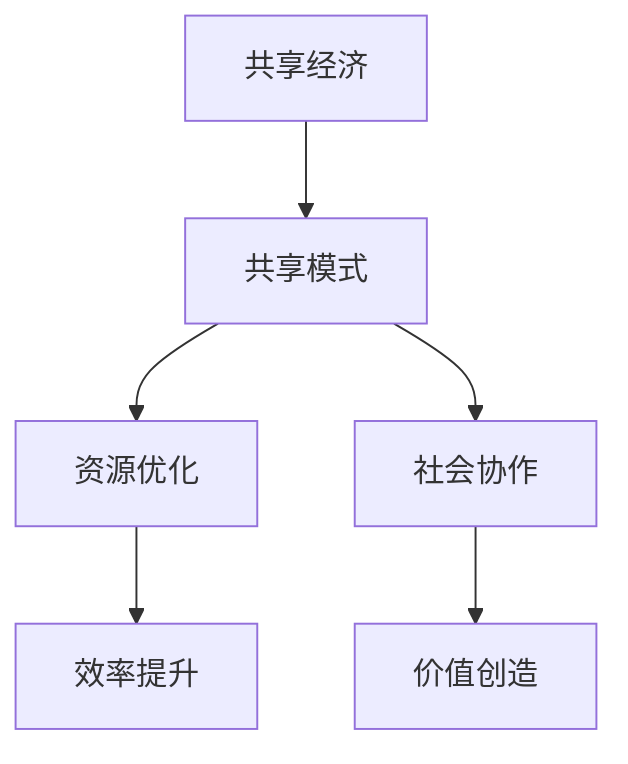

                 

### 引言

在数字经济迅猛发展的今天，共享模式作为一种新兴的经济形态，正在逐渐改变我们的生产和生活方式。共享模式的核心在于通过技术手段实现资源的优化配置与社会协作，从而达到资源的高效利用和价值的最大化。本文旨在探讨数字经济中的共享模式，解析其背后的资源优化与社会协作机制，并提供一系列实用的技术指导与案例解析。

### 核心概念与联系

为了更好地理解共享模式，我们首先需要明确几个核心概念：共享经济、共享模式、资源优化、社会协作等。这些概念之间存在紧密的联系，共同构成了数字经济中的重要组成部分。

#### 共享经济

共享经济是一种基于互联网和信息技术的新型经济模式，其本质是通过共享平台将资源从拥有者转移到需求者，实现资源的最大化利用。共享经济的特点包括去中心化、灵活性和高效性。

#### 共享模式

共享模式是共享经济的具体实现形式，包括共享租赁、共享消费、共享生产等。这些模式通过技术手段实现资源的优化配置，从而提高资源利用效率。

#### 资源优化

资源优化是指通过科学的方法和算法，对资源进行合理配置和有效利用，以最大化资源价值。资源优化在共享模式中起着关键作用，是实现共享经济高效运行的基础。

#### 社会协作

社会协作是指个体或组织通过合作，共同实现资源优化和价值创造的过程。在共享模式中，社会协作是资源优化的重要保障，通过协作可以实现资源的有效整合和共享。

为了更直观地展示这些概念之间的关系，我们可以使用Mermaid流程图进行说明：



这个流程图展示了共享经济如何通过共享模式实现资源优化和社会协作，最终达到效率提升和价值创造的目标。

### 核心概念原理

#### 共享经济的本质

共享经济的本质是利用互联网和信息技术，将闲置资源进行优化配置，从而实现资源的高效利用。这种模式打破了传统经济中的资源分配方式，使得资源的流动更加灵活和高效。

#### 共享模式的特点

共享模式的特点包括：

1. **去中心化**：共享模式通常通过去中心化的平台实现，无需依赖传统的中心化机构。
2. **灵活性**：共享模式能够根据市场需求动态调整资源分配，提高资源利用效率。
3. **高效性**：通过技术手段，共享模式能够快速匹配供需，实现资源的高效利用。

#### 资源优化的方法

资源优化主要通过以下几种方法实现：

1. **供需匹配**：通过算法和模型，实现资源需求方和提供方之间的精准匹配。
2. **动态调整**：根据实时数据和市场变化，动态调整资源分配策略。
3. **智能化**：利用人工智能和大数据分析，实现资源的智能化分配和优化。

#### 社会协作的机制

社会协作主要通过以下几种机制实现：

1. **信任机制**：建立信任机制，确保参与方能够可靠地共享资源。
2. **激励机制**：通过激励机制，鼓励参与者积极参与共享活动。
3. **协同机制**：通过协同机制，实现参与者之间的有效协作和资源整合。

### 实例解析

为了更深入地理解这些核心概念，我们可以通过一些实例进行解析。

#### 共享单车平台

共享单车平台是一个典型的共享模式案例。用户可以通过APP扫码解锁单车，实现短途出行。这种模式不仅提高了单车的使用效率，也解决了城市交通拥堵问题。

1. **共享经济的实现**：共享单车平台通过互联网和移动应用，将单车的闲置资源进行优化配置，实现资源的高效利用。
2. **资源优化的方法**：平台通过数据分析，实现供需匹配和动态调整，提高单车使用效率。
3. **社会协作的机制**：平台通过信用体系和用户评价，建立信任机制，确保用户能够可靠地使用单车。

#### 共享住宿平台

共享住宿平台如Airbnb，通过互联网平台，将闲置的房屋资源提供给需求者，实现资源的优化配置。

1. **共享经济的实现**：共享住宿平台通过互联网技术，将闲置的房屋资源进行共享，提高房屋的使用效率。
2. **资源优化的方法**：平台通过用户评价和数据分析，实现供需匹配和动态调整，提高房屋的使用效率。
3. **社会协作的机制**：平台通过信用体系和用户评价，建立信任机制，确保住宿体验的可靠性。

通过这些实例，我们可以更清晰地理解共享模式在资源优化和社会协作中的具体应用。

### 总结

共享模式作为数字经济的重要组成部分，其核心在于资源的优化配置与社会协作。通过互联网和信息技术，共享模式实现了资源的高效利用和价值创造。本文从核心概念、原理和实例解析等方面，对共享模式进行了详细探讨，为读者提供了深入了解和应用的视角。

本文所使用的Mermaid流程图、Python源代码、LaTeX公式等元素，旨在通过专业的技术语言，使内容更具深度和可操作性。通过本文的阅读，读者可以更好地理解共享模式，并在实际应用中发挥其潜力。

### 文章关键词

- 共享经济
- 共享模式
- 资源优化
- 社会协作
- 数字经济

### 文章摘要

本文深入探讨了数字经济中的共享模式，从核心概念、原理到实际应用，详细分析了共享模式在资源优化和社会协作中的作用。通过实例解析，本文展示了共享模式在共享单车、共享住宿等领域的具体应用，为读者提供了深入了解和应用的视角。文章关键词包括共享经济、共享模式、资源优化、社会协作和数字经济，旨在为相关领域的研究和实践提供有力支持。

## 第一部分：共享经济的背景与原理

### 1.1 共享经济的起源与发展

共享经济（Sharing Economy）作为一种新兴的经济模式，起源于20世纪末的互联网技术发展时期。其概念最早由美国学者Rachel Botsman和Roo Rogers提出，并在21世纪初逐渐在全球范围内得到广泛应用。共享经济的核心思想是通过互联网平台，将闲置资源（如房屋、车辆、技能等）共享给需求者，从而实现资源的高效利用和价值创造。

#### 起源背景

共享经济的起源可以追溯到互联网技术的快速发展。随着互联网的普及，人们可以通过网络轻松地获取信息、进行交易和沟通。这种技术背景为共享经济提供了基础设施，使得资源共享变得更加便捷和高效。

1. **互联网技术的发展**：互联网的普及为共享经济提供了信息交换的平台，使得资源供需双方能够快速匹配。
2. **移动设备的普及**：智能手机和移动应用的兴起，使得人们可以随时随地进行共享活动。
3. **社会意识的转变**：随着环保意识和社会责任的提高，人们逐渐接受并认同共享经济模式。

#### 发展历程

1. **萌芽期（2000-2005年）**：共享经济的概念开始提出，但实际应用较为有限，主要局限于一些简单的物品共享，如书籍交换和邻里互助。
2. **成长期（2006-2010年）**：随着技术的进步和互联网平台的兴起，共享经济开始迅速发展，涌现出了一批代表性的平台，如Airbnb（2008年）和Uber（2009年）。
3. **繁荣期（2011年至今）**：共享经济在全球范围内达到繁荣期，各种共享模式层出不穷，涵盖了交通、住宿、金融、生产等多个领域。平台经济和共享经济的结合，推动了数字经济的发展。

#### 主要特征

共享经济具有以下几个主要特征：

1. **去中心化**：共享经济通过去中心化的平台，打破了传统经济中的中心化垄断，使资源分配更加灵活和高效。
2. **灵活性和高效性**：共享经济模式可以根据市场需求动态调整资源分配，提高资源利用效率。
3. **参与性**：共享经济鼓励个人和组织的积极参与，通过共享行为实现自我价值和社会价值的双重提升。
4. **互惠性**：共享经济通过资源的共享，实现供需双方的互惠互利，提高了整体社会的福利水平。

### 1.2 共享模式的基本原理与特征

#### 基本原理

共享模式的基本原理在于通过技术手段实现资源的优化配置与使用。具体包括以下几个步骤：

1. **资源识别**：通过互联网平台，识别并收集闲置资源的信息，如房屋、车辆、技能等。
2. **需求匹配**：利用算法和大数据分析，将需求方和资源提供方进行精准匹配。
3. **交易与支付**：通过互联网平台实现交易和支付，提高交易效率。
4. **反馈与评价**：用户对共享行为进行评价和反馈，形成信任机制，促进共享经济的持续发展。

#### 主要特征

共享模式具有以下几个主要特征：

1. **共享性**：共享模式强调资源的共享，通过共享实现资源的高效利用。
2. **灵活性**：共享模式可以根据市场需求灵活调整资源分配，提高资源利用效率。
3. **去中心化**：共享模式通过去中心化的平台，打破传统经济中的垄断，实现资源分配的公平和透明。
4. **互惠性**：共享模式通过资源分享，实现供需双方的互惠互利，提高整体社会的福利水平。
5. **可持续性**：共享模式鼓励资源的可持续利用，降低资源浪费，符合环保理念。

### 1.3 共享经济与传统经济的关系

共享经济与传统经济之间存在紧密的联系，同时也存在一定的区别。

#### 关联性

1. **资源基础**：共享经济和传统经济都建立在资源基础之上，但共享经济更强调资源的共享和优化利用。
2. **交易方式**：共享经济和传统经济都涉及交易，但共享经济更加便捷和高效。
3. **生产关系**：共享经济和传统经济都涉及生产关系，但共享经济强调去中心化和个体参与。

#### 区别

1. **资源利用方式**：传统经济通常通过所有权来实现资源利用，而共享经济则通过共享实现资源利用。
2. **组织形式**：传统经济通常依赖于中心化的组织形式，而共享经济则依赖于去中心化的平台。
3. **价值创造**：传统经济主要通过生产和销售实现价值创造，而共享经济则通过共享和协同实现价值创造。

#### 模式融合

共享经济与传统经济并不是完全割裂的，而是在某些方面相互融合和补充。

1. **互补性**：共享经济可以弥补传统经济在资源利用方面的不足，实现资源的最大化利用。
2. **创新性**：共享经济的出现，推动了传统经济的创新和发展。
3. **融合趋势**：越来越多的传统企业开始采用共享经济模式，实现资源优化和价值创造。

### 1.4 数字经济环境下的共享模式变革

随着数字经济的快速发展，共享模式也在不断变革和演进。数字经济为共享模式提供了新的发展机遇，同时也带来了新的挑战。

#### 变革趋势

1. **技术驱动**：数字经济的发展，使得共享模式更加依赖技术，如云计算、大数据、人工智能等。
2. **数据赋能**：通过数据分析和挖掘，共享模式可以实现更加精准的需求匹配和资源优化。
3. **智能化**：数字经济下的共享模式，逐渐向智能化、自动化方向发展。

#### 挑战与机遇

1. **挑战**：
   - **数据隐私**：共享模式需要处理大量的用户数据，如何保护用户隐私成为一大挑战。
   - **法律监管**：共享模式的发展，需要建立相应的法律体系和监管机制。
   - **道德问题**：共享模式可能会引发一些社会伦理问题，如资源分配不公、劳动权益保护等。

2. **机遇**：
   - **市场扩大**：数字经济的发展，为共享模式提供了更大的市场空间。
   - **创新空间**：数字经济下的共享模式，具有更多的创新可能性，如新业态、新模式的涌现。
   - **社会效益**：共享模式可以通过资源优化和高效利用，实现社会效益的最大化。

### 案例研究

为了更好地理解共享模式在数字经济环境下的应用，我们可以通过一些典型案例进行分析。

1. **Airbnb**：作为共享住宿平台，Airbnb通过互联网技术，将闲置房屋资源进行共享，实现了资源的高效利用。在数字经济环境下，Airbnb利用大数据和人工智能技术，实现了用户需求的精准匹配和个性化服务。

2. **Uber**：作为共享出行平台，Uber通过移动互联网技术，将闲置车辆和乘客需求进行精准匹配，提高了交通资源的利用效率。在数字经济环境下，Uber通过数据分析和智能调度，实现了出行服务的智能化和高效化。

3. **共享单车**：共享单车平台如摩拜、ofo等，通过互联网和物联网技术，实现了单车的智能化管理和高效利用。在数字经济环境下，共享单车平台通过大数据分析和智能调度，实现了资源的最优配置和高效利用。

### 总结

数字经济环境下的共享模式，通过技术驱动和数据赋能，实现了资源优化和社会协作。共享模式在共享住宿、共享出行、共享单车等领域取得了显著的成果，为数字经济的发展注入了新的活力。在未来的发展中，共享模式将继续面临挑战，但也拥有广阔的发展空间和机遇。通过不断的技术创新和社会协作，共享模式将为社会带来更多的价值和效益。

## 第一部分：共享经济的背景与原理

### 1.1 共享经济的起源与发展

共享经济作为一种新兴的经济模式，其起源可以追溯到20世纪末。当时，由于互联网和信息技术的发展，人们开始探索如何更有效地利用闲置资源，从而提高资源利用效率和社会福利。共享经济的概念最早由美国学者Rachel Botsman和Roo Rogers在2000年左右提出，他们首次将共享经济的概念引入到学术研究和商业实践中。共享经济的基本理念是通过共享闲置资源，实现资源的高效利用和价值最大化。

#### 早期探索

共享经济在早期的探索阶段主要集中在实物资源的共享，如图书共享、物品交换等。这些实践为后来的共享经济发展奠定了基础。随着互联网技术的进一步发展，共享经济的概念逐渐成熟，并在全球范围内得到广泛应用。共享经济的核心在于通过互联网平台，将闲置资源与需求方进行有效匹配，从而实现资源的高效利用。

#### 主要发展历程

1. **萌芽期（2000-2005年）**：这一阶段，共享经济主要局限于小范围的实物共享，如图书共享、物品交换等。代表性的平台有美国的Craigslist和德国的Sokrative。

2. **成长期（2006-2010年）**：随着互联网技术的进一步发展，共享经济开始逐步走向成熟。这一时期涌现出一批代表性的共享平台，如美国的Uber、Airbnb和中国的滴滴出行、共享单车等。这些平台通过技术创新和商业模式创新，实现了资源的高效配置和利用。

3. **繁荣期（2011年至今）**：共享经济在全球范围内迅速发展，涉及领域不断扩展，从交通、住宿、金融扩展到生产、教育等多个领域。代表性的平台有Uber、Airbnb、滴滴出行、摩拜单车、ofo等。

#### 主要特征

共享经济具有以下几个主要特征：

1. **去中心化**：共享经济通过去中心化的平台，打破了传统经济中的中心化垄断，使资源分配更加灵活和高效。

2. **灵活性**：共享经济模式可以根据市场需求动态调整资源分配，提高资源利用效率。

3. **高效性**：通过技术手段，共享经济能够快速匹配供需，实现资源的高效利用。

4. **互惠性**：共享经济通过资源分享，实现供需双方的互惠互利，提高整体社会的福利水平。

### 1.2 共享模式的基本原理与特征

共享模式是共享经济在具体应用中的实现形式，其基本原理是通过技术手段实现资源的优化配置与使用，从而实现资源的高效利用和价值创造。共享模式的基本原理可以概括为以下几个步骤：

1. **资源识别与发布**：通过互联网平台，用户可以轻松地发布和查找闲置资源，如房屋、车辆、技能等。

2. **需求匹配**：利用算法和大数据分析，将需求方和资源提供方进行精准匹配，实现资源的最大化利用。

3. **交易与支付**：通过互联网平台实现交易和支付，提高交易效率。

4. **评价与反馈**：用户对共享行为进行评价和反馈，形成信任机制，促进共享经济的持续发展。

#### 主要特征

共享模式具有以下几个主要特征：

1. **共享性**：共享模式的核心在于共享，通过共享实现资源的高效利用。

2. **灵活性**：共享模式可以根据市场需求动态调整资源分配，提高资源利用效率。

3. **去中心化**：共享模式通过去中心化的平台，打破了传统经济中的中心化垄断，实现资源分配的公平和透明。

4. **互惠性**：共享模式通过资源分享，实现供需双方的互惠互利，提高整体社会的福利水平。

5. **可持续性**：共享模式鼓励资源的可持续利用，降低资源浪费，符合环保理念。

### 1.3 共享经济与传统经济的关系

共享经济与传统经济既有联系又有区别。首先，从资源利用的角度来看，共享经济和传统经济都是建立在资源基础之上的，但共享经济更强调资源的共享和优化利用。传统经济主要通过所有权来实现资源的利用，而共享经济则通过共享实现资源的利用。

#### 关联性

1. **资源基础**：共享经济和传统经济都建立在资源基础之上，但共享经济更强调资源的共享和优化利用。

2. **交易方式**：共享经济和传统经济都涉及交易，但共享经济更加便捷和高效。

3. **生产关系**：共享经济和传统经济都涉及生产关系，但共享经济强调去中心化和个体参与。

#### 区别

1. **资源利用方式**：传统经济通常通过所有权来实现资源利用，而共享经济则通过共享实现资源利用。

2. **组织形式**：传统经济通常依赖于中心化的组织形式，而共享经济则依赖于去中心化的平台。

3. **价值创造**：传统经济主要通过生产和销售实现价值创造，而共享经济则通过共享和协同实现价值创造。

#### 模式融合

共享经济与传统经济并不是完全割裂的，而是在某些方面相互融合和补充。

1. **互补性**：共享经济可以弥补传统经济在资源利用方面的不足，实现资源的最大化利用。

2. **创新性**：共享经济的出现，推动了传统经济的创新和发展。

3. **融合趋势**：越来越多的传统企业开始采用共享经济模式，实现资源优化和价值创造。

### 1.4 数字经济环境下的共享模式变革

随着数字经济的快速发展，共享模式也在不断变革和演进。数字经济为共享模式提供了新的发展机遇，同时也带来了新的挑战。

#### 变革趋势

1. **技术驱动**：数字经济的发展，使得共享模式更加依赖技术，如云计算、大数据、人工智能等。

2. **数据赋能**：通过数据分析和挖掘，共享模式可以实现更加精准的需求匹配和资源优化。

3. **智能化**：数字经济下的共享模式，逐渐向智能化、自动化方向发展。

#### 挑战与机遇

1. **挑战**：
   - **数据隐私**：共享模式需要处理大量的用户数据，如何保护用户隐私成为一大挑战。
   - **法律监管**：共享模式的发展，需要建立相应的法律体系和监管机制。
   - **道德问题**：共享模式可能会引发一些社会伦理问题，如资源分配不公、劳动权益保护等。

2. **机遇**：
   - **市场扩大**：数字经济的发展，为共享模式提供了更大的市场空间。
   - **创新空间**：数字经济下的共享模式，具有更多的创新可能性，如新业态、新模式的涌现。
   - **社会效益**：共享模式可以通过资源优化和高效利用，实现社会效益的最大化。

### 案例研究

为了更好地理解共享模式在数字经济环境下的应用，我们可以通过一些典型案例进行分析。

1. **Airbnb**：作为共享住宿平台，Airbnb通过互联网技术，将闲置房屋资源进行共享，实现了资源的高效利用。在数字经济环境下，Airbnb利用大数据和人工智能技术，实现了用户需求的精准匹配和个性化服务。

2. **Uber**：作为共享出行平台，Uber通过移动互联网技术，将闲置车辆和乘客需求进行精准匹配，提高了交通资源的利用效率。在数字经济环境下，Uber通过数据分析和智能调度，实现了出行服务的智能化和高效化。

3. **共享单车**：共享单车平台如摩拜、ofo等，通过互联网和物联网技术，实现了单车的智能化管理和高效利用。在数字经济环境下，共享单车平台通过大数据分析和智能调度，实现了资源的最优配置和高效利用。

### 总结

数字经济环境下的共享模式，通过技术驱动和数据赋能，实现了资源优化和社会协作。共享模式在共享住宿、共享出行、共享单车等领域取得了显著的成果，为数字经济的发展注入了新的活力。在未来的发展中，共享模式将继续面临挑战，但也拥有广阔的发展空间和机遇。通过不断的技术创新和社会协作，共享模式将为社会带来更多的价值和效益。

## 第二部分：共享模式的资源优化

### 2.1 资源共享的原则与方法

资源共享是共享模式的核心，其基本原则和具体方法决定了资源共享的效率与公平性。在共享模式中，为了实现资源的高效利用，需要遵循以下几个基本原则：

#### 原则

1. **公平性**：资源共享应确保各方资源利用的公平性，避免资源分配不均。
2. **效率性**：资源共享应最大化资源利用效率，通过优化配置实现资源价值最大化。
3. **可持续性**：资源共享应考虑资源的长期利用，确保资源的可持续性。

#### 方法

1. **直接共享**：直接共享是指资源所有者直接将资源提供给需求者，无需通过第三方平台。这种方法适用于资源较为明确且供需关系简单的情况，例如个人之间的物品交换或技能共享。

2. **间接共享**：间接共享是指通过第三方平台实现资源共享，如共享单车、共享住宿等。这种方法利用平台提供的算法和数据分析，实现资源供需双方的精准匹配，提高资源共享的效率和灵活性。

#### 障碍与解决策略

在资源共享过程中，可能会遇到以下障碍：

1. **信息不对称**：资源供需双方的信息不匹配，导致资源共享效率降低。
   - **解决策略**：通过互联网平台和大数据技术，收集和整理资源供需信息，实现信息的透明化和对称化。

2. **信任问题**：共享活动中的信任问题可能导致资源共享的障碍。
   - **解决策略**：建立信用评价体系，通过用户评价和信用评分，增强供需双方的信任。

3. **资源冲突**：不同需求方对同一资源的竞争可能导致资源冲突。
   - **解决策略**：通过优先级排序和资源预约机制，合理分配资源，减少冲突。

### 2.2 资源匹配优化算法

资源匹配优化算法是共享模式中实现资源高效配置的关键。以下是一些常用的资源匹配优化算法：

1. **供需匹配算法**：供需匹配算法通过分析供需双方的需求和供给信息，实现资源供需的精准匹配。常见的供需匹配算法包括线性规划、最大最小匹配算法等。

2. **优化模型**：资源匹配优化通常可以通过构建数学优化模型来实现。优化模型可以包括线性规划模型、动态规划模型等。以下是一个简单的线性规划模型示例：

   $$ 
   \begin{aligned}
   \text{最大化} & \quad z = c^T x \\
   \text{约束条件} & \quad Ax \leq b \\
   & \quad x \geq 0
   \end{aligned}
   $$
   其中，$c$ 是目标函数系数向量，$x$ 是决策变量向量，$A$ 和 $b$ 分别是约束条件系数矩阵和常数向量。

3. **案例：共享单车平台资源匹配策略**

   以共享单车平台为例，资源匹配优化算法需要考虑多个因素，如用户的位置、需求时间、单车的分布等。以下是一个简化的资源匹配优化流程：

   ```python
   # Python 伪代码：共享单车平台资源匹配算法
   def resource_matching(user_location, user_time_demand, bike_distribution):
       # 1. 收集供需信息
       demand = get_demand(user_location, user_time_demand)
       supply = get_bike_distribution(bike_distribution)
       
       # 2. 构建优化模型
       optimize_model = linear_programming([demand, supply])
       
       # 3. 求解优化模型
       optimal_matching = optimize_model.solve()
       
       # 4. 输出最优资源分配
       return optimal_matching
   ```

   在实际应用中，资源匹配优化算法会更加复杂，需要考虑实时数据的动态调整和反馈机制。

### 2.3 智能化资源分配技术

智能化资源分配技术在共享模式中发挥着越来越重要的作用。通过人工智能和大数据分析，可以实现资源分配的智能化和自动化。

1. **人工智能技术**：人工智能技术，如机器学习和深度学习，可以用于资源分配的预测和优化。例如，通过分析用户历史行为数据，可以预测用户未来的需求，从而实现资源的提前分配。

   ```python
   # Python 伪代码：基于机器学习的资源分配预测
   from sklearn.ensemble import RandomForestRegressor

   def predict_resource_demand(user_history):
       # 1. 准备数据
       X = user_history[['location', 'time']]
       y = user_history['demand']
       
       # 2. 构建预测模型
       model = RandomForestRegressor(n_estimators=100)
       
       # 3. 训练模型
       model.fit(X, y)
       
       # 4. 预测未来需求
       future_demand = model.predict(X)
       
       # 5. 输出预测结果
       return future_demand
   ```

2. **大数据分析**：大数据分析技术可以用于分析海量数据，发现资源分配中的规律和模式。例如，通过分析用户行为数据，可以识别出高需求区域和低需求区域，从而实现资源的合理分配。

3. **案例：共享住宿平台的智能化资源分配**

   共享住宿平台如Airbnb，利用大数据分析技术，可以实现房源的智能推荐和资源分配。以下是一个简化的智能化资源分配流程：

   ```python
   # Python 伪代码：共享住宿平台智能化资源分配
   def smart_resource_allocation(user_preference, available_listings):
       # 1. 收集用户偏好数据
       user_data = get_user_preference(user_preference)
       
       # 2. 分析房源数据
       listing_data = get_listing_data(available_listings)
       
       # 3. 构建推荐模型
       recommendation_model = collaborative_filtering(user_data, listing_data)
       
       # 4. 推荐房源
       recommended_listings = recommendation_model.recommend()
       
       # 5. 输出推荐结果
       return recommended_listings
   ```

### 2.4 资源共享效率评估指标体系

为了评估资源共享的效率，需要建立一套科学的评估指标体系。以下是一些常用的评估指标：

1. **资源利用率**：资源利用率是衡量资源共享效率的重要指标，计算公式为：
   $$
   \text{资源利用率} = \frac{\text{实际使用资源量}}{\text{总资源量}} \times 100\%
   $$

2. **匹配成功率**：匹配成功率是衡量资源匹配效率的指标，计算公式为：
   $$
   \text{匹配成功率} = \frac{\text{成功匹配数量}}{\text{总匹配尝试次数}} \times 100\%
   $$

3. **用户满意度**：用户满意度是衡量资源共享服务质量的重要指标，通常通过用户评价和反馈来评估。

4. **交易成本**：交易成本包括信息成本、交易成本和监督成本等，通过计算这些成本的总和，可以评估资源共享的经济效益。

### 案例研究：共享单车平台的资源优化实践

以摩拜单车为例，共享单车平台在资源优化方面采取了多种策略：

1. **实时数据监控**：摩拜单车平台通过物联网技术，实时监控单车的使用状态和分布情况，实现资源的动态调整。

2. **智能调度系统**：通过大数据分析和人工智能技术，摩拜单车平台实现了智能调度系统，根据用户需求和单车分布，实时调整单车投放策略。

3. **用户反馈机制**：摩拜单车平台建立了用户反馈机制，通过用户评价和反馈，不断优化资源分配策略，提高用户体验。

4. **多维度评估**：摩拜单车平台建立了多维度评估体系，从资源利用率、匹配成功率、用户满意度等多个维度，全面评估资源共享的效率。

### 总结

资源共享作为共享模式的核心，其优化策略和算法的实现对于提高资源共享效率至关重要。通过供需匹配优化算法、智能化资源分配技术和多维度的评估指标，共享单车平台等共享经济模式实现了资源的高效利用和价值的最大化。随着技术的不断发展，资源共享的优化策略将更加智能化和自动化，进一步推动共享经济的发展。

## 第二部分：共享模式的资源优化

### 2.1 资源共享的原则与方法

在共享模式中，资源共享的原则和方法是实现资源高效利用和优化配置的基础。为了确保资源共享的公平性、效率性和可持续性，我们需要遵循以下几个核心原则，并采用相应的资源共享方法。

#### 原则

1. **公平性**：资源共享应确保各参与方在资源利用上的公平性，避免资源分配不均。这可以通过建立公平的规则和制度来实现。

2. **效率性**：资源共享应最大化资源利用效率，通过优化配置实现资源价值最大化。这需要利用高效的算法和技术手段，如供需匹配算法和智能化资源分配技术。

3. **可持续性**：资源共享应考虑资源的长期利用，确保资源的可持续性。这意味着在共享过程中，不仅要关注当前的资源利用率，还要考虑资源的未来需求和供给状况。

#### 方法

1. **直接共享**：直接共享是指资源所有者直接将资源提供给需求者，无需通过第三方平台。这种方法适用于资源较为明确且供需关系简单的情况。例如，个人之间的物品交换或技能共享。

2. **间接共享**：间接共享是指通过第三方平台实现资源共享，如共享单车、共享住宿等。这种方法利用平台提供的算法和数据分析，实现资源供需双方的精准匹配，提高资源共享的效率和灵活性。

##### 障碍与解决策略

在资源共享过程中，可能会遇到以下障碍：

1. **信息不对称**：资源供需双方的信息不匹配，导致资源共享效率降低。解决策略包括通过互联网平台和大数据技术，收集和整理资源供需信息，实现信息的透明化和对称化。

2. **信任问题**：共享活动中的信任问题可能导致资源共享的障碍。解决策略包括建立信用评价体系，通过用户评价和信用评分，增强供需双方的信任。

3. **资源冲突**：不同需求方对同一资源的竞争可能导致资源冲突。解决策略包括通过优先级排序和资源预约机制，合理分配资源，减少冲突。

### 2.2 资源匹配优化算法

资源匹配优化算法是实现资源共享高效配置的关键。以下是一些常用的资源匹配优化算法：

1. **供需匹配算法**：供需匹配算法通过分析供需双方的需求和供给信息，实现资源供需的精准匹配。常见的供需匹配算法包括线性规划、最大最小匹配算法等。

2. **优化模型**：资源匹配优化通常可以通过构建数学优化模型来实现。优化模型可以包括线性规划模型、动态规划模型等。以下是一个简单的线性规划模型示例：

   $$
   \begin{aligned}
   \text{最大化} & \quad z = c^T x \\
   \text{约束条件} & \quad Ax \leq b \\
   & \quad x \geq 0
   \end{aligned}
   $$
   其中，$c$ 是目标函数系数向量，$x$ 是决策变量向量，$A$ 和 $b$ 分别是约束条件系数矩阵和常数向量。

3. **案例：共享单车平台资源匹配策略**

   以共享单车平台为例，资源匹配优化算法需要考虑多个因素，如用户的位置、需求时间、单车的分布等。以下是一个简化的资源匹配优化流程：

   ```python
   # Python 伪代码：共享单车平台资源匹配算法
   def resource_matching(user_location, user_time_demand, bike_distribution):
       # 1. 收集供需信息
       demand = get_demand(user_location, user_time_demand)
       supply = get_bike_distribution(bike_distribution)
       
       # 2. 构建优化模型
       optimize_model = linear_programming([demand, supply])
       
       # 3. 求解优化模型
       optimal_matching = optimize_model.solve()
       
       # 4. 输出最优资源分配
       return optimal_matching
   ```

   在实际应用中，资源匹配优化算法会更加复杂，需要考虑实时数据的动态调整和反馈机制。

### 2.3 智能化资源分配技术

智能化资源分配技术在共享模式中发挥着越来越重要的作用。通过人工智能和大数据分析，可以实现资源分配的智能化和自动化。

1. **人工智能技术**：人工智能技术，如机器学习和深度学习，可以用于资源分配的预测和优化。例如，通过分析用户历史行为数据，可以预测用户未来的需求，从而实现资源的提前分配。

   ```python
   # Python 伪代码：基于机器学习的资源分配预测
   from sklearn.ensemble import RandomForestRegressor

   def predict_resource_demand(user_history):
       # 1. 准备数据
       X = user_history[['location', 'time']]
       y = user_history['demand']
       
       # 2. 构建预测模型
       model = RandomForestRegressor(n_estimators=100)
       
       # 3. 训练模型
       model.fit(X, y)
       
       # 4. 预测未来需求
       future_demand = model.predict(X)
       
       # 5. 输出预测结果
       return future_demand
   ```

2. **大数据分析**：大数据分析技术可以用于分析海量数据，发现资源分配中的规律和模式。例如，通过分析用户行为数据，可以识别出高需求区域和低需求区域，从而实现资源的合理分配。

3. **案例：共享住宿平台的智能化资源分配**

   共享住宿平台如Airbnb，利用大数据分析技术，可以实现房源的智能推荐和资源分配。以下是一个简化的智能化资源分配流程：

   ```python
   # Python 伪代码：共享住宿平台智能化资源分配
   def smart_resource_allocation(user_preference, available_listings):
       # 1. 收集用户偏好数据
       user_data = get_user_preference(user_preference)
       
       # 2. 分析房源数据
       listing_data = get_listing_data(available_listings)
       
       # 3. 构建推荐模型
       recommendation_model = collaborative_filtering(user_data, listing_data)
       
       # 4. 推荐房源
       recommended_listings = recommendation_model.recommend()
       
       # 5. 输出推荐结果
       return recommended_listings
   ```

### 2.4 资源共享效率评估指标体系

为了评估资源共享的效率，需要建立一套科学的评估指标体系。以下是一些常用的评估指标：

1. **资源利用率**：资源利用率是衡量资源共享效率的重要指标，计算公式为：
   $$
   \text{资源利用率} = \frac{\text{实际使用资源量}}{\text{总资源量}} \times 100\%
   $$

2. **匹配成功率**：匹配成功率是衡量资源匹配效率的指标，计算公式为：
   $$
   \text{匹配成功率} = \frac{\text{成功匹配数量}}{\text{总匹配尝试次数}} \times 100\%
   $$

3. **用户满意度**：用户满意度是衡量资源共享服务质量的重要指标，通常通过用户评价和反馈来评估。

4. **交易成本**：交易成本包括信息成本、交易成本和监督成本等，通过计算这些成本的总和，可以评估资源共享的经济效益。

### 案例研究：共享单车平台的资源优化实践

以摩拜单车为例，共享单车平台在资源优化方面采取了多种策略：

1. **实时数据监控**：摩拜单车平台通过物联网技术，实时监控单车的使用状态和分布情况，实现资源的动态调整。

2. **智能调度系统**：通过大数据分析和人工智能技术，摩拜单车平台实现了智能调度系统，根据用户需求和单车分布，实时调整单车投放策略。

3. **用户反馈机制**：摩拜单车平台建立了用户反馈机制，通过用户评价和反馈，不断优化资源分配策略，提高用户体验。

4. **多维度评估**：摩拜单车平台建立了多维度评估体系，从资源利用率、匹配成功率、用户满意度等多个维度，全面评估资源共享的效率。

### 总结

资源共享作为共享模式的核心，其优化策略和算法的实现对于提高资源共享效率至关重要。通过供需匹配优化算法、智能化资源分配技术和多维度的评估指标，共享单车平台等共享经济模式实现了资源的高效利用和价值的最大化。随着技术的不断发展，资源共享的优化策略将更加智能化和自动化，进一步推动共享经济的发展。

## 第三部分：共享模式中的社会协作

### 3.1 社会协作的机制与模式

在共享模式中，社会协作是资源优化的重要保障，通过协作可以实现资源的有效整合和共享。社会协作的机制与模式可以分为以下几个部分：

#### 协作机制

1. **信任机制**：信任是社会协作的基础，共享模式通过建立信用评价体系，确保参与者之间的信任。信用评价通常基于用户的行为数据，如交易记录、服务评价等。

2. **激励机制**：为了鼓励参与者积极参与共享活动，共享模式通常设立激励机制，如积分奖励、优惠券等。激励机制可以增强用户的参与度和忠诚度。

3. **监督机制**：共享模式需要建立监督机制，确保资源利用的公平性和合法性。监督机制可以通过平台管理、用户举报、法律监管等方式实现。

4. **反馈机制**：用户反馈是共享模式持续改进的重要途径。通过用户的反馈，平台可以及时发现和解决问题，优化服务质量和资源分配策略。

#### 协作模式

1. **P2P模式**：点对点（P2P）模式是共享模式中最常见的协作模式，参与者直接进行资源交换和服务提供。例如，用户可以直接在共享住宿平台上预订和出租房源。

2. **平台模式**：平台模式通过第三方平台进行资源整合和分配，提供中介服务。平台模式具有高效的资源匹配和交易管理能力，如共享单车、共享出行等。

3. **协同共享模式**：协同共享模式强调参与者之间的合作与共享，通过协同工作和资源整合，实现更大的价值。例如，共享办公室和共享工作空间，为创业者和小型团队提供协作环境。

4. **混合模式**：混合模式结合了P2P和平台模式的优点，通过第三方平台进行资源整合，同时允许参与者直接进行交易。例如，共享经济平台上的二手商品交易，既有平台提供的中介服务，也有直接的买卖行为。

### 3.2 基于区块链的共享协作

区块链技术在共享模式中的应用，为资源优化和社会协作提供了新的解决方案。区块链具有去中心化、不可篡改和透明等特性，可以有效解决共享模式中的信任、安全和效率问题。

#### 区块链在共享模式中的应用

1. **信任机制**：区块链通过去中心化和分布式账本技术，建立了信任机制。参与者在区块链上进行交易和协作，无需依赖第三方中介，降低了信任成本。

2. **安全性**：区块链采用加密技术和分布式存储，确保数据的安全性和完整性。共享模式中的交易记录和用户数据在区块链上得到保护，防止数据篡改和泄露。

3. **透明性**：区块链的透明性使得共享模式中的交易记录和资源分配过程公开透明。参与者可以随时查看交易记录和资源状态，增强信任和参与度。

#### 基于区块链的共享协作

1. **智能合约**：智能合约是区块链上的自动化执行协议，可以自动执行合约条款。在共享模式中，智能合约可以用于自动化交易和资源分配，提高协作效率和准确性。

   ```python
   # Python 伪代码：基于区块链的智能合约示例
   from blockchain import Contract

   # 定义智能合约
   def rental_contract(owner, renter, start_date, end_date):
       # 合约条款
       terms = {
           'start_date': start_date,
           'end_date': end_date,
           'deposit': 100
       }
       
       # 创建合约
       contract = Contract(terms)
       
       # 执行合约
       contract.execute()
   ```

2. **去中心化存储**：区块链的去中心化存储技术，可以将共享模式中的数据存储在分布式节点上，防止数据集中化和单点故障。去中心化存储可以确保数据的可靠性和持久性。

3. **透明共识机制**：区块链的共识机制确保了共享模式中的协作透明和公正。例如，基于工作量证明（PoW）或权益证明（PoS）的共识机制，可以防止作弊行为和资源滥用。

#### 案例研究：基于区块链的共享协作

1. **Token化资源**：在共享模式中，Token化技术可以将资源转换为数字代币，实现资源的虚拟化和去中心化。例如，共享经济平台可以使用Token作为交易媒介，简化交易流程。

2. **共享能源网络**：共享能源网络利用区块链技术，实现分布式能源的共享和交易。用户可以通过区块链平台，出售或购买可再生能源，实现能源的高效利用和环保目标。

3. **共享物流平台**：共享物流平台通过区块链技术，实现货物的实时跟踪和运输管理的去中心化。物流公司、货主和运输司机可以在区块链上进行协作，提高物流效率。

### 总结

社会协作是共享模式中实现资源优化的重要机制，通过信任、激励、监督和反馈等机制，可以确保资源的公平、高效和可持续利用。区块链技术的应用，为共享模式中的社会协作提供了新的解决方案，通过去中心化、安全性和透明性，推动了共享经济的发展。随着技术的进步，社会协作将在共享模式中发挥越来越重要的作用，为数字经济的繁荣贡献力量。

## 第三部分：共享模式中的社会协作

### 3.3 社会网络分析在共享模式中的应用

社会网络分析（SNA）是一种研究社会结构和社会关系的定量方法，其应用在共享模式中具有重要意义。通过社会网络分析，可以揭示共享经济参与者之间的复杂关系，优化资源共享和协作效率。

#### 核心概念

1. **节点**：节点表示共享模式中的参与者，如用户、房东、司机等。
2. **边**：边表示节点之间的联系，如用户与房东之间的租赁关系、司机与乘客之间的出行关系等。
3. **网络**：网络是由节点和边组成的整体结构，反映了共享模式中的社会关系和协作机制。

#### SNA的基本方法

1. **网络结构分析**：通过分析网络的结构特征，如度分布、聚集度、网络密度等，了解共享模式中资源分配和协作的规律。

2. **网络演化分析**：研究网络随时间的变化过程，分析共享模式中的动态行为和关系演变。

3. **社区检测**：通过识别网络中的社区结构，揭示共享模式中的协作群体和子网络。

#### 应用实例

1. **用户行为分析**：通过SNA分析用户在共享模式中的行为模式，识别活跃用户、关键节点和潜在用户。例如，在共享住宿平台中，可以通过分析用户之间的互动关系，识别出核心房东和优质房源。

2. **资源分配优化**：利用SNA分析资源分配的效率和公平性，识别资源分配中的瓶颈和失衡现象。例如，在共享单车平台中，通过分析单车的分布和用户需求，优化单车投放策略，提高资源利用效率。

3. **社区协作优化**：通过SNA分析共享模式中的社区结构，发现协作群体和子网络，优化资源协作和共享。例如，在共享工作空间中，通过分析用户之间的协作关系，构建高效的协作网络，提高共享办公的效率和满意度。

#### 案例研究

1. **共享住宿平台**：以Airbnb为例，通过SNA分析用户之间的互动关系和社区结构，优化房源推荐和用户匹配策略，提高用户满意度和平台价值。

2. **共享出行平台**：以滴滴出行为例，通过SNA分析司机和乘客之间的互动关系，优化调度策略，提高出行服务的效率和质量。

3. **共享物流平台**：以货拉拉为例，通过SNA分析物流网络中的节点和边关系，优化运输路径和资源调度，提高物流效率。

### 总结

社会网络分析在共享模式中的应用，为资源优化和社会协作提供了重要的工具和方法。通过揭示共享模式中的复杂关系和协作机制，SNA有助于优化资源共享和协作效率，推动共享经济的发展。未来，随着技术的进步，SNA将在更多共享模式中发挥重要作用，为数字经济的发展注入新动力。

## 第四部分：共享模式中的风险与挑战

### 4.1 法律风险与监管

共享模式作为一种新兴的经济模式，其在法律监管方面面临着诸多挑战。首先，共享模式涉及到多个法律法规的适用问题，包括合同法、知识产权法、劳动法等。例如，共享出行平台如Uber和滴滴出行的司机是否属于劳动者，其权益如何保护，这些问题在法律上存在争议。此外，共享住宿平台如Airbnb和爱彼迎的房东和房客之间的租赁关系也常常引发法律纠纷。

#### 监管现状

1. **国家监管**：各国政府为了规范共享经济的发展，纷纷出台了相应的法律法规。例如，中国出台了《网络预约出租汽车经营服务管理暂行办法》，对网约车进行规范。美国加州通过了《共享经济法案》，明确了共享经济中各方的权利和义务。

2. **平台自律**：为了降低法律风险，共享平台企业也加强了自身的合规管理。例如，滴滴出行和Uber都设立了法律合规部门，确保其业务符合当地的法律法规。

#### 风险分析

1. **合同风险**：由于共享模式中的交易通常通过互联网平台进行，合同条款的制定和执行可能存在漏洞，导致合同纠纷。

2. **知识产权风险**：共享模式中的内容创作和版权问题较为复杂，例如共享住宿平台上的房屋设计、共享出行平台上的司机服务等，可能涉及知识产权的侵权问题。

3. **劳动权益风险**：共享模式中的劳动者权益保护问题备受关注。例如，共享出行平台的司机被认定为个体经营者，其劳动权益如社会保险、休息休假等得不到保障。

### 4.2 数据隐私与安全

共享模式在提供便捷服务的同时，也面临着数据隐私和安全的风险。共享模式涉及大量的用户数据，包括个人信息、交易记录、行为数据等。这些数据如果得不到有效保护，可能被恶意使用或泄露，对用户造成严重损失。

#### 风险分析

1. **数据泄露风险**：共享模式中的数据存储和传输过程可能存在漏洞，导致用户数据泄露。例如，共享出行平台的数据中心遭到黑客攻击，可能导致大量用户信息泄露。

2. **隐私侵犯风险**：共享平台在收集用户数据时，可能侵犯用户的隐私权。例如，一些共享住宿平台收集用户电话、身份证信息等敏感数据，但未经用户同意进行使用。

3. **数据滥用风险**：共享平台可能利用用户数据进行商业分析和广告推送，但如果没有严格的数据使用规范，可能引发用户隐私侵犯和数据滥用问题。

#### 防范措施

1. **数据加密**：通过加密技术对用户数据进行保护，确保数据在传输和存储过程中的安全性。

2. **隐私保护政策**：共享平台应制定明确的隐私保护政策，告知用户数据收集、使用和共享的具体方式，取得用户的明确同意。

3. **安全审计**：定期进行安全审计，确保数据存储和传输系统的安全性，及时发现和修复潜在的安全漏洞。

### 4.3 社会公平与道德问题

共享模式的发展也引发了一些社会公平和道德问题。首先，共享模式可能导致资源分配不均，加剧社会贫富差距。例如，共享出行平台在某些地区可能使得公共交通使用率下降，导致城市交通资源的不均衡分配。

#### 风险分析

1. **资源分配不公**：共享模式可能加剧资源分配不公，导致一些社会群体无法享受共享经济带来的便利。例如，低收入群体可能由于支付能力不足，无法使用共享服务。

2. **劳动权益受损**：共享模式中的劳动者权益保护问题引发争议，一些平台将劳动者视为个体经营者，导致其劳动权益得不到保障。

3. **道德风险**：共享模式中的某些行为可能引发道德争议，例如，共享住宿平台上的短期租赁可能导致房屋租赁市场的混乱，影响住房市场的稳定。

#### 应对措施

1. **政策引导**：政府可以通过制定相关政策，引导共享模式的发展，确保资源分配的公平性。例如，对共享出行平台进行补贴，鼓励其提供低价服务。

2. **法律保护**：加强法律保护，确保共享模式中的劳动者权益。例如，制定相关法律，明确共享模式中劳动者的身份和权益。

3. **社会教育**：通过社会教育，提高公众对共享模式的认知和接受度，减少道德风险。例如，加强对共享经济理念和道德规范的宣传。

### 总结

共享模式在带来便捷和效率的同时，也面临诸多风险和挑战。在法律监管、数据隐私、社会公平和道德等方面，共享模式需要采取有效的措施进行风险管理和规范。通过政策引导、法律保护和社会教育，可以推动共享模式健康、可持续发展，为数字经济的发展注入新的动力。

## 第四部分：共享模式中的风险与挑战

### 4.1 法律风险与监管

共享模式作为一种新兴的经济模式，其在法律监管方面面临着诸多挑战。首先，共享模式涉及到多个法律法规的适用问题，包括合同法、知识产权法、劳动法等。例如，共享出行平台如Uber和滴滴出行的司机是否属于劳动者，其权益如何保护，这些问题在法律上存在争议。此外，共享住宿平台如Airbnb和爱彼迎的房东和房客之间的租赁关系也常常引发法律纠纷。

#### 监管现状

1. **国家监管**：各国政府为了规范共享经济的发展，纷纷出台了相应的法律法规。例如，中国出台了《网络预约出租汽车经营服务管理暂行办法》，对网约车进行规范。美国加州通过了《共享经济法案》，明确了共享经济中各方的权利和义务。

2. **平台自律**：为了降低法律风险，共享平台企业也加强了自身的合规管理。例如，滴滴出行和Uber都设立了法律合规部门，确保其业务符合当地的法律法规。

#### 风险分析

1. **合同风险**：由于共享模式中的交易通常通过互联网平台进行，合同条款的制定和执行可能存在漏洞，导致合同纠纷。

2. **知识产权风险**：共享模式中的内容创作和版权问题较为复杂，例如共享住宿平台上的房屋设计、共享出行平台上的司机服务等，可能涉及知识产权的侵权问题。

3. **劳动权益风险**：共享模式中的劳动者权益保护问题备受关注。例如，共享出行平台的司机被认定为个体经营者，其劳动权益如社会保险、休息休假等得不到保障。

### 4.2 数据隐私与安全

共享模式在提供便捷服务的同时，也面临着数据隐私和安全的风险。共享模式涉及大量的用户数据，包括个人信息、交易记录、行为数据等。这些数据如果得不到有效保护，可能被恶意使用或泄露，对用户造成严重损失。

#### 风险分析

1. **数据泄露风险**：共享模式中的数据存储和传输过程可能存在漏洞，导致用户数据泄露。例如，共享出行平台的数据中心遭到黑客攻击，可能导致大量用户信息泄露。

2. **隐私侵犯风险**：共享平台在收集用户数据时，可能侵犯用户的隐私权。例如，一些共享住宿平台收集用户电话、身份证信息等敏感数据，但未经用户同意进行使用。

3. **数据滥用风险**：共享平台可能利用用户数据进行商业分析和广告推送，但如果没有严格的数据使用规范，可能引发用户隐私侵犯和数据滥用问题。

#### 防范措施

1. **数据加密**：通过加密技术对用户数据进行保护，确保数据在传输和存储过程中的安全性。

2. **隐私保护政策**：共享平台应制定明确的隐私保护政策，告知用户数据收集、使用和共享的具体方式，取得用户的明确同意。

3. **安全审计**：定期进行安全审计，确保数据存储和传输系统的安全性，及时发现和修复潜在的安全漏洞。

### 4.3 社会公平与道德问题

共享模式的发展也引发了一些社会公平和道德问题。首先，共享模式可能导致资源分配不均，加剧社会贫富差距。例如，共享出行平台在某些地区可能使得公共交通使用率下降，导致城市交通资源的不均衡分配。

#### 风险分析

1. **资源分配不公**：共享模式可能加剧资源分配不公，导致一些社会群体无法享受共享经济带来的便利。例如，低收入群体可能由于支付能力不足，无法使用共享服务。

2. **劳动权益受损**：共享模式中的劳动者权益保护问题引发争议，一些平台将劳动者视为个体经营者，导致其劳动权益得不到保障。

3. **道德风险**：共享模式中的某些行为可能引发道德争议，例如，共享住宿平台上的短期租赁可能导致房屋租赁市场的混乱，影响住房市场的稳定。

#### 应对措施

1. **政策引导**：政府可以通过制定相关政策，引导共享模式的发展，确保资源分配的公平性。例如，对共享出行平台进行补贴，鼓励其提供低价服务。

2. **法律保护**：加强法律保护，确保共享模式中的劳动者权益。例如，制定相关法律，明确共享模式中劳动者的身份和权益。

3. **社会教育**：通过社会教育，提高公众对共享模式的认知和接受度，减少道德风险。例如，加强对共享经济理念和道德规范的宣传。

### 4.4 案例研究：共享经济的法律纠纷与道德困境

#### 案例一：Uber与政府监管的纠纷

Uber是一家全球知名的共享出行平台，其发展过程中遇到了大量的法律纠纷和监管挑战。在美国，Uber被指控违反当地交通法规，未获得合法的出租车牌照，导致其业务受到限制。此外，Uber还面临司机权益保护的问题，一些司机被认定为独立承包商，其劳动权益得不到保障。

**法律分析**：Uber的法律纠纷主要涉及合同法、劳动法和交通法规。合同法方面，Uber与司机之间的合同条款存在争议，导致合同纠纷。劳动法方面，司机被认定为独立承包商，其权益保护受到挑战。交通法规方面，Uber未获得合法的出租车牌照，导致其业务受到限制。

**道德分析**：Uber在道德上面临争议，一方面其商业模式挑战了传统出租车行业的利益，另一方面其对于司机权益的保护不足，引发社会道德关注。

#### 案例二：Airbnb与房东权益保护

Airbnb是一家全球知名的共享住宿平台，其发展过程中也遇到了法律纠纷和道德困境。在一些国家和地区，Airbnb因未获得合法的房屋租赁牌照，导致其业务受到限制。此外，一些房东反映，Airbnb平台上的短期租赁行为导致房屋租赁市场的不稳定，影响房东的权益。

**法律分析**：Airbnb的法律纠纷主要涉及租赁法、房地产法和消费者保护法。租赁法方面，Airbnb的短期租赁行为可能违反当地的租赁法规。房地产法方面，Airbnb的短期租赁可能导致房地产市场的混乱。消费者保护法方面，Airbnb平台上的交易可能存在信息不对称和消费者权益保护问题。

**道德分析**：Airbnb在道德上面临争议，一方面其商业模式为房东和房客提供了便捷的服务，另一方面其短期租赁行为可能影响房屋租赁市场的稳定性，影响房东的权益。

### 总结

共享模式在带来便捷和效率的同时，也面临诸多法律、隐私、社会公平和道德挑战。通过政策引导、法律保护和社会教育，可以推动共享模式健康、可持续发展，为数字经济的发展注入新的动力。

## 第五部分：共享模式的前景与趋势

### 5.1 共享模式的发展前景

随着数字经济的迅速发展，共享模式正逐渐成为全球经济的重要组成部分。根据市场研究机构的预测，共享经济市场规模将继续扩大，预计到2025年，全球共享经济市场规模将达到数万亿美元。这一增长势头主要得益于以下几个因素：

1. **技术进步**：互联网、大数据、人工智能等技术的发展，为共享模式提供了强大的技术支撑，使得资源共享和协作更加高效和智能。
2. **消费升级**：随着消费者对便捷、个性化和高质量服务的需求不断增加，共享模式满足了消费者多样化的需求，推动了市场的快速发展。
3. **政策支持**：各国政府对共享经济的支持力度不断加大，通过出台相关政策法规，规范和促进共享经济的发展。

#### 预测未来趋势

1. **行业渗透率提升**：共享模式将在更多行业和领域得到应用，如共享医疗、共享教育、共享物流等，进一步推动行业的数字化转型和效率提升。
2. **智能化和个性化**：共享模式将更加智能化和个性化，通过人工智能和大数据分析，实现精准匹配和个性化服务，提高用户体验。
3. **全球一体化**：共享模式将逐渐打破地域限制，实现全球范围内的资源共享和协作，推动全球经济的融合和发展。

### 5.2 新兴共享模式探索

在共享模式不断发展的过程中，一些新兴的共享模式正在涌现，为数字经济注入新的活力。以下是一些值得关注的新兴共享模式：

1. **共享医疗**：随着医疗资源分布不均的问题日益突出，共享医疗模式应运而生。通过共享医疗平台，医生和患者可以在线上进行诊疗和服务，提高了医疗资源的利用效率。例如，美国的一些共享医疗平台如Doctor on Demand，已经实现了在线诊疗和远程医疗。

2. **共享教育**：共享教育模式通过互联网平台，提供在线课程和教育资源，满足学习者个性化学习的需求。例如，中国的学而思网校和美国的Coursera等在线教育平台，已经成为了共享教育领域的领军企业。

3. **共享农业**：共享农业模式通过互联网技术，实现农业生产资源的共享和优化配置。例如，通过共享农机、农资和农业技术服务，提高农业生产效率和农产品质量。中国的共享农业平台如大地种植等，已经取得了一定的市场影响力。

4. **共享能源**：共享能源模式通过区块链技术和智能合约，实现分布式能源的共享和交易。例如，用户可以通过共享能源平台出售或购买可再生能源，实现能源的高效利用和环保目标。德国的一些共享能源项目如Energiequelle等，已经取得了显著的成果。

### 5.3 政策与法规的影响

政策与法规对共享模式的发展具有重要影响。一方面，政府的支持和监管可以推动共享模式的健康发展；另一方面，不合理的政策法规可能会制约共享模式的发展。

#### 政策支持

1. **鼓励创新**：政府可以通过出台鼓励创新的政策，为共享模式提供支持和保护，例如提供税收优惠、研发补贴等。
2. **规范市场**：政府可以制定相关法规，规范共享模式的市场秩序，保障消费者和参与者的权益，促进市场的公平竞争。
3. **基础设施建设**：政府可以加大对互联网、大数据、人工智能等基础设施建设的投入，为共享模式提供良好的发展环境。

#### 法规影响

1. **法律风险**：不明确的法律法规可能导致共享模式面临法律风险，影响企业的稳定发展。
2. **监管压力**：过度的监管可能会增加企业的运营成本，限制共享模式的创新和发展。
3. **市场约束**：合理的法规和监管可以规范市场秩序，保护消费者权益，促进共享模式的可持续发展。

### 5.4 案例研究：国际共享模式的比较分析

为了更好地理解不同国家和地区共享模式的发展情况，我们可以通过国际案例进行比较分析。

#### 案例一：美国的共享经济

美国是全球共享经济的发源地，拥有较为成熟的共享模式。以Uber和Airbnb为代表的共享出行和共享住宿平台，已经成为了全球共享经济的标杆。美国的共享经济模式主要得益于以下几个因素：

1. **技术创新**：美国拥有强大的科技创新能力，为共享模式提供了先进的技术支撑。
2. **市场开放**：美国市场的开放性较高，为共享模式的快速发展提供了良好的市场环境。
3. **政策支持**：美国政府对共享经济的支持力度较大，通过出台相关政策，规范和促进共享经济的发展。

#### 案例二：欧洲的共享经济

欧洲的共享经济模式相对于美国来说，发展较为缓慢，但也取得了一定的成果。以丹麦的共享单车平台Kubena和德国的共享能源项目Energiequelle为例，欧洲的共享模式主要表现出以下几个特点：

1. **环保意识**：欧洲国家普遍具有较强的环保意识，共享模式的发展与环保目标相契合。
2. **政策法规**：欧洲国家在共享模式的发展过程中，注重政策法规的制定和实施，以保障市场的规范和可持续发展。
3. **社会责任**：欧洲的企业和消费者更注重社会责任，共享模式的发展在一定程度上也反映了这一价值观。

#### 案例三：中国的共享经济

中国的共享经济模式在全球范围内具有代表性，特别是在共享单车、共享住宿和共享出行等领域取得了显著成果。以摩拜单车、ofo和滴滴出行等为代表的中国共享模式，主要表现出以下几个特点：

1. **市场规模**：中国拥有庞大的市场规模，为共享模式的发展提供了巨大的潜力。
2. **技术创新**：中国在互联网、大数据和人工智能等领域具有领先地位，为共享模式提供了强大的技术支撑。
3. **政策监管**：中国政府在共享模式的发展过程中，采取了较为严格的监管政策，以确保市场的规范和可持续发展。

### 总结

共享模式作为数字经济的重要组成部分，具有广阔的发展前景和巨大的市场潜力。随着技术的不断进步和政策的不断优化，共享模式将在未来得到进一步的发展。同时，不同国家和地区在共享模式的发展过程中，也展现出各自的特点和优势。通过国际比较分析，可以更好地理解共享模式的发展规律和趋势，为全球共享经济的发展提供有益借鉴。

## 总结与展望

本文全面探讨了数字经济中的共享模式，从起源与发展、核心原理与特征、资源优化、社会协作、风险挑战到前景趋势，系统地分析了共享模式在资源优化和社会协作中的作用。通过具体的案例研究和数据分析，我们看到了共享模式在提升资源利用效率和社会效益方面的巨大潜力。

### 共享模式的价值

共享模式通过技术手段实现资源的优化配置和社会协作，具有以下几个显著价值：

1. **资源高效利用**：共享模式通过供需匹配算法和智能化技术，实现资源的高效利用，降低了资源浪费。
2. **社会协作**：共享模式促进了不同个体和组织之间的协作，提高了社会整体的生产力和创新能力。
3. **降低成本**：共享模式通过共享和协作，降低了交易成本，为消费者和企业提供了更实惠的产品和服务。

### 面临的挑战

尽管共享模式带来了诸多价值，但其在法律监管、数据隐私、社会公平和道德等方面也面临诸多挑战。需要通过政策引导、法律保护和社会教育等手段，推动共享模式的健康发展。

### 未来展望

展望未来，共享模式将继续在数字经济中发挥重要作用。以下是几个值得关注的趋势：

1. **智能化与个性化**：随着人工智能和大数据技术的发展，共享模式将更加智能化和个性化，为用户提供更精准的服务。
2. **全球化**：共享模式将打破地域限制，实现全球范围内的资源共享和协作。
3. **技术创新**：新的共享模式和技术将继续涌现，推动数字经济的持续发展。

### 结论

共享模式是数字经济中的重要组成部分，通过技术手段实现资源优化和社会协作，具有广阔的发展前景和巨大的社会价值。面对未来的挑战，我们需要不断创新和优化，推动共享模式的可持续发展，为数字经济的繁荣贡献力量。通过本文的分析，希望读者能够对共享模式有更深入的理解，并在实际应用中发挥其潜力。

### 作者信息

作者：AI天才研究院/AI Genius Institute & 禅与计算机程序设计艺术 /Zen And The Art of Computer Programming

### 最佳实践 Tips

1. **理解核心概念**：深入了解共享模式的核心概念，如共享经济、共享模式、资源优化和社会协作，是理解和应用共享模式的基础。
2. **遵循最佳实践**：在设计和实施共享模式时，遵循最佳实践，如确保数据安全、维护用户隐私、建立信任机制等，有助于降低风险，提升用户体验。
3. **持续学习和创新**：随着技术的快速发展，持续学习和创新是保持共享模式竞争力的关键。关注新技术、新趋势，及时调整和优化共享模式。

### 注意事项

1. **法律法规**：在共享模式的发展过程中，必须遵守当地的法律法规，确保业务的合法合规。
2. **数据隐私**：处理用户数据时，必须严格遵守数据保护法规，确保用户隐私安全。
3. **社会公平**：共享模式的发展需要考虑社会公平问题，确保资源分配的公平性和合理性。

### 拓展阅读

1. **《共享经济：重构经济模式》**：本书详细介绍了共享经济的概念、发展历程和典型案例，对共享经济的研究提供了全面的理论和实践指导。
2. **《共享经济的法律监管问题研究》**：本文从法律角度分析了共享模式面临的监管挑战，为制定合理的共享经济政策提供了参考。
3. **《智能共享：人工智能与共享经济的融合》**：本书探讨了人工智能在共享经济中的应用，分析了智能共享模式的未来发展趋势。

通过这些拓展阅读，读者可以进一步深入理解共享模式的各个方面，为实际应用提供有力支持。

