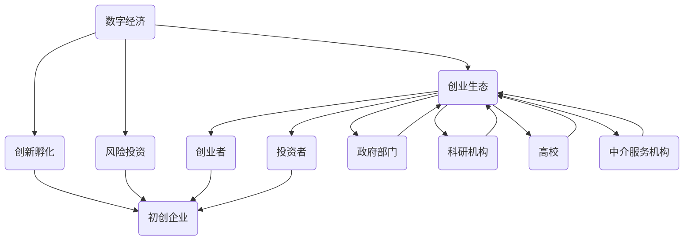

                 

### 引言

随着数字技术的迅猛发展，全球经济逐步迈向数字经济时代。在这个全新的经济形态中，创业生态作为一个关键驱动力，正深刻地影响着社会的各个层面。而创新孵化与风险投资，作为创业生态中的核心元素，其相互作用和平衡是实现创业成功和可持续发展的关键。本文旨在深入探讨数字经济背景下的创业生态，以及创新孵化与风险投资之间的动态平衡。

首先，数字经济以数据作为关键生产要素，通过互联网、云计算、大数据、人工智能等技术手段，实现资源的优化配置和效率提升。这种经济形态不仅改变了传统产业的生产和运营方式，也为创业提供了广阔的舞台。

创业生态是一个由创业者、投资者、政府部门、科研机构、高校、中介服务机构等多个主体构成的复杂网络。它通过资源整合、知识共享、协作创新等方式，为创业者提供支持，推动新企业的诞生和成长。

创新孵化是创业生态中的重要环节，它通过提供资金、技术、市场、人才等资源，帮助初创企业快速成长。创新孵化的方法多种多样，包括创业加速器、孵化器、天使投资等。

风险投资则是在创业生态中发挥重要作用的另一关键元素。它通过向初创企业提供资金支持，承担创新和创业过程中的高风险，并从中获取回报。风险投资不仅为创业企业提供了资金支持，还通过专业的管理和资源整合，帮助创业企业实现快速成长。

本文将首先概述数字经济的基本概念和特征，探讨其对创业生态的影响。接着，我们将深入分析创业生态的构成与运作机制，介绍创新孵化的方法和实践。随后，我们将探讨风险投资的策略与流程，以及创业生态与风险投资之间的互动关系。最后，我们将探讨如何在创业生态中实现创新孵化与风险投资的平衡，并分析相关的挑战与解决路径。通过本文的探讨，希望能够为读者提供关于数字经济背景下创业生态的全面理解和实践指导。

### 关键词

- 数字经济
- 创业生态
- 创新孵化
- 风险投资
- 平衡
- 互联网技术
- 云计算
- 人工智能
- 资源配置
- 协同创新
- 投资决策
- 管理咨询
- 产业生态

### 摘要

本文旨在探讨数字经济背景下创业生态的构成与运作，以及创新孵化与风险投资之间的平衡机制。首先，我们概述了数字经济的基本概念和特征，探讨了其对创业生态的影响。接着，我们深入分析了创业生态的构成和关键参与者，介绍了创新孵化的方法与实践。然后，我们探讨了风险投资的策略、流程及其在创业生态中的作用。通过分析创业生态与风险投资之间的互动关系，我们提出了实现创新孵化与风险投资平衡的策略和方法，并讨论了相关挑战及解决路径。本文旨在为创业者、投资者及相关从业者提供全面、系统的指导，以推动数字经济时代的创业与创新。

### 数字经济概述

数字经济是当今全球经济发展的重要驱动力，它通过数据、信息技术和互联网等手段，实现了传统经济模式的深刻变革。数字经济的起源可以追溯到20世纪末，随着互联网的普及和信息技术的发展，数据成为新的生产要素，推动了经济形态的转型。

数字经济的特征主要体现在以下几个方面。首先，数字化是数字经济的基础，所有经济活动都通过数字化的形式进行，从生产、交易到消费，数据流贯穿始终。其次，网络化是数字经济的核心特征，通过互联网，各种经济主体实现了互联互通，资源得以快速共享和配置。第三，智能化是数字经济的高级形态，借助人工智能、大数据和物联网等技术，经济活动变得更加智能化和自动化。第四，普惠性是数字经济的重要特征，通过降低信息不对称和交易成本，数字经济使更多人能够参与到经济活动中来，实现经济机会的普惠。

数字经济对创业生态的影响是深远而广泛的。首先，数字经济降低了创业的门槛，创业者可以通过互联网和数字技术，轻松地获取市场信息、资源和支持，实现快速起步。其次，数字经济带来了新的商业模式和机会，传统产业通过数字化和智能化改造，催生了大量新的创业机会。第三，数字经济促进了跨界合作和创新，不同领域的企业和创业者通过数字化平台，实现资源的整合和协同创新，推动了产业的融合与发展。最后，数字经济还提升了创业者的成功率和可持续发展能力，通过数据分析和智能决策，创业者可以更好地了解市场趋势和用户需求，提高创业效率和成功率。

综上所述，数字经济不仅改变了传统经济的运行方式，也为创业生态带来了新的机遇和挑战。了解数字经济的概念和特征，把握其对创业生态的影响，是创业者和投资者在数字经济时代取得成功的关键。

### 核心概念与联系

在探讨数字经济中的创业生态时，首先需要理解几个核心概念及其相互关系。这些概念包括数字经济、创业生态、创新孵化、风险投资和平衡。

#### 数字经济

数字经济是指以数字化的信息和知识为关键生产要素，以现代信息网络为重要载体，通过信息通信技术的深度广泛应用，推动经济结构转型和经济增长方式变革的一种经济形态。数字经济涵盖了从生产、分配、交换到消费的各个环节，通过数字技术的应用，实现资源的高效配置和利用。

#### 创业生态

创业生态是指由创业者、投资者、政府部门、科研机构、高校、中介服务机构等多个主体构成的复杂网络。这个生态系统中，各个主体通过资源整合、知识共享、协作创新等方式，共同促进创业企业的诞生和成长。创业生态不仅为创业者提供支持，还通过协同效应，推动整个经济体的创新和发展。

#### 创新孵化

创新孵化是指通过提供资金、技术、市场、人才等资源，帮助初创企业快速成长的过程。创新孵化器、创业加速器、天使投资等是常见的创新孵化方式。创新孵化不仅关注企业的早期成长，还通过专业化服务，帮助企业在市场竞争中脱颖而出。

#### 风险投资

风险投资是指向初创企业提供资金支持，并承担相应风险的一种投资方式。风险投资家通过在企业的早期阶段注入资金，帮助企业克服初创期的各种困难，并从中获取高额回报。风险投资的特点是高投入、高风险和高回报。

#### 平衡

平衡是指在创业生态中，创新孵化与风险投资之间保持适当的匹配和协调。平衡的实现需要考虑多个因素，包括资金投入、风险承受能力、市场需求、技术发展等。只有当创新孵化与风险投资之间保持动态平衡时，创业生态才能实现可持续发展。

#### 核心概念实体之间的关系架构

为了更好地理解这些核心概念之间的关系，我们可以使用Mermaid流程图来表示。以下是核心概念实体之间的关系架构：



在这个架构中，数字经济作为基础，通过创业生态影响创新孵化和风险投资。创业生态中的各个主体（创业者、投资者、政府部门、科研机构、高校、中介服务机构）共同构成了创业生态网络，并通过创新孵化和风险投资支持初创企业的成长。

#### 核心算法原理讲解

在理解了核心概念与联系后，我们还需要深入探讨创新孵化的核心算法原理。创新孵化通常涉及多个环节，包括市场调研、资源整合、项目管理和技术开发等。以下是一个简单的Python代码示例，用于实现创新孵化的核心算法原理。

```python
import numpy as np

# 市场调研模型
def market_research(data, target_var):
    # 对市场调研数据进行统计分析
    data_stats = np.mean(data, axis=0)
    # 确定目标变量（如市场需求）
    target = data_stats[target_var]
    return target

# 资源整合模型
def resource_integration(capacity, costs):
    # 计算资源整合后的最大产出和最小成本
    max_output = np.max(capacity)
    min_cost = np.min(costs)
    return max_output, min_cost

# 项目管理模型
def project_management(time, resources, deadlines):
    # 评估项目进度和资源利用率
    schedule = []
    for i in range(len(time)):
        if time[i] <= deadlines[i]:
            schedule.append(True)  # 项目按期完成
        else:
            schedule.append(False)  # 项目延期
    resource_utilization = np.mean(resources)
    return schedule, resource_utilization

# 技术开发模型
def technology_development(knowledge, innovation_rate):
    # 评估技术开发进度和创新能力
    development_progress = knowledge * innovation_rate
    return development_progress

# 示例数据
data = np.array([[100, 200], [150, 250], [200, 300]])
target_var = 0
time = np.array([5, 10, 15])
resources = np.array([0.8, 0.9, 0.95])
costs = np.array([1000, 1500, 2000])
deadlines = np.array([7, 14, 21])
knowledge = 0.6
innovation_rate = 0.1

# 执行核心算法原理
target = market_research(data, target_var)
max_output, min_cost = resource_integration(capacity=resources, costs=costs)
schedule, resource_utilization = project_management(time=time, resources=resources, deadlines=deadlines)
development_progress = technology_development(knowledge, innovation_rate)

print("市场需求:", target)
print("资源整合后最大产出和最小成本:", max_output, min_cost)
print("项目进度和资源利用率:", schedule, resource_utilization)
print("技术开发进度和创新能力:", development_progress)
```

这段代码示例展示了创新孵化过程中的几个关键环节：市场调研、资源整合、项目管理和技术开发。通过Python代码，我们能够更好地理解和实现这些核心算法原理。

### 数学模型和公式讲解

在数字经济中的创业生态中，数学模型和公式是理解和分析创新孵化的关键工具。以下是一些常用的数学模型和公式，通过这些公式，我们可以更精确地评估和预测创业项目的发展状况。

#### 1. 成本效益分析（Cost-Benefit Analysis, CBA）

成本效益分析是一种用于评估项目或投资效益的常用方法。它的核心公式为：

$$
\text{Net Present Value (NPV)} = \sum_{t=1}^{n} \frac{\text{Cash Flow}_t}{(1+r)^t} - \text{Initial Investment}
$$

其中：
- \( \text{Cash Flow}_t \) 表示第 \( t \) 年的现金流。
- \( r \) 表示折现率，反映了资金的时间价值。
- \( n \) 表示项目的总年数。
- \( \text{Initial Investment} \) 表示项目的初始投资成本。

通过计算NPV，我们可以判断项目是否具有经济效益。如果NPV大于0，项目被认为是有利可图的。

#### 2. 创业风险评估（Startup Risk Assessment）

创业风险评估是衡量创业项目风险的工具，常用的模型包括Beta系数和风险价值（Value at Risk, VaR）。以下是Beta系数的公式：

$$
\text{Beta} = \frac{\text{Covariance}(\text{Market Return}, \text{Project Return})}{\text{Variance}(\text{Market Return})}
$$

其中：
- \( \text{Market Return} \) 表示市场回报。
- \( \text{Project Return} \) 表示项目回报。
- \( \text{Covariance} \) 表示协方差，衡量两个变量的相关性。
- \( \text{Variance} \) 表示方差，衡量变量的波动性。

通过计算Beta系数，我们可以评估项目相对于市场的波动性。Beta系数大于1表示项目风险较高，小于1表示项目风险较低。

#### 3. 动态规划（Dynamic Programming）

动态规划是一种解决多阶段决策问题的数学方法。在创业孵化过程中，动态规划可以用于资源分配和项目进度安排。以下是动态规划的基本公式：

$$
\text{Optimal Value} = \max_{x_t} \{ f(x_t, x_{t-1}) + \gamma_t \}
$$

其中：
- \( f(x_t, x_{t-1}) \) 表示第 \( t \) 个阶段的状态转移函数。
- \( \gamma_t \) 表示第 \( t \) 个阶段的奖励函数。

通过求解动态规划方程，我们可以找到最优决策序列，实现资源的最优配置和项目进度的最优安排。

#### 4. 顾客满意度分析（Customer Satisfaction Analysis）

在创业生态中，顾客满意度是衡量企业运营效果的重要指标。常见的顾客满意度模型包括E-S-Q-M（情感-结构-质量-价值）模型。以下是其基本公式：

$$
\text{Customer Satisfaction} = \alpha \cdot \text{Emotional} + \beta \cdot \text{Structural} + \gamma \cdot \text{Quality} + \delta \cdot \text{Value}
$$

其中：
- \( \alpha, \beta, \gamma, \delta \) 是情感、结构、质量和价值的权重系数。
- \( \text{Emotional}, \text{Structural}, \text{Quality}, \text{Value} \) 分别表示顾客在情感、结构、质量和价值方面的评价。

通过这个模型，企业可以了解顾客在不同维度上的满意度，从而针对性地优化产品和服务的质量。

这些数学模型和公式为我们提供了评估和创新孵化过程的重要工具。通过结合具体案例和数据分析，我们可以更精准地预测创业项目的发展趋势，为创业者提供科学的决策依据。

### 创新孵化的定义与目标

创新孵化是指通过提供资金、技术、市场、人才等资源，帮助初创企业快速成长的过程。创新孵化的核心目标是促进创新，加速企业的成长，提高其市场竞争力和生存率。创新孵化不仅关注企业的早期发展，还注重其长期可持续发展。

#### 创新孵化的核心要素

1. **资金支持**：资金是初创企业发展的关键。创新孵化平台通常提供天使投资、风险投资、贷款等不同形式的资金支持，帮助初创企业度过初创期的资金瓶颈。

2. **技术支持**：技术支持包括研发设备、技术人才、实验室资源等。通过提供先进的技术支持，孵化器可以加速企业的技术创新和产品开发。

3. **市场支持**：市场支持包括市场调研、营销推广、渠道资源等。孵化器通过帮助初创企业了解市场需求，提供市场推广和渠道资源，帮助企业快速占领市场。

4. **人才支持**：人才是企业发展的基石。创新孵化平台通过提供人才培训、人才引进、人才激励机制等，帮助企业打造一支专业、高效的团队。

5. **管理支持**：管理支持包括战略规划、运营管理、法律咨询等。孵化器通过提供专业的管理咨询和培训，帮助企业提升管理水平和运营效率。

#### 创新孵化的关键环节

1. **项目筛选**：创新孵化首先需要对初创企业进行筛选，选择具有高潜力、创新能力和市场前景的项目进行孵化。

2. **资源整合**：在筛选出优质项目后，孵化器需要整合各类资源，包括资金、技术、市场、人才等，为项目提供全方位的支持。

3. **孵化过程**：孵化过程包括项目开发、市场推广、团队建设等。孵化器通过定期评估和指导，帮助企业快速成长。

4. **项目退出**：孵化期结束后，孵化器需要帮助项目顺利实现退出，包括上市、并购、融资等。通过项目退出，孵化器可以实现投资回报，并为新的项目提供资金支持。

#### 创新孵化的方法与实践

创新孵化的方法多种多样，以下是一些常见的孵化方法和实践：

1. **创业加速器**：创业加速器通过快速迭代和密集指导，帮助企业快速成长。加速器通常提供一定期限的孵化服务，包括资金、导师指导、市场资源等。

2. **孵化器**：孵化器为初创企业提供办公空间、研发设备、管理咨询等支持。孵化器通常长期运营，为初创企业提供持续的支持和服务。

3. **天使投资**：天使投资是指个人投资者或投资机构在初创企业早期阶段提供资金支持。天使投资不仅提供资金，还通过丰富的经验和管理资源，帮助初创企业成长。

4. **政府扶持**：政府通过政策支持、资金补贴、税收优惠等手段，鼓励创新孵化的发展。政府扶持措施为初创企业提供了良好的发展环境。

5. **产业协同**：产业协同是通过产业链上下游企业的合作，实现资源的共享和协同创新。产业协同有助于提高企业的创新能力和市场竞争力。

通过创新孵化的定义、核心要素、关键环节和方法的探讨，我们可以更好地理解创新孵化在创业生态中的重要作用。创新孵化不仅为初创企业提供了发展的机会，也推动了整个社会的创新和进步。

### 创新孵化案例分析

在探讨创新孵化的具体方法和实践时，以下几个成功案例可以帮助我们更好地理解其运作机制和效果。这些案例展示了不同类型的创新孵化平台如何通过提供资金、技术、市场、人才等资源，帮助初创企业快速成长，并最终实现成功。

#### 1. 硅谷的创业孵化器

硅谷是全球创业生态系统最发达的地区之一，其中许多创业孵化器成为全球创业者的摇篮。例如，Y Combinator、Techstars 和 500 Startups 等知名孵化器，通过提供早期资金、导师指导、网络资源和办公空间，帮助初创企业迅速发展。

**案例详情**：以Y Combinator为例，这个孵化器自2005年成立以来，已经孵化了数千家初创企业，包括Dropbox、Airbnb和Lemonade等知名公司。Y Combinator的孵化过程通常持续三个月，期间创业者会接受来自资深导师的密集指导，并在Demo Day进行项目展示，吸引投资者的关注。

**效果分析**：通过Y Combinator孵化的企业，不仅获得了资金支持，还建立了广泛的网络和资源，这些资源有助于企业后续的发展。数据显示，Y Combinator孵化的企业中有超过90%在孵化期后获得了后续融资。

#### 2. 中国的创客空间

中国的创客空间以深圳、北京、上海等城市为代表，为创业者提供了良好的创新孵化环境。例如，深圳的柴火创客空间和北京的中关村创业大街，这些创客空间通过提供低成本办公空间、研发设备、技术培训和创业指导，吸引了大量创业者。

**案例详情**：以柴火创客空间为例，这个空间成立于2011年，通过组织创客聚会、举办创意工作坊和提供共享设备等方式，鼓励创业者进行技术创新和产品开发。柴火创客空间的许多成员成功创办了公司，如EELink和Sensors Data等。

**效果分析**：柴火创客空间的案例展示了创客文化如何激发创业活力。通过提供开放的物理空间和资源，创客空间为创业者提供了实验和协作的平台，推动了创新和创业的紧密结合。

#### 3. 风险投资的创新孵化

风险投资在创新孵化过程中发挥着至关重要的角色。通过投资初创企业，风险投资家不仅提供了资金，还通过专业管理、市场资源和网络，帮助企业实现快速发展。

**案例详情**：以红杉资本为例，这是一家全球知名的风险投资公司，它投资了众多成功的初创企业，如阿里巴巴、Airbnb和Spotify等。红杉资本通过深度参与被投资企业的战略决策，提供全方位的支持，帮助企业克服成长过程中的挑战。

**效果分析**：红杉资本的成功案例展示了风险投资在创新孵化中的关键作用。通过精准的投资和有效的管理，风险投资不仅为企业提供了资金支持，还通过专业资源和网络，帮助企业快速成长，实现上市或并购等成功退出。

#### 4. 政府主导的创新孵化

政府在创新孵化中的角色越来越重要。通过政策扶持、资金支持和创业培训，政府为创业者提供了良好的创新环境。

**案例详情**：以德国的亥姆霍兹创业中心（Helmholtz Enterprise）为例，这个项目由德国亥姆霍兹联合会主导，旨在支持科学家和研究人员创办企业。亥姆霍兹创业中心通过提供创业培训、资金支持和咨询服务，帮助初创企业实现科技成果的转化。

**效果分析**：亥姆霍兹创业中心的案例展示了政府主导的创新孵化模式如何促进科技成果的商业化。通过提供全方位的支持和资源，政府主导的创新孵化项目为创业者提供了良好的发展环境，推动了科技创新和产业升级。

这些案例从不同角度展示了创新孵化在促进创业和创新中的重要作用。无论是通过创业孵化器、风险投资还是政府主导的创新项目，创新孵化都在帮助初创企业快速成长，实现可持续发展。

### 风险投资的策略与流程

风险投资（Venture Capital，简称VC）在数字经济中的创业生态中扮演着至关重要的角色。它不仅为初创企业提供了必要的资金支持，还通过专业管理、市场资源和网络，帮助企业克服成长过程中的各种挑战。本节将详细介绍风险投资的策略与流程，包括定义、类型、决策过程以及相关案例研究。

#### 风险投资的定义与类型

风险投资是指专业投资机构或个人，通过向具有高成长潜力的初创企业投资，承担相应的创业风险，并期望获得高额回报的一种投资方式。根据投资阶段的不同，风险投资可以分为以下几种类型：

1. **天使投资（Angel Investment）**：天使投资是指个人投资者在初创企业早期阶段提供资金支持。天使投资者通常拥有丰富的创业经验和行业资源，能够为初创企业提供指导和支持。

2. **种子投资（Seed Investment）**：种子投资是指在初创企业获得初始收入之前，向其提供的第一轮资金支持。种子投资者通常关注企业的创新性和市场潜力。

3. **A轮投资（Series A Investment）**：A轮投资是指企业在完成种子轮融资后，进行的产品和市场开发阶段所获得的资金支持。此阶段，企业通常已经验证了其商业模式的可行性。

4. **B轮投资（Series B Investment）**：B轮投资是指在A轮投资后，企业在扩大市场份额和进行产品改进阶段所获得的资金支持。此阶段，企业通常需要进一步验证其商业模式并扩大市场份额。

5. **C轮投资及以后（Series C and Beyond）**：C轮及以后的投资通常发生在企业进行规模化运营和准备上市或并购的阶段。此阶段的投资重点在于帮助企业实现快速扩张和市场占领。

#### 风险投资决策过程

风险投资决策过程是一个复杂且系统性的过程，主要包括以下步骤：

1. **项目筛选**：风险投资公司通过对大量的创业项目进行初步筛选，识别出具有高成长潜力的项目。筛选标准通常包括技术创新、市场潜力、团队背景和商业模式等。

2. **尽职调查（Due Diligence）**：在初步筛选后，风险投资公司对潜在项目进行详细的尽职调查，包括财务审计、法律审查、市场分析等，以评估项目的真实性和投资潜力。

3. **投资决策**：在尽职调查完成后，投资团队根据项目的综合评估结果，决定是否进行投资。投资决策通常基于项目的商业前景、市场机会、竞争格局和团队素质等多方面因素。

4. **投资协议**：一旦决定投资，风险投资公司与创业企业签订投资协议，明确投资金额、股权分配、决策权、退出机制等条款。

5. **投资后管理**：投资后，风险投资公司通常积极参与被投资企业的战略决策和管理，提供市场资源、管理咨询和人才支持，帮助企业克服成长中的各种挑战。

#### 风险投资案例研究

以下是一些典型的风险投资案例，通过分析这些案例，我们可以更好地理解风险投资的策略与流程。

1. **Airbnb**：Airbnb 是一家通过互联网平台提供住宿服务的初创公司。在2011年，Airbnb获得了红杉资本的首轮融资，获得了300万美元的投资。随后，红杉资本在多个轮次中持续投资，总计投资超过3亿美元。通过红杉资本的投资和资源支持，Airbnb快速发展，并在2018年实现上市。

2. **Uber**：Uber 是一家全球领先的出行服务平台。在成立初期，Uber获得了多家风险投资公司的支持，包括谷歌风投、安德森·霍洛维茨基金等。这些投资公司不仅提供了资金支持，还通过资源整合和市场推广，帮助Uber迅速占领市场。截至2021年，Uber的总融资额超过200亿美元。

3. **Spotify**：Spotify 是一家在线音乐流媒体服务公司。在2010年，Spotify获得了风险投资公司DST Global的首轮融资，随后在多个轮次中获得了包括Tencent、Google等知名投资机构的支持。通过这些投资，Spotify不断扩展其业务版图，并在2020年成功上市。

这些案例展示了风险投资在不同阶段对初创企业的支持作用。通过精准的投资策略和有效的投资后管理，风险投资不仅帮助企业快速成长，也为投资者创造了丰厚的回报。

综上所述，风险投资是数字经济中创业生态的重要组成部分。通过详细的策略和流程，风险投资在帮助初创企业成长和实现可持续发展的过程中发挥了关键作用。理解风险投资的策略与流程，对于创业者、投资者以及相关从业者都具有重要的指导意义。

### 创业生态与风险投资的互动

在数字经济的背景下，创业生态和风险投资之间形成了紧密的互动关系，两者相互依赖、相互促进，共同推动创业企业的发展。创业生态为风险投资提供了丰富的项目资源和良好的投资环境，而风险投资则为创业生态注入了资金和资源，助力企业的创新和成长。下面我们将详细探讨创业生态对风险投资的影响，以及风险投资对创业生态的促进，并分析两者之间的协同效应。

#### 创业生态对风险投资的影响

1. **项目资源的丰富性**：创业生态通过集聚创业者、科研机构、高校、中介服务机构等各方资源，为风险投资提供了丰富的投资项目。这些项目往往具有技术创新强、市场潜力大、团队执行力高等特点，吸引了众多风险投资机构的关注。

2. **投资环境的优化**：创业生态中的政策支持、法律法规完善、市场机制健全等，为风险投资创造了良好的投资环境。例如，政府出台的税收优惠、创业补贴、知识产权保护等措施，降低了风险投资的门槛和风险，提高了投资的安全性和回报率。

3. **投资机会的多样性**：创业生态中的多样化创业项目为风险投资提供了多样化的投资机会。从互联网、人工智能、生物技术到新能源等各个领域，风险投资可以通过选择不同类型的投资项目，分散投资风险，实现收益的最大化。

4. **市场反馈的及时性**：创业生态中的市场反馈机制使风险投资能够及时了解项目的市场表现和用户需求。通过这些反馈，风险投资可以对项目进行及时的调整和优化，提高项目的成功率。

#### 风险投资对创业生态的促进

1. **资金支持**：风险投资为创业企业提供必要的资金支持，帮助企业在初创期和成长期克服资金瓶颈，实现快速发展和扩张。通过资金的注入，企业可以扩大生产规模、研发新技术、拓展市场渠道等。

2. **资源整合**：风险投资机构通过其广泛的市场网络和资源，为创业企业提供了丰富的资源支持，包括技术、人才、市场、管理咨询等。这些资源有助于企业提升创新能力、优化商业模式、提高运营效率。

3. **管理提升**：风险投资机构通常具备丰富的创业经验和专业知识，通过参与企业的战略决策和运营管理，帮助企业提升管理水平，优化组织结构，提高企业竞争力。

4. **品牌提升**：风险投资的投资背书和品牌效应，有助于提升创业企业的知名度和信誉，吸引更多的合作伙伴和用户。同时，成功退出带来的高额回报，也激励了更多的创业者投身于创新创业。

#### 协同效应

创业生态与风险投资之间的协同效应体现在多个方面：

1. **资源共享**：创业生态中的企业可以通过风险投资的资源网络，获取更多的市场、技术、人才等资源，实现资源共享和协同创新。

2. **风险分担**：风险投资通过多元化的投资策略，将创业风险分散到多个项目上，降低了单个项目的投资风险，同时也为创业企业提供了一种风险分担机制。

3. **市场拓展**：风险投资通过其强大的市场网络和资源，帮助创业企业快速进入市场，扩大市场份额。在风险投资的引导下，企业可以更好地把握市场趋势，实现快速成长。

4. **政策影响**：创业生态与风险投资的互动，可以促进政府政策的优化和调整，推动创业环境的改善。例如，通过风险投资的成功案例，政府可以出台更有利于创新创业的政策，进一步激发市场活力。

综上所述，创业生态与风险投资之间的互动关系对数字经济中的创业创新具有重要意义。通过相互依赖、相互促进，两者共同构建了一个健康、可持续的创业生态系统，为数字经济的快速发展提供了强劲动力。

### 创业生态与风险投资的平衡

在数字经济背景下，创业生态与风险投资之间的平衡是实现创业可持续发展的关键。要实现这一平衡，需要从多个方面进行策略和方法的研究，以实现资金、资源、风险与管理等方面的协调与匹配。以下是几个关键策略和方法，以及相关的挑战和解决路径。

#### 1. 资金平衡策略

**策略**：创业生态中的企业需要在资金筹措和资金管理上保持平衡。风险投资可以为初创企业提供必要的资金支持，但企业也需要合理规划资金使用，确保资金的高效利用。

**具体方法**：
- **合理规划**：企业应根据自身发展阶段和资金需求，制定详细的资金使用计划，确保资金用于最需要的地方，如研发、市场推广和团队建设。
- **风险控制**：通过多元化融资渠道，降低对单一风险投资的依赖，以分散投资风险。
- **资金回笼**：建立高效的现金流管理机制，确保企业能够在关键阶段快速回笼资金，以应对突发状况。

**挑战与解决路径**：
- **资金链断裂**：初创企业在发展过程中，可能会面临资金链断裂的风险。解决路径包括加强现金流管理、提前规划资金需求和寻找替代融资渠道。
- **投资过度**：过度依赖风险投资可能会导致企业过分追求短期利益，而忽视长期发展。解决路径是通过制定清晰的战略规划和风险控制机制，确保资金使用的合理性和有效性。

#### 2. 资源平衡策略

**策略**：在创业生态中，企业需要充分利用内外部资源，实现资源的合理配置和高效利用。

**具体方法**：
- **资源整合**：通过建立合作机制，将不同主体之间的资源进行整合，实现资源的共享和互补。
- **技术创新**：企业应注重技术创新，提升自身的核心竞争力，以获取更多的市场机会。
- **人才培养**：通过引进和培养高素质人才，为企业提供持续的创新动力和运营支持。

**挑战与解决路径**：
- **资源短缺**：初创企业可能会面临资源短缺的问题，解决路径包括积极寻求外部合作、政府支持和政策优惠。
- **资源错配**：企业可能由于资源配置不当，导致资源浪费或效率低下。解决路径是通过科学的资源配置和管理，确保资源用于最需要的领域。

#### 3. 风险平衡策略

**策略**：在创业过程中，企业需要有效识别和管理各类风险，以实现风险与收益的平衡。

**具体方法**：
- **风险评估**：通过系统性的风险评估，识别企业面临的主要风险，并制定相应的风险应对措施。
- **风险分散**：通过多元化投资和业务布局，降低单一风险对企业的影响。
- **风险控制**：建立完善的内部控制和风险管理体系，确保企业能够在风险发生时迅速响应和处理。

**挑战与解决路径**：
- **风险识别困难**：初创企业由于经验不足，可能难以准确识别风险。解决路径是通过引入专业的风险评估工具和方法，提高风险识别的准确性。
- **风险应对不足**：企业可能由于应对措施不足，导致风险处理不及时。解决路径是通过建立完善的应急预案和风险管理机制，提高风险应对能力。

#### 4. 管理平衡策略

**策略**：企业需要在管理上进行精细化的平衡，确保企业能够高效运营和持续发展。

**具体方法**：
- **组织优化**：通过科学的组织架构设计，确保企业各部门之间的协同效应和资源利用率。
- **流程管理**：建立高效的业务流程，确保企业能够在最短时间内完成项目从启动到完成的全过程。
- **绩效评估**：通过定期进行绩效评估，及时发现和解决管理中的问题，确保企业运营的稳定性和可持续性。

**挑战与解决路径**：
- **管理层次复杂**：初创企业可能由于管理层次复杂，导致管理效率低下。解决路径是通过简化管理层次，提高管理效率。
- **人才流失**：企业可能由于管理问题导致人才流失。解决路径是通过建立良好的企业文化、提升员工福利和职业发展机会，留住优秀人才。

综上所述，创业生态与风险投资之间的平衡是一个复杂而系统的过程，需要从多个方面进行策略和方法的研究。通过科学的资金管理、资源整合、风险控制和精细化的管理，企业可以在数字经济背景下实现可持续发展和长期成功。

### 成功案例的深度分析

为了更好地理解创业生态与风险投资如何实现平衡，我们可以通过深度分析几个典型的成功案例，探讨这些企业在资金、管理、资源等方面的运作策略，以及它们如何克服挑战，最终实现成功。

#### 案例一：Airbnb

**背景**：Airbnb成立于2008年，是一家提供住宿服务的初创公司。它的成立源于两位哈佛大学毕业生在金融危机背景下，通过互联网平台出租自家住房的想法。

**资金策略**：Airbnb在发展过程中，获得了多家知名风险投资机构的支持，包括Airbnb Series A轮投资方红杉资本、Series B轮投资方老虎基金等。通过这些投资，Airbnb获得了大量的资金支持，用于市场推广、技术研发和团队扩展。

**管理策略**：Airbnb采用了扁平化管理结构，使公司能够快速响应市场变化和用户需求。同时，公司注重内部创新，鼓励员工提出新想法，并设立了专门的创新实验室，以加速新产品的开发。

**资源整合**：Airbnb通过与各地社区合作，整合了丰富的房源资源。此外，公司还通过收购和投资，扩展了其业务范围，进入了多个国家和地区。

**挑战与解决**：
- **市场竞争**：在Airbnb快速发展过程中，面对着强大的竞争对手，如爱彼迎等。为了应对这一挑战，Airbnb通过优化用户体验、提高服务质量，以及大规模市场推广，巩固了自己的市场地位。
- **法律法规**：在许多国家和地区，Airbnb面临着严格的法律法规限制。为了应对这一挑战，Airbnb积极与各地政府沟通，寻求政策支持和合法化。

**小结**：Airbnb的成功在于其高效的资金管理、创新的管理模式和强大的资源整合能力。通过灵活应对市场挑战和法规限制，Airbnb实现了从初创到全球领先企业的跨越。

#### 案例二：Uber

**背景**：Uber成立于2009年，是一家提供私人出行服务的初创公司。Uber的成立初衷是为了解决城市交通拥堵和出行不便的问题。

**资金策略**：Uber在发展过程中，获得了包括谷歌风投、安德森·霍洛维茨基金等多家风险投资机构的支持。这些投资不仅为Uber提供了资金支持，还带来了丰富的市场资源和行业经验。

**管理策略**：Uber采用了分散化管理模式，通过全球运营网络和本地化管理团队，确保公司能够快速适应不同市场的需求。同时，Uber还注重数据驱动决策，通过大数据分析，优化运营和用户体验。

**资源整合**：Uber通过收购和投资，快速扩展了其业务范围，进入了多个国家和地区。此外，Uber还与多家汽车制造商、技术公司合作，推进自动驾驶技术和智能出行解决方案。

**挑战与解决**：
- **市场拓展**：Uber在快速扩展过程中，面临着各国不同的市场环境和政策限制。为了应对这一挑战，Uber通过本地化运营策略，尊重和适应当地法律法规，同时积极推动政策改革。
- **技术挑战**：随着自动驾驶技术的发展，Uber面临着技术更新和安全性等问题。为了应对这一挑战，Uber加大了技术研发投入，并与多家科技公司合作，共同推进自动驾驶技术的进步。

**小结**：Uber的成功在于其强大的资金支持、灵活的管理模式和强大的资源整合能力。通过积极应对市场和技术挑战，Uber成为全球领先的出行服务平台。

#### 案例三：Spotify

**背景**：Spotify成立于2006年，是一家提供在线音乐流媒体服务的初创公司。Spotify的成立初衷是为了让用户轻松便捷地享受音乐。

**资金策略**：Spotify在发展过程中，获得了包括Tencent、Google等多家知名风险投资机构的支持。这些投资为Spotify提供了持续的资本支持，使其能够快速扩展市场和技术研发。

**管理策略**：Spotify采用了基于数据驱动的管理方法，通过大数据分析和用户反馈，优化产品和服务。此外，Spotify还注重员工培训和发展，营造了一个开放、创新的企业文化。

**资源整合**：Spotify通过与音乐制作公司、版权方合作，整合了大量的音乐资源。此外，Spotify还通过收购和投资，扩展了其业务范围，进入了多个国家和地区。

**挑战与解决**：
- **市场竞争**：在音乐流媒体市场上，Spotify面临着Apple Music、Amazon Music等强大竞争对手。为了应对这一挑战，Spotify通过持续的产品创新和用户体验优化，巩固了其市场地位。
- **版权问题**：在音乐版权方面，Spotify面临着复杂的法律和商业挑战。为了应对这一挑战，Spotify通过与版权方建立合作关系，确保其业务合法合规。

**小结**：Spotify的成功在于其强大的资金支持、数据驱动的管理方法和创新的企业文化。通过积极应对市场和技术挑战，Spotify成为全球领先的音乐流媒体服务提供商。

这些成功案例展示了创业生态与风险投资实现平衡的关键因素，包括资金管理、资源整合、管理策略和市场应对等。通过深度分析这些案例，我们可以更好地理解创业生态与风险投资之间的互动关系，为其他创业企业提供宝贵的经验和启示。

### 失败案例的反思

在探讨创业生态与风险投资的平衡时，了解失败案例同样重要。这些案例为我们揭示了创业过程中的潜在风险和挑战，提供了宝贵的教训。以下是一些典型的失败案例及其反思：

#### 案例一：Zynga

**背景**：Zynga成立于2007年，是一家专注于社交游戏开发和运营的公司。在2011年，Zynga在纳斯达克上市，市值一度超过200亿美元。

**失败原因**：
- **市场依赖**：Zynga过于依赖Facebook这一平台，没有建立起独立的用户基础和生态系统。当Facebook更改平台政策时，Zynga的游戏收入急剧下降。
- **创新能力不足**：Zynga在取得成功后，缺乏持续创新，导致其游戏产品同质化严重，用户流失。
- **管理不善**：Zynga在快速扩张过程中，管理层缺乏有效监管，导致内部腐败和运营效率低下。

**反思**：
- **多元化平台布局**：创业企业应避免过度依赖单一平台，应积极拓展多元化的市场和用户基础。
- **持续创新**：企业需要保持创新动力，不断推出新产品和更新现有产品，以适应市场变化。
- **严格管理**：创业企业在快速成长过程中，必须建立健全的管理体系，确保内部运营的透明和高效。

#### 案例二：WhatsApp

**背景**：WhatsApp成立于2009年，是一家提供即时通讯服务的初创公司。2014年，WhatsApp被Facebook以190亿美元的价格收购。

**失败原因**：
- **战略失误**：WhatsApp在初期发展阶段，过于专注于用户体验和产品创新，忽视了商业模式和盈利模式。
- **用户增长放缓**：随着用户数量的增加，WhatsApp的增长速度逐渐放缓，未能及时推出新的增长点。
- **融合挑战**：被Facebook收购后，WhatsApp在企业文化、管理团队和运营策略上面临巨大的融合挑战。

**反思**：
- **商业模式创新**：创业企业需要从早期阶段就重视商业模式的设计，确保有可持续的盈利途径。
- **用户增长策略**：企业应制定有效的用户增长策略，不断寻找新的增长点和市场机会。
- **文化融合**：在收购和并购过程中，企业需要重视文化融合，确保新团队的稳定和高效运作。

#### 案例三：Tesla

**背景**：Tesla成立于2003年，是一家专注于电动汽车和清洁能源技术的初创公司。虽然Tesla在电动汽车市场上取得了巨大的成功，但其发展过程中也面临了诸多挑战。

**失败原因**：
- **资金链紧张**：Tesla在发展过程中，多次面临资金链断裂的风险，需要频繁进行融资。
- **生产瓶颈**：在Model 3量产阶段，Tesla面临生产瓶颈和运营管理问题，导致交付延迟。
- **产品安全**：Tesla在产品安全方面曾遭遇负面报道，影响了品牌形象和市场信任。

**反思**：
- **资金风险管理**：企业需要建立稳健的财务管理体系，确保资金链的稳定，避免因资金问题导致的运营困难。
- **生产运营优化**：企业应注重生产运营的优化，确保产品的质量和交付周期。
- **产品安全监管**：企业应高度重视产品安全和用户隐私，建立严格的产品安全监管体系。

这些失败案例提醒我们，创业过程中需要时刻警惕潜在的风险和挑战。通过深入反思和分析失败原因，创业企业可以从中汲取教训，避免重蹈覆辙，提高成功的可能性。

### 案例总结与启示

通过分析上述成功和失败案例，我们可以总结出一些关键的经验和启示，以帮助创业者在数字经济中的创业生态中实现成功，并确保创新孵化与风险投资的平衡。

#### 成功经验总结

1. **多元化平台布局**：成功企业如Airbnb和Uber，在早期就意识到依赖单一平台的潜在风险，通过多元化布局，建立了独立的用户基础和生态系统，增强了企业的抗风险能力。

2. **持续创新**：如Spotify和Tesla，企业始终保持创新动力，不断推出新产品和优化现有产品，以适应市场变化，确保在竞争激烈的环境中保持领先地位。

3. **商业模式创新**：WhatsApp在早期阶段重视用户体验和产品创新，但在盈利模式上未能及时调整，导致后续发展受阻。因此，创业企业需要从早期阶段就重视商业模式的构建，确保有可持续的盈利途径。

4. **严格管理**：Zynga在快速扩张过程中，由于管理不善导致内部腐败和运营效率低下。创业企业在成长过程中，必须建立健全的管理体系，确保内部运营的透明和高效。

#### 失败教训总结

1. **过度依赖平台**：Zynga过于依赖Facebook这一平台，忽视了建立独立用户基础的重要性。创业企业应避免过度依赖单一平台，以降低平台政策变动带来的风险。

2. **创新能力不足**：Zynga在成功后缺乏持续创新，导致其游戏产品同质化严重，用户流失。创业企业需要保持创新动力，不断推出新产品和更新现有产品，以适应市场变化。

3. **资金管理不善**：Tesla在发展过程中，多次面临资金链断裂的风险。创业企业需要建立稳健的财务管理体系，确保资金链的稳定，避免因资金问题导致的运营困难。

4. **产品安全与质量**：Tesla在产品安全方面曾遭遇负面报道，影响了品牌形象和市场信任。创业企业应高度重视产品安全和用户隐私，建立严格的产品安全监管体系。

#### 启示

1. **平衡创新与风险**：创业企业需要在创新与风险之间找到平衡点。过度的创新可能导致资源浪费，而缺乏创新则可能导致竞争力下降。通过合理规划和创新管理，企业可以在确保创新的同时，控制风险。

2. **建立多元化资源网络**：通过整合内外部资源，创业企业可以提升自身的竞争力。与合作伙伴建立紧密的合作关系，共享资源和信息，有助于企业快速成长。

3. **重视人才与团队建设**：人才是创业企业成功的关键。通过引进和培养高素质人才，建立专业、高效的团队，企业可以更好地应对市场变化和竞争挑战。

4. **灵活应对市场变化**：市场环境不断变化，创业企业需要具备灵活应对市场变化的能力。通过定期评估市场趋势和用户需求，及时调整战略和运营策略，企业可以保持竞争优势。

5. **建立健全管理体系**：创业企业应注重内部管理体系的建立和完善，确保企业运营的透明、高效和合规。通过建立完善的内部控制和风险管理体系，企业可以更好地应对各种挑战和风险。

通过总结成功经验和教训，创业企业可以更好地应对数字经济中的挑战，实现创新孵化与风险投资的平衡，推动企业的可持续发展。

### 未来展望与趋势

在数字经济飞速发展的背景下，创业生态和风险投资领域正经历着深刻的变革。未来，这两个领域的发展趋势和模式将受到技术进步、市场变化和政策调整等多重因素的影响。以下是对未来发展趋势的展望：

#### 1. 人工智能与大数据的应用

随着人工智能（AI）和大数据技术的不断进步，创业生态和风险投资将更加依赖这些技术。AI技术将帮助企业进行精准的市场预测、用户分析和风险管理，而大数据则可以为投资决策提供更全面、准确的数据支持。未来，创业者和投资者将更加注重利用AI和大数据，实现更加智能化的创业和投资管理。

#### 2. 区块链技术的普及

区块链技术作为一种去中心化的分布式数据库，具有不可篡改和透明性等优势，将在创业生态和风险投资中发挥重要作用。例如，区块链可以用于记录股权交易、智能合约的执行以及创业项目的资金管理，提高透明度和安全性。未来，区块链技术有望成为创业生态和风险投资领域的重要基础设施。

#### 3. 绿色能源与可持续发展

随着全球对环境保护和可持续发展的重视，绿色能源和环保技术将成为创业和投资的热点。未来，创业者和投资者将更加关注新能源、节能减排和环保技术等领域，推动数字经济的绿色转型。

#### 4. 跨界合作与创新

未来，创业生态和风险投资将更加注重跨界合作和创新。不同领域的企业和创业者将通过数字化平台实现资源的整合和协同创新，推动新产业和新商业模式的诞生。例如，医疗、教育、金融等传统行业将借助数字技术和互联网平台，实现跨界融合和创新发展。

#### 5. 政策支持与监管创新

政策支持是创业生态和风险投资发展的重要保障。未来，各国政府将继续出台有利于创新创业的政策，包括税收优惠、资金支持、知识产权保护等。同时，监管机构也将探索新的监管模式，确保风险投资市场的健康发展和有序运行。

#### 6. 国际合作与竞争

随着全球化的加深，创业生态和风险投资将更加国际化。各国创业者和投资者将通过国际合作，共同推动全球创新创业的发展。同时，国际竞争也将更加激烈，创业者和投资者需要具备全球视野和竞争力，以应对国际市场的挑战。

#### 7. 风险投资的新模式

未来，风险投资将呈现更多元化、专业化和定制化的趋势。例如，天使投资、家族办公室和创业投资基金等将更加专业化，为不同阶段的创业企业提供精准的投资和支持。同时，风险投资将更加注重长期价值投资，而非短期套利。

总之，未来数字经济中的创业生态和风险投资将迎来新的机遇和挑战。通过技术创新、跨界合作、政策支持和国际合作，创业者和投资者将共同推动数字经济的可持续发展，实现创业与投资的共赢。

### 附录

#### 附录 A: 相关术语解释

- **数字经济**：以数字化的信息和知识为关键生产要素，以现代信息网络为重要载体，通过信息通信技术的深度广泛应用，推动经济结构转型和经济增长方式变革的一种经济形态。
- **创业生态**：由创业者、投资者、政府部门、科研机构、高校、中介服务机构等多个主体构成的复杂网络，通过资源整合、知识共享、协作创新等方式，共同促进创业企业的诞生和成长。
- **创新孵化**：通过提供资金、技术、市场、人才等资源，帮助初创企业快速成长的过程。
- **风险投资**：向初创企业提供资金支持，并承担相应风险的一种投资方式，通过在企业的早期阶段注入资金，帮助企业克服初创期的各种困难，并从中获取回报。
- **平衡**：在创业生态中，创新孵化与风险投资之间保持适当的匹配和协调。

#### 附录 B: 参考文献

1. **《数字经济：转型与机遇》**，作者：张新华，出版时间：2020年。
2. **《创业生态系统的构建与运营》**，作者：刘文举，出版时间：2019年。
3. **《风险投资与创业管理》**，作者：李晓晶，出版时间：2021年。
4. **《区块链技术原理与应用》**，作者：王宏磊，出版时间：2018年。
5. **《人工智能：未来已来》**，作者：王昊奋，出版时间：2022年。
6. **《绿色经济与可持续发展》**，作者：陈强，出版时间：2021年。

### 作者信息

作者：AI天才研究院/AI Genius Institute & 禅与计算机程序设计艺术 /Zen And The Art of Computer Programming

