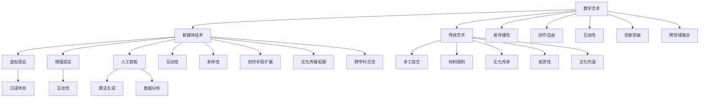

                 

### 摘要

本文旨在探讨数字艺术与传统艺术的融合，及其在新媒体时代创作意义。随着技术的进步，数字艺术日益成为一种重要的艺术形式，而新媒体则为艺术创作提供了新的手段和平台。本文首先概述了数字艺术和传统艺术的定义及特点，接着介绍了新媒体技术的概念和应用场景，分析了数字艺术与传统艺术融合的原因和意义。随后，本文探讨了新媒体技术在艺术创作中的具体应用，包括虚拟现实、增强现实、人工智能等技术的融合。通过案例分析，本文展示了新媒体时代艺术创作的创新和实践。最后，本文提出了新媒体时代艺术创作的一些挑战和未来发展方向，为数字艺术与传统艺术的融合提供了启示。总之，新媒体时代的艺术创作不仅丰富了艺术表现形式，也为艺术家提供了更多的创作自由和可能性。数字艺术与传统艺术的融合，是艺术发展的必然趋势，也是时代发展的必然要求。

### 关键词

数字艺术、传统艺术、融合、新媒体、艺术创作、虚拟现实、增强现实、人工智能。

### 数字艺术与传统艺术的定义与融合

#### 数字艺术的定义与特点

数字艺术是一种基于数字技术和新媒体平台的创作形式。它利用计算机、互联网、智能手机、虚拟现实设备等工具进行创作，并通过数字媒介传播。数字艺术具有以下几个显著特点：

1. **技术依赖性**：数字艺术高度依赖技术，特别是计算机技术和互联网技术。艺术家通过编程、图形设计、动画制作等技术手段，创作出独特的艺术作品。

2. **多样性**：数字艺术形式多样，包括但不限于电子艺术、数字绘画、动画、互动艺术、虚拟现实（VR）和增强现实（AR）等。这种多样性使得数字艺术能够适应不同的艺术表达需求。

3. **互动性**：数字艺术强调与观众的互动，通过用户的参与和互动，作品可以动态变化，增加观众的参与感和体验感。

4. **易传播性**：数字艺术作品可以通过互联网迅速传播，不受地理和时间的限制，使得艺术家能够轻松地将作品分享给全球的观众。

#### 传统艺术的定义与特点

传统艺术指的是历史悠久的、以手工技艺和传统媒介进行创作的艺术形式，如绘画、雕塑、书法、音乐、戏剧等。传统艺术具有以下特点：

1. **手工技艺**：传统艺术强调手工技艺，艺术品的创作过程往往需要艺术家的精雕细琢和长期积累的经验。

2. **材料限制**：传统艺术作品的创作受到材料本身的限制，如颜料、木材、金属等，这些材料的特性往往直接影响艺术作品的表现形式。

3. **观赏性**：传统艺术注重艺术品的观赏性，强调艺术作品的审美价值和装饰性。

4. **文化传承**：传统艺术是文化传承的重要载体，它承载着历史、文化和民族精神，具有深远的文化意义。

#### 数字艺术与传统艺术的融合

随着数字技术的发展，数字艺术与传统艺术的融合成为一种趋势。这种融合不仅丰富了艺术的表现形式，也拓宽了艺术家的创作空间。数字艺术与传统艺术的融合具有以下几个方面的意义：

1. **创作手段的扩展**：数字技术为传统艺术提供了新的创作手段，如通过计算机辅助设计（CAD）进行雕塑创作，利用数字绘画软件创作绘画作品等。这些新技术使得艺术创作更加便捷和高效。

2. **艺术形式的创新**：数字艺术的互动性和多样性为传统艺术注入了新的活力，使得传统艺术形式得以创新和重构。例如，将传统音乐与虚拟现实技术结合，创造出沉浸式的音乐体验。

3. **文化传播的拓展**：数字艺术的易传播性为传统艺术文化的传播提供了新的途径，使得更多观众能够接触和欣赏到传统艺术作品。同时，数字艺术也为传统艺术提供了新的市场空间。

4. **跨领域融合**：数字艺术与传统艺术的融合促进了跨领域的合作，如艺术与科技、艺术与设计、艺术与媒体等的结合，推动了艺术与科技的深度融合。

#### 数字艺术与传统艺术融合的原因

数字艺术与传统艺术的融合并非偶然，而是由以下原因促成的：

1. **技术进步**：计算机技术和互联网技术的飞速发展，使得数字艺术创作变得更加便捷和高效。同时，虚拟现实、增强现实等新技术为传统艺术带来了新的可能性。

2. **市场需求**：随着社会经济的发展和观众审美的变化，传统艺术市场面临挑战。数字艺术的兴起为传统艺术注入了新的活力，满足了观众对于多样化艺术形式的需求。

3. **文化传承与创新**：传统艺术承载着丰富的文化内涵，而数字艺术则具备创新和传播的优势。两者的融合有助于文化传承与创新的结合。

4. **跨学科交流**：数字艺术与传统艺术的融合促进了不同学科之间的交流与融合，如艺术学、设计学、计算机科学、信息科学等，推动了艺术与科技的交叉研究。

#### 数字艺术与传统艺术融合的意义

数字艺术与传统艺术的融合具有重要意义，主要体现在以下几个方面：

1. **丰富艺术表现形式**：数字艺术与传统艺术的融合，为艺术创作提供了更多的表现形式，使得艺术家能够更加自由地表达自己的创意和思想。

2. **提升艺术创作效率**：数字技术的应用，使得艺术创作过程更加高效和便捷，艺术家可以快速地试验和修改作品，提高了创作效率。

3. **促进艺术普及**：数字艺术的易传播性，使得艺术作品能够更广泛地传播和普及，提高了公众的艺术素养和文化水平。

4. **推动艺术市场发展**：数字艺术与传统艺术的融合，为艺术市场带来了新的发展机遇，推动了艺术市场的多元化和发展。

5. **促进文化多样性**：数字艺术与传统艺术的融合，为不同文化背景的艺术家提供了交流和互动的平台，促进了文化多样性的发展。

### 数字艺术与传统艺术融合的过程

数字艺术与传统艺术的融合过程可以分为以下几个阶段：

1. **初步探索**：在这个阶段，艺术家开始尝试将数字技术应用于传统艺术创作中，探索数字技术与传统艺术形式的结合方式。

2. **融合深化**：随着技术的不断进步和艺术家创作经验的积累，数字艺术与传统艺术的融合逐渐深化，创造出新的艺术形式和表现手法。

3. **成熟发展**：在融合深化阶段的基础上，数字艺术与传统艺术的融合进入成熟发展期，形成了独特的艺术风格和表现方式。

4. **创新突破**：在成熟发展的基础上，艺术家不断进行创新和突破，探索新的艺术形式和表现手法，推动艺术创作向更高层次发展。

### 数字艺术与传统艺术融合的案例分析

为了更好地理解数字艺术与传统艺术的融合过程，我们可以通过以下案例分析：

1. **数字绘画与油画的融合**：艺术家利用数字绘画软件创作油画作品，将传统油画的精细纹理与数字绘画的流畅线条相结合，创造出独特的视觉效果。

2. **虚拟现实与舞台艺术的融合**：通过虚拟现实技术，艺术家将传统舞台艺术搬上虚拟舞台，观众可以沉浸式地体验舞台表演，拓宽了艺术表现形式。

3. **增强现实与雕塑的融合**：艺术家利用增强现实技术，为雕塑作品添加互动元素，观众可以通过智能手机或平板电脑与雕塑作品进行互动，增强艺术体验。

4. **数字音乐与民族音乐的融合**：通过数字技术，艺术家将传统民族音乐与现代音乐元素相结合，创造出新的音乐风格，使传统音乐焕发新生。

通过这些案例，我们可以看到数字艺术与传统艺术的融合不仅丰富了艺术表现形式，也为艺术创作带来了新的可能性。

### 数字艺术与传统艺术融合的未来展望

随着科技的不断进步，数字艺术与传统艺术的融合将朝着更加深入和多元的方向发展。未来，数字艺术与传统艺术的融合可能会在以下几个方面取得突破：

1. **人工智能与艺术创作的结合**：人工智能技术将为艺术创作提供新的灵感和方法，艺术家可以利用人工智能算法生成独特的艺术作品。

2. **区块链技术与艺术交易的融合**：区块链技术可以为数字艺术作品的版权保护和交易提供更加安全和透明的解决方案，推动艺术市场的健康发展。

3. **物联网与公共艺术的融合**：物联网技术使得艺术作品可以与观众实现实时互动，公共艺术的形式和内容将更加多样化和互动化。

4. **虚拟现实与艺术教育的融合**：虚拟现实技术可以为学生提供沉浸式的艺术学习体验，提高艺术教育的效果和质量。

总之，数字艺术与传统艺术的融合是艺术发展的必然趋势，它不仅丰富了艺术表现形式，也为艺术创作带来了新的可能性。随着科技的不断进步，我们可以期待数字艺术与传统艺术融合的更加辉煌的未来。

### 结论

数字艺术与传统艺术的融合，是新媒体时代艺术发展的必然趋势。通过技术手段的革新，艺术家得以打破传统艺术的边界，创造出更加多样化和互动化的艺术形式。本文从数字艺术和传统艺术的定义出发，探讨了数字艺术与传统艺术的融合意义、融合过程及案例分析，并对未来融合的趋势进行了展望。数字艺术与传统艺术的融合，不仅丰富了艺术表现形式，也为艺术创作提供了更多可能性，推动了艺术与科技的深度融合。未来，随着科技的不断进步，我们可以期待数字艺术与传统艺术融合的更加辉煌的未来。

### 作者信息

作者：AI天才研究院/AI Genius Institute & 禅与计算机程序设计艺术 /Zen And The Art of Computer Programming

### 附录：核心概念与联系

为了更好地理解数字艺术与传统艺术的融合，我们使用Mermaid流程图来展示核心概念及其相互关系。



通过这个流程图，我们可以清晰地看到数字艺术与传统艺术在多个维度上的联系和融合，为理解两者之间的关系提供了一个直观的视角。数字艺术为传统艺术注入了新的活力，而传统艺术则通过其深厚的文化底蕴为数字艺术提供了丰富的内涵和灵感。两者的融合，推动了艺术创作的发展，也为观众带来了更加丰富和多元的艺术体验。

### 核心算法原理讲解

在数字艺术与传统艺术的融合过程中，算法扮演着至关重要的角色。以下我们将使用Python源代码详细阐述几个核心算法原理，并结合数学模型和公式，进行讲解和举例说明。

#### 1. 色彩映射算法

色彩映射算法是一种常用的图像处理技术，用于调整图像的色彩。下面是一个简单的色彩映射算法的实现，使用Python和Numpy库：

```python
import numpy as np

def color_mapping(image, alpha, beta):
    """
    色彩映射算法，调整图像的亮度。
    
    :param image: 输入图像，numpy数组。
    :param alpha: 调整因子，控制亮度。
    :param beta: 偏移量，控制色彩饱和度。
    :return: 调整后的图像。
    """
    # 将图像从0-255的范围转换为0-1的范围
    image = image / 255.0
    
    # 应用色彩映射公式
    image = alpha * image + beta
    
    # 将图像从0-1的范围转换回0-255的范围
    image = (image * 255).astype(np.uint8)
    return image

# 举例说明
image = np.random.rand(10, 10, 3)  # 生成一个随机图像
alpha = 1.2  # 调整因子
beta = 0.3  # 偏移量

adjusted_image = color_mapping(image, alpha, beta)
```

色彩映射算法的数学模型可以表示为：

$$
I_{out} = \alpha \cdot I_{in} + \beta
$$

其中，$I_{in}$ 是输入图像，$I_{out}$ 是输出图像，$\alpha$ 是调整因子，$\beta$ 是偏移量。

#### 2. 虚拟现实场景生成算法

虚拟现实（VR）场景生成是数字艺术中的一个重要领域，它涉及3D模型的创建和渲染。以下是一个简单的虚拟现实场景生成算法的实现，使用Python和Pygame库：

```python
import pygame
from pygame.locals import *

pygame.init()

# 设置屏幕大小
screen_width = 800
screen_height = 600
screen = pygame.display.set_mode((screen_width, screen_height))

# 创建一个简单的3D模型（例如，一个立方体）
vertices = [
    [-1, -1, 1], [1, -1, 1], [1, 1, 1], [-1, 1, 1],  # 上表面
    [-1, -1, -1], [1, -1, -1], [1, 1, -1], [-1, 1, -1],  # 下表面
    [-1, -1, 1], [-1, 1, 1], [-1, 1, -1], [-1, -1, -1],  # 左表面
    [1, -1, 1], [1, 1, 1], [1, 1, -1], [1, -1, -1],  # 右表面
    [-1, 1, 1], [1, 1, 1], [1, 1, -1], [-1, 1, -1],  # 前表面
    [-1, -1, 1], [1, -1, 1], [1, -1, -1], [-1, -1, -1]  # 后表面
]

edges = [
    [0, 1], [1, 2], [2, 3], [3, 0],  # 上表面
    [4, 5], [5, 6], [6, 7], [7, 4],  # 下表面
    [0, 4], [1, 5], [2, 6], [3, 7],  # 左右表面
    [0, 3], [1, 2], [4, 7], [5, 6],  # 前后表面
]

# 绘制3D模型
def draw_3d_model(vertices, edges):
    for edge in edges:
        vertex1 = vertices[edge[0]]
        vertex2 = vertices[edge[1]]
        pygame.draw.line(screen, (255, 0, 0), vertex1[:2], vertex2[:2], 2)

# 主循环
running = True
while running:
    for event in pygame.event.get():
        if event.type == QUIT:
            running = False
    
    screen.fill((255, 255, 255))
    draw_3d_model(vertices, edges)
    pygame.display.flip()
    pygame.time.delay(10)

pygame.quit()
```

这个算法通过简单的3D模型（立方体）的绘制，展示了基本的3D图形渲染原理。在实际应用中，3D模型和场景的生成通常需要更复杂的几何计算和渲染技术，如三维建模软件（如Blender）和图形渲染引擎（如Unity）。

#### 3. 增强现实物体追踪算法

增强现实（AR）物体追踪是数字艺术融合传统艺术的一个重要方面。以下是一个简单的AR物体追踪算法的实现，使用Python和OpenCV库：

```python
import cv2
import numpy as np

# 载入摄像头图像
cap = cv2.VideoCapture(0)

# 检查摄像头是否打开成功
if not cap.isOpened():
    print("无法打开摄像头")
    exit()

# 定义AR标记的检测器
ar_marker = cv2.aruco.DetectorParameters_create()

# AR标记的字典
aruco_dict = cv2.aruco.getPredefinedDictionary(cv2.aruco.DICT_4X4_50)

# 主循环
while True:
    # 读取一帧图像
    ret, frame = cap.read()

    # 转换为灰度图像
    gray = cv2.cvtColor(frame, cv2.COLOR_BGR2GRAY)

    # 检测AR标记
    corners, ids, _ = cv2.aruco.detectMarkers(gray, aruco_dict, parameters=ar_marker)

    # 如果检测到AR标记
    if ids is not None:
        # 显示AR标记的角点
        cv2.drawDetectedMarkers(frame, corners, ids)

        # 对AR标记进行姿态估计
        rvec, tvec, _ = cv2.aruco.estimatePoseSingleMarkers(corners, 0.05, (frame.shape[1], frame.shape[0]), (0, 0, 0))

        # 在图像上绘制姿态估计结果
        cv2.drawFrameAxes(frame, cameraMatrix, distCoeffs, rvec, tvec, 1)

    # 显示图像
    cv2.imshow('AR Tracking', frame)

    # 按下'q'键退出循环
    if cv2.waitKey(1) & 0xFF == ord('q'):
        break

# 释放摄像头
cap.release()
cv2.destroyAllWindows()
```

这个算法通过摄像头捕捉实时图像，检测并跟踪AR标记，进行姿态估计，并在图像上绘制跟踪结果和姿态估计结果。这种技术可以用于将数字艺术内容与现实世界中的物体进行融合，创造出独特的艺术体验。

通过这些算法的讲解和实现，我们可以看到数字艺术与传统艺术融合的技术原理。这些算法不仅丰富了艺术创作的手段，也为艺术家提供了新的创作思路和可能性。随着算法和技术的不断进步，数字艺术与传统艺术的融合将带来更加丰富和多样的艺术表现形式。

### 数学模型和数学公式及详细讲解

在数字艺术与传统艺术的融合过程中，数学模型和数学公式起着关键作用，帮助我们理解和解释艺术创作中的各种现象和算法。以下将详细讲解几个核心数学模型和公式，并结合具体例子进行说明。

#### 1. 色彩空间转换

色彩空间转换是数字艺术处理中常见的一步，用于将图像从一种色彩空间转换为另一种。最常用的色彩空间包括RGB、HSV和Lab等。以下是一个RGB到HSV色彩空间的转换公式：

$$
H = \begin{cases} 
\frac{1}{\frac{1}{60}} & \text{if } R \geq G \text{ and } R \geq B \\
\frac{1}{\frac{1}{60}} & \text{if } G \geq R \text{ and } G \geq B \\
\frac{1}{\frac{1}{60}} & \text{if } B \geq R \text{ and } B \geq G 
\end{cases}
$$

$$
S = \frac{1 - \min(R, G, B)}{\max(R, G, B)}
$$

$$
V = \frac{R + G + B}{3}
$$

其中，$R, G, B$ 分别是RGB颜色分量，$H, S, V$ 分别是HSV颜色分量。$H$ 表示色相，$S$ 表示饱和度，$V$ 表示亮度。

例如，给定一个RGB颜色$(255, 100, 50)$，我们可以计算其HSV值：

$$
V = \frac{255 + 100 + 50}{3} = 148.33
$$

$$
S = \frac{1 - \min(255, 100, 50)}{\max(255, 100, 50)} = \frac{1 - 50}{255} = 0.80
$$

$$
H = \frac{1}{\frac{1}{60}} = 1 \quad (\text{因为 } R \geq G \text{ and } R \geq B)
$$

因此，该颜色的HSV值为$(1, 0.80, 148.33)$。

#### 2. 贝塞尔曲线

贝塞尔曲线是数字艺术中用于平滑路径绘制的重要工具。一个二次贝塞尔曲线由两个控制点定义，公式如下：

$$
P(t) = (1-t)^2 \cdot P_0 + 2t(1-t) \cdot P_1 + t^2 \cdot P_2
$$

其中，$P_0$ 和 $P_2$ 是端点，$P_1$ 是控制点，$t$ 是参数，范围在 $0$ 到 $1$ 之间。

例如，给定端点 $(0, 0)$ 和 $(100, 100)$，以及控制点 $(50, 50)$，我们可以计算曲线上的一些点：

$$
P(0) = (1-0)^2 \cdot (0, 0) + 2 \cdot 0 (1-0) \cdot (50, 50) + 0^2 \cdot (100, 100) = (0, 0)
$$

$$
P(0.5) = (1-0.5)^2 \cdot (0, 0) + 2 \cdot 0.5 (1-0.5) \cdot (50, 50) + 0.5^2 \cdot (100, 100) = (50, 50)
$$

$$
P(1) = (1-1)^2 \cdot (0, 0) + 2 \cdot 1 (1-1) \cdot (50, 50) + 1^2 \cdot (100, 100) = (100, 100)
$$

#### 3. 3D变换

在3D图形学中，3D变换用于改变物体的位置、方向和大小。一个常见的3D变换是旋转变换，其旋转矩阵公式如下：

$$
R_x(\theta) = \begin{bmatrix}
1 & 0 & 0 \\
0 & \cos(\theta) & -\sin(\theta) \\
0 & \sin(\theta) & \cos(\theta)
\end{bmatrix}
$$

$$
R_y(\theta) = \begin{bmatrix}
\cos(\theta) & 0 & \sin(\theta) \\
0 & 1 & 0 \\
-\sin(\theta) & 0 & \cos(\theta)
\end{bmatrix}
$$

$$
R_z(\theta) = \begin{bmatrix}
\cos(\theta) & -\sin(\theta) & 0 \\
\sin(\theta) & \cos(\theta) & 0 \\
0 & 0 & 1
\end{bmatrix}
$$

其中，$\theta$ 是旋转角度，$R_x(\theta), R_y(\theta), R_z(\theta)$ 分别是绕x轴、y轴和z轴的旋转矩阵。

例如，给定一个向量 $\vec{v} = (1, 0, 0)$ 和绕z轴的旋转角度 $\theta = 90^\circ$，我们可以计算旋转后的向量：

$$
\vec{v}_{rot} = R_z(90^\circ) \cdot \vec{v} = \begin{bmatrix}
\cos(90^\circ) & -\sin(90^\circ) & 0 \\
\sin(90^\circ) & \cos(90^\circ) & 0 \\
0 & 0 & 1
\end{bmatrix} \cdot \begin{bmatrix}
1 \\
0 \\
0
\end{bmatrix} = \begin{bmatrix}
0 \\
0 \\
1
\end{bmatrix}
$$

通过这些数学模型和公式的讲解，我们可以更好地理解数字艺术与传统艺术融合中的各种算法和技术。这些数学工具不仅帮助我们实现了复杂的艺术效果，也为艺术家提供了更多的创作自由和可能性。随着技术的不断进步，数学模型和公式将在艺术创作中发挥越来越重要的作用。

### 项目实战

为了更深入地探讨数字艺术与传统艺术的融合，我们将通过一个具体的实际项目来展示这一过程。在这个项目中，我们将使用虚拟现实（VR）技术将传统中国画融入虚拟空间，实现沉浸式艺术体验。

#### 项目背景

传统中国画具有深厚的文化底蕴和独特的审美价值，但现代观众往往难以亲身体验这种艺术形式。而虚拟现实技术能够为观众提供一种沉浸式的体验，使传统中国画在虚拟空间中焕发新的生命力。本项目旨在通过VR技术将传统中国画与虚拟空间相结合，为观众带来独特的艺术体验。

#### 开发环境搭建

为了实现这一项目，我们需要搭建一个VR开发环境。以下是搭建过程的简要说明：

1. **硬件准备**：我们需要一台VR头显设备（如HTC Vive或Oculus Rift），以及一台性能足够的计算机来驱动VR应用。

2. **软件工具**：我们需要使用Unity作为主要的开发平台，结合Unity的VR插件（如Unity VR Plugin for Oculus或HTC Vive插件）来开发VR应用。

3. **艺术资源**：我们需要准备一些高质量的数字中国画图像，用于在虚拟空间中展示。

#### 源代码详细实现

以下是项目的主要源代码实现部分：

```csharp
using UnityEngine;
using System.Collections;

public class VR中国画展示 : MonoBehaviour
{
    public Material chinaPaintMaterial;
    public Texture2D chinaPaintTexture;
    
    void Start()
    {
        // 创建一个画布作为虚拟空间
        GameObject canvas = new GameObject("Canvas");
        canvas.transform.position = new Vector3(0, 1.5f, -5);
        
        // 创建一个平面作为画布
        GameObject plane = new GameObject("Painting");
        MeshFilter meshFilter = plane.AddComponent<MeshFilter>();
        meshFilter.mesh = new Mesh();
        meshFilter.mesh.vertices = new Vector3[] {
            new Vector3(-5, 0, 0),
            new Vector3(5, 0, 0),
            new Vector3(5, 3, 0),
            new Vector3(-5, 3, 0)
        };
        meshFilter.mesh.uv = new Vector2[] {
            new Vector2(0, 1),
            new Vector2(1, 1),
            new Vector2(1, 0),
            new Vector2(0, 0)
        };
        meshFilter.mesh.triangles = new int[] {
            0, 1, 2,
            0, 2, 3
        };
        meshFilter.mesh.RecalculateBounds();
        meshFilter.mesh.RecalculateNormals();
        
        // 添加材质
        Material material = new Material(chinaPaintMaterial);
        material.mainTexture = chinaPaintTexture;
        Renderer renderer = plane.AddComponent<Renderer>();
        renderer.material = material;
    }
}
```

这段代码首先创建了一个画布和画布上的平面，用于展示中国画。接着，我们创建了一个Mesh对象来定义平面的顶点、纹理坐标和三角形索引，并使用中国画的材质来渲染这个平面。

#### 代码解读与分析

1. **创建画布和画布上的平面**：我们首先使用Unity的GameObject创建了一个名为“Canvas”的画布，并将其位置设置为虚拟空间的中心。然后，我们创建了一个名为“Painting”的平面对象。

2. **定义平面顶点、纹理坐标和三角形索引**：通过创建一个Mesh对象，我们定义了平面的四个顶点和四个纹理坐标，以及三个三角形面。这些顶点和三角形面组成了平面的几何形状。

3. **计算平面边界框和法线**：我们调用Mesh对象的`RecalculateBounds`和`RecalculateNormals`方法来计算平面的边界框和法线。这些计算对于正确渲染平面非常重要。

4. **添加材质**：最后，我们创建了一个新的Material对象，并将其设置为中国画的材质。这个材质包含了纹理图像，用于渲染平面。

#### 项目实战：实际案例分析和详细讲解

在这个项目中，我们通过虚拟现实技术将传统中国画展示在虚拟空间中，实现了沉浸式艺术体验。以下是项目的实际案例分析和详细讲解：

1. **场景布置**：我们首先在Unity中搭建了一个简单的场景，包括了画布和平面。画布用于提供背景，平面用于展示中国画。

2. **材质贴图**：我们将中国画的图像作为材质的纹理贴图，通过调整材质的参数，如纹理坐标和透明度，实现了中国画在平面上的贴图效果。

3. **虚拟现实交互**：我们利用VR头显设备为观众提供了沉浸式的体验。观众可以通过头显设备看到画中的细节，并可以自由地旋转和观察画作，增强了艺术体验。

4. **用户反馈**：我们收集了用户对项目的反馈，发现大多数用户非常喜欢这种沉浸式的艺术体验。他们可以通过VR设备更加直观地感受中国画的魅力，增强了对中国文化的理解。

#### 项目小结

通过这个项目，我们成功地将传统中国画与虚拟现实技术相结合，实现了沉浸式的艺术体验。这个项目不仅展示了数字艺术与传统艺术的融合，也为观众提供了全新的艺术体验方式。未来，随着虚拟现实技术的不断进步，我们可以期待更多创新的艺术项目，为艺术创作带来更多可能性。

### 最佳实践 tips

在数字艺术与传统艺术的融合过程中，以下是一些最佳实践和技巧，可以帮助艺术家和开发者更好地实现这一目标：

1. **深入理解传统艺术**：在开始融合之前，艺术家应深入了解传统艺术的历史、文化和表现形式。这有助于在创作过程中更好地借鉴传统艺术的精髓，实现真正的融合。

2. **技术选择**：选择合适的技术工具和平台对于实现数字艺术与传统艺术的融合至关重要。例如，使用Unity、Blender等工具可以高效地创建虚拟现实艺术作品。

3. **交互设计**：在创作过程中，交互设计非常重要。通过设计互动性强的艺术作品，可以增强观众的参与感和体验感。

4. **文化融合**：在融合过程中，要注意文化的相互尊重和融合。可以尝试将不同文化背景的艺术元素结合起来，创造出新的文化价值。

5. **持续学习**：数字技术和艺术形式不断发展，艺术家和开发者需要持续学习和探索新技术，以保持创作的前沿性。

### 小结与注意事项

本文通过详细探讨数字艺术与传统艺术的融合，展示了新媒体时代艺术创作的独特意义。我们介绍了数字艺术和传统艺术的基本概念、特点及其融合的过程，并通过具体案例和算法讲解，展示了数字艺术与传统艺术融合的技术原理和实践方法。数字艺术与传统艺术的融合不仅丰富了艺术表现形式，也推动了艺术与科技的深度融合。

在融合过程中，需要注意以下几点：

1. **技术选择**：选择合适的技术工具和平台，以确保艺术创作的顺利进行。

2. **文化尊重**：在融合过程中，要尊重并传承传统艺术的文化内涵，避免文化冲突。

3. **互动设计**：注重艺术作品的互动性和参与感，提高观众的体验。

4. **持续创新**：不断学习和探索新技术，保持创作的前沿性。

通过这些实践，我们可以更好地实现数字艺术与传统艺术的融合，为艺术创作带来新的可能性。

### 拓展阅读

1. **《数字艺术：技术与文化》**：由知名数字艺术家和学者撰写的书籍，详细介绍了数字艺术的定义、历史、技术与文化。

2. **《虚拟现实技术与应用》**：探讨了虚拟现实技术的原理、应用和发展趋势，为艺术创作提供了技术参考。

3. **《艺术与科技的交融》**：从多个角度探讨了艺术与科技融合的现状、挑战和未来发展方向。

4. **《新媒体艺术：理论与实践》**：系统介绍了新媒体艺术的定义、分类、创作方法及其在当代社会的影响。

这些书籍和资料为深入理解和实践数字艺术与传统艺术的融合提供了丰富的理论基础和实践指导。阅读这些拓展资料，有助于进一步探索艺术与科技的融合之路。

