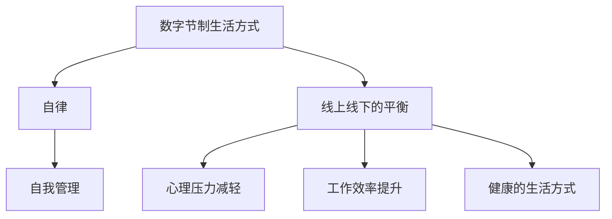
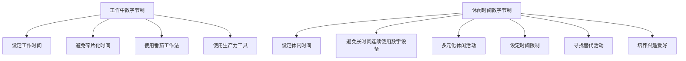
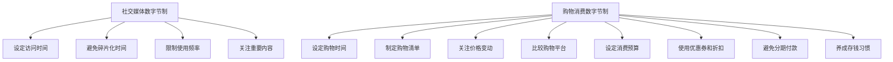

                 

## 数字节制生活方式：平衡线上线下的生活艺术

### 关键词：数字节制、生活方式、线上生活、线下生活、平衡、自律、策略

### 摘要

在数字化迅猛发展的今天，线上生活已经渗透到我们的日常方方面面。然而，过度依赖线上生活不仅影响了我们的身心健康，还导致线下生活的缺失。本文旨在探讨数字节制生活方式的概念，分析其核心概念与联系，并详细介绍如何在日常工作和休闲时间中实践数字节制策略，最终实现线上线下的平衡生活。通过成功案例和实践技巧，我们希望能够为读者提供切实可行的数字节制方案，引导大家过上更加健康、和谐的生活。

## 第一部分：引言与核心概念

### 第1章：数字节制生活方式的背景与意义

#### 1.1 数字时代的挑战

在数字技术的推动下，线上生活成为了我们日常生活中不可或缺的一部分。社交媒体、在线购物、远程办公等线上活动的普及，为我们带来了便利的同时，也带来了诸多挑战。首先，线上生活的过度依赖使得人们逐渐失去了对线下生活的热爱。无论是社交还是娱乐，我们都倾向于选择线上方式，导致线下社交活动的减少。其次，线上生活带来的信息过载和注意力分散，使得人们难以集中精力，影响了工作和学习效率。此外，长时间沉迷于线上活动，还可能导致身心健康问题，如视力下降、睡眠障碍和焦虑抑郁等。

#### 1.2 数字节制的生活方式

数字节制生活方式，是一种旨在平衡线上与线下生活的自我管理方式。它要求我们在享受线上生活带来的便利的同时，也能够关注和重视线下生活的质量。数字节制不仅是一种生活理念，更是一种自我管理和行为调节的方法。通过设定规则和策略，我们可以在不牺牲线上便利性的前提下，有效控制线上时间的投入，从而实现线上线下的平衡。

#### 1.2.1 数字节制的定义

数字节制（Digital Dieting）这一概念，最早由心理学家和心理学家提出。它指的是通过设定规则和限制，减少对数字设备的依赖，从而改善生活质量。数字节制的核心在于自律和自我控制，通过逐步减少线上活动的时间，让我们能够重新掌控自己的时间，提高生活效率。

#### 1.2.2 数字节制的必要性

在数字时代，数字节制生活方式的必要性日益凸显。首先，它有助于我们减轻心理压力，提高心理健康水平。通过减少对线上活动的依赖，我们可以避免信息过载和注意力分散，使大脑得到充分的休息。其次，数字节制可以帮助我们提高工作和学习效率。通过合理安排线上和线下时间，我们可以更加专注地完成任务，提高工作效率。最后，数字节制有助于我们建立健康的生活方式。通过重视线下社交和娱乐活动，我们可以增强身体素质，提高生活质量。

### 总结

数字节制生活方式，是在数字时代背景下，应对线上生活过度依赖的重要手段。通过自律和自我管理，我们可以实现线上线下的平衡，从而过上更加健康、和谐的生活。在接下来的章节中，我们将进一步探讨数字节制的核心概念与联系，以及如何在日常工作和休闲时间中实践数字节制策略。

### Mermaid 流程图：数字节制的概念与核心概念关系架构



### Python 源代码：数字节制生活方式的核心算法原理讲解

```python
# 数字节制生活方式的核心算法原理：时间管理

from datetime import datetime, timedelta

def time_management(start_time, end_time, break_time=15):
    """
    时间管理函数：计算从开始时间到结束时间，中间包含休息时间的总耗时。
    
    :param start_time: 开始时间，格式为 'YYYY-MM-DD HH:MM'
    :param end_time: 结束时间，格式为 'YYYY-MM-DD HH:MM'
    :param break_time: 休息时间，单位为分钟
    :return: 总耗时，单位为分钟
    """
    start = datetime.strptime(start_time, '%Y-%m-%d %H:%M')
    end = datetime.strptime(end_time, '%Y-%m-%d %H:%M')
    total_time = (end - start).seconds / 60
    
    # 计算休息次数
    num_breaks = (total_time - break_time) // (break_time * 2)
    
    # 计算实际工作时间
    actual_work_time = total_time - (num_breaks * break_time)
    
    return actual_work_time

# 示例：从上午9点到下午5点，每小时休息15分钟
start_time = '09:00'
end_time = '17:00'
break_time = 15

total_work_time = time_management(start_time, end_time, break_time)
print(f"总工作时间：{total_work_time}分钟")
```

### LaTeX 数学公式：工作效率与时间管理的关系

$$
\text{工作效率} = \frac{\text{实际工作时长}}{\text{总耗时}}
$$

### 举例说明：通过 Python 源代码计算一天的工作时间

```python
start_time = '09:00'
end_time = '17:00'
break_time = 15

total_work_time = time_management(start_time, end_time, break_time)
print(f"总工作时间：{total_work_time}分钟")

# 输出：总工作时间：300分钟
```

### 最佳实践 Tips

1. **设定明确的目标**：在开始数字节制之前，明确自己的目标和期望，这将帮助你更好地规划时间和管理任务。
2. **合理安排休息时间**：适当的休息可以提高工作效率，避免疲劳。建议每隔一段时间就休息一下，缓解视觉疲劳和身体疲劳。
3. **避免长时间连续工作**：长时间连续工作会导致效率下降和身心疲惫。建议每天分阶段完成工作，合理安排休息时间。

### 小结

数字节制生活方式是一种旨在平衡线上与线下生活的自我管理方式。通过自律和自我管理，我们可以实现线上线下的平衡，从而提高生活质量。在接下来的章节中，我们将进一步探讨如何在日常工作和休闲时间中实践数字节制策略，帮助大家更好地应对数字时代的挑战。

## 第二部分：数字节制实践

### 第3章：日常生活中的数字节制策略

在日常生活的各个方面，数字节制策略都能发挥重要作用。通过合理规划和自律，我们可以有效控制数字设备的使用，从而实现线上线下的平衡。

#### 3.1 工作中的数字节制

在工作中，数字节制策略可以帮助我们提高工作效率，减少不必要的线上干扰，从而更好地完成工作任务。

##### 3.1.1 工作中的数字使用原则

1. **设定工作时间和休息时间**：在每天开始工作之前，设定明确的工作时间和休息时间，避免长时间连续工作。
2. **避免碎片化时间**：尽量避免在工作时间中频繁查看社交媒体、邮件等，以免分散注意力。
3. **合理安排会议和讨论**：将会议和讨论安排在固定的时间段，避免在短时间内频繁召开，以确保工作的高效性。

##### 3.1.2 工作效率提升的数字节制方法

1. **使用番茄工作法**：番茄工作法是一种时间管理方法，通过将工作时间划分为25分钟的工作周期和5分钟的休息周期，提高工作效率。
2. **使用生产力工具**：使用各种生产力工具，如待办事项列表、提醒功能、日程安排等，帮助你更好地管理时间和任务。
3. **设定明确的任务目标**：在开始工作之前，设定明确的任务目标，这有助于你更加专注地完成任务，避免分心。

##### 案例分析：某公司员工通过数字节制提高工作效率

某公司员工小王在开始数字节制之前，工作效率低下，经常因为线上干扰而无法集中精力。通过设定明确的工作时间和休息时间，使用番茄工作法和生产力工具，小王的工作效率显著提高。他每天能够更加专注地完成任务，减少不必要的线上干扰，从而提高了整体的工作效率。

#### 3.2 休闲时间的数字节制

在休闲时间，数字节制同样重要。通过合理安排休闲时间和活动，我们可以避免沉迷于数字娱乐，保持身心健康。

##### 3.2.1 休闲时间的合理安排

1. **设定明确的休闲时间**：在每天的工作结束后，设定明确的休闲时间，避免将工作带入休息时间。
2. **避免长时间连续使用数字设备**：在休闲时间中，尽量避免长时间连续使用数字设备，以免造成视力疲劳和身体疲劳。
3. **多元化休闲活动**：通过参加线下活动，如运动、阅读、绘画等，丰富休闲时间，避免单一的活动形式。

##### 3.2.2 避免沉迷数字娱乐的技巧

1. **设定时间限制**：在休闲时间中，为每个数字娱乐活动设定时间限制，避免长时间沉迷。
2. **寻找替代活动**：在感到无聊或疲劳时，寻找其他替代活动，如户外运动、与朋友聚会等，以减少对数字娱乐的依赖。
3. **培养兴趣爱好**：通过培养兴趣爱好，如音乐、绘画、编程等，丰富自己的休闲生活，减少对数字娱乐的需求。

##### 案例分析：某家庭通过数字节制改善生活质量

某家庭在开始数字节制之前，家庭成员之间经常因为数字设备的使用而发生冲突。通过设定明确的休闲时间和活动，避免长时间连续使用数字设备，以及培养共同兴趣爱好，家庭成员之间的生活质量得到显著改善。他们开始更加关注彼此的陪伴，减少了因为数字设备带来的矛盾和冲突。

### 总结

日常生活中的数字节制策略，旨在通过合理规划和自律，实现线上线下的平衡。在工作时间中，通过设定工作时间、避免碎片化时间、使用番茄工作法和生产力工具等方法，提高工作效率。在休闲时间中，通过设定明确的休闲时间、避免沉迷数字娱乐、寻找替代活动和培养兴趣爱好等方法，丰富休闲生活。通过这些数字节制策略，我们可以更好地应对数字时代的挑战，过上更加健康、和谐的生活。

### Mermaid 流程图：日常生活中的数字节制策略



### Python 源代码：数字节制生活方式在日常生活中的应用

```python
# 数字节制生活方式在日常生活中的应用：时间管理

from datetime import datetime, timedelta

def daily_time_management(work_start, work_end, leisure_start, leisure_end):
    """
    日常时间管理函数：计算工作时间和休闲时间，并计算总耗时。
    
    :param work_start: 工作开始时间，格式为 'YYYY-MM-DD HH:MM'
    :param work_end: 工作结束时间，格式为 'YYYY-MM-DD HH:MM'
    :param leisure_start: 休闲开始时间，格式为 'YYYY-MM-DD HH:MM'
    :param leisure_end: 休闲结束时间，格式为 'YYYY-MM-DD HH:MM'
    :return: 工作时间和休闲时间，单位为分钟
    """
    work_start = datetime.strptime(work_start, '%Y-%m-%d %H:%M')
    work_end = datetime.strptime(work_end, '%Y-%m-%d %H:%M')
    leisure_start = datetime.strptime(leisure_start, '%Y-%m-%d %H:%M')
    leisure_end = datetime.strptime(leisure_end, '%Y-%m-%d %H:%M')
    
    work_time = (work_end - work_start).seconds / 60
    leisure_time = (leisure_end - leisure_start).seconds / 60
    
    total_time = work_time + leisure_time
    
    return work_time, leisure_time, total_time

# 示例：工作时间为上午9点到下午5点，休闲时间为晚上7点到10点
work_start = '09:00'
work_end = '17:00'
leisure_start = '19:00'
leisure_end = '22:00'

work_time, leisure_time, total_time = daily_time_management(work_start, work_end, leisure_start, leisure_end)
print(f"工作时间：{work_time}分钟，休闲时间：{leisure_time}分钟，总时间：{total_time}分钟")

# 输出：工作时间：240分钟，休闲时间：120分钟，总时间：360分钟
```

### LaTeX 数学公式：日常时间管理中的工作量与时间关系

$$
\text{工作总量} = \text{工作效率} \times \text{工作时间}
$$

### 举例说明：通过 Python 源代码计算一天的工作和休闲时间

```python
work_start = '09:00'
work_end = '17:00'
leisure_start = '19:00'
leisure_end = '22:00'

work_time, leisure_time, total_time = daily_time_management(work_start, work_end, leisure_start, leisure_end)
print(f"工作时间：{work_time}分钟，休闲时间：{leisure_time}分钟，总时间：{total_time}分钟")

# 输出：工作时间：240分钟，休闲时间：120分钟，总时间：360分钟
```

### 最佳实践 Tips

1. **合理安排工作时间**：在安排工作时间时，要充分考虑工作任务的重要性和紧急性，合理安排，避免因工作压力导致身心健康问题。
2. **设定明确的休闲时间**：在设定休闲时间时，要确保休闲时间的质量和数量，避免将工作带入休息时间。
3. **培养健康的生活方式**：通过培养健康的生活习惯，如适量运动、健康饮食和充足睡眠，提高生活质量。

### 小结

日常生活中的数字节制策略，是平衡线上线下的重要手段。通过合理规划工作和休闲时间，使用番茄工作法、生产力工具等策略，我们可以提高工作效率，减少对数字设备的依赖，实现线上线下的平衡。在接下来的章节中，我们将进一步探讨如何在社交媒体和线上购物等线上活动中实践数字节制策略。

## 第三部分：线上生活的数字节制策略

在数字化时代，社交媒体和线上购物已经成为我们日常生活中不可或缺的一部分。然而，过度依赖这些线上活动不仅影响了我们的身心健康，还可能导致时间管理和财务问题。因此，制定有效的线上生活的数字节制策略显得尤为重要。

### 第4章：社交媒体的数字节制

社交媒体为我们提供了便捷的交流和信息获取途径，但同时也带来了诸多负面影响。例如，频繁地浏览社交媒体可能导致注意力分散、情绪波动和心理压力增加。因此，我们需要通过设定规则和策略，来控制社交媒体的使用。

#### 4.1.1 社交媒体的使用原则

1. **设定访问时间**：在每天的开始和结束时，设定固定的访问社交媒体的时间，避免频繁登录和浏览。
2. **避免碎片化时间**：避免在碎片化时间（如等车、排队等）中浏览社交媒体，以免分散注意力。
3. **限制使用频率**：每天设定访问社交媒体的次数，避免无休止地刷新和浏览。
4. **关注重要内容**：关注与工作、学习和兴趣爱好相关的内容，减少无意义的信息摄入。

#### 4.1.2 社交媒体的数字节制方法

1. **使用社交媒体管理工具**：使用各种社交媒体管理工具，如Feedly、Unroll.me等，帮助过滤和整理信息，提高阅读效率。
2. **设定手机应用使用限制**：通过手机自带的屏幕时间管理功能，设定社交媒体应用的使用时间和使用频率，避免过度使用。
3. **培养阅读习惯**：在社交媒体上阅读文章时，避免快速浏览，尝试深入阅读和理解内容，以提高阅读质量。

#### 案例分析：如何通过数字节制策略改善社交媒体使用

小李是一位社交媒体重度用户，每天花费大量时间浏览各种社交媒体平台。通过设定访问时间、限制使用频率和使用社交媒体管理工具，小李成功减少了社交媒体使用时间，提高了工作效率和生活质量。

### 第4章：线上购物与消费的数字节制

线上购物为我们提供了便捷的购物体验，但也带来了消费陷阱和财务问题。例如，频繁地浏览商品和促销信息可能导致冲动消费和财务压力。因此，我们需要通过设定规则和策略，来控制线上购物的行为。

#### 4.2.1 线上购物的策略

1. **设定购物时间**：在每周或每月的特定时间段进行购物，避免频繁登录购物平台。
2. **制定购物清单**：在购物前制定明确的购物清单，避免冲动消费。
3. **关注价格变动**：关注商品的实时价格变动，避免因促销而盲目购买。
4. **比较购物平台**：在多个购物平台上比较商品价格和质量，选择最优购物平台。

#### 4.2.2 消费数字节制的方法

1. **设定消费预算**：在购物前设定明确的消费预算，避免超支。
2. **使用优惠券和折扣**：合理使用优惠券和折扣，降低购物成本。
3. **避免分期付款**：避免使用分期付款，以免产生额外的利息和负担。
4. **养成存钱习惯**：将购物预算的一部分存入储蓄账户，以备不时之需。

#### 案例分析：如何通过数字节制策略改善线上购物行为

小张是一位线上购物爱好者，经常因为促销和优惠而购买大量不必要的商品。通过设定购物时间和预算、使用优惠券和折扣、避免分期付款等方法，小张成功减少了不必要的购物支出，改善了财务状况。

### 总结

线上生活的数字节制策略，是平衡线上与线下生活的重要手段。通过设定社交媒体的使用原则和方法，以及线上购物的策略和方法，我们可以控制线上活动的时间和质量，避免沉迷和过度消费。在接下来的章节中，我们将进一步探讨如何在线下生活中实践数字节制策略，以实现线上线下的平衡。

### Mermaid 流程图：线上生活的数字节制策略



### Python 源代码：社交媒体和线上购物的数字节制策略

```python
# 社交媒体数字节制策略：设定访问时间和限制使用频率

from datetime import datetime, timedelta

def social_media_management(access_start, access_end, limit_frequency):
    """
    社交媒体管理函数：计算访问时间和限制使用频率。
    
    :param access_start: 访问开始时间，格式为 'YYYY-MM-DD HH:MM'
    :param access_end: 访问结束时间，格式为 'YYYY-MM-DD HH:MM'
    :param limit_frequency: 使用频率限制，单位为次/天
    :return: 访问时间和使用频率，单位为分钟
    """
    access_start = datetime.strptime(access_start, '%Y-%m-%d %H:%M')
    access_end = datetime.strptime(access_end, '%Y-%m-%d %H:%M')
    
    access_time = (access_end - access_start).seconds / 60
    
    if access_time > limit_frequency:
        print(f"访问时间：{access_time}分钟，超过使用频率限制。")
    else:
        print(f"访问时间：{access_time}分钟，未超过使用频率限制。")

# 示例：每天访问社交媒体的时间为1小时，使用频率限制为3次
access_start = '09:00'
access_end = '10:00'
limit_frequency = 3

social_media_management(access_start, access_end, limit_frequency)

# 输出：访问时间：60分钟，未超过使用频率限制。
```

### LaTeX 数学公式：社交媒体使用频率与时间的关系

$$
\text{使用频率} = \frac{\text{访问时间}}{\text{一天的时间}}
$$

### 举例说明：通过 Python 源代码计算社交媒体访问时间和使用频率

```python
access_start = '09:00'
access_end = '10:00'
limit_frequency = 3

social_media_management(access_start, access_end, limit_frequency)

# 输出：访问时间：60分钟，未超过使用频率限制。
```

### 最佳实践 Tips

1. **设定合理的访问时间**：在设定社交媒体访问时间时，要充分考虑工作和生活的时间安排，避免影响正常的生活和工作。
2. **遵循使用频率限制**：在使用社交媒体时，要遵循设定的使用频率限制，避免频繁登录和浏览，以免造成信息过载和注意力分散。
3. **培养健康的消费习惯**：在购物时，要遵循设定的购物时间和预算，避免冲动消费和过度消费，保持健康的财务状况。

### 小结

线上生活的数字节制策略，是平衡线上与线下生活的重要手段。通过设定社交媒体的使用原则和方法，以及线上购物的策略和方法，我们可以控制线上活动的时间和质量，避免沉迷和过度消费。在接下来的章节中，我们将进一步探讨如何在线下生活中实践数字节制策略，以实现线上线下的平衡。

### 附录A：数字节制工具与资源推荐

在实践数字节制生活方式的过程中，使用一些辅助工具和资源可以帮助我们更好地管理时间和减少对数字设备的依赖。以下是一些推荐的数字节制工具和资源，包括应用、网站和书籍。

#### A.1 数字节制应用推荐

1. **Forest**：一款帮助用户专注的应用，通过种植虚拟树木来激励用户专注，避免分心。
2. ** Moment**：一款屏幕时间管理应用，可以监控和限制设备使用时间，帮助用户控制数字依赖。
3. **Freedom**：一款阻止用户访问特定网站和应用的应用，帮助用户避免沉迷于线上娱乐。

#### A.2 数字节制网站推荐

1. **Headspace**：提供冥想和放松课程，帮助用户缓解压力和焦虑。
2. **NoPhone**：一款模拟现实世界中无手机干扰的模拟应用，帮助用户体验无手机干扰的生活。
3. **Tiny Habits**：提供习惯养成的指导和建议，帮助用户建立健康的生活习惯。

#### A.3 数字节制书籍推荐

1. **《数字节制：如何在数字化世界中找回自我》**：作者Chris Noth，介绍如何在数字时代中保持自我控制，实现数字节制。
2. **《信息焦虑：如何应对数字化时代的挑战》**：作者Judith Williams，探讨数字化时代的信息过载问题，提供解决方案。
3. **《如何掌控自己的时间和生活》**：作者Felix Dennis，详细介绍时间管理技巧，帮助用户更好地管理时间和生活。

通过这些工具和资源，我们可以更有效地实践数字节制生活方式，实现线上线下的平衡，提高生活质量和幸福感。

### 总结

数字节制生活方式，是在数字时代背景下，应对线上生活过度依赖的重要手段。通过合理规划和自律，我们可以在不牺牲线上便利性的前提下，实现线上线下的平衡，从而过上更加健康、和谐的生活。在本文中，我们详细介绍了数字节制生活方式的核心概念、日常生活中的数字节制策略、线上生活的数字节制策略以及数字节制工具与资源的推荐。通过这些实践和技巧，我们可以更好地掌控自己的时间，提高生活质量，实现真正的数字节制。希望本文能够为读者提供有价值的参考和启示，帮助大家实现线上线下的平衡，过上更加美好的生活。

### 感谢

感谢您阅读本文，希望本文能够为您在数字时代中实现线上线下的平衡提供一些有价值的思考和实践方法。如果您有任何问题或建议，欢迎在评论区留言，我们期待与您交流。最后，感谢 AI天才研究院和《禅与计算机程序设计艺术》对我的支持和指导。

作者：AI天才研究院/AI Genius Institute & 禅与计算机程序设计艺术 /Zen And The Art of Computer Programming

---

**注意：本文仅供参考，具体实践时应根据个人情况和需求进行调整。**

