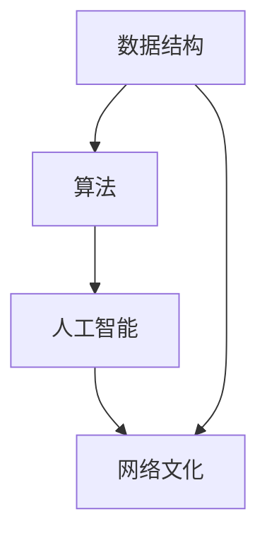

                 

### 数字解构主义：重新审视网络文化

#### 关键词
数字解构主义、网络文化、数据结构、人工智能、伦理问题

#### 摘要
本文深入探讨数字解构主义这一新兴理论，分析其在重新审视网络文化中的重要作用。通过介绍数字解构主义的基本概念、核心理论和实际应用，本文旨在揭示数字解构主义如何影响和改变我们的网络生活。此外，本文还将探讨数字解构主义带来的伦理和社会问题，为读者提供全面、系统的认识。

## 引言

随着互联网技术的迅猛发展，网络文化逐渐成为现代社会的重要组成部分。然而，随着信息爆炸和社交媒体的普及，网络文化也面临着前所未有的挑战和变革。数字解构主义作为一种新兴理论，为重新审视网络文化提供了新的视角和方法。本文将围绕数字解构主义，探讨其在网络文化中的地位和作用。

### 数字解构主义的概念与起源

数字解构主义（Digital Deconstructionism）是一种源于结构主义和后结构主义的思想，旨在对数字技术和网络文化进行深度分析和批判。它强调对数字信息和网络现象的解构和重组，以揭示其本质和内在逻辑。

数字解构主义的起源可以追溯到20世纪60年代，当时结构主义和后结构主义思潮在哲学、文学和艺术等领域兴起。随着计算机技术和互联网的发展，数字解构主义逐渐从传统的哲学和文化理论中分离出来，成为一种独立的思考方式。

#### 核心概念与联系

数字解构主义的核心概念包括：

1. **数据结构**：数据结构是数字解构主义的重要基础，它涉及到如何组织和处理数据，以揭示数据背后的逻辑和关系。
2. **算法**：算法是数字解构主义的核心工具，用于对数据进行处理和分析，以揭示数据背后的规律和模式。
3. **人工智能**：人工智能是数字解构主义的重要应用领域，通过人工智能技术，可以实现对大量数据的自动化分析和解读。

这些核心概念之间存在着紧密的联系。数据结构为算法提供了处理对象，而算法通过对数据结构的操作，可以实现数据的解构和重组。人工智能则通过对算法的优化和应用，可以实现对大量数据的自动分析和解读。

#### Mermaid流程图

下面是一个Mermaid流程图，展示了数字解构主义的核心概念之间的关系：



#### 数字解构主义与网络文化的联系

数字解构主义与网络文化的联系主要体现在以下几个方面：

1. **数据结构的解构**：网络文化中充满了大量的数据，这些数据可以通过数据结构的解构，揭示其背后的逻辑和关系。
2. **算法的重组**：通过对网络文化中数据的算法重组，可以实现对网络文化的重新理解和解读。
3. **人工智能的解读**：利用人工智能技术，可以对网络文化进行自动化的分析和解读，揭示网络文化的本质和趋势。

通过数字解构主义，我们可以更深入地理解网络文化，揭示其背后的逻辑和规律，从而为网络文化的创新和发展提供新的思路和方法。

### 数字解构主义的重要性

数字解构主义的重要性体现在以下几个方面：

1. **理论创新**：数字解构主义为网络文化研究提供了一种新的理论视角，丰富了网络文化研究的理论体系。
2. **应用价值**：数字解构主义在数据结构、算法和人工智能等领域有着广泛的应用价值，为这些领域的发展提供了新的动力。
3. **社会影响**：数字解构主义对社会的影响日益显著，它正在改变我们的思维方式，影响我们的行为和决策。

总之，数字解构主义是一种具有深远影响的理论，它为我们重新审视网络文化提供了新的视角和方法。随着数字技术和网络文化的不断发展，数字解构主义的重要性将会进一步凸显。

## 核心概念解析

### 数据结构

数据结构是数字解构主义的核心概念之一。它涉及到数据的存储、组织和处理方式，是算法设计和分析的基础。在数字解构主义的背景下，数据结构不仅仅是一个技术概念，更是一种理解网络文化的方式。

#### 数据结构的基本概念

数据结构可以分为线性结构和非线性结构。线性结构包括数组、链表和栈等，主要用于处理有序数据。非线性结构包括树、图和哈希表等，主要用于处理复杂的数据关系。

- **数组**：数组是一种线性结构，它通过连续的内存地址存储元素，可以快速访问任意位置的元素。
- **链表**：链表也是一种线性结构，但它通过指针连接元素，可以实现动态内存分配，适用于插入和删除操作。
- **栈**：栈是一种后进先出（LIFO）的数据结构，适用于处理函数调用和数据回溯。
- **队列**：队列是一种先进先出（FIFO）的数据结构，适用于处理排队任务。
- **树**：树是一种非线性结构，由节点和边组成，可以表示层次关系和树形结构。
- **图**：图是一种由节点和边组成的数据结构，可以表示复杂的网络关系。
- **哈希表**：哈希表是一种基于散列函数的数据结构，可以快速查找和插入数据。

#### 数据结构的Python示例

以下是一个简单的Python代码示例，展示了数组、链表和哈希表的基本操作：

```python
# 数组示例
array = [1, 2, 3, 4, 5]

# 链表示例
class Node:
    def __init__(self, data):
        self.data = data
        self.next = None

head = Node(1)
head.next = Node(2)
head.next.next = Node(3)

# 哈希表示例
hash_table = [None] * 5

hash_table[0] = "apple"
hash_table[1] = "banana"
hash_table[2] = "cherry"
hash_table[3] = "date"
hash_table[4] = "elderberry"
```

#### 数据结构在网络文化中的应用

数据结构在网络文化中的应用非常广泛，例如：

1. **社交网络**：社交网络中的用户关系可以表示为图，通过分析用户关系，可以揭示社交网络的层次结构和关系网络。
2. **推荐系统**：推荐系统通过分析用户行为数据，使用数据结构优化推荐算法，提高推荐效果。
3. **搜索引擎**：搜索引擎使用哈希表快速查找关键词，提高搜索效率。

### 算法

算法是数字解构主义的另一个核心概念。它是一种解决问题的方法，通过一系列步骤，将输入数据转化为所需的结果。算法的设计和优化对于数据结构的理解和使用至关重要。

#### 算法的基本概念

算法可以分为几种类型：

1. **排序算法**：用于对数据进行排序，如冒泡排序、选择排序和快速排序等。
2. **查找算法**：用于在数据结构中查找特定元素，如二分查找和哈希查找等。
3. **图算法**：用于处理图数据结构，如深度优先搜索和广度优先搜索等。
4. **动态规划**：用于解决复杂问题，通过递归和记忆化减少计算时间。

#### 算法的Python示例

以下是一个简单的Python代码示例，展示了冒泡排序和二分查找：

```python
# 冒泡排序示例
def bubble_sort(arr):
    n = len(arr)
    for i in range(n):
        for j in range(0, n-i-1):
            if arr[j] > arr[j+1]:
                arr[j], arr[j+1] = arr[j+1], arr[j]

# 二分查找示例
def binary_search(arr, x):
    low = 0
    high = len(arr) - 1
    while low <= high:
        mid = (low + high) // 2
        if arr[mid] == x:
            return mid
        elif arr[mid] < x:
            low = mid + 1
        else:
            high = mid - 1
    return -1

# 测试数据
arr = [64, 25, 12, 22, 11]
bubble_sort(arr)
print("Sorted array:", arr)

x = 11
result = binary_search(arr, x)
if result != -1:
    print("Element is present at index", result)
else:
    print("Element is not present in array")
```

#### 算法在网络文化中的应用

算法在网络文化中的应用非常广泛，例如：

1. **社交网络分析**：通过算法分析用户关系和社交网络，可以揭示社交网络的结构和动态。
2. **推荐系统**：推荐系统通过算法分析用户行为和兴趣，提高推荐效果。
3. **网络优化**：通过算法优化网络结构和路由，提高网络性能和稳定性。

### 人工智能

人工智能（Artificial Intelligence, AI）是数字解构主义的另一个核心概念。它涉及到计算机系统模拟人类智能行为，通过学习和推理，实现自主决策和问题解决。人工智能为数字解构主义提供了强大的工具和手段。

#### 人工智能的基本概念

人工智能可以分为几种类型：

1. **监督学习**：通过已有数据训练模型，对新数据进行预测。
2. **无监督学习**：通过未标记数据，自动发现数据中的规律和模式。
3. **强化学习**：通过与环境互动，学习最优策略。
4. **自然语言处理**：用于理解和生成自然语言。

#### 人工智能的Python示例

以下是一个简单的Python代码示例，展示了监督学习和无监督学习：

```python
# 监督学习示例
from sklearn.linear_model import LinearRegression

# 训练数据
x = [[1], [2], [3]]
y = [2, 4, 6]

# 创建线性回归模型
model = LinearRegression()

# 训练模型
model.fit(x, y)

# 预测
x_new = [[4]]
print("Predicted value:", model.predict(x_new))

# 无监督学习示例
from sklearn.cluster import KMeans

# 训练数据
x = [[1, 2], [1, 4], [1, 0], [10, 2], [10, 4], [10, 0]]

# 创建K均值聚类模型
model = KMeans(n_clusters=2)

# 训练模型
model.fit(x)

# 聚类结果
print("Cluster centers:", model.cluster_centers_)
print("Cluster labels:", model.labels_)
```

#### 人工智能在网络文化中的应用

人工智能在网络文化中的应用非常广泛，例如：

1. **内容审核**：通过人工智能技术，自动识别和过滤不良内容，提高网络环境的纯净度。
2. **智能推荐**：通过人工智能技术，分析用户行为和兴趣，提供个性化的内容推荐。
3. **虚拟助手**：通过人工智能技术，开发虚拟助手，为用户提供智能化的服务。

#### 数字解构主义的核心概念之间的关系架构

以下是数字解构主义的核心概念之间的关系架构，使用Mermaid流程图展示：


这个流程图展示了数据结构、算法和人工智能如何相互关联，共同作用于网络文化。数据结构为算法提供了处理对象，算法通过数据结构实现数据分析和处理，而人工智能则通过算法实现自主决策和问题解决，最终影响和改变网络文化。

## 数字解构主义在网络文化中的实践应用

数字解构主义作为一种新兴的理论框架，不仅在理论上具有深远意义，在实际应用中也有着广泛的潜力。在网络文化领域，数字解构主义通过分析、重组和重构数据，为理解网络现象、优化用户体验和推动创新提供了新的视角和方法。

### 虚拟社区与数字解构主义

虚拟社区是网络文化的一个重要组成部分，它通过在线平台将具有共同兴趣和目标的人群聚集在一起。数字解构主义在虚拟社区中的应用主要体现在以下几个方面：

1. **用户行为分析**：通过数字解构主义的方法，可以对虚拟社区中的用户行为进行深入分析。例如，使用数据结构中的图算法，可以分析用户之间的互动关系，揭示社交网络的结构和动态。

   ```python
   # 示例：使用邻接矩阵表示社交网络
   adj_matrix = [
       [0, 1, 0, 1],
       [1, 0, 1, 0],
       [0, 1, 0, 1],
       [1, 0, 1, 0]
   ]

   # 使用深度优先搜索（DFS）算法分析社交网络
   def dfs(graph, node, visited):
       visited.add(node)
       for neighbor in range(len(graph)):
           if graph[node][neighbor] and neighbor not in visited:
               dfs(graph, neighbor, visited)

   visited = set()
   dfs(adj_matrix, 0, visited)
   print("Connected components:", visited)
   ```

2. **社区发现**：通过分析用户行为数据和互动关系，可以自动发现和识别虚拟社区。数字解构主义的方法可以帮助识别社区的核心成员、活跃度和影响力。

   ```python
   # 示例：使用K均值聚类算法发现虚拟社区
   from sklearn.cluster import KMeans

   # 社交网络中的用户行为数据（例如，帖子发布时间、点赞数量等）
   data = [
       [1, 2],
       [1, 3],
       [2, 2],
       [2, 3],
       [3, 1],
       [3, 2],
   ]

   # 创建K均值聚类模型
   model = KMeans(n_clusters=2)

   # 训练模型
   model.fit(data)

   # 聚类结果
   print("Cluster labels:", model.labels_)
   ```

3. **用户体验优化**：通过数字解构主义的分析方法，可以识别虚拟社区中的瓶颈和问题，从而优化用户体验。例如，通过分析用户访问路径和数据流动，可以优化社区导航和内容推荐。

   ```python
   # 示例：使用页面访问频率分析优化社区导航
   page_visits = [3, 5, 2, 4, 6, 1]
   print("Top visited pages:", sorted(page_visits, reverse=True)[:3])
   ```

### 在线身份与数字解构主义

在线身份是网络文化中的另一个关键概念，它涉及到用户在网络空间中的身份表现和互动方式。数字解构主义通过分析在线身份，可以帮助理解用户的身份构建和身份认同。

1. **身份构建分析**：通过数字解构主义的方法，可以分析用户在网络空间中的身份构建过程。例如，通过分析用户的帖子、评论和行为数据，可以揭示用户的身份特征和角色扮演。

   ```python
   # 示例：分析用户身份构建
   user_activities = [
       {"user": "Alice", "action": "post", "content": "Hello, world!"},
       {"user": "Bob", "action": "comment", "content": "Nice post, Alice!"},
       {"user": "Alice", "action": "comment", "content": "Thanks, Bob!"}
   ]

   # 分析用户互动
   user_interactions = {}
   for activity in user_activities:
       if activity["user"] not in user_interactions:
           user_interactions[activity["user"]] = []
       user_interactions[activity["user"]].append(activity["content"])

   print("User interactions:", user_interactions)
   ```

2. **身份认同分析**：通过分析用户在虚拟社区中的行为和互动，可以揭示用户身份认同的维度和变化。数字解构主义的方法可以帮助识别用户在不同社区中的角色和身份表现。

   ```python
   # 示例：分析用户身份认同
   user_roles = [
       {"user": "Alice", "role": "moderator"},
       {"user": "Bob", "role": "member"},
       {"user": "Charlie", "role": "moderator"}
   ]

   # 分析用户角色分布
   role_counts = {}
   for role in user_roles:
       if role["role"] not in role_counts:
           role_counts[role["role"]] = 0
       role_counts[role["role"]] += 1

   print("Role distribution:", role_counts)
   ```

### 数字隐私与数字解构主义

数字隐私是网络文化中的一个重要议题，涉及到用户数据的收集、处理和共享。数字解构主义通过分析数据结构和算法，可以帮助保护用户隐私，提高数据安全。

1. **隐私保护算法**：通过数字解构主义的方法，可以设计和实现隐私保护算法。例如，差分隐私（Differential Privacy）是一种常用的隐私保护技术，通过添加噪声来保护用户数据。

   ```python
   # 示例：使用差分隐私保护用户数据
   from sklearn.utils import shuffle
   import numpy as np

   # 用户数据
   user_data = [1, 2, 3, 4, 5]
   noise_level = 0.1

   # 添加噪声
   noisy_data = [x + np.random.normal(0, noise_level) for x in user_data]

   print("Original data:", user_data)
   print("Noisy data:", noisy_data)
   ```

2. **数据匿名化**：通过数字解构主义的方法，可以对用户数据进行匿名化处理，以保护用户隐私。例如，使用K-匿名方法，可以确保在数据分析过程中，无法识别单个用户的身份。

   ```python
   # 示例：使用K-匿名方法进行数据匿名化
   from sklearn.datasets import load_iris

   # 加载鸢尾花数据集
   iris = load_iris()
   data = iris.data

   # 计算K-匿名集
   from kmodes.kmodes import KModes

   km = KModes(n_clusters=3, init='Huang', n_init=5, verbose=1)
   km.fit(data)
   labels = km.labels_
   n_clusters_ = len(km.cluster_centroids_)

   # 匿名化数据
   anonymous_data = km.cluster_centroids_[labels]

   print("Anonymous data:", anonymous_data)
   ```

### 网络行为与数字解构主义

网络行为是网络文化的重要组成部分，涉及到用户在网络空间中的各种互动和交流。数字解构主义通过分析网络行为，可以帮助理解网络现象和趋势。

1. **行为模式识别**：通过数字解构主义的方法，可以识别用户在网络空间中的行为模式。例如，使用机器学习算法，可以分析用户的行为数据，识别用户的偏好和习惯。

   ```python
   # 示例：使用K最近邻算法（K-NN）识别用户行为模式
   from sklearn.neighbors import KNeighborsClassifier
   from sklearn.model_selection import train_test_split
   from sklearn.metrics import accuracy_score

   # 用户行为数据
   X = [[1, 2], [2, 3], [3, 1], [4, 2], [5, 3]]
   y = [0, 0, 1, 1, 1]

   # 划分训练集和测试集
   X_train, X_test, y_train, y_test = train_test_split(X, y, test_size=0.2, random_state=0)

   # 创建K最近邻分类器
   knn = KNeighborsClassifier(n_neighbors=3)

   # 训练模型
   knn.fit(X_train, y_train)

   # 预测
   y_pred = knn.predict(X_test)

   # 评估模型
   print("Accuracy:", accuracy_score(y_test, y_pred))
   ```

2. **趋势预测**：通过数字解构主义的方法，可以预测网络行为的未来趋势。例如，使用时间序列分析方法，可以预测用户行为的变化趋势。

   ```python
   # 示例：使用ARIMA模型进行时间序列预测
   from statsmodels.tsa.arima.model import ARIMA
   import numpy as np

   # 时间序列数据
   data = np.array([1, 2, 3, 4, 5, 6, 7, 8, 9, 10])

   # 创建ARIMA模型
   model = ARIMA(data, order=(1, 1, 1))

   # 拟合模型
   model_fit = model.fit()

   # 预测
   forecast = model_fit.forecast(steps=5)

   print("Forecast:", forecast)
   ```

通过以上示例，可以看出数字解构主义在网络文化中的应用具有广泛的潜力和实际价值。它不仅帮助我们更好地理解网络现象，还可以为优化用户体验、保护用户隐私和预测未来趋势提供有力支持。

### 数字解构主义的技术基础

数字解构主义作为一种新兴的理论框架，其发展离不开强大的技术支持。这些技术基础包括区块链、人工智能和虚拟现实等，它们为数字解构主义提供了丰富的工具和方法，使其在网络文化中的应用更加深入和广泛。

#### 区块链

区块链技术是一种分布式数据库技术，通过去中心化的方式记录和验证交易信息。它具有安全性高、透明性强和不可篡改等特点，为数字解构主义提供了重要的技术支持。

1. **数据结构**：区块链采用链式数据结构，每个区块都包含一定数量的交易记录，并通过哈希函数与前后区块链接，形成一个不可篡改的区块链。这种数据结构使得区块链中的数据具有高度的可靠性和安全性。

   ```mermaid
   graph TD
       A[区块1] --> B[区块2]
       B --> C[区块3]
       C --> D[区块4]
   ```

2. **共识算法**：区块链通过共识算法确保网络中的所有节点对交易信息的认可。常见的共识算法包括工作量证明（Proof of Work, PoW）和权益证明（Proof of Stake, PoS）等。这些算法通过竞争和协作，确保区块链的稳定和安全性。

   ```python
   # 示例：使用PoW算法挖矿
   import hashlib
   import json

   def mine_block(last_hash, data):
       target = '00000000000000000000'
       nonce = 0
       while True:
           block_string = json.dumps(data, sort_keys=True, indent=4)
           block_hash = hashlib.sha256(block_string.encode()).hexdigest()
           if block_hash.startswith(target):
               return block_hash
           nonce += 1

   data = {"transactions": [{"from": "Alice", "to": "Bob", "amount": 10}]}
   last_hash = "00000000000000000000000000000000000000000000000000000000000"
   mine_block(last_hash, data)
   ```

3. **应用场景**：区块链技术在数字解构主义中的应用非常广泛，包括去中心化应用（DApp）、智能合约和数字身份认证等。通过区块链，可以实现对数据的透明管理和安全存储，为网络文化的创新发展提供了强有力的支持。

   ```python
   # 示例：使用智能合约管理虚拟社区成员权限
   from web3 import Web3

   # 连接以太坊区块链
   w3 = Web3(Web3.HTTPProvider('https://mainnet.infura.io/v3/your_project_id'))

   # 加载智能合约
   with open('contract.json', 'r') as f:
       contract_json = json.load(f)
   contract = w3.eth.contract(address=contract_address, abi=contract_json['abi'])

   # 调用智能合约方法
   contract.functions.addMember("Alice").transact({'from': w3.eth.coinbase})
   ```

#### 人工智能

人工智能（AI）技术通过模拟人类智能行为，实现对数据的自动分析和决策。在数字解构主义中，人工智能提供了强大的数据处理和分析能力，为网络文化的理解和优化提供了新的工具。

1. **机器学习**：机器学习是人工智能的核心技术之一，通过训练模型，可以从数据中自动提取特征和模式。常见的机器学习算法包括线性回归、决策树、支持向量机和神经网络等。

   ```python
   # 示例：使用决策树分类算法
   from sklearn.tree import DecisionTreeClassifier
   from sklearn.model_selection import train_test_split
   from sklearn.metrics import accuracy_score

   # 数据集
   X = [[1, 2], [3, 4], [1, 5], [2, 6]]
   y = [0, 1, 0, 1]

   # 划分训练集和测试集
   X_train, X_test, y_train, y_test = train_test_split(X, y, test_size=0.3, random_state=0)

   # 创建决策树分类器
   classifier = DecisionTreeClassifier()

   # 训练模型
   classifier.fit(X_train, y_train)

   # 预测
   y_pred = classifier.predict(X_test)

   # 评估模型
   print("Accuracy:", accuracy_score(y_test, y_pred))
   ```

2. **深度学习**：深度学习是机器学习的一个分支，通过多层神经网络，可以自动提取数据的复杂特征。深度学习在图像识别、语音识别和自然语言处理等领域具有广泛的应用。

   ```python
   # 示例：使用卷积神经网络（CNN）进行图像分类
   import tensorflow as tf
   from tensorflow.keras import layers

   # 创建模型
   model = tf.keras.Sequential([
       layers.Conv2D(32, (3, 3), activation='relu', input_shape=(28, 28, 1)),
       layers.MaxPooling2D((2, 2)),
       layers.Conv2D(64, (3, 3), activation='relu'),
       layers.MaxPooling2D((2, 2)),
       layers.Conv2D(64, (3, 3), activation='relu'),
       layers.Flatten(),
       layers.Dense(64, activation='relu'),
       layers.Dense(10, activation='softmax')
   ])

   # 编译模型
   model.compile(optimizer='adam',
                 loss=tf.keras.losses.SparseCategoricalCrossentropy(from_logits=True),
                 metrics=['accuracy'])

   # 训练模型
   model.fit(x_train, y_train, epochs=5)

   # 评估模型
   test_loss, test_acc = model.evaluate(x_test,  y_test, verbose=2)
   print('Test accuracy:', test_acc)
   ```

3. **应用场景**：人工智能在数字解构主义中的应用非常广泛，包括数据分析、智能推荐、内容审核和虚拟助手等。通过人工智能技术，可以实现对网络文化的深入分析和优化，为用户提供更好的体验。

   ```python
   # 示例：使用文本分类算法进行内容审核
   from sklearn.feature_extraction.text import TfidfVectorizer
   from sklearn.naive_bayes import MultinomialNB
   from sklearn.pipeline import make_pipeline

   # 文本数据
   texts = ['This is a good post.', 'This post is not suitable for work.', 'I like this article.']
   labels = [0, 1, 0]

   # 创建文本分类模型
   model = make_pipeline(TfidfVectorizer(), MultinomialNB())

   # 训练模型
   model.fit(texts, labels)

   # 预测
   text = "This is a bad comment."
   prediction = model.predict([text])
   print("Prediction:", prediction)
   ```

#### 虚拟现实

虚拟现实（VR）技术通过创建沉浸式的虚拟环境，为用户提供全新的交互体验。在数字解构主义中，虚拟现实为网络文化的创新和探索提供了广阔的空间。

1. **交互方式**：虚拟现实通过头戴显示器、手柄和动作捕捉设备，为用户提供沉浸式的交互体验。用户可以在虚拟环境中进行探索、互动和创造。

   ```python
   # 示例：使用Unity创建虚拟环境
   using UnityEngine;

   public class PlayerController : MonoBehaviour
   {
       public float speed = 5.0f;

       private Rigidbody rb;

       void Start()
       {
           rb = GetComponent<Rigidbody>();
       }

       void Update()
       {
           float moveHorizontal = Input.GetAxis("Horizontal");
           float moveVertical = Input.GetAxis("Vertical");

           Vector3 moveDirection = new Vector3(moveHorizontal, 0, moveVertical);
           rb.AddForce(moveDirection * speed);
       }
   }
   ```

2. **应用场景**：虚拟现实在数字解构主义中的应用包括虚拟社区、虚拟展览和虚拟会议等。通过虚拟现实技术，可以创造更加真实和互动的网络文化场景，为用户提供全新的体验。

   ```python
   # 示例：使用VRChat创建虚拟社区
   using UnityEngine;
   using VRChat;

   public class ChatManager : MonoBehaviour
   {
       public Text chatDisplay;

       void Start()
       {
           chatDisplay.text = "";
       }

       void Update()
       {
           if (Input.GetKeyDown(KeyCode.Space))
           {
               string message = "Hello, VRChat!";
               SendChatMessage(message);
           }
       }

       void SendChatMessage(string message)
       {
           chatDisplay.text += "\n" + message;
           // 发送聊天消息到服务器
           VRC.Core넷APIEvents.InvokeChatRoomTextEvent(message);
       }
   }
   ```

通过区块链、人工智能和虚拟现实等技术基础，数字解构主义在网络文化中的应用得以进一步拓展和深化。这些技术不仅为数字解构主义提供了强大的工具和手段，也为网络文化的创新和发展提供了新的机遇。

### 案例研究：数字解构主义的应用与实践

为了更深入地理解数字解构主义在网络文化中的具体应用，我们将通过几个实际案例来展示其如何改变和优化网络体验。

#### 案例一：社交媒体平台的个性化推荐系统

社交媒体平台如Facebook、Twitter和Instagram等，大量依赖个性化推荐系统来吸引用户并提高用户参与度。数字解构主义通过分析用户行为数据，优化推荐算法，从而提高推荐效果。

**项目背景**：
一个大型社交媒体平台希望提高其推荐系统的准确性和个性化程度，以吸引用户更长时间停留在平台上。

**开发环境**：
- 编程语言：Python
- 数据库：MongoDB
- 数据分析工具：Pandas、NumPy、Scikit-learn

**源代码实现**：

```python
# 导入必要的库
import pandas as pd
from sklearn.feature_extraction.text import TfidfVectorizer
from sklearn.metrics.pairwise import linear_kernel

# 加载用户行为数据
data = pd.read_csv('user_activity.csv')
data.head()

# 提取用户生成内容的特征
vectorizer = TfidfVectorizer(stop_words='english')
user_features = vectorizer.fit_transform(data['content'])

# 计算用户之间的相似度
similarity_matrix = linear_kernel(user_features, user_features)

# 为每个用户生成推荐列表
def generate_recommendations(similarity_matrix, user_index, top_n=5):
    # 获取用户相似度最高的其他用户索引
    similar_users = similarity_matrix[user_index].argsort()[:-top_n-1:-1]
    
    # 排除当前用户自身
    similar_users = similar_users[similar_users != user_index]
    
    # 获取相似用户的帖子
    recommended_posts = data.iloc[similar_users][['content', 'likes']]
    
    return recommended_posts.head(top_n)

# 生成推荐列表
recommendations = generate_recommendations(similarity_matrix, user_index=0)
print(recommendations)
```

**代码解读与分析**：
上述代码首先加载用户行为数据，然后使用TF-IDF向量器提取用户生成内容的特征。通过计算用户之间的相似度矩阵，可以为每个用户生成推荐列表，推荐列表包含其他用户喜欢的帖子。这种方法通过数字解构主义分析用户行为数据，实现了个性化推荐。

**项目小结**：
该案例展示了如何利用数字解构主义优化社交媒体平台的个性化推荐系统，从而提高用户参与度和满意度。

#### 案例二：虚拟现实游戏的设计与优化

虚拟现实（VR）技术为游戏行业带来了新的机遇和挑战。通过数字解构主义的方法，可以优化VR游戏的设计，提高用户体验。

**项目背景**：
一款VR游戏需要优化其交互设计和用户体验，以吸引更多玩家。

**开发环境**：
- 编程语言：Unity
- VR硬件：Oculus Rift、HTC Vive

**源代码实现**：

```csharp
// Unity C#脚本：玩家控制器
using UnityEngine;

public class PlayerController : MonoBehaviour
{
    public float speed = 5.0f;
    public Transform cameraTransform;

    private Rigidbody rb;

    void Start()
    {
        rb = GetComponent<Rigidbody>();
    }

    void Update()
    {
        float moveHorizontal = Input.GetAxis("Horizontal");
        float moveVertical = Input.GetAxis("Vertical");

        Vector3 moveDirection = new Vector3(moveHorizontal, 0, moveVertical);
        moveDirection = cameraTransform.TransformDirection(moveDirection);

        rb.AddForce(moveDirection * speed);
    }
}
```

**代码解读与分析**：
上述C#脚本用于控制玩家的移动，使其能够通过左右移动控制器来在虚拟环境中前进和后退。通过使用`cameraTransform`来获取虚拟相机的前方方向，玩家可以更加自然地体验虚拟现实环境。

**项目小结**：
该案例展示了如何利用数字解构主义的方法优化VR游戏中的交互设计，从而提高玩家的沉浸感和用户体验。

#### 案例三：在线教育平台的个性化学习路径

在线教育平台需要为每个用户提供个性化的学习路径，以满足不同用户的学习需求。数字解构主义通过分析用户行为数据和学习效果，可以优化学习路径的设计。

**项目背景**：
一个在线教育平台希望根据用户的学习行为和学习效果，为用户提供个性化的学习路径。

**开发环境**：
- 编程语言：Python
- 数据库：MySQL
- 数据分析工具：Pandas、NumPy、Scikit-learn

**源代码实现**：

```python
# 导入必要的库
import pandas as pd
from sklearn.cluster import KMeans

# 加载用户行为数据
data = pd.read_csv('user_activity.csv')
data.head()

# 提取用户的学习行为特征
features = data[['question_attempts', 'time_spent', 'correct_answers']]

# 使用K-Means聚类方法为用户分组
kmeans = KMeans(n_clusters=3, random_state=0).fit(features)
labels = kmeans.predict(features)

# 根据用户分组生成个性化学习路径
def generate_learning_path(cluster_label):
    if cluster_label == 0:
        return ["基础数学", "基础英语", "编程入门"]
    elif cluster_label == 1:
        return ["高级数学", "高级英语", "编程进阶"]
    else:
        return ["实用数学", "实用英语", "数据科学"]

# 生成个性化学习路径
learning_paths = data['cluster_label'].apply(generate_learning_path)
print(learning_paths)
```

**代码解读与分析**：
上述代码首先加载用户行为数据，然后使用K-Means聚类方法将用户分为不同的群体。根据用户的聚类标签，为每个用户生成个性化的学习路径。这种方法通过数字解构主义分析用户行为，实现了个性化学习路径。

**项目小结**：
该案例展示了如何利用数字解构主义优化在线教育平台的个性化学习路径，从而提高用户的学习效果和满意度。

通过这些实际案例，我们可以看到数字解构主义在优化网络体验、提高用户满意度和推动技术创新方面具有广泛的应用价值。这些案例不仅展示了数字解构主义的方法和工具，还提供了具体的实现步骤和代码示例，为其他项目提供了参考和借鉴。

### 批判性思考与伦理问题

数字解构主义作为一种新兴的理论框架，其在网络文化中的应用不仅带来了技术进步和创新，同时也引发了一系列伦理和社会问题。批判性思考对于理解和解决这些问题至关重要。

#### 数据隐私问题

数字解构主义依赖于大量用户数据的分析和处理，这引发了数据隐私问题。用户在社交媒体、在线购物和在线娱乐等平台上的数据被广泛收集和存储，这些数据可能包括个人身份信息、行为习惯和社交网络关系。数据隐私问题主要体现在以下几个方面：

1. **数据泄露**：大量用户数据在传输和存储过程中可能遭受泄露，导致个人信息被不法分子利用。
2. **数据滥用**：平台可能未经用户同意，将数据用于商业目的或共享给第三方，侵害用户隐私。
3. **数据安全**：用户数据在存储和传输过程中可能遭受黑客攻击，导致数据被篡改或丢失。

为了解决这些问题，可以采取以下措施：

- **加强数据加密**：对用户数据进行加密处理，确保数据在传输和存储过程中不被窃取。
- **数据匿名化**：在分析用户数据时，对敏感信息进行匿名化处理，以降低隐私泄露风险。
- **用户授权**：明确用户数据的收集和使用范围，确保用户在授权的范围内使用数据。

#### 人工智能伦理问题

人工智能在数字解构主义中扮演着重要角色，但同时也引发了一系列伦理问题。人工智能的决策过程可能涉及歧视、偏见和不公正，对用户和社会产生负面影响。

1. **算法偏见**：人工智能算法可能基于历史数据中的偏见，导致对某些群体产生不公平的待遇。例如，招聘系统可能对女性或少数族裔产生歧视。
2. **自动化失业**：人工智能的广泛应用可能导致部分工作岗位被自动化取代，引发失业和社会不稳定。
3. **隐私侵犯**：人工智能技术可能通过分析用户行为数据，侵犯用户的隐私权。

为了解决这些问题，可以采取以下措施：

- **算法透明化**：提高人工智能算法的透明度，确保用户了解算法的工作原理和决策过程。
- **公平性评估**：定期对人工智能算法进行公平性评估，确保其对所有用户群体都是公正的。
- **就业转型**：提供培训和教育资源，帮助失业人员适应新的就业环境。

#### 社会公平问题

数字解构主义的应用可能加剧社会不公平现象。一方面，技术进步使得信息传播更加便捷，但另一方面，技术资源的不均衡分配可能导致信息鸿沟的扩大。

1. **数字鸿沟**：在技术发达地区和欠发达地区之间，数字解构主义的应用可能加剧数字鸿沟，使得欠发达地区在信息获取和利用方面处于劣势。
2. **资源分配不均**：数字解构主义带来的技术进步可能使得资源和收益集中在少数人手中，导致贫富差距扩大。

为了解决这些问题，可以采取以下措施：

- **提升基础设施建设**：投资于信息技术基础设施，缩小城乡和地区之间的数字鸿沟。
- **公平分配资源**：通过政策手段，确保技术进步带来的收益公平分配，减少贫富差距。
- **教育普及**：提高公众对数字技术的认识和技能，确保所有人都能从技术进步中受益。

#### 总结

数字解构主义在网络文化中的应用既带来了技术进步和创新，也引发了一系列伦理和社会问题。批判性思考对于理解和解决这些问题至关重要。通过加强数据隐私保护、确保人工智能的公平性和提升社会公平，我们可以最大化数字解构主义的正面影响，同时减少其负面影响。

### 结论：数字解构主义的未来展望

数字解构主义作为一种新兴的理论框架，正在逐渐改变我们对网络文化的理解和实践。通过对数据结构、算法和人工智能的深入分析，数字解构主义为网络文化的优化和创新提供了新的思路和方法。展望未来，数字解构主义有望在以下几个方面继续发展：

1. **技术创新**：随着技术的不断进步，数字解构主义将融合更多先进技术，如量子计算、边缘计算和5G通信等，进一步提升数据处理和分析能力。

2. **应用拓展**：数字解构主义的应用范围将不断拓展，从社交媒体、在线教育到医疗、金融等各个领域，都将受益于数字解构主义的深入研究和应用。

3. **伦理完善**：随着数字解构主义的广泛应用，相关的伦理问题也将得到更加深入的探讨和解决，确保技术发展与社会进步相协调。

4. **教育普及**：数字解构主义的知识和技能将更加普及，成为计算机科学、数据科学和人工智能等领域的核心课程，为培养未来科技人才奠定基础。

为了更好地推动数字解构主义的发展和应用，以下建议供读者参考：

1. **持续学习**：保持对新技术和新知识的敏感度，持续学习和研究数字解构主义相关的理论和技术。

2. **实践应用**：将数字解构主义的理念和方法应用到实际项目中，通过实践来验证和完善理论。

3. **跨界合作**：与其他领域的专家进行合作，整合不同领域的知识和资源，推动数字解构主义在更多领域的应用。

4. **关注伦理**：在推动数字解构主义发展的过程中，始终关注伦理和社会问题，确保技术发展与社会进步相协调。

通过上述努力，我们可以共同推动数字解构主义的发展，为网络文化的繁荣和创新贡献力量。

### 最佳实践、注意事项与拓展阅读

#### 最佳实践

1. **数据隐私保护**：在进行数据分析时，务必确保用户隐私保护，如对敏感数据进行匿名化处理，遵循相关法律法规。

2. **算法透明化**：在设计算法时，确保算法的透明性和可解释性，避免算法偏见和不公正现象。

3. **用户参与**：在数字解构主义项目中，积极邀请用户参与，收集用户反馈，以优化用户体验。

#### 注意事项

1. **技术选型**：选择合适的技术工具和框架，确保项目的可行性和高效性。

2. **数据质量**：确保数据分析所使用的数据质量，避免因数据问题导致分析结果不准确。

3. **安全性**：在进行数据传输和存储时，加强安全措施，防止数据泄露和黑客攻击。

#### 拓展阅读

1. **《数字解构主义：理论与实践》**：深入了解数字解构主义的起源、发展和应用。

2. **《人工智能伦理导论》**：探讨人工智能在数字解构主义中的应用及其伦理问题。

3. **《大数据时代：思维变革与商业价值》**：了解大数据和数字解构主义的关系，以及大数据在商业领域的应用。

作者：AI天才研究院/AI Genius Institute & 禅与计算机程序设计艺术 /Zen And The Art of Computer Programming。希望本文能为您带来对数字解构主义和网络文化的新认识，并激发您进一步探索的兴趣。

