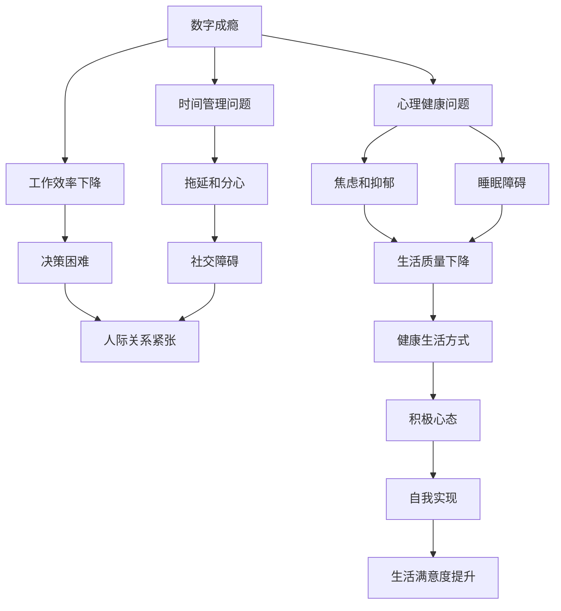

                 

### 文章标题

《数字解毒21天计划：重建健康网络使用习惯》

> 关键词：数字解毒、网络使用习惯、健康、21天计划、行为改变、心理健康、时间管理、数字成瘾、健康生活方式

> 摘要：本文将为您介绍一项创新的数字解毒21天计划，旨在帮助您重建健康的网络使用习惯，提高生活质量。通过逐步分析和实践，我们将探讨如何通过简单的步骤克服数字成瘾，实现心理健康与时间管理的双重提升。

### 引言

在现代社会，网络已经成为我们生活的重要组成部分。然而，随之而来的数字成瘾问题也让越来越多的人陷入困境。研究表明，长期过度使用网络不仅会影响人们的身心健康，还会导致时间管理问题、人际关系紧张以及工作效率下降。为了解决这一问题，我们需要一个系统的计划来帮助我们重建健康的网络使用习惯。

《数字解毒21天计划：重建健康网络使用习惯》应运而生。这个计划旨在通过21天的持续实践，帮助您逐步减少网络使用时间，重建健康的生活方式。本书将为您提供科学的指导，通过详细的分析和实用的方法，帮助您克服数字成瘾，实现心理和生理的双重健康。

### 核心概念与联系

在探讨数字解毒计划之前，我们需要理解几个核心概念及其相互关系。以下是这些概念之间的Mermaid流程图：

这张图展示了数字成瘾如何影响心理健康、时间管理和工作效率，以及这些问题如何进一步影响生活质量。理解这些概念及其关系，有助于我们更全面地认识到数字解毒计划的重要性。

### 数字解毒计划的原理

数字解毒计划基于几个核心原则，包括行为改变理论、时间管理和心理健康策略。以下是这些原则的详细解释：

#### 行为改变理论

行为改变理论认为，行为改变需要经历以下几个阶段：

1. **意识阶段**：认识到数字成瘾问题的存在。
2. **决定阶段**：下定决心改变。
3. **准备阶段**：制定具体的行动计划。
4. **行动阶段**：采取实际行动。
5. **维持阶段**：持续实践，巩固改变。

数字解毒计划通过逐步引导您通过这些阶段，实现长期的行为改变。

#### 时间管理策略

良好的时间管理是克服数字成瘾的关键。以下是一些有效的时间管理策略：

1. **设定明确的目标**：为每天、每周和每月设定具体的目标，确保时间使用的方向性。
2. **使用时间跟踪工具**：记录您每天使用网络的时间，以便更好地了解自己的习惯。
3. **限制网络使用时间**：为特定活动设置时间限制，例如每天最多使用网络1小时。
4. **优先处理任务**：将最重要的任务放在时间表的前面，确保高效完成。

#### 心理健康策略

心理健康策略包括以下几个方面：

1. **情绪调节**：学会通过深呼吸、冥想或锻炼来调节情绪，减少对网络的依赖。
2. **建立支持系统**：与家人、朋友或专业咨询师交流，寻求支持和鼓励。
3. **培养兴趣**：参与新的活动或爱好，减少对网络的依赖。
4. **积极心态**：保持乐观和积极的心态，将网络使用视为一种工具，而非生活的主导。

### 21天实践方法

数字解毒计划分为21天，每天都有一个具体的任务。以下是前五天的任务：

#### 第一天：设定目标

- 确定您想要减少的网络使用时间。
- 列出您希望达到的长期目标。

#### 第二天：识别触发因素

- 记录您每天使用网络的时间和原因。
- 确定触发您过度使用网络的主要因素。

#### 第三天：制定时间管理策略

- 设定每天的具体时间表，包括工作和休息时间。
- 确定如何减少触发因素对网络使用的影响。

#### 第四天：情绪调节

- 学习深呼吸或冥想等情绪调节技巧。
- 每天练习，提高自我控制力。

#### 第五天：建立支持系统

- 寻找家人、朋友或专业咨询师的支持。
- 与他们分享您的目标和进展。

### 案例分析

为了更好地理解数字解毒计划的效果，我们可以看看一些成功的案例。以下是一个真实的数字解毒案例：

**案例：小明的数字解毒之旅**

小明是一名上班族，他发现自己每天花费大量时间在社交媒体上，导致工作效率低下，心理健康受损。他决定尝试数字解毒计划。

**第一天**，小明设定了每天最多使用网络1小时的目标，并开始记录自己的网络使用时间。

**第二天**，他识别出社交媒体是主要的触发因素，并决定限制每天在社交媒体上的时间。

**第三天**，小明制定了一个详细的时间表，将工作、休息和娱乐时间合理分配。

**第四天**，他开始练习深呼吸和冥想，以调节情绪。

**第五天**，小明与家人分享了自己的目标，并得到了他们的支持。

随着时间的推移，小明的网络使用时间逐渐减少，工作效率提高，心理健康状况明显改善。他甚至发现自己有更多的时间去参与兴趣爱好，生活质量得到了显著提升。

### 障碍与解决方案

在执行数字解毒计划的过程中，您可能会遇到一些障碍。以下是一些常见的障碍及相应的解决方案：

#### 障碍1：缺乏动力

**解决方案**：设定短期和长期目标，并记录自己的进展。通过庆祝小成就来提高动力。

#### 障碍2：诱惑重重

**解决方案**：将手机放在不易拿到的地方，或使用应用程序来屏蔽特定的网站。

#### 障碍3：孤独感

**解决方案**：积极参与线下活动，建立新的社交圈子，减少对网络的依赖。

#### 障碍4：复发性

**解决方案**：如果复发，不要自责。重新评估计划，并寻求支持和帮助。

### 资源推荐

为了帮助您更好地执行数字解毒计划，我们推荐以下资源：

#### 书籍

1. 《数字成瘾：如何摆脱电子设备对你的控制》（作者：迈克尔·海斯）
2. 《时间管理：如何高效利用时间》（作者：大卫·艾伦）

#### 应用程序

1. Moment：记录并管理您的手机使用时间。
2. Freedom：屏蔽特定的网站和应用。

#### 网站

1. heysleep：提供关于睡眠健康的信息和技巧。
2. mindfulnessforlife.com：提供冥想和情绪调节的资源。

### 总结与反思

数字解毒21天计划是一个系统性、渐进式的行为改变计划，旨在帮助您重建健康的网络使用习惯。通过设定明确的目标、识别触发因素、制定时间管理策略和情绪调节技巧，您可以逐步减少对网络的依赖，提高工作效率和心理健康。

在执行计划的过程中，不要忽视障碍和挑战，积极寻求解决方案和支持。最重要的是，要保持耐心和坚持，因为行为改变需要时间。

在未来，继续关注自己的网络使用习惯，定期反思并调整计划。数字健康是一个长期的过程，但通过持续的努力，您将能够享受到数字生活的益处，同时保持身心健康。

### 最佳实践 Tips

1. **定期评估**：每周花时间评估自己的网络使用习惯，了解哪些方面需要改进。
2. **建立习惯**：将数字解毒计划纳入日常生活，使之成为习惯。
3. **寻求支持**：与家人、朋友或专业人士分享您的进展和挑战，寻求支持和鼓励。

### 注意事项

1. **不要急于求成**：行为改变需要时间，不要期望一蹴而就。
2. **灵活调整**：根据自己的实际情况调整计划，确保其可行性。
3. **保持积极**：保持积极的心态，相信您能够成功重建健康的网络使用习惯。

### 拓展阅读

1. 《网络成瘾的自我拯救：恢复健康网络生活的指南》
2. 《科技与心理健康：网络成瘾的预防和治疗》
3. 《数字时代的生活技巧：如何平衡科技与生活》

### 作者信息

作者：AI天才研究院/AI Genius Institute & 禅与计算机程序设计艺术 /Zen And The Art of Computer Programming

---

本文旨在提供数字解毒21天计划的详细指南，帮助读者重建健康的网络使用习惯。通过理解核心概念、遵循实践方法、克服障碍并持续反思，您将能够实现心理健康和时间管理的双重提升。

祝您在数字解毒之旅中取得成功，重拾健康和幸福的生活。不要忘记，数字生活的益处在于适度使用，保持健康的生活方式才是关键。让我们一起努力，创造一个更好的数字世界。

