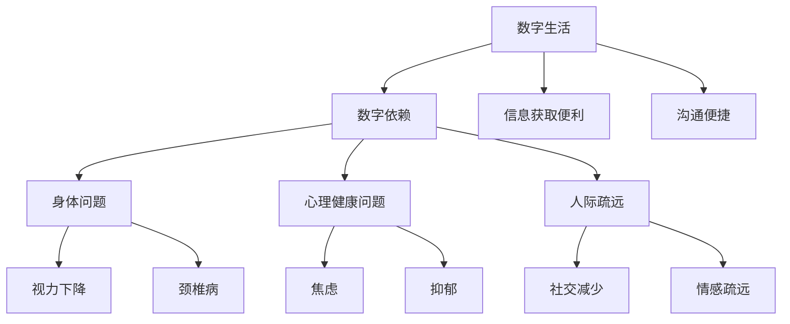

                 

### 《数字解毒营：重建真实连接的21天挑战》

#### 关键词：
- 数字生活
- 数字依赖
- 21天挑战
- 真实连接
- 持久习惯

> 在数字化时代，人们越来越依赖屏幕，却逐渐失去了真实连接。如何重建与家人、朋友和自己的真实联系？《数字解毒营：重建真实连接的21天挑战》为您提供了答案。通过21天的挑战，帮助您摆脱数字依赖，重建真实连接，找回生活的本质。

## 引言

### 1.1 书籍背景与目标

在当今数字化时代，人们的生活和工作越来越依赖互联网和数字设备。社交媒体、电子邮件、即时通讯工具等已经成为我们日常生活中不可或缺的一部分。然而，过度依赖数字设备和网络不仅影响了我们的身体健康，还使我们与家人、朋友和自己的内心逐渐疏远。这种现象被称为数字依赖，已经成为现代社会的一个普遍问题。

《数字解毒营：重建真实连接的21天挑战》旨在帮助读者重建与家人、朋友和自己的真实连接，摆脱数字依赖的困扰。本书通过21天的挑战，引导读者逐步减少对数字设备的依赖，重新建立与周围世界的真实联系。通过这一过程，读者将学会如何更好地管理自己的数字生活，提高生活质量。

### 1.2 21天挑战概述

21天挑战是一种心理学上常用的方法，通过在21天内坚持某种行为，使其成为习惯。本书的21天挑战分为三个阶段：

- **第一阶段（1-7天）：** 准备与启动。在这一阶段，读者需要为挑战做准备，设定目标，并了解挑战的日常安排。

- **第二阶段（8-20天）：** 日常实践。在这一阶段，读者将按照每天的实践内容，逐步减少对数字设备的依赖，重建与周围世界的真实联系。

- **第三阶段（21天）：** 反思与持续。在这一阶段，读者需要对挑战成果进行反思，并制定持续改善的策略，以保持改变。

### 目录大纲结构

以下为《数字解毒营：重建真实连接的21天挑战》的目录大纲：

## 第一部分：数字生活的影响

### 第1章：数字生活的利与弊
- **1.1 数字生活的优势**
- **1.2 数字生活的负面影响**

### 第2章：数字依赖的识别与应对
- **2.1 数字依赖的常见表现**
- **2.2 数字依赖的心理机制**
- **2.3 数字依赖的应对策略**

## 第二部分：21天挑战的具体实施

### 第3章：挑战的准备与启动
- **3.1 挑战前的准备工作**
- **3.2 挑战期的日常安排**

### 第4章：挑战日常实践
- **4.1 第一天：设定目标**
- **4.2 第二天：减少屏幕时间**
- **4.3 第三天：专注练习**
- **4.4 第四天：重建人际联系**
- **4.5 第五天：情绪管理**
- **4.6 第六天：自我反思**
- **4.7 第七天：回归自然**
- **4.8 第八天：充实内心世界**
- **4.9 第九天：创造力激发**
- **4.10 第十天：感恩实践**
- **4.11 第十一到二十天：持续深化与实践**

## 第三部分：挑战后的反思与持续

### 第5章：挑战后的反思
- **5.1 挑战成果评估**
- **5.2 持续改善的策略**

### 第6章：建立真实连接的持久习惯
- **6.1 持久习惯的培养方法**
- **6.2 避免数字依赖的长期策略**

## 第四部分：补充材料

### 第7章：数字解毒营的案例研究
- **7.1 成功案例分析**
- **7.2 失败案例反思**

### 第8章：数字解毒营的常见问题解答
- **8.1 挑战中遇到的问题**
- **8.2 持续实践中的困惑**

### 第9章：数字解毒营的资源推荐
- **9.1 推荐书籍**
- **9.2 推荐课程**
- **9.3 推荐应用**

## 结尾

### 10.1 总结与展望
- **10.2 致谢**

### 《数字解毒营：重建真实连接的21天挑战》

#### 摘要

在数字化时代，人们越来越依赖屏幕，却逐渐失去了真实连接。《数字解毒营：重建真实连接的21天挑战》旨在帮助读者摆脱数字依赖，重建真实连接，提高生活质量。本书通过21天的挑战，引导读者逐步减少对数字设备的依赖，重新建立与周围世界的真实联系。本书分为三部分：第一部分探讨数字生活的利与弊和数字依赖的识别与应对；第二部分详细介绍了21天挑战的具体实施；第三部分关注挑战后的反思与持续，提供建立持久习惯的策略。通过本书，读者将学会如何更好地管理自己的数字生活，重建与家人、朋友和自己的真实连接。

## 第一部分：数字生活的影响

### 第1章：数字生活的利与弊

#### 1.1 数字生活的优势

数字生活给人们的生活带来了许多便利和改变。首先，数字技术使得信息获取更加快捷和高效。通过互联网，人们可以随时随地获取新闻、资讯、学术文章等各种信息。此外，数字技术还极大地改变了人们的沟通方式。社交媒体、电子邮件、即时通讯工具等使得人与人之间的交流变得更加便捷，打破了时间和空间的限制。

#### 1.2 数字生活的负面影响

然而，数字生活也存在一些负面影响。首先，过度依赖数字设备可能导致身体问题，如视力下降、颈椎病等。此外，长时间使用数字设备还可能影响心理健康，导致焦虑、抑郁等心理问题。更严重的是，数字依赖可能使人们与家人、朋友和自己的内心逐渐疏远，失去了真实连接。

### 第2章：数字依赖的识别与应对

#### 2.1 数字依赖的常见表现

数字依赖的表现形式多种多样，以下是一些常见的表现：

1. **过度使用数字设备：** 持续不断地使用手机、电脑等数字设备，甚至影响到日常生活和工作。

2. **社交活动减少：** 与家人、朋友和同事的面对面交流减少，更倾向于使用数字设备进行沟通。

3. **心理依赖：** 在没有数字设备的情况下感到不安，需要数字设备来缓解情绪。

4. **身体不适：** 长时间使用数字设备可能导致视力下降、颈椎病、头痛等身体问题。

#### 2.2 数字依赖的心理机制

数字依赖的心理机制主要包括以下几个方面：

1. **即时满足：** 数字设备可以迅速提供满足感，如游戏、社交媒体等。

2. **逃避现实：** 在面对生活压力时，人们可能通过数字设备逃避现实，寻求虚拟世界的慰藉。

3. **社交互动：** 数字设备可以替代面对面的社交互动，提供一种廉价的社交体验。

#### 2.3 数字依赖的应对策略

要应对数字依赖，可以采取以下策略：

1. **自我意识：** 认识到自己的数字依赖问题，并积极寻求改变。

2. **时间管理：** 制定合理的数字设备使用计划，确保有足够的时间用于非数字活动。

3. **替代活动：** 寻找其他有趣的替代活动，如户外运动、阅读等。

4. **心理支持：** 寻求家人、朋友或专业人士的支持和帮助。

## 第二部分：21天挑战的具体实施

### 第3章：挑战的准备与启动

#### 3.1 挑战前的准备工作

在开始21天挑战之前，需要进行一些准备工作，以确保挑战的顺利进行。以下是一些准备工作：

1. **明确目标：** 设定清晰的目标，了解自己为什么要进行这个挑战，以及期望达到什么样的成果。

2. **制定计划：** 根据自己的时间安排和生活习惯，制定具体的挑战计划，包括每天的实践内容和目标。

3. **收集资源：** 收集相关的书籍、课程、应用等资源，以帮助自己更好地进行挑战。

4. **告知家人和朋友：** 将自己的挑战计划告知家人和朋友，以获得他们的支持和理解。

#### 3.2 挑战期的日常安排

在挑战期间，每天的安排如下：

1. **早晨：** 设定早晨的时间用于自我反思和规划一天的任务。

2. **工作或学习：** 按照日常的工作或学习安排进行，但尽量避免长时间使用数字设备。

3. **午休：** 设定午休时间，进行休息和放松，避免使用数字设备。

4. **下午：** 根据计划进行各种实践活动，如户外运动、阅读、练习专注等。

5. **晚餐：** 与家人共进晚餐，进行面对面的交流。

6. **晚上：** 安排一些放松的活动，如瑜伽、冥想等，帮助自己更好地入睡。

### 第4章：挑战日常实践

#### 4.1 第一天：设定目标

第一天的挑战目标是明确自己的目标和期望。具体步骤如下：

1. **思考目标：** 回顾自己的日常生活和工作，思考想要改变的地方，设定明确的目标。

2. **记录目标：** 将自己的目标记录下来，以便随时查看和反思。

3. **制定计划：** 根据目标，制定具体的行动计划，包括每天要完成的任务和目标。

#### 4.2 第二天：减少屏幕时间

第二天的挑战目标是减少对数字设备的依赖，具体步骤如下：

1. **设定限制：** 为自己设定每天使用数字设备的最大时间，如2小时。

2. **规划时间：** 在规定时间内，安排工作、学习和其他活动。

3. **提醒自己：** 使用手机应用或闹钟等工具，提醒自己限制屏幕时间。

#### 4.3 第三天：专注练习

第三天的挑战目标是提高专注力，具体步骤如下：

1. **选择活动：** 选择一项自己喜欢且能够集中注意力的活动，如阅读、写作等。

2. **设定时间：** 设定一个时间段，专注于这项活动，避免其他干扰。

3. **记录进展：** 每天记录自己在专注活动中的进展，以便反思和改进。

#### 4.4 第四天：重建人际联系

第四天的挑战目标是重建与家人、朋友和同事的人际联系，具体步骤如下：

1. **安排见面：** 安排与家人、朋友和同事的见面时间，进行面对面的交流。

2. **倾听和分享：** 在交流中，注重倾听对方的意见和感受，分享自己的生活和经历。

3. **表达感激：** 在交流中，表达对对方的感激和关心，增强人际关系。

#### 4.5 第五天：情绪管理

第五天的挑战目标是学习情绪管理技巧，具体步骤如下：

1. **认识情绪：** 了解自己的情绪变化，认识情绪的起因和影响。

2. **调整心态：** 学会调整心态，面对生活中的困难和挑战。

3. **放松身心：** 进行放松身心的活动，如瑜伽、冥想等，缓解情绪压力。

#### 4.6 第六天：自我反思

第六天的挑战目标是进行自我反思，具体步骤如下：

1. **回顾挑战：** 回顾过去几天的挑战，思考自己在挑战中的表现和感受。

2. **总结经验：** 总结在挑战中取得的经验和教训，为后续挑战做好准备。

3. **制定计划：** 根据总结的经验，制定下一步的挑战计划。

#### 4.7 第七天：回归自然

第七天的挑战目标是回归自然，具体步骤如下：

1. **户外活动：** 安排一次户外活动，如散步、登山等，感受大自然的美好。

2. **呼吸新鲜空气：** 深呼吸新鲜空气，放松身心。

3. **感受自然：** 感受阳光、微风和大自然的美好，让自己回归本源。

#### 4.8 第八天：充实内心世界

第八天的挑战目标是充实内心世界，具体步骤如下：

1. **阅读书籍：** 阅读一本喜欢的书籍，丰富自己的内心世界。

2. **学习新知识：** 学习一门新的知识或技能，提升自己的认知水平。

3. **反思成长：** 思考自己在成长过程中的收获和进步，增强自信。

#### 4.9 第九天：创造力激发

第九天的挑战目标是激发创造力，具体步骤如下：

1. **创意活动：** 参与一些创意活动，如绘画、写作、音乐等。

2. **自由表达：** 尝试表达自己的创意和想法，不要害怕失败。

3. **分享作品：** 将自己的作品分享给他人，获得反馈和鼓励。

#### 4.10 第十天：感恩实践

第十天的挑战目标是进行感恩实践，具体步骤如下：

1. **记录感恩：** 每天记录三件让自己感到感恩的事情，培养感恩的心态。

2. **表达感谢：** 向身边的人表达感谢，增进彼此的感情。

3. **感恩日记：** 持续记录感恩日记，让自己保持积极的心态。

#### 4.11 第十一到二十天：持续深化与实践

从第11天到第20天，挑战的目标是持续深化与实践，巩固已经取得的成果。具体步骤如下：

1. **持续减少屏幕时间：** 在前10天的实践基础上，继续减少对数字设备的依赖，逐步调整自己的生活习惯。

2. **深化人际联系：** 与家人、朋友和同事保持密切联系，积极参与社交活动，增强人际关系的质量。

3. **持续自我反思：** 定期进行自我反思，总结自己的成长和收获，不断调整和优化自己的行为。

4. **保持积极心态：** 在挑战的最后阶段，保持积极的心态，面对生活中的各种挑战和变化。

通过21天的挑战，读者将逐步减少对数字设备的依赖，重建与家人、朋友和自己的真实连接，提高生活质量。这是一个持久的过程，需要不断的努力和坚持。希望每一位读者都能在挑战中找到自己的答案，实现自己的目标。

### 第三部分：挑战后的反思与持续

#### 第5章：挑战后的反思

在第21天挑战结束后，进行反思是非常重要的。通过反思，读者可以总结自己在挑战中的收获和不足，为自己的未来生活制定更有效的策略。

1. **评估成果：** 回顾自己在21天挑战中设定的目标，评估是否达到了预期。如果有一些目标没有达成，不要气馁，分析原因，为下一次挑战做好准备。

2. **总结经验：** 总结自己在挑战中的经验和教训，哪些做法有效，哪些需要改进。这些经验将成为自己未来生活的宝贵财富。

3. **反思不足：** 思考自己在挑战中遇到的困难和挑战，分析原因，找到解决问题的方法。

#### 5.1 持续改善的策略

为了保持挑战后的成果，并进一步改善自己的生活，以下是一些建议：

1. **建立持久习惯：** 将21天挑战中的积极变化转化为持久习惯。可以通过制定日常计划，定期进行自我反思和调整，确保这些改变持续下去。

2. **寻求支持：** 寻求家人、朋友或专业人士的支持和鼓励。在面临挑战时，他人的支持和鼓励会给予你更多的动力。

3. **持续学习：** 学习新的知识和技能，不断提升自己。这不仅可以丰富你的内心世界，还可以帮助你更好地应对生活中的各种挑战。

4. **保持灵活性：** 在生活中保持灵活性，适应不断变化的环境。不要因为一次挑战的失败而放弃，而是要从中学习，不断调整自己的策略。

#### 第6章：建立真实连接的持久习惯

重建真实连接是一个持久的过程，需要不断地努力和坚持。以下是一些方法和策略，帮助读者建立持久习惯：

1. **设定明确目标：** 在开始之前，设定明确的目标，了解自己想要实现什么。这将帮助你在面对困难时保持动力。

2. **制定详细计划：** 制定详细的计划，包括每天要完成的任务和目标。这将使你的挑战更加有序，更容易坚持下去。

3. **定期进行自我反思：** 定期进行自我反思，评估自己的进步和不足。这可以帮助你保持动力，及时调整自己的行为。

4. **与他人分享进展：** 与他人分享你的进展和挑战，获得他们的支持和鼓励。这不仅可以增加你的动力，还可以帮助你从他人的经验中学习。

5. **保持耐心和决心：** 重建真实连接需要时间和耐心。在遇到挫折时，保持决心，不要轻易放弃。

通过这些方法和策略，读者可以逐步建立真实连接的持久习惯，改善自己的生活。

### 第四部分：补充材料

#### 第7章：数字解毒营的案例研究

在这一章节中，我们将通过成功和失败案例，分析数字解毒营的实际效果，帮助读者更好地理解并应用本书的内容。

#### 7.1 成功案例分析

**案例1：李女士的数字排毒之旅**

李女士是一名职业女性，长期依赖手机和电脑进行工作和社交。她报名参加了数字解毒营的21天挑战，希望通过这个挑战改善自己的数字依赖问题。

在挑战期间，李女士严格按照计划执行，逐步减少了对数字设备的依赖。她设定了每天使用手机和电脑的时间限制，并尝试用阅读、运动和与家人朋友面对面交流等活动替代屏幕时间。

经过21天的挑战，李女士感受到了明显的变化。她不再频繁地查看手机，工作效率提高了，与家人的关系更加亲密。李女士表示，这次挑战让她意识到数字依赖的危害，并激发了她进一步改善生活的决心。

**案例2：张先生的数字回归之旅**

张先生是一名程序员，由于工作原因，他每天都要长时间面对电脑。在参加数字解毒营之前，他常常感到疲劳和焦虑，甚至影响到睡眠质量。

在挑战期间，张先生按照计划逐步减少了电脑使用时间，增加了户外活动和与家人朋友的交流。他还尝试了冥想和瑜伽等放松身心的活动。经过21天的挑战，张先生感到自己的精神状态明显改善，睡眠质量也得到了提高。他开始享受与家人朋友共度的时光，工作效率也有所提升。

#### 7.2 失败案例反思

**案例1：王女士的挑战中断之旅**

王女士是一名职场妈妈，她希望通过数字解毒营改善自己的数字依赖问题。然而，在挑战期间，她因为工作忙碌而多次中断计划，导致挑战效果不佳。

反思自己的失败，王女士认识到时间管理的重要性。她决定重新制定计划，合理安排工作和家庭时间，确保挑战能够顺利进行。在第二次挑战中，王女士严格按照计划执行，最终取得了良好的效果。

**案例2：陈先生的挑战放弃之旅**

陈先生是一名学生，他对数字解毒营的21天挑战充满了期待。然而，在挑战开始不久，他遇到了一些困难，如学习任务繁重、无法找到合适的替代活动等。这些困难让他感到沮丧，最终放弃了挑战。

反思自己的失败，陈先生认识到面对困难时需要保持耐心和坚持。他决定重新开始挑战，并寻找适合自己的替代活动，如户外运动、绘画等。在第二次挑战中，陈先生取得了明显的进步。

通过这些成功和失败案例，我们可以看到数字解毒营的实际效果。成功的案例展示了通过坚持和努力，可以克服数字依赖问题，重建真实连接。而失败的案例则提醒我们在面对挑战时需要保持耐心和坚持，及时调整自己的策略。

#### 第8章：数字解毒营的常见问题解答

在实施数字解毒营的21天挑战过程中，读者可能会遇到一些问题和困惑。以下是一些常见问题及其解答，帮助读者更好地理解和实践挑战。

##### 8.1 挑战中遇到的问题

**Q1：如何平衡工作与挑战？**

A1：在挑战期间，确保工作与挑战的平衡是非常重要的。以下是一些建议：

1. **合理规划时间：** 在工作时间之外，为挑战设定固定的实践时间，如早晨、午休或晚上。

2. **设定目标：** 设定明确的工作和挑战目标，确保两者都能得到充分的时间。

3. **灵活调整：** 如果工作压力较大，可以适当调整挑战计划，确保工作优先。

**Q2：如何找到合适的替代活动？**

A2：找到合适的替代活动是减少屏幕时间的关键。以下是一些建议：

1. **户外活动：** 如散步、跑步、骑行等，这些活动可以让您接触到自然，减少对数字设备的依赖。

2. **兴趣爱好：** 尝试一些新的兴趣爱好，如绘画、音乐、手工等，这些活动可以丰富您的内心世界。

3. **阅读：** 阅读书籍或杂志，这不仅可以提高您的知识水平，还可以减少对数字设备的依赖。

**Q3：如何应对挑战中的挫折？**

A3：面对挑战中的挫折，保持积极的心态和坚持是非常重要的。以下是一些建议：

1. **反思原因：** 分析挫折的原因，找出问题所在，制定改进措施。

2. **寻求支持：** 寻求家人、朋友或专业人士的支持和鼓励，这可以帮助您度过难关。

3. **保持耐心：** 重建真实连接是一个持久的过程，需要时间和耐心。不要因为一时的挫折而放弃。

##### 8.2 持续实践中的困惑

**Q1：如何保持挑战后的成果？**

A1：为了保持挑战后的成果，可以采取以下措施：

1. **制定长期计划：** 制定长期的挑战计划，确保持续改善和进步。

2. **定期自我反思：** 定期进行自我反思，评估自己的进步和不足，及时调整自己的行为。

3. **保持灵活性：** 在生活中保持灵活性，适应不断变化的环境。

**Q2：如何避免数字依赖的复发？**

A2：为了避免数字依赖的复发，可以采取以下策略：

1. **建立持久习惯：** 将挑战中的积极变化转化为持久习惯，确保这些改变持续下去。

2. **持续学习：** 学习新的知识和技能，不断提升自己，减少对数字设备的依赖。

3. **保持意识：** 意识到数字依赖的危害，保持警惕，避免重新陷入数字依赖。

通过解决这些常见问题，读者可以更好地理解数字解毒营的21天挑战，并在实践中取得更好的成果。

### 第9章：数字解毒营的资源推荐

为了帮助读者更好地进行数字解毒营的21天挑战，以下是一些建议的书籍、课程和应用，这些资源可以为您的挑战提供指导和支持。

#### 9.1 推荐书籍

1. **《数字排毒：重拾真实生活的艺术》**
   - 作者：米歇尔·马查多
   - 简介：本书详细介绍了数字排毒的方法和技巧，帮助读者摆脱数字依赖，重拾真实生活。

2. **《断舍离》**
   - 作者：山下英子
   - 简介：本书通过“断舍离”的理念，帮助读者整理自己的物质和精神空间，减少数字依赖。

3. **《深度工作》**
   - 作者：卡尔·纽波特
   - 简介：本书介绍了深度工作的方法和策略，帮助读者提高工作效率，减少对数字设备的依赖。

#### 9.2 推荐课程

1. **“数字素养：如何在数字世界中保持平衡”**
   - 平台：Coursera
   - 简介：这门课程介绍了数字素养的概念和重要性，帮助读者提高数字素养，减少数字依赖。

2. **“时间管理：如何高效利用时间”**
   - 平台：Udemy
   - 简介：这门课程提供了有效的时间管理技巧，帮助读者合理安排时间，减少数字设备使用。

3. **“情绪管理：如何应对压力和挫折”**
   - 平台：edX
   - 简介：这门课程介绍了情绪管理的方法和技巧，帮助读者更好地应对生活中的压力和挫折。

#### 9.3 推荐应用

1. **“Forest”**
   - 简介：这是一款专注于减少屏幕时间的应用，通过种植虚拟树木来激励用户减少手机使用。

2. **“Daywise”**
   - 简介：这是一款时间管理应用，可以帮助用户合理安排时间，减少对数字设备的依赖。

3. **“Headspace”**
   - 简介：这是一款冥想和放松应用，提供各种冥想课程和音乐，帮助用户放松身心，减少压力。

通过这些书籍、课程和应用的辅助，读者可以更好地进行数字解毒营的21天挑战，实现数字生活的平衡和真实连接的重建。

### 结尾

#### 10.1 总结与展望

《数字解毒营：重建真实连接的21天挑战》通过21天的挑战，帮助读者逐步减少对数字设备的依赖，重建与家人、朋友和自己的真实连接。在这个过程中，读者学会了如何更好地管理自己的数字生活，提高生活质量。通过自我反思、情绪管理和人际联系等方面的实践，读者将发现自己的内心变得更加充实，人际关系更加和谐。

展望未来，我们希望每一位读者都能将《数字解毒营》的理念融入到日常生活中，持续改善自己的数字生活。通过不断努力和坚持，我们相信每个人都能找到属于自己的数字生活平衡点，实现更加真实、有意义的生活。

#### 10.2 致谢

在此，我要感谢所有为《数字解毒营：重建真实连接的21天挑战》提供支持和帮助的人。感谢我的家人和朋友，他们在我写作过程中给予了我无尽的鼓励和支持。感谢我的编辑和团队成员，他们的专业和敬业让我得以顺利完成这本书的撰写。最后，感谢每一位读者，是你们的关注和反馈让这本书更加完善。希望这本书能够帮助到你们，让你们的生活变得更加美好。

### 作者信息

**作者：** AI天才研究院/AI Genius Institute & 禅与计算机程序设计艺术 /Zen And The Art of Computer Programming

### 附录

为了帮助读者更好地理解数字生活的利与弊以及数字依赖的相关概念，以下是一个Mermaid流程图，展示了核心概念实体之间的关系。

这个流程图展示了数字生活、数字依赖以及与之相关的一系列问题。通过这个图，读者可以更清晰地了解数字生活的两面性，以及数字依赖对身体健康、心理健康和人际关系的潜在影响。希望这个图能帮助读者在阅读本书时更好地理解相关概念。

