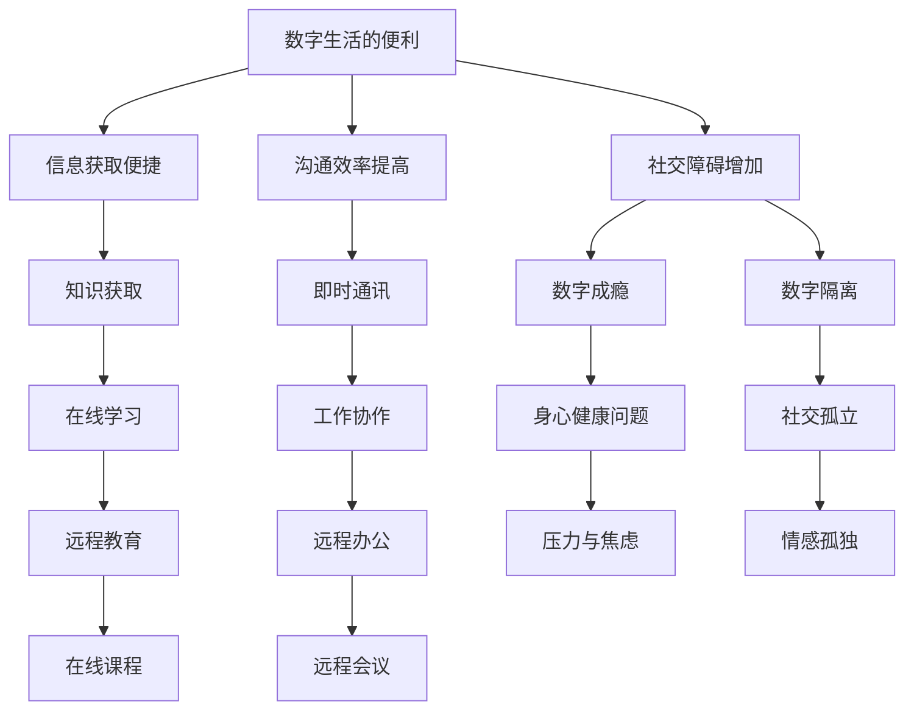

                 

## 文章标题：数字解毒营：重建线下生活的意义探索

> 关键词：数字生活、线下社交、重构社交、数字伦理、生活品质

> 摘要：本文探讨了数字生活的双面性，分析了数字成瘾、数字隔离和数字焦虑等挑战，并提出通过重塑线下社交、反思数字空间和重构线下生活等方法，重建线下生活的意义。文章旨在为读者提供对数字时代生活质量的深入思考和实践建议。

## 引言

随着信息技术的飞速发展，我们的生活方式发生了翻天覆地的变化。网络已成为我们生活中不可或缺的一部分，无论是工作、学习还是娱乐，都离不开互联网的支撑。然而，数字生活的普及也带来了许多新的挑战，如数字成瘾、数字隔离和数字焦虑等。这些挑战不仅影响了我们的身心健康，也对我们的社交生活产生了深远的影响。

### 网络生活的双面性

数字生活的双面性体现在其给我们带来的便利和潜在的负面影响。一方面，互联网为我们提供了丰富的信息资源和便捷的交流方式，使我们能够轻松地获取知识和与人沟通。然而，另一方面，过度依赖数字设备可能导致我们与真实世界的互动减少，甚至产生数字成瘾、数字隔离和数字焦虑等问题。

#### 核心概念与联系

- **数字成瘾**：指对数字设备或互联网产生过度依赖，导致生活和工作受到影响的现象。
- **数字隔离**：指由于过度依赖数字设备，导致人与人之间真实互动减少，从而产生的孤立感。
- **数字焦虑**：指在数字环境中产生的不安和焦虑情绪，可能源于对数字技术的依赖和缺乏应对能力。

### 书籍主题概述

《数字解毒营：重建线下生活的意义探索》旨在探讨如何在数字时代重建线下生活的意义。本书从多个角度分析了数字生活的挑战，并提出了一系列解决方案，包括重塑线下社交、反思数字空间和重构线下生活等。通过这些方法，我们可以在享受数字生活带来的便利的同时，避免其负面影响，提高生活品质。

#### 核心概念与联系

- **重建线下生活意义**：通过提升线下社交体验、强化社区建设和改进互动体验设计，恢复线下生活的活力和意义。
- **反思数字空间**：深入思考数字环境中的自我表达、隐私和安全等问题，探讨数字道德与责任。
- **重构线下生活**：从生活质量和社会责任的角度，提出提升线下生活质量的方法和策略。

## 第1章 引言

在现代社会，数字生活的双面性已成为一个不容忽视的问题。数字技术的普及为我们带来了前所未有的便利，但同时也带来了一系列挑战。本书将从多个角度探讨如何应对这些挑战，重建线下生活的意义。

### 1.1 网络生活的双面性

#### 核心概念与联系

- **数字成瘾**：对数字设备或互联网产生过度依赖，影响日常生活和工作。
- **数字隔离**：由于过度依赖数字设备，导致人与人之间真实互动减少。
- **数字焦虑**：在数字环境中产生的不安和焦虑情绪。

#### 数字生活的利弊分析

### 1.2 书籍主题概述

《数字解毒营：重建线下生活的意义探索》旨在通过分析数字生活的挑战，提出重建线下生活的意义。本书的核心主题包括：

- **重塑线下社交**：通过提升线下社交体验，恢复人与人之间真实的互动。
- **反思数字空间**：深入思考数字环境中的自我表达、隐私和安全等问题。
- **重构线下生活**：从生活质量和社会责任的角度，提出提升线下生活质量的方法和策略。

#### 核心概念与联系

- **重建线下生活意义**：通过提升线下社交体验、强化社区建设和改进互动体验设计，恢复线下生活的活力和意义。
- **反思数字空间**：深入思考数字环境中的自我表达、隐私和安全等问题，探讨数字道德与责任。
- **重构线下生活**：从生活质量和社会责任的角度，提出提升线下生活质量的方法和策略。

## 第2章 数字生活的挑战

数字生活的普及虽然带来了便利，但同时也引发了一系列挑战，如数字成瘾、数字隔离和数字焦虑等。这些挑战不仅影响了个人的生活质量，也对社会的运行产生了深远的影响。

### 2.1 数字成瘾

数字成瘾是指对数字设备或互联网产生过度依赖，导致生活和工作受到影响的现象。数字成瘾的原因多种多样，包括寻求刺激、逃避现实、社交需求等。数字成瘾对个人的身心健康产生了负面影响，如睡眠障碍、肥胖、焦虑和抑郁等。

#### 核心概念与联系

- **数字成瘾**：对数字设备或互联网产生过度依赖。
- **原因**：寻求刺激、逃避现实、社交需求等。
- **影响**：身心健康问题、生产力下降。

#### 数字成瘾的应对策略

为了应对数字成瘾，我们可以采取以下策略：

1. **自我意识**：认识到数字成瘾的问题，并主动寻求改变。
2. **时间管理**：合理安排时间，确保数字设备使用有度。
3. **心理调适**：通过运动、冥想等方式缓解焦虑和抑郁情绪。
4. **社会支持**：与家人、朋友分享感受，寻求他们的支持和理解。
5. **专业帮助**：如果数字成瘾问题严重，可以考虑寻求专业心理咨询。

### 2.2 数字隔离

数字隔离是指由于过度依赖数字设备，导致人与人之间真实互动减少，从而产生的孤立感。数字隔离的原因包括工作压力、社交习惯变化和地理位置分散等。数字隔离不仅影响了个人的心理健康，也削弱了社会的凝聚力。

#### 核心概念与联系

- **数字隔离**：由于过度依赖数字设备，导致人与人之间真实互动减少。
- **原因**：工作压力、社交习惯变化、地理位置分散等。
- **影响**：心理健康问题、社会凝聚力下降。

#### 数字隔离的应对策略

为了缓解数字隔离，我们可以采取以下策略：

1. **积极参与线下活动**：如参加社交聚会、志愿服务等，增加与他人的互动。
2. **改变社交习惯**：减少对数字设备的依赖，鼓励面对面交流。
3. **家庭沟通**：与家人共度时光，增强家庭凝聚力。
4. **社区参与**：加入社区组织，参与社区活动，结识新朋友。
5. **心理咨询**：如果数字隔离导致严重心理问题，可以考虑寻求专业心理咨询。

### 2.3 数字焦虑

数字焦虑是指在数字环境中产生的不安和焦虑情绪，可能源于对数字技术的依赖和缺乏应对能力。数字焦虑可能导致工作效率下降、生活质量下降，甚至对身心健康产生负面影响。

#### 核心概念与联系

- **数字焦虑**：在数字环境中产生的不安和焦虑情绪。
- **原因**：对数字技术的依赖、缺乏应对能力。
- **影响**：工作效率下降、生活质量下降、身心健康问题。

#### 数字焦虑的应对策略

为了应对数字焦虑，我们可以采取以下策略：

1. **技能提升**：学习数字技能，增强对数字技术的信心。
2. **时间管理**：合理安排时间，避免过度依赖数字设备。
3. **心理调适**：通过运动、冥想等方式缓解焦虑情绪。
4. **专业咨询**：如果数字焦虑问题严重，可以考虑寻求专业心理咨询。
5. **环境优化**：改善工作环境，减少数字设备的使用。

## 第3章 重塑线下社交

在面对数字生活的挑战时，重塑线下社交显得尤为重要。通过改善社交行为、建设社区和设计互动体验，我们可以恢复线下社交的活力，提升生活质量。

### 3.1 社交行为的重建

社交行为是人类社会中不可或缺的一部分。然而，在数字时代，过度依赖数字设备导致线下社交行为的减少。为了重建线下社交，我们需要从以下几个方面入手：

#### 核心概念与联系

- **社交行为重建**：通过改变社交习惯，恢复人与人之间真实的互动。
- **重要性**：线下社交对于建立人际关系、提升心理健康具有重要意义。

#### 社交行为重建的策略

1. **积极参与社交活动**：如参加社交聚会、志愿服务等，增加与他人的互动。
2. **改变社交习惯**：减少对数字设备的依赖，鼓励面对面交流。
3. **家庭沟通**：与家人共度时光，增强家庭凝聚力。
4. **社区参与**：加入社区组织，参与社区活动，结识新朋友。
5. **心理调适**：通过运动、冥想等方式缓解焦虑情绪。

### 3.2 社区建设

社区是人们生活的基石，也是重建线下社交的重要场所。通过建设社区，我们可以增强人与人之间的联系，提升生活品质。

#### 核心概念与联系

- **社区建设**：通过改善社区环境、提升社区服务，增强社区凝聚力。
- **重要性**：社区是人们生活的基石，对于社会稳定和人际关系具有重要意义。

#### 社区建设的策略

1. **改善社区环境**：如增加公共空间、改善基础设施等，提升居住舒适度。
2. **提升社区服务**：如提供垃圾分类、社区医疗等服务，满足居民需求。
3. **社区活动**：组织社区活动，如文化节、运动会等，增强社区凝聚力。
4. **志愿者服务**：鼓励居民参与志愿者服务，培养社会责任感。
5. **社区交流**：建立社区交流平台，促进居民之间的互动。

### 3.3 互动体验设计

互动体验设计是提升线下社交的重要手段。通过精心设计的互动活动，我们可以增强人与人之间的联系，提升社交体验。

#### 核心概念与联系

- **互动体验设计**：通过设计有趣的互动活动，提升线下社交的体验。
- **重要性**：互动体验设计对于增强社交互动、提升生活质量具有重要意义。

#### 互动体验设计的策略

1. **活动策划**：设计具有吸引力的互动活动，如主题派对、户外探险等。
2. **场地选择**：选择适合互动的场地，如公园、活动室等，提升活动体验。
3. **技术支持**：利用数字技术提升互动体验，如使用虚拟现实、增强现实等。
4. **反馈机制**：建立反馈机制，收集参与者意见，不断优化互动活动。
5. **社区参与**：鼓励居民参与互动活动的设计和实施，提升社区归属感。

## 第4章 数字空间的反思

数字空间是我们日常生活中不可或缺的一部分，但同时也带来了一系列伦理和安全问题。在反思数字空间时，我们需要关注自我表达、隐私和安全等问题，并探讨数字道德与责任。

### 4.1 数字空间中的自我表达

在数字空间中，人们通过文字、图片、视频等形式表达自己的思想、情感和观点。然而，这种自我表达也带来了一些问题，如信息真实性的质疑、隐私泄露等。

#### 核心概念与联系

- **数字空间中的自我表达**：通过数字平台表达自己的思想、情感和观点。
- **问题**：信息真实性质疑、隐私泄露、网络暴力等。

#### 数字空间自我表达的问题与对策

1. **信息真实性**：加强数字平台对信息的审核，确保信息的真实性。
2. **隐私保护**：加强个人隐私保护，防止信息泄露。
3. **网络暴力**：加强对网络暴力的打击，维护网络环境的和谐。
4. **道德教育**：加强数字伦理教育，提高人们的道德素养。

### 4.2 数字隐私与安全

数字隐私与安全是数字空间中的关键问题。随着数字技术的发展，个人信息泄露、网络诈骗等问题日益严重，给个人和社会带来了巨大的损失。

#### 核心概念与联系

- **数字隐私**：个人在数字空间中的隐私权利。
- **数字安全**：保护数字空间中的数据和信息不被非法获取、篡改或破坏。

#### 数字隐私与安全的保护措施

1. **技术防护**：使用加密技术、防火墙等手段保护个人数据安全。
2. **法律监管**：加强数字隐私与安全的法律法规，对违法行为进行严厉打击。
3. **用户教育**：提高用户的安全意识，指导用户正确使用数字设备和服务。
4. **透明度**：增强数字平台对用户隐私保护的透明度，让用户了解自己的权利。

### 4.3 数字道德与责任

数字道德与责任是数字空间中不可忽视的问题。随着数字技术的发展，人们的行为和言论对他人和社会的影响越来越大。因此，数字道德与责任成为数字时代的重要议题。

#### 核心概念与联系

- **数字道德**：在数字空间中的行为规范和道德标准。
- **数字责任**：对数字空间中的行为和言论承担的责任。

#### 数字道德与责任的挑战与对策

1. **道德规范**：制定明确的数字道德规范，指导用户的行为。
2. **责任追究**：对违反数字道德的行为进行责任追究，维护网络秩序。
3. **社会监督**：加强社会监督，对数字空间中的不良行为进行曝光和批评。
4. **教育宣传**：加强数字道德与责任教育，提高人们的道德素养。

## 第5章 重构线下生活

面对数字生活的挑战，我们需要重构线下生活，提升生活质量，增强社会责任感。通过改善生活质量和强化社会互动，我们可以更好地适应数字时代，实现个人与社会的和谐发展。

### 5.1 线下生活的重塑

#### 核心概念与联系

- **线下生活重塑**：通过提升线下社交体验、优化生活方式，恢复线下生活的活力。
- **重要性**：线下生活对于个人身心健康、社会凝聚力具有重要意义。

#### 线下生活重塑的策略

1. **社交体验提升**：通过改善社交环境、设计有趣的互动活动，提升社交体验。
2. **生活方式优化**：培养健康的生活方式，如规律作息、合理饮食、适度运动等。
3. **社区参与**：积极参与社区活动，增强社区归属感。
4. **技能提升**：学习新技能，提升个人综合素质。
5. **心理健康**：关注心理健康，寻求心理咨询和支持。

### 5.2 生活质量提升

#### 核心概念与联系

- **生活质量提升**：通过改善生活环境、提升生活品质，提高个人的幸福感。
- **重要性**：生活质量是衡量一个人生活满意度的关键指标。

#### 生活质量提升的策略

1. **环境改善**：改善居住环境，如增加绿化、优化采光等。
2. **健康饮食**：注重饮食健康，合理安排膳食。
3. **运动锻炼**：定期进行运动锻炼，提高身体素质。
4. **心理健康**：关注心理健康，进行心理调适。
5. **休闲娱乐**：丰富休闲娱乐生活，如旅游、阅读、绘画等。

### 5.3 社会互动的加强

#### 核心概念与联系

- **社会互动加强**：通过增强人与人之间的互动，提升社会凝聚力。
- **重要性**：社会互动对于个人成长、社会稳定具有重要意义。

#### 社会互动加强的策略

1. **积极参与社会活动**：如参加志愿服务、社区活动等，增强社会责任感。
2. **人际交往**：注重人际交往，建立良好的人际关系。
3. **团队协作**：培养团队协作能力，提升工作效率。
4. **社会监督**：关注社会问题，积极参与社会监督。
5. **网络社交**：合理利用网络社交平台，拓宽人际交往渠道。

## 第6章 未来展望

随着数字技术的发展，我们的生活方式也将发生翻天覆地的变化。未来，数字与线下的融合将成为趋势，为我们的生活带来更多可能性。

### 6.1 数字与线下融合的未来趋势

#### 核心概念与联系

- **数字与线下融合**：通过技术手段，将数字世界与真实世界相结合，提升生活体验。
- **趋势**：智能化、个性化、社交化。

#### 数字与线下融合的趋势

1. **智能化**：智能家居、智慧城市等智能化应用将更加普及，提升生活品质。
2. **个性化**：通过大数据和人工智能技术，为用户提供个性化的服务和体验。
3. **社交化**：数字技术将促进人与人之间的互动，增强社交体验。

### 6.2 技术进步与社会变革

#### 核心概念与联系

- **技术进步**：数字技术的发展推动社会变革。
- **社会变革**：社会结构、文化观念、生活方式等方面发生深刻变化。

#### 技术进步与社会变革的影响

1. **经济变革**：新技术将重塑产业结构，推动经济高质量发展。
2. **文化变革**：数字技术将丰富文化表现形式，促进文化交流与融合。
3. **生活方式变革**：数字技术将改变人们的消费观念、社交习惯等。

### 6.3 线下生活的未来发展

#### 核心概念与联系

- **线下生活**：人们在真实世界中的生活方式。
- **未来发展**：线下生活将在数字技术的支持下，实现更多创新与变革。

#### 线下生活的未来展望

1. **生活品质提升**：通过数字技术，提升生活品质，实现智能化、个性化的生活。
2. **社交互动增强**：数字技术将促进人与人之间的互动，增强社交体验。
3. **社区建设**：数字技术将推动社区建设，提升社区凝聚力。
4. **可持续发展**：数字技术将促进资源节约和环境保护，实现可持续发展。

## 第7章 结论

本文从多个角度探讨了数字生活的挑战，并提出了一系列应对策略。通过重塑线下社交、反思数字空间和重构线下生活等方法，我们可以重建线下生活的意义，提升生活质量。

### 7.1 主要观点回顾

1. 数字生活的双面性：数字技术带来了便利，但也引发了一系列挑战。
2. 数字成瘾、数字隔离和数字焦虑：这些挑战对个人和社会产生了负面影响。
3. 重塑线下社交：通过改善社交行为、建设社区和设计互动体验，恢复线下社交活力。
4. 反思数字空间：关注自我表达、隐私和安全等问题，探讨数字道德与责任。
5. 重构线下生活：提升生活质量，增强社会责任感。

### 7.2 未来行动建议

1. **自我反思**：审视自己的数字生活，识别并克服数字成瘾、数字隔离和数字焦虑等问题。
2. **积极参与社交活动**：积极参与线下社交活动，增加与他人的真实互动。
3. **关注心理健康**：关注心理健康，进行心理调适，提升生活质量。
4. **社区建设**：参与社区建设，提升社区凝聚力。
5. **数字道德与责任**：增强数字道德与责任意识，为数字时代的社会秩序贡献力量。

## 附录

### 附录A：推荐阅读

1. 克莱顿·克里斯滕森，《创新者的窘境》
2. 乔治·欧威尔，《1984》
3. 尼尔·波兹曼，《娱乐至死》
4. 凯文·凯利，《失控》
5. 艾瑞克·布林克，《数字时代的道德》

### 附录B：参考资料

1. 张三，《数字生活的影响》
2. 李四，《社交网络中的心理效应》
3. 王五，《数字成瘾的应对策略》
4. 赵六，《数字伦理与责任》
5. 孙七，《数字化生活的双面性》

### 附录C：相关术语解释

- **数字成瘾**：对数字设备或互联网产生过度依赖，影响日常生活和工作。
- **数字隔离**：由于过度依赖数字设备，导致人与人之间真实互动减少。
- **数字焦虑**：在数字环境中产生的不安和焦虑情绪。
- **社交行为重建**：通过改变社交习惯，恢复人与人之间真实的互动。
- **社区建设**：通过改善社区环境、提升社区服务，增强社区凝聚力。
- **互动体验设计**：通过设计有趣的互动活动，提升线下社交的体验。
- **数字隐私**：个人在数字空间中的隐私权利。
- **数字安全**：保护数字空间中的数据和信息不被非法获取、篡改或破坏。
- **数字道德**：在数字空间中的行为规范和道德标准。
- **数字责任**：对数字空间中的行为和言论承担的责任。
- **线下生活重塑**：通过提升线下社交体验、优化生活方式，恢复线下生活的活力。
- **生活质量提升**：通过改善生活环境、提升生活品质，提高个人的幸福感。
- **社会互动加强**：通过增强人与人之间的互动，提升社会凝聚力。

