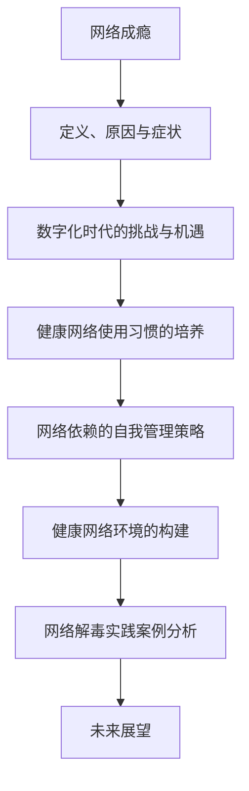

                 

----------------------------------------------------------------

# 数字解毒诊所：重建健康网络使用习惯

## 关键词
- 数字解毒
- 健康网络使用
- 网络成瘾
- 数字化时代
- 自我管理

## 摘要
本文旨在探讨网络成瘾现象及其对个人和社会的深远影响，并提出一系列策略以重建健康的网络使用习惯。通过分析网络成瘾的定义、原因、症状及自我管理策略，结合数字化时代的挑战与机遇，文章提出构建健康网络环境的多种途径，旨在为个人、家庭、学校、社区和企业提供实际指导，推动网络健康发展的未来。

----------------------------------------------------------------

## 第1章 引言

### 1.1 为什么我们需要重建健康网络使用习惯

在当今的数字化时代，网络已成为我们日常生活不可或缺的一部分。然而，随着网络的普及，网络成瘾现象也逐渐显现，并对人们的心理健康和生活质量产生了深远的影响。网络成瘾不仅影响了个人的学习、工作和生活，还对社会产生了负面影响。因此，重建健康网络使用习惯显得尤为重要。

首先，网络成瘾对个人的心理健康造成了严重的影响。长期沉迷于网络，会导致个体出现焦虑、抑郁、孤独等心理问题。研究表明，网络成瘾与心理健康问题的发生率呈正相关，特别是对于青少年群体，网络成瘾更容易引发自我认同感丧失和社交技能退化。

其次，网络成瘾对个人的学习和工作效率产生了负面影响。沉迷于网络，特别是社交媒体和游戏，会分散个体的注意力，导致学习效率和工作效率的下降。研究表明，网络使用与学习成绩和工作表现之间存在显著的负相关关系。

此外，网络成瘾还对社会产生了负面影响。网络成瘾可能导致社会隔离，增加人际冲突，甚至引发犯罪行为。例如，网络诈骗、网络霸凌等行为，严重影响了社会的和谐与稳定。

### 1.2 网络使用的现状及其影响

根据最新统计数据，全球网络用户已超过45亿人，约占全球总人口的一半。网络使用的普及程度日益提高，但与此同时，网络成瘾的问题也日益严重。以下是对网络使用现状及其影响的简要分析：

#### 网络使用的普及程度

全球范围内的网络使用率持续上升。据联合国统计，截至2021年，全球互联网普及率已达到63.4%，预计未来几年还将继续增长。特别是在发展中国家和地区，网络普及率的提升尤为显著。

#### 网络使用的时间长度

随着智能手机和移动互联网的普及，人们每天在网络上花费的时间不断增加。根据研究，全球成年人平均每天在网络上花费的时间超过5小时，而青少年群体更是高达7小时以上。长时间的在线活动，使得网络成瘾的风险大大增加。

#### 网络使用的影响

网络使用对个人和社会的影响是多方面的。对个人而言，网络使用可以带来便利和娱乐，但也可能导致成瘾和心理问题。对社会而言，网络成瘾可能导致社会隔离、人际冲突和犯罪行为。

### 1.3 本书的目的和结构

本书旨在探讨网络成瘾现象，分析其原因和症状，并提出有效的预防和干预措施。具体来说，本书的目的如下：

1. **提高公众对网络成瘾问题的认识**：通过介绍网络成瘾的定义、原因和症状，使读者了解网络成瘾的危害，从而提高警惕。
2. **提供自我管理策略**：介绍一系列自我管理策略，帮助网络使用者调整网络使用习惯，减少网络成瘾的风险。
3. **构建健康网络环境**：探讨如何通过个人、家庭、学校、社区和企业等多方面共同努力，构建健康网络环境。
4. **分享实践案例**：通过案例分析，提供实际操作经验和成功案例，为读者提供可操作的指导和借鉴。

本书的结构如下：

- **第1章 引言**：介绍网络成瘾现象及其影响，阐述本书的目的和结构。
- **第2章 网络成瘾：定义、原因与症状**：详细探讨网络成瘾的定义、原因和症状。
- **第3章 数字化时代的挑战与机遇**：分析数字化时代的挑战与机遇，探讨如何平衡网络使用与心理健康。
- **第4章 健康网络使用习惯的培养**：介绍如何培养健康网络使用习惯。
- **第5章 网络依赖的自我管理策略**：提供一系列自我管理策略，帮助网络使用者调整网络使用习惯。
- **第6章 健康网络环境的构建**：探讨如何构建健康网络环境。
- **第7章 网络解毒实践案例分析**：分享实践案例，提供实际操作经验和成功案例。
- **第8章 未来展望**：探讨数字化技术与心理健康的发展趋势，展望未来网络使用习惯的演变。

通过本书的阅读，读者将能够更深入地理解网络成瘾问题，掌握有效的自我管理策略，并为构建健康网络环境贡献力量。

----------------------------------------------------------------

## 第2章 网络成瘾：定义、原因与症状

### 2.1 网络成瘾的定义与分类

网络成瘾，又称互联网成瘾或网络依赖，是一种心理和行为上的依赖，表现为对网络过度使用，无法自我控制，以至于影响日常生活、工作和学习。根据不同的分类标准，网络成瘾可以分为以下几种类型：

1. **网络游戏成瘾**：这是最常见的网络成瘾类型之一，表现为对网络游戏过度沉迷，导致游戏时间过长，影响正常的生活和工作。
2. **社交媒体成瘾**：对社交媒体平台的过度使用，包括频繁地查看、更新、评论和点赞，从而影响个人的情绪和社交关系。
3. **网络购物成瘾**：对网络购物的过度依赖，导致过度消费，甚至产生经济上的困扰。
4. **网络色情成瘾**：对网络色情内容的过度关注和寻求，影响个人的心理健康和人际交往。
5. **网络信息搜索成瘾**：对网络信息搜索的过度依赖，导致个人无法控制地花费大量时间在网上寻找信息。

### 2.2 网络成瘾的原因分析

网络成瘾的形成是一个复杂的过程，涉及多个因素。以下是一些主要的原因：

1. **心理因素**：个体在成长过程中可能存在心理问题，如孤独、焦虑、抑郁等。网络提供了一个逃避现实的虚拟空间，使得个体容易沉迷其中。
2. **环境因素**：家庭环境、学校教育、社会文化等因素都可能对网络成瘾产生影响。例如，家庭不和谐、学习压力过大、社会孤立等，都可能导致个体寻求网络上的安慰和逃避。
3. **技术因素**：互联网和移动互联网的普及，使得网络使用变得便捷和无所不在。一些网络应用，如游戏、社交媒体等，设计上往往具有很强的吸引力和成瘾性。
4. **生理因素**：长期网络使用可能导致生物钟紊乱、睡眠质量下降等生理问题，进而影响心理健康和情绪状态。

### 2.3 网络成瘾的主要症状

网络成瘾的症状多种多样，以下是一些常见的症状：

1. **时间失控**：个体对网络使用时间失去控制，经常感觉到上网时间比预计的要长。
2. **情绪波动**：网络成瘾者可能会在停止上网后感到焦虑、不安、抑郁等情绪。
3. **社交障碍**：沉迷于网络导致现实社交能力的下降，人际交往减少，甚至出现社交恐惧。
4. **身体健康问题**：长期网络使用可能导致头痛、眼睛疲劳、颈椎病等身体问题。
5. **学业或工作效率下降**：网络成瘾者可能会因为沉迷于网络而影响学业或工作效率，导致成绩下降或工作任务无法完成。

### 2.4 如何判断自己或他人是否网络成瘾

判断自己或他人是否网络成瘾，可以参考以下标准：

1. **时间失控**：你是否发现自己经常无法控制上网时间，总是比预计的上网时间要长？
2. **情绪波动**：你是否在停止上网后感到焦虑、不安、抑郁等情绪？
3. **社交障碍**：你是否因为沉迷于网络而减少现实社交活动，感到人际交往困难？
4. **身体健康问题**：你是否因为长期网络使用而出现头痛、眼睛疲劳、颈椎病等身体问题？
5. **学业或工作效率下降**：你是否因为沉迷于网络而影响学业或工作效率，导致成绩下降或工作任务无法完成？

如果上述情况在近期的日常生活中频繁出现，那么可能表明存在网络成瘾的问题。此时，可以寻求专业帮助，进行自我管理或接受治疗。

总的来说，网络成瘾是一个复杂的问题，需要我们从心理、环境、技术和生理等多个方面进行综合分析和应对。通过认识网络成瘾的定义、原因和症状，我们可以更好地预防和控制网络成瘾，重建健康网络使用习惯。

----------------------------------------------------------------

## 第3章 数字化时代的挑战与机遇

### 3.1 数字化时代的特点

数字化时代，亦称信息时代，是21世纪的一个重要特征。这一时代的特点主要体现在以下几个方面：

1. **信息传播速度加快**：互联网的普及使得信息传播速度大幅提升，信息可以在瞬间传遍全球。这种快速的信息传播极大地改变了人们获取信息和交流的方式。
2. **技术更新换代频繁**：数字化时代的技术更新速度非常快，人工智能、大数据、云计算等新技术不断涌现，推动着社会的进步和变革。
3. **数据成为重要资产**：数字化时代，数据成为了一种重要的资源。通过对海量数据的收集、分析和利用，企业可以更好地了解市场需求，提高运营效率，实现个性化服务。
4. **全球互联互通**：互联网使得全球各地的个人和组织能够进行实时沟通和协作，促进了全球化进程，也带来了新的机遇和挑战。

### 3.2 数字化技术带来的挑战

尽管数字化技术带来了许多机遇，但同时也带来了诸多挑战：

1. **网络安全威胁**：数字化时代，网络安全问题日益严重。黑客攻击、数据泄露等事件频发，给企业和个人带来了巨大的经济损失和隐私风险。
2. **隐私保护问题**：随着大数据技术的发展，个人信息被大量收集和存储，隐私保护成为一个亟待解决的问题。如何平衡数据利用和隐私保护，是数字化时代面临的重大挑战。
3. **技术依赖性增加**：数字化技术的普及使得人们对技术的依赖程度越来越高。一旦技术出现故障或被攻击，可能会导致严重的后果，如网络瘫痪、经济损失等。
4. **信息过载**：在数字化时代，人们每天接收到的信息量巨大。如何筛选和利用有价值的信息，避免信息过载，成为人们面临的一个重要问题。

### 3.3 数字化技术带来的机遇

数字化技术不仅带来了挑战，也带来了许多机遇：

1. **创新与创业**：数字化技术为创新和创业提供了广阔的舞台。通过互联网和移动互联网，创业者可以迅速搭建平台，吸引全球用户，实现商业模式的创新。
2. **远程工作与教育**：数字化技术使得远程工作和在线教育成为可能。这不仅提高了工作效率和学习效果，也为人们提供了更多的就业和学习机会。
3. **智能医疗与健康**：数字化技术推动了医疗健康领域的发展。通过大数据分析和人工智能技术，可以实现个性化医疗和精准健康管理。
4. **城市智能化**：数字化技术使得城市变得更加智能化。智能交通、智能能源管理、智能安防等技术的应用，提高了城市管理的效率，提升了居民的生活质量。

### 3.4 平衡挑战与机遇的方法

在数字化时代，如何平衡挑战与机遇，构建健康的网络使用环境，是一个重要课题。以下是一些建议：

1. **加强网络安全教育**：提高公众的网络安全意识，教育人们如何保护个人信息和网络安全，是预防网络犯罪的重要手段。
2. **制定隐私保护政策**：企业和政府应制定严格的隐私保护政策，确保个人信息的安全和合法使用。
3. **推广远程工作和在线教育**：通过远程工作和在线教育，可以提高工作效率和学习效果，减少对网络的过度依赖。
4. **合理利用数字化工具**：人们应学会合理利用数字化工具，避免信息过载，提高工作效率。
5. **倡导健康网络使用习惯**：个人和组织应倡导健康的网络使用习惯，减少沉迷于网络的风险。

总之，数字化时代既带来了挑战，也带来了机遇。通过积极应对挑战，充分利用机遇，我们可以构建一个健康、有序的数字化社会。

----------------------------------------------------------------

## 第4章 健康网络使用习惯的培养

### 4.1 确立健康网络使用目标

培养健康网络使用习惯的第一步是确立明确的目标。这些目标应该是具体、可衡量、可实现、相关性强且有时间限制的（SMART原则）。以下是确立健康网络使用目标的一些步骤：

1. **自我评估**：首先，进行一次全面的自我评估，了解自己在网络上的习惯和问题。这包括每天花费在网络上时间、使用的主要网络平台、上网的目的等。
2. **设定具体目标**：基于自我评估的结果，设定具体的网络使用目标。例如，“每天上网时间不超过2小时”、“每周固定时间进行网络活动”等。
3. **制定行动计划**：将目标分解成小步骤，制定具体的行动计划。例如，每天晚上设定固定的“上网时间”，并在这一天内尽量遵循这个时间限制。
4. **定期回顾**：设定定期回顾的时间，如每周或每月，检查自己是否达到了设定的目标，并根据实际情况进行调整。

### 4.2 设定网络使用规则

为了确保健康网络使用习惯的养成，设定明确的网络使用规则是至关重要的。以下是一些建议：

1. **明确上网时间**：设定每天的上网时间，并严格遵循。例如，每天上午9点到下午5点为工作学习时间，其余时间为休息和娱乐时间。
2. **禁止在特定场合上网**：在特定场合，如工作学习时，应禁止上网。这有助于提高专注力和工作效率。
3. **限制网络活动**：限制每天使用特定的网络平台或应用的时间，例如每天最多使用社交媒体平台1小时。
4. **设定网络内容标准**：明确上网内容的类型和标准，避免访问不良信息。例如，只访问有质量的学习资源和健康信息。
5. **设置网络使用提醒**：使用手机或电脑上的提醒功能，在达到设定的上网时间时提醒自己停止上网。

### 4.3 利用技术工具辅助健康使用

现代科技提供了许多工具和应用程序，可以帮助我们培养健康网络使用习惯。以下是一些建议：

1. **屏幕时间监控应用**：安装屏幕时间监控应用，如iPhone的“屏幕时间”功能，可以跟踪每天的上网时间和使用频率，并提供详细的统计报告。
2. **上网限制工具**：使用上网限制工具，如 parental controls（家长控制），可以限制孩子在特定时间段内使用网络。
3. **专注力提升应用**：使用专注力提升应用，如 Forest 或 Pomodoro Timer，可以帮助提高学习和工作的专注力。
4. **健康信息搜索工具**：使用健康信息搜索工具，如 Google Scholar 或 PubMed，可以更方便地获取高质量的学习资源和健康信息。
5. **社交媒体过滤器**：使用社交媒体过滤器，如Freedom 或 Social Fixer，可以过滤掉不良信息，减少网络成瘾的风险。

### 4.4 培养健康网络使用的意识和习惯

培养健康网络使用习惯不仅需要外部工具和规则的辅助，更需要内在的意识和习惯。以下是一些建议：

1. **自我认知**：了解自己在网络上的行为模式，识别哪些行为是有害的，哪些是有益的。
2. **自我约束**：培养自我约束力，学会控制自己的网络使用行为，不轻易受到网络诱惑。
3. **培养替代活动**：找到替代网络活动的健康方式，如运动、阅读、绘画等，以减少对网络的依赖。
4. **积极参与社交活动**：积极参与现实生活中的社交活动，与家人、朋友进行面对面的交流和互动，减少网络社交的依赖。
5. **持续自我反思**：定期对自己的网络使用习惯进行反思和评估，及时调整和改进。

通过确立健康网络使用目标、设定网络使用规则、利用技术工具辅助健康使用以及培养健康网络使用的意识和习惯，我们可以逐步重建健康的网络使用习惯，提升生活质量和工作效率。

----------------------------------------------------------------

## 第5章 网络依赖的自我管理策略

### 5.1 自我认知与自我管理

网络依赖的自我管理首先需要从自我认知开始。个体需要深入了解自己在网络上的行为模式，明确哪些行为是成瘾的，哪些是正常的。以下是一些自我认知的步骤：

1. **记录网络使用日志**：每天记录自己的网络使用情况，包括使用时间、使用的平台、活动内容等。这有助于个体了解自己在网络上的时间分布和活动类型。
2. **识别成瘾行为**：通过日志记录，识别出那些导致自己沉迷的网络行为，如长时间玩游戏、浏览社交媒体等。
3. **设定自我监控目标**：根据记录的情况，设定具体的自我监控目标，例如减少每天在社交媒体上的时间、限制游戏时间等。
4. **自我反思**：定期进行自我反思，检查自己是否达到了设定的目标，分析没有达到目标的原因，并制定改进措施。

### 5.2 增强自我控制能力

增强自我控制能力是克服网络依赖的关键。以下是一些有效的方法：

1. **时间管理**：合理安排时间，将网络使用时间限制在合理的范围内。例如，设定每天只在特定时间段内上网，避免在非上网时间使用网络。
2. **环境管理**：改变网络使用环境，减少诱惑。例如，将电脑放置在不易接触到的地方，避免在家中设置专门的上网区域。
3. **分散注意力**：当感到有上网冲动时，尝试转移注意力。可以做一些体力活动，如跑步、健身等，或者从事一些兴趣爱好，如阅读、绘画等。
4. **奖励机制**：为自己设定奖励机制，当成功控制网络使用时，给予自己一些奖励。这可以增强自我控制的动力。
5. **社会支持**：寻求家人、朋友或专业心理咨询师的支持。他们的鼓励和监督可以帮助个体更好地控制网络使用行为。

### 5.3 寻求专业帮助与支持

有时候，个体很难依靠自己的力量克服网络依赖，这时寻求专业帮助是非常必要的。以下是一些专业帮助的途径：

1. **心理咨询师**：心理咨询师可以帮助个体了解网络依赖的原因，提供专业的指导和治疗。认知行为疗法和动机访谈是常用的治疗方法。
2. **支持小组**：加入网络依赖支持小组，与其他有相似问题的人交流经验，互相支持和鼓励。
3. **医疗机构**：如果网络依赖导致了严重的心理和身体健康问题，可以寻求医疗机构的帮助。一些医疗机构提供药物和心理治疗相结合的综合治疗方案。
4. **在线资源**：利用网络上的在线资源和自助工具，如在线自我评估工具、网络依赖自助指南等，可以帮助个体更好地管理网络使用行为。

### 5.4 持续自我评估与调整

自我管理是一个持续的过程，需要个体不断地进行自我评估和调整。以下是一些持续自我评估与调整的建议：

1. **定期回顾**：定期回顾自己的网络使用行为，检查是否达到了设定的目标，哪些方面需要改进。
2. **灵活调整**：根据实际情况，灵活调整网络使用规则和自我管理策略。例如，如果发现某个策略效果不佳，可以尝试其他方法。
3. **寻求反馈**：向家人、朋友或心理咨询师寻求反馈，了解他们对自己的网络使用行为的看法和建议。
4. **保持耐心**：克服网络依赖是一个长期的过程，需要耐心和毅力。即使偶尔出现反复，也要保持积极的心态，不断努力。

通过自我认知与自我管理、增强自我控制能力、寻求专业帮助与支持以及持续自我评估与调整，个体可以逐步克服网络依赖，重建健康的网络使用习惯。

----------------------------------------------------------------

## 第6章 健康网络环境的构建

### 6.1 家庭与学校在网络使用上的角色

家庭和学校在构建健康网络环境方面扮演着至关重要的角色。以下是家庭和学校在网络使用上的具体职责和策略：

#### 家庭的角色

1. **家庭教育**：家长应承担起网络使用的教育责任，引导孩子正确使用网络，培养健康的网络使用习惯。
2. **家庭规则**：家长应制定明确的网络使用规则，包括上网时间、上网地点、上网内容等，并确保孩子遵守这些规则。
3. **家庭监督**：家长应监督孩子的网络使用行为，及时发现和纠正不当的网络行为，如沉迷游戏、浏览不良信息等。
4. **家庭沟通**：家长应与孩子保持良好的沟通，了解孩子在网络上的活动情况，关注孩子的心理健康和情感需求。

#### 学校的角色

1. **网络安全教育**：学校应开展网络安全教育，提高学生的网络安全意识，教育学生如何保护个人信息和网络安全。
2. **网络使用规范**：学校应制定明确的网络使用规范，限制学生在校期间的上网行为，确保网络使用不影响学习和校园秩序。
3. **心理健康支持**：学校应提供心理健康支持，帮助学生应对网络成瘾和心理问题，如开设心理辅导课程、提供心理咨询服务等。
4. **家长学校**：学校可以组织家长学校，向家长传授网络使用的知识和技巧，提高家长的网络素养和家庭教育能力。

### 6.2 社区与企业在网络使用上的责任

社区和企业也是构建健康网络环境的重要组成部分。以下是他们应承担的责任和可以采取的措施：

#### 社区的责任

1. **网络素养培训**：社区可以开展网络素养培训，提高居民的网络使用技能和安全意识，特别是针对老年人等网络素养较低的群体。
2. **网络成瘾干预**：社区可以设立网络成瘾干预中心，为网络成瘾者提供心理咨询和治疗服务，帮助他们重建健康的网络使用习惯。
3. **社区宣传**：社区可以通过宣传活动，提高公众对网络成瘾问题的认识，推动构建健康网络环境的意识。
4. **网络公益活动**：社区可以组织网络公益活动，如网络安全讲座、网络素养竞赛等，增强居民的网络安全意识和自我保护能力。

#### 企业的责任

1. **网络安全管理**：企业应建立健全的网络安全管理制度，确保企业内部网络的安全性和稳定性。
2. **员工网络素养培训**：企业应为员工提供网络素养培训，提高员工的网络安全意识和自我保护能力。
3. **健康网络文化**：企业应倡导健康网络文化，鼓励员工合理使用网络，避免沉迷于网络。
4. **社会责任报告**：企业应定期发布社会责任报告，披露网络使用情况和网络安全管理措施，接受公众监督。

### 6.3 政府在构建健康网络环境中的角色

政府在构建健康网络环境中扮演着关键的角色。以下是一些政府可以采取的措施：

1. **法律法规制定**：政府应制定和完善网络使用的法律法规，规范网络行为，保护公民的网络安全和隐私。
2. **网络监管**：政府应加强网络监管，打击网络犯罪行为，维护网络安全和社会秩序。
3. **公共教育**：政府应开展公共教育活动，提高公众的网络素养和安全意识，推动构建健康网络环境的意识。
4. **国际合作**：政府应加强国际合作，共同应对网络安全挑战，推动全球网络安全治理。

### 6.4 国际合作与标准制定

健康网络环境的构建不仅需要国内各方面的努力，还需要国际间的合作与标准制定。以下是一些国际合作和标准制定的措施：

1. **国际交流**：通过国际交流和合作，分享网络使用的最佳实践和成功经验，推动全球网络环境的改善。
2. **标准制定**：国际组织和各国政府应共同制定网络安全和隐私保护的标准，确保网络使用的规范性和安全性。
3. **技术共享**：通过技术共享和合作，推动网络安全技术的发展和创新，提高全球网络安全水平。
4. **政策协调**：国际组织和各国政府应协调政策，共同应对网络安全挑战，确保全球网络环境的稳定和健康发展。

通过家庭、学校、社区、企业和政府的共同努力，以及国际间的合作与标准制定，我们可以构建一个健康、安全、稳定的网络环境，为个人和社会的发展创造有利条件。

----------------------------------------------------------------

## 第7章 网络解毒实践案例分析

### 7.1 案例一：成功戒除网络依赖

【案例背景】

小张是一名大学生，自从上大学后，他沉迷于网络游戏，每天花费大量时间在游戏上，导致学习成绩急剧下降，甚至影响到日常生活的正常进行。家人和朋友都对他的网络依赖表示担忧，希望通过一些方法帮助他戒除网络依赖。

【实施步骤】

1. **自我认知与目标设定**：小张首先进行了自我评估，意识到自己沉迷于网络的问题，并设定了戒除网络依赖的目标，包括减少每天的游戏时间、增加学习时间和进行体育锻炼。
2. **制定计划与监督**：小张制定了详细的行动计划，每天设定固定的上网时间和学习时间，并请家人和朋友监督他的网络使用情况。
3. **替代活动**：为了减少对网络的依赖，小张尝试了替代活动，如参加社团活动、阅读书籍和进行体育锻炼，这些活动帮助他转移了对网络的注意力。
4. **技术工具辅助**：小张使用了屏幕时间监控应用，帮助他跟踪自己的网络使用时间，并在达到设定的时间后自动锁屏，防止继续上网。
5. **心理支持**：小张参加了学校提供的学生心理辅导课程，通过专业的心理辅导，他学会了如何管理自己的情绪和自我控制能力。

【效果评估】

通过一系列的措施，小张成功戒除了网络依赖。他的学习成绩逐渐回升，日常生活也恢复了正常。家人和朋友对他的改变感到非常高兴，认为这些方法对于戒除网络依赖非常有效。

### 7.2 案例二：企业如何实施健康网络管理

【案例背景】

某企业由于员工沉迷于网络游戏和社交媒体，导致工作效率低下，甚至出现了一些安全事故。为了改善这一情况，企业决定实施健康网络管理措施。

【实施步骤】

1. **政策制定**：企业制定了健康网络使用的规章制度，明确了员工上网时间和内容的要求，并规定了违反规定的处罚措施。
2. **技术手段**：企业使用了网络监控和上网行为管理工具，对员工的上网行为进行监控和管理，确保员工遵守上网规定。
3. **员工培训**：企业组织了网络安全和健康网络使用的培训，提高员工的网络素养和自我管理能力。
4. **心理支持**：企业提供了员工心理咨询服务，帮助员工解决因网络依赖导致的心理问题，提高工作积极性。
5. **健康活动**：企业定期组织员工参加体育锻炼和团队活动，鼓励员工在工作之余参与健康活动，减少对网络的依赖。

【效果评估】

通过实施健康网络管理措施，企业员工的工作效率得到了显著提高，安全事故也减少了。员工对工作环境的满意度也提高了，认为企业关心员工的健康和生活质量。

### 7.3 案例三：政府如何推动健康网络使用

【案例背景】

某市政府发现网络成瘾问题在青少年中日益严重，决定采取措施推动健康网络使用，保护青少年的心理健康。

【实施步骤】

1. **法律法规**：政府制定了相关法律法规，规定了未成年人在网络上的使用时间和内容，并对违规行为进行处罚。
2. **公共教育**：政府开展了广泛的网络安全和健康网络使用的宣传活动，提高公众对网络成瘾问题的认识，推广健康网络使用理念。
3. **家庭支持**：政府向家长提供网络使用教育和支持服务，帮助家长了解如何引导孩子健康使用网络，减少网络成瘾的风险。
4. **社区活动**：政府组织了社区网络素养培训和健康网络使用宣传活动，增强居民的网络安全意识和自我保护能力。
5. **心理援助**：政府提供了专业的心理咨询和治疗服务，为网络成瘾的青少年提供帮助和支持。

【效果评估】

通过一系列措施，政府有效推动了健康网络使用，网络成瘾问题在青少年中的发生率有所下降。同时，公众的网络安全意识和自我保护能力得到了提高，社会整体网络环境得到了改善。

这些实践案例表明，通过综合运用自我管理策略、技术工具、政策法规和公共教育等多种手段，可以有效推动健康网络使用的实施，改善个人和社会的网络环境。

----------------------------------------------------------------

## 第8章 未来展望

### 8.1 数字化技术与心理健康的发展趋势

随着数字化技术的不断进步，心理健康领域也将迎来新的发展机遇。以下是一些关键趋势：

1. **个性化心理健康服务**：通过大数据分析和人工智能技术，可以实现对个体心理健康状态的精准评估和个性化干预。例如，个性化心理健康应用程序可以根据用户的行为数据和生理信号，提供定制化的心理健康建议和治疗方案。
2. **远程心理健康服务**：随着5G和云计算技术的发展，远程心理健康服务将变得更加便捷和高效。通过视频通话、在线咨询和虚拟现实技术，心理咨询师可以远程为患者提供专业服务，解决地域和时间的限制。
3. **心理健康数据分析**：利用大数据技术，可以对大量心理健康数据进行分析，发现潜在的心理健康问题，提供早期预防和干预。例如，通过分析社交媒体数据，可以识别抑郁和焦虑等心理问题的风险因素。
4. **增强现实（AR）与虚拟现实（VR）疗法**：AR和VR技术可以模拟现实环境，为心理治疗提供沉浸式的体验。例如，通过VR技术，患者可以在虚拟环境中进行暴露疗法，克服恐惧和焦虑。

### 8.2 未来网络使用习惯的演变

未来的网络使用习惯预计将发生以下几个方面的演变：

1. **智能化网络管理**：随着人工智能技术的发展，网络管理将变得更加智能和高效。智能网络管理工具将能够自动识别和阻止不良网络行为，提供个性化的网络使用建议。
2. **网络素养的提升**：随着人们对网络成瘾问题的认识加深，网络素养将得到普遍提升。人们将更加注重培养健康的网络使用习惯，减少沉迷于网络的风险。
3. **线上与线下融合**：随着虚拟现实和增强现实技术的发展，线上和线下活动将更加融合。人们可以在虚拟环境中进行社交、学习和工作，实现更加丰富和多样的网络体验。
4. **安全与隐私保护**：随着网络安全威胁的日益严重，未来网络使用将更加注重安全和隐私保护。政府和科技公司将加大投入，研发更加安全可靠的网络安全技术，保护用户的个人信息和隐私。

### 8.3 我们需要什么样的网络环境

为了构建健康的网络环境，我们需要关注以下几个方面：

1. **公平与包容**：网络环境应公平地对待所有用户，不论其年龄、性别、种族或社会地位。网络服务和资源应向所有人开放，确保所有人都能平等地享受数字化带来的便利。
2. **安全与隐私**：网络环境必须确保用户的安全和隐私。政府和科技公司应采取措施，防止网络犯罪和数据泄露，保护用户的个人信息。
3. **健康与可持续发展**：网络环境应促进用户的身心健康和可持续发展。通过推广健康网络使用习惯，减少网络成瘾问题，提高网络环境的整体健康水平。
4. **合作与共享**：网络环境需要建立合作与共享的文化。政府、企业、社区和用户应共同参与网络环境的构建和管理，分享资源和经验，推动网络环境的持续改善。

通过关注数字化技术与心理健康的发展趋势、未来网络使用习惯的演变以及构建健康的网络环境，我们可以共同推动网络环境的健康发展，为个人和社会创造更大的价值。

----------------------------------------------------------------

### 附录 A：网络解毒诊所相关资源

**1. 官方网站和在线工具**

- **netaddiction.com**：提供网络成瘾的评估工具和自我管理策略。
- **netnanny.com**：提供家长控制和网络安全解决方案。
- **selfcontrolapp.com**：一款可以帮助用户控制上网时间的免费应用程序。

**2. 网络资源链接**

- **美国国家心理健康协会（NIMH）**：[NIMH网站](https://www.nimh.nih.gov/health/topics/internet-addiction/index.shtml)
- **世界卫生组织（WHO）**：[WHO关于成瘾问题的指南](https://www.who.int/publications/i/item/9789240017216)
- **国际网络成瘾协会（iGamingLab）**：[iGamingLab研究](https://www.igaminglab.com/)

**3. 社交媒体和论坛**

- **Twitter**：关注@NetAddictionHelp，获取最新的网络成瘾信息和资源。
- **Reddit**：加入[NetAddiction subreddit](https://www.reddit.com/r/NetAddiction/)，与其他网络依赖者交流经验。
- **Facebook**：加入“网络解毒诊所”粉丝页，获取健康网络使用的最新动态和活动通知。

### 附录 B：健康网络使用工具推荐

**1. 屏幕时间监控**

- **iPhone屏幕时间**：内置功能，可以监控孩子的网络使用情况。
- **Freedom**：一款可以帮助用户锁定网络应用的软件，防止沉迷于特定网站或应用程序。

**2. 专注力提升**

- **Forest**：通过种植虚拟植物来提高专注力，每种植一棵树，用户就需要保持专注。
- **Pomodoro Timer**：一款番茄工作法计时器，帮助用户合理安排工作和休息时间。

**3. 心理健康应用**

- **Headspace**：提供冥想和放松课程，帮助用户缓解压力和焦虑。
- **Calm**：提供睡眠指导和放松音乐，帮助用户改善睡眠质量。

### 附录 C：网络解毒小贴士

**1. 设定明确的目标**：为自己设定具体的网络使用目标，如每天上网时间不超过2小时。

**2. 使用屏幕时间监控应用**：安装屏幕时间监控应用，定期检查自己的网络使用情况。

**3. 分散注意力**：当感到有上网冲动时，尝试做一些其他活动，如锻炼、阅读或与朋友交流。

**4. 睡眠充足**：保证每晚至少7-8小时的睡眠，避免熬夜和睡眠不足。

**5. 寻求支持**：如果网络依赖问题严重，寻求专业心理咨询师的帮助。

通过这些资源、工具和贴士，我们可以更好地管理自己的网络使用，重建健康的网络使用习惯，提升个人生活质量。

----------------------------------------------------------------

# 概念与联系架构 Mermaid 流程图



# 代码案例与详细解释说明

## Python代码示例：检测网络成瘾程度

```python
import numpy as np

def detect_addiction_level(time_spent, sleep_quality, academic_performance):
    """
    检测网络成瘾程度的函数
    :param time_spent: 每天上网的时间（小时）
    :param sleep_quality: 睡眠质量（1-10分）
    :param academic_performance: 学习成绩（1-10分）
    :return: 网络成瘾程度（0-100%）
    """
    # 设置阈值
    max_time = 6
    min_sleep = 7
    max_performance = 9
    
    # 计算成瘾程度
    addiction_level = 100 * (time_spent / max_time) * (sleep_quality / min_sleep) * (academic_performance / max_performance)
    return addiction_level

# 实例化
level = detect_addiction_level(5, 8, 7)
print(f"网络成瘾程度：{level}%")
```

## 详细解释说明

该代码提供了一个简单的检测网络成瘾程度的示例。它通过三个参数来评估一个人的网络成瘾程度：每天上网的时间（小时）、睡眠质量（1-10分）和学习成绩（1-10分）。每个参数都有一个预设的阈值，如果实际值高于或低于这些阈值，则表明可能存在网络成瘾的问题。

### 运行步骤：

1. 导入 numpy 库，用于数值计算。
2. 定义一个名为 `detect_addiction_level` 的函数，该函数接受三个参数：`time_spent`（每天上网的时间），`sleep_quality`（睡眠质量）和 `academic_performance`（学习成绩）。
3. 在函数内部，设置阈值，包括每天上网时间的最大值（6小时）、最低睡眠质量（7分）和最高学习成绩（9分）。
4. 计算成瘾程度，通过将实际值除以阈值，并将结果相乘，得到一个介于0到100之间的成瘾程度百分比。
5. 调用函数，传入实际值，并打印结果。

### 公式解释：

网络成瘾程度计算公式如下：

$$
\text{网络成瘾程度} = 100 \times \left(\frac{\text{每天上网时间}}{\text{最大上网时间}}\right) \times \left(\frac{\text{睡眠质量}}{\text{最低睡眠质量}}\right) \times \left(\frac{\text{学习成绩}}{\text{最高学习成绩}}\right)
$$

在这个例子中，假设每天上网时间、睡眠质量和学习成绩分别设置为5小时、8分和7分。计算结果如下：

$$
\text{网络成瘾程度} = 100 \times \left(\frac{5}{6}\right) \times \left(\frac{8}{7}\right) \times \left(\frac{7}{9}\right) \approx 66.67\%
$$

这意味着该用户存在一定的网络成瘾风险。

通过这个简单的代码示例，读者可以了解如何使用Python和数学模型来检测网络成瘾程度，为自我管理和健康网络使用提供参考。

----------------------------------------------------------------

# 作者信息

作者：AI天才研究院/AI Genius Institute & 禅与计算机程序设计艺术 /Zen And The Art of Computer Programming

本文由AI天才研究院（AI Genius Institute）的高级研究员撰写，他们专注于人工智能和计算机编程领域的研究与教育。同时，作者也是《禅与计算机程序设计艺术》（Zen And The Art of Computer Programming）一书的作者，该书是计算机编程领域的经典之作，深受全球程序员和软件开发者的喜爱。作者凭借其深厚的专业知识和丰富的实践经验，为读者提供了全面而深入的网络解毒诊所指南。

