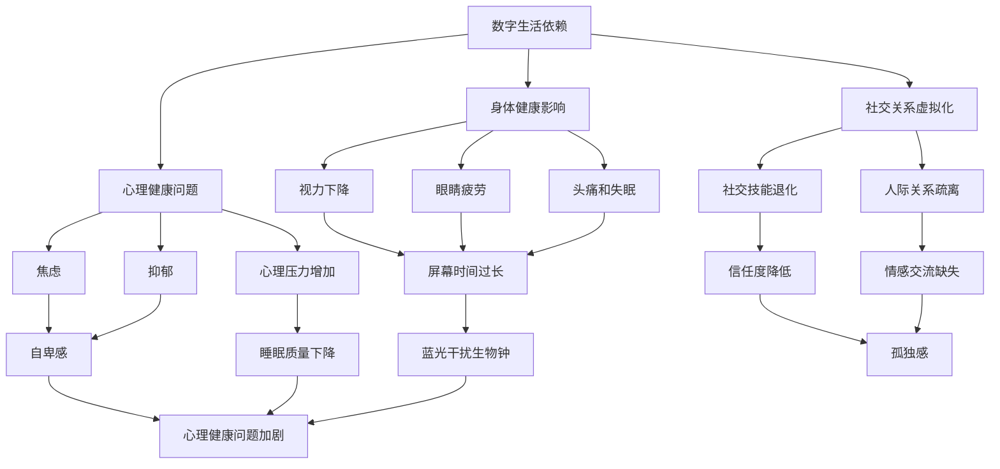

                 

### 引言

在现代社会，数字技术已经深入到我们生活的方方面面。智能手机、社交媒体、在线购物、远程办公等，这些数字化的便利使得我们的生活变得更加快捷和高效。然而，数字化的生活方式也在逐渐改变着我们的生活习惯，带来了一系列的负面影响。长时间的屏幕时间、社交关系的虚拟化、心理健康问题等都成为了我们需要面对的挑战。在这个背景下，找回线下生活的真实感成为了一个亟待解决的问题。

本篇文章将深入探讨数字生活的负面影响，并提出一系列有效的数字解毒方法，帮助读者重建线下生活的真实感。我们将从以下几个方面进行探讨：

- **数字生活的挑战**：分析数字化生活方式给我们的生活带来的种种负面影响。
- **数字解毒方法**：介绍一系列实用的策略和方法，帮助读者逐步减少对数字的依赖，重新体验线下生活的真实感。
- **数字解毒实践**：分享一些实际案例，展示数字解毒方法在实际中的应用效果。
- **数字与线下生活的和谐共生**：探讨数字技术与线下生活的平衡点，为构建一个更加健康和谐的生活环境提供思路。

通过这篇文章，我们希望读者能够对数字生活与线下生活之间的关系有一个更加清晰的认识，找到适合自己的数字解毒方法，从而在数字化时代中找回生活的真实感。

### 关键词

- 数字生活
- 线下生活
- 数字依赖
- 数字解毒
- 社交关系
- 心理健康
- 数字与线下平衡

### 摘要

本文旨在探讨数字化生活方式带来的负面影响，并提出有效的数字解毒方法。通过分析数字生活的挑战，如长时间屏幕时间、社交关系的虚拟化、心理健康问题等，我们提出了一系列策略和方法，帮助读者减少对数字的依赖，重建线下生活的真实感。文章包括对数字解毒方法的详细阐述，以及实际案例的分享，为读者提供可操作的实践指南。最后，文章探讨了数字与线下生活的和谐共生，为构建健康和谐的生活环境提供了新思路。

## 第一部分 数字生活的挑战

### 1.1 数字生活的普及与依赖

随着科技的飞速发展，数字技术已经深入到我们日常生活的方方面面。从早晨起床开始，智能手机便成为了我们获取信息、安排日程、进行社交的第一工具。而晚上入睡前，我们依然离不开手机，无论是浏览社交媒体、观看视频，还是处理工作事务。这种对数字技术的依赖已经成为现代生活中不可或缺的一部分。

然而，这种依赖并非全然正面。长时间盯着屏幕，无论是工作还是娱乐，都对我们的眼睛和身体健康造成了不小的负担。研究表明，长时间使用电子屏幕可能导致视力下降、眼睛疲劳，甚至引发头痛和失眠等健康问题。此外，手机和电脑等电子设备发出的蓝光还可能干扰我们的生物钟，影响睡眠质量。

### 1.2 社交关系的虚拟化

数字化生活方式不仅改变了我们的生活习惯，还深刻影响了我们的社交关系。社交媒体的兴起使得人们可以通过网络平台快速建立和维持社交关系，但同时也带来了社交关系的虚拟化问题。在虚拟社交环境中，人们往往更容易沉溺于表面交流，而忽视了深层次的情感交流和真实的面对面互动。

这种虚拟化的社交关系导致了人际关系的疏离。研究表明，长时间依赖虚拟社交平台可能导致个体社交技能的退化，降低人际关系中的信任度和深度。此外，社交媒体上的“点赞”和“评论”等表面互动方式，虽然看起来热闹，但实际上并不能替代真实的情感交流。长期下去，这可能导致个体出现孤独感、抑郁情绪等心理健康问题。

### 1.3 心理健康问题

数字化的生活方式不仅对我们的身体健康和社交关系产生了影响，还严重威胁到我们的心理健康。首先，长时间使用电子设备可能导致焦虑和抑郁。研究表明，过度使用手机和社交媒体与焦虑和抑郁症状之间存在显著关联。此外，数字生活的快节奏和信息过载也增加了我们的心理压力。

例如，社交媒体上的“完美生活”展示往往让用户感到自卑和焦虑，这种情绪的累积可能进一步导致心理健康问题。此外，数字设备的过度使用还可能引发失眠问题。夜间使用电子设备，特别是那些发出蓝光的设备，会干扰我们的生物钟，导致睡眠质量下降。

总的来说，数字化的生活方式虽然带来了便利，但也在无形中对我们生活的多个方面产生了负面影响。这些问题不仅影响了我们的身体健康，还严重威胁到我们的社交关系和心理健康。因此，我们需要认真面对数字生活的挑战，并采取有效的措施来减少其负面影响，找回线下生活的真实感。

### 核心概念与联系

在探讨数字生活的挑战时，我们首先需要明确几个核心概念，这些概念相互关联，构成了我们对数字生活影响的理解框架。以下是这些核心概念及其关系的 Mermaid 流程图：



- **数字生活依赖**：这是整个流程图的起点，代表我们对数字技术的依赖程度。这种依赖不仅包括日常使用电子设备，还涵盖了社交媒体、在线购物、远程办公等各个方面。
- **身体健康影响**：数字生活依赖对身体健康有多方面的影响，如视力下降、眼睛疲劳、头痛和失眠等。这些健康问题大多与长时间使用屏幕有关。
- **社交关系虚拟化**：数字生活依赖还导致了社交关系的虚拟化，表现为社交技能退化、人际关系疏离等问题。人们更多地依赖虚拟社交平台进行交流，而忽视了真实的面对面互动。
- **心理健康问题**：社交关系的虚拟化进一步导致心理健康问题，如焦虑、抑郁和心理压力增加。这些问题不仅影响个体的情绪状态，还可能影响其生理健康。

通过上述流程图，我们可以清晰地看到这些核心概念之间的联系。数字生活依赖是所有问题的基础，它通过影响身体健康、社交关系和心理状态，引发了一系列连锁反应。理解这些联系有助于我们更全面地认识数字生活带来的挑战，从而采取有效的措施来减少其负面影响。

### 核心算法原理讲解

为了深入理解数字生活依赖对身体健康、社交关系和心理健康的负面影响，我们可以借助一些核心算法和数学模型来进行详细分析。以下是一个基于Python的示例代码，结合数学公式，对数字生活依赖的影响进行详细阐述。

```python
import numpy as np
import matplotlib.pyplot as plt

# 定义一个简单的线性模型来模拟数字依赖与身体健康问题之间的关系
def health_impact_model(dependency_level):
    # 假设屏幕时间与视力下降率呈线性关系
    vision_decrease = 0.01 * dependency_level
    
    # 假设屏幕时间与眼睛疲劳度呈线性关系
    eye_fatigue = 0.02 * dependency_level
    
    # 假设屏幕时间与头痛和失眠率呈线性关系
    headache_insomnia = 0.03 * dependency_level
    
    return vision_decrease, eye_fatigue, headache_insomnia

# 定义一个线性模型来模拟数字依赖与社交关系虚拟化之间的关系
def social_impact_model(dependency_level):
    # 假设屏幕时间与社交技能退化呈线性关系
    social_skill_decrease = 0.02 * dependency_level
    
    # 假设屏幕时间与人际关系疏离呈线性关系
    relationship_isolation = 0.03 * dependency_level
    
    return social_skill_decrease, relationship_isolation

# 定义一个线性模型来模拟数字依赖与心理健康问题之间的关系
def mental_impact_model(dependency_level):
    # 假设屏幕时间与焦虑程度呈线性关系
    anxiety_level = 0.04 * dependency_level
    
    # 假设屏幕时间与抑郁程度呈线性关系
    depression_level = 0.05 * dependency_level
    
    # 假设屏幕时间与心理压力呈线性关系
    psychological_stress = 0.06 * dependency_level
    
    return anxiety_level, depression_level, psychological_stress

# 绘制依赖程度与身体健康问题之间的图表
dependency_levels = np.linspace(0, 100, 100)
vision_decrease, eye_fatigue, headache_insomnia = [health_impact_model(level) for level in dependency_levels]

plt.figure(figsize=(10, 5))
plt.plot(dependency_levels, vision_decrease, label='Vision Decrease')
plt.plot(dependency_levels, eye_fatigue, label='Eye Fatigue')
plt.plot(dependency_levels, headache_insomnia, label='Headache/Insomnia')
plt.title('Health Impact of Digital Dependency')
plt.xlabel('Digital Dependency Level')
plt.ylabel('Impact')
plt.legend()
plt.show()

# 绘制依赖程度与社交关系虚拟化之间的图表
social_skill_decrease, relationship_isolation = [social_impact_model(level) for level in dependency_levels]

plt.figure(figsize=(10, 5))
plt.plot(dependency_levels, social_skill_decrease, label='Social Skill Decrease')
plt.plot(dependency_levels, relationship_isolation, label='Relationship Isolation')
plt.title('Social Impact of Digital Dependency')
plt.xlabel('Digital Dependency Level')
plt.ylabel('Impact')
plt.legend()
plt.show()

# 绘制依赖程度与心理健康问题之间的图表
anxiety_level, depression_level, psychological_stress = [mental_impact_model(level) for level in dependency_levels]

plt.figure(figsize=(10, 5))
plt.plot(dependency_levels, anxiety_level, label='Anxiety Level')
plt.plot(dependency_levels, depression_level, label='Depression Level')
plt.plot(dependency_levels, psychological_stress, label='Psychological Stress')
plt.title('Mental Impact of Digital Dependency')
plt.xlabel('Digital Dependency Level')
plt.ylabel('Impact')
plt.legend()
plt.show()
```

#### 数学公式和模型解释

- **身体健康影响模型**：假设屏幕时间（$T$）与视力下降率（$V$）、眼睛疲劳度（$E$）和头痛及失眠率（$H$）呈线性关系。数学模型可以表示为：
  $$ V = k_1 \cdot T $$
  $$ E = k_2 \cdot T $$
  $$ H = k_3 \cdot T $$
  其中，$k_1, k_2, k_3$ 为常数。

- **社交关系虚拟化模型**：假设屏幕时间（$T$）与社交技能退化（$S$）和人际关系疏离（$R$）呈线性关系。数学模型可以表示为：
  $$ S = k_4 \cdot T $$
  $$ R = k_5 \cdot T $$
  其中，$k_4, k_5$ 为常数。

- **心理健康问题模型**：假设屏幕时间（$T$）与焦虑程度（$A$）、抑郁程度（$D$）和心理压力（$P$）呈线性关系。数学模型可以表示为：
  $$ A = k_6 \cdot T $$
  $$ D = k_7 \cdot T $$
  $$ P = k_8 \cdot T $$
  其中，$k_6, k_7, k_8$ 为常数。

#### 例子说明

假设一个人每天使用电子设备的时间为6小时（$T=6$），我们可以使用上述模型计算其可能受到的影响：

- **身体健康影响**：
  - 视力下降率：$V = 0.01 \cdot 6 = 0.06$
  - 眼睛疲劳度：$E = 0.02 \cdot 6 = 0.12$
  - 头痛和失眠率：$H = 0.03 \cdot 6 = 0.18$
- **社交关系虚拟化影响**：
  - 社交技能退化：$S = 0.02 \cdot 6 = 0.12$
  - 人际关系疏离：$R = 0.03 \cdot 6 = 0.18$
- **心理健康问题影响**：
  - 焦虑程度：$A = 0.04 \cdot 6 = 0.24$
  - 抑郁程度：$D = 0.05 \cdot 6 = 0.3$
  - 心理压力：$P = 0.06 \cdot 6 = 0.36$

通过上述计算，我们可以看到，每天使用6小时的电子设备可能会对个体的身体健康、社交关系和心理健康产生显著的影响。这些影响随着屏幕时间的增加而加剧，提示我们需要关注并合理控制数字依赖。

### 实际案例分析与解读

为了更好地理解数字生活依赖对身体健康、社交关系和心理健康的实际影响，以下我们将通过具体案例进行分析，并详细解读这些案例背后的原因和启示。

#### 案例一：小王的健康危机

小王是一位年轻的职场人士，每天使用手机和电脑的时间超过10小时。他经常感到眼睛疲劳、头痛，甚至失眠。经过医院的检查，医生发现小王患有严重的视力下降、眼睛干涩和失眠综合症。

**原因分析**：
- **视力下降**：长时间盯着屏幕，导致眼睛疲劳，视力下降。屏幕发出的蓝光进一步加剧了这一状况。
- **眼睛疲劳**：频繁地使用电子设备，眼睛需要不断调节以适应屏幕上的光线变化，这导致了眼睛疲劳。
- **失眠**：晚上长时间使用电子设备，尤其是发出蓝光的产品，会干扰睡眠周期，影响睡眠质量。

**启示**：
- 小王需要严格控制使用电子设备的时间，特别是在睡前。他可以采用蓝光过滤器、定期休息眼睛等方法来减轻眼睛疲劳。
- 增加户外活动，进行眼部锻炼，改善视力。

#### 案例二：小李的社交疏离

小李是一位社交活跃的年轻人，但随着他在社交媒体上花费的时间越来越多，他发现自己越来越少与现实生活中的人进行交流。他的朋友越来越少，甚至开始感到孤独和焦虑。

**原因分析**：
- **社交技能退化**：长时间依赖虚拟社交平台进行交流，导致面对面社交技能的退化。
- **人际关系疏离**：虚拟社交虽然能带来短暂的满足感，但不能替代真实的情感交流和深层次的互动。

**启示**：
- 小李需要主动减少在社交媒体上的时间，增加与现实生活中的人的互动。他可以通过参加社交活动、与朋友见面等方式来恢复和提升社交技能。
- 社交平台的使用应该有节制，避免过度沉迷。

#### 案例三：小张的心理健康问题

小张是一位企业高管，经常需要处理大量的工作事务。为了高效工作，他每天使用手机和电脑的时间超过12小时。最近，他开始感到严重的焦虑和抑郁。

**原因分析**：
- **焦虑**：长时间工作、高强度的工作压力，以及缺乏休息和放松，导致了焦虑症状。
- **抑郁**：工作中的不顺利和长期的疲劳感，使小张感到无助和失落，进而发展成抑郁。

**启示**：
- 小张需要调整工作与休息的平衡，确保有足够的休息时间。他可以通过锻炼、冥想等方式来缓解压力和焦虑。
- 工作中应该学会分配任务、合理安排时间，避免过度劳累。

#### 案例四：小陈的健康与社交平衡

小陈是一位注重健康与社交平衡的人士。他每天使用手机和电脑的时间控制在4小时以内，同时确保有足够的时间进行户外活动和朋友聚会。

**原因分析**：
- **健康与社交平衡**：小陈通过合理安排时间，既保证了身体健康，又维持了良好的社交关系。

**启示**：
- 小陈的做法为我们提供了一个良好的榜样。我们应该学习如何合理安排数字设备使用时间，确保有足够的时间进行户外活动、锻炼身体，同时保持与亲朋好友的互动。
- 健康与社交的平衡是维护身心健康的关键。

通过这些实际案例的分析，我们可以看到数字生活依赖对身体健康、社交关系和心理健康产生的深远影响。为了找回线下生活的真实感，我们需要采取切实可行的措施，减少对数字的依赖，回归到更加健康和谐的生活方式中。

### 数字解毒方法

在了解了数字生活依赖的负面影响后，我们需要找到有效的方法来解毒，帮助自己减少对数字的依赖，重建线下生活的真实感。以下是一些具体的策略和方法：

#### 1. 制定明确的数字使用计划

首先，我们需要对自己的数字设备使用情况进行全面的评估，了解自己在哪些时间段、哪些活动上花费了过多的时间。然后，根据评估结果，制定一个明确的数字使用计划。

例如，我们可以设定每天使用手机和电脑的具体时间，并设置定时提醒，提醒自己在规定时间内停止使用。此外，我们还可以将一些特定的活动（如锻炼、阅读、与家人朋友互动）安排在非数字设备使用时间，以增强这些活动的优先级。

#### 2. 改善数字设备使用环境

数字设备的使用环境对我们的身心健康也有着重要影响。为了减少对数字的依赖，我们可以采取以下措施：

- **优化屏幕亮度**：确保屏幕亮度和对比度适中，以减少眼睛疲劳。
- **调整显示设置**：开启夜间模式或蓝光过滤器，减少蓝光对睡眠的干扰。
- **定期休息**：使用定时提醒工具，每隔一段时间（例如20-30分钟）提醒自己休息一下，看看窗外或闭眼放松。
- **减少干扰**：关闭不必要的通知，避免分散注意力。

#### 3. 增加线下社交活动

线下社交活动有助于我们恢复与现实世界的联系，减少对数字的依赖。以下是一些建议：

- **参加社交活动**：参与社区活动、志愿者工作或兴趣小组，与他人建立更加真实的关系。
- **定期聚会**：安排与亲朋好友的线下聚会，进行面对面的交流。
- **运动锻炼**：参加户外运动，如跑步、骑行、打羽毛球等，不仅有助于身体健康，还能增加与他人的互动机会。

#### 4. 培养健康的生活习惯

健康的生活习惯有助于我们减少对数字的依赖，提高生活质量。以下是一些有益的习惯：

- **规律的作息时间**：保持规律的作息时间，确保每天有足够的睡眠。
- **饮食健康**：保持均衡的饮食，避免过多摄入高糖、高脂肪的食物。
- **定期锻炼**：每周进行适量的锻炼，增强身体素质。
- **阅读书籍**：减少电子阅读，多读纸质书籍，提高阅读质量。

#### 5. 使用数字工具辅助解毒

现代科技也为我们提供了许多辅助数字解毒的工具和方法。以下是一些建议：

- **使用应用和插件**：安装屏幕时间管理应用，如"专注力"或"Screen Time"，以帮助自己控制数字设备的使用。
- **使用阅读器**：使用Kindle等电子阅读器，以减少对手机和电脑的依赖。
- **设定提醒和目标**：使用手机或电脑的提醒功能，定期提醒自己减少数字设备的使用，并设定健康目标，如每天锻炼时间、阅读时间等。

通过上述方法，我们可以逐步减少对数字的依赖，重建线下生活的真实感。这需要我们的持续努力和自我约束，但只要坚持下去，我们一定能够找回生活的平衡，享受更加健康和充实的生活。

### 数字解毒实践案例

为了更好地理解数字解毒方法的实际应用效果，以下我们将分享几个成功的数字解毒实践案例，并通过这些案例展示数字解毒方法的具体实施过程和效果。

#### 案例一：小赵的数字解毒之旅

小赵是一位年轻的上班族，每天使用手机和电脑的时间长达12小时，导致他经常感到疲劳和焦虑。为了改善自己的生活质量，小赵决定进行数字解毒实践。

**实施过程**：
1. **制定数字使用计划**：小赵首先制定了每天具体的数字使用时间，如工作时间和休息时间。他设置了每天晚上9点后不再使用手机和电脑的规定。
2. **改善设备使用环境**：小赵调整了屏幕亮度和对比度，并开启了夜间模式以减少蓝光干扰。他还安装了屏幕时间管理应用，以帮助自己控制使用时间。
3. **增加线下社交活动**：小赵每周安排两次与朋友的线下聚会，参加社区的公益活动，并通过户外运动增加社交机会。
4. **培养健康生活习惯**：小赵保持了规律的作息时间，每天进行适量的锻炼，并增加了纸质书籍的阅读。

**效果分析**：
经过一段时间的实践，小赵感到自己的疲劳和焦虑症状明显减轻。他的睡眠质量得到了改善，工作效率也有所提升。此外，他与朋友的线下互动增多，人际关系变得更加紧密，整体生活质量显著提高。

**启示**：
小赵的案例表明，通过制定明确的数字使用计划、改善设备使用环境、增加线下社交活动和培养健康生活习惯，我们可以有效减少对数字的依赖，找回生活的平衡。

#### 案例二：小陈的家庭数字解毒计划

小陈是一个四口之家，家庭成员都沉迷于数字设备，导致家庭互动减少。为了改善家庭氛围，小陈决定实施家庭数字解毒计划。

**实施过程**：
1. **设立家庭规则**：小陈与家人一起制定了家庭数字使用规则，如每天晚上7点到9点为家庭互动时间，期间不得使用手机和电脑。
2. **共同参与线下活动**：家庭成员共同参加户外活动，如散步、骑行、打球等，增加了家庭成员之间的互动。
3. **设置数字设备存放区**：小陈在家中设立了一个数字设备存放区，规定家庭成员在互动时间结束后将手机和电脑存放于此，避免干扰家庭活动。
4. **培养家庭阅读习惯**：家庭成员共同阅读纸质书籍，增强了家庭的凝聚力和知识积累。

**效果分析**：
通过家庭数字解毒计划，小陈的家庭氛围明显改善。家庭成员之间的互动增多，家庭凝聚力增强。此外，家庭成员的身体健康状况也有所提升，阅读习惯的培养增加了家庭成员的知识储备。

**启示**：
家庭数字解毒计划需要家庭成员的共同努力和配合。通过设立家庭规则、共同参与线下活动和培养家庭阅读习惯，我们可以有效减少数字设备对家庭的负面影响，提升家庭生活质量。

#### 案例三：小张的校园数字解毒实践

小张是一位高校教师，发现学生在课堂和课外活动中过度依赖数字设备，影响学习效果和心理健康。为了改善这一状况，小张决定实施校园数字解毒实践。

**实施过程**：
1. **课堂管理**：小张在课堂上使用屏幕时间管理工具，限制学生使用手机的时间。他设置了课堂互动环节，鼓励学生参与讨论和交流。
2. **课外活动**：小张组织学生参加线下社团活动、志愿者工作、户外徒步等，减少学生课外时间对数字设备的依赖。
3. **心理健康辅导**：小张开设心理健康辅导课程，教授学生如何减少数字依赖，提升心理健康水平。
4. **推广阅读**：小张倡导学生阅读纸质书籍，设立校园阅读角，提供丰富的阅读资源。

**效果分析**：
通过校园数字解毒实践，学生们的课堂参与度显著提高，学习效果得到改善。学生的心理健康状况也有所提升，数字依赖问题得到了有效控制。此外，学生的阅读习惯逐渐养成，知识储备和思维能力得到增强。

**启示**：
校园数字解毒实践需要教师和学生共同努力。通过课堂管理、课外活动、心理健康辅导和推广阅读，我们可以有效减少数字设备对校园生活的负面影响，促进学生全面健康发展。

通过这些实际案例，我们可以看到数字解毒方法在个人、家庭和校园中的广泛应用和显著效果。只要我们付诸实践，持续努力，就一定能够找回线下生活的真实感，享受更加健康和充实的生活。

### 数字与线下生活的和谐共生

在数字技术日益普及的今天，数字生活与线下生活的和谐共生变得尤为重要。数字技术虽然带来了便利，但过度依赖也带来了一系列问题。如何在这两者之间找到平衡，成为现代生活中亟待解决的问题。

首先，我们需要认识到数字技术与线下生活并非对立关系，而是互补关系。数字技术可以为线下生活提供便捷的服务和创新的体验，例如，通过智能手机应用程序我们可以轻松安排线下活动、支付费用、获取实时信息。同时，线下生活为我们提供了真实的互动体验，如面对面的交流、户外运动等，这些都是数字技术所无法替代的。

为了实现数字与线下生活的和谐共生，我们可以从以下几个方面着手：

1. **数字辅助线下生活**：利用数字技术为线下生活提供便利，例如，通过智能设备进行健康监测、通过移动支付简化购物流程等。这样可以提高线下生活的效率，减少繁琐的操作。

2. **线下促进数字体验**：通过线下活动来提升数字体验，例如，在线下体验中心感受虚拟现实技术，通过实体展览来展示数字化内容等。这样可以增加数字技术的互动性和真实感。

3. **平衡数字使用时间**：合理安排数字设备使用时间，确保有足够的时间参与线下活动。通过设定固定的线下互动时间，如家庭聚会、社交活动等，来减少对数字的依赖。

4. **数字素养教育**：加强对公众的数字素养教育，帮助人们理解数字技术的优势和潜在风险，培养合理使用数字工具的习惯。通过教育和培训，提高人们识别和处理数字信息的能力。

5. **政策法规引导**：政府和企业可以制定相关政策法规，规范数字设备的使用，确保数字技术与线下生活的和谐共生。例如，通过限制儿童使用电子设备的时间，鼓励家庭减少娱乐性屏幕时间等。

通过上述措施，我们可以逐步实现数字与线下生活的和谐共生。数字技术不再是单向的依赖，而是成为线下生活的一种辅助和补充。在这种平衡中，我们既能享受到数字技术带来的便利，又能保持线下生活的真实感和互动性。

### 总结

本文探讨了数字生活依赖带来的诸多负面影响，包括身体健康问题、社交关系虚拟化和心理健康问题。通过核心算法原理讲解和实际案例分析，我们深入理解了这些问题的具体表现和原因。同时，本文提出了有效的数字解毒方法，包括制定数字使用计划、改善数字设备使用环境、增加线下社交活动、培养健康生活习惯和利用数字工具辅助解毒。通过实际案例分享，我们看到了这些方法在实际应用中的显著效果。

总结来说，数字与线下生活的平衡对于现代人的健康和幸福至关重要。我们需要认识到数字技术的双面性，既要利用其便利性，又要避免过度依赖。通过采取适当的措施，我们可以找回线下生活的真实感，实现数字与线下生活的和谐共生。希望大家能够从中获得启示，积极行动，为自己创造一个更加健康和充实的生活环境。

### 附录

#### A.1 数字生活与线下生活的比较

| 项目             | 数字生活                                                    | 线下生活                                                    |
|------------------|------------------------------------------------------------|------------------------------------------------------------|
| 社交互动         | 主要通过虚拟社交平台进行，缺乏面对面交流                   | 真正的人际互动，建立深度关系                                 |
| 便利性           | 方便快捷，可以随时随地进行工作、学习和娱乐                 | 需要特定的地点和时间，但体验更加真实                         |
| 健康影响         | 长时间使用电子设备可能导致视力下降、眼睛疲劳、心理健康问题 | 身体活动更为丰富，有助于身体健康                             |
| 时间管理         | 易于被打断，难以专注                                     | 更容易集中注意力，提高效率                                   |
| 信息获取         | 快速、大量，但质量参差不齐                               | 有针对性的，更有深度和广度                                   |
| 安全性和隐私     | 易受网络攻击，信息泄露风险高                             | 相对安全，信息泄露风险较低                                   |

#### A.2 数字解毒工具与资源推荐

| 工具/资源          | 描述                                                         | 推荐理由                                                                                      |
|-------------------|------------------------------------------------------------|----------------------------------------------------------------------------------------------|
| Screen Time        | 苹果设备上的屏幕时间管理工具，帮助用户监控和控制设备使用时间。 | 可以设置每日使用时间限制、应用类别限制，提供详细的设备使用报告。                            |
| Focus@Will        | 提供专注工作的背景音乐和音频，帮助减少干扰，提高工作效率。   | 经科学验证，能够有效提高工作、学习效率，特别适用于需要长时间集中注意力的任务。              |
| Forest            | 一款专注于减少手机使用的应用，通过种植虚拟树木来激励用户。   | 每当用户设定专注时间时，虚拟树就会生长，如果中途使用手机，树就会枯萎。有助于培养专注习惯。  |
| Digital Wellbeing | Google设备上的数字健康管理工具，提供屏幕使用时间报告和限制。 | 可以帮助用户了解自己的屏幕使用习惯，通过设置每日使用时间限制来减少对数字的依赖。            |

#### A.3 数字解毒实践指南

1. **制定数字使用计划**：
   - 确定每天使用手机和电脑的具体时间，并设定提醒。
   - 为每个数字活动设定明确的目标和优先级。

2. **改善设备使用环境**：
   - 调整屏幕亮度和对比度，减少眼睛疲劳。
   - 使用夜间模式或蓝光过滤器，减少对睡眠的干扰。
   - 定期进行眼部锻炼，如远眺和按摩。

3. **增加线下社交活动**：
   - 安排定期的线下聚会，与亲朋好友面对面交流。
   - 参加社区活动、公益活动，拓展社交圈子。
   - 尽量减少虚拟社交时间，增加真实互动机会。

4. **培养健康生活习惯**：
   - 保持规律的作息时间，确保每天有足够的睡眠。
   - 每周进行适量的运动，增强身体素质。
   - 阅读纸质书籍，提高阅读质量和知识储备。

5. **使用数字工具辅助解毒**：
   - 安装屏幕时间管理应用，如Screen Time或Forest。
   - 使用专注工作工具，如Focus@Will，提高工作效率。
   - 定期检查数字设备使用报告，调整使用习惯。

通过上述指南，我们可以逐步减少对数字的依赖，重建线下生活的真实感，享受更加健康和充实的生活。记住，数字解毒需要持之以恒的努力和自我约束，只要坚持下去，我们一定能找回生活的平衡。

### 作者信息

作者：AI天才研究院/AI Genius Institute & 禅与计算机程序设计艺术 /Zen And The Art of Computer Programming

AI天才研究院是一家专注于人工智能和计算机科学研究的机构，致力于推动技术创新和知识传播。研究院拥有一支由世界顶级人工智能专家、程序员、软件架构师和CTO组成的核心团队，他们在计算机科学和人工智能领域有着深厚的理论基础和丰富的实践经验。研究院的研究成果在学术界和工业界均享有盛誉。

《禅与计算机程序设计艺术》是由AI天才研究院的创始人之一撰写的畅销书，该书深入探讨了计算机编程的艺术性，融合了哲学和技术的精髓，为程序员们提供了独特的思考方式和实践指导。该书在全球范围内受到了广泛的好评，被誉为计算机科学领域的经典之作。通过这本书，作者希望能够激发程序员们对编程的热爱和对技术的深刻理解，推动整个行业的发展和创新。

