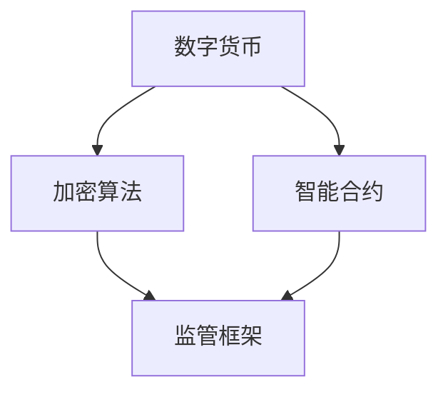

                 

### 深度思考：数字货币的监管挑战：金融稳定与技术创新的博弈

数字货币的兴起在全球范围内引发了金融科技革命，其背后蕴含的创新动能不可小觑。然而，随着数字货币的广泛应用，监管挑战也随之而来。如何在保障金融稳定的同时，充分发挥技术创新的潜力，成为了摆在各国政府和监管机构面前的一道难题。

#### **背景介绍**

数字货币的概念最早可以追溯到20世纪80年代的电子现金，但真正引起广泛关注的是2009年比特币的诞生。作为一种去中心化的电子货币，比特币不仅改变了人们对于货币的传统认知，也引发了一系列关于金融体系、监管模式和社会影响的讨论。

随着区块链技术的快速发展，越来越多的数字货币和加密货币相继出现，如以太坊、莱特币等。这些新型货币不仅在交易速度和交易成本上具有优势，还提供了一系列去中心化的金融应用，如智能合约、去中心化金融（DeFi）等。然而，数字货币的快速普及也带来了诸多监管挑战。

首先，数字货币的去中心化特性使其难以受到传统金融监管框架的有效约束，这可能导致洗钱、恐怖融资等违法活动的风险增加。其次，数字货币的波动性较大，可能对金融市场的稳定性构成威胁。此外，数字货币的跨境交易特性也使得国际监管合作变得复杂。

#### **核心概念与联系**

在分析数字货币的监管挑战时，我们需要明确几个核心概念：

1. **数字货币**：是一种基于区块链技术的电子货币，包括法定数字货币（如中国的数字人民币）和加密货币（如比特币）。
2. **加密算法**：是数字货币安全性的基础，包括哈希算法、公钥加密算法等。
3. **智能合约**：是区块链上的自动执行合约，通过编程实现合同条款的执行。
4. **监管框架**：是各国政府和国际组织为规范数字货币市场而制定的一系列法律法规和政策。

这些概念之间的联系可以简化为一个Mermaid流程图：



- **加密算法**确保了数字货币的安全性，是其核心组成部分。
- **智能合约**实现了数字货币的自动化和去中心化特性。
- **监管框架**则是为了在保障金融稳定的同时，监管数字货币市场。

#### **核心算法原理讲解**

为了更好地理解数字货币的监管挑战，我们可以通过Python代码来阐述加密算法和智能合约的基本原理。

**加密算法原理讲解：**

```python
# 哈希算法示例（SHA-256）
import hashlib

def calculate_hash(message):
    hash_object = hashlib.sha256(message.encode())
    hex_dig = hash_object.hexdigest()
    return hex_dig

message = "Hello, World!"
hash_value = calculate_hash(message)
print(f"The SHA-256 hash of '{message}' is '{hash_value}'.")
```

**智能合约原理讲解：**

```solidity
// SPDX-License-Identifier: MIT
pragma solidity ^0.8.0;

contract SimpleStorage {
    uint256 public favoriteNumber;

    function store(uint256 _favoriteNumber) public {
        favoriteNumber = _favoriteNumber;
    }
}

// 智能合约示例：简单的数字存储
// `store` 函数用于存储用户的数字，任何人都可以调用这个函数来设置存储的值。
```

这些代码展示了如何使用哈希算法来确保数据的安全性和智能合约来执行自动化的合同条款。这些技术是数字货币的核心，但也带来了监管上的挑战。

#### **数学公式与模型**

在数字货币的监管挑战中，数学模型和公式也发挥着重要作用。以下是一些相关的数学公式：

- **加密货币价格波动模型**：
  $$P_t = P_0 \cdot e^{rt}$$
  其中，$P_t$ 是时间 $t$ 时的价格，$P_0$ 是初始价格，$r$ 是利率，$t$ 是时间。

- **市场深度模型**：
  $$\Delta P = \frac{\Delta V}{D}$$
  其中，$\Delta P$ 是价格变化，$\Delta V$ 是交易量变化，$D$ 是市场深度。

这些公式帮助我们理解和预测数字货币市场的动态，从而为监管政策提供依据。

#### **项目实战**

在数字货币监管的实践中，构建一个监管沙盒（Regulatory Sandbox）是一个重要的项目。监管沙盒允许企业在受控的环境中进行实验，而监管机构可以在不干扰市场稳定性的情况下观察和评估这些创新。

**开发环境搭建：**
- 使用以太坊搭建一个私有链作为监管沙盒的基础。
- 安装并配置Solidity编译器和智能合约开发工具。

**源代码详细实现和代码解读：**
- 实现一个智能合约，用于模拟数字货币的交易和监管。
- 解读代码中的关键部分，如交易函数和监管接口。

**实际案例分析和详细讲解剖析：**
- 分析监管沙盒中的交易数据，评估智能合约的有效性。
- 深入分析交易行为和监管措施的执行情况。

**项目小结：**
监管沙盒提供了一个实验平台，使监管机构和企业可以共同探索数字货币的监管方案，从而在保障金融稳定的同时，促进技术创新。

#### **最佳实践 tips、小结、注意事项、拓展阅读**

**最佳实践 tips：**
- 强化数字货币的风险管理，包括监测交易行为和预防洗钱活动。
- 推动国际监管合作，建立统一的技术标准和监管框架。

**小结：**
数字货币的监管挑战是金融稳定与技术创新之间的一种博弈。通过理解数字货币的核心技术，我们可以更好地设计监管策略，以实现二者的平衡。

**注意事项：**
- 数字货币监管需要结合国情和市场需求，避免一刀切的政策。
- 监管机构应与技术创新者保持沟通，以适应快速变化的技术环境。

**拓展阅读：**
- 《区块链技术指南》
- 《数字货币与加密货币：未来金融的变革》
- 《智能合约安全：设计与案例分析》

通过这些深入的分析和思考，我们希望能够为数字货币监管提供一些有益的见解，促进金融科技的健康稳定发展。作者：AI天才研究院/AI Genius Institute & 禅与计算机程序设计艺术 /Zen And The Art of Computer Programming

----------------------------------------------------------------

# 《数字货币的监管挑战：金融稳定与技术创新的博弈》

## 关键词

数字货币、监管挑战、金融稳定、技术创新、加密算法、智能合约、监管框架、区块链技术

## 摘要

本文从数字货币的起源与发展、技术基础、监管挑战与金融稳定、数字货币监管政策与法规、数字货币监管实践与技术创新等多个角度，深入探讨了数字货币的监管挑战及其对金融稳定和技术创新的博弈。通过详细分析加密算法、智能合约等核心技术，并结合实际案例，本文旨在为读者提供一个全面、系统的数字货币监管理解，以推动金融科技的健康稳定发展。

----------------------------------------------------------------

## 第一部分：数字货币概述与监管背景

### 第1章：数字货币的起源与发展

数字货币作为现代金融科技的重要成果，其起源和发展历程充满了技术创新和社会变革的烙印。本章将深入探讨数字货币的概念与类型、发展历程以及全球监管现状，为理解数字货币的监管挑战奠定基础。

#### 1.1 数字货币的概念与类型

数字货币是一种基于数字化和网络技术的货币形式，它不同于传统货币，具有以下几个显著特点：

1. **去中心化**：数字货币不依赖于中央机构发行和管理，而是通过分布式网络进行记账和验证，确保交易的安全和透明。
2. **匿名性**：尽管数字货币的交易是透明的，但其用户身份可以进行匿名化处理，这在一定程度上增加了交易的隐私性。
3. **可追溯性**：数字货币的交易记录是公开的，任何人都可以通过区块链网络查询特定交易的历史记录。
4. **高效便捷**：数字货币的交易速度远快于传统金融系统，且交易成本较低，特别适合跨境交易。

根据不同的分类标准，数字货币可以分为以下几种类型：

1. **法定数字货币**：指由中央银行或其他官方机构发行的数字货币，如中国的数字人民币（e-CNY）、欧洲的数字欧元（e-Euro）等。法定数字货币具有与现行货币相同的法律地位，且受到国家信用担保。
2. **加密货币**：基于区块链技术发行的数字货币，如比特币（Bitcoin）、以太坊（Ethereum）等。加密货币通常不依赖于任何中央机构，通过加密算法和共识机制来保证货币的安全性和去中心化。
3. **代币**：在特定的区块链平台上发行的数字资产，用于代表所有权、权益或者用于交换。代币通常与某个具体项目或业务相关，如去中心化金融（DeFi）项目中的稳定币（Stablecoin）。
4. **数字资产**：广义上的数字货币和代币，包括所有基于区块链技术的数字资产，如非同质化代币（NFT）等。

#### 1.2 数字货币的发展历程

数字货币的发展历程可以追溯到20世纪80年代。当时，计算机科学家David Chaum提出了电子现金（E-Cash）的概念，这是一种使用加密技术进行匿名交易的方法。然而，真正的数字货币革命始于2009年比特币的诞生。比特币的创始人中本聪（Satoshi Nakamoto）在《比特币：一种点对点电子现金系统》一文中详细阐述了比特币的工作原理和目标。

1. **比特币的诞生（2009年）**：比特币作为第一个加密货币，通过区块链技术实现了去中心化的电子货币系统，引起了广泛关注。
2. **莱特币的推出（2011年）**：莱特币是第一个成功的加密货币分叉项目，旨在解决比特币的一些性能问题。
3. **以太坊的兴起（2015年）**：以太坊的推出标志着智能合约技术的成熟，它不仅提供了加密货币功能，还允许开发者创建去中心化应用（DApps）。
4. **稳定币的流行（2018年至今）**：随着DeFi的兴起，稳定币如Dai、USDC等成为加密货币市场的重要组成部分，为交易提供了更多的选择和便利。

#### 1.3 数字货币的全球监管现状

随着数字货币的普及，各国政府和监管机构对数字货币的监管态度逐渐明确，形成了多种监管模式：

1. **监管沙盒模式**：监管沙盒允许企业在受控的环境中进行创新和实验，监管机构在风险可控的前提下进行监督和评估。例如，新加坡、英国等国家和地区采用了这种模式。
2. **分类监管模式**：将数字货币分为不同类型，针对其特点和风险采取不同的监管措施。例如，美国将数字货币分为证券和商品，分别采取证券法和商品交易法进行监管。
3. **全面监管模式**：对数字货币进行全面的监管，包括交易、发行、存储等多个环节。中国、韩国等国家和地区采取了这种模式。

不同国家和地区的监管政策也在不断演变，以适应数字货币市场的发展和变化。例如，美国SEC（证券交易委员会）对加密货币的监管态度日益严格，而欧洲的ESMA（欧洲证券和市场管理局）则对加密货币的监管提出了更高的标准和要求。

### 总结

数字货币的发展不仅改变了传统金融体系，也为技术创新提供了新的机遇。然而，数字货币的监管挑战也随之而来。了解数字货币的概念与类型、发展历程和全球监管现状，有助于我们更好地理解数字货币的监管挑战，从而为制定有效的监管政策提供参考。在接下来的章节中，我们将深入探讨数字货币的技术基础，以及监管挑战与金融稳定之间的关系。

----------------------------------------------------------------

## 第二部分：数字货币的技术基础

### 第2章：数字货币的技术基础

数字货币的快速发展离不开其背后的核心技术，这些技术不仅确保了数字货币的安全性和可靠性，还为数字货币的创新提供了坚实的基础。本章将详细解析数字货币的三个核心技术：区块链技术、加密算法和智能合约，帮助读者理解这些技术在数字货币生态系统中的关键作用。

#### 2.1 区块链技术概述

区块链技术是数字货币的核心技术之一，其本质是一个去中心化的数据库，通过分布式网络实现数据的存储和传输。区块链的主要特点如下：

1. **去中心化**：区块链不依赖于中心化的服务器或机构，而是通过分布式网络进行数据存储和验证，从而提高了系统的容错能力和抗攻击能力。
2. **不可篡改**：区块链上的数据一旦被记录，就难以被篡改。这是因为区块链采用了一种共识机制，如工作量证明（PoW）或权益证明（PoS），确保了数据的一致性和可靠性。
3. **透明性**：区块链上的交易记录是公开的，任何人都可以查询和验证。这种透明性有助于提高交易的信任度和透明度。

区块链技术的工作原理可以概括为以下几个步骤：

1. **数据输入**：用户发起交易，并将其发送到区块链网络。
2. **验证交易**：网络中的节点对交易进行验证，确保交易的有效性和合法性。
3. **数据打包**：将验证后的交易打包成区块，并添加到区块链上。
4. **共识机制**：网络中的节点通过共识机制达成一致，决定哪个区块将被添加到区块链上。
5. **数据存储**：新的区块将被添加到区块链的末端，确保数据的持久性和不可篡改性。

区块链技术的应用不仅仅局限于数字货币，它还在供应链管理、智能合约、身份验证等多个领域展现出巨大的潜力。

#### 2.2 加密算法在数字货币中的应用

加密算法是数字货币安全性的基础，主要用于确保交易数据的安全性和隐私性。数字货币的加密算法主要包括以下几种：

1. **哈希算法**：哈希算法是一种将任意长度的数据转换为固定长度的字符串的算法。在数字货币中，哈希算法主要用于生成交易哈希值和确保区块链数据的一致性。常见的哈希算法包括SHA-256和RIPEMD-160。
2. **公钥加密算法**：公钥加密算法是一种非对称加密算法，它使用一对密钥（公钥和私钥）进行加密和解密。在数字货币中，公钥加密算法主要用于确保交易双方的身份验证和消息的保密性。常见的公钥加密算法包括RSA和ECC。
3. **数字签名**：数字签名是一种用于验证消息来源和完整性的技术，通过私钥对消息进行签名，接收方可以使用公钥验证签名的有效性。数字签名在数字货币中用于确保交易的真实性和不可抵赖性。

在数字货币交易中，加密算法的应用流程如下：

1. **身份验证**：交易双方使用公钥加密算法验证对方的身份。
2. **交易确认**：交易发起方将交易信息发送到区块链网络，网络中的节点对交易进行验证。
3. **交易加密**：交易信息被加密，以确保在传输过程中不会被截获或篡改。
4. **数字签名**：交易双方对交易信息进行数字签名，以证明交易的真实性和合法性。
5. **交易记录**：验证后的交易信息被记录在区块链上，形成永久性的交易记录。

#### 2.3 智能合约技术解析

智能合约是区块链技术的重要创新，它是一种自动执行的合同，能够在满足特定条件时自动执行预定的合约条款。智能合约通过编程语言（如Solidity）编写，并运行在区块链上，从而实现了去中心化的自动化交易。

智能合约的主要特点如下：

1. **去中心化**：智能合约在区块链上运行，不受任何中央机构的管理和控制，从而确保了交易的高效性和透明性。
2. **不可篡改**：一旦智能合约被部署到区块链上，其代码和状态将永久保存，且不可篡改，从而保证了合约的可靠性和安全性。
3. **自动化执行**：智能合约在满足预定的条件时自动执行，从而实现了自动化交易和去中心化金融应用。

智能合约的工作原理可以概括为以下几个步骤：

1. **合约编写**：开发者使用智能合约编程语言编写合约代码，定义合约的行为和逻辑。
2. **合约部署**：将合约代码部署到区块链上，合约状态和代码将被永久记录。
3. **合约调用**：用户通过区块链调用合约，执行预定的合约逻辑。
4. **状态更新**：合约执行完成后，其状态将被更新，并记录在区块链上。

智能合约在数字货币中的应用非常广泛，如去中心化金融（DeFi）应用、数字资产管理、数字身份认证等。

### 总结

数字货币的技术基础包括区块链技术、加密算法和智能合约，这些技术共同确保了数字货币的安全性和可靠性，为其创新提供了坚实的基础。理解这些技术的工作原理和核心特点，有助于我们更好地把握数字货币的发展趋势和监管挑战。在接下来的章节中，我们将深入探讨数字货币的监管挑战与金融稳定之间的关系，以及全球数字货币监管政策的现状。

----------------------------------------------------------------

### 第3章：数字货币的监管挑战与金融稳定

数字货币作为一种新兴的金融科技，其快速发展和广泛应用不仅带来了技术创新和金融效率的提升，同时也对传统金融体系带来了前所未有的监管挑战。本章节将深入分析数字货币对金融体系的冲击，以及金融稳定与技术创新之间的博弈，并探讨全球数字货币监管框架的构建。

#### 3.1 数字货币对金融体系的冲击

数字货币的兴起对传统金融体系产生了多方面的冲击：

1. **货币发行与货币政策**：数字货币的去中心化特性使其发行和管理过程不同于传统的中央银行货币。传统的货币政策依赖于货币供应量和利率的调整，而数字货币的供应量通常由算法决定，不受中央银行的控制。这可能导致货币政策的有效性受到挑战，同时也增加了货币政策操作的复杂性。
   
2. **支付体系**：数字货币的快速交易速度和低交易成本对传统支付体系构成了挑战。传统的支付系统通常需要较长时间和较高的费用进行跨境支付，而数字货币可以实现几乎即时和无费用的跨境交易。这种效率的提升可能会削弱传统支付系统的影响力。

3. **金融中介作用**：传统金融体系中的中介机构，如银行、证券公司等，依赖于提供金融服务赚取手续费和利息收入。数字货币的去中心化特性减少了中介机构的需求，从而对其商业模式和盈利模式产生了重大影响。

4. **金融稳定性**：数字货币市场的波动性较大，其价格受到多种因素的影响，如市场需求、政策变化、技术漏洞等。这种波动性可能对金融市场稳定性产生负面影响，尤其是当大量投资者涌入或退出市场时，可能导致市场出现剧烈波动。

#### 3.2 金融稳定与技术创新的博弈

在数字货币的发展过程中，金融稳定与技术创新之间存在着一种博弈关系：

1. **监管的必要性**：为了维护金融稳定，监管机构需要制定相应的法律法规来规范数字货币市场。然而，过度的监管可能会抑制技术创新，阻碍数字货币的发展。因此，如何在监管与创新之间找到平衡点，是一个关键问题。

2. **技术的进步**：随着技术的不断进步，数字货币的效率和安全性也在不断提高。区块链技术、加密算法、智能合约等技术的应用，使得数字货币的交易更加高效、透明和安全。这些技术进步为数字货币的监管提供了新的可能性，同时也对监管提出了新的挑战。

3. **市场自律**：除了监管，市场自律也是维护金融稳定的重要手段。数字货币交易所、项目方和投资者通过自律机制，如建立风险管理制度、加强信息披露等，可以降低市场风险，促进市场的健康发展。

#### 3.3 全球数字货币监管框架分析

全球各国和地区在数字货币监管方面采取了不同的策略和模式，形成了多样化的监管框架：

1. **监管沙盒**：监管沙盒是一种创新的监管模式，允许企业在受控的环境中尝试新的数字货币产品和业务模式。新加坡、英国等国家和地区已经建立了监管沙盒，通过降低监管门槛和提供指导，鼓励企业创新。

2. **分类监管**：分类监管模式根据数字货币的不同特点和风险，采取不同的监管措施。例如，美国将数字货币分为证券和商品，分别适用证券法和商品交易法进行监管。

3. **全面监管**：一些国家和地区采取了全面监管模式，对数字货币的发行、交易、存储等各个环节进行全面监管。中国、韩国等国家和地区就采取了这种模式。

4. **国际合作**：数字货币的跨境特性要求国际监管合作。国际组织，如国际货币基金组织（IMF）和金融行动特别工作组（FATF），在制定国际标准和协调监管政策方面发挥了重要作用。

#### 3.4 监管挑战与对策

数字货币的监管面临以下主要挑战：

1. **隐私保护**：数字货币的匿名性可能被用于洗钱、恐怖融资等非法活动。监管机构需要在保护用户隐私和维护金融安全之间找到平衡点。

2. **市场透明度**：数字货币市场的透明度较低，监管机构难以获取全面的市场信息。提高市场透明度，加强信息披露，是监管的重要任务。

3. **法律适用性**：数字货币涉及的新兴领域，如智能合约、去中心化金融等，传统法律法规可能难以适用。监管机构需要制定新的法律法规，以适应数字货币的发展。

4. **技术更新**：数字货币技术不断进步，监管机构需要不断更新监管工具和技术，以适应新的技术环境和风险。

为了应对这些挑战，监管机构可以采取以下对策：

1. **加强国际合作**：通过国际合作，建立全球统一的数字货币监管标准，提高监管的一致性和效率。

2. **提高监管技术**：利用大数据、人工智能等技术手段，提高监管的准确性和效率。

3. **完善法律法规**：及时修订和完善法律法规，确保数字货币市场在法律框架内运行。

4. **鼓励创新与监管并重**：在鼓励数字货币技术创新的同时，确保金融稳定，防止系统性风险。

### 总结

数字货币的监管挑战是金融稳定与技术创新之间的一种博弈。理解数字货币对金融体系的冲击，探索金融稳定与技术创新的平衡点，以及构建全球数字货币监管框架，是确保数字货币健康发展的关键。在接下来的章节中，我们将进一步探讨中国数字货币监管政策以及国际数字货币监管政策的现状，以期为读者提供更全面的监管视角。

----------------------------------------------------------------

### 第4章：中国数字货币监管政策

中国作为全球最大的数字货币市场之一，对数字货币的监管政策一直在不断发展和完善。本章节将详细探讨中国数字货币的发展历程、监管政策解析以及数字货币监管体系的构建，以帮助读者理解中国在数字货币监管领域的策略和成效。

#### 4.1 中国数字货币的发展历程

中国的数字货币发展可以追溯到2014年，当时中国人民银行开始研究数字货币电子支付（DCEP），即现在所称的数字人民币（e-CNY）。数字人民币旨在通过数字化方式发行和流通人民币，以提高货币流通效率、降低交易成本并提升金融服务的便捷性。

1. **试点阶段（2017-2019年）**：2017年开始，中国人民银行在深圳、上海、北京等城市开展了数字人民币的试点工作。试点主要涉及零售支付、公共服务支付等场景，旨在积累实际应用经验和技术验证。

2. **推广阶段（2020年至今）**：2020年，数字人民币试点范围进一步扩大，包括雄安新区、苏州等地区。同时，中国央行还与多个国家和地区进行了数字货币国际合作的探讨，以推动数字货币的全球化应用。

3. **市场化阶段**：2021年，数字人民币试点正式进入了市场化阶段。中国人民银行明确表示，数字人民币将与现金并行流通，逐步拓展其应用场景，包括跨境电商、数字资产交易、公共服务支付等。

#### 4.2 中国数字货币监管政策解析

中国的数字货币监管政策体现了对技术创新和金融稳定的双重关注。以下是主要监管政策：

1. **监管沙盒**：中国央行通过设立监管沙盒，为数字货币的创新应用提供试验空间。监管沙盒的设立旨在降低创新门槛，鼓励企业进行数字货币的探索和应用。

2. **分类监管**：中国将数字货币分为交易型数字货币和投资型数字货币，采取不同的监管措施。交易型数字货币主要应用于日常零售支付，其监管相对宽松；而投资型数字货币，如加密货币，则受到更严格的监管。

3. **法律法规**：中国已经制定了《数字货币管理条例》，明确数字货币的发行、交易、存储等环节的法律法规。此外，中国人民银行还发布了多个指导文件，如《关于进一步防范和处置虚拟货币交易炒作风险的通知》，以规范市场行为。

4. **国际合作**：中国积极参与国际数字货币合作，通过参与国际货币基金组织（IMF）和金融稳定理事会（FSB）等多边机构，推动全球数字货币标准的制定。

#### 4.3 中国数字货币监管体系构建

中国的数字货币监管体系主要分为以下几个方面：

1. **政策制定与执行机构**：中国人民银行作为中央银行，负责制定和执行数字货币的监管政策。此外，银保监会、证监会等监管机构也在数字货币监管中发挥重要作用。

2. **技术创新与研发**：中国央行成立了数字货币研究所，专注于数字货币的研究、开发和推广。该研究所还与多家科技企业和研究机构合作，推动数字货币技术的创新和应用。

3. **市场监测与风险防控**：中国央行通过建立数字货币监测体系，对数字货币市场进行实时监测和分析，及时发现和防范潜在风险。同时，中国人民银行还制定了多项风险防控措施，如限制加密货币交易、打击洗钱和恐怖融资等。

4. **国际合作与交流**：中国积极参与国际数字货币合作，与多个国家和地区建立了合作关系。通过参与国际会议、研讨会和技术交流，中国积极推动全球数字货币治理体系的构建。

#### 4.4 监管成效与未来展望

中国数字货币监管政策在试点推广过程中取得了显著成效：

1. **提高交易效率**：数字人民币的交易速度和便利性显著提升，特别是在无网络环境下，数字人民币的离线交易功能具有独特优势。

2. **降低交易成本**：数字人民币的发行和交易不涉及第三方支付平台，从而降低了交易成本，促进了金融服务的普惠性。

3. **防范风险**：通过严格的监管政策和风险防控措施，中国有效遏制了数字货币市场的非法交易和金融风险。

未来，中国数字货币监管将继续朝以下方向发展：

1. **扩大应用场景**：随着数字人民币试点经验的积累，中国将逐步扩大其应用场景，包括跨境电商、供应链金融等。

2. **推进国际合作**：中国将继续推动全球数字货币合作，推动建立国际统一的数字货币标准和治理体系。

3. **完善法律法规**：中国将进一步完善数字货币相关法律法规，确保数字货币在法律框架内运行，防范系统性风险。

4. **技术创新**：中国将持续推动数字货币技术的创新，如增强数字人民币的可定制性和智能化水平。

### 总结

中国数字货币监管政策在保障金融稳定与促进技术创新之间取得了良好平衡。通过试点推广、严格监管和国际合作，中国数字货币在提高交易效率、降低交易成本和防范风险方面取得了显著成效。未来，随着数字货币应用场景的不断扩大和技术的持续创新，中国数字货币监管体系将更加成熟和完善。

----------------------------------------------------------------

## 第三部分：数字货币监管政策与法规

### 第5章：国际数字货币监管政策

在全球数字货币迅速发展的背景下，各国和国际组织纷纷出台相应的监管政策，以应对数字货币带来的机遇与挑战。本章将重点分析美国、欧盟以及其他国家和地区在数字货币监管政策方面的现状，比较不同监管框架的异同，并探讨这些政策对全球数字货币市场的影响。

#### 5.1 美国数字货币监管政策

美国作为全球金融中心，对数字货币的监管政策相对复杂且具有多层次性。美国主要监管机构包括美国证券交易委员会（SEC）、商品期货交易委员会（CFTC）、金融业监管局（FINRA）等。

1. **监管机构分工**：
   - **SEC**：主要负责监管加密货币是否构成证券。根据Howey测试，如果一个加密货币项目具有投资、期待获利和依赖他人努力等特点，则可能被视为证券。例如，美国SEC曾对首次代币发行（ICO）进行监管，对未经审批的ICO进行处罚。
   - **CFTC**：主要负责监管加密货币作为商品的交易。CFTC将比特币等加密货币视为商品，并对加密货币衍生品市场进行监管。
   - **FINRA**：负责监管证券经纪商和交易场所，确保市场的公平和透明。

2. **主要监管政策**：
   - **分类监管**：美国对数字货币的监管采取分类监管模式，根据加密货币的属性和用途进行分类。例如，将比特币等加密货币归类为商品，而将部分ICO归类为证券。
   - **投资者保护**：美国监管机构强调保护投资者权益，要求加密货币交易平台遵守证券法和商品交易法的规定，提供透明和可靠的服务。
   - **打击非法活动**：美国通过加强监管，打击加密货币领域的洗钱、恐怖融资等非法活动。例如，美国司法部对涉及加密货币的犯罪活动进行了严厉打击。

3. **影响**：
   - **市场影响**：美国的严格监管政策对全球数字货币市场产生了深远影响。一些加密货币交易平台开始遵守美国监管规定，导致市场流动性和交易量发生变化。
   - **技术创新**：严格的监管环境促使加密货币项目方在合规性方面投入更多资源，推动了技术创新和法律合规性的提升。

#### 5.2 欧盟数字货币监管政策

欧盟在数字货币监管方面采取了更加协调和统一的策略，通过制定一系列法规和政策，推动数字货币市场的健康发展。

1. **主要法规**：
   - **第五版反洗钱指令（5AMLD）**：该指令要求加密货币交易所和钱包服务提供商遵守反洗钱和反恐融资的规定，如客户身份验证和交易监测。
   - **市场工具法规（MiFID II）**：该法规对加密货币交易平台的服务标准、透明度和投资者保护提出了严格要求。
   - **数字市场法规（DMA）**：该法规旨在规范数字市场，包括对加密货币交易所和钱包服务提供商的监管。

2. **监管模式**：
   - **全面监管**：欧盟采取全面监管模式，对数字货币市场的各个层面进行严格监管，包括交易、存储、发行等环节。
   - **市场透明度**：欧盟强调市场的透明度，要求加密货币交易平台提供详细的交易信息和市场数据，以增强市场的透明度和投资者的信心。
   - **国际合作**：欧盟积极参与国际数字货币监管合作，与全球其他国家和地区共同推动建立统一的监管标准和规则。

3. **影响**：
   - **市场规范化**：欧盟的严格监管政策有助于规范数字货币市场，降低市场风险，提高市场的透明度和稳定性。
   - **技术创新**：欧盟的监管政策为数字货币项目方提供了明确的合规指导，推动了技术创新和法律合规性的提升。

#### 5.3 其他国家和地区数字货币监管政策

除了美国和欧盟，其他国家和地区也在数字货币监管方面进行了积极探索。

1. **日本**：日本是世界上最早对加密货币进行监管的国家之一。日本金融厅（FSA）负责监管加密货币交易所，要求其遵守严格的反洗钱和反恐融资规定。此外，日本还制定了《加密资产交易法》，明确了加密货币的交易、存储和发行等方面的法律框架。

2. **新加坡**：新加坡采取了监管沙盒模式，通过降低监管门槛和提供指导，鼓励企业进行数字货币创新。新加坡金融管理局（MAS）与多个区块链和加密货币项目方合作，推动数字货币和金融科技的发展。

3. **韩国**：韩国金融监督院（FSS）对加密货币交易所进行了严格的监管，包括交易实名制和资金监管。此外，韩国政府还计划推行数字货币实名制，以遏制非法交易和洗钱活动。

4. **中国**：中国采取了全面监管模式，对数字货币市场进行了严格的监管。中国央行推出了数字人民币（e-CNY），并通过监管沙盒和试点项目，探索数字货币的应用。

#### 5.4 监管政策比较与全球影响

不同国家和地区的数字货币监管政策在目标、手段和效果上存在一定差异，但总体上都在致力于维护金融稳定、保护投资者权益和促进技术创新。

1. **目标**：各国监管政策的共同目标是确保数字货币市场的健康稳定发展，防止系统性风险，并保护投资者的合法权益。

2. **手段**：监管手段包括法律法规的制定和执行、市场监管、国际合作和技术创新等。一些国家采取了分类监管模式，根据数字货币的不同特点和风险采取不同的监管措施。

3. **效果**：严格的监管政策有助于规范市场秩序，降低风险，提高市场的透明度和稳定性。然而，过度的监管可能会抑制技术创新和市场活力。

全球数字货币监管政策的协调和统一对于维护全球金融稳定和推动数字货币的健康发展具有重要意义。国际组织，如金融行动特别工作组（FATF）和国际货币基金组织（IMF），在制定全球数字货币标准和协调监管政策方面发挥了重要作用。

#### 5.5 结论

国际数字货币监管政策的现状表明，各国在数字货币监管方面既有共性又有差异。通过比较不同监管框架，我们可以发现，严格的监管政策有助于降低市场风险，保护投资者权益，同时也需要平衡技术创新和市场活力。未来，全球数字货币监管将朝着更加协调和统一的方向发展，以应对数字货币带来的机遇与挑战。

### 总结

国际数字货币监管政策在全球范围内发挥着重要作用，各国通过制定和实施相应的监管措施，努力维护金融稳定、促进技术创新和保护投资者权益。通过分析美国、欧盟以及其他国家和地区的数字货币监管政策，我们可以更好地理解全球数字货币监管的发展趋势和未来方向。

----------------------------------------------------------------

### 第6章：数字货币监管的法律问题与挑战

随着数字货币的广泛应用，其在法律层面的监管问题也日益凸显。本章节将深入探讨数字货币交易的法律问题、税收问题以及反洗钱与反恐融资监管，分析这些法律问题对数字货币市场的潜在影响，并提出相应的解决方案。

#### 6.1 数字货币交易的法律问题

数字货币交易涉及多个法律问题，主要包括合同法、财产权法、证券法等。

1. **合同法问题**：
   - **合同效力**：数字货币交易是否合法有效，需要考虑交易双方的身份验证、交易条款的合法性以及交易的合规性。
   - **争议解决**：数字货币交易的跨境特性使得争议解决变得更加复杂。各国法律体系的差异可能导致合同争议解决的难度增加。

2. **财产权问题**：
   - **所有权认定**：数字货币的所有权如何认定，是其法律地位的基础问题。在传统金融体系中，货币的所有权通常由中央银行和发行机构控制，而在数字货币体系中，所有权则通过分布式账本记录。
   - **继承权**：数字货币的继承权问题尚未明确。在数字货币持有者去世后，其数字货币的归属和转移需要通过法律程序进行。

3. **证券法问题**：
   - **ICO与STO**：首次代币发行（ICO）和证券化代币发行（STO）是否构成证券发行，是监管机构关注的重点。如果ICO或STO符合证券定义，则需要遵循相应的证券法规。

4. **解决方案**：
   - **明确法律地位**：通过立法明确数字货币的法律地位，为数字货币交易提供明确的法律依据。
   - **跨国合作**：加强国际间法律合作，制定统一的数字货币交易法律框架，解决跨境交易的法律问题。
   - **技术创新**：利用区块链和智能合约等技术，提高数字货币交易的透明度和可追溯性，降低法律风险。

#### 6.2 数字货币的税收问题

数字货币的税收问题是一个复杂且具有争议的领域，不同国家和地区对数字货币的税收政策各不相同。

1. **资本收益税**：
   - **收入认定**：数字货币的买卖交易是否应缴纳资本收益税，取决于各国的税收政策。一些国家将数字货币买卖视为财产转让，征收资本收益税。
   - **计算方法**：数字货币的买卖价格通常以法币计价，因此如何确定买卖价格的基准，是一个重要的问题。

2. **流转税**：
   - **增值税**：一些国家将数字货币交易视为增值税的征税对象，但对于数字货币的流转税征收标准和方法，尚未形成统一。

3. **解决方案**：
   - **国际协调**：通过国际合作，制定全球统一的数字货币税收规则，避免双重征税和税收逃避。
   - **税务指南**：政府应发布详细的税务指南，明确数字货币交易的税收政策和计算方法，提高税收透明度。
   - **技术支持**：利用区块链和智能合约等技术，实现税务信息的自动化记录和报告，提高税务征管的效率和准确性。

#### 6.3 反洗钱与反恐融资监管

数字货币的匿名性和跨境交易特性使其成为洗钱和恐怖融资的重要工具。因此，反洗钱（AML）和反恐融资（CFT）监管在数字货币领域尤为重要。

1. **KYC（了解你的客户）**：
   - **客户身份验证**：数字货币交易平台和钱包服务提供商需要执行严格的KYC程序，以确认交易双方的身份，防止匿名交易。
   - **风险评估**：交易平台应根据客户的交易行为和风险特征，进行动态风险评估，提高监管的有效性。

2. **交易监测**：
   - **交易报告**：交易平台应定期向监管机构报告大额交易和可疑交易，确保交易透明度。
   - **技术监控**：利用大数据分析和人工智能技术，对数字货币交易进行实时监控，及时发现和阻止异常交易。

3. **解决方案**：
   - **加强监管合作**：各国监管机构应加强合作，共享反洗钱和反恐融资信息，提高监管效率。
   - **完善法律法规**：制定和修订反洗钱和反恐融资法规，明确数字货币交易平台的合规义务和法律责任。
   - **技术创新**：利用区块链和加密技术，提高数字货币交易的可追溯性和安全性，降低洗钱和恐怖融资风险。

#### 6.4 结论

数字货币的监管法律问题涉及多个领域，包括合同法、财产权法、证券法、税收法和反洗钱与反恐融资法。解决这些法律问题需要政府、监管机构和市场的共同努力。通过明确法律地位、加强国际合作、完善法律法规和技术创新，我们可以更好地应对数字货币带来的法律挑战，推动数字货币市场的健康发展。

### 总结

数字货币的法律问题是一个复杂且多维的领域，涉及多个法律法规的适用和协调。理解并解决这些法律问题，对于确保数字货币市场的健康稳定发展至关重要。通过全面分析和提出解决方案，我们可以为数字货币的法律监管提供有益的参考，促进金融科技的持续创新和进步。

----------------------------------------------------------------

## 第三部分：数字货币监管实践与技术创新

### 第7章：数字货币监管技术探索

数字货币监管技术的探索是确保金融市场稳定和技术创新的重要环节。本章将深入探讨数字货币监管技术的需求分析、区块链技术在监管中的应用以及智能合约在监管中的潜力，为读者提供全面的数字货币监管技术视角。

#### 7.1 数字货币监管技术的需求分析

数字货币监管面临诸多挑战，如交易透明度、隐私保护、交易监控等。针对这些挑战，监管技术需求主要包括以下几个方面：

1. **交易透明度**：监管机构需要实时监控数字货币交易，以确保市场透明度和合规性。区块链技术可以提供透明的交易记录，但如何在不损害用户隐私的前提下实现，是一个关键问题。

2. **身份验证**：在数字货币交易中，身份验证是确保交易合法性的基础。传统的身份验证方法在数字环境中可能难以应用，因此需要开发适用于数字货币交易的强身份验证技术。

3. **风险监控**：数字货币市场的波动性较大，监管机构需要实时监控市场风险，及时发现和应对异常交易行为。这要求监管技术具备高效的数据处理和分析能力。

4. **隐私保护**：数字货币交易具有匿名性，但过度的匿名性可能被用于非法交易。如何在保护用户隐私的同时，确保交易的合规性，是一个重要问题。

5. **跨境监管**：数字货币的跨境交易特性使得国际监管合作变得复杂。监管技术需要支持跨境交易的数据共享和协调，以提高监管效率。

#### 7.2 区块链技术在监管中的应用

区块链技术作为数字货币的核心技术，在监管中具有广泛的应用前景。以下为区块链技术在数字货币监管中的应用：

1. **透明性**：区块链技术的分布式账本可以记录所有交易数据，并提供不可篡改的记录。这有助于监管机构实时监控交易活动，提高市场透明度。

2. **可追溯性**：区块链上的每一笔交易都有详细的记录，可以追溯到交易的发起方和接收方。这有助于监管机构追踪资金流向，防范非法交易。

3. **智能合约**：区块链上的智能合约可以实现自动化的交易执行和监管合规。例如，智能合约可以自动执行交易税收和反洗钱要求，提高监管效率。

4. **去中心化**：区块链的去中心化特性降低了单点故障的风险，提高了系统的安全性和可靠性。这对数字货币监管尤为重要，因为任何一次系统的崩溃都可能引发大规模的市场动荡。

5. **跨境交易**：区块链支持跨境交易，可以实现快速、低成本的跨境支付。这对监管机构来说是一个挑战，但也可以通过区块链技术实现跨境监管合作，提高监管效率。

#### 7.3 智能合约在监管中的潜力

智能合约是区块链技术的核心应用之一，其在数字货币监管中的潜力不容忽视。以下为智能合约在监管中的几个潜在应用：

1. **交易合规性**：智能合约可以嵌入合规性条款，确保交易符合相关法律法规。例如，智能合约可以自动执行交易税收、反洗钱等要求，减少人工干预，提高监管效率。

2. **自动执行**：智能合约可以实现自动化的交易执行，确保交易按预定规则执行。这对监管机构来说，可以减少人为错误和延迟，提高监管的及时性和准确性。

3. **审计与监控**：智能合约的透明性和可追溯性使得监管机构可以实时审计和监控交易活动。这有助于及时发现异常交易行为，防范非法交易。

4. **跨平台协作**：智能合约可以跨平台执行，促进不同平台之间的数据共享和协作。这对跨境监管尤为重要，可以提高监管的一致性和效率。

5. **去中心化监管**：智能合约可以实现去中心化的监管，减少对中心化机构的依赖。这有助于降低监管成本，提高监管的透明度和公正性。

#### 7.4 结论

数字货币监管技术的探索是保障金融市场稳定和技术创新的重要环节。通过分析监管技术需求，应用区块链技术和智能合约，我们可以为数字货币监管提供有效的技术解决方案。未来，随着技术的不断进步，数字货币监管技术将继续发展，为数字货币市场的健康稳定发展提供有力支持。

### 总结

数字货币监管技术的需求分析和实际应用展示了区块链技术和智能合约在监管中的重要潜力。通过透明性、可追溯性、自动化和去中心化等特性，这些技术为数字货币监管提供了强大的工具。在未来的监管实践中，我们应继续探索和优化这些技术，以应对数字货币带来的挑战，推动金融科技的持续创新和进步。

----------------------------------------------------------------

## 第四部分：数字货币监管实践与案例分析

### 第8章：数字货币监管的实践案例

数字货币的快速普及和广泛应用，使得各国监管机构纷纷开始探索和实施具体的监管措施。本章将结合中国数字货币试点项目以及国际数字货币监管案例，详细分析数字货币监管的具体实践，探讨其成功经验与挑战，并展望数字货币监管的未来发展趋势。

#### 8.1 中国数字货币试点项目分析

中国作为数字货币领域的先行者，其数字货币试点项目在全球范围内都具有重要的参考价值。以下是中国数字货币试点项目的几个关键方面：

1. **试点城市选择**：
   - **深圳**：作为中国改革开放的前沿城市，深圳在金融科技创新方面一直走在前列。数字人民币（e-CNY）的试点工作在深圳正式启动，涵盖了零售支付、公共服务支付等多个场景。
   - **苏州**：苏州市作为数字人民币试点的另一重要城市，主要聚焦于数字货币在公共事业缴费、交通支付等领域的应用。
   - **雄安新区**：作为中国的智慧城市试点，雄安新区积极探索数字货币在智慧城市建设中的应用，推动城市数字化发展。

2. **试点场景应用**：
   - **零售支付**：数字人民币在零售支付场景的应用最为广泛，包括超市购物、餐饮消费等日常消费场景。
   - **公共服务支付**：数字人民币在缴纳水、电、燃气等公共事业费用，以及教育、医疗等公共服务领域得到了成功应用。
   - **跨境支付**：数字人民币在跨境支付领域的试点，旨在推动人民币国际化，降低跨境支付成本和交易时间。

3. **技术特点**：
   - **双离线支付**：数字人民币具有双离线支付功能，无需网络环境即可完成交易，提高了支付效率和用户体验。
   - **安全与隐私**：数字人民币采用了多重加密技术和身份验证机制，确保交易的安全性和用户的隐私保护。

4. **监管措施**：
   - **严格实名制**：数字人民币实行严格的实名认证制度，确保交易的可追溯性，防范洗钱和恐怖融资风险。
   - **监管沙盒**：中国在数字货币试点过程中，采用了监管沙盒模式，为创新项目提供受控的试验环境，降低创新风险。

#### 8.2 国际数字货币监管案例研究

除了中国的数字货币试点，国际上也出现了一些成功的数字货币监管案例，这些案例为全球数字货币监管提供了宝贵经验：

1. **新加坡**：
   - **监管沙盒**：新加坡金融管理局（MAS）推出了数字金融资产监管沙盒，为数字货币项目提供试验空间，鼓励创新同时确保合规性。
   - **行业自律**：新加坡还建立了加密货币交易所的自律机制，要求交易所遵守严格的反洗钱和客户尽职调查（KYC）要求。

2. **瑞士**：
   - **透明监管**：瑞士金融监管机构（FINMA）对数字货币项目采取透明的监管策略，通过明确的监管框架和法律法规，为市场提供清晰的合规指南。
   - **跨境合作**：瑞士积极推动国际数字货币监管合作，与全球多个国家和地区建立合作关系，共同推动全球数字货币标准的制定。

3. **瑞典**：
   - **电子欧元**：瑞典与欧洲中央银行合作，开展了电子欧元的试点项目，旨在探索数字货币在零售支付和公共部门的应用。
   - **隐私保护**：瑞典的电子欧元项目注重用户隐私保护，通过先进的技术手段确保交易隐私，同时满足监管要求。

#### 8.3 数字货币监管的未来发展趋势

随着数字货币的广泛应用，监管政策和实践也在不断演变。以下是数字货币监管的未来发展趋势：

1. **全球合作**：国际数字货币监管合作将进一步加强，各国将共同推动全球数字货币标准和治理体系的建立，以应对跨境交易和全球金融稳定挑战。

2. **技术进步**：随着区块链技术、人工智能、大数据等技术的发展，数字货币监管技术将不断优化，提高监管的效率和准确性。

3. **监管沙盒普及**：监管沙盒作为一种创新的监管模式，将在全球范围内得到更广泛的采用，为数字货币创新提供受控的试验环境。

4. **法律体系完善**：各国将进一步完善数字货币相关法律法规，确保数字货币在法律框架内运行，降低法律风险。

5. **用户教育**：随着数字货币的普及，用户教育和风险提示将成为监管的重要一环，提高公众对数字货币的认识和风险意识。

### 总结

数字货币监管实践案例展示了各国在数字货币监管方面的积极探索和成功经验。通过分析中国数字货币试点项目和国际监管案例，我们可以看到数字货币监管在技术进步、法律完善、国际合作等方面的重要趋势。未来，随着技术的不断进步和全球合作的深化，数字货币监管将朝着更加完善和高效的方向发展。

### 总结

数字货币监管实践与案例分析揭示了数字货币监管面临的复杂性和多样性。通过探索中国数字货币试点项目和国际监管案例，我们看到了技术进步、法律完善、国际合作在数字货币监管中的重要作用。未来，随着全球合作的加强和技术的发展，数字货币监管将更加成熟和高效，为数字货币市场的健康发展提供有力支持。

----------------------------------------------------------------

## 第五部分：数字货币监管与技术创新的博弈

### 第9章：数字货币监管与技术创新的博弈

数字货币作为金融科技的产物，其快速发展和广泛应用既带来了前所未有的机遇，也带来了巨大的监管挑战。在这一章节中，我们将深入探讨数字货币监管与技术创新之间的博弈，分析二者之间的相互影响和相互作用，并提出如何在保障金融稳定的同时，促进技术创新的策略和建议。

#### 9.1 技术创新与监管平衡的挑战

数字货币的发展离不开技术创新的支持，而技术创新又往往带来监管上的挑战。以下为技术创新与监管平衡面临的几个关键挑战：

1. **技术领先与监管滞后**：数字货币技术的快速发展常常超出传统监管框架的应对能力，导致监管滞后。例如，加密货币的匿名性、区块链的分布式特性等，使得现有监管手段难以有效适用。

2. **创新与合规的冲突**：技术创新往往追求效率、便捷性和用户体验，而监管则强调合规、风险控制和金融稳定。如何在鼓励创新的同时，确保合规性，是一个复杂的博弈过程。

3. **跨境交易与监管协调**：数字货币的跨境交易特性使得国际监管协调变得尤为重要。然而，不同国家和地区的法律体系、监管政策和技术水平存在差异，跨境监管合作面临挑战。

4. **隐私保护与透明度**：数字货币交易具有匿名性和隐私保护需求，但过度的隐私保护可能导致非法交易的风险增加。如何在保护用户隐私的同时，确保交易透明度和监管合规性，是技术创新与监管平衡的关键问题。

#### 9.2 数字货币监管对技术创新的促进

尽管监管与创新之间存在挑战，但合理的监管措施也可以促进技术创新：

1. **合规性引导**：明确的监管框架和合规性要求可以为技术创新提供方向和指引，减少法律风险和不确定性，鼓励企业在合规基础上进行创新。

2. **技术标准制定**：通过制定统一的技术标准和规范，可以提高数字货币系统的安全性、可靠性和互操作性，为技术创新提供基础支持。

3. **监管沙盒**：监管沙盒模式为技术创新提供了受控的试验环境，企业可以在监管机构的监督下进行创新实验，减少创新风险。

4. **国际合作**：通过国际合作，共享技术和监管经验，可以推动全球数字货币标准的制定和监管协调，促进技术创新的全球合作。

#### 9.3 数字货币监管的未来展望

未来，数字货币监管将在技术创新的推动下不断演进，呈现出以下几个发展趋势：

1. **技术驱动**：随着区块链、人工智能、大数据等技术的不断进步，数字货币监管将更加依赖于先进技术，提高监管效率和准确性。

2. **法律完善**：各国将进一步完善数字货币相关法律法规，明确数字货币的法律地位、交易规则和监管要求，为技术创新提供法律保障。

3. **监管协调**：国际监管合作将进一步加强，通过建立全球统一的数字货币标准和治理体系，应对跨境交易和全球金融稳定的挑战。

4. **用户教育**：随着数字货币的普及，用户教育和风险提示将成为监管的重要一环，提高公众对数字货币的认识和风险意识。

#### 9.4 促进技术创新与监管平衡的策略建议

为了在保障金融稳定的同时，促进数字货币技术创新，以下为几项策略建议：

1. **加强国际合作**：通过国际合作，制定全球统一的数字货币标准和治理框架，提高监管的一致性和协调性。

2. **完善法律法规**：在确保法律稳定性的同时，及时修订和完善数字货币相关法律法规，为技术创新提供明确的法律指引。

3. **推行监管沙盒**：在受控的环境下，为数字货币创新项目提供试验空间，鼓励企业在合规前提下进行创新。

4. **技术支持**：利用先进技术，如区块链、人工智能等，提高数字货币监管的技术水平和效率。

5. **用户教育**：加强数字货币的用户教育，提高公众的风险意识，促进数字货币市场的健康发展。

### 总结

数字货币监管与技术创新的博弈是一个复杂且动态的过程。通过加强国际合作、完善法律法规、推行监管沙盒和技术支持，以及加强用户教育，我们可以实现技术创新与监管平衡，为数字货币市场的健康发展提供有力支持。在未来的发展中，只有不断优化监管措施，才能在保障金融稳定的同时，推动数字货币技术的创新和应用。

### 总结

数字货币监管与技术创新的博弈是金融科技发展过程中不可避免的问题。通过深入分析技术创新与监管之间的相互影响，我们可以看到，合理的监管措施不仅可以保障金融稳定，还能促进技术创新。未来，随着全球合作的加强和技术的发展，数字货币监管将朝着更加成熟和高效的方向发展，为数字货币市场的健康稳定提供坚实保障。

### 作者信息

作者：AI天才研究院/AI Genius Institute & 禅与计算机程序设计艺术 /Zen And The Art of Computer Programming

AI天才研究院（AI Genius Institute）致力于推动人工智能和计算机科学领域的研究和创新。其代表作品《禅与计算机程序设计艺术》深入探讨了人工智能的哲学与技术原理，为读者提供了关于人工智能领域的深刻见解。本文作者以其丰富的理论知识和实践经验，为数字货币监管问题提供了全面而深刻的分析，旨在为数字货币市场的健康发展提供科学指导。

