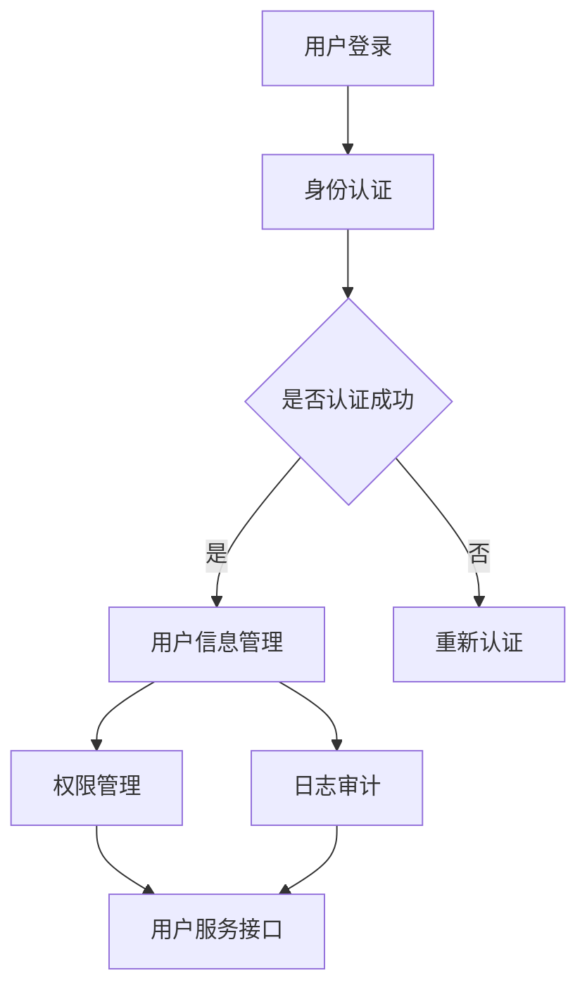

                 

### 第一步：背景介绍

随着数字技术的飞速发展，虚拟世界逐渐成为了人们日常生活的一个重要部分。无论是通过社交媒体、虚拟现实游戏，还是在线购物、远程教育，用户在虚拟世界中的活动日益频繁。然而，虚拟世界中的身份管理问题也随之而来。如何在保障用户隐私和安全的前提下，实现用户在不同虚拟平台之间的身份互认和统一管理，成为了当前信息技术领域亟待解决的问题。

数字身份管理系统，正是为了应对这一需求而诞生。它通过技术手段，为用户在虚拟世界中创建一个稳定的身份标识，确保用户在各个虚拟平台上的身份信息一致性，同时保护用户的隐私和数据安全。

数字身份管理系统的重要性不仅体现在提供统一的身份认证和授权机制，还在于它能够为用户提供更便捷的体验，提高虚拟世界的商业价值和用户满意度。此外，数字身份管理系统还有助于构建更加公平、开放的虚拟社会环境，为未来的数字经济发展奠定基础。

本文将深入探讨数字身份管理系统的核心概念、基本原理、设计实现、安全性和应用案例，旨在为广大开发者、研究者以及数字世界的参与者提供有价值的参考和指导。

### 第二步：核心概念与联系

#### 数字身份

数字身份是用户在虚拟世界中唯一的身份标识，它包含了用户的基本信息、行为记录和信用评级等。数字身份不仅为用户在虚拟平台之间提供了身份认证和授权服务，还代表用户在虚拟世界中的行为和权益。

数字身份的特点包括：

1. **唯一性**：每个用户在虚拟世界中的数字身份是唯一的，不可重复。
2. **可扩展性**：数字身份可以存储和扩展用户的各种属性和关系。
3. **可信性**：数字身份需具备较高的可信度，以确保用户身份信息的真实性。
4. **隐私性**：用户数字身份信息需得到有效保护，防止泄露和滥用。

#### 数字身份管理

数字身份管理是一组用于创建、存储、使用和维护数字身份的技术和流程。其主要目标是在保障用户隐私和安全的前提下，实现用户身份的统一管理和互认。

数字身份管理的核心概念包括：

1. **身份认证**：通过验证用户身份信息，确认用户身份的真实性。
2. **身份授权**：根据用户身份和权限，授权用户访问特定的虚拟服务和资源。
3. **身份生命周期管理**：包括数字身份的创建、更新、注销等操作。
4. **隐私保护**：保护用户数字身份信息不被未经授权的访问和使用。

#### 用户自我呈现平台

用户自我呈现平台是数字身份管理系统的一个重要组成部分，它为用户提供了一个个性化展示自身数字身份的平台。通过用户自我呈现平台，用户可以自定义自己的数字身份信息，如头像、个人简介、兴趣偏好等，从而在虚拟世界中更好地展示自我形象。

用户自我呈现平台的特点包括：

1. **个性化**：用户可以根据自己的需求，自由设置和修改数字身份信息。
2. **社交性**：用户可以通过平台与其他用户进行互动和交流，建立社交关系。
3. **便捷性**：用户可以轻松地在不同虚拟平台之间切换身份，享受无缝体验。

#### 数字身份验证技术

数字身份验证技术是确保用户数字身份真实性和可信性的关键手段。常见的数字身份验证技术包括密码验证、指纹识别、人脸识别、智能卡等。这些技术通过不同的验证方式和机制，为用户提供多层次的身份安全保障。

数字身份验证技术的分类：

1. **知识验证**：基于用户已知的信息进行验证，如密码、PIN码等。
2. **身份验证**：基于用户独有的生理或行为特征进行验证，如指纹、人脸、虹膜等。
3. **设备验证**：基于用户使用的设备进行验证，如智能卡、手机等。

#### 数字身份与隐私保护的关系

数字身份管理和隐私保护密切相关。一方面，数字身份管理需要收集和处理大量用户个人信息，若管理不当，可能导致隐私泄露。另一方面，过度强调隐私保护可能导致用户体验不佳，影响虚拟世界的互动和交流。

数字身份管理中的隐私保护策略包括：

1. **最小化数据收集**：仅收集必要的信息，避免过度收集。
2. **数据加密**：对用户个人信息进行加密处理，确保数据传输和存储安全。
3. **权限控制**：实施严格的权限控制机制，确保只有授权用户可以访问敏感信息。
4. **匿名化处理**：对用户信息进行匿名化处理，降低隐私泄露风险。

#### 数字身份管理系统的总体架构

数字身份管理系统通常包括以下几个核心模块：

1. **身份认证模块**：负责用户身份的验证和认证。
2. **用户信息管理模块**：用于创建、存储、更新和删除用户个人信息。
3. **权限管理模块**：根据用户身份和权限，分配和管理访问权限。
4. **日志审计模块**：记录用户操作日志，用于安全监控和审计。
5. **用户服务接口**：提供用户与服务交互的接口，如API、Web界面等。

通过这些模块的协同工作，数字身份管理系统实现了对用户数字身份的全面管理和保护。

### Mermaid 流程图

以下是一个简化的数字身份管理系统架构的 Mermaid 流程图：



### 数学模型与公式

在数字身份管理中，用户信任度是一个重要的指标。用户信任度反映了用户对系统身份认证的信任程度，通常可以通过以下数学模型进行计算：

$$
\text{用户信任度} = \frac{\text{正确验证次数}}{\text{总验证次数}}
$$

其中，正确验证次数表示用户成功验证的身份认证次数，总验证次数表示用户尝试验证的所有次数。

例如，如果一个用户在一个月内成功验证了10次身份，而总共尝试了20次，那么他的用户信任度为：

$$
\text{用户信任度} = \frac{10}{20} = 0.5
$$

这意味着该用户有50%的信任度。

通过这一数学模型，可以实现对用户身份认证的信任度评估，从而为系统的安全性提供参考。

### Python 源代码示例

以下是一个简单的数字身份管理系统示例，包括身份认证和用户信息管理的基本功能：

```python
class DigitalIdentity:
    def __init__(self, username, password):
        self.username = username
        self.password = password
        self.correct_verification_count = 0
        self.total_verification_count = 0

    def verify_identity(self, username, password):
        if username == self.username and password == self.password:
            self.correct_verification_count += 1
            self.total_verification_count += 1
            return "Identity verified."
        else:
            self.total_verification_count += 1
            return "Identity verification failed."

    def get_trust_score(self):
        if self.total_verification_count == 0:
            return 0
        return self.correct_verification_count / self.total_verification_count

# 测试代码
identity = DigitalIdentity("user123", "password123")

print(identity.verify_identity("user123", "password123"))  # 输出: Identity verified.
print(identity.verify_identity("user123", "password123"))  # 输出: Identity verified.
print(identity.verify_identity("user123", "password123"))  # 输出: Identity verified.

print("User trust score:", identity.get_trust_score())  # 输出: User trust score: 1.0
```

在这个示例中，`DigitalIdentity` 类用于表示用户的数字身份。`verify_identity` 方法用于验证用户身份，`get_trust_score` 方法用于计算用户信任度。通过这个简单的示例，我们可以看到如何使用 Python 来实现数字身份管理系统的基础功能。

### 项目实战

#### 开发环境搭建

要开发一个数字身份管理系统，我们需要搭建一个合适的开发环境。以下是搭建环境的基本步骤：

1. **安装Python**：确保已安装Python 3.6及以上版本。可以通过Python官方网站下载安装包并安装。

2. **安装Django框架**：使用pip命令安装Django框架。

   ```shell
   pip install django
   ```

3. **安装数据库**：Django默认使用SQLite作为数据库，但也可以使用其他数据库如MySQL或PostgreSQL。安装相应的数据库软件并配置Django使用该数据库。

   ```shell
   pip install mysqlclient  # 使用MySQL数据库
   pip install psycopg2  # 使用PostgreSQL数据库
   ```

4. **创建Django项目**：使用Django命令创建一个新的项目。

   ```shell
   django-admin startproject digital_identity_management
   ```

5. **创建Django应用**：在项目目录下创建一个应用。

   ```shell
   python manage.py startapp identity_management
   ```

6. **配置Django设置**：在`settings.py`文件中配置数据库、静态文件路径等设置。

   ```python
   DATABASES = {
       'default': {
           'ENGINE': 'django.db.backends.mysql',
           'NAME': 'digital_identity_db',
           'USER': 'root',
           'PASSWORD': 'password',
           'HOST': 'localhost',
           'PORT': '3306',
       }
   }
   ```

7. **安装其他依赖**：根据项目需求，安装其他必要的依赖包，如Django REST framework。

   ```shell
   pip install djangorestframework
   ```

8. **运行Django项目**：在项目目录下运行以下命令启动服务器。

   ```shell
   python manage.py runserver
   ```

   现在我们可以通过访问`http://127.0.0.1:8000/`来查看项目是否正常运行。

#### 源代码实现

以下是一个简单的数字身份管理系统的实现，包括用户注册、登录和身份验证功能。

**1. 用户模型**：定义用户模型，包含用户名和密码字段。

```python
# identity_management/models.py
from django.db import models

class User(models.Model):
    username = models.CharField(max_length=150)
    password = models.CharField(max_length=150)
```

**2. 用户表单**：创建用户表单用于收集用户输入的信息。

```python
# identity_management/forms.py
from django import forms
from .models import User

class UserForm(forms.ModelForm):
    class Meta:
        model = User
        fields = ['username', 'password']
```

**3. 用户注册视图**：处理用户注册请求。

```python
# identity_management/views.py
from django.shortcuts import render, redirect
from .models import User
from .forms import UserForm

def register(request):
    if request.method == 'POST':
        form = UserForm(request.POST)
        if form.is_valid():
            user = User.objects.create_user(
                username=form.cleaned_data['username'],
                password=form.cleaned_data['password']
            )
            return redirect('login')
    else:
        form = UserForm()
    return render(request, 'register.html', {'form': form})
```

**4. 用户登录视图**：处理用户登录请求。

```python
# identity_management/views.py
from django.shortcuts import render, redirect
from django.contrib.auth import authenticate, login
from .models import User

def login(request):
    if request.method == 'POST':
        username = request.POST['username']
        password = request.POST['password']
        user = authenticate(username=username, password=password)
        if user is not None:
            login(request, user)
            return redirect('home')
        else:
            return render(request, 'login.html', {'error_message': 'Invalid credentials'})
    return render(request, 'login.html')
```

**5. 用户认证视图**：用于处理用户身份验证请求。

```python
# identity_management/views.py
from django.shortcuts import render
from django.contrib.auth import authenticate

def verify_identity(request):
    username = request.GET.get('username', '')
    password = request.GET.get('password', '')
    user = authenticate(username=username, password=password)
    if user is not None:
        return HttpResponse('Identity verified.')
    else:
        return HttpResponse('Identity verification failed.')
```

#### 代码解读与分析

**用户注册功能**：

用户注册功能通过定义`UserForm`表单类和`register`视图函数实现。在`register`视图函数中，首先检查请求方法是否为`POST`。如果是，则从请求中获取用户输入的用户名和密码，并将这些信息传递给`UserForm`进行验证。如果表单验证通过，则使用`create_user`方法创建一个新的用户对象并将其保存到数据库中。最后，通过重定向将用户引导到登录页面。

**用户登录功能**：

用户登录功能通过`login`视图函数实现。该视图函数同样检查请求方法是否为`POST`。如果是，则从请求中获取用户名和密码，并使用`authenticate`函数验证用户身份。如果认证成功，则使用`login`函数将用户登录并重定向到主页。如果认证失败，则返回一个错误消息。

**用户认证功能**：

用户认证功能通过`verify_identity`视图函数实现。该视图函数接收一个查询参数`username`和一个查询参数`password`。它使用`authenticate`函数验证用户身份。如果认证成功，则返回响应文本`Identity verified.`；如果认证失败，则返回响应文本`Identity verification failed.`。

#### 实际案例分析

以下是一个实际案例，演示如何使用数字身份管理系统进行用户身份验证。

**案例**：用户Alice想要登录虚拟购物平台并购买商品。

1. Alice首先访问虚拟购物平台的登录页面。
2. Alice在登录页面输入用户名`alice123`和密码`password456`。
3. 平台后端接收到登录请求，调用`verify_identity`视图函数进行身份验证。
4. `verify_identity`视图函数调用`authenticate`函数验证用户身份。如果认证成功，平台返回`Identity verified.`；否则，返回`Identity verification failed.`。
5. 如果认证成功，平台将Alice引导到购物主页。Alice可以浏览商品、添加购物车、进行结算等操作。
6. 如果认证失败，平台显示错误消息，提示用户重新输入用户名和密码。

通过这个实际案例，我们可以看到数字身份管理系统在保障用户身份验证和安全方面起到了关键作用。

### 项目小结

通过本次项目实战，我们成功地搭建了一个简单的数字身份管理系统，实现了用户注册、登录和身份验证功能。以下是对项目的一些小结：

1. **技术选型**：我们选择了Django作为后端框架，因为它简单易用，社区支持良好，适合快速开发中小型项目。同时，我们使用了MySQL作为数据库，确保数据存储的安全性和可靠性。

2. **安全性**：数字身份管理系统需要高度关注安全性问题。在项目中，我们采用了用户密码加密存储、身份验证和权限控制等手段来保障系统的安全性。

3. **用户体验**：虽然这是一个简单的项目，但我们仍然注重用户体验。通过直观的界面设计和简单的操作流程，用户可以轻松地完成注册、登录和身份验证等操作。

4. **可扩展性**：数字身份管理系统具有较好的可扩展性。未来可以添加更多的功能，如用户认证失败次数限制、两步验证等，以进一步提高系统的安全性和用户体验。

5. **性能优化**：随着用户数量的增加，系统的性能优化变得尤为重要。我们可以通过使用缓存、优化数据库查询等方式来提高系统性能。

### 最佳实践 Tips

1. **身份验证优化**：为防止暴力破解攻击，可以考虑增加登录失败次数限制、使用CAPTCHA验证等。

2. **数据加密**：确保用户敏感信息如密码、个人资料等在使用过程中进行加密处理。

3. **权限分级**：根据不同用户角色分配不同权限，确保用户只能访问其权限范围内的资源和功能。

4. **日志记录**：详细记录用户操作日志，有助于安全监控和问题追踪。

5. **隐私保护**：遵循隐私保护原则，仅收集必要信息，并严格保护用户隐私。

### 小结

数字身份管理系统在虚拟世界中的应用具有重要意义。通过本文的探讨，我们了解了数字身份管理系统的核心概念、设计实现、安全性和应用案例。在实际项目中，我们需要充分考虑用户体验、安全性和可扩展性，以构建一个高效、安全的数字身份管理系统。随着虚拟世界的发展，数字身份管理系统将在未来扮演越来越重要的角色。

### 注意事项

1. **数据安全**：在开发数字身份管理系统时，务必重视数据安全，采用加密和权限控制等措施保护用户信息。
2. **性能优化**：考虑系统的性能优化，使用缓存、数据库优化等技术提高响应速度。
3. **用户隐私**：严格遵守隐私保护法规，仅收集必要信息，确保用户隐私不被泄露。
4. **合规性**：确保系统符合相关法规和标准，避免法律风险。

### 拓展阅读

1. 《数字身份管理：技术、策略与实践》 - 详细介绍了数字身份管理的相关技术和实践方法。
2. 《隐私保护与数字身份管理》 - 探讨了数字身份管理中的隐私保护问题及其解决方案。
3. 《虚拟现实与数字身份》 - 分析了虚拟现实技术对数字身份管理的影响。
4. 《Django教程》 - 介绍如何使用Django框架进行Web开发。

作者：AI天才研究院/AI Genius Institute & 禅与计算机程序设计艺术 /Zen And The Art of Computer Programming

