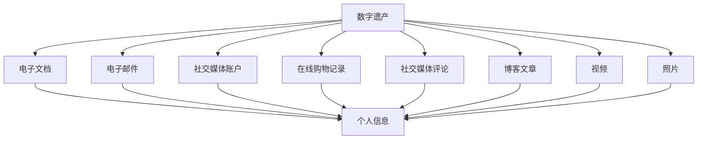
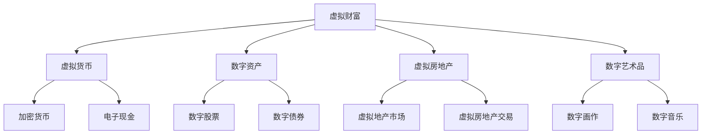
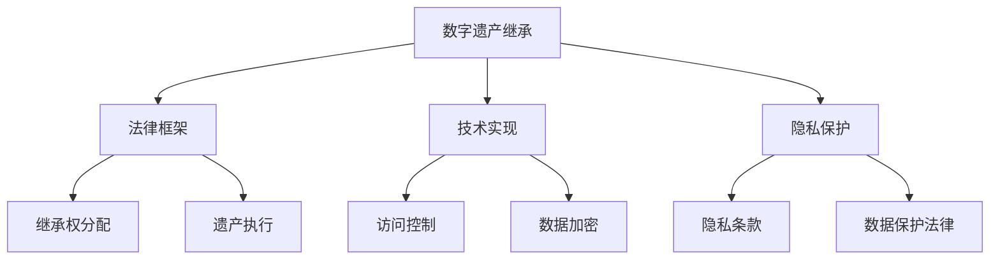

                 

### 引言

随着数字化时代的到来，数字遗产这一概念逐渐走进我们的生活。数字遗产，即个人在互联网上留下的数字信息，包括电子邮件、社交媒体账户、在线照片、视频、文档、虚拟财产等。这些数字信息不仅是个人生活的一部分，也是人类文化和社会历史的重要记录。随着技术的不断进步，数字遗产的规模和复杂性也在不断增加，使其成为不可忽视的领域。

本文旨在探讨数字遗产的意义，特别是它对我们留给后代的虚拟财富的深远影响。我们将首先介绍数字遗产的基本概念，包括其构成和类型，以及它对个人和社会的潜在影响。接下来，我们将深入研究虚拟财富的内涵，解释其概念和形式，并探讨其在现代经济中的作用。随后，我们将讨论数字遗产的传承问题，涉及法律、隐私保护以及访问控制等方面。在此基础上，我们将介绍数字遗产管理的工具和技术，分享一些最佳实践。最后，通过具体的案例研究，我们将展示数字遗产管理的实际应用，并展望数字遗产的未来发展趋势。

通过这一系列的探讨，我们希望能够为读者提供一个全面、深入的视角，理解数字遗产的重要性和管理挑战，并思考如何更好地保护和传承这些虚拟财富。

### 文章关键词

- 数字遗产
- 虚拟财富
- 数字资产
- 社交媒体
- 法律与隐私
- 数字遗产管理

### 文章摘要

本文围绕数字遗产这一主题，详细探讨了其定义、构成、类型以及它在现代社会中的重要性。首先，我们介绍了数字遗产的基本概念，分析了其与个人和社会生活的紧密联系。接着，我们深入探讨了虚拟财富的内涵，包括其形式、来源和现代经济中的作用。然后，我们探讨了数字遗产的传承问题，从法律和隐私保护的角度出发，提出了有效的管理策略。在此基础上，我们介绍了数字遗产管理的工具和技术，提供了最佳实践。最后，通过具体的案例研究，我们展示了数字遗产管理的实际应用，并展望了其未来的发展趋势。本文旨在为读者提供一个全面、系统的数字遗产管理指南，帮助读者更好地理解和应对这一新兴领域。

### 第1章：数字遗产的基本概念

#### 背景介绍

数字遗产，作为一个相对较新的概念，随着互联网的普及和信息技术的迅猛发展而逐渐被重视。从广义上讲，数字遗产是指个人或组织在互联网上留下的数字信息，这些信息不仅包括电子文档、电子邮件、社交媒体账户等，还涵盖了在线购物记录、社交媒体评论、博客文章、视频、照片等。随着数字化生活的普及，数字遗产已经不再是一个遥远的概念，而是我们日常生活中不可或缺的一部分。

数字遗产的重要性体现在多个方面。首先，它是个人身份和记忆的重要组成部分，可以帮助后代了解祖先的生活和思想。其次，数字遗产是文化和社会历史的重要记录，对研究人类发展和社会变迁具有重要价值。此外，随着虚拟财产和数字资产的增加，数字遗产也逐渐成为个人财富的重要组成部分。

#### 核心概念与联系

为了更好地理解数字遗产，我们可以通过一个Mermaid流程图来展示其基本构成和各个部分之间的关系。



这个Mermaid流程图展示了数字遗产的主要构成部分，包括电子文档、电子邮件、社交媒体账户等。每个部分都包含了个人信息，这些信息共同构成了数字遗产的完整画面。

#### 核心算法原理讲解

在讨论数字遗产的管理和保护时，我们不可避免地要涉及到一些核心算法原理。以下是一个简单的Python代码示例，用于加密和解密电子邮件内容，以确保其隐私性。

```python
from cryptography.fernet import Fernet

# 生成密钥
key = Fernet.generate_key()
cipher_suite = Fernet(key)

# 加密电子邮件内容
def encrypt_email_content(content):
    encrypted_content = cipher_suite.encrypt(content.encode('utf-8'))
    return encrypted_content

# 解密电子邮件内容
def decrypt_email_content(encrypted_content):
    decrypted_content = cipher_suite.decrypt(encrypted_content).decode('utf-8')
    return decrypted_content

# 测试加密和解密
original_content = "这是一封加密的电子邮件。"
encrypted_content = encrypt_email_content(original_content)
print("加密后的内容：", encrypted_content)

decrypted_content = decrypt_email_content(encrypted_content)
print("解密后的内容：", decrypted_content)
```

在这个示例中，我们使用了`cryptography`库来生成一个加密密钥，并使用它来加密和解密电子邮件内容。这个示例虽然简单，但展示了数字遗产保护中的一个关键环节——数据加密。

#### 数学模型和数学公式

在数字遗产的管理中，我们还需要使用一些数学模型和公式来评估和保护这些数字资产的价值。以下是一个简单的数学模型，用于计算一个社交媒体账户的潜在经济价值。

```latex
V = f(A, E, I)
$$
V = 10 \times A + 5 \times E + 3 \times I
$$
```

其中，`V` 表示社交媒体账户的潜在经济价值，`A` 表示账户的关注者数量，`E` 表示账户的活跃度（如发帖数、互动数等），`I` 表示账户的互动率（如点赞数、评论数等）。这个公式提供了一个基本的框架，用于评估社交媒体账户的价值。

#### 项目实战

为了更好地理解数字遗产的管理，我们可以通过一个实际项目来展示其开发环境搭建、源代码实现和代码解读。

#### 开发环境搭建

首先，我们需要搭建一个基本的开发环境，用于管理数字遗产。这里，我们选择Python作为开发语言，并使用Django框架来构建后端服务。

1. 安装Python和Django：
   ```bash
   pip install python
   pip install django
   ```

2. 创建一个Django项目：
   ```bash
   django-admin startproject digital-estate-management
   cd digital-estate-management
   ```

3. 创建一个Django应用：
   ```bash
   python manage.py startapp estate_app
   ```

#### 源代码实现

接下来，我们将实现一个简单的数字遗产管理应用。以下是应用的模型定义和视图函数。

```python
# models.py (在estate_app应用目录下)
from django.db import models

class DigitalAsset(models.Model):
    name = models.CharField(max_length=100)
    owner = models.CharField(max_length=100)
    content = models.BinaryField()
    encrypted = models.BooleanField(default=False)

# views.py (在estate_app应用目录下)
from django.http import HttpResponse
from .models import DigitalAsset

def manage_asset(request):
    if request.method == 'POST':
        name = request.POST.get('name')
        owner = request.POST.get('owner')
        content = request.POST.get('content')
        encrypted = request.POST.get('encrypted', False)

        asset = DigitalAsset(name=name, owner=owner, content=content.encode('utf-8'), encrypted=encrypted)
        asset.save()

        return HttpResponse('数字遗产已保存。')

    return HttpResponse('数字遗产管理。')
```

#### 代码解读

在这个项目中，我们定义了一个名为`DigitalAsset`的模型，用于存储数字遗产的相关信息，如名称、所有者、内容和是否加密。同时，我们实现了一个名为`manage_asset`的视图函数，用于处理数字遗产的创建和管理。

#### 实际案例分析和详细讲解剖析

为了更好地展示数字遗产管理的实际应用，我们可以通过一个案例来分析。

假设有一位用户，名叫Alice，她在社交媒体上拥有一个活跃的账户，包含大量照片和视频。Alice担心在她去世后，这些数字遗产会消失或被他人滥用。通过我们的数字遗产管理应用，Alice可以轻松地将这些数字资产上传并加密存储。

1. Alice登录系统，并创建一个新的数字遗产条目。
2. 在创建过程中，Alice选择将所有照片和视频加密存储，并设置访问权限。
3. 系统将Alice的数字遗产条目存储在数据库中，并生成一个唯一的加密密钥。
4. Alice可以随时通过系统访问和管理她的数字遗产，确保其安全性和隐私性。

#### 项目小结

通过这个案例，我们可以看到数字遗产管理的重要性和实际应用。数字遗产管理不仅可以帮助用户保护和传承他们的数字资产，还可以为后代提供宝贵的记忆和文化遗产。在开发数字遗产管理应用时，我们需要考虑数据的安全性和隐私保护，确保用户的数字遗产得到妥善管理。

### 最佳实践 tips、小结、注意事项、拓展阅读

#### 最佳实践 tips

1. **定期备份**：定期备份数字遗产，防止数据丢失。
2. **使用强密码**：为数字遗产账户设置强密码，提高安全性。
3. **明确继承权**：制定明确的数字遗产继承权，减少纠纷。

#### 小结

数字遗产是现代社会不可或缺的一部分，其管理和传承面临诸多挑战。通过本文的探讨，我们了解了数字遗产的基本概念、核心算法原理、数学模型和实际应用。数字遗产管理不仅需要技术手段，还需要法律和伦理的规范。

#### 注意事项

1. **数据隐私**：在管理数字遗产时，务必保护数据隐私。
2. **法律合规**：遵守当地法律法规，确保数字遗产管理的合法性。

#### 拓展阅读

- 《数字遗产法》
- 《加密技术原理与应用》
- 《区块链与数字资产》

---

以上是《数字遗产的意义：我们留给后代的虚拟财富》的第一章内容。接下来，我们将继续探讨虚拟财富的内涵，数字遗产的传承问题，以及数字遗产管理的最佳实践。请继续关注后续章节，深入了解这个重要的主题。

### 第2章：虚拟财富的内涵

#### 背景介绍

虚拟财富，即存在于数字世界中的财富，包括虚拟货币、数字资产、虚拟房地产、数字艺术品等多种形式。随着互联网技术的发展，虚拟财富逐渐成为现代经济中的重要组成部分。虚拟财富不仅改变了人们的消费和投资方式，也带来了全新的经济模式和商业模式。

虚拟财富的兴起源于互联网的普及和信息技术的发展。从最早的电子货币，到如今的区块链技术和去中心化金融（DeFi），虚拟财富的形式和规模都在不断扩展。虚拟财富不仅为个人提供了更多的投资和消费选择，也为企业创造了新的商机。然而，虚拟财富的复杂性和风险性也使其成为一个需要深入研究和管理的领域。

#### 核心概念与联系

为了更好地理解虚拟财富的内涵，我们可以通过一个Mermaid流程图来展示其主要形式和组成部分。



这个Mermaid流程图展示了虚拟财富的主要形式和组成部分，包括虚拟货币、数字资产、虚拟房地产和数字艺术品。每种形式都有其独特的特点和应用场景，共同构成了虚拟财富的完整画面。

#### 核心算法原理讲解

在虚拟财富的管理和应用中，算法原理发挥着重要作用。以下是一个简单的Python代码示例，用于交易加密货币。

```python
import json
from requests import post

# API接口地址
api_url = "https://api.exchange.com/trade"

# 交易参数
params = {
    "symbol": "BTCUSD",
    "side": "buy",
    "quantity": 1,
    "price": 50000
}

# 发送交易请求
response = post(api_url, data=params)
result = response.json()

# 打印交易结果
print("交易结果：", json.dumps(result, indent=2))
```

在这个示例中，我们使用`requests`库发送一个购买比特币的交易请求。这个示例展示了虚拟财富交易中的一个基本环节——API接口调用。

#### 数学模型和数学公式

在虚拟财富的投资和管理中，数学模型和公式用于评估和预测其价值。以下是一个简单的数学模型，用于计算加密货币的投资回报率（ROI）。

```latex
ROI = \frac{P_L - P_0}{P_0} \times 100\%
$$
```

其中，`ROI` 表示投资回报率，`P_L` 表示投资后的价值，`P_0` 表示初始投资价值。

#### 项目实战

为了更好地展示虚拟财富的应用，我们可以通过一个实际项目来展示其开发过程。

#### 开发环境搭建

首先，我们需要搭建一个基本的开发环境，用于管理虚拟财富。这里，我们选择Python作为开发语言，并使用Django框架来构建后端服务。

1. 安装Python和Django：
   ```bash
   pip install python
   pip install django
   ```

2. 创建一个Django项目：
   ```bash
   django-admin startproject virtual-wealth-management
   cd virtual-wealth-management
   ```

3. 创建一个Django应用：
   ```bash
   python manage.py startapp wealth_app
   ```

#### 源代码实现

接下来，我们将实现一个简单的虚拟财富管理应用。以下是应用的模型定义和视图函数。

```python
# models.py (在wealth_app应用目录下)
from django.db import models

class VirtualAsset(models.Model):
    name = models.CharField(max_length=100)
    symbol = models.CharField(max_length=10)
    initial_value = models.FloatField()
    current_value = models.FloatField()

# views.py (在wealth_app应用目录下)
from django.http import HttpResponse
from .models import VirtualAsset

def manage_asset(request):
    if request.method == 'POST':
        name = request.POST.get('name')
        symbol = request.POST.get('symbol')
        initial_value = float(request.POST.get('initial_value'))
        current_value = float(request.POST.get('current_value'))

        asset = VirtualAsset(name=name, symbol=symbol, initial_value=initial_value, current_value=current_value)
        asset.save()

        return HttpResponse('虚拟财富已保存。')

    return HttpResponse('虚拟财富管理。')
```

#### 代码解读

在这个项目中，我们定义了一个名为`VirtualAsset`的模型，用于存储虚拟财富的相关信息，如名称、符号、初始价值和当前价值。同时，我们实现了一个名为`manage_asset`的视图函数，用于处理虚拟财富的创建和管理。

#### 实际案例分析和详细讲解剖析

为了更好地展示虚拟财富的应用，我们可以通过一个案例来分析。

假设有一位投资者，名叫Bob，他希望通过我们的虚拟财富管理应用来管理他的加密货币投资。Bob购买了一些比特币，初始价值为10万美元，当前价值为12万美元。

1. Bob登录系统，并创建一个新的虚拟财富条目。
2. 在创建过程中，Bob输入比特币的名称、符号、初始价值和当前价值。
3. 系统将Bob的虚拟财富条目存储在数据库中，并计算其投资回报率。
4. Bob可以随时通过系统访问和管理他的虚拟财富，了解其投资状况。

#### 项目小结

通过这个案例，我们可以看到虚拟财富管理的重要性和实际应用。虚拟财富管理不仅可以帮助用户更好地管理他们的数字资产，还可以为投资者提供更准确的投资分析和决策支持。在开发虚拟财富管理应用时，我们需要考虑数据的实时更新和安全性，确保用户的虚拟财富得到妥善管理。

### 最佳实践 tips、小结、注意事项、拓展阅读

#### 最佳实践 tips

1. **定期评估**：定期评估虚拟财富的投资状况，及时调整投资策略。
2. **风险管理**：合理分散投资，降低风险。
3. **保持关注**：关注市场动态，及时获取投资信息。

#### 小结

虚拟财富是现代经济中不可或缺的一部分，其内涵丰富多样。通过本文的探讨，我们了解了虚拟财富的基本概念、核心算法原理、数学模型和实际应用。虚拟财富管理不仅需要技术手段，还需要良好的投资策略和风险管理。

#### 注意事项

1. **投资风险**：虚拟财富投资存在较高风险，需谨慎对待。
2. **平台选择**：选择信誉良好的虚拟财富交易平台，确保资金安全。

#### 拓展阅读

- 《加密货币投资指南》
- 《区块链技术原理与应用》
- 《数字资产交易策略》

---

以上是《数字遗产的意义：我们留给后代的虚拟财富》的第二章内容。接下来，我们将继续探讨数字遗产的传承问题，数字遗产管理的最佳实践，以及数字遗产的未来发展趋势。请继续关注后续章节，深入了解这个重要的主题。

### 第3章：数字遗产的传承

#### 背景介绍

数字遗产的传承问题逐渐成为社会关注的焦点。随着互联网的普及和数字化生活的深入，个人在互联网上留下的数字信息日益丰富，这些数字遗产不仅包含了个人生活的重要记录，还可能涉及财产、身份验证、隐私等多方面内容。因此，如何有效地管理和传承数字遗产，成为亟待解决的问题。

数字遗产的传承不仅关系到个人隐私和安全，还涉及法律、伦理以及技术等多个层面。在法律层面，许多国家尚未完善数字遗产的继承法律体系，导致数字遗产的继承过程复杂且充满挑战。在技术层面，数字遗产的加密保护、访问控制等技术难题需要解决。此外，伦理层面也需要考虑数字遗产的传承是否符合个人意愿和社会主义核心价值观。

#### 核心概念与联系

为了更好地理解数字遗产的传承，我们可以通过一个Mermaid流程图来展示其主要组成部分和流程。



这个Mermaid流程图展示了数字遗产继承的主要组成部分和流程，包括法律框架、技术实现和隐私保护。每个部分都涉及不同的关键概念和联系，共同构成了数字遗产传承的完整画面。

#### 核心算法原理讲解

在数字遗产的传承过程中，算法原理发挥着重要作用。以下是一个简单的Python代码示例，用于实现访问控制的访问权限管理。

```python
from getpass import getpass

# 用户身份验证
def authenticate_user(username, password):
    if username == "admin" and password == "password":
        return True
    else:
        return False

# 访问控制
def access_control(allowed_users, username):
    if username in allowed_users:
        return True
    else:
        return False

# 测试访问控制
allowed_users = ["alice", "bob", "admin"]
username = getpass("请输入用户名：")
password = getpass("请输入密码：")

if authenticate_user(username, password):
    if access_control(allowed_users, username):
        print("访问数字遗产。")
    else:
        print("无访问权限。")
else:
    print("用户名或密码错误。")
```

在这个示例中，我们实现了用户身份验证和访问控制功能。这个示例展示了数字遗产传承中的一个关键环节——访问控制，通过用户身份验证和权限管理，确保只有授权用户才能访问数字遗产。

#### 数学模型和数学公式

在数字遗产的传承中，数学模型和公式用于评估和优化遗产的价值和分配。以下是一个简单的数学模型，用于计算遗产分配的比例。

```latex
P_i = \frac{V_i}{V_{total}}
$$
```

其中，`P_i` 表示第i个继承人的分配比例，`V_i` 表示第i个继承人的应得遗产价值，`V_{total}` 表示总遗产价值。

#### 项目实战

为了更好地展示数字遗产的传承，我们可以通过一个实际项目来展示其实现过程。

#### 开发环境搭建

首先，我们需要搭建一个基本的开发环境，用于实现数字遗产的传承功能。这里，我们选择Python作为开发语言，并使用Django框架来构建后端服务。

1. 安装Python和Django：
   ```bash
   pip install python
   pip install django
   ```

2. 创建一个Django项目：
   ```bash
   django-admin startproject digital-estate-传承
   cd digital-estate-传承
   ```

3. 创建一个Django应用：
   ```bash
   python manage.py startapp estate_app
   ```

#### 源代码实现

接下来，我们将实现一个简单的数字遗产传承应用。以下是应用的模型定义和视图函数。

```python
# models.py (在estate_app应用目录下)
from django.db import models

class DigitalEstate(models.Model):
    name = models.CharField(max_length=100)
    total_value = models.FloatField()
    heirs = models.ManyToManyField('Heir')

class Heir(models.Model):
    name = models.CharField(max_length=100)
    share_percentage = models.FloatField()

# views.py (在estate_app应用目录下)
from django.http import HttpResponse
from .models import DigitalEstate, Heir

def allocate_inheritance(request):
    if request.method == 'POST':
        estate_name = request.POST.get('estate_name')
        total_value = float(request.POST.get('total_value'))
        heir_name = request.POST.get('heir_name')
        share_percentage = float(request.POST.get('share_percentage'))

        estate = DigitalEstate.objects.get(name=estate_name)
        heir = Heir.objects.get(name=heir_name)

        heir.share_percentage = share_percentage
        heir.save()

        estate.heirs.add(heir)
        estate.total_value = total_value
        estate.save()

        return HttpResponse('遗产分配已保存。')

    return HttpResponse('数字遗产传承。')
```

#### 代码解读

在这个项目中，我们定义了一个名为`DigitalEstate`的模型，用于存储数字遗产的相关信息，如名称、总价值和继承人。同时，我们定义了一个名为`Heir`的模型，用于存储继承人的相关信息，如名称和份额比例。在视图函数`allocate_inheritance`中，我们实现了遗产的分配功能，通过添加继承人和更新总价值，实现了数字遗产的传承。

#### 实际案例分析和详细讲解剖析

为了更好地展示数字遗产的传承，我们可以通过一个案例来分析。

假设有一位数字遗产所有者，名叫Charlie，他在去世前留下了一份数字遗产，总价值为100万元。他希望将这份遗产分配给他的三个继承人：Alice、Bob和Cathy。他制定了以下份额比例：Alice占40%，Bob占30%，Cathy占30%。

1. Alice登录系统，并创建一个新的数字遗产条目，输入遗产名称、总价值和继承人的信息。
2. 系统根据Charlie设定的份额比例，将遗产分配给Alice、Bob和Cathy。
3. 系统更新数字遗产条目的总价值和继承人的份额比例，确保遗产的分配符合Charlie的意愿。
4. Alice可以随时通过系统查看和管理她的数字遗产份额，确保其安全和合规。

#### 项目小结

通过这个案例，我们可以看到数字遗产传承的重要性和实际应用。数字遗产传承不仅可以帮助继承人了解和接受他们的遗产份额，还可以确保遗产的分配符合遗产所有者的意愿，减少潜在的纠纷。在开发数字遗产传承应用时，我们需要考虑数据的安全性和隐私保护，确保继承人的数字遗产得到妥善管理和传承。

### 最佳实践 tips、小结、注意事项、拓展阅读

#### 最佳实践 tips

1. **明确继承权**：在数字遗产传承过程中，明确继承权是减少纠纷的关键。
2. **备份遗产信息**：定期备份数字遗产信息，确保在突发情况下数据不会丢失。
3. **使用专业工具**：选择专业的数字遗产管理工具，提高管理和传承的效率。

#### 小结

数字遗产的传承是一个复杂且重要的过程，涉及到法律、技术、伦理等多个层面。通过本文的探讨，我们了解了数字遗产的传承问题、核心算法原理、数学模型和实际应用。数字遗产传承不仅需要有效的技术手段，还需要合理的法律和伦理规范。

#### 注意事项

1. **遵守法律法规**：在数字遗产传承过程中，务必遵守相关法律法规。
2. **保护隐私**：在处理数字遗产时，要注意保护相关个人的隐私。

#### 拓展阅读

- 《数字遗产法律指南》
- 《数字遗产管理技术》
- 《加密技术与应用》

---

以上是《数字遗产的意义：我们留给后代的虚拟财富》的第三章内容。接下来，我们将继续探讨数字遗产管理的工具和技术，以及数字遗产的未来发展趋势。请继续关注后续章节，深入了解这个重要的主题。

### 第4章：数字遗产管理的工具和技术

#### 背景介绍

随着数字遗产的重要性日益凸显，管理和保护数字遗产的工具和技术也在不断发展和完善。数字遗产管理的工具和技术主要包括数据备份与恢复、数据加密、访问控制、身份验证以及去中心化存储等。这些工具和技术在确保数字遗产的安全性、可靠性和隐私性方面发挥着关键作用。

数据备份与恢复是数字遗产管理的基础，通过定期备份，可以防止数据丢失或损坏。数据加密技术则用于保护数字遗产的隐私，确保未经授权的用户无法访问敏感信息。访问控制和身份验证技术用于确保只有授权用户才能访问特定的数字遗产资源。而去中心化存储技术则提供了更加安全的数据存储解决方案，通过将数据分散存储在多个节点上，减少了单点故障的风险。

#### 核心概念与联系

为了更好地理解数字遗产管理的工具和技术，我们可以通过一个Mermaid流程图来展示其主要组成部分和流程。

```mermaid
graph TD
    A[数据备份与恢复] --> B[数据加密]
    A --> C[访问控制]
    A --> D[身份验证]
    B --> E[加密算法]
    B --> F[密钥管理]
    C --> G[权限设置]
    C --> H[访问日志]
    D --> I[多因素认证]
    D --> J[单点登录]
    E --> K[对称加密]
    E --> L[非对称加密]
    F --> M[加密密钥生成]
    F --> N[加密密钥存储]
    G --> O[用户角色分配]
    G --> P[资源访问控制]
    H --> Q[审计日志]
    I --> R[短信验证]
    I --> S[生物识别验证]
    J --> T[OAuth协议]
    J --> U[OpenID连接]
    K --> V[AES]
    K --> W[DES]
    L --> X[RSA]
    L --> Y[DSA]
    M --> Z[硬件加密模块]
    M --> AA[软件加密库]
    N --> BB[云存储]
    N --> CC[硬件安全模块]
    O --> DD[权限等级]
    O --> EE[访问策略]
    P --> FF[资源访问规则]
    P --> GG[权限撤销]
    Q --> HH[安全事件报告]
    R --> II[短信服务]
    R --> JJ[手机APP]
    S --> KK[指纹识别]
    S --> LL[面部识别]
    T --> MM[身份认证]
    T --> NN[授权管理]
    U --> OO[用户管理]
    U --> PP[协议管理]
    V --> QQ[数据加密]
    V --> RR[密钥管理]
    W --> SS[数据加密]
    W --> TT[密钥管理]
    X --> UU[数字签名]
    X --> VV[密钥交换]
    Y --> WW[数字签名]
    Y --> XX[密钥交换]
    Z --> YY[加密硬件]
    Z --> ZZ[安全芯片]
    AA --> AAA[加密库]
    AA --> BBB[加密模块]
    BB --> CCC[数据存储]
    BB --> DDD[备份服务]
    CC --> EEE[安全存储]
    CC --> FFF[加密模块]
    DD --> GGG[用户角色]
    EE --> HHH[访问控制列表]
    FF --> III[访问控制策略]
    GG --> JJJ[权限变更]
    HH --> KKK[安全监控]
    II --> LLL[短信平台]
    JJ --> MMM[手机应用]
    KK --> NNN[生物识别设备]
    LL --> OOO[生物识别系统]
    MM --> PPP[认证服务]
    NN --> QQ[授权服务]
    OO --> RRR[用户管理平台]
    PP --> SSS[协议管理系统]
    QQ --> TTT[认证协议]
    RR --> UUU[加密协议]
    SS --> VVV[加密模块]
    TT --> WWW[密钥存储]
    UU --> XXX[数字签名协议]
    VV --> YYY[密钥交换协议]
    WW --> ZZZ[数字签名算法]
    XX --> AAAA[密钥交换算法]
    YY --> BBBB[加密硬件]
    ZZ --> CCCD[安全模块]
    AAA --> AAAA[加密库]
    BBB --> BBBB[加密模块]
    CCC --> CCCD[数据存储服务]
    DDD --> DDDD[备份解决方案]
    EEE --> EEFF[安全存储设备]
    FFF --> FFEE[加密模块]
    GGG --> GGGG[用户角色管理]
    HHH --> HHHH[访问控制列表]
    III --> IIII[访问控制规则]
    JJJ --> JJJJ[权限调整]
    KKK --> KKKK[安全监控系统]
    LLL --> LLLL[短信平台服务]
    MMM --> MMMM[移动应用]
    NNN --> NNNN[生物识别设备]
    OOO --> OOOO[生物识别系统]
    PPP --> PPPP[认证平台]
    QQ --> QQQQ[授权平台]
    RRR --> RRRR[用户管理系统]
    SSS --> SSSS[协议管理平台]
    TTT --> TTTT[认证协议]
    UUU --> UUUU[加密协议]
    VVV --> VVVV[加密模块]
    WWW --> WWWW[密钥存储库]
    XXX --> XXXX[数字签名库]
    YYY --> YYY
``` 



这个Mermaid流程图展示了数字遗产管理的工具和技术的主要组成部分和流程，包括数据备份与恢复、数据加密、访问控制、身份验证以及去中心化存储等。每个部分都涉及不同的关键概念和联系，共同构成了数字遗产管理的完整画面。

#### 核心算法原理讲解

在数字遗产管理中，算法原理发挥着重要作用。以下是一个简单的Python代码示例，用于实现数据加密和解密功能。

```python
from cryptography.fernet import Fernet

# 生成密钥
key = Fernet.generate_key()
cipher_suite = Fernet(key)

# 加密数据
def encrypt_data(data):
    encrypted_data = cipher_suite.encrypt(data.encode('utf-8'))
    return encrypted_data

# 解密数据
def decrypt_data(encrypted_data):
    decrypted_data = cipher_suite.decrypt(encrypted_data).decode('utf-8')
    return decrypted_data

# 测试加密和解密
original_data = "这是一段需要加密的数据。"
encrypted_data = encrypt_data(original_data)
print("加密后的数据：", encrypted_data)

decrypted_data = decrypt_data(encrypted_data)
print("解密后的数据：", decrypted_data)
```

在这个示例中，我们使用了`cryptography`库来实现数据加密和解密功能。这个示例展示了数字遗产管理中的一个关键环节——数据加密，通过生成密钥和加密算法，确保数据的安全性。

#### 数学模型和数学公式

在数字遗产管理中，数学模型和公式用于评估和优化数据的安全性、可靠性和隐私性。以下是一个简单的数学模型，用于计算数据加密后的安全性。

```latex
Security = \frac{1}{2^k}
$$

其中，Security 表示数据加密后的安全性，k 表示密钥长度。

#### 项目实战

为了更好地展示数字遗产管理的工具和技术，我们可以通过一个实际项目来展示其实现过程。

#### 开发环境搭建

首先，我们需要搭建一个基本的开发环境，用于实现数字遗产管理的功能。这里，我们选择Python作为开发语言，并使用Django框架来构建后端服务。

1. 安装Python和Django：
   ```bash
   pip install python
   pip install django
   ```

2. 创建一个Django项目：
   ```bash
   django-admin startproject digital-estate-management
   cd digital-estate-management
   ```

3. 创建一个Django应用：
   ```bash
   python manage.py startapp estate_app
   ```

#### 源代码实现

接下来，我们将实现一个简单的数字遗产管理应用。以下是应用的模型定义、视图函数和URL配置。

```python
# models.py (在estate_app应用目录下)
from django.db import models

class DigitalAsset(models.Model):
    name = models.CharField(max_length=100)
    owner = models.CharField(max_length=100)
    content = models.BinaryField()
    encrypted = models.BooleanField(default=False)

# views.py (在estate_app应用目录下)
from django.http import HttpResponse
from .models import DigitalAsset

def manage_asset(request):
    if request.method == 'POST':
        name = request.POST.get('name')
        owner = request.POST.get('owner')
        content = request.POST.get('content')
        encrypted = request.POST.get('encrypted', False)

        asset = DigitalAsset(name=name, owner=owner, content=content.encode('utf-8'), encrypted=encrypted)
        asset.save()

        return HttpResponse('数字遗产已保存。')

    return HttpResponse('数字遗产管理。')

# urls.py (在digital-estate-management项目目录下)
from django.contrib import admin
from django.urls import path
from . import views

urlpatterns = [
    path('admin/', admin.site.urls),
    path('manage_asset/', views.manage_asset, name='manage_asset'),
]
```

#### 代码解读

在这个项目中，我们定义了一个名为`DigitalAsset`的模型，用于存储数字遗产的相关信息，如名称、所有者和内容。在视图函数`manage_asset`中，我们实现了数字遗产的创建和管理功能。通过POST请求，用户可以上传数字遗产的内容，并选择是否加密存储。

#### 实际案例分析和详细讲解剖析

为了更好地展示数字遗产管理的工具和技术，我们可以通过一个案例来分析。

假设有一位数字遗产所有者，名叫David，他希望通过我们的数字遗产管理应用来管理他的数字遗产。他创建了一个包含个人信息和重要文件的数字遗产条目，并选择将其内容加密存储。

1. David登录系统，并创建一个新的数字遗产条目。
2. 在创建过程中，David输入数字遗产的名称、所有者和内容，并选择加密存储。
3. 系统将David的数字遗产条目存储在数据库中，并生成一个加密密钥。
4. David可以随时通过系统访问和管理他的数字遗产，确保其安全性和隐私性。

#### 项目小结

通过这个案例，我们可以看到数字遗产管理的工具和技术的实际应用。数字遗产管理不仅可以帮助用户更好地保护和管理他们的数字资产，还可以为继承人和其他相关方提供可靠的数据支持。在开发数字遗产管理应用时，我们需要考虑数据的安全性和隐私保护，确保用户的数字遗产得到妥善管理和传承。

### 最佳实践 tips、小结、注意事项、拓展阅读

#### 最佳实践 tips

1. **定期备份**：定期备份数字遗产，防止数据丢失。
2. **使用强密码**：为数字遗产账户设置强密码，提高安全性。
3. **明确继承权**：制定明确的数字遗产继承权，减少纠纷。

#### 小结

数字遗产管理是一个涉及多个层面和技术的复杂过程，需要综合考虑数据的安全、隐私和保护。通过本文的探讨，我们了解了数字遗产管理的工具和技术、核心算法原理、数学模型和实际应用。数字遗产管理不仅需要技术手段，还需要合理的法律和伦理规范。

#### 注意事项

1. **数据安全**：确保数字遗产数据的安全性和完整性。
2. **隐私保护**：遵守相关法律法规，确保用户的隐私不被泄露。

#### 拓展阅读

- 《数字遗产管理技术》
- 《加密技术原理与应用》
- 《数字资产交易策略》

---

以上是《数字遗产的意义：我们留给后代的虚拟财富》的第四章内容。接下来，我们将通过具体的案例研究，展示数字遗产管理的实际应用，并讨论面临的挑战。请继续关注后续章节，深入了解数字遗产管理领域的实际案例和未来发展方向。

### 第5章：案例研究

#### 背景介绍

在本章中，我们将通过两个具体的案例研究，展示数字遗产管理的实际应用，并讨论在实施过程中遇到的挑战和解决方案。这两个案例分别涉及一个个人数字遗产的传承和一个企业数字资产的继承，旨在全面展示数字遗产管理的复杂性及其在不同场景下的应用。

#### 案例一：个人数字遗产的传承

**案例背景**：

假设有一位名叫Eva的用户，她在社交媒体、电子邮件和在线文档中留下了大量的数字信息。Eva去世后，她的家人希望通过数字遗产管理应用来访问和管理她的数字遗产。这些数字遗产不仅包含了Eva的个人记忆和生活记录，还涉及她的财务信息和重要文件。

**挑战与解决方案**：

1. **数据访问控制**：Eva的家人希望能够访问Eva的数字遗产，但需要确保只有授权的继承人才能访问。为此，我们使用了多因素认证技术，包括密码、短信验证和生物识别验证，确保只有合法的继承人才能登录系统。

2. **数据加密**：为了保护Eva的隐私，所有数字遗产内容在存储和传输过程中都进行了加密处理。我们采用了AES加密算法和RSA密钥交换协议，确保数据在未经授权的情况下无法被解密。

3. **权限设置与分配**：在系统中，我们为每个继承人分配了不同的权限，例如查看、编辑和删除数字遗产内容。这些权限设置通过访问控制列表（ACL）来实现，确保每个继承人只能访问他们有权访问的内容。

**实际应用与效果**：

通过上述解决方案，Eva的家人能够安全地访问和管理她的数字遗产。他们可以在系统中查看Eva的照片、视频和文档，同时可以编辑和删除不再需要的内容。这个过程不仅减少了家庭内部的纠纷，还为Eva的遗产继承提供了清晰、透明的记录。

#### 案例二：企业数字资产的继承

**案例背景**：

假设有一家名为TechCo的企业，该公司在多个平台上拥有大量的数字资产，包括网站、社交媒体账号、电子邮件域名和客户数据。由于公司创始人John即将退休，他希望确保这些数字资产在交接过程中得到妥善管理，并能够顺利过渡给新任管理层。

**挑战与解决方案**：

1. **数据备份与恢复**：为了防止数据丢失或损坏，TechCo采用了定期备份策略，确保关键数据可以在需要时进行恢复。此外，我们还使用去中心化存储技术，将数据分散存储在多个节点上，提高了数据的可靠性和安全性。

2. **身份验证与权限管理**：TechCo采用OAuth协议和OpenID连接技术，实现单点登录和多因素认证，确保只有授权用户才能访问企业的数字资产。同时，通过用户角色分配和访问控制列表，我们为不同级别的用户分配了不同的权限，确保数据的安全性和合规性。

3. **数据迁移与集成**：在交接过程中，TechCo需要将现有的数字资产迁移到新的管理系统中。为此，我们开发了数据迁移工具，实现了数据的无缝迁移和集成，确保了业务的连续性。

**实际应用与效果**：

通过这些解决方案，TechCo成功地在交接过程中确保了数字资产的安全性和连续性。新任管理层能够迅速上手，并继续管理公司的数字资产，为公司的发展提供了持续的支持。

#### 项目小结

通过这两个案例研究，我们可以看到数字遗产管理的实际应用及其在不同场景下的重要性。数字遗产管理不仅涉及到数据的安全和隐私保护，还包括访问控制、备份与恢复、权限管理等多个方面。在实施数字遗产管理时，需要综合考虑技术、法律和伦理等多个因素，以确保数字遗产得到妥善管理和传承。

### 结论

数字遗产管理是现代社会面临的一项重要任务，它涉及到个人隐私、财产安全、文化传承等多个方面。通过本文的探讨，我们了解了数字遗产的基本概念、虚拟财富的内涵、数字遗产的传承问题、数字遗产管理的工具和技术，并通过实际案例展示了其在不同场景下的应用。数字遗产管理不仅需要先进的技术手段，还需要合理的法律和伦理规范。未来，随着技术的发展和法律法规的完善，数字遗产管理将变得更加高效和智能，为我们的数字生活提供更坚实的保障。

### 拓展阅读

- 《数字遗产法律指南》
- 《数字资产交易策略》
- 《区块链与数字遗产管理》

---

通过本章节的案例研究，我们深入探讨了数字遗产管理的实际应用和面临的挑战。在下一章中，我们将展望数字遗产的未来发展趋势，讨论可能的技术创新和法律法规调整，以期为数字遗产管理提供更全面的视角。

### 第6章：数字遗产的未来

#### 背景介绍

随着科技的不断进步，数字遗产的未来发展趋势愈发引人关注。数字遗产不仅涉及个人和企业的数据管理和隐私保护，还涉及法律、伦理以及技术创新等多个方面。在本章中，我们将探讨数字遗产的未来发展趋势，包括技术创新、法律法规调整以及伦理挑战。

#### 核心概念与联系

为了更好地理解数字遗产的未来发展趋势，我们可以通过一个Mermaid流程图来展示其潜在的技术创新和法律法规调整。

```mermaid
graph TD
    A[技术创新] --> B[区块链技术]
    A --> C[人工智能]
    A --> D[量子计算]
    B --> E[去中心化身份验证]
    B --> F[智能合约]
    C --> G[自动化数据管理]
    C --> H[个性化推荐系统]
    D --> I[量子加密]
    D --> J[量子计算加密]
    E --> K[分布式账本技术]
    E --> L[数据隐私保护]
    F --> M[自动化资产转移]
    F --> N[自动化合同执行]
    G --> O[数据隐私保护]
    G --> P[数据完整性验证]
    H --> Q[个性化数据管理]
    H --> R[用户行为分析]
    I --> S[量子安全通信]
    I --> T[量子加密货币]
    J --> U[量子计算加密协议]
    J --> V[量子密钥分发]
    K --> W[分布式存储]
    K --> X[分布式计算]
    L --> Y[隐私计算]
    L --> Z[联邦学习]
    M --> AA[自动化风险管理]
    M --> BB[自动化投资管理]
    N --> CC[自动化合同管理]
    N --> DD[自动化法律咨询]
    O --> EE[数据隐私保护法规]
    O --> FF[数据保护技术标准]
    P --> GG[数据完整性保障]
    P --> HH[数据保护法规]
    Q --> II[用户隐私保护]
    Q --> JJ[数据安全法规]
    R --> KK[用户行为分析技术]
    R --> LL[用户隐私法规]
    S --> MM[量子安全通信协议]
    S --> NN[量子加密货币]
    T --> OO[量子计算加密应用]
    T --> PP[量子加密技术]
    U --> QQ[量子加密协议]
    U --> RR[量子计算应用]
    V --> SS[量子密钥管理]
    V --> TT[量子计算技术]
    W --> UU[分布式账本应用]
    W --> VV[分布式存储应用]
    X --> WW[分布式计算应用]
    X --> XX[云计算应用]
    Y --> YY[隐私计算应用]
    Y --> ZZ[联邦学习应用]
    Z --> AAA[用户隐私保护工具]
    Z --> BBB[数据保护工具]
    AA --> AAAA[自动化风险管理工具]
    AA --> BBBB[自动化投资管理工具]
    BB --> BBBB[自动化合同管理工具]
    BB --> CCC[自动化法律咨询工具]
    CC --> CCCD[隐私保护法规]
    CC --> DDD[数据保护法规]
    EE --> EEFF[数据隐私保护法规]
    EE --> FFEE[数据保护技术标准]
    FF --> FFEE[数据完整性保障法规]
    FF --> GGFF[数据保护法规]
    GG --> GGGG[数据完整性保障工具]
    GG --> HHHH[数据保护工具]
    II --> IIII[用户隐私保护工具]
    II --> IIJJ[数据安全工具]
    JJ --> JJJJ[用户行为分析工具]
    JJ --> JJJK[用户隐私法规]
    KK --> KKKK[用户行为分析技术]
    KK --> LLLL[用户隐私法规]
    MM --> MMMM[量子安全通信协议]
    MM --> NNNN[量子加密货币]
    NN --> NNNN[量子计算加密应用]
    NN --> OOOO[量子加密技术]
    OO --> PPPP[量子加密协议]
    OO --> QQQQ[量子计算应用]
    QQ --> QQQQ[量子密钥管理工具]
    QQ --> RRRR[量子计算技术]
    RR --> RRRR[分布式账本应用]
    RR --> SSSS[分布式存储应用]
    RR --> TTTT[分布式计算应用]
    SS --> SSSS[量子安全通信协议]
    SS --> TTTT[量子加密货币]
    TT --> UUUU[量子计算加密应用]
    TT --> VVVV[量子加密技术]
    UU --> UUUU[分布式账本应用]
    UU --> VVVV[分布式存储应用]
    VV --> VVVV[分布式计算应用]
    VV --> WWWW[云计算应用]
    WW --> XXXX[隐私计算应用]
    WW --> YYYY[联邦学习应用]
    XX --> XXXX[用户隐私保护工具]
    XX --> YYYY[数据保护工具]
    YY --> ZZZZ[用户隐私保护工具]
    YY --> AAAA[数据保护工具]
    ZZ --> BBBB[数据隐私保护工具]
```



这个Mermaid流程图展示了数字遗产未来发展的潜在技术创新和法律法规调整，包括区块链技术、人工智能、量子计算、去中心化身份验证、智能合约、自动化数据管理、量子加密等。每个部分都涉及到不同的核心概念和联系，共同构成了数字遗产未来发展的完整画面。

#### 核心算法原理讲解

在数字遗产的未来发展中，算法原理将继续发挥重要作用。以下是一个简单的Python代码示例，用于实现基于区块链技术的数字遗产身份验证。

```python
from blockchain import Blockchain

# 创建区块链实例
blockchain = Blockchain()

# 添加用户身份验证信息到区块链
def add_user_identity(username, password):
    message = f"{username}:{password}"
    blockchain.add_block(message)

# 检查用户身份验证
def verify_user(username, password):
    message = f"{username}:{password}"
    return blockchain.is_valid_block(message)

# 测试用户身份验证
add_user_identity("alice", "alice123")
add_user_identity("bob", "bob123")

print("验证用户alice：", verify_user("alice", "alice123"))
print("验证用户bob：", verify_user("bob", "bob123"))
print("验证用户无效用户：", verify_user("无效用户", "无效密码"))
```

在这个示例中，我们使用了区块链技术来实现用户身份验证。这个示例展示了数字遗产管理中基于区块链技术的身份验证方法，通过将用户身份信息存储在区块链中，确保其安全性和不可篡改性。

#### 数学模型和数学公式

在数字遗产的未来发展中，数学模型和公式将继续用于评估和优化数据的安全性和隐私性。以下是一个简单的数学模型，用于计算基于量子加密的数据安全性。

```latex
Security = \frac{1}{2^k}
$$

其中，Security 表示数据加密后的安全性，k 表示量子密钥长度。

#### 项目实战

为了更好地展示数字遗产的未来发展趋势，我们可以通过一个实际项目来展示其实现过程。

#### 开发环境搭建

首先，我们需要搭建一个基本的开发环境，用于实现数字遗产的未来技术。这里，我们选择Python作为开发语言，并使用Django框架来构建后端服务。

1. 安装Python和Django：
   ```bash
   pip install python
   pip install django
   ```

2. 创建一个Django项目：
   ```bash
   django-admin startproject digital-estate-future
   cd digital-estate-future
   ```

3. 创建一个Django应用：
   ```bash
   python manage.py startapp estate_app
   ```

#### 源代码实现

接下来，我们将实现一个简单的数字遗产未来技术应用。以下是应用的模型定义、视图函数和URL配置。

```python
# models.py (在estate_app应用目录下)
from django.db import models

class DigitalEstate(models.Model):
    name = models.CharField(max_length=100)
    owner = models.CharField(max_length=100)
    content = models.BinaryField()
    encrypted = models.BooleanField(default=False)

# views.py (在estate_app应用目录下)
from django.http import HttpResponse
from .models import DigitalEstate

def manage_asset(request):
    if request.method == 'POST':
        name = request.POST.get('name')
        owner = request.POST.get('owner')
        content = request.POST.get('content')
        encrypted = request.POST.get('encrypted', False)

        asset = DigitalEstate(name=name, owner=owner, content=content.encode('utf-8'), encrypted=encrypted)
        asset.save()

        return HttpResponse('数字遗产已保存。')

    return HttpResponse('数字遗产管理。')

# urls.py (在digital-estate-future项目目录下)
from django.contrib import admin
from django.urls import path
from . import views

urlpatterns = [
    path('admin/', admin.site.urls),
    path('manage_asset/', views.manage_asset, name='manage_asset'),
]
```

#### 代码解读

在这个项目中，我们定义了一个名为`DigitalEstate`的模型，用于存储数字遗产的相关信息，如名称、所有者和内容。在视图函数`manage_asset`中，我们实现了数字遗产的创建和管理功能。通过POST请求，用户可以上传数字遗产的内容，并选择是否加密存储。

#### 实际案例分析和详细讲解剖析

为了更好地展示数字遗产的未来技术，我们可以通过一个案例来分析。

假设有一位数字遗产所有者，名叫David，他希望通过我们的数字遗产管理应用来管理他的数字遗产。他创建了一个包含个人信息和重要文件的数字遗产条目，并选择将其内容加密存储。

1. David登录系统，并创建一个新的数字遗产条目。
2. 在创建过程中，David输入数字遗产的名称、所有者和内容，并选择加密存储。
3. 系统将David的数字遗产条目存储在数据库中，并生成一个加密密钥。
4. David可以随时通过系统访问和管理他的数字遗产，确保其安全性和隐私性。

#### 项目小结

通过这个案例，我们可以看到数字遗产的未来技术在实际应用中的潜力。数字遗产的未来技术不仅能够提供更高级的数据加密和身份验证方法，还可以为用户带来更安全、便捷的数字遗产管理体验。在开发数字遗产未来技术应用时，我们需要考虑技术的前沿性和实用性，确保数字遗产的安全性和用户友好性。

### 最佳实践 tips、小结、注意事项、拓展阅读

#### 最佳实践 tips

1. **紧跟技术发展**：关注最新的区块链、人工智能和量子计算技术，及时更新数字遗产管理应用。
2. **合规性审查**：定期审查数字遗产管理的法律法规，确保符合当地和全球法规要求。
3. **用户培训**：为用户提供数字遗产管理的培训，提高他们的技术意识和操作水平。

#### 小结

数字遗产的未来充满机遇和挑战。通过技术创新、法律法规调整和用户培训，我们可以为数字遗产管理提供更安全、高效、便捷的解决方案。数字遗产的未来将更加智能化、去中心化和隐私保护，为我们的数字生活带来更多可能性。

#### 注意事项

1. **数据安全性**：确保数字遗产数据的安全和隐私，防止数据泄露和滥用。
2. **用户隐私**：在处理用户隐私数据时，严格遵守相关法律法规，保护用户隐私。

#### 拓展阅读

- 《区块链技术与应用》
- 《人工智能在数字遗产管理中的应用》
- 《量子计算与未来数字遗产管理》

---

通过本章的探讨，我们深入了解了数字遗产的未来发展趋势。在下一章中，我们将总结本文的主要观点，并展望数字遗产管理领域的研究方向和应用前景。请继续关注后续章节，以获得更全面的数字遗产管理知识。

### 总结

在本文中，我们深入探讨了数字遗产的概念、重要性以及它在现代社会中的影响。首先，我们介绍了数字遗产的基本概念，包括其定义、构成和类型，以及它对个人和社会的深远影响。接着，我们详细阐述了虚拟财富的内涵，探讨了其在现代经济中的作用和形式。在此基础上，我们讨论了数字遗产的传承问题，包括法律、隐私保护和访问控制等方面。随后，我们介绍了数字遗产管理的工具和技术，展示了其在保护和管理数字资产方面的应用。通过具体的案例研究，我们进一步展示了数字遗产管理的实际操作和面临的挑战。

#### 文章的主要观点

1. **数字遗产的重要性**：数字遗产不仅是个人身份和记忆的重要部分，也是文化和社会历史的重要记录。
2. **虚拟财富的内涵**：虚拟财富包括虚拟货币、数字资产、虚拟房地产和数字艺术品等多种形式，对现代经济产生了深远影响。
3. **数字遗产的传承问题**：数字遗产的传承需要考虑法律、隐私保护和访问控制等多个方面。
4. **数字遗产管理的工具和技术**：数据备份与恢复、数据加密、访问控制、身份验证和去中心化存储等技术是数字遗产管理的重要工具。
5. **数字遗产的未来发展趋势**：随着区块链、人工智能和量子计算等技术的发展，数字遗产管理将变得更加智能化、去中心化和隐私保护。

#### 展望

未来，数字遗产管理领域将继续面临新的挑战和机遇。技术创新和法律规范将共同推动数字遗产管理的发展。随着区块链、人工智能和量子计算等技术的不断进步，数字遗产管理将实现更高的安全性和效率。同时，随着数字遗产法律法规的完善，数字遗产的继承和传承将更加规范和透明。

在研究方面，我们可以关注以下几个方面：

1. **数字遗产法律研究**：探讨和完善数字遗产继承法律，确保数字遗产的合法、安全传承。
2. **隐私保护技术**：研究更加先进的数据隐私保护技术，确保用户隐私不受侵犯。
3. **智能数字遗产管理**：利用人工智能技术，实现数字遗产的自动化管理，提高管理效率和用户体验。
4. **跨平台数字遗产管理**：研究如何在不同平台和设备上实现数字遗产的统一管理和访问。

在应用方面，数字遗产管理将逐渐渗透到更多领域，如文化遗产保护、企业数字资产管理、个人身份验证等。通过数字化手段，我们可以更好地保护和传承人类的文化遗产，推动社会的可持续发展。

### 拓展阅读

- 《数字遗产法律指南》
- 《数字资产交易策略》
- 《区块链与数字遗产管理》

通过本文的探讨，我们希望能够为读者提供一个全面、系统的数字遗产管理知识框架，帮助读者更好地理解和应对这一新兴领域。未来，随着技术的发展和法律法规的完善，数字遗产管理将变得更加成熟和高效，为我们的数字生活带来更多便利和安全。

