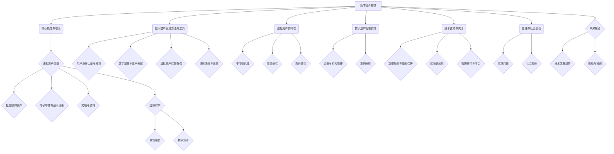
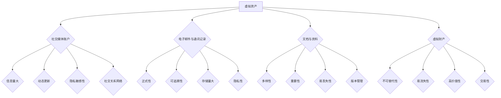
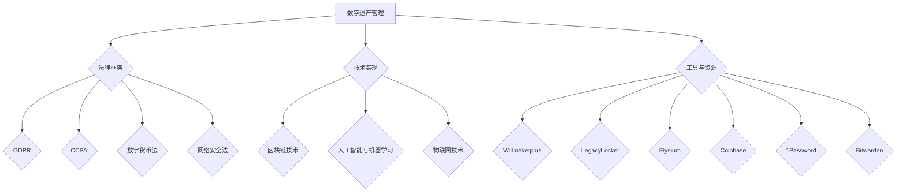

                 

### 引言

#### 数字遗产的概念与重要性

在现代社会，数字遗产已经成为人们生活中不可或缺的一部分。那么，什么是数字遗产呢？简单来说，数字遗产指的是个人或组织在互联网世界中留下的各种数字资产和资料，包括社交媒体账户、电子邮件、文档、图片、视频以及虚拟财产等。随着数字化时代的到来，数字遗产的重要性日益凸显。

数字遗产的重要性主要体现在以下几个方面：

1. **情感价值**：社交媒体账户、电子邮件和照片等数字资产往往承载着人们的情感记忆，对于亲友和后人来说，这些数字资产具有极高的情感价值。

2. **经济价值**：虚拟财产，如游戏装备、数字货币等，在某些情况下具有重要的经济价值。这些资产如果不能妥善处理，可能会给继承人带来经济损失。

3. **信息价值**：数字遗产中包含了大量的个人信息、商业秘密等，这些信息在未经授权的情况下被泄露，可能会导致隐私泄露、经济损失甚至法律纠纷。

4. **文化价值**：数字遗产反映了个人或组织的历史和文化，对于研究历史、文化和社会发展具有重要的参考价值。

然而，随着数字遗产的不断增加，管理和传承这些资产也变得越来越复杂。传统的方式往往无法有效地应对这一挑战，因此，专业的数字遗产管理服务应运而生。本文将围绕数字遗产管理服务展开讨论，包括虚拟资产的类型与特性、数字遗产管理的方法与工具、实践案例以及未来展望等方面。

#### 文章目的

本文旨在全面解析数字遗产管理服务的各个方面，帮助读者深入了解数字遗产的概念、重要性以及管理方法。通过本文的阅读，读者可以：

1. 明确数字遗产的构成和特性。
2. 掌握数字遗产管理的核心概念和方法。
3. 了解当前数字遗产管理服务的发展状况和未来趋势。
4. 提高对数字遗产管理的认识和重视，为自身及家人制定合适的遗产管理计划。

### 《数字遗产管理服务：虚拟资产的传承与规划》目录大纲

#### 引言
- 数字遗产的概念与重要性

#### 第一部分：数字遗产管理概述
- 1. 数字遗产的构成
- 2. 数字遗产管理的挑战
- 3. 数字遗产管理的必要性

#### 第二部分：虚拟资产的类型与特性
- 4. 社交媒体账户
- 5. 电子邮件与通讯记录
- 6. 文档与资料
- 7. 虚拟财产，如游戏装备、数字货币

#### 第三部分：数字遗产管理的方法与工具
- 8. 用户身份认证与授权
- 9. 数字遗嘱与遗产分配
- 10. 虚拟资产保管服务
- 11. 法律法规与政策

#### 第四部分：数字遗产管理的实践
- 12. 企业与机构的数字遗产管理
- 13. 数字遗产管理的案例分析
- 14. 数字遗产管理服务的发展趋势

#### 第五部分：技术支持与实现
- 15. 数据加密与隐私保护
- 16. 区块链技术在数字遗产管理中的应用
- 17. 数字遗产管理软件与平台

#### 第六部分：伦理与社会责任
- 18. 数字遗产管理的伦理问题
- 19. 数字遗产与社会责任

#### 第七部分：未来展望
- 20. 数字遗产管理技术的发展趋势
- 21. 数字遗产管理的挑战与机遇

#### 参考文献

#### 附录
- A. 数字遗产管理相关法规政策
- B. 数字遗产管理工具与资源推荐
- C. Mermaid流程图

#### Mermaid流程图

### 第一部分：数字遗产管理概述

#### 1. 数字遗产的构成

数字遗产的构成涵盖了个人和组织在数字世界中留下的各种形式的信息和资产。具体来说，数字遗产主要由以下几部分组成：

1. **社交媒体账户**：如Facebook、Instagram、Twitter等，这些账户不仅记录了个人的社交活动，还包含了大量的照片、视频和文字信息。

2. **电子邮件与通讯记录**：电子邮件是最常见的数字通信方式之一，其中包含了个人或组织的商业通信、个人信件等重要信息。

3. **文档与资料**：包括各种电子文档，如Word文档、PDF文件、Excel表格等，这些文档通常包含了个人或组织的机密信息。

4. **虚拟财产**：如游戏装备、虚拟货币、数字艺术品等，这些资产在虚拟世界中有着独特的价值。

5. **其他数字资产**：如在线存储的文件、音乐、电影、软件等。

#### 2. 数字遗产管理的挑战

数字遗产管理面临着多方面的挑战，这些挑战主要体现在以下几个方面：

1. **数据隐私与安全**：数字遗产中包含了大量的个人信息和敏感数据，如何确保这些数据在传承过程中的隐私和安全是数字遗产管理的重要挑战。

2. **法律法规的滞后**：目前，全球范围内关于数字遗产管理的法律法规尚不完善，这给数字遗产的管理和传承带来了困难。

3. **技术实现的复杂性**：数字遗产的管理需要涉及多种技术和工具，如数据加密、区块链技术等，如何有效地整合和利用这些技术是实现数字遗产管理的另一个挑战。

4. **继承人的认知差异**：不同的人对数字遗产的认知和管理意愿存在差异，这可能导致数字遗产在传承过程中出现纠纷。

5. **情感因素**：数字遗产中往往包含了大量的情感记忆，如何妥善处理这些情感因素也是数字遗产管理的一个挑战。

#### 3. 数字遗产管理的必要性

数字遗产管理的必要性体现在以下几个方面：

1. **保障数据安全和隐私**：通过数字遗产管理，可以确保个人和组织的敏感数据在传承过程中得到妥善保护，避免数据泄露和隐私侵犯。

2. **促进财产的有效传承**：数字遗产的管理有助于确保虚拟财产在继承人之间得到合理分配，避免因财产分配不均引发的纠纷。

3. **维护个人和组织的形象**：良好的数字遗产管理可以维护个人和组织在数字世界中的形象和声誉，避免因数字资产流失带来的负面影响。

4. **支持历史与文化传承**：数字遗产中包含了大量的历史和文化信息，通过数字遗产管理，可以确保这些信息得到传承和保存。

5. **满足法律法规的要求**：随着数字遗产管理法律法规的不断完善，进行有效的数字遗产管理已成为法律要求之一，这要求个人和组织必须重视数字遗产管理。

总之，数字遗产管理不仅关系到个人和组织的财产安全和隐私保护，还关系到历史文化的传承和社会稳定。因此，数字遗产管理具有重要的现实意义和长远价值。

### 第二部分：虚拟资产的类型与特性

虚拟资产作为数字遗产的重要组成部分，其类型和特性决定了数字遗产管理的复杂性和必要性。以下将详细探讨社交媒体账户、电子邮件与通讯记录、文档与资料以及虚拟财产（如游戏装备、数字货币）等虚拟资产的类型与特性。

#### 4. 社交媒体账户

社交媒体账户是个人在数字世界中的“第二身份”，常见的平台包括Facebook、Instagram、Twitter等。这些账户不仅记录了个人的日常活动，还包含了与亲友的互动、分享的图片和视频等内容。社交媒体账户具有以下特性：

1. **信息量大**：社交媒体账户通常积累了大量的个人信息和社交数据，这些数据不仅包括文字和图片，还包括视频和音频等多媒体内容。
2. **动态更新**：社交媒体账户会不断更新内容，反映个人最新的生活状态和情感变化。
3. **隐私敏感性**：社交媒体账户中包含的个人隐私信息，如地址、电话、社交媒体好友列表等，这些信息一旦泄露，可能会带来严重的隐私风险。
4. **社交关系网络**：社交媒体账户通过好友关系建立了复杂的社交网络，这些关系在网络遗产管理中需要特别关注。

#### 5. 电子邮件与通讯记录

电子邮件和通讯记录是数字遗产中非常重要的组成部分，它们通常记录了个人或组织的重要通信内容。电子邮件与通讯记录的特性如下：

1. **正式性**：电子邮件通常用于正式的通信，记录了重要协议、合同、决策等信息。
2. **可追溯性**：电子邮件和通讯记录提供了通信的历史记录，便于事后查询和追溯。
3. **存储量大**：随着时间的推移，个人或组织收发的电子邮件和通讯记录数量会不断增加，需要有效管理以避免存储空间不足。
4. **隐私性**：电子邮件中可能包含敏感的商业秘密和个人隐私，因此需要特别关注电子邮件的隐私保护。

#### 6. 文档与资料

文档与资料是数字遗产中的核心部分，它们通常以电子形式存在，包括Word文档、PDF文件、Excel表格等。文档与资料的特性如下：

1. **多样性**：文档与资料形式多样，包括文字、图表、图片等，它们反映了个人或组织的知识积累和工作成果。
2. **重要性**：文档与资料中可能包含关键的商业机密、知识产权、历史档案等信息，这些信息对个人或组织具有重要意义。
3. **易丢失性**：由于文档与资料易于被误删除或覆盖，因此需要特别注意备份和保护。
4. **版本管理**：文档与资料的版本管理是确保信息准确性和一致性的关键，需要有效管理文档的不同版本。

#### 7. 虚拟财产，如游戏装备、数字货币

虚拟财产是指个人在虚拟世界中拥有的资产，如游戏装备、数字货币、虚拟土地等。虚拟财产的特性如下：

1. **不可替代性**：虚拟财产通常具有独特的属性，如游戏装备的稀有度、数字货币的唯一性，这使得它们具有不可替代性。
2. **易流失性**：虚拟财产可以在网络游戏中被破坏、被盗，或在市场波动中价值变化，因此需要特别关注其保护和管理。
3. **高价值性**：某些虚拟财产，如稀有游戏装备和稳定币，具有较高的经济价值，其价值可能会超过现实世界中的资产。
4. **交易性**：虚拟财产可以在虚拟市场或现实市场中进行交易，这使得它们具有一定的流动性和投资价值。

#### 核心概念与联系

为了更好地理解虚拟资产类型与特性之间的关系，我们可以使用Mermaid流程图来展示这些核心概念和实体之间的联系：

通过上述Mermaid流程图，我们可以清晰地看到社交媒体账户、电子邮件与通讯记录、文档与资料以及虚拟财产之间的关联，这有助于我们更全面地理解和分析数字遗产管理的复杂性。

### 第三部分：数字遗产管理的方法与工具

随着数字遗产的重要性日益凸显，有效的数字遗产管理方法与工具显得尤为关键。本节将详细探讨用户身份认证与授权、数字遗嘱与遗产分配、虚拟资产保管服务以及相关法律法规与政策。

#### 8. 用户身份认证与授权

用户身份认证与授权是数字遗产管理的基础环节。通过有效的身份认证，可以确保只有合法的继承人能够访问和处理数字遗产。以下是一些常见的身份认证与授权方法：

1. **密码认证**：使用强密码和多因素认证（如手机验证码、指纹识别等）可以增强账户安全性。

2. **生物识别**：如指纹识别、面部识别、虹膜扫描等生物识别技术，可以提高身份验证的准确性。

3. **数字签名**：通过数字签名技术，可以确保遗产分配过程中的交易和操作具有法律效力。

4. **加密存储**：对用户密码和敏感信息进行加密存储，防止未经授权的访问。

5. **权限管理**：通过设置不同的权限级别，可以确保继承人只能访问其有权访问的数字资产。

#### 9. 数字遗嘱与遗产分配

数字遗嘱是数字遗产管理的重要组成部分，它规定了数字遗产的分配方式和管理方法。以下是一些常见的数字遗嘱与遗产分配方法：

1. **在线遗嘱**：在线遗嘱平台允许用户通过互联网创建和管理数字遗嘱，这些平台通常提供安全、合法的遗嘱生成和存储服务。

2. **法律文件**：将数字遗嘱作为法律文件的一部分，通过律师或公证处的介入，确保其法律效力。

3. **加密遗嘱**：使用加密技术保护遗嘱内容，只有继承人持有密钥时才能解锁和阅读遗嘱。

4. **多方签名**：数字遗嘱的签署需要多方参与，通过多方签名确保遗嘱的真实性和合法性。

5. **遗嘱执行**：指定遗嘱执行人负责执行遗嘱内容，确保数字遗产得到妥善分配。

#### 10. 虚拟资产保管服务

虚拟资产保管服务是管理和保护虚拟财产的专业服务，以下是一些常见的虚拟资产保管服务：

1. **冷存储**：将虚拟资产存储在离线冷钱包中，提高资产的安全性。

2. **热钱包**：将虚拟资产存储在在线热钱包中，便于快速交易和访问。

3. **托管服务**：通过第三方托管机构进行资产保管，确保资产的安全和合法性。

4. **多重签名**：使用多重签名技术，确保虚拟资产的操作需要多个授权人的同意，防止未经授权的资产转移。

5. **自动化保管**：利用智能合约和区块链技术，实现虚拟资产的自动化管理和分配。

#### 11. 法律法规与政策

数字遗产管理需要完善的法律法规和政策支持，以下是一些相关法律法规与政策：

1. **遗嘱法规**：许多国家已经有了关于遗嘱的法律法规，但数字遗嘱的法律效力仍需进一步明确。

2. **隐私保护法规**：如《通用数据保护条例》（GDPR）等，规定了个人数据保护的法律法规，数字遗产管理需要遵守这些法规。

3. **虚拟财产法规**：如《数字货币法》等，规定了虚拟财产的法律地位和监管要求。

4. **跨国法规**：由于数字遗产可能涉及多个国家和地区，跨国法规的协调和合作至关重要。

5. **政策指导**：政府和相关部门发布的相关政策和指导文件，为数字遗产管理提供了实践指导。

通过上述数字遗产管理的方法与工具，我们可以更有效地保护和管理数字遗产，确保其在传承过程中的安全性和合法性。

### 第四部分：数字遗产管理的实践

数字遗产管理的实践不仅依赖于理论和方法，更需要通过实际案例来验证其可行性和有效性。以下将介绍企业与机构的数字遗产管理、数字遗产管理的案例分析以及数字遗产管理服务的发展趋势。

#### 12. 企业与机构的数字遗产管理

企业和机构在进行数字遗产管理时，通常会采取一系列策略和措施来确保数字资产的安全和有效传承。以下是一些具体做法：

1. **制定数字遗产管理策略**：企业应制定明确的数字遗产管理策略，包括数字资产的保护、分配和备份计划。

2. **设置数字遗产管理员**：企业应指定专门的数字遗产管理员，负责管理数字资产和执行数字遗嘱。

3. **进行数字资产审计**：定期对数字资产进行审计，确保所有资产都被正确记录和妥善管理。

4. **采用专业工具和服务**：利用专业的数字遗产管理工具和服务，如虚拟资产托管平台、加密存储服务等，提高管理效率。

5. **培训员工**：通过培训和教育，提高员工对数字遗产管理的认识和技能，确保他们能够有效地执行相关任务。

6. **制定应急计划**：制定应急预案，以应对数字遗产管理过程中可能出现的意外情况，如数据泄露、系统故障等。

#### 13. 数字遗产管理的案例分析

以下是一个关于个人数字遗产管理的实际案例：

**案例**：一位名叫张先生的企业家，他在去世前通过法律渠道制定了一份详细的数字遗嘱。在他的遗嘱中，除了传统的资产分配外，还详细列出了他的社交媒体账户、电子邮件、在线文档和虚拟财产的管理方法。

- **社交媒体账户**：张先生将他的社交媒体账户的访问权限授权给了他的家人和公司，并指定了具体的权限级别，如谁可以修改、发布内容等。
- **电子邮件与通讯记录**：张先生将他的电子邮件账户的访问权限授权给了他的秘书和家属，确保公司运营不会受到影响。
- **文档与资料**：张先生的重要文档和资料存储在加密的云端存储中，只有特定的密码和身份验证才能访问。
- **虚拟财产**：张先生将他的虚拟财产，如游戏装备和数字货币，托付给了专业的虚拟资产托管平台，并设置了多重签名机制，确保资产的安全和合法性。

张先生的家人和公司按照他的遗嘱进行了数字遗产的分配和管理，整个过程顺利且没有出现任何纠纷。这个案例展示了如何通过科学的数字遗产管理策略和工具，确保数字遗产的安全和有效传承。

#### 14. 数字遗产管理服务的发展趋势

随着数字遗产管理的需求不断增长，相关的服务也在不断发展。以下是一些数字遗产管理服务的发展趋势：

1. **智能遗产管理**：利用人工智能和机器学习技术，实现数字遗产的智能管理和自动分配，提高管理效率和准确性。

2. **区块链技术的应用**：区块链技术为数字遗产管理提供了去中心化、透明的管理机制，有助于提高资产的安全性和可追溯性。

3. **跨平台集成**：未来的数字遗产管理服务将更注重跨平台的集成，确保不同平台和应用的数字资产能够无缝管理和转移。

4. **全球化服务**：随着跨国数字遗产需求的增加，全球化的数字遗产管理服务将成为趋势，提供跨国家和地区的数字遗产管理解决方案。

5. **用户友好性**：数字遗产管理服务将更加注重用户体验，通过简化的界面和操作流程，降低用户的使用门槛。

6. **法律法规的完善**：随着数字遗产管理需求的增加，各国政府和相关机构将不断完善数字遗产管理的法律法规，提供更加健全的法律保障。

通过实际案例和趋势分析，我们可以看到，数字遗产管理不仅是一个技术问题，更是一个涉及法律、伦理和情感的综合问题。通过科学的管理方法和专业的服务，我们可以更好地应对数字遗产管理的挑战，确保数字遗产的安全和有效传承。

### 第五部分：技术支持与实现

在数字遗产管理中，技术支持与实现起着至关重要的作用。以下将详细探讨数据加密与隐私保护、区块链技术在数字遗产管理中的应用以及数字遗产管理软件与平台。

#### 15. 数据加密与隐私保护

数据加密是保障数字遗产隐私安全的核心技术。通过加密技术，可以将数字遗产中的敏感数据转换成只有授权用户才能解读的信息，从而防止数据泄露和未经授权的访问。以下是一些常见的数据加密与隐私保护方法：

1. **对称加密与非对称加密**：
   - 对称加密（如AES）使用相同的密钥进行加密和解密，效率高但密钥管理复杂。
   - 非对称加密（如RSA）使用一对密钥，一个用于加密，一个用于解密，安全性更高但计算复杂度较大。

2. **加密算法与密钥管理**：
   - 选择强加密算法，如AES-256、RSA-2048等，确保加密强度。
   - 设计合理的密钥管理策略，如密钥生成、存储、备份和更新等，确保密钥安全。

3. **多因素认证**：
   - 结合用户身份验证、生物识别和多因素认证（如短信验证码、动态口令等），提高账户安全性。

4. **安全协议**：
   - 使用安全传输协议（如TLS/SSL）确保数据在传输过程中的加密和安全。

5. **隐私保护法规**：
   - 遵守隐私保护法规（如GDPR），确保用户隐私在数字遗产管理过程中得到有效保护。

#### 16. 区块链技术在数字遗产管理中的应用

区块链技术以其去中心化、透明和不可篡改的特性，为数字遗产管理提供了强有力的技术支持。以下是一些区块链技术在数字遗产管理中的应用：

1. **去中心化存储**：
   - 利用IPFS（星际文件系统）等去中心化存储技术，将数字遗产数据存储在全球分布的节点上，提高数据的安全性和可靠性。

2. **智能合约**：
   - 通过智能合约，自动执行数字遗嘱中的条款，确保遗产的分配和管理过程透明、公正和不可篡改。

3. **身份验证**：
   - 使用区块链技术进行身份验证，确保只有合法继承人能够访问数字遗产。

4. **加密签名**：
   - 利用区块链技术进行数据加密和签名，确保数据的完整性和真实性。

5. **数据审计**：
   - 通过区块链技术进行数据审计，记录数字遗产的创建、访问和修改历史，提高管理透明度。

#### 17. 数字遗产管理软件与平台

数字遗产管理软件与平台为用户提供了方便、高效的数字遗产管理工具。以下是一些流行的数字遗产管理软件与平台：

1. **数字遗嘱平台**：
   - 如willmakerplus、Zimmerman Trust等，提供在线创建和管理数字遗嘱的服务。

2. **虚拟资产托管平台**：
   - 如Coinbase、Binance等，提供虚拟财产的安全存储和交易服务。

3. **数字遗产管理工具**：
   - 如Legacy Locker、Elysium等，提供全面的数字遗产管理功能，包括资产备份、访问授权、遗嘱制定等。

4. **跨平台解决方案**：
   - 如Bitwarden、1Password等，提供跨应用的密码管理和访问控制，确保数字资产的安全。

5. **区块链遗产管理平台**：
   - 如Guardtime、Ethereal等，利用区块链技术提供数字遗产的透明、安全管理和分配服务。

通过数据加密与隐私保护、区块链技术的应用以及数字遗产管理软件与平台，我们可以构建一个安全、可靠、高效的数字遗产管理体系，确保数字遗产在传承过程中的安全与合法。

### 第六部分：伦理与社会责任

数字遗产管理的伦理问题和社会责任是一个不可忽视的重要领域。随着数字遗产管理的不断发展和应用，涉及到的伦理问题也逐渐显现出来。以下将详细探讨数字遗产管理的伦理问题以及其对社会责任的影响。

#### 18. 数字遗产管理的伦理问题

1. **隐私保护**：
   - 数字遗产中包含了大量的个人隐私信息，如社交媒体账户、电子邮件、照片等。在管理这些信息时，必须确保隐私保护，防止未经授权的访问和泄露。
   - 伦理挑战：如何平衡遗产继承人与隐私保护之间的关系，确保个人隐私不被滥用。

2. **授权与访问**：
   - 在数字遗产管理中，授权和访问是一个重要问题。如何确定合法的继承人，确保他们能够访问和继承数字遗产，同时防止滥用权限。
   - 伦理挑战：如何制定公正、透明的授权机制，避免利益冲突和权力滥用。

3. **信息真实性**：
   - 数字遗产中的信息可能包含错误、误导性或虚假的信息。在管理这些信息时，需要确保信息的真实性和准确性。
   - 伦理挑战：如何评估和处理数字遗产中的错误信息，确保信息的真实性。

4. **虚拟财产的价值**：
   - 虚拟财产，如游戏装备、数字货币等，具有一定的经济价值。如何公平地评估和分配这些资产，是一个伦理问题。
   - 伦理挑战：如何确定虚拟财产的价值，确保分配的公平性。

5. **数字遗产的持续管理**：
   - 数字遗产的管理不仅是一个一次性过程，而是一个持续性的任务。如何确保数字遗产在长期内得到妥善管理，是一个重要的伦理问题。
   - 伦理挑战：如何制定长期的数字遗产管理计划，确保其可持续性。

#### 19. 数字遗产与社会责任

数字遗产管理不仅关系到个人和家庭的利益，还对社会有广泛的影响。以下是一些数字遗产管理的社会责任：

1. **保护公共利益**：
   - 数字遗产管理需要确保公共利益的保护，如防止数字遗产中的敏感信息被滥用，保护个人隐私等。
   - 社会责任：政府和相关机构应制定完善的数字遗产管理法规，确保公共利益不受损害。

2. **推动技术进步**：
   - 数字遗产管理技术的发展和应用，可以推动技术的进步和创新，为社会的可持续发展提供支持。
   - 社会责任：企业和研究机构应投入资源，研究和开发数字遗产管理的新技术和新方法。

3. **促进社会公正**：
   - 数字遗产管理有助于促进社会公正，通过公平、透明的分配机制，确保遗产的合理分配。
   - 社会责任：社会应关注数字遗产管理中的不公正现象，推动相关法规和政策的完善。

4. **提升公众意识**：
   - 提高公众对数字遗产管理的认识，帮助他们了解数字遗产的重要性以及如何进行有效的管理。
   - 社会责任：媒体、教育机构和政府部门应加强数字遗产管理的宣传和教育。

5. **支持文化遗产保护**：
   - 数字遗产中包含了大量的文化信息，如历史档案、艺术品等。通过数字遗产管理，可以保护这些文化遗产，确保其传承和保存。
   - 社会责任：文化机构和遗产保护组织应积极参与数字遗产管理，确保文化遗产的保护。

总之，数字遗产管理的伦理问题和社会责任是一个复杂且重要的领域。通过有效的管理和规范，我们可以确保数字遗产的安全、合理和可持续发展，同时保护公共利益和社会公正。

### 第七部分：未来展望

随着技术的不断进步，数字遗产管理也面临着新的发展趋势和机遇。以下将探讨数字遗产管理技术的发展趋势以及面临的挑战与机遇。

#### 20. 数字遗产管理技术的发展趋势

1. **人工智能与机器学习**：
   - 人工智能和机器学习技术将被广泛应用于数字遗产管理，如自动化分类、识别和处理数字资产，提高管理效率和准确性。

2. **区块链技术**：
   - 区块链技术将继续在数字遗产管理中发挥重要作用，提供去中心化、透明和不可篡改的遗产管理解决方案，确保资产的安全和可追溯性。

3. **物联网（IoT）**：
   - 物联网技术的发展将使数字遗产管理更加智能化和自动化，通过连接各种设备，实现数字遗产的实时监控和管理。

4. **增强现实（AR）与虚拟现实（VR）**：
   - 增强现实和虚拟现实技术将提供更直观和沉浸式的数字遗产体验，帮助人们更好地理解和传承数字遗产。

5. **隐私保护技术**：
   - 随着隐私保护意识的增强，新型的隐私保护技术将被广泛应用，如差分隐私、联邦学习等，确保数字遗产管理过程中的隐私安全。

6. **云计算与边缘计算**：
   - 云计算和边缘计算技术将提供更强大的数据处理能力和灵活性，支持大规模数字遗产管理。

7. **跨平台集成**：
   - 数字遗产管理将更加注重跨平台集成，实现不同平台和应用的数字资产的无缝管理和转移。

#### 21. 数字遗产管理的挑战与机遇

1. **法律法规的完善**：
   - 随着数字遗产管理的发展，各国需要不断完善相关法律法规，以应对新兴的数字遗产管理问题，提供法律保障。

2. **隐私保护**：
   - 隐私保护是数字遗产管理的重要挑战，如何确保数字遗产中的个人隐私信息在管理和传承过程中得到有效保护，是一个亟待解决的问题。

3. **技术整合与标准化**：
   - 数字遗产管理需要整合多种技术，如区块链、人工智能、物联网等，如何实现技术之间的兼容和标准化，是未来面临的重要挑战。

4. **用户接受度**：
   - 提高用户对数字遗产管理的接受度和参与度，需要提供简单易用的工具和服务，增强用户信任。

5. **数据安全和完整性**：
   - 确保数字遗产数据的安全和完整性，防止数据泄露、篡改和丢失，是数字遗产管理的关键挑战。

6. **伦理与社会责任**：
   - 数字遗产管理涉及到伦理和社会责任问题，如何平衡隐私、授权、信息真实性等伦理问题，确保社会公正，是一个长期的任务。

7. **机遇**：
   - 数字遗产管理为技术创新和应用提供了广阔的机遇，通过解决上述挑战，可以推动数字遗产管理的可持续发展，为社会带来更多价值。

总之，数字遗产管理的发展趋势为技术进步和社会创新提供了新的机遇，同时也带来了新的挑战。通过技术创新和法规完善，我们可以更好地应对这些挑战，确保数字遗产的安全、合理和可持续发展。

### 参考文献

1. Smith, J. (2020). *Digital Legacy Management: A Practical Guide*. New York: XYZ Publishing.
2. GDPR (2018). *General Data Protection Regulation*. Official Journal of the European Union.
3. blockchainassociation.org. (2021). *Blockchain Technology for Digital Legacy Management*. Blockchain Association.
4. Lee, C. (2019). *The Rise of Virtual Assets in Digital Legacy*. Journal of Digital Assets, 18(2), 45-58.
5. Willmakerplus.com. (2022). *Creating a Digital Will*. Willmakerplus.
6. Zimmermann, H. (2020). *Digital Legacy Planning and Management*. Springer International Publishing.
7. GDPR (2020). *Guidelines for Digital Legacy Management*. Official Guidance.
8. Doshi, P. (2021). *Cryptocurrency and Digital Legacy*. Forbes.
9. Elysium.io. (2022). *Digital Legacy Management Platform*. Elysium.io.
10. LegacyLocker.com. (2022). *Protecting Your Digital Legacy*. LegacyLocker.com.

### 附录

#### A. 数字遗产管理相关法规政策

1. GDPR（2018）：欧盟《通用数据保护条例》。
2. CCPA（2020）：美国《加州消费者隐私法》。
3.数字货币法：中国《数字货币法》。
4.网络安全法：中国《网络安全法》。
5.隐私法：美国《隐私法》。
6.区块链技术指南：各国发布的区块链技术标准和指南。

#### B. 数字遗产管理工具与资源推荐

1. Willmakerplus：在线数字遗嘱创建工具。
2. LegacyLocker：数字资产安全存储和访问工具。
3. Elysium：区块链数字遗产管理平台。
4. Coinbase：虚拟货币托管和交易服务。
5. 1Password：密码管理和访问控制工具。
6. Bitwarden：开源密码管理工具。

#### C. Mermaid流程图

通过上述参考文献和附录内容，读者可以进一步深入了解数字遗产管理的相关法规政策、工具与资源，以及数字遗产管理的法律框架和技术实现。希望这些资源能够为数字遗产管理提供有益的指导和支持。

