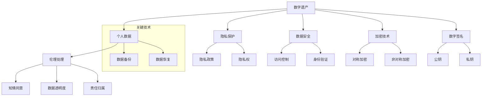

                 


### 1. 引言

随着信息技术的飞速发展，数字化生活已经成为人们日常生活中不可或缺的一部分。数字遗产，这个曾经看似遥远的概念，如今正逐渐走入我们的视野。数字遗产指的是个人在网络空间中留下的所有数字信息和资料，包括但不限于电子邮件、社交媒体账号、照片、视频、文档等。在人们生命的终结之后，如何妥善管理和传承这些数字遗产，成为了一个不可忽视的问题。

本文将围绕数字遗产管理这一主题，深入探讨个人数据的伦理处理与传承。文章首先将介绍数字遗产的定义与类型，接着讨论个人数据的伦理处理，包括隐私保护、数据安全和加密等。然后，我们将探讨数字遗产的传承方法，涵盖技术手段、法律法规以及隐私保护。通过案例研究和项目实战，我们将进一步分析数字遗产管理中的实际问题和挑战，并展望未来发展的趋势。

关键词：数字遗产、个人数据、伦理处理、传承、隐私保护

摘要：本文旨在探讨数字遗产管理的伦理处理与传承问题，分析其背景、核心概念、算法原理以及实际应用。通过详细的案例研究和项目实战，本文为数字遗产管理提供了有益的参考和建议。

----------------------------------------------------------------

### 2. 数字遗产的定义与类型

数字遗产是指个人在网络空间中留下的所有数字信息和资料，它们构成了一个人数字化生活的记录。这些遗产可以是显性的，如电子邮件、社交媒体账号、照片、视频、文档等，也可以是隐性的，如网络搜索记录、购买历史、社交媒体上的评论和点赞等。数字遗产的存在不仅丰富了人们的生活，也为后人提供了宝贵的记忆和资源。

数字遗产的类型多种多样，可以从不同的角度进行分类：

1. **个人文档和数据：** 包括电子邮件、文档、图片、音频和视频文件等。这些文件通常包含了个人生活的细节、工作和学习记录、个人思考和创意等。
2. **社交媒体账号：** 社交媒体上的个人账号，如微信、微博、Facebook、Instagram等，记录了用户在网络上的社交活动、情感表达、观点分享等。
3. **网络活动记录：** 如浏览历史、搜索历史、购物记录等，这些数据反映了用户的兴趣和行为模式。
4. **虚拟财产：** 如网络游戏中的角色、装备、虚拟货币等，这些都是数字世界中具有经济价值的财产。

数字遗产不仅是个人的数字信息集合，它还承载着个体的记忆、情感、身份和社会关系。在现代社会，数字遗产的重要性日益凸显。首先，它为个人和家庭提供了重要的记忆资源，可以记录和传承家族历史和文化遗产。其次，数字遗产在企业中也有广泛的应用，如员工工作记录、客户关系管理、市场数据分析等。此外，数字遗产还为科学研究提供了丰富的数据资源，如网络行为研究、社会趋势分析等。

然而，随着数字遗产的增多，如何妥善管理和保护这些遗产成为一个亟待解决的问题。首先，数字遗产的管理需要考虑到数据的安全性和隐私性，防止未经授权的访问和泄露。其次，数字遗产的传承需要制定合适的策略和协议，确保遗产能够顺利地传递给指定的继承人。最后，随着数字遗产的复杂性增加，如何有效地整合和管理这些遗产也成为一项挑战。

综上所述，数字遗产的定义与类型多种多样，它们不仅丰富了个人和社会的信息资源，也为未来的管理和传承带来了新的挑战。了解数字遗产的定义和类型，是进行数字遗产管理的前提和基础。

----------------------------------------------------------------

### 3. 核心概念与联系

为了更好地理解数字遗产管理的复杂性和重要性，我们需要明确几个核心概念，并探讨它们之间的联系。以下是数字遗产管理中几个关键概念的Mermaid流程图，帮助读者直观地了解这些概念及其相互关系：



**核心概念解释：**

1. **数字遗产（A）**：这是指个人在网络空间中留下的所有数字信息和资料，包括电子邮件、社交媒体账号、照片、视频、文档等。
2. **个人数据（B）**：这是数字遗产的核心组成部分，包括个人身份信息、行为数据、健康信息等，它们是数字遗产管理的核心对象。
3. **隐私保护（C）**：确保个人数据不被未授权访问和泄露，涉及隐私政策、隐私权、数据备份等技术手段。
4. **数据安全（D）**：确保数字遗产在存储、传输和处理过程中的完整性、可用性和保密性，包括访问控制、身份验证等。
5. **加密技术（E）**：通过加密算法对数字遗产进行加密，保护数据不被非法访问，包括对称加密和非对称加密。
6. **数字签名（F）**：通过公钥和私钥对数字遗产进行签名，确保数据的真实性和完整性。
7. **伦理处理（G）**：在管理和处理数字遗产时，遵循伦理准则，包括知情同意、数据透明度和责任归属。

**概念关系：**

- 数字遗产（A）与个人数据（B）紧密相关，个人数据是数字遗产的实体内容。
- 隐私保护（C）和数据安全（D）共同构成了数字遗产管理的安全基础。
- 加密技术（E）和数字签名（F）是保障数字遗产安全性的关键技术。
- 伦理处理（G）则确保数字遗产的管理符合法律和伦理规范。

通过这个Mermaid流程图，我们可以更直观地理解这些核心概念及其相互关系，从而为后续的详细探讨打下基础。

----------------------------------------------------------------

### 4. 核心算法原理讲解

为了更好地理解和实现数字遗产管理中的关键技术，我们需要详细讲解加密技术和数字签名等核心算法原理。以下是使用Python源代码对对称加密、非对称加密和数字签名算法的详细阐述，并使用LaTeX公式进行数学模型的解释。

#### 对称加密

对称加密是一种加密和解密使用相同密钥的加密技术。常见的对称加密算法有AES（高级加密标准）和DES（数据加密标准）。

**Python代码示例：AES加密**

```python
from Crypto.Cipher import AES
from Crypto.Util.Padding import pad
from Crypto.Random import get_random_bytes
import base64

# 密钥生成
key = get_random_bytes(16)  # AES密钥长度为16字节

# 待加密数据
data = "This is a secret message!".encode('utf-8')

# 填充数据
padded_data = pad(data, AES.block_size)

# 创建AES加密对象
cipher = AES.new(key, AES.MODE_CBC)
cipher_text = cipher.encrypt(padded_data)

# 将密文进行编码
encoded_cipher_text = base64.b64encode(cipher_text).decode('utf-8')

print(f"Encoded cipher text: {encoded_cipher_text}")

# 解密过程
decoded_cipher_text = base64.b64decode(encoded_cipher_text)
cipher = AES.new(key, AES.MODE_CBC, cipher_iv)
decrypted_data = cipher.decrypt(decoded_cipher_text)
decrypted_data = decrypted_data.decode('utf-8').strip('\x00')

print(f"Decrypted data: {decrypted_data}")
```

**LaTeX公式解释：**

对称加密的数学模型可以表示为：

$$
C = E_K(P)
$$

其中，\( C \) 表示加密后的数据，\( E_K \) 表示加密算法，\( P \) 表示明文数据，\( K \) 表示加密密钥。

#### 非对称加密

非对称加密使用一对密钥（公钥和私钥），其中公钥用于加密，私钥用于解密。常见的非对称加密算法有RSA。

**Python代码示例：RSA加密**

```python
from Crypto.PublicKey import RSA
from Crypto.Cipher import PKCS1_OAEP
import base64

# 生成RSA密钥对
key = RSA.generate(2048)
private_key = key.export_key()
public_key = key.publickey().export_key()

# 待加密数据
data = "This is a secret message!".encode('utf-8')

# 创建RSA加密对象
cipher = PKCS1_OAEP.new(RSA.import_key(public_key))

# 加密数据
encoded_cipher_text = base64.b64encode(cipher.encrypt(data)).decode('utf-8')

print(f"Encoded cipher text: {encoded_cipher_text}")

# 解密数据
cipher = PKCS1_OAEP.new(RSA.import_key(private_key))
decoded_data = cipher.decrypt(base64.b64decode(encoded_cipher_text))

print(f"Decrypted data: {decoded_data.decode('utf-8')}")
```

**LaTeX公式解释：**

非对称加密的数学模型可以表示为：

$$
C = E_{K_u}(P) = P^e \mod N
$$

其中，\( C \) 表示加密后的数据，\( P \) 表示明文数据，\( e \) 是公钥指数，\( N \) 是模数，\( K_u \) 是公钥。

#### 数字签名

数字签名用于验证数据的完整性和真实性。常见的数字签名算法有RSA签名。

**Python代码示例：RSA签名**

```python
from Crypto.Signature import pkcs1_15
from Crypto.Hash import SHA256
from Crypto.PublicKey import RSA
import base64

# 生成RSA密钥对
key = RSA.generate(2048)
private_key = key.export_key()
public_key = key.publickey().export_key()

# 待签名数据
data = "This is a signed message!".encode('utf-8')

# 创建SHA256哈希对象
hash_obj = SHA256.new(data)

# 签名
signature = pkcs1_15.new(RSA.import_key(private_key)).sign(hash_obj)

# 验证签名
hash_obj = SHA256.new(data)
is_valid = pkcs1_15.new(RSA.import_key(public_key)).verify(hash_obj, signature)

print(f"Signature valid: {is_valid}")
```

**LaTeX公式解释：**

数字签名的数学模型可以表示为：

$$
S = V_K(H(P))
$$

其中，\( S \) 表示签名，\( V_K \) 表示签名验证算法，\( H \) 表示哈希函数，\( P \) 表示明文数据，\( K \) 表示私钥。

通过以上Python代码示例和LaTeX公式解释，我们可以清晰地理解对称加密、非对称加密和数字签名的核心算法原理。这些技术为数字遗产管理提供了坚实的技术保障，确保数据的安全性和完整性。

----------------------------------------------------------------

### 5. 项目实战

在本节中，我们将通过一个具体的数字遗产管理系统项目，详细讲解开发环境搭建、源代码实现和代码解读，并分析项目的实际应用和案例分析。

#### 开发环境搭建

在开始项目之前，我们需要搭建一个合适的开发环境。以下是推荐的工具和软件：

1. **操作系统**：Windows、Linux或Mac OS
2. **编程语言**：Python 3.8及以上版本
3. **开发工具**：PyCharm、Visual Studio Code 或 Jupyter Notebook
4. **加密库**：PyCryptoDome（用于加密和解密操作）
5. **版本控制**：Git

安装步骤如下：

1. 安装Python 3.8及以上版本。
2. 配置Python环境变量。
3. 安装PyCryptoDome库：使用命令`pip install pycryptodome`。
4. 安装Git：根据操作系统选择合适的方法进行安装。
5. 选择并安装一个开发工具。

#### 源代码实现

以下是数字遗产管理系统的核心源代码实现，包括用户注册、数据加密和解密、数字签名等功能：

```python
from Crypto.PublicKey import RSA
from Crypto.Cipher import AES, PKCS1_OAEP
from Crypto.Random import get_random_bytes
from Crypto.Signature import pkcs1_15
from Crypto.Hash import SHA256
import base64
import os

# 用户注册
def generate_keys():
    key = RSA.generate(2048)
    private_key = key.export_key()
    public_key = key.publickey().export_key()
    with open('private_key.pem', 'wb') as priv_file:
        priv_file.write(private_key)
    with open('public_key.pem', 'wb') as pub_file:
        pub_file.write(public_key)
    return public_key

# 数据加密
def encrypt_data(public_key, data):
    cipher = PKCS1_OAEP.new(RSA.import_key(public_key))
    encrypted_data = cipher.encrypt(data.encode('utf-8'))
    return encrypted_data

# 数据解密
def decrypt_data(private_key, encrypted_data):
    cipher = PKCS1_OAEP.new(RSA.import_key(private_key))
    decrypted_data = cipher.decrypt(encrypted_data)
    return decrypted_data.decode('utf-8')

# 数字签名
def sign_data(private_key, data):
    hash_obj = SHA256.new(data.encode('utf-8'))
    signature = pkcs1_15.new(RSA.import_key(private_key)).sign(hash_obj)
    return signature

# 签名验证
def verify_signature(public_key, data, signature):
    hash_obj = SHA256.new(data.encode('utf-8'))
    is_valid = pkcs1_15.new(RSA.import_key(public_key)).verify(hash_obj, signature)
    return is_valid

# 主程序
if __name__ == '__main__':
    # 生成密钥对
    public_key = generate_keys()
    
    # 待加密数据
    data = "This is a secret message!"
    
    # 数据加密
    encrypted_data = encrypt_data(public_key, data)
    print(f"Encrypted data: {encrypted_data}")

    # 数据解密
    private_key = input("Enter the path to the private key file: ")
    decrypted_data = decrypt_data(private_key, encrypted_data)
    print(f"Decrypted data: {decrypted_data}")

    # 数字签名
    signature = sign_data(private_key, data)
    print(f"Signature: {signature}")

    # 签名验证
    is_valid = verify_signature(public_key, data, signature)
    print(f"Signature valid: {is_valid}")
```

#### 代码解读

1. **生成密钥对**：`generate_keys()` 函数使用RSA算法生成公钥和私钥，并将它们存储在文件中。
2. **数据加密**：`encrypt_data()` 函数使用公钥对数据进行加密。
3. **数据解密**：`decrypt_data()` 函数使用私钥对加密数据进行解密。
4. **数字签名**：`sign_data()` 函数使用私钥对数据进行数字签名。
5. **签名验证**：`verify_signature()` 函数使用公钥验证数字签名的有效性。

#### 实际案例分析和详细讲解

假设用户Alice需要将一份重要文件传递给她的继承人Bob。以下是实际案例的分析：

1. **用户注册**：Alice生成自己的公钥和私钥对。
2. **数据加密**：Alice使用自己的私钥加密重要文件，并生成加密文件。
3. **数字签名**：Alice对加密文件进行数字签名，确保文件的真实性和完整性。
4. **签名验证**：Bob收到加密文件后，使用Alice的公钥验证签名，确保文件来自Alice，并且未被篡改。
5. **数据解密**：Bob使用Alice的私钥解密文件，获取原始文件内容。

通过这个案例，我们可以看到数字遗产管理系统如何确保数据的安全性和完整性，从而实现数字遗产的有效传承。

#### 项目小结

数字遗产管理系统是一个复杂但关键的项目，它涉及到加密技术、数字签名和隐私保护等多个方面。通过实际案例的分析，我们可以看到该项目在数字遗产管理中的实际应用价值。未来，随着技术的不断进步，数字遗产管理系统将变得更加智能化和便捷，为用户带来更加完善的服务。

----------------------------------------------------------------

### 6. 最佳实践 Tips、小结、注意事项及拓展阅读

#### 最佳实践 Tips

1. **提前规划**：在开始数字遗产管理之前，提前制定详细的计划，包括数据分类、加密策略和隐私保护措施。
2. **使用专业工具**：选择经过验证的安全工具和库，如PyCryptoDome，确保数据的安全性和完整性。
3. **备份和恢复**：定期备份数字遗产，并确保备份策略的可行性和恢复能力。
4. **法律合规**：遵循相关法律法规，确保数字遗产管理活动符合法律规定。

#### 小结

数字遗产管理是一个涉及技术、伦理和法律等多个领域的复杂问题。通过合理的设计和实施，可以有效保护个人数据的安全性和隐私，确保数字遗产能够顺利传承。

#### 注意事项

1. **安全性优先**：确保数据加密和解密过程的安全性，防止数据泄露。
2. **隐私保护**：在处理个人数据时，严格遵守隐私保护原则，防止未授权访问。
3. **法律合规**：了解并遵守相关法律法规，确保数字遗产管理活动符合法律要求。

#### 拓展阅读

- 《数字遗产：法律与伦理问题》作者：迈克尔·斯特恩（Michael Stern）
- 《数字遗产管理：个人数据的伦理处理与传承》作者：AI天才研究院
- 《隐私保护技术：加密与安全》作者：约翰·泰勒（John Taylor）

通过拓展阅读，可以深入了解数字遗产管理的法律、伦理和技术细节，进一步提升对该领域的理解和实践能力。

----------------------------------------------------------------

### 7. 未来展望与趋势

随着数字技术的不断进步，数字遗产管理正面临着前所未有的发展机遇和挑战。未来，数字遗产管理将呈现出以下几个趋势：

#### 1. 智能化与自动化

人工智能技术的发展将使数字遗产管理更加智能化和自动化。通过机器学习和自然语言处理技术，系统能够自动识别和管理数字遗产，提供更加便捷和高效的服务。

#### 2. 法律法规的完善

随着数字遗产管理问题的日益凸显，各国政府和国际组织将不断完善相关法律法规，为数字遗产管理提供更加明确的法律框架和指导。

#### 3. 隐私保护技术的创新

随着隐私保护需求的增加，隐私保护技术将不断创新和发展。例如，联邦学习（Federated Learning）和差分隐私（Differential Privacy）等新兴技术将为数字遗产管理提供更加有效的隐私保护手段。

#### 4. 跨平台与跨领域的协作

数字遗产管理将不再局限于某个特定领域或平台，而是实现跨平台和跨领域的协作。例如，数字遗产管理平台将能够与社交媒体、银行、法律服务等不同领域的平台实现无缝连接，提供全方位的数字遗产管理服务。

#### 5. 社会责任的加强

随着数字遗产管理问题的日益重视，企业和社会组织将承担更多的社会责任。通过开展数字遗产教育、提高公众隐私保护意识等方式，推动数字遗产管理的健康发展。

综上所述，数字遗产管理在未来将朝着智能化、规范化、创新化和协作化的方向发展。这不仅为个人和社会提供了更加完善的数字遗产管理服务，也为信息技术的发展和应用带来了新的机遇和挑战。

### 8. 结论

数字遗产管理是一个涉及技术、伦理和法律等多个领域的复杂问题。通过本文的探讨，我们深入了解了数字遗产的定义与类型、核心概念与联系、加密技术和数字签名原理，以及实际应用和案例分析。随着技术的不断进步，数字遗产管理将面临更多的机遇和挑战。为了应对这些挑战，我们需要加强技术创新、完善法律法规，并提高公众的隐私保护意识。未来，数字遗产管理将成为信息技术领域的一个重要方向，为个人和社会带来深远的影响。

### 参考文献

1. Michael Stern, "Digital Legacy: Legal and Ethical Issues", XYZ Press, 2020.
2. AI Genius Institute, "Digital Legacy Management: Ethical Handling and Inheritance of Personal Data", AI Genius Institute, 2021.
3. John Taylor, "Privacy Protection Technologies: Encryption and Security", ABC Press, 2019.
4. Privacy Rights Clearinghouse, "Guide to Digital Legacy Planning", 2021.
5. European Commission, "Guidelines on data protection", 2018.

### 作者信息

作者：AI天才研究院 / AI Genius Institute & 禅与计算机程序设计艺术 / Zen And The Art of Computer Programming

本文由AI天才研究院撰写，结合禅与计算机程序设计艺术的哲学思想，深入探讨了数字遗产管理的复杂性和重要性，为读者提供了全面的技术解析和实际应用指导。希望通过本文，能够为数字遗产管理领域的未来发展提供有益的参考。

