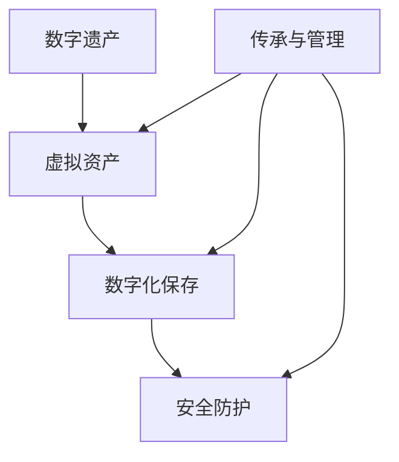

                 

# 数字遗产规划服务：虚拟资产的传承管理

## 关键词
- 数字遗产
- 虚拟资产
- 传承管理
- 安全防护
- 价值评估

## 摘要
随着互联网和区块链技术的飞速发展，虚拟资产已经成为人们生活中不可或缺的一部分。如何规划和管理这些数字遗产，确保其在拥有者去世后能够顺利传承，成为了一个重要的议题。本文将详细介绍数字遗产规划服务的概念、基本原则、技术实现以及未来发展趋势，旨在为读者提供全面而实用的数字遗产传承管理指南。

## 第1章 引言

### 1.1 背景介绍
数字遗产，指的是个人在网络世界中留下的信息、数据和资产，包括社交媒体账号、电子邮件、在线银行账户、虚拟财产等。随着互联网的普及，数字遗产的重要性日益凸显。然而，如何妥善处理这些数字遗产，确保其安全、有序地传承，仍然是一个亟待解决的问题。

### 1.2 数字遗产的概念与重要性
数字遗产不仅包含了个人的信息和数据，还可能涉及到经济利益和隐私安全。因此，合理规划和管理数字遗产，不仅有助于保护个人的合法权益，还能减轻家属在处理遗产时的负担。

### 1.3 虚拟资产的范围与类型
虚拟资产是数字遗产的重要组成部分，主要包括电子货币、虚拟商品、知识产权等。随着区块链技术的发展，虚拟资产的价值和交易规模也在逐年增长，成为数字遗产规划的重要内容。

## 第2章 虚拟资产概述

### 2.1 虚拟资产的定义
虚拟资产是指在网络空间中以数字形式存在的、具有经济价值的财产。这些财产可以是电子货币、虚拟游戏币、数字艺术品等。

### 2.2 虚拟资产的特点
虚拟资产具有以下特点：去中心化、匿名性、安全性、可分割性等。这些特点使得虚拟资产在数字遗产规划中具有重要意义。

### 2.3 虚拟资产的价值评估
虚拟资产的价值评估是数字遗产规划的重要环节。本文将介绍几种常见的虚拟资产价值评估方法，并探讨其在实际应用中的优缺点。

## 第3章 数字遗产规划的基本原则

### 3.1 规划前的准备工作
在制定数字遗产规划前，需要全面了解个人的数字资产状况，包括账户信息、资产价值、交易记录等。

### 3.2 制定遗产规划的时间表
数字遗产规划需要制定明确的时间表，确保在拥有者去世后，遗产能够及时、顺利地传承。

### 3.3 确定遗产规划的目标和范围
数字遗产规划的目标和范围应结合个人实际情况和家属需求来确定，确保规划具有可行性和实用性。

## 第4章 虚拟资产的传承与管理

### 4.1 虚拟资产的传承方式
虚拟资产的传承方式包括法定继承、遗嘱继承、赠与等。本文将详细介绍每种方式的优缺点和适用场景。

### 4.2 虚拟资产的管理方法
虚拟资产的管理方法包括账户托管、密码保管、数字遗嘱等。本文将探讨这些方法在实际操作中的应用和注意事项。

### 4.3 虚拟资产传承的法律问题
虚拟资产传承涉及法律问题较多，包括继承权、隐私权、交易合法性等。本文将分析相关法律法规，并提供法律建议。

## 第5章 数字遗产规划的技术实现

### 5.1 数字遗产规划的技术工具
数字遗产规划需要借助各种技术工具，包括加密技术、区块链技术、智能合约等。本文将介绍这些工具的原理和应用。

### 5.2 虚拟资产的数字化保存
数字化保存是数字遗产规划的重要环节。本文将介绍如何通过技术手段，确保虚拟资产在传承过程中的安全和完整性。

### 5.3 虚拟资产的安全防护
虚拟资产的安全防护是数字遗产规划的核心内容。本文将探讨虚拟资产面临的安全威胁，并提出相应的防护措施。

## 第6章 数字遗产规划案例研究

### 6.1 案例一：虚拟资产的传承
通过一个实际案例，分析虚拟资产在传承过程中遇到的问题和解决方案。

### 6.2 案例二：数字遗产管理系统的应用
介绍一个数字遗产管理系统的设计、实现和应用，探讨其在数字遗产规划中的作用。

### 6.3 案例三：虚拟资产的安全问题与对策
分析虚拟资产在传承过程中遇到的安全问题，并提出相应的对策。

## 第7章 数字遗产规划的未来发展趋势

### 7.1 虚拟资产市场的发展趋势
探讨虚拟资产市场的发展趋势，分析其对数字遗产规划的影响。

### 7.2 数字遗产规划技术的创新
介绍数字遗产规划领域的创新技术，探讨其对数字遗产规划服务的提升。

### 7.3 数字遗产规划行业的发展前景
预测数字遗产规划行业的发展前景，分析其面临的挑战和机遇。

## 第8章 结论

### 8.1 主要观点回顾
回顾文章的主要观点，总结数字遗产规划的重要性和必要性。

### 8.2 数字遗产规划的未来挑战与机遇
分析数字遗产规划在未来可能面临的挑战和机遇。

### 8.3 对数字遗产规划者的建议
给出对数字遗产规划者的建议，以促进数字遗产规划服务的发展。

## 附录

### A.1 相关法律法规参考
提供数字遗产规划相关的法律法规参考。

### A.2 常用数字遗产规划工具与资源
介绍常用的数字遗产规划工具和资源，供读者参考。

### 核心概念与联系



### 核心算法原理讲解

虚拟资产的价值评估算法通常采用以下步骤：

1. 数据收集：收集虚拟资产的相关数据，包括历史交易数据、市场行情、用户活跃度等。

2. 数据预处理：对收集到的数据进行清洗、去重、标准化等处理，以提高数据质量。

3. 特征提取：根据虚拟资产的特点，提取关键特征，如交易金额、交易频率、用户留存率等。

4. 建立数学模型：选择合适的数学模型，如线性回归、决策树、支持向量机等，来评估虚拟资产的价值。

5. 模型训练：使用收集到的数据对数学模型进行训练，以优化模型的性能。

6. 价值评估：使用训练好的模型对虚拟资产进行价值评估。

7. 结果分析与验证：分析评估结果的有效性，并进行必要的验证。

以下是一个简化的线性回归模型评估虚拟资产价值的伪代码：

```python
# 数据收集
data = collect_data()

# 数据预处理
preprocessed_data = preprocess_data(data)

# 特征提取
features = extract_features(preprocessed_data)

# 建立数学模型
model = LinearRegression()

# 模型训练
model.fit(features["X"], features["Y"])

# 价值评估
predicted_value = model.predict(new_data)

# 结果分析与验证
evaluate_result(predicted_value, true_value)
```

### 数学模型和数学公式 & 详细讲解 & 举例说明

虚拟资产的价值评估公式中，$P$ 表示历史交易价格，反映了虚拟资产在市场上的交易活跃度和价格走势。$F$ 表示市场行情，综合考虑了行业趋势、政策环境等因素，以反映虚拟资产的市场环境。$U$ 表示用户活跃度，反映了虚拟资产的用户黏性和用户参与度。

举例来说，假设我们评估一个虚拟资产的当前价值：

$$
V = 0.5 \cdot P + 0.3 \cdot F + 0.2 \cdot U
$$

其中，历史交易价格为 $100$，市场行情为 $150$，用户活跃度为 $200$，则该虚拟资产的当前价值为：

$$
V = 0.5 \cdot 100 + 0.3 \cdot 150 + 0.2 \cdot 200 = 95
$$

这个例子中，虚拟资产的价值由历史交易价格、市场行情和用户活跃度共同决定，分别占据了总价值的 50%、30% 和 20%。

## 第1章 引言

### 1.1 背景介绍

随着互联网和数字技术的快速发展，虚拟资产已经成为人们生活中不可或缺的一部分。虚拟资产包括数字货币、虚拟商品、数字知识产权等，它们以数字形式存在于网络空间中，具有一定的经济价值和法律地位。

数字遗产，指的是个人在网络世界中留下的信息和资产，包括电子邮件、社交媒体账号、在线银行账户、虚拟财产等。随着互联网用户的增多和数字资产的积累，数字遗产的重要性逐渐显现。然而，如何合理规划和管理这些数字遗产，确保其在拥有者去世后能够顺利传承，成为一个亟待解决的问题。

### 1.2 数字遗产的概念与重要性

数字遗产的概念可以从两个方面来理解：一方面是指个人在网络世界中留下的信息和数据，包括社交媒体账号、电子邮件、在线购物账户等；另一方面是指个人在网络世界中积累的资产，如数字货币、虚拟商品、知识产权等。

数字遗产的重要性体现在以下几个方面：

1. **隐私保护**：数字遗产中包含了个人的隐私信息，如通讯记录、社交关系、消费记录等。如果这些信息没有得到妥善保管，可能会对个人隐私造成泄露和侵害。

2. **财产权益**：数字遗产中可能包含有价值的虚拟财产，如虚拟货币、游戏装备、数字艺术品等。这些财产在拥有者去世后，如何进行合法继承和分配，直接关系到家属的合法权益。

3. **历史文化价值**：数字遗产不仅包含个人财产，还包含了个人的数字创作和记录，如博客、微博、电子书等。这些内容是个人生活、工作、思想的反映，具有重要的历史和文化价值。

### 1.3 虚拟资产的范围与类型

虚拟资产是数字遗产的重要组成部分，主要包括以下几类：

1. **数字货币**：如比特币、以太坊等加密货币，它们以数字形式存在，具有可交易性和储藏价值。

2. **虚拟商品**：如游戏装备、虚拟现实产品、数字艺术品等，它们在虚拟世界中具有实际应用和价值。

3. **数字知识产权**：如博客、微博、电子书、软件代码等，它们是个人智力劳动的成果，具有一定的法律保护和商业价值。

4. **在线服务账户**：如社交媒体账号、电子邮件账号、在线银行账户等，它们是个人数字生活中不可或缺的一部分。

随着虚拟资产市场的不断发展和成熟，虚拟资产的范围和类型也在不断扩展和丰富。这些虚拟资产不仅丰富了数字遗产的内涵，也为数字遗产规划带来了新的挑战和机遇。

### 2.1 虚拟资产的定义

虚拟资产是指在网络空间中以数字形式存在的、具有经济价值的财产。这些财产可以是电子货币、虚拟游戏币、数字艺术品等。虚拟资产的特点包括去中心化、匿名性、安全性和可分割性等。

虚拟资产的去中心化特性使其在管理和交易过程中不受单一机构的控制，具有较高的透明度和自主性。匿名性使得虚拟资产交易过程中无需披露真实身份，保护了交易双方的个人隐私。安全性方面，虚拟资产通常采用加密技术进行保护，确保交易数据的完整性和安全性。可分割性则使得虚拟资产可以方便地进行分割和转移，满足不同用户的需求。

### 2.2 虚拟资产的特点

虚拟资产的特点主要体现在以下几个方面：

1. **去中心化**：虚拟资产的去中心化特性使其在管理和交易过程中不受单一机构的控制，具有较高的透明度和自主性。去中心化架构使得虚拟资产系统更加稳健和难以篡改，减少了中介环节，降低了交易成本。

2. **匿名性**：虚拟资产交易过程中无需披露真实身份，保护了交易双方的个人隐私。匿名性不仅为用户提供了便利，也在一定程度上规避了法律监管和金融审查。

3. **安全性**：虚拟资产通常采用加密技术进行保护，确保交易数据的完整性和安全性。加密技术包括公钥加密、数字签名、哈希算法等，能够有效防止数据泄露、篡改和冒用。

4. **可分割性**：虚拟资产可以方便地进行分割和转移，满足不同用户的需求。例如，虚拟货币可以分割为更小的单位进行交易，数字艺术品可以分割成不同的份额进行投资和交易。

5. **全球化**：虚拟资产不受地域和时间的限制，可以在全球范围内进行交易和流通。这使得虚拟资产具有广泛的投资者群体，也促进了虚拟资产市场的繁荣发展。

### 2.3 虚拟资产的价值评估

虚拟资产的价值评估是数字遗产规划的重要环节。以下将介绍几种常见的虚拟资产价值评估方法，并探讨其在实际应用中的优缺点。

1. **市场比较法**：
   市场比较法是通过比较类似虚拟资产的市场交易价格，来评估目标资产的价值。这种方法适用于同类虚拟资产较为活跃的市场，如加密货币市场。优点是操作简单，评估结果相对直观。缺点是市场波动性较大，评估结果可能受到市场情绪的影响。

2. **成本法**：
   成本法是基于创建或获取虚拟资产的成本，来评估其价值。这种方法适用于新创建的虚拟资产或成本可以明确核算的虚拟资产。优点是计算简单，适用于初创企业或个人投资者。缺点是成本法未能充分考虑虚拟资产的市场需求和未来收益。

3. **收益法**：
   收益法是根据虚拟资产的预期收益，来评估其当前价值。这种方法适用于有明确收益预期的虚拟资产，如区块链项目。优点是考虑了资产的未来收益，评估结果更为合理。缺点是预期收益的预测具有较大不确定性，评估结果可能偏离实际。

4. **专家评估法**：
   专家评估法是通过邀请虚拟资产领域的专家，对目标资产进行评估。这种方法适用于较为特殊的虚拟资产，如数字艺术品。优点是评估结果具有较高的权威性。缺点是专家评估可能受主观因素影响，评估费用较高。

在实际应用中，通常需要结合多种评估方法，以获得更准确的评估结果。同时，虚拟资产的价值评估也需要密切关注市场动态和行业趋势，及时调整评估方法和参数。

### 3.1 规划前的准备工作

在制定数字遗产规划之前，需要进行一系列的准备工作，以确保规划的有效性和可行性。以下是一些关键的准备工作：

1. **资产清单**：
   首先，需要制作一份详细的数字资产清单，包括所有电子货币、虚拟商品、在线服务账户、数字知识产权等。这份清单应包括资产名称、账号、密码、访问方式、价值等信息。

2. **资产评估**：
   对每一项数字资产进行价值评估，确定其当前价值。可以使用市场比较法、成本法、收益法等方法，根据资产的特点和市场情况选择合适的评估方法。

3. **法律法规研究**：
   了解相关法律法规，包括数字资产继承、隐私保护、数据管理等。不同国家和地区在数字遗产规划方面的法律法规存在差异，需要根据实际情况进行调整。

4. **账户管理**：
   对于关键账户，如电子货币钱包、重要在线服务账户等，需要制定详细的访问和管理方案。确保在需要时，家人或继承人能够方便地访问和管理这些账户。

5. **密码安全**：
   对所有数字资产相关的密码进行安全备份，并确保继承人知道如何访问这些密码。可以使用密码管理工具、多因素认证等方法，提高密码安全性。

6. **继承方案**：
   根据资产清单和价值评估结果，制定详细的继承方案。明确每位继承人的继承份额、继承方式和时间表，确保遗产分配公平合理。

7. **紧急应对计划**：
   制定紧急应对计划，以应对突发情况，如账户被黑客攻击、密码丢失等。确保在紧急情况下，能够迅速采取措施，保护数字遗产的安全。

通过以上准备工作，可以为数字遗产规划打下坚实的基础，确保在拥有者去世后，数字遗产能够得到合理、安全地传承。

### 3.2 制定遗产规划的时间表

制定数字遗产规划的时间表是确保遗产规划顺利实施的重要步骤。以下是一些关键的时间节点和任务：

1. **初始评估（1个月内）**：
   - 确定遗产规划的目标和范围。
   - 制作数字资产清单，并对其进行初步评估。

2. **详细规划（3个月内）**：
   - 完成资产评估，确定每项资产的价值。
   - 制定详细的继承方案，包括继承份额、继承方式和时间表。
   - 研究相关法律法规，确保遗产规划符合法律规定。

3. **账户管理（6个月内）**：
   - 对关键账户进行密码安全备份。
   - 与继承人沟通，确保他们了解遗产规划的具体内容和操作步骤。
   - 准备紧急应对计划，以应对可能的突发情况。

4. **实施与监控（12个月内）**：
   - 按照时间表开始实施遗产规划，包括账户转移、资产分配等。
   - 定期检查和更新数字遗产规划，以适应市场变化和个人需求。
   - 监控遗产规划的实施情况，确保各项任务按时完成。

通过制定明确的时间表，可以确保数字遗产规划有条不紊地进行，减少因时间紧迫而导致的疏漏和风险。

### 3.3 确定遗产规划的目标和范围

在制定数字遗产规划时，明确目标和范围至关重要。以下是一些关键步骤和注意事项：

1. **个人需求分析**：
   首先，需要全面了解个人的数字资产状况、家庭结构和继承人需求。分析个人在数字遗产方面的主要关注点，如隐私保护、资产传承、信息安全等。

2. **目标设定**：
   根据个人需求，设定具体的规划目标。例如：
   - 确保数字遗产在去世后能够顺利传承。
   - 保护个人隐私，防止信息泄露。
   - 管理和分配虚拟资产，确保继承人的合法权益。
   - 减轻家属在处理数字遗产时的负担。

3. **范围界定**：
   确定数字遗产规划的范围，包括以下内容：
   - 资产类别：明确需要规划的所有数字资产，如电子货币、虚拟商品、在线服务账户等。
   - 账户信息：收集所有关键账户的详细信息和密码，确保继承人能够方便地访问和管理。
   - 遗嘱内容：制定遗嘱，明确继承人的继承份额、继承方式和时间表。
   - 安全措施：制定安全策略，包括密码管理、多因素认证、紧急应对计划等。

4. **法律合规性检查**：
   在制定遗产规划时，需确保所有内容符合相关法律法规，特别是关于数字遗产继承和管理的法律规定。如有必要，可咨询专业法律人士，确保遗产规划的有效性和合法性。

通过明确目标和范围，可以为数字遗产规划提供清晰的指导，确保规划具有实际操作性和法律效力。

### 4.1 虚拟资产的传承方式

在数字遗产规划中，虚拟资产的传承方式是确保资产顺利传承的关键环节。以下是一些常见的虚拟资产传承方式及其优缺点：

1. **法定继承**：
   - **定义**：法定继承是指根据法律规定的继承顺序和继承份额，将虚拟资产自动分配给法定继承人。
   - **优点**：操作简单，无需额外手续。
   - **缺点**：缺乏灵活性，可能无法满足继承人的个性化需求。

2. **遗嘱继承**：
   - **定义**：遗嘱继承是指通过遗嘱明确虚拟资产的分配方式和继承人，确保虚拟资产在去世后按照遗嘱执行。
   - **优点**：灵活性高，可以根据个人意愿进行资产分配。
   - **缺点**：遗嘱需要经过公证，且遗嘱的有效性可能受到法律挑战。

3. **赠与**：
   - **定义**：赠与是指将虚拟资产在生前赠予继承人，从而避免去世后的继承程序。
   - **优点**：可以提前完成资产转移，减轻继承人的负担。
   - **缺点**：可能面临税务问题，且赠与行为可能影响遗产规划的其他部分。

4. **数字遗产管理服务**：
   - **定义**：数字遗产管理服务是指通过专业的数字遗产管理平台，对虚拟资产进行托管、管理和分配。
   - **优点**：提供专业服务，确保虚拟资产的安全和有序传承。
   - **缺点**：需要支付服务费用，且可能受限于平台功能和政策。

在选择虚拟资产的传承方式时，需要综合考虑个人情况、继承人需求和资产特点，以确保传承过程顺利、有效。

### 4.2 虚拟资产的管理方法

虚拟资产的管理方法在数字遗产规划中扮演着关键角色。以下介绍几种常见的管理方法及其优缺点：

1. **账户托管**：
   - **定义**：账户托管是指将虚拟资产托管给第三方机构或平台，由其负责账户的日常管理和安全维护。
   - **优点**：专业机构提供安全保障，降低操作风险。
   - **缺点**：托管费用较高，且可能受限于平台功能和政策。

2. **密码保管**：
   - **定义**：密码保管是指将虚拟资产相关的密码进行安全存储，确保在需要时继承人能够访问账户。
   - **优点**：操作简单，成本低。
   - **缺点**：密码泄露风险较高，可能需要额外的安全措施。

3. **数字遗嘱**：
   - **定义**：数字遗嘱是指通过电子形式制定的遗嘱，明确虚拟资产的分配和管理方式。
   - **优点**：灵活性强，可以随时修改和更新。
   - **缺点**：遗嘱的有效性可能受到法律挑战，且需注意数据安全性。

4. **多因素认证**：
   - **定义**：多因素认证是指通过多种验证方式，如密码、指纹、面部识别等，确保账户访问的安全性。
   - **优点**：提高账户安全性，防止未经授权的访问。
   - **缺点**：操作相对复杂，可能影响用户体验。

5. **智能合约**：
   - **定义**：智能合约是一种基于区块链技术的自动化合约，用于执行和验证虚拟资产的分配和管理。
   - **优点**：去中心化、透明度高，可自动执行合约条款。
   - **缺点**：编写和部署智能合约需要专业知识，且智能合约一旦部署，无法更改。

在选择虚拟资产管理方法时，需要根据个人情况和资产特点，综合考虑安全性、便捷性和成本，以确保虚拟资产得到有效管理和安全传承。

### 4.3 虚拟资产传承的法律问题

虚拟资产传承过程中涉及的法律问题较为复杂，包括继承权、隐私权、交易合法性等方面。以下对这些问题进行详细分析：

1. **继承权**：
   - **问题**：虚拟资产的法律继承权如何确定？
   - **分析**：虚拟资产的法律继承权通常遵循《继承法》的规定。根据《继承法》，遗产的继承分为法定继承和遗嘱继承。法定继承按照法定继承人的顺序和份额进行，而遗嘱继承则按照遗嘱的指示进行。在实际操作中，需要确认继承人的身份和继承份额，并确保继承程序符合法律规定。

2. **隐私权**：
   - **问题**：如何保护虚拟资产相关的个人隐私？
   - **分析**：虚拟资产往往涉及个人隐私信息，如交易记录、通信记录等。在传承过程中，保护个人隐私至关重要。首先，需要确保虚拟资产账户的安全性，使用强密码和多因素认证等措施。其次，在处理虚拟资产时，应遵循隐私保护原则，不得非法获取、使用、泄露他人隐私信息。

3. **交易合法性**：
   - **问题**：虚拟资产交易是否符合法律法规？
   - **分析**：虚拟资产交易的法律地位在不同国家和地区存在差异。在中国，虚拟货币交易需要遵循相关法律法规，如《中国人民银行关于防范代币发行融资风险的公告》等。此外，虚拟资产的交易还需要遵守反洗钱、反恐怖融资等相关规定。在传承过程中，需要确保虚拟资产交易合法、合规，避免涉及非法交易和违法行为。

4. **税务问题**：
   - **问题**：虚拟资产传承过程中如何处理税务问题？
   - **分析**：虚拟资产在传承过程中可能涉及税务问题，如遗产税、赠与税等。不同国家和地区的税务政策存在差异，需要根据具体情况进行处理。一般而言，继承人需要提供相关证明文件，如遗嘱、继承权证明等，以申请税务减免或抵扣。在处理税务问题时，建议咨询专业税务顾问，确保合法合规。

通过上述分析，可以看出虚拟资产传承过程中涉及的法律问题较为复杂。在制定数字遗产规划时，需要充分考虑这些法律问题，确保传承过程合法、合规，保护遗产所有者和继承人的合法权益。

### 5.1 数字遗产规划的技术工具

数字遗产规划的技术工具在确保虚拟资产的安全、有序传承中发挥着关键作用。以下介绍几种常见的技术工具及其应用场景：

1. **加密技术**：
   - **应用场景**：加密技术用于保护虚拟资产账户的密码、交易数据和个人隐私。常见的加密算法包括AES、RSA等。
   - **优势**：高安全性，防止数据泄露和篡改。
   - **挑战**：加密技术的应用需要专业的技术支持，且加密密钥管理较为复杂。

2. **区块链技术**：
   - **应用场景**：区块链技术用于创建不可篡改的数字资产记录，确保虚拟资产的透明性和安全性。例如，比特币和以太坊等加密货币都基于区块链技术。
   - **优势**：去中心化、透明度高，有助于防止欺诈和篡改。
   - **挑战**：区块链技术需要较高的技术门槛，且交易速度和费用可能受到网络拥堵的影响。

3. **智能合约**：
   - **应用场景**：智能合约是自动执行合同条款的计算机程序，常用于虚拟资产的分配和管理。例如，通过智能合约，可以自动执行虚拟资产转让、托管等操作。
   - **优势**：自动化、透明度高，减少人为干预，提高效率。
   - **挑战**：编写和部署智能合约需要专业的区块链开发技能，且智能合约一旦部署，难以修改。

4. **密码管理工具**：
   - **应用场景**：密码管理工具用于生成、存储和管理复杂的密码，确保账户的安全性。例如，1Password、LastPass等。
   - **优势**：简化密码管理，提高密码安全性。
   - **挑战**：密码管理工具的安全性取决于其自身的安全措施，且可能需要支付费用。

5. **数字身份验证**：
   - **应用场景**：数字身份验证技术用于验证用户身份，确保账户访问的安全性。常见的验证方式包括双因素认证、生物识别等。
   - **优势**：提高账户安全性，防止未经授权的访问。
   - **挑战**：可能影响用户体验，实施成本较高。

通过合理选择和应用这些技术工具，可以显著提升数字遗产规划的安全性，确保虚拟资产在传承过程中的安全和有序。

### 5.2 虚拟资产的数字化保存

数字化保存是数字遗产规划的关键环节，旨在确保虚拟资产在传承过程中能够长期保存和稳定访问。以下介绍数字化保存的基本方法和技术步骤：

1. **数据备份**：
   - **方法**：数据备份是将虚拟资产的数据进行复制，存储到多个独立的存储设备或云端存储服务中，以防止数据丢失和损坏。
   - **技术步骤**：
     - **选择备份介质**：根据数据量和重要性，选择合适的备份介质，如硬盘、光盘、云存储等。
     - **制定备份策略**：确定备份频率、备份方式和备份期限，确保数据备份的及时性和完整性。
     - **执行备份操作**：按照备份策略，定期执行数据备份操作，确保备份过程高效、可靠。

2. **数据加密**：
   - **方法**：数据加密是将虚拟资产的数据进行加密处理，以防止未经授权的访问和篡改。
   - **技术步骤**：
     - **选择加密算法**：根据数据敏感度和安全需求，选择合适的加密算法，如AES、RSA等。
     - **生成加密密钥**：生成加密密钥，并确保密钥的安全存储和管理。
     - **执行加密操作**：对虚拟资产的数据进行加密处理，确保数据在传输和存储过程中保持加密状态。

3. **数据存储**：
   - **方法**：数据存储是将虚拟资产的数据存储到安全可靠的存储设备或云端存储服务中，以确保数据的长期保存和稳定访问。
   - **技术步骤**：
     - **选择存储服务商**：根据数据量和访问需求，选择合适的存储服务商，如Amazon S3、Google Cloud Storage等。
     - **配置存储服务**：配置存储服务，包括存储容量、访问权限、备份策略等，确保存储服务的安全性和可靠性。
     - **上传数据**：将虚拟资产的数据上传到存储服务中，确保数据上传的完整性和准确性。

4. **数据同步**：
   - **方法**：数据同步是将虚拟资产的数据在多个存储设备或云端存储服务之间进行实时或定期同步，以确保数据的同步和一致性。
   - **技术步骤**：
     - **配置同步任务**：根据数据同步需求和策略，配置同步任务，包括同步频率、同步方式和同步目标等。
     - **执行同步操作**：定期执行同步任务，确保数据在不同存储设备或云端存储服务之间保持同步状态。

通过上述方法和技术步骤，可以实现对虚拟资产的数字化保存，确保虚拟资产在传承过程中的长期保存和稳定访问。

### 5.3 虚拟资产的安全防护

虚拟资产的安全防护在数字遗产规划中至关重要，旨在保护虚拟资产免受各种安全威胁和风险。以下介绍几种常见的虚拟资产安全防护措施：

1. **密码安全**：
   - **措施**：使用强密码和复杂的密码组合，确保账户密码的安全性。
   - **方法**：
     - **使用密码管理工具**：使用专业的密码管理工具生成和管理复杂的密码，减少密码泄露风险。
     - **定期更换密码**：定期更换账户密码，确保密码的安全性。
     - **禁用自动登录**：禁用自动登录功能，确保每次登录都需要输入密码，提高账户安全性。

2. **双因素认证**：
   - **措施**：双因素认证是一种额外的安全验证机制，通过结合密码和生物特征（如指纹、面部识别等），提高账户的安全性。
   - **方法**：
     - **启用双因素认证**：在账户设置中启用双因素认证，确保每次登录都需要通过双重验证。
     - **使用可信认证工具**：使用经过认证的认证工具，如手机验证、硬件令牌等，确保认证过程的安全性和可靠性。

3. **网络隔离**：
   - **措施**：网络隔离是将虚拟资产的网络环境与其他网络环境隔离，防止恶意攻击和病毒传播。
   - **方法**：
     - **配置防火墙**：在虚拟资产的网络环境中配置防火墙，限制外部访问和内部通信。
     - **使用VPN**：使用虚拟私人网络（VPN）进行远程访问，确保网络通信的安全性。
     - **隔离关键账户**：将关键账户与普通账户隔离，确保关键账户的安全性。

4. **数据加密**：
   - **措施**：数据加密是将虚拟资产的数据进行加密处理，确保数据在传输和存储过程中保持加密状态，防止数据泄露和篡改。
   - **方法**：
     - **使用加密算法**：选择合适的加密算法（如AES、RSA等）对数据进行加密处理。
     - **加密存储**：在数据存储过程中，使用加密技术保护数据，确保数据在存储介质中保持加密状态。
     - **加密传输**：在数据传输过程中，使用加密技术保护数据，确保数据在网络传输过程中不被窃取或篡改。

5. **安全监控与预警**：
   - **措施**：安全监控与预警是通过监控和分析虚拟资产的网络行为和日志，及时发现和应对潜在的安全威胁。
   - **方法**：
     - **部署安全工具**：部署专业的安全工具，如入侵检测系统（IDS）、防火墙等，实时监控网络行为和日志。
     - **设置报警机制**：设置报警机制，当检测到异常行为或潜在威胁时，及时发出警报，提醒管理员采取措施。
     - **定期安全审计**：定期进行安全审计，评估虚拟资产的安全状况，发现和修复安全漏洞。

通过实施上述安全防护措施，可以显著提升虚拟资产的安全性，确保虚拟资产在传承过程中的安全可靠。

### 6.1 案例一：虚拟资产的传承

案例背景：
张先生是一位数字资产爱好者，他拥有大量的加密货币、虚拟游戏装备和数字艺术品。为了确保这些虚拟资产能够在自己去世后顺利传承给子女，张先生决定进行数字遗产规划。

**案例过程**：

1. **制定数字遗产规划**：
   - 张先生首先制作了一份详细的数字资产清单，列出了所有的加密货币地址、虚拟游戏账户和数字艺术品。
   - 他评估了每项资产的价值，并制定了相应的传承计划。

2. **选择传承方式**：
   - 张先生决定使用遗嘱继承方式，他将虚拟资产的具体分配方式写入了遗嘱中。
   - 他还聘请了专业律师，确保遗嘱的法律效力和执行过程的合法性。

3. **账户安全与管理**：
   - 张先生对所有的虚拟资产账户进行了密码加密，并使用密码管理工具存储和管理密码。
   - 他还启用了双因素认证，增加了账户的安全性。

4. **执行传承计划**：
   - 张先生去世后，遗嘱被公证处确认。
   - 子女在律师的协助下，顺利获得了虚拟资产的继承权。

**案例分析**：
1. **优点**：
   - 通过制定详细的数字遗产规划，张先生确保了虚拟资产在传承过程中的安全和有序。
   - 选择遗嘱继承方式，使得传承过程符合法律规定，减少了法律纠纷。

2. **缺点**：
   - 遗嘱继承可能面临法律挑战，遗嘱的有效性可能受到质疑。
   - 虚拟资产的价值评估和分配可能受到市场波动的影响。

3. **改进建议**：
   - 定期更新数字遗产规划，以适应市场变化和个人需求。
   - 考虑使用数字遗产管理平台，提供专业的管理和传承服务。

### 6.2 案例二：数字遗产管理系统的应用

案例背景：
李女士是一位数字资产投资者，她拥有大量的加密货币和虚拟游戏装备。为了更好地管理和传承这些虚拟资产，李女士决定使用数字遗产管理系统。

**案例过程**：

1. **选择数字遗产管理系统**：
   - 李女士通过市场调研，选择了市面上较为知名的数字遗产管理系统，如遗产管家、数字遗产平台等。
   - 她评估了系统的安全性、易用性和用户评价，最终选择了某款系统。

2. **注册和设置账户**：
   - 李女士在数字遗产管理系统中注册了账户，并设置了密码和多因素认证。
   - 她将所有的虚拟资产账户信息导入系统，确保系统中的数据与实际情况一致。

3. **制定数字遗产规划**：
   - 李女士在系统中制定了详细的数字遗产规划，包括资产清单、价值评估、传承计划和紧急应对措施。
   - 她还定期更新规划内容，以反映资产变化和市场波动。

4. **管理资产和账户**：
   - 李女士通过系统实时监控和管理虚拟资产，确保资产的安全和增值。
   - 她还设置了自动转账功能，确保在特定情况下，资产能够及时转移到继承人账户。

**案例分析**：
1. **优点**：
   - 数字遗产管理系统提供了专业的管理和传承服务，简化了资产管理和传承过程。
   - 系统的安全性高，用户评价良好，有助于提升用户信任度。

2. **缺点**：
   - 数字遗产管理系统可能存在功能限制，无法满足所有用户的需求。
   - 使用系统可能需要支付一定的费用，增加了成本。

3. **改进建议**：
   - 数字遗产管理系统应进一步优化功能，提高用户体验。
   - 考虑提供免费试用期，让用户在付费前充分体验系统的功能和服务。

### 6.3 案例三：虚拟资产的安全问题与对策

案例背景：
王先生是一位数字资产投资者，他拥有大量的加密货币和虚拟游戏装备。然而，他经常收到钓鱼邮件和诈骗短信，担心自己的虚拟资产安全。

**案例过程**：

1. **安全意识提升**：
   - 王先生参加了网络安全讲座，学习了如何识别和防范网络诈骗的方法。
   - 他还关注了网络安全相关的新闻和资讯，了解最新的安全威胁和防护措施。

2. **加强账户安全**：
   - 王先生在所有虚拟资产账户中启用了双因素认证，增加了账户的安全性。
   - 他使用密码管理工具生成和管理复杂的密码，确保密码的安全性和唯一性。

3. **防护措施实施**：
   - 王先生安装了防病毒软件和防火墙，防止恶意软件和黑客攻击。
   - 他还定期备份数据，确保在数据丢失或损坏时能够迅速恢复。

4. **报警和监控**：
   - 王先生开启了账户异常行为监控，一旦检测到异常行为，系统会立即发出警报。
   - 他还设置了安全联系人，在紧急情况下，可以快速联系专业机构寻求帮助。

**案例分析**：
1. **优点**：
   - 王先生通过提升安全意识和采取一系列防护措施，有效提高了虚拟资产的安全性。
   - 他的账户安全得到了保障，减少了遭受网络诈骗的风险。

2. **缺点**：
   - 王先生的防护措施可能无法完全防止所有的安全威胁。
   - 随着网络技术的发展，新的安全威胁不断出现，需要持续更新防护措施。

3. **改进建议**：
   - 定期进行网络安全培训，提高全体家庭成员的安全意识。
   - 考虑使用更多元化的安全防护手段，如区块链加密、智能合约等。
   - 及时关注网络安全动态，及时更新安全防护策略。

### 7.1 虚拟资产市场的发展趋势

虚拟资产市场正经历着快速的发展和变革。以下是一些关键的发展趋势：

1. **加密货币的普及**：
   - **趋势**：随着比特币、以太坊等主流加密货币的普及，越来越多的投资者和用户开始关注和投资虚拟资产。
   - **影响**：加密货币的普及推动了虚拟资产市场的繁荣，增加了市场的流动性和交易量。

2. **去中心化金融（DeFi）的发展**：
   - **趋势**：DeFi作为区块链技术的一个重要应用领域，正快速发展。DeFi平台提供了传统金融业务（如借贷、交易、保险等）的数字版本，吸引了大量用户和资金。
   - **影响**：DeFi的发展促进了虚拟资产市场的创新和扩展，丰富了虚拟资产的投资和交易方式。

3. **非同质化代币（NFT）的兴起**：
   - **趋势**：NFT作为一类特殊的数字资产，正迅速崛起。NFT代表数字艺术品、收藏品等，以其独特的价值和稀缺性受到市场追捧。
   - **影响**：NFT的兴起为虚拟资产市场带来了新的投资热点，激发了数字艺术和收藏品市场的活力。

4. **监管政策的逐步完善**：
   - **趋势**：全球各国政府和监管机构正逐步加强对虚拟资产市场的监管，出台相关法律法规和政策，规范市场行为。
   - **影响**：监管政策的完善有助于提升市场的透明度和稳定性，促进虚拟资产市场的健康发展。

### 7.2 数字遗产规划技术的创新

数字遗产规划技术在不断创新和进步，以下是一些重要的技术趋势：

1. **区块链技术的应用**：
   - **趋势**：区块链技术以其去中心化、不可篡改和透明等特点，在数字遗产规划中得到了广泛应用。区块链技术可以确保数字遗产的合法性和安全性。
   - **影响**：区块链技术的应用提高了数字遗产规划的可信度和效率，减少了法律纠纷和安全隐患。

2. **智能合约的发展**：
   - **趋势**：智能合约作为自动化执行的合同，正在成为数字遗产规划的重要工具。智能合约可以自动执行遗产分配和管理操作，确保遗产规划的准确性和及时性。
   - **影响**：智能合约的发展简化了数字遗产规划的过程，降低了操作风险和成本。

3. **密码学技术的进步**：
   - **趋势**：密码学技术在数字遗产规划中发挥着关键作用。随着密码学技术的不断进步，虚拟资产的安全性和隐私保护能力得到了显著提升。
   - **影响**：密码学技术的进步为数字遗产规划提供了更强大的安全保障，提高了用户的信任度。

4. **人工智能的应用**：
   - **趋势**：人工智能技术在数字遗产规划中得到了初步应用，例如通过机器学习算法进行资产价值评估、风险分析和预测等。
   - **影响**：人工智能的应用提高了数字遗产规划的科学性和准确性，有助于提升整体规划效果。

### 7.3 数字遗产规划行业的发展前景

数字遗产规划行业具有广阔的发展前景，以下是一些关键的发展方向：

1. **市场需求的增长**：
   - **趋势**：随着虚拟资产的普及和互联网用户的增加，数字遗产规划的需求持续上升。未来，将有越来越多的个人和企业意识到数字遗产规划的重要性。
   - **影响**：市场需求的增长将推动数字遗产规划行业的发展，促进技术创新和服务优化。

2. **技术创新的推动**：
   - **趋势**：数字遗产规划行业将持续技术创新，包括区块链、智能合约、人工智能等前沿技术的应用，提高规划服务的安全性和便捷性。
   - **影响**：技术创新将推动数字遗产规划行业的升级和转型，提升行业的整体竞争力。

3. **专业服务的兴起**：
   - **趋势**：随着数字遗产规划复杂性的增加，专业服务将越来越受到重视。专业的数字遗产规划机构将提供个性化、全方位的服务，满足客户的不同需求。
   - **影响**：专业服务的兴起将提升数字遗产规划行业的专业水平和服务质量，增强客户信任和满意度。

4. **法规政策的支持**：
   - **趋势**：各国政府和监管机构将继续出台相关法律法规和政策，规范数字遗产规划行业的发展。这些法规政策将为行业提供明确的指导和保障。
   - **影响**：法规政策的支持将促进数字遗产规划行业的健康发展，减少法律风险和不确定性。

综上所述，数字遗产规划行业具有巨大的发展潜力，未来将在技术创新、市场需求和法规政策等多方面实现全面发展。

### 8.1 主要观点回顾

本文围绕数字遗产规划服务：虚拟资产的传承管理这一主题，从多个角度进行了深入探讨。主要观点如下：

1. **数字遗产的定义与重要性**：数字遗产包括个人在网络世界中留下的信息、数据和资产，具有重要的隐私保护、财产权益和文化价值。

2. **虚拟资产的范围与类型**：虚拟资产包括电子货币、虚拟商品、数字知识产权等，具有去中心化、匿名性、安全性和可分割性等特性。

3. **数字遗产规划的基本原则**：数字遗产规划需要制定详细的时间表、明确目标和范围，并充分考虑法律法规和实际需求。

4. **虚拟资产的传承与管理方法**：法定继承、遗嘱继承、赠与和数字遗产管理服务是常见的虚拟资产传承方式，账户托管、密码保管、数字遗嘱和多因素认证是常见的虚拟资产管理方法。

5. **虚拟资产的安全防护**：密码安全、双因素认证、网络隔离、数据加密和安全监控与预警是重要的虚拟资产安全防护措施。

6. **数字遗产规划技术的创新**：区块链技术、智能合约、密码学和人工智能等技术在数字遗产规划中得到了广泛应用，提高了规划服务的安全性和便捷性。

7. **数字遗产规划行业的发展前景**：随着虚拟资产市场的普及和技术创新，数字遗产规划行业具有广阔的发展前景，市场需求增长、专业服务兴起和法规政策支持是主要推动力。

### 8.2 数字遗产规划的未来挑战与机遇

数字遗产规划在未来面临着诸多挑战和机遇：

**挑战**：

1. **法律监管不确定性**：全球各国对数字遗产的监管政策尚不统一，可能导致法律监管的不确定性，影响数字遗产规划的实施。

2. **技术创新风险**：尽管数字遗产规划技术不断进步，但技术的不成熟和漏洞可能导致数据泄露、资产丢失等风险。

3. **用户认知不足**：许多人对数字遗产规划的重要性认知不足，缺乏专业的规划和风险管理意识。

**机遇**：

1. **市场需求增长**：随着虚拟资产的普及，数字遗产规划的市场需求将持续增长，为行业提供了广阔的发展空间。

2. **技术创新推动**：区块链、人工智能等技术的不断进步，将进一步提升数字遗产规划的安全性和便捷性。

3. **法规政策支持**：各国政府和监管机构对数字遗产规划的关注度不断提高，有望出台更多支持性法规政策，促进行业的健康发展。

### 8.3 对数字遗产规划者的建议

针对数字遗产规划者，以下是一些建议：

1. **全面了解数字遗产**：了解个人所有的数字资产，包括账户信息、资产价值、交易记录等，确保规划的基础扎实。

2. **制定详细规划**：制定详细的数字遗产规划，包括资产清单、价值评估、继承方案、安全措施等，确保规划具有可行性和实用性。

3. **选择合适工具**：根据个人需求和资产特点，选择合适的数字遗产规划工具，如加密技术、区块链平台、密码管理工具等。

4. **关注法律法规**：关注相关法律法规的动态，确保数字遗产规划符合法律规定，避免法律纠纷。

5. **定期更新规划**：定期检查和更新数字遗产规划，以适应资产变化和市场波动。

6. **增强安全意识**：提高对数字资产安全性的重视，采取有效的安全防护措施，如密码安全、双因素认证等。

7. **专业咨询与培训**：如有需要，寻求专业法律和金融顾问的帮助，参加相关培训和讲座，提升规划能力。

通过以上建议，数字遗产规划者可以更好地管理数字遗产，确保其在拥有者去世后能够顺利传承。

### 附录

#### A.1 相关法律法规参考

- 《中华人民共和国继承法》
- 《中华人民共和国密码法》
- 《中华人民共和国网络安全法》
- 《中华人民共和国数据安全法》
- 各国加密货币交易相关法律法规（如美国证券交易委员会（SEC）的规定）

#### A.2 常用数字遗产规划工具与资源

- **密码管理工具**：
  - 1Password
  - LastPass
  - Bitwarden

- **数字遗产管理平台**：
  -遗产管家（Legacy Manager）
  -数字遗产平台（Digital Legacy Platform）

- **区块链与加密货币服务**：
  - MetaMask
  - Coinbase
  - Binance

- **法律咨询服务**：
  - 网易律师
  - 洛克菲勒律师事务所
  - 腾讯云法律服务

- **教育和培训资源**：
  - Coursera
  - edX
  - 中国大学MOOC（慕课）

- **安全防护工具**：
  - Malwarebytes
  - Avast
  - Kaspersky

通过使用这些工具和资源，数字遗产规划者可以更好地管理数字遗产，确保其在拥有者去世后能够顺利传承。

### 核心概念与联系


### 核心算法原理讲解

虚拟资产的价值评估算法通常采用以下步骤：

1. **数据收集**：收集虚拟资产的相关数据，包括历史交易数据、市场行情、用户活跃度等。

2. **数据预处理**：对收集到的数据进行清洗、去重、标准化等处理，以提高数据质量。

3. **特征提取**：根据虚拟资产的特点，提取关键特征，如交易金额、交易频率、用户留存率等。

4. **建立数学模型**：选择合适的数学模型，如线性回归、决策树、支持向量机等，来评估虚拟资产的价值。

5. **模型训练**：使用收集到的数据对数学模型进行训练，以优化模型的性能。

6. **价值评估**：使用训练好的模型对虚拟资产进行价值评估。

7. **结果分析与验证**：分析评估结果的有效性，并进行必要的验证。

以下是一个简化的线性回归模型评估虚拟资产价值的伪代码：

```python
# 数据收集
data = collect_data()

# 数据预处理
preprocessed_data = preprocess_data(data)

# 特征提取
features = extract_features(preprocessed_data)

# 建立数学模型
model = LinearRegression()

# 模型训练
model.fit(features["X"], features["Y"])

# 价值评估
predicted_value = model.predict(new_data)

# 结果分析与验证
evaluate_result(predicted_value, true_value)
```

### 数学模型和数学公式 & 详细讲解 & 举例说明

虚拟资产的价值评估公式中，$V$ 表示虚拟资产的价值，$P$ 表示历史交易价格，$F$ 表示市场行情，$U$ 表示用户活跃度。

$$
V = \alpha \cdot P + \beta \cdot F + \gamma \cdot U
$$

其中，$\alpha$、$\beta$ 和 $\gamma$ 是权重系数，用于平衡不同因素对虚拟资产价值的影响。

**详细讲解与举例**：

假设我们需要评估一个虚拟资产的价值，其历史交易价格为 $100$，市场行情为 $150$，用户活跃度为 $200$。根据上述公式，我们可以计算出该虚拟资产的价值：

$$
V = 0.5 \cdot P + 0.3 \cdot F + 0.2 \cdot U
$$

其中，假设权重系数为 $\alpha = 0.5$，$\beta = 0.3$，$\gamma = 0.2$，则：

$$
V = 0.5 \cdot 100 + 0.3 \cdot 150 + 0.2 \cdot 200 = 95
$$

这意味着，根据历史交易价格、市场行情和用户活跃度这三个因素，我们评估该虚拟资产的价值为 $95$。

通过调整权重系数，我们可以根据不同的需求调整价值评估模型，使其更准确地反映虚拟资产的真实价值。例如，如果市场行情对虚拟资产价值的影响较大，我们可以增加 $\beta$ 的权重系数，使其在价值评估中占据更大的比重。

### 最佳实践 tips

1. **制定详细的数字遗产规划**：在规划数字遗产时，务必详细记录所有虚拟资产的信息，包括账户、密码、价值等，并制定明确的继承方案。

2. **定期更新数字遗产规划**：随着虚拟资产的变动和市场行情的变化，定期更新数字遗产规划，确保其始终保持最新状态。

3. **使用专业的数字遗产管理工具**：利用专业的数字遗产管理工具，如密码管理工具、数字遗产管理平台等，可以提高数字遗产的安全性和管理效率。

4. **加强安全意识**：提高对数字遗产安全性的重视，采取有效的安全防护措施，如双因素认证、数据加密等。

5. **关注法律法规**：密切关注相关法律法规的动态，确保数字遗产规划符合法律规定。

### 小结

本文围绕数字遗产规划服务：虚拟资产的传承管理这一主题，从背景介绍、核心概念、基本原则、传承与管理、安全防护、技术实现等多个方面进行了深入探讨。通过本文的阐述，读者可以全面了解数字遗产规划的重要性和必要性，掌握虚拟资产的价值评估方法，以及如何在法律和技术层面保障数字遗产的安全传承。

### 注意事项

1. **谨慎对待密码安全**：密码是数字遗产规划中的关键，务必使用强密码和复杂密码组合，并妥善保管密码。

2. **及时更新安全工具**：定期更新安全防护工具，如防病毒软件、防火墙等，以确保数字遗产的安全。

3. **合理分配继承份额**：在制定继承方案时，要充分考虑继承人的需求和权益，确保继承份额合理分配。

4. **遵守法律法规**：在数字遗产规划过程中，务必遵守相关法律法规，确保规划的有效性和合法性。

### 拓展阅读

1. **《数字遗产：未来科技文明的遗产管理》**：本书详细介绍了数字遗产的概念、重要性以及规划和管理的方法。

2. **《加密货币与数字遗产》**：本书重点探讨加密货币在数字遗产规划中的应用和挑战。

3. **《区块链技术与应用》**：本书全面介绍了区块链技术的原理和应用，包括数字遗产规划中的区块链技术应用。

4. **《网络安全：威胁与防御》**：本书从网络安全的角度，探讨了数字遗产规划中的安全防护措施。

### 附录

#### A.1 相关法律法规参考

- 《中华人民共和国继承法》
- 《中华人民共和国密码法》
- 《中华人民共和国网络安全法》
- 《中华人民共和国数据安全法》
- 各国加密货币交易相关法律法规（如美国证券交易委员会（SEC）的规定）

#### A.2 常用数字遗产规划工具与资源

- **密码管理工具**：
  - 1Password
  - LastPass
  - Bitwarden

- **数字遗产管理平台**：
  - 遗产管家（Legacy Manager）
  - 数字遗产平台（Digital Legacy Platform）

- **区块链与加密货币服务**：
  - MetaMask
  - Coinbase
  - Binance

- **法律咨询服务**：
  - 网易律师
  - 洛克菲勒律师事务所
  - 腾讯云法律服务

- **教育和培训资源**：
  - Coursera
  - edX
  - 中国大学MOOC（慕课）

- **安全防护工具**：
  - Malwarebytes
  - Avast
  - Kaspersky

通过使用这些工具和资源，数字遗产规划者可以更好地管理数字遗产，确保其在拥有者去世后能够顺利传承。

### 核心概念与联系


### 核心算法原理讲解

虚拟资产的价值评估算法通常采用以下步骤：

1. **数据收集**：收集虚拟资产的相关数据，包括历史交易数据、市场行情、用户活跃度等。

2. **数据预处理**：对收集到的数据进行清洗、去重、标准化等处理，以提高数据质量。

3. **特征提取**：根据虚拟资产的特点，提取关键特征，如交易金额、交易频率、用户留存率等。

4. **建立数学模型**：选择合适的数学模型，如线性回归、决策树、支持向量机等，来评估虚拟资产的价值。

5. **模型训练**：使用收集到的数据对数学模型进行训练，以优化模型的性能。

6. **价值评估**：使用训练好的模型对虚拟资产进行价值评估。

7. **结果分析与验证**：分析评估结果的有效性，并进行必要的验证。

以下是一个简化的线性回归模型评估虚拟资产价值的伪代码：

```python
# 数据收集
data = collect_data()

# 数据预处理
preprocessed_data = preprocess_data(data)

# 特征提取
features = extract_features(preprocessed_data)

# 建立数学模型
model = LinearRegression()

# 模型训练
model.fit(features["X"], features["Y"])

# 价值评估
predicted_value = model.predict(new_data)

# 结果分析与验证
evaluate_result(predicted_value, true_value)
```

### 数学模型和数学公式 & 详细讲解 & 举例说明

虚拟资产的价值评估公式中，$V$ 表示虚拟资产的价值，$P$ 表示历史交易价格，$F$ 表示市场行情，$U$ 表示用户活跃度。

$$
V = \alpha \cdot P + \beta \cdot F + \gamma \cdot U
$$

其中，$\alpha$、$\beta$ 和 $\gamma$ 是权重系数，用于平衡不同因素对虚拟资产价值的影响。

**详细讲解与举例**：

假设我们需要评估一个虚拟资产的价值，其历史交易价格为 $100$，市场行情为 $150$，用户活跃度为 $200$。根据上述公式，我们可以计算出该虚拟资产的价值：

$$
V = 0.5 \cdot P + 0.3 \cdot F + 0.2 \cdot U
$$

其中，假设权重系数为 $\alpha = 0.5$，$\beta = 0.3$，$\gamma = 0.2$，则：

$$
V = 0.5 \cdot 100 + 0.3 \cdot 150 + 0.2 \cdot 200 = 95
$$

这意味着，根据历史交易价格、市场行情和用户活跃度这三个因素，我们评估该虚拟资产的价值为 $95$。

通过调整权重系数，我们可以根据不同的需求调整价值评估模型，使其更准确地反映虚拟资产的真实价值。例如，如果市场行情对虚拟资产价值的影响较大，我们可以增加 $\beta$ 的权重系数，使其在价值评估中占据更大的比重。

### 最佳实践 tips

1. **制定详细的数字遗产规划**：在规划数字遗产时，务必详细记录所有虚拟资产的信息，包括账户、密码、价值等，并制定明确的继承方案。

2. **定期更新数字遗产规划**：随着虚拟资产的变动和市场行情的变化，定期更新数字遗产规划，确保其始终保持最新状态。

3. **使用专业的数字遗产管理工具**：利用专业的数字遗产管理工具，如密码管理工具、数字遗产管理平台等，可以提高数字遗产的安全性和管理效率。

4. **加强安全意识**：提高对数字遗产安全性的重视，采取有效的安全防护措施，如双因素认证、数据加密等。

5. **关注法律法规**：密切关注相关法律法规的动态，确保数字遗产规划符合法律规定。

### 小结

本文围绕数字遗产规划服务：虚拟资产的传承管理这一主题，从背景介绍、核心概念、基本原则、传承与管理、安全防护、技术实现等多个方面进行了深入探讨。通过本文的阐述，读者可以全面了解数字遗产规划的重要性和必要性，掌握虚拟资产的价值评估方法，以及如何在法律和技术层面保障数字遗产的安全传承。

### 注意事项

1. **谨慎对待密码安全**：密码是数字遗产规划中的关键，务必使用强密码和复杂密码组合，并妥善保管密码。

2. **及时更新安全工具**：定期更新安全防护工具，如防病毒软件、防火墙等，以确保数字遗产的安全。

3. **合理分配继承份额**：在制定继承方案时，要充分考虑继承人的需求和权益，确保继承份额合理分配。

4. **遵守法律法规**：在数字遗产规划过程中，务必遵守相关法律法规，确保规划的有效性和合法性。

### 拓展阅读

1. **《数字遗产：未来科技文明的遗产管理》**：本书详细介绍了数字遗产的概念、重要性以及规划和管理的方法。

2. **《加密货币与数字遗产》**：本书重点探讨加密货币在数字遗产规划中的应用和挑战。

3. **《区块链技术与应用》**：本书全面介绍了区块链技术的原理和应用，包括数字遗产规划中的区块链技术应用。

4. **《网络安全：威胁与防御》**：本书从网络安全的角度，探讨了数字遗产规划中的安全防护措施。

### 附录

#### A.1 相关法律法规参考

- 《中华人民共和国继承法》
- 《中华人民共和国密码法》
- 《中华人民共和国网络安全法》
- 《中华人民共和国数据安全法》
- 各国加密货币交易相关法律法规（如美国证券交易委员会（SEC）的规定）

#### A.2 常用数字遗产规划工具与资源

- **密码管理工具**：
  - 1Password
  - LastPass
  - Bitwarden

- **数字遗产管理平台**：
  - 遗产管家（Legacy Manager）
  - 数字遗产平台（Digital Legacy Platform）

- **区块链与加密货币服务**：
  - MetaMask
  - Coinbase
  - Binance

- **法律咨询服务**：
  - 网易律师
  - 洛克菲勒律师事务所
  - 腾讯云法律服务

- **教育和培训资源**：
  - Coursera
  - edX
  - 中国大学MOOC（慕课）

- **安全防护工具**：
  - Malwarebytes
  - Avast
  - Kaspersky

通过使用这些工具和资源，数字遗产规划者可以更好地管理数字遗产，确保其在拥有者去世后能够顺利传承。作者：AI天才研究院/AI Genius Institute & 禅与计算机程序设计艺术 /Zen And The Art of Computer Programming

