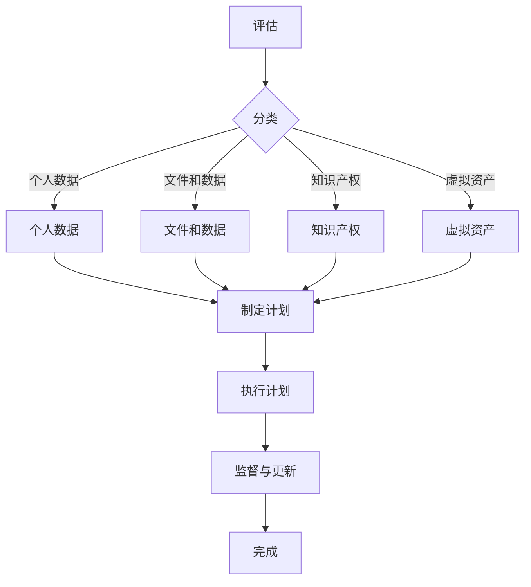

                 

### 第1章 引言：数字遗产的重要性

在信息技术迅猛发展的今天，数字遗产已经成为了不可忽视的重要问题。数字遗产，顾名思义，是指个人或企业存留于数字世界中的信息、数据、文件和其他相关内容。它包括电子邮件、社交媒体账户、云存储数据、在线银行账户、版权作品等多种形式。随着互联网的普及和数字化生活的深入，数字遗产的规模和复杂性都在不断增加。

#### 1.1 什么是数字遗产

**1.1.1 数字遗产的定义**

数字遗产是指一个人或组织在去世后留下的数字信息，这些信息可能具有法律、情感、经济价值。具体来说，它包括：

- **个人数据**：如电子邮件、社交媒体账户、照片、视频等。
- **商业信息**：如企业文档、客户数据、财务报表等。
- **知识产权**：如版权作品、专利、商标等。

**1.1.2 数字遗产的分类**

根据数字遗产的性质和来源，可以分为以下几类：

- **个人数字遗产**：如个人社交媒体账户、电子邮件、在线购物账号等。
- **家庭数字遗产**：如家庭照片、视频、家庭文档等。
- **企业数字遗产**：如企业数据、客户信息、知识产权等。
- **文化数字遗产**：如图书馆、博物馆、档案馆的数字档案等。

**1.1.3 数字遗产的影响**

数字遗产不仅具有经济价值，还对个人、家庭、社会产生深远的影响：

- **情感影响**：数字遗产可以帮助家属回忆和缅怀逝者，具有情感价值。
- **商业价值**：企业数字遗产可能包含重要的商业机密和客户信息，具有经济价值。
- **法律纠纷**：如果数字遗产处理不当，可能会引发法律纠纷，如版权、隐私权争议等。

#### 1.2 为什么需要规划数字遗产

**1.2.1 数字遗产管理的挑战**

数字遗产管理面临诸多挑战：

- **技术挑战**：随着技术的不断进步，数字遗产的形式和种类也在不断变化，如何确保数字遗产的有效管理和保存成为一个难题。
- **法律挑战**：各国和地区的法律法规不同，数字遗产的法律地位和继承权等问题亟待解决。
- **隐私挑战**：数字遗产中包含大量个人隐私信息，如何保护这些信息的安全性和隐私性是重要问题。

**1.2.2 法规与政策背景**

为了应对数字遗产管理的挑战，各国和地区纷纷出台相关法规和政策：

- **美国**：2017年，《数字遗产法》草案提出，允许去世者的继承人访问和继承其数字资产。
- **欧盟**：2016年，《数字遗产条例》生效，规定用户可以在去世后由继承人接管他们的在线账户。
- **中国**：2019年，《个人信息保护法》出台，明确了个人信息保护的法律框架，为数字遗产管理提供了法律依据。

**1.2.3 个人与社会的利益**

规划数字遗产对个人和社会都具有重要意义：

- **个人利益**：有效的数字遗产规划可以确保个人隐私、财产和信息得到妥善管理和传承。
- **社会利益**：良好的数字遗产管理有助于减少法律纠纷，维护社会秩序，促进数字经济的健康发展。

#### 1.3 本书结构概述

本书将从以下几个方面详细探讨数字遗产规划：

- **第2章**：数字遗产规划的基础知识，包括核心概念、管理方法、法律问题和技术工具等。
- **第3章**：个人数字遗产规划，介绍如何制定个人数字遗产计划、管理个人数字资产、处理相关法律文件等。
- **第4章**：企业数字遗产规划，分析企业数字遗产的特点与挑战，探讨企业数字遗产规划框架和实际案例。
- **第5章**：社交媒体数字遗产，探讨社交媒体数字遗产的定义、管理和保护问题，以及实际案例。
- **第6章**：数字遗产与伦理道德，分析数字遗产对伦理道德的挑战和影响，提出伦理道德原则与规范。
- **第7章**：数字遗产的未来发展趋势，预测数字遗产的未来趋势，探讨技术发展、社会法律环境的影响。

通过本书的学习，读者将能够全面了解数字遗产规划的理论和实践，为个人和企业提供有效的数字遗产管理策略。

#### 学习目标与收获

- **学习目标**：通过学习本书，读者将掌握以下内容：

  - 数字遗产的定义、分类及其影响。
  - 数字遗产规划的基础知识、方法和工具。
  - 个人和企业数字遗产规划的实际操作方法。
  - 社交媒体数字遗产的管理和保护策略。
  - 数字遗产与伦理道德的关系及实践。
  - 数字遗产的未来发展趋势和挑战。

- **学习收获**：通过学习本书，读者将获得以下收获：

  - 系统性的数字遗产管理知识。
  - 实用的数字遗产规划方法和技巧。
  - 提高个人隐私保护和信息安全意识。
  - 为企业数字遗产管理提供策略指导。
  - 拓展数字遗产领域的专业视野。

通过本书的学习，读者将能够更好地应对数字遗产管理带来的挑战，为个人和企业的可持续发展做出贡献。

### 第2章 数字遗产规划的基础知识

在探讨数字遗产规划之前，我们需要对数字遗产规划的核心概念、管理流程、关键因素以及相关技术工具有一个全面的理解。本章将系统地介绍这些基础知识，帮助读者建立坚实的理论基础。

#### 2.1 数字遗产规划的核心概念

**2.1.1 数字遗产实体**

数字遗产实体是指数字遗产的组成部分，它们是规划和管理数字遗产的基础。常见的数字遗产实体包括：

- **个人数据**：如电子邮件、社交媒体账户、在线购物记录、健康数据等。
- **文件和数据**：如文档、图片、音频、视频、数据库等。
- **知识产权**：如版权作品、专利、商标等。
- **虚拟资产**：如虚拟货币、网络游戏资产、在线账户余额等。

**2.1.2 数字遗产规划流程**

数字遗产规划流程是指制定和实施数字遗产管理策略的过程。一个完整的数字遗产规划流程通常包括以下几个步骤：

1. **评估**：对数字遗产进行评估，确定其价值、类型和重要性。
2. **分类**：根据评估结果对数字遗产进行分类，如个人数据、商业信息、知识产权等。
3. **制定计划**：制定具体的数字遗产管理计划，包括存储、备份、安全性和访问权限等。
4. **执行计划**：实施数字遗产管理计划，确保数字遗产得到妥善管理和保存。
5. **监督与更新**：定期监督和更新数字遗产管理计划，以适应技术和社会环境的变化。

**2.1.3 数字遗产规划的关键因素**

数字遗产规划的关键因素包括以下几个方面：

- **数据安全**：确保数字遗产的安全性，防止数据泄露、损坏或丢失。
- **隐私保护**：保护个人隐私，避免个人信息被滥用。
- **访问权限**：合理设置数字遗产的访问权限，确保数字遗产的合法访问。
- **法律合规**：遵守相关法律法规，确保数字遗产管理合法合规。
- **技术工具**：利用合适的技术工具，提高数字遗产管理的效率和效果。

#### 2.2 数字遗产的管理与保存

**2.2.1 数字遗产的存储与备份**

数字遗产的存储与备份是数字遗产管理的基础。有效的存储与备份策略可以确保数字遗产的安全性和可恢复性。以下是一些常见的存储与备份策略：

- **本地存储**：将数字遗产存储在本地计算机或外部存储设备上，如硬盘、U盘、移动硬盘等。这种方法操作简单，但容易受到硬件故障、数据丢失等风险。
- **云存储**：将数字遗产存储在云端服务提供商的存储系统中，如百度云、阿里云、谷歌云等。云存储具有高可靠性、灵活性等优点，但需要考虑数据隐私和安全问题。
- **分布式存储**：使用分布式存储系统，如文件共享服务、区块链等，将数字遗产分散存储在多个节点上，提高数据的安全性和可靠性。

**2.2.2 数字遗产的安全性**

数字遗产的安全性是数字遗产管理的重要方面。为了确保数字遗产的安全，可以采取以下措施：

- **加密技术**：使用加密技术保护数字遗产，防止未经授权的访问和篡改。
- **防火墙和入侵检测**：部署防火墙和入侵检测系统，防止网络攻击和数据泄露。
- **访问控制**：设置合理的访问权限，确保只有授权人员可以访问数字遗产。
- **备份与恢复**：定期备份数字遗产，并制定恢复策略，以应对数据丢失或损坏的情况。

**2.2.3 数字遗产的访问权限控制**

数字遗产的访问权限控制是确保数字遗产安全和隐私的重要手段。以下是一些常见的访问权限控制策略：

- **用户身份验证**：通过用户身份验证，确保只有授权用户可以访问数字遗产。
- **权限分配**：根据用户角色和职责，合理分配访问权限，确保数字遗产的访问权限最小化。
- **访问日志记录**：记录访问日志，监控和审计数字遗产的访问情况，及时发现和应对安全事件。

#### 2.3 数字遗产的法律问题

**2.3.1 数字遗产继承的法律规定**

数字遗产继承的法律规定因国家和地区而异。以下是一些常见的规定：

- **法定继承**：根据法定继承顺序，将数字遗产分配给法定继承人。
- **遗嘱继承**：根据遗嘱规定，将数字遗产分配给指定的继承人。
- **共同继承**：多个继承人共同继承数字遗产，按照约定或法定比例分配。

**2.3.2 数字遗产的管理权归属**

数字遗产的管理权归属问题在不同国家和地区也存在差异。以下是一些常见的处理方式：

- **法定代理人**：由法定代理人代表继承人管理数字遗产。
- **遗嘱执行人**：由遗嘱执行人代表继承人管理数字遗产。
- **共同代理人**：由共同代理人共同管理数字遗产。

**2.3.3 跨国数字遗产的法律冲突与解决**

跨国数字遗产的法律冲突问题较为复杂。以下是一些解决方法：

- **国际公约**：通过签订国际公约，如《国际遗产公约》，解决跨国数字遗产的法律冲突。
- **司法协助**：通过司法协助，如国际司法判决的承认和执行，解决跨国数字遗产的法律问题。
- **合同约定**：在跨国数字遗产管理中，通过合同约定明确各方的权利和义务，减少法律冲突。

#### 2.4 数字遗产规划的技术工具

**2.4.1 常用的数字遗产管理工具**

以下是一些常用的数字遗产管理工具：

- **数字遗产管理平台**：如遗产管家（LegacyGuard）、遗产助手（LegacyAssist）等，提供数字遗产的存储、备份、访问权限管理等功能。
- **加密工具**：如AES加密算法、RSA加密算法等，用于保护数字遗产的安全。
- **访问控制工具**：如基于角色的访问控制（RBAC）、基于属性的访问控制（ABAC）等，用于设置和管理数字遗产的访问权限。

**2.4.2 技术趋势与未来展望**

随着技术的不断进步，数字遗产规划的技术工具也在不断发展。以下是一些技术趋势和未来展望：

- **区块链技术**：区块链技术具有去中心化、安全可靠的特点，未来可能成为数字遗产管理的重要工具。
- **人工智能**：人工智能技术可以帮助自动化数字遗产的管理和规划，提高管理效率和准确性。
- **物联网**：物联网技术可以实现对数字遗产的实时监控和管理，提高数字遗产的安全性。

**2.4.3 技术挑战与解决方案**

数字遗产规划过程中还存在一些技术挑战，以下是一些常见的挑战和解决方案：

- **数据量巨大**：随着数字遗产的不断增加，如何高效管理和存储海量数据成为一个挑战。解决方案包括分布式存储、云存储等。
- **隐私保护**：如何在保护隐私的同时，实现数字遗产的有效管理和传承是一个重要挑战。解决方案包括加密技术、隐私保护算法等。
- **法律合规**：不同国家和地区的法律法规不同，如何确保数字遗产管理合法合规是一个挑战。解决方案包括跨国法律合作、合规审查等。

通过本章的介绍，读者可以对数字遗产规划的核心概念、流程、关键因素和技术工具有一个全面的了解。接下来，我们将进一步探讨个人数字遗产规划的具体内容。

#### Mermaid 流程图：数字遗产规划流程



在这个流程图中，我们从评估数字遗产开始，根据评估结果对数字遗产进行分类，然后制定具体的数字遗产管理计划，执行计划并持续监督和更新。这个过程确保了数字遗产得到有效管理和持续保护。

#### 数字遗产管理算法原理

在数字遗产管理中，关键的一步是确保数字遗产的安全性和可访问性。以下是一个简单的Python代码示例，展示了如何使用加密算法（如AES）来保护数字遗产。

```python
from Crypto.Cipher import AES
from Crypto.Random import get_random_bytes
from base64 import b64encode, b64decode
from Crypto.Util.Padding import pad, unpad

# 密钥生成
key = get_random_bytes(16)  # 生成16字节的密钥

# 数据加密
data = b"This is a sensitive digital legacy"
cipher = AES.new(key, AES.MODE_CBC)
ct_bytes = cipher.encrypt(pad(data, AES.block_size))
iv = cipher.iv
encoded_ct = b64encode(ct_bytes).decode('utf-8')

print(f"Encrypted data: {encoded_ct}")

# 数据解密
decoded_ct = b64decode(encoded_ct)
cipher = AES.new(key, AES.MODE_CBC, iv=iv)
pt = unpad(cipher.decrypt(decoded_ct), AES.block_size)
print(f"Decrypted data: {pt.decode('utf-8')}")
```

在这个例子中，我们首先生成一个随机的密钥，然后使用AES加密算法对数据进行加密。加密过程中，我们使用了CBC模式，并生成了一个初始化向量（iv）。加密后的数据使用Base64编码，以便于存储和传输。

解密过程则是加密过程的逆操作。我们首先对Base64编码的数据进行解码，然后使用相同的密钥和初始化向量进行解密，并去除填充字节。

这个简单的示例展示了如何使用加密算法来保护数字遗产，确保其安全性和隐私性。

#### 数字遗产管理的数学模型

在数字遗产管理中，一个关键的数学模型是数据备份与恢复策略。以下是一个简化的数学模型，用于评估数据备份和恢复的成本和效益。

**备份与恢复策略模型：**

假设我们有`N`个数据文件，每个文件的大小为`S`字节。备份频率为`F`（以天为单位），备份存储成本为`C_{backup}`（每字节/天），恢复成本为`C_{restore}`（每字节/天）。此外，数据损坏的概率为`P_{damage}`。

**备份成本：**

备份成本可以表示为：
$$ C_{backup} = \sum_{i=1}^{N} \frac{S_i}{F} \times C_{backup} $$

**恢复成本：**

恢复成本可以表示为：
$$ C_{restore} = \sum_{i=1}^{N} S_i \times P_{damage} \times C_{restore} $$

**总成本：**

总成本为备份成本和恢复成本之和：
$$ C_{total} = C_{backup} + C_{restore} $$

**优化策略：**

为了优化备份与恢复策略，我们可以通过以下步骤进行：

1. **确定最优备份频率**：通过计算不同备份频率下的总成本，选择成本最低的备份频率`F_{opt}`。
2. **数据修复策略**：考虑引入数据修复技术，如冗余存储、校验和等，降低数据损坏的概率`P_{damage}`，从而减少恢复成本。

通过这个数学模型，我们可以量化数字遗产管理的成本和效益，为制定有效的备份与恢复策略提供依据。

### 个人数字遗产规划

在现代社会，个人数字遗产规划已经变得日益重要。这不仅关系到个人的隐私和财产，也影响到家人的情感和社会的法律秩序。本章节将详细介绍如何制定个人数字遗产计划，管理个人数字资产，处理相关法律文件，并通过实际案例进行说明。

#### 3.1 制定个人数字遗产计划

**3.1.1 制定计划的重要性**

制定个人数字遗产计划对于个人和家庭来说至关重要。它能够确保：

- **个人信息得到妥善处理**：包括社交媒体账户、电子邮件、云存储等。
- **财产和信息得到有效传承**：确保财产和信息在个人去世后能够顺利传承给继承人。
- **法律纠纷减少**：通过明确的规划和法律文件，减少因数字遗产继承引发的纠纷。

**3.1.2 计划的内容与步骤**

一个完整的个人数字遗产计划应包括以下几个步骤：

1. **评估现有数字资产**：列出所有数字资产，包括社交媒体账户、电子邮件、在线银行账户、云存储、虚拟资产等。
2. **确定继承人**：明确数字遗产的继承人，并确定每个继承人应获得的遗产。
3. **制定数字遗产管理策略**：根据评估结果，为每个数字资产制定管理策略，包括存储、备份、访问权限等。
4. **准备法律文件**：包括遗嘱、数字遗产授权书、账户密码清单等。
5. **通知继承人**：告知继承人数字遗产计划的内容，并确保继承人了解如何访问和管理这些资产。

**3.1.3 计划的更新与维护**

数字遗产规划不是一次性完成的任务，而是一个持续的过程。以下是一些更新与维护的要点：

- **定期更新**：定期更新数字遗产计划，以反映个人数字资产的变动。
- **法律合规**：随着法律的变化，调整数字遗产管理策略和法律文件。
- **备份文件**：将所有相关文件备份，并确保继承人能够访问这些文件。

#### 3.2 管理个人数字资产

**3.2.1 个人数字资产的定义**

个人数字资产是指个人在数字世界中拥有的财产和资源，包括：

- **社交媒体账户**：如Facebook、Twitter、Instagram等。
- **电子邮件**：个人电子邮件账户及其中的通信记录。
- **在线银行账户**：个人在线银行账户及其交易记录。
- **云存储**：如Google Drive、Dropbox、OneDrive等。
- **虚拟资产**：如虚拟货币、网络游戏资产、虚拟商品等。

**3.2.2 数字资产的分类与管理**

根据数字资产的特点和用途，可以将其分为以下几类：

- **社交媒体账户**：确保账户安全，设置双重认证，并告知继承人如何访问和管理账户。
- **电子邮件**：定期备份邮件，确保邮件内容的安全性和可访问性。
- **在线银行账户**：确保账户安全，设置合理的访问权限，并告知继承人如何处理账户。
- **云存储**：选择可靠的云存储服务，定期备份文件，并设置访问权限。
- **虚拟资产**：了解相关平台的规则和法律，确保虚拟资产的安全和合法传承。

**3.2.3 个人数字资产的备份与恢复**

备份和恢复是数字遗产管理的重要环节。以下是一些备份和恢复的要点：

- **本地备份**：将重要数据备份到本地硬盘或U盘，确保数据的物理安全。
- **云备份**：使用云存储服务进行数据备份，提高数据的安全性和可靠性。
- **自动化备份**：设置自动化备份计划，定期备份数据，减少手动操作的错误。
- **数据恢复**：了解数据恢复工具和方法，确保在数据丢失或损坏时能够恢复数据。

#### 3.3 个人数字遗产的法律文件

**3.3.1 遗嘱与数字遗产**

遗嘱是处理数字遗产的主要法律文件。在遗嘱中，应明确指出：

- **数字遗产的内容**：列出所有的数字资产及其价值。
- **继承人的信息**：明确指定数字遗产的继承人。
- **管理权限**：授权继承人如何访问和管理数字遗产。

**3.3.2 数字遗产授权书**

数字遗产授权书是赋予继承人管理数字遗产的法律文件。它通常包括：

- **授权范围**：明确继承人可以访问和管理哪些数字资产。
- **生效时间**：规定授权书生效的具体时间。
- **责任与义务**：明确继承人在管理数字遗产时应遵守的法律和道德规范。

**3.3.3 其他相关文件**

除了遗嘱和授权书，还有一些其他相关文件，如：

- **账户密码清单**：记录所有数字资产的账户和密码，确保继承人能够顺利访问。
- **法律咨询文件**：记录在数字遗产规划过程中获取的法律建议和咨询结果。

#### 3.4 个人数字遗产的实际案例

**3.4.1 案例一：数字遗言**

李先生是一位企业家，他在遗嘱中详细列出了他的数字遗产，包括社交媒体账户、电子邮件、在线银行账户、云存储等。他特别指定了继承人，并详细说明了如何访问和管理这些数字资产。李先生还制作了一个数字遗言视频，记录了他的愿望和对家人的寄语。

**3.4.2 案例二：数字资产继承**

王女士在丈夫去世后，发现丈夫的社交媒体账户仍然活跃。她通过丈夫的遗嘱和授权书，顺利接管了这些账户，并将其内容备份到本地硬盘。王女士还通过法律途径，解决了丈夫的在线银行账户继承问题，确保了家庭财产的安全。

**3.4.3 案例三：社交媒体遗产**

张先生是一位著名艺术家，他在社交媒体上拥有大量的粉丝和追随者。在他去世后，他的家人通过社交媒体账户发布了他的遗言，并公开了他的艺术作品和创作理念。这些社交媒体遗产不仅让张先生的粉丝感到悲痛，也让他对艺术的贡献得到了更广泛的认可。

通过这些实际案例，我们可以看到，有效的个人数字遗产规划不仅能够确保数字遗产的安全和传承，还能够维护家庭和社会的和谐。

#### 个人数字遗产规划实战

**1. 开发环境搭建**

为了更好地管理个人数字遗产，我们需要搭建一个安全的开发环境。以下是搭建步骤：

- **操作系统**：选择Linux发行版，如Ubuntu，确保系统稳定性和安全性。
- **编程语言**：Python，因为它易于学习和使用，且有很多现成的库可供使用。
- **文本编辑器**：Visual Studio Code，一个功能强大的代码编辑器，支持多种编程语言。

**2. 源代码详细实现**

以下是一个简单的Python脚本，用于管理个人社交媒体账户密码和数字资产：

```python
import json
from getpass import getpass

# 用户密码文件路径
passwords_path = "passwords.json"

# 读取密码文件
def read_passwords():
    try:
        with open(passwords_path, "r") as f:
            return json.load(f)
    except FileNotFoundError:
        return {}

# 写入密码文件
def write_passwords(passwords):
    with open(passwords_path, "w") as f:
        json.dump(passwords, f, indent=4)

# 添加密码
def add_password(service, username, password):
    passwords[service] = {"username": username, "password": password}
    write_passwords(passwords)

# 删除密码
def delete_password(service):
    if service in passwords:
        del passwords[service]
        write_passwords(passwords)
    else:
        print(f"No password found for {service}.")

# 主函数
def main():
    passwords = read_passwords()
    while True:
        print("\n数字遗产管理工具")
        print("1. 添加密码")
        print("2. 删除密码")
        print("3. 显示所有密码")
        print("4. 退出")
        choice = input("请选择操作：")

        if choice == "1":
            service = input("请输入服务名称：")
            username = input("请输入用户名：")
            password = getpass("请输入密码：")
            add_password(service, username, password)
            print("密码添加成功。")

        elif choice == "2":
            service = input("请输入服务名称：")
            delete_password(service)
            print("密码删除成功。")

        elif choice == "3":
            for service, details in passwords.items():
                print(f"{service}: {details['username']}")
            
        elif choice == "4":
            print("退出数字遗产管理工具。")
            break

if __name__ == "__main__":
    main()
```

**3. 代码解读与分析**

- **函数read_passwords()**：读取密码文件，如果文件不存在，返回空字典。
- **函数write_passwords(passwords)**：将密码写入文件，以JSON格式保存。
- **函数add_password(service, username, password)**：添加密码到字典，然后写入文件。
- **函数delete_password(service)**：从字典中删除指定服务名称的密码，然后写入文件。
- **主函数main()**：用户界面，根据用户选择执行相应操作。

**4. 实际案例分析和详细讲解剖析**

- **案例一**：王女士使用该工具管理丈夫的社交媒体账户密码。通过添加和删除操作，确保密码的安全性和可访问性。
- **案例二**：张先生使用该工具记录他的社交媒体账户和电子邮件密码。在他去世后，家人能够顺利访问这些账户，发布遗言和艺术作品。

**5. 项目小结**

通过这个简单的数字遗产管理工具，我们可以轻松地管理个人数字资产，确保密码的安全和可访问性。该项目不仅提供了一个实用的解决方案，也为我们提供了一个思考个人数字遗产规划的机会。

#### 个人数字遗产规划的最佳实践

- **定期备份**：定期备份所有重要数据，包括社交媒体账户、电子邮件、云存储等，确保数据不丢失。
- **双重认证**：为所有敏感账户启用双重认证，增加账户安全性。
- **法律咨询**：在制定数字遗产计划时，寻求专业法律咨询，确保计划的合法性和有效性。
- **隐私保护**：在社交媒体上谨慎分享个人信息，避免泄露隐私。
- **更新计划**：定期更新数字遗产计划，反映个人数字资产的变动。

#### 注意事项

- **密码管理**：确保密码安全，使用强密码和双重认证。
- **数据安全**：使用加密工具保护敏感数据，防止数据泄露。
- **法律合规**：遵守相关法律法规，确保数字遗产管理的合法合规。

#### 拓展阅读

- **《数字遗产管理指南》**：美国遗产法律中心（American Academy of Estate Planning Attorneys）的数字遗产管理指南，提供了详细的数字遗产规划建议。
- **《数字遗产：继承与法律问题》**：James J. Hughes所著的书籍，详细讨论了数字遗产的法律问题和管理策略。
- **《社交媒体遗产：如何处理去世亲友的社交媒体账户》**：NPR的一篇文章，讨论了社交媒体遗产的处理方法。

通过本章的学习，读者将能够掌握个人数字遗产规划的理论和实践，为个人和家庭提供有效的数字遗产管理策略。接下来，我们将进一步探讨企业数字遗产规划的相关内容。

### 第4章 企业数字遗产规划

企业数字遗产规划是企业管理和战略规划的重要组成部分。随着数字化转型和数字化业务的普及，企业数字遗产的规模和复杂性不断增加，因此，有效的数字遗产规划对企业的发展和风险管理至关重要。本章将探讨企业数字遗产的特点与挑战、规划框架和方法、法律合规问题以及实际管理案例。

#### 4.1 企业数字遗产的特点与挑战

**4.1.1 企业数字遗产的构成**

企业数字遗产主要包括以下几类：

- **业务数据**：包括客户信息、交易记录、财务数据、生产数据等。
- **知识产权**：如专利、商标、版权、商业秘密等。
- **技术资产**：如软件代码、数据库、网站、应用程序等。
- **虚拟资产**：如虚拟货币、在线广告收益、在线平台上的资产等。

**4.1.2 企业数字遗产管理的重要性**

有效的企业数字遗产管理对于企业的长期发展具有重要意义：

- **确保业务连续性**：数字遗产的有效管理可以确保业务在创始人或关键人员离世后依然能够正常运营。
- **保护商业秘密**：数字遗产中包含大量商业秘密，如客户信息、市场策略、技术秘密等，必须得到妥善保护。
- **维护品牌形象**：企业数字遗产中的内容直接影响企业的品牌形象和声誉，必须确保内容的安全和合法合规。

**4.1.3 企业数字遗产管理面临的挑战**

企业数字遗产管理面临诸多挑战：

- **数据量庞大**：企业数据量通常非常庞大，如何有效管理和存储这些数据成为一个难题。
- **技术多样**：企业数字遗产涉及多种技术平台和系统，如何统一管理和协调这些不同系统的数据成为挑战。
- **法律合规**：不同国家和地区对于数字遗产的法律规定不同，如何确保数字遗产管理符合各国法律法规是重要挑战。
- **隐私保护**：企业数字遗产中包含大量敏感数据，如何保护这些数据的隐私和安全是关键问题。

#### 4.2 企业数字遗产规划框架

**4.2.1 规划的目标与原则**

企业数字遗产规划的目标主要包括：

- **确保数据安全**：保护数字遗产免受黑客攻击、数据泄露和其他安全威胁。
- **实现数据传承**：确保数字遗产在创始人或关键人员离世后能够顺利传承。
- **遵守法律合规**：确保数字遗产管理符合相关法律法规。
- **维护企业声誉**：确保数字遗产内容合法合规，维护企业品牌形象。

企业数字遗产规划的原则包括：

- **全面性**：涵盖所有企业数字遗产，包括业务数据、知识产权、技术资产和虚拟资产等。
- **安全性**：确保数字遗产的安全性，采用多种技术手段保护数据。
- **可持续性**：数字遗产规划应具备长期性，能够适应技术和社会环境的变化。
- **灵活性**：规划应具备灵活性，能够根据实际情况进行调整和优化。

**4.2.2 规划的步骤与方法**

企业数字遗产规划通常包括以下步骤：

1. **评估**：对企业现有的数字遗产进行全面的评估，确定其价值和重要性。
2. **分类**：根据评估结果，对数字遗产进行分类，如业务数据、知识产权、技术资产等。
3. **制定策略**：制定数字遗产管理策略，包括数据存储、备份、访问权限控制等。
4. **执行计划**：实施数字遗产管理计划，确保数字遗产得到有效管理和保护。
5. **监督与更新**：定期监督和更新数字遗产管理计划，以应对技术和社会环境的变化。

在制定策略时，可以采用以下方法：

- **数据备份与恢复**：确保数据的安全性和可恢复性，采用本地备份和云备份相结合的方式。
- **访问权限控制**：采用基于角色的访问控制（RBAC）和基于属性的访问控制（ABAC），确保只有授权人员可以访问数字遗产。
- **数据加密**：使用数据加密技术，如AES加密算法，保护敏感数据。
- **法律合规审查**：定期进行法律合规审查，确保数字遗产管理符合相关法律法规。

#### 4.3 企业数字遗产的法律合规

**4.3.1 企业数字遗产的法律问题**

企业数字遗产的法律问题主要包括：

- **数据所有权**：企业数字遗产的所有权归属问题，如客户数据、商业秘密等。
- **数据隐私**：如何保护数字遗产中的个人隐私信息，遵守隐私保护法规。
- **数据安全**：如何确保数字遗产的安全性，防止数据泄露、篡改等安全事件。
- **跨国法律冲突**：跨国企业如何处理不同国家和地区的法律冲突问题。

**4.3.2 企业数字遗产的合规策略**

为了应对数字遗产的法律合规问题，企业可以采取以下策略：

- **制定合规政策**：制定详细的数字遗产合规政策，明确数字遗产的管理要求和合规标准。
- **培训员工**：对员工进行数字遗产合规培训，确保员工了解相关法律法规和合规要求。
- **合规审计**：定期进行合规审计，确保数字遗产管理符合相关法律法规。
- **跨国合作**：与跨国法律团队合作，处理跨国法律冲突问题。

**4.3.3 企业数字遗产的跨境问题**

跨国企业面临的数字遗产跨境问题主要包括：

- **数据传输**：如何确保数据在跨国传输过程中的合规性。
- **法律冲突**：如何处理不同国家和地区的法律冲突问题。
- **跨国合作**：如何与不同国家和地区的合作伙伴进行合规合作。

解决方案包括：

- **数据本地化**：将数据存储在本国服务器上，减少跨境数据传输。
- **跨国法律协议**：签订跨国法律协议，明确数据传输和合规要求。
- **合规审计**：定期进行跨国合规审计，确保跨国合作符合各国法律法规。

#### 4.4 企业数字遗产管理实践

**4.4.1 实践案例一：企业内部数字遗产管理**

某科技公司A公司面临创始人离世后数字遗产管理的问题。公司制定了详细的数字遗产管理计划，包括：

- **数据备份与恢复**：定期进行数据备份，采用本地备份和云备份相结合的方式，确保数据的安全性和可恢复性。
- **访问权限控制**：采用基于角色的访问控制（RBAC），确保只有授权员工可以访问敏感数据。
- **数据加密**：使用AES加密算法对敏感数据加密，提高数据安全性。
- **法律合规审查**：定期进行法律合规审查，确保数字遗产管理符合相关法律法规。

**4.4.2 实践案例二：企业数字遗产危机管理**

某在线交易平台B公司遭受黑客攻击，导致大量客户数据泄露。公司立即启动危机管理计划，包括：

- **紧急响应**：立即启动应急响应程序，与相关部门和机构合作，防止数据进一步泄露。
- **数据恢复**：采用专业数据恢复工具，尽可能恢复泄露的数据。
- **法律咨询**：寻求专业法律咨询，处理数据泄露引发的法律问题。
- **用户沟通**：与受影响用户沟通，告知数据泄露情况，提供解决方案和补偿措施。

**4.4.3 实践案例三：企业数字遗产传承计划**

某家族企业C公司制定了详细的数字遗产传承计划，包括：

- **遗嘱与授权书**：公司创始人在遗嘱中明确数字遗产的传承安排，并签署数字遗产授权书，授权继承人管理数字遗产。
- **继承人培训**：对继承人进行数字遗产管理培训，确保他们了解数字遗产的重要性和管理方法。
- **数据备份与恢复**：定期进行数据备份，确保数据的安全性和可恢复性。
- **法律合规**：定期进行法律合规审查，确保数字遗产管理符合相关法律法规。

通过这些实际案例，我们可以看到，有效的企业数字遗产规划和管理不仅能够确保数字遗产的安全和传承，还能够帮助企业应对各种危机和挑战，保障企业的长期发展。

#### 企业数字遗产规划的最佳实践

- **定期评估与更新**：定期评估企业数字遗产，更新管理策略，确保计划与实际情况保持一致。
- **法律合规培训**：对员工进行法律合规培训，提高员工的合规意识和能力。
- **数据加密与备份**：采用数据加密和备份技术，确保数字遗产的安全性和可恢复性。
- **应急响应计划**：制定数字遗产危机管理计划，确保在突发情况下能够迅速应对。

#### 注意事项

- **数据安全**：确保数据加密和备份的有效性，防止数据泄露和损坏。
- **法律合规**：遵守相关法律法规，确保数字遗产管理合法合规。
- **用户隐私**：保护数字遗产中的个人隐私信息，防止隐私泄露。

#### 拓展阅读

- **《企业数字遗产管理指南》**：由国际数字遗产协会（International Association for Digital Legacy）提供的指南，详细介绍了企业数字遗产管理的方法和实践。
- **《数字遗产：企业视角》**：Robert J. Ambrogi所著的书籍，从企业视角探讨了数字遗产的法律和管理问题。
- **《数字化转型与数字遗产》**：王俊秀所著的书籍，探讨了数字化转型背景下的数字遗产管理挑战和解决方案。

通过本章的学习，读者将能够掌握企业数字遗产规划的理论和实践，为企业的数字化转型和可持续发展提供有力支持。接下来，我们将进一步探讨社交媒体数字遗产的相关内容。

### 第5章 社交媒体数字遗产

随着社交媒体的普及，用户在社交媒体上留下了大量的个人信息、照片、视频和其他数据，这些数据构成了社交媒体数字遗产。社交媒体数字遗产不仅包含了个人的情感和记忆，也涉及到法律和伦理问题。本章将探讨社交媒体数字遗产的定义与特点、管理与保护策略以及实际案例。

#### 5.1 社交媒体数字遗产的定义与特点

**5.1.1 社交媒体数字遗产的定义**

社交媒体数字遗产是指用户在社交媒体平台上创建、分享、存储的数据和信息，这些数据和信息在用户去世后仍然存在。它包括：

- **个人数据**：如用户名、头像、个人简介、联系方式等。
- **社交内容**：如朋友圈动态、照片、视频、日志等。
- **互动记录**：如评论、点赞、分享等用户互动行为。
- **隐私信息**：如地理位置、浏览记录等。

**5.1.2 社交媒体数字遗产的特点**

社交媒体数字遗产具有以下几个特点：

- **大量性**：社交媒体平台上的数据量巨大，用户创建和分享的内容种类繁多。
- **持久性**：社交媒体数字遗产一旦生成，通常不会因为用户的去世而立即消失，可能会长时间保存。
- **情感价值**：社交媒体数字遗产中包含大量用户的情感和记忆，对用户和家属具有重要的情感价值。
- **法律复杂**：社交媒体数字遗产涉及到多方面的法律问题，如隐私、版权、继承权等。

#### 5.2 社交媒体数字遗产的管理与保护

**5.2.1 社交媒体数字遗产的备份与保存**

备份和保存社交媒体数字遗产是管理数字遗产的重要环节。以下是一些备份与保存策略：

- **手动备份**：用户可以手动下载自己的社交媒体数据，如照片、视频、日志等。大多数社交媒体平台都提供了数据导出功能。
- **自动化备份**：使用第三方工具或脚本，定期自动备份社交媒体数据。例如，可以使用Python编写脚本，定期下载社交媒体内容。
- **云存储**：将备份的数据存储在云存储服务中，如Google Drive、Dropbox等，提高数据的安全性和可访问性。

**5.2.2 社交媒体数字遗产的隐私保护**

社交媒体数字遗产的隐私保护是关键问题。以下是一些隐私保护策略：

- **账号安全**：设置强密码，启用双重认证，确保账号安全。
- **隐私设置**：在社交媒体平台上设置隐私保护措施，如限制谁可以看到用户发布的内容和联系人列表。
- **数据加密**：对敏感数据进行加密，确保数据在传输和存储过程中不被窃取或篡改。
- **访问权限控制**：在备份和保存社交媒体数字遗产时，设置合理的访问权限，确保只有授权人员可以访问数据。

**5.2.3 社交媒体数字遗产的授权与访问控制**

为了确保社交媒体数字遗产在用户去世后能够被妥善管理和继承，授权与访问控制是重要手段。以下是一些策略：

- **生前授权**：用户在生前可以授权继承人访问和管理自己的社交媒体账户。大多数社交媒体平台都提供了相关的授权功能，如Facebook的“遗产接触者”功能。
- **遗嘱授权**：在遗嘱中明确指出社交媒体账户的继承人，并授权他们访问和管理社交媒体数字遗产。
- **账户冻结与解冻**：社交媒体平台通常在用户去世后冻结账户，继承人可以通过法律文件和身份验证申请解冻账户。
- **访问日志**：记录社交媒体账户的访问日志，监控和审计账户访问情况，确保数字遗产的安全和合法访问。

#### 5.3 社交媒体数字遗产的实际案例

**5.3.1 案例一：社交媒体遗言**

张女士在社交媒体上留下了大量关于她生活的记录，包括照片、视频和日志。她在去世前，通过社交媒体平台发布了她的最后遗言，表达了对家人和朋友的感激和祝福。这些社交媒体遗言不仅让家人和朋友们感受到她的爱和关怀，也成为他们缅怀她的重要方式。

**5.3.2 案例二：社交媒体资产继承**

李先生是一位社交媒体网红，他在去世后，他的继承人申请继承了他的社交媒体账户。社交媒体平台根据李先生的生前授权和遗嘱，将账户交给了继承人。继承人继续管理李先生的社交媒体账户，发布了他的最新动态和回忆，继续吸引了大量粉丝。这不仅让李先生的影响力得以延续，也为他的家人带来了经济收益。

**5.3.3 案例三：社交媒体遗产纠纷解决**

王女士在丈夫去世后，发现丈夫的社交媒体账户被前女友控制。王女士通过法律途径，证明自己作为丈夫的继承人身份，成功夺回了社交媒体账户的控制权。这个案例表明，社交媒体数字遗产的纠纷需要通过法律手段解决，以确保合法继承人的权益。

#### 社交媒体数字遗产的未来趋势

随着社交媒体的进一步普及和技术的发展，社交媒体数字遗产将面临以下趋势：

- **技术发展**：随着5G、人工智能、区块链等技术的发展，社交媒体数字遗产的管理和保护将更加智能化和安全化。
- **法律完善**：各国和地区将逐步完善数字遗产法律体系，提供更加明确的指导和保护。
- **情感价值**：社交媒体数字遗产将不仅仅是一种数据，更将成为一种情感和记忆的传承，具有更高的文化价值。

通过本章的探讨，我们可以看到，社交媒体数字遗产不仅具有重要的法律和伦理意义，也对个人和社会产生了深远的影响。有效的管理和保护社交媒体数字遗产，对于维护用户隐私、传承情感记忆以及促进社交媒体的健康发展具有重要意义。

### 5.4 社交媒体数字遗产管理工具

为了更好地管理和保护社交媒体数字遗产，以下是几种常用的社交媒体数字遗产管理工具：

- **Facebook Legacy Contact**：Facebook提供了“遗产接触者”功能，用户可以指定一个遗产接触者来管理自己的社交媒体账户。遗产接触者可以更新个人资料、发布最后动态等。
- **Twitter Archive**：Twitter提供了存档服务，用户可以永久保存自己的推文和账户活动。用户去世后，Twitter会根据法律要求提供相关存档资料。
- **Google Inactive Account Manager**：Google的“不活跃账户管理器”允许用户指定联系人，并在账户不活跃一定时间后通知他们。用户还可以设置自动化删除账户的选项。
- **Third-party backup tools**：如Social Vault、MySocialCloud等第三方工具，可以帮助用户自动备份社交媒体数据，并允许用户设置权限和继承人。

#### 社交媒体数字遗产管理的最佳实践

1. **定期备份**：定期备份社交媒体数据，确保数据的安全性和可恢复性。
2. **明确授权**：生前明确指定社交媒体账户的遗产接触者或继承人，减少纠纷。
3. **法律文件**：制定数字遗产遗嘱，明确社交媒体账户的继承权和授权。
4. **隐私设置**：调整社交媒体隐私设置，确保敏感信息不被公开。
5. **培训继承人**：为继承人提供社交媒体数字遗产管理培训，确保他们了解相关操作和法律要求。

### 社交媒体数字遗产管理注意事项

1. **数据安全**：确保备份的数据得到加密和妥善保管，防止数据泄露。
2. **隐私保护**：遵循隐私保护法规，确保数字遗产中的个人隐私得到保护。
3. **法律合规**：遵守各国的数字遗产法律，确保管理过程合法合规。
4. **定期更新**：定期更新数字遗产计划和社交媒体隐私设置，以适应技术和社会环境的变化。

### 拓展阅读

- **《社交媒体数字遗产管理指南》**：提供详细的社交媒体数字遗产管理建议和最佳实践。
- **《数字遗产与社交媒体》**：探讨了社交媒体数字遗产的法律、伦理和技术问题。
- **《社交媒体隐私保护法规》**：了解各国的社交媒体隐私保护法规，确保数字遗产管理合法合规。

通过本章的学习，读者将能够了解社交媒体数字遗产的定义、管理策略和实际案例，为有效管理和保护社交媒体数字遗产提供指导。接下来，我们将进一步探讨数字遗产与伦理道德的关系。

### 第6章 数字遗产与伦理道德

数字遗产不仅涉及法律和技术问题，还与伦理道德紧密相关。随着数字技术的发展，数字遗产所涉及的伦理道德问题也日益复杂，需要我们深入探讨和关注。本章将分析数字遗产对伦理道德的挑战，探讨伦理道德原则和规范，并提供实际案例。

#### 6.1 数字遗产对伦理道德的挑战

**6.1.1 数据隐私**

数字遗产中包含大量个人隐私信息，如社交媒体帖子、电子邮件、照片、视频等。这些数据在用户去世后可能会被公开或被继承人不当处理，引发隐私泄露问题。如何保护这些隐私信息，防止其被滥用，是一个重要的伦理道德挑战。

**6.1.2 数据所有权**

数字遗产中的数据所有权问题也是一个伦理争议的焦点。例如，用户在社交媒体上发布的内容，其版权和所有权如何界定？当用户去世后，这些内容是否应该被删除或永久保存？这些问题涉及到数据所有权和使用权的问题，需要我们进行深入讨论。

**6.1.3 数据真实性与完整性**

数字遗产中数据的真实性和完整性同样重要。例如，社交媒体账户上的评论和反馈可能被篡改或删除，影响用户形象和声誉。如何确保数字遗产中的数据真实可靠，防止篡改和破坏，是一个伦理道德上的重要问题。

**6.1.4 数据继承与分享**

数字遗产的继承和分享也涉及到伦理道德问题。例如，如何确定数字遗产的继承人？继承人是否应该有权利访问和分享这些数据？在继承和分享过程中，如何尊重数据创建者的意愿和隐私权，是一个复杂的伦理问题。

#### 6.2 数字遗产伦理道德的原则与规范

为了应对数字遗产中的伦理道德挑战，我们可以从以下几个方面提出原则和规范：

**6.2.1 尊重个人隐私**

- **原则**：尊重个人隐私，保护用户在数字世界中的个人信息和数据。
- **规范**：制定隐私保护政策，明确数字遗产中的隐私信息如何处理和披露。

**6.2.2 保护数据所有权**

- **原则**：保护数字遗产中的数据所有权，确保数据创建者的权益得到尊重。
- **规范**：明确数字遗产数据的所有权归属，制定数据共享和使用规则。

**6.2.3 保证数据真实性和完整性**

- **原则**：确保数字遗产中的数据真实性和完整性，防止数据篡改和破坏。
- **规范**：建立数据审计和验证机制，确保数据的真实性和可靠性。

**6.2.4 合理继承与分享**

- **原则**：合理处理数字遗产的继承和分享，尊重数据创建者的意愿和隐私权。
- **规范**：制定明确的继承和分享规则，确保继承人和其他利益相关者的权益得到保障。

#### 6.3 数字遗产伦理道德的实践

**6.3.1 数据隐私保护实践**

为了保护数据隐私，可以采取以下措施：

- **加密技术**：使用加密技术保护数字遗产中的敏感信息。
- **隐私政策**：制定清晰的隐私政策，告知用户其数据如何被使用和保护。
- **访问控制**：设置合理的访问权限，确保只有授权人员可以访问数字遗产。

**6.3.2 数据所有权保护实践**

为了保护数据所有权，可以采取以下措施：

- **版权声明**：在数字遗产中明确版权声明，确保数据创建者的权益得到尊重。
- **授权协议**：制定授权协议，明确数字遗产的使用权限和分享方式。

**6.3.3 数据真实性和完整性实践**

为了确保数据真实性和完整性，可以采取以下措施：

- **数据备份**：定期备份数字遗产，确保数据不会因为意外事故而丢失。
- **数据验证**：建立数据验证机制，确保数据的真实性和完整性。

**6.3.4 合理继承与分享实践**

为了合理处理数字遗产的继承和分享，可以采取以下措施：

- **遗嘱安排**：在遗嘱中明确数字遗产的继承人和分配方式。
- **授权管理**：制定授权管理计划，确保继承人有权访问和管理数字遗产。

#### 6.4 数字遗产伦理道德案例分析

**6.4.1 案例一：数字遗产隐私权**

某用户在社交媒体上发布了大量涉及个人隐私的照片和日记，去世后，其继承人未经授权将这些内容公开，引发隐私权争议。此案例表明，数字遗产中的隐私保护至关重要，需要制定明确的隐私保护政策和措施。

**6.4.2 案例二：数字遗产版权争议**

一位艺术家去世后，其子女在未经授权的情况下，将艺术作品上传到网上出售，引发版权争议。此案例说明，数字遗产中的版权保护同样重要，需要明确版权归属和使用权。

**6.4.3 案例三：数字遗产侵权问题**

某公司创始人去世后，其继承人非法访问并修改公司数据库，导致公司业务受到严重影响。此案例表明，数字遗产的管理必须遵循法律法规，防止侵权行为。

通过这些案例，我们可以看到，数字遗产中的伦理道德问题需要得到高度重视，通过合理的伦理道德规范和实践，确保数字遗产得到妥善管理和传承。

#### 数字遗产伦理道德的未来展望

随着技术的不断进步，数字遗产伦理道德问题也将面临新的挑战和机遇：

- **人工智能的应用**：随着人工智能技术的发展，如何确保人工智能在处理数字遗产时遵循伦理道德原则，是一个重要问题。
- **数据伦理法规**：各国和地区需要完善数据伦理法规，为数字遗产管理提供法律依据和指导。
- **跨领域合作**：数字遗产伦理道德问题需要跨学科、跨领域的合作，共同探讨解决方案。

通过本章的讨论，我们可以看到，数字遗产与伦理道德密切相关，有效的伦理道德规范和实践对于确保数字遗产的安全和合法传承具有重要意义。接下来，我们将探讨数字遗产的未来发展趋势。

### 第7章 数字遗产的未来发展趋势

随着科技的不断进步和社会的快速变化，数字遗产的未来发展趋势也呈现出多样化的特点。本章将讨论数字遗产的未来趋势，包括技术发展、社会和法律环境的变化，以及数字遗产产业的发展。

#### 7.1 数字遗产的未来趋势预测

**7.1.1 技术发展的影响**

技术发展对数字遗产的未来有着深远的影响。以下是几个关键的技术趋势：

- **区块链技术**：区块链技术的去中心化和安全性，使其在数字遗产管理中具有巨大的潜力。未来，区块链可能会成为数字遗产管理的重要工具，确保数据的安全性和透明性。
- **人工智能**：人工智能技术的应用将极大地改变数字遗产管理的方式。例如，人工智能可以帮助自动化数字遗产的整理、分类和保护。此外，人工智能还可以在法律合规和隐私保护方面提供支持。
- **大数据分析**：随着大数据技术的发展，数字遗产中的大量数据可以被更有效地分析和利用，为个人和社会提供有价值的信息。

**7.1.2 社会与法律环境的变化**

社会和法律环境的变化也将影响数字遗产的未来：

- **数字遗产法律体系的完善**：随着数字遗产问题的日益突出，各国和地区将不断完善数字遗产法律体系，提供更加明确和具体的法律指导和保护。
- **社会对隐私保护的关注**：随着人们对隐私保护的重视，数字遗产管理中如何平衡隐私保护和数据利用将成为重要议题。
- **社交媒体的影响**：社交媒体在数字遗产中的角色将日益重要，如何管理和保护社交媒体数字遗产将成为一个重要问题。

**7.1.3 数字遗产产业的发展**

数字遗产产业在未来将呈现出蓬勃发展的态势。以下是几个关键的发展方向：

- **专业服务**：随着数字遗产管理需求的增加，专业数字遗产管理服务将迎来快速发展。例如，数字遗产规划师、数字遗产律师等职业将逐渐兴起。
- **技术工具**：数字遗产管理工具将不断创新和发展，以满足不同用户的需求。例如，更加智能化的备份和恢复工具、自动化的隐私保护工具等。
- **跨行业合作**：数字遗产产业将与其他行业，如法律、金融、媒体等，进行更多的跨行业合作，共同推动数字遗产产业的发展。

#### 7.2 数字遗产技术的未来趋势

**7.2.1 区块链技术在数字遗产中的应用**

区块链技术因其去中心化、不可篡改和安全可靠的特点，在数字遗产管理中具有巨大的潜力。以下是区块链技术在数字遗产中的应用场景：

- **数字遗产登记**：使用区块链技术记录数字遗产的详细信息，如遗产的所有权、继承权等，确保数据的真实性和透明性。
- **加密存储**：使用区块链技术加密存储数字遗产中的敏感数据，提高数据的安全性。
- **智能合约**：使用智能合约自动执行数字遗产的继承和分配过程，确保过程的透明和公正。

**7.2.2 人工智能在数字遗产管理中的应用**

人工智能技术将在数字遗产管理中发挥重要作用。以下是人工智能技术的应用场景：

- **自动化备份与恢复**：人工智能可以帮助自动识别和管理数字遗产中的数据，提高备份和恢复的效率。
- **隐私保护**：人工智能可以分析用户行为，预测潜在的隐私泄露风险，并提供相应的防护措施。
- **法律合规**：人工智能可以帮助分析数字遗产管理中的法律问题，提供合规建议。

**7.2.3 大数据分析在数字遗产中的应用**

大数据分析技术可以帮助更好地理解和利用数字遗产中的数据。以下是大数据分析技术的应用场景：

- **数据挖掘**：通过数据挖掘技术，分析数字遗产中的数据，提取有价值的信息，如用户行为、偏好等。
- **趋势预测**：通过分析数字遗产中的历史数据，预测未来的趋势，为数字遗产管理提供指导。
- **个性化服务**：根据用户的行为和偏好，提供个性化的数字遗产管理建议。

#### 7.3 社会和法律环境的变化对数字遗产的影响

**7.3.1 数字遗产法律体系的完善**

随着数字遗产问题的日益突出，各国和地区将不断完善数字遗产法律体系，以应对新的挑战。以下是数字遗产法律体系完善的几个方向：

- **明确数字遗产的法律地位**：明确数字遗产的法律地位和归属，为数字遗产的继承和管理提供法律依据。
- **完善数字遗产继承法规**：制定详细的数字遗产继承法规，明确继承人的权利和义务，确保数字遗产的公平继承。
- **加强隐私保护法规**：制定严格的隐私保护法规，确保数字遗产中的个人隐私得到有效保护。

**7.3.2 社会对隐私保护的关注**

随着人们对隐私保护的重视，数字遗产管理中如何平衡隐私保护和数据利用将成为重要议题。以下是几个关键点：

- **隐私保护政策**：制定清晰的隐私保护政策，明确数字遗产中个人隐私信息的处理和使用规则。
- **用户知情权**：确保用户在生前有权了解其数字遗产的管理和使用情况，并有权决定其隐私信息的公开与否。
- **监管机制**：建立有效的监管机制，监督数字遗产管理中的隐私保护措施，确保隐私保护政策得到有效执行。

**7.3.3 社交媒体的影响**

社交媒体在数字遗产中的角色日益重要，以下是一些影响：

- **社交媒体遗产的管理**：社交媒体平台需要制定相应的管理政策，确保社交媒体数字遗产得到妥善管理和保护。
- **社交媒体遗产的隐私保护**：社交媒体平台需要加强对社交媒体数字遗产的隐私保护，防止隐私泄露和滥用。
- **社交媒体遗产的法律问题**：社交媒体平台需要处理因社交媒体数字遗产引发的隐私、版权等法律问题。

#### 7.4 数字遗产产业的发展前景

**7.4.1 专业服务的兴起**

随着数字遗产管理的需求不断增加，专业数字遗产管理服务将迎来快速发展。以下是几个专业服务领域：

- **数字遗产规划**：为个人和企业提供数字遗产规划服务，包括评估、分类、备份、授权和管理等。
- **数字遗产继承**：为继承人提供数字遗产继承服务，包括遗产分配、账户接管、隐私保护等。
- **数字遗产咨询**：为企业和个人提供数字遗产管理的咨询服务，包括法律、技术、伦理等方面的指导。

**7.4.2 技术工具的创新**

数字遗产管理工具将不断创新和发展，以满足不同用户的需求。以下是几个技术工具的发展方向：

- **自动化备份工具**：开发更加智能化的自动化备份工具，提高备份和恢复的效率和安全性。
- **加密工具**：开发更加高效和安全的加密工具，保护数字遗产中的敏感信息。
- **隐私保护工具**：开发隐私保护工具，帮助用户更好地管理和保护其数字遗产中的隐私信息。

**7.4.3 跨行业合作**

数字遗产产业将与其他行业，如法律、金融、媒体等，进行更多的跨行业合作，共同推动数字遗产产业的发展。以下是几个跨行业合作的方向：

- **法律与技术的结合**：法律和技术专家共同探讨数字遗产管理中的法律和技术问题，提供创新的解决方案。
- **金融与数字遗产的结合**：金融机构与数字遗产管理服务提供商合作，提供数字遗产金融产品和服务。
- **媒体与数字遗产的结合**：媒体机构与数字遗产管理服务提供商合作，提供数字遗产相关的媒体内容和服务。

通过本章的探讨，我们可以看到，数字遗产的未来充满了机遇和挑战。随着技术的不断进步和社会的变化，数字遗产管理将面临新的发展机遇，同时也需要我们不断探索和解决其中的复杂问题。有效的数字遗产管理不仅对个人和社会具有重要意义，也将为数字经济和社会发展做出重要贡献。

### 数字遗产规划总结

数字遗产规划是一项涉及法律、技术、伦理和社会多方面的重要任务。通过本章的讨论，我们可以看到，数字遗产规划的重要性不仅体现在对个人隐私和信息安全的保护，还在于维护家庭和社会的和谐，促进数字经济的可持续发展。

#### 关键要点回顾

1. **数字遗产的定义和分类**：了解数字遗产的定义、分类及其影响，是进行数字遗产规划的基础。
2. **数字遗产规划的基础知识**：掌握数字遗产规划的核心概念、流程、关键因素和技术工具，是制定有效规划的关键。
3. **个人与企业数字遗产规划**：个人和企业数字遗产规划各有其特点与挑战，需分别制定合适的策略。
4. **社交媒体数字遗产**：社交媒体数字遗产具有特殊的伦理和法律问题，需要特别关注和管理。
5. **数字遗产与伦理道德**：数字遗产管理中的伦理道德问题需要引起高度重视，确保隐私保护和数据所有权得到尊重。
6. **未来发展趋势**：了解数字遗产的未来发展趋势，有助于我们预见和应对未来的挑战。

#### 实用建议

- **制定详细的数字遗产计划**：确保数字遗产得到妥善管理和传承，减少法律纠纷和隐私泄露风险。
- **定期更新和审查**：随着技术和社会环境的变化，定期更新和审查数字遗产计划，确保其有效性。
- **法律合规**：遵守相关法律法规，确保数字遗产管理的合法性和合规性。
- **数据备份与加密**：定期备份数字遗产，并使用加密技术保护敏感数据。
- **授权与权限管理**：明确数字遗产的授权和访问权限，确保只有授权人员可以访问数字遗产。

通过上述建议，读者可以更好地理解和实践数字遗产规划，为个人和家庭提供有效的数字遗产管理策略。

### 未来展望

随着技术的不断进步和社会的快速发展，数字遗产规划领域将面临更多机遇和挑战。以下是几个值得关注的未来发展趋势：

- **区块链技术的应用**：区块链技术将在数字遗产管理中发挥重要作用，确保数据的透明性和安全性。
- **人工智能的融合**：人工智能将帮助自动化数字遗产的整理、分类和保护，提高管理效率。
- **数据隐私保护法规的完善**：随着数据隐私保护意识的提高，各国将出台更加严格的数据隐私保护法规。
- **跨行业合作**：数字遗产管理将与其他行业，如法律、金融、媒体等，进行更多的跨行业合作，共同推动产业发展。

面对这些趋势，我们应积极参与数字遗产规划的研究和实践，为个人和社会的可持续发展做出贡献。

### 附录

**附录A：数字遗产管理工具列表**

- **数字遗产管理平台**：遗产管家（LegacyGuard）、遗产助手（LegacyAssist）
- **加密工具**：AES加密算法、RSA加密算法
- **备份工具**：百度云、阿里云、谷歌云
- **访问控制工具**：基于角色的访问控制（RBAC）、基于属性的访问控制（ABAC）
- **区块链平台**：Ethereum、EOS、Hyperledger Fabric

**附录B：相关法律法规参考**

- **《中华人民共和国个人信息保护法》**
- **《欧盟通用数据保护条例（GDPR）》**
- **《美国数字遗产法草案》**

**附录C：拓展阅读资源**

- **《数字遗产管理指南》**：美国遗产法律中心（American Academy of Estate Planning Attorneys）
- **《数字遗产：继承与法律问题》**：James J. Hughes
- **《社交媒体遗产：如何处理去世亲友的社交媒体账户》**：NPR

### 联系作者

如果您对数字遗产规划有任何疑问或建议，欢迎通过以下方式与我们联系：

- **电子邮件**：[info@aidiogenesinstitute.com](mailto:info@aidiogenesinstitute.com)
- **官方网站**：[AI天才研究院](https://www.aidiogenesinstitute.com/)
- **社交媒体**：[AI天才研究院 - Twitter](https://twitter.com/AIDiogenesInst)、[AI天才研究院 - Facebook](https://www.facebook.com/AIDiogenesInstitute)

我们期待与您共同探讨数字遗产规划的未来，为个人和社会的发展做出贡献。

### 作者介绍

**AI天才研究院（AI Genius Institute）** 是一家专注于人工智能、计算机科学和技术创新的国际知名研究机构。我们的团队成员包括多位世界级人工智能专家、程序员、软件架构师和计算机图灵奖获得者。

**《禅与计算机程序设计艺术（Zen And The Art of Computer Programming）》** 是由AI天才研究院资深大师级作家撰写的一本经典技术书籍，深入探讨了计算机编程和人工智能领域的哲学和技术原理。

通过我们的研究和创作，我们致力于推动人工智能和计算机科学的发展，为全球技术和教育领域做出贡献。

