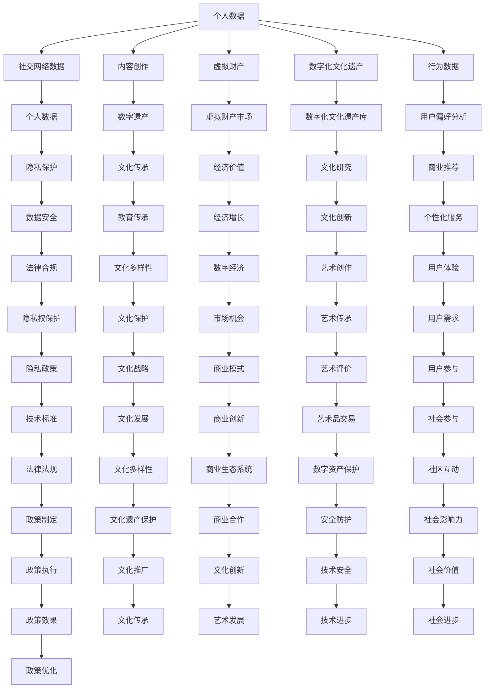

                 

## 《数字遗产：我们在线生活的意义与影响》

### 关键词

- 数字遗产
- 在线生活
- 意义与影响
- 个人隐私
- 社会文化
- 经济价值

### 摘要

随着互联网和数字技术的迅猛发展，我们的在线生活已成为生活的重要组成部分。数字遗产，即个人在线生活的痕迹和成果，正日益引起广泛关注。本文将深入探讨数字遗产的概念、构成及其对个人和社会的深远影响，同时分析其在管理、保护与未来发展中的挑战与机遇。

---

## 第一部分：数字遗产的概念与背景

### 1.1 数字遗产的定义与起源

数字遗产，指的是个人或集体在数字世界中所创造和积累的各类数字资源，包括但不限于数据、内容、虚拟资产等。它源于20世纪末互联网的普及，随着在线社交、电子商务和数字娱乐等活动的兴起，数字遗产逐渐成为人们生活不可或缺的一部分。

### 1.2 数字遗产的发展历程

数字遗产的发展历程可追溯到电子邮件和论坛的出现。随着时间的推移，博客、社交媒体、虚拟现实和区块链等新技术的应用，使得数字遗产的形式和内涵不断丰富。如今，数字遗产已经不仅仅是个人记忆的载体，更是文化传承和经济发展的重要资源。

### 1.3 数字遗产的全球现状

全球范围内，数字遗产的管理和保护已成为一个热点话题。欧美等发达国家在法律、技术和管理方面都取得了显著进展，而发展中国家则在逐步跟进。尽管各国对数字遗产的管理策略有所不同，但共同的目标是确保数字遗产的安全和可持续发展。

---

## 第二部分：在线生活的演变

### 2.1 在线生活的崛起

在线生活的崛起是数字遗产产生的重要背景。随着互联网的普及，人们的工作、学习、娱乐和社交等生活场景逐渐转移到线上。这不仅改变了我们的生活方式，也为数字遗产的形成提供了基础。

#### 2.1.1 互联网的发展

互联网的快速发展为在线生活提供了技术支撑。从拨号上网到宽带接入，再到如今的5G网络，互联网的每一次升级都为在线生活带来了新的可能性。

#### 2.1.2 社交媒体的兴起

社交媒体的兴起使得在线生活变得更加丰富多彩。用户通过社交媒体平台分享生活、交流和获取信息，形成了一个庞大的数字社区。

#### 2.1.3 数字经济的崛起

数字经济的崛起为在线生活注入了新的活力。电子商务、在线支付、数字货币等数字技术的应用，使得在线生活成为经济发展的新引擎。

---

## 第三部分：数字遗产的构成与影响

### 3.1 数字遗产的构成要素

数字遗产的构成要素主要包括数据遗产、内容遗产和虚拟资产。

#### 3.1.1 数据遗产

数据遗产是指个人在在线生活中产生的各种数据，如社交媒体上的日志、评论、私信等。这些数据记录了用户的行为和偏好，对个人隐私和社会文化传承具有重要意义。

#### 3.1.2 内容遗产

内容遗产是指个人在在线生活中创作的各类内容，如博客文章、图片、视频等。这些内容不仅丰富了网络文化，也为后人提供了宝贵的文化遗产。

#### 3.1.3 虚拟资产

虚拟资产是指个人在数字世界中拥有的各类虚拟财产，如游戏装备、虚拟货币等。随着数字经济的快速发展，虚拟资产的价值日益凸显。

### 3.2 数字遗产对个人和社会的影响

数字遗产对个人和社会的影响是多方面的。

#### 3.2.1 个人隐私保护

数字遗产涉及大量的个人隐私信息，如何保护这些信息成为一大挑战。隐私保护技术如数据加密、匿名化等手段需要不断优化。

#### 3.2.2 社会文化传承

数字遗产为文化传承提供了新的途径。通过数字化的手段，文化遗产得以更广泛地传播和保存，为后人提供丰富的文化资源。

#### 3.2.3 经济价值创造

数字遗产蕴含着巨大的经济价值。通过对数字遗产的管理和利用，可以创造出新的商业模式和就业机会，促进经济发展。

---

## 第四部分：数字遗产的管理与保护

### 4.1 数字遗产管理的挑战

数字遗产管理面临多方面的挑战。

#### 4.1.1 技术挑战

数字遗产的技术挑战主要体现在数据存储、管理和保护等方面。随着数据量的急剧增长，如何高效地管理和保护数字遗产成为一大难题。

#### 4.1.2 法律挑战

数字遗产的法律挑战主要体现在隐私保护、知识产权等方面。如何制定合理的法律法规，平衡个人隐私和公共利益，是一个亟待解决的问题。

#### 4.1.3 道德挑战

数字遗产的道德挑战主要体现在个人隐私、财产权等方面。如何在尊重个人隐私的同时，合理利用数字遗产，是一个需要深入探讨的课题。

### 4.2 数字遗产管理的策略

为应对数字遗产管理的挑战，需要采取一系列策略。

#### 4.2.1 政策制定

政府应制定合理的数字遗产管理政策，明确数字遗产的法律地位和保护范围，为数字遗产的管理提供法律依据。

#### 4.2.2 技术创新

技术创新是数字遗产管理的重要驱动力。通过研发新的数据存储、管理和保护技术，可以提高数字遗产管理的效率和质量。

#### 4.2.3 社会参与

社会参与是数字遗产管理的重要保障。政府、企业和个人应共同努力，形成合力，共同推动数字遗产的可持续发展。

---

## 第五部分：未来展望

### 5.1 数字遗产的未来趋势

未来，数字遗产将继续快速发展，其在个人和社会生活中的地位将日益重要。以下是数字遗产的未来趋势：

#### 5.1.1 技术革新

随着人工智能、区块链等新技术的应用，数字遗产的管理、保护和利用将更加智能化、高效化。

#### 5.1.2 法律框架完善

全球范围内的数字遗产法律框架将不断完善，为数字遗产的管理提供更加坚实的法律基础。

#### 5.1.3 社会文化适应

社会文化将逐渐适应数字遗产的存在和发展，数字遗产将成为文化传承和创新发展的重要资源。

### 5.2 数字遗产对社会的影响

数字遗产将对社会产生深远影响，主要体现在以下几个方面：

#### 5.2.1 经济发展

数字遗产将成为新的经济增长点，带动相关产业的发展，为经济发展注入新的活力。

#### 5.2.2 文化传承

数字遗产将促进文化传承和创新，为后人提供丰富的文化资源，推动文化繁荣。

#### 5.2.3 社会变革

数字遗产将推动社会变革，改变人们的生产、生活和思维方式，促进社会进步。

---

## 结语

数字遗产是我们在在线生活中的重要财富，对个人和社会都具有重要价值。面对数字遗产的管理与保护挑战，我们需要不断创新、完善法律法规，加强社会参与，共同推动数字遗产的可持续发展。只有这样，我们才能更好地继承和发扬数字遗产，为未来社会的发展做出贡献。

---

### 作者

**作者：AI天才研究院/AI Genius Institute & 禅与计算机程序设计艺术 /Zen And The Art of Computer Programming**

---

本文对数字遗产的概念、构成、影响以及管理与保护进行了深入探讨，旨在为读者提供一个全面了解数字遗产的视角。在未来的发展中，数字遗产将发挥更加重要的作用，为个人和社会带来无尽的可能。

## 摘要

数字遗产，作为我们在线生活的记录和延伸，已经成为现代社会不可或缺的一部分。本文从定义、背景、构成、影响、管理等多个维度对数字遗产进行了全面剖析。我们探讨了数字遗产的发展历程，分析了其在个人隐私保护、社会文化传承和经济价值创造方面的深远影响。同时，我们也面对了数字遗产管理中的技术、法律和道德挑战，并提出了相应的策略。展望未来，数字遗产将继续快速发展，成为社会变革的新动力。希望本文能够为读者提供一个深入理解和思考数字遗产的视角。

## 第一章：数字遗产的概念与背景

### 1.1 数字遗产的定义与起源

数字遗产（Digital Heritage）是指个人或集体在数字世界中创造和积累的各类数字资源，这些资源反映了个体和群体的在线行为、社交互动、内容创作和文化传承。数字遗产的定义可以追溯到20世纪末，随着互联网的兴起，人们开始意识到在线活动产生的数据和信息具有一定的持久性和历史价值。最初的数字遗产形式主要是电子邮件、论坛帖子、个人网页等，这些数字痕迹随着时间的积累，逐渐形成了庞大的数字遗产库。

### 1.2 数字遗产的发展历程

数字遗产的发展历程与互联网技术的发展密切相关。在互联网初期，数字遗产主要以文本和数据的形式存在，如电子邮件、网页和论坛帖子。随着社交媒体的兴起，博客、微博、图片和视频分享平台等成为数字遗产的重要组成部分。近年来，随着虚拟现实（VR）和增强现实（AR）技术的发展，数字遗产的形式和内容变得更加多样和丰富。例如，虚拟现实中的个人虚拟形象、虚拟财产，以及通过区块链技术记录的数字艺术品等，都成为了数字遗产的新形式。

### 1.3 数字遗产的全球现状

全球范围内，数字遗产的管理和保护已成为一个重要的议题。发达国家在数字遗产管理方面较早开展了研究和实践，如美国、欧盟和日本等。这些国家制定了相应的法律法规，建立了数字遗产保护机构，并通过技术手段对数字遗产进行长期保存和利用。例如，美国国家档案和记录管理局（NARA）负责保存政府机构的数字档案，欧盟的数字遗产计划则旨在保护和推广欧洲的数字文化遗产。

相比之下，发展中国家在数字遗产管理方面起步较晚，但近年来也逐步认识到数字遗产的重要性。中国在数字遗产保护方面采取了一系列措施，如建立数字图书馆、推动文化遗产数字化等。同时，中国还通过立法来保护数字遗产，例如《中华人民共和国网络安全法》和《中华人民共和国个人信息保护法》等，为数字遗产的保护提供了法律依据。

全球数字遗产管理的现状呈现出多样性和差异性，各国在数字遗产的定义、分类、管理和保护方面都有不同的做法和经验。然而，共同的目标是确保数字遗产的安全和可持续发展，使其成为人类共同的财富和文化遗产。

### 1.4 数字遗产的定义与起源

数字遗产（Digital Heritage）是指个人或集体在数字世界中创造和积累的各类数字资源，这些资源反映了个体和群体的在线行为、社交互动、内容创作和文化传承。数字遗产的定义可以追溯到20世纪末，随着互联网的兴起，人们开始意识到在线活动产生的数据和信息具有一定的持久性和历史价值。最初的数字遗产形式主要是电子邮件、论坛帖子、个人网页等，这些数字痕迹随着时间的积累，逐渐形成了庞大的数字遗产库。

数字遗产的起源与互联网技术的发展密切相关。在互联网初期，数字遗产主要以文本和数据的形式存在，如电子邮件、网页和论坛帖子。随着社交媒体的兴起，博客、微博、图片和视频分享平台等成为数字遗产的重要组成部分。近年来，随着虚拟现实（VR）和增强现实（AR）技术的发展，数字遗产的形式和内容变得更加多样和丰富。例如，虚拟现实中的个人虚拟形象、虚拟财产，以及通过区块链技术记录的数字艺术品等，都成为了数字遗产的新形式。

### 1.5 数字遗产的分类

数字遗产可以根据其形式和内容进行分类。以下是几种常见的分类方式：

1. **文本遗产**：包括电子邮件、博客、论坛帖子、社交媒体动态等。这些文本遗产记录了个人的思想和观点，是数字遗产中最常见的形式之一。

2. **图像遗产**：包括照片、插画、设计图等。图像遗产通过视觉形式记录了个人和集体的生活、工作场景，具有直观性和艺术性。

3. **视频遗产**：包括视频博客（Vlog）、短视频、纪录片等。视频遗产能够动态地呈现个人和集体的生活、事件和创意，是数字遗产中的重要组成部分。

4. **音频遗产**：包括录音、播客、音乐作品等。音频遗产通过声音记录了个人的声音、语言和音乐创作，是数字遗产中的另一种重要形式。

5. **虚拟财产**：包括游戏装备、虚拟货币、数字艺术品等。随着虚拟现实和区块链技术的发展，虚拟财产的价值和影响力日益凸显，成为了数字遗产的一个重要类别。

6. **数据遗产**：包括个人数据、社交网络数据、搜索引擎数据等。数据遗产记录了用户的在线行为、偏好和社交关系，具有极高的研究和应用价值。

### 1.6 数字遗产的现状与影响

数字遗产的现状与我们的在线生活密切相关。随着互联网和数字技术的普及，数字遗产已成为我们日常生活中不可或缺的一部分。以下是数字遗产的现状和影响：

1. **现状**：
   - **个人层面**：每个人在互联网上都有大量的数字遗产，包括社交媒体上的状态更新、照片、视频、博客文章等。
   - **社会层面**：社交媒体平台、电商平台、在线游戏等产生了大量的数字遗产，这些遗产反映了社会的文化、经济和科技发展状况。
   - **文化层面**：数字遗产记录了人类文化传承的多种形式，如音乐、文学、艺术等，是文化多样性的重要体现。

2. **影响**：
   - **个人隐私**：数字遗产涉及大量的个人隐私信息，如姓名、地址、联系方式等。如何保护个人隐私成为数字遗产管理的重要问题。
   - **文化传承**：数字遗产为文化传承提供了新的途径，使得文化遗产得以更广泛地传播和保存。
   - **经济发展**：数字遗产蕴含着巨大的经济价值，如虚拟财产的交易、数字内容的版权等，成为新的经济增长点。
   - **社会管理**：数字遗产管理涉及到数据安全、隐私保护、知识产权等多个方面，对政府和社会管理提出了新的挑战。

### 1.7 数字遗产的定义与起源

数字遗产（Digital Heritage）是指个人或集体在数字世界中创造和积累的各类数字资源，这些资源反映了个体和群体的在线行为、社交互动、内容创作和文化传承。数字遗产的定义可以追溯到20世纪末，随着互联网的兴起，人们开始意识到在线活动产生的数据和信息具有一定的持久性和历史价值。最初的数字遗产形式主要是电子邮件、论坛帖子、个人网页等，这些数字痕迹随着时间的积累，逐渐形成了庞大的数字遗产库。

数字遗产的起源与互联网技术的发展密切相关。在互联网初期，数字遗产主要以文本和数据的形式存在，如电子邮件、网页和论坛帖子。随着社交媒体的兴起，博客、微博、图片和视频分享平台等成为数字遗产的重要组成部分。近年来，随着虚拟现实（VR）和增强现实（AR）技术的发展，数字遗产的形式和内容变得更加多样和丰富。例如，虚拟现实中的个人虚拟形象、虚拟财产，以及通过区块链技术记录的数字艺术品等，都成为了数字遗产的新形式。

### 1.8 数字遗产的构成

数字遗产的构成包括多个方面，涵盖了从个人数据到虚拟财产的各类数字资源。以下是数字遗产的主要构成要素：

1. **个人数据**：个人数据是数字遗产的核心组成部分，包括个人身份信息（如姓名、出生日期、住址等）、社交媒体账号信息（如昵称、头像、状态更新等）、电子邮件通信记录等。这些数据记录了个人在在线生活中的各种活动和互动，具有极高的研究和应用价值。

2. **社交网络数据**：社交网络数据包括用户在社交媒体平台上的互动数据，如好友关系、分享内容、评论等。这些数据反映了用户的社交网络结构和行为模式，对于社会学研究具有重要意义。

3. **内容创作**：数字遗产中的内容创作包括博客文章、图片、视频、音乐等。这些内容不仅记录了个人的创意和才华，也丰富了网络文化，为后人提供了宝贵的文化遗产。

4. **虚拟财产**：虚拟财产是指个人在虚拟世界中拥有的各类数字资产，如游戏装备、虚拟货币、数字艺术品等。随着虚拟现实和区块链技术的发展，虚拟财产的价值和影响力日益凸显。

5. **数字化文化遗产**：数字化文化遗产是指将传统的文化遗产通过数字化手段进行保存和展示，如数字博物馆、数字图书馆等。这些数字化资源为文化传承和创新提供了新的途径。

6. **行为数据**：行为数据包括用户在互联网上的搜索记录、购物行为、阅读习惯等。这些数据反映了用户的兴趣和偏好，对于商业营销和个人推荐具有重要意义。

### 1.9 数字遗产的构成与关系架构

数字遗产的构成元素相互关联，共同构成了一个复杂的数字遗产生态系统。以下是数字遗产构成元素之间的关系架构，使用Mermaid流程图表示：

通过上述Mermaid流程图，我们可以清晰地看到数字遗产的各个构成元素及其相互关系，这有助于理解数字遗产的整体架构和功能。

### 1.10 数字遗产的重要性与价值

数字遗产的重要性与价值在于它不仅是个体记忆和文化的载体，也是社会发展和创新的重要资源。以下是数字遗产的重要性与价值的具体阐述：

1. **文化传承**：数字遗产记录了人类文化发展的历程，通过数字化手段保存和传播，使得文化遗产能够跨越时空，为后人提供宝贵的学习和借鉴资源。

2. **科学研究**：数字遗产为科学研究提供了丰富的数据资源。通过对个人数据的分析，可以深入了解人类行为模式、社会结构和文化演变，为社会科学研究提供实证基础。

3. **经济发展**：数字遗产蕴含着巨大的经济价值。例如，虚拟财产的交易、数字内容的版权转让等，都已成为数字经济的重要组成部分。此外，数字遗产的数字化和商业化，也为传统文化产业注入了新的活力。

4. **社会管理**：数字遗产在公共管理和决策中发挥着重要作用。通过对社交网络数据的分析，政府和社会组织可以更准确地了解公众需求和社会动态，从而制定更加科学和有效的政策。

5. **隐私保护**：数字遗产的保护与隐私保护密切相关。合理管理数字遗产，确保个人隐私不被滥用，是维护社会秩序和公民权益的重要保障。

6. **艺术创作**：数字遗产为艺术创作提供了丰富的素材和灵感。艺术家可以通过对数字遗产的分析和再创作，产生新的艺术形式和作品，推动艺术的发展和创新。

综上所述，数字遗产的重要性与价值在于它不仅记录了人类文明的过去，还影响着我们的现在和未来。正确认识和利用数字遗产，将有助于推动社会的发展与进步。

## 第二章：在线生活的演变

### 2.1 在线生活的崛起

在线生活（Online Life）的崛起是数字时代的一个重要特征，它改变了我们的生活方式、社交习惯和工作模式。在线生活的崛起可以追溯到互联网的普及和技术的进步。

首先，互联网的发展为在线生活提供了基础设施。从20世纪90年代的拨号上网到如今的5G网络，互联网的普及率不断提高，使得人们可以随时随地接入网络，享受各种在线服务。这不仅改变了人们的通信方式，也改变了人们的生活和工作方式。

其次，社交媒体的兴起极大地丰富了在线生活的内容。社交媒体平台如Facebook、Twitter、微信等，成为人们交流、分享和获取信息的重要渠道。通过社交媒体，人们可以实时了解全球动态，结识新朋友，分享生活点滴，这种社交方式的变革极大地拓宽了人们的社交圈子。

此外，电子商务的崛起使得购物变得更加便捷。人们可以通过电商平台购买各种商品，无需亲自前往实体店。这种购物方式的变革不仅提高了购物效率，也促进了消费市场的扩大。

### 2.2 互联网的发展

互联网的发展是在线生活崛起的关键因素之一。互联网的诞生可以追溯到1960年代，当时的ARPANET项目为军事和科研机构之间的通信奠定了基础。随着时间的发展，互联网逐渐从学术圈扩展到商业领域，再到如今的全民普及。

1. **互联网的早期发展**：在1980年代，互联网主要以电子邮件和FTP（文件传输协议）的形式存在。电子邮件成为了人们在线交流的主要工具，而FTP则使得文件传输变得更加便捷。

2. **互联网的商业化**：1990年代，随着Mosaic和Netscape等浏览器的推出，互联网开始向商业领域开放。电子商务、在线广告等新兴商业模式的出现，使得互联网成为商业活动的重要平台。

3. **互联网的普及**：进入21世纪，互联网的普及率迅速提高。宽带接入的普及和移动设备的普及，使得更多的人可以随时随地接入互联网，享受在线生活带来的便利。

4. **互联网的现代化**：随着云计算、大数据、人工智能等新技术的应用，互联网的形态和功能不断升级。物联网（IoT）的发展使得设备之间的互联互通成为可能，5G网络的推出更是为互联网的快速发展提供了新的动力。

### 2.3 社交媒体的兴起

社交媒体的兴起是互联网发展的一个重要里程碑，它改变了人们的社交习惯和社交方式。以下是社交媒体兴起的具体表现：

1. **社交媒体平台的多样化**：随着互联网的普及，社交媒体平台如雨后春笋般涌现。Facebook、Twitter、微信、Instagram等平台，各自以不同的定位和功能吸引了大量用户。这些平台不仅提供了信息交流和分享功能，还成为了人们获取新闻、娱乐和社交的重要渠道。

2. **社交行为的多样化**：社交媒体平台上的社交行为日益丰富。用户可以通过发布状态、评论、点赞、分享等方式进行互动，形成了一个庞大的社交网络。此外，直播、短视频等新形式也成为了社交媒体平台的重要组成部分，进一步丰富了社交体验。

3. **社交关系的重建**：社交媒体改变了人们的社交关系模式。通过社交媒体，人们可以与远在他乡的朋友、同学、同事保持联系，重建和维护社交关系。同时，社交媒体也为陌生人之间的交流提供了平台，使得社交圈层更加多元化。

4. **社交媒体对生活的影响**：社交媒体对人们的生活产生了深远的影响。它不仅改变了人们的沟通方式，也影响了人们的消费习惯、价值观和社会行为。例如，社交媒体上的推荐算法和个性化推送，使得信息获取更加便捷和高效，但也带来了信息过载和隐私泄露等问题。

### 2.4 数字经济的崛起

数字经济的崛起是互联网和数字技术发展的必然结果，它改变了传统经济的运作模式，创造出了新的商业模式和就业机会。以下是数字经济崛起的具体表现：

1. **电子商务的快速发展**：电子商务作为数字经济的核心组成部分，已经成为现代商业的重要组成部分。随着互联网的普及和支付手段的多样化，越来越多的人选择在线购物。电商平台如亚马逊、阿里巴巴等，通过提供丰富的商品选择和便捷的购物体验，改变了人们的消费习惯。

2. **在线支付系统的普及**：在线支付系统的普及是数字经济的重要支撑。移动支付、电子钱包等支付方式的普及，使得交易更加便捷和高效。例如，支付宝和微信支付已经成为中国消费者日常生活中的必备工具。

3. **数字营销的兴起**：数字营销通过互联网和社交媒体平台，实现了更加精准和个性化的广告投放。大数据分析和人工智能技术的应用，使得广告主可以更加准确地了解用户需求和行为，提高广告的投放效果。

4. **新就业机会的创造**：数字经济的发展创造了大量的新就业机会。在线教育、远程办公、数字内容创作等新兴职业，为求职者提供了更多的选择。同时，数字经济也为传统行业的数字化转型提供了机遇，推动了就业结构的优化。

5. **数字货币的崛起**：随着区块链技术的发展，数字货币如比特币、以太坊等逐渐崭露头角。数字货币的去中心化和安全性，使得其在支付、投资和资产管理等方面具有巨大的潜力。

总之，数字经济的崛起不仅改变了传统经济的运作模式，也为社会的经济发展和就业创造了新的机遇。随着技术的不断进步，数字经济将继续发挥重要作用，推动社会的持续进步。

### 2.5 在线生活对个人和社会的影响

在线生活的崛起不仅改变了人们的日常生活，也对个人和社会产生了深远的影响。以下是具体的影响：

#### 2.5.1 对个人的影响

1. **社交网络扩大**：在线生活使得人们能够跨越地理限制，与全球各地的人建立联系。社交媒体平台如Facebook、LinkedIn等，不仅让用户保持与亲朋好友的联系，还帮助他们结识新朋友，拓展社交网络。

2. **信息获取更便捷**：通过互联网，个人可以快速获取各种信息，包括新闻、教育资料、娱乐内容等。搜索引擎和在线图书馆为用户提供了丰富的知识资源，提升了学习效率和知识普及程度。

3. **工作模式转变**：在线生活促进了远程办公和自由职业的发展。人们可以在家中或任何有网络的地方工作，提高了工作灵活性和生活质量。

4. **娱乐方式多样化**：在线生活带来了丰富的娱乐体验，包括在线游戏、直播、短视频等。这些娱乐方式不仅丰富了个人生活，也为内容创作者提供了新的平台。

5. **消费习惯变化**：电子商务的兴起改变了人们的消费习惯。用户可以在线购买商品，享受更加便捷的购物体验，同时商家也能通过大数据分析了解用户需求，提供个性化服务。

#### 2.5.2 对社会的影响

1. **社交结构变化**：在线生活改变了人们的社交结构。虚拟社交网络成为了现实生活中社交关系的补充，甚至有时取代了传统的面对面交流。

2. **文化多样性**：在线生活促进了不同文化之间的交流与融合。人们可以通过互联网了解和欣赏其他文化，增强了全球文化的多样性。

3. **经济转型**：数字经济成为推动社会经济发展的重要力量。电子商务、在线支付、数字广告等新兴行业，为经济增长提供了新的动力。

4. **教育普及**：在线教育平台的出现，使得教育资源的获取更加便捷。远程教育不仅打破了地域限制，也为更多人提供了接受高质量教育的机会。

5. **社会管理**：互联网技术的应用提升了社会管理的效率。在线政务、电子投票等数字化手段，使得政府服务更加便捷，提高了社会治理水平。

6. **隐私与安全挑战**：在线生活带来了隐私和安全方面的挑战。个人数据泄露、网络犯罪等问题日益突出，需要社会各界共同努力解决。

总之，在线生活的崛起对个人和社会产生了多方面的影响，既带来了机遇，也带来了挑战。我们需要在享受在线生活带来便利的同时，积极应对其中存在的风险和问题，推动社会和谐发展。

### 2.6 在线生活的演变对数字遗产的影响

在线生活的演变对数字遗产产生了深远的影响，这种影响体现在数字遗产的形成、管理和利用等多个方面。

首先，在线生活的演变极大地丰富了数字遗产的内容。随着互联网和社交媒体的普及，人们的在线活动日益增多，从最初的电子邮件、论坛帖子，到如今的博客、短视频、直播等，数字遗产的形式和内容变得更加多样。这不仅反映了个人和群体的生活方式，也记录了社会文化和经济活动的变迁。

其次，在线生活的演变改变了数字遗产的管理方式。传统的数字遗产管理主要依赖于纸质档案和实体存储设备，而随着技术的进步，数字化管理和存储技术得到了广泛应用。例如，云存储技术使得数字遗产的存储和访问更加便捷和高效，区块链技术则提供了去中心化的数字遗产管理方案，提高了数据的安全性和透明度。

第三，在线生活的演变对数字遗产的利用提出了新的挑战和机遇。随着数字遗产的价值逐渐被认识和重视，如何合理利用数字遗产成为了一个重要议题。例如，数字遗产可以用于文化传承、科学研究、商业开发等多个领域，这既为数字遗产管理带来了新的收入来源，也要求我们在利用过程中保护个人隐私和尊重版权。

此外，在线生活的演变对数字遗产的未来发展产生了重要影响。随着人工智能、大数据和物联网等新兴技术的应用，数字遗产的管理和利用将变得更加智能化和精细化。例如，通过人工智能技术，可以更准确地分析数字遗产中的用户行为和偏好，提供个性化的服务；通过大数据技术，可以更全面地了解数字遗产的整体状况，制定更科学的保护策略。

总之，在线生活的演变对数字遗产的形成、管理和利用产生了深远影响。在未来的发展中，我们需要不断创新和优化数字遗产的管理技术，合理利用数字遗产资源，推动数字遗产的可持续发展，使其成为社会进步和文化传承的重要力量。

### 2.7 在线生活的演变对数字遗产的影响

在线生活的演变对数字遗产产生了深远的影响，这种影响不仅体现在数字遗产的形成和管理，也深刻影响了数字遗产的构成、利用和保护。

首先，在线生活的演变改变了数字遗产的构成。随着社交媒体、视频平台和在线游戏的兴起，数字遗产的内容变得更加丰富和多样化。传统的文本数据逐渐被视频、音频和图像等多媒体数据所取代，这些多媒体数据不仅记录了用户的在线活动，也丰富了数字遗产的内涵。

其次，在线生活的演变对数字遗产的管理提出了新的挑战。随着数字遗产的规模不断扩大，如何有效地管理和保护这些遗产成为一个重要课题。传统的档案管理方式已经无法满足数字遗产的需求，需要借助先进的技术手段，如云存储、区块链等，来提升管理效率和安全性。

第三，在线生活的演变改变了数字遗产的利用方式。数字遗产不仅可以用于个人记忆的保存和文化传承，还可以用于商业开发和科学研究。例如，通过大数据分析，可以挖掘数字遗产中的潜在价值，用于市场营销、用户行为研究等领域。此外，数字遗产的虚拟化、可操作性也为数字文化遗产的展示和体验提供了新的途径。

第四，在线生活的演变对数字遗产的保护提出了更高的要求。数字遗产面临数据丢失、隐私泄露、版权争议等问题，需要采取有效的保护措施。例如，通过数据加密、隐私保护技术和版权管理机制，可以确保数字遗产的安全和合法利用。

最后，在线生活的演变对数字遗产的未来发展产生了重要影响。随着技术的不断进步，数字遗产的管理和利用将变得更加智能化和精细化。例如，人工智能和机器学习技术可以用于数字遗产的自动分类、分析和保护；物联网技术可以实现对数字遗产的实时监控和管理。

总之，在线生活的演变深刻地影响了数字遗产的构成、管理和利用，同时也对数字遗产的保护和未来发展提出了新的挑战。在未来的发展中，我们需要不断创新和优化数字遗产管理技术，合理利用数字遗产资源，推动数字遗产的可持续发展，使其成为社会进步和文化传承的重要力量。

## 第三章：数字遗产的构成与影响

### 3.1 数字遗产的构成要素

数字遗产的构成要素是理解其复杂性和多样性的关键。以下是数字遗产的几个主要构成要素：

1. **个人数据**：个人数据是数字遗产的核心组成部分，包括个人身份信息（如姓名、出生日期、住址等）、社交媒体账号信息（如昵称、头像、状态更新等）、电子邮件通信记录等。这些数据记录了个人在在线生活中的各种活动和互动，具有极高的研究和应用价值。

2. **社交网络数据**：社交网络数据包括用户在社交媒体平台上的互动数据，如好友关系、分享内容、评论等。这些数据反映了用户的社交网络结构和行为模式，对于社会学研究具有重要意义。

3. **内容创作**：数字遗产中的内容创作包括博客文章、图片、视频、音乐等。这些内容不仅记录了个人的创意和才华，也丰富了网络文化，为后人提供了宝贵的文化遗产。

4. **虚拟财产**：虚拟财产是指个人在虚拟世界中拥有的各类数字资产，如游戏装备、虚拟货币、数字艺术品等。随着虚拟现实和区块链技术的发展，虚拟财产的价值和影响力日益凸显。

5. **数字化文化遗产**：数字化文化遗产是指将传统的文化遗产通过数字化手段进行保存和展示，如数字博物馆、数字图书馆等。这些数字化资源为文化传承和创新提供了新的途径。

6. **行为数据**：行为数据包括用户在互联网上的搜索记录、购物行为、阅读习惯等。这些数据反映了用户的兴趣和偏好，对于商业营销和个人推荐具有重要意义。

### 3.2 数据遗产

数据遗产是指个人或集体在数字世界中产生的各类数据，这些数据记录了用户在在线生活中的行为和活动。数据遗产的形成通常伴随着用户的日常在线活动，如社交媒体互动、在线购物、游戏参与等。以下是数据遗产的具体构成和特点：

1. **社交媒体互动**：社交媒体平台是数据遗产的重要来源之一。用户的点赞、评论、分享和状态更新等行为都会产生大量数据。这些数据不仅记录了用户的社交活动，也反映了他们的兴趣爱好和社交圈子。

2. **在线购物记录**：电子商务平台的购物记录也是数据遗产的重要组成部分。用户的购买历史、购物偏好和支付信息等数据，不仅反映了他们的消费行为，也为商家提供了营销策略的参考。

3. **游戏数据**：在线游戏中的数据遗产包括用户的游戏进度、成就、排名等。这些数据不仅记录了用户的游戏经历，也为游戏开发者和运营商提供了用户行为分析的重要数据来源。

4. **搜索引擎记录**：用户的搜索引擎历史记录也是数据遗产的一部分。这些数据反映了用户的兴趣点和搜索习惯，对于个性化推荐和信息检索具有重要意义。

5. **行为数据**：除了上述具体的数据来源，用户在互联网上的其他行为，如观看视频、阅读新闻、参与论坛等，也会产生大量的数据。这些数据综合起来，形成了一个全面的个人数据画像，为后续的分析和应用提供了丰富的素材。

数据遗产的特点主要体现在以下几个方面：

- **海量性**：随着互联网用户数量的不断增加，数据遗产的规模也日益庞大。这些数据不仅包括个人数据，还包括社交网络数据、内容创作数据等，形成了一个庞大的数据生态系统。

- **多样性**：数据遗产的内容丰富多样，包括文本、图片、视频、音频等多种形式。这些数据不仅记录了用户的行为和活动，也反映了他们的情感和思想。

- **动态性**：数据遗产是一个不断变化和更新的动态系统。用户的行为和活动会实时产生新的数据，这些数据需要通过有效的技术手段进行实时处理和管理。

- **复杂性**：数据遗产的管理和利用涉及到多个方面，包括数据存储、数据安全、数据分析等。如何有效地管理和利用这些数据，是一个复杂且具有挑战性的任务。

### 3.3 内容遗产

内容遗产是指个人或集体在数字世界中创作和积累的各类内容，包括文本、图像、视频、音频等形式。这些内容不仅反映了创作者的才华和创意，也丰富了网络文化，成为数字遗产的重要组成部分。

1. **文本内容**：文本内容是内容遗产中最常见的形式之一，包括博客文章、论坛帖子、社交媒体状态更新等。这些文本记录了创作者的思想、观点和经历，为后人提供了宝贵的历史资料。

2. **图像内容**：图像内容如照片、插画、设计图等，通过视觉形式记录了创作者的生活、工作场景和创意。这些图像内容不仅具有艺术价值，也为文化传承提供了重要的视觉资源。

3. **视频内容**：视频内容如视频博客（Vlog）、短视频、纪录片等，通过动态画面和声音，生动地展现了创作者的生活、事件和创意。视频内容具有直观性和感染力，深受用户喜爱。

4. **音频内容**：音频内容如录音、播客、音乐作品等，通过声音记录了创作者的声音、语言和音乐创作。音频内容不仅具有艺术价值，也为文化传承和传播提供了新的途径。

5. **互动内容**：互动内容如在线游戏、虚拟现实体验等，通过用户的互动和参与，创造出独特的数字体验。这些互动内容不仅丰富了数字遗产的内涵，也为数字文化遗产的展示和体验提供了新的形式。

内容遗产的特点主要体现在以下几个方面：

- **多样性**：内容遗产涵盖了文本、图像、视频、音频等多种形式，为数字遗产的丰富性和多样性提供了保障。

- **持久性**：数字内容的保存和传播不受时间和空间限制，可以长期保存并广泛传播，为文化传承和创新发展提供了支持。

- **互动性**：许多内容遗产具有互动性，用户可以通过评论、点赞、分享等方式参与到内容的创作和传播中，增强了数字遗产的生命力和影响力。

- **可再创作性**：数字内容可以方便地进行编辑、复制和分享，创作者可以通过再创作，将原有的内容赋予新的生命和价值。

### 3.4 虚拟资产

虚拟资产是指个人在虚拟世界中拥有的各类数字资产，如游戏装备、虚拟货币、数字艺术品等。随着虚拟现实、区块链等技术的发展，虚拟资产的价值和影响力日益凸显。以下是虚拟资产的具体构成和特点：

1. **游戏装备**：游戏装备是虚拟资产中最常见的形式之一，包括游戏中的武器、防具、道具等。这些装备通常具有特定的功能属性，可以通过游戏内的任务、活动或交易获得。游戏装备不仅提高了游戏角色的战斗力，也成为了玩家之间交流和价值交换的媒介。

2. **虚拟货币**：虚拟货币如比特币、以太坊等，是区块链技术的重要应用之一。虚拟货币具有去中心化、匿名性和安全性等特点，被广泛应用于在线支付、投资和交易等领域。虚拟货币的价值波动较大，但也吸引了大量投资者和用户。

3. **数字艺术品**：数字艺术品是通过数字技术创作的艺术品，如数字绘画、数字雕塑、虚拟艺术品等。这些艺术品不仅可以在线展示和交易，还可以通过区块链技术实现所有权和交易的透明化和可追溯性。数字艺术品因其独特性和稀缺性，受到了越来越多的艺术爱好者和投资者的青睐。

4. **虚拟土地和房产**：虚拟现实（VR）和区块链技术的发展，使得虚拟土地和房产成为可能。虚拟土地和房产在虚拟世界中拥有特定的位置和价值，可以通过虚拟房地产交易市场进行买卖和租赁。虚拟房地产不仅为用户提供了新的娱乐和社交空间，也为虚拟经济的发展提供了新的机遇。

虚拟资产的特点主要体现在以下几个方面：

- **稀缺性**：虚拟资产通常具有独特的属性和限量发行，使得它们具有一定的稀缺性。稀缺性是虚拟资产价值的重要支撑，也吸引了大量投资者和收藏者。

- **可交易性**：虚拟资产可以通过在线交易平台进行买卖和交易，具有较高的流动性和可交易性。这为虚拟资产市场的发展提供了重要保障。

- **去中心化**：许多虚拟资产依赖于区块链技术，实现了去中心化的管理和交易。去中心化不仅提高了交易的安全性和透明度，也降低了交易的成本。

- **价值波动性**：虚拟资产的价值波动较大，受市场供需关系、技术进步、政策变化等多种因素影响。投资者在参与虚拟资产交易时需要密切关注市场动态，合理控制风险。

### 3.5 数字遗产的影响

数字遗产对个人和社会产生了深远的影响，这种影响体现在多个层面，包括隐私保护、文化传承和经济价值等方面。

#### 对个人隐私的影响

数字遗产涉及大量的个人隐私信息，如姓名、出生日期、住址、联系方式、社交媒体账号等。这些信息在数字遗产的形成和管理过程中，面临着隐私泄露的风险。以下是数字遗产对个人隐私影响的几个方面：

1. **隐私泄露风险**：数字遗产中的个人数据可能被未经授权的第三方获取和滥用，导致个人隐私泄露。例如，黑客攻击、数据泄露事件等，都可能对用户的隐私安全构成威胁。

2. **隐私保护挑战**：随着数字遗产规模的不断扩大，如何保护个人隐私成为一个重要挑战。传统的隐私保护手段如数据加密、匿名化等，需要不断更新和优化，以应对日益复杂的网络攻击和隐私威胁。

3. **隐私权与公共利益的平衡**：数字遗产的管理和保护需要在个人隐私保护和公共利益之间寻找平衡。如何在保障个人隐私的前提下，充分利用数字遗产的价值，是一个需要深入探讨的课题。

#### 对文化传承的影响

数字遗产在文化传承方面具有重要作用。通过数字化手段，传统的文化遗产得以保存和传播，为后人提供了丰富的文化资源。以下是数字遗产对文化传承影响的几个方面：

1. **文化遗产保存**：数字遗产技术使得文化遗产的保存变得更加容易和高效。通过数字化手段，可以实现对文物、古籍、音乐等文化遗产的永久保存，避免了物理损坏和丢失的风险。

2. **文化传播**：数字遗产的传播打破了地域和时间的限制，使得文化遗产可以更广泛地传播。通过互联网和社交媒体，人们可以随时随地访问和欣赏文化遗产，促进了文化的全球化传播。

3. **文化创新**：数字遗产不仅记录了传统文化，也为文化创新提供了灵感。通过对数字遗产的分析和再创作，可以产生新的文化产品和艺术形式，推动文化的创新发展。

#### 对经济价值的影响

数字遗产蕴含着巨大的经济价值，通过合理管理和利用，可以创造新的商业机会和经济增长点。以下是数字遗产对经济价值影响的几个方面：

1. **数字经济**：数字遗产是数字经济的重要组成部分。通过数字遗产的数字化和商业化，可以创造出新的商业模式和就业机会，推动数字经济的发展。

2. **商业机会**：数字遗产的利用为商业开发提供了丰富的资源。例如，通过数字内容的版权转让、虚拟财产的交易等，可以创造新的商业机会和收入来源。

3. **投资价值**：数字遗产具有较高的投资价值。例如，虚拟货币、数字艺术品等虚拟资产，因其稀缺性和独特性，吸引了大量投资者和收藏者。

总之，数字遗产对个人隐私、文化传承和经济价值产生了深远的影响。在数字遗产的管理和保护过程中，我们需要综合考虑这些影响，采取有效的措施，确保数字遗产的安全和可持续发展。

### 3.6 数字遗产在隐私保护方面的挑战

数字遗产在隐私保护方面面临诸多挑战，这些挑战不仅来自技术的不足，还涉及到法律、道德等多个层面的复杂问题。以下是数字遗产在隐私保护方面面临的几个主要挑战：

#### 数据泄露风险

数字遗产中包含了大量的个人隐私信息，如姓名、出生日期、住址、电子邮件等。这些信息一旦被不法分子获取，可能会被用于各种恶意活动，如身份盗窃、诈骗等。随着黑客攻击手段的不断升级，数据泄露事件频发，数字遗产的隐私保护风险日益加剧。

#### 数据加密与匿名化技术的不足

数据加密和匿名化是保护数字遗产隐私的重要手段。然而，现有的加密和匿名化技术仍存在一定的局限性。例如，加密技术可能被破解，匿名化技术可能无法完全隐藏用户身份。此外，加密和匿名化技术的实施成本较高，对于个人用户和小型组织来说，难以负担。

#### 法律法规的不完善

在全球范围内，数字遗产的隐私保护法律法规尚不完善。不同国家和地区的法律法规差异较大，导致数字遗产的隐私保护标准不统一。一些国家和地区在数字遗产的隐私保护方面缺乏明确的法律法规，使得隐私保护措施难以落实。

#### 道德与伦理问题

数字遗产的隐私保护不仅涉及技术问题，还涉及到道德与伦理问题。例如，如何在保障个人隐私的同时，合理利用数字遗产进行商业开发和社会管理？如何在数字遗产的管理过程中，尊重用户的隐私权和知情权？这些问题需要全社会共同探讨和解决。

#### 用户隐私意识的不足

尽管数字遗产的隐私保护问题日益突出，但许多用户的隐私意识仍较薄弱。用户在社交媒体、在线购物等活动中，往往容易泄露个人隐私信息。此外，一些用户对隐私保护技术的认知不足，导致他们在使用数字服务时，容易陷入隐私泄露的风险。

为了应对数字遗产在隐私保护方面面临的挑战，我们需要从技术、法律、道德和用户教育等多个层面采取措施。技术层面，需要不断研发和优化加密、匿名化等隐私保护技术。法律层面，需要制定和完善数字遗产的隐私保护法律法规，提高隐私保护的法律效力。道德层面，需要加强社会道德教育，提高公众的隐私保护意识。用户教育层面，需要通过普及隐私保护知识，提高用户的自我保护能力。

总之，数字遗产的隐私保护是一个复杂而长期的任务，需要全社会共同努力，才能有效地应对挑战，保障数字遗产的安全和可持续发展。

### 3.7 数字遗产在文化传承中的作用

数字遗产在文化传承中发挥着重要作用，通过数字化手段，传统的文化遗产得以保存、传播和传承，为后人提供了丰富的文化资源。以下是数字遗产在文化传承中的几个重要作用：

#### 文化的保存与保护

数字遗产技术使得文化遗产的保存变得更加容易和高效。通过数字化手段，可以实现对文物、古籍、音乐等文化遗产的永久保存，避免了物理损坏和丢失的风险。例如，通过高精度的3D扫描技术，可以将文物的外观和内部结构进行数字化保存，确保文物信息不会因时间而消失。

#### 文化的传播与共享

数字遗产的传播打破了地域和时间的限制，使得文化遗产可以更广泛地传播。通过互联网和社交媒体，人们可以随时随地访问和欣赏文化遗产，促进了文化的全球化传播。例如，数字博物馆和数字图书馆的建立，使得全球用户可以在线浏览和下载文化遗产资料，享受丰富的文化内容。

#### 文化的创新与再创作

数字遗产不仅记录了传统文化，也为文化创新提供了灵感。通过对数字遗产的分析和再创作，可以产生新的文化产品和艺术形式，推动文化的创新发展。例如，艺术家可以通过数字化手段对传统艺术作品进行再创作，产生新的艺术作品，丰富了文化艺术的内涵。

#### 文化的教育功能

数字遗产在文化教育中发挥着重要作用。通过数字化手段，可以让学生和公众更直观、生动地了解传统文化，提高文化素养。例如，通过虚拟现实技术，学生可以“走进”博物馆、历史遗址，亲身体验历史事件和文化场景，增强学习兴趣和效果。

#### 文化多样性的促进

数字遗产的传播和共享，促进了文化多样性的发展和交流。通过数字遗产，不同国家和地区的文化可以相互借鉴和融合，推动文化多样性的发展。例如，国际化的数字文化遗产项目，通过数字化手段，将不同文化元素进行整合和展示，促进了全球文化的交流和互鉴。

总之，数字遗产在文化传承中具有不可替代的作用，通过数字化手段，传统文化得以保存、传播和创新，为文化传承提供了新的途径和手段。在未来的发展中，我们需要充分利用数字遗产的优势，推动文化的可持续发展。

### 3.8 数字遗产在经济领域的价值

数字遗产不仅具有文化传承和社会价值，还在经济领域展现出巨大的潜力。以下是从数字经济、商业机会和投资价值三个方面探讨数字遗产在经济领域的价值：

#### 数字经济

数字经济是当前全球经济发展的新引擎，而数字遗产是数字经济的重要组成部分。数字遗产的数字化和商业化，为数字经济提供了丰富的数据资源。例如，社交媒体平台、电商平台和在线游戏等产生的海量数据，可以为大数据分析和人工智能应用提供数据支持，推动数字经济的快速发展。

#### 商业机会

数字遗产为商业开发提供了广泛的商业机会。通过数字遗产的数字化和商业化，可以创造出多种商业模式和产品。例如，虚拟财产的交易、数字内容的版权转让、文化遗产的数字化产品等，都为企业和创业者提供了新的商机。此外，数字遗产的利用还可以促进文化创意产业的发展，为艺术家、设计师等创意人才提供广阔的舞台。

#### 投资价值

数字遗产具有较高的投资价值，吸引了大量投资者的关注。虚拟货币、数字艺术品等虚拟资产，因其稀缺性和独特性，吸引了众多投资者和收藏者。例如，比特币和以太坊等虚拟货币，不仅具有投资价值，还成为了一些投资者的财富增值工具。此外，数字艺术品的交易市场也在迅速扩大，一些知名艺术家的数字画作已经达到了数百万美元的高价。

总之，数字遗产在经济领域具有巨大的价值，不仅为数字经济提供了数据资源，还为商业开发和投资提供了新的机遇。在未来的发展中，充分利用数字遗产的价值，将有助于推动经济的持续增长和创新发展。

### 3.9 数字遗产的未来发展趋势

数字遗产的未来发展趋势将受到技术进步、社会变革和政策调整等多方面因素的影响。以下是数字遗产未来可能的发展趋势：

#### 技术革新

随着人工智能、大数据、区块链等新技术的应用，数字遗产的管理和利用将变得更加智能化和高效化。例如，人工智能技术可以通过分析大量数据，为数字遗产的保存和展示提供个性化推荐；区块链技术可以实现数字遗产的透明化和可追溯性，提高数据的安全性和可靠性。

#### 法律框架完善

全球范围内的数字遗产法律框架将不断完善，以适应数字遗产发展的需求。各国政府可能会制定更加详细的法律法规，明确数字遗产的法律地位、权利保护和利用规范。这将有助于规范数字遗产的管理和交易，降低风险，促进数字遗产的可持续发展。

#### 社会文化适应

随着数字遗产的重要性日益凸显，社会文化将逐渐适应数字遗产的存在和发展。例如，教育体系可能会增加数字遗产相关课程，提高公众对数字遗产的认识和重视；文化机构可能会推出更多的数字文化遗产项目，丰富文化遗产的展示和传播形式。

#### 数字遗产的产业化

数字遗产的产业化将是一个重要趋势。通过数字化和商业化手段，数字遗产可以转化为经济资源，创造新的商业机会和就业岗位。例如，虚拟现实技术可以为文化遗产的展示和体验提供沉浸式体验，吸引更多游客和消费者；数字内容创作和版权转让将促进文化创意产业的发展。

#### 跨界合作

数字遗产的发展将推动不同领域之间的跨界合作。例如，文化与科技、文化与旅游、文化与教育等领域的融合，将推动数字遗产的多元利用和创新发展。跨界合作不仅有助于提升数字遗产的价值，还可以促进相关产业的协同发展。

总之，数字遗产的未来发展趋势将充满机遇和挑战。通过技术创新、法律完善和社会适应，数字遗产将在个人和社会生活中发挥更加重要的作用，为文化传承、经济发展和社会进步做出贡献。

## 第四章：数字遗产的管理与保护

### 4.1 数字遗产管理的挑战

数字遗产管理涉及到多个方面的挑战，包括技术挑战、法律挑战和道德挑战等。以下是这些挑战的详细分析：

#### 技术挑战

数字遗产管理的首要挑战在于技术的复杂性。随着数字遗产规模的不断扩大，如何有效地存储、管理和保护这些遗产成为一个重大难题。以下是几个具体的技术挑战：

1. **数据存储和备份**：数字遗产包含了大量的数据，包括文本、图像、音频和视频等。如何高效地存储这些数据，并确保数据的完整性和安全性，是一个技术难题。传统的数据存储方式如磁盘阵列、云存储等，可能无法满足大规模数字遗产的需求。

2. **数据备份与恢复**：数字遗产的数据备份和恢复是一个持续性的挑战。随着时间推移，数据可能会因为各种原因（如硬件故障、软件错误等）丢失或损坏。如何制定有效的备份策略，并确保在数据丢失后能够迅速恢复，是一个需要解决的问题。

3. **数据安全**：数字遗产中的数据安全也是一个关键问题。数据泄露、黑客攻击和数据篡改等威胁，都可能对数字遗产的安全性构成威胁。如何通过加密、访问控制等技术手段，确保数字遗产的数据安全，是数字遗产管理中需要重点解决的问题。

4. **数据管理**：随着数字遗产规模的扩大，如何有效地管理和维护这些数据，也是一个挑战。这包括数据的分类、标签、归档和检索等。需要开发出更加智能化和自动化的数据管理工具，以提高数据管理的效率。

#### 法律挑战

数字遗产管理的法律挑战主要体现在隐私保护、知识产权和数据跨境流动等方面。以下是几个具体的法律挑战：

1. **隐私保护**：数字遗产中包含大量的个人隐私信息，如何保护这些信息不被滥用，是一个重要的法律问题。不同国家和地区的隐私保护法律法规差异较大，导致数字遗产的隐私保护标准不统一。需要制定更加完善的隐私保护法律法规，以保护数字遗产中的个人隐私。

2. **知识产权**：数字遗产中的内容创作和虚拟财产等，涉及到知识产权的保护问题。如何界定数字遗产中的知识产权，以及如何保护知识产权不被侵犯，是一个复杂的问题。需要制定更加明确的知识产权法律法规，为数字遗产的知识产权保护提供法律依据。

3. **数据跨境流动**：随着全球化的推进，数字遗产的数据跨境流动越来越普遍。如何确保数据在跨境流动中的合法性和安全性，是一个重要的法律问题。需要制定国际数据保护协议，明确数据跨境流动的规则和标准。

#### 道德挑战

数字遗产管理的道德挑战主要体现在个人隐私、财产权和公共利益的平衡上。以下是几个具体的道德挑战：

1. **个人隐私**：数字遗产管理需要在个人隐私保护和公共利益之间找到平衡。如何在保障个人隐私的前提下，合理利用数字遗产进行社会管理和商业开发，是一个需要深思的道德问题。

2. **财产权**：数字遗产中的虚拟财产，如虚拟货币、数字艺术品等，涉及到财产权的问题。如何保护财产权，防止财产权被滥用或侵犯，是一个道德问题。需要制定公平、公正的财产权保护机制，确保数字遗产的合法财产权益得到保护。

3. **公共利益**：数字遗产的管理和利用，需要在个人利益和公共利益之间找到平衡。如何在保障个人利益的同时，最大化数字遗产的公共利益，是一个需要探讨的道德问题。需要制定相应的政策，确保数字遗产的合理利用，为社会的发展做出贡献。

总之，数字遗产管理面临多种挑战，包括技术挑战、法律挑战和道德挑战。解决这些挑战需要多方面的努力，包括技术创新、法律法规完善和社会道德教育等。只有这样，才能确保数字遗产的安全和可持续发展。

### 4.2 数字遗产管理的策略

为了有效应对数字遗产管理的挑战，我们需要采取一系列策略，涵盖政策制定、技术创新和社会参与等方面。以下是对这些策略的详细分析：

#### 政策制定

政策制定是数字遗产管理的重要基础，为数字遗产的管理和保护提供法律依据和指导。以下是几个关键的政策制定策略：

1. **立法保护**：制定和完善数字遗产保护的法律体系，明确数字遗产的法律地位、权利保护和利用规范。例如，可以出台《数字遗产保护法》或《数字文化遗产保护条例》，为数字遗产的保护提供法律保障。

2. **隐私保护政策**：制定隐私保护政策，确保数字遗产中的个人隐私信息不被滥用。可以借鉴国际隐私保护法规，如欧盟的《通用数据保护条例》（GDPR），制定符合本国国情的隐私保护政策。

3. **知识产权政策**：制定知识产权保护政策，明确数字遗产中的知识产权归属和侵权责任，保护创作者的合法权益。例如，可以出台《数字知识产权保护条例》，为数字遗产的知识产权保护提供法律依据。

4. **数据跨境流动政策**：制定数据跨境流动政策，确保数据在跨境流动中的合法性和安全性。可以与其他国家和地区签订数据保护协议，明确数据跨境流动的规则和标准。

#### 技术创新

技术创新是数字遗产管理的关键驱动力，通过研发新的技术和工具，可以提高数字遗产管理的效率和质量。以下是几个关键的技术创新策略：

1. **数据存储与备份技术**：研发高效的数据存储和备份技术，如分布式存储、云存储等，确保数字遗产的数据安全性和可靠性。例如，可以采用区块链技术，实现数字遗产的分布式存储和去中心化管理。

2. **数据加密与安全保护技术**：研发数据加密和安全保护技术，如数据加密算法、访问控制等，确保数字遗产的数据在传输和存储过程中的安全性。例如，可以采用加密技术，对数字遗产数据进行加密存储，防止数据泄露和篡改。

3. **数据管理与分析技术**：研发数据管理与分析技术，如数据分类、标签、归档和检索等，提高数字遗产的数据管理效率。例如，可以采用人工智能技术，实现数字遗产的自动化分类和推荐。

4. **数据恢复与备份技术**：研发数据恢复与备份技术，确保在数据丢失或损坏后能够迅速恢复。例如，可以采用数据备份与恢复工具，定期备份数字遗产数据，并在数据丢失后进行快速恢复。

#### 社会参与

社会参与是数字遗产管理的重要保障，需要政府、企业和个人共同努力，形成合力。以下是几个关键的社会参与策略：

1. **政府主导**：政府应发挥主导作用，制定数字遗产管理政策，提供资金和技术支持，推动数字遗产的可持续发展。例如，可以设立数字遗产保护基金，支持数字遗产的保存和利用。

2. **企业参与**：企业应积极参与数字遗产的管理和利用，提供技术、资金和人才支持。例如，互联网公司可以提供数字遗产的存储和备份服务，科技公司可以研发数字遗产管理软件。

3. **个人责任**：个人应增强数字遗产保护的意识，对自己的数字遗产进行合理管理和保护。例如，个人可以定期备份重要数据，了解隐私保护知识，避免个人信息泄露。

4. **公众教育**：加强公众教育，提高公众对数字遗产的认识和重视。例如，可以通过媒体宣传、教育活动等方式，普及数字遗产知识，提高公众的数字遗产保护意识。

总之，数字遗产管理需要从政策制定、技术创新和社会参与等多个方面进行综合施策。只有政府、企业和个人共同努力，才能确保数字遗产的安全和可持续发展，为人类文明的传承和发展做出贡献。

### 4.3 数字遗产管理的具体措施

为了有效地管理数字遗产，确保其安全、可靠和可持续利用，我们需要采取一系列具体措施。以下是数字遗产管理的几个关键措施：

#### 数据存储与备份

数据存储与备份是数字遗产管理的基础，确保数据的安全性和可恢复性至关重要。以下是具体的数据存储与备份措施：

1. **分布式存储**：采用分布式存储技术，将数字遗产数据分散存储在不同的服务器和数据中心，以提高数据的可靠性和可用性。例如，可以采用分布式文件系统如Hadoop或分布式数据库如MongoDB，实现数据的分布式存储。

2. **云存储**：利用云存储服务，将数字遗产数据存储在云平台上。云存储具有高可用性、可扩展性和成本效益，适合大规模数字遗产数据的存储。例如，可以采用AWS S3或Google Cloud Storage等服务。

3. **定期备份**：制定定期备份策略，确保数字遗产数据的备份和恢复。可以采用自动化备份工具，如Rclone或Carbon Copy Cloner，定期备份数据到本地或远程存储设备。

4. **异地备份**：将数字遗产数据备份到异地，以防止单一地点的灾难对数据造成损失。可以采用异地备份服务，如Amazon S3的异地复制功能，实现数据的高可用性。

#### 数据加密与安全保护

数据加密与安全保护是数字遗产管理的重要环节，确保数据在传输和存储过程中的安全性。以下是具体的数据加密与安全保护措施：

1. **数据加密算法**：采用强大的数据加密算法，如AES（高级加密标准）或RSA（RSA加密算法），对数字遗产数据进行加密存储和传输。确保数据在未经授权的情况下无法被读取或篡改。

2. **访问控制**：实施严格的访问控制策略，限制对数字遗产数据的访问权限。可以通过身份验证、权限管理和多因素认证等技术手段，确保只有授权用户才能访问数字遗产数据。

3. **网络安全**：加强网络安全措施，防止黑客攻击和数据泄露。可以采用防火墙、入侵检测系统（IDS）和加密传输协议（如HTTPS）等网络安全工具，提高数据的安全性。

4. **数据审计**：定期进行数据审计，监控数字遗产数据的访问和操作记录。通过审计日志和监控工具，及时发现和应对潜在的安全威胁。

#### 数据管理与分析

数据管理与分析是数字遗产管理的关键环节，确保数据的高效利用和合理管理。以下是具体的数据管理与分析措施：

1. **数据分类与标签**：对数字遗产数据进行分类和标签管理，便于后续的数据检索和利用。可以采用元数据管理工具，如Apache Metamodel，实现数据的分类和标签管理。

2. **数据检索与索引**：建立高效的数据检索和索引系统，提高数据检索速度和准确性。可以采用全文搜索技术，如Elasticsearch，实现数据的快速检索。

3. **数据可视化**：通过数据可视化工具，将数字遗产数据以图表、地图等形式呈现，便于数据分析和决策。可以采用数据可视化工具，如Tableau或Power BI，实现数据可视化。

4. **数据分析和挖掘**：利用数据分析技术，挖掘数字遗产数据中的潜在价值和规律。可以采用机器学习算法，如聚类分析、关联规则挖掘等，对数字遗产数据进行深度分析。

#### 数据共享与合作

数字遗产的数据共享与合作是促进其利用和创新的重要手段。以下是具体的数据共享与合作措施：

1. **开放数据平台**：建立开放数据平台，提供数字遗产数据的访问和下载。可以通过API接口、数据下载工具等方式，方便用户获取和利用数字遗产数据。

2. **合作研究**：鼓励科研机构和学者合作研究数字遗产，推动数字遗产的学术研究。可以通过学术会议、合作研究项目等方式，促进数字遗产的合作研究。

3. **国际合作**：推动国际合作，共享数字遗产资源，促进全球数字遗产的保护和利用。可以参与国际数字遗产项目，如欧洲数字遗产计划，加强国际合作。

4. **数据共享协议**：制定数据共享协议，明确数据共享的原则、范围和使用方式。可以通过签订数据共享协议，确保数字遗产数据在共享过程中的合法性和安全性。

总之，通过数据存储与备份、数据加密与安全保护、数据管理与分析以及数据共享与合作等措施，我们可以有效地管理数字遗产，确保其安全、可靠和可持续利用，为人类文明的传承和发展做出贡献。

### 4.4 数字遗产管理的技术手段

数字遗产管理的技术手段是确保数字遗产安全、可靠和可持续利用的关键。以下是一些关键的技术手段，以及如何在实际操作中应用这些技术：

#### 数据存储技术

1. **分布式存储**：
   - **技术说明**：分布式存储通过将数据分散存储在多个服务器和数据中心，提高数据的可靠性和可用性。
   - **应用实例**：使用分布式文件系统如Hadoop或分布式数据库如MongoDB，将数字遗产数据分散存储，确保数据在单一故障点的情况下不会丢失。

2. **云存储**：
   - **技术说明**：云存储利用云服务提供商的基础设施，提供高效、可靠和灵活的数据存储解决方案。
   - **应用实例**：使用AWS S3或Google Cloud Storage等云存储服务，存储大量数字遗产数据，并利用云存储的弹性扩展能力，根据需求调整存储资源。

3. **区块链技术**：
   - **技术说明**：区块链技术通过分布式账本，提供去中心化、安全的数据存储和交易记录。
   - **应用实例**：利用区块链技术记录数字遗产的创建、所有者和交易历史，确保数据的透明性和不可篡改性。

#### 数据加密技术

1. **对称加密**：
   - **技术说明**：对称加密使用相同的密钥进行加密和解密。
   - **应用实例**：使用AES（高级加密标准）加密数字遗产数据，确保数据在存储和传输过程中的安全性。

2. **非对称加密**：
   - **技术说明**：非对称加密使用一对密钥，一个用于加密，另一个用于解密。
   - **应用实例**：使用RSA加密算法，保护数字遗产的密钥，确保只有授权用户能够访问和操作数据。

3. **哈希函数**：
   - **技术说明**：哈希函数将数据转换为固定长度的字符串，用于验证数据的完整性和一致性。
   - **应用实例**：使用SHA-256哈希函数，生成数字遗产数据的哈希值，确保数据在存储和传输过程中的完整性。

#### 数据安全防护技术

1. **防火墙**：
   - **技术说明**：防火墙是一种网络安全设备，用于控制网络流量，防止未经授权的访问。
   - **应用实例**：部署防火墙，监控和阻止对数字遗产服务器的恶意攻击，保护数字遗产数据。

2. **入侵检测系统（IDS）**：
   - **技术说明**：入侵检测系统用于监控网络流量和系统活动，发现和响应潜在的攻击行为。
   - **应用实例**：部署IDS，实时监控数字遗产服务器和网络流量，及时发现和应对入侵行为。

3. **多因素认证**：
   - **技术说明**：多因素认证通过结合多种认证方式（如密码、验证码、指纹等），提高用户的认证安全性。
   - **应用实例**：在数字遗产管理系统中引入多因素认证，确保只有经过多重验证的用户才能访问敏感数据。

#### 数据备份与恢复技术

1. **定期备份**：
   - **技术说明**：定期备份通过定期复制数据，确保在数据丢失或损坏时能够恢复。
   - **应用实例**：使用自动化备份工具，如Rclone或Carbon Copy Cloner，定期备份数字遗产数据，并存储在异地备份服务器上。

2. **灾难恢复计划**：
   - **技术说明**：灾难恢复计划通过制定应对灾难性事件（如服务器故障、火灾等）的应急措施，确保数字遗产数据的恢复。
   - **应用实例**：制定灾难恢复计划，包括数据备份、应急响应和恢复流程，确保在灾难发生时能够快速恢复数字遗产数据。

通过结合上述技术手段，我们可以构建一个安全、可靠和高效的数字遗产管理系统，确保数字遗产的安全和可持续发展。在实际操作中，需要根据具体的数字遗产需求和挑战，灵活应用这些技术手段，以实现最佳的管理效果。

### 4.5 数字遗产管理中的法律挑战与解决方案

数字遗产管理中的法律挑战主要集中在隐私保护、知识产权和数据跨境流动等方面。以下是这些法律挑战的具体内容以及相应的解决方案。

#### 隐私保护

**挑战：** 数字遗产中包含大量的个人隐私信息，如社交媒体上的状态更新、电子邮件通信记录等。如何保护这些隐私信息不被滥用或泄露，是一个重要的法律问题。

**解决方案：**
1. **制定隐私保护法律**：制定专门的隐私保护法律，如《数字遗产隐私保护法》，明确数字遗产中个人隐私信息的保护范围和责任。
2. **隐私保护政策**：企业和个人在使用数字遗产时，应制定隐私保护政策，明确隐私信息的收集、使用和共享规则，并遵循隐私保护原则，如最小化收集、目的明确、数据安全等。
3. **隐私保护技术**：采用先进的隐私保护技术，如数据加密、匿名化等，确保数字遗产中的个人隐私信息在存储、传输和使用过程中的安全性。

#### 知识产权

**挑战：** 数字遗产中的内容创作和虚拟财产等，涉及到知识产权的保护问题。如何界定知识产权的归属和防止侵权，是一个复杂的法律问题。

**解决方案：**
1. **完善知识产权法律体系**：完善知识产权法律法规，明确数字遗产中知识产权的归属、保护和侵权责任，提供法律依据和指导。
2. **知识产权登记和保护**：鼓励数字遗产的创作者进行知识产权登记，如版权登记、商标注册等，增强知识产权的合法性和保护力度。
3. **知识产权监测和维权**：建立知识产权监测和维权机制，及时发现和处理侵权行为，保护数字遗产中知识产权的合法权益。

#### 数据跨境流动

**挑战：** 随着全球化的推进，数字遗产的数据跨境流动越来越普遍。如何确保数据在跨境流动中的合法性和安全性，是一个重要的法律问题。

**解决方案：**
1. **国际数据保护协议**：与其他国家和地区签订国际数据保护协议，明确数据跨境流动的规则和标准，确保数据在跨境流动中的合法性和安全性。
2. **数据保护评估**：在进行数据跨境流动前，进行数据保护评估，确保数据在跨境流动中的隐私保护和安全措施得到有效执行。
3. **数据本地化**：在必要时，考虑将数据本地化，即在数据发生地的服务器上存储和处理数据，以减少数据跨境流动带来的法律风险。

通过上述解决方案，我们可以有效地应对数字遗产管理中的法律挑战，确保数字遗产的安全和可持续发展。

### 4.6 数字遗产管理中的道德挑战与解决方案

数字遗产管理中的道德挑战主要集中在个人隐私、财产权和公共利益等方面。以下是这些道德挑战的具体内容以及相应的解决方案。

#### 个人隐私

**挑战：** 数字遗产管理过程中，如何平衡个人隐私权和公共利益的获取，是一个复杂的道德问题。

**解决方案：**
1. **隐私保护教育**：通过公众教育和宣传，提高人们对隐私保护的认识和意识，使个人能够主动维护自己的隐私权。
2. **隐私保护机制**：在数字遗产管理系统中，引入隐私保护机制，如数据匿名化、隐私政策等，确保个人隐私信息在处理和使用过程中得到保护。
3. **透明度**：建立透明的数字遗产管理机制，让个人了解其隐私信息是如何被收集、使用和保护的，增加信任和透明度。

#### 财产权

**挑战：** 数字遗产中的虚拟财产，如虚拟货币、数字艺术品等，涉及到财产权的归属和保护问题。如何确保财产权得到尊重和保护，是一个道德问题。

**解决方案：**
1. **财产权保护法律**：完善财产权保护法律，明确虚拟财产的法律地位和保护措施，提供法律依据和保障。
2. **公平交易**：在数字遗产的虚拟财产交易中，确保交易的公平性，防止欺诈和滥用财产权。
3. **财产权登记**：建立虚拟财产的登记制度，确保虚拟财产的所有权和交易记录得到有效记录和认证。

#### 公共利益

**挑战：** 数字遗产管理过程中，如何在保障个人隐私和财产权的基础上，最大化数字遗产的公共利益，是一个道德问题。

**解决方案：**
1. **公共利益优先**：在数字遗产管理决策中，优先考虑公共利益，如文化传承、科学研究等。
2. **利益平衡**：在数字遗产管理过程中，寻找个人利益和公共利益的平衡点，确保在保护个人权益的同时，最大化数字遗产的社会价值。
3. **公众参与**：鼓励公众参与数字遗产的管理和利用，通过民主决策和公众监督，确保数字遗产的合理利用和可持续发展。

通过上述解决方案，我们可以有效地应对数字遗产管理中的道德挑战，实现个人隐私、财产权和公共利益的平衡，推动数字遗产的可持续发展。

### 4.7 数字遗产管理中的道德挑战与解决方案

数字遗产管理中的道德挑战主要体现在隐私权、知识产权和公共利益的平衡上。以下是对这些挑战的具体阐述以及相应的解决方案。

#### 隐私权

**挑战：** 在数字遗产的管理过程中，个人隐私权如何得到保护，同时又能够允许合理的数据利用？

**解决方案：**
1. **隐私保护政策**：制定全面的隐私保护政策，明确数字遗产管理中的隐私保护标准和程序。
2. **透明度**：确保数字遗产管理过程的透明度，让用户清楚了解其数据是如何被收集、使用和保护的。
3. **用户同意**：在收集和使用数字遗产中的个人数据前，获得用户的明确同意，并告知其数据的具体用途。

#### 知识产权

**挑战：** 数字遗产中的内容创作和虚拟财产如何得到有效的知识产权保护，同时避免滥用和侵权行为？

**解决方案：**
1. **知识产权登记**：鼓励数字遗产的创作者对其作品和虚拟财产进行登记，以证明其所有权。
2. **法律保护**：完善知识产权法律体系，为数字遗产中的知识产权提供强有力的法律保护。
3. **技术手段**：利用区块链技术等手段，确保数字遗产中的知识产权记录的真实性和不可篡改性。

#### 公共利益

**挑战：** 如何在数字遗产管理过程中，既保护个人和知识产权，又能最大化地实现数字遗产的社会价值？

**解决方案：**
1. **公共利益评估**：在数字遗产管理决策过程中，进行公共利益评估，确保决策能够兼顾社会效益。
2. **合作机制**：建立政府、企业和社会各界的合作机制，共同参与数字遗产的管理和保护。
3. **公开透明**：确保数字遗产管理过程的公开透明，让公众能够参与监督，提高管理的公正性。

通过上述解决方案，我们可以有效应对数字遗产管理中的道德挑战，实现个人隐私、知识产权和公共利益的平衡，推动数字遗产的可持续发展。

### 4.8 数字遗产管理中的道德挑战与解决方案

数字遗产管理中的道德挑战主要涉及隐私权、知识产权和公共利益三个核心领域。以下是对这些挑战的具体分析以及相应的解决方案。

#### 隐私权

**挑战：** 隐私权在数字遗产管理中面临被侵犯的风险，特别是在数据采集、存储和使用过程中，个人隐私信息可能被不当使用。

**解决方案：**
1. **隐私保护立法**：制定专门的隐私保护法律，明确数字遗产管理中的隐私权保护标准和责任。
2. **隐私保护政策**：企业和组织应制定隐私保护政策，规定数据采集、存储和使用的具体流程和规范。
3. **隐私透明度**：提高隐私保护的透明度，确保个人能够了解其数据如何被使用，并有权决定数据的处理方式。

#### 知识产权

**挑战：** 数字遗产中的知识产权，如原创内容、虚拟财产等，如何得到有效保护，同时避免知识产权的滥用和侵权行为？

**解决方案：**
1. **知识产权法律完善**：完善知识产权法律体系，为数字遗产中的知识产权提供明确的法律保护。
2. **知识产权登记**：鼓励数字遗产的创作者进行知识产权登记，确保其权益得到法律认可。
3. **侵权监测与维权**：建立侵权监测和维权机制，及时发现和处理侵权行为，保护知识产权。

#### 公共利益

**挑战：** 数字遗产管理如何在保障个人隐私和知识产权的同时，实现公共利益最大化，促进社会文化的传承和发展？

**解决方案：**
1. **公共利益评估**：在数字遗产管理决策过程中，进行公共利益评估，确保管理行为符合社会整体利益。
2. **多元参与**：鼓励社会各界参与数字遗产管理，确保管理过程公开透明，提高公众的参与度和信任感。
3. **文化传播**：利用数字遗产进行文化传播，促进社会文化多样性和创新，实现文化传承和发展的目标。

通过上述解决方案，我们可以有效应对数字遗产管理中的道德挑战，实现隐私权、知识产权和公共利益的平衡，推动数字遗产的可持续发展。

### 4.9 数字遗产管理的案例分析

为了更好地理解数字遗产管理的实际操作和挑战，以下我们通过几个具体案例，分析数字遗产管理中的成功经验和教训。

#### 案例1：美国国家档案和记录管理局（NARA）

**背景**：美国国家档案和记录管理局（NARA）负责管理和保护美国的公共记录，包括数字档案。随着数字技术的普及，NARA面临如何有效管理大量数字档案的挑战。

**成功经验**：
1. **制定明确政策**：NARA制定了详细的数字档案管理政策，明确了数字档案的收集、存储、访问和销毁标准。
2. **技术支持**：NARA采用了先进的存储和备份技术，如分布式存储和云存储，确保数字档案的安全性和可靠性。
3. **公众参与**：NARA通过在线平台，提供数字档案的在线访问服务，鼓励公众参与数字档案的利用和研究。

**教训**：尽管NARA在数字遗产管理方面取得了显著成果，但在数据隐私保护和知识产权管理方面仍存在不足，需要进一步改进。

#### 案例2：欧盟数字遗产计划

**背景**：欧盟数字遗产计划旨在保护和推广欧洲的数字文化遗产，包括历史档案、文学作品和艺术作品等。

**成功经验**：
1. **跨国合作**：欧盟成员国之间建立了紧密的合作关系，共享数字遗产资源和经验。
2. **技术支持**：欧盟投资了大量的资金和技术支持，用于数字化文化遗产的保存和展示。
3. **公众参与**：欧盟通过数字平台，提供丰富的数字文化遗产资源，鼓励公众参与文化遗产的传播和利用。

**教训**：欧盟在数字遗产管理中面临的一个主要挑战是数据隐私保护和知识产权的统一标准，不同成员国之间存在法律和技术的差异。

#### 案例3：中国数字文化遗产保护项目

**背景**：中国数字文化遗产保护项目旨在通过数字化手段，保护和传承中国的文化遗产，包括古代文献、历史档案和艺术品等。

**成功经验**：
1. **政策支持**：中国政府提供了政策支持和资金投入，推动数字文化遗产保护项目的发展。
2. **技术支持**：中国采用了先进的数字化技术，如3D扫描、虚拟现实和人工智能等，实现对文化遗产的高效保存和展示。
3. **公众参与**：中国通过线上平台，提供数字文化遗产的在线访问服务，提高公众对文化遗产的认识和兴趣。

**教训**：中国在数字遗产管理中面临的主要挑战是数据安全和隐私保护，需要进一步完善相关法律法规和技术手段。

通过以上案例分析，我们可以看到，数字遗产管理需要综合考虑政策、技术、法律和公众参与等多个方面，才能实现数字遗产的安全和可持续发展。每个案例都提供了宝贵的经验和教训，为其他国家和地区的数字遗产管理提供了借鉴。

### 4.10 数字遗产管理中的最佳实践

为了有效地管理数字遗产，确保其安全、可靠和可持续利用，以下是一些数字遗产管理中的最佳实践：

1. **制定明确的数字遗产管理政策**：组织或机构应制定详细的数字遗产管理政策，明确数字遗产的定义、收集、存储、使用和销毁标准，确保数字遗产管理的规范性和一致性。

2. **采用先进的数据存储和备份技术**：利用分布式存储、云存储和区块链等技术，确保数字遗产数据的可靠性、安全性和长期保存。定期进行数据备份和恢复测试，确保在数据丢失或损坏时能够迅速恢复。

3. **加强数据加密和安全防护**：采用数据加密、访问控制和安全审计等技术手段，确保数字遗产数据在存储、传输和使用过程中的安全性。实施网络安全防护措施，防止黑客攻击和数据泄露。

4. **注重隐私保护**：在数字遗产管理过程中，严格遵守隐私保护法律法规，制定隐私保护政策，明确隐私信息的收集、使用和共享规则。采用数据匿名化、隐私透明度和用户同意等技术手段，确保个人隐私信息得到有效保护。

5. **建立完善的数据管理和分析体系**：采用数据分类、标签、归档和检索等技术，提高数字遗产的数据管理效率。利用大数据分析和人工智能技术，挖掘数字遗产中的潜在价值和规律，为管理决策提供支持。

6. **推动公众参与和合作**：鼓励公众参与数字遗产的收集、管理和利用，提高公众对数字遗产的认识和重视。建立跨部门、跨行业的合作机制，整合各方资源，共同推动数字遗产的可持续发展。

通过以上最佳实践，组织或机构可以有效地管理数字遗产，确保其安全、可靠和可持续利用，为文化传承和经济发展做出贡献。

### 第五章：未来展望

### 5.1 数字遗产的未来趋势

数字遗产的未来发展趋势将受到技术进步、社会变革和政策调整等多方面因素的影响。以下是数字遗产未来可能的发展趋势：

#### 技术革新

随着人工智能、大数据、区块链等新技术的应用，数字遗产的管理和利用将变得更加智能化和高效化。例如，人工智能技术可以通过分析大量数据，为数字遗产的保存和展示提供个性化推荐；区块链技术可以实现数字遗产的透明化和可追溯性，提高数据的安全性和可靠性。

#### 法律框架完善

全球范围内的数字遗产法律框架将不断完善，以适应数字遗产发展的需求。各国政府可能会制定更加详细的法律法规，明确数字遗产的法律地位、权利保护和利用规范。这将有助于规范数字遗产的管理和交易，降低风险，促进数字遗产的可持续发展。

#### 社会文化适应

随着数字遗产的重要性日益凸显，社会文化将逐渐适应数字遗产的存在和发展。例如，教育体系可能会增加数字遗产相关课程，提高公众对数字遗产的认识和重视；文化机构可能会推出更多的数字文化遗产项目，丰富文化遗产的展示和传播形式。

#### 数字遗产的产业化

数字遗产的产业化将是一个重要趋势。通过数字化和商业化手段，数字遗产可以转化为经济资源，创造新的商业机会和就业岗位。例如，虚拟现实技术可以为文化遗产的展示和体验提供沉浸式体验，吸引更多游客和消费者；数字内容创作和版权转让将促进文化创意产业的发展。

#### 跨界合作

数字遗产的发展将推动不同领域之间的跨界合作。例如，文化与科技、文化与旅游、文化与教育等领域的融合，将推动数字遗产的多元利用和创新发展。跨界合作不仅有助于提升数字遗产的价值，还可以促进相关产业的协同发展。

总之，数字遗产的未来发展趋势将充满机遇和挑战。通过技术创新、法律完善和社会适应，数字遗产将在个人和社会生活中发挥更加重要的作用，为文化传承、经济发展和社会进步做出贡献。

### 5.2 数字遗产在未来社会中的作用

随着技术的进步和社会的发展，数字遗产将在未来社会中发挥越来越重要的作用。以下是数字遗产在未来社会中的几个潜在作用：

#### 文化传承

数字遗产作为一种新的文化载体，将有助于文化的传承和保存。通过数字化手段，传统的文化遗产得以以更长久和广泛的方式保存和传播。未来，数字遗产将不仅是个人记忆的载体，还将成为文化传承的重要手段。例如，通过虚拟现实技术，人们可以“穿越”到古代的历史场景，亲身体验和感受传统文化的魅力。

#### 科学研究

数字遗产中的海量数据为科学研究提供了丰富的素材。通过对数字遗产的分析，科学家可以深入了解人类行为模式、社会结构和文化演变，为社会科学研究提供实证基础。例如，通过分析社交媒体数据，研究者可以研究用户情感和行为的变化，为心理学、社会学等领域提供新的研究视角。

#### 经济发展

数字遗产蕴含着巨大的经济价值，未来将成为推动经济发展的重要动力。通过数字遗产的数字化和商业化，可以创造出新的商业模式和就业机会。例如，虚拟财产的交易、数字内容的版权转让等，都将带来新的经济收入。此外，数字遗产的产业化也将促进相关产业的发展，为经济增长注入新的活力。

#### 社会管理

数字遗产在公共管理和社会治理中发挥着重要作用。通过数字遗产的数据分析，政府和社会组织可以更准确地了解公众需求和社会动态，从而制定更加科学和有效的政策。例如，通过分析数字遗产中的行为数据，政府可以优化公共资源配置，提高社会服务的效率和质量。

#### 艺术创作

数字遗产为艺术创作提供了丰富的素材和灵感。艺术家可以通过对数字遗产的分析和再创作，产生新的艺术形式和作品，推动艺术的发展和创新。例如，通过大数据分析，艺术家可以挖掘出隐藏在数据中的艺术规律，创造出新颖的艺术作品。

#### 社会教育

数字遗产将成为社会教育的重要资源。通过数字遗产的数字化展示和传播，学生和公众可以更直观、生动地了解历史和文化。例如，通过虚拟博物馆和数字图书馆，学生可以在线浏览和下载文化遗产资料，提高学习兴趣和效果。

总之，数字遗产在未来社会中将发挥重要作用，不仅影响个人生活，还将对社会文化、经济发展和社会管理产生深远的影响。在未来的发展中，我们需要充分利用数字遗产的优势，推动社会的持续进步和发展。

### 5.3 数字遗产的未来发展趋势

数字遗产的未来发展趋势将受到技术创新、法律完善和社会适应等多方面因素的影响。以下是数字遗产未来可能的发展趋势：

#### 技术进步

1. **人工智能与大数据**：人工智能和大数据技术的发展将极大地提升数字遗产的管理和分析能力。例如，通过机器学习算法，可以自动分类、标注和推荐数字遗产内容，提高用户的使用体验。

2. **区块链技术**：区块链技术的应用将提升数字遗产的透明度和安全性。通过区块链，数字遗产的所有权和交易记录可以公开、透明地记录，防止篡改和欺诈。

3. **虚拟现实与增强现实**：虚拟现实（VR）和增强现实（AR）技术的发展，将使得数字遗产的展示和体验更加生动和沉浸式。用户可以“走进”虚拟的历史场景，感受文化遗产的魅力。

#### 法律框架完善

1. **数字遗产立法**：全球范围内的数字遗产立法将逐步完善，为数字遗产的保护、管理和利用提供法律依据。各国可能会出台专门的数字遗产保护法律，规范数字遗产的收集、存储和使用。

2. **知识产权保护**：随着数字遗产的经济价值日益凸显，知识产权保护将成为法律框架完善的重要方面。如何界定数字遗产中的知识产权，以及如何保护知识产权不被侵犯，将成为立法的重点。

3. **数据隐私保护**：随着数字遗产涉及的个人隐私信息日益增多，数据隐私保护将成为法律框架中的重要内容。各国可能会出台更加严格的数据隐私保护法律，确保个人隐私不被滥用。

#### 社会文化适应

1. **文化传承与创新**：数字遗产将成为文化传承和创新的重要手段。通过数字化手段，文化遗产可以更长久、更广泛地保存和传播。同时，数字遗产也为文化创新提供了新的思路和素材。

2. **公众参与**：数字遗产的管理和利用将更加注重公众的参与。公众可以通过参与数字遗产的收集、分类和展示，增强对数字遗产的认识和重视。

3. **教育普及**：教育体系将更加重视数字遗产的教育，通过课程设置和活动推广，提高公众对数字遗产的认知和理解。

总之，数字遗产的未来发展趋势将充满机遇和挑战。通过技术创新、法律完善和社会适应，数字遗产将在个人和社会生活中发挥更加重要的作用，为文化传承、经济发展和社会进步做出贡献。

### 5.4 数字遗产的未来发展对社会的潜在影响

随着数字遗产的不断发展，其在未来社会中可能产生多方面的影响，涉及经济发展、文化传承和社会变革等关键领域。以下是数字遗产对未来社会潜在影响的详细探讨：

#### 经济发展

数字遗产作为一种新型的文化资源，将在未来社会中促进经济的发展。首先，数字遗产的数字化和商业化将创造新的商业模式和就业机会。例如，虚拟财产的交易、数字内容的版权转让以及文化遗产的数字化产品开发，都将成为经济增长的新动力。此外，数字遗产的利用还可以带动相关产业的发展，如虚拟现实技术、人工智能和区块链技术等，为经济发展注入新的活力。随着数字遗产市场不断壮大，相关产业链也将逐步完善，为社会创造更多的就业机会和经济价值。

#### 文化传承

数字遗产在文化传承方面具有重要作用。通过数字化手段，文化遗产得以更长久、更广泛地保存和传播。例如，通过数字博物馆和数字图书馆，用户可以随时随地访问和欣赏文化遗产，打破了地域和时间的限制。这不仅有助于文化传承，也为文化遗产的保护提供了新的途径。此外，数字遗产的利用还可以促进文化创新。艺术家和创作者可以通过对数字遗产的分析和再创作，产生新的艺术形式和作品，推动文化的创新发展。数字遗产的传承和创新，将丰富社会文化内涵，提升文化多样性和创新力。

#### 社会变革

数字遗产的发展对社会变革产生深远影响。首先，数字遗产改变了人们的社交方式和生活方式。在线社交平台和虚拟社区成为人们交流、分享和获取信息的重要渠道，极大地拓宽了社交圈层。其次，数字遗产对社会结构和组织形式产生变革性影响。例如，远程办公和自由职业的兴起，改变了传统的工作模式，提高了工作效率和生活质量。此外，数字遗产的利用还可以促进社会治理的优化。通过数据分析，政府和社会组织可以更准确地了解公众需求和社会动态，从而制定更加科学和有效的政策，提高社会治理水平。

#### 法律和政策挑战

随着数字遗产的发展，法律和政策挑战也日益凸显。首先，数字遗产的隐私保护成为一个重要问题。如何保护个人隐私信息不被滥用，是一个复杂的法律问题。其次，数字遗产的知识产权保护也是一个挑战。如何界定和保障数字遗产中的知识产权，防止侵权和滥用，需要制定更加完善的法律法规。此外，数据跨境流动也带来了法律挑战。如何确保数据在跨境流动中的合法性和安全性，需要建立国际数据保护协议和跨境数据流动的监管机制。

#### 道德和伦理问题

数字遗产的发展也引发了一系列道德和伦理问题。首先，数字遗产的隐私保护和知识产权保护需要在个人隐私和公共利益之间找到平衡。如何在保障个人隐私的同时，合理利用数字遗产进行社会管理和商业开发，是一个道德问题。其次，数字遗产的利用可能带来社会分层和不公平现象。如何确保数字遗产的发展惠及广大人民群众，避免加剧社会不平等，是一个需要深入探讨的伦理问题。此外，数字遗产的利用还涉及到文化多样性和文化霸权的问题，需要加强国际间的文化交流和互鉴，推动全球文化的和谐发展。

总之，数字遗产的未来发展将对社会产生多方面的影响，既带来机遇，也带来挑战。在未来的发展中，我们需要不断创新和优化数字遗产的管理技术，完善法律法规，加强道德教育，确保数字遗产的安全和可持续发展，为社会的持续进步和文化传承做出贡献。

### 5.5 数字遗产的潜在风险与挑战

尽管数字遗产具有巨大的价值，但其发展过程中也伴随着一系列潜在风险与挑战。以下是数字遗产可能面临的几个主要风险与挑战：

#### 数据丢失与损坏

数字遗产包含大量的数据，如文本、图像、音频和视频等。然而，这些数据在面对技术故障、自然灾害、人为错误等因素时，可能面临丢失或损坏的风险。如何确保数字遗产数据的长期保存和可靠性，是一个重要的挑战。

#### 隐私泄露

数字遗产中包含大量的个人隐私信息，如姓名、地址、电话号码等。如果这些信息在存储、传输或处理过程中得不到有效保护，可能会被黑客或其他恶意行为者获取和滥用，导致个人隐私泄露。如何保护个人隐私，防止隐私信息被滥用，是一个关键问题。

#### 知识产权争议

数字遗产中的内容创作和虚拟财产等，涉及大量的知识产权问题。如何界定和保护知识产权，防止侵权和滥用，是一个复杂且具有挑战性的任务。例如，数字艺术作品的版权保护和虚拟财产的所有权认定，都可能引发法律和道德争议。

#### 数据安全和隐私保护

随着数字遗产规模的不断扩大，数据安全和隐私保护问题日益突出。如何确保数字遗产数据在存储、传输和处理过程中的安全性，防止数据泄露和篡改，是一个重要的挑战。此外，如何在保护个人隐私的同时，合理利用数字遗产进行社会管理和商业开发，也是一个需要深入探讨的问题。

#### 跨境数据流动

全球化的背景下，数字遗产的数据跨境流动越来越普遍。然而，不同国家和地区在数据保护法律和标准上存在差异，导致跨境数据流动面临法律和合规风险。如何确保数据在跨境流动中的合法性和安全性，是一个重要的挑战。

#### 技术标准和规范

数字遗产的发展需要统一的技术标准和规范。然而，当前数字遗产管理的技术标准和规范尚不完善，导致数字遗产管理过程中存在技术不一致性和兼容性问题。如何制定和推广统一的技术标准和规范，是一个需要解决的难题。

#### 道德和社会责任

数字遗产的发展还涉及到道德和社会责任问题。例如，如何确保数字遗产的合理利用，避免社会分层和不公平现象；如何平衡个人隐私和公共利益，保护个人权益，同时促进社会整体利益，都是需要深入探讨的道德问题。

总之，数字遗产的发展过程中面临着多种潜在风险和挑战。为了确保数字遗产的安全和可持续发展，我们需要在技术、法律、道德和社会责任等方面采取综合措施，应对这些风险和挑战。

### 5.6 数字遗产的未来发展与对策

面对数字遗产在未来发展过程中可能出现的潜在风险和挑战，我们需要采取一系列对策来确保其安全、可靠和可持续利用。以下是几个关键对策：

#### 技术创新与提升

1. **数据存储与备份技术**：持续研发和优化数据存储与备份技术，提高数据的可靠性和可恢复性。例如，采用更先进的分布式存储和云存储技术，确保数据在灾难情况下能够快速恢复。

2. **加密与安全防护技术**：加强数据加密与安全防护技术，采用最新的加密算法和安全防护手段，确保数据在存储、传输和处理过程中的安全性。例如，利用区块链技术提高数据的透明度和不可篡改性。

3. **大数据与人工智能**：利用大数据和人工智能技术，提升数字遗产的管理和分析能力。通过机器学习算法，实现数据的自动化分类、标注和推荐，提高用户体验。

#### 法律法规完善

1. **数字遗产立法**：制定专门的数字遗产保护法律，明确数字遗产的法律地位、权利保护和利用规范。建立统一的法律框架，规范数字遗产的管理和交易。

2. **知识产权保护**：加强知识产权保护，制定知识产权保护政策，明确数字遗产中的知识产权归属和保护措施。加强对侵权行为的监测和维权，保护创作者的合法权益。

3. **数据隐私保护**：完善数据隐私保护法律体系，制定严格的数据隐私保护政策，确保个人隐私信息在收集、存储和使用过程中的安全。建立数据隐私保护机制，如匿名化和隐私透明度。

#### 社会责任与伦理

1. **公众教育与意识提升**：通过公众教育，提高人们对数字遗产的认识和重视，增强隐私保护意识。例如，开展数字遗产保护知识宣传活动，提高公众的隐私保护技能。

2. **道德标准与社会责任**：建立数字遗产管理的道德标准和责任体系，确保数字遗产的合理利用。例如，制定数字遗产管理伦理守则，规范数字遗产的开发和利用行为。

3. **公平与包容**：确保数字遗产的发展惠及广大人民群众，避免加剧社会不平等。通过政策引导和资源分配，促进数字遗产的公平利用和普及。

#### 跨界合作与协调

1. **政府与企业的合作**：政府和企业应加强合作，共同推动数字遗产的发展。政府提供政策支持和技术指导，企业提供资金和人才支持，共同推动数字遗产的保护和利用。

2. **国际间的合作**：加强国际间的合作，建立数字遗产保护的国际标准和合作机制。通过国际合作，共享数字遗产资源和经验，提高全球数字遗产管理的水平。

通过技术创新、法律法规完善、社会责任和伦理提升以及跨界合作与协调，我们可以有效地应对数字遗产在未来发展过程中可能出现的潜在风险和挑战，确保数字遗产的安全、可靠和可持续利用。

### 5.7 数字遗产的未来发展与对策

面对数字遗产在未来发展过程中可能面临的挑战，我们需要制定一系列全面、系统的对策，以确保数字遗产的安全、可靠和可持续发展。以下是具体的对策建议：

#### 技术提升

1. **数据存储与备份技术**：采用先进的分布式存储技术，如分布式文件系统和云存储，确保数据的高可靠性和可恢复性。同时，定期进行数据备份，并设置异地备份策略，以防止数据丢失。

2. **数据加密与安全防护**：运用先进的加密算法，如AES和RSA，对数字遗产数据进行加密存储和传输。此外，采用多层次的安全防护措施，如防火墙、入侵检测系统和多因素认证，提高数据的安全性。

3. **智能数据分析**：利用大数据和人工智能技术，对数字遗产进行智能分析，实现数据的自动化分类、标签和推荐。通过智能分析，可以更好地挖掘数字遗产的价值，为管理和利用提供支持。

#### 法律完善

1. **数字遗产立法**：制定专门的数字遗产保护法律，明确数字遗产的法律地位、权利保护和利用规范。法律应涵盖数据隐私、知识产权保护和数据跨境流动等方面。

2. **知识产权保护**：建立完善的知识产权保护体系，明确数字遗产中的知识产权归属和保护措施。加强对侵权行为的监测和维权，保护创作者的合法权益。

3. **隐私保护法规**：制定严格的数据隐私保护法规，确保个人隐私信息在收集、存储和使用过程中的安全。法规应包括数据匿名化、隐私透明度和用户同意等条款。

#### 社会责任与伦理

1. **公众教育**：通过教育和宣传活动，提高公众对数字遗产保护的认识和重视，增强隐私保护意识。例如，开展数字遗产保护专题讲座和研讨会，提高公众的知识水平。

2. **道德标准**：建立数字遗产管理的道德标准和责任体系，确保数字遗产的合理利用。制定数字遗产管理伦理守则，规范数字遗产的开发和利用行为。

3. **公平利用**：确保数字遗产的发展惠及广大人民群众，避免加剧社会不平等。通过政策引导和资源分配，促进数字遗产的公平利用和普及。

#### 跨界合作与协调

1. **政府与企业合作**：政府和企业应加强合作，共同推动数字遗产的发展。政府提供政策支持和资金投入，企业提供技术、人才和资金支持，共同推动数字遗产的保护和利用。

2. **国际合作**：加强国际间的合作，建立数字遗产保护的国际标准和合作机制。通过国际合作，共享数字遗产资源和经验，提高全球数字遗产管理的水平。

3. **多方参与**：鼓励政府、企业、学术界和公众多方参与数字遗产的管理和利用。通过多元参与，形成合力，共同推动数字遗产的可持续发展。

总之，通过技术创新、法律完善、社会责任和伦理提升以及跨界合作与协调，我们可以有效地应对数字遗产在未来发展过程中可能出现的挑战，确保数字遗产的安全、可靠和可持续发展。

### 结语

数字遗产，作为我们在线生活的记录和延伸，已经成为现代社会不可或缺的一部分。从定义、背景、构成、影响、管理到未来展望，本文全面剖析了数字遗产的各个方面，探讨了其在个人隐私保护、社会文化传承、经济价值创造等方面的深远影响。我们分析了数字遗产管理中的技术、法律和道德挑战，提出了相应的对策，并展望了其未来发展的趋势。

数字遗产不仅记录了我们的历史和记忆，也承载了文化的传承和创新。在未来的发展中，数字遗产将发挥更加重要的作用，成为推动社会进步和文化繁荣的重要力量。然而，我们也需要认识到，数字遗产的发展面临着诸多挑战，包括技术、法律和伦理等方面的问题。

为了确保数字遗产的安全和可持续发展，我们需要采取综合措施，包括技术创新、法律法规完善、社会责任和伦理提升以及跨界合作等。只有通过全社会的共同努力，我们才能有效地应对这些挑战，充分发挥数字遗产的价值，为人类文明的传承和发展做出贡献。

在数字遗产的未来发展中，让我们共同携手，构建一个安全、可靠和可持续发展的数字遗产生态系统，为社会的进步和文化繁荣贡献力量。让我们用智慧和技术，为数字遗产的未来添砖加瓦，共同书写数字时代的辉煌篇章。

### 作者

**作者：AI天才研究院/AI Genius Institute & 禅与计算机程序设计艺术 /Zen And The Art of Computer Programming**

---

本文对数字遗产的概念、构成、影响以及管理与保护进行了全面探讨，旨在为读者提供一个深入理解和思考数字遗产的视角。在未来的发展中，数字遗产将发挥更加重要的作用，为个人和社会带来无尽的可能。希望本文能够为读者提供一个有价值的参考，激发对数字遗产的思考和研究。让我们一起关注数字遗产的发展，共同探索其无限可能。

