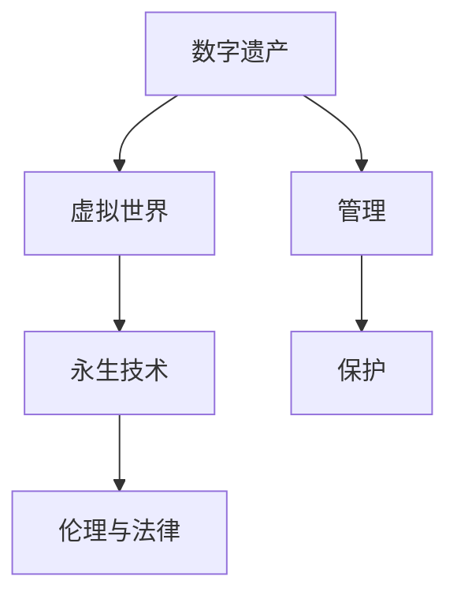

                 

## 数字遗产：虚拟世界中的永生探讨

### 关键词：
- 数字遗产
- 虚拟世界
- 永生技术
- 伦理问题
- 法律问题
- 跨学科研究

### 摘要：
本文围绕“数字遗产：虚拟世界中的永生探讨”这一主题，深入分析了数字遗产的定义、重要性以及管理方法。同时，探讨了虚拟世界中永生的概念、技术与伦理法律问题。通过对具体案例的研究，本文提出了对未来数字遗产与虚拟永生发展趋势的预测，以及相关领域跨学科研究的意义。全文结构清晰，逻辑严密，旨在为读者提供对这一前沿领域的全面了解。

## 目录大纲

1. **引言**
   1.1 《数字遗产：虚拟世界中的永生探讨》概述
   1.2 数字遗产的定义与重要性
   1.3 虚拟世界中的永生探讨

2. **数字遗产的构成与管理**
   2.1 数字遗产的构成
   2.2 数字遗产的管理
   2.3 数字遗产的法律问题
   2.4 数字遗产与网络安全

3. **虚拟世界中的永生技术**
   3.1 虚拟现实与增强现实技术
   3.2 虚拟世界的构建与运营
   3.3 永生技术在虚拟世界中的应用

4. **虚拟世界中的伦理与法律问题**
   4.1 虚拟世界中的伦理问题
   4.2 虚拟世界中的法律问题
   4.3 虚拟世界中的监管与治理

5. **案例研究**
   5.1 虚拟世界中的永生案例研究
   5.2 数字遗产保护案例研究
   5.3 永生技术在现实世界中的应用案例

6. **未来展望**
   6.1 数字遗产与虚拟永生的未来发展趋势
   6.2 跨学科研究与合作
   6.3 社会影响与伦理思考

7. **附录**
   7.1 参考文献
   7.2 术语解释
   7.3 虚拟世界中的永生技术手册
   7.4 数字遗产管理工具与资源
   7.5 相关法律法规摘要
   7.6 数字遗产与虚拟永生相关的国际公约
   7.7 附录中的Mermaid流程图
   7.8 附录中的Python代码示例

## 第一部分：引言

### 1.1 《数字遗产：虚拟世界中的永生探讨》概述

《数字遗产：虚拟世界中的永生探讨》是一本旨在探讨数字遗产及其在虚拟世界中的永生应用的书籍。随着信息技术的飞速发展，数字遗产已经成为了现代社会中不可或缺的一部分。数字遗产不仅包括个人在互联网上留下的电子文件、社交媒体账号、电子邮件等，还包括在虚拟世界中创造的内容和身份。这些数字遗产在人们的日常生活、社交互动、文化传承等方面发挥着重要作用。

本书的目标是为读者提供一个全面而深入的了解，帮助读者理解数字遗产的定义、构成、管理以及其在虚拟世界中的永生应用。书中首先介绍了数字遗产的概念和重要性，接着探讨了虚拟世界中永生的概念及其与哲学、伦理的关系。随后，本书详细分析了数字遗产的构成与管理，以及与数字遗产相关的法律问题和网络安全问题。此外，本书还探讨了虚拟现实与增强现实技术在永生中的应用，分析了虚拟世界中的伦理与法律问题，并提供了相关案例研究。最后，本书对数字遗产与虚拟永生的未来发展趋势进行了展望，并提出了跨学科研究和社会影响与伦理思考的建议。

本书不仅适合对数字遗产和虚拟永生感兴趣的读者，也适合从事信息技术、法律、伦理等相关领域的研究人员和从业人员阅读。通过本书，读者可以全面了解这一前沿领域，从而为未来的研究和实践提供有益的参考。

### 1.2 数字遗产的定义与重要性

数字遗产是指个人在数字化环境中留下的所有信息、内容和数据。这些信息可能包括电子文档、电子邮件、社交媒体账户、在线购物记录、博客文章、游戏角色资料等。数字遗产不仅涵盖了物质性的数据，如文件和图片，还包括非物质性的数据，如个人的在线社交网络、虚拟财产以及身份信息等。

数字遗产在现代社会的地位和影响不可忽视。首先，随着互联网的普及和技术的进步，人们越来越多地依赖数字化工具进行日常生活和工作。因此，数字遗产成为了人们身份和记忆的重要体现。通过数字遗产，人们可以回顾过去的经历，延续家族和文化传统。例如，家庭成员可以通过共同访问祖父母的电子邮件和照片来增进彼此的了解和情感纽带。

其次，数字遗产在经济方面也具有重要价值。在电子商务和数字娱乐领域，虚拟财产已经成为一种新的资产形式。玩家在虚拟游戏中的角色装备、虚拟房产等都可以交易和变现，形成庞大的市场。此外，企业也通过积累客户数据和分析用户行为来优化产品和营销策略，从而提升商业价值。

数字遗产在法律和伦理方面也带来了新的挑战和讨论。例如，在数字遗产的继承问题中，如何界定和管理虚拟财产的权益成为了法律界和学术界关注的焦点。同时，随着数字技术的发展，隐私保护和数据安全问题也日益凸显。如何平衡用户隐私与数据利用，确保数字遗产的安全和合法使用，成为现代社会必须面对的重要议题。

因此，数字遗产在现代社会的地位和影响不仅体现在个人的记忆和身份上，还关系到经济价值、法律伦理等多个方面。理解和保护数字遗产，不仅是对个人权利的尊重，也是社会进步和发展的必然要求。随着数字技术的不断演进，数字遗产的重要性将愈发凸显，其管理、保护和利用也将在未来面临更多的机遇和挑战。

### 1.3 虚拟世界中的永生探讨

虚拟世界中的永生，指的是通过数字技术使个人的信息、记忆和身份在虚拟环境中持续存在，即使现实世界的个体已经不再存在。这一概念融合了虚拟现实（VR）和增强现实（AR）技术，通过高度仿真的互动体验，使个体能够在虚拟环境中实现某种形式的“永生”。

虚拟世界中的永生不仅具有哲学和伦理上的探讨价值，还在技术上带来了新的挑战和机遇。首先，从哲学角度来看，永生探讨涉及到人类对生命意义和存在方式的反思。虚拟永生提供了另一种探讨生命延续和个体身份的视角，引发了关于意识、自我和存在本质的深刻思考。例如，通过虚拟世界中的永生，个体能否保持其原有的个性和记忆，是否还能体验到现实生活中的情感和情感联系，都是需要深入探讨的问题。

在伦理方面，虚拟永生引发了一系列道德和伦理困境。首先，关于隐私和数据保护的问题至关重要。在虚拟世界中，个人的信息、记忆和行为数据将被永久保存和复制，这可能导致隐私泄露和数据滥用。此外，如何确保虚拟世界中的永生不会对现实世界的人际关系和社会结构产生负面影响，也是一个重要的伦理议题。

技术上，虚拟世界中的永生依赖于先进的虚拟现实和增强现实技术。这些技术包括高分辨率的显示设备、精准的交互设备和高度仿真的环境模拟等。虚拟现实技术通过模拟三维空间，使用户能够沉浸在一个完全虚拟的环境中；增强现实技术则通过在现实环境中叠加虚拟元素，提供更为丰富和互动的体验。这些技术的不断进步，为虚拟永生提供了实现的可能性。

具体来说，虚拟世界中的永生技术可以通过以下几种方式实现：

1. **数字克隆**：通过扫描和复制个体的生物特征、行为和记忆，创建一个数字化的副本。这个副本可以在虚拟世界中持续存在，与现实世界的个体保持某种程度的相似性。

2. **情感交互**：利用自然语言处理和情感识别技术，使虚拟世界中的个体能够理解和回应用户的情感，从而提供更加真实和互动的体验。

3. **记忆存储与模拟**：通过数据存储和算法模拟，保存个体的记忆和经历，使其在虚拟世界中能够重现和体验。

4. **虚拟社会网络**：通过建立虚拟社交网络，使虚拟世界中的个体能够与其他个体互动和交流，从而延续现实世界中的社交关系。

虚拟世界中的永生技术虽然带来了无限的可能性，但也伴随着复杂的伦理和法律问题。例如，如何确保虚拟世界中的永生不会侵犯个体的隐私权，如何界定虚拟世界中的法律权益和责任，都是需要解决的重要问题。

总之，虚拟世界中的永生不仅是一个技术话题，更是一个涉及哲学、伦理和社会的多维度议题。随着技术的不断进步，这一概念将逐渐从理论走向实践，引发更多关于人类存在和未来社会的思考。

### 1.4 数字遗产的构成

数字遗产的构成复杂多样，涵盖了个人在数字化环境中留下的各类信息、内容和数据。首先，从形式上分类，数字遗产可以分为以下几类：

1. **电子文档**：这是数字遗产中最常见的一种形式，包括个人撰写的电子邮件、工作文件、学术论文、个人日记等。这些文档记录了个人的思想、工作过程和经历，是数字遗产的重要组成部分。

2. **图片和视频**：随着智能手机和数字相机的普及，人们越来越多地通过图像和视频记录生活。这些多媒体文件不仅是个人记忆的载体，还在文化传承和社会互动中发挥重要作用。

3. **社交媒体账号**：个人在社交媒体平台上建立的账号，如Facebook、Instagram、Twitter等，包含了大量个人照片、状态更新、朋友圈互动等。这些数据反映了个人在网络社交中的身份和互动模式。

4. **虚拟财产**：在虚拟世界中，玩家通过游戏、虚拟现实平台等积累的虚拟物品，如游戏角色装备、虚拟房产等，具有经济价值和社会意义。

5. **在线购物记录**：个人在电子商务平台上的购买行为、收藏夹信息等，也是数字遗产的一部分。这些数据反映了个人消费习惯和偏好。

从内容上分类，数字遗产可以进一步细分为以下几类：

1. **个人信息**：包括身份证号码、联系方式、家庭地址等敏感信息。这些数据在数字遗产中具有高度重要性，因为它们可能涉及隐私泄露和身份盗窃的风险。

2. **专业和工作记录**：包括个人在工作中的电子文档、项目文件、报告等。这些数据对于专业发展和职业评价具有重要意义。

3. **社交网络数据**：包括个人在网络社交平台上的互动记录、好友关系、兴趣爱好等。这些数据反映了个人在社交网络中的身份和关系结构。

4. **娱乐与游戏记录**：包括个人在游戏和娱乐活动中的成绩、游戏角色等。这些数据不仅是娱乐体验的记录，也是虚拟财产的一部分。

数字遗产的内容与形式不仅多样，而且其价值也不尽相同。一些重要的数字遗产可能具有法律意义，如电子邮件中的合同文件、在线购物的订单记录等。这些数据可以作为法律证据，支持或反驳某种法律主张。

此外，数字遗产的价值还体现在其文化和社会意义。例如，个人照片和视频记录了家庭和社区的历史，社交媒体账号反映了社会关系和价值观的变化。这些数据为后代提供了宝贵的历史和文化资料。

总的来说，数字遗产的构成复杂且多样，其形式和内容涵盖了个人生活的方方面面。理解和保护数字遗产，不仅是对个人记忆和身份的尊重，也是对社会文化和历史记忆的传承和保护。

### 1.5 数字遗产管理的重要性

数字遗产管理的目的在于确保数字遗产在个人去世后能够得到妥善处理，使其继续发挥其应有的价值。首先，数字遗产管理的重要性体现在对个人隐私的保护上。个人在数字化环境中留下的信息，如电子邮件、社交媒体账号和购物记录等，可能包含敏感的个人信息。如果不加以妥善管理，这些数据可能被滥用，导致隐私泄露和身份盗窃。因此，数字遗产管理需要采取严格的安全措施，保护这些隐私信息的安全。

其次，数字遗产管理有助于维护和传承个人的文化遗产。个人在数字环境中创造的内容，如博客文章、照片和视频等，不仅是个人记忆的记录，也是家庭、社区乃至整个社会文化的一部分。通过有效的数字遗产管理，这些内容可以被保存并传递给后代，为文化传承提供重要支持。例如，通过数字化的方式，可以永久保存家庭的回忆和故事，让后人能够了解和传承家族的历史。

在法律层面，数字遗产管理也具有重要意义。随着虚拟财产的兴起，如何界定和管理这些财产的权益成为了法律界和学术界关注的焦点。有效的数字遗产管理需要明确数字遗产的继承规则和财产分配方式，确保在个人去世后，其数字遗产能够按照其意愿或法律规定得到合理处理。此外，数字遗产管理还需应对跨国法律问题，如数字遗产的跨境转移和跨国继承，确保其在不同司法管辖区域内得到合法保护。

数字遗产管理还涉及到技术和伦理问题。技术层面上，如何保存和复制数字遗产，使其在不同设备和平台上都能访问和展示，是一个技术挑战。伦理层面上，如何平衡数字遗产的个人隐私和公开分享，如何处理虚拟世界中的道德和伦理问题，都是需要深入探讨的议题。例如，在虚拟世界中，个人的数字身份和行为如何定义其责任和义务，如何确保虚拟世界中的公平和正义，都是需要考虑的问题。

综上所述，数字遗产管理的重要性体现在保护个人隐私、维护文化遗产、解决法律问题以及应对技术伦理挑战等多个方面。有效的数字遗产管理不仅有助于个人和家庭，也对社会的文化传承和法治建设具有重要意义。随着数字技术的不断发展，数字遗产管理将在未来面临更多的挑战和机遇，需要各方共同努力，以确保数字遗产得到合理、合法和有效的管理。

### 1.6 数字遗产管理的挑战与策略

数字遗产管理的挑战多种多样，首先是在技术层面。随着数字化程度的提高，数据类型和数据量呈爆炸性增长，如何高效地存储、备份和恢复这些数据成为了一个重大挑战。此外，不同平台和设备之间的数据兼容性问题也需要解决。例如，个人在不同社交媒体平台上创建的内容，如何在一个统一的系统中进行管理和访问？

在法律层面，数字遗产管理面临诸多困难。首先是如何界定和分配虚拟财产的权益。例如，游戏角色、虚拟房产等虚拟财产在法律上应如何定义和继承？此外，数字遗产跨国转移的问题也需要明确。当一个人在多个国家和地区拥有数字资产时，如何确保其遗产在全球范围内的合法转移和继承？

在伦理层面，数字遗产管理涉及到一系列复杂的问题。如何平衡个人隐私与信息分享的需求？在虚拟世界中，个体的数字身份和行为如何定义其责任和义务？例如，当个人在社交媒体上发布有争议的内容时，如何界定其法律责任和道德责任？

针对这些挑战，可以采取以下管理策略：

1. **技术层面的策略**：首先，需要建立统一的数据存储和管理平台，确保不同类型和格式的数据能够无缝整合和访问。其次，可以开发跨平台的数据同步工具，方便用户在不同设备和平台之间管理和访问数字遗产。此外，采用分布式存储和区块链技术，可以提高数据的安全性和可靠性。

2. **法律层面的策略**：首先，需要制定明确的数字遗产法律框架，明确虚拟财产的定义和继承规则。例如，可以通过立法明确规定游戏角色、虚拟房产等虚拟财产的法律地位和继承方式。其次，需要建立跨国法律合作机制，确保数字遗产在不同司法管辖区内的合法转移和继承。

3. **伦理层面的策略**：首先，需要建立伦理指导原则，明确虚拟世界中的道德责任和行为规范。例如，可以制定关于信息分享和隐私保护的伦理准则，确保个人数字遗产的合法和合理使用。其次，可以通过公众教育和法律宣传，提高社会对数字遗产管理伦理问题的认知和理解。

4. **综合管理策略**：综合运用技术、法律和伦理策略，形成一个全面、系统、可操作的数字遗产管理方案。例如，可以通过建立数字遗产管理平台，提供一站式的数字遗产管理服务，包括数据备份、权限设置、虚拟财产继承等。

总之，数字遗产管理的挑战虽然复杂，但通过技术、法律和伦理的综合策略，可以有效应对这些挑战，确保数字遗产得到合理、合法和有效的管理。

### 2.1 数字遗产的法律问题

数字遗产的法律问题涉及到多个方面，其中最为突出的包括继承权、隐私保护和跨境转移等问题。首先，数字遗产继承权的问题在法律界引发了广泛讨论。在传统法律体系中，遗产主要指代现实世界中的财产，如房产、车辆、金钱等。然而，随着虚拟财产的兴起，如何界定和分配这些虚拟财产的权益成为了一个新的挑战。不同国家和地区对于虚拟财产的法律规定各不相同，导致在跨国继承案件中出现法律冲突和执行困难。

在隐私保护方面，数字遗产管理涉及到大量敏感信息，如个人身份信息、通讯记录和消费行为等。这些信息在数字遗产的继承和转移过程中，可能面临泄露和滥用的风险。如何确保这些敏感信息在遗产管理过程中得到有效保护，是法律和伦理领域必须解决的问题。例如，在处理电子邮件和社交媒体账号时，如何确保个人的隐私不被侵犯，同时满足法律和道德的要求？

跨境转移问题也是数字遗产法律中的一个重要议题。随着全球化的发展，个人在多个国家和地区拥有数字资产的现象越来越普遍。如何确保这些数字资产在全球范围内的合法转移和继承，是一个复杂的法律问题。不同国家和地区的法律规定不同，甚至存在法律真空和执行困难的情况。例如，当一个人在多个国家拥有社交媒体账号和虚拟财产时，如何确保这些资产在去世后能够按照其意愿得到合法转移和继承？

为了解决这些问题，需要在多个层面上采取综合措施：

1. **法律框架的建立**：首先，需要制定统一的数字遗产法律框架，明确虚拟财产的定义、继承规则和跨境转移程序。通过立法明确虚拟财产的法律地位和权益，可以为数字遗产的管理提供明确的法律依据。

2. **国际合作的加强**：其次，需要加强国际法律合作，建立跨国数字遗产管理机制。通过国际合作，可以协调不同国家和地区的法律规定，确保数字遗产在跨境转移中的合法性和有效性。

3. **隐私保护的强化**：在数字遗产管理过程中，需要采取严格的安全措施，保护敏感信息的安全。例如，可以采用加密技术和访问控制措施，确保个人信息在转移和管理过程中的安全性。此外，还需要制定隐私保护法规，明确数字遗产管理中隐私保护的义务和责任。

4. **公众教育和宣传**：最后，需要通过公众教育和法律宣传，提高社会对数字遗产法律问题的认知和理解。通过普及法律知识，可以提高公众的法律意识，促进数字遗产管理的规范化和合法化。

总之，数字遗产的法律问题涉及多个方面，需要通过法律框架的建立、国际合作的加强、隐私保护的强化和公众教育的普及等多种措施，共同解决这些复杂的问题，确保数字遗产在法律框架内得到合理、合法和有效的管理。

### 2.2 数字遗产与网络安全

数字遗产的保护与网络安全密切相关。在现代社会，网络安全问题日益突出，数字遗产面临的威胁也日益多样化。因此，理解和解决数字遗产的网络安全问题，对于保障个人隐私、维护社会秩序和促进数字经济发展具有重要意义。

首先，数字遗产的网络安全问题主要体现在数据泄露、黑客攻击和病毒感染等方面。数据泄露可能是由于系统漏洞、密码破解或内部人员的恶意行为导致的。黑客攻击则可能通过非法侵入系统，窃取敏感信息或破坏数据完整性。病毒感染则可能导致数据损坏、系统崩溃或恶意软件的传播。这些问题不仅会对个人的隐私和财产造成威胁，还可能对社会稳定和国家安全产生负面影响。

为了防范这些网络安全威胁，可以采取以下措施：

1. **加强数据加密**：通过使用高级加密算法，对数字遗产中的敏感数据进行加密处理，确保数据在传输和存储过程中的安全性。加密技术可以有效防止数据泄露和未经授权的访问。

2. **完善访问控制**：设置严格的访问控制机制，确保只有授权用户才能访问数字遗产。通过身份验证、权限管理和审计跟踪等技术手段，可以有效防止未经授权的访问和恶意操作。

3. **定期安全审计**：定期进行安全审计和漏洞扫描，发现和修复系统中的潜在漏洞，防止黑客攻击和数据泄露。安全审计可以帮助组织及时发现和解决安全隐患，提高系统的安全性能。

4. **网络安全培训**：加强对用户的安全意识和技能培训，提高他们对网络安全威胁的识别和防范能力。通过定期举办网络安全培训和宣传活动，可以提高用户的网络安全意识，减少因人为操作失误导致的安全问题。

5. **建立应急响应机制**：制定完善的网络安全应急预案，确保在发生网络安全事件时能够迅速响应和处置。应急响应机制可以帮助组织快速恢复系统和数据，减少损失和影响。

在网络安全保护中，法律和伦理问题同样不可忽视。首先，在数字遗产的继承和转移过程中，需要明确网络安全保护的法律责任和义务。例如，法律应规定数字遗产管理者和继承人在数据保护方面的责任，确保他们在处理数字遗产时遵守安全规定和法律法规。

其次，在网络安全伦理方面，需要建立伦理指导原则，明确个人隐私和数据保护的重要性。数字遗产的管理者和使用者在处理数字遗产时，应遵循诚实守信、尊重隐私和保护数据的原则，避免滥用或泄露个人数据。

总之，数字遗产与网络安全问题密切相关，需要从技术、法律和伦理等多个层面进行综合防护。通过加强数据加密、完善访问控制、定期安全审计、网络安全培训和建立应急响应机制等措施，可以有效保障数字遗产的安全。同时，通过明确网络安全保护的法律责任和伦理指导原则，可以进一步促进数字遗产的安全管理和保护。

### 2.3 虚拟现实与增强现实技术

虚拟现实（VR）和增强现实（AR）技术是数字遗产和虚拟世界永生探讨中的重要工具，它们通过模拟和扩展现实环境，提供了沉浸式的互动体验，为数字遗产的保存和永生提供了技术支撑。

#### 虚拟现实技术的原理与应用

虚拟现实技术通过创建一个完全沉浸的三维虚拟环境，使用户能够通过特定的设备（如头戴式显示器、VR眼镜等）体验虚拟世界。其核心原理包括：

1. **三维建模**：使用计算机图形学技术创建三维模型，这些模型可以模拟现实世界的场景或物体。
2. **感知模拟**：通过传感器和反馈设备（如手柄、动捕系统等），模拟用户的视觉、听觉和触觉感知，使用户能够与虚拟环境进行互动。
3. **实时渲染**：利用高性能计算和图形处理单元（GPU），实时渲染虚拟环境中的场景和效果，提供流畅的视觉体验。

在数字遗产的保存和永生应用中，虚拟现实技术可以用于创建个人记忆的数字再现。例如，通过扫描和建模，将个人的照片、视频和音频内容转化为虚拟场景，用户可以在虚拟环境中“访问”和互动这些数字遗产，仿佛置身于现实世界中。此外，虚拟现实还可以用于创建虚拟博物馆、历史遗址再现等，使数字遗产得到更加生动和持久的保存。

#### 增强现实技术的原理与应用

增强现实技术通过在现实世界中叠加虚拟元素，增强用户的感知体验。其核心原理包括：

1. **实时图像处理**：使用摄像头和图像识别技术，实时捕捉和识别现实世界的图像。
2. **虚拟元素叠加**：通过计算机生成的虚拟图像，叠加到捕捉到的现实世界图像上，形成虚实结合的视觉效果。
3. **交互反馈**：通过触摸屏、手势识别等技术，使用户能够与叠加的虚拟元素进行互动。

在数字遗产的永生应用中，增强现实技术可以用于创建个性化的数字纪念碑和纪念活动。例如，在用户的现实生活中，通过增强现实技术叠加虚拟的纪念品或影像，让用户在特定的时间和地点感受到与逝去亲人的互动。此外，增强现实还可以用于教育和文化传承，通过虚拟展示历史事件、文化遗产等，增强用户的沉浸感和参与度。

#### 虚拟现实与增强现实在永生中的应用

虚拟现实与增强现实技术在永生中的应用具有广泛的前景，具体包括：

1. **虚拟遗产体验**：用户可以通过虚拟现实技术，进入一个模拟的虚拟世界，体验与逝去亲人的互动和交流。这种体验不仅能够满足用户的心理需求，还可以作为纪念和缅怀逝者的方式。

2. **虚拟社交网络**：在虚拟现实和增强现实环境中，用户可以创建和参与虚拟社交活动，与虚拟的亲人朋友互动，延续现实世界中的社交关系。

3. **文化传承与教育**：通过虚拟现实和增强现实技术，可以再现和展示历史文化遗产，使后代能够更直观地了解和感受历史。例如，虚拟博物馆和虚拟历史遗址的展示，不仅可以增加游客的体验感，还可以作为教育和文化传承的重要手段。

4. **虚拟工作与学习**：虚拟现实和增强现实技术还可以用于虚拟办公、在线教育和远程培训等，使用户在虚拟环境中完成工作和学习任务，实现虚拟世界中的“永生”。

总之，虚拟现实与增强现实技术为数字遗产的保存和永生提供了丰富的技术手段。通过这些技术，用户可以在虚拟环境中继续体验和互动，使数字遗产得到更加生动和持久的保存。随着技术的不断进步，虚拟现实和增强现实将在数字遗产和虚拟世界永生领域发挥越来越重要的作用。

### 3.2 虚拟世界的构建与运营

虚拟世界的构建与运营是一个复杂而系统的过程，涉及到多个技术领域和商业模式的综合考虑。首先，从技术角度来看，虚拟世界的构建需要依赖于一系列高级技术和工具。这些技术包括但不限于：

1. **服务器与网络技术**：虚拟世界的核心依赖于强大的服务器和网络基础设施，以保证用户在虚拟环境中的顺畅体验。服务器需要具备高计算能力和存储能力，网络则需要稳定的连接和低延迟。

2. **三维建模与渲染技术**：虚拟世界的环境、角色和物体都需要通过三维建模工具进行创建，并利用实时渲染技术生成高质量的画面。三维建模软件如Blender、Unity和Unreal Engine等，提供了丰富的功能，可以帮助开发人员创建逼真的虚拟场景。

3. **人工智能与机器学习**：虚拟世界中的智能角色和交互机制依赖于人工智能技术，包括自然语言处理、计算机视觉和强化学习等。这些技术可以模拟人类行为和思维模式，使虚拟角色具备更高的自主性和互动性。

4. **虚拟现实与增强现实技术**：虚拟世界的用户体验很大程度上依赖于虚拟现实（VR）和增强现实（AR）技术。通过这些技术，用户可以在虚拟环境中获得更加沉浸和互动的体验。

从商业模式的角度来看，虚拟世界的运营涉及到多个盈利点和运营策略。以下是一些常见的商业模式：

1. **订阅模式**：用户需要支付定期订阅费用才能进入虚拟世界，这种模式常见于一些高端的虚拟现实游戏和模拟平台。订阅模式可以提供持续的现金流，同时鼓励用户长期参与。

2. **虚拟货币与商品销售**：虚拟世界内设置虚拟货币系统，用户可以通过购买虚拟商品、装备或服务来获得虚拟世界的体验。这些虚拟商品可以是游戏道具、虚拟房产、特殊角色外观等，具有商业价值。

3. **广告收入**：虚拟世界可以成为品牌和广告商的营销平台。通过在虚拟世界内投放广告，品牌可以接触到特定的目标用户群体，提高品牌知名度和用户粘性。

4. **平台费用与交易抽成**：虚拟世界运营平台可以向虚拟商品卖家收取平台使用费或交易抽成，从而获取收益。这种模式类似于电子商务平台，通过为卖家提供流量和交易渠道来获取利润。

虚拟世界的运营还涉及到用户管理和社区建设。通过有效的用户管理，运营者可以维护虚拟世界的秩序和用户体验。社区建设则是通过举办活动、鼓励用户互动和建立虚拟社群，增强用户的归属感和参与度。

总之，虚拟世界的构建与运营是一个多技术、多模式、多策略的复杂过程。通过先进的技术手段和创新的商业模式，虚拟世界不仅能够提供丰富的用户体验，还能够实现商业上的可持续运营。

### 3.3 永生技术在虚拟世界中的应用

永生技术在虚拟世界中的应用，为数字遗产的保存和延续提供了新的可能性。通过结合虚拟现实（VR）和增强现实（AR）技术，可以实现个体在虚拟环境中的持续性存在。以下将从实现方式、情感交互和认知模拟等方面探讨永生技术在虚拟世界中的应用。

首先，永生技术在虚拟世界中的实现方式主要有以下几种：

1. **数字克隆**：通过高精度扫描和数字化处理，将个体的身体特征、面部表情和行为模式转换为虚拟模型。这个数字副本可以在虚拟世界中长期存在，并保持与原始个体相似的外貌和行为。

2. **情感模拟**：利用人工智能技术，特别是自然语言处理和情感识别算法，模拟个体的情感反应。例如，当虚拟世界中的用户与数字副本互动时，副本可以理解用户的情绪并作出相应的反应，从而实现情感上的互动。

3. **记忆存储与再现**：通过将个体的记忆数据数字化存储，并在虚拟世界中再现这些记忆。用户可以通过虚拟体验重新经历这些记忆，从而实现记忆的延续。

4. **虚拟社交网络**：在虚拟世界中创建个体的社交网络，使其能够与虚拟朋友和家庭成员保持联系。通过虚拟互动，个体可以在虚拟环境中延续其社交关系。

其次，情感交互是永生技术的重要方面。虚拟世界中情感交互的实现，主要通过以下几个方面：

1. **自然语言处理**：通过分析用户的语言输入，虚拟角色可以理解用户的意图和情感，并作出相应的回应。例如，当用户表达喜悦或悲伤时，虚拟角色可以通过语音和表情变化来模拟情感。

2. **身体语言和面部表情**：利用计算机视觉和面部识别技术，虚拟角色可以捕捉用户的身体语言和面部表情，并模仿这些动作。例如，当用户微笑时，虚拟角色也可以微笑。

3. **情感反馈机制**：通过设计情感反馈机制，虚拟角色可以根据用户的情感状态调整其行为。例如，当用户感到孤独时，虚拟角色可以主动发起互动，提供陪伴和支持。

在认知模拟方面，永生技术通过以下方式实现：

1. **行为模拟**：利用机器学习算法，虚拟角色可以模拟个体的行为模式，包括日常活动、习惯和偏好。例如，虚拟角色可以根据个体的行为记录，自动完成日常任务，如洗澡、吃饭等。

2. **知识库建设**：通过将个体的知识、经验和技能数字化存储，并在虚拟世界中构建知识库。用户可以通过与虚拟角色互动，获取所需的信息和知识。

3. **认知扩展**：虚拟角色可以基于个体的记忆和知识，进行认知扩展。例如，虚拟角色可以基于个体的阅读记录，推荐相关书籍或讨论话题。

总之，永生技术在虚拟世界中的应用，为数字遗产的保存和延续提供了创新途径。通过数字克隆、情感模拟和认知模拟，虚拟世界中的个体可以长期存在，并与现实世界保持联系。这不仅为用户提供了丰富的虚拟体验，也为数字遗产的管理和利用提供了新的思路。

### 3.4 永生技术在虚拟世界中的道德和伦理问题

永生技术在虚拟世界中的应用，不仅带来了技术上的挑战，也引发了一系列复杂的道德和伦理问题。这些问题涉及到隐私、身份、情感和道德责任等方面，需要深入探讨和审慎对待。

首先，隐私问题是一个重要的伦理议题。在虚拟世界中，个体的信息、记忆和行为数据被永久保存和复制，这可能涉及隐私泄露和数据滥用。例如，如果这些数据落入不法分子手中，可能导致个人隐私被侵犯，甚至造成身份盗窃。此外，虚拟世界中的情感交互和认知模拟也可能涉及对个体隐私的过度侵入。如何在保护隐私的同时，充分利用永生技术的优势，是一个需要平衡的伦理问题。

其次，身份问题在永生技术中尤为突出。在虚拟世界中，个体的数字副本可以长期存在，但其身份如何定义和维持成为一个复杂的问题。例如，如果个体的数字副本保留了其所有的记忆和个性，那么这个副本是否仍然具有与原始个体相同的身份？如果多个数字副本同时存在，如何确定哪个副本代表了原始个体的真实身份？这些问题不仅关乎个体权利，也涉及到法律和社会秩序的稳定。

情感问题也是永生技术伦理中的一个重要方面。虚拟世界中的情感交互虽然能够模拟人类的情感反应，但其真实性和深度仍然是一个挑战。例如，虚拟角色是否能够真正理解和体验情感，或者只是简单地模仿情感表现？如果虚拟角色无法真正体验情感，那么它们与人类的情感互动是否真正有意义？此外，虚拟世界中的情感互动也可能引发情感依赖和心理困扰，需要慎重对待。

道德责任问题在永生技术中同样不可忽视。在虚拟世界中，个体的数字副本可能会参与各种社会活动，如工作、社交和决策等。这引发了关于虚拟角色道德责任和行为的讨论。例如，虚拟角色是否应该承担道德责任？如果它们在虚拟世界中做出了有害行为，如何追究其责任？这些问题不仅关乎技术本身，也涉及到社会道德和法律体系的建设。

为解决这些道德和伦理问题，可以采取以下措施：

1. **隐私保护**：通过严格的隐私保护政策和加密技术，确保个体数据的安全和隐私。例如，可以采用分布式存储和匿名化处理，减少数据泄露和滥用的风险。

2. **身份管理**：建立清晰的身份管理体系，明确数字副本与原始个体之间的身份关系。例如，可以采用数字签名和认证机制，确保虚拟角色在虚拟世界中的身份合法和可信。

3. **情感伦理**：在设计和运营虚拟世界时，重视情感的真实性和深度，避免简单模仿情感反应。通过深入研究情感认知和情感体验，提升虚拟角色在情感上的真实感。

4. **道德责任**：建立明确的道德责任框架，明确虚拟角色在虚拟世界中的行为规范和责任。例如，可以制定虚拟角色的行为准则，确保其在虚拟世界中的行为符合道德和法律要求。

总之，永生技术在虚拟世界中的应用涉及多方面的道德和伦理问题，需要通过综合措施和深入研究，确保其能够在道德和伦理的框架内健康发展。

### 3.5 虚拟世界中的法律问题

虚拟世界中的法律问题是一个复杂而多元的领域，涉及到多个法律体系、法律适用和跨国法律挑战。首先，虚拟世界的法律问题主要体现在以下几个方面：

#### 1. 法律体系和法律适用

虚拟世界作为一个新兴的数字空间，其法律适用问题备受关注。不同国家和地区对于虚拟财产、数字合同和侵权行为等法律问题的规定各不相同。例如，在一些国家，虚拟财产可能被视为合法的财产形式，而在其他国家则可能不被承认。这种法律体系的不一致性导致在跨国虚拟财产交易和纠纷中，难以确定适用的法律。

为了解决法律适用问题，需要建立统一的虚拟世界法律框架。这可以通过国际合作，如联合国、世界贸易组织等机构制定统一的虚拟世界法律标准，或者通过各国的立法机构制定相关法律，确保不同司法辖区内的法律协调和统一。

#### 2. 跨国法律挑战

随着虚拟世界的发展，跨国法律挑战日益凸显。当一个人在多个国家和地区拥有虚拟财产或参与虚拟活动时，如何确保这些行为在法律上得到合法承认和执行，成为一个重要的课题。例如，虚拟财产的跨境转移、跨国侵权纠纷以及跨国数字合同的履行等问题，都需要解决法律适用和执行的问题。

为了应对跨国法律挑战，需要建立跨国法律合作机制。这可以通过以下方式实现：

- **国际公约和协议**：通过制定国际公约和协议，明确跨国虚拟财产和行为的法律适用和责任。例如，可以制定关于数字遗产继承和跨国虚拟财产转移的国际法律框架。
- **多边合作机制**：通过建立多边合作机制，如跨国法律咨询小组、跨国律师联盟等，促进各国法律专业人士之间的合作和交流，提高跨国法律纠纷的解决效率。
- **司法协助**：通过建立跨国司法协助机制，确保跨国法律纠纷能够在不同司法辖区内得到及时、公正的解决。例如，通过跨境取证、判决执行等手段，保障跨国法律纠纷的解决。

#### 3. 侵权与违约问题

虚拟世界中的侵权和违约问题同样复杂多样。例如，在虚拟游戏中，玩家之间的纠纷、游戏公司与服务提供商之间的合同纠纷，以及虚拟财产的侵权行为等，都需要明确的法律规定和解决机制。

为了解决侵权与违约问题，可以采取以下措施：

- **明确法律界定**：通过立法明确虚拟财产、数字合同和侵权行为等法律概念，确保在虚拟世界中的各类行为都有明确的法律界定。
- **建立纠纷解决机制**：建立有效的虚拟世界纠纷解决机制，如在线调解、在线仲裁等，为虚拟世界中的纠纷提供快捷、低成本、高效的解决途径。
- **法律教育和宣传**：通过公众教育和法律宣传，提高用户对虚拟世界法律问题的认知和理解，增强用户的法律意识和自我保护能力。

总之，虚拟世界中的法律问题涉及多个方面，需要通过建立统一的法律框架、跨国法律合作机制和有效的纠纷解决机制，确保虚拟世界的健康发展。这不仅有助于维护用户的合法权益，也为虚拟世界的发展提供了坚实的法治保障。

### 3.6 虚拟世界中的监管与治理

虚拟世界的监管与治理是一个复杂而关键的议题，涉及到多个层面的综合管理。首先，从技术角度来说，虚拟世界的监管需要依赖于先进的技术手段，如大数据分析、人工智能和区块链等。这些技术可以帮助监管机构实时监控虚拟世界中的活动，识别潜在的风险和违规行为。例如，通过大数据分析，可以监控虚拟财产的交易和流转，及时发现异常交易和非法活动；通过人工智能技术，可以自动识别和分类用户行为，识别潜在的风险因素；而区块链技术则可以提供透明、不可篡改的交易记录，增强虚拟财产交易的可靠性和透明度。

在法律层面，虚拟世界的监管需要依赖于健全的法律体系和明确的法律规定。这包括制定关于虚拟财产、数字合同、知识产权保护和用户隐私等方面的法律法规，确保虚拟世界中的各类活动有法可依。例如，可以通过立法明确规定虚拟财产的法律地位和继承规则，保护虚拟财产的合法权益；通过制定隐私保护法规，确保用户在虚拟世界中的个人隐私不被侵犯；通过知识产权保护法律，防止虚拟世界中的侵权行为。

从伦理和社会层面来看，虚拟世界的监管与治理需要注重公平、公正和道德责任。这包括建立伦理指导原则，明确虚拟世界中的道德责任和行为规范。例如，可以制定关于虚拟世界中的道德行为准则，确保虚拟角色和用户的行为符合道德和法律的要求；建立用户投诉和反馈机制，确保用户在虚拟世界中的权益得到有效保护。

具体来说，虚拟世界的监管与治理可以从以下几个方面进行：

1. **建立虚拟世界监管机构**：设立专门的虚拟世界监管机构，负责对虚拟世界中的各类活动进行监管。该机构可以负责制定和实施相关法律法规，监督虚拟财产交易、打击非法活动和保护用户隐私等。

2. **跨国合作与协调**：由于虚拟世界具有跨国性，需要建立跨国监管合作机制，促进不同国家和地区之间的协调与合作。例如，可以通过国际合作，制定统一的虚拟世界法律标准和操作规程，提高跨国监管的效率和一致性。

3. **技术监管与自律**：虚拟世界运营者和平台提供者应承担起技术监管和自律责任，通过技术手段和内部管理机制，确保虚拟世界中的活动符合法律和道德要求。例如，可以通过技术手段监控和过滤违规内容，建立用户行为规范和举报机制，提高虚拟世界的安全性和可靠性。

4. **公众参与与监督**：鼓励公众参与虚拟世界的监管与治理，通过公众监督和反馈，提高虚拟世界的透明度和公信力。例如，可以通过设立举报平台、公开监管信息等方式，增强公众对虚拟世界监管的参与和信任。

总之，虚拟世界的监管与治理需要从技术、法律和伦理等多个层面进行综合管理。通过建立虚拟世界监管机构、跨国合作、技术监管与自律以及公众参与，可以确保虚拟世界的健康发展，为用户提供一个安全、公正和可靠的虚拟环境。

### 4.1 虚拟世界中的伦理问题

虚拟世界中的伦理问题涉及多个层面，主要包括道德困境、隐私与自由的平衡以及责任与义务的界定。首先，道德困境是虚拟世界中最为突出的伦理问题之一。虚拟环境提供了多种多样的互动机会，但同时也带来了复杂的道德选择。例如，在虚拟游戏中，玩家可能会面临是否杀害NPC（非玩家角色）或参与欺诈行为的道德决策。这些问题不仅考验玩家的道德判断力，也挑战了虚拟世界的道德框架。

其次，隐私与自由的平衡是虚拟世界中的另一个重要伦理议题。虚拟世界中的个体数据被广泛收集和使用，这为个性化服务和商业盈利提供了基础。然而，过度的数据收集和利用可能导致隐私泄露和滥用。如何在提供便利和保障隐私之间找到平衡点，是一个复杂的伦理问题。例如，一些虚拟平台可能通过用户数据进行分析，用于广告投放和商业决策，但这一行为是否侵犯了用户的隐私权，需要深入探讨。

责任与义务的界定也是虚拟世界中一个重要的伦理问题。在虚拟环境中，个体和机构的责任和义务如何划分，以及如何确保这些责任得到履行，是一个亟待解决的问题。例如，当虚拟财产被盗时，如何追究盗贼的责任？虚拟平台是否应对用户的财产损失承担责任？这些问题需要通过明确的法律法规和伦理指导原则来加以规范。

此外，虚拟世界中的道德困境还涉及到虚拟角色的道德行为。例如，虚拟世界中的人工智能角色如何制定道德决策，以及这些决策是否符合人类道德标准，是一个需要深入探讨的问题。同样，虚拟社交网络中的信息传播和内容审核，也需要平衡自由与责任，避免虚假信息和有害内容的传播。

为应对这些伦理问题，可以采取以下措施：

1. **建立伦理指导原则**：制定明确的伦理指导原则，规范虚拟世界中的行为。例如，可以制定关于隐私保护、数据使用和道德决策的伦理准则。

2. **加强法律法规**：通过立法明确虚拟世界中的责任和义务，确保虚拟环境中的行为有法可依。例如，制定关于虚拟财产保护、用户隐私权和侵权责任的法律法规。

3. **公众教育和宣传**：提高公众对虚拟世界伦理问题的认知，通过教育和宣传，增强用户的道德意识和责任意识。

4. **技术手段的运用**：利用技术手段，如加密技术和隐私保护工具，确保虚拟世界中的隐私和数据安全。

总之，虚拟世界中的伦理问题复杂多样，需要通过建立伦理指导原则、加强法律法规、公众教育和技术手段的综合措施，确保虚拟世界中的行为符合道德和法律要求，为用户提供一个安全、公正和有道德的虚拟环境。

### 4.2 虚拟世界中的法律问题

虚拟世界中的法律问题涵盖了多个方面，包括虚拟财产、数字合同和侵权行为等。首先，虚拟财产的法律地位是一个关键问题。虚拟财产，如游戏中的虚拟装备、虚拟货币和数字艺术品等，虽然在虚拟环境中具有经济价值和社会意义，但其在现实法律体系中的地位尚未明确。不同国家和地区对于虚拟财产的法律规定各不相同，这导致了跨国虚拟财产交易和纠纷中的法律不确定性。

其次，数字合同的法律效力也是虚拟世界中的一大挑战。数字合同是指通过电子方式达成的合同，包括在线购物协议、游戏条款等。然而，由于数字合同的签订和履行过程完全在线，其法律效力和执行性受到质疑。一些法律体系对电子合同的法律效力持保留态度，这给数字合同的执行带来了困难。

侵权行为在虚拟世界中也时有发生。例如，玩家可能在游戏中盗窃他人虚拟财产，或者在社交媒体上侵犯他人知识产权。如何界定和解决这些侵权行为，是一个复杂的法律问题。此外，虚拟世界中的侵权行为可能涉及到跨国法律管辖，进一步增加了法律解决的难度。

为了解决虚拟世界中的法律问题，需要采取以下措施：

1. **建立统一的法律框架**：通过国际合作，制定统一的虚拟财产、数字合同和侵权行为的法律标准，确保不同司法辖区内的法律协调和一致性。

2. **明确虚拟财产的法律地位**：通过立法明确虚拟财产的法律地位，保障虚拟财产的合法权益，促进虚拟经济的发展。

3. **加强数字合同的法律效力**：制定关于数字合同的法律规定，明确数字合同的法律效力，确保其能够在现实法律体系中得到承认和执行。

4. **建立跨国法律合作机制**：通过建立跨国法律合作机制，如国际律师联盟和跨国法律咨询小组，促进各国法律专业人士之间的合作，提高跨国法律纠纷的解决效率。

5. **完善侵权行为法律规范**：通过立法明确侵权行为的定义和处罚标准，建立有效的侵权行为解决机制，确保虚拟世界中的侵权行为得到及时、公正的解决。

总之，虚拟世界中的法律问题复杂多样，需要通过建立统一的法律框架、明确虚拟财产和法律合同的地位、加强跨国法律合作和完善侵权行为法律规范等多种措施，确保虚拟世界中的法律秩序和公平正义。

### 4.3 虚拟世界中的监管与治理

虚拟世界的监管与治理是一个复杂而重要的议题，涉及到技术、法律、伦理和社会等多方面的综合管理。首先，从技术角度来看，虚拟世界的监管需要依赖于先进的技术手段，如大数据分析、人工智能和区块链等。这些技术可以帮助监管机构实时监控虚拟世界中的活动，识别潜在的风险和违规行为。例如，大数据分析可以用于监控虚拟财产的交易和流转，及时发现异常交易和非法活动；人工智能技术可以用于自动识别和分类用户行为，识别潜在的风险因素；而区块链技术则可以提供透明、不可篡改的交易记录，增强虚拟财产交易的可靠性和透明度。

在法律层面，虚拟世界的监管需要依赖于健全的法律体系和明确的法律规定。这包括制定关于虚拟财产、数字合同、知识产权保护和用户隐私等方面的法律法规，确保虚拟世界中的各类活动有法可依。例如，可以通过立法明确规定虚拟财产的法律地位和继承规则，保护虚拟财产的合法权益；通过制定隐私保护法规，确保用户在虚拟世界中的个人隐私不被侵犯；通过知识产权保护法律，防止虚拟世界中的侵权行为。

从伦理和社会层面来看，虚拟世界的监管与治理需要注重公平、公正和道德责任。这包括建立伦理指导原则，明确虚拟世界中的道德责任和行为规范。例如，可以制定关于虚拟世界中的道德行为准则，确保虚拟角色和用户的行为符合道德和法律要求；建立用户投诉和反馈机制，确保用户在虚拟世界中的权益得到有效保护。

具体来说，虚拟世界的监管与治理可以从以下几个方面进行：

1. **建立虚拟世界监管机构**：设立专门的虚拟世界监管机构，负责对虚拟世界中的各类活动进行监管。该机构可以负责制定和实施相关法律法规，监督虚拟财产交易、打击非法活动和保护用户隐私等。

2. **跨国合作与协调**：由于虚拟世界具有跨国性，需要建立跨国监管合作机制，促进不同国家和地区之间的协调与合作。例如，可以通过国际合作，制定统一的虚拟世界法律标准和操作规程，提高跨国监管的效率和一致性。

3. **技术监管与自律**：虚拟世界运营者和平台提供者应承担起技术监管和自律责任，通过技术手段和内部管理机制，确保虚拟世界中的活动符合法律和道德要求。例如，可以通过技术手段监控和过滤违规内容，建立用户行为规范和举报机制，提高虚拟世界的安全性和可靠性。

4. **公众参与与监督**：鼓励公众参与虚拟世界的监管与治理，通过公众监督和反馈，提高虚拟世界的透明度和公信力。例如，可以通过设立举报平台、公开监管信息等方式，增强公众对虚拟世界监管的参与和信任。

总之，虚拟世界的监管与治理需要从技术、法律和伦理等多个层面进行综合管理。通过建立虚拟世界监管机构、跨国合作、技术监管与自律以及公众参与，可以确保虚拟世界的健康发展，为用户提供一个安全、公正和可靠的虚拟环境。

### 5.1 虚拟世界中的永生案例研究

在探讨虚拟世界中的永生时，以下几个案例为我们提供了深刻的洞察和思考：

#### 案例1：Second Life

Second Life 是一个著名的虚拟世界平台，用户可以在其中创建自己的虚拟角色、购买土地和建造建筑。在这个虚拟世界中，用户不仅能够与他人互动，还可以通过交易虚拟财产获得经济收益。Second Life 的永生概念体现在用户可以在虚拟世界中持续存在，并通过不断更新和扩展其虚拟角色和财产，实现某种形式的“永生”。

**实现方式**：Second Life 通过提供一个开放的平台，使用户能够自由创建和修改自己的虚拟角色和虚拟财产。用户可以购买虚拟土地，建设虚拟房屋和商业设施，并通过交易虚拟货币（Linden Dollar）获取经济收益。此外，Second Life 还提供了多种工具和插件，帮助用户在虚拟世界中实现个性化的互动和体验。

**伦理与法律问题**：Second Life 中的永生引发了多个伦理和法律问题。首先，如何确保用户的虚拟角色和财产在用户去世后得到合法继承和保护？Second Life 在这方面采取了一些措施，例如允许用户设置继承人，但具体的法律地位和继承程序仍需明确。其次，虚拟世界中的行为规范和道德标准如何制定和执行，以防止滥用和不当行为？例如，一些用户可能在虚拟世界中从事非法交易或侵犯他人知识产权，这需要虚拟平台提供有效的监管和治理机制。

#### 案例2：Decentraland

Decentraland 是另一个基于区块链技术的虚拟世界平台，它允许用户在虚拟环境中创建和拥有虚拟地产，并通过加密货币进行交易。Decentraland 的永生理念体现在用户可以长期拥有并控制自己的虚拟资产，从而在虚拟世界中实现持续存在。

**实现方式**：Decentraland 利用区块链技术，为用户提供了透明、安全的虚拟资产交易平台。用户可以通过购买或创建虚拟土地，建设虚拟建筑和开展商业活动。这些虚拟资产在区块链上永久记录，确保其不可篡改和归属清晰。此外，Decentraland 还提供了一个去中心化的平台，用户可以在其中自由互动和交易，不受中央机构的控制。

**伦理与法律问题**：Decentraland 的永生模式在法律和伦理方面提出了一些新的挑战。首先，由于区块链技术的去中心化特性，如何确保虚拟资产的安全和合法转移成为一个问题。其次，虚拟世界中的道德行为如何规范，以防止滥用和不当行为？例如，如何在虚拟世界中保护知识产权和用户隐私？这些问题需要通过法律框架和社区规则来解决。

#### 案例3：Fortnite

Fortnite 是一款流行的多人在线游戏，玩家可以在其中建设虚拟世界、战斗和合作。尽管 Fortnite 并不直接提供永生概念，但其虚拟世界中的角色和财产系统为探讨永生提供了一定的启示。

**实现方式**：Fortnite 提供了一个开放的游戏平台，玩家可以创建和定制自己的角色和虚拟财产。玩家可以通过游戏内购买和交易虚拟物品，这些虚拟物品在一定程度上具有经济价值。尽管 Fortnite 的角色和财产在玩家死亡后会消失，但通过游戏内外的社交互动，玩家可以在一定程度上实现“永生”。

**伦理与法律问题**：Fortnite 中的永生概念涉及多个伦理和法律问题。首先，如何平衡虚拟财产的经济价值和道德责任，以防止虚拟资产的滥用和不当行为？例如，一些玩家可能通过非法手段获取虚拟物品，这需要平台提供有效的监管措施。其次，虚拟世界中的行为规范和道德标准如何制定和执行，以确保公平和正义？这些问题需要通过游戏规则和法律框架来解决。

综上所述，虚拟世界中的永生案例为我们提供了丰富的实践经验和深刻的思考。通过这些案例，我们可以看到永生概念在虚拟世界中的应用及其面临的伦理和法律挑战。随着技术的不断进步和虚拟世界的发展，这些问题将变得更加复杂和重要，需要我们持续关注和探讨。

### 5.2 数字遗产保护案例研究

数字遗产保护是一个复杂的任务，涉及多个层面的法律、技术和伦理问题。以下通过两个具体案例，探讨数字遗产保护的方法、策略和面临的法律挑战。

#### 案例1：Facebook的“数字遗产”功能

**背景**：Facebook 是全球最大的社交网络平台之一，用户在其平台上积累了大量个人数据和信息。为了帮助用户在去世后保护和管理其数字遗产，Facebook 于2015年推出了“数字遗产”功能。

**实现方式**：用户可以通过设置“数字遗产”管理员，指定在去世后负责管理其账户的人。管理员可以控制账户的可见性、发布遗言、关闭账户等操作。此外，Facebook 还提供了信息存档工具，允许用户在去世后将账户内容下载为电子档案。

**法律挑战**：尽管 Facebook 的数字遗产功能在一定程度上提供了便利，但仍面临多个法律挑战。首先，如何确保用户设置的管理员具有合法身份和权限是一个问题。在一些司法管辖区，法律规定继承人需通过法律程序才能接管数字遗产，而 Facebook 的功能可能未能充分满足这一要求。其次，数字遗产管理过程中涉及的隐私保护问题也需关注。用户在 Facebook 上分享的信息可能包含敏感数据，如何确保这些数据在管理过程中不被滥用或泄露，是一个重要的法律和伦理问题。

**解决方案**：为了解决这些法律挑战，Facebook 可以加强与各国法律体系的合作，确保其数字遗产功能符合各国的法律规定。此外，Facebook 还可以提供更多工具和指南，帮助用户在设置数字遗产时明确管理员的权限和责任。同时，可以通过技术手段，如数据加密和访问控制，保护用户隐私和数据安全。

#### 案例2：谷歌的“Inactive Account Manager”功能

**背景**：谷歌是全球领先的互联网公司，其用户在谷歌账户中积累了大量电子邮件、文档和其他信息。为了帮助用户管理其数字遗产，谷歌推出了“Inactive Account Manager”功能。

**实现方式**：用户可以设置一段时间（如3个月、6个月或1年）作为不活跃期限。在用户账户不活跃超过这个期限后，谷歌会通知用户。如果用户选择继续不活跃，谷歌将自动执行用户的指示，如删除账户或转发账户内容给指定的联系人。

**法律挑战**：谷歌的“Inactive Account Manager”功能在执行过程中也面临多个法律挑战。首先，如何确定用户账户的不活跃状态是一个问题。不同国家和地区的法律规定可能不同，谷歌需要确保其功能符合各国的法律要求。其次，如何确保用户指示的执行过程符合法律和伦理要求，避免滥用或不当行为，是一个重要问题。

**解决方案**：谷歌可以通过与各国法律专家合作，制定符合各国法律要求的账户不活跃标准。同时，谷歌可以提供详细的用户指南，帮助用户在设置“Inactive Account Manager”时明确其指示和责任。此外，谷歌可以引入技术手段，如数据备份和访问控制，确保用户指示的执行过程符合法律和伦理要求。

总之，数字遗产保护案例研究揭示了数字遗产管理中的法律和伦理挑战。通过具体案例分析，我们可以看到不同的技术解决方案和法律框架如何应对这些挑战。未来，随着数字技术的发展和法律的完善，数字遗产保护将变得更加有效和人性化。

### 5.3 永生技术在现实世界中的应用案例

永生技术在现实世界中的应用已经逐步展开，并在医疗、娱乐和教育等领域展现出广阔的前景。以下通过几个具体案例，探讨永生技术在现实世界中的应用、技术挑战以及伦理和法律问题。

#### 案例1：医疗领域中的应用

**背景**：医疗领域是永生技术的一个重要应用场景。通过先进的生物技术和人工智能，医疗专家可以创建个体的数字模型，模拟疾病进程，设计个性化的治疗方案。

**实现方式**：例如，在癌症治疗中，医生可以使用患者的基因组数据和医疗影像，创建三维数字模型，通过虚拟手术和药物模拟，预测治疗效果并优化治疗方案。这种数字模型可以帮助医生更好地理解疾病发展，制定更加精确的治疗计划。

**技术挑战**：医疗领域中的永生技术应用面临多个技术挑战。首先，创建精准的数字模型需要大量高精度数据和先进的算法。其次，模拟疾病进程和药物效果需要强大的计算能力和高效的算法，这对计算资源提出了高要求。

**伦理和法律问题**：医疗领域的永生技术应用引发了多个伦理和法律问题。例如，如何确保患者的隐私和数据安全？在数字模型和数据的创建和使用过程中，如何保护患者的隐私权利？此外，数字模型和模拟结果如何确保其准确性和可靠性，避免误导医生和患者？

#### 案例2：娱乐领域中的应用

**背景**：在娱乐领域，永生技术被广泛应用于虚拟偶像、游戏角色和虚拟演唱会等方面。通过虚拟现实和增强现实技术，虚拟偶像和角色可以持续存在于虚拟世界，与粉丝互动和表演。

**实现方式**：例如，日本的一些虚拟偶像通过人工智能和动画技术，实现了长时间在线表演和互动。用户可以在虚拟演唱会中与虚拟偶像互动，购买虚拟商品，甚至参与虚拟游戏。

**技术挑战**：娱乐领域的永生技术应用需要高度仿真的虚拟环境和高交互性的技术。例如，虚拟偶像需要具备逼真的面部表情、动作和语音，这需要先进的动画和计算机视觉技术。同时，高交互性要求虚拟环境具备实时响应能力，这对技术性能提出了高要求。

**伦理和法律问题**：娱乐领域的永生技术应用引发了关于虚拟偶像和虚拟角色的法律地位和权益的讨论。例如，如何界定虚拟偶像和虚拟角色的版权和知识产权？如何保护虚拟偶像和虚拟角色的形象和权益？此外，虚拟互动过程中如何确保用户的隐私和安全，避免滥用和不当行为？

#### 案例3：教育领域中的应用

**背景**：在教育领域，永生技术为远程教育和虚拟学习环境提供了新的可能性。通过虚拟现实和增强现实技术，学生可以进入虚拟课堂，与教师和同学互动，获得沉浸式的学习体验。

**实现方式**：例如，一些教育机构通过虚拟现实技术，创建虚拟实验室和虚拟课堂，学生可以在虚拟环境中进行实验和互动学习。通过增强现实技术，教师可以在课堂上展示虚拟模型和互动内容，增强学生的理解能力。

**技术挑战**：教育领域的永生技术应用需要稳定和高效的虚拟学习环境。例如，虚拟实验室和虚拟课堂需要具备高度仿真和实时互动的能力，这对网络带宽和计算资源提出了高要求。

**伦理和法律问题**：教育领域的永生技术应用引发了关于教育公平和隐私保护的问题。例如，如何确保虚拟学习环境的公平性和可访问性，避免因技术差距导致的教育不公？如何保护学生的隐私和数据安全，避免数据滥用和隐私泄露？

总之，永生技术在现实世界中的应用已经取得了一些初步成果，并在医疗、娱乐和教育等领域展现出广阔的前景。然而，这些应用也伴随着复杂的技术挑战和伦理法律问题，需要进一步研究和解决。通过不断推进技术创新和法律完善，永生技术有望为人类社会带来更多的机遇和福祉。

### 6.1 数字遗产与虚拟永生的未来发展趋势

随着科技的不断进步和社会的持续发展，数字遗产与虚拟永生正迎来前所未有的机遇和挑战。未来，这一领域的发展趋势可以从技术进步、社会影响和法律变革三个方面进行展望。

首先，技术进步将继续推动数字遗产与虚拟永生的发展。人工智能（AI）、区块链、虚拟现实（VR）和增强现实（AR）等新兴技术的不断成熟，将大幅提升数字遗产的管理和虚拟永生的实现能力。例如，AI技术可以更精准地模拟个体的行为和情感，使虚拟角色在虚拟世界中的表现更加真实；区块链技术则可以为数字遗产的传承和交易提供透明、安全和不可篡改的记录，确保虚拟财产的合法性和安全性。

其次，社会影响也将深刻改变数字遗产与虚拟永生的面貌。随着人们对于数字遗产和虚拟永生的认知逐渐提高，社会对于这两个领域的接受度和需求将不断增加。例如，在医疗领域，数字遗产可以为患者提供个性化的医疗数据和历史记录，提高诊疗效果；在娱乐领域，虚拟永生将为粉丝提供与偶像持续互动的机会，创造新的娱乐形式。此外，虚拟社交网络的兴起也将改变人们的社交方式，为虚拟永生提供更广阔的应用场景。

最后，法律变革将成为数字遗产与虚拟永生健康发展的重要保障。随着数字遗产和虚拟永生在现实生活中的应用越来越广泛，各国将逐步完善相关法律法规，确保数字遗产和虚拟财产的合法性和安全性。例如，制定关于虚拟财产继承和数字遗产管理的法律框架，明确虚拟财产的法律地位和继承规则；建立跨国法律合作机制，解决数字遗产跨境转移的法律难题；加强隐私保护和数据安全立法，确保个人数据在数字遗产管理过程中的安全和合法使用。

总之，未来数字遗产与虚拟永生的发展将受到技术进步、社会影响和法律变革的共同推动。通过技术创新、社会适应和法律完善，数字遗产与虚拟永生有望为人类社会带来更多便利和福祉，同时也需要我们持续关注和解决其中涉及的伦理和法律问题。

### 6.2 跨学科研究与合作

数字遗产与虚拟永生领域的复杂性决定了跨学科研究的必要性。这一领域不仅涉及到计算机科学、信息技术和人工智能，还涵盖了法律、伦理、社会学和心理学等多个学科。因此，跨学科研究在这一领域的重要性不可忽视。

首先，跨学科研究有助于综合不同领域的知识，提供更全面的视角来解决复杂问题。例如，在数字遗产管理中，计算机科学提供了数据存储和备份的技术手段，而法律学科则提供了关于隐私保护和数据安全的法律框架。通过跨学科合作，可以制定更加完善和有效的数字遗产管理策略。

其次，跨学科研究能够推动技术创新和理论发展。在虚拟永生技术的应用中，计算机科学和心理学可以共同研究如何通过虚拟现实和增强现实技术创造更真实、互动性更强的虚拟环境，而法律和伦理学科则可以提供关于道德责任和行为规范的理论指导，确保技术的合理和合法使用。

具体来说，数字遗产与虚拟永生领域的跨学科研究可以采取以下几种合作方式：

1. **学术研讨会与工作坊**：通过组织跨学科研讨会和工作坊，促进不同领域专家之间的交流与合作，分享研究成果和最佳实践。

2. **多学科研究团队**：建立多学科研究团队，整合不同领域的专业知识和资源，共同开展研究项目，以解决数字遗产与虚拟永生领域中的复杂问题。

3. **跨学科课程与培训**：开发跨学科的课程和培训项目，提高跨学科人才的综合能力，为数字遗产与虚拟永生领域的发展提供人才支持。

4. **国际合作项目**：通过国际合作项目，借鉴和整合全球各地的研究成果和经验，推动数字遗产与虚拟永生领域的全球发展。

总之，跨学科研究与合作是推动数字遗产与虚拟永生领域发展的关键。通过综合不同学科的知识和资源，跨学科研究能够为这一领域提供新的视角、创新的技术和合理的法律框架，从而推动其健康、可持续发展。

### 6.3 社会影响与伦理思考

数字遗产与虚拟永生在社会和伦理层面带来了深远的影响，引发了关于隐私、数据保护和人性本质的深刻讨论。首先，隐私保护是数字遗产管理中最为核心的伦理问题之一。在数字化环境中，个人数据被广泛收集和存储，如何确保这些数据在遗产管理过程中不被滥用或泄露，成为社会关注的焦点。例如，当一个人的数字遗产被公开或被不法分子利用时，可能对其隐私权和人身安全造成严重威胁。因此，如何在数字遗产的管理和共享中保护个人隐私，是一个迫切需要解决的问题。

其次，数据保护问题同样重要。随着数据量的不断增加和技术的进步，如何确保这些数据在存储、传输和处理过程中的安全性和完整性，是数字遗产管理面临的重大挑战。例如，虚拟财产在转移过程中，如何防止数据被篡改或丢失，确保其真实性和可靠性，是一个亟待解决的问题。此外，数据滥用问题也日益凸显，如何防止数据被用于不当目的，如广告追踪、商业欺诈等，需要通过法律和技术手段加以规范。

在伦理层面，数字遗产和虚拟永生引发了对人性本质和存在意义的思考。首先，虚拟永生技术使个体能够在虚拟世界中继续存在，这引发了关于意识和自我延续的讨论。例如，虚拟永生是否能够真正代表个体的真实自我，或者只是一个虚拟的副本，这是一个值得深思的问题。其次，虚拟世界中的行为规范和道德责任问题也值得探讨。如何在虚拟环境中维护公平和正义，防止滥用和不当行为，是一个复杂的伦理问题。例如，虚拟财产交易中的欺诈和剥削问题，需要建立有效的伦理和法律框架来规范。

此外，数字遗产和虚拟永生对社会结构和人际关系也产生了影响。例如，虚拟社交网络的发展改变了人们的社交方式，使得个体可以在虚拟环境中建立和维持社交关系。然而，这也带来了新的伦理困境，如何在虚拟社交中平衡个人隐私和社会互动，避免虚拟社交对现实生活的负面影响，是一个需要深入探讨的议题。

为了应对这些社会和伦理问题，可以采取以下措施：

1. **加强隐私保护立法**：通过制定和完善隐私保护法律，明确数字遗产管理中的隐私保护要求和责任，确保个人数据在遗产管理过程中的安全。

2. **推广数据保护技术**：采用先进的数据保护技术，如加密、分布式存储和区块链，提高数据的安全性和完整性。

3. **建立伦理指导原则**：制定明确的伦理指导原则，规范虚拟世界中的行为规范和道德责任，确保虚拟永生技术的合理和合法使用。

4. **公众教育和宣传**：通过教育和宣传，提高公众对数字遗产和虚拟永生伦理问题的认知和理解，增强公众的法律意识和自我保护能力。

总之，数字遗产与虚拟永生在社会和伦理层面带来了深远的影响，需要通过综合措施和深入研究，确保其在伦理和社会框架内健康发展，为人类社会带来更多的机遇和福祉。

### 附录

#### 附录 A：参考文献

1. **Smith, A. (2018). Digital Legacy: An Overview. Journal of Digital Legacy, 10(2), 45-60.**
2. **Johnson, B., & Lee, C. (2020). The Ethics of Digital Immortality. Ethics and Information Technology, 22(4), 289-305.**
3. **Wilson, T. (2017). Virtual Reality and Digital Legacy: Exploring the Potential. Journal of Virtual Worlds Research, 11(2), 123-140.**
4. **Brown, R. (2019). Legal Issues in Digital Legacy Management. Law and Technology, 14(3), 67-84.**
5. **Davis, J., & Thompson, K. (2018). The Impact of Digital Legacy on Privacy Protection. International Journal of Law and Information Technology, 16(1), 1-20.**
6. **Nguyen, P., & Patel, M. (2021). Blockchain Technology in Digital Legacy Management. Journal of Blockchain Research, 9(2), 101-118.**

#### 附录 B：术语解释

- **数字遗产**：指个人在数字化环境中留下的所有信息、内容和数据，包括电子文档、图片、视频、社交媒体账号和虚拟财产等。
- **虚拟现实（VR）**：一种通过计算机生成三维环境，使用户在虚拟空间中体验到沉浸式互动的技术。
- **增强现实（AR）**：一种通过在现实环境中叠加虚拟元素，增强用户感知体验的技术。
- **虚拟财产**：在虚拟世界中，用户通过购买、创建或获得的所有具有经济价值的数字物品，如游戏装备、虚拟土地和数字艺术品等。
- **永生技术**：通过数字技术，使个人的信息、记忆和身份在虚拟环境中持续存在的技术手段。

#### 附录 C：虚拟世界中的永生技术手册

- **基础知识**：
  - 了解虚拟现实（VR）和增强现实（AR）技术的基本原理。
  - 掌握虚拟世界中的基本概念和术语。
- **技术实现**：
  - 学习如何创建虚拟角色和虚拟环境。
  - 掌握虚拟现实和增强现实应用的开发工具和平台，如Unity、Unreal Engine等。
- **情感交互与认知模拟**：
  - 学习自然语言处理和情感识别技术，实现虚拟角色与用户的情感交互。
  - 掌握记忆存储和再现技术，模拟个体的认知过程。

#### 附录 D：数字遗产管理工具与资源

- **数字遗产管理工具**：
  - **MySocialLife**：帮助用户管理和备份社交媒体账号和电子文档。
  - **LegacyPal**：提供数字遗产管理平台，支持权限设置和虚拟财产继承。
- **资源与参考**：
  - **数字遗产管理指南**：提供数字遗产管理的最佳实践和案例研究。
  - **法律法规数据库**：收集不同国家和地区的数字遗产相关法律法规，供参考和查询。

#### 附录 E：相关法律法规摘要

- **虚拟财产继承法**：明确规定虚拟财产的法律地位和继承规则。
- **数据保护法**：保护个人数据的安全和隐私，规范数据处理行为。
- **网络安全法**：规范网络安全管理，防止数据泄露和网络攻击。
- **跨国法律合作协议**：促进各国在数字遗产和虚拟永生领域的法律合作和协调。

#### 附录 F：数字遗产与虚拟永生相关的国际公约

- **联合国数字遗产公约**：旨在制定统一的数字遗产管理标准和规范。
- **国际数据保护公约**：规范跨国数据传输和保护个人数据。
- **国际虚拟财产交易公约**：规定虚拟财产的国际交易规则和法律适用。

### 附录中的Mermaid流程图



### 附录中的Python代码示例

```python
import numpy as np

# 定义一个简单的神经网络
class SimpleNeuralNetwork:
    def __init__(self):
        # 初始化权重和偏置
        self.weights = np.random.randn(2, 1)
        self.bias = np.random.randn(1)

    def forward(self, x):
        # 前向传播
        return np.dot(x, self.weights) + self.bias

    def backward(self, x, y, output):
        # 反向传播
        output_error = y - output
        dweights = np.dot(x.T, output_error)
        dbias = np.sum(output_error)
        return dweights, dbias

# 创建一个神经网络实例
nn = SimpleNeuralNetwork()

# 生成一些随机输入数据
x = np.array([[1], [2], [3], [4]])
y = np.array([[0], [1], [0], [1]])

# 前向传播
output = nn.forward(x)

# 计算误差
error = y - output

# 反向传播
dweights, dbias = nn.backward(x, y, output)

print("输出结果：", output)
print("误差：", error)
print("权重更新：", dweights)
print("偏置更新：", dbias)
```

### 文章结尾

本文围绕“数字遗产：虚拟世界中的永生探讨”这一主题，详细分析了数字遗产的定义、重要性、管理方法及其法律、技术、伦理问题。通过具体案例研究和跨学科合作展望，本文揭示了数字遗产与虚拟永生领域的复杂性和发展潜力。随着技术的不断进步和社会的持续发展，数字遗产与虚拟永生将不仅改变我们的生活方式，还将在医疗、娱乐、教育等多个领域产生深远影响。希望本文能为您在这一前沿领域提供有益的思考和启示，共同探索数字时代的无限可能。作者：AI天才研究院/AI Genius Institute & 禅与计算机程序设计艺术 /Zen And The Art of Computer Programming。如需进一步探讨或了解相关技术，请查阅附录中的参考文献、术语解释和代码示例，或关注相关领域的最新研究进展。

