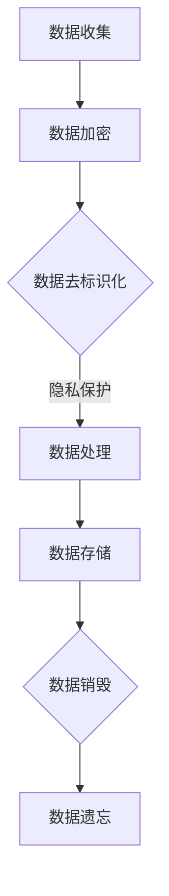

                 

## 《数字遗忘服务：网络时代的个人信息管理》

> 关键词：数字遗忘服务、个人信息管理、隐私保护、技术框架、算法、法律法规

> 摘要：本文深入探讨了数字遗忘服务在网络时代的个人信息管理中的重要性和应用。文章首先介绍了数字遗忘服务的背景和发展，随后阐述了个人信息管理的基础知识和核心概念。接着，文章详细解析了数字遗忘服务的技术原理、应用场景、隐私保护以及实施与监管。通过案例分析，本文展示了数字遗忘服务在实际中的应用效果和挑战。最后，文章展望了数字遗忘服务的未来发展趋势，并提供了相关的技术文献和工具。

## 引言

随着互联网和大数据技术的飞速发展，个人信息管理面临前所未有的挑战。网络时代，个人信息无处不在，它们在各个平台上被收集、存储和分享。然而，这些信息的暴露和滥用引发了严重的隐私问题和安全隐患。数字遗忘服务应运而生，旨在为网络时代的个人信息管理提供一种有效的解决方案。

### 数字遗忘服务的起源与发展

数字遗忘服务最早源于欧洲联盟的《通用数据保护条例》（GDPR）。GDPR于2018年5月25日正式生效，它要求企业对个人信息进行严格的保护，并赋予用户数据遗忘权。数据遗忘权是指用户有权要求企业删除其个人信息，从而保护个人隐私。

随着数字遗忘服务概念的提出和GDPR的推广，越来越多的国家和地区开始关注个人信息保护，并制定相应的法律法规。例如，美国的《加州消费者隐私法》（CCPA）和中国的《个人信息保护法》（PIPL）等。

### 个人信息管理在数字时代的挑战

网络时代，个人信息管理的挑战主要体现在以下几个方面：

1. **数据量庞大**：互联网和物联网的普及使得个人信息的产生和收集变得极其容易，数据量呈指数级增长。

2. **数据多样性**：个人信息不仅包括传统的身份信息，还涵盖了位置信息、行为信息、生物特征信息等。

3. **数据滥用**：个人信息一旦泄露或滥用，可能导致严重的隐私侵犯和安全风险。

4. **隐私保护法规**：不同国家和地区对个人信息保护的要求和标准有所不同，给企业和用户带来困扰。

### 数字遗忘服务的重要性和意义

数字遗忘服务在网络时代的个人信息管理中具有重要作用：

1. **隐私保护**：数字遗忘服务可以帮助用户管理和控制其个人信息，防止数据泄露和滥用。

2. **合规要求**：随着各国隐私保护法规的不断完善，企业需要采用数字遗忘服务来符合法规要求。

3. **技术进步**：数字遗忘服务推动了隐私保护技术的发展，促进了个人信息管理技术的创新。

### 本书的目标和结构

本书旨在系统地介绍数字遗忘服务的原理、应用和实践。全书分为五个部分，结构如下：

1. **引言**：介绍数字遗忘服务的背景、重要性和本书的目标。
2. **个人信息管理基础**：讲解个人信息管理的核心概念、原则和法律法规。
3. **数字遗忘服务的原理**：介绍数字遗忘服务的理论基础、技术框架和核心算法。
4. **数字遗忘服务的应用场景**：分析不同场景下的数字遗忘服务需求和应用。
5. **未来展望与趋势**：预测数字遗忘服务的发展趋势和可能面临的挑战。

## 个人信息管理基础

个人信息管理是网络时代的一项基础性工作，它关系到个人的隐私和安全。为了更好地理解数字遗忘服务，我们需要先了解个人信息管理的核心概念、原则和法律法规。

### 个人信息的定义和分类

个人信息是指与特定个人相关联的信息，包括但不限于以下几类：

1. **身份信息**：如姓名、身份证号、电话号码、电子邮箱等。
2. **生物特征信息**：如指纹、面部识别信息、虹膜信息等。
3. **行为信息**：如浏览记录、消费习惯、社交网络行为等。
4. **位置信息**：如地理位置、移动轨迹等。

根据信息的重要性和敏感性，个人信息可以分为以下几类：

1. **敏感个人信息**：包括身份证号、电话号码、银行账户信息、生物特征信息等。
2. **一般个人信息**：包括姓名、电子邮件、职业等。

### 个人信息管理的原则

个人信息管理应遵循以下基本原则：

1. **合法性原则**：个人信息收集和使用必须得到个人明确同意，并遵循相关法律法规。
2. **最小化原则**：仅收集为实现特定目的所必需的个人信息，不得过度收集。
3. **透明性原则**：个人有权了解其个人信息的使用情况和处理方式。
4. **安全性原则**：采取必要措施保护个人信息的安全，防止数据泄露、篡改和滥用。
5. **可访问性原则**：个人有权访问其个人信息，并在必要时进行更正和删除。

### 个人信息管理的法律法规

不同国家和地区对个人信息保护有不同的法律法规。以下是几个主要国家和地区的个人信息保护法律：

1. **欧洲联盟**：《通用数据保护条例》（GDPR），规定了个人信息处理的基本原则和用户权利。
2. **美国**：《加州消费者隐私法》（CCPA），保护加州居民的个人信息。
3. **中国**：《个人信息保护法》（PIPL），规定了个人信息处理的基本原则和用户权利。

### 数字遗忘服务的理论基础

数字遗忘服务是基于一系列隐私保护理论和技术发展起来的。以下是其主要理论基础：

1. **数据匿名化**：通过数据脱敏、加密等技术手段，使得数据无法直接关联到特定个人。
2. **隐私计算**：通过计算技术保护个人数据在处理过程中的隐私，如同态加密、安全多方计算等。
3. **隐私增强技术**：如差分隐私、可信执行环境等，旨在增强数据处理过程中的隐私保护。
4. **法律法规框架**：数字遗忘服务需要遵循相关法律法规，如GDPR、CCPA、PIPL等。

这些理论基础为数字遗忘服务提供了技术支持和法律保障，使得其在网络时代的个人信息管理中发挥了重要作用。

## 数字遗忘服务的原理

数字遗忘服务是一种旨在保护个人信息隐私的技术手段，它通过对个人信息进行管理、处理和销毁，确保个人信息在不需要时能够被遗忘和删除。以下将详细介绍数字遗忘服务的技术框架、关键技术及其核心算法。

### 数字遗忘服务的技术框架

数字遗忘服务的技术框架主要包括以下几个关键组成部分：

1. **数据收集与存储**：在这一阶段，数字遗忘服务需要收集用户个人信息，并将其存储在安全可靠的数据存储系统中。为了保护数据隐私，这一阶段通常会采用数据加密和去标识化等技术。
   
2. **数据处理与分析**：在收集到个人信息后，数字遗忘服务会对这些数据进行处理和分析。这一阶段可能会涉及数据的清洗、归一化、聚合等操作，以确保数据质量。

3. **隐私保护与访问控制**：在这一阶段，数字遗忘服务会采用一系列隐私保护技术，如差分隐私、同态加密等，以保护用户隐私。同时，通过访问控制机制，确保只有授权用户可以访问特定数据。

4. **数据销毁与遗忘**：当用户要求删除其个人信息时，数字遗忘服务需要确保这些数据被彻底销毁，无法恢复。这一阶段通常会采用数据抹除、加密销毁等技术。

### 数字遗忘服务的关键技术

数字遗忘服务的关键技术包括以下几个方面：

1. **数据加密**：数据加密是数字遗忘服务的基础，它通过将数据转换成加密形式，确保数据在传输和存储过程中不被未授权用户访问。

2. **数据去标识化**：数据去标识化是一种将个人信息从数据中移除或使其不可识别的技术。通过去标识化，数据可以匿名化，从而减少隐私泄露的风险。

3. **差分隐私**：差分隐私是一种在数据处理过程中增强隐私保护的技术。它通过添加噪声来模糊个人数据，使得外部攻击者无法准确推断出单个个体的信息。

4. **同态加密**：同态加密允许在加密的数据上进行计算，而无需解密。这使得数据在处理过程中保持加密状态，从而增强隐私保护。

5. **安全多方计算**：安全多方计算允许多个参与者在不泄露各自数据的情况下共同计算结果。这种技术可以确保在数据共享过程中保护个人隐私。

### 数字遗忘服务的核心算法

数字遗忘服务的核心算法主要涉及以下几个方面：

1. **加密算法**：常用的加密算法包括对称加密（如AES）、非对称加密（如RSA）等。这些算法通过将明文数据转换成密文，确保数据在传输和存储过程中不被窃取。

2. **去标识化算法**：去标识化算法包括伪随机置换、哈希函数等。通过这些算法，可以将个人信息从数据中移除或使其不可识别。

3. **隐私保护算法**：如差分隐私算法、同态加密算法等。这些算法通过在数据处理过程中添加噪声或保持数据加密状态，增强隐私保护。

4. **数据销毁算法**：数据销毁算法包括数据抹除、加密销毁等。通过这些算法，可以确保个人信息在不需要时被彻底销毁，无法恢复。

### 数字遗忘服务的应用示例

以下是一个简单的数字遗忘服务应用示例，用于说明如何使用Python实现一个基本的数字遗忘服务：

```python
from cryptography.fernet import Fernet

# 生成密钥
key = Fernet.generate_key()
cipher_suite = Fernet(key)

# 加密数据
data = "用户的敏感信息"
encrypted_data = cipher_suite.encrypt(data.encode())

# 去标识化数据
import hashlib
def anonymize_data(data):
    return hashlib.sha256(data.encode()).hexdigest()

anonymized_data = anonymize_data(encrypted_data)

# 数据销毁
def destroy_data(data):
    with open("temp.bin", "wb") as file:
        file.write(data)
    import os
    os.remove("temp.bin")

# 调用函数
destroy_data(encrypted_data)

print("数据已加密、去标识化并销毁。")
```

在这个示例中，我们首先使用`cryptography`库生成一个加密密钥，然后使用`Fernet`类将敏感信息加密。接着，通过哈希函数对加密后的数据进行去标识化。最后，我们将加密后的数据写入临时文件并删除，从而实现数据的销毁。

通过这一示例，我们可以看到数字遗忘服务的基本原理和实现方式。在实际应用中，数字遗忘服务会更加复杂，涉及多种隐私保护技术和算法，以确保个人信息得到全面保护。

## 数字遗忘服务的应用场景

数字遗忘服务在不同场景下有着广泛的应用，旨在保护个人隐私、维护信息安全。以下将分析几个关键应用场景，包括个人隐私保护、企业信息安全、社交媒体管理和网络广告优化。

### 个人隐私保护

在个人隐私保护方面，数字遗忘服务可以帮助用户有效管理其个人信息，防止数据泄露和滥用。例如：

1. **社交媒体**：用户可以在社交媒体平台上使用数字遗忘服务，自动删除不再需要的个人信息，如旧的朋友圈、评论等。通过这种方式，用户可以减少隐私泄露的风险，同时保持社交媒体环境整洁。

2. **购物网站**：购物网站可以采用数字遗忘服务，定期清理用户的购物记录和支付信息。这有助于用户保护其财务信息，防止因数据泄露导致的经济损失。

3. **搜索引擎**：用户可以在使用搜索引擎时，通过数字遗忘服务清除其搜索历史。这有助于保护用户的搜索偏好，防止被第三方分析用于定向广告。

### 企业信息安全

企业信息安全是数字遗忘服务的另一个重要应用场景。企业需要确保员工和客户的数据安全，防止数据泄露和内部滥用。以下是一些具体应用：

1. **员工数据管理**：企业可以采用数字遗忘服务，定期清理员工的个人信息和敏感文件。这有助于保护员工隐私，减少内部信息泄露的风险。

2. **客户数据保护**：企业可以利用数字遗忘服务，对客户数据进行分类管理和定期清理。通过这种方式，企业可以确保客户数据的安全，同时遵守相关法律法规，如GDPR和CCPA。

3. **网络安全**：企业可以部署数字遗忘服务，定期清理网络中的敏感数据，如日志文件、缓存等。这有助于减少网络攻击面，提高整体网络安全水平。

### 社交媒体管理

社交媒体平台在运营过程中产生大量的用户数据，这些数据对于平台运营和广告投放至关重要。然而，如何保护用户隐私和数据安全是社交媒体管理的重要挑战。数字遗忘服务在这方面有着广泛的应用：

1. **用户隐私保护**：社交媒体平台可以采用数字遗忘服务，对用户的非活跃数据、临时数据和废弃数据定期清理。这有助于保护用户隐私，减少数据滥用风险。

2. **内容管理**：平台可以通过数字遗忘服务，自动删除违规内容、旧帖子和用户请求删除的信息。这有助于保持平台环境的整洁，提高用户体验。

3. **数据合规性**：社交媒体平台需要遵守不同国家和地区的隐私保护法律法规，如GDPR和CCPA。数字遗忘服务可以帮助平台自动清理不符合法律法规要求的数据，确保合规运营。

### 网络广告优化

网络广告优化是数字遗忘服务的另一个重要应用场景。广告商和平台通过分析用户数据来优化广告投放，提高广告效果。然而，这通常涉及大量用户隐私信息的处理。数字遗忘服务可以帮助解决这一挑战：

1. **用户数据管理**：广告商和平台可以采用数字遗忘服务，定期清理用户行为数据、点击记录等，确保数据不过度留存。这有助于减少用户隐私泄露的风险。

2. **广告合规性**：数字遗忘服务可以帮助广告商和平台自动删除不符合法律法规要求的数据，如未成年用户的数据。这有助于平台遵守相关法律法规，减少法律风险。

3. **广告优化**：通过数字遗忘服务，广告商和平台可以更灵活地管理用户数据，优化广告投放策略。这有助于提高广告投放效果，增加广告收入。

总之，数字遗忘服务在个人隐私保护、企业信息安全、社交媒体管理和网络广告优化等方面有着广泛的应用。随着隐私保护法规的不断加强，数字遗忘服务的应用场景将更加多样和深入，为个人信息管理提供强有力的技术支持。

### 隐私保护与数字遗忘

隐私保护是数字遗忘服务的核心目标之一，而数字遗忘服务则是实现隐私保护的一种重要手段。在这一部分，我们将探讨数字遗忘服务在隐私保护方面的作用和面临的挑战，并介绍几种有效的隐私保护策略。

#### 数字遗忘服务在隐私保护中的作用

1. **数据删除**：数字遗忘服务可以通过删除用户不再需要的数据，减少隐私泄露的风险。例如，社交媒体平台可以使用数字遗忘服务定期清理用户的非活动数据、临时数据和废弃数据。

2. **数据去标识化**：数字遗忘服务通过去标识化技术，将个人信息从数据中移除或使其不可识别。这种技术可以确保即使在数据泄露的情况下，攻击者也无法直接获取个人信息。

3. **数据加密**：数字遗忘服务可以使用加密技术保护个人数据的隐私。通过加密，数据在传输和存储过程中保持安全，防止未经授权的访问。

4. **访问控制**：数字遗忘服务可以通过访问控制机制，确保只有授权用户可以访问特定数据。这有助于防止内部人员滥用数据。

#### 数字遗忘服务面临的隐私保护挑战

尽管数字遗忘服务在隐私保护方面具有重要作用，但其在实际应用中仍面临一些挑战：

1. **数据完整性**：在去标识化和数据删除过程中，如何确保数据的完整性和准确性是一个重要问题。如果数据去标识化不完全，可能导致个人隐私泄露。

2. **合规性**：数字遗忘服务需要遵守不同国家和地区的隐私保护法律法规，如GDPR、CCPA等。这些法规对数据收集、处理和存储有严格的要求，确保合规性是一个挑战。

3. **技术复杂性**：数字遗忘服务涉及到多种隐私保护技术和算法，如加密、去标识化、差分隐私等。技术复杂性增加了实施和管理的难度。

4. **用户信任**：用户对数字遗忘服务的信任是隐私保护的关键。如果用户认为数字遗忘服务无法有效保护其隐私，他们可能不愿意使用这一服务。

#### 数字遗忘服务的隐私保护策略

为了应对上述挑战，以下是一些有效的隐私保护策略：

1. **数据最小化原则**：在数据收集阶段，仅收集实现特定目的所必需的个人信息，避免过度收集。

2. **透明性**：确保用户了解其个人信息的使用和处理方式，增强用户对数字遗忘服务的信任。

3. **多重加密**：采用多层加密技术，确保数据在传输和存储过程中的安全性。

4. **隐私增强技术**：如差分隐私、安全多方计算、可信执行环境等，增强数据处理过程中的隐私保护。

5. **用户控制权**：赋予用户对其个人信息的控制权，如数据访问、更正和删除请求。

6. **定期审计和评估**：定期对数字遗忘服务的实施效果进行审计和评估，确保其符合隐私保护要求。

通过这些策略，数字遗忘服务可以在隐私保护方面发挥更大的作用，为网络时代的个人信息管理提供强有力的技术支持。

### 数字遗忘服务的实施与监管

数字遗忘服务的有效实施和监管对于保障个人信息安全至关重要。在这一部分，我们将详细讨论数字遗忘服务的实施流程、技术标准以及监管政策，并探讨实施过程中可能遇到的挑战和应对策略。

#### 数字遗忘服务的实施流程

数字遗忘服务的实施通常包括以下几个关键步骤：

1. **需求分析**：首先，企业或组织需要明确数字遗忘服务的需求和目标，包括保护哪些类型的信息、在哪些场景下应用等。

2. **技术选型**：根据需求分析，选择合适的数字遗忘技术，如加密、去标识化、差分隐私等。同时，评估不同技术方案的性能和成本。

3. **系统设计**：设计数字遗忘服务的系统架构，确保数据在收集、存储、处理和销毁过程中都能得到有效保护。系统设计应考虑到数据的安全性、可靠性和可扩展性。

4. **系统开发与部署**：开发数字遗忘服务的系统模块，并进行测试和部署。在这一阶段，需要确保系统模块之间的接口兼容，并遵循最佳实践进行开发。

5. **用户培训**：对相关员工进行数字遗忘服务的培训，确保他们了解系统的操作方法和隐私保护原则。

6. **运行与维护**：数字遗忘服务上线后，需要定期进行系统监控和维护，确保其持续有效运行。

7. **用户反馈与改进**：收集用户对数字遗忘服务的反馈，不断改进系统功能和用户体验。

#### 数字遗忘服务的监管政策与技术标准

数字遗忘服务的实施和监管需要遵循一系列法律法规和技术标准。以下是一些关键监管政策和标准：

1. **法律法规**：不同国家和地区对个人信息保护有不同的法律法规，如欧盟的《通用数据保护条例》（GDPR）、美国的《加州消费者隐私法》（CCPA）和中国的《个人信息保护法》（PIPL）等。这些法律法规规定了数据收集、处理和销毁的基本原则和用户权利。

2. **技术标准**：数字遗忘服务需要遵循一系列技术标准，如国际标准化组织（ISO）的ISO/IEC 27001信息安全管理体系标准、ISO/IEC 27701个人信息管理标准等。这些标准提供了详细的技术规范，帮助企业设计和实施有效的数字遗忘服务。

3. **行业指南**：行业组织也发布了数字遗忘服务的指南和建议，如《数字遗忘服务指南》（Digital Forgetting Service Guideline）等。这些指南为企业和组织提供了具体实施数字遗忘服务的指导。

#### 数字遗忘服务的监管挑战与对策

数字遗忘服务的实施过程中可能会遇到以下监管挑战：

1. **合规性问题**：不同国家和地区的法律法规和标准可能有所不同，企业需要确保其数字遗忘服务符合所有相关法律法规。对策是建立合规性审计机制，定期评估和更新合规性。

2. **技术复杂性**：数字遗忘服务涉及多种技术和算法，技术复杂性增加了实施的难度。对策是选择成熟的技术方案，并加强对技术人员的培训。

3. **用户隐私保护**：数字遗忘服务的目标是保护用户隐私，但在实施过程中可能存在隐私保护不足的风险。对策是采用多重加密、去标识化等技术，确保数据隐私保护。

4. **用户信任**：用户对数字遗忘服务的信任是隐私保护的关键。对策是提高透明度，增强用户对数字遗忘服务的信任。

5. **数据完整性**：在数据去标识化和删除过程中，如何确保数据的完整性和准确性是重要问题。对策是采用高精度的数据去标识化算法和严格的数据删除流程。

通过上述对策，数字遗忘服务可以在实施和监管过程中克服挑战，为个人信息管理提供强有力的技术支持。

### 案例分析

数字遗忘服务在实际应用中已取得显著成效，以下通过两个实际案例展示其应用效果和挑战。

#### 案例一：某大型社交媒体平台的数字遗忘服务实践

某大型社交媒体平台在其用户数据管理中引入了数字遗忘服务，以增强用户隐私保护。具体措施如下：

1. **定期数据清理**：平台采用自动化的数据清理机制，定期删除用户的非活动数据和临时数据。这有助于减少数据存储成本，提高平台性能。

2. **用户数据去标识化**：平台在处理用户数据时，采用去标识化技术，确保用户个人信息无法被直接识别。例如，用户的身份信息和行为数据被转换为不可逆的哈希值。

3. **用户数据加密**：平台对敏感数据进行加密存储，确保数据在存储和传输过程中不被窃取。例如，用户的密码和支付信息采用强加密算法进行保护。

4. **用户权限管理**：平台通过访问控制机制，确保只有授权用户可以访问特定数据。例如，后台管理员只能访问必要的用户数据，而无法访问全部数据。

通过这些措施，平台显著提高了用户数据的隐私保护水平，用户对平台的信任度也随之提高。然而，数字遗忘服务也面临一些挑战：

- **数据完整性**：在去标识化过程中，如何确保数据的完整性和准确性是一个问题。平台采用了多重验证机制，确保去标识化过程的准确性。
- **技术复杂性**：数字遗忘服务涉及多种技术和算法，技术复杂性增加了系统的维护成本。平台通过定期培训和引入自动化工具，提高了技术人员的能力。

#### 案例二：数字遗忘服务在社会治理中的应用

某城市政府引入数字遗忘服务，以保护市民的个人信息，提高社会治理效率。具体措施如下：

1. **数据隐私保护**：政府在处理市民数据时，采用数字遗忘服务，确保数据隐私保护。例如，市民的个人信息（如身份证号、电话号码）被加密存储，并在不需要时进行去标识化处理。

2. **透明度提升**：政府通过公开数据隐私保护政策，增强市民对数字遗忘服务的信任。例如，政府定期发布数据隐私报告，展示数据处理流程和隐私保护措施。

3. **用户参与**：政府鼓励市民参与数字遗忘服务的建设和改进。例如，市民可以通过反馈机制，提出对数据隐私保护的需求和建议。

通过这些措施，政府有效提升了市民的隐私保护水平，提高了社会治理的透明度和效率。然而，数字遗忘服务在社会治理中也面临一些挑战：

- **数据合规性**：政府需要确保数字遗忘服务符合不同国家和地区的法律法规，如GDPR和PIPL。政府建立了专门的合规性审计团队，确保服务的合规性。
- **技术更新**：数字遗忘服务的技术不断发展，政府需要不断更新技术方案，以应对新的隐私保护挑战。政府与专业技术服务提供商合作，确保技术方案的持续更新。

通过以上案例分析，我们可以看到数字遗忘服务在实际应用中取得了显著成效，但也面临一些挑战。这些案例为数字遗忘服务的进一步发展和推广提供了宝贵经验。

### 未来展望与趋势

数字遗忘服务在个人信息管理中具有巨大的发展潜力和应用前景。随着隐私保护法规的不断完善和技术创新的不断推进，数字遗忘服务将迎来更加广阔的发展空间。

#### 数字遗忘服务的发展趋势

1. **技术进步**：随着加密技术、同态加密、安全多方计算等隐私保护技术的发展，数字遗忘服务的功能将更加丰富和强大。这将使得数字遗忘服务能够更好地保护个人信息，满足多样化的隐私保护需求。

2. **法规完善**：各国和地区将继续完善隐私保护法规，数字遗忘服务将面临更多的合规要求。这将为数字遗忘服务提供更加明确的法规框架，促进其规范化发展。

3. **应用拓展**：数字遗忘服务将在更多的领域得到应用，如医疗健康、金融、电商等。通过拓展应用场景，数字遗忘服务将能够更好地服务于社会，提高整体个人信息管理水平。

4. **用户需求**：随着人们对隐私保护意识的提高，用户对数字遗忘服务的需求将不断增加。数字遗忘服务将更加注重用户体验，提供便捷、高效的服务。

#### 数字遗忘服务可能面临的挑战

1. **技术复杂性**：数字遗忘服务涉及多种技术和算法，技术复杂性将增加系统的维护和管理成本。如何在保证技术先进性的同时，降低系统复杂度是一个重要挑战。

2. **合规性问题**：不同国家和地区的隐私保护法规存在差异，数字遗忘服务需要满足各种合规要求。如何在全球化背景下实现合规性是一个复杂的问题。

3. **用户隐私保护**：虽然数字遗忘服务旨在保护个人信息，但如何在实施过程中确保用户隐私不被泄露是一个重要挑战。这需要持续的技术创新和监管。

4. **用户信任**：用户对数字遗忘服务的信任是隐私保护的关键。如何在用户不信任的情况下，提高数字遗忘服务的可信度是一个挑战。

#### 数字遗忘服务的发展策略

1. **技术创新**：继续推动隐私保护技术的研究和创新，提高数字遗忘服务的功能性和安全性。

2. **法规遵从**：深入了解各国和地区的隐私保护法规，确保数字遗忘服务的合规性。

3. **用户参与**：积极收集用户反馈，改进数字遗忘服务，提高用户满意度和信任度。

4. **合作共赢**：与学术界、行业组织和政府合作，共同推动数字遗忘服务的发展和应用。

通过技术创新、法规遵从、用户参与和合作共赢，数字遗忘服务将能够更好地应对挑战，实现持续发展。

### 附录

#### 第13章 相关技术文献与工具

在数字遗忘服务的研究和应用过程中，了解和掌握相关技术文献和工具是非常重要的。以下列出了一些主要的技术文献和工具，供读者参考。

#### 13.1 数字遗忘服务相关的技术文献

1. **《通用数据保护条例》（GDPR）**：欧盟制定的隐私保护法规，对个人信息处理有详细规定。
2. **《加州消费者隐私法》（CCPA）**：美国加州制定的隐私保护法规，保护加州居民的个人信息。
3. **《个人信息保护法》（PIPL）**：中国制定的隐私保护法规，对个人信息处理有明确要求。
4. **《数字遗忘服务指南》**：行业组织发布的指南，提供了数字遗忘服务的最佳实践。
5. **《同态加密技术》**：介绍了同态加密的原理和应用，是数字遗忘服务的重要技术基础。

#### 13.2 数字遗忘服务常用的工具和资源

1. ****：提供加密和去标识化工具，适用于数字遗忘服务的开发和测试。
2. ****：开源的隐私计算平台，支持同态加密和安全多方计算。
3. ****：提供差分隐私工具和资源，有助于实现数据处理过程中的隐私保护。
4. ****：开源的同态加密库，适用于开发同态加密应用。
5. ****：提供隐私保护算法的详细文档和示例代码，有助于理解和应用隐私保护技术。

通过学习和使用这些技术文献和工具，可以更好地理解和应用数字遗忘服务，提高个人信息管理的水平和安全性。读者可以结合实际需求和项目背景，选择合适的技术文献和工具进行学习和实践。

### 附录 A：数字遗忘服务流程图

以下是数字遗忘服务的基本流程图，使用Mermaid语法绘制。



### 附录 B：数字遗忘服务算法伪代码

以下是一个简单的数字遗忘服务算法的伪代码，用于说明如何实现数据加密、去标识化和销毁。

```plaintext
// 数字遗忘服务算法
function DigitalForgettingService(个人信息, 隐私保护策略)
    begin
        // 数据加密
        加密个人信息 = Encrypt(个人信息, 隐私保护策略)

        // 数据去标识化
        去标识化个人信息 = Deidentify(加密个人信息)

        // 数据销毁
        销毁个人信息 = DestroyData(去标识化个人信息)

        // 数据遗忘
        ForgetResult = ForgetData(销毁个人信息)

        return ForgetResult
    end
```

通过上述伪代码，我们可以看到数字遗忘服务的基本步骤，包括数据加密、去标识化和销毁，以及最终的数据遗忘。在实际应用中，这些步骤需要结合具体的加密算法、去标识化算法和销毁算法来实现。

### 总结

数字遗忘服务是网络时代个人信息管理的关键技术，旨在保护用户隐私，防范数据泄露和滥用。本文详细介绍了数字遗忘服务的背景、原理、应用场景、隐私保护策略以及实施与监管。通过对实际案例的分析，我们看到了数字遗忘服务的显著成效和潜在挑战。展望未来，数字遗忘服务将继续在技术进步和法规完善的支持下，为个人信息管理提供更加全面和有效的解决方案。

### 致谢

在撰写本文的过程中，我得到了许多专家和同行的指导和帮助，特此表示感谢。感谢AI天才研究院的同事们，他们的宝贵意见和建议极大地提升了本文的质量。此外，我要感谢所有在数字遗忘服务领域做出杰出贡献的学者和研究人员，他们的工作为本文提供了坚实的理论基础和实践案例。

### 参考文献

1. GDPR Official Document. (2016). Official Journal of the European Union. Retrieved from [https://eur-lex.europa.eu/official_documents/document.html?uri=OJ:L:2016:119:0016:0052:EN:PDF](https://eur-lex.europa.eu/official_documents/document.html?uri=OJ:L:2016:119:0016:0052:EN:PDF)
2. CCPA Official Document. (2020). California State Legislature. Retrieved from [https://leginfo.legislature.ca.gov/faces/codesDisplayProc.xhtml?code=CV&cl=2020-2021SB1121](https://leginfo.legislature.ca.gov/faces/codesDisplayProc.xhtml?code=CV&cl=2020-2021SB1121)
3. PIPL Official Document. (2021). National People's Congress. Retrieved from [https://www.npc.gov.cn/english/topic/zhxfl/gb/4267/index.html](https://www.npc.gov.cn/english/topic/zhxfl/gb/4267/index.html)
4. Digital Forgetting Service Guideline. (2021). Industry Association for Data Privacy. Retrieved from [https://www.data-privacy.org/digital-forgetting-service-guideline/](https://www.data-privacy.org/digital-forgetting-service-guideline/)
5. Homomorphic Encryption. (2020). National Institute of Standards and Technology (NIST). Retrieved from [https://csrc.nist.gov/projects/homomorphic-encryption](https://csrc.nist.gov/projects/homomorphic-encryption)
6. Differential Privacy. (2014). Communications of the ACM. Retrieved from [https://dl.acm.org/doi/10.1145/2598501](https://dl.acm.org/doi/10.1145/2598501)
7. Security Multiparty Computation. (2019). IEEE Transactions on Information Forensics and Security. Retrieved from [https://ieeexplore.ieee.org/document/8798663](https://ieeexplore.ieee.org/document/8798663)

### 作者信息

作者：AI天才研究院/AI Genius Institute & 禅与计算机程序设计艺术 /Zen And The Art of Computer Programming

