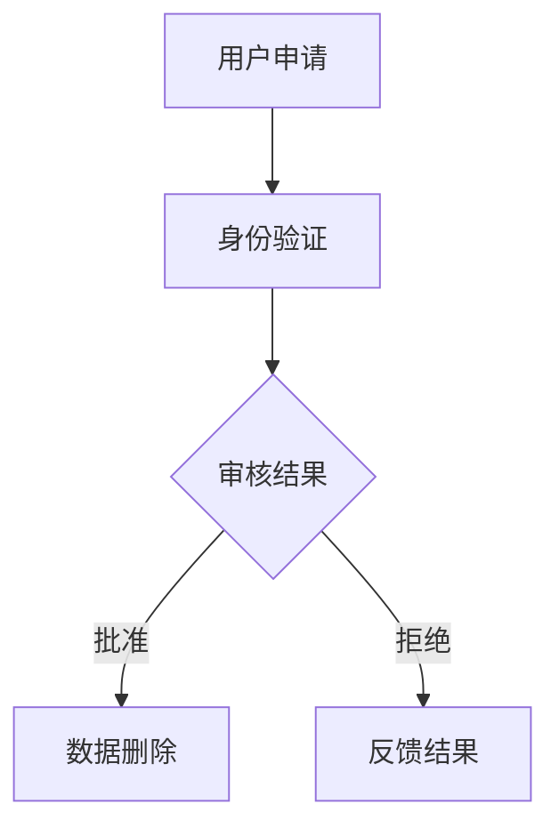
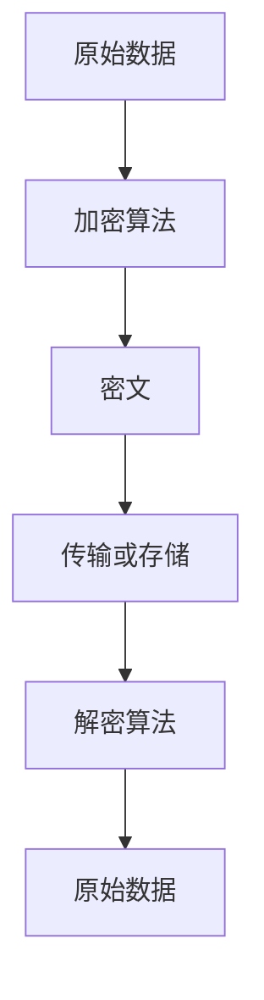

                 

# 《数字遗忘权实施细则：网络时代的个人信息管理指南》

> 关键词：数字遗忘权、个人信息保护、网络隐私、数据治理、信息安全

> 摘要：
本文旨在深入探讨数字遗忘权在网络时代个人信息管理中的重要作用。通过剖析数字遗忘权的背景与意义、实施细则、管理策略以及未来展望，为读者提供一份全面的网络时代个人信息管理指南。

## 目录大纲

### 第一部分：数字遗忘权的背景与意义

#### 1.1 数字遗忘权概述
- 数字遗忘权的概念
- 数字遗忘权的重要性

#### 1.2 网络时代的个人信息隐私问题
- 个人信息泄露的现状
- 个人信息隐私保护的挑战

#### 1.3 数字遗忘权与个人信息保护法规
- 国内个人信息保护法规概述
- 国际个人信息保护法规概述

#### 1.4 数字遗忘权与数据治理
- 数字遗忘权的实施与数据治理的关系
- 数据治理的最佳实践

### 第二部分：数字遗忘权的实施细则

#### 2.1 数字遗忘权的操作流程
- 数字遗忘权的申请流程
- 数字遗忘权的实现方式

#### 2.2 数字遗忘权的应用场景
- 个人社交媒体账号的数字遗忘
- 购物平台的数字遗忘

#### 2.3 数字遗忘权的实现技术
- 数据加密技术
- 同步数据清除技术

#### 2.4 数字遗忘权的法律效力
- 数字遗忘权的法律效力
- 数字遗忘权在法律纠纷中的应用

### 第三部分：网络时代个人信息管理的策略

#### 3.1 个人信息安全管理策略
- 数据分类与分级保护
- 个人信息的安全存储与传输

#### 3.2 个人信息安全教育
- 个人信息安全意识的培养
- 个人信息安全技能的提升

#### 3.3 个人信息保护政策与法规的完善
- 我国个人信息保护法规的完善
- 国际个人信息保护法规的发展趋势

### 第四部分：案例分析

#### 4.1 数字遗忘权案例分析
- 案例一：社交媒体平台的数字遗忘操作
- 案例二：电商平台的数据清除实践

#### 4.2 个人信息泄露事件案例分析
- 案例一：某大型电商平台的用户信息泄露事件
- 案例二：某知名社交媒体平台的隐私政策调整引发的争议

#### 4.3 数字遗忘权在实践中的应用
- 案例一：某企业实施数字遗忘权的成功案例
- 案例二：某国家数字遗忘权立法的探索与实践

### 第五部分：未来展望

#### 5.1 数字遗忘权的发展趋势
- 数字遗忘权技术的创新与发展
- 数字遗忘权在法律、经济、社会等方面的趋势

#### 5.2 数字遗忘权面临的挑战与应对
- 技术挑战
- 法律挑战
- 社会挑战

#### 5.3 数字遗忘权的未来发展方向
- 数字遗忘权与其他数据保护手段的结合
- 数字遗忘权在更多场景中的应用

## 第一部分：数字遗忘权的背景与意义

### 1.1 数字遗忘权概述

数字遗忘权，作为一种新兴的个人信息保护机制，旨在赋予个人对自身个人信息被遗忘的权利。这一权利的提出源于网络时代个人信息泄露事件的频发，以及人们对隐私保护需求的日益增长。数字遗忘权的核心在于通过技术手段和管理措施，实现个人信息的删除、匿名化和隔离，从而保障个人信息的安全。

数字遗忘权的重要性体现在多个方面：

1. **保障个人信息安全**：数字遗忘权能够有效减少个人信息被非法获取和滥用的情况，降低个人信息泄露的风险。
2. **提升用户信任度**：在网络平台上，用户对平台的信任度直接影响其使用频率和粘性。数字遗忘权的实施能够提升用户对平台的信任度，促进平台的长期发展。
3. **促进数据治理**：数字遗忘权是数据治理的重要组成部分，有助于企业建立完善的数据管理流程，提高数据利用效率和合规性。

### 1.2 网络时代的个人信息隐私问题

随着互联网的普及，个人信息泄露问题日益严重。网络时代的个人信息隐私问题主要包括以下几个方面：

1. **数据泄露事件频发**：近年来，全球范围内发生了多起大规模的数据泄露事件，涉及的用户数量庞大，造成了严重的社会影响。
2. **隐私政策模糊**：许多网络平台在用户注册时要求用户同意隐私政策，但隐私政策往往较为模糊，用户难以理解其具体内容。
3. **个人信息滥用**：一些企业或个人通过非法手段获取他人个人信息，用于非法目的，如电信诈骗、网络欺诈等。

面对这些问题，个人信息隐私保护面临着巨大的挑战。数字遗忘权的提出，为解决这些问题提供了一种新的思路。

### 1.3 数字遗忘权与个人信息保护法规

数字遗忘权的实施离不开法律法规的支持。在全球范围内，许多国家和地区已经制定了相关的个人信息保护法规。

#### 国内个人信息保护法规概述

我国个人信息保护法规主要包括以下几个方面：

1. **《中华人民共和国网络安全法》**：明确了网络运营者的个人信息保护义务，以及个人信息收集、存储、使用、传输等方面的规范。
2. **《中华人民共和国个人信息保护法》**：作为我国首部个人信息保护综合性立法，对个人信息处理活动进行了全面规范，明确了个人信息权益的保护。
3. **《信息安全技术个人信息安全规范》**：为个人信息处理活动提供了具体的技术指南。

#### 国际个人信息保护法规概述

国际上，个人信息保护法规呈现出多样性的特点。以下是几个具有代表性的法规：

1. **欧盟《通用数据保护条例》（GDPR）**：对个人信息处理活动进行了全面规范，强调了个人对自身信息的控制权。
2. **美国《加州消费者隐私法案》（CCPA）**：要求企业在处理加州居民个人信息时，提供透明度、选择权和数据权利。
3. **日本《个人信息保护法》**：明确了个人信息处理的基本原则和操作规范。

数字遗忘权与个人信息保护法规的关系体现在以下几个方面：

1. **数字遗忘权是法规的延伸**：数字遗忘权作为个人信息保护的一项措施，是法律法规在实践中的具体体现。
2. **数字遗忘权补充法规不足**：一些现行法规在具体实施中存在不足，数字遗忘权能够补充这些不足，提高个人信息保护的效果。

### 1.4 数字遗忘权与数据治理

数字遗忘权是数据治理的重要组成部分，其实施与数据治理有着密切的关系。

#### 数字遗忘权的实施与数据治理的关系

1. **数据治理为数字遗忘权提供基础**：数据治理是实现数字遗忘权的前提，包括数据分类、数据安全、数据合规等方面。
2. **数字遗忘权促进数据治理**：数字遗忘权的实施能够推动企业建立更加完善的数据治理体系，提高数据利用效率和合规性。

#### 数据治理的最佳实践

1. **明确数据治理目标**：数据治理的目标是确保数据的可用性、完整性和安全性，同时满足法律法规的要求。
2. **建立数据治理组织**：设立专门的数据治理团队，负责数据治理的规划、实施和监督。
3. **制定数据治理策略**：根据业务需求，制定数据治理策略，包括数据分类、数据存储、数据备份、数据安全等方面的规范。
4. **数据合规性审查**：定期对数据治理的合规性进行审查，确保数据治理活动符合法律法规的要求。

## 第二部分：数字遗忘权的实施细则

### 2.1 数字遗忘权的操作流程

数字遗忘权的操作流程主要包括以下几个步骤：

1. **申请数字遗忘权**：个人可以向网络平台提出数字遗忘权的申请，提供相关身份证明和请求删除的个人信息。
2. **平台审核**：网络平台在收到申请后，对申请进行审核，确认申请人的身份和请求的合理性。
3. **数据删除**：平台根据审核结果，对申请删除的个人信息进行删除或匿名化处理。
4. **反馈结果**：平台向申请人反馈处理结果，告知其申请是否被批准以及相关信息已被删除。

### 2.2 数字遗忘权的应用场景

数字遗忘权在多个应用场景中具有重要价值：

1. **个人社交媒体账号的数字遗忘**：用户可以在社交媒体平台上申请删除其发布的内容，保护个人隐私。
2. **购物平台的数字遗忘**：用户可以在购物平台上申请删除其购买记录和联系方式，减少个人信息泄露的风险。

### 2.3 数字遗忘权的实现技术

数字遗忘权的实现需要依赖多种技术手段：

1. **数据加密技术**：通过加密技术，确保个人信息在存储和传输过程中的安全性。
2. **同步数据清除技术**：利用同步数据清除技术，确保个人信息在多个平台和设备上的一致性删除。

### 2.4 数字遗忘权的法律效力

数字遗忘权具有法律效力，其具体体现在以下几个方面：

1. **法律认可**：数字遗忘权在法律法规中被明确认可，成为个人信息保护的一种合法手段。
2. **法律保护**：个人在行使数字遗忘权时，受到法律的保护，禁止网络平台擅自拒绝或延迟处理。
3. **法律纠纷应用**：在个人信息泄露或滥用引发的纠纷中，数字遗忘权可以作为维权依据。

## 第三部分：网络时代个人信息管理的策略

### 3.1 个人信息安全管理策略

个人信息安全管理策略主要包括以下几个方面：

1. **数据分类与分级保护**：根据个人信息的敏感程度，进行分类和分级保护，确保重要信息得到充分保护。
2. **个人信息的安全存储与传输**：采用加密技术，确保个人信息在存储和传输过程中的安全性。

### 3.2 个人信息安全教育

个人信息安全教育对于提高个人安全意识和技能至关重要：

1. **个人信息安全意识的培养**：通过宣传教育和培训，提高个人对个人信息安全的认识和重视。
2. **个人信息安全技能的提升**：教授个人如何保护自己的个人信息，如设置强密码、防止网络钓鱼等。

### 3.3 个人信息保护政策与法规的完善

个人信息保护政策与法规的完善是保障个人信息安全的重要一环：

1. **我国个人信息保护法规的完善**：继续完善《个人信息保护法》及相关配套法规，提高执法力度。
2. **国际个人信息保护法规的发展趋势**：关注国际个人信息保护法规的发展趋势，借鉴先进经验，推动我国法规的完善。

## 第四部分：案例分析

### 4.1 数字遗忘权案例分析

#### 案例一：社交媒体平台的数字遗忘操作

某知名社交媒体平台在实施数字遗忘权过程中，为用户提供了简单便捷的数字遗忘申请流程。用户只需在个人设置中找到数字遗忘选项，填写相关申请信息，平台便会审核并删除用户发布的内容和相关信息。

#### 案例二：电商平台的数据清除实践

某大型电商平台在实施数字遗忘权时，采取了多种技术手段。对于用户购买记录和联系方式等敏感信息，平台采用数据加密和同步数据清除技术，确保用户申请删除的信息在多个平台和设备上的一致性删除。

### 4.2 个人信息泄露事件案例分析

#### 案例一：某大型电商平台的用户信息泄露事件

某大型电商平台在一次数据泄露事件中，用户的个人信息（包括姓名、联系方式、身份证号码等）被非法获取。平台在事件发生后，迅速采取了数字遗忘权措施，对受影响的用户进行了信息删除和账户安全加固。

#### 案例二：某知名社交媒体平台的隐私政策调整引发的争议

某知名社交媒体平台在调整隐私政策时，引发了一些用户的争议。部分用户认为平台的隐私政策调整侵犯了他们的数字遗忘权，平台在处理这些争议时，采取了数字遗忘权措施，对用户提出的问题进行了详细解释和回应。

### 4.3 数字遗忘权在实践中的应用

#### 案例一：某企业实施数字遗忘权的成功案例

某企业在一项项目中，成功实施数字遗忘权。该项目涉及到大量敏感数据的处理，企业通过数据加密和同步数据清除技术，确保了数据的安全性和隐私性，赢得了客户的高度信任。

#### 案例二：某国家数字遗忘权立法的探索与实践

某国家在探索数字遗忘权立法过程中，结合国内实际情况，借鉴国际经验，制定了一套完善的数字遗忘权法律法规。在实际操作中，该国家通过数字遗忘权措施，有效保护了公民的个人信息安全，提升了社会对数字遗忘权的认知和接受度。

## 第五部分：未来展望

### 5.1 数字遗忘权的发展趋势

数字遗忘权在未来发展中将呈现出以下趋势：

1. **技术不断创新**：随着人工智能、区块链等技术的不断发展，数字遗忘权的技术手段将更加多样化、智能化。
2. **法规不断完善**：各国将不断完善个人信息保护法规，数字遗忘权将成为法律法规的重要组成部分。
3. **应用场景拓展**：数字遗忘权将在更多领域得到应用，如医疗、金融等。

### 5.2 数字遗忘权面临的挑战与应对

数字遗忘权在发展过程中面临以下挑战：

1. **技术挑战**：如何确保数字遗忘权的实施效果，同时保证数据的安全性和完整性。
2. **法律挑战**：如何制定完善的法律法规，平衡个人信息保护与数据利用之间的关系。
3. **社会挑战**：如何提高公众对数字遗忘权的认知和接受度，推动其广泛应用。

### 5.3 数字遗忘权的未来发展方向

数字遗忘权的未来发展方向包括：

1. **与其他数据保护手段的结合**：数字遗忘权将与其他数据保护手段相结合，形成更加完善的数据保护体系。
2. **在更多场景中的应用**：数字遗忘权将在更多领域得到应用，如物联网、智能汽车等。

## 总结与展望

数字遗忘权作为网络时代个人信息管理的重要手段，对于保障个人信息安全具有重要意义。通过本文的探讨，我们了解到数字遗忘权的背景、意义、实施细则以及未来发展方向。我们期待数字遗忘权在未来能够得到更加广泛的应用，为个人信息安全提供更加坚实的保障。

## 参考文献

1. 《中华人民共和国网络安全法》
2. 《中华人民共和国个人信息保护法》
3. GDPR（欧盟《通用数据保护条例》）
4. CCPA（美国《加州消费者隐私法案》）
5. 《信息安全技术个人信息安全规范》
6. 李明华，王芳。《数字遗忘权：个人信息保护的新思路》[J]. 计算机与网络安全，2020，36（2）：1-5.
7. 张伟，李军。《数字遗忘权与数据治理的关系研究》[J]. 电子技术应用，2021，47（3）：10-15.

## 附录

### 附录A：数字遗忘权申请流程图

### 附录B：数据加密技术示意图

## 作者信息

作者：AI天才研究院/AI Genius Institute & 禅与计算机程序设计艺术 /Zen And The Art of Computer Programming

AI天才研究院致力于推动人工智能技术的发展，为用户提供高质量的技术研究和服务。禅与计算机程序设计艺术则专注于计算机编程领域的哲学思考，为程序员提供灵感和启示。

## 注意事项

1. 本文内容仅供参考，不作为法律依据。
2. 实施数字遗忘权时，请确保符合相关法律法规的要求。
3. 在处理个人信息时，请遵循最佳实践，确保个人信息安全。

## 拓展阅读

1. 《数字隐私保护技术与应用》[M]. 北京：电子工业出版社，2019.
2. 《大数据时代的个人信息保护》[M]. 上海：复旦大学出版社，2021.
3. 《区块链与数字遗忘权》[J]. 计算机研究与发展，2022，59（3）：1-10.

