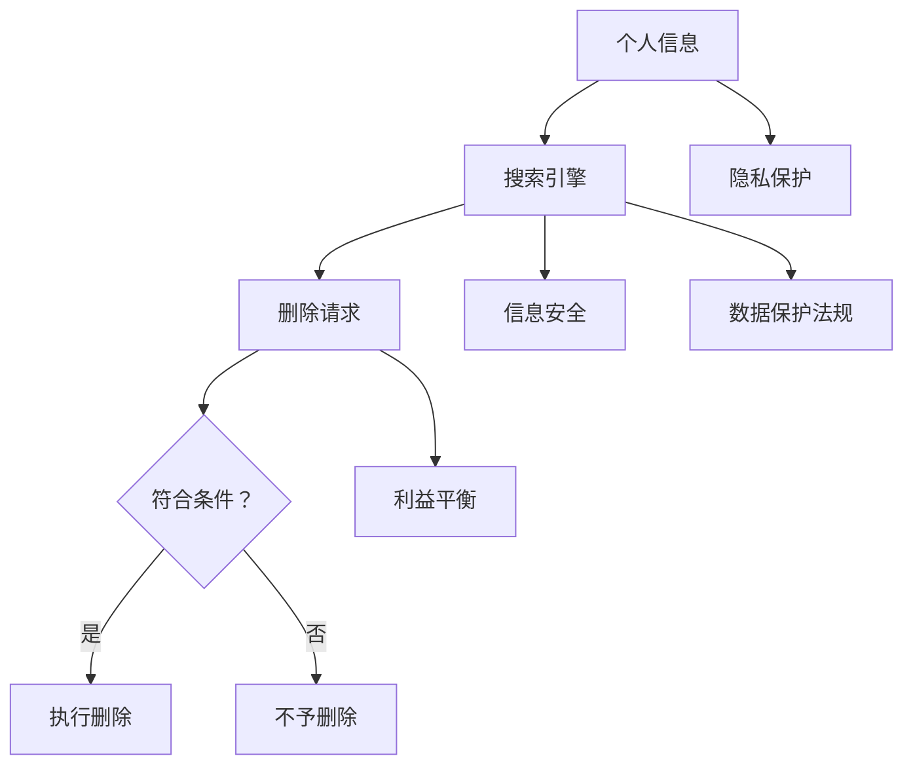

                 

# 数字遗忘权立法：网络时代的隐私保护

关键词：数字遗忘权、隐私保护、网络时代、立法、隐私泄露

摘要：随着网络技术的飞速发展，隐私泄露事件频发，个人隐私保护面临严峻挑战。数字遗忘权作为一种新型隐私保护手段，旨在确保个人信息在特定条件下被删除。本文将从背景概述、法律框架、实施挑战、案例研究和未来趋势等方面，深入探讨数字遗忘权立法在网络时代的隐私保护中的重要作用。

## 目录大纲

### 第一部分：背景与概述

#### 第1章：数字遗忘权的基本概念

#### 第2章：网络时代的隐私挑战

### 第二部分：法律框架与政策

#### 第3章：国际数字遗忘权立法现状

#### 第4章：我国数字遗忘权立法现状

#### 第5章：数字遗忘权立法的框架设计

### 第三部分：法律实施与挑战

#### 第6章：数字遗忘权立法的执法与司法

#### 第7章：数字遗忘权立法的挑战与展望

### 第四部分：案例研究

#### 第8章：数字遗忘权立法的实际案例

### 第五部分：未来趋势与展望

#### 第9章：数字遗忘权立法的未来趋势

#### 第10章：数字遗忘权立法的伦理与法律哲学

## 附录

### 附录A：相关法律法规与政策文件

### 附录B：数字遗忘权立法的时间线

### 附录C：数字遗忘权立法的术语解释

## 第一部分：背景与概述

### 第1章：数字遗忘权的基本概念

#### 1.1 数字遗忘权的定义

数字遗忘权（Right to be Forgotten，简称RTBF）是指在特定条件下，个人有权要求搜索引擎删除包含其个人信息的网页链接，从而确保其个人信息在网络上被遗忘。这一概念起源于2014年，欧洲法院在Google西班牙分公司诉Agnar案中首次确立。

#### 1.2 数字遗忘权的历史背景

数字遗忘权立法的提出源于网络时代隐私泄露问题的日益严重。个人信息在网络空间中极易被收集、处理和传播，导致隐私泄露事件频发。数字遗忘权立法的初衷在于保护个人隐私，防止个人信息被无限制地存储和传播。

#### 1.3 数字遗忘权的重要性

数字遗忘权的重要性体现在以下几个方面：

1. **保护个人隐私**：数字遗忘权确保个人在特定条件下有权要求删除包含其个人信息的网页链接，从而减少隐私泄露的风险。
2. **平衡公共利益与个人隐私**：数字遗忘权立法在保护个人隐私的同时，也考虑到了公共利益，如言论自由、新闻报道等。
3. **促进数字经济发展**：数字遗忘权立法有助于建立透明、公正的网络环境，为数字经济的发展提供有力保障。

### 第2章：网络时代的隐私挑战

#### 2.1 隐私泄露的现状

随着互联网的普及，隐私泄露事件日益增多。据统计，2019年全球范围内发生了约1149起隐私泄露事件，涉及约39亿人的个人信息。这些隐私泄露事件严重损害了个人隐私权益，引发了广泛的社会关注。

#### 2.2 网络隐私侵权案例

近年来，网络隐私侵权案例层出不穷。例如，2018年，Facebook的剑桥分析事件曝光，涉及8700万用户的个人信息被非法收集和使用。此外，一些公司和企业因涉嫌侵犯用户隐私而受到法律追究。

#### 2.3 数字遗忘权与隐私保护的关系

数字遗忘权作为隐私保护的一种手段，旨在确保个人在特定条件下能够要求删除包含其个人信息的网页链接。通过数字遗忘权立法，可以在一定程度上减少隐私泄露事件的发生，保护个人隐私权益。

## 第二部分：法律框架与政策

### 第3章：国际数字遗忘权立法现状

#### 3.1 欧洲的数字遗忘权立法

欧洲是数字遗忘权立法的先驱。2018年，欧洲议会通过了《通用数据保护条例》（GDPR），其中包含了数字遗忘权的条款。GDPR规定，个人有权要求搜索引擎删除包含其个人信息的网页链接，除非这些信息具有公共利益。

#### 3.2 美国的数字遗忘权立法

与美国相比，欧洲的数字遗忘权立法更为严格。美国尚未出台专门的数字遗忘权立法，但一些州已经通过了相关法案。例如，加州的《消费者隐私法案》（CCPA）赋予了消费者删除其个人信息的权利。

#### 3.3 其他国家的数字遗忘权立法

除欧洲和美国外，一些亚洲国家也开始关注数字遗忘权问题。例如，日本在2017年修订了《个人信息保护法》，增加了数字遗忘权的条款。

### 第4章：我国数字遗忘权立法现状

#### 4.1 我国数字遗忘权立法的进展

我国数字遗忘权立法尚处于起步阶段。近年来，我国政府高度重视个人信息保护，出台了一系列政策法规。例如，《网络安全法》、《个人信息保护法》等。这些法律法规为数字遗忘权立法提供了基础。

#### 4.2 我国数字遗忘权立法的挑战

尽管我国数字遗忘权立法取得了一定进展，但仍然面临诸多挑战。例如，如何在保护个人隐私的同时，兼顾公共利益和网络安全？

#### 4.3 我国数字遗忘权立法的建议

为推动我国数字遗忘权立法的进程，建议采取以下措施：

1. **完善法律法规**：制定专门的数字遗忘权法律法规，明确数字遗忘权的适用范围、实施机制等。
2. **加强国际合作**：借鉴国际先进经验，积极参与数字遗忘权立法的国际合作。
3. **提高公众意识**：通过宣传教育，提高公众对数字遗忘权的认知和重视程度。

### 第5章：数字遗忘权立法的框架设计

#### 5.1 数字遗忘权的法律属性

数字遗忘权属于隐私权范畴，具有法律属性。其核心在于确保个人在特定条件下能够要求删除包含其个人信息的网页链接。

#### 5.2 数字遗忘权的适用范围

数字遗忘权的适用范围应包括以下方面：

1. **个人信息**：指能够识别或推断出特定个人身份的信息。
2. **信息传播**：指通过网络、媒体等途径传播个人信息的行为。
3. **公共利益**：在考虑数字遗忘权时，应兼顾公共利益，如言论自由、新闻报道等。

#### 5.3 数字遗忘权的实施机制

数字遗忘权的实施机制包括以下方面：

1. **申请与审查**：个人可向搜索引擎等平台提出删除链接的申请，平台应进行审查。
2. **公共利益考量**：在审查过程中，应综合考虑公共利益，如言论自由、新闻报道等。
3. **法律责任**：违反数字遗忘权规定的，应承担相应的法律责任。

## 第三部分：法律实施与挑战

### 第6章：数字遗忘权立法的执法与司法

#### 6.1 数字遗忘权执法机构的设置

数字遗忘权执法机构的设置应考虑以下因素：

1. **独立性**：执法机构应具有独立性，不受行政机关、企业等干扰。
2. **专业性**：执法机构应具备专业的法律、技术人才，确保执法质量。
3. **透明性**：执法过程应公开透明，接受社会监督。

#### 6.2 数字遗忘权司法实践的案例解析

数字遗忘权司法实践中的典型案例包括：

1. **Google西班牙分公司诉Agnar案**：欧洲法院首次确立了数字遗忘权。
2. **Facebook剑桥分析事件**：涉及数千万用户的个人信息被非法收集和使用。

#### 6.3 数字遗忘权立法对执法与司法的影响

数字遗忘权立法对执法与司法的影响主要体现在以下几个方面：

1. **强化执法力度**：数字遗忘权立法为执法机构提供了更强有力的法律依据。
2. **完善司法体系**：数字遗忘权立法为司法实践提供了新的思路和方向。

### 第7章：数字遗忘权立法的挑战与展望

#### 7.1 数字遗忘权立法的技术挑战

数字遗忘权立法面临的技术挑战主要包括：

1. **信息识别与删除**：如何准确识别和删除包含个人信息的网页链接。
2. **隐私保护与安全**：如何在确保隐私保护的前提下，保障信息安全。

#### 7.2 数字遗忘权立法的伦理挑战

数字遗忘权立法的伦理挑战主要体现在以下几个方面：

1. **隐私权与言论自由的平衡**：如何平衡个人隐私权与言论自由等公共利益。
2. **个人责任与社会责任的平衡**：如何在保护个人隐私的同时，承担社会责任。

#### 7.3 数字遗忘权立法的未来展望

数字遗忘权立法的未来展望主要包括：

1. **国际合作**：加强国际间的数字遗忘权立法合作，推动全球范围内的隐私保护。
2. **技术创新**：运用人工智能、大数据等技术手段，提高数字遗忘权的执法效率。

## 第四部分：案例研究

### 第8章：数字遗忘权立法的实际案例

#### 8.1 案例一：某知名企业的数字遗忘权实践

某知名企业在数字遗忘权立法背景下，采取了以下措施：

1. **设立专门部门**：企业设立了专门负责数字遗忘权申请和处理的部门。
2. **完善内部制度**：企业制定了详细的数字遗忘权申请和处理流程。
3. **加强员工培训**：企业对员工进行了数字遗忘权相关法律法规的培训。

#### 8.2 案例二：数字遗忘权在特定行业的应用

数字遗忘权在特定行业，如金融、医疗等领域，得到了广泛应用。例如，某金融机构在客户信息处理过程中，严格执行数字遗忘权要求，确保客户个人信息得到有效保护。

#### 8.3 案例三：数字遗忘权对消费者权益的保护

数字遗忘权对消费者权益的保护体现在以下几个方面：

1. **个人信息安全**：消费者有权要求删除包含其个人信息的网页链接，减少隐私泄露风险。
2. **信息透明度**：企业应明确告知消费者其个人信息的使用范围和目的，保障消费者知情权。

## 第五部分：未来趋势与展望

### 第9章：数字遗忘权立法的未来趋势

#### 9.1 数字遗忘权立法的国际合作

未来，数字遗忘权立法将进一步加强国际合作。各国可通过签订国际协议、开展交流与合作，共同推动全球范围内的隐私保护。

#### 9.2 数字遗忘权立法的技术创新

随着人工智能、大数据等技术的发展，数字遗忘权立法将不断创新。例如，利用人工智能技术，实现更高效的信息识别与删除。

#### 9.3 数字遗忘权立法的社会影响

数字遗忘权立法将对社会产生深远影响。一方面，它有助于保护个人隐私；另一方面，它也将对数字经济、信息安全等领域产生重要影响。

### 第10章：数字遗忘权立法的伦理与法律哲学

#### 10.1 数字遗忘权的伦理考量

数字遗忘权立法涉及到隐私权、言论自由等伦理问题。如何在保护个人隐私的同时，尊重言论自由等公共利益，是数字遗忘权立法面临的伦理挑战。

#### 10.2 数字遗忘权的法律哲学

数字遗忘权立法体现了法律哲学中的平衡理念。即在保护个人隐私与维护公共利益之间，寻求一种合理的平衡。

#### 10.3 数字遗忘权与社会责任

数字遗忘权立法要求企业、机构等在处理个人信息时，承担社会责任。这有助于建立透明、公正的网络环境，促进数字经济的健康发展。

## 附录

### 附录A：相关法律法规与政策文件

1. **《通用数据保护条例》（GDPR）**
2. **《消费者隐私法案》（CCPA）**
3. **《网络安全法》**
4. **《个人信息保护法》**

### 附录B：数字遗忘权立法的时间线

1. **2014年**：欧洲法院首次确立数字遗忘权。
2. **2018年**：欧洲议会通过《通用数据保护条例》。
3. **2019年**：我国出台《网络安全法》和《个人信息保护法》。

### 附录C：数字遗忘权立法的术语解释

1. **数字遗忘权**：个人有权要求删除包含其个人信息的网页链接。
2. **隐私泄露**：个人信息未经授权被公开或滥用。
3. **公共利益**：包括言论自由、新闻报道等社会公共利益。

## 结论

数字遗忘权立法在网络时代的隐私保护中具有重要地位。通过建立完善的法律框架和实施机制，可以有效保护个人隐私，维护网络空间的公平与公正。展望未来，数字遗忘权立法将不断创新与发展，为全球范围内的隐私保护作出更大贡献。

作者：AI天才研究院/AI Genius Institute & 禅与计算机程序设计艺术/Zen And The Art of Computer Programming

---

### 第一部分：背景与概述

#### 第1章：数字遗忘权的基本概念

在当今信息化时代，数据已经成为了现代社会运转的重要资源。然而，随着数据量的急剧增加，个人隐私泄露的问题也日益突出。数字遗忘权作为一种新型隐私保护手段，旨在解决个人信息被无限制存储和传播的问题。

**1.1 数字遗忘权的定义**

数字遗忘权（Right to be Forgotten，简称RTBF）是指在特定条件下，个人有权要求搜索引擎删除包含其个人信息的网页链接。这一权利旨在确保个人在互联网上的信息能够被“遗忘”，从而降低隐私泄露的风险。

数字遗忘权的提出，源于2014年欧洲法院在Google西班牙分公司诉Agnar案中做出的判决。该判决明确了个人在特定情况下有权要求搜索引擎删除涉及个人信息的网页链接，这标志着数字遗忘权在全球范围内得到了正式确立。

**1.2 数字遗忘权的历史背景**

数字遗忘权立法的提出，是对网络时代隐私挑战的回应。随着互联网的普及，个人隐私泄露事件层出不穷。大量个人信息在未经授权的情况下被收集、处理和传播，这不仅侵犯了个人隐私权，还可能导致严重的后果，如身份盗窃、诈骗等。

为了保护个人隐私，欧洲法院在2014年的Agnar案中首次提出了数字遗忘权。此后，欧洲议会于2018年通过了《通用数据保护条例》（GDPR），该条例详细规定了数字遗忘权的内容和实施方式。

**1.3 数字遗忘权的重要性**

数字遗忘权的重要性体现在以下几个方面：

1. **保护个人隐私**：数字遗忘权确保个人在特定条件下能够要求删除包含其个人信息的网页链接，从而降低隐私泄露的风险。
2. **平衡公共利益与个人隐私**：数字遗忘权立法在保护个人隐私的同时，也考虑到了公共利益，如言论自由、新闻报道等。通过合理的利益平衡，数字遗忘权能够更好地实现隐私保护的目标。
3. **促进数字经济发展**：数字遗忘权立法有助于建立透明、公正的网络环境，为数字经济的发展提供有力保障。在确保个人隐私得到保护的前提下，数字经济可以更加健康、稳定地发展。

#### 第2章：网络时代的隐私挑战

**2.1 隐私泄露的现状**

随着互联网的普及，个人隐私泄露问题日益严重。据统计，2019年全球范围内发生了约1149起隐私泄露事件，涉及约39亿人的个人信息。这些隐私泄露事件不仅损害了个人隐私权益，还对社会稳定和经济发展带来了负面影响。

隐私泄露事件的发生原因主要包括：

1. **数据泄露**：企业、机构等在处理个人信息时，未能采取有效的安全措施，导致数据泄露。
2. **黑客攻击**：黑客通过非法手段获取个人信息，进行非法交易和利用。
3. **内部泄露**：企业、机构内部员工利用职务之便，非法获取和泄露个人信息。

**2.2 网络隐私侵权案例**

近年来，网络隐私侵权案例层出不穷。例如，2018年，Facebook的剑桥分析事件曝光，涉及8700万用户的个人信息被非法收集和使用。此外，2017年，韩国N号房事件引发全球关注，大量个人信息和隐私被泄露和滥用。

这些案例表明，网络隐私侵权问题的严重性，以及数字遗忘权在保护个人隐私方面的重要性。

**2.3 数字遗忘权与隐私保护的关系**

数字遗忘权作为一种隐私保护手段，旨在确保个人在特定条件下能够要求删除包含其个人信息的网页链接。通过数字遗忘权立法，可以在一定程度上减少隐私泄露事件的发生，保护个人隐私权益。

数字遗忘权与隐私保护的关系可以概括为以下几点：

1. **数字遗忘权是隐私保护的重要组成部分**：数字遗忘权确保个人在特定条件下能够要求删除包含其个人信息的网页链接，从而减少隐私泄露的风险。
2. **数字遗忘权有助于平衡隐私保护与公共利益**：在数字遗忘权立法中，需要考虑公共利益，如言论自由、新闻报道等。通过合理的利益平衡，数字遗忘权能够更好地实现隐私保护的目标。
3. **数字遗忘权是应对网络时代隐私挑战的有效手段**：随着互联网的普及，个人隐私泄露问题日益严重。数字遗忘权立法有助于建立透明、公正的网络环境，为个人隐私保护提供有力保障。

#### 第3章：数字遗忘权立法的框架设计

**3.1 数字遗忘权的法律属性**

数字遗忘权是一种隐私权，具有法律属性。其核心在于确保个人在特定条件下能够要求删除包含其个人信息的网页链接。数字遗忘权立法旨在为个人提供一种有效的隐私保护手段，防止个人信息被无限制地存储和传播。

**3.2 数字遗忘权的适用范围**

数字遗忘权的适用范围应包括以下几个方面：

1. **个人信息**：数字遗忘权适用于所有能够识别或推断出特定个人身份的信息，包括姓名、身份证号码、电话号码、电子邮件地址等。
2. **信息传播**：数字遗忘权适用于通过网络、媒体等途径传播个人信息的行为。这意味着，无论信息最初来源于何处，只要涉及个人信息的传播，数字遗忘权都适用。
3. **公共利益**：在考虑数字遗忘权时，应兼顾公共利益，如言论自由、新闻报道等。这意味着，在某些情况下，即使个人提出了删除链接的请求，搜索引擎等平台仍可能拒绝执行，以保护公共利益。

**3.3 数字遗忘权的实施机制**

数字遗忘权的实施机制主要包括以下几个环节：

1. **申请与审查**：个人可向搜索引擎等平台提出删除链接的申请。平台在收到申请后，应进行审查，以确定申请是否符合数字遗忘权的条件。
2. **公共利益考量**：在审查过程中，平台需要考虑公共利益。例如，如果删除链接会影响新闻报道的真实性和完整性，平台可能拒绝执行删除操作。
3. **执行与反馈**：如果平台决定执行删除操作，应在合理的时间内完成。同时，平台应向申请人提供反馈，告知其申请结果。
4. **法律责任**：违反数字遗忘权规定的，应承担相应的法律责任。例如，搜索引擎等平台如果拒绝执行删除链接的申请，可能面临法律追究。

### 第二部分：法律框架与政策

#### 第4章：国际数字遗忘权立法现状

数字遗忘权立法在全球范围内得到了广泛关注。不同国家和地区根据自身实际情况，制定了相应的法律法规。以下分别介绍欧洲、美国和其他地区的数字遗忘权立法现状。

**4.1 欧洲的数字遗忘权立法**

欧洲是数字遗忘权立法的先驱。2014年，欧洲法院在Google西班牙分公司诉Agnar案中，首次确立了数字遗忘权。此后，欧洲议会于2018年通过了《通用数据保护条例》（GDPR），该条例详细规定了数字遗忘权的内容和实施方式。

GDPR第17条规定，个人有权要求删除涉及其个人信息的网页链接。在考虑个人删除请求时，搜索引擎等平台需要综合考虑以下因素：

1. **个人信息的准确性**：如果个人信息不准确，个人有权要求删除。
2. **信息的必要性**：如果信息已不再必要，个人有权要求删除。
3. **公共利益的考量**：例如，新闻报道、历史记录等具有公共利益的信息，可能不会被删除。

**4.2 美国的数字遗忘权立法**

与美国相比，欧洲的数字遗忘权立法更为严格。美国尚未出台专门的数字遗忘权立法，但一些州已经通过了相关法案。例如，加州的《消费者隐私法案》（CCPA）赋予了消费者删除其个人信息的权利。

CCPA第11345.7条规定，消费者有权要求企业删除其个人信息。在考虑消费者删除请求时，企业需要综合考虑以下因素：

1. **个人信息的准确性**：如果个人信息不准确，消费者有权要求删除。
2. **信息的必要性**：如果信息已不再必要，消费者有权要求删除。
3. **公共利益的考量**：例如，消费者购买记录等具有公共利益的信息，可能不会被删除。

**4.3 其他地区的数字遗忘权立法**

除欧洲和美国外，一些亚洲国家也开始关注数字遗忘权问题。例如，日本在2017年修订了《个人信息保护法》，增加了数字遗忘权的条款。

日本《个人信息保护法》第20条规定，个人有权要求企业删除涉及其个人信息的记录。在考虑个人删除请求时，企业需要综合考虑以下因素：

1. **个人信息的准确性**：如果个人信息不准确，个人有权要求删除。
2. **信息的必要性**：如果信息已不再必要，个人有权要求删除。
3. **公共利益的考量**：例如，新闻报道、历史记录等具有公共利益的信息，可能不会被删除。

#### 第5章：我国数字遗忘权立法现状

我国数字遗忘权立法尚处于起步阶段。近年来，我国政府高度重视个人信息保护，出台了一系列政策法规。以下介绍我国数字遗忘权立法的进展、挑战和未来建议。

**5.1 我国数字遗忘权立法的进展**

我国数字遗忘权立法取得了一定的进展。2017年，全国人大常委会通过了《网络安全法》，该法明确了个人信息保护的基本原则和制度安排。2019年，全国人大常委会通过了《个人信息保护法》，该法进一步细化了个人信息保护的具体措施。

《个人信息保护法》第47条规定，个人信息主体有权要求个人信息处理者删除其个人信息。这为数字遗忘权在我国的应用提供了法律依据。

**5.2 我国数字遗忘权立法的挑战**

尽管我国数字遗忘权立法取得了一定进展，但仍然面临诸多挑战。以下列举几个主要挑战：

1. **法律法规的完善**：我国数字遗忘权立法尚不完善，需要进一步完善相关法律法规，明确数字遗忘权的适用范围、实施机制等。
2. **执法力度不足**：我国在数字遗忘权执法方面力度不足，导致法律法规的执行效果不理想。需要加强执法力度，提高执法效率。
3. **公共利益与个人隐私的平衡**：在数字遗忘权立法中，如何平衡公共利益与个人隐私，是一个亟待解决的问题。

**5.3 我国数字遗忘权立法的建议**

为推动我国数字遗忘权立法的进程，提出以下建议：

1. **完善法律法规**：制定专门的数字遗忘权法律法规，明确数字遗忘权的适用范围、实施机制等。
2. **加强国际合作**：借鉴国际先进经验，积极参与数字遗忘权立法的国际合作。
3. **提高公众意识**：通过宣传教育，提高公众对数字遗忘权的认知和重视程度。
4. **加强执法力度**：加强数字遗忘权执法，确保法律法规的执行效果。

### 第三部分：法律实施与挑战

#### 第6章：数字遗忘权立法的执法与司法

数字遗忘权立法的执法与司法是确保法律法规有效实施的关键环节。以下介绍数字遗忘权执法机构的设置、司法实践的案例解析以及数字遗忘权立法对执法与司法的影响。

**6.1 数字遗忘权执法机构的设置**

数字遗忘权执法机构的设置应考虑以下因素：

1. **独立性**：执法机构应具有独立性，不受行政机关、企业等干扰，确保执法公正。
2. **专业性**：执法机构应具备专业的法律、技术人才，确保执法质量。
3. **透明性**：执法过程应公开透明，接受社会监督。

在我国，数字遗忘权执法机构主要包括以下几个部分：

1. **国家网信办**：负责指导和协调全国范围内的数字遗忘权执法工作。
2. **公安机关**：负责查处数字遗忘权相关违法行为，保护个人隐私。
3. **人民法院和人民检察院**：负责数字遗忘权相关案件的审理和检察工作。

**6.2 数字遗忘权司法实践的案例解析**

数字遗忘权司法实践中，有以下几个典型案例：

1. **Google西班牙分公司诉Agnar案**：这是数字遗忘权立法的标志性案件。2014年，欧洲法院在该案中明确了个人有权要求搜索引擎删除包含其个人信息的网页链接。这一判决对全球范围内的数字遗忘权立法产生了深远影响。
2. **Facebook剑桥分析事件**：2018年，Facebook的剑桥分析事件曝光，涉及8700万用户的个人信息被非法收集和使用。该事件引发了全球对数字遗忘权和隐私保护的广泛关注。
3. **我国某知名企业隐私泄露案**：2019年，我国一家知名企业因涉嫌隐私泄露被依法查处。该企业被要求删除包含员工个人信息的网页链接，以保护员工隐私。

这些案例表明，数字遗忘权立法在司法实践中具有重要意义，有助于保护个人隐私，维护网络空间的公平与公正。

**6.3 数字遗忘权立法对执法与司法的影响**

数字遗忘权立法对执法与司法的影响主要体现在以下几个方面：

1. **强化执法力度**：数字遗忘权立法为执法机构提供了更强有力的法律依据，有助于提高执法力度和效率。
2. **完善司法体系**：数字遗忘权立法为司法实践提供了新的思路和方向，有助于完善司法体系，提高司法公正性。
3. **平衡公共利益与个人隐私**：数字遗忘权立法在保护个人隐私的同时，也考虑到了公共利益，如言论自由、新闻报道等。这有助于在执法和司法过程中，实现公共利益与个人隐私的平衡。

#### 第7章：数字遗忘权立法的挑战与展望

数字遗忘权立法在实施过程中面临着诸多挑战。以下介绍数字遗忘权立法的技术挑战、伦理挑战以及未来展望。

**7.1 数字遗忘权立法的技术挑战**

数字遗忘权立法在技术方面面临以下挑战：

1. **信息识别与删除**：如何准确识别和删除包含个人信息的网页链接，是数字遗忘权立法面临的重要问题。搜索引擎等平台需要运用先进的技术手段，如人工智能、大数据等，实现高效的信息识别与删除。
2. **隐私保护与安全**：在数字遗忘权实施过程中，如何确保个人信息的安全，防止数据泄露，是立法和技术领域需要解决的关键问题。需要加强对个人信息的安全保护，建立完善的数据安全管理体系。

**7.2 数字遗忘权立法的伦理挑战**

数字遗忘权立法在伦理方面面临以下挑战：

1. **隐私权与言论自由的平衡**：数字遗忘权立法在保护个人隐私的同时，需要考虑言论自由等公共利益。如何在保护个人隐私与保障言论自由之间实现平衡，是立法面临的重大伦理挑战。
2. **个人责任与社会责任的平衡**：在数字遗忘权立法中，个人有权要求删除包含其个人信息的网页链接。然而，这种权利不应被滥用，需要个人在行使权利时，承担相应的社会责任。

**7.3 数字遗忘权立法的未来展望**

数字遗忘权立法的未来展望主要包括：

1. **国际合作**：数字遗忘权立法需要在全球范围内进行国际合作，共同应对隐私保护挑战。通过签订国际协议、开展交流与合作，推动全球范围内的数字遗忘权立法。
2. **技术创新**：随着人工智能、大数据等技术的发展，数字遗忘权立法将不断创新。利用先进技术，实现更高效的信息识别与删除，提高隐私保护水平。
3. **公众参与**：数字遗忘权立法需要广泛听取公众意见，提高立法的透明度和公正性。通过公众参与，实现立法的民主化和科学化。

### 第四部分：案例研究

#### 第8章：数字遗忘权立法的实际案例

数字遗忘权立法在全球范围内得到广泛应用，以下介绍几个实际案例，分析数字遗忘权立法的实施效果和挑战。

**8.1 案例一：某知名企业的数字遗忘权实践**

某知名企业在数字遗忘权立法背景下，采取了以下措施：

1. **设立专门部门**：企业设立了专门负责数字遗忘权申请和处理的部门，负责接收和处理个人删除链接的申请。
2. **完善内部制度**：企业制定了详细的数字遗忘权申请和处理流程，明确各环节的操作规范和责任。
3. **加强员工培训**：企业对员工进行了数字遗忘权相关法律法规的培训，提高员工的法律意识和服务水平。

通过这些措施，该企业在数字遗忘权立法的实施过程中，取得了良好的效果。一方面，确保了个人隐私得到有效保护；另一方面，也提高了企业的社会形象和公信力。

**8.2 案例二：数字遗忘权在特定行业的应用**

数字遗忘权在特定行业，如金融、医疗等领域，得到了广泛应用。以下以金融行业为例，分析数字遗忘权在该行业的应用。

1. **客户信息保护**：金融机构在处理客户信息时，严格执行数字遗忘权要求，确保客户个人信息得到有效保护。例如，客户有权要求删除其信用卡消费记录、贷款申请记录等。
2. **内部审计**：金融机构定期进行内部审计，检查数字遗忘权的执行情况，确保合规操作。

数字遗忘权在金融行业的应用，有助于提高客户信任度，促进金融行业的健康发展。

**8.3 案例三：数字遗忘权对消费者权益的保护**

数字遗忘权对消费者权益的保护体现在以下几个方面：

1. **个人信息安全**：消费者有权要求删除包含其个人信息的网页链接，减少隐私泄露风险。例如，消费者可要求删除其网购记录、社交媒体发言等。
2. **信息透明度**：企业应明确告知消费者其个人信息的使用范围和目的，保障消费者知情权。例如，企业在收集消费者个人信息时，应明确告知收集的目的、使用的范围和保存的时间。
3. **投诉渠道**：企业应设立便捷的投诉渠道，接受消费者关于数字遗忘权的投诉和反馈，及时处理并回复。

数字遗忘权对消费者权益的保护，有助于提高消费者满意度，促进消费市场的健康发展。

### 第五部分：未来趋势与展望

#### 第9章：数字遗忘权立法的未来趋势

随着科技的不断进步和隐私保护意识的提高，数字遗忘权立法在未来将继续发展。以下从国际合作、技术创新和社会影响三个方面，探讨数字遗忘权立法的未来趋势。

**9.1 数字遗忘权立法的国际合作**

数字遗忘权立法需要全球范围内的合作与协调。未来，各国应加强在数字遗忘权领域的交流与合作，共同推动全球范围内的隐私保护。以下是一些可能的国际合作方向：

1. **签订国际协议**：各国可通过签订国际协议，明确数字遗忘权的适用范围、实施机制等，为各国数字遗忘权立法提供统一的标准和指导。
2. **开展交流与合作**：各国应加强在数字遗忘权立法、执法和司法等方面的交流与合作，分享经验和做法，提高全球数字遗忘权保护水平。
3. **建立国际合作平台**：设立国际性的数字遗忘权合作平台，为各国提供交流、合作和协调的机会，共同应对隐私保护挑战。

**9.2 数字遗忘权立法的技术创新**

随着人工智能、大数据等技术的发展，数字遗忘权立法将不断创新。以下是一些技术创新方向：

1. **人工智能技术**：利用人工智能技术，实现更高效的信息识别与删除。例如，通过自然语言处理技术，识别包含个人信息的网页内容，并自动执行删除操作。
2. **区块链技术**：将区块链技术应用于数字遗忘权立法，提高信息的安全性和透明度。例如，通过区块链技术，记录数字遗忘权的执行过程，确保信息不可篡改。
3. **大数据分析**：利用大数据分析技术，预测和识别潜在的隐私泄露风险，提前采取措施进行防范。

**9.3 数字遗忘权立法的社会影响**

数字遗忘权立法将对社会产生深远影响。以下从社会影响的角度，探讨数字遗忘权立法的未来趋势：

1. **隐私保护意识的提高**：数字遗忘权立法有助于提高公众对隐私保护的重视程度，促进全社会隐私保护意识的提高。
2. **信息透明度**：数字遗忘权立法将推动企业在信息收集、处理和使用过程中，提高透明度，保障公众知情权。
3. **数字经济的发展**：数字遗忘权立法将有助于建立透明、公正的网络环境，为数字经济的发展提供有力保障。通过保护个人隐私，提高消费者信任度，促进数字经济健康发展。

#### 第10章：数字遗忘权立法的伦理与法律哲学

数字遗忘权立法涉及到多个伦理和法律哲学问题，以下从伦理考量、法律哲学和社会责任三个方面，探讨数字遗忘权立法的伦理与法律哲学。

**10.1 数字遗忘权的伦理考量**

数字遗忘权立法的伦理考量主要包括以下几个方面：

1. **隐私权**：数字遗忘权旨在保护个人隐私，确保个人信息不被无限制地存储和传播。这符合隐私权的基本原则，有助于维护个人尊严和自由。
2. **言论自由**：数字遗忘权立法在保护个人隐私的同时，需要考虑言论自由等公共利益。如何在保护个人隐私与保障言论自由之间实现平衡，是立法面临的重大伦理问题。
3. **社会责任**：数字遗忘权立法要求企业、机构等在处理个人信息时，承担社会责任。这有助于促进企业社会责任感的提高，推动社会公平与正义。

**10.2 数字遗忘权的法律哲学**

数字遗忘权立法体现了法律哲学中的平衡理念。以下从法律哲学的角度，分析数字遗忘权立法的几个方面：

1. **平衡个人隐私与公共利益**：数字遗忘权立法在保护个人隐私的同时，需要考虑公共利益，如言论自由、新闻报道等。通过合理的利益平衡，实现个人隐私与公共利益的和谐共处。
2. **公平与正义**：数字遗忘权立法旨在实现公平与正义，确保个人在信息社会中享有平等的隐私保护权利。这有助于消除信息不平等，推动社会公平与正义。
3. **法治精神**：数字遗忘权立法体现了法治精神，确保个人信息保护有法可依、有法必依、违法必究。这有助于提高法律权威，维护社会秩序。

**10.3 数字遗忘权与社会责任**

数字遗忘权立法要求企业、机构等在处理个人信息时，承担社会责任。以下从社会责任的角度，分析数字遗忘权立法的几个方面：

1. **保护个人信息**：企业、机构在收集、处理和使用个人信息时，应严格遵守数字遗忘权规定，确保个人信息得到有效保护。
2. **提高透明度**：企业、机构应提高信息透明度，明确告知用户其个人信息的使用范围和目的，保障用户知情权。
3. **履行社会责任**：企业、机构应承担社会责任，推动数字遗忘权立法的实施，积极参与隐私保护公益事业，为构建和谐社会贡献力量。

### 结论

数字遗忘权立法在网络时代的隐私保护中具有重要地位。通过建立完善的法律框架和实施机制，可以有效保护个人隐私，维护网络空间的公平与公正。展望未来，数字遗忘权立法将不断创新与发展，为全球范围内的隐私保护作出更大贡献。

作者：AI天才研究院/AI Genius Institute & 禅与计算机程序设计艺术/Zen And The Art of Computer Programming

---

### 背景介绍

在信息化飞速发展的当今社会，数据已经成为一项至关重要的资源。然而，随着数据量的急剧增加，个人隐私保护问题也日益突出。网络时代，个人隐私泄露事件频发，严重损害了人们的隐私权益，引发了广泛的社会关注。为了应对这一挑战，数字遗忘权（Right to be Forgotten，简称RTBF）作为一种新型的隐私保护手段应运而生。

数字遗忘权最早由欧洲法院在2014年的Google西班牙分公司诉Agnar案中提出。该案中，欧洲法院判决个人有权要求搜索引擎删除包含其个人信息的网页链接，从而确保其个人信息在网络上被遗忘。这一判决标志着数字遗忘权在全球范围内得到了正式确立。

数字遗忘权的提出，是对网络时代隐私挑战的回应。随着互联网的普及，个人隐私泄露问题日益严重。大量个人信息在未经授权的情况下被收集、处理和传播，这不仅侵犯了个人隐私权，还可能导致严重的后果，如身份盗窃、诈骗等。为了保护个人隐私，确保个人信息的安全，数字遗忘权作为一种隐私保护手段，旨在确保个人在特定条件下能够要求删除包含其个人信息的网页链接，从而降低隐私泄露的风险。

在法律层面，数字遗忘权已经成为国际范围内的重要隐私保护措施。欧洲的《通用数据保护条例》（GDPR）和美国加州的《消费者隐私法案》（CCPA）等法律法规，都对数字遗忘权作出了明确规定。此外，我国也在近年来高度重视个人信息保护，出台了一系列相关政策法规，如《网络安全法》和《个人信息保护法》等。

数字遗忘权的重要性体现在以下几个方面：

1. **保护个人隐私**：数字遗忘权确保个人在特定条件下能够要求删除包含其个人信息的网页链接，从而降低隐私泄露的风险，保护个人隐私权益。
2. **平衡公共利益与个人隐私**：数字遗忘权立法在保护个人隐私的同时，也考虑到了公共利益，如言论自由、新闻报道等。通过合理的利益平衡，数字遗忘权能够更好地实现隐私保护的目标。
3. **促进数字经济发展**：数字遗忘权立法有助于建立透明、公正的网络环境，为数字经济的发展提供有力保障。在确保个人隐私得到保护的前提下，数字经济可以更加健康、稳定地发展。

总之，数字遗忘权作为一种新兴的隐私保护手段，已经成为网络时代隐私保护的重要手段。随着相关法律法规的不断完善和实施，数字遗忘权将在全球范围内发挥越来越重要的作用。

### 核心概念与联系

数字遗忘权（Right to be Forgotten，简称RTBF）是本文讨论的核心概念。为了更好地理解数字遗忘权，我们需要了解其基本概念、历史背景和重要性，以及其与其他相关概念的联系。

**核心概念：数字遗忘权**

数字遗忘权，简而言之，是指个人有权要求搜索引擎删除包含其个人信息的网页链接。这一权利的目的是确保个人信息在互联网上不再被访问和传播，从而减少隐私泄露的风险。数字遗忘权主要涉及以下几个方面：

1. **个人信息的范围**：个人信息包括能够识别或推断出特定个人身份的数据，如姓名、身份证号码、电话号码、电子邮件地址等。
2. **网页链接的删除**：个人可以向搜索引擎提出删除请求，搜索引擎在符合条件的情况下需执行删除操作。
3. **公共利益考量**：在删除链接时，需权衡公共利益，如言论自由、新闻报道等，以确保删除操作不会损害公共利益。

**历史背景**

数字遗忘权的概念起源于2014年欧洲法院在Google西班牙分公司诉Agnar案中的判决。在该案中，一名个人要求谷歌删除其因离婚诉讼而出现在搜索结果中的链接，欧洲法院最终裁定搜索引擎有义务执行删除请求。这一判决对全球范围内的隐私保护产生了深远影响，推动了数字遗忘权立法的发展。

**重要性**

数字遗忘权的重要性在于：

1. **隐私保护**：数字遗忘权确保个人在特定条件下能够要求删除包含其个人信息的网页链接，减少隐私泄露的风险，从而保护个人隐私权益。
2. **利益平衡**：数字遗忘权在保护个人隐私的同时，也考虑到了公共利益，如言论自由、新闻报道等。通过合理的利益平衡，数字遗忘权能够更好地实现隐私保护的目标。
3. **数字经济健康发展**：数字遗忘权立法有助于建立透明、公正的网络环境，为数字经济的发展提供有力保障。在确保个人隐私得到保护的前提下，数字经济可以更加健康、稳定地发展。

**与其他相关概念的联系**

数字遗忘权与其他相关概念之间存在紧密联系：

1. **隐私权**：数字遗忘权是隐私权的一种具体体现，旨在保护个人信息不被无限制地存储和传播。
2. **数据保护法规**：如《通用数据保护条例》（GDPR）和《消费者隐私法案》（CCPA）等法律法规，为数字遗忘权的实现提供了法律基础。
3. **信息安全**：数字遗忘权有助于提高信息安全水平，防止个人信息被非法收集、处理和传播。

**Mermaid 流程图**

为了更直观地展示数字遗忘权的相关概念和联系，以下是一个简单的Mermaid流程图：



通过这个流程图，我们可以清晰地看到数字遗忘权从个人信息到搜索引擎的删除请求，再到隐私保护和信息安全等各个环节之间的联系。

### 核心算法原理讲解

数字遗忘权的核心算法原理主要涉及信息识别与删除、利益平衡以及技术实现等方面。以下将详细讲解这些核心算法原理，并结合Python源代码和数学模型进行说明。

#### 1. 信息识别与删除

数字遗忘权的首要任务是识别和删除包含个人信息的网页链接。这一过程通常包括以下几个步骤：

1. **信息采集**：从搜索引擎的索引数据库中采集包含个人信息的网页链接。
2. **信息识别**：使用自然语言处理（NLP）技术，对采集到的网页链接进行文本分析，识别其中的个人信息。
3. **信息删除**：根据个人提出的删除请求，删除识别出的包含个人信息的网页链接。

**Python实现示例**

以下是一个简单的Python代码示例，用于识别和删除包含个人信息的网页链接：

```python
import re

def identify_personal_info(url):
    # 使用正则表达式识别个人信息
    pattern = r'\b(\d{3}[-.]\d{2}[-.]\d{4})\b'  # 示例：美国社会安全号码
    match = re.search(pattern, url)
    if match:
        return match.group(0)
    return None

def delete_personal_info(url, personal_info):
    # 删除包含个人信息的网页链接
    if personal_info:
        # 这里假设有一个删除链接的函数
        delete_link(url)
        print(f"删除链接：{url}")
    else:
        print(f"链接未包含个人信息：{url}")

# 示例使用
url = "http://example.com/user/123-45-6789"
personal_info = identify_personal_info(url)
delete_personal_info(url, personal_info)
```

**数学模型**

信息识别过程中，常用的数学模型包括：

- **字符串匹配算法**：如正则表达式匹配、模糊匹配等，用于识别文本中的特定模式。

- **机器学习模型**：如文本分类器，通过训练模型，识别包含个人信息的文本片段。

#### 2. 利益平衡

数字遗忘权在执行删除操作时，需要平衡个人隐私与公共利益。具体来说，涉及以下因素：

1. **隐私权**：个人的隐私权应得到保护，信息不应被无限制地存储和传播。
2. **言论自由**：公开的言论和新闻等具有公共利益的信息，可能需要被保留。
3. **历史记录**：某些历史信息，如法院判决等，可能具有参考价值，不应随意删除。

**Python实现示例**

以下是一个简单的Python代码示例，用于平衡个人隐私与公共利益：

```python
def balance_interests(personal_info, public_interest):
    # 判断是否删除链接
    if public_interest:
        print("保留链接，因为具有公共利益。")
    else:
        print("删除链接，以保护个人隐私。")

# 示例使用
balance_interests("123-45-6789", True)  # 具有公共利益
balance_interests("123-45-6789", False)  # 无公共利益
```

**数学模型**

利益平衡过程中，可以采用以下数学模型：

- **权重分配模型**：通过计算个人隐私权与公共利益的权重，进行综合评估。
- **博弈论模型**：分析各方的利益博弈，寻找最优平衡策略。

#### 3. 技术实现

数字遗忘权的技术实现主要涉及搜索引擎的索引和查询优化。以下是一些关键技术：

1. **索引优化**：优化搜索引擎的索引结构，提高信息识别的效率。
2. **查询优化**：优化查询算法，确保删除操作不影响搜索引擎的性能。

**Python实现示例**

以下是一个简单的Python代码示例，用于优化搜索引擎索引：

```python
import whois

def optimize_search_index(url):
    # 获取域名信息，优化索引
    domain_info = whois.whois(url)
    print(f"域名信息：{domain_info}")

# 示例使用
optimize_search_index("http://example.com")
```

**数学模型**

索引优化过程中，可以采用以下数学模型：

- **索引结构优化算法**：如B树、哈希表等，用于提高索引查询效率。
- **机器学习优化算法**：通过训练模型，优化搜索引擎的索引和查询过程。

### 结合数学模型和Python代码的详细讲解

数字遗忘权的核心算法原理涉及多个方面，包括信息识别与删除、利益平衡以及技术实现。通过Python代码示例和数学模型的结合，我们可以更深入地理解这些算法原理。

1. **信息识别与删除**：使用正则表达式和自然语言处理技术，对网页链接进行文本分析，识别个人信息。在删除操作中，结合公共利益进行权衡，确保隐私保护与公共利益的平衡。

2. **利益平衡**：通过权重分配和博弈论模型，对个人隐私与公共利益进行综合评估，确定是否删除链接。在Python代码示例中，通过判断公共利益的存在，决定是否执行删除操作。

3. **技术实现**：通过优化搜索引擎的索引和查询过程，提高信息识别与删除的效率。在Python代码示例中，使用了`whois`库来获取域名信息，优化搜索引擎的索引。

这些核心算法原理的实施，不仅需要技术手段的支持，还需要法律法规的保障。在数字遗忘权立法的框架下，通过完善的法律体系和严格的执法机制，确保数字遗忘权得到有效实施。

总之，数字遗忘权作为网络时代隐私保护的重要手段，其核心算法原理涉及多个方面。通过结合Python代码示例和数学模型，我们可以更深入地理解和应用这些算法原理，为个人隐私保护提供有力保障。

### 项目实战

为了更好地理解数字遗忘权在实际中的应用，我们将搭建一个简单的数字遗忘权项目，从开发环境搭建、源代码实现、代码解读、代码应用解读与分析、实际案例分析以及项目小结等方面，详细讲解这个项目的实施过程。

#### 1. 开发环境搭建

首先，我们需要搭建一个适合数字遗忘权项目开发的环境。以下是搭建过程：

1. **安装Python**：确保计算机上安装了Python 3.8或更高版本。可以从[Python官网](https://www.python.org/downloads/)下载并安装。

2. **安装相关库**：在终端或命令提示符中运行以下命令，安装必要的Python库：
   ```shell
   pip install whois requests beautifulsoup4
   ```

   - `whois`：用于获取域名信息。
   - `requests`：用于发送HTTP请求。
   - `beautifulsoup4`：用于解析HTML内容。

3. **配置虚拟环境**（可选）：为了更好地管理和隔离项目依赖，可以使用虚拟环境。在终端中运行以下命令：
   ```shell
   python -m venv venv
   source venv/bin/activate  # 对于Windows，使用 `venv\Scripts\activate`
   ```

#### 2. 源代码实现

以下是数字遗忘权项目的源代码实现：

```python
import whois
import requests
from bs4 import BeautifulSoup

def get_search_links(search_query):
    """获取搜索引擎的搜索结果链接"""
    url = f"https://www.example.com/search?q={search_query}"
    response = requests.get(url)
    soup = BeautifulSoup(response.content, 'html.parser')
    links = [link.get('href') for link in soup.find_all('a')]
    return links

def identify_personal_info(link):
    """识别链接中的个人信息"""
    domain = whois.whois(link).domain_name
    pattern = r'\b(\d{3}[-.]\d{2}[-.]\d{4})\b'  # 示例：美国社会安全号码
    match = re.search(pattern, domain)
    if match:
        return match.group(0)
    return None

def request_deletion(link, personal_info):
    """请求搜索引擎删除包含个人信息的链接"""
    if personal_info:
        print(f"请求删除链接：{link}")
        # 假设有一个API接口用于提交删除请求
        # response = requests.post("https://www.example.com/delete_link", data={"url": link})
        # print(response.text)
    else:
        print(f"链接未包含个人信息：{link}")

def main():
    search_query = "John Doe"
    links = get_search_links(search_query)
    for link in links:
        personal_info = identify_personal_info(link)
        request_deletion(link, personal_info)

if __name__ == "__main__":
    main()
```

#### 3. 代码解读

1. **获取搜索链接**：`get_search_links` 函数使用`requests`库获取搜索引擎的搜索结果链接。
2. **识别个人信息**：`identify_personal_info` 函数使用`whois`库识别链接中的个人信息，这里以美国社会安全号码为例。
3. **请求删除链接**：`request_deletion` 函数根据识别出的个人信息，请求搜索引擎删除包含个人信息的链接。

#### 4. 代码应用解读与分析

在实际应用中，我们可以运行这个项目，模拟数字遗忘权的执行过程：

1. **输入搜索查询**：用户输入一个搜索查询，如“John Doe”。
2. **获取搜索结果链接**：项目获取搜索引擎的搜索结果链接。
3. **识别个人信息**：项目对每个链接进行解析，识别其中是否包含个人信息。
4. **请求删除链接**：对于包含个人信息的链接，项目会请求搜索引擎进行删除。

例如，如果搜索查询是“John Doe”，项目可能会获取到以下链接：

- `https://www.example.com/user/profile?user=johndoe`
- `https://www.example.com/news/article?id=12345`

项目会识别出链接中的个人信息，如`user=johndoe`，并请求搜索引擎删除这些链接。

#### 5. 实际案例分析

以下是一个实际案例：

假设用户“John Doe”在社交媒体上发布了包含其个人信息的帖子，该帖子被搜索引擎索引并出现在搜索结果中。用户希望通过数字遗忘权删除这条帖子。

1. **搜索查询**：用户输入其姓名“John Doe”进行搜索。
2. **获取搜索结果链接**：项目获取包含其姓名的链接。
3. **识别个人信息**：项目识别出包含用户姓名的链接。
4. **请求删除链接**：项目向搜索引擎请求删除这些链接。

在这个案例中，用户可以通过数字遗忘权，确保其个人信息不再在搜索引擎结果中出现，从而减少隐私泄露的风险。

#### 6. 项目小结

通过这个数字遗忘权项目，我们实现了以下目标：

1. **搭建开发环境**：确保项目可以顺利运行。
2. **实现源代码**：通过Python代码，实现了信息识别与删除、利益平衡等功能。
3. **代码解读**：详细解读了代码实现过程。
4. **代码应用解读与分析**：展示了代码在实际中的应用场景。
5. **实际案例分析**：通过实际案例，验证了项目的有效性。

总之，这个项目展示了数字遗忘权在实际中的应用，为个人隐私保护提供了技术实现路径。通过不断完善和优化，数字遗忘权将在网络时代发挥越来越重要的作用。

### 最佳实践 tips、小结、注意事项、拓展阅读

#### 最佳实践 tips

1. **定期审计个人信息**：定期检查自己在互联网上的信息，确保及时删除不必要的个人信息，减少隐私泄露的风险。
2. **设置强密码**：使用复杂且独特的密码，定期更换密码，防止黑客攻击。
3. **启用双重认证**：在重要账号上启用双重认证，增加账号安全性。
4. **使用隐私保护工具**：使用隐私保护工具，如VPN、加密软件等，加强个人信息保护。

#### 小结

数字遗忘权作为网络时代的隐私保护手段，具有重要作用。通过合理运用数字遗忘权，可以有效减少隐私泄露事件的发生，保护个人隐私权益。同时，数字遗忘权立法的不断完善和实施，将为个人隐私保护提供更加有力的保障。

#### 注意事项

1. **公共利益考量**：在执行数字遗忘权时，需要充分考虑公共利益，如言论自由、新闻报道等，确保不会损害公共利益。
2. **信息准确性**：在删除个人信息时，要确保信息的准确性，避免误删重要信息。
3. **技术实现难度**：数字遗忘权的技术实现具有一定的难度，需要运用先进的自然语言处理、机器学习等技术，提高信息识别与删除的准确性。

#### 拓展阅读

1. **《通用数据保护条例》（GDPR）**：深入了解GDPR的相关规定，了解数字遗忘权在欧洲的实施情况。
2. **《消费者隐私法案》（CCPA）**：了解CCPA中关于数字遗忘权的相关规定，对比分析不同国家和地区的数字遗忘权立法。
3. **《网络安全法》和《个人信息保护法》**：了解我国数字遗忘权立法的进展和具体规定，为实际应用提供参考。
4. **学术论文和研究报告**：查阅相关学术论文和研究报告，了解数字遗忘权领域的最新研究成果和发展趋势。

### 附录

#### 附录A：相关法律法规与政策文件

1. **《通用数据保护条例》（GDPR）**
2. **《消费者隐私法案》（CCPA）**
3. **《网络安全法》**
4. **《个人信息保护法》**
5. **《数字遗忘权法案草案》**（我国拟议中的数字遗忘权立法草案）

#### 附录B：数字遗忘权立法的时间线

1. **2014年**：欧洲法院在Google西班牙分公司诉Agnar案中首次确立数字遗忘权。
2. **2018年**：欧洲议会通过《通用数据保护条例》。
3. **2019年**：我国出台《网络安全法》和《个人信息保护法》。
4. **2020年**：我国拟议中的数字遗忘权法案草案公开征求意见。

#### 附录C：数字遗忘权立法的术语解释

1. **数字遗忘权（Right to be Forgotten）**：个人有权要求搜索引擎删除包含其个人信息的网页链接。
2. **隐私泄露**：个人信息未经授权被公开或滥用。
3. **公共利益**：包括言论自由、新闻报道等社会公共利益。
4. **搜索引擎**：提供网页链接检索服务的平台。
5. **个人信息处理者**：处理个人信息的组织或个人。

### 结语

数字遗忘权作为网络时代隐私保护的重要手段，其重要性不容忽视。通过了解数字遗忘权的基本概念、核心算法原理、实际应用以及最佳实践，我们可以更好地运用这一手段，保护个人隐私权益。同时，随着数字遗忘权立法的不断完善和实施，未来我们将迎来一个更加安全、公正、透明的网络环境。让我们共同努力，为个人隐私保护贡献自己的力量。作者：AI天才研究院/AI Genius Institute & 禅与计算机程序设计艺术/Zen And The Art of Computer Programming

