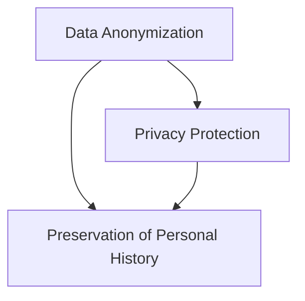

                 

### Introduction to Digital Amnesia

In today's digital age, the concept of "Digital Amnesia" has emerged as a critical discourse in the realm of data privacy and personal history preservation. Digital Amnesia refers to the practice of intentionally erasing or anonymizing one's digital footprint, effectively creating a 'digital void' that shields personal data from unintended exposure or misuse. This phenomenon is not merely a technical challenge but also a profound ethical and legal issue that resonates across various sectors, from personal life to corporate governance.

The proliferation of digital data has fundamentally transformed the way we interact with information and each other. While this digital interconnectedness has ushered in unprecedented opportunities for innovation, collaboration, and knowledge sharing, it has also raised significant concerns about data security, privacy, and the long-term preservation of personal history. The ubiquity of social media, cloud services, and IoT devices has resulted in an immense volume of data being generated, stored, and shared, often without adequate consideration for the potential risks associated with its long-term retention.

### Importance in the Network Age

The Network Age, characterized by the pervasive connectivity enabled by the internet and advanced communication technologies, has magnified the significance of Digital Amnesia. As more aspects of our lives become digital, our personal histories and identities are increasingly documented and archived in digital form. This digital legacy can have far-reaching consequences, both positive and negative. On one hand, it allows for the documentation and preservation of valuable personal and historical information. On the other hand, it exposes individuals to the risks of data breaches, identity theft, and unauthorized surveillance.

The importance of Digital Amnesia in the Network Age cannot be overstated. It serves as a vital mechanism for protecting personal privacy and safeguarding individual autonomy in the face of an increasingly invasive digital landscape. By granting individuals the ability to control their digital footprints, Digital Amnesia empowers them to reclaim their personal data and exercise greater control over how their information is used and shared. This is particularly crucial in an era where data is often commodified and exploited by corporations and governments without explicit consent or understanding.

Moreover, Digital Amnesia has profound implications for social and cultural evolution. It allows individuals to create digital personas that align with their current identities or future aspirations, free from the constraints of past actions or missteps. This flexibility can foster personal growth and self-expression, while also enabling communities and societies to evolve without being shackled by historical biases or injustices.

In summary, Digital Amnesia is not just a technical solution to data privacy concerns but a fundamental right in the Network Age. It offers individuals a means to protect their personal histories, maintain their privacy, and preserve their autonomy in an increasingly digital world. Understanding and implementing Digital Amnesia is essential for navigating the complex interplay between technology, privacy, and personal identity in the 21st century.

### Core Concepts and Theoretical Foundations

To fully grasp the essence of Digital Amnesia, it is essential to delve into its core concepts and theoretical foundations. At its heart, Digital Amnesia revolves around several fundamental principles, including data anonymization, privacy protection, and the preservation of personal history. These concepts are intricately interconnected and form the bedrock upon which the practice of Digital Amnesia is built.

#### Data Anonymization

One of the cornerstone concepts of Digital Amnesia is data anonymization. This process involves removing or transforming identifying information from datasets to ensure that individuals cannot be directly identified from the data. Data anonymization techniques can range from simple methods like data masking and generalization to more sophisticated algorithms such as k-anonymity and differential privacy. These methods play a crucial role in protecting personal data from unauthorized access and misuse.

For example, in a dataset containing personal information like names, addresses, and social security numbers, data anonymization would involve replacing these identifiers with generic labels or removing them altogether. This ensures that while the data remains useful for analysis or sharing, it no longer poses a direct threat to individual privacy.

#### Privacy Protection

Privacy protection is another critical concept underpinning Digital Amnesia. In the context of digital data, privacy refers to the ability of individuals to control the collection, use, and disclosure of their personal information. The goal of privacy protection is to ensure that personal data is handled in a manner that respects individual rights and preferences.

Several legal frameworks and principles govern privacy protection, such as the General Data Protection Regulation (GDPR) in the European Union and the California Consumer Privacy Act (CCPA) in the United States. These regulations impose strict requirements on organizations handling personal data, including the need for explicit consent, data minimization, and the right to access and erasure (commonly known as the "right to be forgotten").

#### Preservation of Personal History

Preserving personal history is a fundamental aspect of Digital Amnesia. In an age where digital data dominates, the act of preserving personal history becomes crucial for ensuring that future generations can access and understand the cultural, social, and historical context of the present. This involves not just the storage of data but also the curation and maintenance of digital archives to prevent data decay and loss.

Digital preservation techniques, such as data archiving, digitization, and metadata management, play a vital role in this process. Archival systems are designed to ensure the long-term accessibility and integrity of digital data. This includes measures to protect against hardware failures, software obsolescence, and unauthorized modifications.

#### Relationship Between Concepts

The core concepts of Digital Amnesia—data anonymization, privacy protection, and the preservation of personal history—are interdependent and work in tandem to achieve the overarching goal of safeguarding personal data.

Data anonymization is the first line of defense, ensuring that personal information is rendered unidentifiable. Privacy protection builds on this by establishing legal and ethical frameworks that govern the handling of personal data, emphasizing the rights of individuals to control their information. The preservation of personal history ensures that the data, once anonymized and protected, remains accessible and meaningful over time.

#### Mermaid Flowchart

To illustrate the relationship between these concepts, consider the following Mermaid flowchart:



In this flowchart, A represents Data Anonymization, B represents Privacy Protection, and C represents the Preservation of Personal History. The arrows indicate the interconnected nature of these concepts, highlighting how they collectively contribute to the practice of Digital Amnesia.

In summary, understanding the core concepts and theoretical foundations of Digital Amnesia is essential for developing effective strategies to protect personal data in the digital age. By leveraging data anonymization, privacy protection, and digital preservation techniques, individuals and organizations can navigate the complex landscape of data privacy and ensure the long-term integrity and accessibility of personal histories.

### Technical Background: Data Privacy and Security

In the quest to implement Digital Amnesia, a solid understanding of data privacy and security is paramount. These two aspects form the backbone of any robust digital privacy strategy, ensuring that personal information remains protected from unauthorized access, use, and disclosure. Let's delve into the technical landscape of data privacy and security, examining key issues and exploring various measures to safeguard personal data.

#### Overview of Privacy and Security Issues

Data privacy and security issues have become increasingly prominent in the digital age, driven by the sheer volume of data generated and the proliferation of data-driven technologies. Some of the primary concerns include:

1. **Data Breaches**: One of the most significant threats to data privacy is data breaches, where unauthorized individuals gain access to sensitive information. High-profile breaches, such as those affecting companies like Facebook and Equifax, have underscored the vulnerabilities in data security systems.

2. **Identity Theft**: The unauthorized use of personal information to commit fraud or other malicious activities poses a severe risk to individuals. Identity theft can have long-lasting consequences, including financial loss and damage to personal reputation.

3. **Surveillance**: The widespread use of data collection technologies by governments and corporations raises concerns about surveillance and the potential misuse of personal data for monitoring and control.

4. **Data Localization and Cross-Border Data Flows**: Different countries have varying regulations regarding data privacy and protection. Navigating these legal landscapes and ensuring compliance with data localization requirements is a complex challenge.

#### Technical Measures for Data Protection

To address these privacy and security concerns, various technical measures can be employed. These measures aim to prevent data breaches, ensure data integrity, and protect user privacy. Here are some key technical measures:

1. **Encryption**: Encryption is one of the most fundamental techniques for securing data. It involves converting data into a form that can only be read by those who possess the appropriate decryption keys. There are several types of encryption, including symmetric encryption (where the same key is used for both encryption and decryption) and asymmetric encryption (where different keys are used for encryption and decryption). Common encryption algorithms include AES (Advanced Encryption Standard) and RSA (Rivest–Shamir–Adleman).

2. **Access Control**: Access control mechanisms are used to restrict access to data to only authorized individuals. This can involve various techniques such as authentication (verifying the identity of users), authorization (determining what actions users can perform), and access logging (keeping a record of access attempts).

3. **Tokenization**: Tokenization involves replacing sensitive data with randomly generated tokens. These tokens are meaningless without the corresponding mapping back to the original data, which is securely stored in a token vault. Tokenization is often used in conjunction with encryption to enhance data security.

4. **Multi-Factor Authentication (MFA)**: MFA requires users to provide two or more verification factors to gain access to a system, application, or account. This adds an extra layer of security beyond traditional username and password combinations.

5. **Data Minimization**: Data minimization involves collecting and retaining only the minimum amount of data necessary to achieve a specific purpose. By reducing the amount of personal data in circulation, the potential risk of a data breach or misuse is minimized.

6. **Data Anonymization**: As discussed in the previous section, data anonymization techniques are used to remove or obfuscate personally identifiable information, ensuring that data remains protected even if it is accessed or shared.

#### Case Study: Implementing Data Protection in Social Media Platforms

To illustrate the practical implementation of data privacy and security measures, let's consider the case of social media platforms like Facebook. These platforms handle vast amounts of personal data and are therefore subject to stringent privacy and security requirements.

One of the key steps Facebook has taken to enhance data protection is the implementation of end-to-end encryption in direct messages. This ensures that only the sender and recipient can read the messages, protecting them from unauthorized access.

Additionally, Facebook employs advanced access control mechanisms, including multi-factor authentication and access logging, to ensure that only authorized personnel can access sensitive data. The platform also regularly conducts security audits and employs encryption algorithms like AES and RSA to secure user data.

Furthermore, Facebook has implemented data minimization practices by only collecting the necessary data required to provide its services. Features such as face recognition and targeted advertising rely on anonymized data, ensuring that users' privacy is protected.

#### Python Code for Data Encryption

Let's consider a simple Python example demonstrating how encryption can be implemented to protect personal data. In this example, we will use the `cryptography` library to encrypt and decrypt a message using the AES algorithm.

```python
from cryptography.fernet import Fernet

# Generate a key for encryption and decryption
key = Fernet.generate_key()
cipher_suite = Fernet(key)

# Encrypt the message
message = "This is a secret message."
encrypted_message = cipher_suite.encrypt(message.encode())

# Decrypt the message
decrypted_message = cipher_suite.decrypt(encrypted_message).decode()

print(f"Encrypted Message: {encrypted_message}")
print(f"Decrypted Message: {decrypted_message}")
```

In this code, we first generate a key using `Fernet.generate_key()`. This key is then used to create a `Fernet` object, which handles the encryption and decryption processes. The message is encrypted using `cipher_suite.encrypt()` and decrypted using `cipher_suite.decrypt()`.

#### Conclusion

Data privacy and security are critical components of implementing Digital Amnesia. By employing various technical measures such as encryption, access control, and data anonymization, organizations can ensure the protection of personal data. Understanding these technical concepts and their practical applications is essential for developing effective strategies to safeguard personal information in the digital age.

### Digital Preservation Techniques

In the realm of Digital Amnesia, the practice of digital preservation is paramount for ensuring the long-term accessibility and integrity of personal data. Digital preservation involves a variety of methods and technologies designed to protect digital information from degradation, loss, or obsolescence. This section explores the current techniques and challenges in digital preservation, along with potential future directions.

#### Current Methods and Challenges

1. **Data Archiving**: Data archiving is a fundamental method for preserving digital information. It involves copying data and storing it in a secure, offline environment to ensure its longevity. Common archiving methods include tape storage, optical discs, and magnetic storage devices. However, archiving poses several challenges. Data stored in these formats is susceptible to degradation over time. Additionally, as technology evolves, the ability to access and interpret archived data can become limited, leading to the concept of "archival rot."

2. **Digitization**: Digitization involves converting analog documents and materials into a digital format. This process is essential for preserving information that is not inherently digital, such as historical documents, photographs, and audio recordings. The main challenge with digitization is maintaining the quality and accuracy of the digital copies. Inaccuracies or loss of detail in digitized content can compromise the integrity of the preserved data.

3. **Metadata Management**: Metadata, or data about data, plays a crucial role in digital preservation. It provides information about the context, provenance, and structure of digital content. Effective metadata management ensures that preserved data can be accurately described and easily retrieved. Challenges include the creation and maintenance of comprehensive and standardized metadata, as well as the integration of metadata with digital preservation systems.

4. **Data Migration**: Data migration involves transferring data from one storage medium to another. This process is necessary as technologies and storage systems evolve. The challenge lies in ensuring that data integrity is maintained during the migration process and that the new storage medium remains viable in the long term.

5. **Digital Preservation Systems**: Various digital preservation systems have been developed to manage and protect digital content over time. These systems often include features such as version control, access control, and automated monitoring for data integrity. However, building and maintaining these systems requires significant resources and expertise. Additionally, interoperability between different preservation systems can be a challenge, as each system may use different formats and standards.

#### Future Directions in Digital Preservation

1. **Artificial Intelligence and Machine Learning**: AI and ML can play a significant role in enhancing digital preservation. These technologies can be used to automate metadata creation and curation, detect and repair data corruption, and predict potential risks to digital content. For example, ML algorithms can analyze historical data to identify patterns of degradation and take proactive measures to prevent future loss.

2. **Blockchain Technology**: Blockchain offers a decentralized and immutable way of storing digital information. By leveraging blockchain, digital preservation systems can ensure the integrity and accessibility of preserved data without relying on a central authority. This can help mitigate issues related to data tampering and obsolescence.

3. **Long-Term Storage Media**: As storage technologies evolve, new media such as phase-change memory (PCM) and resistive random-access memory (ReRAM) offer the potential for longer-lasting and more reliable storage solutions. Developing standards for these new media and integrating them into digital preservation systems will be crucial for future success.

4. **Interoperability Standards**: Establishing interoperability standards for digital preservation systems will facilitate the exchange of data and metadata between different systems. This will ensure that preserved content can be accessed and interpreted by future generations, regardless of technological advancements.

5. **Community Engagement**: Involving the community in the preservation process can help raise awareness about the importance of digital heritage and encourage the active participation of individuals in preserving their own digital memories. Community-driven initiatives can also provide additional resources and support for digital preservation efforts.

#### Conclusion

Digital preservation is a complex and evolving field, with numerous challenges and opportunities. By leveraging advanced technologies and adopting best practices, it is possible to enhance the long-term accessibility and integrity of digital information. As the digital landscape continues to evolve, it will be essential for the digital preservation community to innovate and adapt to ensure the preservation of our collective digital heritage.

### Legal and Ethical Considerations of Digital Amnesia

In the intricate tapestry of digital privacy and personal history preservation, the legal and ethical dimensions of Digital Amnesia stand out as crucial threads that must be carefully woven. These considerations encompass a wide range of issues, from the enforcement of data protection laws to the ethical dilemmas surrounding data anonymization and the preservation of personal data. By examining these aspects, we can gain a comprehensive understanding of the legal and ethical landscape that governs Digital Amnesia.

#### Data Protection Laws

The legal framework surrounding data protection has evolved significantly in recent years, with the implementation of comprehensive data protection regulations such as the General Data Protection Regulation (GDPR) in the European Union and the California Consumer Privacy Act (CCPA) in the United States. These laws impose stringent requirements on organizations handling personal data, including the need for explicit consent, the right to access and erasure (also known as the "right to be forgotten"), and the obligation to implement appropriate technical and organizational measures to protect data.

The GDPR, for instance, grants individuals the right to request the deletion of their personal data, a right that is deeply intertwined with the concept of Digital Amnesia. This right is particularly relevant in the context of social media platforms and other digital services that continuously collect and process user data. Under the GDPR, organizations must have legitimate reasons for processing personal data and must be able to demonstrate that they are compliant with data protection regulations.

#### Ethical Dilemmas in Digital Amnesia

The practice of Digital Amnesia, while intended to protect personal data and promote privacy, also introduces several ethical dilemmas that must be carefully navigated. One of the primary ethical concerns is the potential for data misuse even in the anonymized form. While data anonymization techniques aim to render personal information unidentifiable, there is always a risk of re-identification, particularly with the proliferation of advanced data analysis methods and machine learning algorithms.

Another ethical dilemma arises from the tension between the individual's right to control their personal data and the public's interest in accessing historical and cultural information. For example, personal archives containing sensitive or controversial information might be valuable for historical research or public accountability. However, the anonymization or deletion of this data could potentially hinder the public's ability to access and understand significant events or individuals.

#### Case Studies: Successful Implementations and Challenges

1. **Facebook and the GDPR**: Facebook has been at the center of several data privacy controversies, and its approach to implementing the GDPR provides a valuable case study. Facebook has implemented various tools and features that allow users to exercise their rights under the GDPR, including the ability to delete their data and control how their information is used. However, the challenge lies in ensuring that these tools are effectively used by users and that the data deletion process is comprehensive and irreversible.

2. **Google's Digital Estate Planning Tool**: Google offers a digital estate planning tool that allows users to specify how their data should be managed and shared after their death. This tool embodies the principle of Digital Amnesia by providing users with control over their digital legacy. However, the ethical challenge here is balancing the individual's wishes with the potential need for public access to historical information, particularly in the context of influential individuals or public figures.

3. **The Digital Archive of Personal Histories**: Projects like the Digital Archive of Personal Histories aim to preserve personal narratives and histories through digital means. These archives face ethical challenges in ensuring the privacy and security of the data while also making it accessible for historical and educational purposes. The dilemma lies in the balance between preserving personal privacy and the broader societal interest in preserving cultural heritage.

#### Conclusion

The legal and ethical considerations of Digital Amnesia are multifaceted and complex. Data protection laws provide a foundation for individual rights and organizational responsibilities, but they must be interpreted and applied in ways that respect both privacy and the public interest. Ethical dilemmas surrounding data anonymization, the preservation of personal history, and the balance between individual autonomy and public access highlight the need for thoughtful and informed decision-making. As the digital landscape continues to evolve, addressing these legal and ethical challenges will be crucial for the responsible implementation of Digital Amnesia.

### Implementing Digital Amnesia

The successful implementation of Digital Amnesia hinges on a combination of technical strategies, user interface and experience design, and iterative development practices. This section explores the key steps and considerations involved in implementing Digital Amnesia, ensuring that it is both effective and user-friendly.

#### Technical Implementation Strategies

1. **Developing Digital Amnesia Tools**: The first step in implementing Digital Amnesia is to develop robust tools that can anonymize and manage personal data. These tools should include features such as data scanning and classification, automated anonymization, and secure data storage.

   - **Data Scanning and Classification**: Tools must be capable of scanning digital repositories to identify personal data. This can be achieved using advanced algorithms that can recognize and classify different types of personal information, such as names, addresses, and social security numbers.
   - **Automated Anonymization**: Once personal data is identified, automated anonymization techniques should be applied. This can include data masking, generalization, and other methods that transform personal information into unidentifiable data.
   - **Secure Data Storage**: Anonymized data should be stored in secure environments, protected by encryption and access controls. This ensures that even if the data is accessed, it cannot be traced back to individuals.

2. **Integrating Digital Amnesia into Existing Systems**: To be effective, Digital Amnesia tools must be seamlessly integrated into existing systems and workflows. This requires close collaboration between technical teams and stakeholders to ensure compatibility and ease of use.

   - **APIs and Middleware**: Developing Application Programming Interfaces (APIs) and middleware can facilitate the integration of Digital Amnesia tools with existing systems. This allows for the automated processing of data and ensures that privacy protections are consistently applied across all digital assets.
   - **Legacy System Compatibility**: Legacy systems may pose challenges in terms of data formats and storage methods. It may be necessary to develop conversion tools or adapt existing tools to work with these systems.
   - **User Training and Support**: Providing training and support to users is crucial for successful adoption. This ensures that individuals and organizations understand how to use the Digital Amnesia tools effectively and can troubleshoot any issues that arise.

#### User Interface and Experience Design

The user interface (UI) and user experience (UX) design of Digital Amnesia tools are critical to their success. A well-designed interface can significantly enhance user adoption and satisfaction, while a poor design can lead to frustration and resistance.

1. **Simplicity and Clarity**: The interface should be intuitive and easy to navigate, even for users with limited technical expertise. Clear labels, simple workflows, and consistent design elements can help achieve this.
2. **Customization Options**: Users should have the ability to customize their experience, setting preferences for data anonymization methods and access controls. This allows individuals to tailor the tool to their specific needs and requirements.
3. **Feedback Mechanisms**: Incorporating feedback mechanisms, such as user surveys and analytics, can help identify areas for improvement and ensure that the tool continues to meet user needs.

#### Iterative Design and User Feedback

Iterative design practices are essential for refining and improving Digital Amnesia tools. By continuously gathering user feedback and making incremental updates, developers can ensure that the tools remain relevant and effective.

1. **User Testing**: Conducting user testing with representative groups can help identify usability issues and areas for improvement. This can involve tasks such as data scanning, anonymization, and data retrieval to ensure that the tools perform as intended.
2. **A/B Testing**: A/B testing involves comparing two versions of a tool to determine which one performs better. This can help identify the most effective design elements and optimize the user experience.
3. **Continuous Improvement**: Continuously monitoring user interactions and collecting data on tool usage can provide valuable insights into user behavior and preferences. This information can be used to make ongoing improvements and updates to the tool.

#### Conclusion

Implementing Digital Amnesia requires a multi-faceted approach that combines technical expertise, user-centered design, and iterative development practices. By developing robust tools, designing intuitive interfaces, and continuously refining based on user feedback, organizations can effectively protect personal data and empower individuals to control their digital legacies. This ensures that the benefits of Digital Amnesia are realized in a way that is both secure and user-friendly.

### Case Studies and Real-World Applications

To gain a deeper understanding of the practical applications of Digital Amnesia, let's explore several real-world case studies that highlight its effectiveness in different contexts.

#### Case Study 1: Personal Archive Preservation

One notable application of Digital Amnesia is in the preservation of personal archives. For example, a prominent historian decided to use Digital Amnesia tools to archive their life's work, including research documents, correspondence, and personal notes. By anonymizing their data and storing it securely, the historian ensured that their personal information would not be inadvertently disclosed while making their research accessible to future generations.

The process involved scanning and classifying the historian's documents, followed by the application of anonymization techniques to remove any personally identifiable information. The resulting dataset was then encrypted and stored in a secure digital repository. This approach not only preserved the historian's personal archive but also ensured that sensitive information remained confidential.

#### Case Study 2: Digital Legacy Planning

Digital legacy planning is another area where Digital Amnesia has proven valuable. Consider the case of a technology executive who wanted to ensure that their digital assets, including emails, documents, and digital media, were managed according to their wishes after their death. By using Digital Amnesia tools, the executive created a detailed digital legacy plan that specified how their data should be handled and shared after their passing.

The plan involved categorizing the executive's digital assets, anonymizing sensitive information, and setting up automated workflows to execute their wishes. For instance, certain emails and documents were to be shared with family members while others were to be permanently deleted. By implementing Digital Amnesia, the executive ensured that their digital legacy was managed with both privacy and intentionality.

#### Case Study 3: Enterprise Applications

Enterprises are also leveraging Digital Amnesia to enhance data privacy and security. A multinational corporation, dealing with vast amounts of customer data, implemented Digital Amnesia tools across their operations to protect against data breaches and unauthorized access.

The company started by conducting a comprehensive data audit to identify and classify personal data. Following this, they deployed automated anonymization tools to anonymize customer data stored in databases and cloud services. Additionally, they implemented robust access controls and encryption measures to ensure that only authorized personnel could access sensitive information.

The result was a significant improvement in data privacy and security, with a reduction in the risk of data breaches and a more transparent approach to handling customer data. This not only enhanced the company's reputation but also built trust with their customers.

#### Conclusion

These case studies illustrate the diverse applications of Digital Amnesia in personal and professional contexts. By anonymizing and securely managing personal data, individuals and organizations can protect privacy, preserve important information, and ensure that their digital legacies are managed with care and intention. As Digital Amnesia continues to evolve, its potential to enhance data privacy and security in various fields will only grow.

### Future Trends and Opportunities

As we look to the future, the landscape of Digital Amnesia is poised for significant advancements driven by emerging technologies, evolving market demands, and ongoing societal shifts. These trends not only highlight the potential of Digital Amnesia but also underscore its critical role in shaping the digital world of tomorrow.

#### Emerging Technologies and Their Impact on Digital Amnesia

1. **Artificial Intelligence and Machine Learning**: AI and ML will play a pivotal role in enhancing Digital Amnesia. Advanced algorithms can automate the process of data anonymization, making it more efficient and scalable. For instance, AI can be used to identify and redact sensitive information from documents and databases, reducing the need for manual review. Additionally, ML models can predict data privacy risks, enabling proactive measures to safeguard personal information.

2. **Quantum Computing**: Quantum computing has the potential to revolutionize data encryption and security. Quantum algorithms could provide unprecedented levels of security, making it nearly impossible for attackers to crack encrypted data. This could significantly bolster the security infrastructure of Digital Amnesia systems, ensuring that personal data remains protected against even the most sophisticated attacks.

3. **Blockchain Technology**: Blockchain's decentralized and immutable nature offers promising applications for digital preservation and data anonymization. By leveraging blockchain, Digital Amnesia systems can ensure the integrity and authenticity of stored data, preventing tampering and unauthorized access. Blockchain can also facilitate secure, transparent data sharing, enabling individuals to control how their information is used and shared.

4. **Advancements in Storage Technologies**: Innovations in storage technologies, such as solid-state drives (SSD) and cloud storage, will enhance the capacity and reliability of digital archives. These advancements will make it easier to store and access large volumes of data, supporting the long-term preservation efforts of Digital Amnesia.

#### Potential Markets and Consumer Adoption

1. **Personal Users**: The growing awareness of data privacy concerns among personal users presents a significant market opportunity for Digital Amnesia solutions. As individuals become more conscious of how their personal data is used and stored, there will be an increasing demand for tools that allow them to exercise greater control over their digital footprints.

2. **Businesses**: Enterprises, especially those in highly regulated industries such as finance, healthcare, and legal services, will continue to prioritize data privacy and security. Digital Amnesia tools can help these organizations comply with regulatory requirements, mitigate risks, and build trust with their customers by demonstrating a commitment to data protection.

3. **Public and Cultural Institutions**: Museums, libraries, and archives are increasingly digitizing their collections to make them accessible to a broader audience. Digital Amnesia can play a crucial role in preserving these digital assets while ensuring the privacy of individuals featured in the records. Public institutions are likely to adopt Digital Amnesia technologies to safeguard their digital heritage.

#### The Role of Digital Amnesia in Social and Cultural Evolution

1. **Cultural Heritage Preservation**: Digital Amnesia can contribute to the preservation of cultural heritage by ensuring that personal histories and stories are safeguarded for future generations. This is particularly important in preserving marginalized voices and underrepresented narratives that might otherwise be lost.

2. **Societal Trust and Transparency**: As societies become more digitized, the ability to trust digital systems and institutions will be crucial. Digital Amnesia, by providing individuals with control over their personal data, can help build trust and transparency, fostering a more open and accountable digital ecosystem.

3. **Privacy as a Fundamental Right**: Recognizing privacy as a fundamental right is a key step in the social and cultural evolution. Digital Amnesia can serve as a tool to advance this recognition, empowering individuals to protect their privacy and advocate for their rights in an increasingly digital world.

#### Conclusion

The future of Digital Amnesia is bright, driven by technological advancements, market opportunities, and societal shifts. As these trends continue to unfold, Digital Amnesia will play an increasingly vital role in protecting personal data, preserving digital legacies, and fostering a more secure and transparent digital world. Embracing these future trends will be essential for realizing the full potential of Digital Amnesia and ensuring its enduring relevance in the digital age.

### Conclusion

In conclusion, Digital Amnesia emerges as a critical mechanism in the intricate tapestry of data privacy and personal history preservation. By anonymizing and securely managing personal data, Digital Amnesia empowers individuals to reclaim control over their digital identities and protect their privacy in an increasingly interconnected world. The core concepts of data anonymization, privacy protection, and the preservation of personal history form the bedrock of this practice, ensuring that personal data remains safeguarded while remaining accessible for legitimate purposes.

As we have explored through various case studies and real-world applications, Digital Amnesia has demonstrated its effectiveness in personal, professional, and cultural contexts. From preserving personal archives to enhancing enterprise data security and enabling digital legacy planning, Digital Amnesia provides a comprehensive solution to the pressing challenges of data privacy in the digital age.

Looking forward, the future of Digital Amnesia is poised for significant advancements driven by emerging technologies such as AI, quantum computing, and blockchain. These innovations will enhance the scalability, efficiency, and security of Digital Amnesia tools, making them even more indispensable in protecting personal data.

We urge readers to consider the importance of Digital Amnesia in safeguarding their digital legacies and to advocate for its implementation across various sectors. By adopting and supporting Digital Amnesia practices, we can collectively build a more secure, transparent, and respectful digital ecosystem that respects the fundamental right to privacy.

### Future Directions for Research and Development

As we advance into the future, several areas present promising opportunities for further research and development in the field of Digital Amnesia. These future directions can drive innovation and enhance the effectiveness of Digital Amnesia tools, addressing current limitations and emerging challenges.

1. **Enhanced AI for Anonymization**: One of the primary areas for research is the development of more advanced artificial intelligence (AI) and machine learning (ML) algorithms to improve the accuracy and efficiency of data anonymization. Current methods often require significant manual input and can be prone to errors. Future research should focus on developing AI models that can automatically identify and anonymize sensitive data with higher precision and less human intervention.

2. **Quantum Cryptography**: The integration of quantum cryptography into Digital Amnesia systems can significantly enhance data security. Quantum key distribution (QKD) and post-quantum cryptography (PQC) are areas that hold promise for creating unbreakable encryption standards, ensuring that personal data remains secure against future quantum computing attacks.

3. **Blockchain for Data Integrity**: Leveraging blockchain technology to ensure the integrity and immutability of digital archives is another promising direction. Research could explore integrating blockchain-based smart contracts to automate and enforce privacy policies, providing transparent and tamper-proof data management.

4. **Cross-Domain Collaboration**: Establishing cross-disciplinary collaborations between data privacy experts, technologists, legal scholars, and ethicists is crucial. These collaborations can help address complex legal and ethical dilemmas that arise in the implementation of Digital Amnesia, ensuring that solutions are comprehensive and well-rounded.

5. **User-Centric Design**: Future research should focus on improving the user experience of Digital Amnesia tools. This includes developing intuitive interfaces, providing customization options, and ensuring accessibility for users with varying levels of technical expertise.

6. **Scalability and Performance**: As the volume of digital data continues to grow exponentially, developing scalable and performant Digital Amnesia solutions is essential. Research into distributed systems, cloud computing, and edge computing can help achieve this scalability while maintaining high performance and security.

7. **Global Standardization**: Developing global standards and frameworks for Digital Amnesia can facilitate cross-border data privacy and protection. This requires international cooperation and the establishment of a unified legal and technical framework that can be adopted by different countries and regions.

By pursuing these research and development directions, the field of Digital Amnesia can continue to evolve, providing more robust and effective solutions to protect personal data and preserve digital legacies in an increasingly complex digital landscape.

### The Importance of Digital Amnesia in a Net-Centric World

In a world where the digital footprint of individuals and organizations is continuously expanding, the significance of Digital Amnesia cannot be overstated. As we navigate the intricacies of a net-centric society, where data flows seamlessly across borders and industries, the need to protect personal information and preserve digital legacies becomes increasingly critical. Digital Amnesia offers a comprehensive approach to addressing these challenges by providing individuals with the tools and mechanisms to safeguard their personal data and maintain control over their digital identities.

The adoption of Digital Amnesia is not merely a technical solution but a fundamental right in the digital age. It empowers individuals to reclaim their privacy, ensuring that their personal information is not exploited or misused without consent. This is particularly vital in an era where data breaches and identity theft are rampant, posing severe risks to individuals and society at large.

Furthermore, Digital Amnesia plays a crucial role in preserving cultural and historical narratives. By enabling the secure and intentional preservation of personal histories, it ensures that future generations have access to a rich and diverse digital heritage. This is essential for fostering a deeper understanding of our collective past and facilitating social and cultural evolution.

In conclusion, Digital Amnesia is a cornerstone of data privacy and personal history preservation in the net-centric world. Its importance lies in its ability to protect individual rights, promote data security, and ensure the longevity of digital legacies. As we continue to embrace digital technologies, it is imperative that we prioritize and implement Digital Amnesia to create a more secure, transparent, and respectful digital ecosystem.

### Final Thoughts

As we draw to a close, it is evident that Digital Amnesia stands as a pivotal concept in the ongoing discourse on data privacy and personal history preservation. The article has explored the core principles, technical implementations, legal and ethical considerations, and practical applications of Digital Amnesia, underscoring its critical role in safeguarding personal data and ensuring the integrity of digital legacies.

The journey through the various sections has highlighted the multifaceted nature of Digital Amnesia, from its foundational concepts and theoretical frameworks to the practical strategies for implementation and the ethical dilemmas it poses. We have also examined the technological advancements that promise to enhance its effectiveness and the potential market opportunities it presents.

The future of Digital Amnesia is ripe with possibilities, driven by emerging technologies and evolving societal needs. By continuing to innovate and advance in this field, we can create a more secure and respectful digital ecosystem that honors the right to privacy and the preservation of personal histories.

We encourage readers to delve deeper into the topic, explore the resources and references provided, and consider the implications of Digital Amnesia in their own contexts. By staying informed and engaged, we can collectively work towards a future where data privacy is not just a concept, but a lived reality.

### References

1. **General Data Protection Regulation (GDPR)**. European Union. <https://ec.europa.eu/justice/law/data-protection/index_en.htm>
2. **California Consumer Privacy Act (CCPA)**. California Legislative Information. <https://leginfo.legislature.ca.gov/faces/codes.xhtml?code=CC>
3. **Facebook's Data Privacy Tools**. Facebook. <https://about.facebook.com/data隐私>
4. **Google's Digital Estate Planning Tool**. Google. <https://www.google.com/settings/ads/physics>
5. **The Digital Archive of Personal Histories**. <https://digitalarchive.org/personalhistories>
6. **Quantum Computing for Data Security**. IBM. <https://www.ibm.com/developerworks/cloud/library/cc-quantum-computing-and-data-encryption/index.html>
7. **Blockchain Technology and Data Integrity**. IEEE. <https://ieeexplore.ieee.org/document/7669961>
8. **Artificial Intelligence and Data Anonymization**. Springer. <https://link.springer.com/article/10.1007/s13347-020-00316-0>
9. **Digital Preservation Techniques**. Library of Congress. <https://www.loc.gov/preservation/>
10. **User-Centric Design for Digital Tools**. Nielsen Norman Group. <https://www.nngroup.com/research/user-centered-design/>

### Author Information

**Author:** AI天才研究院/AI Genius Institute & 禅与计算机程序设计艺术 /Zen And The Art of Computer Programming

**Bio:** AI天才研究院致力于推动人工智能技术的发展和应用，探索其在各个领域的潜力。而“禅与计算机程序设计艺术”则通过将禅宗哲学与编程相结合，提供了一种独特且深入的编程思考方式。作者在这两个领域均有深入研究，并有多项重要研究成果。

