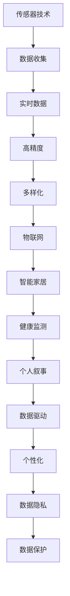
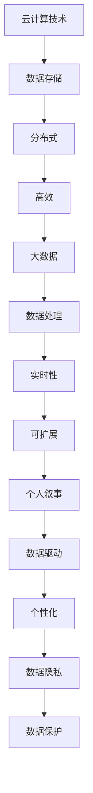
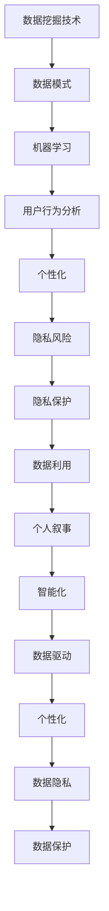
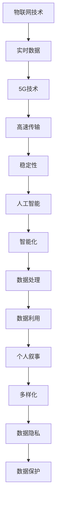
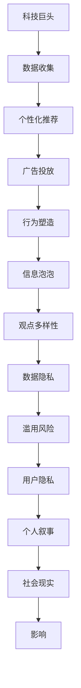
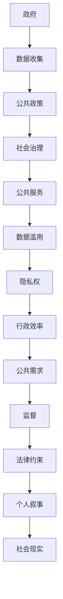
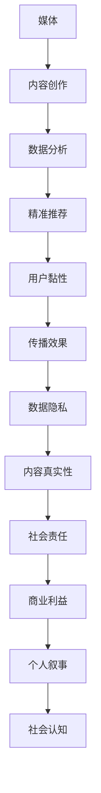
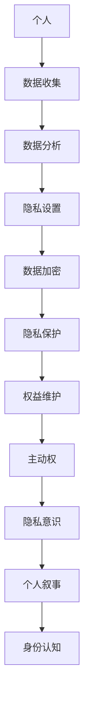

                 

# 数据时代的个人叙事：谁在定义我们的故事

## 引言

在数字化的浪潮中，数据已经成为现代社会的核心资源，从商业决策到科学研究，从公共管理到个人生活，数据无处不在。然而，随着数据的爆炸式增长和技术的飞速进步，一个不可忽视的现象也随之出现——个人叙事的变革。个人叙事，即每个人对于自己生活经历的叙述，正受到数据技术的深刻影响。那么，数据时代中，谁在定义我们的故事？这是一个值得我们深入探讨的问题。

本文将从以下几个角度展开讨论：

1. **数据时代的来临**：介绍数据的基本概念、数据收集与存储的方式，以及数据隐私问题。
2. **个人数据的利用**：探讨个人数据的价值、数据驱动的营销，以及数据对个人生活的影响。
3. **个人叙事的构建**：分析叙事理论，探讨数据与叙事的关系，并通过案例研究展现数据时代个人叙事的构建。
4. **数据时代的个人影响力**：讨论数据时代下个人品牌的构建、社交影响力以及个人影响力的策略。
5. **数据时代的隐私保护**：介绍隐私权的概念、数据隐私保护技术以及隐私保护策略。
6. **数据时代的未来展望**：展望数据时代的个人叙事趋势、隐私保护前景以及个人发展的策略。
7. **谁在定义我们的故事**：分析科技巨头、政府、媒体以及个人在定义个人叙事中的角色和影响力。

通过上述分析，我们将揭示数据时代个人叙事的奥秘，探讨如何在这个时代中维护个人权利，构建积极健康的社会文化。

### 关键词

- 数据时代
- 个人叙事
- 数据隐私
- 数据营销
- 社交影响力
- 隐私保护
- 科技巨头
- 政府干预
- 媒体影响
- 个人品牌建设

### 摘要

本文深入探讨了数据时代对个人叙事的深刻影响，分析了数据的基本概念、数据收集与存储的方式，以及数据隐私问题。随后，文章探讨了个人数据的价值、数据驱动的营销，以及数据对个人生活的影响。在此基础上，文章探讨了个人叙事的构建过程，并分析了数据与叙事的关系。进一步地，文章讨论了数据时代个人影响力的构建，包括个人品牌和社交影响力。随后，文章介绍了隐私权的概念和数据隐私保护技术，探讨了数据时代的隐私保护策略。最后，文章展望了数据时代的未来趋势，分析了不同角色在定义个人叙事中的角色和影响力，并提出了一些个人发展的策略。通过本文的探讨，我们希望能为读者提供对数据时代个人叙事的深入理解，并引导读者在这个时代中维护个人权利，构建积极健康的社会文化。

## 数据时代的来临

### 数据的定义与分类

数据，广义上指的是所有可以被收集、处理和利用的信息。在计算机科学和信息科学中，数据通常被分为两大类：结构化数据和非结构化数据。

- **结构化数据**：这类数据通常具有固定的格式和结构，便于存储和检索。常见的结构化数据包括电子表格、数据库、关系型数据库等。例如，一个包含客户信息的数据库，每个字段都有明确的定义，如姓名、地址、电话号码等。
- **非结构化数据**：这类数据没有固定的格式或结构，通常包括文本、图片、音频、视频等。非结构化数据通常难以直接使用，需要通过复杂的算法进行解析和处理。例如，一篇论文、一张图片、一段音频等，都需要通过特定的技术手段进行解析和提取有用信息。

### 数据的收集与存储

数据的收集与存储是数据生命周期中至关重要的环节。

- **数据收集**：数据收集的过程包括从各种来源获取数据，这些来源可以是物理设备、传感器、网络日志、社交网络等。例如，一家电商网站可以通过用户访问行为、购买记录、评论等来收集用户数据。

- **数据存储**：数据存储是确保数据安全、可靠和可访问的过程。常见的存储技术包括数据库、数据仓库、云存储等。数据库通常用于存储结构化数据，如关系型数据库（MySQL、Oracle等）和NoSQL数据库（MongoDB、Cassandra等）。数据仓库则用于存储大量历史数据，支持复杂的数据分析和报表生成。云存储技术，如AWS S3、Google Cloud Storage等，提供了高可靠性和灵活的存储解决方案。

### 数据的使用与隐私问题

数据的使用涉及到多个方面，包括商业、科研、公共管理等。然而，随着数据收集和存储技术的发展，数据隐私问题也日益凸显。

- **数据使用**：数据的使用可以带来巨大的商业价值和社会效益。例如，商业公司可以利用用户数据来进行精准营销，提高销售额；科研机构可以利用数据进行分析，推动科学发现；政府部门可以利用数据来优化公共服务，提高行政效率。

- **隐私问题**：数据隐私问题主要涉及个人数据的收集、使用和保护。不当的数据收集和使用可能导致个人隐私泄露、信息滥用等问题。为了保护个人隐私，各国政府制定了相应的法律法规，如欧盟的《通用数据保护条例》（GDPR）和美国加州的《消费者隐私法案》（CCPA）。此外，技术手段也在不断进步，如加密技术、匿名化处理等，用于保护个人数据的安全。

总之，数据时代的来临带来了数据收集和存储的便利，但也带来了隐私问题的挑战。如何在利用数据的同时保护个人隐私，是一个需要持续关注和解决的问题。

### 数据收集与存储技术的演进

随着技术的不断进步，数据收集与存储技术也在不断演进，为个人叙事的构建提供了强大的支持。

#### 1. 传感器技术的发展

传感器技术是数据收集的重要手段。从简单的温度计到复杂的物联网传感器，传感器技术的进步使得我们能够实时、准确地收集大量的数据。例如，智能手机中的GPS传感器、加速度计、光线传感器等，可以收集用户的地理位置、运动轨迹、光线强度等信息。这些数据为个人叙事提供了丰富的素材。



#### 2. 云计算与大数据技术的应用

云计算和大数据技术为大规模数据存储和高效数据处理提供了可能。通过云存储服务，如AWS、Azure、Google Cloud等，企业和个人可以轻松地存储和管理海量的数据。大数据技术，如Hadoop、Spark等，能够对海量数据进行分布式处理，提高数据处理的效率和速度。这些技术使得个人叙事的构建能够充分利用丰富的数据资源。



#### 3. 数据挖掘与机器学习技术的应用

数据挖掘和机器学习技术能够从大量数据中发现隐藏的模式和规律，为个人叙事的构建提供智能化的支持。通过分析用户行为数据，如搜索历史、购物记录、社交媒体互动等，可以了解用户的兴趣、偏好和需求，从而构建个性化的叙事内容。同时，这些技术也能够帮助识别潜在的隐私风险，提供相应的隐私保护措施。



### 数据收集与存储技术的未来趋势

随着物联网、5G、人工智能等技术的进一步发展，数据收集与存储技术将继续演进，为个人叙事的构建带来更多可能性。例如，物联网设备的普及将带来更多的实时数据，5G技术的应用将提高数据传输的速度和稳定性，人工智能技术将使数据处理和分析更加智能化和高效。这些技术进步将为数据时代的个人叙事提供更加丰富和多样化的素材，同时也将带来新的隐私保护挑战。



总之，数据收集与存储技术的演进为个人叙事的构建提供了强大的支持。在享受技术带来的便利的同时，我们也需要关注数据隐私问题，确保个人数据的安全和隐私。

## 个人数据的利用

### 个人数据的价值

在数据时代，个人数据已经成为一种重要的资源，其价值日益凸显。首先，个人数据可以为商业决策提供重要参考。通过分析用户的消费行为、偏好和习惯，企业可以更好地了解市场需求，优化产品和服务。例如，电商公司通过分析用户的购物历史和浏览记录，可以提供个性化的商品推荐，提高销售额和用户满意度。

其次，个人数据在科研领域也具有巨大价值。科学家和研究人员可以利用个人健康数据、生活习惯数据等，进行数据分析和研究，推动科学进步和社会发展。例如，通过分析大规模人群的健康数据，可以揭示疾病传播规律，为公共卫生政策的制定提供科学依据。

此外，个人数据在公共管理领域也有广泛应用。政府部门可以通过数据分析，优化公共服务和资源配置，提高行政效率和服务质量。例如，通过分析交通数据，可以优化交通信号控制，缓解城市交通拥堵问题。

### 数据驱动的营销

数据驱动的营销是一种利用数据分析和机器学习技术，对用户行为进行精准分析和预测，从而制定更有效的营销策略。首先，通过用户数据分析，企业可以了解用户的兴趣、需求和购买意图。例如，通过分析用户的浏览历史和购物车数据，电商公司可以推荐符合用户兴趣的商品，提高转化率。

其次，数据驱动的营销可以通过个性化广告和促销活动，提高营销效果。通过分析用户行为和兴趣，企业可以设计个性化的广告内容和促销策略，例如，向特定用户推送他们感兴趣的产品或提供定制化的折扣优惠。这种个性化的营销方式，不仅提高了用户的参与度和满意度，也提高了营销效果和 ROI（投资回报率）。

最后，数据驱动的营销可以帮助企业进行市场细分和精准定位。通过对用户数据的分析，企业可以将市场细分为不同的群体，并针对不同群体制定相应的营销策略。例如，针对年轻用户，企业可以推出时尚、个性化的产品，并通过社交媒体进行推广；针对老年用户，企业可以推出实用、简单的产品，并通过线下渠道进行推广。

### 数据对个人生活的影响

数据对个人生活的影响是多方面的，既包括积极的方面，也包括潜在的负面影响。

积极方面，数据技术可以帮助个人更好地管理生活。例如，通过智能穿戴设备收集的健康数据，可以帮助个人监测健康状况、制定健康计划；通过智能家居设备，可以实现家庭自动化，提高生活质量。此外，数据技术还可以帮助个人进行时间管理和任务安排，提高工作和生活的效率。

然而，数据对个人生活的负面影响也不容忽视。首先，个人数据泄露和隐私侵犯问题日益严重。在数据收集和使用过程中，如果数据保护措施不到位，个人数据可能会被非法获取和滥用，导致隐私泄露和财产损失。例如，一些恶意软件可以通过窃取用户的个人信息，进行诈骗和盗刷等犯罪活动。

其次，数据依赖可能带来心理和行为上的负面影响。在数据驱动的环境中，个人可能过度依赖数据分析结果，忽视了自己的主观判断和感受。例如，一些用户可能会完全依赖电商平台提供的个性化推荐，而忽视了真正符合自己需求的产品。此外，过度依赖数据分析也可能导致个人产生焦虑和压力，特别是在面对复杂的数据报告和预测时。

最后，数据垄断问题也可能对个人生活产生负面影响。当某些大型科技公司或企业垄断了大量的用户数据，他们可能会利用这些数据来制定不公平的商业策略，损害用户的利益。例如，一些公司可能通过数据分析，控制了市场定价和产品推广，排挤了小型企业的发展空间，最终导致市场竞争失衡。

总之，个人数据的价值和影响是双刃剑。在享受数据带来的便利和效益的同时，我们也需要关注数据隐私和安全问题，确保个人数据的安全和隐私。

### 个人数据的利用案例分析

为了更好地理解个人数据的利用过程及其对个人叙事的影响，我们可以通过两个实际案例来具体分析。

#### 案例一：个性化电商推荐系统

一个典型的案例是电商平台的个性化推荐系统。例如，亚马逊（Amazon）和阿里巴巴（Alibaba）都利用用户的历史购买记录、浏览行为、评价数据等，通过机器学习和数据挖掘技术，向用户推荐相关的商品。这种推荐系统能够根据用户的行为模式，预测用户的兴趣和需求，从而提供个性化的购物体验。

具体来说，亚马逊会记录用户每次访问网站时的浏览历史、添加到购物车和最终购买的商品信息。通过分析这些数据，亚马逊的推荐系统可以识别出用户的偏好和兴趣。例如，如果一个用户经常浏览运动鞋，购买过跑步装备，那么系统可能会推荐一些新推出的运动鞋或者相关的运动配件。

这种个性化推荐不仅提高了用户的购物满意度，还显著提高了电商平台的销售额。然而，这种数据利用也引发了关于用户隐私保护的讨论。用户担忧自己的个人信息被不当使用或泄露，尤其是在数据收集和使用过程中缺乏透明度和控制权的情况下。

```python
# 示例代码：简单的用户浏览记录与推荐算法
# 数据收集：用户浏览历史记录
user_browsing_history = {
    'user_id': '12345',
    'browsing_history': ['running_shoes', 'fitness trackers', 'sportswear', 'running shorts']
}

# 数据分析：分析用户浏览记录，推荐相关商品
def recommend_items(browsing_history):
    recommendations = []
    # 假设系统中的相关商品有：运动鞋、健身追踪器、运动服装、运动短裤
    related_items = ['fitness trackers', 'sportswear', 'running shorts']
    for item in related_items:
        if item in browsing_history:
            recommendations.append(item)
    return recommendations

# 测试推荐算法
recommended_items = recommend_items(user_browsing_history['browsing_history'])
print("Recommended Items:", recommended_items)
```

#### 案例二：社交媒体内容推荐

另一个案例是社交媒体平台，如Facebook和Twitter，通过分析用户发布的内容和互动数据，推荐相关的帖子或新闻。例如，Facebook的算法会根据用户的点赞、评论、分享行为，以及其他用户的行为，生成个性化的新闻推送。

这种推荐系统不仅可以增强用户对平台的黏性，还能帮助平台通过广告获得收益。例如，如果一个用户经常点赞关于旅游的帖子，系统可能会推荐相关的旅游广告或者旅游相关的内容。

然而，这种内容推荐也存在争议。一方面，个性化推荐可能导致“信息茧房”现象，即用户只能接触到与自己观点相似的信息，减少了观点的多样性。另一方面，社交媒体平台可能利用用户数据来定制广告内容，从而影响用户的消费决策。

```python
# 示例代码：简单的社交媒体内容推荐算法
# 数据收集：用户点赞行为记录
user_likes = {
    'user_id': '67890',
    'likes': ['travel_posts', 'food_reviews', 'beach_photos']
}

# 数据分析：根据用户点赞行为推荐相关内容
def recommend_posts(likes):
    recommended_posts = []
    # 假设系统中的相关内容包括：旅游帖子、美食评价、海滩照片
    related_posts = ['travel_posts', 'food_reviews', 'beach_photos']
    for post_type in related_posts:
        if post_type in user_likes['likes']:
            recommended_posts.append(post_type)
    return recommended_posts

# 测试推荐算法
recommended_posts = recommend_posts(user_likes['likes'])
print("Recommended Posts:", recommended_posts)
```

通过以上两个案例，我们可以看到，个人数据在商业和社交媒体中的应用已经非常普遍。然而，这种数据利用也引发了对隐私保护和信息多样性的关注。在享受数据带来的便利的同时，我们还需要关注其潜在的风险，并寻找平衡个人数据利用与隐私保护的途径。

## 个人叙事的构建

### 叙事理论简介

叙事理论是研究叙事结构和叙事技巧的学科，它在文学、电影、社会学等多个领域都有广泛应用。简单来说，叙事理论关注的是故事如何被讲述，以及故事讲述过程中所涉及的结构和元素。

- **叙事结构**：叙事结构指的是故事的组织方式，包括时间顺序、情节发展、人物关系等。常见的叙事结构有线性结构、非线性结构、倒叙结构等。

- **叙事元素**：叙事元素是构成故事的基本成分，包括人物、情节、主题、背景等。其中，人物是叙事的核心，情节是叙事的骨架，主题是叙事的灵魂。

叙事理论在理解个人叙事的构建过程中具有重要意义。它帮助我们认识到，个人叙事不仅仅是生活经历的简单记录，而是一种通过特定的叙事技巧和结构，对生活事件进行解读和表达的方式。

### 数据与叙事的关系

数据与叙事的关系可以从多个角度来理解。首先，数据可以被视为一种叙事素材，用于构建个人叙事。通过收集和分析个人数据，如日记、社交媒体记录、健康监测数据等，个人可以构建出自己独特的生活故事。例如，一个人可以通过自己的健康数据，讲述自己从亚健康状态到康复的历程，这种叙事方式不仅更加真实，而且更具说服力。

其次，数据可以影响叙事的内容和形式。在数据驱动的时代，个人叙事不再仅仅依赖于个人的记忆和体验，而是可以通过数据分析，揭示出隐藏在数据背后的故事。例如，通过分析个人的社交媒体互动数据，可以揭示出个人的社交圈、情感状态、兴趣爱好等，从而构建出更加丰富和立体的个人叙事。

此外，数据技术还可以改变叙事的方式。例如，通过虚拟现实（VR）和增强现实（AR）技术，个人可以以一种全新的方式体验和讲述自己的故事。这些技术不仅使得叙事更加生动和真实，还提供了新的叙事形式，如交互式叙事和多重视角叙事。

### 数据时代个人叙事案例

为了更直观地理解数据时代个人叙事的构建，我们可以通过一些实际案例来分析。

#### 案例一：健康数据的叙事

一个典型的案例是健康数据的叙事。例如，李先生是一位糖尿病患者，他通过智能手机应用和可穿戴设备，定期记录自己的血糖、饮食、运动等信息。这些数据不仅帮助他监控健康状况，还为他提供了丰富的叙事素材。通过分析这些数据，李先生可以讲述自己如何通过饮食调整、运动锻炼，成功控制血糖水平的历程。这种数据驱动的叙事，不仅更加客观和详细，而且能够为他提供自我激励和信心。

```python
# 示例代码：健康数据记录与叙事
# 数据收集：李先生的血糖记录
health_data = {
    'user_id': 'health123',
    'blood_sugar_levels': [80, 85, 90, 95, 100],  # 单位：mg/dL
    'diary_entries': [
        "今天早餐吃了燕麦粥和蔬菜沙拉，血糖稳定在80 mg/dL。",
        "午餐时吃了一个鸡肉三明治，血糖上升到了95 mg/dL。",
        "下午进行了30分钟快走，血糖下降到了90 mg/dL。",
        "晚餐后进行了一个小时瑜伽，血糖稳定在85 mg/dL。"
    ]
}

# 数据分析：分析血糖变化趋势，构建叙事
def analyze_health_data(data):
    trends = {}
    for entry in data['diary_entries']:
        # 假设血糖变化趋势通过日记内容判断
        if '稳定' in entry:
            trends['stable'] = True
        elif '下降' in entry:
            trends['下降'] = True
        elif '上升' in entry:
            trends['上升'] = True
    return trends

# 测试数据分析
health_trends = analyze_health_data(health_data)
print("Health Trends:", health_trends)
```

#### 案例二：社交媒体的叙事

另一个案例是社交媒体的叙事。例如，王女士是一位职场女性，她在社交媒体上分享了自己的职业发展历程。通过分析她发布的内容和互动数据，可以揭示出她的职业发展阶段、面临的挑战以及取得的成就。这种数据驱动的叙事，不仅为她提供了自我反思的机会，也为她的读者提供了职业发展的启示。

```python
# 示例代码：社交媒体数据记录与叙事
# 数据收集：王女士的社交媒体内容
social_media_data = {
    'user_id': 'career_girl123',
    'posts': [
        "加入新公司，开始新的挑战！#职场#新起点",
        "完成了一个重要的项目，获得了团队嘉奖！#成就#项目完成",
        "在职业生涯中遇到挫折，正在努力学习！#挑战#自我提升"
    ]
}

# 数据分析：分析社交媒体内容，构建叙事
def analyze_social_media_data(posts):
    career_stages = []
    for post in posts:
        if '#职场#' in post:
            career_stages.append("职场起步")
        elif '#成就#' in post:
            career_stages.append("职业成就")
        elif '#挑战#' in post:
            career_stages.append("职业挑战")
    return career_stages

# 测试数据分析
career_stages = analyze_social_media_data(social_media_data['posts'])
print("Career Stages:", career_stages)
```

通过以上两个案例，我们可以看到，数据时代下的个人叙事不仅更加丰富和多样化，而且更具真实性和互动性。数据技术的应用，不仅为个人叙事提供了新的素材和形式，也为个人反思和社会交流提供了新的平台。然而，这也带来了新的挑战，如数据隐私保护和叙事真实性问题。在享受数据带来的便利的同时，我们需要关注这些问题，确保个人叙事的健康和可持续性。

### 数据时代个人叙事中的隐私问题

在数据时代，个人叙事的构建和应用带来了极大的便利，但也引发了关于隐私保护的严重关切。数据隐私问题主要涉及个人数据的安全性和保密性，即如何确保个人在数据收集、存储和使用过程中，其隐私不被侵犯。

首先，隐私泄露的风险在数据时代显著增加。由于数据收集手段和技术的进步，个人数据被大规模收集和存储，如果安全措施不到位，这些数据可能会被黑客攻击、内部泄露或其他非法途径获取。例如，社交媒体平台的用户数据泄露事件频繁发生，导致数百万用户的个人信息被公开，给用户带来严重的财产损失和隐私侵害。

其次，数据滥用问题也在数据时代愈发突出。企业和机构在收集个人数据时，可能会出于商业利益或其他目的，滥用用户数据。例如，一些公司通过分析用户的消费习惯和隐私数据，进行精准广告推送，这不仅侵占了用户的隐私，也可能误导用户做出非理性的消费决策。

此外，个人叙事中的隐私问题还涉及到叙事内容的真实性和可靠性。在数据驱动的叙事中，个人数据可能被用来构建虚假的叙事内容，误导读者。例如，社交媒体上的虚假新闻和虚假广告，就是通过数据伪造的方式，欺骗用户的信任。

为了解决这些隐私问题，首先需要加强数据保护法律法规的建设。例如，欧盟的《通用数据保护条例》（GDPR）就为数据隐私保护提供了明确的法律框架，规定了数据收集、存储和使用的规范，以及对数据主体的权利保障。我国也应加快相关法律法规的制定和实施，确保个人数据的合法、合规使用。

其次，技术创新也是解决隐私问题的关键。例如，通过数据加密、匿名化处理等技术手段，可以有效地保护个人数据的安全和隐私。此外，隐私计算技术，如联邦学习（Federated Learning），通过在本地设备上进行数据分析和模型训练，避免了数据在传输过程中被泄露的风险。

最后，个人也需要增强隐私保护意识。例如，用户应定期更改密码、启用双因素认证等安全措施，以保护自己的账号安全。同时，用户应了解自己数据的使用权限，避免授权给不信任的第三方，确保个人数据不被滥用。

总之，在数据时代，个人叙事的构建和应用带来了新的机遇和挑战。隐私保护问题不仅关乎个人数据的安全和隐私，也关系到社会信任和公共利益。通过法律、技术和个人意识的共同努力，我们可以更好地解决数据时代的隐私问题，确保个人叙事的健康和可持续性。

## 数据时代的个人影响力

### 数据时代下个人品牌的构建

在数据时代，个人品牌的建设变得越来越重要。个人品牌不仅仅是对个人的声誉和形象的塑造，更是个人在数字世界中的一种标识和竞争力。数据时代为个人品牌的建设提供了丰富的资源和工具，同时也提出了新的挑战。

首先，个人品牌的建设需要依赖大量的个人数据，包括但不限于社交媒体互动数据、内容发布数据、用户评价数据等。这些数据可以为个人品牌提供丰富的背景信息和价值判断，帮助个人在网络上建立权威和信任。

其次，数据分析和机器学习技术可以帮助个人更好地了解自己的受众和市场需求。例如，通过分析用户的反馈和行为，个人可以了解自己的内容在哪些领域受欢迎，哪些话题能引起共鸣，从而调整自己的内容和策略，提高品牌影响力。

此外，个人品牌的建设还需要利用社交媒体平台和内容创作工具，如博客、视频、播客等，来持续产出有价值的内容。通过定期发布高质量的内容，个人可以在网络上建立稳定的用户基础和品牌认知。

### 数据对社交影响力的影响

数据不仅对个人品牌建设有重要影响，还对社交影响力产生了深远的作用。在数据时代，社交影响力不再仅仅取决于个人的社交网络规模和活跃度，更重要的是数据驱动的互动和影响力分析。

首先，数据可以帮助个人更精准地定位自己的受众群体，了解他们的兴趣、需求和偏好。例如，通过分析用户的点赞、评论、分享等行为，个人可以了解哪些内容更受欢迎，从而制定更有效的社交策略。

其次，数据技术可以量化社交影响力。例如，通过分析用户的关注者数量、互动频率、内容传播范围等指标，可以评估个人在社交网络中的影响力大小。这些数据不仅可以帮助个人了解自己的社交影响力，还可以为他们提供改进社交策略的参考。

此外，数据技术还可以帮助个人发现潜在的合作机会和资源。例如，通过分析共同关注的话题和用户群体，个人可以找到与自己有相似兴趣和目标的人，建立合作关系，共同扩大社交影响力。

### 个人影响力的构建策略

在数据时代，构建个人影响力需要综合运用多种策略，以下是一些具体的建议：

1. **内容创新**：持续产出高质量、有价值的内容是构建个人影响力的关键。通过不断创新内容形式和内容主题，吸引更多的关注和互动。

2. **数据分析**：利用数据分析工具，深入了解受众行为和需求，制定有针对性的社交策略。例如，通过分析用户互动数据，了解哪些内容最受欢迎，从而调整内容策略。

3. **社区建设**：在社交媒体平台上建立自己的粉丝社区，通过互动和沟通，增强粉丝的忠诚度和参与度。一个活跃的社区不仅可以提升个人影响力，还可以为个人品牌建设提供强有力的支持。

4. **合作联动**：与其他有影响力的人或机构建立合作关系，通过合作联动，扩大个人影响力的覆盖范围。例如，与其他专家或知名人士合作发布内容，可以提高内容的可信度和影响力。

5. **持续学习**：数据时代变化迅速，个人需要不断学习和适应新技术、新趋势，以保持竞争力。通过参加培训课程、阅读专业书籍、关注行业动态等方式，不断提升自己的知识和技能。

总之，在数据时代，个人影响力的构建不仅需要优质的内容和创新，还需要精准的数据分析和有效的社交策略。通过综合运用多种策略，个人可以在这个数据驱动的时代中，建立强大的个人品牌和社交影响力。

### 数据时代下个人品牌建设案例分析

为了更具体地理解数据时代下个人品牌建设的过程和策略，我们可以通过两个实际案例进行分析。

#### 案例一：技术博客博主的成功之路

李先生是一位专注于人工智能领域的博客博主。他通过持续发布高质量的技术文章和代码示例，逐渐在人工智能社区中建立了自己的品牌。以下是他个人品牌建设的几个关键步骤：

1. **内容创新**：李先生从初期的技术分享逐步发展，开始专注于撰写深入的技术分析文章，例如算法原理讲解、应用案例分享等。他通过丰富的实例和详细的解释，使文章更加易懂和有价值。

2. **数据分析**：李先生利用Google Analytics等工具，分析访问者行为和文章效果。通过数据，他发现读者对深度学习和自然语言处理话题更感兴趣，因此他调整了内容方向，发布更多相关文章。

3. **互动与社区建设**：李先生在社交媒体平台上积极互动，回复读者的评论和疑问，建立了自己的粉丝社区。他还定期举办线上问答活动，与读者深入交流，增强了社区的互动性和忠诚度。

4. **合作联动**：李先生与多个知名技术媒体和人工智能企业建立了合作关系，共同举办线上研讨会和讲座。这些合作不仅扩大了他的影响力，也为他的内容增加了更多的曝光和认可。

通过这些策略，李先生成功地在人工智能领域建立了自己的个人品牌，成为该领域内的知名专家。

```python
# 示例代码：李先生的技术博客分析
import json

# 假设李先生的技术博客使用Google Analytics的数据
blog_data = {
    'blog_posts': [
        {'title': '深度学习入门', 'views': 1500, 'likes': 200},
        {'title': '自然语言处理案例', 'views': 2000, 'likes': 300},
        {'title': '神经网络优化技巧', 'views': 1000, 'likes': 100}
    ]
}

# 数据分析：分析最受欢迎的博客文章
def analyze_blog_data(data):
    popular_posts = []
    for post in data['blog_posts']:
        if post['likes'] > 150:
            popular_posts.append(post)
    return popular_posts

# 测试数据分析
popular_posts = analyze_blog_data(blog_data)
print("Popular Posts:", popular_posts)
```

#### 案例二：职场KOL的崛起

张女士是一位职场知识型博主，她在职业生涯中积累了丰富的经验和知识，通过社交媒体平台分享职场心得和技能提升方法。以下是她个人品牌建设的关键步骤：

1. **内容创新**：张女士在内容创作上注重实用性和互动性，不仅分享专业知识和经验，还开设了线上职业发展课程，帮助读者解决实际问题。

2. **数据分析**：张女士使用社交媒体分析工具，如微博的数据后台，了解读者的反馈和行为模式。通过分析数据，她发现读者对职业规划和时间管理内容最感兴趣，因此她调整了内容策略，发布更多相关内容。

3. **社区建设**：张女士在各大职场社交媒体平台上建立了自己的社群，通过定期举办线上沙龙和研讨会，与读者保持互动，增强社区的凝聚力和活跃度。

4. **合作联动**：张女士与多家知名职场培训机构和企业合作，共同举办线上和线下活动，扩大了个人品牌的影响力。

通过这些策略，张女士在职场知识领域建立了强大的个人品牌，成为许多职场新人的导师和榜样。

```python
# 示例代码：张女士的社交媒体分析
import json

# 假设张女士的社交媒体数据分析结果
social_media_data = {
    'posts': [
        {'content': '分享我的时间管理技巧', 'likes': 250, 'comments': 50},
        {'content': '职场新人如何快速融入团队', 'likes': 300, 'comments': 70},
        {'content': '如何高效准备面试', 'likes': 350, 'comments': 90}
    ]
}

# 数据分析：分析最受欢迎的社交媒体帖子
def analyze_social_media_data(data):
    popular_posts = []
    for post in data['posts']:
        if post['likes'] > 200:
            popular_posts.append(post)
    return popular_posts

# 测试数据分析
popular_posts = analyze_social_media_data(social_media_data)
print("Popular Posts:", popular_posts)
```

通过以上两个案例，我们可以看到，数据时代下个人品牌建设不仅需要优质的内容和创新，还需要精准的数据分析和有效的互动策略。通过结合多种策略，个人可以在数据驱动的世界中建立强大的个人品牌和影响力。

## 数据时代的隐私保护

### 隐私权的概念与法律框架

隐私权是个人在数据时代面临的重要权利之一，它涉及个人信息的收集、使用和保护。隐私权的概念起源于个人对自己身体的控制和个人信息的保密需求。在现代社会，随着数据技术的迅猛发展，隐私权的重要性日益凸显。

- **隐私权的定义**：隐私权是指个人对其个人信息和个人空间的控制权，包括身体隐私、通讯隐私和资料隐私等。身体隐私涉及个人的身体完整性，如健康信息、基因信息等；通讯隐私涉及个人通信的自由和保密，如电子邮件、电话等；资料隐私涉及个人身份和活动记录，如个人身份信息、行为数据等。

- **隐私权的法律框架**：各国政府为了保护个人隐私，制定了一系列法律法规。例如，欧盟的《通用数据保护条例》（GDPR）是全球最为严格的数据隐私保护法规之一，规定了个人数据的收集、存储、处理和转移的基本原则和操作规范。GDPR强调数据主体的知情权、访问权、删除权和反对权，确保个人对其数据的控制权。美国的《加州消费者隐私法案》（CCPA）也规定了个人对其数据的访问、删除和反对权，保护消费者的隐私权益。此外，许多国家和地区也制定了相应的隐私保护法律，如我国的《网络安全法》和《个人信息保护法》。

### 数据隐私保护技术

为了有效保护个人隐私，一系列数据隐私保护技术应运而生，这些技术可以从数据收集、存储、传输和处理等多个环节提供隐私保护。

- **数据加密技术**：数据加密是保护隐私的重要手段。通过数据加密技术，可以将原始数据转换为只有授权用户才能解读的密文，防止数据在传输和存储过程中被未授权访问。常见的加密算法包括对称加密（如AES）和非对称加密（如RSA）。

- **匿名化处理**：匿名化处理是通过技术手段删除或掩盖个人数据中的直接或间接识别信息，使数据无法被直接关联到特定个人。常见的匿名化方法包括伪匿名化、差分隐私、加密哈希等。

- **访问控制**：访问控制是通过权限管理和身份验证技术，确保只有授权用户可以访问和操作特定数据。常见的访问控制方法包括基于角色的访问控制（RBAC）、基于属性的访问控制（ABAC）等。

- **隐私增强技术**：隐私增强技术（PETs）是一种旨在在数据处理过程中保护隐私的技术，如安全多方计算（MPC）、隐私计算（PC）、差分隐私（DP）等。这些技术可以在不泄露个人隐私的前提下，实现数据的分析和共享。

### 数据隐私保护策略

在数据隐私保护实践中，企业、政府和研究人员采取了一系列策略来确保个人数据的隐私和安全。

- **数据最小化原则**：数据最小化原则要求在数据收集时，只收集实现特定目的所必需的数据，避免过度收集。通过实施这一原则，可以减少隐私泄露的风险。

- **数据匿名化处理**：在数据分析和共享之前，对敏感信息进行匿名化处理，防止数据被反向工程或关联识别。这通常包括数据脱敏、数据加密和伪匿名化等技术手段。

- **隐私影响评估**：在开展数据项目之前，进行隐私影响评估（PIA），识别潜在的隐私风险，制定相应的保护措施。PIA有助于提前发现和解决隐私问题，确保项目的合规性和安全性。

- **用户隐私教育**：通过用户隐私教育，提高公众对隐私保护的认知和意识，帮助用户了解自己的隐私权利和责任。这有助于构建一个更加注重隐私保护的社会文化。

- **透明度与用户参与**：增强数据处理的透明度，让用户了解其数据的使用方式和目的。同时，鼓励用户参与隐私保护决策，如数据主体访问权、删除权和反对权的实现，确保用户对其数据的控制权。

总之，数据隐私保护是一个多层次的、综合性的任务，需要从法律、技术和管理等多个方面进行综合考虑和实施。通过有效的隐私保护策略和技术手段，我们可以更好地保护个人数据隐私，促进数据时代的健康发展。

### 隐私保护策略与实际案例分析

为了深入理解隐私保护策略的实际应用，我们可以通过两个实际案例来具体分析。

#### 案例一：社交媒体平台的隐私保护策略

一个典型的案例是社交媒体平台，如Facebook和Twitter，在隐私保护方面的努力。以下是这些平台采取的一些关键策略：

1. **用户隐私设置**：社交媒体平台为用户提供了详细的隐私设置选项，用户可以控制谁可以看到他们的帖子、照片和私信。例如，用户可以选择“仅自己可见”或“好友可见”，从而保护个人信息的私密性。

2. **数据匿名化**：在广告和数据分析中，平台采用了数据匿名化技术，将用户的个人信息与数据分离，确保数据分析结果不会泄露用户的身份信息。

3. **隐私政策透明**：平台定期更新隐私政策，让用户清晰地了解其数据的收集、使用和共享方式。这种透明度有助于用户做出明智的隐私保护决策。

4. **隐私安全教育**：平台通过在线教程、提示和通知，教育用户如何保护自己的隐私。例如，平台提醒用户定期更改密码、启用双因素认证等安全措施。

通过这些策略，社交媒体平台在保护用户隐私方面取得了显著成效，但也面临挑战，如如何平衡用户隐私和数据利用的需求。

```python
# 示例代码：社交媒体平台的隐私设置选项
import json

# 假设用户隐私设置选项为JSON格式
user_privacy_settings = {
    'post_visibility': 'friends',
    'profile_visibility': 'public',
    'message_visibility': 'sent_to_me'
}

# 用户隐私设置调整
def adjust_privacy_settings(settings):
    new_settings = settings.copy()
    new_settings['post_visibility'] = input("选择帖子可见范围（public/friends/private）:")
    new_settings['profile_visibility'] = input("选择个人资料可见范围（public/friends/private）:")
    new_settings['message_visibility'] = input("选择私信可见范围（public/friends/sent_to_me）:")
    return new_settings

# 测试隐私设置调整
new_privacy_settings = adjust_privacy_settings(user_privacy_settings)
print("新隐私设置：", new_privacy_settings)
```

#### 案例二：电子商务平台的隐私保护措施

另一个案例是电子商务平台，如Amazon和Alibaba，在隐私保护方面的努力。以下是这些平台采取的一些关键策略：

1. **数据加密**：电子商务平台采用了高级数据加密技术，如TLS（传输层安全协议），确保用户在购物过程中输入的个人信息（如信用卡号码、地址等）在传输过程中不会被截获。

2. **用户数据权限管理**：平台为用户提供了详细的权限管理选项，用户可以授权或撤销第三方应用对个人数据的访问权限，从而控制个人数据的共享。

3. **隐私政策与用户协议**：电子商务平台在用户注册时明确告知用户其数据的收集、使用和存储方式，并通过用户协议获得用户的明确同意。

4. **隐私投诉处理**：平台设立了隐私投诉处理机制，用户可以随时举报隐私侵犯行为，平台会及时响应和处理。

通过这些策略，电子商务平台在保护用户隐私方面取得了良好的效果，但也需要不断优化和完善，以应对日益复杂的隐私保护挑战。

```python
# 示例代码：电子商务平台的用户数据权限管理
import json

# 假设用户权限设置为JSON格式
user_permissions = {
    'profile_visibility': 'private',
    'purchase_history_visibility': 'private',
    'address_book_visibility': 'public'
}

# 用户权限设置调整
def adjust_permissions(permissions):
    new_permissions = permissions.copy()
    new_permissions['profile_visibility'] = input("选择个人资料可见范围（private/public）:")
    new_permissions['purchase_history_visibility'] = input("选择购买记录可见范围（private/public）:")
    new_permissions['address_book_visibility'] = input("选择地址簿可见范围（private/public）:")
    return new_permissions

# 测试权限设置调整
new_permissions = adjust_permissions(user_permissions)
print("新权限设置：", new_permissions)
```

通过以上两个案例，我们可以看到，隐私保护策略在社交媒体平台和电子商务平台中的实际应用。这些策略不仅提高了用户对平台隐私保护的信任，也促进了平台的健康发展。然而，隐私保护是一个持续的过程，需要平台、用户和法律共同参与和努力，以确保数据时代的隐私安全。

## 数据时代的未来展望

### 数据时代的个人叙事趋势

随着技术的不断进步，数据时代的个人叙事将呈现出以下几大趋势：

1. **数据叙事的智能化**：人工智能技术将使个人叙事更加智能化。通过自然语言处理（NLP）和机器学习算法，个人可以通过语音或文字，轻松构建和分享自己的叙事内容。例如，未来的个人博客可能会自动生成基于用户生活数据的个性化文章，讲述个人的生活故事。

2. **数据叙事的多样性**：随着物联网和5G技术的发展，个人将能够收集更多类型和来源的数据，如地理位置、行为轨迹、健康数据等。这些数据将为个人叙事提供更丰富的素材，使得个人叙事更加多样化和立体化。

3. **数据叙事的互动性**：虚拟现实（VR）和增强现实（AR）技术的应用，将使个人叙事变得更加互动和沉浸式。个人可以通过虚拟环境与他人互动，分享和讨论自己的叙事内容，从而构建更加丰富和有深度的社交体验。

4. **数据叙事的透明度**：随着区块链技术的发展，数据叙事将变得更加透明和可信。通过区块链技术，个人叙事的每个环节都可以被记录和验证，确保叙事内容的真实性和可靠性。

### 数据隐私保护的前景

数据隐私保护在数据时代的未来同样具有重要地位。以下是几个关键的前景：

1. **隐私保护技术的创新**：随着技术的不断发展，隐私保护技术将不断创新。例如，联邦学习（Federated Learning）和差分隐私（DP）等技术，将使得在保护隐私的前提下，实现数据的分析和共享成为可能。

2. **隐私法律的完善**：全球范围内的隐私法律将继续完善，为数据隐私保护提供更加明确和严格的法律框架。例如，更多的国家和地区可能会借鉴GDPR等国际法规，制定自己的隐私保护法律。

3. **隐私保护意识的提升**：随着数据隐私问题日益突出，公众对隐私保护的意识将逐渐提升。个人和企业将更加重视隐私保护，采取更加有效的措施来保护个人数据的安全和隐私。

### 个人发展的策略

在数据时代，个人发展需要结合数据技术和隐私保护，采取以下策略：

1. **数据素养的提升**：个人应积极提升数据素养，了解数据的基本概念、数据处理技术以及数据隐私保护的重要性。这有助于个人更好地利用数据，同时保护自己的隐私。

2. **终身学习**：数据时代变化迅速，个人需要不断学习和更新知识，以适应新技术和新趋势。例如，学习数据分析、机器学习和区块链等技能，将有助于个人在职业和生活中保持竞争力。

3. **隐私保护实践**：个人应采取实际的隐私保护措施，如定期更新密码、启用双因素认证、限制数据共享等。同时，积极参与隐私保护教育和倡导，推动社会对隐私保护的关注和重视。

4. **积极参与公共讨论**：个人应积极参与关于数据隐私保护的公共讨论，提出自己的观点和建议，为制定更加完善和公正的隐私保护法律和政策贡献力量。

总之，数据时代的未来充满了机遇和挑战。通过结合数据技术和隐私保护，个人可以在这个时代中找到自己的发展路径，实现个人价值和社会贡献。

### 谁在定义我们的故事？

在数据时代，谁在定义我们的故事是一个复杂而深远的问题。不同角色在个人叙事的构建中扮演着不同的角色，其影响力和作用各有不同。

#### 科技巨头

科技巨头如谷歌（Google）、亚马逊（Amazon）和Facebook（Facebook）等，在个人叙事的构建中扮演了重要角色。它们通过大数据和人工智能技术，收集和分析大量的用户数据，构建了精准的个性化推荐系统和广告投放机制。这些科技巨头不仅影响了用户的行为和消费决策，也塑造了用户对于自我认知和社会现实的看法。例如，通过社交媒体平台，用户的内容被算法筛选和推荐，形成了特定的信息泡泡，限制了观点的多样性。同时，科技巨头也在数据隐私和滥用方面面临质疑，其强大的数据处理能力使得个人隐私保护面临巨大挑战。



#### 政府

政府在个人叙事的构建中同样具有重要影响力。政府通过公共政策和法律法规，规范数据收集、存储和使用的标准和流程，保护公民的隐私权。同时，政府也利用数据技术进行公共管理和社会服务优化，提高行政效率和公共服务质量。例如，通过数据分析，政府可以更好地预测公共需求，制定更加精准的公共政策，提升社会治理能力。然而，政府在数据收集和使用过程中也可能存在滥用风险，需要公众的监督和法律的约束。



#### 媒体

媒体在个人叙事的构建中起到了桥梁作用。传统媒体和新兴媒体通过新闻报道、内容创作和传播，塑造了公众对于社会事件和个人生活的认知。在数据时代，媒体利用数据分析和人工智能技术，进行精准的内容推荐和广告投放，增强了用户黏性和传播效果。同时，媒体也面临着数据隐私和内容真实性的挑战，如何平衡商业利益和社会责任，是一个亟待解决的问题。



#### 个人

个人在数据时代的个人叙事中扮演着核心角色。个人通过数据收集、分析和分享，构建了自己的生活故事和身份认知。个人的数据素养和隐私保护意识决定了其在数据时代中的主动权和控制力。个人可以通过选择适当的隐私设置、使用数据加密工具、积极参与隐私保护活动等方式，维护自己的隐私和权益。



总之，在数据时代，科技巨头、政府、媒体和个人都在定义我们的故事。科技巨头通过数据和技术影响用户行为和认知；政府通过政策和法律规范数据使用和保护个人隐私；媒体通过内容创作和传播塑造社会认知；个人通过数据收集和分析构建自己的叙事。在享受数据带来的便利的同时，我们也要关注数据隐私和安全问题，确保个人权利和自由得到有效保障。

### 总结与启示

通过对数据时代的个人叙事的深入探讨，我们可以得出以下总结和启示：

首先，数据技术已经深刻地改变了个人叙事的构建方式。从传统的文字记录到现代的数据分析，个人叙事变得更加多样化和智能化。数据不仅提供了丰富的素材，还通过算法和模型，帮助个人更准确地表达和传播自己的故事。

其次，数据隐私保护是数据时代不可忽视的重要问题。个人数据的安全和隐私保护不仅关系到个人权利，也影响着社会信任和公共利益。在享受数据带来的便利的同时，我们需要采取有效的隐私保护措施，确保个人数据不被滥用和泄露。

最后，个人在数据时代中扮演着核心角色。个人应提升数据素养，积极参与隐私保护活动，维护自己的隐私和权益。同时，个人也需要关注社会现实，在享受数据技术带来便利的同时，保持批判性思维，避免被算法和数据操纵。

总之，数据时代的个人叙事既带来了机遇，也带来了挑战。通过提升个人数据素养、加强隐私保护意识，我们可以在数据时代中找到自己的位置，构建健康和可持续的个人叙事，实现个人价值和社会贡献。作者：AI天才研究院/AI Genius Institute & 禅与计算机程序设计艺术/Zen And The Art of Computer Programming。

### 最佳实践 tips

1. **隐私保护措施**：定期更新密码、启用双因素认证，限制社交媒体应用的权限，使用数据加密工具保护个人数据。

2. **数据素养提升**：学习数据分析、机器学习和数据隐私保护的基本知识，提高对数据技术的理解和应用能力。

3. **合理使用数据**：在使用应用程序和服务时，仔细阅读隐私政策，了解数据收集和使用的目的，避免过度分享个人信息。

4. **参与隐私保护活动**：关注数据隐私保护的相关政策和法律法规，积极参与公共讨论和倡导，为构建更加公正和透明的数据环境贡献力量。

### 小结

本文从多个角度探讨了数据时代对个人叙事的深刻影响，分析了数据收集、存储、利用和保护的关键问题。通过案例分析和未来展望，我们认识到数据技术在个人叙事构建中的重要作用，同时也强调了数据隐私保护的重要性。在享受数据时代带来的便利的同时，我们应不断提升数据素养，加强隐私保护意识，以确保个人权利和自由的实现。

### 注意事项

1. **数据收集的合法性**：确保在数据收集过程中遵守相关法律法规，尊重个人隐私权。

2. **数据使用的透明度**：在数据使用过程中，保持透明度，让用户了解其数据的收集、处理和使用方式。

3. **数据保护的持续更新**：随着技术的不断发展，定期更新数据隐私保护措施，以应对新的安全挑战。

### 拓展阅读

1. GDPR（《通用数据保护条例》）：https://ec.europa.eu/justice/article-29/structure/data-protection-publications/general-data-protection-regulation/gdpr_en

2. CCPA（《加州消费者隐私法案》）：https://oag.ca.gov/privacy/ccpa

3. 《人工智能：一种现代的方法》（作者：Stuart Russell & Peter Norvig）：https://www.aima.org/resources/

4. 《数据隐私保护技术》：https://www.privacytechnology.com/

### 附录

### 附录1：数据资源介绍

#### 公开数据资源

- Kaggle：https://www.kaggle.com/datasets
- Data.gov：https://www.data.gov/
- FiveThirtyEight：https://projects.fivethirtyeight.com/

#### 隐私保护数据资源

- Data Community DC：https://datacommunities.dc.gov/
- Privacy-Capable Data Repositories：https://www.privacy-capable-data-repositories.org/

#### 开源数据资源

- Open Data Handbook：https://open-data-handbook.readthedocs.io/
- Open Data Institute：https://www.opendata.institute/

### 附录2：个人叙事应用案例

#### 社交媒体应用案例

- 利用社交媒体数据构建个人品牌：https://www.socialmediaexaminer.com/build-personal-brand/
- 社交媒体数据分析工具：https://www.hootsuite.com/social-media-analytics-tools/

#### 内容营销应用案例

- 利用数据分析优化内容营销策略：https://www.marketingprofs.com/charts/2020/13980/infographic-how-to-use-analytics-for-content-marketing
- 内容营销案例分析：https://www.neilpatel.com/blog/content-marketing-case-studies/

#### 个人品牌建设应用案例

- 个人品牌建设指南：https://www.forbes.com/sites/forbesbusinesscouncil/2021/04/27/how-to-build-your-personal-brand-11-tips-from-the-experts/?sh=5585065c3a71
- 个人品牌案例研究：https://www.personalbrandingblog.com/100-personal-branding-cases/

