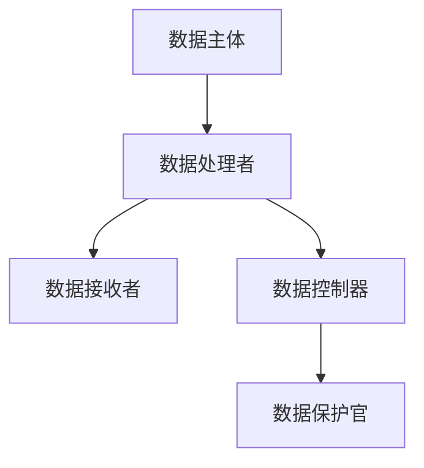

                 

# 数据隐私：捍卫个人价值的新战场

> 关键词：数据隐私、个人价值、数据安全、隐私保护、GDPR、CCPA、加密技术

> 摘要：在数字时代，数据隐私已成为个人价值的守护神。本文将深入探讨数据隐私的基本概念、重要性、法律框架以及保护技术，结合实际案例分析，展望数据隐私保护的未来趋势与挑战。

## 引言

随着互联网和大数据技术的发展，数据已成为现代社会的重要资源。然而，数据隐私问题也日益凸显，成为个人和社会面临的重大挑战。数据隐私不仅关乎个人隐私权的保护，更关系到整个社会的信息安全与稳定。本文旨在全面解析数据隐私，探讨其重要性、法律框架和保护技术，以期为数据隐私保护提供理论依据和实践指导。

## 第一部分：数据隐私的基本概念与重要性

### 第1章：数据隐私的起源与发展

#### 1.1 数据隐私的定义

数据隐私是指个人数据在收集、存储、处理、传输和使用过程中，对其隐私权得到保护的状态。它涉及个人信息的保密性、完整性和可用性，旨在防止个人数据被非法获取、滥用或泄露。

#### 1.2 数据隐私的重要性

数据隐私的重要性体现在以下几个方面：

1. 保护个人隐私权：数据隐私是个人基本权利的体现，保护个人隐私权是维护社会公平正义的基石。
2. 保障信息安全：数据隐私保护是信息安全的重要组成部分，有效的数据隐私保护可以防止数据泄露、滥用和犯罪。
3. 促进社会信任：透明和负责任的数据隐私保护有助于增强公众对数字化服务的信任，推动数字经济的健康发展。

### 第2章：数据隐私的核心概念与联系

#### 2.1 数据隐私的核心概念

数据隐私的核心概念包括：

- 数据主体：指个人信息的所有者，即个人。
- 数据处理者：指对个人数据进行收集、存储、处理、传输和使用的组织或个人。
- 数据接收者：指从数据处理者处接收个人数据的组织或个人。
- 数据控制器：指决定个人数据处理目的和方式的组织或个人。
- 数据保护官：指负责监督和确保数据隐私保护措施得到有效实施的官员。

#### 2.2 核心概念之间的联系

核心概念之间的联系如下：

- 数据主体与数据处理者、数据接收者之间的关系：数据处理者负责收集、存储、处理、传输和使用个人数据，数据接收者从数据处理者处接收个人数据，数据主体有权了解、访问、修改和删除其个人信息。
- 数据控制器与数据保护官的职责与关系：数据控制器负责决定个人数据处理的目的和方式，数据保护官负责监督和确保数据隐私保护措施得到有效实施，两者共同维护数据隐私。

### Mermaid流程图

## 第二部分：数据隐私的法律框架与政策

### 第3章：全球数据隐私法规概览

#### 3.1 欧洲数据隐私法规（GDPR）

- GDPR的核心原则：个人数据处理必须合法、公正、透明；数据主体的同意是数据处理的前提；数据最小化原则；数据保护官的设立；数据泄露通知等。
- GDPR的适用范围：适用于所有欧盟成员国以及与欧盟有数据共享协议的国家。

#### 3.2 美国数据隐私法规（CCPA）

- CCPA的基本概念：数据主体有权了解、访问、删除和拒绝其个人信息；数据控制器和数据处理者有责任保护个人数据。
- CCPA的适用范围：适用于加利福尼亚州境内所有公司，以及其他州的数据共享。

### 第4章：我国数据隐私法规体系

#### 4.1 《中华人民共和国个人信息保护法》

- 主要内容：个人信息处理的基本原则、个人信息主体的权利、个人信息处理者的义务、个人信息保护的特殊规则等。
- 实施与影响：我国《个人信息保护法》已于2021年11月1日起实施，对个人信息保护提出了更高要求。

#### 4.2 《信息安全技术 个人信息安全规范》

- 主要内容：个人信息收集、存储、处理、传输、共享和删除等环节的安全要求。
- 实施与影响：该规范为我国个人信息保护提供了技术依据，有助于提升个人信息保护水平。

## 第三部分：数据隐私保护技术

### 第5章：数据加密与安全存储

#### 5.1 数据加密技术

- 数据加密的基本原理：利用加密算法将明文数据转换为密文数据，以防止非法访问。
- 常见的数据加密算法：对称加密算法（如AES）、非对称加密算法（如RSA）。

#### 5.2 安全存储技术

- 数据存储的安全性问题：数据泄露、篡改、丢失等。
- 数据安全存储的解决方案：使用加密技术保护存储数据，建立完善的数据备份与恢复机制。

### 第6章：匿名化与去识别化技术

#### 6.1 匿名化技术

- 匿名化的基本概念：将个人身份信息去除或不可识别化。
- 匿名化的方法：数据去标识化、数据混淆、数据泛化等。

#### 6.2 去识别化技术

- 去识别化的基本概念：将个人身份信息与数据分离，使数据无法直接识别个人。
- 去识别化的方法：数据加密、哈希函数、差分隐私等。

### 第7章：隐私保护计算技术

#### 7.1 隐私保护计算的基本概念

- 隐私保护计算的定义：在保护数据隐私的同时，对数据进行计算和分析。
- 隐私保护计算的分类：本地隐私保护计算、分布式隐私保护计算、联邦学习等。

#### 7.2 隐私保护计算的应用场景

- 数据库加密查询：保护数据库中的敏感数据不被非法访问。
- 联邦学习：在保护数据隐私的前提下，实现数据分析和机器学习。

## 第四部分：数据隐私保护案例分析

### 第8章：数据隐私保护成功案例分析

#### 8.1 案例一：某知名互联网公司的数据隐私保护措施

- 具体措施：数据加密、访问控制、数据匿名化、隐私保护计算等。
- 成效分析：有效降低了数据泄露风险，提升了用户对服务的信任度。

#### 8.2 案例二：某金融机构的数据隐私保护经验

- 数据隐私保护策略：数据分类分级、权限管理、数据备份与恢复等。
- 面临的挑战与应对措施：数据规模庞大、合规要求高，通过技术手段和制度保障，确保数据隐私保护。

### 第9章：数据隐私保护失败案例分析

#### 9.1 案例一：某大型电商平台的隐私泄露事件

- 事件经过：黑客攻击导致用户个人信息泄露。
- 影响分析：用户信任度下降，导致经济损失和声誉受损。

#### 9.2 案例二：某社交平台的隐私争议

- 争议内容：用户隐私数据被滥用，引发公众不满。
- 社会影响与解决方案：加强数据隐私保护法律法规的制定与执行，提高企业数据隐私保护意识。

## 结论与展望

### 第10章：数据隐私保护的未来趋势与挑战

#### 10.1 未来趋势

- 数据隐私保护技术的发展方向：人工智能、区块链、零知识证明等新型技术的应用。
- 新型隐私保护技术的应用前景：为数据隐私保护提供更高效、更安全的技术手段。

#### 10.2 挑战与应对

- 数据隐私保护面临的挑战：技术不断进步，隐私保护需求日益增加；数据跨境流动的监管难题；用户隐私保护意识的提升等。
- 应对策略与措施：加强法律法规建设，提高企业合规意识；推动技术创新，提升数据隐私保护能力；加强用户隐私教育，提高用户隐私保护意识。

## 附录

### 附录 A：数据隐私保护工具与资源推荐

- 数据加密工具：OpenSSL、GPG等。
- 隐私保护计算平台：Google TensorFlow Privacy、IBM隐私计算平台等。
- 隐私政策模板：[隐私政策模板下载](https://www.example.com/privacy_policy_template)

### 附录 B：数据隐私保护法律法规全文

- GDPR全文：[GDPR全文下载](https://www.example.com/gdpr_full_text)
- CCPA全文：[CCPA全文下载](https://www.example.com/ccpa_full_text)
- 《中华人民共和国个人信息保护法》全文：[个人信息保护法全文下载](https://www.example.com/ppl_full_text)

## 致谢

感谢所有为本文提供参考资料和支持的专家和读者。本文旨在为数据隐私保护提供理论指导与实践参考，希望能够为数据隐私保护事业做出贡献。

## 作者信息

作者：AI天才研究院/AI Genius Institute & 禅与计算机程序设计艺术 /Zen And The Art of Computer Programming

