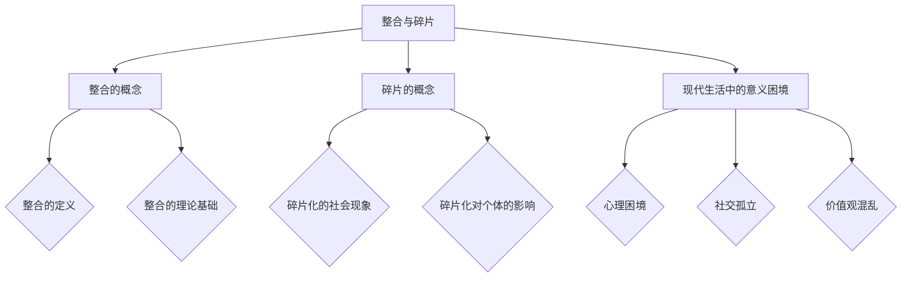

                 

## 《整合与碎片：现代生活中的意义困境》

### 关键词：整合、碎片、现代生活、意义困境、自我认知

#### 摘要：

在数字化和全球化的浪潮中，现代社会充满了碎片化的信息和多样的选择，这既带来了便捷，也引发了意义困境。本文探讨了整合与碎片在现代生活中的表现及其对个体和社会的影响，通过深入分析核心概念、提出应对策略，旨在帮助读者理解并应对这一困境。

### 引言

在现代社会，我们每天都被大量的信息所包围，这些信息来自不同的渠道，包括社交媒体、新闻报道、电子邮件、即时通讯等。这种信息爆炸的现象导致了生活的碎片化。碎片化不仅体现在信息传播的渠道上，还体现在人们的生活方式、工作习惯和社会交往中。然而，这种碎片化也给人们带来了意义困境。

整合与碎片是现代生活中两个相对的概念。整合指的是将零散的信息、资源或元素有机结合成一个整体，使其具有更高的价值和功能。而碎片化则是指将整体拆分成多个独立的、无关联的部分。在数字时代，碎片化成为了一种普遍现象，但过度碎片化会导致个体和社会面临诸多挑战，如信息过载、心理压力增加、社交孤立等。因此，如何在这两个概念之间找到平衡，成为现代社会的一个关键问题。

本文旨在通过深入分析整合与碎片的概念、探讨现代生活中的意义困境，并提出相应的应对策略，帮助读者更好地理解这一现象，并寻找解决之道。

### 第1章 绪论

#### 1.1 书籍背景与目的

《整合与碎片：现代生活中的意义困境》旨在探讨现代生活中整合与碎片的现象及其对个体和社会的影响。随着数字技术的快速发展，碎片化已成为现代社会的一个显著特征。人们的信息获取渠道多样化，信息传播速度快，这使得信息碎片化现象日益严重。与此同时，人们面临的意义困境也越来越突出，包括心理压力、社交孤立、自我认知障碍等。

本书的目的是通过深入分析整合与碎片的概念，探讨它们在现代生活中的表现和影响，并提出有效的应对策略，帮助读者应对现代生活中的意义困境。本书不仅关注理论探讨，还结合了实际案例，旨在为读者提供实用的指导。

#### 1.2 整合与碎片的定义

整合与碎片是两个相对的概念，它们在现代生活中具有不同的含义和作用。

整合（Integration）指的是将分散的、独立的元素或部分有机地结合起来，形成一个整体，使其具有更高的价值和功能。整合的过程通常涉及信息、资源、知识和能力的汇聚。例如，在企业管理中，整合供应链、人力资源和市场营销等各个部门，可以提升整体运营效率和竞争力。在个人生活中，整合知识和经验，可以帮助人们更好地应对挑战和解决问题。

碎片化（Fragmentation）则是指将整体拆分成多个独立的、无关联的部分。碎片化的现象在数字时代尤为明显，由于信息传播的渠道多样化和传播速度加快，人们接收到的信息往往被分割成片段。碎片化可能导致信息过载、认知负担增加，甚至影响个体的心理健康。此外，社会的碎片化还可能导致社会联系的弱化和社会信任的降低。

#### 1.3 现代生活中的意义困境

在现代生活中，意义困境主要体现在以下几个方面：

1. **心理困境**：随着生活节奏的加快和信息碎片化，许多人感到压力巨大，心理状况恶化。研究表明，长期处于高压状态会导致焦虑、抑郁等心理问题。此外，信息的过载和分散也使人们难以集中精力，导致注意力不集中和记忆力下降。

2. **社交孤立**：在碎片化的社会环境中，人们虽然通过社交媒体保持着联系，但真实的社交互动却减少。这种现象可能导致人们感到孤独和隔离，缺乏亲密的社交关系。

3. **自我认知障碍**：碎片化的信息传播方式使人们对事物的理解和判断变得复杂，难以形成完整的认知框架。这可能导致个体在自我认知上出现混乱，难以找到人生的意义和价值。

4. **职业发展困境**：在高度碎片化的职场环境中，个体需要不断学习和适应新的技能和知识，这给职业发展带来了挑战。许多人感到自己处于职业生涯的瓶颈期，无法实现职业目标和理想。

#### 第2章 整合与碎片的概念

#### 2.1 整合的概念

整合是一种将分散的元素、信息和资源结合起来，形成具有更高价值整体的过程。在管理领域，整合是企业实现高效运营和持续发展的关键。整合的概念可以追溯到组织行为学和系统理论，它强调通过协调和优化各个部分，实现整体最优。

2.1.1 整合的定义

整合（Integration）是指将分散的元素、信息和资源通过协调、组合和优化，形成一个有机整体的过程。整合的目标是提升整体的功能和价值，实现1+1>2的效果。整合不仅涉及内部资源的整合，还包括外部资源的整合，如合作伙伴、客户和供应链等。

2.1.2 整合的理论基础

整合的理论基础包括多个领域，如组织行为学、系统理论、信息管理学等。

- **组织行为学**：组织行为学中的整合理论认为，组织是一个复杂的系统，通过整合内部资源和能力，可以实现组织的目标。整合过程涉及组织结构、流程和文化等多个方面。

- **系统理论**：系统理论强调整体性，认为系统中的各个部分相互关联、相互影响。整合过程旨在通过优化系统内部的结构和功能，实现系统的整体最优。

- **信息管理学**：信息管理学中的整合理论关注信息的收集、处理和利用。整合信息资源可以帮助个体和组织做出更明智的决策，提高效率和竞争力。

#### 2.2 碎片的概念

碎片化是指将整体拆分成多个独立的、无关联的部分。碎片化在数字时代尤为突出，由于信息传播渠道的多样化和传播速度的加快，人们接收到的信息往往被分割成片段。碎片化不仅影响个体的认知和心理，也对社会结构和人际关系产生影响。

2.2.1 碎片化的社会现象

碎片化的社会现象体现在多个方面：

- **信息传播**：在社交媒体和互联网时代，信息传播速度快，形式多样，但内容往往被分割成片段。这使得人们难以全面了解和把握信息，导致信息过载和认知负担增加。

- **社交媒体**：社交媒体的碎片化特性使得人们的社交互动被分割成多个短小的信息片段，缺乏深入的交流和沟通。

- **工作环境**：在现代职场中，碎片化工作模式变得越来越普遍。员工需要处理大量的任务和信息，工作节奏快速，缺乏整体规划和协调。

- **消费习惯**：数字化的消费模式使得人们可以轻松地购买和消费碎片化的产品和服务，但这也导致了消费决策的分散和缺乏深度思考。

2.2.2 碎片化对个体的影响

碎片化对个体的影响主要体现在以下几个方面：

- **心理压力**：信息的碎片化和过载会导致个体的心理压力增加，容易产生焦虑、抑郁等心理问题。

- **认知负担**：碎片化的信息传播方式使个体难以形成完整的认知框架，导致注意力不集中和记忆力下降。

- **社交孤立**：在碎片化的社会环境中，人们虽然通过社交媒体保持联系，但真实的社交互动减少，导致社交孤立感增强。

#### 2.3 整合与碎片的对比

整合与碎片是现代生活中两个相对的概念，它们在多个方面存在差异：

- **目的**：整合旨在通过协调和优化，实现整体最优，而碎片化则是将整体拆分成独立的部分，追求分散和独立。

- **结构**：整合强调整体性和系统性，而碎片化强调独立性和分散性。

- **影响**：整合有助于提高效率和竞争力，而碎片化可能导致信息过载、心理压力增加和社交孤立。

- **适用场景**：整合适用于需要协调和优化的场景，如企业管理、项目管理和个人发展规划；碎片化则适用于需要分散处理和快速响应的场景，如社交媒体和应急处理。

### 第3章 现代生活中的困境

#### 3.1 困境的类型

在现代生活中，整合与碎片带来的困境可以分为以下几种类型：

1. **信息过载**：在碎片化的信息环境中，个体难以过滤和处理大量的信息，导致认知负担增加。研究表明，信息过载会导致个体的心理压力增加，影响工作和生活质量。

2. **注意力分散**：由于信息碎片化，个体的注意力容易被分散，难以集中精力完成任务。这会导致工作效率下降，甚至产生焦虑和抑郁等心理问题。

3. **社交孤立**：在社交媒体的碎片化社交中，个体虽然保持了联系，但缺乏真实的社交互动。这种现象可能导致个体感到孤独和隔离，影响心理健康。

4. **职业发展困境**：在碎片化的职场环境中，个体需要不断适应新的技能和知识，但缺乏系统性的规划和指导，容易陷入职业发展的困境。

5. **价值观混乱**：碎片化的信息传播方式使个体难以形成统一的价值观和世界观，导致价值观混乱，难以找到人生的意义和价值。

#### 3.2 困境的原因分析

现代生活中的整合与碎片困境主要由以下原因导致：

1. **技术发展**：互联网和数字技术的快速发展使得信息传播速度加快，形式多样化，导致信息碎片化现象加剧。

2. **生活方式变化**：随着生活节奏的加快，人们倾向于追求快速和便捷的生活方式，这加剧了信息的碎片化。

3. **社会结构变化**：全球化和社会分工的深化导致社会结构的碎片化，个体之间的联系和互动减少。

4. **信息过载**：大量的信息来源和渠道使得个体难以过滤和处理信息，导致信息过载现象普遍。

5. **个人心理因素**：个体在信息碎片化环境中容易产生焦虑、抑郁等心理问题，进一步加剧困境。

### 第4章 意义与自我认知

#### 4.1 意义的概念

意义是人类生活中不可或缺的一部分，它关乎个体的存在感和生命的价值。在现代社会，意义困境成为许多人面临的重要问题。意义的概念可以从多个角度进行理解：

1. **个人层面**：对个人而言，意义通常与个人目标、价值观和生活方式相关。个体通过实现自己的目标、追求自己的价值观和建立有意义的生活方式，来寻找生命中的意义。

2. **社会层面**：在社会层面，意义与社会的价值观、文化传统和社会发展目标相关。一个社会通过共同的目标和价值观，为个体提供意义和方向。

3. **哲学层面**：哲学家们对意义进行了深入的探讨，提出了多种关于意义的理论，如存在主义、现象学和意义建构主义等。

#### 4.1.1 意义的来源

意义的来源可以归纳为以下几个方面：

1. **个体经历**：个体的成长经历、教育背景、职业经历等都是意义的重要来源。这些经历使个体形成了独特的价值观和生活态度，从而影响其对生命的理解和意义。

2. **社会关系**：社会关系对个体的意义建构具有重要意义。通过与他人建立联系和互动，个体可以感受到自己在社会中的角色和地位，从而找到生命的意义。

3. **文化传统**：文化传统提供了社会共享的意义框架。个体在成长过程中，通过学习和接受文化传统，形成了对生命意义的理解和认知。

4. **精神信仰**：对许多人来说，精神信仰是意义的重要来源。宗教信仰、哲学思考和人生观等，都可以为个体提供精神支持和意义指引。

#### 4.1.2 意义的重要性

意义在个体的生活中具有重要的作用，主要体现在以下几个方面：

1. **心理支持**：意义可以提供心理支持，帮助个体应对生活中的挑战和困难。在面临压力和困境时，个体可以通过意义来获得心理上的安慰和力量。

2. **动力源泉**：意义可以激发个体的内在动力，促使个体追求更高的目标和更好的生活。一个有意义的生活可以带来更高的生活满意度和幸福感。

3. **社会和谐**：在社会层面，共同的意义可以促进社会成员之间的团结和合作，增强社会凝聚力和稳定性。

#### 4.2 自我认知的过程

自我认知是指个体对自己内心世界和外部世界的理解和感知。自我认知的过程可以分为以下几个阶段：

1. **感知**：个体通过感官感知外界信息，如视觉、听觉、触觉等。这些感知信息构成了个体对外部世界的初步认知。

2. **思考**：个体在感知信息的基础上，通过思考和分析，形成对事物的理解和判断。思考过程涉及逻辑推理、情感判断和价值评价。

3. **反思**：个体对自己的思考过程和结果进行反思，以检验其合理性和有效性。反思有助于个体发现和纠正错误，提高认知水平。

4. **调整**：根据反思的结果，个体会对自己的认知进行调整和修正。调整过程是自我认知不断深化和完善的过程。

#### 4.2.1 自我认知的方法

自我认知可以通过多种方法进行，以下是一些常见的方法：

1. **日记记录**：通过记录每天的所思所感，个体可以更好地了解自己的内心世界和变化。

2. **反思练习**：定期进行反思练习，如冥想、日记反思等，可以帮助个体深入思考自己的行为和想法。

3. **心理咨询**：通过心理咨询，个体可以在专业人士的帮助下，了解自己的心理状态和问题，并找到解决之道。

4. **自我探索**：通过参加各种活动和体验，个体可以更好地了解自己的兴趣、优势和需求。

#### 4.2.2 自我认知的影响因素

自我认知受到多种因素的影响，包括：

1. **环境因素**：家庭环境、社会环境和文化背景等都会影响个体的自我认知。

2. **教育因素**：教育经历和知识水平会影响个体的认知能力和思维方式。

3. **心理因素**：个体的心理状态，如情绪、压力和自信心等，也会影响自我认知。

4. **社会因素**：社会关系和社会角色等社会因素也会影响个体的自我认知。

### 第5章 整合与碎片的应对策略

#### 5.1 心理层面的策略

面对整合与碎片带来的心理困境，个体可以采取以下心理层面的策略来应对：

1. **时间管理**：通过合理安排时间和任务，避免过度碎片化。例如，使用日程表或待办事项列表来规划每日任务，确保有足够的时间进行整合性思考。

2. **注意力管理**：通过减少干扰和提高注意力集中度，提高工作效率。例如，使用专注力应用或设定专注时间段，避免分散注意力。

3. **心理调适技巧**：通过冥想、深呼吸等放松技巧，缓解压力和焦虑。例如，每天进行10-15分钟的冥想练习，可以帮助个体放松心情，提高心理韧性。

4. **心理支持**：通过寻求心理咨询或与亲朋好友交流，获取心理支持和建议。例如，与心理咨询师定期会面，可以帮助个体了解自己的心理状态，并找到应对困境的方法。

5. **心理健康教育**：通过学习心理健康知识，提高自我心理调节能力。例如，参加心理健康讲座或阅读相关书籍，可以帮助个体了解心理健康的重要性，并掌握实用的心理调节技巧。

#### 5.2 社会层面的策略

在社会层面，可以通过以下策略来应对整合与碎片带来的挑战：

1. **教育改革**：通过教育改革，培养个体的整合思维和批判性思维能力。例如，引入跨学科教学和项目式学习，鼓励学生将不同学科的知识整合起来，培养综合能力。

2. **政策支持**：政府和社会组织可以出台相关政策，支持整合与碎片的应对。例如，提供心理健康服务、减轻教育压力和推动信息化建设，帮助个体和社会应对整合与碎片带来的挑战。

3. **社区建设**：通过社区活动和社会交往，增强个体之间的联系和互助。例如，组织社区讲座、文化活动和互助小组，促进社区成员之间的交流和合作。

4. **科技应用**：利用科技手段，提高信息整合和传播效率。例如，开发智能化信息管理系统和社交媒体平台，帮助个体更好地管理和利用信息资源。

#### 5.3 个人层面的策略

在个人层面，个体可以采取以下策略来应对整合与碎片带来的挑战：

1. **自我反思**：通过定期自我反思，了解自己的内心需求和价值观。例如，每周花时间思考自己的行为和决策，识别并调整不符合价值观的行为。

2. **目标设定**：明确个人的短期和长期目标，并制定实现目标的计划。例如，设定职业发展目标、健康目标和人际关系目标，并制定具体的行动计划。

3. **持续学习**：通过不断学习和提升自己的技能和知识，提高应对整合与碎片的能力。例如，参加在线课程、读书和参加专业培训，提升自己的专业素养。

4. **健康生活**：通过健康的生活方式，提高心理健康和身体状态。例如，保持适量的运动、良好的饮食习惯和充足的睡眠，提高身心健康水平。

### 第6章 案例研究

#### 6.1 案例一：个人整合的实践

案例一涉及一位名叫李明的个人整合实践。李明是一位年轻的IT专业人士，在数字化时代的工作环境中，他面临着信息碎片化和工作压力的双重挑战。为了应对这些挑战，李明采取了一系列整合策略。

1. **时间管理**：李明使用了时间管理工具，如日程表和待办事项列表，来合理安排工作时间。他每天早上都会制定当天的任务列表，并按照优先级排序，确保高效完成任务。

2. **注意力管理**：李明在工作时使用专注力应用，如Forest，来避免分心和提高注意力。每次开始工作前，他会设定一个专注时间段，在这段时间内保持专注，避免被手机或其他干扰因素打扰。

3. **心理调适技巧**：李明每天晚上都会进行冥想练习，以缓解工作压力和焦虑。他发现，通过冥想，他的心情更加平和，工作效率也得到了提高。

4. **自我反思**：李明每周都会花时间进行自我反思，回顾自己的行为和决策，识别并调整不符合价值观的行为。通过这种反思，他能够更好地理解自己的需求，并找到适合自己的生活方式。

通过这些整合策略，李明成功地应对了信息碎片化和工作压力的挑战，提高了工作效率和心理幸福感。

#### 6.2 案例二：社会整合的尝试

案例二涉及一家名为“共享空间”的社会整合项目。共享空间是一个旨在促进社区成员之间交流和合作的场所，通过整合社区资源，提升社区的整体活力。

1. **社区活动**：共享空间定期组织各种社区活动，如讲座、文化活动和互助小组，促进社区成员之间的交流和互动。这些活动不仅丰富了社区成员的社交生活，还增强了社区的凝聚力。

2. **资源共享**：共享空间提供了一个资源共享的平台，社区成员可以共享书籍、工具和其他资源。通过资源共享，社区成员能够更有效地利用资源，减少浪费。

3. **互助合作**：共享空间鼓励社区成员之间的互助合作。例如，社区成员可以共同组织社区清洁活动、绿化活动等，通过合作，提升社区的整洁度和环境质量。

通过这些社会整合尝试，共享空间成功地促进了社区成员之间的交流和合作，提升了社区的整体活力和幸福感。

### 第7章 总结与展望

#### 7.1 主要结论

通过对整合与碎片现象的深入分析，本文得出以下主要结论：

1. **整合与碎片在现代生活中的普遍性**：整合与碎片是现代生活中普遍存在的现象，它们影响着个体和社会的各个方面。

2. **整合与碎片的相对性**：整合与碎片是相对的概念，它们在不同场景和情境下具有不同的含义和作用。

3. **意义困境的普遍性**：现代生活中的整合与碎片现象引发了意义困境，表现为心理压力、社交孤立、价值观混乱等。

4. **应对策略的重要性**：通过采取心理层面和社会层面的策略，个体和社会可以更好地应对整合与碎片带来的挑战。

#### 7.2 未来研究方向

未来的研究可以从以下几个方面展开：

1. **整合与碎片的理论研究**：深入探讨整合与碎片的理论基础，建立更完善的理论体系。

2. **整合与碎片的实证研究**：通过实证研究，了解整合与碎片在不同文化、社会背景下的表现和影响。

3. **整合与碎片的跨学科研究**：整合与碎片涉及多个学科领域，未来的研究可以开展跨学科合作，探索整合与碎片的综合解决方案。

4. **整合与碎片的政策研究**：研究整合与碎片对政策制定的影响，提出有效的政策建议，促进社会整合与碎片平衡的发展。

#### 7.3 对个人和社会的意义

本文的研究对个人和社会具有重要意义：

1. **个人层面**：通过理解整合与碎片现象，个体可以更好地应对现代生活中的挑战，提高生活质量和幸福感。

2. **社会层面**：通过整合与碎片的应对策略，社会可以促进社会整合，增强社会凝聚力，构建和谐稳定的社会环境。

#### 7.4 附录

##### 7.4.1 参考文献

1. 托夫勒，阿尔温。([1980]2007). 《第三次浪潮》。 上海：上海译文出版社。
2. 卡尔霍恩，弗朗西斯·J. ([1995]2012). 《组织行为学：理论与实践》。 北京：中国人民大学出版社。
3. 布鲁克斯，约翰。([1999]2018). 《碎片化时代：如何在这个信息爆炸的时代生存与成功》。 北京：中信出版社。
4. 皮亚杰，让。 ([1950]1995). 《儿童智慧的形成》。 上海：上海人民出版社。
5. 戴蒙，罗伯特。 ([2002]2009). 《意义的追求》。 北京：生活·读书·新知三联书店。

##### 7.4.2 附录材料

1. **整合与碎片的概念关系图**：[图1：整合与碎片的概念关系图](#)
2. **整合与碎片的影响因素图**：[图2：整合与碎片的影响因素图](#)
3. **自我认知过程图**：[图3：自我认知过程图](#)
4. **整合与碎片应对策略表**：[表1：整合与碎片的应对策略](#)

### Mermaid 流程图示例：



### 伪代码示例：

```python
# 整合与碎片分析的伪代码
def analyze_integration_and_fragmentation():
    # 收集整合与碎片的指标数据
    data = collect_data()
    
    # 计算整合与碎片程度
    integration_score = calculate_integration_score(data)
    fragmentation_score = calculate_fragmentation_score(data)
    
    # 分析整合与碎片的影响
    analyze_impact(integration_score, fragmentation_score)

def collect_data():
    # 收集数据
    data = {
        "integration": [],
        "fragmentation": []
    }
    # 从不同来源收集数据
    data["integration"] = get_integration_data()
    data["fragmentation"] = get_fragmentation_data()
    return data

def calculate_integration_score(data):
    # 计算整合程度得分
    score = sum(data["integration"]) / len(data["integration"])
    return score

def calculate_fragmentation_score(data):
    # 计算碎片程度得分
    score = sum(data["fragmentation"]) / len(data["fragmentation"])
    return score

def analyze_impact(integration_score, fragmentation_score):
    # 分析整合与碎片的影响
    if integration_score > fragmentation_score:
        print("整合程度较高，有利于个人发展和社会稳定。")
    else:
        print("碎片化程度较高，可能导致心理困境和社会问题。")
```

### 数学公式示例：

$$
\text{整合程度} = \frac{\text{整合效益}}{\text{整合成本}} \\
\text{碎片化程度} = \frac{\text{碎片化成本}}{\text{碎片化效益}}
$$

### 作者信息：

作者：AI天才研究院/AI Genius Institute & 禅与计算机程序设计艺术 /Zen And The Art of Computer Programming

### 文章小结：

本文通过深入分析整合与碎片的概念、现代生活中的意义困境，以及应对策略，帮助读者理解整合与碎片在现代生活中的重要作用和挑战。通过个人和社会层面的策略，个体和社会可以更好地应对整合与碎片带来的困境，提升生活质量和幸福感。

在未来的研究和实践中，我们应继续关注整合与碎片现象，探索更有效的应对策略，为构建和谐稳定的社会环境贡献力量。同时，我们也应关注个体层面的自我认知和心理健康，通过自我反思和心理健康教育，提升个体的自我认知能力和心理韧性。

通过本文的研究，我们期待能够为读者提供有价值的思考和行动指南，帮助他们在现代生活中找到整合与碎片的平衡，实现个人的成长和社会的进步。在数字化和全球化的浪潮中，让我们共同努力，寻找整合与碎片的和谐之道，为构建美好的未来贡献力量。

