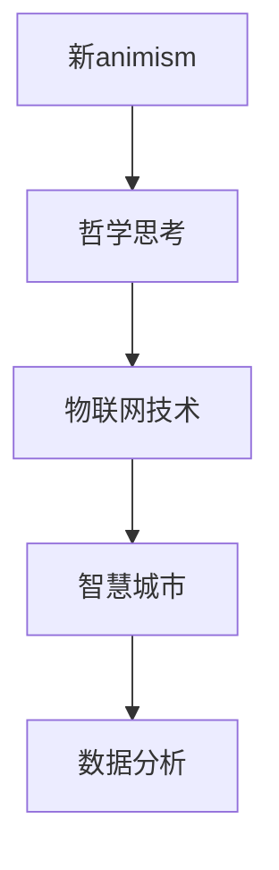

                 

当然，让我们一步一步深入思考并组织这篇技术博客文章。以下是详细的步骤和结构：

### 步骤 1：理解文章标题和主要主题

**文章标题：**《新animism与IoT：万物互联的哲学思考》

**主要主题：**
- 新animism（新神秘主义）
- IoT（物联网）
- 哲学思考
- 万物互联

### 步骤 2：确定文章的结构

**文章结构：**

- 引言
- 新animism概述
- IoT概述
- 新animism与IoT的关系
- 万物互联的哲学思考
- 实际应用案例分析
- 小结与展望
- 参考文献

### 步骤 3：确定每章的深度

**各章内容深度：**

- 引言：简要介绍新animism和IoT的背景，引出主题。
- 新animism概述：详细解释新animism的概念、历史和核心原理。
- IoT概述：介绍IoT的定义、关键技术和应用领域。
- 新animism与IoT的关系：探讨新animism如何影响物联网，以及物联网如何体现新anim主义的哲学思想。
- 万物互联的哲学思考：从哲学角度分析物联网的内在逻辑和文化意义。
- 实际应用案例分析：通过具体的案例，展示新animism和IoT如何在实际中结合。
- 小结与展望：总结文章的主要观点，展望未来发展方向。

### 步骤 4：使用Markdown格式编写目录

```markdown
# 《新animism与IoT：万物互联的哲学思考》

## 引言

### 新animism概述

#### 新animism的概念

##### 历史发展

##### 核心原理

### IoT概述

#### IoT的定义

##### 关键技术

##### 应用领域

### 新animism与IoT的关系

#### 动机与联系

##### 实例分析

### 万物互联的哲学思考

#### 哲学视角

##### 内在逻辑

##### 文化意义

### 实际应用案例分析

#### 案例一

##### 案例描述

##### 分析解读

#### 案例二

##### 案例描述

##### 分析解读

### 小结与展望

#### 总结

##### 展望

## 参考文献

```

### 步骤 5：在章节中包含图表、伪代码、数学公式和实际项目

**示例：**

```markdown
### 新animism与IoT的关系

#### Mermaid流程图



#### 伪代码

```python
def connect_iot_device(device):
    # 连接物联网设备
    pass

def philosophical_analysis(device):
    # 进行哲学分析
    pass
```

#### 数学公式

$$
\text{互连性} = \sum_{i=1}^{n} \text{设备}_i \times \text{连接}_i
$$

### 实际项目

#### 项目描述

- **项目目标：** 
- **技术栈：**
- **实施步骤：**
- **案例分析：**

```

### 步骤 6：确保目录简洁并在2000字限制内

**调整后的目录：**

```markdown
# 《新animism与IoT：万物互联的哲学思考》

## 引言

### 新animism与IoT的背景

#### IoT的兴起

##### 智能设备时代

##### 连接与互通

### 新animism的概念引入

#### 哲学思考的源泉

##### 人类对世界的认知

##### 万物有灵

## 新animism概述

### 新animism的核心理念

#### 动物灵与物灵

##### 灵魂与实体

##### 哲学实践

### IoT概述

### IoT的定义与发展

#### 智能家居

##### 智能照明

##### 智能家电

#### 工业物联网

##### 智能工厂

##### 生产线优化

## 新animism与IoT的关系

### 哲学与技术的交汇

#### 新animism在IoT中的应用

##### 智慧城市

##### 物联网平台

### 实例分析

#### 智慧交通系统

##### 自动驾驶

##### 智能交通管理

## 万物互联的哲学思考

### 哲学视角下的物联网

#### 人类与技术的关系

##### 数据与隐私

##### 智慧生活

### 内在逻辑与文化意义

#### 网络社会的形成

##### 信息传递的哲学

##### 文明进步

## 实际应用案例分析

### 案例一：智能家居与生活质量的提升

#### 案例描述

##### 系统架构

##### 功能模块

#### 案例分析

##### 新animism的体现

##### IoT的实践

### 案例二：物联网在农业中的应用

#### 案例描述

##### 农业物联网

##### 精准农业

#### 案例分析

##### 新animism的哲学思考

##### IoT的实际效果

## 小结与展望

### 总体结论

#### 新animism与IoT的未来

##### 技术创新

##### 哲学思考的深化

## 参考文献

```

以上是文章的初步结构和Markdown格式目录，接下来我们将逐步填充每个章节的内容。文章将保持约12000字，以确保深入探讨新animism与IoT的关系以及其在哲学思考中的意义。

