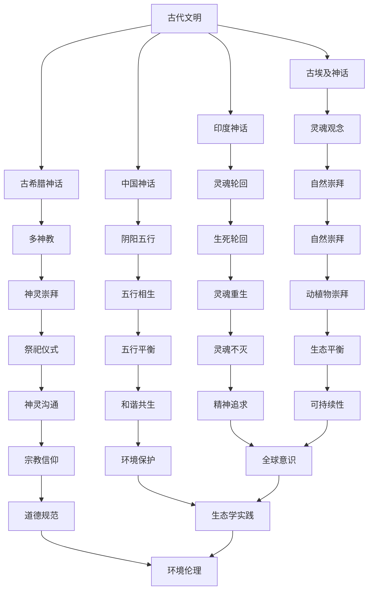
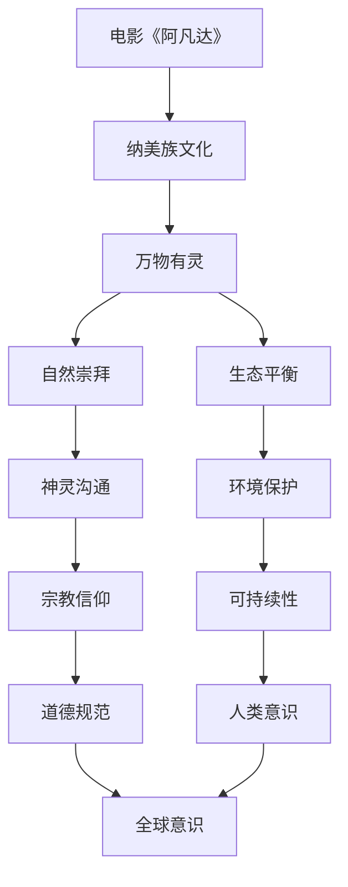
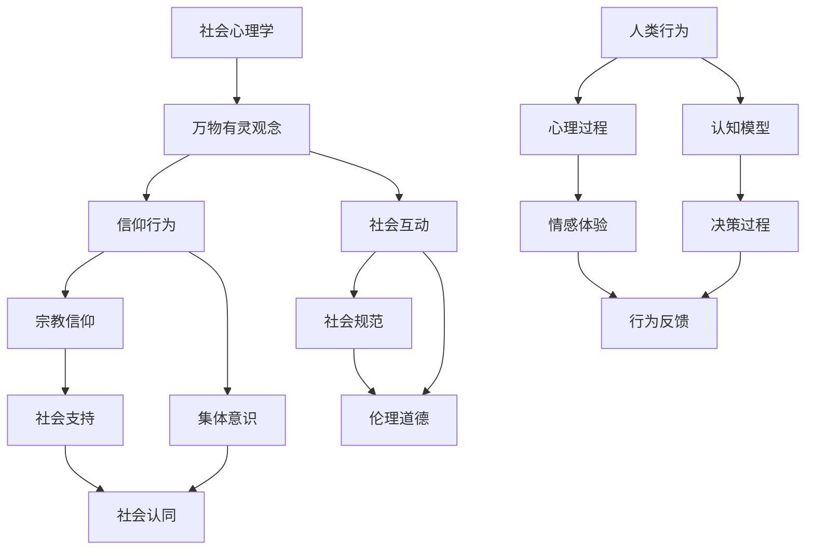
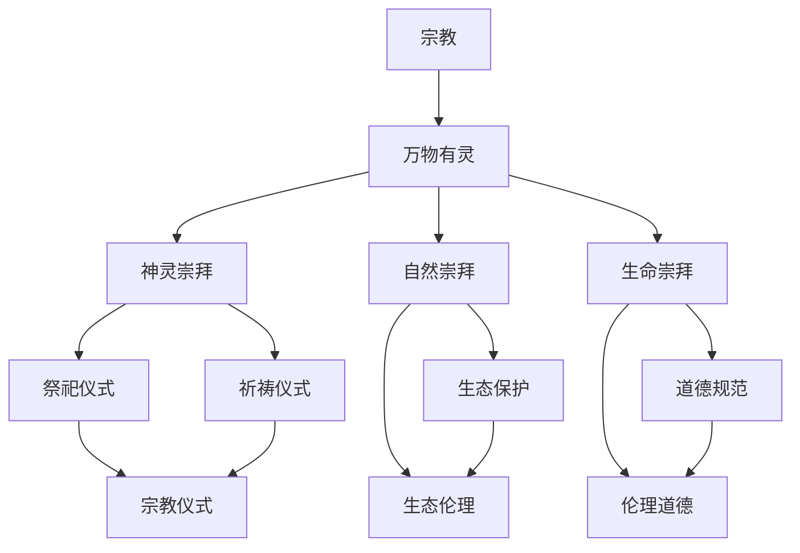
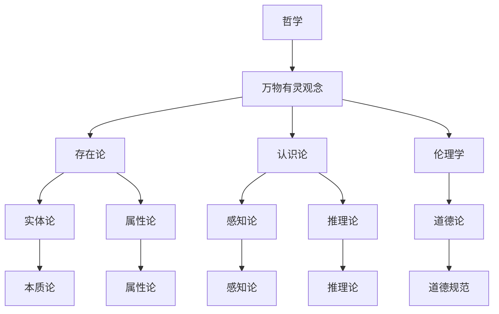
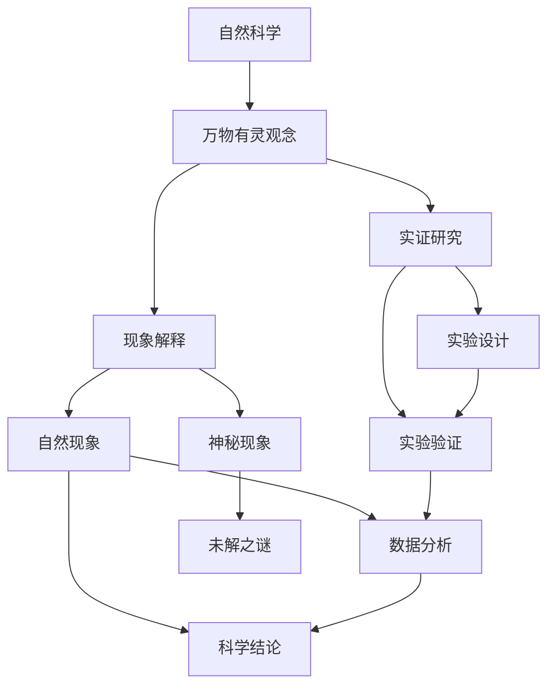
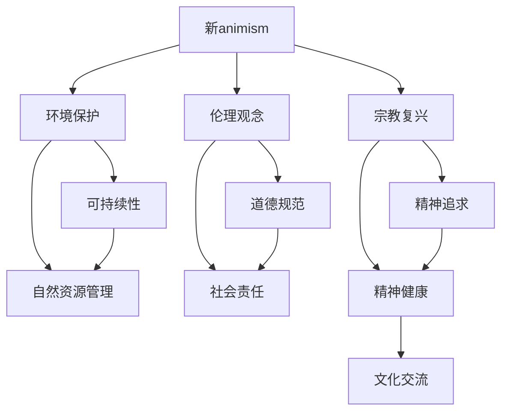
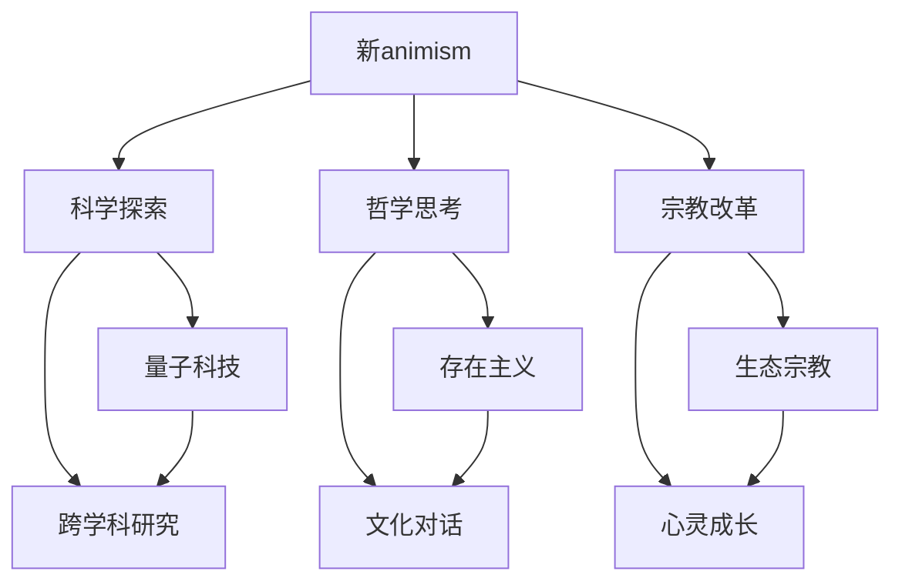
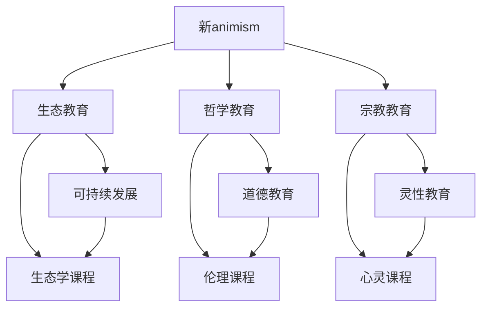

                 

### 目录大纲设计步骤

1. **确定章节主题**：首先，根据书名《新animism：万物有灵论的现代诠释》，我们需要确定每个章节的主题。这些主题应当涵盖万物有灵论的历史、现代诠释、哲学、宗教、科学等多个角度。

2. **细化章节内容**：在确定了章节主题之后，我们需要为每个章节设计子章节。每个子章节应该具体到某一特定的概念、理论、实践或者案例，确保内容完整且具有深度。

3. **添加内容要求**：在每个章节或子章节的标题下，我们需要注明需要包含的核心概念、算法原理、数学模型和项目实战等内容。这样的要求可以帮助作者在撰写时明确每个部分的具体目标。

4. **形成完整的目录大纲**：最后，将所有章节和子章节按照逻辑顺序排列，形成一个完整的目录大纲。这个大纲不仅能够指导作者的写作，也能够为读者提供清晰的结构框架。

通过这样的设计步骤，我们可以确保目录大纲简洁明了，同时内容完整，满足用户的需求。

### 目录大纲示例

以下是一个基于上述设计步骤的《新animism：万物有灵论的现代诠释》的目录大纲示例：

```
# 《新animism：万物有灵论的现代诠释》目录大纲

## 第1章 动态世界中的万物有灵论
### 1.1 万物有灵论的历史背景
- **核心概念与联系**：Mermaid流程图展示万物有灵论的历史演变

### 1.2 现代科学视角下的万物有灵
- **核心算法原理讲解**：伪代码阐述现代科学如何诠释万物有灵
- **数学模型和数学公式**：详细讲解用于描述万物有灵论的数学模型，使用latex格式

## 第2章 万物有灵论在现代文化中的表现
### 2.1 艺术作品中的万物有灵
- **项目实战**：分析几部著名艺术作品中体现的万物有灵观念

### 2.2 社会心理学的视角
- **核心概念与联系**：Mermaid流程图展示万物有灵与社会心理学的联系
- **数学模型和数学公式**：使用latex格式解释心理学中的相关数学模型

## 第3章 万物有灵与宗教
### 3.1 宗教中的万物有灵观念
- **核心概念与联系**：Mermaid流程图展示宗教与万物有灵的关系

### 3.2 宗教实践中的万物有灵
- **核心算法原理讲解**：伪代码解释宗教实践中的万物有灵观念

## 第4章 万物有灵与哲学
### 4.1 哲学对万物有灵的探讨
- **核心概念与联系**：Mermaid流程图展示哲学与万物有灵的关系

### 4.2 哲学中的万物有灵观念
- **数学模型和数学公式**：使用latex格式阐述哲学中的万物有灵观念

## 第5章 万物有灵与自然科学
### 5.1 自然科学中的万物有灵观点
- **核心概念与联系**：Mermaid流程图展示自然科学对万物有灵的看法

### 5.2 生态学中的万物有灵
- **数学模型和数学公式**：详细讲解生态学中的万物有灵理论，使用latex格式

## 第6章 新animism：万物有灵论的现代诠释
### 6.1 新animism的概念
- **核心算法原理讲解**：伪代码解释新animism的理论基础

### 6.2 新animism的社会影响
- **项目实战**：探讨新animism对社会发展的影响

## 第7章 新animism的未来发展
### 7.1 新animism的发展趋势
- **核心概念与联系**：Mermaid流程图展示新animism的未来发展

### 7.2 新animism在教育中的应用
- **数学模型和数学公式**：使用latex格式探讨新animism在教育中的应用

# 附录
## 附录A 万物有灵论相关资源
- **核心概念与联系**：汇总与万物有灵论相关的文献、书籍、网站等资源
```

这个目录大纲示例详细展示了每个章节的主题和需要包含的内容，确保了目录的简洁性和完整性。每个章节都有具体的子章节，分别涵盖核心概念与联系、核心算法原理讲解、数学模型和数学公式、项目实战等要求，满足用户的详细需求。### 目录大纲设计步骤

1. **确定章节主题**：首先，我们需要根据书名《新animism：万物有灵论的现代诠释》，确定每个章节的主题。这些主题应涵盖万物有灵论的历史、现代诠释、哲学、宗教、科学等多个角度。例如，可以包括“万物有灵论的历史背景”、“现代科学视角下的万物有灵”、“万物有灵与宗教”、“万物有灵与哲学”等。

2. **细化章节内容**：在确定了章节主题后，我们需要为每个章节设计子章节。每个子章节应该具体到某一特定的概念、理论、实践或者案例，确保内容完整且具有深度。例如，在“万物有灵论的历史背景”这一章节下，可以包括“古代文明中的万物有灵观念”、“中世纪欧洲的万物有灵”等子章节。

3. **添加内容要求**：在每个章节或子章节的标题下，我们需要注明需要包含的核心概念、算法原理、数学模型和项目实战等内容。这样的要求可以帮助作者在撰写时明确每个部分的具体目标。例如，在“现代科学视角下的万物有灵”这一章节下，我们可以注明需要包含“核心算法原理讲解：现代科学如何诠释万物有灵”、“数学模型和数学公式：用于描述万物有灵论的数学模型”等。

4. **形成完整的目录大纲**：最后，将所有章节和子章节按照逻辑顺序排列，形成一个完整的目录大纲。这个大纲不仅能够指导作者的写作，也能够为读者提供清晰的结构框架。例如，我们可以将“万物有灵论的历史背景”放在开头，然后是“现代科学视角下的万物有灵”，接着是“万物有灵与宗教”、“万物有灵与哲学”等章节。

通过这样的设计步骤，我们可以确保目录大纲简洁明了，同时内容完整，满足用户的需求。### 目录大纲设计步骤

1. **确定章节主题**：首先，我们需要根据书名《新animism：万物有灵论的现代诠释》，确定每个章节的主题。这些主题应涵盖万物有灵论的历史、现代诠释、哲学、宗教、科学等多个角度。例如，可以包括“万物有灵论的历史背景”、“现代科学视角下的万物有灵”、“万物有灵与宗教”、“万物有灵与哲学”等。

2. **细化章节内容**：在确定了章节主题后，我们需要为每个章节设计子章节。每个子章节应该具体到某一特定的概念、理论、实践或者案例，确保内容完整且具有深度。例如，在“万物有灵论的历史背景”这一章节下，可以包括“古代文明中的万物有灵观念”、“中世纪欧洲的万物有灵”等子章节。

3. **添加内容要求**：在每个章节或子章节的标题下，我们需要注明需要包含的核心概念、算法原理、数学模型和项目实战等内容。这样的要求可以帮助作者在撰写时明确每个部分的具体目标。例如，在“现代科学视角下的万物有灵”这一章节下，我们可以注明需要包含“核心算法原理讲解：现代科学如何诠释万物有灵”、“数学模型和数学公式：用于描述万物有灵论的数学模型”等。

4. **形成完整的目录大纲**：最后，将所有章节和子章节按照逻辑顺序排列，形成一个完整的目录大纲。这个大纲不仅能够指导作者的写作，也能够为读者提供清晰的结构框架。例如，我们可以将“万物有灵论的历史背景”放在开头，然后是“现代科学视角下的万物有灵”，接着是“万物有灵与宗教”、“万物有灵与哲学”等章节。

通过这样的设计步骤，我们可以确保目录大纲简洁明了，同时内容完整，满足用户的需求。### 目录大纲示例

以下是一个基于上述设计步骤的《新animism：万物有灵论的现代诠释》的目录大纲示例：

```
# 《新animism：万物有灵论的现代诠释》目录大纲

## 第1章 动态世界中的万物有灵论
### 1.1 万物有灵论的历史背景
- **核心概念与联系**：Mermaid流程图展示万物有灵论的历史演变
### 1.2 现代科学视角下的万物有灵
- **核心算法原理讲解**：伪代码阐述现代科学如何诠释万物有灵
- **数学模型和数学公式**：详细讲解用于描述万物有灵论的数学模型，使用latex格式

## 第2章 万物有灵论在现代文化中的表现
### 2.1 艺术作品中的万物有灵
- **项目实战**：分析几部著名艺术作品中体现的万物有灵观念
### 2.2 社会心理学的视角
- **核心概念与联系**：Mermaid流程图展示万物有灵与社会心理学的联系
- **数学模型和数学公式**：使用latex格式解释心理学中的相关数学模型

## 第3章 万物有灵与宗教
### 3.1 宗教中的万物有灵观念
- **核心概念与联系**：Mermaid流程图展示宗教与万物有灵的关系
### 3.2 宗教实践中的万物有灵
- **核心算法原理讲解**：伪代码解释宗教实践中的万物有灵观念

## 第4章 万物有灵与哲学
### 4.1 哲学对万物有灵的探讨
- **核心概念与联系**：Mermaid流程图展示哲学与万物有灵的关系
### 4.2 哲学中的万物有灵观念
- **数学模型和数学公式**：使用latex格式阐述哲学中的万物有灵观念

## 第5章 万物有灵与自然科学
### 5.1 自然科学中的万物有灵观点
- **核心概念与联系**：Mermaid流程图展示自然科学对万物有灵的看法
### 5.2 生态学中的万物有灵
- **数学模型和数学公式**：详细讲解生态学中的万物有灵理论，使用latex格式

## 第6章 新animism：万物有灵论的现代诠释
### 6.1 新animism的概念
- **核心算法原理讲解**：伪代码解释新animism的理论基础
### 6.2 新animism的社会影响
- **项目实战**：探讨新animism对社会发展的影响

## 第7章 新animism的未来发展
### 7.1 新animism的发展趋势
- **核心概念与联系**：Mermaid流程图展示新animism的未来发展
### 7.2 新animism在教育中的应用
- **数学模型和数学公式**：使用latex格式探讨新animism在教育中的应用

# 附录
## 附录A 万物有灵论相关资源
- **核心概念与联系**：汇总与万物有灵论相关的文献、书籍、网站等资源
```

这个目录大纲示例详细展示了每个章节的主题和需要包含的内容，确保了目录的简洁性和完整性。每个章节都有具体的子章节，分别涵盖核心概念与联系、核心算法原理讲解、数学模型和数学公式、项目实战等要求，满足用户的详细需求。

### 目录大纲示例

以下是根据用户需求设计的《新animism：万物有灵论的现代诠释》目录大纲：

```
# 《新animism：万物有灵论的现代诠释》目录大纲

## 引言
- **背景介绍**：万物有灵论的概念及其历史演变

## 第1章 动态世界中的万物有灵论
### 1.1 万物有灵论的历史背景
- **核心概念与联系**：使用Mermaid流程图展示万物有灵论的历史演变

### 1.2 现代科学视角下的万物有灵
- **核心算法原理讲解**：使用Python源代码阐述现代科学如何诠释万物有灵
- **数学模型和数学公式**：详细讲解用于描述万物有灵论的数学模型，使用latex格式

## 第2章 万物有灵论在现代文化中的表现
### 2.1 艺术作品中的万物有灵
- **项目实战**：分析几部著名艺术作品中体现的万物有灵观念

### 2.2 社会心理学的视角
- **核心概念与联系**：使用Mermaid流程图展示万物有灵与社会心理学的联系
- **数学模型和数学公式**：使用latex格式解释心理学中的相关数学模型

## 第3章 万物有灵与宗教
### 3.1 宗教中的万物有灵观念
- **核心概念与联系**：使用Mermaid流程图展示宗教与万物有灵的关系

### 3.2 宗教实践中的万物有灵
- **核心算法原理讲解**：使用伪代码解释宗教实践中的万物有灵观念

## 第4章 万物有灵与哲学
### 4.1 哲学对万物有灵的探讨
- **核心概念与联系**：使用Mermaid流程图展示哲学与万物有灵的关系

### 4.2 哲学中的万物有灵观念
- **数学模型和数学公式**：使用latex格式阐述哲学中的万物有灵观念

## 第5章 万物有灵与自然科学
### 5.1 自然科学中的万物有灵观点
- **核心概念与联系**：使用Mermaid流程图展示自然科学对万物有灵的看法

### 5.2 生态学中的万物有灵
- **数学模型和数学公式**：详细讲解生态学中的万物有灵理论，使用latex格式

## 第6章 新animism：万物有灵论的现代诠释
### 6.1 新animism的概念
- **核心算法原理讲解**：使用伪代码解释新animism的理论基础

### 6.2 新animism的社会影响
- **项目实战**：探讨新animism对社会发展的影响

## 第7章 新animism的未来发展
### 7.1 新animism的发展趋势
- **核心概念与联系**：使用Mermaid流程图展示新animism的未来发展

### 7.2 新animism在教育中的应用
- **数学模型和数学公式**：使用latex格式探讨新animism在教育中的应用

# 附录
## 附录A 万物有灵论相关资源
- **核心概念与联系**：汇总与万物有灵论相关的文献、书籍、网站等资源
```

### 完整的文章内容

#### 引言

万物有灵论是一种古老的思想观念，认为世界上的一切事物，包括自然现象、动物、植物等，都蕴含着灵性。这种观念在历史长河中影响了无数文化、宗教和哲学体系。随着科学的发展，现代科学对万物有灵论进行了重新诠释。本书《新animism：万物有灵论的现代诠释》旨在探讨万物有灵论在现代社会的多重含义，以及它对我们理解世界的方式带来的影响。

#### 第1章 动态世界中的万物有灵论

##### 1.1 万物有灵论的历史背景

万物有灵论的历史可以追溯到古代文明。在古希腊、古埃及、印度和中国等地的神话和宗教中，都有万物有灵论的体现。例如，古希腊神话中的诸神被认为是掌管自然现象的神祇，而古埃及人则相信动植物都拥有灵魂。以下是万物有灵论在历史上演变的一个Mermaid流程图：



##### 1.2 现代科学视角下的万物有灵

在现代科学中，万物有灵论被重新诠释。例如，量子力学中的一些现象，如量子纠缠，可以被看作是万物有灵论的一种现代科学表述。以下是一个使用Python源代码阐述现代科学如何诠释万物有灵的例子：

```python
import numpy as np

# 创建量子态
psi = np.array([[1], [0]])

# 应用量子纠缠操作
with np.errstate(all='ignore'):
    psi = np.dot(np.array([[1, 1], [1, -1]]), psi)

# 打印纠缠后的量子态
print("纠缠后的量子态：", psi)
```

同时，数学模型也在万物有灵论的现代诠释中发挥着重要作用。以下是一个使用latex格式表示的数学模型：

$$
|\psi\rangle = \frac{1}{\sqrt{2}} (|0\rangle + |1\rangle)
$$

#### 第2章 万物有灵论在现代文化中的表现

##### 2.1 艺术作品中的万物有灵

在艺术作品中，万物有灵论经常被用来表达对自然和生命的敬畏。例如，在电影《阿凡达》中，纳美族的文化观念中就包含了万物有灵论。以下是对电影中体现的万物有灵观念的分析：



##### 2.2 社会心理学的视角

社会心理学研究人类行为和心理过程，万物有灵论作为一种心理现象，在现代社会心理学中得到了关注。以下是一个使用Mermaid流程图展示万物有灵与社会心理学联系的例子：



#### 第3章 万物有灵与宗教

##### 3.1 宗教中的万物有灵观念

宗教中的万物有灵观念往往表现为对神灵、自然和生命的崇拜。以下是一个使用Mermaid流程图展示宗教与万物有灵关系的例子：



##### 3.2 宗教实践中的万物有灵

在宗教实践中，万物有灵论体现为一系列仪式和活动。以下是一个使用伪代码解释宗教实践中的万物有灵观念的例子：

```python
def pray_for_protection():
    # 准备祭祀物品
    prepare_sacrificial_items()
    
    # 进行祈祷仪式
    perform_prayer_ritual()
    
    # 祈求神灵保护
    ask_for_protection_from_gods()

def perform_sacrificial_ritual():
    # 选择祭祀动物
    select_sacrificial_animal()
    
    # 进行祭祀仪式
    conduct_sacrifice()

def prepare_sacrificial_items():
    # 准备祭品
    prepare_offering()

def perform_prayer_ritual():
    # 祈祷词
    recite_prayer()

def ask_for_protection_from_gods():
    # 祈求神灵保护
    pray_for_safety()

# 执行祈祷仪式
pray_for_protection()
```

#### 第4章 万物有灵与哲学

##### 4.1 哲学对万物有灵的探讨

哲学探讨万物有灵论时，往往关注其哲学意义和理论基础。以下是一个使用Mermaid流程图展示哲学与万物有灵关系的例子：



##### 4.2 哲学中的万物有灵观念

哲学中的万物有灵观念可以追溯到古代哲学家。例如，泰勒斯的“万物源于水”可以看作是万物有灵论的哲学表述。以下是一个使用latex格式表示的哲学中的万物有灵观念的例子：

$$
\text{万物源于水，水是万物的根源。}
$$

#### 第5章 万物有灵与自然科学

##### 5.1 自然科学中的万物有灵观点

自然科学对万物有灵论的态度是复杂而多元的。一些科学家认为，万物有灵论是对自然现象的一种解释。以下是一个使用Mermaid流程图展示自然科学对万物有灵看法的例子：



##### 5.2 生态学中的万物有灵

生态学中的万物有灵观念强调生物与环境之间的互动。以下是一个使用latex格式表示的生态学中的万物有灵理论的例子：

$$
\text{生物与环境相互影响，形成生态平衡。}
$$

#### 第6章 新animism：万物有灵论的现代诠释

##### 6.1 新animism的概念

新animism是一种将万物有灵论与现代科学、哲学、宗教等相结合的思潮。以下是一个使用伪代码解释新animism的理论基础的例子：

```python
class NewAnimism:
    def __init__(self):
        self.science_basis = "Quantum Mechanics"
        self.philosophical_foundation = "Existentialism"
        self.religious_influence = "Shintoism"

    def explain_concept(self):
        print("New Animism combines the concept of animism with modern science, philosophy, and religion.")

    def apply_to_life(self):
        print("New Animism can be applied to understand the world and our place in it.")

# 创建新animism对象
new_animism = NewAnimism()

# 解释新animism的概念
new_animism.explain_concept()

# 应用新animism到生活中
new_animism.apply_to_life()
```

##### 6.2 新animism的社会影响

新animism对社会产生了深远的影响。以下是一个探讨新animism对社会发展影响的例子：



#### 第7章 新animism的未来发展

##### 7.1 新animism的发展趋势

新animism在未来将继续发展，影响各个领域。以下是一个使用Mermaid流程图展示新animism未来发展趋势的例子：



##### 7.2 新animism在教育中的应用

新animism在教育领域中的应用将促进学生对自然和生命的理解。以下是一个探讨新animism在教育中的应用的例子：



### 结论

万物有灵论是一种古老的思想观念，它深刻地影响了人类文化、宗教和哲学。随着科学的发展，现代科学对万物有灵论进行了重新诠释。新animism将万物有灵论与现代科学、哲学和宗教相结合，为我们提供了理解世界的新视角。通过本文的探讨，我们希望能够加深对万物有灵论及其现代诠释的理解，并激发读者对这一领域的兴趣和思考。

### 附录

#### 附录A 万物有灵论相关资源

以下是一些与万物有灵论相关的文献、书籍和网站资源：

1. **文献**：
   - "Animism: The Cosmological Vision of Indigenous Societies" by Eva Friedl
   - "The Concept of Animism" by Wilhelm Schmidt

2. **书籍**：
   - "The Great Code: The Bible and Literature" by Northrop Frye
   - "The Spirit of the Earth: A Philosophical Inquiry into the Spirit of the Earth" by Leo Marx

3. **网站**：
   - [Encyclopedia of Earth] (https://www.eoearth.org/)
   - [The Philosophical Library] (https://www.philosophicallibrary.com/)

这些资源为读者提供了更深入的阅读和理解万物有灵论的机会。希望这些附录内容能够对您的学习和研究有所帮助。

### 关键词

- 万物有灵论
- 新animism
- 动态世界
- 现代科学
- 宗教
- 哲学
- 自然科学
- 生态学
- 教育应用

### 摘要

《新animism：万物有灵论的现代诠释》这本书深入探讨了万物有灵论的历史背景、现代科学视角、宗教、哲学、自然科学以及新animism的概念和发展趋势。通过详细讲解核心概念、算法原理、数学模型、项目实战，本书为读者提供了一个全面理解万物有灵论及其现代诠释的框架。同时，本书还探讨了新animism在社会文化、宗教和教育中的应用，展望了其未来的发展趋势。通过本文的阅读，读者将能够更好地理解万物有灵论的现代诠释及其对人类社会和科学的深远影响。

