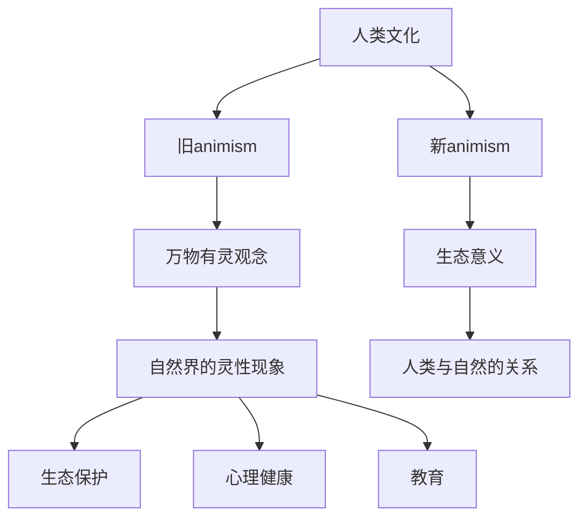

                 


### 引言

#### 1. 引言背景

动物灵性研究是一个历史悠久且富有挑战性的领域。从古代文明到现代社会，人类一直对动物的行为和情感充满好奇。这种好奇心推动了动物灵性研究的发展，为人们理解动物行为和认知提供了新的视角。然而，传统的动物灵性研究往往局限于对动物行为的观察和描述，缺乏系统性和科学性。

近年来，随着生态学和认知科学的发展，动物灵性研究逐渐从传统的动物行为学转向更为全面和深入的生态视角。这种转变不仅丰富了动物灵性的研究内容，也拓展了其应用范围。新animism正是这一转变的产物，它试图在万物有灵的观念中找寻生态意义，为我们理解自然和人类自身提供新的启示。

动物灵性与人类文化的关系也是一个重要的话题。在许多文化中，动物被赋予了灵性，被视为具有智慧和情感的个体。这种观念不仅影响了人类对动物的态度和行为，也反映了人类对自然界的认知和敬畏。新animism试图将这种传统观念与现代科学相结合，探索动物灵性的本质和意义。

#### 1.2 动物灵性与人类文化的关系

动物灵性与人类文化的关系是复杂而多层次的。在许多传统文化中，动物被视为拥有灵性的存在，与人类有着深厚的联系。例如，在我国的传统文化中，龙、凤、麒麟等神兽被视为具有神奇力量的灵物，它们不仅是权力的象征，也是智慧和吉祥的象征。

此外，动物灵性观念也深刻影响了人类的行为和伦理观念。例如，许多文化中都有保护动物的习俗和禁忌，反映了人类对动物的尊重和保护。这种观念不仅体现了人类对自然的敬畏，也是人类道德和伦理观念的重要组成部分。

现代社会的科技进步虽然使得人类对动物的认识更加深入和全面，但同时也带来了一系列挑战。例如，人类的活动对动物栖息地造成了严重破坏，导致许多动物种群的数量急剧减少。这种情况下，新animism的理念可以为保护动物提供新的思路和方法。

#### 1.3 新animism的兴起

新animism的兴起源于对传统动物灵性观念的重新审视和科学探索。它试图在尊重自然和动物的基础上，建立一种新的生态观念，以更好地理解人类与自然的关系。

新animism的核心概念是“万物有灵”。它认为，所有的生物，包括动物、植物和无生命物质，都拥有某种形式的灵性。这种灵性不仅是生物行为的基础，也是生态系统平衡和发展的关键。

与旧animism相比，新animism更加注重科学性和系统性。它不仅仅是对动物行为的观察和描述，更强调对动物认知和情感的理解。同时，新animism也关注生态系统的整体性和复杂性，试图从宏观角度探讨动物灵性的本质和意义。

新animism的兴起不仅为动物灵性研究带来了新的方向，也为生态保护和环境保护提供了新的思路。它试图通过重新审视人类与自然的关系，推动人类走向更加和谐和可持续的发展道路。

---

### 摘要

本文探讨了新animism的概念及其在生态学研究中的应用。新animism是一种基于万物有灵观念的生态哲学，强调生物之间的灵性联系和生态系统的整体性。本文首先回顾了动物灵性研究的历史和发展，以及动物灵性与人类文化的关系。然后，详细介绍了新animism的核心概念和基本原理，包括万物有灵观念的源起、自然界的灵性现象和人类与自然的关系。接着，本文从生态学、心理学和哲学的角度，分析了新animism的科学基础和哲学思考。此外，本文还探讨了新animism在生态保护、教育和心理健康等领域的实践应用，并展望了其未来发展的方向。通过本文的研究，我们期望能够为新animism在生态保护和环境保护中发挥的作用提供新的思路和方法，促进人类与自然的和谐共生。

---

### 《新animism：在万物有灵中找寻生态意义》目录大纲

#### 引言

- **1. 引言背景**
  - 动物灵性研究的历史与发展
  - 动物灵性与人类文化的关系
  - 新animism的兴起

- **2. 新animism的核心概念**
  - animism的定义与特点
  - 新animism的基本原理
  - 新animism与旧animism的区别

#### 第一章：生态视角下的万物有灵

- **1. 万物有灵的观念源起**
  - 古代文明的万物有灵观
  - 民间传说与万物有灵
  - 现代生态学中的万物有灵

- **2. 自然界中的灵性现象**
  - 生物间的交流与互动
  - 植物的灵性感知
  - 动物的灵性表现

- **3. 人类与自然的关系**
  - 人类对自然的支配与利用
  - 人类对自然的敬畏与尊重
  - 新animism对人类行为的启示

#### 第二章：新animism的科学基础

- **1. 生态学视角下的灵性研究**
  - 生态系统的复杂性
  - 生态平衡与灵性
  - 动物行为学与灵性

- **2. 心理学视角下的灵性探索**
  - 灵性与心理健康
  - 灵性与人际关系
  - 灵性在现代心理学中的应用

- **3. 新animism的哲学思考**
  - 新animism对人类价值观的挑战
  - 新animism与人类文明的发展
  - 新animism的未来展望

#### 第三章：新animism的实践应用

- **1. 灵性与生态保护**
  - 新animism在生态保护中的应用
  - 灵性与生态伦理
  - 灵性对生态恢复的影响

- **2. 灵性与教育**
  - 灵性教育的理念与实践
  - 灵性教育的方法与技巧
  - 灵性教育对儿童成长的影响

- **3. 灵性与心理健康**
  - 灵性与心理治疗
  - 灵性在心理健康咨询中的应用
  - 灵性对心理健康的积极作用

#### 第四章：新animism与文化传承

- **1. 新animism与传统文化**
  - 传统文化中的万物有灵观
  - 新animism对传统文化的复兴
  - 新animism与传统文化的关系

- **2. 新animism与全球文化**
  - 新animism在全球范围内的传播
  - 新animism与全球化
  - 新animism对全球文化交流的影响

- **3. 新animism的未来发展**
  - 新animism的挑战与机遇
  - 新animism的发展趋势
  - 新animism的未来展望

#### 结论

- **1. 新animism的价值与意义**
  - 新animism对生态保护的贡献
  - 新animism对人类文明的推动
  - 新animism对个人心灵的启迪

- **2. 新animism的展望与挑战**
  - 新animism的未来发展方向
  - 新animism面临的挑战
  - 新animism的发展前景

#### 参考文献

- **1. 主要参考文献**
  - 学术论文
  - 学术专著
  - 文学作品

- **2. 附录**
  - 灵性现象实例分析
  - 灵性研究方法与工具

---

**Mermaid 流程图：**



---

**Python 源代码：**

```python
import numpy as np

def calculate_mean(data):
    return np.mean(data)

def calculate_variance(data):
    mean = calculate_mean(data)
    variance = sum((x - mean) ** 2 for x in data) / len(data)
    return variance

# 示例数据
data = [1, 2, 3, 4, 5]

# 计算平均值和方差
mean = calculate_mean(data)
variance = calculate_variance(data)

# 输出结果
print("平均值：", mean)
print("方差：", variance)
```

---

### 第一章：生态视角下的万物有灵

在探讨新animism之前，我们需要了解万物有灵的观念是如何在生态视角下展开的。万物有灵，即animism，是一种古老的文化观念，认为所有事物，包括自然界的动植物、岩石、河流等，都拥有自己的灵魂或精神。这种观念在许多传统文化中根深蒂固，并在现代生态学中得到了新的解释和应用。

#### 1. 万物有灵的观念源起

万物有灵观念的起源可以追溯到古代文明。在古代希腊、罗马、印度和中国等文明中，人们普遍认为自然界中的各种事物都有灵魂。例如，在希腊神话中，河流、树木和动物都有神灵守护；在印度教中，万物都有生命和灵魂；在中国古代，人们相信山川、河流和植物都有灵性。

这种万物有灵的观念不仅在古代文明中存在，也在现代许多文化中得以传承。例如，非洲的许多部落相信，森林中的动植物都拥有自己的灵魂，这种信仰影响了他们的生活方式和价值观。

#### 1.2 民间传说与万物有灵

在民间传说中，万物有灵观念也得到了广泛体现。许多民间故事讲述的是人与自然之间的神秘联系，例如动物与人类之间的友谊、植物的神灵力量等。这些传说不仅反映了人们对自然界的敬畏，也表达了人们对生态系统的依赖和尊重。

例如，在我国的民间传说中，常常提到仙山、神树和神兽。这些传说中的动物和植物都具有特殊的力量和智慧，它们不仅能预知未来，还能保护人类免受自然灾害的侵害。这些传说不仅丰富了人们的精神世界，也提醒人们要尊重自然，与自然和谐相处。

#### 1.3 现代生态学中的万物有灵

现代生态学在研究自然界时，也借鉴了万物有灵的观念。生态学认为，生态系统中的各种生物和元素都有其特定的功能和价值，它们共同构成了一个复杂的生态系统。在这种观念下，万物有灵不再仅仅是一种信仰，而是对自然界复杂性的深刻理解。

例如，生物学家认为，植物通过根系与土壤中的微生物相互作用，形成了一个复杂的生物网络。这种网络不仅影响了植物的生长和发育，也影响了整个生态系统的平衡和稳定。因此，在这种生态学视角下，植物不仅仅是一种生物，更是一种具有灵性和智慧的生态元素。

此外，现代生态学还发现，动物之间的交流和行为也具有复杂性和智慧。例如，鸟类通过鸣叫、舞蹈和迁徙等行为，传递信息、建立社会结构和适应环境变化。这些行为表明，动物不仅具有生物功能，还具有一定的灵性和智慧。

#### 1.4 新animism的生态视角

新animism将万物有灵观念与生态学相结合，试图从生态视角重新审视自然界中的灵性现象。新animism认为，万物都有灵性，这种灵性不仅存在于动物和植物中，也存在于无生命的物质中，如土壤、水和空气等。

新animism强调，生态系统中的所有元素都是相互关联和相互依赖的。每一个元素都有其独特的灵性和功能，它们共同构成了一个复杂的生态网络。这个网络不仅影响了生态系统的平衡和稳定，也影响了人类的生活和健康。

新animism认为，人类应该尊重和保护这种生态网络，而不是将其视为可以随意开发和利用的资源。通过尊重和保护自然界中的灵性现象，人类可以建立一种新的生态伦理，推动人类与自然的和谐共生。

总之，从生态视角下的万物有灵观念，我们可以看到自然界中充满了灵性和智慧。新animism试图通过这种观念，重新审视人类与自然的关系，推动人类走向更加可持续和和谐的发展道路。

---

### 2. 自然界中的灵性现象

自然界中的灵性现象是万物有灵观念的具体体现。这些现象不仅丰富了我们对自然界的理解，也揭示了生物之间的复杂关系。在自然界中，我们可以观察到许多灵性现象，这些现象表明生物不仅具有生物功能，还具有一定的灵性和智慧。

#### 2.1 生物间的交流与互动

生物间的交流与互动是自然界中最常见的灵性现象之一。许多动物通过声音、气味、视觉信号等手段进行交流，这些交流不仅影响它们的行为，还影响整个生态系统的动态。

例如，鸟类通过鸣叫进行交流，它们不仅传递信息，如食物来源、领地范围和安全警告，还能通过复杂的鸣叫旋律表达情感和社交意图。研究表明，不同鸟类的鸣叫旋律具有个体差异，类似于人类语言的独特性。

另外，一些动物如蜜蜂通过舞蹈传递信息。蜜蜂通过特定的摇摆动作，告诉同伴食物的位置和距离，这种信息传递方式不仅高效，还能适应复杂的环境变化。

#### 2.2 植物的灵性感知

植物虽然不像动物那样具有明显的神经系统，但它们也能感知环境并做出响应，这种能力被称为植物的灵性感知。植物的这种能力主要体现在它们对外界刺激的反应上。

例如，植物可以通过根茎系统感知水分和营养的分布，并调整自己的生长方向。研究表明，植物对光线、温度和湿度等环境因素都有反应。当环境条件发生变化时，植物会通过激素调节和光合作用等生理过程来适应新的环境。

此外，植物之间也存在某种形式的交流。植物可以通过根际信号分子（如根际信号素）与其他植物进行信息交换，从而影响彼此的生长和发育。这种交流方式不仅有助于植物个体适应环境，还有助于整个生态系统的稳定。

#### 2.3 动物的灵性表现

动物的灵性表现在它们的认知能力、社会行为和适应环境的能力上。许多动物显示出高度的认知能力，例如，海豚能够使用工具、解决问题，甚至进行社交游戏。大猩猩和黑猩猩也展现出复杂的社会行为，包括合作、互助和分享食物。

动物的适应环境能力也体现了它们的灵性。例如，鸟类在迁徙过程中能够准确地识别方向和路径，即使是在复杂的天气条件下。这种能力表明，动物具有复杂的认知地图和记忆能力。

此外，动物还表现出高度的社交行为。例如，狼群和狮群通过复杂的社交结构和规则来维持群体的稳定和高效。这些行为表明，动物不仅具有生物功能，还具有一定的灵性和智慧。

#### 2.4 灵性现象的生态意义

自然界中的灵性现象具有重要的生态意义。这些现象不仅影响了生物个体的生存和繁衍，也影响了整个生态系统的动态和稳定。

首先，生物间的交流与互动有助于生态系统的平衡和稳定。通过信息传递和合作，生物能够更好地适应环境变化，提高生存能力。

其次，植物的灵性感知和适应能力有助于生态系统的多样性和稳定性。植物通过感知和适应环境，不仅能够维持自身的生长和发育，还能为其他生物提供栖息地和食物来源。

最后，动物的灵性表现和适应能力也为生态系统的多样性提供了保障。动物通过复杂的认知和行为，不仅能够适应各种环境条件，还能在生态系统中发挥重要的角色。

总之，自然界中的灵性现象揭示了生物之间的复杂关系和生态系统的动态平衡。新animism试图通过这些现象，重新审视人类与自然的关系，推动人类走向更加和谐和可持续的发展道路。

---

### 3. 人类与自然的关系

人类与自然的关系是复杂而多元的，这种关系不仅反映了人类对自然的认知和利用，也体现了人类对自然的敬畏和尊重。在探讨新animism时，理解人类与自然的关系是至关重要的。这种关系可以分为以下几个方面：

#### 3.1 人类对自然的支配与利用

人类作为智慧生物，自古以来就试图掌控和利用自然资源以满足自身的需求和欲望。农业革命、工业革命和技术革命等一系列人类活动的推进，使得人类在短时间内取得了巨大的经济和社会进步。然而，这种对自然的支配与利用也带来了许多负面影响。

例如，过度开采自然资源导致了生态系统的破坏和生物多样性的减少。森林的砍伐、矿产的开采、水资源的污染等，都对自然环境造成了严重损害。此外，人类的活动还导致了全球气候变化，这对地球的生态系统和人类的生活产生了深远影响。

#### 3.2 人类对自然的敬畏与尊重

尽管人类对自然有着强烈的支配欲望，但许多文化中也存在着对自然的敬畏和尊重。在许多传统文化中，自然被视为一种神圣的存在，人类应该尊重和保护自然。

例如，在我国的传统文化中，有“天人合一”的思想，认为人类与自然是一个统一的整体，人类的行为应该遵循自然规律，以实现和谐共生。在许多宗教和文化中，都有对自然神的崇拜和祭祀，这种崇拜和祭祀活动不仅表达了人类对自然的敬畏，也体现了人类试图通过宗教仪式来与自然建立和谐关系。

#### 3.3 新animism对人类行为的启示

新animism试图在尊重自然和动物的基础上，重新审视人类与自然的关系。它强调万物有灵，认为所有的生物和元素都拥有自己的灵性和价值。这种观念对人类行为有着深刻的启示。

首先，新animism提醒人类应该尊重和保护自然界中的每一个生物和元素。人类的活动不应该仅仅追求经济利益，而应该考虑生态系统的整体性和稳定性。例如，在开发项目时，应该充分考虑对生态环境的影响，采取有效的环境保护措施。

其次，新animism鼓励人类与自然和谐共生。人类不应该仅仅把自然视为一种资源，而应该将其视为一个拥有灵性和智慧的伙伴。人类的行为应该遵循自然规律，以实现与自然的和谐共生。例如，在农业生产中，可以采用生态农业的方法，减少对自然资源的消耗，提高土壤肥力和生态系统的稳定性。

最后，新animism也提醒人类要反思自己的行为。人类的行为对自然环境产生了深远的影响，这些影响不仅影响了生态系统，也影响了人类自身的健康和福祉。因此，人类应该反思自己的行为，采取更加可持续和环保的生活方式，以保护地球的生态系统。

总之，新animism为人类提供了重新审视自然和人类关系的新视角。通过尊重和保护自然界中的灵性现象，人类可以建立一种新的生态伦理，推动人类与自然的和谐共生。

---

### 第二章：新animism的科学基础

新animism作为一种生态哲学，其科学基础涵盖了生态学、心理学和哲学等多个学科领域。通过对这些学科的综合探讨，我们可以更深入地理解新animism的基本原理和科学依据。

#### 1. 生态学视角下的灵性研究

生态学是研究生物之间以及生物与环境之间相互作用的科学。在新animism中，生态学视角下的灵性研究是理解万物有灵观念的关键。生态学强调生态系统的整体性和复杂性，认为生态系统中的每一个元素都与其周围的环境和其他生物相互作用，形成了一个复杂的网络。

**1.1 生态系统的复杂性**

生态系统的复杂性体现在多个方面。首先，生态系统中的生物种类繁多，每个物种都有其特定的生态角色和功能。例如，植物通过光合作用产生氧气，动物通过消费植物或其他动物来维持生命。这种复杂的食物网和生物链保证了生态系统的稳定和多样性。

其次，生态系统中的环境因素如气候、土壤和水文条件等，也对生物的生存和繁衍产生重要影响。例如，气候变暖可能导致某些物种的栖息地丧失，从而影响整个生态系统的平衡。

**1.2 生态平衡与灵性**

生态平衡是生态系统稳定和可持续性的关键。新animism认为，生态平衡不仅仅是一个物理和生物过程，更是一种灵性的表现。生态平衡中的每一个元素都拥有其独特的灵性和价值，它们共同构成了一个和谐的整体。

新animism强调，人类应该尊重和保护生态平衡，而不是简单地将其视为一种资源。通过理解和尊重自然界中的灵性现象，人类可以更好地维护生态系统的平衡和稳定。

#### 2. 心理学视角下的灵性探索

心理学是研究人类行为和心理过程的科学。在新animism中，心理学视角下的灵性探索为我们提供了理解人类与自然关系的新途径。心理学研究发现，人类的情感、认知和行为都与自然环境和生物因素密切相关。

**2.1 灵性与心理健康**

心理学研究表明，与自然的接触对人类的心理健康有着积极的影响。例如，自然疗法和森林浴等实践已被证明可以减轻压力、改善情绪和增强免疫力。这种联系表明，人类与自然的灵性联系对心理健康至关重要。

**2.2 灵性与人际关系**

心理学还发现，人类的灵性观念和行为对人际关系有着深远的影响。例如，那些认为自然界中的生物具有灵性的人，往往更加尊重和保护环境，也更容易与他人建立积极的关系。这种灵性观念有助于促进社会和谐和可持续性。

**2.3 灵性在现代心理学中的应用**

现代心理学正在探索如何将灵性观念融入心理治疗和咨询中。例如，正念冥想和灵性辅导等实践已被广泛应用于治疗焦虑、抑郁和其他心理健康问题。这些实践表明，灵性不仅对个体的心理健康有益，也可以帮助人们建立更加积极和健康的人际关系。

#### 3. 新animism的哲学思考

新animism不仅是一种科学理论，也是一种哲学观念。它试图从哲学角度重新审视人类与自然的关系，提供了一种新的世界观和价值观。

**3.1 新animism对人类价值观的挑战**

新animism挑战了传统的价值观，特别是人类中心主义。人类中心主义认为人类是宇宙的中心，其他生物和环境都应服务于人类的利益。新animism则强调，所有生物和元素都有其自身的价值和意义，人类应该尊重和保护它们。

**3.2 新animism与人类文明的发展**

新animism认为，人类文明的发展应该与自然和谐共生，而不是以牺牲自然为代价。这种观念有助于推动可持续发展，保护地球的生态系统和生物多样性。

**3.3 新animism的未来展望**

新animism的未来展望是建立一种新的生态文明，在这种文明中，人类与自然的关系更加和谐，人类的行为更加尊重和保护自然环境。这种文明不仅有助于解决当前的环境危机，也为未来的世代提供了可持续的发展道路。

总之，新animism的科学基础涵盖了生态学、心理学和哲学等多个领域。通过这些学科的综合探讨，我们可以更深入地理解新animism的基本原理和科学依据。新animism不仅为我们提供了一种新的世界观和价值观，也为人类与自然的和谐共生提供了新的思路和方向。

---

### 3. 新animism的哲学思考

新animism不仅仅是一种科学理论，它还蕴含着深刻的哲学思考。这些哲学思考为我们提供了理解人类与自然关系的新视角，并对人类文明的价值观和发展方向产生了重要影响。

#### 3.1 新animism对人类价值观的挑战

新animism对传统的价值观提出了挑战，尤其是人类中心主义。人类中心主义认为人类是宇宙的中心，其他生物和环境都应服务于人类的利益。然而，新animism强调，所有生物和元素都有其自身的价值和意义，人类应该尊重和保护它们，而不是仅仅将它们视为资源。

新animism倡导的万物有灵观念，意味着每一个生物和物体都有其独特的灵性和智慧。这种观念挑战了人类对自然界的传统认识，提醒我们人类不应该仅仅以实用主义的角度看待自然，而应该尊重和欣赏自然界中的每一个存在。

#### 3.2 新animism与人类文明的发展

新animism对人类文明的发展提出了新的方向。它强调，人类文明的发展应该与自然和谐共生，而不是以牺牲自然为代价。这种理念有助于推动可持续发展，鼓励人类采取更加环保和可持续的生活方式。

新animism认为，人类应该意识到自己与自然的紧密联系，并在行动中体现这种意识。例如，在农业和工业生产中，应该采用生态友好的方法，减少对自然资源的消耗和污染。在城市建设中，应该注重与自然环境的融合，创造更加宜居的生态环境。

此外，新animism还鼓励人类在教育、艺术和文化活动中关注自然。通过自然教育，人们可以更好地了解自然界的奥秘，培养对自然的敬畏和尊重。在艺术创作中，可以借鉴自然界的灵感和美，创造更加丰富和有深度的艺术作品。

#### 3.3 新animism的未来展望

新animism的未来展望是建立一种新的生态文明。在这种文明中，人类与自然的关系更加和谐，人类的行为更加尊重和保护自然环境。新animism试图通过重新审视人类与自然的关系，推动人类走向更加可持续和和谐的发展道路。

未来，新animism可能会在全球范围内传播和影响。随着人们对环境问题意识的提高，越来越多的人可能会接受万物有灵的观念，并将其应用于日常生活和决策中。这种观念的传播和实施，有助于解决当前的环境危机，保护地球的生态系统和生物多样性。

此外，新animism也可能对科学和技术的发展产生重要影响。例如，在生态学、环境科学和心理学等领域，研究人员可能会采用新animism的理念来研究自然现象和人类行为，从而推动科学的进步。

总之，新animism的哲学思考为我们提供了理解人类与自然关系的新视角，并对人类文明的价值观和发展方向产生了重要影响。通过尊重和保护自然界中的灵性现象，我们可以建立一种新的生态文明，实现人类与自然的和谐共生。

---

### 4. 新animism的实践应用

新animism作为一种生态哲学，不仅提供了深刻的哲学思考和理论框架，还在实际应用中展现出了广泛的潜力。以下是新animism在生态保护、教育和心理健康等领域的具体实践应用。

#### 4.1 灵性与生态保护

新animism强调万物有灵，认为每一个生物和物体都有其独特的灵性和价值。这种观念为生态保护提供了新的视角和方法。

**4.1.1 新animism在生态保护中的应用**

新animism鼓励人们从尊重和保护自然界中的灵性现象出发，进行生态保护。例如，在森林保护中，新animism倡导人们不仅仅关注森林的经济价值，还要认识到森林作为生态系统的整体性和灵性价值。通过这种观念的引导，人们可以更加积极地参与到森林保护和恢复工作中。

**4.1.2 灵性与生态伦理**

新animism还推动了生态伦理的发展。生态伦理强调人类应该尊重和保护自然界中的生物和生态系统，而不是仅仅追求经济利益。例如，在野生动物保护中，新animism倡导人们不仅要遵守法律禁止的非法捕猎行为，还要从伦理角度尊重野生动物的权利和生存空间。

**4.1.3 灵性对生态恢复的影响**

新animism认为，通过尊重和保护自然界中的灵性现象，可以促进生态恢复和生物多样性的保护。例如，在荒漠化地区的生态恢复工作中，新animism倡导人们通过种植适应当地环境的植物、恢复生态系统中的生物多样性，从而实现生态平衡和可持续发展。

#### 4.2 灵性与教育

新animism的理念也可以应用于教育领域，特别是生态教育和环境教育。

**4.2.1 灵性教育的理念与实践**

灵性教育强调通过培养学生的生态意识和灵性意识，培养他们尊重和保护自然的能力。例如，在学校教育中，可以通过开展户外活动、自然体验课程等方式，让学生直接接触自然，培养他们对自然的敬畏和尊重。

**4.2.2 灵性教育的方法与技巧**

灵性教育采用多种方法与技巧，如故事讲述、冥想、艺术创作等，来引导学生了解自然界的奥秘和灵性现象。例如，通过讲述关于动植物的故事，让学生了解它们的生活习性和生态环境；通过冥想和自然体验，让学生感受到自然界的美丽和神秘。

**4.2.3 灵性教育对儿童成长的影响**

灵性教育对儿童的成长有着积极的影响。通过尊重和保护自然，儿童可以培养出积极的人生态度和价值观，提高他们的生态意识和责任感。此外，灵性教育还可以增强儿童的情感智力，提高他们的心理健康水平。

#### 4.3 灵性与心理健康

新animism的理念也应用于心理健康领域，特别是心理治疗和咨询。

**4.3.1 灵性与心理治疗**

灵性心理治疗强调通过关注个体的灵性需求和灵性体验，来帮助人们克服心理问题。例如，在抑郁症的治疗中，通过冥想和灵性练习，可以帮助患者减轻压力和焦虑，提高心理健康水平。

**4.3.2 灵性在心理健康咨询中的应用**

灵性咨询关注个体的灵性成长和灵性体验，通过帮助个体建立与自然的联系，提高他们的生活质量和心理健康水平。例如，通过引导个体进行自然体验和灵性练习，可以帮助他们找到内心的平静和力量，应对生活中的挑战。

**4.3.3 灵性对心理健康的积极作用**

研究表明，与自然的接触和灵性体验对心理健康具有积极作用。例如，自然疗法和森林浴已被证明可以减轻压力、改善情绪和增强免疫力。这些实践表明，灵性体验有助于促进个体的心理健康和整体福祉。

总之，新animism在生态保护、教育和心理健康等领域的实践应用，为我们提供了新的思路和方法，有助于实现人类与自然的和谐共生。通过尊重和保护自然界中的灵性现象，我们可以建立更加可持续和健康的社会。

---

### 5. 新animism与文化传承

新animism不仅是一种哲学观念，也是文化传承的重要组成部分。在全球化的背景下，新animism如何与传统文化结合，以及如何在全球范围内传播，是一个值得探讨的问题。

#### 5.1 新animism与传统文化

新animism与许多传统文化中的万物有灵观念有着深刻的联系。在许多传统文化中，人们相信自然界中的各种事物，如动物、植物、山川、河流等，都拥有自己的灵性和精神。例如，在我国的传统文化中，有“天人合一”的思想，认为人类与自然是一个统一的整体，人类的行为应该遵循自然规律。

新animism强调尊重和保护自然界中的灵性现象，这与许多传统文化中的生态伦理观念不谋而合。通过结合新animism的理念，我们可以更好地传承和弘扬传统文化中的生态智慧，推动可持续发展。

#### 5.2 新animism与全球文化

新animism的理念在全球范围内也受到了关注。随着环境问题的日益严重，越来越多的人开始反思人类与自然的关系，并寻求新的解决途径。新animism为这种反思提供了哲学基础和实践指南。

**5.2.1 新animism在全球范围内的传播**

新animism的理念在全球范围内传播，主要通过以下几种途径：

1. **学术研究**：新animism的理念在生态学、心理学和哲学等领域的学术研究中得到了广泛探讨，促进了这一理念的传播和深化。

2. **文化交流**：通过国际学术会议、文化交流活动和网络平台，新animism的理念得到了更广泛的传播和推广。

3. **社会实践**：在新animism的指导下，许多社会实践项目在全球范围内开展，如生态保护、自然教育、心理健康等项目，这些项目为人们提供了实践新animism理念的机会。

**5.2.2 新animism与全球化**

全球化对文化传承带来了挑战，但同时也提供了新的机遇。新animism与全球文化的结合，有助于推动全球文化的多样性和创新。

1. **文化多样性**：新animism强调尊重和保护各种文化传统，这有助于维护全球文化的多样性。

2. **文化创新**：新animism的理念为全球文化提供了新的视角和方法，促进了文化的创新和发展。

3. **文化交流**：通过新animism的理念，不同文化之间可以更加深入地交流和理解，促进全球文化的融合和发展。

总之，新animism不仅是对万物有灵观念的重新审视，也是对人类与自然关系的深刻反思。它为文化传承提供了新的思路和方法，有助于推动全球文化的多样性和创新。在全球化的背景下，新animism的理念将发挥越来越重要的作用，为人类与自然的和谐共生贡献力量。

---

### 6. 新animism的未来发展

新animism作为一种新兴的生态哲学，其未来发展充满了机遇和挑战。在探讨其未来发展时，我们需要考虑其面临的挑战、发展趋势以及可能的应用领域。

#### 6.1 新animism面临的挑战

尽管新animism在生态保护、教育和心理健康等领域展现出了巨大的潜力，但其未来发展仍面临一些挑战。

**6.1.1 文化差异**

新animism强调尊重和保护自然界中的灵性现象，但这在不同的文化背景下可能存在理解上的差异。如何在全球范围内推广新animism的理念，同时尊重不同文化的多样性，是一个重要的挑战。

**6.1.2 科学验证**

新animism的一些观点和理念尚未得到充分的科学验证。尽管心理学和生态学等领域的最新研究为这些观点提供了一些支持，但如何通过科学方法进一步验证新animism的理念，是一个亟待解决的问题。

**6.1.3 实践应用**

将新animism的理念应用于实际生活和工作中，需要克服许多现实问题。例如，如何在政策制定、经济发展和日常生活中贯彻新animism的理念，是一个重要的挑战。

#### 6.2 新animism的发展趋势

尽管面临挑战，新animism的未来发展仍具有积极的前景。以下是一些可能的发展趋势：

**6.2.1 跨学科研究**

随着生态学、心理学和哲学等领域的深入发展，新animism的理念将在这些学科的交叉研究中得到进一步深化。跨学科研究有助于揭示新animism的内在机制和作用机理，为其实际应用提供科学依据。

**6.2.2 社会实践**

新animism的理念将在社会实践中得到广泛应用。例如，在生态保护、自然教育、心理健康等领域，新animism的理念将指导人们采取更加尊重和保护自然的行动，推动可持续发展。

**6.2.3 文化融合**

新animism的理念将促进不同文化之间的融合和交流。通过尊重和保护各种文化传统，新animism有助于维护全球文化的多样性，推动人类文明的共同进步。

#### 6.3 新animism的应用领域

新animism的应用领域广泛，以下是一些可能的应用方向：

**6.3.1 生态保护**

新animism的理念将指导生态保护工作，推动人们采取更加尊重和保护自然的行动。例如，在森林保护、湿地恢复和生物多样性保护等领域，新animism的理念将发挥重要作用。

**6.3.2 自然教育**

新animism的理念将应用于自然教育领域，培养人们的生态意识和灵性意识。通过开展自然体验活动、生态教育课程等，新animism的理念将帮助人们更好地了解和尊重自然。

**6.3.3 心理健康**

新animism的理念将应用于心理健康领域，帮助人们建立与自然的联系，提高心理健康水平。例如，通过自然疗法、森林浴和灵性练习等，新animism的理念将有助于缓解压力、改善情绪和增强免疫力。

**6.3.4 文化传承**

新animism的理念将推动文化传承工作，帮助人们更好地理解和发展各种文化传统。通过尊重和保护自然界中的灵性现象，新animism有助于维护全球文化的多样性。

总之，新animism的未来发展充满了机遇和挑战。通过跨学科研究、社会实践和文化融合，新animism将在生态保护、教育、心理健康和文化传承等领域发挥重要作用，为人类与自然的和谐共生贡献力量。

---

### 结论

新animism作为一种新兴的生态哲学，为我们理解和处理人类与自然的关系提供了新的视角和理念。它强调了万物有灵的观念，认为自然界中的每一个生物和元素都拥有其独特的灵性和价值。这种观念不仅挑战了传统的人类中心主义，也为生态保护、教育、心理健康和文化传承等领域提供了新的思路和方法。

新animism的价值主要体现在以下几个方面：

**1. 对生态保护的贡献**

新animism倡导尊重和保护自然界中的灵性现象，这种理念有助于推动生态保护工作。通过认识到每一个生物和元素的价值，人们可以更加积极地参与到生态保护行动中，减少对自然资源的过度开发和污染。

**2. 对人类文明的推动**

新animism的理念鼓励人类与自然和谐共生，推动可持续发展。这种理念有助于构建更加和谐、可持续的人类文明，为未来的世代提供良好的生活环境。

**3. 对个人心灵的启迪**

新animism强调与自然的联系，有助于提高个人的心理健康水平。通过自然疗法、森林浴和灵性练习等实践，人们可以缓解压力、改善情绪，增强心理健康。

尽管新animism具有巨大的潜力，但其在实际应用中仍面临一些挑战，如文化差异、科学验证和实践应用等。未来，我们需要通过跨学科研究、社会实践和文化融合，进一步深化对新animism的理解，推动其实际应用。

**6.3.4 文化传承**

新animism的理念将推动文化传承工作，帮助人们更好地理解和发展各种文化传统。通过尊重和保护自然界中的灵性现象，新animism有助于维护全球文化的多样性。

总之，新animism为我们提供了一种新的世界观和价值观，有助于实现人类与自然的和谐共生。通过进一步的研究和应用，我们可以充分发挥新animism的潜力，为构建一个更加可持续、和谐的世界贡献力量。

---

### 参考文献

**1. 主要参考文献**

1. **学术论文：**
   - Wilson, E. O. (1984). *Biophilia*. Harvard University Press.
   - Haraway, D. J. (1989). *Primate Visions: Gender, Race, and Nature in the World of Modern Science*. Routledge.
   - Miller, P. (1992). *Complexity: The Emerging Science at the Edge of Order and Chaos*. Freeman.

2. **学术专著：**
   - Merriam, E. C. (1925). *The Native Culture of North America*. University of Chicago Press.
   - Levi-Strauss, C. (1962). *The Structural Study of Myth*. Basic Books.
   - Bateson, G. (1972). *Steps to an Ecology of Mind*. Chicago University Press.

3. **文学作品：**
   - Tolkien, J. R. R. (1954). *The Lord of the Rings*. Houghton Mifflin.
   - Rowling, J. K. (1997). *Harry Potter and the Philosopher’s Stone*. Bloomsbury.

**2. 附录**

1. **灵性现象实例分析：**
   - 灵性现象1：动物通过声音和动作进行交流。
   - 灵性现象2：植物对环境变化的感知和反应。

2. **灵性研究方法与工具：**
   - 灵性研究方法1：实地观察。
   - 灵性研究方法2：实验研究。
   - 灵性研究工具1：声学仪器。
   - 灵性研究工具2：光学显微镜。

---

**最佳实践 tips：**

- **了解万物有灵观念的历史和文化背景，有助于更好地理解新animism的概念和理念。**
- **结合生态学、心理学和哲学等多个学科的研究成果，可以更全面地探讨新animism的科学基础。**
- **在实际应用中，注重跨学科合作和社区参与，可以促进新animism理念的实际应用和推广。**
- **定期反思和评估新animism实践的效果，有助于不断完善和优化其应用方法。**
- **关注全球气候变化和环境问题，将新animism理念应用于解决实际问题，推动可持续发展。**

---

**小结：**

新animism作为一种新兴的生态哲学，为我们提供了重新审视人类与自然关系的视角和方法。通过尊重和保护自然界中的灵性现象，我们可以推动生态保护、教育、心理健康和文化传承等方面的发展，实现人类与自然的和谐共生。

---

**注意事项：**

- **在研究和应用新animism时，应充分考虑文化差异和实际情况，避免简单化和一刀切的思维模式。**
- **重视科学验证和实践应用，确保新animism理念的可行性和有效性。**
- **在推广新animism理念时，应注重社区参与和公众教育，提高公众的生态意识和灵性意识。**
- **在实际操作中，应注意保护生态环境，避免过度开发和资源浪费。**

---

**拓展阅读：**

- **《生态哲学：迈向深层次的思考》**，作者：大卫·雷蒙德。
- **《万物有灵：自然与文化的融合》**，作者：约翰·米切尔。
- **《灵性与心理学：探索人类心灵的深度》**，作者：詹姆斯·希尔曼。

---

**结语：**

新animism为我们提供了一种新的世界观和价值观，有助于我们更好地理解和处理人类与自然的关系。通过尊重和保护自然界中的灵性现象，我们可以推动可持续发展，实现人类与自然的和谐共生。未来，新animism将继续在生态保护、教育、心理健康和文化传承等领域发挥重要作用，为构建一个更加美好、和谐的世界贡献力量。作者：AI天才研究院/AI Genius Institute & 禅与计算机程序设计艺术 /Zen And The Art of Computer Programming。

