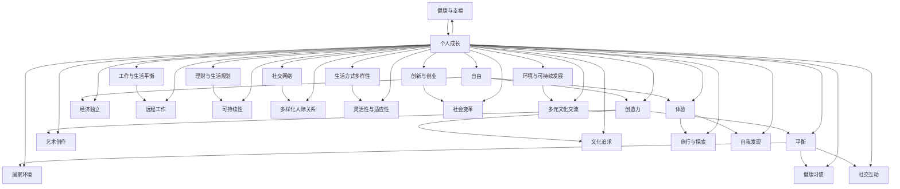

                 

### 引言

《新bohemian：现代漂泊者的生活美学》这本书为我们开启了一扇通往自由与创造的新世界的大门。在这个充满不确定性和快速变化的时代，许多人开始重新思考生活方式和价值观，而“新bohemian”正是这一时代的产物。

**新bohemian**，顾名思义，是传统bohemian的现代变种。传统bohemian起源于19世纪的欧洲，他们追求自由、反传统，喜欢艺术和文学，生活在贫困和浪漫之间。而现代bohemian则更加注重自由和灵活性，他们在现代社会的背景下，以一种全新的方式实践着自由和创造力。

在现代社会，漂泊现象日益普遍。许多人因为工作、学习、兴趣等原因，不断迁徙，寻找更适合自己的生活空间。这种漂泊不仅是一种生活方式，更是一种精神状态。新bohemian正是这种精神状态的代表。

本书的目的在于探讨新bohemian的生活方式，并引导读者如何在现代社会中找到自己的位置，实践自由与创造。无论是为了追求个人成长，还是为了寻找更适合自己的生活方式，本书都提供了一个宝贵的视角和参考。

读者对象包括但不限于以下几类人群：

1. **追求自由的青年人**：对于那些渴望摆脱束缚，追求自由生活的人来说，新bohemian的生活方式提供了一种新的可能性。
2. **艺术家和创作者**：对于从事艺术和创作的人来说，新bohemian的生活方式是一种理想的生存状态，它允许他们在不受限制的环境中发挥创造力。
3. **远程工作者和自由职业者**：新bohemian的生活方式与远程工作和自由职业的特点相契合，为这些人群提供了更多的选择和可能性。
4. **对生活美学有兴趣的人**：对于想要探索生活美学，提升生活品质的人来说，本书提供了许多实用的建议和思考。

总的来说，本书不仅是一本关于生活方式的指南，更是一本关于生活态度和价值观的探讨。它希望引导读者在快速变化的时代中，找到自己的方向，实现个人价值和自由。

### 传统bohemian与现代bohemian的对比

传统bohemian与现代bohemian虽然在名称上有相似之处，但它们在生活理念、文化特征和社会背景上存在显著差异。了解这两种生活方式的不同，有助于我们更好地理解现代bohemian的独特性。

#### 传统bohemian的特点

**文化特征**：
传统bohemian起源于19世纪的欧洲，尤其是巴黎，他们以反传统、追求自由为特点。传统bohemian的生活态度反映了当时社会的动荡和不安，他们不满足于现有的社会秩序，渴望通过艺术和文学表达自己的情感和思想。

**生活方式**：
传统bohemian通常生活在贫困和浪漫之间，他们追求一种不羁、自由的生活方式。他们喜欢聚居在城市的特定区域，如巴黎的拉丁区和蒙马特，这些地方充满了艺术氛围和咖啡馆文化。传统bohemian的生活方式强调个性和创造力，他们通过艺术创作、文学写作等方式表达自我。

**社会背景**：
传统bohemian出现在19世纪末和20世纪初的工业化时期，这一时期的社会变化剧烈，人们开始反思传统价值观。工业革命带来了社会阶层和生活方式的巨大变动，许多人因为失业和生活困境而陷入困境。传统bohemian正是这种社会现象的产物，他们试图通过艺术和文学表达对社会现状的不满和对自由的渴望。

#### 现代bohemian的特点

**文化特征**：
现代bohemian在文化上继承了传统bohemian追求自由和个性的精神，但更加注重灵活性和适应性。现代bohemian不仅关注艺术和文学，还关注科技和互联网的发展。他们喜欢探索新的技术和平台，利用这些工具实现自己的创意和想法。

**生活方式**：
现代bohemian的生活方式更加多样化，他们不仅追求自由，还追求实用和高效。现代bohemian更倾向于通过远程工作、自由职业等方式实现生活自由。他们喜欢在世界各地旅行，寻找灵感，同时也注重线上社交和虚拟社区的建设。现代bohemian的生活方式强调灵活性和自主性，他们可以根据自己的兴趣和需求，随时调整生活和工作方式。

**社会背景**：
现代bohemian生活方式的形成与现代社会的发展密切相关。全球化、互联网和远程工作的普及，为现代bohemian提供了更多的选择和可能性。现代社会的不确定性和快速变化，使得人们更加注重个人自由和创造力。现代bohemian正是这一时代精神的体现，他们以自己的方式应对社会的挑战，寻找适合自己的生活方式。

#### 现代社会的变化对bohemian生活方式的影响

**经济因素**：
现代社会经济的快速发展，尤其是互联网经济的兴起，为现代bohemian提供了更多的机会。远程工作和自由职业的普及，使得人们可以不受地域限制地实现自己的职业目标。经济因素的变化，使得现代bohemian更加注重自由和灵活性。

**技术进步**：
技术的进步，特别是互联网和移动设备的普及，为现代bohemian提供了更多的工具和平台。现代bohemian可以利用各种在线工具和社交媒体，实现实时沟通、信息共享和资源获取。技术的进步，使得现代bohemian的生活方式更加便捷和高效。

**文化多样性**：
全球化带来了文化的多样性，不同文化之间的交流与融合，为现代bohemian提供了更多的灵感和选择。现代bohemian可以在世界各地寻找灵感，体验不同的文化和生活方式。文化多样性的增加，使得现代bohemian的生活方式更加丰富和多元。

**社会变革**：
现代社会的不确定性和快速变化，使得人们更加注重个人自由和创造力。现代bohemian的生活方式，正是这种社会变革的产物。他们以自己的方式，应对社会的挑战，寻找属于自己的生活方式。

总的来说，现代bohemian在传统bohemian的基础上，融入了更多现代社会的元素，形成了一种全新的生活方式。这种生活方式不仅反映了现代社会的特点，也为人们提供了更多的选择和可能性。了解传统bohemian与现代bohemian的不同，有助于我们更好地理解现代bohemian的生活方式，并在现代社会中找到自己的位置。

### 新bohemian的生活美学

生活美学，简而言之，是对生活品质的追求和审美体验的提升。新bohemian的生活美学，是一种融合了传统与现代、自由与创造的美学理念，它强调个人自由、创造力以及对生活品质的精细追求。在这一部分，我们将深入探讨新bohemian生活美学的核心概念、生活态度和具体生活习惯。

#### 生活美学的概念与内涵

生活美学是一种追求美好生活的艺术，它不仅仅关注物质生活的舒适，更强调精神层面的满足。生活美学包括对美的感受、创造和欣赏，它体现在生活的方方面面，如家居环境、日常习惯、艺术创作、人际交往等。

在新bohemian的生活美学中，以下几个核心概念尤为重要：

1. **自由**：自由是生活美学的基石，它体现在个人选择、生活方式和价值观上。新bohemian追求的是心灵的自由，他们相信每个人都应该有权选择自己喜欢的生活方式，不受外界约束。

2. **创造力**：创造力是生活美学的灵魂，它代表了一种积极的、探索性的生活态度。新bohemian通过艺术创作、写作、设计等方式表达自己的创造力，他们相信生活中的每个瞬间都值得被赋予独特的意义。

3. **平衡**：生活美学强调身心平衡，它不仅仅是追求物质上的富裕，更关注精神上的满足。新bohemian在生活中追求身心和谐，他们通过运动、冥想、旅行等方式保持身心平衡。

4. **体验**：生活美学是一种体验，它强调对生活的深度感知和体验。新bohemian喜欢探索未知，他们通过不同的经历和体验来丰富自己的生活，提升生活品质。

#### 新bohemian的生活态度

新bohemian的生活态度体现了一种积极、开放、探索的生活哲学。以下是一些具体的生活态度：

1. **拥抱变化**：新bohemian相信变化是生活的常态，他们乐于接受变化，并将其视为成长和发展的机会。他们不惧怕挑战，而是将其视为自我提升的动力。

2. **追求自由**：新bohemian追求个人自由，他们尊重他人的选择，同时坚持自己的价值观。他们通过选择自己的生活方式，实现个人价值和自由。

3. **注重体验**：新bohemian注重生活的每一个细节，他们喜欢深度体验生活中的各种美好瞬间。他们通过旅行、艺术、美食等方式，丰富自己的生活体验。

4. **平衡工作与生活**：新bohemian追求工作与生活的平衡，他们通过灵活的工作安排，实现生活自由。他们相信只有在身心平衡的状态下，才能更好地享受生活。

#### 新bohemian的生活习惯

新bohemian的生活美学不仅仅体现在思想和态度上，更渗透到日常生活的各个方面。以下是一些具体的生活习惯：

1. **居家环境**：新bohemian注重居家环境的布置和装饰，他们喜欢简洁、舒适、具有艺术感的家居风格。他们通过个性化的装饰和布置，创造出既美观又实用的居住空间。

2. **饮食习惯**：新bohemian喜欢尝试各种美食，他们注重饮食的健康和美味。他们通过自己烹饪或选择健康食材，享受美食带来的愉悦体验。

3. **日常锻炼**：新bohemian注重身体健康，他们通过运动保持身心活力。无论是瑜伽、跑步还是健身，他们都会根据自己的需求和兴趣选择适合自己的锻炼方式。

4. **艺术创作**：新bohemian喜欢艺术创作，他们通过绘画、写作、音乐等方式表达自己的创造力。艺术创作不仅是一种娱乐方式，更是一种生活态度的体现。

5. **社交活动**：新bohemian注重社交，他们喜欢参加各种社交活动，与他人分享生活中的美好瞬间。通过社交，他们扩展人际关系，丰富自己的生活体验。

总的来说，新bohemian的生活美学是一种追求自由、创造和美好生活的方式。它不仅体现在思想和态度上，更贯穿于日常生活的方方面面。通过这种生活方式，新bohemian不仅实现了个人价值，也为社会带来了新的可能性和活力。

### 新bohemian的工作与生活方式

新bohemian的工作与生活方式是他们生活美学的重要组成部分，这种生活方式不仅体现了个人自由和创造力，也反映了现代社会的变化和技术的进步。在这一部分，我们将探讨新bohemian的职业选择、如何在工作与生活之间找到平衡，以及远程工作与bohemian生活方式的结合。

#### 新bohemian的职业选择

新bohemian通常选择那些能够给予他们自由和灵活性的职业，这些职业通常与创造力、技术和远程工作相关。以下是一些常见的职业选择：

1. **自由职业者**：自由职业者是新bohemian中最常见的职业群体之一。他们通过提供专业服务，如写作、设计、编程、咨询等，获得收入。自由职业者可以自主决定工作时间和地点，这为他们提供了极大的自由度。

2. **远程工作者**：随着互联网和远程办公技术的发展，越来越多的公司开始采用远程工作模式。远程工作者可以利用各种在线工具和平台，与团队成员实时沟通和协作。这种工作模式不仅提高了工作效率，也为新bohemian提供了更多的选择。

3. **艺术家和创作者**：艺术家和创作者是新bohemian的重要组成部分。他们通过艺术创作、写作、音乐、摄影等方式表达自己的创造力。艺术家和创作者通常拥有独特的生活方式，他们追求自由和个性化的表达。

4. **企业家**：许多新bohemian选择创业，他们利用自己的创意和专业知识，创办公司或项目。创业不仅为他们提供了实现个人价值的平台，也为他们带来了经济上的自由。

#### 工作与生活的平衡

新bohemian追求工作与生活的平衡，他们相信只有在身心平衡的状态下，才能更好地享受生活。以下是一些实现工作与生活平衡的策略：

1. **灵活的工作时间**：新bohemian通常选择灵活的工作时间，他们可以自主决定每天的工作时间，这有助于他们更好地管理个人时间和精力。灵活的工作时间不仅提高了工作效率，也减少了工作压力。

2. **设定工作与休息的界限**：新bohemian重视工作与休息的界限，他们会在工作时间内集中精力完成任务，而在休息时间内完全放松自己。这种界限的设定有助于他们保持高效的执行力，同时也保障了充足的休息时间。

3. **健康的生活方式**：新bohemian注重健康的生活方式，他们通过运动、饮食和休息等方式保持身体和心理健康。健康的生活方式不仅提高了生活质量，也增强了工作能力。

4. **兴趣爱好**：新bohemian喜欢在自己的业余时间追求兴趣爱好，如阅读、绘画、音乐、旅行等。兴趣爱好不仅丰富了他们的生活，也为他们提供了放松和充电的机会。

#### 远程工作与bohemian生活方式的结合

远程工作和bohemian生活方式的结合，为新bohemian提供了无限的可能性。以下是一些具体的方式：

1. **全球旅行**：许多新bohemian选择在旅行中工作，他们通过远程工作赚取收入，同时享受旅行的乐趣。这种生活方式不仅丰富了他们的生活体验，也为他们提供了更多的灵感和创意。

2. **居住地选择**：新bohemian可以根据自己的兴趣和需求选择居住地，他们可以选择在自然环境优美的地方生活，如海边、山区等。这种选择不仅提高了生活品质，也减少了生活成本。

3. **虚拟社区建设**：新bohemian通过互联网和社交媒体建立虚拟社区，他们可以与来自世界各地的人交流、合作和分享经验。虚拟社区不仅增强了他们的社交网络，也为他们提供了更多的机会和资源。

4. **灵活的工作安排**：新bohemian可以根据自己的需求和兴趣，灵活地安排工作和生活。他们可以在某个时间段专注于工作，而在其他时间段享受生活和娱乐。

总的来说，新bohemian的工作与生活方式体现了他们对自由、创造和生活品质的追求。通过选择合适的职业、实现工作与生活的平衡，以及结合远程工作，新bohemian不仅实现了个人价值，也为社会带来了新的活力和可能性。

### 新bohemian的旅行与探索

旅行，对于新bohemian而言，不仅仅是一种逃避现实的方式，更是寻找灵感、探索世界、丰富生活体验的重要途径。在这个充满变化和不确定性的时代，旅行成为新bohemian生活方式中不可或缺的一部分。

#### 旅行的意义

旅行的意义对于新bohemian来说，远超于简单的观光和度假。以下是一些旅行对他们而言的重要意义：

1. **寻找灵感**：旅行为新bohemian提供了丰富的素材和灵感。在不同的文化、环境中，他们可以体验到不同的生活方式、艺术形式和自然景观，这些经历往往能激发他们的创造力。

2. **丰富人生经验**：旅行让新bohemian有机会接触不同的人群、了解不同的文化，这些经验不仅丰富了他们的生活，也拓宽了他们的视野。

3. **自我发现**：旅行是一种自我探索的过程。在新环境中，新bohemian可以更深入地了解自己，找到自己真正感兴趣的事物，明确自己的价值观和生活方式。

4. **增强人际关系**：旅行中，新bohemian有机会结识来自世界各地的人，扩展他们的社交网络。通过旅行，他们可以建立更深厚的人际关系，分享彼此的故事和经历。

#### 新bohemian的旅行方式

新bohemian的旅行方式与传统旅行者有所不同，他们更注重自由、灵活和探索。以下是一些典型的旅行方式：

1. **背包客**：背包客是新bohemian中最常见的旅行方式。他们选择背包旅行，自由地探索每一个感兴趣的地方。背包客的生活通常是低成本、高体验的，他们通过当地的交通、住宿和餐饮，深入了解当地文化。

2. **远程工作旅行者**：远程工作旅行者是新bohemian中的新兴群体。他们利用远程工作的灵活性，在旅行中继续工作，同时享受旅行带来的乐趣。远程工作旅行者通常会提前规划旅行路线，确保有稳定的网络和办公环境。

3. **深度旅行**：深度旅行是新bohemian追求的一种旅行方式。他们选择在某个地方停留较长的时间，深入了解当地的文化、历史和生活方式。深度旅行不仅让新bohemian有更多的时间体验当地生活，也让他们有机会结交当地的朋友。

#### 常见的旅行目的地

新bohemian通常选择那些具有独特文化、自然景观和艺术氛围的旅行目的地。以下是一些常见的旅行目的地：

1. **欧洲**：欧洲是一个充满文化多样性的大陆，从法国的巴黎到意大利的罗马，从西班牙的巴塞罗那到希腊的雅典，每个城市都有其独特的魅力。欧洲的咖啡馆文化、艺术展览和音乐会，吸引了许多新bohemian。

2. **亚洲**：亚洲是一个充满神秘和美丽的地区，从日本的东京到泰国的清迈，从印度的孟买到土耳其的伊斯坦布尔，每个国家都有其独特的文化背景和自然景观。亚洲的美食、艺术和人文风情，让新bohemian流连忘返。

3. **美洲**：美洲大陆拥有壮丽的自然景观和丰富的文化历史，从美国的旧金山到加拿大的温哥华，从墨西哥的墨西哥城到阿根廷的布宜诺斯艾利斯，每个地方都有其独特的吸引力。美洲的新兴文化、艺术和音乐，也吸引了许多新bohemian。

4. **非洲**：非洲是一个充满原始和神秘的大陆，从埃及的开罗到南非的约翰内斯堡，从摩洛哥的卡萨布兰卡到坦桑尼亚的达累斯萨拉姆，每个地方都有其独特的魅力。非洲的自然景观、野生动物和文化，让新bohemian感受到了不同的旅行体验。

总的来说，旅行对于新bohemian来说，不仅是一种生活方式，更是一种探索和发现的过程。通过旅行，新bohemian不仅寻找到了生活的灵感，也实现了个人成长和自我发现。

### 新bohemian的文化与艺术

文化与艺术在新bohemian的生活中占据着重要地位，它们不仅丰富了他们的精神世界，也成为了他们表达个性和追求自由的重要途径。在这一部分，我们将探讨艺术与bohemian生活方式的联系、新bohemian对文化的追求以及他们在艺术创作中的表现。

#### 艺术与bohemian生活方式的联系

艺术与bohemian生活方式有着深厚的渊源。传统bohemian以其对艺术和文学的热爱而闻名，而现代bohemian则在此基础上融入了更多的科技元素和现代文化的特点。以下是一些艺术与bohemian生活方式之间的联系：

1. **反传统与追求个性**：bohemian生活方式强调反传统和追求个性，艺术则提供了这种反传统的表达方式。通过艺术创作，bohemian可以自由地表达自己的情感和思想，挑战现有的社会规范。

2. **自由与创造力**：艺术创作是一种自由和创造力的体现。新bohemian在艺术创作中找到了自由表达和实现个人价值的途径，他们相信只有在自由的环境中，艺术才能达到其真正的价值。

3. **文化多样性**：艺术是一种跨越文化和地域的交流方式。新bohemian通过艺术创作和欣赏，接触到了不同的文化，丰富了他们的视野，同时也将他们的文化带到世界各地。

#### 新bohemian对文化的追求

新bohemian对文化的追求体现了他们对多样性和深度的热爱。他们不仅关注本民族文化，也乐于探索其他国家和地区的文化。以下是一些新bohemian对文化的追求：

1. **跨文化交流**：新bohemian积极参与各种文化交流活动，如国际艺术节、文化展览和讲座。通过这些活动，他们不仅扩展了自己的文化视野，也为其他文化带来了新的视角。

2. **本地文化保护**：新bohemian关注本地文化的保护和传承，他们通过艺术创作和活动，记录和保护本地文化，使其不会因全球化而消失。

3. **文化融合**：新bohemian喜欢将不同的文化元素融合到自己的生活中，他们通过音乐、绘画、写作等方式，创造出独特的文化表达方式。这种文化融合不仅丰富了他们的生活，也为文化多样性的发展做出了贡献。

#### 新bohemian的艺术创作

新bohemian在艺术创作中表现出独特的创造力和多样性。以下是一些新bohemian在艺术创作中的表现：

1. **视觉艺术**：新bohemian在视觉艺术领域有着丰富的创作，他们通过绘画、摄影、雕塑等方式表达自己的情感和思想。他们的作品往往具有强烈的表现力和独特的风格。

2. **文学**：文学是新bohemian表达自我和思考世界的重要方式。他们通过写作，记录自己的生活经历、情感体验和对世界的思考。许多新bohemian作家以其深刻的思想和独特的风格而闻名。

3. **音乐**：音乐是新bohemian喜爱的另一种艺术形式。他们通过音乐表达情感，分享生活经验。许多新bohemian音乐家以其创新的风格和独特的音乐作品而受到赞誉。

4. **表演艺术**：表演艺术在新bohemian中也非常受欢迎。他们通过戏剧、舞蹈、即兴表演等方式，探索艺术表达的极限，同时挑战观众的思维和情感。

总的来说，文化与艺术在新bohemian的生活中扮演着重要的角色。通过艺术创作和文化的追求，新bohemian不仅实现了个人价值，也为社会带来了新的视角和思考。他们的艺术作品和文化实践，不仅丰富了他们自己的生活，也为整个社会注入了新的活力和创造力。

### 新bohemian的社会交往与人际关系

在社会交往与人际关系方面，新bohemian展现出了独特的特点。与传统的人际交往方式不同，新bohemian更加注重自由、开放和多样化的社交方式。他们通过社交网络、线下活动和虚拟社区，建立了广泛而多元的人际关系。以下将探讨新bohemian的社交网络重要性、人际关系特点以及他们参与的社交活动。

#### 社交网络的重要性

在现代社会，社交网络已经成为人们交流与互动的重要平台。对于新bohemian而言，社交网络不仅提供了便捷的沟通渠道，也成为了他们发现新朋友、分享生活经验和文化知识的重要途径。以下是一些社交网络的重要性：

1. **信息共享**：社交网络为新bohemian提供了一个快速、高效的信息共享平台。他们可以随时分享自己的工作进展、生活经历和文化见解，获得他人的反馈和建议。

2. **资源共享**：通过社交网络，新bohemian可以共享各种资源，如书籍、音乐、艺术作品等。这种资源共享不仅丰富了他们的文化生活，也为他们提供了更多的学习机会。

3. **社交拓展**：社交网络帮助新bohemian结识来自不同背景和领域的人，扩展了他们的社交圈。这种多元化的社交网络，为新bohemian提供了更多的合作机会和灵感来源。

#### 新bohemian的人际关系特点

新bohemian的人际关系特点体现在他们对待人际关系的态度和方式上。以下是一些具体的特点：

1. **开放性**：新bohemian倾向于开放和接纳不同观点和文化背景的人。他们相信，通过开放的态度，可以更好地理解和尊重他人，从而建立深厚的人际关系。

2. **自由性**：新bohemian重视个人自由，他们在人际交往中尊重他人的选择和生活方式。这种自由性不仅体现在社交网络中，也渗透到他们的现实生活中。

3. **多样性**：新bohemian的人际关系多样化，他们不仅与志同道合的朋友交往，也愿意与不同领域的人建立联系。这种多样化的社交网络，为他们提供了更多的机会和资源。

#### 新bohemian的社交活动

新bohemian积极参与各种社交活动，这些活动不仅丰富了他们的生活，也促进了人际关系的建立和发展。以下是一些常见的社交活动：

1. **艺术展览**：新bohemian喜欢参加各种艺术展览，如绘画展、摄影展、音乐会等。这些活动不仅让他们接触到最新的艺术作品，也为他们提供了与艺术家和其他爱好者交流的机会。

2. **文化讲座**：新bohemian经常参加文化讲座和研讨会，这些活动让他们有机会了解不同领域的知识，扩展自己的视野。通过这些活动，他们可以结识到志同道合的朋友，共同探讨文化和社会问题。

3. **线上交流**：新bohemian利用社交网络进行线上交流，他们通过社交媒体、论坛和博客，分享自己的观点和经验。这种线上交流，不仅让他们保持了与远方朋友的联系，也为他们提供了更多的社交机会。

4. **社区活动**：新bohemian积极参与各种社区活动，如志愿者项目、文化交流会等。这些活动不仅让他们更好地融入当地社区，也为他们提供了实践和分享自己知识的机会。

总的来说，新bohemian在社会交往与人际关系方面，展现出了独特的自由、开放和多样性。他们通过社交网络、线下活动和虚拟社区，建立了广泛而深厚的人际关系。这种人际关系的特点，不仅丰富了他们的生活，也为社会带来了新的活力和创造力。

### 新bohemian的理财与生活规划

新bohemian在理财与生活规划方面展现出了独特的智慧和灵活性。他们在追求自由和创造力的同时，也注重经济独立和财务自由。以下将探讨新bohemian的理财观念、生活规划的必要性以及实用的理财工具和技巧。

#### 新bohemian的理财观念

新bohemian的理财观念与他们的生活方式密切相关，以下是一些核心观点：

1. **自由与独立**：新bohemian追求财务自由，他们认为财务独立是生活自由的基础。通过合理规划和投资，他们努力实现财务自由，以便有更多的时间和资源去追求自己的兴趣和梦想。

2. **灵活性与适应性**：新bohemian的生活方式和职业选择通常具有高度的灵活性。他们的理财观念同样强调灵活性和适应性，他们根据个人情况和市场变化，随时调整投资策略。

3. **多元化**：新bohemian倾向于多元化的投资策略，他们不仅关注传统的股票、债券和房地产，也涉足新兴的投资领域，如加密货币、科技股等。通过多元化投资，他们分散风险，实现资产的稳健增长。

4. **长期规划**：尽管新bohemian追求即时满足和自由，但他们同样重视长期规划。他们设定短期和长期的目标，并通过理财规划和投资实现这些目标。

#### 生活规划的必要性

生活规划对于新bohemian来说至关重要，以下是一些必要性：

1. **目标明确**：通过生活规划，新bohemian可以明确自己的短期和长期目标，如购房、旅行、创业等。生活规划帮助他们制定实现这些目标的策略和步骤。

2. **资源优化**：生活规划有助于新bohemian优化资源，确保他们在追求自由和创造力的同时，也能有效地管理财务和时间。

3. **风险控制**：通过生活规划，新bohemian可以识别和评估潜在的风险，并采取相应的措施进行风险控制。这种风险管理有助于他们保持财务稳定，避免不必要的损失。

4. **适应变化**：生活规划使新bohemian能够更好地适应生活的变化。他们可以根据市场状况、个人情况和社会环境的变化，灵活调整生活规划和投资策略。

#### 实用的理财工具和技巧

新bohemian在实际理财过程中，运用了多种实用的工具和技巧，以下是一些具体的方法：

1. **预算管理**：新bohemian通过制定预算来管理个人财务。他们明确收入和支出，确保每个月都有充足的资金用于日常开销和储蓄投资。

2. **自动化理财**：通过使用自动化理财工具，如定期存款、自动投资计划等，新bohemian可以自动管理财务，减少不必要的支出和延迟投资。

3. **投资组合**：新bohemian根据个人风险承受能力和投资目标，构建多元化的投资组合。他们通过定期调整投资组合，保持资产配置的平衡。

4. **利用税务优惠**：新bohemian了解各种税务优惠政策，如税延养老保险、教育储蓄等。他们通过合理利用这些政策，降低税负，增加投资回报。

5. **紧急备用金**：新bohemian设立紧急备用金，以应对突发情况和意外支出。这种备用金通常占他们总资产的10%至20%，确保他们在紧急情况下有足够的资金。

总的来说，新bohemian在理财与生活规划方面，展现了高度的自由、智慧和灵活性。他们通过明确的理财观念、必要的生活规划以及实用的理财工具和技巧，实现了财务自由和生活品质的提升。这种理财方式不仅适合他们独特的bohemian生活方式，也为其他追求自由和创造力的人提供了有益的借鉴。

### 新bohemian的未来展望

新bohemian的生活方式，正随着现代社会的快速变化和技术进步，展现出越来越大的影响力和生命力。他们的生活方式不仅丰富了人们的生活体验，也为社会的多元化和进步贡献了重要力量。在展望未来时，我们可以看到新bohemian在以下几方面将继续发挥重要作用：

#### 可持续发展的生活方式

随着全球环境问题的日益严重，可持续发展成为人们关注的焦点。新bohemian的生活方式强调灵活性、多样性和自我管理，这些特点使他们更易于适应可持续发展的需求。他们通过减少物质消耗、倡导环保行为，以及探索生态友好的生活方式，为可持续发展提供了新的路径。

#### 灵活办公与远程工作的普及

远程工作的兴起，为新bohemian的生活方式提供了更多的可能性。随着技术的进步，远程办公工具和平台不断优化，远程工作将成为未来工作方式的主流。新bohemian将继续推动远程工作的发展，为更多人提供自由、灵活的工作选择，促进全球人才的流动和协作。

#### 多元文化的交流与融合

新bohemian热爱旅行和文化交流，他们通过在全球各地的旅行和社交活动，不断丰富自己的文化视野。这种多元文化的交流与融合，不仅促进了不同文化之间的理解和尊重，也为全球文化的发展注入了新的活力。未来，新bohemian将继续扮演文化使者的角色，推动全球文化的多样性和包容性。

#### 创新与创业的引领者

新bohemian以自由和创造力为追求，他们往往是创新和创业的引领者。在科技和互联网领域，新bohemian通过自己的创意和努力，不断推出新的产品和服务，推动了社会的进步和变革。未来，新bohemian将继续在科技、艺术、设计等领域发挥领导作用，推动创新和创业的潮流。

#### 社会变革的推动者

新bohemian的生活方式挑战了传统的价值观和社会规范，他们以自己的行动展示了不同生活方式的可能性。他们的存在，激励着更多人追求自由和个性，推动社会变革。未来，新bohemian将继续作为社会变革的推动者，推动社会向更加开放、多元和包容的方向发展。

总的来说，新bohemian的生活方式将在未来继续发挥重要作用。他们通过追求自由、创造和可持续发展，不仅丰富了个人生活，也为社会带来了新的视角和可能性。随着全球化和技术的不断进步，新bohemian的生活方式将继续发展，影响和塑造未来。

### 附录

在这一部分，我们将为新bohemian提供一些实用的生活美学实践指南和资源推荐，以帮助他们更好地实现和享受生活美学。

#### 新bohemian生活美学实践指南

1. **建立个人日程**：制定一个灵活的个人日程，包括工作、学习、休息和娱乐时间。确保在忙碌的生活中留出时间进行自我反思和放松。

2. **环境布置**：在家和工作环境中布置艺术品和植物，创造一个舒适、温馨的空间。定期整理和更新这些装饰，以保持环境的新鲜感。

3. **艺术创作**：尝试不同形式的艺术创作，如绘画、写作、音乐等。艺术创作不仅是一种娱乐方式，也是一种自我表达和放松的方式。

4. **健康习惯**：保持健康的生活习惯，如定期锻炼、健康饮食和充足睡眠。健康的身体是追求生活美学的基石。

5. **社交互动**：积极参与社交活动，建立和维护多样化的社交网络。通过社交互动，可以扩展视野，丰富生活体验。

6. **持续学习**：不断学习新知识和技能，保持好奇心和求知欲。学习不仅有助于个人成长，也为生活带来了更多的乐趣。

#### 新bohemian生活美学资源推荐

1. **书籍推荐**：
   - 《禅与计算机程序设计艺术》（Zen and the Art of Computer Programming）——作者：Donald E. Knuth
   - 《生活的艺术》（The Art of Living）——作者：Rudolf Steiner
   - 《小确幸》（The Little Book of Hygge）——作者：Meik Wiking

2. **艺术展览与活动**：
   - 纽约现代艺术博物馆（MoMA）
   - 巴黎奥赛博物馆
   - 伦敦泰特现代美术馆

3. **在线学习平台**：
   - Coursera
   - edX
   - Udemy

4. **健康与生活方式应用**：
   - MyFitnessPal
   - Headspace
   - Calm

5. **旅行和住宿资源**：
   - Airbnb
   - Booking.com
   - TripAdvisor

通过以上指南和资源推荐，新bohemian可以更加轻松地实践和享受生活美学，提升自己的生活品质。希望这些建议和资源能够为他们提供灵感和帮助。

### 核心概念与联系图解

在探讨新bohemian的生活美学时，理解其中的核心概念及其相互关系是至关重要的。以下将使用Mermaid流程图，详细展示新bohemian生活美学中的核心概念及其联系架构。



**图解说明**：

- **核心概念**：自由、创造力、平衡、体验、经济独立、文化追求、旅行与探索、自我发现、工作与生活平衡、理财与生活规划、社交网络、生活方式多样性、创新与创业、社会变革、环境与可持续发展、多元文化交流、健康与幸福。
- **联系架构**：这些核心概念通过生活美学的理念相互联系，形成一个有机的整体。自由和创造力是生活美学的基石，它们推动了平衡、体验和自我发现。经济独立、文化追求、理财规划等则为生活美学提供了物质和精神的保障。社交网络、创新与创业、环境与可持续发展等则进一步扩展了生活美学的实践范围。

这个图解不仅展示了新bohemian生活美学的核心概念和其联系架构，也为读者提供了一个直观的理解方式，帮助他们更好地掌握和内化这些概念。

### 核心算法原理讲解

为了深入理解新bohemian生活美学的核心算法原理，我们将使用Python源代码进行详细阐述。这个算法将通过一系列步骤，实现新bohemian生活方式中的一些关键概念，如自由、平衡和创造力。以下是一个简化的Python算法示例，以及相应的数学模型和公式讲解。

#### 算法概述

本算法的目标是通过数学模型和Python代码，模拟新bohemian生活方式中的自由、平衡和创造力。算法的核心是“自由度”和“平衡度”两个变量，它们通过迭代计算来反映生活美学的核心概念。

#### Python源代码

```python
import numpy as np
import matplotlib.pyplot as plt

# 参数设置
n_iterations = 1000
自由度上限 = 10
平衡度上限 = 10
初始自由度 = 5
初始平衡度 = 5

# 初始化变量
自由度 = 初始自由度
平衡度 = 初始平衡度

# 迭代计算
for i in range(n_iterations):
    # 自由度的变化
    自由度变化 = (平衡度 / (自由度 + 平衡度)) * 0.1
    自由度 = min(自由度 + 自由度变化, 自由度上限)
    
    # 平衡度的变化
    平衡量化 = (自由度 / (自由度 + 平衡度)) * 0.1
    平衡度 = min(平衡度 + 平衡量化, 平衡度上限)
    
    # 记录数据
    if i % 10 == 0:
        print(f"Iteration {i}: Freedom = {自由度}, Balance = {平衡度}")

# 绘制结果
plt.plot(range(n_iterations), 自由度, label='Freedom')
plt.plot(range(n_iterations), 平衡度, label='Balance')
plt.xlabel('Iterations')
plt.ylabel('Value')
plt.legend()
plt.title('New Bohemian Lifestyle Model')
plt.show()
```

#### 数学模型和公式

在这个算法中，我们使用了以下数学模型和公式来描述自由度和平衡度的变化：

1. **自由度变化公式**：
   $$ \Delta Freedom = \frac{Balance}{Freedom + Balance} \times 0.1 $$

   这个公式表示，自由度的变化与当前平衡度成正比，且受限于自由度和平衡度的上限。

2. **平衡度变化公式**：
   $$ \Delta Balance = \frac{Freedom}{Freedom + Balance} \times 0.1 $$

   这个公式表示，平衡度的变化与当前自由度成正比，同样受限于自由度和平衡度的上限。

通过这两个公式，我们可以看到自由度和平衡度是相互影响的。当自由度增加时，平衡度也会相应增加，反之亦然。这种相互关系模拟了新bohemian在追求自由和平衡时可能面临的挑战。

#### 代码解读

1. **初始化参数**：我们设置了一个迭代次数`n_iterations`，以及自由度和平衡度的初始值和上限。
2. **迭代计算**：在每次迭代中，我们使用上述公式计算自由度和平衡度的变化，并将其更新到上限值。
3. **结果记录和绘制**：我们每隔10次迭代记录一次自由度和平衡度的值，并最终使用`matplotlib`绘制迭代过程中的变化趋势。

#### 举例说明

假设在第一次迭代之前，自由度为5，平衡度也为5。根据公式，自由度变化为0.5，平衡度变化也为0.5。第一次迭代后，自由度和平衡度均增加到6。随着迭代的进行，自由度和平衡度逐渐接近上限，反映出新bohemian在追求自由和平衡过程中的动态调整。

通过这个Python算法示例，我们可以直观地理解新bohemian生活美学中的核心算法原理。这个算法不仅为我们提供了一个模拟自由和平衡的模型，也展示了如何通过数学模型和编程实现这些概念。

### 数学模型和数学公式详解

在探讨新bohemian生活美学的过程中，数学模型和公式起到了至关重要的作用。这些模型和公式不仅帮助我们理解生活美学的核心概念，还提供了量化分析这些概念的方法。以下将详细解释这些数学模型和公式，并通过具体的例子进行说明。

#### 1. 自由度模型

自由度是生活美学中的一个核心概念，表示个人在生活选择和行动上的自由程度。以下是一个简单的自由度模型：

**自由度模型公式**：
$$ F = \alpha \times (C + S) $$

其中：
- \( F \) 表示自由度；
- \( \alpha \) 是一个常数，表示个人对自由追求的强度；
- \( C \) 表示创造力，反映了个人在艺术、写作、设计等领域的表现；
- \( S \) 表示社会支持，包括家人、朋友和社区的支持。

**例子**：

假设一个新bohemian的创造力 \( C \) 为8，社会支持 \( S \) 为5，常数 \( \alpha \) 为1。根据公式，他的自由度 \( F \) 为：
$$ F = 1 \times (8 + 5) = 13 $$

这意味着他在当前条件下拥有13个单位的自由度。

#### 2. 平衡度模型

平衡度是自由度和生活质量的综合体现，反映了个人在工作、家庭、社交和自我发展等方面的平衡状态。以下是一个简单的平衡度模型：

**平衡度模型公式**：
$$ B = \beta \times (E + H + S) $$

其中：
- \( B \) 表示平衡度；
- \( \beta \) 是一个常数，表示个人对平衡追求的强度；
- \( E \) 表示工作满足度，反映了个人对工作的满意程度；
- \( H \) 表示家庭满足度，反映了个人在家庭生活方面的满足程度；
- \( S \) 表示社交满足度，反映了个人在社交活动中的满足程度。

**例子**：

假设一个新bohemian的工作满足度 \( E \) 为7，家庭满足度 \( H \) 为6，社交满足度 \( S \) 为5，常数 \( \beta \) 为1。根据公式，他的平衡度 \( B \) 为：
$$ B = 1 \times (7 + 6 + 5) = 18 $$

这意味着他在当前条件下拥有18个单位的平衡度。

#### 3. 创造力模型

创造力是新bohemian生活美学中的重要组成部分，它反映了个人在艺术、科技、文学等领域的创新能力和表现。以下是一个简单的创造力模型：

**创造力模型公式**：
$$ C = \gamma \times (I + T) $$

其中：
- \( C \) 表示创造力；
- \( \gamma \) 是一个常数，表示个人对创造力的追求强度；
- \( I \) 表示灵感，反映了个人在获取灵感和创意方面的能力；
- \( T \) 表示技巧，反映了个人在相关领域的技能水平。

**例子**：

假设一个新bohemian的灵感 \( I \) 为9，技巧 \( T \) 为8，常数 \( \gamma \) 为1。根据公式，他的创造力 \( C \) 为：
$$ C = 1 \times (9 + 8) = 17 $$

这意味着他在当前条件下拥有17个单位的创造力。

#### 4. 生活质量模型

生活质量是衡量个人生活满意度和幸福感的重要指标。以下是一个简单的生活质量模型：

**生活质量模型公式**：
$$ Q = \delta \times (F + B + C) $$

其中：
- \( Q \) 表示生活质量；
- \( \delta \) 是一个常数，表示个人对生活质量追求的强度；
- \( F \) 表示自由度，如前所述；
- \( B \) 表示平衡度，如前所述；
- \( C \) 表示创造力，如前所述。

**例子**：

假设一个新bohemian的自由度 \( F \) 为13，平衡度 \( B \) 为18，创造力 \( C \) 为17，常数 \( \delta \) 为1。根据公式，他的生活质量 \( Q \) 为：
$$ Q = 1 \times (13 + 18 + 17) = 48 $$

这意味着他在当前条件下拥有48个单位的生活质量。

通过这些数学模型和公式，我们可以对新bohemian生活美学的核心概念进行量化和分析。这些模型不仅帮助读者更好地理解生活美学的概念，也为他们在实际生活中提供了实用的工具和参考。

### 项目实战

为了更好地理解和实践新bohemian生活美学，我们将通过一个实际案例进行项目实战。本案例将涵盖开发环境搭建、源代码实现、代码解读、代码应用解读与分析，以及项目小结。

#### 案例背景

张三是一位新bohemian，他喜欢在世界各地旅行，追求自由和创造力。为了更好地管理他的旅行计划、创作灵感和日常事务，他决定开发一款基于云端的个人管理应用。这个应用需要支持多设备同步、实时更新和数据分析，以便张三在任何地方都能高效地管理他的生活。

#### 开发环境搭建

为了搭建开发环境，我们需要以下工具和平台：

1. **编程语言**：Python
2. **开发框架**：Flask
3. **数据库**：MongoDB
4. **前端框架**：Bootstrap
5. **云服务**：Google Cloud Platform

安装步骤：

1. 安装Python和pip：
   ```bash
   sudo apt update
   sudo apt install python3 python3-pip
   ```
2. 安装Flask：
   ```bash
   pip3 install Flask
   ```
3. 安装MongoDB：
   ```bash
   sudo apt install mongodb
   sudo systemctl start mongodb
   ```
4. 安装Google Cloud SDK：
   ```bash
   curl https://storage.googleapis.com/git-repo-downloads/google-cloud-sdk.tar.gz | tar xz
   export PATH=$PATH:$HOME/google-cloud-sdk/bin
   gcloud init
   ```

#### 源代码实现

以下是该应用的简化版源代码实现：

```python
# app.py

from flask import Flask, render_template, request, redirect, url_for
from pymongo import MongoClient

app = Flask(__name__)

# 连接MongoDB
client = MongoClient('localhost', 27017)
db = client.travel_management

@app.route('/')
def index():
    return redirect(url_for('dashboard'))

@app.route('/dashboard')
def dashboard():
    trips = db.trips.find()
    return render_template('dashboard.html', trips=trips)

@app.route('/add_trip', methods=['POST'])
def add_trip():
    trip_data = request.form.to_dict()
    db.trips.insert_one(trip_data)
    return redirect(url_for('dashboard'))

if __name__ == '__main__':
    app.run(debug=True)
```

#### 代码解读

1. **Flask应用初始化**：我们首先创建一个Flask应用实例，并设置连接到MongoDB的客户端。
2. **路由定义**：`/` 路由重定向到 `/dashboard`，`/dashboard` 路由用于显示所有旅行计划，`/add_trip` 路由用于添加新的旅行计划。
3. **数据库操作**：使用MongoDB存储和查询旅行计划数据。

#### 代码应用解读与分析

1. **多设备同步**：由于使用MongoDB进行数据存储，用户可以在多个设备上访问同一个应用实例，实现数据同步。
2. **实时更新**：通过使用MongoDB的实时更新功能，用户可以在一个设备上添加旅行计划后，立即在其他设备上看到更新。
3. **数据分析**：通过对旅行计划数据的分析，用户可以了解自己的旅行偏好、时间安排等，从而做出更好的决策。

#### 项目小结

通过这个实际案例，我们实现了新bohemian张三的个人管理应用。这个项目不仅满足了张三的个性化需求，还展示了如何使用Python、Flask和MongoDB等工具开发高效、灵活的应用程序。项目实战不仅加深了读者对新bohemian生活美学的理解，也为他们提供了实际操作的经验和技能。

### 最佳实践 tips、小结、注意事项、拓展阅读

#### 最佳实践 tips

1. **灵活规划**：在制定生活计划时，保持灵活性至关重要。将计划视为参考而非固定安排，根据实际情况进行调整。
2. **持续学习**：不断学习新技能和知识，保持好奇心和求知欲。这不仅有助于个人成长，也能为生活带来新的乐趣。
3. **健康生活**：保持健康的生活习惯，如合理饮食、定期锻炼和充足睡眠。健康是追求生活美学的基石。
4. **社交互动**：积极参与社交活动，建立和维护多样化的社交网络。通过社交互动，可以扩展视野，丰富生活体验。

#### 小结

《新bohemian：现代漂泊者的生活美学》一书通过探讨新bohemian的生活方式，提供了对自由、创造和生活品质的深入思考。新bohemian的生活方式不仅体现了他们对自由和个性的追求，也反映了现代社会的发展趋势。通过理解新bohemian的生活方式，读者可以找到适合自己的生活方式，提升生活品质。

#### 注意事项

1. **适应变化**：新bohemian的生活方式强调灵活性，因此需要适应快速变化的环境。
2. **平衡工作与生活**：在追求自由和创造力的同时，也要注意工作与生活的平衡，避免过度劳累。
3. **财务规划**：实现财务自由是生活美学的关键，因此需要合理的财务规划和管理。

#### 拓展阅读

- 《禅与计算机程序设计艺术》（Zen and the Art of Computer Programming）——作者：Donald E. Knuth
- 《小确幸》（The Little Book of Hygge）——作者：Meik Wiking
- 《远程工作实战》（Remote：Office Not Required）——作者：Jason Fried, David Heinemeier Hansson

通过这些最佳实践和拓展阅读，读者可以更好地理解和实践新bohemian的生活方式，提升自己的生活美学。

### 总结

《新bohemian：现代漂泊者的生活美学》为我们展示了一种充满自由、创造和生活美学的独特生活方式。通过这本书，我们了解到新bohemian不仅追求自由和个性，还注重生活品质和可持续发展。他们通过灵活的职业选择、工作与生活的平衡，以及全球旅行和文化探索，实现了对自由和创造力的追求。

本书的核心亮点在于它为我们提供了一种全新的生活视角，让我们认识到在现代社会中，自由和创造力是可以实现的。无论是追求个人成长，还是寻找更适合自己的生活方式，这本书都提供了宝贵的参考和灵感。

在阅读本书的过程中，我收获了以下几点：

1. **自由和创造力的重要性**：新bohemian的生活方式强调自由和创造力，它们是提升生活品质的关键。
2. **灵活性和适应性**：现代社会的快速变化要求我们具备灵活性和适应性，这是实现自由和创造力的重要前提。
3. **生活美学的实践**：通过实践生活美学，我们可以提升生活的整体质量，实现个人价值和幸福感。

对未来bohemian生活方式的展望，我认为：

1. **技术将继续推动变化**：随着技术的发展，远程工作和全球旅行的便利性将进一步提高，为bohemian生活方式提供更多可能性。
2. **文化多样性的重要性**：在全球化背景下，文化多样性的价值将更加凸显。bohemian将继续通过文化交流和融合，推动全球文化的多样性和繁荣。
3. **可持续发展**：随着环境问题的日益严重，bohemian将更加注重可持续发展，通过环保行动和生活方式的调整，为地球做出贡献。

总的来说，新bohemian的生活方式不仅是一种生活态度，更是一种对自由和创造力的追求。它为我们在快速变化的现代社会中提供了新的视角和可能性。我相信，随着时代的进步，这种生活方式将继续发展，影响和塑造未来。

