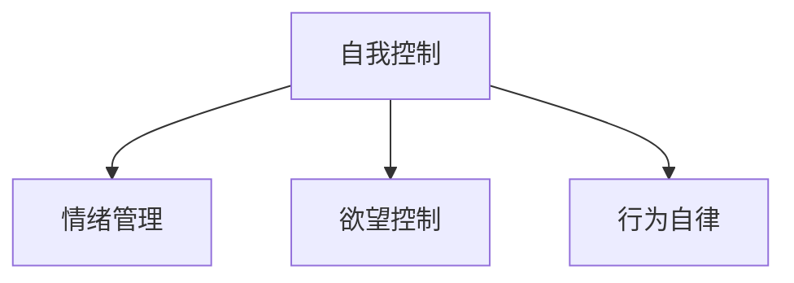
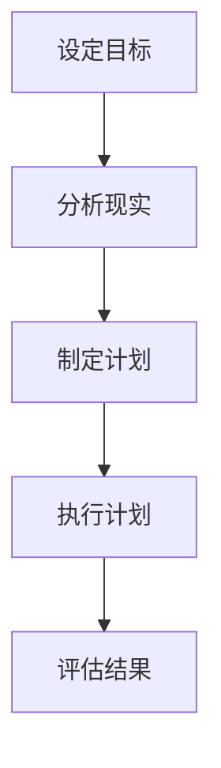
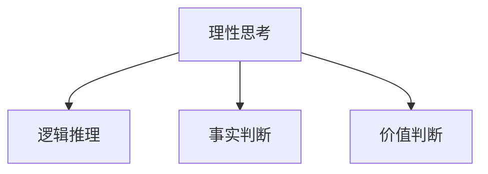
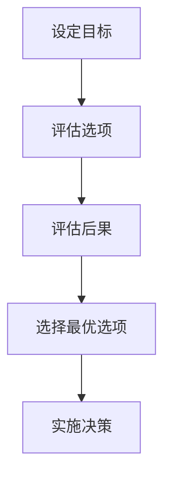
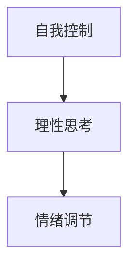
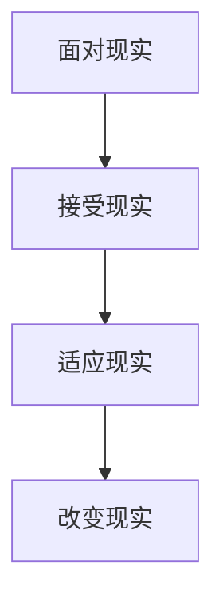

                 

# 新Stoicism实践：古老智慧的现代应用

> 关键词：Stoicism、自我控制、理性思考、决策分析、现代应用

> 摘要：本文探讨了Stoicism这一古老哲学体系在现代社会中的新应用。通过对Stoicism核心原则的剖析，如自我控制、理性思考等，以及这些原则在情绪管理、决策分析等实际场景中的应用，展示了Stoicism如何帮助现代人在复杂多变的情境中实现心理平衡和明智决策。

## 引言

### Stoicism的基本概念和历史背景

Stoicism，即斯多葛主义，起源于古希腊哲学，由芝诺（Zeno of Citium）于公元前3世纪创立。Stoicism主张通过自我控制和理性思考来追求内心的平静与和谐，其核心理念包括接受现实、保持冷静、自我控制等。这种哲学体系在罗马帝国时期达到了繁荣，对后来的欧洲哲学、伦理学和心理学产生了深远影响。

### Stoicism的核心原则

Stoicism的核心原则主要包括自我控制、理性思考、接受现实等。自我控制强调个人对情绪、欲望和行为的自律，理性思考则强调通过逻辑和证据来指导决策和行为，接受现实则强调接受生活中的不可控因素，专注于可以控制和改变的事情。

### Stoicism在现代社会中的应用

在现代社会，Stoicism依然具有重要的应用价值。它可以帮助人们应对压力、焦虑和挫折，培养积极的心态，提高生活质量。同时，Stoicism的理性思考原则也在商业、管理、教育和科技等领域发挥着重要作用，帮助人们做出明智的决策。

## 第一章：Stoicism的核心原则

### 1.1 自我控制

#### 1.1.1 自我控制的定义与意义

自我控制，即自律，是指个人在面对各种情境时，能够有效地管理自己的情绪、欲望和行为。在Stoicism中，自我控制被视为实现内心平静和和谐的关键。

#### 1.1.1.1 自我控制的定义

自我控制可以理解为在情绪管理、欲望控制和行为自律三个方面进行自我约束和调节。

**Mermaid流程图**：



#### 1.1.1.2 自我控制的必要性

自我控制的必要性主要体现在以下几个方面：

1. **情绪管理**：有效地管理情绪，避免负面情绪对生活和工作产生负面影响。
2. **欲望控制**：避免过度追求物质和权力，保持内心的平静和满足。
3. **行为自律**：遵循社会规范和道德准则，保持良好的行为习惯。

#### 1.1.2 自我控制的实践方法

**理性思考**

理性思考是指通过逻辑和证据来指导决策和行为。在自我控制中，理性思考有助于人们更好地管理情绪、欲望和行为。

**Mermaid流程图**：



**接受现实**

接受现实是指在面对不可控因素时，学会接受并适应现实，专注于可以控制和改变的事情。

**Python源代码**：

```python
# 接受现实的代码实现
def accept_reality(situation):
    if situation == "失败":
        return "从失败中学习，继续前进"
    elif situation == "逆境":
        return "保持乐观态度，迎接挑战"
    else:
        return "珍惜现有资源，积极面对"
```

### 1.2 理性思考与决策

#### 1.2.1 理性思考的原理

理性思考是指通过逻辑和证据来指导决策和行为。在Stoicism中，理性思考被视为实现内心平静和明智决策的关键。

**Mermaid流程图**：



#### 1.2.2 理性思考的方法

理性思考的方法主要包括以下几个步骤：

1. **设定目标**：明确自己的目标，以便更好地制定决策。
2. **分析现实**：了解当前情境，分析问题的各个方面。
3. **制定计划**：根据目标和分析结果，制定可行的行动计划。
4. **执行计划**：按照计划实施行动，同时保持对结果的监控。
5. **评估结果**：对实施结果进行评估，以便进行调整和优化。

**Python源代码**：

```python
# 理性思考的代码实现
def rational_thinking(problem):
    if problem == "矛盾":
        return "通过逻辑推理，解决矛盾"
    elif problem == "不确定性":
        return "通过事实判断，降低不确定性"
    else:
        return "通过价值判断，做出最优决策"
```

### 1.3 决策分析

#### 1.3.1 决策分析的基本原理

决策分析是指通过对不同选项的评估和比较，选择最优方案的过程。

**Mermaid流程图**：



#### 1.3.2 决策分析的实践方法

决策分析的实践方法主要包括以下几个步骤：

1. **设定目标**：明确决策的目标，以便更好地评估选项。
2. **评估选项**：对每个选项进行评估，考虑其可能带来的后果。
3. **评估后果**：对每个选项的后果进行评估，考虑其可能带来的影响。
4. **选择最优选项**：根据评估结果，选择最优的选项。
5. **实施决策**：按照选定的选项实施决策，并对结果进行监控和评估。

## 第二章：Stoicism在现代社会中的应用

### 2.1 情绪管理

情绪管理是Stoicism在现代社会中的重要应用之一。通过自我控制和理性思考，人们可以更好地管理情绪，减少负面情绪的影响。

#### 2.1.1 情绪管理的原理

情绪管理是指通过自我控制和理性思考来调节情绪，使其保持平稳和积极。

**Mermaid流程图**：



#### 2.1.2 情绪管理的实践方法

情绪管理的实践方法主要包括以下几个步骤：

1. **自我控制**：学会控制情绪，避免情绪波动过大。
2. **理性思考**：通过理性思考，分析情绪的成因和影响，找到解决问题的方法。
3. **情绪调节**：采用适当的方法，如深呼吸、冥想、运动等，调节情绪，使其保持平稳和积极。

### 2.2 决策分析

决策分析是Stoicism在现代社会中的另一个重要应用。通过理性思考，人们可以更好地分析问题，做出明智的决策。

#### 2.2.1 决策分析的基本原理

决策分析是指通过对问题的分析和评估，选择最优方案的过程。

**Mermaid流程图**：


#### 2.2.2 决策分析的实践方法

决策分析的实践方法主要包括以下几个步骤：

1. **设定目标**：明确决策的目标，以便更好地评估选项。
2. **评估选项**：对每个选项进行评估，考虑其可能带来的后果。
3. **评估后果**：对每个选项的后果进行评估，考虑其可能带来的影响。
4. **选择最优选项**：根据评估结果，选择最优的选项。
5. **实施决策**：按照选定的选项实施决策，并对结果进行监控和评估。

### 2.3 生活哲学

Stoicism的生活哲学强调接受现实，专注于可以控制和改变的事情。这种哲学可以帮助人们应对生活中的挑战，保持内心的平静和和谐。

#### 2.3.1 接受现实的原理

接受现实是指在面对生活中的不可控因素时，学会接受并适应现实，专注于可以控制和改变的事情。

**Mermaid流程图**：



#### 2.3.2 接受现实的实践方法

接受现实的实践方法主要包括以下几个步骤：

1. **面对现实**：正视生活中的挑战和困境，不逃避。
2. **接受现实**：接受生活中的不可控因素，学会适应。
3. **适应现实**：调整自己的态度和行为，以适应现实的变化。
4. **改变现实**：在可能的情况下，努力改变现实，使其更加美好。

## 总结

Stoicism作为一种古老哲学体系，在现代社会中依然具有重要的应用价值。通过自我控制和理性思考，人们可以更好地管理情绪、做出明智的决策，并应对生活中的挑战。Stoicism的生活哲学也为我们提供了一种积极的生活态度，帮助我们保持内心的平静和和谐。让我们在日常生活中，尝试运用Stoicism的智慧，实现心理平衡和明智决策。

### 作者

作者：AI天才研究院/AI Genius Institute & 禅与计算机程序设计艺术 /Zen And The Art of Computer Programming

本文由AI天才研究院（AI Genius Institute）和禅与计算机程序设计艺术（Zen And The Art of Computer Programming）联合撰写，旨在分享Stoicism在现代生活中的新应用，帮助读者实现心理平衡和明智决策。如需进一步了解Stoicism，请参考相关拓展阅读。|}

